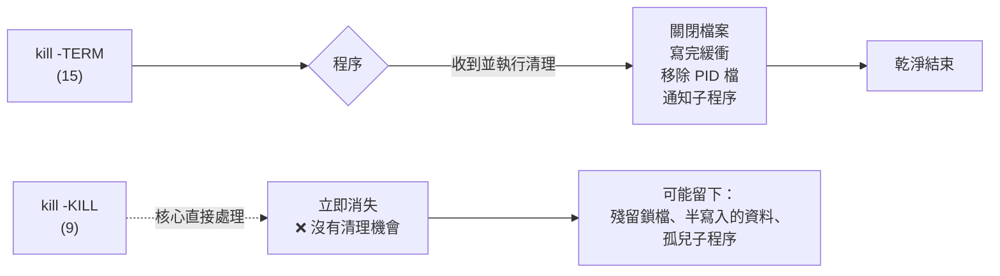

# 程序管理與訊號

> [!abstract] 這篇你會學到
> - 用 `ps` 與 `top` 找出「是誰吃掉了 CPU 和記憶體」
> - 分清楚 `SIGTERM`、`SIGKILL`、`SIGHUP` 的差別，知道**為什麼不該一律用 `kill -9`**
> - 讓長時間的工作在你斷線後繼續跑（`nohup`、`tmux`、`systemd-run`）
> - 讀懂程序狀態碼（`R` `S` `D` `Z` `T`），特別是**卡在 `D` 代表什麼**
> - 認識 OOM Killer——服務半夜莫名消失的常見兇手

## 前置知識

- [[03-終端機與Shell入門]]

---

## 觀念說明

### 程序、PID 與父子關係

執行中的程式叫**程序（process）**，每個都有唯一的 **PID**。
每個程序都由另一個程序產生，記錄在 **PPID**（parent PID），
形成一棵樹，根是 `PID 1`（現代系統是 `systemd`）。

```bash
pstree -p | head -20
```

```
systemd(1)─┬─systemd-journal(234)
           ├─systemd-udevd(267)
           ├─sshd(891)───sshd(1203)───sshd(1245)───bash(1246)───pstree(1301)
           ├─nginx(1420)─┬─nginx(1421)
           │             └─nginx(1422)
           └─mysqld(1533)───{mysqld}(1534)
```

從這棵樹可以直接讀出：你的 `bash` 是 SSH 連線開出來的，
Nginx 有一個 master 帶兩個 worker。

> [!tip] `pstree` 是理解服務架構最快的方式
> ```bash
> pstree -p nginx          # 只看 nginx 這一支
> pstree -u                # 顯示執行身分變化
> pstree -a                # 顯示完整指令列
> ```
> 排查「這個程序是誰啟動的」時，順著 PPID 往上找：
> ```bash
> ps -o pid,ppid,user,cmd -p 1533
> ps -o pid,ppid,user,cmd -p $(ps -o ppid= -p 1533)
> ```

### 訊號：跟程序溝通的方式

**訊號（signal）**是核心送給程序的通知。程序可以選擇如何回應，
但有兩個訊號無法被攔截或忽略：`SIGKILL` 和 `SIGSTOP`。

| 編號 | 名稱 | 意義 | 可被程序處理？ |
| --- | --- | --- | --- |
| 1 | `SIGHUP` | 終端機斷線 / **慣例：重新載入設定** | ✅ |
| 2 | `SIGINT` | 中斷（`Ctrl+C`） | ✅ |
| 3 | `SIGQUIT` | 離開並產生 core dump | ✅ |
| 9 | **`SIGKILL`** | **立即強制終止** | ❌ **不可攔截** |
| 15 | **`SIGTERM`** | **請你正常結束**（`kill` 預設） | ✅ |
| 18 | `SIGCONT` | 繼續執行 | ✅ |
| 19 | `SIGSTOP` | 暫停 | ❌ 不可攔截 |
| 20 | `SIGTSTP` | 暫停（`Ctrl+Z`） | ✅ |
| 10/12 | `SIGUSR1/2` | 由程式自訂用途 | ✅ |



> [!danger] 不要習慣性用 `kill -9`
> `SIGKILL` 讓核心直接抹除程序，**程式完全沒有機會做任何清理**：
>
> - 資料庫可能留下未寫入的交易，下次啟動要跑修復
> - 殘留 `.lock`、`.pid` 檔案，導致服務起不來
> - 子程序變成孤兒，繼續佔用資源
> - 暫存檔不會被刪除
>
> **正確順序**：
> ```bash
> kill 1234              # 1. 先送 SIGTERM，等 5～10 秒
> sleep 10
> kill -0 1234 2>/dev/null && kill -9 1234    # 2. 還在才用 SIGKILL
> ```
> （`kill -0` 不送訊號，只檢查程序是否存在與是否有權限）

> [!tip] `SIGHUP` 的兩種意義
> 歷史上 `SIGHUP` 是「終端機斷線」，所以你關掉 SSH 時，
> 底下的程序會收到 `SIGHUP` 而死掉（這就是 `nohup` 存在的原因）。
>
> 但**守護程序（daemon）沒有終端機**，所以慣例上把 `SIGHUP` 借來當
> 「**重新讀取設定檔**」的訊號：
> ```bash
> sudo kill -HUP $(cat /run/nginx.pid)      # Nginx 重載設定
> sudo systemctl reload nginx               # 等同上面，但更好
> ```
> 好處是**不中斷現有連線**——比 `restart` 溫和得多。

---

## 基礎操作

### `ps`：程序快照

`ps` 有兩套完全不同的參數風格，都能用：

```bash
ps aux              # BSD 風格（不加 -）
ps -ef              # System V 風格（加 -）
```

```bash
ps aux | head -5
```

```
USER  PID %CPU %MEM    VSZ   RSS TTY   STAT START   TIME COMMAND
root    1  0.0  0.4 168404 11284 ?     Ss   09:12   0:03 /sbin/init
root  891  0.0  0.2  15420  6120 ?     Ss   09:12   0:00 sshd: /usr/sbin/sshd -D
mike 1246  0.0  0.1   8912  4204 pts/0 Ss   10:33   0:00 -bash
mysql 1533  2.1 24.8 1892440 507112 ?  Ssl  09:13   1:42 /usr/sbin/mysqld
```

重要欄位：

| 欄位 | 意義 |
| --- | --- |
| `%CPU` | CPU 使用率（**自程序啟動以來的平均**，不是即時值） |
| `%MEM` | 佔實體記憶體百分比 |
| `VSZ` | 虛擬記憶體大小（含未實際使用的，通常很大不用緊張） |
| **`RSS`** | **實際佔用的實體記憶體（KB）** ← 看這個 |
| `STAT` | 程序狀態（見下方） |
| `TTY` | 所屬終端機（`?` 代表沒有，即守護程序） |
| `TIME` | 累計 CPU 時間 |

> [!warning] `ps` 的 `%CPU` 是平均值，不是即時值
> 一個跑了 10 小時、只有前 10 分鐘吃滿 CPU 的程序，
> `ps` 會顯示很低的 `%CPU`。**要看即時 CPU 用 `top` 或 `htop`。**

**自訂輸出欄位**（比 `ps aux | awk` 好用）：

```bash
ps -eo pid,ppid,user,%mem,rss,stat,etime,cmd --sort=-%mem | head
```

```
  PID  PPID USER     %MEM   RSS STAT     ELAPSED CMD
 1533     1 mysql    24.8 507112 Ssl   05:21:33 /usr/sbin/mysqld
 2104  1420 www-data  3.1  63248 S     02:11:07 nginx: worker process
```

常用排序與篩選：

```bash
ps -eo pid,user,%cpu,%mem,cmd --sort=-%cpu | head -10    # CPU 前 10
ps -eo pid,user,%cpu,%mem,cmd --sort=-%mem | head -10    # 記憶體前 10
ps -u mike                                                # 某使用者的程序
ps -C nginx -o pid,ppid,user,cmd                          # 依指令名稱
ps -f --forest                                            # 樹狀顯示
ps -eo pid,lstart,cmd | grep nginx                        # 精確啟動時間
```

### 程序狀態碼

`STAT` 欄位的第一個字元是主狀態：

| 狀態 | 意義 | 要注意嗎 |
| --- | --- | --- |
| `R` | 執行中或可執行 | 正常 |
| `S` | **可中斷睡眠**（等待事件） | 正常，大部分程序都是這個 |
| **`D`** | **不可中斷睡眠**（通常等 I/O） | ⚠ **卡在這裡代表 I/O 有問題** |
| `Z` | **殭屍**（已結束但父程序未回收） | ⚠ 大量出現代表程式有 bug |
| `T` | 已停止（`Ctrl+Z` 或 `SIGSTOP`） | 看情況 |
| `I` | 閒置的核心執行緒 | 正常 |

後面的字元是修飾符：`s` 階段領導者、`l` 多執行緒、`+` 前景工作、`<` 高優先權、`N` 低優先權。

> [!warning] `D` 狀態的程序連 `kill -9` 都殺不掉
> `D`（uninterruptible sleep）代表程序正在等核心完成 I/O，
> **在完成前它不接受任何訊號，包括 SIGKILL**。
>
> 常見原因：
> - 磁碟故障或極度繁忙
> - NFS / 網路磁碟失去連線
> - 硬體問題
>
> 排查：
> ```bash
> ps -eo pid,stat,wchan:30,cmd | awk '$2 ~ /D/'
> ```
> `wchan` 顯示它卡在哪個核心函式。
>
> 解法通常是修好底層 I/O（重新掛載 NFS、換磁碟），
> 或者只能重開機。見 [[03-資源診斷工具集]] 與 [[15-磁碟分割與掛載]]。

> [!tip] 殭屍程序不佔資源，但代表有 bug
> 殭屍（`Z`）只佔一個 PID 項目，不佔記憶體或 CPU。
> 它的存在代表**父程序沒有正確呼叫 `wait()` 回收子程序**。
>
> ```bash
> ps -eo pid,ppid,stat,cmd | awk '$3 ~ /Z/'
> ```
> **殺不掉殭屍**（它已經死了）。要清掉就得處理它的父程序：
> ```bash
> kill -CHLD <PPID>       # 提醒父程序回收（通常沒用）
> kill <PPID>             # 父程序死掉後，殭屍會被 PID 1 收養並清理
> ```
> 容器裡特別常見——因為 PID 1 常常是應用程式本身，
> 而應用程式通常沒寫回收邏輯。解法是用 `--init` 或 `tini`，
> 見 [[07-Docker-資源限制與日誌]]。

### `top`：即時監看

```bash
top
```

```
top - 15:02:11 up 5:50,  2 users,  load average: 0.52, 0.48, 0.44
Tasks: 142 total,   2 running, 140 sleeping,   0 stopped,   0 zombie
%Cpu(s):  3.2 us,  1.1 sy,  0.0 ni, 95.4 id,  0.3 wa,  0.0 hi,  0.0 si,  0.0 st
MiB Mem :   1998.8 total,    142.3 free,    891.2 used,    965.3 buff/cache
MiB Swap:   2048.0 total,   1892.0 free,    156.0 used.    942.1 avail Mem

  PID USER      PR  NI    VIRT    RES    SHR S  %CPU  %MEM     TIME+ COMMAND
 1533 mysql     20   0 1892440 507112  18244 S   2.3  24.8   1:42.18 mysqld
 1420 root      20   0   55240   3120   1892 S   0.0   0.2   0:00.12 nginx
```

**`top` 裡最重要的三個數字**：

| 位置 | 意義 |
| --- | --- |
| `load average: 0.52, 0.48, 0.44` | 1 / 5 / 15 分鐘平均負載 |
| `%Cpu(s): ... 0.3 wa` | **`wa` = I/O 等待，持續 >10% 代表磁碟是瓶頸** |
| `MiB Swap: ... 156.0 used` | **swap 有在用代表記憶體不足** |

> [!tip] load average 怎麼解讀
> load average 是「可執行 + 不可中斷等待」的程序平均數量，
> **要和 CPU 核心數比較**：
>
> ```bash
> nproc          # 幾核心
> uptime         # load average
> ```
>
> | 核心數 | load | 判讀 |
> | --- | --- | --- |
> | 4 | 1.0 | 很閒（25% 使用） |
> | 4 | 4.0 | 剛好滿載 |
> | 4 | 8.0 | **過載，程序在排隊** |
>
> **重要**：Linux 的 load 包含等待 I/O 的程序（`D` 狀態），
> 所以 load 高不一定是 CPU 忙，也可能是磁碟卡住。
> 要看 `%Cpu(s)` 的 `wa` 欄位來區分。

`top` 的互動按鍵：

| 按鍵 | 作用 |
| --- | --- |
| `P` | 依 CPU 排序 |
| `M` | 依記憶體排序 |
| `T` | 依累計 CPU 時間排序 |
| `1` | 展開每個 CPU 核心 |
| `c` | 顯示完整指令列 |
| `u` | 只看某使用者 |
| `k` | 終止程序（會問 PID 與訊號） |
| `e` / `E` | 切換記憶體單位 |
| `H` | 顯示執行緒 |
| `W` | 儲存目前設定到 `~/.toprc` |
| `q` | 離開 |

> [!tip] 用 `htop` 取代 `top`
> ```bash
> sudo apt install -y htop
> ```
> 彩色、可捲動、滑鼠可點、直接按 `F9` 送訊號、`F5` 樹狀檢視。
> 完整說明見 [[01-htop-操作與判讀]] 與 [[02-btop-操作與設定]]。

### 終止程序

```bash
kill 1234                    # 送 SIGTERM（預設）
kill -TERM 1234              # 同上，明確寫出
kill -HUP 1234               # 重載設定
kill -9 1234                 # SIGKILL（最後手段）
kill -0 1234                 # 不送訊號，只檢查是否存在
kill -l                      # 列出所有訊號
```

依名稱操作：

```bash
pgrep nginx                  # 找出 PID
pgrep -a nginx               # 連指令列一起顯示
pgrep -u mike                # 某使用者的程序
pkill nginx                  # 依名稱終止
pkill -u mike                # 終止某使用者的所有程序
pkill -f "python.*worker"    # 依完整指令列比對
killall nginx                # 依名稱終止（精確比對）
```

> [!danger] `pkill -f` 的比對範圍很廣，先用 `pgrep -f` 確認
> ```bash
> pgrep -af "python"        # 先看會命中哪些
> pkill -f "python"         # 確認無誤才執行
> ```
> `-f` 會比對整個指令列，`pkill -f python` 可能連你自己的
> `grep python` 都殺掉，甚至誤傷不相干的服務。

> [!tip] 服務請用 `systemctl`，不要直接 `kill`
> ```bash
> sudo systemctl stop nginx        # ✓ 走完整的停止流程
> sudo pkill nginx                 # ✗ systemd 會以為它異常退出並可能自動重啟
> ```
> 直接 kill 由 systemd 管理的服務，會讓 systemd 的狀態與現實不一致，
> 而且如果設了 `Restart=always`，它會馬上被拉起來，你會覺得「殺不死」。
> 見 [[17-systemd服務管理]]。

### 優先權：`nice` 與 `renice`

優先權範圍 `-20`（最高）到 `19`（最低），預設 `0`。

```bash
nice -n 10 tar czf backup.tar.gz /data     # 用低優先權啟動
renice -n 10 -p 1234                        # 調整執行中的程序
renice -n 10 -u backup                      # 調整某使用者的所有程序
```

> [!warning] 只有 root 能提高優先權
> 一般使用者只能把 nice 值**調高**（降低優先權），不能調低。
> 這是防止使用者搶佔系統資源。

> [!tip] I/O 優先權比 CPU 優先權更常用
> 備份、壓縮這類工作真正的瓶頸通常是磁碟而不是 CPU。
> 用 `ionice` 才有效：
> ```bash
> ionice -c 3 nice -n 19 tar czf /backup/data.tar.gz /data
> ```
> | `-c` | 類別 |
> | --- | --- |
> | 1 | Realtime（需 root） |
> | 2 | Best-effort（預設，可再加 `-n 0-7`） |
> | **3** | **Idle — 只在磁碟閒置時才做** |
>
> 這個組合能讓夜間備份幾乎不影響線上服務。

---

## 進階用法：前景、背景與斷線存活

### 工作控制（job control）

```bash
sleep 300 &          # 直接在背景啟動
jobs                 # 列出目前 shell 的工作
```

```
[1]+  Running                 sleep 300 &
```

```bash
fg %1                # 調到前景
bg %1                # 讓已暫停的工作在背景繼續
kill %1              # 用工作編號終止
```

`Ctrl+Z` 把前景工作暫停並丟到背景：

```bash
vim large.conf
# 按 Ctrl+Z
[1]+  Stopped                 vim large.conf
grep something /etc/other.conf
fg               # 回到 vim
```

> [!tip] 這是「編輯到一半需要查東西」的標準流程
> 不用開新終端機，`Ctrl+Z` → 查資料 → `fg` 回去繼續。

### 斷線後繼續執行

**問題**：SSH 斷線時，shell 會對它的子程序送 `SIGHUP`，程序就死了。

**四種解法**，由簡到好：

```bash
# 1. nohup：忽略 SIGHUP，輸出導到 nohup.out
nohup ./long-job.sh > /var/log/job.log 2>&1 &

# 2. disown：已經啟動了才想起來
./long-job.sh &
disown -h %1        # 把它從 shell 的工作表移除

# 3. setsid：讓它脫離目前的 session
setsid ./long-job.sh > /var/log/job.log 2>&1 &

# 4. tmux / screen：最推薦
tmux new -s backup
./long-job.sh
# 按 Ctrl+B 然後 D 卸離；之後 tmux attach -t backup 接回來
```

> [!tip] 為什麼 `tmux` 是最好的選擇
> `nohup` 只能「讓它繼續跑」，你**看不到輸出、不能互動**。
> `tmux` 讓你隨時接回去看進度、輸入指令、開多個視窗。
>
> 執行任何超過幾分鐘的工作（大型升級、資料庫遷移、大檔傳輸）
> **先開 tmux**。這個習慣會在某次斷線時救你一命。
> 見 [[01-tmux-工作階段管理]]。

> [!tip] 真正的長期工作交給 systemd
> 對於「應該一直跑」的東西，`nohup` 和 `tmux` 都不對——
> 重開機就沒了。用 `systemd-run` 或寫成正式的 unit：
> ```bash
> # 臨時：交給 systemd 管理，斷線與登出都不影響
> sudo systemd-run --unit=my-migration \
>      --property=Type=oneshot \
>      /usr/local/bin/migrate.sh
>
> sudo journalctl -u my-migration -f      # 看進度
> sudo systemctl status my-migration
> ```
> 見 [[17-systemd服務管理]]。

### OOM Killer：服務半夜消失的兇手

當記憶體耗盡時，核心會挑一個程序殺掉來釋放記憶體。
**被殺的通常是佔記憶體最多的那個**——往往正是你的資料庫。

```bash
# 檢查是否發生過
sudo dmesg -T | grep -i -E "out of memory|oom.kill"
sudo journalctl -k --since "1 day ago" | grep -i oom
```

```
[Wed Aug 27 03:14:22 2026] Out of memory: Killed process 1533 (mysqld)
total-vm:1892440kB, anon-rss:1421088kB, file-rss:0kB, shmem-rss:0kB
```

> [!warning] 服務「莫名其妙不見了」先查 OOM
> 症狀是：服務在半夜停止、日誌裡沒有正常關閉的訊息、
> `systemctl status` 顯示 `Killed`（訊號 9）。
>
> 這幾乎一定是 OOM Killer。查 `dmesg` 就能確認。

調整某個程序被殺的機率：

```bash
# oom_score_adj 範圍 -1000（永不殺）到 1000（優先殺）
cat /proc/1533/oom_score_adj
echo -500 | sudo tee /proc/1533/oom_score_adj
```

在 systemd unit 裡設定（重開機也有效）：

```ini
[Service]
OOMScoreAdjust=-500
MemoryMax=1G          # 限制上限，超過就殺這個服務而不影響全機
```

> [!tip] 長期解法不是調 oom_score，是給夠記憶體或加 swap
> ```bash
> free -h                      # 看實際用量
> sudo swapon --show           # 有沒有 swap
> ```
> 小記憶體 VPS 建議加 1～2GB swap 當緩衝，見 [[15-磁碟分割與掛載]]。

> [!info]- Rocky / AlmaLinux（RHEL 系）對照
> `ps`、`top`、`kill`、`nice` 完全相同。差異：
>
> | 項目 | Debian / Ubuntu | RHEL 系 |
> | --- | --- | --- |
> | `htop` | `apt install htop` | `dnf install htop`（需 EPEL 或已內建） |
> | `pstree` | `psmisc` 套件 | `psmisc` 套件 |
> | 核心日誌 | `dmesg` / `journalctl -k` | 相同 |
> | OOM 紀錄 | `/var/log/kern.log` | `/var/log/messages` |
>
> RHEL 系啟用 SELinux 時，某些程序被「拒絕」的行為可能不是權限問題，
> 而是 SELinux。程序莫名無法存取檔案時，除了看 `ps` 也要看：
> ```bash
> sudo ausearch -m avc -ts recent
> ```

---

## 完整實戰範例：CPU 飆到 100%，找出兇手

```bash
# 1. 先確認整體狀況
uptime
```

```
 15:22:41 up 6:10,  2 users,  load average: 8.42, 6.11, 3.20
```

負載 8.42，先確認核心數：

```bash
nproc
```

```
2
```

2 核心而 load 8.42 → **嚴重過載**。

```bash
# 2. 是 CPU 忙還是 I/O 卡住？
top -bn1 | head -5
```

```
%Cpu(s): 12.1 us,  3.2 sy,  0.0 ni,  4.3 id, 80.1 wa,  0.0 hi,  0.3 si
```

`wa` 高達 80.1% → **不是 CPU 忙，是磁碟 I/O 卡住**。

```bash
# 3. 找出卡在 I/O 的程序
ps -eo pid,stat,wchan:25,user,cmd | awk 'NR==1 || $2 ~ /D/'
```

```
  PID STAT WCHAN                     USER     CMD
 3421 D    wait_on_page_writeback    mysql    /usr/sbin/mysqld
 3890 D    io_schedule               backup   tar czf /backup/full.tar.gz /var
```

```bash
# 4. 確認是哪個程序在做 I/O
sudo iotop -oPa      # -o 只顯示有 I/O 的，-P 只顯示程序，-a 累計
```

```
    PID  USER      DISK READ  DISK WRITE  COMMAND
   3890  backup     0.00 B/s  142.31 M/s  tar czf /backup/full.tar.gz /var
```

備份工作把磁碟吃滿了。

```bash
# 5. 降低它的 I/O 優先權，而不是殺掉它
sudo ionice -c 3 -p 3890
sudo renice -n 19 -p 3890

# 6. 確認狀況改善
watch -n 2 'uptime; top -bn1 | head -3'
```

```bash
# 7. 長期解法：修改備份腳本
# 原本
tar czf /backup/full.tar.gz /var
# 改成
ionice -c 3 nice -n 19 tar czf /backup/full.tar.gz /var
```

> [!tip] 這個流程的關鍵是第 2 步
> **先分辨是 CPU 問題還是 I/O 問題**，兩者的處理方式完全不同。
> `top` 的 `wa` 欄位就是分水嶺：
>
> | 症狀 | 判讀 | 下一步 |
> | --- | --- | --- |
> | `us` 高、`wa` 低 | CPU 密集 | `top -P` 找程序、看是否可優化或加核心 |
> | `sy` 高 | 系統呼叫過多 | `strace` 追蹤、可能是程式 bug |
> | **`wa` 高** | **I/O 瓶頸** | `iotop`、檢查磁碟健康、`ionice` |
> | `id` 高但 load 高 | 大量 `D` 狀態程序 | 磁碟或網路儲存有問題 |
>
> 完整方法論見 [[04-效能瓶頸排查方法論]]。

---

## 常見錯誤與排錯

| 現象 | 原因 | 解法 |
| --- | --- | --- |
| `kill -9` 也殺不掉 | 程序在 `D`（不可中斷）狀態 | 修復底層 I/O；`ps -eo stat,wchan` 查卡在哪；可能只能重開機 |
| 殺掉後馬上又出現 | systemd 的 `Restart=` 自動拉起 | 用 `systemctl stop` 而不是 `kill` |
| `kill` 說 `Operation not permitted` | 不是你的程序 | 用 `sudo` |
| SSH 斷線後工作就死了 | 收到 `SIGHUP` | 用 `tmux`、`nohup` 或 `systemd-run` |
| 服務半夜自己停止 | OOM Killer | `dmesg -T \| grep -i oom`；加記憶體或 swap |
| 大量殭屍程序 | 父程序未回收子程序 | 處理父程序；容器用 `--init` |
| `ps aux` 的 `%CPU` 看起來不對 | 那是**平均值**不是即時值 | 用 `top` / `htop` 看即時 |
| `VSZ` 顯示好幾 GB 但記憶體沒滿 | 虛擬記憶體含未實際使用的 | 看 `RSS` 才是實際佔用 |
| `pkill -f xxx` 殺到不該殺的 | `-f` 比對整個指令列 | 先用 `pgrep -af` 確認 |
| load 很高但 CPU 很閒 | 大量程序卡在 I/O 等待 | 看 `top` 的 `wa`；用 `iotop` |
| `nohup` 的輸出找不到 | 預設寫到 `./nohup.out` | 明確導向：`> /var/log/x.log 2>&1` |
| 背景工作看不到輸出 | 輸出仍綁在原終端機 | 用 `tmux`，或把輸出導向檔案再 `tail -F` |

---

## 安全性注意事項

> [!warning] `ps` 的輸出所有人都看得到
> ```bash
> ps aux | grep mysql
> ```
> ```
> mike 4102 ... mysql -u root -pMySecretPassword
> ```
> **指令列參數對系統上所有使用者可見**。
> 把密碼寫在指令列，等於公開給每個能登入這台機器的人。
>
> 正確做法：
> - 互動輸入：`mysql -u root -p`
> - 設定檔：`~/.my.cnf`（權限 `600`）
> - 環境變數：仍可被同使用者的 `/proc/PID/environ` 讀到，比指令列好但不完美
> - 見 [[10-機密管理與金鑰保護]]

> [!tip] 隱藏其他使用者的程序
> 掛載 `/proc` 時加上 `hidepid=2`，讓使用者只看得到自己的程序：
> ```bash
> # /etc/fstab
> proc /proc proc defaults,hidepid=2,gid=adm 0 0
> ```
> `gid=adm` 讓 `adm` 群組成員仍能看到全部（維運需要）。
> 這是 CIS Benchmark 與 TWGCB 的建議項目之一。

> [!warning] 別讓服務用 root 執行
> ```bash
> ps -eo user,cmd | awk '$1 == "root"' | grep -vE "^root +\[" | head -20
> ```
> 檢查有哪些服務在用 root 跑。Nginx、MySQL 這類服務
> 通常只有 master 需要 root（為了綁 <1024 的埠），worker 應該降權。
> 自己寫的服務更要用專屬帳號，見 [[09-使用者與群組管理]]。

---

## 速查表

### 查看

| 指令 | 說明 |
| --- | --- |
| `ps aux` / `ps -ef` | 所有程序 |
| `ps -eo pid,user,%cpu,%mem,stat,cmd --sort=-%mem` | **自訂欄位並排序** |
| `ps -u <使用者>` / `ps -C <指令>` | 依使用者 / 依指令名 |
| `pstree -p` | 樹狀關係 |
| `pgrep -af <樣式>` | 找 PID（含指令列） |
| `top` / `htop` | 即時監看 |
| `uptime` | load average |
| `nproc` | CPU 核心數 |

### 訊號

| 指令 | 說明 |
| --- | --- |
| `kill <PID>` | SIGTERM（**預設，優先用這個**） |
| `kill -HUP <PID>` | 重載設定 |
| `kill -9 <PID>` | SIGKILL（**最後手段**） |
| `kill -0 <PID>` | 只檢查存在與權限 |
| `pkill <名稱>` / `pkill -f <樣式>` | 依名稱 / 依指令列 |
| `pkill -u <使用者>` | 終止某使用者所有程序 |
| `kill -l` | 列出所有訊號 |

### 工作控制

| 指令 | 說明 |
| --- | --- |
| `cmd &` | 背景執行 |
| `Ctrl+Z` | 暫停並丟背景 |
| `jobs` / `fg %1` / `bg %1` | 列出 / 調前景 / 背景繼續 |
| `nohup cmd > log 2>&1 &` | 忽略 SIGHUP |
| `disown -h %1` | 移出 shell 工作表 |
| `tmux new -s name` | **推薦：可接回的工作階段** |
| `systemd-run --unit=x cmd` | 交給 systemd 管理 |

### 優先權

| 指令 | 說明 |
| --- | --- |
| `nice -n 10 cmd` | 低 CPU 優先權啟動 |
| `renice -n 10 -p <PID>` | 調整執行中的程序 |
| `ionice -c 3 cmd` | **Idle I/O 優先權（備份必用）** |
| `ionice -c 3 -p <PID>` | 調整執行中的 I/O 優先權 |

### 狀態碼

| 碼 | 意義 |
| --- | --- |
| `R` / `S` | 執行中 / 睡眠（正常） |
| **`D`** | **不可中斷（I/O 卡住）** |
| `Z` | 殭屍 |
| `T` | 已停止 |

---

## 練習題

> [!question]- 練習 1：親眼看 SIGTERM 與 SIGKILL 的差別
> 寫一個會攔截 SIGTERM 做清理的腳本，分別用 `kill` 與 `kill -9` 終止它。
>
> **解答**
>
> ```bash
> cat > /tmp/cleanup-demo.sh <<'EOS'
> #!/usr/bin/env bash
> cleanup() {
>     echo "$(date +%T) 收到 SIGTERM，正在清理……"
>     rm -f /tmp/demo.lock
>     echo "$(date +%T) 清理完成，正常結束"
>     exit 0
> }
> trap cleanup TERM
>
> touch /tmp/demo.lock
> echo "$(date +%T) 啟動，PID=$$，鎖檔已建立"
> while true; do sleep 1; done
> EOS
> chmod +x /tmp/cleanup-demo.sh
> ```
>
> **測試 SIGTERM**：
> ```bash
> /tmp/cleanup-demo.sh &
> sleep 2
> kill %1
> sleep 1
> ls /tmp/demo.lock
> ```
> ```
> 15:40:01 啟動，PID=5120，鎖檔已建立
> 15:40:03 收到 SIGTERM，正在清理……
> 15:40:03 清理完成，正常結束
> ls: cannot access '/tmp/demo.lock': No such file or directory    ← 鎖檔已清除 ✓
> ```
>
> **測試 SIGKILL**：
> ```bash
> /tmp/cleanup-demo.sh &
> sleep 2
> kill -9 %1
> sleep 1
> ls -l /tmp/demo.lock
> ```
> ```
> 15:41:12 啟動，PID=5188，鎖檔已建立
> [1]+  Killed                  /tmp/cleanup-demo.sh
> -rw-r--r-- 1 mike mike 0  8月 27 15:41 /tmp/demo.lock    ← 鎖檔殘留！✗
> ```
>
> **這就是為什麼不該習慣性用 `-9`**。殘留的鎖檔會讓服務下次啟動時
> 誤判「已經有一個實例在跑」而拒絕啟動——這是實務上很常見的故障。

> [!question]- 練習 2：找出並處理 I/O 瓶頸
> 製造一個 I/O 密集的工作，觀察它對系統的影響，並用 `ionice` 緩解。
>
> **解答**
>
> ```bash
> # 製造 I/O 壓力（會寫 1GB，做完自己刪）
> dd if=/dev/zero of=/tmp/iotest bs=1M count=1024 oflag=direct &
>
> # 另一個終端機觀察
> top -bn1 | head -5           # 看 wa 欄位飆高
> ps -eo pid,stat,wchan:25,cmd | awk 'NR==1 || $2 ~ /D/'
> sudo iotop -oPa              # 需先 apt install iotop
> ```
>
> ```
> %Cpu(s):  1.2 us,  8.1 sy,  0.0 ni, 15.2 id, 75.1 wa
>                                                ^^^^ I/O 等待很高
> ```
>
> 降低影響：
> ```bash
> DDPID=$(pgrep -f "dd if=/dev/zero")
> sudo ionice -c 3 -p "$DDPID"
> ionice -p "$DDPID"           # 確認
> ```
> ```
> idle
> ```
>
> 清理：
> ```bash
> kill "$DDPID"; rm -f /tmp/iotest
> ```
>
> **實務應用**：所有備份、壓縮、`rsync` 大量檔案的排程都該加上
> `ionice -c 3 nice -n 19`，避免影響線上服務。
> 見 [[02-rsync-同步與備份]] 與 [[03-備份策略與還原演練]]。

> [!question]- 練習 3：模擬 OOM 並確認紀錄
> 在**練習機**（不要在正式機！）上觸發 OOM Killer，並學會事後判讀。
>
> **解答**
>
> ```bash
> # ⚠ 只在可拋棄的練習機上做，可能導致系統短暫無回應
> # 先確認有快照可還原
>
> # 用 cgroup 限制範圍，比較安全
> sudo systemd-run --scope -p MemoryMax=100M --unit=oom-test \
>      bash -c 'a=(); while true; do a+=($(head -c 1M /dev/zero | tr "\0" "x")); done'
> ```
>
> 事後判讀：
> ```bash
> sudo dmesg -T | grep -i -E "out of memory|oom.kill" | tail -5
> sudo journalctl -k --since "10 minutes ago" | grep -i oom
> sudo systemctl status oom-test
> ```
> ```
> [Wed Aug 27 16:02:33 2026] Memory cgroup out of memory: Killed process 6201 (bash)
> total-vm:204800kB, anon-rss:102400kB
> ```
>
> **判讀重點**：
> - `Killed process <PID> (<名稱>)` — 誰被殺了
> - `anon-rss` — 被殺時佔用多少實體記憶體
> - `Memory cgroup out of memory` — 是 cgroup 限制觸發的（相對安全）
>   vs `Out of memory: Killed process` — 是**全系統**記憶體耗盡（嚴重）
>
> 這正是為什麼要用 systemd 的 `MemoryMax=` 限制服務：
> **讓失控的服務只殺死自己，而不是拖垮整台機器**。
> 見 [[17-systemd服務管理]] 與 [[07-Docker-資源限制與日誌]]。

---

## 小測驗

Q1. `SIGTERM` 與 `SIGKILL` 的差別？為什麼不該習慣性用 `kill -9`？
Q2. 對守護程序送 `SIGHUP` 慣例上代表什麼？`systemctl reload` 與它的關係？
Q3. `ps aux` 的 `%CPU` 為什麼可能誤導？要看即時值用什麼？
Q4. `VSZ` 很大但記憶體沒滿，該看哪一欄才是實際佔用？
Q5. 程序狀態 `D` 代表什麼？為什麼 `kill -9` 也殺不掉？怎麼查它卡在哪？
Q6. 殭屍程序佔資源嗎？殺得掉嗎？怎麼清？
Q7. load average 8.0 在 4 核機器上代表什麼？`top` 的 `wa` 高說明什麼？
Q8. 為什麼用 `systemctl stop` 而不是 `pkill` 停服務？
Q9. 備份工作最該調的是 `nice` 還是 `ionice`？指令？
Q10. 服務半夜消失、`status` 顯示 `Killed`，第一個該查的指令？

> [!question]- 測驗答案
> **Q1.** `TERM` 請程式自己結束（可清理）；`KILL` 核心直接抹除，無法攔截，會留下鎖檔、半寫入資料、孤兒子程序。先 `kill`，等幾秒，還在才 `-9`（見「訊號」）。
> **Q2.** 重新讀取設定檔（不中斷連線）；`systemctl reload` 通常就是送 `HUP` 或 unit 定義的 `ExecReload`。
> **Q3.** 它是程序啟動以來的平均值，不是即時；用 `top`/`htop`。
> **Q4.** `RSS`。
> **Q5.** 不可中斷睡眠（等 I/O）；完成前不接受任何訊號。`ps -eo pid,stat,wchan:30,cmd | awk '$2 ~ /D/'` 看 `wchan`；根因通常是磁碟或 NFS。
> **Q6.** 不佔記憶體/CPU，只佔 PID；它已經死了殺不掉；處理父程序（結束它讓 PID 1 收養清理）。容器用 `--init`。
> **Q7.** 嚴重過載，程序在排隊（load 要和核心數比）；`wa` 高代表瓶頸是磁碟 I/O 而非 CPU。
> **Q8.** 直接 kill 會讓 systemd 狀態與現實不一致，且 `Restart=` 會立刻拉起來，看起來像殺不死。
> **Q9.** `ionice`——備份瓶頸是磁碟；`ionice -c 3 nice -n 19 tar ...`。
> **Q10.** `sudo dmesg -T | grep -i -E "oom|out of memory"`——幾乎一定是 OOM Killer。

---

## 延伸閱讀

- [[11-輸入輸出重導向與管線]] — `2>&1`、背景執行的輸出處理
- [[17-systemd服務管理]] — 服務的正確啟停與資源限制
- [[01-htop-操作與判讀]] — 比 `top` 好用的即時監看
- [[03-資源診斷工具集]] — `iotop`、`vmstat`、`iostat`、`strace`
- [[04-效能瓶頸排查方法論]] — 系統化的排查流程
- [[01-tmux-工作階段管理]] — 斷線不中斷的正確做法
- `man 7 signal` / `man 1 ps` / `man 1 kill`
