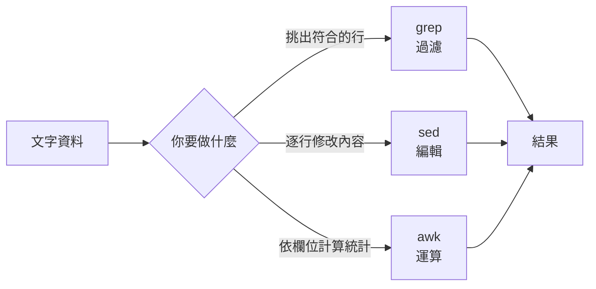

# 文字處理三劍客與檔案比對

> [!abstract] 這篇你會學到
> - 用一句話決定該用 `grep`、`sed` 還是 `awk`，不再每次都用最笨的方法
> - 用 `sed -i` 安全地批次修改設定檔（**含備份，避免改壞救不回來**）
> - 用 `awk` 從日誌算出統計數字，這是維運最常用的分析能力
> - 熟練 `cut` / `sort` / `uniq` / `tr` / `wc` 這些管線裡的黏著劑
> - 用 `diff` / `patch` / `comm` / `cmp` 比對檔案與產生修補檔

## 前置知識

- [[11-輸入輸出重導向與管線]]

---

## 觀念說明

### 三劍客的分工



| 工具 | 一句話 | 典型用途 |
| --- | --- | --- |
| **grep** | 「把符合的**行挑出來**」 | 找錯誤訊息、找設定寫在哪 |
| **sed** | 「逐行**做修改**」 | 批次改設定檔、去除註解、取代字串 |
| **awk** | 「依**欄位**做計算」 | 統計日誌、產生報表、複雜條件過濾 |

> [!tip] 選錯工具會讓事情複雜十倍
> - 只是要「找出含某字串的行」→ 用 `grep`，不要用 `awk '/x/'`
> - 要「取代字串」→ 用 `sed`，不要用 `awk` 硬幹
> - 要「加總第 5 欄」→ 用 `awk`，不要用 `grep | cut | while read` 迴圈
>
> 一個判斷法：**需要「記住前面看過什麼」或「算數」的時候才需要 awk**。

### 共通概念：正規表示式

三者都吃正規表示式，但方言略有不同：

| | 預設方言 | 切換方式 |
| --- | --- | --- |
| `grep` | BRE | `-E` → ERE，`-P` → PCRE |
| `sed` | BRE | `-E`（或 `-r`）→ ERE |
| `awk` | **ERE**（原生） | 無需切換 |

BRE 與 ERE 的差別只在**要不要跳脫**：

```bash
grep    "colou\?r"     file    # BRE：? 要跳脫
grep -E "colou?r"      file    # ERE：直接寫
sed     "s/a\+/X/g"    file    # BRE
sed -E  "s/a+/X/g"     file    # ERE
```

> [!tip] 一律加 `-E`，省去記憶負擔
> `grep -E`、`sed -E` 讓三個工具的方言一致，寫起來不用切換腦袋。

---

## 基礎操作

### `grep`：挑出行

基礎用法見 [[07-尋找檔案與內容]]。這裡補幾個進階技巧：

```bash
# 只輸出比對到的部分，不是整行
grep -oE '"[A-Z]+ [^"]*"' access.log | head

# 反向參照：找出重複的單字
grep -E '\b(\w+)\s+\1\b' article.txt

# PCRE 模式（支援 lookahead 等進階語法）
grep -P '(?<=user=)\w+' auth.log          # 取出 user= 後面的值
grep -P '^(?!#).*PermitRoot' sshd_config  # 排除註解行

# 從檔案讀取多個樣式
grep -F -f blocklist.txt access.log       # blocklist.txt 每行一個 IP

# 只顯示檔名與計數
grep -rc "ERROR" /var/log/myapp/ | grep -v ":0$"
```

> [!warning] `-P` 不是每台機器都有
> `grep -P` 需要編譯時啟用 PCRE 支援。GNU grep 通常有，
> 但 busybox、Alpine 容器裡的 grep 沒有。腳本要跨環境就避免 `-P`。
>
> 檢查：
> ```bash
> echo abc | grep -P 'a' >/dev/null 2>&1 && echo "支援 -P" || echo "不支援 -P"
> ```

### `sed`：逐行編輯

```
sed [選項] '[位址]指令' 檔案
```

**最常用的是取代**：

```bash
sed 's/舊/新/'      file      # 每行第一個
sed 's/舊/新/g'     file      # 每行全部（g = global）
sed 's/舊/新/2'     file      # 每行第二個
sed 's/舊/新/gi'    file      # 全部且不分大小寫
```

**位址：限定在哪些行動作**

```bash
sed '3s/a/b/'          file    # 只改第 3 行
sed '2,5s/a/b/'        file    # 第 2～5 行
sed '/^server/s/a/b/'  file    # 只改符合 ^server 的行
sed '$s/a/b/'          file    # 最後一行
sed '/start/,/end/d'   file    # 刪除 start 到 end 之間的所有行
```

**其他常用指令**

```bash
sed -n '10,20p'  file          # 只印第 10～20 行（-n 關閉自動輸出）
sed '/^#/d'      file          # 刪除註解行
sed '/^$/d'      file          # 刪除空行
sed -n '/error/p' file         # 等同 grep error
sed '2i\新增的行' file          # 在第 2 行「前」插入
sed '2a\新增的行' file          # 在第 2 行「後」附加
sed '2c\取代這行' file          # 取代第 2 行
sed 's/x/y/; s/a/b/' file      # 多個指令用 ; 分隔
sed -e 's/x/y/' -e 's/a/b/' file   # 或用多個 -e
```

**分隔符號可以換**——處理路徑時特別有用：

```bash
sed 's/\/var\/www/\/srv\/web/g'  file    # ✗ 難讀（俗稱 leaning toothpick syndrome）
sed 's|/var/www|/srv/web|g'      file    # ✓ 用 | 當分隔符號
sed 's#/var/www#/srv/web#g'      file    # ✓ 用 # 也可以
```

> [!danger] `sed -i` 就地修改，一定要先備份
> ```bash
> sed -i 's/old/new/g' /etc/nginx/nginx.conf        # ✗ 沒有退路
> sed -i.bak 's/old/new/g' /etc/nginx/nginx.conf    # ✓ 自動產生 nginx.conf.bak
> ```
> `-i.bak` 會把原檔存成 `nginx.conf.bak`。這一個字的成本，
> 換來改壞時能一行還原：
> ```bash
> sudo mv /etc/nginx/nginx.conf.bak /etc/nginx/nginx.conf
> ```

> [!tip] 改設定檔的標準三步驟
> ```bash
> # 1. 先不加 -i，看看會改成什麼樣
> sed 's/^#\?PermitRootLogin.*/PermitRootLogin no/' /etc/ssh/sshd_config | grep PermitRoot
>
> # 2. 確認無誤，加 -i 並帶備份
> sudo sed -i.bak-$(date +%F) 's/^#\?PermitRootLogin.*/PermitRootLogin no/' /etc/ssh/sshd_config
>
> # 3. 用該服務的設定檢查工具驗證，再重載
> sudo sshd -t && sudo systemctl reload ssh
> ```
> **第 1 步和第 3 步都不能省。**

> [!warning] `sed -i` 在 macOS 上參數不同
> GNU sed（Linux）：`sed -i.bak 's/x/y/' f`
> BSD sed（macOS）：`sed -i '.bak' 's/x/y/' f`（`-i` 後要有空格與引號）
>
> 寫跨平台腳本時這是常見的失敗點。Linux 專用腳本不用管。

### `awk`：依欄位運算

```
awk '模式 { 動作 }' 檔案
```

`awk` 自動把每行切成欄位：

| 變數 | 意義 |
| --- | --- |
| `$0` | 整行 |
| `$1` `$2` … | 第 1、2… 欄 |
| `$NF` | **最後一欄** |
| `$(NF-1)` | 倒數第二欄 |
| `NF` | 這行有幾欄 |
| `NR` | 目前是第幾行（累計） |
| `FNR` | 目前檔案的第幾行 |
| `FS` / `OFS` | 輸入 / 輸出欄位分隔符號 |

```bash
awk '{print $1}'            access.log     # 第 1 欄（IP）
awk '{print $NF}'           access.log     # 最後一欄
awk '{print $1, $9}'        access.log     # 逗號會產生空白
awk -F: '{print $1}'        /etc/passwd    # 用 : 當分隔符號
awk -F'\t' '{print $2}'     data.tsv       # Tab 分隔
awk 'NR==5'                 file           # 第 5 行
awk 'NR>=10 && NR<=20'      file           # 第 10～20 行
awk 'NF==0'                 file           # 空行
awk '{print NR": "$0}'      file           # 加行號
```

**模式過濾**：

```bash
awk '/error/'                  app.log      # 含 error 的行（等同 grep）
awk '$9 == 404'                access.log   # 第 9 欄等於 404
awk '$9 >= 500'                access.log   # 數值比較
awk '$9 ~ /^5/'                access.log   # 正規表示式比對
awk '$9 !~ /^[23]/'            access.log   # 不比對
awk -F: '$3 >= 1000'           /etc/passwd  # 一般使用者
awk 'length($0) > 200'         access.log   # 超長的行
```

**BEGIN / END 與運算**：

```bash
# 加總第 10 欄（回應大小）
awk '{sum += $10} END {print "總流量:", sum/1024/1024, "MB"}' access.log
```

```
總流量: 1842.31 MB
```

```bash
# 平均值
awk '{sum += $10; n++} END {printf "平均 %.2f bytes（共 %d 筆）\n", sum/n, n}' access.log
```

**陣列統計**——這是 `awk` 最強大的地方：

```bash
# 統計每個狀態碼出現幾次（不需要 sort | uniq -c）
awk '{count[$9]++} END {for (c in count) print count[c], c}' access.log | sort -rn
```

```
  38214 200
   4021 304
    892 404
     67 502
```

```bash
# 統計每個 IP 的流量總和
awk '{traffic[$1] += $10} END {for (ip in traffic) printf "%.1f MB  %s\n", traffic[ip]/1048576, ip}' \
    access.log | sort -rn | head -10
```

```bash
# 每小時的請求數
awk '{split($4, t, ":"); hour[t[2]]++} END {for (h in hour) print h, hour[h]}' access.log | sort -n
```

**格式化輸出**：

```bash
awk '{printf "%-20s %8.2f MB\n", $1, $10/1048576}' access.log | head
```

```
203.0.113.77             12.41 MB
198.51.100.4              3.88 MB
```

> [!tip] `awk` 的統計能力可以取代一整段管線
> ```bash
> # 傳統寫法：四個程序
> awk '{print $9}' access.log | sort | uniq -c | sort -rn
>
> # awk 一次搞定：一個程序，大檔案上快得多
> awk '{c[$9]++} END {for (k in c) print c[k], k}' access.log | sort -rn
> ```
> 資料量大時差異很明顯——`sort` 需要把全部資料排序，
> `awk` 的陣列只需要一次掃描。

---

## 進階用法：管線裡的黏著劑

### `cut`：切欄位（比 awk 輕量）

```bash
cut -d: -f1      /etc/passwd        # 用 : 分隔，取第 1 欄
cut -d: -f1,3,7  /etc/passwd        # 多欄
cut -d: -f3-     /etc/passwd        # 第 3 欄到最後
cut -c1-10       file               # 取每行第 1～10 個字元
cut -f2 --complement data.tsv       # 除了第 2 欄以外
```

> [!warning] `cut` 不會合併連續的分隔符號
> ```bash
> echo "a   b   c" | cut -d' ' -f2
> ```
> ```
>          ← 空的！因為第 2 欄是空字串
> ```
> ```bash
> echo "a   b   c" | awk '{print $2}'
> ```
> ```
> b        ← awk 預設把連續空白當一個分隔
> ```
> **處理以空白對齊的輸出（`ls -l`、`ps`、`df`）一律用 `awk`，不要用 `cut`。**
> `cut` 只適合分隔符號固定且不重複的資料（CSV、`/etc/passwd`）。

### `sort`：排序

```bash
sort file                    # 字典序
sort -n file                 # 數值排序
sort -rn file                # 數值反向
sort -h file                 # 人類可讀（1K < 1M < 1G）
sort -u file                 # 排序並去重
sort -k2 file                # 依第 2 欄排序
sort -k2,2 -k1,1 file        # 先第 2 欄，再第 1 欄
sort -t: -k3 -n /etc/passwd  # 用 : 分隔，依第 3 欄數值排序
sort -V file                 # 版本號排序（1.9 < 1.10）
sort -R file                 # 隨機排序
```

> [!tip] `-h` 與 `-V` 這兩個選項很多人不知道
> ```bash
> du -sh /var/* | sort -rh | head        # 依大小排序（1.2G > 890M）
> ls /boot | grep vmlinuz | sort -V      # 核心版本正確排序
> ```
> 沒有 `-h` 的話 `890M` 會排在 `1.2G` 前面（字典序 8 > 1）。

### `uniq`：去重與計數

```bash
sort file | uniq             # 去重（必須先排序！）
sort file | uniq -c          # 計數
sort file | uniq -d          # 只顯示重複的
sort file | uniq -u          # 只顯示不重複的
sort file | uniq -c | sort -rn   # 依出現次數排序 ← 最常用組合
```

### `tr`：字元轉換

```bash
tr 'a-z' 'A-Z'  < file       # 轉大寫
tr -d '\r'      < file       # 刪除 CR（修 CRLF）
tr -s ' '       < file       # 壓縮連續空白成一個
tr -c 'a-zA-Z' '\n' < file   # 非字母都換成換行（拆單字）
tr ':' '\n'     <<< "$PATH"  # 把 PATH 拆成一行一個
```

```bash
echo "$PATH" | tr ':' '\n'
```

```
/usr/local/sbin
/usr/local/bin
/usr/sbin
/usr/bin
```

> [!tip] `tr ':' '\n' <<< "$PATH"` 是檢查 PATH 的最快方法
> 一長串用冒號串起來的路徑很難看出問題，拆成一行一個立刻清楚，
> 也容易發現重複或不該存在的目錄。

### `wc`：計數

```bash
wc -l file          # 行數
wc -w file          # 字數
wc -c file          # 位元組
wc -m file          # 字元數（中文用這個）
```

> [!warning] `wc -l` 算的是「換行符號的數量」
> 最後一行沒有換行符號時會少算一行：
> ```bash
> printf 'a\nb' | wc -l
> ```
> ```
> 1        ← 明明有兩行
> ```
> 精確計數用 `grep -c ''` 或 `awk 'END {print NR}'`。

### 其他

```bash
paste f1 f2                  # 把兩個檔案並排合併（欄位）
join -t: -1 1 -2 1 a b       # 依鍵值合併（類似 SQL JOIN）
column -t                    # 對齊成表格
nl file                      # 加行號（比 cat -n 更多選項）
rev                          # 每行反轉
shuf -n 5 file               # 隨機取 5 行
```

```bash
# column -t 讓輸出對齊，很適合做報表
awk '{c[$9]++} END {for (k in c) print k, c[k]}' access.log | sort -rn -k2 | column -t
```

---

## 檔案比對：`diff`、`patch`、`cmp`、`comm`

### `diff`：找出兩個檔案的差異

```bash
diff old.conf new.conf              # 傳統格式
diff -u old.conf new.conf           # ✓ unified 格式（最常用、最好讀）
diff -y old.conf new.conf           # 並排顯示
diff -q old.conf new.conf           # 只說「有沒有差異」
diff -r dir1/ dir2/                 # 遞迴比較目錄
diff -w old new                     # 忽略空白差異
diff -i old new                     # 忽略大小寫
diff -B old new                     # 忽略空行
diff --color=always -u a b | less -R  # 彩色輸出
```

`-u` 的輸出格式：

```bash
diff -u nginx.conf.bak nginx.conf
```

```diff
--- nginx.conf.bak	2026-08-27 10:00:00.000000000 +0800
+++ nginx.conf	2026-08-27 17:22:14.000000000 +0800
@@ -12,7 +12,8 @@
     worker_connections 768;
 }

-client_max_body_size 2m;
+client_max_body_size 50m;
+client_body_timeout 60s;

 http {
```

| 符號 | 意義 |
| --- | --- |
| `---` / `+++` | 舊檔 / 新檔 |
| `@@ -12,7 +12,8 @@` | 舊檔第 12 行起 7 行 → 新檔第 12 行起 8 行 |
| `-` 開頭 | 只在舊檔有（被刪除） |
| `+` 開頭 | 只在新檔有（新增） |
| 空白開頭 | 兩邊都有（上下文） |

> [!tip] 三個維運上最實用的 diff 模式
> ```bash
> # 1. 改設定前後比對
> sudo diff -u /etc/nginx/nginx.conf.bak /etc/nginx/nginx.conf
>
> # 2. 只比「有效內容」，忽略註解與空行差異
> diff -u <(grep -vE '^\s*(#|$)' a.conf) <(grep -vE '^\s*(#|$)' b.conf)
>
> # 3. 比較兩台機器（見 [[11-輸入輸出重導向與管線]] 的行程替換）
> diff <(ssh web01 'sudo sshd -T | sort') <(ssh web02 'sudo sshd -T | sort')
> ```

> [!tip] `dpkg` 升級時保留的 `.dpkg-dist` 檔案
> 套件升級時如果你改過設定檔，`dpkg` 會保留新版為 `.dpkg-dist`
> （RHEL 是 `.rpmnew`）。用 `diff` 決定要不要合併：
> ```bash
> sudo find /etc -name "*.dpkg-dist" -o -name "*.dpkg-old" -o -name "*.rpmnew" -o -name "*.rpmsave"
> sudo diff -u /etc/ssh/sshd_config /etc/ssh/sshd_config.dpkg-dist
> ```
> **這是升級後該做卻常被忘記的檢查**，把它排進每月維護。

### `patch`：套用差異

```bash
# 產生修補檔
diff -u original.conf modified.conf > my-change.patch

# 套用
patch original.conf < my-change.patch

# 先試跑不實際修改
patch --dry-run original.conf < my-change.patch

# 還原
patch -R original.conf < my-change.patch

# 對整個目錄套用（-p1 表示去掉路徑的第一層）
patch -p1 -d /path/to/project < fix.patch
```

> [!tip] 用 patch 管理「對第三方設定的客製修改」
> 你改了廠商給的設定檔，之後廠商更新了原檔。
> 把你的修改存成 patch，就能重新套用到新版：
> ```bash
> diff -u vendor.conf.orig vendor.conf > our-changes.patch
> # 廠商給了新版 vendor.conf.v2
> cp vendor.conf.v2 vendor.conf
> patch --dry-run vendor.conf < our-changes.patch    # 先確認能不能套
> patch vendor.conf < our-changes.patch
> ```
> 套不上時會產生 `.rej` 檔案，裡面是失敗的片段，需要手動處理。

### `cmp`：二進位比對

```bash
cmp file1 file2                  # 找出第一個不同的位元組
cmp -s file1 file2 && echo "相同"  # -s 安靜模式，只看退出碼
cmp -l file1 file2 | head        # 列出所有不同的位元組
```

```bash
cmp /usr/bin/nginx /backup/nginx
```

```
/usr/bin/nginx /backup/nginx differ: byte 4132, line 18
```

> [!tip] 比對檔案是否相同，`cmp` 比 `diff` 快
> `diff` 要計算「差異在哪」，`cmp` 只要找到第一個不同就停。
> 只需要知道「一不一樣」時用 `cmp -s`。
>
> 但驗證備份完整性應該用雜湊值，可以跨機器比對：
> ```bash
> sha256sum original.tar.gz > checksum.txt
> sha256sum -c checksum.txt
> ```

### `comm`：比較兩份「已排序」的清單

```bash
comm file1 file2         # 三欄：只在 f1 / 只在 f2 / 兩者都有
comm -12 file1 file2     # 只顯示兩者都有的（交集）
comm -23 file1 file2     # 只在 file1 有的（差集）
comm -13 file1 file2     # 只在 file2 有的
```

```bash
# 比較兩台機器的套件清單
ssh web01 'dpkg-query -W -f="${Package}\n"' | sort > /tmp/web01.txt
ssh web02 'dpkg-query -W -f="${Package}\n"' | sort > /tmp/web02.txt

comm -23 /tmp/web01.txt /tmp/web02.txt      # web01 有但 web02 沒有
comm -13 /tmp/web01.txt /tmp/web02.txt      # web02 有但 web01 沒有
```

> [!warning] `comm` 要求兩個輸入都已排序
> 沒排序會得到錯誤結果且不一定報錯。永遠先 `sort`。

### `vimdiff`：互動式比對合併

```bash
vimdiff old.conf new.conf
```

| 按鍵 | 作用 |
| --- | --- |
| `]c` / `[c` | 下一個 / 上一個差異 |
| `do` | 把對面的內容拉過來（diff obtain） |
| `dp` | 把這邊的內容推過去（diff put） |
| `Ctrl+w w` | 切換視窗 |
| `:diffupdate` | 重新計算差異 |

> [!info]- Rocky / AlmaLinux（RHEL 系）對照
> `grep`、`sed`、`awk`、`diff`、`patch` 都是 GNU 版本，行為完全相同。差異：
>
> | 項目 | Debian / Ubuntu | RHEL 系 |
> | --- | --- | --- |
> | `patch` 套件 | 預設安裝 | **最小安裝可能沒有**：`dnf install patch` |
> | `column` | `bsdextrautils` | `util-linux` |
> | 升級保留的設定檔 | `.dpkg-dist` / `.dpkg-old` | **`.rpmnew` / `.rpmsave`** |
> | 查套件檔案 | `dpkg-query -W` | `rpm -qa` |
>
> RHEL 的設定檔升級行為與 Debian 相反：
> - `.rpmnew` — 你改過檔案，**新版被存成 `.rpmnew`**（你的版本仍生效）
> - `.rpmsave` — 你沒改過，**舊版被存成 `.rpmsave`**（新版直接覆蓋）
>
> 升級後檢查：
> ```bash
> sudo find /etc -name "*.rpmnew" -o -name "*.rpmsave"
> ```

---

## 完整實戰範例

### 情境一：從 Nginx 日誌產生一份完整分析報表

```bash
#!/usr/bin/env bash
# analyze-access-log.sh
set -euo pipefail

LOG="${1:-/var/log/nginx/access.log}"

echo "════════ Nginx 存取分析：$LOG ════════"
echo "分析時間：$(date '+%F %T')"
echo

echo "── 總覽 ──"
awk '{
    total++
    bytes += $10
    code[substr($9,1,1)"xx"]++
} END {
    printf "總請求數  : %d\n", total
    printf "總流量    : %.2f GB\n", bytes/1073741824
    printf "平均回應  : %.0f bytes\n", bytes/total
    printf "\n狀態碼分布：\n"
    for (c in code) printf "  %-5s %8d  (%.1f%%)\n", c, code[c], code[c]*100/total
}' "$LOG" | sort

echo
echo "── 請求數前 10 名 IP ──"
awk '{c[$1]++} END {for (i in c) print c[i], i}' "$LOG" \
  | sort -rn | head -10 | column -t

echo
echo "── 流量前 10 名 IP ──"
awk '{b[$1] += $10} END {for (i in b) printf "%.1f MB\t%s\n", b[i]/1048576, i}' "$LOG" \
  | sort -rn | head -10 | column -t

echo
echo "── 4xx 錯誤路徑前 10 名 ──"
awk '$9 ~ /^4/ {c[$7]++} END {for (p in c) print c[p], p}' "$LOG" \
  | sort -rn | head -10 | column -t

echo
echo "── 5xx 錯誤路徑（全部）──"
awk '$9 ~ /^5/ {c[$7" "$9]++} END {for (p in c) print c[p], p}' "$LOG" \
  | sort -rn | column -t

echo
echo "── 每小時請求數 ──"
awk '{split($4, t, ":"); h[t[2]]++} END {for (i in h) printf "%s:00  %6d  %s\n", i, h[i], substr("████████████████████████████████████████", 1, h[i]/50)}' "$LOG" \
  | sort -n

echo
echo "── 可疑活動：單一 IP 大量 404 ──"
awk '$9 == 404 {c[$1]++} END {for (i in c) if (c[i] > 50) print c[i], i}' "$LOG" \
  | sort -rn | column -t
```

執行結果：

```
════════ Nginx 存取分析：/var/log/nginx/access.log ════════
分析時間：2026-08-27 17:45:12

── 總覽 ──
總請求數  : 184213
總流量    : 12.41 GB
平均回應  : 72341 bytes

狀態碼分布：
  2xx     168920  (91.7%)
  3xx       9812  (5.3%)
  4xx       5014  (2.7%)
  5xx        467  (0.3%)

── 請求數前 10 名 IP ──
4821  203.0.113.77
1092  198.51.100.4

── 可疑活動：單一 IP 大量 404 ──
4102  203.0.113.77
```

> [!tip] 這種腳本的價值在「可重複」
> 每次出事都手打一次管線，你會忘記上次是怎麼查的。
> 寫成腳本並放進 `/usr/local/bin`，下次三秒就有完整報表，
> 也能排進每日維護自動產出。見 [[04-GoAccess-進階分析與排程]]。

### 情境二：批次修改多台機器的設定

```bash
#!/usr/bin/env bash
# harden-sshd.sh — 安全地批次調整 sshd 設定
set -euo pipefail

CONF=/etc/ssh/sshd_config
BAK="$CONF.bak-$(date +%F-%H%M)"

# 1. 備份
sudo cp -a "$CONF" "$BAK"
echo "已備份至 $BAK"

# 2. 定義要調整的設定（項目=值）
declare -A SETTINGS=(
    [PermitRootLogin]="no"
    [PasswordAuthentication]="no"
    [PermitEmptyPasswords]="no"
    [X11Forwarding]="no"
    [MaxAuthTries]="3"
    [ClientAliveInterval]="300"
    [ClientAliveCountMax]="2"
)

# 3. 逐項套用：有就改，沒有就加
for key in "${!SETTINGS[@]}"; do
    val="${SETTINGS[$key]}"
    if grep -qE "^\s*#?\s*${key}\b" "$CONF"; then
        # 存在（含被註解的）→ 取代
        sudo sed -i -E "s|^\s*#?\s*${key}\b.*|${key} ${val}|" "$CONF"
        echo "  已修改 ${key} ${val}"
    else
        # 不存在 → 附加
        echo "${key} ${val}" | sudo tee -a "$CONF" > /dev/null
        echo "  已新增 ${key} ${val}"
    fi
done

# 4. 顯示差異供人工確認
echo
echo "── 變更內容 ──"
sudo diff -u "$BAK" "$CONF" || true

# 5. 語法檢查（失敗就自動還原）
echo
if sudo sshd -t; then
    echo "✅ 語法檢查通過"
else
    echo "❌ 語法錯誤，自動還原" >&2
    sudo cp -a "$BAK" "$CONF"
    exit 1
fi

# 6. 提醒人工重載（不自動做，避免把自己鎖在外面）
echo
echo "確認上方差異無誤後，執行："
echo "  sudo systemctl reload ssh"
echo "並在【另一個終端機】測試新連線成功後，才關掉目前這條連線。"
```

> [!danger] 為什麼腳本不自動 reload
> 因為改壞 SSH 設定會把自己鎖在門外。
> **自動化到「產生差異並通過語法檢查」為止，最後一步留給人**。
> 這個原則適用於所有會影響遠端存取的設定。
> 見 [[02-實驗環境準備與初次登入]] 的「保留一條退路」。

### 情境三：清理設定檔，只看有效內容

```bash
# 去掉註解、空行、行尾空白
grep -vE '^\s*(#|;|$)' /etc/nginx/nginx.conf | sed 's/[[:space:]]*$//'

# 做成別名，之後常用
alias effective="grep -vE '^\s*(#|;|\$)'"
effective /etc/php/8.3/fpm/php.ini | head -30
```

```bash
# 統計一個設定檔有多少比例是註解
awk '
  /^\s*#/ {comment++}
  /^\s*$/ {blank++}
  {total++}
  END {
    printf "總行數 %d｜註解 %d (%.0f%%)｜空行 %d｜有效 %d\n",
           total, comment, comment*100/total, blank, total-comment-blank
  }' /etc/nginx/nginx.conf
```

```
總行數 118｜註解 62 (53%)｜空行 21｜有效 35
```

---

## 常見錯誤與排錯

| 現象 | 原因 | 解法 |
| --- | --- | --- |
| `sed -i` 改壞了救不回來 | 沒備份 | 一律用 `sed -i.bak`；改前先不加 `-i` 看結果 |
| `sed 's/path/new/'` 語法錯誤 | 路徑含 `/` 與分隔符號衝突 | 換分隔符號：`sed 's\|path\|new\|'` |
| `sed` 的 `+` `?` `(` 沒作用 | 預設是 BRE，需跳脫 | 加 `-E` 用 ERE |
| `cut -d' '` 取不到欄位 | `cut` 不合併連續空白 | 用 `awk` |
| `uniq -c` 沒正確合併 | 沒先 `sort` | `sort \| uniq -c` |
| `sort` 把 `1.10` 排在 `1.9` 前面 | 字典序 | 用 `sort -V`（版本）或 `-n`（數值） |
| `du -sh \| sort -n` 排序錯誤 | `1.2G` 是字串 | 用 `sort -h` |
| `wc -l` 少算一行 | 最後一行沒有換行符號 | 用 `grep -c ''` 或 `awk 'END{print NR}'` |
| `awk` 的變數是空的 | Shell 變數沒傳進 awk | 用 `awk -v x="$var"` 傳入 |
| `awk '$1 == "$USER"'` 沒作用 | 單引號內 Shell 變數不展開 | `awk -v u="$USER" '$1 == u'` |
| `grep -P` 說 unknown option | 該版本未編譯 PCRE | 改用 `grep -E`；容器環境常見 |
| `egrep` 印出過時警告 | GNU grep 3.8+ | 改用 `grep -E` |
| `comm` 結果亂七八糟 | 輸入未排序 | 兩邊都先 `sort` |
| `patch` 產生 `.rej` 檔 | 目標檔已變動，片段套不上 | 看 `.rej` 內容手動合併 |
| 升級後設定沒生效 | 新設定在 `.dpkg-dist` / `.rpmnew` | `find /etc -name "*.dpkg-dist" -o -name "*.rpmnew"` 後 diff 合併 |

> [!tip] 把 Shell 變數傳進 awk 的正確方式
> ```bash
> THRESHOLD=500
>
> awk '$10 > $THRESHOLD'                    # ✗ awk 把 $THRESHOLD 當成欄位
> awk "\$10 > $THRESHOLD"                   # △ 能動但難讀又危險
> awk -v t="$THRESHOLD" '$10 > t'           # ✓ 正確做法
> ```

---

## 安全性注意事項

> [!danger] 用 `sed -i` 批次改多台機器前，先在一台上驗證
> ```bash
> # ✗ 直接對所有機器跑
> for h in web01 web02 web03; do ssh "$h" "sudo sed -i 's/x/y/' /etc/nginx/nginx.conf"; done
>
> # ✓ 先在一台上做，確認、驗證、觀察後再推廣
> ssh web01 "sudo sed -i.bak 's/x/y/' /etc/nginx/nginx.conf && sudo nginx -t && sudo diff -u /etc/nginx/nginx.conf.bak /etc/nginx/nginx.conf"
> ```
> 批次操作的錯誤會被放大 N 倍。見 [[08-變更管理流程]]。

> [!warning] 處理使用者輸入時，正規表示式可能被利用
> ```bash
> read -r keyword
> grep "$keyword" access.log        # 使用者輸入 .* 會比對全部
> grep -F "$keyword" access.log     # ✓ 當成純字串
> ```
> 更嚴重的是 `sed` 的取代——使用者輸入含 `/` 或 `&` 會改變語意。
> **接受外部輸入時一律用 `-F`（grep）或先跳脫特殊字元。**

> [!warning] 分析日誌時注意個資與機密
> 存取日誌可能含完整 URL（帶 token）、使用者 email、IP。
> 產生報表要給別人看時先去識別化：
> ```bash
> # IP 最後一段遮蔽
> awk '{gsub(/\.[0-9]+$/, ".xxx", $1); print}' access.log
>
> # 移除 query string
> awk '{sub(/\?.*/, "", $7); print}' access.log
> ```
> 見 [[10-機密管理與金鑰保護]]。

---

## 速查表

### 三劍客

| 用途 | 指令 |
| --- | --- |
| 挑出含 x 的行 | `grep x file` |
| 排除含 x 的行 | `grep -v x file` |
| 純字串比對（快、安全） | `grep -F x file` |
| 擴充正規表示式 | `grep -E 'a\|b' file` |
| 取代 | `sed 's/舊/新/g' file` |
| **就地取代並備份** | `sed -i.bak 's/舊/新/g' file` |
| 刪除註解與空行 | `sed -E '/^\s*(#\|$)/d' file` |
| 印出第 10～20 行 | `sed -n '10,20p' file` |
| 取第 N 欄 | `awk '{print $N}' file` |
| 取最後一欄 | `awk '{print $NF}' file` |
| 指定分隔符號 | `awk -F: '{print $1}' file` |
| 條件過濾 | `awk '$9 >= 500' file` |
| 加總 | `awk '{s+=$10} END{print s}' file` |
| **分組計數** | `awk '{c[$9]++} END{for(k in c) print c[k],k}' file` |
| 傳入 Shell 變數 | `awk -v x="$VAR" '$1 == x'` |

### 輔助工具

| 指令 | 用途 |
| --- | --- |
| `cut -d: -f1` | 切欄位（分隔符號固定時） |
| `sort -n` / `-h` / `-V` / `-u` | 數值 / 人類可讀 / 版本 / 去重 |
| `sort -k2 -t:` | 依第 2 欄、以 `:` 分隔 |
| `uniq -c` / `-d` / `-u` | 計數 / 只顯示重複 / 只顯示唯一 |
| `tr 'a-z' 'A-Z'` | 字元轉換 |
| `tr -d '\r'` | **移除 CR（修 CRLF）** |
| `tr ':' '\n' <<< "$PATH"` | 拆解 PATH |
| `wc -l` / `-w` / `-m` | 行 / 字 / 字元 |
| `column -t` | 對齊成表格 |
| `paste` / `join` | 並排合併 / 依鍵值合併 |

### 比對

| 指令 | 用途 |
| --- | --- |
| **`diff -u a b`** | **unified 格式差異（最常用）** |
| `diff -r d1 d2` | 遞迴比較目錄 |
| `diff -q a b` | 只回報有無差異 |
| `diff --color=always -u a b \| less -R` | 彩色差異 |
| `diff <(cmd1) <(cmd2)` | **比較兩個指令的輸出** |
| `diff -u a b > x.patch` | 產生修補檔 |
| `patch --dry-run f < x.patch` | 試套用 |
| `patch -R f < x.patch` | 還原 |
| `cmp -s a b` | 快速判斷是否相同 |
| `comm -23 a b` | 只在 a 有的（**需先排序**） |
| `vimdiff a b` | 互動式比對合併 |
| `sha256sum -c checksum.txt` | 驗證完整性 |

---

## 練習題

> [!question]- 練習 1：用三種方式取出第三欄
> `/etc/passwd` 的第 3 欄是 UID。分別用 `cut`、`awk`、`sed` 取出來，
> 並說明哪一個最適合。
>
> **解答**
>
> ```bash
> cut -d: -f3 /etc/passwd                    # ✓ 最簡單直接
> awk -F: '{print $3}' /etc/passwd           # ✓ 一樣好，且能接條件與運算
> sed -E 's/^[^:]*:[^:]*:([^:]*):.*/\1/' /etc/passwd   # ✗ 可以但沒必要
> ```
>
> **`/etc/passwd` 用 `cut` 最合適**——分隔符號固定是 `:` 且不會重複。
>
> 但如果要「找出 UID >= 1000 的使用者」，`cut` 就不夠了：
> ```bash
> awk -F: '$3 >= 1000 && $3 < 65534 {print $1, $3}' /etc/passwd
> ```
>
> 而處理 `ls -l` 或 `df` 這種以空白對齊的輸出，**只能用 `awk`**：
> ```bash
> df -h | awk 'NR>1 {print $5, $6}'      # 使用率與掛載點
> df -h | cut -d' ' -f5                  # ✗ 得到空字串
> ```

> [!question]- 練習 2：安全地修改設定檔
> 把 `/etc/ssh/sshd_config` 的 `PermitRootLogin` 改成 `no`，
> 要求：處理「該行被註解」的情況、保留備份、改完驗證語法。
>
> **解答**
>
> ```bash
> CONF=/etc/ssh/sshd_config
>
> # 1. 先看目前狀態（可能是 #PermitRootLogin prohibit-password）
> grep -nE '^\s*#?\s*PermitRootLogin' "$CONF"
> ```
> ```
> 33:#PermitRootLogin prohibit-password
> ```
>
> ```bash
> # 2. 不加 -i 先試跑，確認會改成什麼
> sed -E 's|^\s*#?\s*PermitRootLogin\b.*|PermitRootLogin no|' "$CONF" \
>   | grep -nE '^\s*#?\s*PermitRootLogin'
> ```
> ```
> 33:PermitRootLogin no
> ```
>
> ```bash
> # 3. 確認無誤，加 -i 並帶日期備份
> sudo sed -i.bak-$(date +%F) -E \
>   's|^\s*#?\s*PermitRootLogin\b.*|PermitRootLogin no|' "$CONF"
>
> # 4. 看差異
> sudo diff -u "$CONF".bak-$(date +%F) "$CONF"
>
> # 5. 語法檢查
> sudo sshd -t && echo "✅ 語法 OK"
>
> # 6. 確認實際生效值（含預設值）
> sudo sshd -T | grep -i permitrootlogin
> ```
> ```
> permitrootlogin no
> ```
>
> **關鍵細節**：
> - `#?` 處理被註解的情況
> - `\b` 避免誤中 `PermitRootLoginXyz` 這類名稱
> - 用 `|` 當分隔符號（雖然這裡沒有 `/`，但養成習慣）
> - `sshd -T` 印出**實際生效**的設定，比 `grep` 檔案可靠

> [!question]- 練習 3：找出兩台機器的差異
> 寫一個腳本比較兩台機器的：已安裝套件、執行中的服務、SSH 設定。
>
> **解答**
>
> ```bash
> #!/usr/bin/env bash
> set -euo pipefail
> A="${1:?用法: $0 <主機A> <主機B>}"
> B="${2:?用法: $0 <主機A> <主機B>}"
>
> echo "════ 套件差異 ════"
> comm -3 \
>   <(ssh "$A" 'dpkg-query -W -f="${Package}\n" 2>/dev/null' | sort) \
>   <(ssh "$B" 'dpkg-query -W -f="${Package}\n" 2>/dev/null' | sort) \
>   | sed "s/^\t/  只在 $B: /; s/^\([^ ]\)/  只在 $A: \1/"
>
> echo
> echo "════ 執行中的服務差異 ════"
> diff -u \
>   <(ssh "$A" 'systemctl list-units --type=service --state=running --no-pager --no-legend | awk "{print \$1}"' | sort) \
>   <(ssh "$B" 'systemctl list-units --type=service --state=running --no-pager --no-legend | awk "{print \$1}"' | sort) \
>   || true
>
> echo
> echo "════ SSH 有效設定差異 ════"
> diff -u \
>   <(ssh "$A" 'sudo sshd -T 2>/dev/null | sort') \
>   <(ssh "$B" 'sudo sshd -T 2>/dev/null | sort') \
>   || true
> ```
>
> **重點**：
> - `comm -3` 顯示「只在其中一邊」的項目（去掉共同的）
> - `diff` 在有差異時退出碼是 1，`set -e` 下要加 `|| true`
> - 用 `sshd -T`、`systemctl list-units` 這類「印出實際狀態」的指令，
>   而不是比對設定檔——**設定檔一樣不代表實際生效的一樣**
>
> 這個腳本在「A 機器正常但 B 機器有問題」時能快速縮小範圍，
> 是排查環境差異最有效率的方法。

---

## 小測驗

Q1. 一句話說明 grep、sed、awk 各自的分工，以及什麼時候才需要 awk？
Q2. `grep "a|b"` 為什麼找不到？兩種修法？
Q3. `sed -i 's/old/new/' conf` 少了什麼會讓你改壞救不回？標準三步驟？
Q4. 路徑含 `/` 時 sed 取代怎麼寫比較好讀？
Q5. `echo "a   b" | cut -d' ' -f2` 印什麼？處理 `ls -l` 這類輸出該用什麼？
Q6. `uniq -c` 之前為什麼一定要 `sort`？
Q7. `du -sh /var/* | sort -n` 排序為什麼錯？該用哪個選項？版本號用哪個？
Q8. `awk '$10 > $THRESHOLD'` 為什麼不對？正確傳入方式？
Q9. `wc -l` 什麼情況會少算一行？
Q10. 升級後出現 `.dpkg-dist`（RHEL：`.rpmnew`）代表什麼？`.rpmsave` 為什麼更危險？

> [!question]- 測驗答案
> **Q1.** grep 挑行、sed 逐行改、awk 依欄位算；需要「記住前面看過什麼」或「算數」時才需要 awk（見「三劍客的分工」）。
> **Q2.** 預設 BRE 中 `|` 不是「或」；`grep -E "a|b"` 或 `grep "a\|b"`。
> **Q3.** 少了 `-i.bak` 備份。先不加 `-i` 看結果 → 加 `-i.bak` 執行 → 用服務的 `-t` 驗證再 reload。
> **Q4.** 換分隔符號：`sed 's|/var/www|/srv/web|g'`。
> **Q5.** 空字串——`cut` 不合併連續分隔符號；空白對齊的輸出用 `awk`。
> **Q6.** `uniq` 只合併相鄰重複行。
> **Q7.** `1.2G` 是字串；用 `sort -h`；版本號用 `sort -V`。
> **Q8.** awk 把 `$THRESHOLD` 當欄位引用；用 `awk -v t="$THRESHOLD" '$10 > t'`。
> **Q9.** 最後一行沒有換行符號時（它算的是換行數）；用 `grep -c ''`。
> **Q10.** 你改過設定檔，新版被存成 `.dpkg-dist`/`.rpmnew`，需 diff 合併；`.rpmsave` 代表你的設定已被新版覆蓋、舊版存起來，服務可能已在用預設值跑。

---

## 延伸閱讀

- [[07-尋找檔案與內容]] — `grep` 與 `find` 的基礎用法
- [[11-輸入輸出重導向與管線]] — 行程替換與 `pipefail`
- [[21-Shell腳本入門]] — 把這些管線寫進腳本
- [[06-檢視檔案內容]] — `less`、`more` 與日誌檢視
- [[04-現代CLI工具集]] — `ripgrep`、`jq`、`yq`、`delta`
- [[04-GoAccess-進階分析與排程]] — 把日誌分析自動化
- `man 1 sed` / `man 1 awk` / `man 1 diff` / `info gawk`
