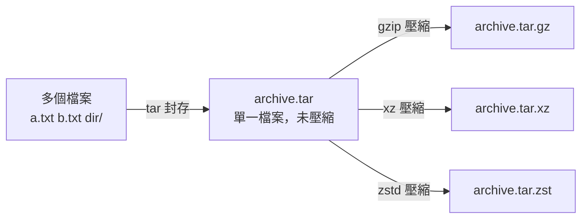

# 壓縮與封存

> [!abstract] 這篇你會學到
> - 記住 `tar` 參數的邏輯，不用每次都查（其實只有三個動作要記）
> - 依情境選對壓縮格式：**要快用 zstd、要小用 xz、要相容用 gzip**
> - **安全地解開來路不明的壓縮檔**，避開路徑穿越攻擊
> - 備份時正確保留權限、擁有者、ACL 與符號連結
> - 用 `tar` 做增量備份、用 `split` 處理超大檔案

## 前置知識

- [[05-路徑導覽與檔案操作]]

---

## 觀念說明

### 「封存」和「壓縮」是兩件事

| | 封存（archive） | 壓縮（compress） |
| --- | --- | --- |
| 做什麼 | 把**多個檔案包成一個** | 把**一個檔案變小** |
| 工具 | `tar`、`cpio` | `gzip`、`bzip2`、`xz`、`zstd` |
| 保留權限 | ✅ | 不適用 |



這解釋了為什麼副檔名是 **`.tar.gz`**（先 tar 再 gz）而不是 `.gz.tar`。

而 `zip` 是**兩件事一起做**的格式（每個檔案各自壓縮再打包），
所以 `.zip` 沒有雙重副檔名。

> [!tip] 這也解釋了 `.tar.gz` 的一個缺點
> 因為是「先打包成一個大檔再整個壓縮」，
> **要取出裡面的單一檔案，必須先解壓縮整個檔案**。
> 100GB 的 `.tar.gz` 想拿出其中一個檔案，得掃過整份資料。
>
> `zip` 因為是各檔案獨立壓縮，可以直接跳到指定檔案取出。
> 需要頻繁取用個別檔案時，`zip` 反而比較合適。

### 壓縮格式怎麼選

| 格式 | 副檔名 | 壓縮率 | 壓縮速度 | 解壓速度 | 多核心 | 適用 |
| --- | --- | --- | --- | --- | --- | --- |
| **gzip** | `.gz` | 中 | 快 | 快 | `pigz` | **相容性最好，預設選擇** |
| **zstd** | `.zst` | 中高 | **很快** | **極快** | ✅ 原生 | **現代首選（備份、日誌）** |
| **xz** | `.xz` | **最高** | **很慢** | 中 | `-T0` | 長期封存、要傳輸的映像檔 |
| bzip2 | `.bz2` | 高 | 慢 | 慢 | `pbzip2` | 已被 xz/zstd 取代，少用 |
| zip | `.zip` | 中 | 快 | 快 | ❌ | **要給 Windows 的人** |

> [!tip] 實務建議
> | 情境 | 選擇 |
> | --- | --- |
> | 每日備份（要快、每天跑） | **`zstd -3`**（或 `gzip -6`） |
> | 長期封存（壓一次、放很久） | **`xz -9 -T0`** |
> | 日誌輪替 | `gzip`（logrotate 預設）或 `zstd` |
> | 要傳給 Windows 使用者 | **`zip`** |
> | 不確定對方環境 | **`gzip`**（相容性最好） |
>
> 實際差異（以 1GB 的網站目錄為例，僅供參考）：
> ```
> gzip -6   → 312 MB，  18 秒
> zstd -3   → 298 MB，   4 秒   ← 更小且快 4 倍
> zstd -19  → 241 MB，  95 秒
> xz -9     → 218 MB， 420 秒   ← 最小但慢 100 倍
> ```

---

## 基礎操作

### `tar`：只要記三個動作

```
tar [動作][選項] -f 檔案 [目標]
```

**動作只有三個**（互斥，一次只能選一個）：

| 動作 | 記法 | 意義 |
| --- | --- | --- |
| **`c`** | **c**reate | 建立 |
| **`x`** | e**x**tract | 解開 |
| **`t`** | lis**t** | 列出內容（不解開） |

**常用選項**：

| 選項 | 意義 |
| --- | --- |
| `f` | **f**ile — 指定檔名（**幾乎一定要**，且要放最後） |
| `v` | **v**erbose — 顯示處理的檔案 |
| `z` | gzip |
| `j` | bzip2 |
| `J` | xz |
| `--zstd` | zstd |
| `-C 目錄` | **切換到該目錄**再操作 |
| `-p` | 保留權限（解開時，root 預設有） |
| `--exclude=樣式` | 排除 |

```bash
tar czf backup.tar.gz /var/www          # 建立 gzip 壓縮封存
tar xzf backup.tar.gz                   # 解開
tar tzf backup.tar.gz                   # 列出內容
tar tzf backup.tar.gz | head -20        # 只看前 20 個
tar xzf backup.tar.gz -C /restore/      # 解到指定目錄
```

> [!tip] 記憶法：**「建立 → 看 → 解」= c、t、x**
> 加上永遠要有的 `f`，就是 `czf`、`tzf`、`xzf`。
> 想看過程再加 `v`：`czvf`、`xzvf`。
>
> `f` 一定要**放在選項的最後**，因為它後面緊接著檔名：
> ```bash
> tar cfz backup.tar.gz /var/www    # ✗ f 後面接的是 z，會出錯
> tar czf backup.tar.gz /var/www    # ✓
> ```

> [!tip] 現代 tar 可以自動偵測壓縮格式
> ```bash
> tar xf backup.tar.gz     # 不用 z，GNU tar 會自己判斷
> tar xf backup.tar.xz     # 不用 J
> tar xf backup.tar.zst    # 不用 --zstd
> ```
> **解開時可以省略格式選項**（`-a` 也能在建立時依副檔名自動選）：
> ```bash
> tar caf backup.tar.zst /var/www    # -a 依副檔名自動選 zstd
> ```
> 但**建立時明確寫出來比較清楚**，也避免副檔名打錯時壓錯格式。

> [!warning] `tar` 的參數可以不加 `-`，這是歷史包袱
> ```bash
> tar czf x.tar.gz dir      # 舊式：不加 -
> tar -czf x.tar.gz dir     # 現代：加 -
> tar --create --gzip --file=x.tar.gz dir   # 長選項
> ```
> 三種都能動。**混用時要小心**：長選項一定要有 `--`，
> 而 `tar -czf` 之後就不能再寫舊式參數。

### `-C`：切換目錄，決定封存內的路徑結構

這是 `tar` 最常被搞錯的地方。

```bash
tar czf backup.tar.gz /var/www/example.com
tar tzf backup.tar.gz | head -3
```

```
tar: Removing leading `/' from member names
var/www/example.com/
var/www/example.com/index.php
var/www/example.com/public/
```

封存裡帶著 `var/www/example.com/` 這整串路徑。解開時會產生一整串目錄。

用 `-C` 只封存需要的層級：

```bash
tar czf backup.tar.gz -C /var/www example.com
tar tzf backup.tar.gz | head -3
```

```
example.com/
example.com/index.php
example.com/public/
```

乾淨多了。解開時也用 `-C` 指定要放哪：

```bash
tar xzf backup.tar.gz -C /srv/web/
# → /srv/web/example.com/...
```

> [!tip] `-C` 的位置會影響行為
> `-C` 在**每個目標之前**都可以出現，各自生效：
> ```bash
> tar czf all.tar.gz -C /etc nginx -C /var/www example.com
> ```
> 這會把 `/etc/nginx` 和 `/var/www/example.com` 各自以
> `nginx/` 和 `example.com/` 的形式放進同一個封存。

### 排除不需要的東西

```bash
tar czf backup.tar.gz \
    --exclude='*.log' \
    --exclude='node_modules' \
    --exclude='.git' \
    --exclude='storage/framework/cache/*' \
    -C /var/www example.com
```

從檔案讀取排除清單：

```bash
cat > /etc/backup-exclude.txt <<'EXCLUDE'
*.log
*.tmp
node_modules
vendor
.git
storage/logs/*
EXCLUDE

tar czf backup.tar.gz --exclude-from=/etc/backup-exclude.txt -C /var/www example.com
```

> [!warning] `--exclude` 必須寫在目標路徑**之前**
> ```bash
> tar czf x.tar.gz /var/www --exclude='*.log'    # ✗ 可能無效
> tar czf x.tar.gz --exclude='*.log' /var/www    # ✓
> ```
> GNU tar 是依序處理參數的，排除規則要先設定才會套用。

### 保留權限與屬性（備份必看）

```bash
sudo tar czpf backup.tar.gz \
    --acls --xattrs --selinux --numeric-owner \
    -C /var/www example.com
```

| 選項 | 保留什麼 | 何時需要 |
| --- | --- | --- |
| `-p` | 權限位元 | root 建立時預設有；解開時**一般使用者要明確加** |
| `--acls` | ACL | 有用 `setfacl` 時（見 [[08-檔案權限與擁有者]]） |
| `--xattrs` | 擴充屬性 | 有 capabilities 或自訂 xattr 時 |
| `--selinux` | SELinux 標籤 | **RHEL 系必加** |
| `--numeric-owner` | 用 UID/GID 數字而非名稱 | **跨機器還原時必加** |

> [!danger] `--numeric-owner` 是跨機器備份的關鍵
> 沒有它，`tar` 會存「使用者**名稱**」。還原到另一台機器時，
> 如果那台的 `mike` 是不同的 UID，或根本沒有 `mike` 這個帳號，
> 擁有者就會跑掉。
>
> ```bash
> # 備份時
> sudo tar czpf backup.tar.gz --numeric-owner -C /var/www example.com
> # 還原時
> sudo tar xzpf backup.tar.gz --numeric-owner -C /var/www
> ```
> 兩邊都要加。見 [[03-備份策略與還原演練]]。

### 安全地解開來路不明的封存

> [!danger] 路徑穿越：封存檔可以寫到你意想不到的地方
> 惡意封存檔可能包含 `../../etc/cron.d/backdoor` 這種路徑，
> 或含指向系統檔案的符號連結。
>
> GNU tar 預設會擋掉絕對路徑與 `..`（會警告並移除），
> 但**不要依賴這個**，也不要用 `-P`（`--absolute-names`）關掉保護。

**三步驟安全流程**：

```bash
# 1. 先看內容，不要直接解開
tar tzvf unknown.tar.gz | head -50

# 2. 檢查有沒有可疑路徑
tar tzf unknown.tar.gz | grep -E '^(/|\.\./)' && echo "⚠ 含絕對路徑或 .."

# 3. 解到一個空的隔離目錄，確認後再搬
mkdir -p /tmp/extract-$$ && cd /tmp/extract-$$
tar xzf /path/to/unknown.tar.gz
ls -laR | head -40
```

```bash
# 只取出封存裡的特定檔案
tar xzf backup.tar.gz example.com/config/app.php

# 去掉最上層目錄（常用於解開 GitHub 下載的原始碼）
tar xzf project-v1.2.3.tar.gz --strip-components=1
```

> [!tip] `--strip-components` 解決「多一層目錄」的煩惱
> GitHub 下載的 tarball 裡永遠有一層 `專案名-版本號/`。
> ```bash
> tar xzf nginx-1.27.0.tar.gz                      # → nginx-1.27.0/...
> tar xzf nginx-1.27.0.tar.gz --strip-components=1 # → 直接是內容
> ```

### 單獨的壓縮工具

```bash
gzip file.txt              # → file.txt.gz（原檔消失！）
gzip -k file.txt           # -k 保留原檔
gunzip file.txt.gz         # 解壓
gzip -d file.txt.gz        # 同上
gzip -9 file.txt           # 最高壓縮（1 最快，9 最小，預設 6）
gzip -t file.txt.gz        # 測試完整性
zcat file.txt.gz           # 直接讀（見 [[06-檢視檔案內容]]）
```

```bash
xz -9 -T0 big.tar          # -T0 用所有 CPU 核心
zstd -3 big.tar            # zstd 預設 3，範圍 1-19（--ultra 到 22）
zstd -19 -T0 big.tar       # 高壓縮 + 多核心
unzstd big.tar.zst
```

> [!warning] `gzip` / `xz` / `zstd` 預設會**刪掉原檔**
> ```bash
> gzip data.sql        # data.sql 不見了，變成 data.sql.gz
> gzip -k data.sql     # ✓ 保留原檔
> zstd data.sql        # zstd 預設保留原檔（與 gzip 相反！）
> zstd --rm data.sql   # 要刪原檔得明確指定
> ```
> **兩者的預設行為相反**，這是很容易踩到的差異。

### 多核心加速

```bash
sudo apt install -y pigz pbzip2 zstd

tar -I pigz -cf backup.tar.gz -C /var/www example.com     # 多核心 gzip
tar -I 'zstd -T0 -3' -cf backup.tar.zst -C /var/www example.com
tar -I 'xz -T0 -9' -cf backup.tar.xz -C /var/www example.com
```

`-I` 指定用哪個外部程式做壓縮。

> [!tip] `pigz` 在多核心機器上可以快好幾倍
> `gzip` 是單執行緒的，8 核心機器上只用得到 1 核。
> `pigz`（parallel gzip）產生**完全相容的 `.gz` 檔案**，
> 但用滿所有核心。備份大目錄時差異非常明顯。
>
> 但如果是**線上服務的機器**，別忘了配 `ionice`／`nice`
> 避免吃光資源（見 [[10-程序管理與訊號]]）。

### `zip`：給 Windows 使用者

```bash
zip -r archive.zip folder/           # -r 遞迴
zip -r -9 archive.zip folder/        # 最高壓縮
zip -r archive.zip folder/ -x '*.log' '*/node_modules/*'
zip -e secure.zip file.txt           # 加密（弱加密，見下方警告）
unzip archive.zip                    # 解開
unzip -l archive.zip                 # 列出內容
unzip archive.zip -d /target/        # 解到指定目錄
unzip -O big5 chinese.zip            # 處理 Windows 中文檔名亂碼
```

> [!warning] Windows 來的 zip 中文檔名會亂碼
> Windows 的 zip 用系統編碼（繁中是 Big5 / CP950），Linux 預設 UTF-8。
> ```bash
> unzip -O cp950 檔案.zip      # 指定來源編碼
> # 或用 7z
> sudo apt install -y p7zip-full
> 7z x 檔案.zip
> ```

> [!danger] `zip -e` 的加密很弱，不要用來保護機密
> 傳統 ZIP 加密（ZipCrypto）已被完全破解。
> 真的要加密請用 `gpg` 或 `age`：
> ```bash
> tar czf - -C /var/www example.com | gpg -c > backup.tar.gz.gpg
> gpg -d backup.tar.gz.gpg | tar xzf - -C /restore/
> ```
> 見 [[10-機密管理與金鑰保護]]。

### `split`：切割超大檔案

```bash
split -b 2G backup.tar.gz backup.tar.gz.part-      # 每份 2GB
cat backup.tar.gz.part-* > backup.tar.gz           # 合併

# 邊打包邊切割
tar czf - -C /var/www example.com | split -b 2G - backup.tar.gz.part-
cat backup.tar.gz.part-* | tar xzf - -C /restore/
```

> [!tip] 什麼時候需要 split
> - 目的地檔案系統有單檔大小限制（FAT32 是 4GB）
> - 要用不支援續傳的方式傳輸大檔
> - 要燒成多片光碟或分批上傳

> [!info]- Rocky / AlmaLinux（RHEL 系）對照
> `tar`、`gzip`、`xz` 完全相同。差異：
>
> | 工具 | Debian / Ubuntu | RHEL 系 |
> | --- | --- | --- |
> | `zip` / `unzip` | `apt install zip unzip` | `dnf install zip unzip` |
> | `zstd` | 預設有（新版） | `dnf install zstd` |
> | `pigz` | `apt install pigz` | `dnf install pigz`（需 EPEL） |
> | 7z | `p7zip-full` | `p7zip p7zip-plugins`（需 EPEL） |
>
> **RHEL 系備份一定要加 `--selinux`**，否則還原後 SELinux 標籤全錯，
> 服務會讀不到檔案：
> ```bash
> sudo tar czpf backup.tar.gz --selinux --acls --xattrs --numeric-owner \
>      -C /var/www example.com
> ```
> 忘了加也還有救：
> ```bash
> sudo restorecon -Rv /var/www
> ```
> 見 [[07-SELinux與AppArmor]]。

---

## 進階用法：增量備份

`tar` 內建增量備份，用一個快照檔記錄上次備份的狀態：

```bash
# 完整備份（第一次，snapshot 檔不存在會自動建立）
sudo tar czpf full-$(date +%F).tar.gz \
    --listed-incremental=/var/backups/example.snar \
    --numeric-owner -C /var/www example.com

# 增量備份（之後每次，只包含變動的部分）
sudo tar czpf incr-$(date +%F).tar.gz \
    --listed-incremental=/var/backups/example.snar \
    --numeric-owner -C /var/www example.com
```

還原時**必須依序解開**：

```bash
sudo tar xzpf full-2026-08-01.tar.gz  --incremental --numeric-owner -C /restore/
sudo tar xzpf incr-2026-08-08.tar.gz  --incremental --numeric-owner -C /restore/
sudo tar xzpf incr-2026-08-15.tar.gz  --incremental --numeric-owner -C /restore/
```

> [!danger] 增量備份的三個風險
> 1. **快照檔（`.snar`）遺失** → 下次備份會變成完整備份（還好），
>    但**已有的增量檔就無法正確套用了**
> 2. **中間少了一份** → 後面的全部無法正確還原
> 3. **還原順序錯** → 結果不正確且不會報錯
>
> 快照檔要跟備份檔一起保存，而且**一定要實際演練還原**。
>
> 老實說，除非資料量非常大，**用 `rsync` 做增量備份通常更好管理**——
> 每份都是完整可用的目錄，不依賴前一份。見 [[02-rsync-同步與備份]]。

---

## 完整實戰範例

### 情境一：完整的網站備份腳本

```bash
#!/usr/bin/env bash
# backup-site.sh — 備份網站檔案與資料庫
set -euo pipefail

SITE=example.com
SRC_DIR=/var/www
DB_NAME=example_db
BACKUP_DIR=/backup/$SITE
KEEP_DAYS=14
DATE=$(date +%F-%H%M)

mkdir -p "$BACKUP_DIR"
exec > >(tee -a "/var/log/backup-$SITE.log") 2>&1

echo "════ 備份開始 $(date '+%F %T') ════"

# ── 1. 網站檔案 ──────────────────────────────────────
FILES_OUT="$BACKUP_DIR/${SITE}-files-${DATE}.tar.zst"
echo "→ 打包網站檔案"
ionice -c 3 nice -n 19 \
sudo tar -I 'zstd -T0 -3' -cpf "$FILES_OUT" \
    --numeric-owner --acls --xattrs \
    --exclude='*.log' \
    --exclude='node_modules' \
    --exclude='.git' \
    --exclude='storage/framework/cache/*' \
    -C "$SRC_DIR" "$SITE"

# ── 2. 資料庫 ────────────────────────────────────────
DB_OUT="$BACKUP_DIR/${SITE}-db-${DATE}.sql.zst"
echo "→ 匯出資料庫"
mysqldump --single-transaction --quick "$DB_NAME" | zstd -T0 -3 -o "$DB_OUT"
echo "   管線退出碼：${PIPESTATUS[*]}"

# ── 3. 驗證 ──────────────────────────────────────────
echo "→ 驗證備份"

# 3a. 壓縮檔完整性
zstd -t "$FILES_OUT"
zstd -t "$DB_OUT"

# 3b. 檔案數量合理性
COUNT=$(tar tf "$FILES_OUT" | wc -l)
echo "   封存內含 $COUNT 個項目"
[ "$COUNT" -gt 10 ] || { echo "❌ 檔案數異常少" >&2; exit 1; }

# 3c. 資料庫內容特徵
zstdcat "$DB_OUT" | head -5 | grep -q "MySQL dump" \
    || { echo "❌ 資料庫備份內容異常" >&2; exit 1; }

# 3d. 產生校驗碼供異地比對
( cd "$BACKUP_DIR" && sha256sum "$(basename "$FILES_OUT")" "$(basename "$DB_OUT")" \
    >> "checksums-$(date +%Y%m).txt" )

echo "✅ 檔案：$(du -h "$FILES_OUT" | cut -f1)｜資料庫：$(du -h "$DB_OUT" | cut -f1)"

# ── 4. 清理舊備份 ────────────────────────────────────
echo "→ 清理 $KEEP_DAYS 天前的備份"
find "$BACKUP_DIR" -name "${SITE}-*" -mtime "+$KEEP_DAYS" -print -delete

echo "════ 備份結束 $(date '+%F %T') ════"
```

> [!tip] 這個腳本裡值得注意的細節
> | 做法 | 理由 |
> | --- | --- |
> | `ionice -c 3 nice -n 19` | 不影響線上服務（見 [[10-程序管理與訊號]]） |
> | `zstd -T0 -3` | 多核心、速度與壓縮率的平衡點 |
> | `--numeric-owner` | 跨機器還原時擁有者才正確 |
> | `${PIPESTATUS[*]}` | 抓出 `mysqldump` 的失敗（見 [[11-輸入輸出重導向與管線]]） |
> | 三重驗證 | 完整性、數量、內容特徵——缺一不可 |
> | `sha256sum` | 異地備份後可比對是否傳輸完整 |
> | `-print -delete` | 刪除前先印出，日誌裡看得到刪了什麼 |

### 情境二：把網站搬到另一台機器

```bash
# ── 在來源機器 ──
sudo tar -I 'zstd -T0' -cpf - \
    --numeric-owner --acls --xattrs \
    --exclude='node_modules' --exclude='.git' \
    -C /var/www example.com \
  | ssh -C deploy@newserver 'sudo tar -I zstd -xpf - --numeric-owner -C /var/www'
```

一行完成打包、壓縮、傳輸、解開，**中間不落地**（不佔用磁碟空間）。

> [!tip] 為什麼不用 `scp` 先傳再解
> - 不需要來源與目的地各準備一份磁碟空間
> - 壓縮後傳輸，網路用量少很多
> - 一個管線完成，中斷就整個失敗（不會留下半個檔案讓你誤以為成功）
>
> 缺點是**不能續傳**。超大資料或網路不穩時改用 `rsync`：
> ```bash
> sudo rsync -aAXH --numeric-ids --info=progress2 \
>      --exclude={'node_modules','.git'} \
>      /var/www/example.com/ deploy@newserver:/var/www/example.com/
> ```
> 見 [[02-rsync-同步與備份]]。

還原後務必檢查權限：

```bash
# 在新機器上
sudo ls -la /var/www/example.com | head
sudo namei -l /var/www/example.com/public/index.php
sudo -u www-data test -r /var/www/example.com/public/index.php && echo "Web 帳號可讀 ✓"
# RHEL 系還要
sudo restorecon -Rv /var/www/example.com
```

### 情境三：從備份中只取出一個檔案

```bash
# 1. 先找到它在封存裡的路徑
tar tzf backup.tar.gz | grep "app.php"
```

```
example.com/config/app.php
```

```bash
# 2. 只解開這一個
tar xzf backup.tar.gz example.com/config/app.php -C /tmp/restore/

# 3. 比對與現行版本的差異
diff -u /tmp/restore/example.com/config/app.php /var/www/example.com/config/app.php
```

> [!tip] 大封存檔搜尋很慢，先建索引
> ```bash
> tar tzf backup.tar.gz > backup.tar.gz.index      # 備份時一併產生
> grep "app.php" backup.tar.gz.index               # 之後查索引就好
> ```
> 這在幾十 GB 的封存上能省下大量時間。

---

## 常見錯誤與排錯

| 現象 | 原因 | 解法 |
| --- | --- | --- |
| `tar: Cowardly refusing to create an empty archive` | 忘了指定要打包什麼 | 檢查參數順序，目標路徑要在最後 |
| `tar: Removing leading '/' from member names` | 用了絕對路徑（這是保護機制） | 正常訊息；想乾淨就用 `-C` |
| 解開後多了一層目錄 | 封存本來就有那層 | `--strip-components=1` |
| 解開後權限／擁有者跑掉 | 沒用 `-p`、`--numeric-owner` | 備份與還原兩邊都加 |
| `gzip: file.txt.gz: No such file` | `gzip` 已刪掉原檔 | 用 `gzip -k` 保留 |
| `zstd` 沒有刪掉原檔 | zstd 預設保留（與 gzip 相反） | 要刪加 `--rm` |
| `tar cfz` 出錯 | `f` 後面必須緊接檔名 | 改成 `tar czf` |
| `--exclude` 沒作用 | 寫在目標路徑之後 | 移到目標之前 |
| 中文檔名解開後亂碼 | 來源是 Windows 編碼 | `unzip -O cp950` 或用 `7z` |
| 封存檔解不開，說 unexpected EOF | 傳輸不完整或磁碟寫入中斷 | `sha256sum` 比對；重新傳輸 |
| RHEL 上還原後服務讀不到檔案 | SELinux 標籤沒還原 | 備份加 `--selinux`；或 `restorecon -Rv` |
| 增量備份還原後檔案不完整 | 順序錯或少了中間某份 | 依序還原；務必演練 |
| 備份很慢、拖垮線上服務 | 沒有降低優先權 | `ionice -c 3 nice -n 19` |
| 8 核機器壓縮只用 1 核 | `gzip`/`xz` 預設單執行緒 | `pigz`、`xz -T0`、`zstd -T0` |

---

## 安全性注意事項

> [!danger] 解開不明封存檔前一定要先 `tar tf` 看內容
> 惡意封存可能：
> - 含 `../../` 路徑穿越，寫到系統目錄
> - 含指向 `/etc/passwd` 的符號連結，覆蓋系統檔案
> - 含 setuid 檔案，留下提權後門
> - 是「壓縮炸彈」（幾 KB 解開變成幾 TB），塞爆磁碟
>
> ```bash
> tar tzvf unknown.tar.gz | head -50
> tar tzf unknown.tar.gz | grep -E '^(/|\.\./)'      # 路徑穿越
> tar tzvf unknown.tar.gz | grep -E '^[lh]'          # 連結
> tar tzvf unknown.tar.gz | awk '$1 ~ /s/'           # setuid
> ```
> **絕對不要用 root 直接解開不明封存到系統目錄。**

> [!warning] 備份檔案本身就是機密
> 網站備份裡有 `.env`、資料庫備份裡有使用者資料與密碼雜湊。
> ```bash
> sudo chmod 600 /backup/*/*.tar.zst
> sudo chown root:root /backup
> sudo chmod 700 /backup
> ```
> 異地備份時應該加密：
> ```bash
> tar -I zstd -cpf - -C /var/www example.com | age -r age1xxxx... > backup.tar.zst.age
> ```
> 見 [[10-機密管理與金鑰保護]] 與 [[11-備份災難復原與入侵應變]]。

> [!warning] 壓縮炸彈的防護
> ```bash
> # 先看解開後有多大
> zstd -l backup.tar.zst
> gzip -l backup.tar.gz
> ```
> 自動化處理使用者上傳的壓縮檔時，用 `ulimit -f` 限制產出大小：
> ```bash
> ( ulimit -f 1000000; tar xzf uploaded.tar.gz )    # 限制單檔 ~1GB
> ```

---

## 速查表

### tar

| 指令 | 說明 |
| --- | --- |
| `tar czf x.tar.gz dir` | 建立 gzip 封存 |
| `tar xzf x.tar.gz` | 解開 |
| `tar tzf x.tar.gz` | **列出內容（解開前先看）** |
| `tar xf x.tar.*` | 自動偵測格式解開 |
| `tar czf x.tar.gz -C /parent dir` | **從指定目錄封裝，路徑乾淨** |
| `tar xzf x.tar.gz -C /target` | 解到指定目錄 |
| `tar xzf x.tar.gz --strip-components=1` | 去掉最上層目錄 |
| `tar xzf x.tar.gz path/in/archive` | 只解開特定檔案 |
| `tar czf x.tar.gz --exclude='*.log' dir` | 排除（**要寫在目標前**） |
| `tar czpf x --numeric-owner --acls --xattrs` | **完整保留屬性（備份用）** |
| `tar czf x --selinux` | RHEL 系必加 |
| `tar -I 'zstd -T0 -3' -cf x.tar.zst dir` | 指定壓縮程式 |
| `tar --listed-incremental=s.snar` | 增量備份 |

### 壓縮工具

| 指令 | 說明 |
| --- | --- |
| `gzip -k f` / `gunzip f.gz` | 壓縮（**保留原檔**）/ 解壓 |
| `gzip -9` / `gzip -t` | 最高壓縮 / 測試完整性 |
| `xz -9 -T0 f` | 最高壓縮 + 多核心 |
| `zstd -3 f` / `unzstd f.zst` | **現代首選** / 解壓 |
| `zstd --rm f` | 壓縮後刪原檔 |
| `zstd -t f.zst` / `zstd -l f.zst` | 測試 / 看解開後大小 |
| `pigz` / `pbzip2` | 多核心版 gzip / bzip2 |
| `zip -r x.zip dir` / `unzip x.zip` | **給 Windows 用** |
| `unzip -O cp950 x.zip` | 修中文檔名亂碼 |
| `split -b 2G f prefix-` | 切割 |
| `cat prefix-* > f` | 合併 |
| `sha256sum -c checksums.txt` | 驗證完整性 |

### 格式選擇

| 情境 | 用 |
| --- | --- |
| 每日備份 | `zstd -3` |
| 長期封存 | `xz -9 -T0` |
| 相容性優先 | `gzip` |
| 給 Windows | `zip` |
| 需要加密 | `gpg` 或 `age` |

---

## 練習題

> [!question]- 練習 1：驗證 `-C` 對封存結構的影響
> 用兩種方式封裝同一個目錄，比較封存內的路徑差異。
>
> **解答**
>
> ```bash
> mkdir -p /tmp/lab/site/public && echo hi > /tmp/lab/site/public/index.html
>
> tar czf /tmp/a.tar.gz /tmp/lab/site
> tar czf /tmp/b.tar.gz -C /tmp/lab site
>
> echo "── 不用 -C ──"; tar tzf /tmp/a.tar.gz
> echo "── 用 -C ──";   tar tzf /tmp/b.tar.gz
> ```
> ```
> ── 不用 -C ──
> tmp/lab/site/
> tmp/lab/site/public/
> tmp/lab/site/public/index.html
> ── 用 -C ──
> site/
> site/public/
> site/public/index.html
> ```
>
> **影響**：解開 `a.tar.gz` 到 `/restore` 會產生 `/restore/tmp/lab/site/...`，
> 多了兩層無意義的目錄。用 `-C` 的版本解開就是 `/restore/site/...`。
>
> **備份腳本一律用 `-C`**，這樣還原時目標路徑才乾淨可控。

> [!question]- 練習 2：證明 `--numeric-owner` 的必要性
> 模擬「備份機器與還原機器的 UID 不同」的情況。
>
> **解答**
>
> ```bash
> # 在練習機上模擬
> sudo useradd -u 1500 -M -s /usr/sbin/nologin alice
> sudo mkdir -p /tmp/src && echo data > /tmp/src/file.txt
> sudo chown 1500:1500 /tmp/src/file.txt
> ls -ln /tmp/src/file.txt        # -n 顯示數字
> ```
> ```
> -rw-r--r-- 1 1500 1500 5 ... /tmp/src/file.txt
> ```
>
> ```bash
> # 備份（不加 --numeric-owner，存的是名稱 "alice"）
> sudo tar czpf /tmp/no-numeric.tar.gz -C /tmp src
> # 備份（加 --numeric-owner，存的是數字 1500）
> sudo tar czpf /tmp/numeric.tar.gz --numeric-owner -C /tmp src
>
> # 模擬「另一台機器沒有 alice，但有另一個 UID 1500 的人」
> sudo userdel alice
> sudo useradd -u 1500 -M -s /usr/sbin/nologin bob
>
> sudo mkdir -p /tmp/r1 /tmp/r2
> sudo tar xzpf /tmp/no-numeric.tar.gz -C /tmp/r1
> sudo tar xzpf /tmp/numeric.tar.gz --numeric-owner -C /tmp/r2
> ls -ln /tmp/r1/src/file.txt /tmp/r2/src/file.txt
> ```
>
> **關鍵觀察**：不加 `--numeric-owner` 時，`tar` 會查「alice」這個名稱，
> 在還原機器上找不到就退回用數字（或變成 root）。
> **在名稱存在但對應到不同 UID 的機器上，檔案會被交給錯誤的人**——
> 這在有多台機器、UID 不一致的環境裡是實際會發生的資安問題。

> [!question]- 練習 3：安全地處理不明封存檔
> 給你一個 `unknown.tar.gz`，寫出完整的檢查流程。
>
> **解答**
>
> ```bash
> F=unknown.tar.gz
>
> # 1. 這是什麼格式？
> file "$F"
>
> # 2. 解開後會有多大？（防壓縮炸彈）
> gzip -l "$F"     # 或 zstd -l / xz -l
>
> # 3. 有幾個項目？
> tar tzf "$F" | wc -l
>
> # 4. 有沒有路徑穿越？
> tar tzf "$F" | grep -E '^(/|\.\./)' && echo "⚠ 危險路徑" || echo "✓ 路徑正常"
>
> # 5. 有沒有符號連結、硬連結？（可能指向系統檔案）
> tar tzvf "$F" | grep -E '^[lh]' || echo "✓ 沒有連結"
>
> # 6. 有沒有 setuid/setgid？
> tar tzvf "$F" | awk '$1 ~ /[st]/ {print "⚠", $0}'
>
> # 7. 大致看一下內容結構
> tar tzf "$F" | head -30
>
> # 8. 確認都沒問題，解到隔離目錄（不要用 root，不要解到系統目錄）
> SANDBOX=$(mktemp -d)
> tar xzf "$F" -C "$SANDBOX"
> ls -laR "$SANDBOX" | head -40
>
> # 9. 確認無誤後才搬到正式位置
> ```
>
> **每一步的理由**：
> - 第 2 步防「幾 KB 解開變幾 TB」塞爆磁碟
> - 第 4～6 步是實際存在的攻擊手法
> - 第 8 步用一般使用者、解到 `mktemp -d`，
>   就算真的有惡意內容也只影響那個暫存目錄
>
> **絕對不要**：`sudo tar xzf unknown.tar.gz -C /`

---

## 小測驗

Q1. 「封存」與「壓縮」的差別？`.tar.gz` 為什麼是雙副檔名而 `.zip` 不是？
Q2. 從 100GB 的 `.tar.gz` 取出單一檔案為什麼慢？哪種格式沒這問題？
Q3. 每日備份、長期封存、給 Windows 的人，各該選什麼格式？
Q4. `tar cfz x.tar.gz dir` 為什麼出錯？
Q5. `tar czf b.tar.gz /var/www/site` 與 `tar czf b.tar.gz -C /var/www site` 封存內路徑差在哪？
Q6. `--exclude` 寫在目標路徑之後會怎樣？
Q7. 跨機器還原時擁有者跑掉，備份與還原各少了什麼選項？
Q8. `gzip data.sql` 之後原檔在哪？`zstd data.sql` 呢？
Q9. 解開不明封存前的三個檢查各防什麼？
Q10. 8 核機器 `gzip` 只用 1 核，三種多核心替代？

> [!question]- 測驗答案
> **Q1.** 封存把多檔包成一檔（tar），壓縮把一檔變小（gzip）；`.tar.gz` 是先 tar 再 gz，zip 兩件事一起做（見「封存和壓縮是兩件事」）。
> **Q2.** 整個 tar 被當成一個大檔壓縮，必須掃過全部才能定位；zip 各檔獨立壓縮可直接跳到指定檔案。
> **Q3.** `zstd -3`、`xz -9 -T0`、`zip`。
> **Q4.** `f` 後面必須緊接檔名，`cfz` 讓 `f` 接到 `z`；寫 `czf`。
> **Q5.** 前者含 `var/www/site/...` 整串路徑，後者只有 `site/...`。備份一律用 `-C`。
> **Q6.** 可能無效——GNU tar 依序處理參數，排除規則要先設定。
> **Q7.** `--numeric-owner`（兩邊都要）；沒有它會依名稱對應 UID，另一台的同名帳號 UID 不同就交錯人。
> **Q8.** `gzip` 預設刪原檔（`-k` 保留）；`zstd` 預設保留（`--rm` 才刪）——兩者相反。
> **Q9.** `tar tzf | grep '^(/|\.\./)'` 防路徑穿越；`tzvf | grep '^[lh]'` 防連結覆寫系統檔；`gzip -l` 看解開後大小防壓縮炸彈。並解到 `mktemp -d`。
> **Q10.** `pigz`、`xz -T0`、`zstd -T0`（配 `tar -I`）。

---

## 延伸閱讀

- [[02-rsync-同步與備份]] — 比 `tar` 更適合重複同步的工具
- [[03-備份策略與還原演練]] — 3-2-1 原則與還原演練
- [[06-檢視檔案內容]] — `zcat` / `zless` / `zgrep` 直接讀壓縮檔
- [[10-程序管理與訊號]] — `ionice` / `nice` 降低備份對服務的影響
- [[10-機密管理與金鑰保護]] — 備份加密
- [[11-備份災難復原與入侵應變]] — 備份在災難復原中的角色
- `man 1 tar` / `info tar`（增量備份章節）
