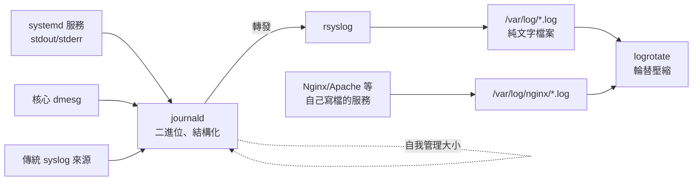

# 日誌系統 journald 與 logrotate

> [!abstract] 這篇你會學到
> - 搞懂 journald 與傳統 syslog 檔案**並存**的架構，知道哪種日誌去哪裡找
> - 用 `journalctl` 的時間、服務、等級、欄位過濾，快速定位問題時間點
> - **讓 journal 持久化**——Ubuntu 預設重開機就丟日誌，排查重開機前的問題會抓瞎
> - 設定 journald 的磁碟上限與 logrotate 輪替，**避免日誌塞爆磁碟**
> - 為自訂服務與應用寫 logrotate 設定，並理解 `copytruncate` 與 `postrotate` 的取捨

## 前置知識

- [[17-systemd服務管理]]

---

## 觀念說明

### 兩套系統並存

現代 Linux 的日誌有兩條路徑，**同時存在**：



| | journald | 傳統檔案（rsyslog + 自寫檔） |
| --- | --- | --- |
| 格式 | 二進位、帶結構化欄位 | 純文字 |
| 查詢 | `journalctl`（強大的過濾） | `grep` / `less` / `zgrep` |
| 涵蓋 | **所有 systemd 服務的 stdout/stderr + 核心** | 服務自己決定寫什麼 |
| 輪替 | 自我管理（大小上限） | **logrotate** |
| 竄改防護 | 有（FSS 可選） | 無 |

> [!tip] 「這個服務的日誌在哪」的判斷順序
> 1. `journalctl -u <服務>` — systemd 管的服務**一定**有（stdout/stderr 都被收）
> 2. `/var/log/<服務名>/` — Nginx、MySQL 這類**自己寫檔**的服務
> 3. `ls /var/log/` — 傳統系統日誌（`syslog`、`auth.log`、`kern.log`）
> 4. 服務設定檔裡的 `log` 相關指令 — 路徑被改過的情況
>
> 兩邊**可能都有**（服務寫檔、systemd 又收了它的 stderr），
> 內容不一定相同——排查時兩邊都要看。

### 傳統日誌檔案地圖

| 檔案（Debian 系） | 內容 |
| --- | --- |
| `/var/log/syslog` | 幾乎所有系統訊息 |
| **`/var/log/auth.log`** | **登入、sudo、SSH 認證**（資安排查第一站） |
| `/var/log/kern.log` | 核心訊息（OOM、硬體錯誤） |
| `/var/log/dpkg.log` | 套件安裝紀錄 |
| `/var/log/apt/history.log` | apt 操作歷史 |
| `/var/log/nginx/` | Nginx 自己寫的 |
| `/var/log/mysql/error.log` | MySQL 自己寫的 |
| `/var/log/btmp` / `wtmp` / `lastlog` | 二進位：用 `lastb` / `last` / `lastlog` 讀 |

> [!info]- Rocky / AlmaLinux（RHEL 系）對照
> | 用途 | Debian 系 | RHEL 系 |
> | --- | --- | --- |
> | 綜合訊息 | `/var/log/syslog` | **`/var/log/messages`** |
> | 認證 | `/var/log/auth.log` | **`/var/log/secure`** |
> | 排程 | 在 syslog 裡 | **`/var/log/cron`** |
> | 套件 | `/var/log/dpkg.log`、`apt/` | `/var/log/dnf.log` |
> | journald 持久化 | 預設 `auto`（**通常沒開**） | **預設已持久化**（`/var/log/journal` 存在） |
>
> journalctl 用法兩系完全相同。

---

## journalctl

### 基本查詢

```bash
sudo journalctl                     # 全部（從最舊開始，q 離開）
sudo journalctl -e                  # ✓ 跳到最後
sudo journalctl -f                  # ✓ 即時追蹤（等同 tail -F）
sudo journalctl -r                  # 反向（最新在上）
sudo journalctl -n 50               # 最後 50 筆
sudo journalctl --no-pager          # 不分頁（給腳本／管線）
sudo journalctl -q                  # 安靜（略去提示行）
```

> [!tip] 一般使用者也能看日誌：加入 `systemd-journal` 群組
> ```bash
> sudo usermod -aG systemd-journal mike     # 重新登入生效
> ```
> 之後 `journalctl` 不用 sudo。與 `adm` 群組（傳統檔案日誌）搭配，
> 日常排查就完全不需要 root。見 [[09-使用者與群組管理]]。

### 依服務、時間、等級過濾

```bash
# ── 服務 ──
sudo journalctl -u nginx                    # 單一服務
sudo journalctl -u nginx -u php8.3-fpm      # 多個服務交錯顯示（超好用）
sudo journalctl -u 'nginx*'                 # 萬用字元

# ── 時間 ──
sudo journalctl --since "2026-08-27 09:00" --until "2026-08-27 09:30"
sudo journalctl --since "10 min ago"
sudo journalctl --since today
sudo journalctl --since yesterday --until today

# ── 開機區段 ──
sudo journalctl -b                          # 本次開機
sudo journalctl -b -1                       # ✓ 上次開機（排查「為什麼重開機」）
sudo journalctl --list-boots                # 所有開機紀錄

# ── 等級 ──
sudo journalctl -p err                      # err 以上（err/crit/alert/emerg）
sudo journalctl -p warning..err             # 範圍
sudo journalctl -u nginx -p err --since today
```

等級（syslog 標準，數字越小越嚴重）：

| 數字 | 名稱 | 意義 |
| --- | --- | --- |
| 0-2 | `emerg` `alert` `crit` | 系統級災難 |
| 3 | **`err`** | **錯誤（日常排查的起點）** |
| 4 | `warning` | 警告 |
| 5-6 | `notice` `info` | 一般訊息 |
| 7 | `debug` | 除錯 |

> [!tip] 排查問題的兩個固定起手式
> ```bash
> # 1. 「剛剛發生什麼事」——最近 30 分鐘的錯誤
> sudo journalctl -p err --since "30 min ago"
>
> # 2. 「機器為什麼重開」——上次開機的最後訊息
> sudo journalctl -b -1 -e
> ```
> 第二招要 journal 有持久化才有用（見下方）。

### 進階過濾

```bash
sudo journalctl -k                          # 只看核心（等同 dmesg）
sudo journalctl -t sshd                     # 依 syslog 識別字
sudo journalctl _PID=1234                   # 依 PID
sudo journalctl _UID=33                     # 依使用者（33 = www-data）
sudo journalctl /usr/sbin/nginx             # 依執行檔
sudo journalctl -u ssh -g "Failed password" # -g 用正規表示式過濾訊息內容
sudo journalctl -o json-pretty -n 1         # 看一筆的完整結構化欄位
sudo journalctl -o short-iso                # ISO 時間格式
sudo journalctl -o cat                      # 只要訊息本文
```

> [!tip] `-g`（grep）比管線接 grep 好
> ```bash
> sudo journalctl -u ssh -g "Failed password" --since today
> ```
> 保留 journalctl 的分頁與顏色，而且在二進位層過濾，比較快。
> 大小寫敏感度跟 `less` 一樣：全小寫時不分大小寫。

```bash
# 看某個欄位有哪些值（探索用）
sudo journalctl -F _SYSTEMD_UNIT | head
sudo journalctl -F PRIORITY
```

### 讓 journal 持久化（Ubuntu 必做）

```bash
ls -d /var/log/journal 2>/dev/null && echo "已持久化" || echo "⚠ 未持久化（重開機就丟）"
```

Ubuntu 預設 `Storage=auto`——**`/var/log/journal` 不存在就只存在記憶體
（`/run/log/journal`），重開機全部消失**。

```bash
# 啟用持久化
sudo mkdir -p /var/log/journal
sudo systemd-tmpfiles --create --prefix /var/log/journal
sudo systemctl restart systemd-journald
journalctl --list-boots        # 之後就會累積多次開機的紀錄
```

> [!danger] 沒有持久化的 journal，最需要的時候是空的
> 機器無預警重開機，你想查「重開前發生什麼」——
> `journalctl -b -1` 卻回你 `Specifying boot ID or boot offset has no effect, no persistent journal was found`。
>
> **這是每台新機都該做的設定**，列入 [[01-伺服器初始安全設定]] 清單。

### 控制 journal 的磁碟用量

```bash
journalctl --disk-usage
```

```
Archived and active journals take up 1.5G in the file system.
```

```bash
sudo mkdir -p /etc/systemd/journald.conf.d
sudo tee /etc/systemd/journald.conf.d/size.conf > /dev/null <<'CONF'
[Journal]
Storage=persistent
SystemMaxUse=1G           # 總量上限
SystemKeepFree=2G         # 保證磁碟至少留這麼多
MaxRetentionSec=3month    # 最長保留時間
MaxFileSec=1week          # 每個檔案涵蓋的期間（影響清理粒度）
CONF
sudo systemctl restart systemd-journald
```

立即清理：

```bash
sudo journalctl --vacuum-size=500M       # 清到剩 500M
sudo journalctl --vacuum-time=14d        # 清掉 14 天前的
sudo journalctl --vacuum-files=10        # 只留 10 個檔案
```

```bash
sudo journalctl --verify                 # 檢查 journal 檔案完整性
```

---

## logrotate

journald 自我管理，但 **Nginx、應用程式自己寫的檔案日誌**要靠 logrotate。

### 運作方式

```bash
cat /etc/cron.daily/logrotate 2>/dev/null || systemctl list-timers | grep logrotate
```

```
logrotate.timer   logrotate.service      ← 現代發行版用 timer 每天觸發
```

設定檔：

```
/etc/logrotate.conf          # 全域預設
/etc/logrotate.d/*           # ✓ 各服務一個檔案（套件會自帶）
```

```bash
ls /etc/logrotate.d/
```

```
apt  dpkg  nginx  rsyslog  ufw
```

### 讀懂一個設定：以 nginx 為例

```bash
cat /etc/logrotate.d/nginx
```

```
/var/log/nginx/*.log {
        daily                    # 每天輪替
        missingok                # 檔案不存在不報錯
        rotate 14                # 保留 14 份
        compress                 # 壓縮成 .gz
        delaycompress            # 最新的一份先不壓（服務可能還在寫）
        notifempty               # 空檔不輪替
        create 0640 www-data adm # 建新檔的權限與擁有者
        sharedscripts            # 多個檔案只跑一次 script
        prerotate
                if [ -d /etc/logrotate.d/httpd-prerotate ]; then \
                        run-parts /etc/logrotate.d/httpd-prerotate; \
                fi
        endscript
        postrotate
                invoke-rc.d nginx rotate >/dev/null 2>&1
        endscript
}
```

輪替後的樣子：

```
access.log          ← 新的（服務繼續寫這個）
access.log.1        ← 剛輪替的（delaycompress 所以還沒壓）
access.log.2.gz
access.log.3.gz
...
access.log.14.gz    ← 下次輪替時被刪掉
```

### 關鍵觀念：為什麼需要 `postrotate`

> [!danger] 把檔案改名，服務還是寫著「舊的」那個 inode
> logrotate 把 `access.log` 改名成 `access.log.1` 時，
> Nginx **仍然開著同一個檔案描述符**，會繼續寫進 `access.log.1`——
> 新建的 `access.log` 永遠是空的。
>
> （這和 [[06-檢視檔案內容]] 的 `tail -f` 輪替問題是同一個原理。）
>
> 兩種解法：
>
> **解法一：`postrotate` 通知服務重開日誌**（標準做法）
> ```
> postrotate
>     [ -f /run/nginx.pid ] && kill -USR2 $(cat /run/nginx.pid)
> endscript
> ```
> Nginx 收到 `USR2`（或 `systemctl reload`）後重新開啟日誌檔。
> 每個服務的訊號不同：Nginx 用 `USR1`（reopen logs），
> rsyslog 用 `HUP`——查該服務的文件。
>
> **解法二：`copytruncate`**（服務不支援 reopen 時）
> ```
> copytruncate      # 複製內容出去，再把原檔清空（truncate）
> ```
> 服務完全無感（一直寫同一個檔案），但有兩個代價：
> - **複製與清空之間寫入的幾行日誌會遺失**
> - 大檔案複製需要時間與雙倍空間
>
> **能用 postrotate 就不要用 copytruncate。**

### 為自訂應用寫 logrotate

```bash
sudo tee /etc/logrotate.d/myapp > /dev/null <<'CONF'
/var/log/myapp/*.log {
    daily
    rotate 30
    maxsize 500M              # 沒到一天但超過 500M 也輪替
    missingok
    notifempty
    compress
    delaycompress
    dateext                   # 用日期當後綴：access.log-20260827.gz
    dateformat -%Y%m%d
    create 0640 myapp adm
    sharedscripts
    postrotate
        systemctl kill -s USR1 myapp.service 2>/dev/null || true
    endscript
}
CONF
```

**測試（不要等到明天）**：

```bash
sudo logrotate -d /etc/logrotate.d/myapp       # -d 模擬，只顯示會做什麼
sudo logrotate -f /etc/logrotate.d/myapp       # -f 強制立刻輪替一次
cat /var/lib/logrotate/status | grep myapp     # 上次輪替時間（Debian 系）
```

> [!tip] 常用指令速覽
> | 指令 | 意義 |
> | --- | --- |
> | `daily` / `weekly` / `monthly` | 頻率 |
> | `size 100M` | 到達大小才輪替（**取代**時間條件） |
> | `maxsize 500M` | 時間到**或**超過大小（**搭配**時間條件） |
> | `rotate N` | 保留 N 份 |
> | `maxage 90` | 超過 90 天的直接刪 |
> | `compress` + `delaycompress` | 壓縮、但最新一份延後壓 |
> | `dateext` | 日期後綴（找歷史日誌好找得多） |
> | `create <權限> <擁有者> <群組>` | 建立新檔 |
> | `copytruncate` | 複製後清空（會掉幾行） |
> | `su <使用者> <群組>` | 以指定身分操作（目錄權限嚴格時需要） |
> | `olddir archive/` | 舊檔搬到子目錄 |

> [!warning] 日誌目錄權限太寬會讓 logrotate 拒絕工作
> ```
> error: skipping "/var/log/myapp/app.log" because parent directory has
> insecure permissions (It's world writable or writable by group which is
> not "root")
> ```
> 目錄是 `777` 或群組可寫但群組不是 root 時，logrotate 會跳過
> （安全設計：防止符號連結攻擊）。解法是修正權限，或明確加 `su`：
> ```
> su myapp adm
> ```

---

## 完整實戰範例

### 情境一：磁碟快滿，元凶是日誌

```bash
# 1. 確認是誰
sudo du -sh /var/log/* 2>/dev/null | sort -rh | head -8
journalctl --disk-usage
```

```
6.2G    /var/log/nginx
1.5G    /var/log/journal
890M    /var/log/myapp
```

```bash
# 2. 立即止血：journald
sudo journalctl --vacuum-size=500M

# 3. 立即止血：檔案日誌 —— 用 truncate，不要 rm！
sudo truncate -s 0 /var/log/nginx/access.log
# （rm 會因為服務還開著檔案而不釋放空間，見 15 篇）

# 4. 找出為什麼會長這麼快
sudo tail -n 20 /var/log/nginx/access.log
sudo awk '{print $1}' /var/log/nginx/access.log | sort | uniq -c | sort -rn | head -3
# → 常見答案：某個 IP 在掃描、健康檢查太頻繁、debug 等級忘了關

# 5. 長期解法：確認輪替有在跑、上限有設
sudo logrotate -d /etc/logrotate.d/nginx 2>&1 | head
grep -r maxsize /etc/logrotate.d/nginx || echo "考慮加上 maxsize 500M"
cat /etc/systemd/journald.conf.d/size.conf 2>/dev/null || echo "journald 沒設上限"
```

### 情境二：SSH 被暴力破解的追查

```bash
# 誰在試？
sudo journalctl -u ssh -g "Failed password" --since today --no-pager \
  | grep -oE 'from ([0-9]{1,3}\.){3}[0-9]{1,3}' | sort | uniq -c | sort -rn | head
```

```
   2841 from 203.0.113.99
    412 from 198.51.100.77
```

```bash
# 有沒有成功登入的？（重要！）
sudo journalctl -u ssh -g "Accepted" --since "7 days ago" --no-pager
```

```
Aug 27 09:11:52 lab01 sshd[1203]: Accepted publickey for mike from 192.168.1.10
```

```bash
# 對照傳統檔案（涵蓋較久的歷史）
sudo zgrep -h "Accepted" /var/log/auth.log* | tail -20
sudo lastb | head          # 失敗登入的另一個來源
sudo last | head           # 成功登入
```

> [!tip] 「Accepted 來自不認識的 IP」= 立刻應變
> 這個追查的重點不是失敗次數（那只是網路噪音），
> 而是**有沒有不該成功的成功**。發現異常見 [[11-備份災難復原與入侵應變]]，
> predisposition 防護見 [[03-Fail2ban入侵防護]]。

### 情境三：服務半夜掛掉，還原時間線

```bash
SVC=mysql
# 1. 它什麼時候死的？
systemctl status "$SVC" | head -5
sudo journalctl -u "$SVC" --since yesterday -p warning --no-pager | tail -20

# 2. 死前系統發生什麼？（前後 5 分鐘的全系統錯誤）
DIED="2026-08-27 03:14:00"
sudo journalctl --since "2026-08-27 03:09" --until "2026-08-27 03:19" -p warning --no-pager

# 3. 是不是 OOM？
sudo journalctl -k --since yesterday | grep -i -E "oom|out of memory"

# 4. 是不是被人動了？
sudo journalctl _COMM=sudo --since yesterday --no-pager
sudo grep "$(date -d yesterday +%b\ %e)" /var/log/auth.log | grep -E "sudo|session opened"
```

> [!tip] 交叉三個資訊源
> **服務自己的日誌**（它說了什麼）＋**核心日誌**（OOM、硬體）＋
> **認證日誌**（有沒有人為操作）。三者的時間線對起來，
> 死因通常就浮出來了。這個流程值得寫進 [[10-故障排除方法論]]。

---

## 常見錯誤與排錯

| 現象 | 原因 | 解法 |
| --- | --- | --- |
| `journalctl -b -1` 說沒有 persistent journal | 未持久化 | `mkdir /var/log/journal` + 重啟 journald |
| journal 佔了好幾 GB | 沒設上限 | `SystemMaxUse=`；`--vacuum-size=` 立即清 |
| 輪替後新日誌檔一直是空的 | 服務仍寫著舊 inode | `postrotate` 通知服務 reopen |
| `rm` 大日誌後空間沒釋放 | 服務開著檔案 | `truncate -s 0`；見 [[15-磁碟分割與掛載]] |
| logrotate 跳過並說 insecure permissions | 日誌目錄權限太寬 | 修權限或加 `su <user> <group>` |
| logrotate 好像沒在跑 | timer 停了或狀態檔異常 | `systemctl status logrotate.timer`；`/var/lib/logrotate/status` |
| `copytruncate` 掉了幾行日誌 | 複製與清空之間的寫入 | 改用 `postrotate` + reopen 訊號 |
| journalctl 時間對不上 | 時區或 NTP | `timedatectl`；`journalctl -o short-iso` |
| 應用日誌爆量 | debug 等級上了正式環境 | 調回 info；`maxsize` 當保險 |
| 看不到其他使用者的服務日誌 | 權限 | 加入 `systemd-journal` 群組 |
| RHEL 找不到 `/var/log/syslog` | 檔名不同 | 用 `/var/log/messages` |

---

## 安全性注意事項

> [!warning] 日誌是入侵鑑識的證據，也是入侵者的目標
> 入侵者的標準動作是清掉 `auth.log`、`wtmp` 與 shell 歷史。防護：
> - journald 持久化 + `Seal=yes`（FSS 簽章，竄改可被偵測）
> - **重要日誌即時轉發到另一台機器**（rsyslog remote 或 journald 的
>   `systemd-journal-upload`）——本機被清了遠端還有，見 [[02-日誌集中與輪替]]
> - `auth.log` 權限保持 `640 root:adm`

> [!warning] 日誌本身可能含機密
> 應用把完整 request（含 token、密碼欄位）印進日誌是常見疏失。
> ```bash
> sudo grep -rlE "(password|token|secret)=" /var/log/myapp/ | head
> ```
> 發現就要修應用的日誌設定，並視同外洩處理該批日誌。
> 見 [[10-機密管理與金鑰保護]]。

> [!tip] 保留期限要符合政策
> TWGCB 與多數資安規範要求日誌保留至少 6 個月。
> `rotate 14` 的 Nginx 預設顯然不夠——依規範調整 `rotate` 與
> `MaxRetentionSec`，重要日誌集中到日誌伺服器長期保存。

---

## 速查表

### journalctl

| 指令 | 說明 |
| --- | --- |
| `journalctl -e` / `-f` / `-r` | 跳到最後 / 追蹤 / 反向 |
| `journalctl -u X` | 指定服務（可多個 `-u`） |
| `journalctl --since "10 min ago"` | 時間過濾 |
| **`journalctl -b -1`** | **上次開機（需持久化）** |
| `journalctl -p err` | 錯誤以上 |
| `journalctl -k` | 核心（= dmesg） |
| `journalctl -g "樣式"` | 內容正規表示式 |
| `journalctl -xeu X` | **排查服務失敗標配** |
| `journalctl --disk-usage` | 佔用空間 |
| `journalctl --vacuum-size=500M` | 立即清理 |
| `-o json-pretty` / `-o cat` / `-o short-iso` | 輸出格式 |

### journald 設定（`journald.conf.d/`）

| 設定 | 說明 |
| --- | --- |
| `Storage=persistent` | 持久化 |
| `SystemMaxUse=1G` | 磁碟上限 |
| `SystemKeepFree=2G` | 保底剩餘空間 |
| `MaxRetentionSec=3month` | 保留期限 |

### logrotate

| 指令／設定 | 說明 |
| --- | --- |
| `logrotate -d <設定>` | **模擬（先跑這個）** |
| `logrotate -f <設定>` | 強制立刻輪替 |
| `daily` + `rotate 30` | 每天、留 30 份 |
| `maxsize 500M` | 時間或大小任一到就輪替 |
| `compress` + `delaycompress` | 壓縮組合 |
| `dateext` | 日期後綴 |
| **`postrotate` + reopen 訊號** | **標準做法** |
| `copytruncate` | 退而求其次（會掉行） |
| `create 0640 user adm` | 新檔權限 |
| `/var/lib/logrotate/status` | 上次輪替紀錄 |

---

## 練習題

> [!question]- 練習 1：驗證 journal 持久化前後的差別
> 檢查你的機器 journal 是否持久化；若否，啟用它並確認重開機後
> `journalctl -b -1` 可用。
>
> **解答**
>
> ```bash
> ls -d /var/log/journal 2>/dev/null || echo "未持久化"
> journalctl --list-boots
> ```
> 未持久化時 `--list-boots` 只有一筆（本次）。啟用：
> ```bash
> sudo mkdir -p /var/log/journal
> sudo systemd-tmpfiles --create --prefix /var/log/journal
> sudo systemctl restart systemd-journald
> sudo reboot
> ```
> 重開機後：
> ```bash
> journalctl --list-boots        # 應有兩筆以上
> journalctl -b -1 -n 20         # 能看到重開機前的最後訊息
> ```
> 順手把磁碟上限也設好（見上文 `size.conf`），一次做完。

> [!question]- 練習 2：親手做一次輪替並驗證 inode 問題
> 建一個持續寫入的假服務，設定 logrotate，比較有無 `postrotate` 的差別。
>
> **解答**
>
> ```bash
> # 假服務：每秒寫一行
> sudo mkdir -p /var/log/laptest
> sudo bash -c 'while true; do echo "$(date) line"; sleep 1; done >> /var/log/laptest/app.log' &
> HOGPID=$!
>
> # logrotate 設定（先故意不加 postrotate）
> sudo tee /etc/logrotate.d/laptest > /dev/null <<'CONF'
> /var/log/laptest/app.log {
>     rotate 3
>     missingok
> }
> CONF
>
> sudo logrotate -f /etc/logrotate.d/laptest
> sleep 3
> ls -l /var/log/laptest/
> ```
> ```
> -rw-r--r-- 1 root root    0 ... app.log        ← 新檔一直是 0！
> -rw-r--r-- 1 root root 4213 ... app.log.1      ← 寫入還在進這裡
> ```
> 用 inode 驗證：
> ```bash
> ls -li /var/log/laptest/
> sudo ls -l /proc/$HOGPID/fd/ | grep laptest    # fd 指向 app.log.1
> ```
> **這就是沒有 reopen 的後果**。因為 bash 迴圈無法收訊號 reopen，
> 這種場景的解法是 `copytruncate`：
> ```bash
> sudo sed -i 's/missingok/missingok\n    copytruncate/' /etc/logrotate.d/laptest
> sudo logrotate -f /etc/logrotate.d/laptest
> sleep 3
> ls -l /var/log/laptest/        # app.log 這次有持續長大
> ```
> 清理：
> ```bash
> sudo kill $HOGPID; sudo rm -rf /var/log/laptest /etc/logrotate.d/laptest
> ```
> **結論**：服務支援 reopen（Nginx、rsyslog、PHP-FPM）就用
> `postrotate`；只有寫死檔案控制代碼的程式才用 `copytruncate`。

> [!question]- 練習 3：從日誌回答三個維運問題
> 只用 journalctl 與 /var/log，回答：
> ① 這台機器最近一次重開機是何時、正常還是異常？
> ② 今天有哪些人用過 sudo、做了什麼？
> ③ 哪個服務今天產生最多錯誤？
>
> **解答**
>
> ```bash
> # ① 重開機時間與性質
> last reboot | head -3
> journalctl --list-boots | tail -3
> journalctl -b -1 -n 10 --no-pager
> # 最後訊息是 "Reached target ... Shutdown" → 正常關機
> # 最後訊息戛然而止（一般營運訊息）→ 斷電或當機
>
> # ② sudo 使用紀錄
> sudo journalctl _COMM=sudo --since today --no-pager -o cat | grep COMMAND
> ```
> ```
> mike : TTY=pts/0 ; PWD=/home/mike ; USER=root ; COMMAND=/usr/bin/systemctl restart nginx
> ```
> ```bash
> # ③ 錯誤最多的服務
> sudo journalctl -p err --since today -o json --no-pager 2>/dev/null \
>   | grep -oP '"_SYSTEMD_UNIT":"[^"]*"' | sort | uniq -c | sort -rn | head -5
> ```
> 這三題就是 [[02-每日維護作業]] 的核心內容——
> 把它們寫成腳本，每天自動產出。

---

## 小測驗

Q1. journald 與傳統 `/var/log` 檔案的關係？判斷「某服務日誌在哪」的四步順序？
Q2. Ubuntu 預設 journal 持久化嗎？沒有的話 `journalctl -b -1` 會怎樣？怎麼開？
Q3. `journalctl -xeu nginx` 三個選項各做什麼？
Q4. `journalctl -p err` 包含哪些等級？
Q5. `journalctl -g` 比 `| grep` 好在哪？
Q6. journal 佔了 5GB，立即清理與長期設定各用什麼？
Q7. logrotate 改名 `access.log` 後，Nginx 為什麼繼續寫進 `access.log.1`？
Q8. `postrotate` 與 `copytruncate` 各適用什麼情況？後者的代價？
Q9. logrotate 說 `parent directory has insecure permissions` 的原因與解法？
Q10. RHEL 的認證日誌與綜合日誌路徑？

> [!question]- 測驗答案
> **Q1.** 並存：systemd 服務的 stdout/stderr 與核心進 journald，rsyslog 再寫成檔案，Nginx 等自己寫檔。順序：`journalctl -u`→`/var/log/<服務>/`→`/var/log/` 傳統檔→設定檔裡的路徑（見「兩套系統並存」）。
> **Q2.** 不持久（`Storage=auto` 且目錄不存在）；回報找不到 persistent journal。`mkdir -p /var/log/journal` 後重啟 journald。
> **Q3.** `-x` 加說明文字、`-e` 跳到最後、`-u` 指定服務。
> **Q4.** err、crit、alert、emerg（3 以上更嚴重的）。
> **Q5.** 保留分頁與顏色、在二進位層過濾較快。
> **Q6.** `journalctl --vacuum-size=500M`；`journald.conf.d` 設 `SystemMaxUse=`、`MaxRetentionSec=`。
> **Q7.** 它仍握著同一個 inode 的檔案描述符，改名不影響；新建的 `access.log` 一直是空的。
> **Q8.** 服務支援 reopen（Nginx、rsyslog）用 `postrotate` 送訊號；只有寫死檔案控制代碼的程式用 `copytruncate`，代價是複製與清空之間的幾行會遺失。
> **Q9.** 日誌目錄 world-writable 或群組可寫但群組非 root（防符號連結攻擊）；修權限或加 `su user group`。
> **Q10.** `/var/log/secure`、`/var/log/messages`。

---

## 延伸閱讀

- [[06-檢視檔案內容]] — `tail -F`、`zgrep` 讀輪替後的日誌
- [[17-systemd服務管理]] — 服務日誌與 `journalctl -xeu`
- [[02-日誌集中與輪替]] — 多機日誌集中與遠端備份
- [[07-Nginx-日誌與除錯]] — Nginx 日誌格式自訂
- [[01-GoAccess-安裝與基本使用]] — 日誌視覺化
- [[03-Fail2ban入侵防護]] — 讓日誌自動觸發封鎖
- `man 1 journalctl` / `man 5 journald.conf` / `man 8 logrotate`
