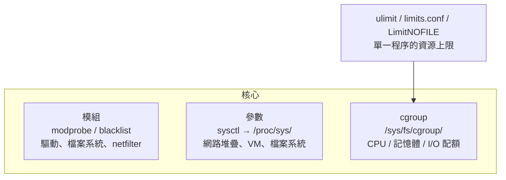
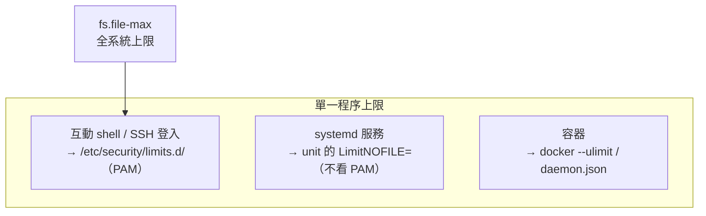

# 核心模組與 sysctl 調校

> [!abstract] 這篇你會學到
> - 查、載、卸、封鎖核心模組，並讓設定在重開機後仍生效
> - 用 `sysctl` 調整核心參數，知道**伺服器上線前該調的那十幾個**與各自的意義
> - 解決 `Too many open files`——分清楚 **`ulimit`、`limits.conf`、systemd `LimitNOFILE`** 三層各管誰
> - 理解 cgroup v2 如何讓 systemd 限制 CPU／記憶體／I/O
> - 避開「調了沒效」「調了更慢」的常見陷阱：**先量測再調，一次只調一項**

## 前置知識

- [[17-systemd服務管理]]
- [[25-開機流程與GRUB救援]]

---

## 觀念說明

### 核心的三個可調層



| 層 | 管什麼 | 即時工具 | 持久化位置 |
| --- | --- | --- | --- |
| **模組** | 載入哪些驅動與功能 | `modprobe` | `/etc/modules-load.d/`、`/etc/modprobe.d/` |
| **sysctl** | 核心行為參數 | `sysctl -w` | `/etc/sysctl.d/*.conf` |
| **程序限制** | 單一程序可開多少檔案／執行緒 | `ulimit` | `/etc/security/limits.d/`、systemd `Limit*=` |
| **cgroup** | 一群程序的資源配額 | `systemctl set-property` | unit 的 `MemoryMax=` 等 |

> [!danger] 調校的兩個鐵律
> 1. **先量測，有數據證明瓶頸在那裡，才調**——不是看到網路文章就照抄
> 2. **一次只改一項，改完量測，記錄**——同時改五項，好了不知道是哪項，壞了不知道該還原哪項
>
> 網路上「一鍵優化」的 sysctl 清單，很多是十年前為特定場景寫的，
> 照抄到你的機器可能變慢或不穩。本篇列的每一項都附「什麼情況才需要」。

---

## 核心模組

### 查看

```bash
lsmod                                      # 已載入的模組
lsmod | grep -E '^(zfs|kvm|nf_)'
modinfo zfs                                # 模組資訊：版本、參數、依賴、簽章
modinfo -p zfs | head                      # 可調參數
cat /sys/module/zfs/parameters/zfs_arc_max # 執行中的參數值
sudo dmesg | grep -i -E 'module|firmware'  # 載入時的訊息
```

```bash
lsmod | head -5
```

```
Module                  Size  Used by
zfs                  4341760  6
nf_conntrack          172032  3 nf_nat,nft_ct,xt_conntrack
kvm_intel             393216  0
```

`Used by` 是引用計數——**非 0 的模組無法卸載**，要先卸掉依賴它的。

### 載入與卸載

```bash
sudo modprobe br_netfilter                 # 載入（自動處理依賴）
sudo modprobe -r br_netfilter              # 卸載
sudo modprobe zfs zfs_arc_max=4294967296   # 載入時帶參數
sudo modprobe -n -v ixgbe                  # -n 試跑：只顯示會做什麼
```

> [!warning] `insmod` / `rmmod` 是低階工具，不處理依賴
> `insmod` 要給完整路徑且不會載入依賴模組；`rmmod` 卸載時不管別人還在用。
> **一律用 `modprobe` / `modprobe -r`。**

### 持久化：開機自動載入

```bash
# 開機載入
echo "br_netfilter" | sudo tee /etc/modules-load.d/k8s.conf
echo "zfs" | sudo tee /etc/modules-load.d/zfs.conf

# 模組參數（載入時套用）
echo "options zfs zfs_arc_max=4294967296" | sudo tee /etc/modprobe.d/zfs.conf
echo "options kvm_intel nested=1" | sudo tee /etc/modprobe.d/kvm.conf
```

> [!warning] 根檔案系統相關的模組參數要重建 initramfs
> `zfs_arc_max` 這種在 initramfs 階段就載入的模組，改了 `modprobe.d` 之後：
> ```bash
> sudo update-initramfs -u        # RHEL: sudo dracut -f
> ```
> 否則重開機後 initramfs 裡的舊設定先生效。見 [[25-開機流程與GRUB救援]]。

### 封鎖模組（blacklist）

用途：不用的硬體驅動、有安全疑慮的協定、與其他驅動衝突的模組。

```bash
sudo tee /etc/modprobe.d/blacklist-custom.conf > /dev/null <<'CONF'
# 不需要的檔案系統與網路協定（TWGCB / CIS 建議）
install cramfs /bin/false
install freevxfs /bin/false
install jffs2 /bin/false
install hfs /bin/false
install hfsplus /bin/false
install udf /bin/false
install dccp /bin/false
install sctp /bin/false
install rds /bin/false
install tipc /bin/false
# 不用的硬體
blacklist pcspkr
blacklist nouveau            # 裝 NVIDIA 專有驅動時
CONF
sudo update-initramfs -u
```

> [!tip] `blacklist` 與 `install xxx /bin/false` 的差別
> - `blacklist foo` — 阻止**自動**載入（硬體偵測到時），但 `modprobe foo` 或依賴它的模組仍可載入
> - `install foo /bin/false` — 任何載入嘗試都執行 `/bin/false` 而失敗，**真正禁用**
>
> 資安基準要求的「停用不必要的檔案系統／協定」要用後者。
> 驗證：`sudo modprobe cramfs` 應該失敗、`lsmod | grep cramfs` 應該為空。

### 模組簽章與 DKMS

```bash
sudo mokutil --sb-state                    # Secure Boot 狀態
modinfo -F sig_key zfs                     # 模組簽章金鑰（空 = 未簽章）
dkms status                                # DKMS 管理的第三方模組
sudo dkms autoinstall                      # 為目前核心重建所有 DKMS 模組
sudo dkms install zfs/2.2.4 -k $(uname -r)
```

> [!warning] 核心升級後 DKMS 模組失效是常見故障
> 症狀：升級核心重開機後 ZFS pool 不見、NVIDIA 顯示驅動失效、VirtualBox 起不來。
> ```bash
> dkms status            # 看新核心那行是 installed 還是 built / 缺
> sudo dkms autoinstall
> sudo update-initramfs -u
> ```
> Ubuntu 的 `linux-headers-generic` 要跟著核心一起裝，DKMS 才有東西可編。

---

## sysctl：核心參數

### 運作方式

```
/proc/sys/net/ipv4/ip_forward   ← 檔案
net.ipv4.ip_forward             ← sysctl 名稱（把 / 換成 .）
```

```bash
sysctl net.ipv4.ip_forward                 # 讀
cat /proc/sys/net/ipv4/ip_forward          # 同上
sudo sysctl -w net.ipv4.ip_forward=1       # 寫（立即生效、重開機消失）
sysctl -a | grep -i somaxconn              # 搜尋
sysctl -a --pattern '^net.ipv4.tcp' | wc -l
```

### 持久化

```bash
sudo tee /etc/sysctl.d/99-server.conf > /dev/null <<'CONF'
net.ipv4.ip_forward = 1
CONF
sudo sysctl --system                       # 重新載入全部 sysctl.d
sudo sysctl -p /etc/sysctl.d/99-server.conf   # 只載入這個檔
```

> [!warning] 載入順序與覆蓋
> `sysctl --system` 依**檔名字典序**載入 `/etc/sysctl.d/*.conf`、`/run/sysctl.d/`、
> `/usr/lib/sysctl.d/`，**後面的覆蓋前面的**，最後才是 `/etc/sysctl.conf`。
> 自訂設定用 `99-` 開頭確保最後套用；不要直接改 `/etc/sysctl.conf`
> 或套件提供的 `10-*.conf`。
>
> 檢查某參數最終來自哪個檔案：
> ```bash
> grep -rn "vm.swappiness" /etc/sysctl.d/ /usr/lib/sysctl.d/ /etc/sysctl.conf 2>/dev/null
> ```

### 伺服器上線前值得看的參數

以下按**類別**列出，每項附「預設值 / 建議 / 什麼情況才需要調」。
**沒有那個情況就不要調。**

#### 網路：連線數與佇列

| 參數 | 預設 | 建議 | 何時需要 |
| --- | --- | --- | --- |
| `net.core.somaxconn` | 4096 | 65535 | **高並行 Web／DB**：accept 佇列滿會丟連線（`ss -s` 看 `overflowed`） |
| `net.ipv4.tcp_max_syn_backlog` | 依記憶體 | 65535 | 同上，SYN 佇列 |
| `net.core.netdev_max_backlog` | 1000 | 16384 | 10G 網卡、大量小封包 |
| `net.ipv4.ip_local_port_range` | 32768 60999 | `1024 65535` | **反向代理／爬蟲**對外開大量連線耗盡埠 |
| `net.ipv4.tcp_tw_reuse` | 2 | 1 | 同上，允許重用 TIME_WAIT 的埠（**只對外連**有效） |
| `net.ipv4.tcp_fin_timeout` | 60 | 30 | 大量短連線 |

```bash
# 判斷 somaxconn 是否不夠：這兩個數字持續增加就是
ss -s | grep -i overflow
netstat -s 2>/dev/null | grep -iE 'overflow|drop' | head
```

> [!warning] `tcp_tw_recycle` 已經不存在了
> 舊教學常叫你開 `net.ipv4.tcp_tw_recycle=1`，它在 Linux 4.12 **已移除**，
> 而且在 NAT 環境會造成連線隨機失敗。看到這條就知道那篇教學過時了。

#### 網路：緩衝區（10G 以上才需要）

| 參數 | 建議（10G） |
| --- | --- |
| `net.core.rmem_max` / `wmem_max` | 16777216 |
| `net.ipv4.tcp_rmem` / `tcp_wmem` | `4096 87380 16777216` / `4096 65536 16777216` |
| `net.ipv4.tcp_congestion_control` | `bbr`（需 `modprobe tcp_bbr`） |

```bash
sysctl net.ipv4.tcp_available_congestion_control
```

> [!tip] BBR 是少數「幾乎沒有壞處」的調校
> 對外提供服務（特別是跨國、有封包遺失的路徑）時，BBR 通常明顯改善吞吐：
> ```bash
> echo "tcp_bbr" | sudo tee /etc/modules-load.d/bbr.conf
> sudo tee /etc/sysctl.d/99-bbr.conf > /dev/null <<'C'
> net.core.default_qdisc = fq
> net.ipv4.tcp_congestion_control = bbr
> C
> sudo sysctl --system
> ```

#### 網路：安全（TWGCB / CIS 要求）

```ini
# /etc/sysctl.d/99-hardening.conf
net.ipv4.ip_forward = 0                       # 不是路由器／容器主機就關
net.ipv4.conf.all.send_redirects = 0
net.ipv4.conf.default.send_redirects = 0
net.ipv4.conf.all.accept_redirects = 0
net.ipv4.conf.default.accept_redirects = 0
net.ipv4.conf.all.accept_source_route = 0
net.ipv4.conf.all.log_martians = 1            # 記錄不合理來源的封包
net.ipv4.conf.all.rp_filter = 1               # 反向路徑過濾（多網卡非對稱路由時用 2）
net.ipv4.icmp_echo_ignore_broadcasts = 1
net.ipv4.icmp_ignore_bogus_error_responses = 1
net.ipv4.tcp_syncookies = 1                   # SYN flood 防護
net.ipv6.conf.all.accept_ra = 0               # 不需要 IPv6 自動設定時
net.ipv6.conf.all.accept_redirects = 0
kernel.randomize_va_space = 2                 # ASLR
kernel.kptr_restrict = 2                      # 隱藏核心指標
kernel.dmesg_restrict = 1                     # 一般使用者不能看 dmesg
kernel.yama.ptrace_scope = 1                  # 限制 ptrace
fs.protected_hardlinks = 1
fs.protected_symlinks = 1
fs.suid_dumpable = 0                          # setuid 程式不產生 core dump
```

> [!danger] `ip_forward` 與容器／虛擬化
> Docker、PVE、k8s **需要** `ip_forward=1`，而且 Docker 啟動時會自己開。
> 在這些主機上把它關掉會讓容器網路壞掉。
> 資安基準的「關閉 IP 轉送」對這類主機要申請豁免並記錄——見 [[07-TWGCB-Linux檢測與符合性報告]]。
>
> 同理 `rp_filter=1` 在多網卡非對稱路由（例如 keepalived VIP）會丟封包，改 `2`。

#### 記憶體

| 參數 | 預設 | 建議 | 何時需要 |
| --- | --- | --- | --- |
| `vm.swappiness` | 60 | **10** | 伺服器通用（見 [[15-磁碟分割與掛載]]） |
| `vm.overcommit_memory` | 0 | 1 | **Redis** 要求（否則 bgsave 失敗）；其他別動 |
| `vm.max_map_count` | 65530 | 262144 | **Elasticsearch / OpenSearch** 要求 |
| `vm.dirty_ratio` / `dirty_background_ratio` | 20 / 10 | 10 / 5 | 大量寫入時避免一次 flush 卡住 |
| `vm.vfs_cache_pressure` | 100 | 50 | 大量小檔（inode/dentry 快取更值錢） |
| `vm.nr_hugepages` | 0 | 依需求 | **PostgreSQL / Oracle** 大記憶體 |

> [!warning] `vm.overcommit_memory=2` 會讓很多程式啟動失敗
> `2` 是「嚴格不超賣」，Java、Chrome、很多 fork 型程式會因為預留失敗而起不來。
> 除非你完全理解，否則不要設 `2`。Redis 要的是 `1`。

#### 檔案系統

| 參數 | 預設 | 建議 | 何時需要 |
| --- | --- | --- | --- |
| `fs.file-max` | 依記憶體（通常百萬級） | 通常不用調 | 全系統檔案描述符上限；先看 `fs.file-nr` 用了多少 |
| `fs.inotify.max_user_watches` | 8192～65536 | 524288 | **IDE、檔案同步、大型專案監看**報 `ENOSPC` |
| `fs.inotify.max_user_instances` | 128 | 1024 | 同上 |
| `fs.aio-max-nr` | 65536 | 1048576 | MySQL InnoDB 大量 AIO |

```bash
cat /proc/sys/fs/file-nr          # 已配置 未用 上限
```

> [!tip] `Too many open files` 通常不是 `fs.file-max`
> `fs.file-max` 是**全系統**上限，現代預設動輒百萬，很少撞到。
> 撞到的幾乎都是**單一程序**的 `nofile`（見下一節）。
> 先看 `fs.file-nr` 第一欄離上限多遠，再決定該調哪一層。

#### 核心

| 參數 | 說明 |
| --- | --- |
| `kernel.pid_max` | PID 上限（預設 4194304，容器多時才需要） |
| `kernel.threads-max` | 執行緒上限 |
| `kernel.panic = 10` | kernel panic 10 秒後自動重開（無人值守機器建議） |
| `kernel.panic_on_oops = 1` | oops 視為 panic |
| `kernel.sysrq = 1` | 允許 Magic SysRq（救援用，資安基準可能要求關） |
| `kernel.core_pattern` | core dump 路徑 |

---

## 程序資源限制：三層架構

`Too many open files` 是伺服器最常見的資源限制錯誤，
搞清楚三層各管誰就不會再調錯地方。



### 第一層：`ulimit`（目前 shell）

```bash
ulimit -a                                  # 全部
ulimit -n                                  # nofile 軟限制
ulimit -Hn                                 # 硬限制
ulimit -n 65535                            # 調整目前 shell（不能超過硬限制）
```

```
open files                  (-n) 1024       ← 預設軟限制，經常不夠
max user processes          (-u) 63421
core file size              (blocks, -c) 0
```

| 軟限制 | 硬限制 |
| --- | --- |
| 實際生效的值 | 軟限制能調到的上限 |
| 一般使用者可調（不超過硬） | 只有 root 能提高 |

### 第二層：`limits.conf`（登入使用者，經 PAM）

```bash
sudo tee /etc/security/limits.d/99-app.conf > /dev/null <<'CONF'
# 網域    類型  項目     值
*         soft  nofile   65535
*         hard  nofile   65535
myapp     soft  nproc    4096
myapp     hard  nproc    4096
@devs     soft  core     unlimited
CONF
```

| 項目 | 意義 |
| --- | --- |
| `nofile` | 檔案描述符數 |
| `nproc` | 程序／執行緒數 |
| `core` | core dump 大小 |
| `memlock` | 可鎖定記憶體（資料庫、ZFS 常需要） |
| `stack` | 堆疊大小 |

> [!danger] `limits.conf` 對 systemd 服務完全無效
> 這是最常見的「調了沒效」。`limits.conf` 由 **PAM** 在**登入**時套用，
> systemd 啟動的服務**不經過 PAM**，根本不會讀它。
>
> 你 `ulimit -n` 看到 65535，但 Nginx 的 worker 還是 1024。
> 服務要在 **unit 檔**設：
> ```bash
> sudo systemctl edit nginx
> ```
> ```ini
> [Service]
> LimitNOFILE=65535
> ```
> ```bash
> sudo systemctl daemon-reload && sudo systemctl restart nginx
> ```

> [!warning] `limits.conf` 需要重新登入才生效
> 而且 `*` 不包含 root，root 要另外寫一行。
> `nproc` 的 `*` 在某些發行版被 `/etc/security/limits.d/20-nproc.conf` 覆蓋，檢查它。

### 第三層：systemd 服務

```bash
systemctl show nginx -p LimitNOFILE
sudo systemctl edit nginx
```

```ini
[Service]
LimitNOFILE=65535
LimitNPROC=4096
LimitMEMLOCK=infinity
LimitCORE=0
```

全域預設（影響所有服務）：

```bash
sudo mkdir -p /etc/systemd/system.conf.d
sudo tee /etc/systemd/system.conf.d/limits.conf > /dev/null <<'C'
[Manager]
DefaultLimitNOFILE=65535:524288
DefaultLimitNPROC=65535
C
sudo systemctl daemon-reexec
```

### 驗證「實際生效」的值

不要相信設定檔，看程序：

```bash
PID=$(systemctl show nginx -p MainPID --value)
cat /proc/$PID/limits | grep -E 'open files|processes'
ls /proc/$PID/fd | wc -l                   # 目前實際開了幾個
```

```
Max open files            65535                65535                files
Max processes             4096                 4096                 processes
```

> [!tip] 這是唯一可靠的驗證方式
> `/proc/PID/limits` 顯示**那個程序**實際的限制，不管它是從哪一層來的。
> 排查 `Too many open files` 的順序：
> 1. `cat /proc/PID/limits` 看上限
> 2. `ls /proc/PID/fd | wc -l` 看用了多少
> 3. 接近上限 → 依「這程序是誰啟動的」去對應的層調（systemd → unit；登入 → limits.d）
> 4. 遠低於上限卻報錯 → 不是這個問題，看 `fs.file-nr` 或應用自己的限制

---

## cgroup v2：一群程序的配額

現代發行版（Ubuntu 22.04+、RHEL 9）預設 cgroup v2，systemd 是主要的使用者。

```bash
mount | grep cgroup2                       # 確認 v2
systemd-cgls                               # 樹狀看所有 cgroup
systemd-cgtop                              # 即時資源用量
cat /sys/fs/cgroup/system.slice/nginx.service/memory.max
cat /sys/fs/cgroup/system.slice/nginx.service/memory.current
```

在 [[17-systemd服務管理]] 提過的 `MemoryMax=`、`CPUQuota=`、`IOWeight=` 全是 cgroup。
執行中臨時調整：

```bash
sudo systemctl set-property nginx.service MemoryMax=2G          # 立即生效且寫入 drop-in
sudo systemctl set-property --runtime nginx.service CPUQuota=50% # 只到重開機
```

**slice**：把多個服務歸成一組共用配額

```bash
sudo tee /etc/systemd/system/batch.slice > /dev/null <<'U'
[Slice]
CPUQuota=100%
MemoryMax=4G
IOWeight=10
U
# 在備份、報表等 unit 加：
# [Service]
# Slice=batch.slice
```

> [!tip] 用 slice 保護線上服務
> 把所有「背景批次」放進 `batch.slice` 限總量，線上服務放 `system.slice` 預設，
> 不管批次工作怎麼暴衝都搶不過線上服務。比逐一設 `ionice`/`nice` 更系統化。

> [!info]- Rocky / AlmaLinux（RHEL 系）對照
>
> | 項目 | Debian / Ubuntu | RHEL 系 |
> | --- | --- | --- |
> | 模組開機載入 | `/etc/modules-load.d/` | 相同 |
> | 重建 initramfs | `update-initramfs -u` | **`dracut -f`** |
> | sysctl 載入順序 | 相同 | 相同；RHEL 有 `tuned` 可能覆蓋 |
> | `nproc` 預設覆蓋檔 | 無 | **`/etc/security/limits.d/20-nproc.conf`** |
> | 調校工具 | 無 | **`tuned`**（`tuned-adm list` / `profile throughput-performance`） |
> | DKMS | `dkms` | `dkms`（EPEL） |
>
> RHEL 的 **tuned** 會依 profile 套用一整組 sysctl 與 I/O 排程設定，
> 而且**優先於** `/etc/sysctl.d/`。手動 sysctl 被「還原」時檢查：
> ```bash
> tuned-adm active
> sudo tuned-adm profile virtual-guest      # VM
> sudo tuned-adm profile throughput-performance   # 實體伺服器
> ```
> 自訂 sysctl 要放進 tuned 的 profile，或 `tuned-adm off`。

---

## 完整實戰範例：Web 伺服器上線前調校

以一台 4 核 8GB、對外 Nginx + PHP-FPM 的機器為例，**每一項都說明為什麼**：

```bash
# ── 0. 先量測基準 ──────────────────────────────────
ss -s | grep -iE 'overflow|estab'
ulimit -n; systemctl show nginx -p LimitNOFILE
cat /proc/$(systemctl show nginx -p MainPID --value)/limits | grep 'open files'
sysctl net.core.somaxconn net.ipv4.ip_local_port_range vm.swappiness

# ── 1. sysctl ──────────────────────────────────────
sudo tee /etc/sysctl.d/99-web.conf > /dev/null <<'CONF'
# 高並行：accept 佇列（Nginx listen backlog 也要跟著調）
net.core.somaxconn = 65535
net.ipv4.tcp_max_syn_backlog = 65535
# 反向代理對後端開大量連線
net.ipv4.ip_local_port_range = 1024 65535
net.ipv4.tcp_tw_reuse = 1
net.ipv4.tcp_fin_timeout = 30
# BBR
net.core.default_qdisc = fq
net.ipv4.tcp_congestion_control = bbr
# 記憶體
vm.swappiness = 10
# 安全基線
net.ipv4.tcp_syncookies = 1
net.ipv4.conf.all.accept_redirects = 0
net.ipv4.conf.all.send_redirects = 0
net.ipv4.conf.all.log_martians = 1
kernel.dmesg_restrict = 1
fs.protected_symlinks = 1
fs.protected_hardlinks = 1
CONF
echo tcp_bbr | sudo tee /etc/modules-load.d/bbr.conf
sudo modprobe tcp_bbr
sudo sysctl --system

# ── 2. 服務的檔案描述符 ────────────────────────────
for s in nginx php8.3-fpm; do
  sudo mkdir -p /etc/systemd/system/$s.service.d
  printf '[Service]\nLimitNOFILE=65535\n' | sudo tee /etc/systemd/system/$s.service.d/limits.conf
done
sudo systemctl daemon-reload
sudo systemctl restart nginx php8.3-fpm

# ── 3. Nginx 自己的對應設定（somaxconn 要配合 listen backlog）──
# /etc/nginx/nginx.conf
#   worker_rlimit_nofile 65535;
#   events { worker_connections 16384; }
# server { listen 443 ssl backlog=65535; }

# ── 4. 驗證 ────────────────────────────────────────
sysctl net.core.somaxconn net.ipv4.tcp_congestion_control
cat /proc/$(systemctl show nginx -p MainPID --value)/limits | grep 'open files'
ss -tlnp | grep ':443'
sudo sysctl -a 2>/dev/null | grep -c .     # 沒有錯誤訊息

# ── 5. 壓測比較（改前改後各跑一次，見 04-效能瓶頸排查方法論）──
# ab -n 10000 -c 500 https://example.com/  或 wrk
```

> [!tip] `somaxconn` 只是上限，應用也要跟著設
> Nginx 的 `listen ... backlog=` 預設 511，就算 `somaxconn` 是 65535，
> 實際 accept 佇列還是 511。**核心參數與應用設定要配對**：
> - Nginx：`backlog=`、`worker_connections`、`worker_rlimit_nofile`
> - MySQL：`open_files_limit`、`max_connections`
> - Redis：`tcp-backlog`
> 見 [[08-Nginx-效能調校]]。

---

## 常見錯誤與排錯

| 現象 | 原因 | 解法 |
| --- | --- | --- |
| `Too many open files` 但 `ulimit -n` 是 65535 | 服務不讀 PAM 的 limits.conf | unit 加 `LimitNOFILE=`；用 `/proc/PID/limits` 驗證 |
| `limits.conf` 改了沒效 | 沒重新登入；或 `*` 不含 root；或被 `20-nproc.conf` 覆蓋 | 重登；root 另寫；檢查 limits.d 其他檔 |
| `sysctl -w` 重開機後消失 | 沒寫進 `sysctl.d` | 寫 `/etc/sysctl.d/99-*.conf` |
| sysctl 寫了但值不對 | 被字典序後面的檔或 tuned 覆蓋 | `grep -rn 參數 /etc/sysctl.d /usr/lib/sysctl.d`；`tuned-adm active` |
| `sysctl: cannot stat /proc/sys/net/ipv4/tcp_tw_recycle` | 參數已從核心移除 | 刪掉那行，該教學過時 |
| 容器網路壞掉 | 資安腳本把 `ip_forward` 關了 | 容器主機保持 1，基準申請豁免 |
| keepalived VIP 收不到封包 | `rp_filter=1` 擋非對稱路由 | 改 `2` |
| Redis 警告 overcommit | `vm.overcommit_memory=0` | 設 `1`（不是 `2`） |
| Elasticsearch 起不來 | `vm.max_map_count` 太低 | `262144` |
| IDE/同步工具報 `ENOSPC`（磁碟明明沒滿） | inotify watches 用完 | `fs.inotify.max_user_watches=524288` |
| 核心升級後 ZFS/NVIDIA 消失 | DKMS 未為新核心建模組 | `dkms autoinstall`；確認 headers 已裝 |
| `modprobe: Operation not permitted` | Secure Boot 擋未簽章模組 | MOK 簽署（見 [[25-開機流程與GRUB救援]]） |
| `modprobe -r` 說 in use | 有其他模組依賴 | `lsmod` 看 `Used by`，先卸依賴者 |
| 模組參數改了沒效 | 根檔案系統模組在 initramfs 先載入 | `update-initramfs -u` |
| `blacklist` 了還是被載入 | 被依賴模組拉進來 | 改用 `install foo /bin/false` |
| 調完更慢 | 照抄不適用的清單 | 還原（刪該檔 `sysctl --system`），一次只調一項並量測 |

---

## 安全性注意事項

> [!danger] 「一鍵優化腳本」的風險
> 網路上的 sysctl 優化腳本經常：關掉 `rp_filter`、`syncookies`、`log_martians` 換效能，
> 開 `ip_forward` 卻不設防火牆，設 `overcommit_memory=2` 讓服務起不來。
> **每一行都要知道它做什麼**，不知道就不要加。

> [!warning] 核心參數是資安基準的必檢項
> 本篇「網路：安全」那組是 TWGCB Linux 基準與 CIS 的核心項目。
> 用檢測腳本比對而不是憑印象：
> ```bash
> for p in net.ipv4.ip_forward net.ipv4.conf.all.accept_redirects net.ipv4.tcp_syncookies \
>          kernel.randomize_va_space fs.suid_dumpable; do
>   printf '%-45s %s\n' "$p" "$(sysctl -n $p)"
> done
> ```
> 見 [[03-TWGCB-Linux項目分類詳解]]。

> [!warning] 模組是核心層級的程式碼
> 載入未知來源的核心模組 = 給對方 ring 0。只從官方套件庫或可驗證簽章的來源載入；
> `install foo /bin/false` 封鎖不用的模組縮小攻擊面；定期比對 `lsmod` 基準：
> ```bash
> lsmod | awk 'NR>1 {print $1}' | sort > /root/lsmod-baseline.txt
> # 之後 diff
> ```

> [!tip] `kernel.dmesg_restrict=1` 與 `kptr_restrict=2`
> 讓一般使用者看不到核心訊息與位址，減少提權攻擊的資訊來源。
> 副作用：一般使用者 `dmesg` 要 sudo——把維運人員加進 `adm` 群組即可。

---

## 速查表

### 模組

| 指令 | 說明 |
| --- | --- |
| `lsmod` / `modinfo X` / `modinfo -p X` | 已載入 / 資訊 / 可調參數 |
| `modprobe X` / `modprobe -r X` | 載入 / 卸載（處理依賴） |
| `/etc/modules-load.d/*.conf` | 開機載入 |
| `/etc/modprobe.d/*.conf` → `options X k=v` | 模組參數 |
| `install X /bin/false` | **真正禁用**（`blacklist` 只擋自動載入） |
| `update-initramfs -u` / `dracut -f` | 根檔案系統模組改參數後必做 |
| `dkms status` / `dkms autoinstall` | 第三方模組 |
| `mokutil --sb-state` | Secure Boot |

### sysctl

| 指令 | 說明 |
| --- | --- |
| `sysctl X` / `sysctl -w X=v` | 讀 / 即時寫 |
| `sysctl -a \| grep` | 搜尋 |
| `/etc/sysctl.d/99-*.conf` + `sysctl --system` | **持久化（99- 確保最後套用）** |
| `grep -rn 參數 /etc/sysctl.d /usr/lib/sysctl.d` | 找誰覆蓋了 |
| `tuned-adm active` | RHEL：檢查 tuned 是否覆蓋 |

### 常用參數速記

| 場景 | 參數 |
| --- | --- |
| 高並行 accept | `net.core.somaxconn=65535`（+ 應用 backlog） |
| 對外大量連線 | `ip_local_port_range=1024 65535`、`tcp_tw_reuse=1` |
| 對外服務吞吐 | `tcp_congestion_control=bbr` + `default_qdisc=fq` |
| 伺服器 swap | `vm.swappiness=10` |
| Redis | `vm.overcommit_memory=1` |
| Elasticsearch | `vm.max_map_count=262144` |
| inotify ENOSPC | `fs.inotify.max_user_watches=524288` |
| 不是路由器 | `net.ipv4.ip_forward=0`（**容器主機除外**） |
| 安全基線 | `tcp_syncookies=1`、`accept_redirects=0`、`log_martians=1`、`randomize_va_space=2` |
| 過時勿用 | `tcp_tw_recycle`（已移除） |

### 資源限制三層

| 誰 | 設哪裡 | 驗證 |
| --- | --- | --- |
| 登入使用者 | `/etc/security/limits.d/`（重登生效，`*` 不含 root） | `ulimit -n` |
| **systemd 服務** | **unit `LimitNOFILE=`**（不讀 limits.conf） | `cat /proc/PID/limits` |
| 全域服務預設 | `system.conf.d` `DefaultLimitNOFILE=` | 同上 |
| 全系統 | `fs.file-max`（很少撞到） | `cat /proc/sys/fs/file-nr` |
| 一群服務 | slice 的 `MemoryMax=` `CPUQuota=` | `systemd-cgtop` |

---

## 練習題

> [!question]- 練習 1：證明 limits.conf 對 systemd 服務無效
> 設定 `limits.conf` 的 nofile 為 65535，建一個 systemd 服務印出自己的限制，觀察差異並修正。
>
> **解答**
>
> ```bash
> echo '* soft nofile 65535
> * hard nofile 65535' | sudo tee /etc/security/limits.d/99-test.conf
> # 重新登入後
> ulimit -n                # 65535
>
> sudo systemd-run --unit=limtest bash -c 'ulimit -n; cat /proc/self/limits | grep "open files"'
> sudo journalctl -u limtest -o cat
> ```
> ```
> 1024                     ← 服務看到的仍是預設
> Max open files  1024  524288  files
> ```
> 修正：
> ```bash
> sudo systemd-run --unit=limtest2 -p LimitNOFILE=65535 bash -c 'ulimit -n'
> sudo journalctl -u limtest2 -o cat     # 65535
> ```
> **結論**：PAM 的 limits.conf 只影響登入 session；服務只認 unit 的 `Limit*=`。
> 清理：`sudo rm /etc/security/limits.d/99-test.conf`。

> [!question]- 練習 2：找出 sysctl 值被誰覆蓋
> 在 `/etc/sysctl.d/50-mine.conf` 設 `vm.swappiness=10`，但 `sysctl vm.swappiness` 卻是 60。找出原因。
>
> **解答**
>
> ```bash
> grep -rn swappiness /etc/sysctl.d/ /usr/lib/sysctl.d/ /run/sysctl.d/ /etc/sysctl.conf 2>/dev/null
> ```
> 可能發現 `/etc/sysctl.d/99-something.conf` 也設了 60——字典序在 `50-` 之後，覆蓋了你的。
> 或根本沒跑 `sysctl --system`。RHEL 上另查 `tuned-adm active`。
>
> 解法：把自己的檔改名為 `99-mine.conf`（或更後面的 `zz-`），`sudo sysctl --system`。
> **教訓**：自訂 sysctl 永遠用 `99-` 開頭。

> [!question]- 練習 3：封鎖一個模組並驗證
> 依資安基準封鎖 `cramfs`，驗證 `blacklist` 與 `install /bin/false` 的差別。
>
> **解答**
>
> ```bash
> echo 'blacklist cramfs' | sudo tee /etc/modprobe.d/test.conf
> sudo modprobe cramfs && lsmod | grep cramfs      # 仍載入成功！blacklist 只擋自動載入
> sudo modprobe -r cramfs
>
> echo 'install cramfs /bin/false' | sudo tee /etc/modprobe.d/test.conf
> sudo modprobe cramfs                             # 失敗
> lsmod | grep cramfs || echo "未載入 ✓"
> ```
> 基準檢測腳本會用 `modprobe -n -v cramfs` 看輸出是否含 `install /bin/false`。
> 清理：`sudo rm /etc/modprobe.d/test.conf`。

---

## 小測驗

Q1. 核心可調的三個層次各管什麼、各持久化在哪？
Q2. 調校的兩個鐵律？「一鍵優化腳本」的典型問題？
Q3. `blacklist foo` 與 `install foo /bin/false` 的差別？資安基準要用哪個？
Q4. 改了 `/etc/modprobe.d/zfs.conf` 的 `zfs_arc_max` 重開機沒效，漏了什麼？
Q5. `/etc/sysctl.d/` 的載入順序規則？自訂檔為什麼用 `99-`？
Q6. `Too many open files` 但 `ulimit -n` 是 65535，最可能的原因？唯一可靠的驗證方式？
Q7. `limits.conf` 的兩個常見「沒生效」原因？
Q8. 容器主機可以套用資安基準的 `ip_forward=0` 嗎？該怎麼處理？
Q9. `net.ipv4.tcp_tw_recycle=1` 為什麼不該出現在你的設定？
Q10. `somaxconn` 調到 65535 後 Nginx 的 accept 佇列就是 65535 了嗎？

> [!question]- 測驗答案
> **Q1.** 模組（`modules-load.d`／`modprobe.d`）、sysctl 參數（`sysctl.d`）、程序限制與 cgroup（`limits.d`／unit `Limit*=`、`MemoryMax=`）（見「核心的三個可調層」）。
> **Q2.** 先量測再調、一次只調一項並記錄；腳本常關掉安全參數換效能、開 `ip_forward` 不設防火牆、`overcommit=2` 讓服務起不來。
> **Q3.** `blacklist` 只擋自動載入，`modprobe` 或依賴仍可載入；`install /bin/false` 任何載入都失敗。基準用後者。
> **Q4.** 沒重建 initramfs（`update-initramfs -u` / `dracut -f`），根檔案系統模組在 initramfs 階段先用舊參數載入。
> **Q5.** 依檔名字典序，後面覆蓋前面，`/etc/sysctl.conf` 最後；`99-` 確保在套件提供的 `10-` 之後套用。
> **Q6.** 那是 systemd 服務，不讀 PAM 的 limits.conf，要在 unit 設 `LimitNOFILE=`；驗證看 `cat /proc/PID/limits`。
> **Q7.** 沒重新登入；`*` 不含 root（或被 `20-nproc.conf` 覆蓋）。
> **Q8.** 不行，Docker/PVE 需要它且 Docker 會自己開；申請豁免並記錄。
> **Q9.** Linux 4.12 已移除，且在 NAT 環境會造成隨機連線失敗；出現代表該教學過時。
> **Q10.** 不是，Nginx `listen backlog=` 預設 511，核心參數與應用設定要配對。

---

## 延伸閱讀

- [[17-systemd服務管理]] — `Limit*=`、`MemoryMax=` 與沙箱
- [[25-開機流程與GRUB救援]] — initramfs 重建、DKMS 與 Secure Boot
- [[15-磁碟分割與掛載]] — swappiness 與 swap
- [[10-程序管理與訊號]] — OOM 與 cgroup 的關係
- [[08-Nginx-效能調校]] — 核心參數與 Nginx 設定的配對
- [[03-TWGCB-Linux項目分類詳解]] — 核心參數的合規要求
- [[04-效能瓶頸排查方法論]] — 調校前的量測
- `man 8 sysctl` / `man 5 sysctl.d` / `man 8 modprobe` / `man 5 limits.conf` / `man 5 systemd.resource-control`
