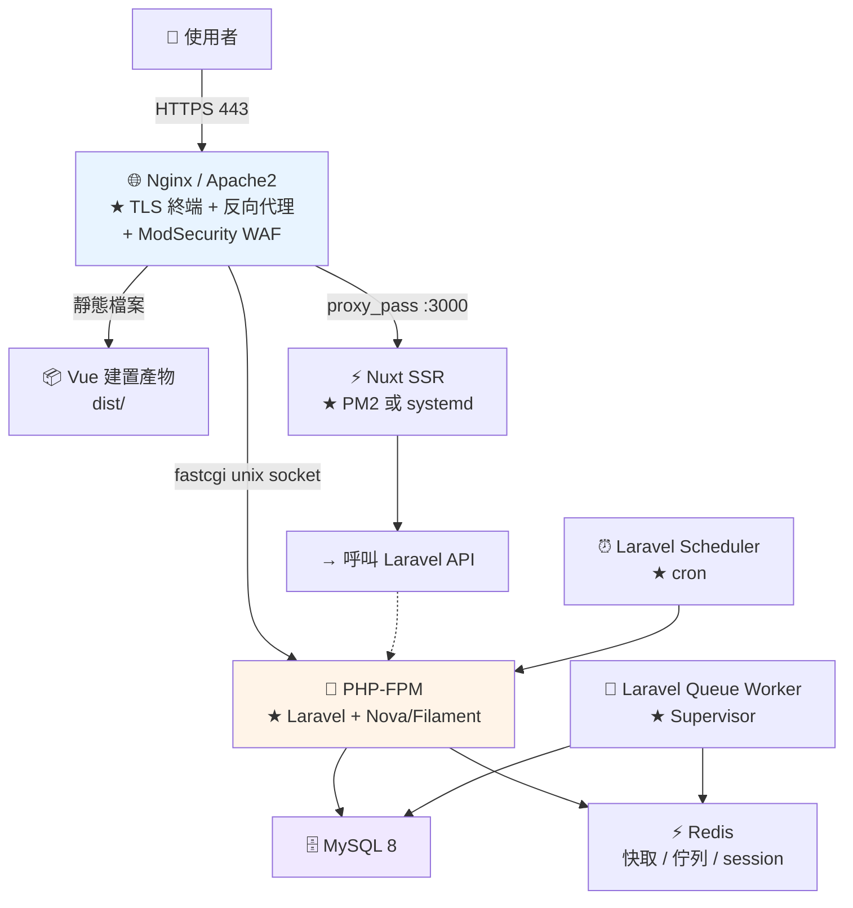

# 部署共通觀念

> [!abstract] 這篇你會學到
> - **LXMP 架構全貌**（本章所有教學的共同基礎）
> - **環境分離**（dev / staging / production）
> - **標準目錄佈局**與 `releases` / `current` / `shared`
> - **權限模型**（誰擁有檔案、誰執行服務）
> - **★★ 零停機切換**的原子操作
> - **從 GitHub 專案部署**的三種模式
> - **回退機制**與部署後驗證

## 前置知識

- [[01-Web伺服器概論]] — 反向代理與靜態／動態
- [[01-Git-觀念與初次設定]] — Git 基本操作

---

## LXMP 架構全貌 ★★



```
LXMP = Linux + (Nginx|Apache2) + MySQL + PHP
       ＋ 前端 Vue / Nuxt（含 PM2 與不含 PM2 兩種）
       ＋ 後端 Laravel Nova / Filament
       ＋ SSL（自簽憑證鏈 / 申請憑證）
       ＋ ModSecurity WAF

★★ 本章所有教學都以這一套為基礎，
   從 GitHub 上「已完成開發的專案」開始部署。
```

| 層 | 元件 | 本手冊對應章節 |
| --- | --- | --- |
| TLS / 反代 | Nginx（主線）／Apache2 | [[02-Nginx-設定語法與虛擬主機]] |
| WAF | ModSecurity + OWASP CRS | [[01-WAF概念與ModSecurity安裝]] |
| 憑證 | 自建 CA／Let's Encrypt | [[08-用自建CA簽發伺服器憑證]] |
| PHP | PHP-FPM 8.3 + OPcache | [[02-PHP-FPM設定與Pool調校]] |
| 後端 | Laravel 11 + Nova／Filament | [[05-Laravel-Filament部署]] |
| 前端 | Vue 3（SPA）／Nuxt 3（SSR） | [[01-Vue-建置與Nginx靜態部署]] |
| 程序管理 | PM2／systemd／Supervisor | [[03-PM2-程序管理入門]] |
| 資料庫 | MySQL 8 | [[01-MySQL-安裝與初始化]] |
| 快取／佇列 | Redis | [[04-Redis快取入門]] |

---

## 環境分離 ★★

| | development | staging | production |
| --- | --- | --- | --- |
| 用途 | 開發者本機 | **上線前驗收** | 正式服務 |
| 資料 | 假資料 | **正式資料的副本（★ 去識別化）** | 正式資料 |
| 除錯 | `APP_DEBUG=true` | **`false`** | **`false`** ★★ |
| 網域 | `app.test` | `staging.example.gov.tw` | `app.example.gov.tw` |
| 憑證 | 自簽 | 內部 CA | **公信 CA 或內部 CA** |
| OPcache | `validate_timestamps=1` | `0` | **`0`** ★ |
| 錯誤顯示 | 畫面上 | **只寫 log** | **只寫 log** ★★ |
| 搜尋引擎 | — | **`noindex`** ★ | 允許 |

> [!danger] `APP_DEBUG=true` 上正式環境的後果 ★★★
> ```
> Laravel 的錯誤頁（Ignition）會顯示：
>   · ★★★ 【完整的 .env 內容】（DB 密碼、APP_KEY、API 金鑰）
>   · 完整的檔案路徑與原始碼片段
>   · 資料庫查詢與參數
>   · 所有的環境變數
>
> ★★ 只要觸發任何一個錯誤，攻擊者就拿到全部的機密
>
> ★ 檢查：
>   grep -E '^APP_DEBUG|^APP_ENV' /var/www/app/current/.env
>   應該是：
>     APP_ENV=production
>     APP_DEBUG=false
> ```

```bash
# ★★ 部署腳本裡一定要有這個檢查
$ check_env() {
    local env_file="$1"
    grep -q '^APP_ENV=production' "$env_file" || { echo "✗✗ APP_ENV 不是 production"; return 1; }
    grep -q '^APP_DEBUG=false'    "$env_file" || { echo "✗✗✗ APP_DEBUG 不是 false"; return 1; }
    grep -q '^APP_KEY=base64:'    "$env_file" || { echo "✗ APP_KEY 沒設定"; return 1; }
    echo "  ✓ 環境設定檢查通過"
}
```

```nginx
# ★ staging 環境要擋搜尋引擎與外部存取
server {
    server_name staging.example.gov.tw;

    add_header X-Robots-Tag "noindex, nofollow" always;   # ★

    # ★ 限制來源（只允許內網）
    allow 10.0.0.0/8;
    allow 172.16.0.0/12;
    deny  all;

    # ★ 或用 HTTP Basic 認證
    # auth_basic "Staging";
    # auth_basic_user_file /etc/nginx/.htpasswd-staging;
}
```

---

## 標準目錄佈局 ★★★

```
/var/www/app/                       ★ 專案根目錄
├── releases/                       ★★ 每次部署一個新目錄
│   ├── 20260825-143022/
│   ├── 20260826-091544/
│   ├── 20260827-160312/
│   ├── 20260828-101530/            ← 上一版（★ 保留可回退）
│   └── 20260828-153045/            ← ★ 這一版
│
├── current -> releases/20260828-153045    ★★★ 符號連結（原子切換的關鍵）
│
├── shared/                         ★★ 跨版本共用（不隨部署更換）
│   ├── .env                        ★★ 環境設定（★ 不進 git）
│   ├── storage/                    ★ Laravel 的上傳檔案與日誌
│   │   ├── app/
│   │   ├── framework/{cache,sessions,views}
│   │   └── logs/
│   └── public/uploads/             ★ 使用者上傳
│
└── repo/                           ★ git bare 或 cache（加速 clone）
```

> [!danger] 為什麼要 `releases` + `current` 符號連結 ★★★
> ```
> ❌ 傳統做法：直接 git pull 到 /var/www/app
>   問題：
>     · ★★ pull 到一半時網站是【壞的】（檔案新舊混雜）
>     · composer install 執行中，網站也是壞的
>     · ★★★ 出錯時【無法快速回退】
>     · 舊的檔案不會被刪除（前一版留下的殘檔）
>
> ✅ releases + current：
>   ① 在【新目錄】完整準備好（clone、composer、npm build、快取）
>   ② ★★ 準備期間網站【完全不受影響】（還在跑舊版）
>   ③ ★★★ 一個【原子操作】切換符號連結
>   ④ reload 服務
>   ⑤ 出錯 → ★ 把符號連結指回上一版就好（3 秒回退）
> ```

```bash
# ═══ ★★★ 原子切換的關鍵 ═══
# ❌ 錯誤做法：ln -sfn 直接對已存在的符號連結
$ ln -sfn "$NEW" /var/www/app/current
# ★★ 若 current 已存在且是符號連結，ln 會把新連結建在【目錄裡面】
#    變成 /var/www/app/current/20260828-153045 —— 完全錯誤

# ✅ ★★★ 正確做法：先建暫時連結，再用 mv -T 原子覆蓋
$ ln -sfn "$NEW" /var/www/app/current.tmp
$ mv -Tf /var/www/app/current.tmp /var/www/app/current
# ★ mv -T = 把目標當成【檔案】而不是目錄
# ★ rename(2) 是原子操作 —— 沒有「中間狀態」
```

```bash
# ★ 驗證原子性（另一個 terminal 持續讀）
$ while true; do readlink /var/www/app/current; done | uniq
releases/20260828-101530
releases/20260828-153045          # ★ 只有兩個值，沒有中間狀態
```

### `shared` 的符號連結

```bash
# ★★ 每次部署後，把 shared 的東西連進新版本
$ NEW=/var/www/app/releases/20260828-153045
$ SHARED=/var/www/app/shared

# .env
$ ln -sfn "$SHARED/.env" "$NEW/.env"

# ★ Laravel 的 storage（★ 必須共用，否則上傳的檔案會消失）
$ rm -rf "$NEW/storage"
$ ln -sfn "$SHARED/storage" "$NEW/storage"

# ★ 公開的上傳目錄
$ mkdir -p "$NEW/public"
$ ln -sfn "$SHARED/public/uploads" "$NEW/public/uploads"
```

> [!danger] `storage` 不共用的後果 ★★
> ```
> Laravel 的 storage/ 存放：
>   · app/public/         使用者上傳的檔案
>   · framework/sessions/ 登入狀態（★ 檔案式 session）
>   · framework/cache/    快取
>   · logs/               日誌
>
> ★★ 不共用的話，每次部署：
>   · 【所有上傳的檔案消失】
>   · 【所有使用者被登出】
>   · 日誌斷掉
>
> ★ 正確：storage 放 shared，用符號連結接進每個 release
> ```

---

## 權限模型 ★★★

```
★★ 核心原則：【部署使用者】與【執行使用者】分開

  deploy   ← 部署用（git clone、composer、npm build）
            ★ 擁有檔案，可寫

  www-data ← 服務執行（Nginx worker、PHP-FPM）
            ★★ 只能【讀】程式碼，只能寫 storage 與 cache
```

```bash
# ═══ ★★ 建立部署使用者 ═══
$ sudo useradd -m -s /bin/bash deploy
$ sudo usermod -aG www-data deploy          # ★ 讓 deploy 能設定 www-data 的群組權限

# ═══ ★★★ 標準權限設定 ═══
$ APP=/var/www/app

# ★ 程式碼：deploy 擁有，www-data 唯讀
$ sudo chown -R deploy:www-data "$APP"
$ sudo find "$APP/current/" -type d -exec chmod 750 {} \;
$ sudo find "$APP/current/" -type f -exec chmod 640 {} \;

# ★★ 只有這兩個目錄 www-data 需要【寫入】
$ sudo chmod -R 770 "$APP/shared/storage"
$ sudo chmod -R 770 "$APP/current/bootstrap/cache"

# ★ setgid：新建的檔案自動繼承群組
$ sudo find "$APP/shared/storage" -type d -exec chmod g+s {} \;

# ★ 驗證
$ sudo -u www-data test -r "$APP/current/public/index.php" && echo "✓ www-data 可讀程式碼"
$ sudo -u www-data test -w "$APP/current/public/index.php" && echo "✗✗ www-data 可寫程式碼（危險）" || echo "✓ www-data 不可寫程式碼"
$ sudo -u www-data test -w "$APP/shared/storage" && echo "✓ www-data 可寫 storage"
```

> [!danger] `chmod -R 777` 是災難 ★★★
> ```
> ❌ 網路上很多教學會說「權限問題就 chmod -R 777」
>
> 後果：
>   · ★★★ 【www-data 可以寫入所有程式碼】
>     → 一個檔案上傳漏洞 = 直接寫 webshell 進去
>   · 系統上【任何使用者】都能改你的程式碼
>   · 排程工作、其他服務也能改
>
> ★★ 正確：
>   程式碼   750 / 640   deploy:www-data    （www-data 唯讀）
>   storage  770         deploy:www-data    （www-data 可寫）
>   .env     640         deploy:www-data    （★★ 絕不 644）
> ```

```bash
# ★★ .env 的權限（含資料庫密碼）
$ sudo chown deploy:www-data /var/www/app/shared/.env
$ sudo chmod 640 /var/www/app/shared/.env

# ★★★ 確認 .env 不可從網路存取
$ curl -sI https://app.example.gov.tw/.env | head -1
HTTP/2 404              # ★ 必須是 404 或 403

# ★ Nginx 的防護
# location ~ /\. { deny all; }
```

### PHP-FPM 的 pool 使用者

```ini
; /etc/php/8.3/fpm/pool.d/app.conf
[app]
user  = www-data
group = www-data

listen = /run/php/php8.3-fpm-app.sock
listen.owner = www-data
listen.group = www-data
listen.mode  = 0660

pm = dynamic
pm.max_children      = 20        ; ★ 依實際 RSS 計算，不是用 memory_limit
pm.start_servers     = 4
pm.min_spare_servers = 2
pm.max_spare_servers = 6
pm.max_requests      = 500       ; ★ 防記憶體洩漏

; ★★ 安全限制
php_admin_value[open_basedir] = /var/www/app/current:/var/www/app/shared:/tmp
php_admin_value[disable_functions] = exec,passthru,shell_exec,system,proc_open,popen
php_admin_flag[expose_php] = off

; ★ 慢查詢
slowlog = /var/log/php-fpm/app-slow.log
request_slowlog_timeout = 5s
```

> [!warning] `open_basedir` 擋不住 `exec()` ★★
> ```
> open_basedir 只限制【PHP 的檔案系統函式】
>   → fopen()、include()、file_get_contents() 會被擋
>   → ★★ 但 exec('cat /etc/passwd') 【不受限制】
>
> ★★ 必須【兩個都設】：
>   open_basedir       限制檔案存取範圍
>   disable_functions  停用 exec 系列
> ```

---

## 從 GitHub 專案部署 ★★★

### 三種模式

| 模式 | 適用 | 優點 | 缺點 |
| --- | --- | --- | --- |
| **① 伺服器上 clone + build** ★ | 一般專案 | 簡單、不用另外的建置機 | 伺服器要裝 node/composer |
| **② CI 建置 + 傳產物** ★★ | 正式環境 | **伺服器乾淨**、建置可重現 | 需要 CI |
| **③ 容器映像** | 容器化環境 | 環境一致、易擴充 | 需要 registry |

### ★★ 模式①：伺服器上 clone

```bash
# ═══ 【1】設定部署金鑰（★ Deploy Key，唯讀）═══
$ sudo -u deploy ssh-keygen -t ed25519 -f /home/deploy/.ssh/id_ed25519_deploy -N '' \
    -C "deploy@$(hostname)"
$ sudo cat /home/deploy/.ssh/id_ed25519_deploy.pub
ssh-ed25519 AAAAC3... deploy@web01

# ★★ 把這把公鑰加到 GitHub：
#   Repo → Settings → Deploy keys → Add deploy key
#   ★ 【不要】勾「Allow write access」（部署只需要讀）

# ★ SSH 設定
$ sudo -u deploy tee /home/deploy/.ssh/config >/dev/null <<'EOF'
Host github.com
    HostName github.com
    User git
    IdentityFile ~/.ssh/id_ed25519_deploy
    IdentitiesOnly yes
EOF
$ sudo chmod 600 /home/deploy/.ssh/config

# ★ 測試
$ sudo -u deploy ssh -T git@github.com
Hi Information-Study/myapp! You've successfully authenticated,
but GitHub does not provide shell access.
```

> [!danger] 部署金鑰的選擇 ★★
> ```
> ① ★★ Deploy Key（推薦）
>      · 綁定【單一 repo】
>      · ★ 只給讀取權限（不勾 write）
>      · 一台伺服器一把（★ 不要共用）
>      · 伺服器被入侵 → 只影響這一個 repo
>
> ② ❌ 個人的 SSH key
>      · 攻擊者拿到 = 你【所有 repo】的權限（可能含寫入）
>
> ③ ★ Machine User（多 repo 時）
>      · 建一個專用的 GitHub 帳號
>      · 只給需要的 repo 的唯讀權限
>
> ④ Fine-grained PAT（HTTPS 方式）
>      · 可設定到期日與精確權限
>      · ★ 但要小心存在哪裡（不要進 git、不要在指令列）
> ```

```bash
# ═══ 【2】★★ 部署腳本 ═══
#!/usr/bin/env bash
# /usr/local/bin/deploy-app —— 從 GitHub 部署（模式①）
set -euo pipefail

APP=/var/www/app
REPO="git@github.com:Information-Study/myapp.git"
BRANCH="${BRANCH:-main}"
KEEP=5                                    # ★ 保留幾個舊版本
REL="$APP/releases/$(date +%Y%m%d-%H%M%S)"

log() { echo -e "\033[36m[$(date +%T)]\033[0m $*"; }
die() { echo -e "\033[31m✗ $*\033[0m" >&2; exit 1; }

log "═══ 部署 $BRANCH → $REL ═══"

# ══ 【1】前置檢查 ══
[ "$(whoami)" = deploy ] || die "必須用 deploy 使用者執行"
[ -f "$APP/shared/.env" ] || die "找不到 $APP/shared/.env"
grep -q '^APP_DEBUG=false' "$APP/shared/.env" || die "★★ APP_DEBUG 不是 false"
grep -q '^APP_ENV=production' "$APP/shared/.env" || die "★★ APP_ENV 不是 production"

# ══ 【2】clone ══
log "【2】clone $REPO ($BRANCH)"
mkdir -p "$REL"
git clone --depth 1 --branch "$BRANCH" --single-branch "$REPO" "$REL" 2>&1 | sed 's/^/    /'
COMMIT=$(cd "$REL" && git rev-parse --short HEAD)
MSG=$(cd "$REL" && git log -1 --pretty=%s)
log "    commit: $COMMIT — $MSG"
rm -rf "$REL/.git"                        # ★ 部署後不需要 .git（★ 也避免洩漏）

# ══ 【3】連結 shared ══
log "【3】連結 shared"
ln -sfn "$APP/shared/.env" "$REL/.env"
rm -rf "$REL/storage" && ln -sfn "$APP/shared/storage" "$REL/storage"
[ -d "$APP/shared/public/uploads" ] && {
    mkdir -p "$REL/public"
    ln -sfn "$APP/shared/public/uploads" "$REL/public/uploads"
}

# ══ 【4】後端相依 ══
log "【4】composer install"
cd "$REL"
composer install --no-dev --optimize-autoloader --no-interaction --prefer-dist 2>&1 | tail -5 | sed 's/^/    /'

# ══ 【5】前端建置 ══
if [ -f "$REL/package.json" ]; then
    log "【5】npm ci && npm run build"
    npm ci --no-audit --no-fund 2>&1 | tail -3 | sed 's/^/    /'
    npm run build 2>&1 | tail -5 | sed 's/^/    /'
    rm -rf "$REL/node_modules"            # ★ 建置完就不需要了（省空間）
fi

# ══ 【6】Laravel 最佳化 ══
log "【6】Laravel 最佳化"
php artisan config:cache  --no-interaction
php artisan route:cache   --no-interaction
php artisan view:cache    --no-interaction
php artisan event:cache   --no-interaction 2>/dev/null || true
php artisan storage:link  --no-interaction 2>/dev/null || true

# ══ 【7】★★ 資料庫遷移 ══
log "【7】資料庫遷移"
php artisan migrate --force --no-interaction 2>&1 | sed 's/^/    /'
# ★★ --force 在 production 是必要的（否則會互動詢問）
# ★★★ 遷移前應該先備份 —— 見下方「遷移的風險」

# ══ 【8】權限 ══
log "【8】設定權限"
find "$REL" -type d -exec chmod 750 {} \;
find "$REL" -type f -exec chmod 640 {} \;
chmod -R 770 "$APP/shared/storage" "$REL/bootstrap/cache"
chmod 755 "$REL/artisan"

# ══ 【9】★★ 切換前的健康檢查 ══
log "【9】★★ 切換前檢查"
[ -f "$REL/public/index.php" ] || die "找不到 public/index.php"
[ -d "$REL/vendor" ]           || die "vendor 不存在"
php -l "$REL/public/index.php" >/dev/null || die "index.php 語法錯誤"
php "$REL/artisan" --version   >/dev/null || die "artisan 無法執行"
[ -f "$REL/package.json" ] && { [ -d "$REL/public/build" ] || [ -d "$REL/dist" ] || \
  echo "    ⚠ 找不到前端建置產物"; }
log "    ✓ 通過"

# ══ 【10】★★★ 原子切換 ══
PREV=$(readlink "$APP/current" 2>/dev/null || echo "")
log "【10】★★★ 原子切換"
ln -sfn "$REL" "$APP/current.tmp"
mv -Tf "$APP/current.tmp" "$APP/current"
log "    $PREV → $(readlink "$APP/current")"

# ══ 【11】重載服務 ══
log "【11】重載服務"
sudo systemctl reload php8.3-fpm
sudo nginx -t && sudo systemctl reload nginx
sudo supervisorctl restart laravel-worker: 2>/dev/null || true
log "    ✓ 完成"

# ══ 【12】★★★ 部署後驗證 ══
log "【12】★★★ 驗證"
sleep 2
CODE=$(curl -sf -o /dev/null -w '%{http_code}' --max-time 15 https://app.example.gov.tw/ || echo 000)
if [ "$CODE" != 200 ]; then
    echo -e "\033[31m    ✗✗ HTTP $CODE —— 自動回退\033[0m"
    if [ -n "$PREV" ]; then
        ln -sfn "$PREV" "$APP/current.tmp"
        mv -Tf "$APP/current.tmp" "$APP/current"
        sudo systemctl reload php8.3-fpm
        echo "    ✓ 已回退到 $PREV"
    fi
    exit 1
fi
log "    ✓ HTTP $CODE"

# ★ 版本端點驗證（若應用有提供）
VER=$(curl -sf --max-time 10 https://app.example.gov.tw/api/version 2>/dev/null || echo "")
[ -n "$VER" ] && log "    版本端點：$VER"

# ══ 【13】清理舊版本 ══
log "【13】清理（保留 $KEEP 個）"
cd "$APP/releases"
ls -1dt */ 2>/dev/null | tail -n +$((KEEP+1)) | while read -r d; do
    echo "    刪除 $d"
    rm -rf "$d"
done

log "═══ ✓ 部署完成：$COMMIT ═══"
```

> [!danger] 資料庫遷移的風險 ★★★
> ```
> php artisan migrate --force 是【不可逆】的操作
>
> ★★ 遷移前必須：
>   ① 備份資料庫
>        mysqldump --single-transaction --routines --triggers \
>          -u root -p appdb | gzip > /backup/appdb-$(date +%Y%m%d%H%M%S).sql.gz
>   ② 在 staging 先跑過同樣的遷移
>   ③ ★ 檢視這次會執行哪些遷移
>        php artisan migrate:status
>
> ★★★ 危險的遷移（會鎖表或無法回退）：
>   · DROP COLUMN / DROP TABLE
>   · 大表的 ALTER TABLE（★ MySQL 8 大多是 online DDL，但仍要小心）
>   · 改變欄位型別
>   · 加 NOT NULL 且沒有預設值的欄位
>
> ★ 安全的做法（向後相容的遷移）：
>   ① 先部署「同時支援新舊 schema」的程式碼
>   ② 再執行遷移
>   ③ 確認穩定後才移除舊欄位（下一次部署）
> ```

### ★★ 模式②：CI 建置 + 傳產物

```yaml
# .github/workflows/deploy.yml
name: 部署到正式環境

on:
  push:
    tags: ['v*']              # ★ 只有打 tag 才部署
  workflow_dispatch:          # ★ 允許手動觸發

concurrency:
  group: production           # ★★ 避免兩個部署同時跑
  cancel-in-progress: false

jobs:
  build:
    runs-on: ubuntu-latest
    steps:
      - uses: actions/checkout@v4

      # ══ PHP ══
      - uses: shivammathur/setup-php@v2
        with:
          php-version: '8.3'
          extensions: mbstring, xml, curl, zip, bcmath, intl, pdo_mysql, redis
          coverage: none

      - name: 快取 composer
        uses: actions/cache@v4
        with:
          path: vendor
          key: composer-${{ hashFiles('composer.lock') }}

      - run: composer install --no-dev --optimize-autoloader --no-interaction --prefer-dist

      # ══ Node ══
      - uses: actions/setup-node@v4
        with:
          node-version: '22'
          cache: npm

      - run: npm ci --no-audit --no-fund
      - run: npm run build

      # ══ ★ 測試（★ 失敗就不部署）══
      - name: 測試
        run: |
          cp .env.example .env
          php artisan key:generate
          php artisan test

      # ══ ★★ 打包（★ 排除不需要的東西）══
      - name: 打包
        run: |
          tar czf release.tar.gz \
            --exclude='.git' \
            --exclude='node_modules' \
            --exclude='tests' \
            --exclude='.github' \
            --exclude='storage/logs/*' \
            --exclude='.env' \
            .
          ls -lh release.tar.gz

      - uses: actions/upload-artifact@v4
        with:
          name: release
          path: release.tar.gz
          retention-days: 7

  deploy:
    needs: build
    runs-on: ubuntu-latest
    environment: production            # ★★ 需要人工核准（在 repo 設定）
    steps:
      - uses: actions/download-artifact@v4
        with: { name: release }

      - name: 設定 SSH
        run: |
          mkdir -p ~/.ssh
          echo "${{ secrets.DEPLOY_SSH_KEY }}" > ~/.ssh/id_ed25519
          chmod 600 ~/.ssh/id_ed25519
          # ★★ 用 known_hosts 防中間人（不要用 StrictHostKeyChecking=no）
          echo "${{ secrets.DEPLOY_KNOWN_HOSTS }}" > ~/.ssh/known_hosts

      - name: 上傳並部署
        env:
          H: ${{ secrets.DEPLOY_HOST }}
          U: ${{ secrets.DEPLOY_USER }}
        run: |
          REL=$(date +%Y%m%d-%H%M%S)
          scp release.tar.gz "$U@$H:/tmp/release-$REL.tar.gz"
          ssh "$U@$H" "REL=$REL bash -s" <<'SCRIPT'
          set -euo pipefail
          APP=/var/www/app
          DIR="$APP/releases/$REL"
          PREV=$(readlink "$APP/current" 2>/dev/null || echo "")

          mkdir -p "$DIR"
          tar xzf "/tmp/release-$REL.tar.gz" -C "$DIR"
          rm -f "/tmp/release-$REL.tar.gz"

          ln -sfn "$APP/shared/.env" "$DIR/.env"
          rm -rf "$DIR/storage" && ln -sfn "$APP/shared/storage" "$DIR/storage"

          cd "$DIR"
          php artisan config:cache
          php artisan route:cache
          php artisan view:cache
          php artisan migrate --force

          find "$DIR" -type d -exec chmod 750 {} \;
          find "$DIR" -type f -exec chmod 640 {} \;
          chmod -R 770 "$APP/shared/storage" "$DIR/bootstrap/cache"

          # ★★★ 原子切換
          ln -sfn "$DIR" "$APP/current.tmp"
          mv -Tf "$APP/current.tmp" "$APP/current"

          sudo systemctl reload php8.3-fpm
          sudo systemctl reload nginx
          sudo supervisorctl restart laravel-worker: || true

          # ★★ 驗證
          sleep 2
          CODE=$(curl -sf -o /dev/null -w '%{http_code}' https://app.example.gov.tw/ || echo 000)
          if [ "$CODE" != 200 ]; then
              echo "✗✗ HTTP $CODE，回退"
              [ -n "$PREV" ] && { ln -sfn "$PREV" "$APP/current.tmp"; mv -Tf "$APP/current.tmp" "$APP/current"; }
              sudo systemctl reload php8.3-fpm
              exit 1
          fi
          echo "✓ 部署成功 HTTP $CODE"

          cd "$APP/releases" && ls -1dt */ | tail -n +6 | xargs -r rm -rf
SCRIPT
```

```bash
# ★★ 產生 known_hosts（放進 secrets，★ 不要用 StrictHostKeyChecking=no）
$ ssh-keyscan -t ed25519 web01.example.gov.tw
```

> [!danger] CI 部署的三個安全要點 ★★
> ```
> ① ★★ 【不要】用 StrictHostKeyChecking=no
>      → 等於接受任何主機的金鑰 → 中間人攻擊
>      → ★ 用 ssh-keyscan 產生 known_hosts 放進 secrets
>
> ② ★★ 部署使用者的 sudo 權限要【最小化】
>      # /etc/sudoers.d/deploy
>      deploy ALL=(root) NOPASSWD: /bin/systemctl reload php8.3-fpm
>      deploy ALL=(root) NOPASSWD: /bin/systemctl reload nginx
>      deploy ALL=(root) NOPASSWD: /usr/sbin/nginx -t
>      deploy ALL=(root) NOPASSWD: /usr/bin/supervisorctl restart laravel-worker\:*
>      # ★★★ 絕對不要給 NOPASSWD: ALL
>
> ③ ★★ environment: production + 人工核准
>      → GitHub repo → Settings → Environments → production
>        → Required reviewers
>      → 避免誤觸發部署
> ```

---

## 完整實戰範例：一鍵回退

```bash
#!/usr/bin/env bash
# /usr/local/bin/rollback-app —— 快速回退到上一版
set -euo pipefail
APP=/var/www/app

CUR=$(readlink "$APP/current")
echo "═══ 回退 ═══"
echo "  目前版本：$CUR"
echo
echo "  可用的版本："
cd "$APP/releases"
ls -1dt */ | head -10 | nl -w4 -s'. ' | sed 's|/$||' | sed 's/^/  /'
echo

if [ $# -ge 1 ]; then
    TARGET="$APP/releases/$1"
else
    # ★ 預設回退到上一版
    TARGET="$APP/releases/$(ls -1dt */ | sed 's|/$||' | sed -n '2p')"
fi

[ -d "$TARGET" ] || { echo "✗ 找不到 $TARGET"; exit 1; }
[ "$TARGET" = "$CUR" ] && { echo "✗ 目標與目前相同"; exit 1; }

echo "  回退到：$TARGET"
read -rp "  確認？(yes/no) " a; [ "$a" = yes ] || exit 0

# ★★★ 原子切換
ln -sfn "$TARGET" "$APP/current.tmp"
mv -Tf "$APP/current.tmp" "$APP/current"

sudo systemctl reload php8.3-fpm
sudo nginx -t && sudo systemctl reload nginx
sudo supervisorctl restart laravel-worker: 2>/dev/null || true

sleep 2
CODE=$(curl -sf -o /dev/null -w '%{http_code}' https://app.example.gov.tw/ || echo 000)
echo "  HTTP $CODE"
[ "$CODE" = 200 ] && echo "  ✓ 回退成功" || echo "  ✗ 仍有問題，檢查日誌"

cat <<'EOF'

  ★★ 注意：回退【不會回退資料庫遷移】
     若這次部署有 migration，可能需要：
       php artisan migrate:rollback --step=1
     ★ 但這也是危險操作 —— 先評估影響
EOF
```

> [!danger] 回退不會回退資料庫 ★★★
> ```
> ★★ 符號連結回退是【瞬間、安全】的
>    但【資料庫遷移已經執行了】
>
> 情境：
>   新版加了一個欄位 → 部署 → 出問題 → 回退程式碼
>   → ★ 舊版程式碼不知道那個欄位存在 → 通常沒事（多一個欄位無妨）
>
>   新版【刪除】了一個欄位 → 部署 → 回退
>   → ★★★ 舊版程式碼要用那個欄位 → 【整個壞掉】
>
> ★★ 所以遷移要「向後相容」：
>   ① 加欄位、加表 → 安全（舊版忽略它）
>   ② ★★ 刪欄位、改型別 → 危險
>      → 分兩次部署：
>        第一次：程式碼不再用該欄位（但欄位還在）
>        第二次（確認穩定後）：才真正 DROP COLUMN
> ```

---

## 常見錯誤與排錯

| 現象 | 原因 | 解法 |
| --- | --- | --- |
| **`ln -sfn` 把連結建到目錄裡** ★★★ | `current` 已是符號連結 | 用 `ln -sfn X current.tmp && mv -Tf current.tmp current` |
| **部署後上傳的檔案不見** ★★ | `storage` 沒共用 | `storage` 放 `shared` 用符號連結 |
| **部署後使用者全被登出** ★★ | session 存在 `storage` 且沒共用 | 同上；或改用 Redis session |
| **500 錯誤：`Permission denied`** ★★ | `storage`/`bootstrap/cache` 不可寫 | `chmod -R 770` 這兩個目錄 |
| **`.env` 可以被下載** ★★★ | Nginx 沒擋 | `location ~ /\. { deny all; }` |
| **改了設定沒生效** ★★ | `config:cache` 快取住了 | `php artisan config:clear && config:cache` |
| `Class not found` | autoload 沒更新 | `composer dump-autoload -o` |
| **OPcache 沒更新** ★★ | `validate_timestamps=0` | 部署後 `systemctl reload php8.3-fpm` |
| **queue worker 跑舊程式碼** ★★★ | worker 是長駐程序 | `supervisorctl restart laravel-worker:` |
| **部署中網站壞掉** ★★ | 直接在 `current` 上操作 | 用 `releases` + 原子切換 |
| **回退後仍然壞掉** ★ | 資料庫遷移不可逆 | 遷移要向後相容 |
| `composer install` 記憶體不足 | PHP CLI `memory_limit` | `COMPOSER_MEMORY_LIMIT=-1` |
| **git clone 失敗：Permission denied** | Deploy key 沒設好 | `ssh -T git@github.com` 測試 |
| 磁碟滿 | `releases` 累積太多 | 只保留 5 個 |
| **兩個部署同時跑** ★ | 沒有鎖 | CI 用 `concurrency`；腳本用 `flock` |

```bash
# ★★ 用 flock 避免同時部署
$ exec 200>/var/lock/deploy-app.lock
$ flock -n 200 || { echo "✗ 已有部署在進行中"; exit 1; }
# ... 部署流程 ...
```

---

## 安全性注意事項

> [!danger] 部署相關的五個高風險項目 ★★★
> ```
> ① ★★★ APP_DEBUG=true 上正式環境
>      → 錯誤頁顯示【完整的 .env】（含 DB 密碼、API 金鑰）
>
> ② ★★★ .env 可以從網路存取
>      → curl https://app/.env 應該是 404
>      → Nginx：location ~ /\. { deny all; }
>
> ③ ★★★ chmod -R 777
>      → 檔案上傳漏洞 = 直接寫 webshell
>
> ④ ★★ .git 目錄留在 web root
>      → curl https://app/.git/config
>      → ★ 可以用 git-dumper 還原【整個原始碼與歷史】
>      → 部署後 rm -rf .git，Nginx 也要擋
>
> ⑤ ★★ 部署使用者有 NOPASSWD: ALL
>      → CI 的金鑰外洩 = 伺服器完全淪陷
>      → 只給必要的 systemctl reload
> ```

```bash
# ★★★ 部署後的安全自檢
$ sudo tee /usr/local/bin/deploy-security-check >/dev/null <<'EOF'
#!/usr/bin/env bash
URL="${1:-https://app.example.gov.tw}"
APP=/var/www/app
FAIL=0

echo "═══ 部署安全自檢 ═══"

chk() { printf '  %-40s ' "$1"; if eval "$2"; then echo "✓"; else echo "✗"; FAIL=$((FAIL+1)); fi; }

echo -e "\n【設定】"
chk "APP_ENV=production"   "grep -q '^APP_ENV=production' $APP/shared/.env"
chk "★★ APP_DEBUG=false"    "grep -q '^APP_DEBUG=false' $APP/shared/.env"
chk "APP_KEY 已設定"        "grep -q '^APP_KEY=base64:' $APP/shared/.env"
chk "SESSION_SECURE_COOKIE" "grep -q '^SESSION_SECURE_COOKIE=true' $APP/shared/.env"

echo -e "\n【權限】"
chk ".env 權限 640"         "[ \$(stat -c %a $APP/shared/.env) -le 640 ]"
chk "★★ 程式碼不可被 www-data 寫" \
    "! sudo -u www-data test -w $APP/current/public/index.php"
chk "storage 可寫"          "sudo -u www-data test -w $APP/shared/storage"
chk "★ 沒有 777 的目錄"      "! find $APP/current -type d -perm -o+w 2>/dev/null | grep -q ."

echo -e "\n【網路可存取性】"
for p in /.env /.git/config /composer.json /storage/logs/laravel.log /.env.example; do
    printf '  %-40s ' "$p 應該擋住"
    C=$(curl -sk -o /dev/null -w '%{http_code}' --max-time 10 "$URL$p")
    if [ "$C" = 404 ] || [ "$C" = 403 ]; then echo "✓ ($C)"; else echo "✗✗ ($C)"; FAIL=$((FAIL+1)); fi
done

echo -e "\n【檔案系統】"
chk "★ .git 已移除"          "[ ! -d $APP/current/.git ]"
chk "node_modules 已移除"    "[ ! -d $APP/current/node_modules ]"
chk "tests 已移除或無法存取"  "[ ! -d $APP/current/tests ] || true"

echo -e "\n【服務】"
chk "HTTPS 正常"            "curl -sf -o /dev/null $URL/"
chk "HTTP 轉址到 HTTPS"      "curl -sI ${URL/https/http}/ | grep -qE '30[128]'"
chk "HSTS 標頭"             "curl -skI $URL/ | grep -qi strict-transport-security"
chk "★ 沒有洩漏 PHP 版本"    "! curl -skI $URL/ | grep -qi 'x-powered-by'"
chk "★ 沒有洩漏 Nginx 版本"  "! curl -skI $URL/ | grep -qiE 'server:.*nginx/[0-9]'"

echo
[ "$FAIL" -eq 0 ] && echo "  ✓✓ 全部通過" || echo "  ✗✗ $FAIL 項未通過"
exit "$FAIL"
EOF
$ sudo chmod +x /usr/local/bin/deploy-security-check
$ deploy-security-check https://app.example.gov.tw
```

---

## 速查表

### ★★★ 標準目錄佈局

```
/var/www/app/
├── releases/20260828-153045/      每次部署一個新目錄
├── current -> releases/...        ★★★ 符號連結
└── shared/                        ★★ 跨版本共用
    ├── .env                       ★ 640 deploy:www-data
    ├── storage/                   ★★ 770（上傳/session/log）
    └── public/uploads/
```

### ★★★ 原子切換

```bash
# ❌ 錯誤（會建到目錄裡）
ln -sfn "$NEW" /var/www/app/current

# ✅ ★★★ 正確
ln -sfn "$NEW" /var/www/app/current.tmp
mv -Tf /var/www/app/current.tmp /var/www/app/current
```

### ★★★ 權限

```bash
程式碼   750/640  deploy:www-data   ★ www-data 唯讀
storage  770      deploy:www-data   ★ www-data 可寫
.env     640      deploy:www-data   ★★ 絕不 644

find current/ -type d -exec chmod 750 {} \;
find current/ -type f -exec chmod 640 {} \;
chmod -R 770 shared/storage current/bootstrap/cache
```

```
❌❌❌ chmod -R 777 = 檔案上傳漏洞直接變 webshell
```

### 部署流程 ★★

```
① clone / 解壓到新的 releases 目錄
② 連結 shared（.env、storage、uploads）
③ composer install --no-dev --optimize-autoloader
④ npm ci && npm run build
⑤ php artisan config:cache route:cache view:cache
⑥ ★★ php artisan migrate --force（★ 先備份資料庫）
⑦ 設定權限
⑧ ★★ 切換前健康檢查
⑨ ★★★ 原子切換符號連結
⑩ reload php-fpm / nginx / ★★ supervisorctl restart worker
⑪ ★★★ 部署後驗證（失敗自動回退）
⑫ 清理舊版本（保留 5 個）
```

### ★★ 部署後一定要做的三件事

```bash
sudo systemctl reload php8.3-fpm            # ★ OPcache
sudo systemctl reload nginx
sudo supervisorctl restart laravel-worker:  # ★★★ worker 是長駐程序！
```

### GitHub 部署金鑰

```bash
ssh-keygen -t ed25519 -f ~/.ssh/id_ed25519_deploy -N ''
# → GitHub Repo → Settings → Deploy keys
#   ★★ 不要勾 "Allow write access"

ssh -T git@github.com          # 測試
```

### ★★ 回退

```bash
ln -sfn "$PREV" /var/www/app/current.tmp
mv -Tf /var/www/app/current.tmp /var/www/app/current
sudo systemctl reload php8.3-fpm
```

```
★★★ 回退【不會回退資料庫遷移】
   → 加欄位／加表 = 安全（舊版忽略）
   → ★★ 刪欄位／改型別 = 危險
   → 分兩次部署：先讓程式碼不用它，確認穩定後才 DROP
```

### ★★★ 五個高風險項目

```
① APP_DEBUG=true      → 錯誤頁洩漏整個 .env
② .env 可下載          → curl https://app/.env 必須 404
③ chmod -R 777        → 上傳漏洞變 webshell
④ .git 留在 web root  → git-dumper 還原整個原始碼
⑤ deploy NOPASSWD:ALL → CI 金鑰外洩 = 伺服器淪陷
```

### sudoers 最小權限

```
# /etc/sudoers.d/deploy
deploy ALL=(root) NOPASSWD: /bin/systemctl reload php8.3-fpm
deploy ALL=(root) NOPASSWD: /bin/systemctl reload nginx
deploy ALL=(root) NOPASSWD: /usr/sbin/nginx -t
deploy ALL=(root) NOPASSWD: /usr/bin/supervisorctl restart laravel-worker\:*
```

---

## 練習題

> [!question]- 練習 1：原子切換的必要性
> 1. 建立 `releases/A` 與 `releases/B`，`current -> A`
> 2. **用 `ln -sfn B current`** → `ls -la` 看發生什麼事
> 3. **這就是最經典的部署事故**
> 4. 改用 `ln -sfn B current.tmp && mv -Tf current.tmp current`
> 5. 開一個迴圈 `while true; do readlink current; done | uniq`
>    邊跑邊切換 → **有中間狀態嗎？**

> [!question]- 練習 2：`storage` 不共用的後果
> 1. 部署一個 Laravel 應用，**`storage` 不做符號連結**
> 2. 上傳一個檔案、登入一個帳號
> 3. 執行第二次部署
> 4. **檔案還在嗎？還是登入狀態？**
> 5. 改成共用 `shared/storage` 再測一次
> 6. **把 session 改成 Redis** → 有什麼不同？

> [!question]- 練習 3：權限模型
> 1. 按標準設定權限（750/640/770）
> 2. `sudo -u www-data touch /var/www/app/current/test.php` → **成功嗎？**
> 3. `sudo -u www-data touch /var/www/app/shared/storage/test` → 成功嗎？
> 4. **故意 `chmod -R 777`**，再測一次
> 5. **模擬檔案上傳漏洞**：讓 www-data 寫一個 `.php` 到 web root
> 6. 恢復正確權限，確認寫不進去

> [!question]- 練習 4：完整的 GitHub 部署
> 1. 在 GitHub 建一個測試 repo（Laravel + Vue）
> 2. 設定 Deploy Key（**唯讀**）
> 3. 部署 `deploy-app` 腳本並執行
> 4. **故意讓建置失敗**（改壞 `package.json`）→ **網站有受影響嗎？**
> 5. 部署一個會回傳 500 的版本 → **自動回退了嗎？**
> 6. 用 `rollback-app` 手動回退

> [!question]- 練習 5：部署安全自檢
> 1. 部署 `deploy-security-check` 腳本
> 2. 對你的測試站台執行
> 3. **有幾項沒過？**
> 4. **故意製造問題**：
>    - 設 `APP_DEBUG=true`
>    - 不移除 `.git`
>    - Nginx 拿掉 `location ~ /\.`
> 5. 每一項都用 `curl` 驗證能不能真的存取到
> 6. **把這個腳本加進部署流程的最後一步**

---

## 小測驗

Q1. **為什麼要用 `releases` + `current` 符號連結，而不是直接 `git pull`**？

Q2. **`ln -sfn NEW current` 有什麼問題？正確的原子切換怎麼寫**？

Q3. **哪些東西必須放在 `shared`？不放的後果是什麼**？

Q4. **部署使用者與服務執行使用者為什麼要分開？各自的權限是什麼**？

Q5. **`APP_DEBUG=true` 上正式環境會洩漏什麼**？

Q6. **部署後一定要重載哪三個服務？為什麼 queue worker 特別重要**？

Q7. **`open_basedir` 為什麼擋不住 `exec()`**？

Q8. **回退符號連結為什麼不能解決所有問題**？

Q9. **什麼樣的資料庫遷移是「向後相容」的？不相容的要怎麼處理**？

Q10. **GitHub Deploy Key 為什麼不要勾「Allow write access」**？

> [!question]- 測驗答案
> **Q1.** **直接 `git pull` 的問題**：
> ①**pull 執行到一半時，網站是壞的**（檔案新舊混雜，有些類別已更新有些還沒）；
> ②`composer install` / `npm run build` 執行期間，網站同樣是壞的；
> ③**出錯時無法快速回退**（要再 `git checkout` 舊 commit，然後重跑 composer）；
> ④**舊版本留下的檔案不會被刪除**（刪掉的檔案還留在磁碟上，可能被誤用）。
> **`releases` + `current` 的做法**：
> 在**全新的目錄**裡完整準備好（clone、相依、建置、快取），
> **準備期間網站完全不受影響**（還在跑舊版），
> 然後用**一個原子操作**切換符號連結，
> 出錯時把連結指回上一版即可（**3 秒回退**）。
>
> **Q2.** **問題**：當 `current` 已經存在且是個**指向目錄的符號連結**時，
> `ln -sfn NEW current` 會把新連結**建立在該目錄「裡面」** ——
> 變成 `/var/www/app/current/20260828-153045`，完全不是預期的結果。
> 這是最經典的部署事故之一。
> **正確寫法**：
> ```bash
> ln -sfn "$NEW" /var/www/app/current.tmp
> mv -Tf /var/www/app/current.tmp /var/www/app/current
> ```
> **`mv -T`** 表示「把目標當成**檔案**而不是目錄」，
> 底層用的是 **`rename(2)` 系統呼叫，這是原子操作** ——
> 不存在「舊連結已刪除、新連結還沒建好」的中間狀態，
> 所以正在處理請求的 PHP-FPM worker 不會讀到不存在的路徑。
>
> **Q3.** **必須放 `shared` 的**：
> ①**`.env`**（環境設定，不進 git，每個環境不同）；
> ②**`storage/`**（Laravel 的上傳檔案、檔案式 session、快取、日誌）；
> ③**`public/uploads/`** 或其他使用者上傳的目錄。
> **不放的後果**：
> **每次部署，所有使用者上傳的檔案會消失**（新的 release 目錄是空的），
> **所有使用者被登出**（session 檔在舊的 storage 裡），
> **日誌斷掉**（每次部署換一個新的 log 檔）。
> 做法是把它們放在 `shared/`，
> 每次部署後用符號連結接進新的 release：
> ```bash
> ln -sfn "$APP/shared/.env" "$REL/.env"
> rm -rf "$REL/storage" && ln -sfn "$APP/shared/storage" "$REL/storage"
> ```
>
> **Q4.** **分開的目的是「最小權限」**。
> **`deploy`**（部署使用者）—— **擁有檔案，可以寫入**。
> 負責 `git clone`、`composer install`、`npm run build`、切換符號連結。
> **`www-data`**（服務執行使用者，Nginx worker 與 PHP-FPM）——
> **只能「讀」程式碼，只能寫 `storage` 與 `bootstrap/cache`**。
> **權限設定**：
> ```
> 程式碼   750 / 640   deploy:www-data    （www-data 唯讀）
> storage  770         deploy:www-data    （www-data 可寫）
> .env     640         deploy:www-data
> ```
> **關鍵理由**：如果 `www-data` 能寫程式碼，
> **一個檔案上傳漏洞就等於直接寫 webshell 進去** ——
> 攻擊者可以上傳 `.php` 檔並執行。
> 分開之後，就算應用層有漏洞，也寫不進可執行的程式碼目錄。
>
> **Q5.** Laravel 在 `APP_DEBUG=true` 時，
> 任何未捕捉的例外都會顯示 **Ignition 錯誤頁**，上面有：
> ①**★★★ 完整的 `.env` 內容** —— 資料庫帳密、`APP_KEY`、
> 第三方 API 金鑰、郵件密碼、Redis 密碼；
> ②完整的檔案路徑與**原始碼片段**；
> ③**執行過的資料庫查詢與參數**（可能含個資）；
> ④所有的環境變數。
> **攻擊者只要觸發任何一個錯誤**（例如送一個型別不對的參數）
> **就能拿到全部的機密**。
> `APP_KEY` 外洩還意味著攻擊者可以**偽造 session 與加密的 cookie**。
> **部署腳本一定要有這個檢查**：
> ```bash
> grep -q '^APP_DEBUG=false' .env || die "★★ APP_DEBUG 不是 false"
> ```
>
> **Q6.** ①**`systemctl reload php8.3-fpm`** ——
> 正式環境的 OPcache 設 `validate_timestamps=0`（不檢查檔案時間戳），
> 不 reload 的話**PHP 會繼續執行快取中的舊程式碼**；
> ②**`systemctl reload nginx`** —— 若設定或憑證有變更；
> ③**★★★ `supervisorctl restart laravel-worker:`** ——
> **queue worker 是長駐程序**，它在啟動時載入程式碼後就**一直跑同一份**，
> **不重啟的話會永遠執行舊版本的 Job 類別**。
> 這是最常被忘記、也最難察覺的一個 ——
> 網頁看起來已經是新版了，但背景處理的邏輯還是舊的，
> 造成「有些功能好了、有些沒好」的詭異狀況。
> 同理，Laravel 的 `queue:work` 應該搭配 `--max-jobs` 或 `--max-time` 讓它定期自我重啟。
>
> **Q7.** 因為 **`open_basedir` 只限制「PHP 自己的檔案系統函式」** ——
> `fopen()`、`include()`、`file_get_contents()`、`opendir()` 這些會被擋住。
> **但 `exec()`、`system()`、`shell_exec()`、`proc_open()` 是「啟動一個外部程序」**，
> 那個程序（`/bin/sh`）**完全不受 PHP 的 `open_basedir` 管轄**，
> 所以 `exec('cat /etc/passwd')` 照樣讀得到。
> **必須兩個都設**：
> ```ini
> php_admin_value[open_basedir] = /var/www/app/current:/var/www/app/shared:/tmp
> php_admin_value[disable_functions] = exec,passthru,shell_exec,system,proc_open,popen
> ```
> 注意要用 **`php_admin_value`**（不是 `php_value`），
> 否則應用可以用 `ini_set()` 自己改掉。
>
> **Q8.** 因為**符號連結只回退了「程式碼」，資料庫已經被遷移了**。
> **情境 A（安全）**：新版**加了**一個欄位 → 回退後舊版程式碼不知道它存在，
> 但多一個欄位通常無害 → 沒事。
> **情境 B（災難）**：新版**刪除**了一個欄位或改了型別 →
> 回退後**舊版程式碼要用那個欄位** → **整個應用壞掉**，
> 而且這時回退也救不了你。
> 其他回退救不了的還有：**已經送出的通知信、已經呼叫的外部 API、
> 已經寫入的檔案格式變更**。
> 所以回退是**降低風險的手段，不是萬靈丹** ——
> 真正的防線是 staging 驗證與向後相容的遷移。
>
> **Q9.** **向後相容（安全）的遷移**：
> **新增欄位**（且有預設值或允許 NULL）、**新增資料表**、**新增索引**
> —— 舊版程式碼會直接忽略它們。
> **不相容（危險）的遷移**：
> **`DROP COLUMN`**、**`DROP TABLE`**、**改變欄位型別**、
> **加上 `NOT NULL` 且沒有預設值的欄位**、**重新命名欄位**。
> **處理方式是「分兩次部署」（expand-contract 模式）**：
> **第一次部署**：程式碼改成**不再使用**那個欄位（但欄位還留在資料庫裡），
> 上線並**觀察一段時間確認穩定**（這期間隨時可以回退）；
> **第二次部署**（通常是幾天或一個週期之後）：才真正執行 `DROP COLUMN`。
> 重新命名欄位同理：先加新欄位並雙寫 → 遷移資料 → 程式碼改讀新欄位 → 最後才刪舊欄位。
>
> **Q10.** 因為**部署只需要「讀取」程式碼**，不需要寫回去。
> **勾了 write access 的風險**：
> 伺服器一旦被入侵，攻擊者拿到那把私鑰後
> **可以直接對 repo 推送惡意程式碼** ——
> 而那些程式碼會經由 CI/CD **自動部署到所有其他環境**，
> 演變成供應鏈攻擊。
> **正確做法**：
> ①**用 Deploy Key（綁定單一 repo）而不是個人的 SSH key**
> （個人 key 外洩等於你**所有 repo** 的權限）；
> ②**不勾 Allow write access**；
> ③**一台伺服器一把 key**（不要共用，方便個別撤銷與追蹤）；
> ④多 repo 的情況可以用 **Machine User**（專用的 GitHub 帳號，只給必要 repo 的唯讀權限）。

---

## 延伸閱讀

- [[02-Laravel-Nginx與PHP-FPM設定]] — LXMP 後端的完整設定
- [[01-Vue-建置與Nginx靜態部署]] — 前端靜態部署
- [[02-Nuxt-SSR與PM2部署]] — SSR 與 PM2
- [[06-Vue-Laravel完整部署實戰]] — 從 GitHub 專案開始的完整實戰
- [[06-部署自動化]] — Git hook / GitHub Actions / Deployer
- [[07-Laravel-正式環境安全檢查表]] — 上線前的完整檢查
