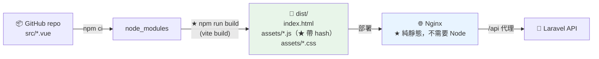
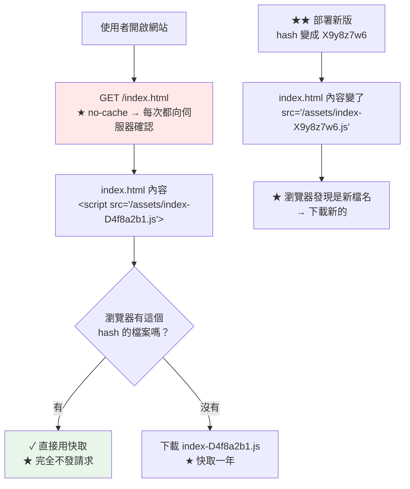

# Vue 建置與 Nginx 靜態部署

> [!abstract] 這篇你會學到
> - 從 **GitHub 專案**建置 Vue 3（Vite）
> - **建置環境變數**與 `.env.production`
> - **Nginx 靜態部署**的完整設定
> - **★★ 快取策略**（hash 檔名 vs `index.html`）
> - **gzip / brotli 預壓縮**
> - **HTTPS + 安全標頭**（內部 CA 或 Let's Encrypt）
> - 部署腳本與**零停機切換**

## 前置知識

- [[01-部署共通觀念]] — `releases`/`current` 佈局與原子切換
- [[02-Nginx-設定語法與虛擬主機]] — Nginx 基本設定
- [[08-用自建CA簽發伺服器憑證]] — 憑證簽發

---

## 觀念：Vue 建置產物是「純靜態檔案」★★



> [!note] Vue SPA 部署的三個特性
> ```
> ① ★★ 建置產物是【純靜態檔案】
>    → 正式環境【不需要安裝 Node.js】
>    → Nginx 直接送檔案就好（★ 這是與 Nuxt SSR 最大的差別）
>
> ② ★★ 環境變數在【建置時】就寫死進去了
>    → VITE_API_BASE 會被【字面替換】進 JS 檔
>    → ★★★ 改設定必須【重新建置】，不能只改 .env 重啟
>    → ★★★ 所以【絕對不要】把秘密放在 VITE_ 變數裡
>
> ③ ★★ 路由由前端接管（History 模式）
>    → 直接開 /users/5 時，Nginx 要回傳 index.html
>    → try_files $uri $uri/ /index.html;
> ```

```bash
# ★ 典型的建置產物
$ tree dist/
dist/
├── index.html                          ★ 入口（★ 不可快取）
├── favicon.ico
└── assets/
    ├── index-D4f8a2b1.js               ★★ 檔名含 hash → 可永久快取
    ├── index-B7c3e9f2.css
    ├── vendor-A1b2c3d4.js
    └── logo-E5f6a7b8.png
```

---

## 從 GitHub 專案建置

### 【1】取得專案

```bash
# ★ 用 deploy 使用者
$ sudo -u deploy -i
$ REL=/var/www/vue-app/releases/$(date +%Y%m%d-%H%M%S)
$ mkdir -p "$REL"
$ git clone --depth 1 --branch main --single-branch \
    git@github.com:Information-Study/vue-frontend.git "$REL"
$ cd "$REL"
$ git log -1 --oneline
a1b2c3d feat: 新增使用者管理頁面

$ rm -rf .git                          # ★★ 部署後移除（避免洩漏原始碼）
```

### 【2】★★ 建置環境變數

```bash
# ★ Vite 的環境變數檔（依 mode 載入）
$ ls -la .env*
.env                  # 所有環境
.env.production       # ★★ npm run build 時載入
.env.development      # npm run dev 時載入
.env.staging          # ★ --mode staging 時載入

# ★★ 只有 VITE_ 開頭的才會被注入到前端
$ cat .env.production
VITE_API_BASE=https://api.example.gov.tw
VITE_APP_TITLE=機關管理系統
VITE_APP_ENV=production
```

> [!danger] `VITE_` 變數會被寫死進 JS 檔案 ★★★
> ```
> ❌❌❌ 絕對不要：
>   VITE_DB_PASSWORD=xxx
>   VITE_API_SECRET=xxx
>   VITE_JWT_SECRET=xxx
>
> ★★ 因為 vite build 會把它【字面替換】進 JS：
>   原始碼： import.meta.env.VITE_API_SECRET
>   建置後： "sk_live_abc123..."          ← ★★★ 任何人 F12 都看得到
>
> ★ 驗證：
>   grep -r 'VITE_' dist/assets/*.js | head
>   grep -rE 'sk_|secret|password|token' dist/assets/*.js
>
> ★★ 前端只能放【公開資訊】：
>   · API 的網址
>   · 應用標題
>   · 公開的地圖 API key（★ 且要在服務商後台設定網域白名單）
>
> ★★★ 所有的認證與授權都必須在【後端】做
> ```

```bash
# ★★ 建置前掃描秘密
$ sudo tee /usr/local/bin/check-frontend-secrets >/dev/null <<'EOF'
#!/usr/bin/env bash
D="${1:-dist}"
echo "═══ 掃描前端建置產物的秘密 ═══"
PAT='sk_live|sk_test|-----BEGIN|password["\x27]?\s*[:=]|secret["\x27]?\s*[:=]|AKIA[0-9A-Z]{16}|ghp_[A-Za-z0-9]{36}|AIza[0-9A-Za-z_-]{35}'
if grep -rlEi "$PAT" "$D" 2>/dev/null; then
    echo "  ✗✗✗ 發現可能的秘密！"
    grep -rEio "$PAT" "$D" 2>/dev/null | sort -u | head -20 | sed 's/^/    /'
    exit 1
fi
echo "  ✓ 沒有發現明顯的秘密"
echo
echo "  ── 所有 VITE_ 變數 ──"
grep -rhoE 'VITE_[A-Z_]+' "$D" 2>/dev/null | sort -u | sed 's/^/    /'
EOF
$ sudo chmod +x /usr/local/bin/check-frontend-secrets
```

### 【3】建置

```bash
$ cd "$REL"

# ★★ 用 npm ci 不是 npm install
$ npm ci --no-audit --no-fund
added 428 packages in 18s

# ★ 建置
$ npm run build
vite v6.0.5 building for production...
✓ 1247 modules transformed.
dist/index.html                     0.71 kB │ gzip:  0.42 kB
dist/assets/index-B7c3e9f2.css     42.18 kB │ gzip:  7.13 kB
dist/assets/vendor-A1b2c3d4.js    142.35 kB │ gzip: 51.28 kB
dist/assets/index-D4f8a2b1.js      89.42 kB │ gzip: 28.91 kB
✓ built in 6.42s

# ★ 指定 mode（staging）
$ npm run build -- --mode staging

# ★ 建置後檢查
$ check-frontend-secrets dist
$ du -sh dist/
2.1M	dist/
```

> [!danger] `npm ci` vs `npm install` ★★
> ```
> npm install
>   · 會【修改 package-lock.json】
>   · 依 package.json 的版本範圍安裝 → ★★ 可能裝到不同的版本
>   · 建置結果【不可重現】
>
> ★★ npm ci（正式環境用這個）
>   · 【嚴格依照 package-lock.json】
>   · 不會修改 lock 檔
>   · ★ 若 package.json 與 lock 不一致 → 【直接報錯】（這是好事）
>   · 會先刪除 node_modules（乾淨安裝）
>   · ★ 速度也比較快
>
> ★★★ CI/CD 與正式部署一律用 npm ci
> ```

```bash
# ★ 常見的建置失敗
# ① 記憶體不足（大專案）
$ NODE_OPTIONS="--max-old-space-size=4096" npm run build

# ② Node 版本不符
$ node -v
v18.20.0
$ cat package.json | grep -A2 '"engines"'
  "engines": { "node": ">=20" }        # ★ 需要 20+
$ # → 用 NodeSource 安裝正確版本

# ③ ★ lock 檔與 package.json 不一致
npm error `npm ci` can only install packages when your package.json
and package-lock.json are in sync
$ # → 在【開發機】上跑 npm install 更新 lock 並 commit，不要在伺服器上改
```

---

## Nginx 部署 ★★

```nginx
# /etc/nginx/sites-available/vue-app.conf

# ═══ HTTP → HTTPS ═══
server {
    listen 80;
    listen [::]:80;
    server_name app.example.gov.tw;

    # ★ ACME 驗證（用 Let's Encrypt 時）
    location ^~ /.well-known/acme-challenge/ {
        root /var/www/certbot;
        default_type "text/plain";
    }

    location / { return 301 https://$host$request_uri; }
}

# ═══ HTTPS ═══
server {
    listen 443 ssl;
    listen [::]:443 ssl;
    http2 on;
    server_name app.example.gov.tw;

    # ── 憑證 ──
    ssl_certificate         /etc/ssl/certs/app-fullchain.crt;   # ★ 伺服器+中繼
    ssl_certificate_key     /etc/ssl/private/app.key;
    ssl_trusted_certificate /etc/ssl/certs/ca-chain.crt;
    ssl_protocols           TLSv1.2 TLSv1.3;
    ssl_ciphers             ECDHE-ECDSA-AES128-GCM-SHA256:ECDHE-RSA-AES128-GCM-SHA256:ECDHE-ECDSA-AES256-GCM-SHA384:ECDHE-RSA-AES256-GCM-SHA384;
    ssl_prefer_server_ciphers off;
    ssl_session_cache       shared:SSL:10m;
    ssl_session_timeout     1d;
    ssl_session_tickets     off;

    # ★★ 注意 root 指到 current/dist
    root  /var/www/vue-app/current/dist;
    index index.html;

    # ── 日誌 ──
    access_log /var/log/nginx/vue-app.access.log;
    error_log  /var/log/nginx/vue-app.error.log warn;

    # ── ★ 安全標頭 ──
    add_header Strict-Transport-Security "max-age=31536000; includeSubDomains" always;
    add_header X-Content-Type-Options    "nosniff" always;
    add_header X-Frame-Options           "SAMEORIGIN" always;
    add_header Referrer-Policy           "strict-origin-when-cross-origin" always;
    add_header Permissions-Policy        "geolocation=(), microphone=(), camera=()" always;

    # ── ★ 壓縮 ──
    gzip on;
    gzip_vary on;
    gzip_comp_level 6;
    gzip_min_length 1024;
    gzip_types text/plain text/css text/xml application/json application/javascript
               application/xml+rss application/atom+xml image/svg+xml
               font/woff font/woff2 application/font-woff;
    gzip_static on;                       # ★★ 優先送預壓縮的 .gz

    # ═══════ ★★★ 快取策略（最關鍵的部分）═══════

    # ★★ ① 帶 hash 的靜態資源 → 永久快取
    location ~* ^/assets/.*\.(js|css|woff2?|ttf|eot|svg|png|jpe?g|gif|webp|avif|ico)$ {
        expires 1y;
        add_header Cache-Control "public, max-age=31536000, immutable";
        access_log off;

        # ★★★ add_header 是【陣列型指令】—— 這個 location 有 add_header
        #     就會【完全覆蓋】server 層的所有 add_header，必須重新宣告
        add_header X-Content-Type-Options "nosniff" always;
        add_header Strict-Transport-Security "max-age=31536000; includeSubDomains" always;
    }

    # ★★ ② index.html → 【絕對不能快取】
    location = /index.html {
        expires -1;
        add_header Cache-Control "no-cache, no-store, must-revalidate" always;
        add_header Pragma "no-cache" always;
        add_header X-Content-Type-Options "nosniff" always;
        add_header Strict-Transport-Security "max-age=31536000; includeSubDomains" always;
    }

    # ★ ③ 其他根目錄的檔案（favicon、manifest 等）
    location ~* ^/[^/]+\.(ico|png|svg|webmanifest|txt|xml)$ {
        expires 7d;
        add_header Cache-Control "public, max-age=604800";
        add_header X-Content-Type-Options "nosniff" always;
        access_log off;
    }

    # ═══════ ★★ SPA 路由 fallback ═══════
    location / {
        try_files $uri $uri/ /index.html;
    }

    # ═══════ API 代理 ═══════
    location /api/ {
        proxy_pass http://127.0.0.1:9000;      # ★ Laravel（或用 fastcgi）
        proxy_http_version 1.1;
        proxy_set_header Host              $host;
        proxy_set_header X-Real-IP         $remote_addr;
        proxy_set_header X-Forwarded-For   $proxy_add_x_forwarded_for;
        proxy_set_header X-Forwarded-Proto $scheme;   # ★★ 沒有這行 Laravel 會產生 http 連結
        proxy_read_timeout 60s;
    }

    # ═══════ 安全：擋掉不該存取的 ═══════
    location ~ /\.          { deny all; access_log off; }
    location ~ \.(env|json|lock|md|yml|yaml)$ {
        # ★ 但要放行 manifest.webmanifest 等必要檔案
        deny all; access_log off;
    }
}
```

> [!danger] `add_header` 是陣列型指令，會被完全覆蓋 ★★★
> ```
> Nginx 的 add_header 繼承規則：
>   ★★★ 【子層有任何一個 add_header，就會完全忽略父層的所有 add_header】
>
> 錯誤範例：
>   server {
>       add_header X-Frame-Options SAMEORIGIN always;
>       add_header Strict-Transport-Security "..." always;
>
>       location /assets/ {
>           add_header Cache-Control "public, immutable";   # ★★ 只寫這一個
>       }
>   }
>   → /assets/ 底下的回應【完全沒有】X-Frame-Options 與 HSTS
>
> ★★ 三種解法：
>   ① 在每個有 add_header 的 location 【重複宣告】所有標頭（本篇的做法）
>   ② 用 include 把共用標頭抽成檔案
>        # /etc/nginx/snippets/security-headers.conf
>        include snippets/security-headers.conf;   ← 在每個 location 引入
>   ③ ★ 改用 headers-more 模組的 more_set_headers（不受此限）
>
> ★ 驗證：
>   curl -sI https://app/assets/index-abc.js | grep -i -E 'x-content|strict'
> ```

```bash
# ★★ 驗證所有路徑的標頭都正確
$ for p in / /index.html /assets/index-D4f8a2b1.js /favicon.ico; do
    echo "── $p ──"
    curl -sI "https://app.example.gov.tw$p" | \
      grep -iE 'HTTP/|cache-control|x-content-type|strict-transport'
  done
```

### ★★ 快取策略的原理



> [!danger] `index.html` 被快取的後果 ★★★
> ```
> 若 index.html 也設了長快取：
>   使用者的瀏覽器記著舊的 index.html
>     → 它指向【舊的 hash 檔名】
>       → ★★ 部署新版後，舊檔案已經被刪掉了
>         → 404 → ★★★ 【白畫面】
>
> ★★ 症狀：
>   · 部署後部分使用者看到白畫面或舊版
>   · 「你清一下快取試試」← 這就是這個問題
>   · Console：Failed to load module script / ChunkLoadError
>
> ★★★ 鐵則：
>   index.html          → no-cache, no-store, must-revalidate
>   /assets/*-hash.*    → max-age=31536000, immutable
> ```

```javascript
// ★★ 前端也要處理「部署後 chunk 載入失敗」
// main.ts / router
router.onError((error) => {
  if (/Failed to fetch dynamically imported module|Loading chunk .* failed/i.test(error.message)) {
    // ★ 部署了新版，舊的 chunk 已不存在 → 強制重新載入
    console.warn('偵測到新版本，重新載入頁面');
    window.location.reload();
  }
});
```

```javascript
// ★ 更好的做法：主動偵測新版本
// composables/useVersionCheck.ts
export function useVersionCheck(intervalMs = 5 * 60 * 1000) {
  const current = __APP_VERSION__;          // ★ vite define 注入
  let timer: number;

  async function check() {
    try {
      // ★ 加上時間戳避免快取
      const res = await fetch(`/version.json?t=${Date.now()}`, { cache: 'no-store' });
      const { version } = await res.json();
      if (version && version !== current) {
        // ★ 提示使用者，不要直接強制重整（可能有未儲存的資料）
        if (confirm('系統已更新，是否重新載入以取得最新版本？')) {
          window.location.reload();
        }
      }
    } catch { /* 忽略 */ }
  }

  onMounted(() => { timer = window.setInterval(check, intervalMs); });
  onUnmounted(() => clearInterval(timer));
}
```

```javascript
// vite.config.ts —— 注入版本號並產生 version.json
import { defineConfig } from 'vite';
import { execSync } from 'node:child_process';
import { writeFileSync } from 'node:fs';

const version = process.env.APP_VERSION
  || execSync('git rev-parse --short HEAD').toString().trim();

export default defineConfig({
  define: { __APP_VERSION__: JSON.stringify(version) },
  plugins: [
    {
      name: 'write-version',
      closeBundle() {
        writeFileSync('dist/version.json',
          JSON.stringify({ version, built: new Date().toISOString() }));
      },
    },
  ],
  build: {
    sourcemap: false,              // ★★ 正式環境不要 sourcemap（洩漏原始碼）
    rollupOptions: {
      output: {
        // ★ 手動分割 vendor（讓相依套件的 hash 更穩定）
        manualChunks: {
          vue: ['vue', 'vue-router', 'pinia'],
          ui: ['element-plus'],
        },
      },
    },
  },
});
```

> [!warning] 正式環境不要輸出 sourcemap ★★
> ```
> sourcemap: true 會產生 .js.map 檔
>   → ★★ 任何人下載後可以【還原成完整的原始碼】
>     （含註解、變數名稱、檔案結構）
>
> ★ 若需要錯誤追蹤（Sentry）：
>   · 建置時產生 sourcemap
>   · ★ 上傳到 Sentry 後【從 dist 刪除】
>   · 或設 sourcemap: 'hidden'（產生但 JS 裡不加註解行）
>
> ★ Nginx 也擋一下：
>   location ~ \.map$ { deny all; }
> ```

---

## 預壓縮 ★★

```bash
# ★★ 建置後預先產生 .gz 與 .br（比即時壓縮省 CPU 且壓縮率更高）
$ cd dist
$ find . -type f \( -name '*.js' -o -name '*.css' -o -name '*.html' \
    -o -name '*.svg' -o -name '*.json' \) -size +1k -print0 | \
  while IFS= read -r -d '' f; do
      gzip -9 -k -f "$f"
      command -v brotli >/dev/null && brotli -q 11 -f "$f"
  done

$ ls -la assets/ | head
-rw-r--r-- 1 deploy www-data  89421 index-D4f8a2b1.js
-rw-r--r-- 1 deploy www-data  22183 index-D4f8a2b1.js.br      # ★ brotli 更小
-rw-r--r-- 1 deploy www-data  28914 index-D4f8a2b1.js.gz
```

```nginx
# ★★ gzip_static 內建（不需額外模組）
gzip_static on;

# ★ brotli_static 需要 ngx_brotli 模組
# （MyGuard 套件庫的 nginx 內建，見 [[00-MyGuard與Angie-索引]]）
brotli_static on;
```

```bash
# ★ 驗證有送出預壓縮的版本
$ curl -sI -H 'Accept-Encoding: br,gzip' \
    https://app.example.gov.tw/assets/index-D4f8a2b1.js | grep -i encoding
content-encoding: br              # ★ 送出的是 .br
```

```javascript
// ★ 或用 Vite 外掛自動產生
// npm i -D vite-plugin-compression2
import compression from 'vite-plugin-compression2';

export default defineConfig({
  plugins: [
    compression({ algorithm: 'gzip', threshold: 1024 }),
    compression({ algorithm: 'brotliCompress', threshold: 1024, exclude: [/\.(br)$/] }),
  ],
});
```

---

## 完整實戰範例：一鍵部署腳本

```bash
#!/usr/bin/env bash
# /usr/local/bin/deploy-vue —— 從 GitHub 部署 Vue SPA
# 用法：deploy-vue [branch]
set -euo pipefail

APP=/var/www/vue-app
REPO="git@github.com:Information-Study/vue-frontend.git"
BRANCH="${1:-main}"
MODE="${MODE:-production}"
KEEP=5
SITE="https://app.example.gov.tw"
REL="$APP/releases/$(date +%Y%m%d-%H%M%S)"

c() { echo -e "\033[36m[$(date +%T)]\033[0m $*"; }
die(){ echo -e "\033[31m✗ $*\033[0m" >&2; exit 1; }

# ★ 避免同時部署
exec 200>/var/lock/deploy-vue.lock
flock -n 200 || die "已有部署在進行中"

c "═══ 部署 Vue（$BRANCH / mode=$MODE）═══"

[ "$(whoami)" = deploy ] || die "必須用 deploy 使用者執行"

# ══ 【1】clone ══
c "【1】clone"
mkdir -p "$REL"
git clone --depth 1 --branch "$BRANCH" --single-branch "$REPO" "$REL" 2>&1 | sed 's/^/    /'
COMMIT=$(cd "$REL" && git rev-parse --short HEAD)
MSG=$(cd "$REL" && git log -1 --pretty=%s)
c "    $COMMIT — $MSG"
rm -rf "$REL/.git"

cd "$REL"

# ══ 【2】環境變數 ══
c "【2】環境變數"
if [ -f "$APP/shared/.env.$MODE" ]; then
    cp "$APP/shared/.env.$MODE" "$REL/.env.$MODE"
    c "    使用 shared/.env.$MODE"
fi
grep -hoE '^VITE_[A-Z_]+' ".env.$MODE" 2>/dev/null | sed 's/^/    /' || true

# ══ 【3】相依 ══
c "【3】npm ci"
npm ci --no-audit --no-fund 2>&1 | tail -3 | sed 's/^/    /'

# ══ 【4】建置 ══
c "【4】建置"
export APP_VERSION="$COMMIT"
export NODE_OPTIONS="--max-old-space-size=4096"
npm run build -- --mode "$MODE" 2>&1 | tail -12 | sed 's/^/    /'

[ -d "$REL/dist" ] || die "找不到 dist/"
[ -f "$REL/dist/index.html" ] || die "找不到 dist/index.html"

# ══ 【5】★★ 秘密掃描 ══
c "【5】★★ 秘密掃描"
/usr/local/bin/check-frontend-secrets "$REL/dist" | sed 's/^/    /' || \
  die "★★★ 建置產物中發現秘密，中止部署"

# ★ 確認沒有 sourcemap
if find "$REL/dist" -name '*.map' | grep -q .; then
    c "    ⚠ 發現 sourcemap，移除"
    find "$REL/dist" -name '*.map' -delete
fi

# ══ 【6】預壓縮 ══
c "【6】預壓縮"
cd "$REL/dist"
N=0
while IFS= read -r -d '' f; do
    gzip -9 -k -f "$f"
    command -v brotli >/dev/null && brotli -q 11 -f "$f"
    N=$((N+1))
done < <(find . -type f \( -name '*.js' -o -name '*.css' -o -name '*.html' \
           -o -name '*.svg' -o -name '*.json' \) -size +1k -print0)
c "    壓縮了 $N 個檔案"
cd "$REL"

# ══ 【7】清理 ══
c "【7】清理"
rm -rf "$REL/node_modules" "$REL/src" "$REL/public" "$REL/tests" 2>/dev/null || true
du -sh "$REL/dist" | sed 's/^/    /'

# ══ 【8】權限 ══
c "【8】權限"
find "$REL" -type d -exec chmod 755 {} \;
find "$REL" -type f -exec chmod 644 {} \;

# ══ 【9】★★ 切換前檢查 ══
c "【9】★★ 切換前檢查"
grep -q '<div id="app"' "$REL/dist/index.html" || c "    ⚠ index.html 可能不完整"
grep -oE 'src="/assets/[^"]+"' "$REL/dist/index.html" | head -3 | sed 's/^/    /'
for a in $(grep -oE '(src|href)="/assets/[^"]+"' "$REL/dist/index.html" | \
           sed 's/.*="//;s/"//'); do
    [ -f "$REL/dist$a" ] || die "index.html 引用的 $a 不存在"
done
c "    ✓ 引用的資源都存在"

# ══ 【10】★★★ 原子切換 ══
PREV=$(readlink "$APP/current" 2>/dev/null || echo "")
c "【10】★★★ 原子切換"
ln -sfn "$REL" "$APP/current.tmp"
mv -Tf "$APP/current.tmp" "$APP/current"
c "    $PREV → $REL"

sudo nginx -t && sudo systemctl reload nginx

# ══ 【11】★★★ 驗證 ══
c "【11】★★★ 驗證"
sleep 1
FAIL=0
v() { printf '    %-42s ' "$1"; if eval "$2" >/dev/null 2>&1; then echo "✓"; else echo "✗"; FAIL=1; fi; }

v "首頁 200"          "[ \"\$(curl -so /dev/null -w '%{http_code}' $SITE/)\" = 200 ]"
v "★ SPA 路由 fallback" "[ \"\$(curl -so /dev/null -w '%{http_code}' $SITE/users/999)\" = 200 ]"
v "★★ index.html 不快取" "curl -sI $SITE/ | grep -qi 'cache-control:.*no-'"
v "★ HSTS"            "curl -sI $SITE/ | grep -qi strict-transport-security"
v "★ .env 擋住"        "[ \"\$(curl -so /dev/null -w '%{http_code}' $SITE/.env)\" != 200 ]"
v "版本端點"           "curl -sf $SITE/version.json | grep -q '$COMMIT'"

ASSET=$(curl -s "$SITE/" | grep -oE 'src="/assets/[^"]+\.js"' | head -1 | sed 's/.*="//;s/"//')
[ -n "$ASSET" ] && {
    v "★★ 資源永久快取" "curl -sI '$SITE$ASSET' | grep -qi 'cache-control:.*immutable'"
    v "★ 資源有壓縮"    "curl -sI -H 'Accept-Encoding: br,gzip' '$SITE$ASSET' | grep -qi 'content-encoding'"
}

if [ "$FAIL" != 0 ]; then
    echo -e "\033[31m    ✗✗ 驗證失敗 —— 自動回退\033[0m"
    [ -n "$PREV" ] && {
        ln -sfn "$PREV" "$APP/current.tmp"
        mv -Tf "$APP/current.tmp" "$APP/current"
        sudo systemctl reload nginx
        echo "    ✓ 已回退到 $PREV"
    }
    exit 1
fi

# ══ 【12】清理舊版 ══
c "【12】清理（保留 $KEEP 個）"
cd "$APP/releases"
ls -1dt */ 2>/dev/null | tail -n +$((KEEP+1)) | while read -r d; do
    echo "    刪除 $d"; rm -rf "$d"
done

c "═══ ✓ 部署完成：$COMMIT ═══"
```

```bash
$ sudo -u deploy deploy-vue main
$ sudo -u deploy MODE=staging deploy-vue develop
```

---

## 常見錯誤與排錯

| 現象 | 原因 | 解法 |
| --- | --- | --- |
| **重新整理子頁面 404** ★★★ | 沒有 SPA fallback | `try_files $uri $uri/ /index.html;` |
| **部署後白畫面** ★★★ | `index.html` 被快取 | `index.html` 設 `no-store` |
| **Console: ChunkLoadError** ★★ | 舊 `index.html` 指向已刪的 chunk | 同上；前端加 `router.onError` reload |
| **靜態資源沒有安全標頭** ★★★ | `add_header` 陣列覆蓋 | 在每個 location **重複宣告** |
| **API 呼叫 404** ★ | `VITE_API_BASE` 建置時錯了 | **重新建置**（不能只改 .env） |
| **CORS 錯誤** ★★ | 前後端不同源且後端沒設 | 見 [[03-跨網域與CORS設定]] |
| **秘密洩漏在 JS 裡** ★★★ | 用了 `VITE_` 放 secret | 移到後端；**撤銷該金鑰** |
| `npm ci` 報錯 sync | lock 與 package.json 不一致 | 在**開發機**跑 `npm install` 更新 lock |
| 建置 OOM | 記憶體不足 | `NODE_OPTIONS="--max-old-space-size=4096"` |
| **sourcemap 洩漏原始碼** ★★ | `sourcemap: true` | 設 `false`；Nginx 擋 `.map` |
| 資源 404 但檔案在 | `root` 指錯（少了 `/dist`） | `root .../current/dist;` |
| gzip 沒生效 | 沒開或型別沒列 | `gzip_types` 加上；用 `gzip_static` |
| **部署後使用者看到舊版** ★★ | CDN 或反代快取 | 清 CDN 快取；`index.html` 不快取 |
| 圖片路徑錯 | `base` 設定 | `vite.config` 的 `base: '/'` |

### 排查

```bash
SITE=https://app.example.gov.tw

# 【1】★★ SPA fallback
$ curl -so /dev/null -w '%{http_code}\n' "$SITE/users/999"
200                                   # ★ 應該是 200（回 index.html）

# 【2】★★★ 快取標頭
$ curl -sI "$SITE/" | grep -i cache-control
cache-control: no-cache, no-store, must-revalidate       # ★ index.html

$ ASSET=$(curl -s "$SITE/" | grep -oE '/assets/[^"]+\.js' | head -1)
$ curl -sI "$SITE$ASSET" | grep -i cache-control
cache-control: public, max-age=31536000, immutable       # ★ 資源

# 【3】★★★ 安全標頭（在資源路徑上也要有）
$ curl -sI "$SITE$ASSET" | grep -iE 'x-content-type|strict-transport'

# 【4】壓縮
$ curl -sI -H 'Accept-Encoding: br,gzip' "$SITE$ASSET" | grep -i content-encoding

# 【5】★★ 檢查 JS 裡有沒有秘密
$ curl -s "$SITE$ASSET" | grep -oE 'VITE_[A-Z_]+|sk_live_[A-Za-z0-9]+' | sort -u

# 【6】版本
$ curl -s "$SITE/version.json"
{"version":"a1b2c3d","built":"2026-08-28T15:30:45.000Z"}

# 【7】實際部署的路徑
$ readlink /var/www/vue-app/current
$ ls -la /var/www/vue-app/current/dist/index.html

# 【8】Nginx 實際的設定
$ sudo nginx -T 2>/dev/null | grep -A30 'server_name app.example.gov.tw'
```

---

## 安全性注意事項

> [!danger] 前端的三條紅線 ★★★
> ```
> ① ★★★ 不要在 VITE_ 變數放秘密
>      → 會被【字面寫進 JS 檔案】
>      → 任何人 F12 → Sources 都看得到
>      → ★ 已經放過的金鑰：【視為已外洩，立刻撤銷並更換】
>
> ② ★★ 正式環境不要輸出 sourcemap
>      → .js.map 可以還原完整原始碼（含註解與變數名）
>      → sourcemap: false，Nginx 也擋 location ~ \.map$ { deny all; }
>
> ③ ★★ 所有的授權判斷都在【後端】
>      → 前端的 v-if="user.isAdmin" 只是【UI 呈現】
>      → 攻擊者可以直接改 JS 變數或直接呼叫 API
>      → ★★★ 後端每一個端點都必須自己驗證權限
> ```

```bash
# ★★ 上線前掃描
$ curl -s https://app.example.gov.tw/ | grep -oE '/assets/[^"]+\.js' | \
  while read -r a; do
      curl -s "https://app.example.gov.tw$a"
  done | grep -oEi 'sk_live_[A-Za-z0-9]+|AKIA[0-9A-Z]{16}|ghp_[A-Za-z0-9]{36}|-----BEGIN' | \
  sort -u
```

> [!warning] CSP 的設定
> ```nginx
> # ★ Vue SPA 的 CSP（★ Vite 建置產物通常不需要 unsafe-eval）
> add_header Content-Security-Policy "
>     default-src 'self';
>     script-src 'self';
>     style-src 'self' 'unsafe-inline';
>     img-src 'self' data: blob:;
>     font-src 'self' data:;
>     connect-src 'self' https://api.example.gov.tw;
>     frame-ancestors 'self';
>     base-uri 'self';
>     form-action 'self';
> " always;
> ```
>
> ```
> ★★ 注意：
>   · style-src 需要 'unsafe-inline'（Vue 的 scoped style 與動態樣式）
>   · ★ connect-src 要列出 API 的網域（前後端分離時）
>   · 用了 Google Fonts → font-src 加 https://fonts.gstatic.com
>   · ★ 先用 Content-Security-Policy-Report-Only 觀察一週再正式套用
> ```

---

## 速查表

### 建置

```bash
npm ci --no-audit --no-fund             # ★★ 不是 npm install
npm run build                           # → dist/
npm run build -- --mode staging         # ★ 指定 mode

NODE_OPTIONS="--max-old-space-size=4096" npm run build   # 記憶體不足時
```

```
★★★ VITE_ 變數在【建置時】寫死進 JS
   → 改設定必須【重新建置】
   → ★★ 絕不放秘密
```

### ★★★ 快取策略（最關鍵）

```nginx
# ① 帶 hash 的資源 → 永久快取
location ~* ^/assets/.*\.(js|css|woff2?|png|svg)$ {
    expires 1y;
    add_header Cache-Control "public, max-age=31536000, immutable";
    add_header X-Content-Type-Options "nosniff" always;   # ★★ 要重複宣告
}

# ② ★★★ index.html → 絕不快取
location = /index.html {
    expires -1;
    add_header Cache-Control "no-cache, no-store, must-revalidate" always;
    add_header X-Content-Type-Options "nosniff" always;
}

# ③ ★★ SPA fallback
location / { try_files $uri $uri/ /index.html; }
```

### ★★★ `add_header` 陣列覆蓋

```
子層有任何一個 add_header → 【完全忽略父層的所有 add_header】

解法：
  ① 每個 location 重複宣告（本篇做法）
  ② include snippets/security-headers.conf;
  ③ headers-more 模組的 more_set_headers

驗證：curl -sI https://app/assets/x.js | grep -i x-content-type
```

### 預壓縮

```bash
find dist -type f \( -name '*.js' -o -name '*.css' \) -size +1k | \
  xargs -I{} sh -c 'gzip -9 -k -f {}; brotli -q 11 -f {}'
```
```nginx
gzip_static on;
brotli_static on;        # ★ 需要 ngx_brotli 模組
```

### 部署流程

```
① git clone --depth 1（★ 之後 rm -rf .git）
② 複製 shared/.env.production
③ npm ci
④ npm run build
⑤ ★★ 秘密掃描 + 移除 sourcemap
⑥ 預壓縮 .gz / .br
⑦ 清理 node_modules / src
⑧ ★★ 檢查 index.html 引用的資源都存在
⑨ ★★★ 原子切換 + nginx -t + reload
⑩ ★★★ 驗證（fallback / 快取 / 標頭 / 版本）→ 失敗自動回退
```

### ★★★ 三條紅線

```
① VITE_ 不放秘密        → 會寫死進 JS
② 不輸出 sourcemap      → 可還原原始碼
③ 授權判斷在後端        → 前端 v-if 只是 UI
```

### 驗證

```bash
curl -so /dev/null -w '%{http_code}\n' https://app/users/999    # ★ 應 200
curl -sI https://app/ | grep -i cache-control                   # ★ no-store
curl -sI https://app/assets/x.js | grep -i cache-control        # ★ immutable
curl -sI https://app/assets/x.js | grep -i x-content-type       # ★★ 要有
curl -s  https://app/version.json                               # 版本
```

---

## 練習題

> [!question]- 練習 1：SPA fallback
> 1. 部署一個有 Vue Router（history 模式）的 SPA
> 2. **拿掉 `try_files`** → 直接開 `/users/5` → **什麼結果？**
> 3. 從首頁點進去 `/users/5` → 可以嗎？**為什麼有差別？**
> 4. 加回 `try_files $uri $uri/ /index.html;`
> 5. **測試一個不存在的路由** → 前端顯示 404 還是白畫面？

> [!question]- 練習 2：快取災難重現 ★★
> 1. **故意把 `index.html` 也設成 `expires 1y`**
> 2. 開啟網站（讓瀏覽器快取）
> 3. 部署新版（hash 改變，舊 chunk 被刪除）
> 4. **重新整理** → 白畫面嗎？Console 是什麼錯誤？
> 5. 改回 `no-store` → 再測一次
> 6. 加上 `router.onError` 的自動 reload

> [!question]- 練習 3：`add_header` 覆蓋 ★★★
> 1. 在 `server` 層設 5 個安全標頭
> 2. 在 `/assets/` 的 location 只設 `Cache-Control`
> 3. `curl -sI https://app/assets/index-abc.js` → **有幾個標頭？**
> 4. `curl -sI https://app/` → 有幾個？
> 5. 用 `include snippets/security-headers.conf` 解決
> 6. **寫一個腳本驗證所有路徑的標頭都齊全**

> [!question]- 練習 4：秘密洩漏
> 1. 在 `.env.production` 加 `VITE_SECRET_KEY=super-secret-123`
> 2. 在程式碼中使用 `import.meta.env.VITE_SECRET_KEY`
> 3. 建置後 `grep -r 'super-secret-123' dist/`
> 4. **找得到嗎？在哪個檔案？**
> 5. 部署後 `curl https://app/assets/xxx.js | grep super-secret`
> 6. **這就是為什麼前端不能放秘密**
> 7. 部署 `check-frontend-secrets` 到建置流程

> [!question]- 練習 5：完整部署與回退
> 1. 部署 `deploy-vue` 腳本
> 2. 從你的 GitHub repo 部署
> 3. **故意讓建置失敗**（改壞 `vite.config.ts`）→ **網站受影響嗎？**
> 4. 故意讓驗證失敗（拿掉 `try_files`）→ **自動回退了嗎？**
> 5. 測量部署耗時與**切換瞬間的中斷時間**
>    （`while true; do curl -so /dev/null -w '%{http_code} ' https://app/; done`）
> 6. **有出現非 200 嗎？**

---

## 小測驗

Q1. **Vue SPA 部署到正式環境需要安裝 Node.js 嗎？為什麼**？

Q2. **`VITE_` 開頭的環境變數有什麼特性？為什麼不能放秘密**？

Q3. **為什麼 `index.html` 絕對不能快取，而 `/assets/` 可以永久快取**？

Q4. **`try_files $uri $uri/ /index.html;` 解決什麼問題**？

Q5. **Nginx 的 `add_header` 有什麼繼承陷阱？三種解法是什麼**？

Q6. **`npm ci` 與 `npm install` 的差別？為什麼部署要用前者**？

Q7. **正式環境為什麼不要輸出 sourcemap**？

Q8. **改了 API 網址後，為什麼不能只改 `.env` 重啟服務**？

Q9. **`gzip_static on` 與 `gzip on` 的差別**？

Q10. **部署後使用者看到白畫面、Console 顯示 ChunkLoadError，是什麼原因**？

> [!question]- 測驗答案
> **Q1.** **不需要**。
> Vue SPA 經過 `vite build` 之後的產物是**純靜態檔案**
> （`index.html` + `assets/*.js` + `assets/*.css` + 圖片），
> **Nginx 直接把檔案送出去就好**，執行期間完全不需要 Node.js。
> Node.js 只在**建置階段**需要 ——
> 而建置可以在 CI 上做（模式②），伺服器上連 Node 都不用裝。
> **這是與 Nuxt SSR 最大的差別**：
> Nuxt SSR 需要一個**長駐的 Node 程序**（用 PM2 或 systemd 管理）
> 在伺服器上執行伺服器端渲染。
>
> **Q2.** **特性**：Vite 只會把 **`VITE_` 開頭**的環境變數注入到前端程式碼，
> 而且是在**建置時「字面替換」**：
> ```
> 原始碼： import.meta.env.VITE_API_SECRET
> 建置後： "sk_live_abc123..."
> ```
> **不能放秘密的原因**：那個值**直接以明文寫在 JS 檔案裡**，
> 而 JS 檔案是公開下載的 —— **任何人按 F12 → Sources 就看得到**，
> 或直接 `curl https://app/assets/index-abc.js | grep secret`。
> **前端只能放公開資訊**：API 網址、應用標題、
> 已在服務商後台設定網域白名單的公開地圖 key。
> **所有認證與授權都必須在後端做**。
> 如果曾經放過真的金鑰，**必須視為已外洩，立刻撤銷並更換**。
>
> **Q3.** 因為**兩者的角色完全不同**。
> **`/assets/*.js` 的檔名帶內容 hash**（`index-D4f8a2b1.js`）——
> **檔名變了就代表內容變了，內容變了檔名一定會變**，
> 所以「同一個檔名的內容永遠不會改變」，可以放心設 `immutable` 快取一年。
> **`index.html` 沒有 hash，網址永遠是 `/`** ——
> 它的內容裡記載了「這一版要載入哪些 hash 檔案」，
> **它就是版本的指標**。
> **如果 `index.html` 被快取**，
> 使用者的瀏覽器會一直記著**舊版的 index.html**，
> 它指向的**舊 hash 檔案在部署新版時已經被刪除了** →
> **404 → 白畫面**。
> 所以鐵則是：`index.html` → `no-cache, no-store, must-revalidate`；
> `/assets/*-hash.*` → `max-age=31536000, immutable`。
>
> **Q4.** 解決 **SPA 在 History 模式下「直接開啟子頁面會 404」**的問題。
> Vue Router 的 history 模式讓網址看起來像 `/users/5`，
> 但**伺服器上根本沒有 `/users/5` 這個檔案或目錄**。
> 從首頁點擊進去沒問題（前端 JS 用 `pushState` 改網址，不發請求），
> **但直接開啟、重新整理、或從外部連結進來**，
> 瀏覽器會真的向伺服器請求 `/users/5` → Nginx 找不到 → **404**。
> `try_files $uri $uri/ /index.html;` 的意思是：
> 先找 `/users/5` 這個檔案 → 找不到就找目錄 → 都找不到就**回傳 `index.html`**，
> 讓前端的 router 自己去解析網址並渲染對應的頁面。
>
> **Q5.** **陷阱**：`add_header` 是**陣列型指令**，
> **「子層只要有任何一個 `add_header`，就會完全忽略父層的所有 `add_header`」**。
> 所以在 `server` 層設好 5 個安全標頭後，
> 只要某個 `location` 加了一個 `add_header Cache-Control ...`，
> **那個 location 底下的回應就完全沒有那 5 個安全標頭了**。
> **三種解法**：
> ①**在每個有 `add_header` 的 location 重複宣告所有標頭**（最直接）；
> ②**用 `include` 把共用標頭抽成 snippet 檔**，在每個 location 引入
> （`include snippets/security-headers.conf;`）；
> ③**改用 `headers-more` 模組的 `more_set_headers`**（不受這個規則限制）。
> **驗證**：`curl -sI https://app/assets/x.js | grep -i x-content-type`
>
> **Q6.**
> **`npm install`** —— 依 `package.json` 的版本範圍安裝，
> **會修改 `package-lock.json`**，**可能裝到與開發機不同的版本**，
> 建置結果**不可重現**。
> **`npm ci`** —— **嚴格依照 `package-lock.json`** 安裝，
> **不會修改 lock 檔**，會**先刪除 `node_modules`** 做乾淨安裝，
> **速度也比較快**。
> 而且**如果 `package.json` 與 lock 檔不一致，它會直接報錯**
> —— 這是好事，代表有人改了相依但沒更新 lock。
> **部署與 CI 一律用 `npm ci`**，
> 遇到 sync 錯誤時應該**在開發機上跑 `npm install` 更新 lock 並 commit**，
> 而不是在伺服器上直接改。
>
> **Q7.** 因為 **`.js.map` 檔案可以把壓縮混淆過的 JS 完整還原成原始碼** ——
> 包含**原始的檔案結構、變數名稱、註解**。
> 任何人只要下載 `https://app/assets/index-abc.js.map`
> 就能拿到你的完整前端原始碼，
> 從中找出 API 端點、業務邏輯、甚至內部註解裡的線索。
> **解法**：`vite.config.ts` 設 `build.sourcemap: false`，
> 部署腳本再補一道 `find dist -name '*.map' -delete`，
> Nginx 也加 `location ~ \.map$ { deny all; }`。
> **如果需要錯誤追蹤（Sentry）**：
> 建置時產生 sourcemap → **上傳到 Sentry 後從 `dist` 刪除**，
> 或用 `sourcemap: 'hidden'`（產生檔案但 JS 裡不加 `//# sourceMappingURL` 註解）。
>
> **Q8.** 因為 **`VITE_` 變數是在「建置時」被字面替換進 JS 檔案的**，
> 不是在執行時讀取的。
> 建置完成後，`.env.production` 這個檔案**根本不會被部署到伺服器上**，
> 伺服器上只有 `dist/` 裡的靜態檔案，
> 而 API 網址已經是 JS 裡的一個**字串常數**了。
> **所以改了 `.env` 必須重新執行 `npm run build`**，
> 產生新的 `dist/` 再部署。
> **這也是 SPA 與傳統後端應用的重要差異** ——
> 後端（Laravel）改 `.env` 後 `php artisan config:cache` 就生效，
> 前端則一定要重新建置。
> 如果真的需要「不重新建置就能改設定」，
> 可以改成**執行時從 `/config.json` 抓設定**（但那就不能用 `import.meta.env` 了）。
>
> **Q9.**
> **`gzip on`** —— **即時壓縮**：每次有請求進來，Nginx 當場用 CPU 壓縮回應內容。
> 好處是對任何內容都有效（包含動態產生的）；
> 壞處是**每個請求都要花 CPU**，而且為了速度通常只用中等壓縮等級（`gzip_comp_level 6`）。
> **`gzip_static on`** —— **送出預先壓縮好的檔案**：
> 請求 `/assets/index.js` 時，Nginx 會先看有沒有 `/assets/index.js.gz`，
> 有的話**直接送那個檔案**，完全不用壓縮。
> 好處是**零 CPU 成本**，而且可以在建置時用**最高壓縮等級**（`gzip -9`、`brotli -q 11`），
> **檔案更小**。
> **靜態資源應該兩個都開**：`gzip_static` 處理預壓縮的，
> `gzip` 處理沒有預壓縮版本的（例如 API 的 JSON 回應）。
>
> **Q10.** **原因是 `index.html` 被快取了**。
> 使用者的瀏覽器（或中間的 CDN／反向代理）記著**舊版的 `index.html`**，
> 那份 HTML 裡寫著 `<script src="/assets/index-D4f8a2b1.js">`，
> **但部署新版時舊的 hash 檔案已經被刪除了**（新版是 `index-X9y8z7w6.js`）→
> 瀏覽器請求舊檔名 → **404** → JS 載不進來 → **白畫面**，
> Console 顯示 `ChunkLoadError` 或
> `Failed to fetch dynamically imported module`。
> **這就是「你清一下快取試試」這句話背後的真正原因**。
> **兩層解法**：
> ①**伺服器端**：`index.html` 設 `no-cache, no-store, must-revalidate`
> （也要確認 CDN 沒有快取它）；
> ②**前端**：加上 `router.onError` 偵測到 chunk 載入失敗時
> **自動 `window.location.reload()`**，
> 或用 `version.json` 輪詢主動偵測新版本並提示使用者。

---

## 延伸閱讀

- [[02-Vue-SPA路由與API代理]] — 路由與 API 代理的細節
- [[03-Vue-Docker部署]] — 容器化部署
- [[06-Vue-Laravel完整部署實戰]] — 與 Laravel 後端整合的完整實戰
- [[01-部署共通觀念]] — releases/current 佈局
- [[08-Nginx-效能調校]] — 壓縮與快取的進階設定
- [[03-跨網域與CORS設定]] — 前後端分離的 CORS
