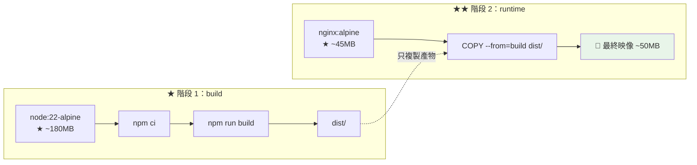

# Vue Docker 部署

> [!abstract] 這篇你會學到
> - **多階段建置**（build 階段 + nginx 階段）
> - **★★ 執行時注入環境變數**（不用重新建置就能換 API 網址）
> - **非 root 容器**與 unprivileged nginx
> - **映像瘦身**（`.dockerignore`、layer 快取）
> - **Compose 整合**（前端 + API + 資料庫）
> - **健康檢查**與**內部 CA 憑證**
> - CI 建置與推送到 registry

## 前置知識

- [[01-Vue-建置與Nginx靜態部署]] — Nginx 設定與快取策略
- [[03-Dockerfile撰寫]] — Dockerfile 基本語法

---

## 多階段建置 ★★



```dockerfile
# ═══════════════════════════════════════════════════════
# Dockerfile —— Vue SPA 多階段建置
# ═══════════════════════════════════════════════════════

# ─────────── ★ 階段 1：建置 ───────────
FROM node:22-alpine AS build

WORKDIR /app

# ★★ 先只複製 lock 檔 → 相依沒變時可以重用 layer 快取
COPY package.json package-lock.json ./
RUN npm ci --no-audit --no-fund

# ★ 再複製原始碼（★ 這一層才會常常變動）
COPY . .

# ★ 建置參數（給【建置時】的環境變數）
ARG VITE_API_BASE=/api
ARG VITE_APP_ENV=production
ARG APP_VERSION=dev
ENV VITE_API_BASE=$VITE_API_BASE \
    VITE_APP_ENV=$VITE_APP_ENV \
    APP_VERSION=$APP_VERSION \
    NODE_OPTIONS=--max-old-space-size=4096

RUN npm run build && \
    # ★★ 移除 sourcemap（洩漏原始碼）
    find dist -name '*.map' -delete && \
    # ★ 預壓縮
    find dist -type f \( -name '*.js' -o -name '*.css' -o -name '*.html' \
      -o -name '*.svg' -o -name '*.json' \) -size +1k \
      -exec gzip -9 -k {} \;

# ─────────── ★★ 階段 2：執行 ───────────
FROM nginx:1.27-alpine

# ★ 移除預設設定
RUN rm -f /etc/nginx/conf.d/default.conf

COPY --from=build /app/dist /usr/share/nginx/html
COPY docker/nginx.conf /etc/nginx/conf.d/app.conf

# ★★ 內部 CA 憑證（若要呼叫內部 HTTPS 服務）
# COPY pki/root-ca.crt /usr/local/share/ca-certificates/internal-ca.crt
# RUN apk add --no-cache ca-certificates && update-ca-certificates

# ★ 健康檢查
HEALTHCHECK --interval=30s --timeout=3s --start-period=5s --retries=3 \
  CMD wget -qO- http://127.0.0.1:8080/healthz || exit 1

EXPOSE 8080

# ★★ 標籤（方便追蹤）
ARG APP_VERSION=dev
LABEL org.opencontainers.image.version="$APP_VERSION" \
      org.opencontainers.image.source="https://github.com/Information-Study/vue-frontend"
```

```
# .dockerignore —— ★★ 非常重要（影響建置速度與映像大小）
node_modules
dist
.git
.github
.env
.env.*
!.env.example
*.log
coverage
.vscode
.idea
Dockerfile*
docker-compose*.yml
README.md
tests
*.md
.DS_Store
```

> [!danger] 沒有 `.dockerignore` 的三個後果 ★★
> ```
> ① ★★ node_modules 被送進 build context
>    → 幾百 MB 的傳輸 → 【每次建置都慢】
>    → 而且 COPY . . 會覆蓋掉 npm ci 裝好的（★ 平台可能不同）
>
> ② ★★★ 【.env 被複製進映像】
>    → 映像推到 registry → 任何人 pull 都拿得到秘密
>    → docker history 也看得到
>
> ③ ★ .git 被複製進去
>    → 完整的原始碼歷史都在映像裡
> ```

```bash
# ★★ 檢查映像裡有沒有秘密
$ docker run --rm vue-app:latest sh -c 'ls -la /usr/share/nginx/html; find / -name ".env*" 2>/dev/null'
$ docker history --no-trunc vue-app:latest | grep -iE 'env|secret|key'

# ★ 用 dive 分析每一層
$ dive vue-app:latest
```

### 容器內的 Nginx 設定

```nginx
# docker/nginx.conf
server {
    listen 8080;                       # ★★ 非特權埠（>1024，讓非 root 能綁）
    listen [::]:8080;
    server_name _;

    root  /usr/share/nginx/html;
    index index.html;

    # ★ TLS 由外層的反向代理處理，容器內只跑 HTTP
    # ★★ 容器內不放私鑰

    # ── 壓縮 ──
    gzip on;
    gzip_static on;                    # ★ 送預壓縮的 .gz
    gzip_vary on;
    gzip_types text/plain text/css application/json application/javascript
               application/xml image/svg+xml font/woff2;

    # ── 安全標頭 ──
    add_header X-Content-Type-Options "nosniff" always;
    add_header X-Frame-Options "SAMEORIGIN" always;
    add_header Referrer-Policy "strict-origin-when-cross-origin" always;

    # ★ 健康檢查
    location = /healthz {
        access_log off;
        add_header Content-Type text/plain;
        return 200 "ok\n";
    }

    # ★★ 靜態資源永久快取
    location ~* ^/assets/ {
        try_files $uri =404;
        expires 1y;
        add_header Cache-Control "public, max-age=31536000, immutable";
        add_header X-Content-Type-Options "nosniff" always;
        access_log off;
    }

    # ★★ index.html 不快取
    location = /index.html {
        expires -1;
        add_header Cache-Control "no-cache, no-store, must-revalidate" always;
        add_header X-Content-Type-Options "nosniff" always;
    }

    # ★★ SPA fallback
    location / {
        try_files $uri $uri/ /index.html;
    }

    location ~ /\.    { deny all; access_log off; }
    location ~ \.map$ { deny all; access_log off; }
}
```

---

## ★★ 執行時注入環境變數

> [!danger] Vite 的環境變數是「建置時」寫死的 ★★★
> ```
> ★★ 這造成一個容器化的大問題：
>
>   同一個映像【無法】跑在不同環境
>     dev 要 VITE_API_BASE=https://api-dev.gov.tw
>     prod 要 VITE_API_BASE=https://api.gov.tw
>   → ★ 傳統做法要建置兩次 → 兩個不同的映像
>     → ★★ 違反「build once, deploy anywhere」原則
>       → 而且 dev 測過的映像【不等於】prod 跑的映像
>
> ★★★ 解法：執行時注入
> ```

### 方法：`env.js` + entrypoint 產生

```html
<!-- index.html —— ★★ 在 app 之前載入 -->
<!DOCTYPE html>
<html lang="zh-Hant">
<head>
  <meta charset="UTF-8">
  <title>機關管理系統</title>
  <!-- ★★★ 執行時產生，絕對不能快取 -->
  <script src="/env.js"></script>
</head>
<body>
  <div id="app"></div>
  <script type="module" src="/src/main.ts"></script>
</body>
</html>
```

```javascript
// public/env.js —— ★ 開發時的預設值（會被容器裡的覆蓋）
window.__ENV__ = {
  API_BASE: '/api',
  APP_ENV: 'development',
  APP_VERSION: 'dev',
};
```

```typescript
// src/config.ts —— ★★ 統一的設定入口
declare global {
  interface Window { __ENV__?: Record<string, string>; }
}

function env(key: string, fallback = ''): string {
  // ★★ 優先用執行時的，退回建置時的
  return window.__ENV__?.[key]
      ?? (import.meta.env[`VITE_${key}`] as string)
      ?? fallback;
}

export const config = {
  apiBase:    env('API_BASE', '/api'),
  appEnv:     env('APP_ENV', 'production'),
  appVersion: env('APP_VERSION', 'unknown'),
} as const;
```

```typescript
// src/api/client.ts
import axios from 'axios';
import { config } from '@/config';

export const api = axios.create({
  baseURL: config.apiBase,             // ★★ 執行時決定
  withCredentials: true,
  timeout: 30000,
});
```

```bash
#!/bin/sh
# docker/entrypoint.sh —— ★★ 容器啟動時產生 env.js
set -e

TARGET=/usr/share/nginx/html/env.js

# ★ 白名單：只注入這些變數（★ 避免把整個環境倒出去）
cat > "$TARGET" <<EOF
window.__ENV__ = {
  API_BASE: "${API_BASE:-/api}",
  APP_ENV: "${APP_ENV:-production}",
  APP_VERSION: "${APP_VERSION:-unknown}",
  SENTRY_DSN: "${SENTRY_DSN:-}",
  FEATURE_FLAGS: "${FEATURE_FLAGS:-}"
};
EOF

echo "[entrypoint] 已產生 env.js："
cat "$TARGET" | sed 's/^/  /'

exec "$@"
```

```dockerfile
# ★ 加進 Dockerfile 的 runtime 階段
COPY docker/entrypoint.sh /docker-entrypoint.d/40-inject-env.sh
RUN chmod +x /docker-entrypoint.d/40-inject-env.sh

# ★★ nginx:alpine 的官方 entrypoint 會自動執行
#    /docker-entrypoint.d/*.sh —— 不用改 ENTRYPOINT
```

```nginx
# ★★★ env.js 絕對不能快取（否則換環境變數沒效果）
location = /env.js {
    expires -1;
    add_header Cache-Control "no-cache, no-store, must-revalidate" always;
    add_header Content-Type "application/javascript" always;
    add_header X-Content-Type-Options "nosniff" always;
}
```

```bash
# ★★ 同一個映像跑在不同環境
$ docker run -d -p 8080:8080 \
    -e API_BASE=https://api-dev.example.gov.tw \
    -e APP_ENV=development \
    vue-app:v1.2.3

$ docker run -d -p 8081:8080 \
    -e API_BASE=https://api.example.gov.tw \
    -e APP_ENV=production \
    vue-app:v1.2.3            # ★★★ 同一個 tag！

# ★ 驗證
$ curl -s http://localhost:8080/env.js
window.__ENV__ = {
  API_BASE: "https://api-dev.example.gov.tw",
  ...
```

> [!warning] 執行時注入的注意事項 ★★
> ```
> ① ★★★ env.js 【不能快取】
>      → 否則換了環境變數但瀏覽器還讀舊的
>
> ② ★★ 【仍然不能放秘密】
>      → env.js 是公開的 JS 檔案，任何人都看得到
>      → 只放公開設定（API 網址、feature flag）
>
> ③ ★ 用【白名單】而不是把整個環境倒出去
>      ❌ env | jq -R > env.js         ← 會洩漏所有環境變數
>      ✅ 明確列出要注入的變數
>
> ④ ★ 值要做跳脫（防止 XSS）
>      → 若變數可能含引號或 </script>
>      → 用 jq -Rs 或在 entrypoint 裡處理
> ```

```bash
# ★★ 更安全的 entrypoint（用 jq 做跳脫）
#!/bin/sh
set -e
TARGET=/usr/share/nginx/html/env.js

json() { printf '%s' "$1" | jq -Rs .; }    # ★ 正確的 JSON 字串跳脫

cat > "$TARGET" <<EOF
window.__ENV__ = {
  API_BASE: $(json "${API_BASE:-/api}"),
  APP_ENV: $(json "${APP_ENV:-production}"),
  APP_VERSION: $(json "${APP_VERSION:-unknown}")
};
EOF
exec "$@"
```

---

## 非 root 容器 ★★

```dockerfile
# ═══ 方法 A：官方的 unprivileged 映像（★ 最簡單）═══
FROM nginxinc/nginx-unprivileged:1.27-alpine
# ★★ 預設 USER nginx（UID 101），listen 8080

COPY --from=build /app/dist /usr/share/nginx/html
COPY docker/nginx.conf /etc/nginx/conf.d/app.conf
EXPOSE 8080
```

```dockerfile
# ═══ 方法 B：自己改標準的 nginx:alpine ═══
FROM nginx:1.27-alpine

RUN rm -f /etc/nginx/conf.d/default.conf

COPY --from=build --chown=nginx:nginx /app/dist /usr/share/nginx/html
COPY docker/nginx.conf /etc/nginx/conf.d/app.conf
COPY docker/entrypoint.sh /docker-entrypoint.d/40-inject-env.sh

# ★★ 讓 nginx 使用者能寫必要的目錄
RUN chmod +x /docker-entrypoint.d/40-inject-env.sh && \
    # ★ nginx 需要寫 pid 與暫存目錄
    touch /var/run/nginx.pid && \
    chown -R nginx:nginx /var/run/nginx.pid /var/cache/nginx \
                         /usr/share/nginx/html && \
    # ★ entrypoint 要寫 env.js
    chmod 755 /usr/share/nginx/html

USER nginx                             # ★★
EXPOSE 8080
```

> [!danger] 容器內用 root 執行的風險 ★★
> ```
> nginx:alpine 官方映像預設【master process 以 root 執行】
>   → 容器逃逸漏洞（★ runc / kernel 的 CVE）時影響更大
>   → ★ 若掛載了宿主機目錄，可以用 root 權限寫入
>
> ★★ 非 root 的兩個必要調整：
>   ① listen 埠必須 >1024（★ 非特權使用者不能綁 <1024）
>        listen 8080;         ← ✓
>        listen 80;           ← ✗ Permission denied
>   ② nginx 需要寫入的目錄要 chown：
>        /var/run/nginx.pid
>        /var/cache/nginx
>        ★ /usr/share/nginx/html（entrypoint 要寫 env.js）
>
> ★ 外層用 -p 443:8080 對應，使用者仍然連 443
> ```

```yaml
# ★★ Compose 的額外加固
services:
  frontend:
    image: vue-app:v1.2.3
    user: "101:101"                    # ★ nginx 的 UID:GID
    read_only: true                    # ★★ 唯讀根檔案系統
    tmpfs:                             # ★ 需要寫入的地方用 tmpfs
      - /var/cache/nginx:uid=101,gid=101
      - /var/run:uid=101,gid=101
      - /tmp
    cap_drop: [ALL]                    # ★★ 丟掉所有 capability
    cap_add: [CHOWN, SETGID, SETUID]   # ★ nginx 啟動需要的最小集合
    security_opt:
      - no-new-privileges:true         # ★★
```

> [!warning] `read_only: true` 與 entrypoint 的衝突 ★
> ```
> ★★ read_only 之後，entrypoint 無法寫 /usr/share/nginx/html/env.js
>
> 三種解法：
>   ① ★ 把 html 目錄也掛成 tmpfs 並在 entrypoint 複製進去（複雜）
>   ② ★★ env.js 改成從一個可寫的路徑提供
>        tmpfs: [/var/www/runtime]
>        nginx: location = /env.js { alias /var/www/runtime/env.js; }
>   ③ ★ 不用 read_only，改用其他加固（cap_drop + no-new-privileges）
>
> ★ 實務上 ② 最乾淨
> ```

```nginx
# ★★ 搭配解法②
location = /env.js {
    alias /var/www/runtime/env.js;
    expires -1;
    add_header Cache-Control "no-cache, no-store, must-revalidate" always;
    add_header Content-Type "application/javascript" always;
}
```

```bash
# entrypoint 改寫到 tmpfs
TARGET=/var/www/runtime/env.js
mkdir -p /var/www/runtime
```

---

## 完整實戰範例：Compose 全套

```yaml
# docker-compose.yml —— 前端 + Laravel API + MySQL + Redis
name: lxmp-app

services:
  # ═══════ 前端 Vue SPA ═══════
  frontend:
    image: ghcr.io/information-study/vue-frontend:${TAG:-latest}
    build:
      context: .
      dockerfile: Dockerfile
      args:
        APP_VERSION: ${TAG:-dev}
    environment:
      # ★★ 執行時注入
      API_BASE: /api
      APP_ENV: production
      APP_VERSION: ${TAG:-dev}
    user: "101:101"
    tmpfs:
      - /var/cache/nginx:uid=101,gid=101
      - /var/run:uid=101,gid=101
      - /var/www/runtime:uid=101,gid=101
    cap_drop: [ALL]
    cap_add: [CHOWN, SETGID, SETUID]
    security_opt: [no-new-privileges:true]
    healthcheck:
      test: ["CMD", "wget", "-qO-", "http://127.0.0.1:8080/healthz"]
      interval: 30s
      timeout: 3s
      retries: 3
      start_period: 5s
    restart: unless-stopped
    networks: [web]

  # ═══════ 後端 Laravel API ═══════
  api:
    image: ghcr.io/information-study/laravel-api:${TAG:-latest}
    env_file: [./secrets/api.env]      # ★★ 秘密放這裡（★ 不進 git）
    environment:
      APP_ENV: production
      APP_DEBUG: "false"               # ★★★
      DB_HOST: mysql
      REDIS_HOST: redis
    volumes:
      - api-storage:/var/www/html/storage
      # ★ 內部 CA（呼叫其他內部 HTTPS 服務時）
      - /usr/local/share/ca-certificates/internal-ca.crt:/usr/local/share/ca-certificates/internal-ca.crt:ro
    depends_on:
      mysql: { condition: service_healthy }
      redis: { condition: service_started }
    healthcheck:
      test: ["CMD", "php", "-r", "exit(@file_get_contents('http://127.0.0.1:9000/health')?0:1);"]
      interval: 30s
      timeout: 5s
      retries: 3
      start_period: 30s
    restart: unless-stopped
    networks: [web, data]

  # ═══════ 反向代理（★ TLS 終端）═══════
  proxy:
    image: nginx:1.27-alpine
    ports:
      - "80:80"
      - "443:443"
    volumes:
      - ./docker/proxy.conf:/etc/nginx/conf.d/default.conf:ro
      # ★★ 憑證唯讀掛載（★ 不 COPY 進映像）
      - /etc/ssl/certs/app-fullchain.crt:/etc/nginx/ssl/fullchain.crt:ro
      - /etc/ssl/private/app.key:/etc/nginx/ssl/app.key:ro
    depends_on:
      frontend: { condition: service_healthy }
      api:      { condition: service_healthy }
    restart: unless-stopped
    networks: [web]

  # ═══════ MySQL ═══════
  mysql:
    image: mysql:8.4
    env_file: [./secrets/mysql.env]
    command: >
      --character-set-server=utf8mb4
      --collation-server=utf8mb4_unicode_ci
      --innodb-buffer-pool-size=1G
    volumes:
      - mysql-data:/var/lib/mysql
      - ./docker/mysql-init:/docker-entrypoint-initdb.d:ro
    healthcheck:
      test: ["CMD", "mysqladmin", "ping", "-h", "127.0.0.1"]
      interval: 10s
      timeout: 5s
      retries: 10
      start_period: 40s
    restart: unless-stopped
    networks: [data]                   # ★★ 只在 data 網路（不對外）

  # ═══════ Redis ═══════
  redis:
    image: redis:7-alpine
    command: ["redis-server", "--appendonly", "yes", "--maxmemory", "512mb",
              "--maxmemory-policy", "allkeys-lru"]
    volumes:
      - redis-data:/data
    restart: unless-stopped
    networks: [data]

networks:
  web:  {}
  data: { internal: true }             # ★★ internal = 不能連外網

volumes:
  mysql-data:
  redis-data:
  api-storage:
```

```nginx
# docker/proxy.conf —— TLS 終端與分流
server {
    listen 80;
    server_name _;
    return 301 https://$host$request_uri;
}

server {
    listen 443 ssl;
    http2 on;
    server_name app.example.gov.tw;

    ssl_certificate     /etc/nginx/ssl/fullchain.crt;
    ssl_certificate_key /etc/nginx/ssl/app.key;
    ssl_protocols       TLSv1.2 TLSv1.3;
    ssl_session_cache   shared:SSL:10m;
    ssl_session_tickets off;

    add_header Strict-Transport-Security "max-age=31536000; includeSubDomains" always;

    client_max_body_size 20m;

    # ★★ API 優先
    location ^~ /api/ {
        proxy_pass http://api:9000;
        proxy_http_version 1.1;
        proxy_set_header Host              $host;
        proxy_set_header X-Real-IP         $remote_addr;
        proxy_set_header X-Forwarded-For   $proxy_add_x_forwarded_for;
        proxy_set_header X-Forwarded-Proto $scheme;      # ★★★
        proxy_read_timeout 60s;
    }

    # ★ 前端
    location / {
        proxy_pass http://frontend:8080;
        proxy_http_version 1.1;
        proxy_set_header Host              $host;
        proxy_set_header X-Real-IP         $remote_addr;
        proxy_set_header X-Forwarded-For   $proxy_add_x_forwarded_for;
        proxy_set_header X-Forwarded-Proto $scheme;
    }
}
```

```bash
# ═══ 秘密檔案（★★ 不進 git）═══
$ mkdir -p secrets && chmod 700 secrets
$ cat > secrets/mysql.env <<'EOF'
MYSQL_ROOT_PASSWORD=<強密碼>
MYSQL_DATABASE=appdb
MYSQL_USER=appuser
MYSQL_PASSWORD=<強密碼>
EOF
$ chmod 600 secrets/*.env
$ echo "secrets/" >> .gitignore

# ═══ 啟動 ═══
$ TAG=v1.2.3 docker compose up -d
$ docker compose ps
$ docker compose logs -f frontend

# ═══ ★★ 驗證 ═══
$ curl -sI https://app.example.gov.tw/ | head -1
$ curl -s  https://app.example.gov.tw/env.js
$ curl -so /dev/null -w '%{http_code}\n' https://app.example.gov.tw/api/health
$ curl -so /dev/null -w '%{http_code}\n' https://app.example.gov.tw/users/5   # ★ SPA 路由

# ═══ ★ 更新（零停機）═══
$ TAG=v1.2.4 docker compose up -d frontend
# ★ Compose 會先啟動新容器、等 healthcheck 通過、才停舊的
```

### CI 建置與推送

```yaml
# .github/workflows/docker.yml
name: 建置並推送映像

on:
  push:
    tags: ['v*']

jobs:
  build:
    runs-on: ubuntu-latest
    permissions:
      contents: read
      packages: write
    steps:
      - uses: actions/checkout@v4

      - uses: docker/setup-buildx-action@v3

      - uses: docker/login-action@v3
        with:
          registry: ghcr.io
          username: ${{ github.actor }}
          password: ${{ secrets.GITHUB_TOKEN }}

      - id: meta
        uses: docker/metadata-action@v5
        with:
          images: ghcr.io/${{ github.repository }}
          tags: |
            type=semver,pattern={{version}}
            type=semver,pattern={{major}}.{{minor}}
            type=sha,format=short

      - uses: docker/build-push-action@v6
        with:
          context: .
          push: true
          tags: ${{ steps.meta.outputs.tags }}
          labels: ${{ steps.meta.outputs.labels }}
          build-args: |
            APP_VERSION=${{ github.ref_name }}
          # ★★ layer 快取（大幅加速）
          cache-from: type=gha
          cache-to: type=gha,mode=max
          platforms: linux/amd64,linux/arm64

      # ★★ 弱點掃描
      - uses: aquasecurity/trivy-action@master
        with:
          image-ref: ghcr.io/${{ github.repository }}:${{ github.ref_name }}
          format: table
          exit-code: '1'                     # ★ 有高風險就失敗
          severity: 'CRITICAL,HIGH'
          ignore-unfixed: true
```

---

## 常見錯誤與排錯

| 現象 | 原因 | 解法 |
| --- | --- | --- |
| **建置很慢** ★★ | 沒有 `.dockerignore` | 加上（排除 `node_modules`、`.git`） |
| **映像裡有 `.env`** ★★★ | `.dockerignore` 沒排除 | 加上；**重建映像並撤銷秘密** |
| **layer 快取沒生效** ★★ | 先 `COPY . .` 才 `npm ci` | **先複製 lock 檔**再 `npm ci` |
| **非 root 容器起不來** ★★ | `listen 80` | 改 `listen 8080` |
| `nginx: [emerg] mkdir() ... Permission denied` | 目錄沒 chown | `chown -R nginx:nginx /var/cache/nginx` |
| **`read_only` 後 entrypoint 失敗** ★ | 寫不了 `env.js` | 寫到 tmpfs 並用 `alias` |
| **換環境變數沒效果** ★★★ | `env.js` 被快取 | `env.js` 設 `no-store` |
| **SPA 路由 404** ★★ | 容器內 Nginx 沒 `try_files` | 加上 fallback |
| **API 連不到** ★ | 服務名稱或網路 | 用 Compose 的服務名（`http://api:9000`） |
| **容器內憑證失效** ★★ | 沒裝內部 CA | Dockerfile 裝或掛載 bundle |
| `depends_on` 沒等到服務就緒 ★★ | 用了短語法 | `condition: service_healthy` |
| **映像太大** | 沒用多階段 | build 階段與 runtime 階段分開 |
| **arm64 上跑不起來** | 只建了 amd64 | `platforms: linux/amd64,linux/arm64` |

### 排查

```bash
# 【1】★★ 映像內容
$ docker run --rm vue-app:latest ls -la /usr/share/nginx/html
$ docker run --rm vue-app:latest cat /etc/nginx/conf.d/app.conf

# 【2】★★★ 有沒有秘密
$ docker history --no-trunc vue-app:latest | grep -iE 'env|secret|password'
$ docker run --rm vue-app:latest find / -name '.env*' 2>/dev/null
$ docker run --rm vue-app:latest sh -c 'env | grep -iE "secret|password|key"'

# 【3】容器內測試
$ docker run --rm -p 8080:8080 vue-app:latest &
$ curl -sI localhost:8080/
$ curl -s  localhost:8080/env.js
$ curl -so /dev/null -w '%{http_code}\n' localhost:8080/users/5   # ★ 200
$ curl -so /dev/null -w '%{http_code}\n' localhost:8080/assets/no.js  # ★★ 404

# 【4】★ 執行身分
$ docker run --rm vue-app:latest id
uid=101(nginx) gid=101(nginx)         # ★ 不是 root

# 【5】Compose
$ docker compose ps
$ docker compose logs --tail=50 frontend
$ docker compose exec frontend sh
$ docker compose exec frontend wget -qO- http://api:9000/health

# 【6】★ 網路
$ docker compose exec frontend ping -c1 api
$ docker network inspect lxmp-app_data | grep -A3 Internal

# 【7】映像大小分析
$ docker images vue-app
$ dive vue-app:latest

# 【8】弱點掃描
$ trivy image --severity HIGH,CRITICAL vue-app:latest
```

---

## 安全性注意事項

> [!danger] 容器化前端的四條紅線 ★★★
> ```
> ① ★★★ 【不要】COPY 私鑰或 .env 進映像
>      → 映像推到 registry = 任何能 pull 的人都拿得到
>      → docker history 也看得到
>      → ★ 憑證用 volume 掛載；秘密用 env_file 或 secrets
>
> ② ★★ 【不要】用 root 執行
>      → 用 nginxinc/nginx-unprivileged 或自己 chown + USER nginx
>      → listen 改成 8080
>
> ③ ★★ 【不要】把 env.js 當成放秘密的地方
>      → 它是公開的 JS 檔案
>      → 只放 API 網址、feature flag 等公開設定
>
> ④ ★★ 【不要】跳過弱點掃描
>      → base image 的 CVE 會直接繼承
>      → CI 加 trivy，定期重建映像
> ```

```bash
# ★★ 定期重建映像（修補 base image 的 CVE）
$ sudo tee /etc/cron.d/rebuild-images >/dev/null <<'EOF'
# 每週一凌晨重建（用同樣的 tag，只是 base image 更新）
0 3 * * 1 deploy cd /opt/app && docker compose build --pull --no-cache frontend && \
  docker compose up -d frontend
EOF
```

> [!warning] Compose 的網路隔離 ★★
> ```yaml
> networks:
>   web:  {}
>   data: { internal: true }     # ★★ internal = 【無法連外網】
>
> services:
>   proxy:    { networks: [web] }           # ★ 對外
>   frontend: { networks: [web] }
>   api:      { networks: [web, data] }     # ★ 兩邊都要
>   mysql:    { networks: [data] }          # ★★ 只在 data → 外面連不到
>   redis:    { networks: [data] }
> ```
>
> ```
> ★★ 好處：
>   · 資料庫【完全無法從外部存取】（連 port 都不用 expose）
>   · 資料庫【也無法主動連外】（internal: true）
>     → 就算被入侵也無法把資料傳出去
>
> ★★★ 絕對不要對資料庫用 ports: - "3306:3306"
>    → 那等於把資料庫暴露在宿主機的所有介面上
>    → 若一定要從外部連，用 SSH tunnel 或綁 127.0.0.1：
>      ports: - "127.0.0.1:3306:3306"
> ```

---

## 速查表

### ★★ 多階段 Dockerfile 骨架

```dockerfile
FROM node:22-alpine AS build
WORKDIR /app
COPY package.json package-lock.json ./     # ★★ 先只複製 lock（快取）
RUN npm ci --no-audit --no-fund
COPY . .
ARG VITE_API_BASE=/api
RUN npm run build && find dist -name '*.map' -delete

FROM nginx:1.27-alpine
RUN rm -f /etc/nginx/conf.d/default.conf
COPY --from=build /app/dist /usr/share/nginx/html
COPY docker/nginx.conf /etc/nginx/conf.d/app.conf
EXPOSE 8080
```

### `.dockerignore`（必備）

```
node_modules
dist
.git
.env
.env.*
!.env.example
tests
*.md
Dockerfile*
docker-compose*.yml
```

### ★★★ 執行時注入環境變數

```
① index.html 在 app 前載入 <script src="/env.js">
② entrypoint 產生 env.js（★ 白名單，用 jq 跳脫）
③ src/config.ts 優先讀 window.__ENV__
④ ★★★ nginx 對 env.js 設 no-store
```
```bash
docker run -e API_BASE=https://api.gov.tw vue-app:v1.2.3
```

```
★★ 好處：build once, deploy anywhere
★★ 仍然不能放秘密（env.js 是公開的）
```

### 非 root 容器

```dockerfile
FROM nginxinc/nginx-unprivileged:1.27-alpine     # ★ 最簡單
# 或
RUN touch /var/run/nginx.pid && \
    chown -R nginx:nginx /var/run/nginx.pid /var/cache/nginx /usr/share/nginx/html
USER nginx
EXPOSE 8080                                       # ★★ 必須 >1024
```

### Compose 加固

```yaml
user: "101:101"
read_only: true                # ★ 搭配 tmpfs
tmpfs: [/var/cache/nginx, /var/run, /var/www/runtime]
cap_drop: [ALL]
cap_add: [CHOWN, SETGID, SETUID]
security_opt: [no-new-privileges:true]
```

### ★★ 網路隔離

```yaml
networks:
  web:  {}
  data: { internal: true }     # ★★ 無法連外網

mysql: { networks: [data] }    # ★★ 不要 ports: 3306:3306
```

### ★★★ 四條紅線

```
① 不 COPY 私鑰/.env 進映像   → volume 掛載 / env_file
② 不用 root 執行             → USER nginx + listen 8080
③ env.js 不放秘密            → 只放公開設定
④ 不跳過弱點掃描             → CI 加 trivy + 定期重建
```

### 排查

```bash
docker run --rm img id                                 # ★ 執行身分
docker history --no-trunc img | grep -i env            # ★★ 有無秘密
docker run --rm img find / -name '.env*' 2>/dev/null
docker run --rm -p 8080:8080 img &
curl -so /dev/null -w '%{http_code}\n' localhost:8080/users/5      # ★ 200
curl -so /dev/null -w '%{http_code}\n' localhost:8080/assets/no.js # ★★ 404
curl -s localhost:8080/env.js
trivy image --severity HIGH,CRITICAL img
```

---

## 練習題

> [!question]- 練習 1：`.dockerignore` 的影響
> 1. **不寫 `.dockerignore`** 建置一次，記錄時間與 build context 大小
> 2. `docker run --rm img find / -name '.env*'` → **找得到嗎？**
> 3. `docker history --no-trunc img | grep -i env`
> 4. 加上 `.dockerignore` 再建一次
> 5. **比較兩者的時間、映像大小、build context 大小**

> [!question]- 練習 2：layer 快取
> 1. Dockerfile **先 `COPY . .` 再 `npm ci`**
> 2. 建置一次，然後**只改一行 `.vue` 檔**，再建一次 → **多久？**
> 3. 改成**先複製 `package*.json` → `npm ci` → 再 `COPY . .`**
> 4. 同樣只改一行再建 → **多久？**
> 5. `docker build --progress=plain` 看哪些 layer 用了 CACHED

> [!question]- 練習 3：執行時注入 ★★
> 1. 實作 `env.js` + entrypoint 的機制
> 2. **同一個映像**用兩組不同的環境變數啟動
> 3. `curl localhost:8080/env.js` 與 `localhost:8081/env.js` → **不同嗎？**
> 4. **故意把 `env.js` 設成長快取**，改環境變數重啟 → **前端讀到新的嗎？**
> 5. 改回 `no-store` 再測
> 6. 試著在環境變數裡放 `</script><script>alert(1)</script>` → **會 XSS 嗎？**
>    用 `jq -Rs` 跳脫後再測

> [!question]- 練習 4：非 root 容器
> 1. 用標準 `nginx:alpine`，加 `USER nginx` 但 **`listen 80`**
> 2. 啟動 → **錯誤訊息是什麼？**
> 3. 改 `listen 8080` → 還有錯嗎？
> 4. 逐一解決權限問題（`/var/run/nginx.pid`、`/var/cache/nginx`）
> 5. 加上 `read_only: true` → **entrypoint 失敗了嗎？**
> 6. 用 tmpfs + `alias` 解決

> [!question]- 練習 5：完整的 Compose 部署
> 1. 部署 `docker-compose.yml` 全套
> 2. `docker network inspect` 確認 `data` 是 internal
> 3. **從 mysql 容器裡 `ping 8.8.8.8`** → 通嗎？為什麼？
> 4. 從宿主機 `mysql -h 127.0.0.1 -P 3306` → 連得到嗎？
> 5. **故意加上 `ports: - "3306:3306"`** → 再測一次
> 6. 用 `trivy` 掃描所有映像 → **有幾個 HIGH/CRITICAL？**

---

## 小測驗

Q1. **多階段建置的好處是什麼**？

Q2. **為什麼要「先複製 `package*.json` 再 `npm ci`」**？

Q3. **`.dockerignore` 沒寫會有哪三個後果**？

Q4. **Vite 的環境變數在容器化時造成什麼問題？怎麼解決**？

Q5. **`env.js` 為什麼絕對不能快取**？

Q6. **執行時注入的 `env.js` 可以放秘密嗎？為什麼**？

Q7. **非 root 容器需要做哪兩個必要調整**？

Q8. **`read_only: true` 與 entrypoint 寫檔的衝突怎麼解**？

Q9. **Compose 的 `networks: { data: { internal: true } }` 有什麼效果**？

Q10. **為什麼資料庫絕對不要寫 `ports: - "3306:3306"`**？

> [!question]- 測驗答案
> **Q1.** **把「建置環境」與「執行環境」分開**：
> build 階段用 `node:22-alpine`（**~180MB**，含 npm、編譯工具、`node_modules`）
> 執行 `npm ci` 與 `npm run build`；
> runtime 階段用 `nginx:1.27-alpine`（**~45MB**），
> **只用 `COPY --from=build` 把 `dist/` 複製過來**。
> **最終映像約 50MB**，而不是 500MB+。
> **其他好處**：
> ①**攻擊面小**（最終映像裡沒有 npm、沒有 node、沒有原始碼）；
> ②**build 階段的秘密不會留在最終映像裡**（例如私有 registry 的 token）；
> ③**拉取與部署都更快**。
>
> **Q2.** 因為 **Docker 的 layer 快取是按指令逐層判斷的** ——
> 只要某一層的輸入沒變，那一層與它的結果就會直接重用。
> **正確順序**：
> ```dockerfile
> COPY package.json package-lock.json ./     # ★ 只有相依變動時才失效
> RUN npm ci                                  # ★ 可以重用（最花時間的一步）
> COPY . .                                    # ★ 原始碼常變，但這層很快
> RUN npm run build
> ```
> **錯誤順序**（先 `COPY . .` 再 `npm ci`）——
> **只要改一個字元的 `.vue` 檔，`COPY . .` 這層就失效，
> 後面的 `npm ci` 也跟著重跑**（每次都要幾十秒到幾分鐘）。
> 這是 Dockerfile 最常見也最有價值的優化。
>
> **Q3.** ①**`node_modules` 被送進 build context** ——
> 幾百 MB 的傳輸讓**每次建置都變慢**，
> 而且 `COPY . .` 會覆蓋掉 `npm ci` 裝好的版本（**平台可能不同**，
> 例如 macOS 開發機的 native module 拿到 Linux 容器裡跑不起來）；
> ②**★★★ `.env` 被複製進映像** ——
> 映像推到 registry 後，**任何能 pull 的人都拿得到秘密**，
> `docker history` 也看得到；
> ③**`.git` 被複製進去** —— 完整的原始碼與提交歷史都在映像裡。
> **`.dockerignore` 是必備的**，而且要記得 `!.env.example` 這種例外寫法。
>
> **Q4.** **問題**：Vite 的 `VITE_` 環境變數是在**建置時**被字面替換進 JS 的，
> 所以**同一個映像無法跑在不同環境** ——
> dev 要 `https://api-dev.gov.tw`、prod 要 `https://api.gov.tw`，
> 傳統做法要**建置兩次產生兩個映像**。
> 這**違反「build once, deploy anywhere」原則**：
> 你在 staging 測過的映像**不等於** production 跑的映像。
> **解法是執行時注入**：
> ①`index.html` 在 app 之前載入 `<script src="/env.js">`；
> ②容器 **entrypoint 依環境變數產生 `env.js`**（設定 `window.__ENV__`）；
> ③前端的 `config.ts` 優先讀 `window.__ENV__`，退回 `import.meta.env`；
> ④**Nginx 對 `env.js` 設 `no-store`**。
>
> **Q5.** 因為 **`env.js` 就是「這個容器實例的設定」** ——
> 它會隨著環境變數而改變。
> **如果被快取**：
> 換了環境變數重啟容器（例如 API 網址改了、或部署到另一個環境），
> **瀏覽器仍然讀著舊的 `env.js`** → 前端還在打舊的 API 網址 → 功能壞掉。
> 而且這個問題**極難排查**（伺服器上的 `env.js` 明明是對的）。
> 設定：
> ```nginx
> location = /env.js {
>     expires -1;
>     add_header Cache-Control "no-cache, no-store, must-revalidate" always;
> }
> ```
> 同樣的道理也適用於 `index.html`（它是版本的指標）。
>
> **Q6.** **不可以**。`env.js` 是**一個公開的 JavaScript 檔案** ——
> 任何人瀏覽 `https://app.gov.tw/env.js` 就直接看到全部內容，
> 和把秘密寫在 `VITE_` 變數裡**完全一樣糟糕**。
> **只能放公開設定**：API 網址、應用環境名稱、版本號、
> feature flag、已設定網域白名單的公開地圖 key。
> **另外兩個注意事項**：
> ①**用白名單而不是把整個環境倒出去** ——
> `env | jq -R > env.js` 會洩漏容器裡的**所有**環境變數（包含資料庫密碼）；
> ②**值要做 JSON 跳脫**（用 `jq -Rs`）——
> 否則環境變數裡的 `</script>` 或引號會造成 **XSS**。
>
> **Q7.** ①**listen 埠必須 >1024** ——
> 非特權使用者**不能綁定 1024 以下的埠**，
> `listen 80;` 會得到 `Permission denied`，要改成 `listen 8080;`
> （外層用 `-p 443:8080` 對應，使用者仍然連 443）；
> ②**nginx 需要寫入的目錄要 `chown`** ——
> `/var/run/nginx.pid`、`/var/cache/nginx`，
> 以及**如果有 entrypoint 要寫 `env.js`，還有 `/usr/share/nginx/html`**。
> **最簡單的做法**是直接用官方的 **`nginxinc/nginx-unprivileged:1.27-alpine`**，
> 它已經預設 `USER nginx`（UID 101）且 `listen 8080`。
>
> **Q8.** `read_only: true` 讓**整個根檔案系統唯讀**，
> entrypoint 就無法寫 `/usr/share/nginx/html/env.js`。
> **三種解法**：
> ①把 `html` 目錄也掛成 tmpfs 並在 entrypoint 把靜態檔複製進去（**太複雜**）；
> ②**★★ 把 `env.js` 改成從一個可寫的 tmpfs 路徑提供**（**最乾淨**）：
> ```yaml
> tmpfs: [/var/www/runtime:uid=101,gid=101]
> ```
> ```nginx
> location = /env.js { alias /var/www/runtime/env.js; ... }
> ```
> entrypoint 寫到 `/var/www/runtime/env.js`；
> ③不用 `read_only`，改用其他加固（`cap_drop: [ALL]` + `no-new-privileges`）。
>
> **Q9.** **`internal: true` 表示這個網路「無法連到外部網路」** ——
> 掛在這個網路上的容器：
> ①**外部完全連不進來**（沒有對外的路由）；
> ②**★★ 容器本身也無法主動連外網**。
> 第二點是重點：**就算資料庫容器被入侵，攻擊者也無法把資料傳出去**
> （沒辦法 `curl` 到外部的 C2 伺服器，也無法下載額外的工具）。
> **典型的分層**：
> `proxy` 只在 `web`（對外）、
> `api` 在 `web` + `data`（兩邊都要，當作橋樑）、
> `mysql` 與 `redis` **只在 `data`**。
> 這樣 API 連得到資料庫，但資料庫既連不出去、也沒人從外面連得進來。
>
> **Q10.** 因為 **`ports: - "3306:3306"` 會把資料庫綁定到宿主機的「所有網路介面」**（`0.0.0.0`）——
> 等於**把資料庫直接暴露在網際網路或整個內網上**，
> 任何能連到這台機器的人都可以嘗試連線與暴力破解。
> 這是**極常見的重大事故來源**（Shodan 上可以搜到大量暴露的 MySQL/Redis/MongoDB）。
> **正確做法**：
> ①**完全不要 `ports`** —— 讓 API 容器透過 Compose 的內部網路
> 用服務名連線（`DB_HOST=mysql`）；
> ②如果真的需要從外部連（例如用 GUI 工具管理），
> **綁定到 localhost**：`ports: - "127.0.0.1:3306:3306"`，
> 然後用 **SSH tunnel** 連進來：
> `ssh -L 3306:127.0.0.1:3306 user@host`。
> Redis 尤其危險（預設無密碼、有 `CONFIG SET` 可以寫檔案）。

---

## 延伸閱讀

- [[04-Nuxt-Docker部署]] — SSR 的容器化（差異很大）
- [[06-Vue-Laravel完整部署實戰]] — 完整的整合實戰
- [[03-Dockerfile撰寫]] — Dockerfile 的完整語法
- [[06-Docker-多階段建置與映像優化]] — 映像優化的進階技巧
- [[08-Docker-安全實務]] — 容器安全加固
- [[01-Vue-建置與Nginx靜態部署]] — 傳統部署方式
