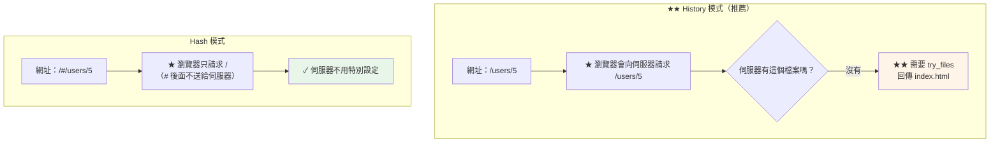
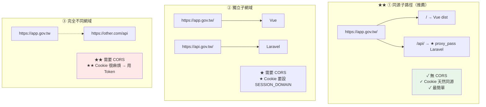

# Vue SPA 路由與 API 代理

> [!abstract] 這篇你會學到
> - **History 模式 vs Hash 模式**的差別與伺服器需求
> - `try_files` 的**細節與陷阱**
> - **部署到子目錄**（`/admin/`）的完整設定
> - **API 代理**的三種模式（同源 / 跨域 / 子路徑）
> - **`proxy_pass` 斜線規則**（最容易錯的地方）
> - **開發環境的 Vite proxy** 與正式環境的一致性
> - **404 頁面**與錯誤處理

## 前置知識

- [[130-01-02-01-guide-Vue-建置與Nginx靜態部署]] — 基本部署
- [[060-02-02-03-guide-Nginx-location與rewrite]] — location 匹配順序

---

## History 模式 vs Hash 模式 ★★



| | History 模式 ★★ | Hash 模式 |
| --- | --- | --- |
| 網址 | `/users/5` | `/#/users/5` |
| **伺服器設定** | **需要 `try_files`** | 不需要 |
| SEO | ✓ 好 | ✗ 差（爬蟲看不到 `#` 後面） |
| 美觀 | ✓ | ✗ |
| 靜態託管相容性 | 需要支援 rewrite | ✓ 任何地方都能跑 |
| **適用** | **正式產品** | 快速原型、無法設定伺服器時 |

```javascript
// router/index.ts
import { createRouter, createWebHistory, createWebHashHistory } from 'vue-router';

const router = createRouter({
  // ★★ History 模式（推薦）
  history: createWebHistory(import.meta.env.BASE_URL),
  // Hash 模式
  // history: createWebHashHistory(),
  routes: [
    { path: '/', component: () => import('@/views/Home.vue') },
    { path: '/users/:id', component: () => import('@/views/UserDetail.vue') },
    // ★★ 一定要有 404 路由（放在最後）
    { path: '/:pathMatch(.*)*', name: 'NotFound',
      component: () => import('@/views/NotFound.vue') },
  ],
});
```

> [!danger] 沒有 404 路由的後果 ★★
> ```
> 因為 try_files 會把【所有】找不到的路徑都導向 index.html
>   → 前端接手後如果沒有對應的路由
>     → ★ 顯示空白的 <router-view>（使用者以為壞了）
>
> ★★ 一定要有 catch-all 路由：
>   { path: '/:pathMatch(.*)*', component: NotFound }
>
> ★ 注意順序：必須放在【最後】
> ```

---

## `try_files` 的細節 ★★

```nginx
location / {
    try_files $uri $uri/ /index.html;
}
```

```
執行順序：
  ① $uri        → 找 /var/www/app/current/dist/users/5（檔案）
  ② $uri/       → 找 /var/www/app/current/dist/users/5/（目錄）
  ③ /index.html → ★ 都找不到就【內部重導】到 index.html
```

> [!danger] `try_files` 的三個陷阱 ★★★
> ```
> ① ★★★ 最後一個參數【不要加 =404】
>      try_files $uri $uri/ =404;         ← ✗ SPA 路由全部 404
>      try_files $uri $uri/ /index.html;  ← ✓
>
> ② ★★ 最後一個參數的【斜線】很重要
>      try_files $uri $uri/ index.html;   ← ✗ 沒有前導斜線 → 相對路徑，行為不對
>      try_files $uri $uri/ /index.html;  ← ✓ 絕對路徑（相對於 root）
>
> ③ ★★ 靜態資源【不應該】fallback 到 index.html
>      → /assets/notexist.js 應該回 404，不是回 index.html
>      → 否則瀏覽器會拿到 HTML 卻當成 JS 執行
>        → Console: Uncaught SyntaxError: Unexpected token '<'
>      → ★ 解法：資源的 location 用 =404
> ```

```nginx
# ★★ 正確的完整寫法
server {
    root /var/www/app/current/dist;
    index index.html;

    # ★★ 靜態資源：找不到就 404（不 fallback）
    location ~* ^/assets/ {
        try_files $uri =404;              # ★★ 這裡要 =404
        expires 1y;
        add_header Cache-Control "public, max-age=31536000, immutable";
        add_header X-Content-Type-Options "nosniff" always;
        access_log off;
    }

    # ★ 其他靜態檔（副檔名判斷）
    location ~* \.(js|css|png|jpe?g|gif|svg|ico|woff2?|ttf|eot|map|webp|avif)$ {
        try_files $uri =404;              # ★★
        expires 7d;
        add_header Cache-Control "public";
        add_header X-Content-Type-Options "nosniff" always;
    }

    # ★★ index.html 不快取
    location = /index.html {
        expires -1;
        add_header Cache-Control "no-cache, no-store, must-revalidate" always;
        add_header X-Content-Type-Options "nosniff" always;
    }

    # ★★ SPA 路由 fallback（★ 放在最後）
    location / {
        try_files $uri $uri/ /index.html;
    }
}
```

```bash
# ★★ 驗證三種情況
$ curl -so /dev/null -w '%{http_code}\n' https://app.example.gov.tw/users/5
200                                   # ★ SPA 路由 → index.html

$ curl -so /dev/null -w '%{http_code}\n' https://app.example.gov.tw/assets/notexist.js
404                                   # ★★ 資源不存在 → 404（正確）

$ curl -s https://app.example.gov.tw/assets/notexist.js | head -1
# ★ 應該是空的或 404 頁，★★ 不能是 <!DOCTYPE html>
```

> [!warning] `Unexpected token '<'` 的成因 ★★
> ```
> Console: Uncaught SyntaxError: Unexpected token '<'
>
> ★★ 意思是：瀏覽器請求一個 .js 檔，但拿到的是 HTML
>
> 原因：
>   · try_files 把找不到的 .js 也 fallback 到 index.html 了
>   · 或是資源路徑錯誤（base path 沒設對）
>
> ★ 驗證：
>   curl -s https://app/assets/xxx.js | head -3
>   → 若看到 <!DOCTYPE html> 就是這個問題
> ```

---

## 部署到子目錄 ★★

```
情境：主站是 https://www.example.gov.tw
      管理後台要放在 https://www.example.gov.tw/admin/
```

### 【1】Vite 設定 `base`

```javascript
// vite.config.ts
export default defineConfig({
  base: '/admin/',                    // ★★★ 一定要有前後斜線
  build: { outDir: 'dist' },
});
```

```bash
# ★ 或用環境變數
$ VITE_BASE=/admin/ npm run build
```

```javascript
// vite.config.ts —— 用環境變數
export default defineConfig(({ mode }) => ({
  base: process.env.VITE_BASE || '/',
}));
```

### 【2】Router 的 base

```javascript
// ★★ 必須與 vite 的 base 一致
const router = createRouter({
  history: createWebHistory(import.meta.env.BASE_URL),   // ★ BASE_URL = vite 的 base
  routes: [...],
});
```

> [!danger] `base` 沒設對的三個症狀 ★★★
> ```
> ① ★★ 資源 404
>      index.html 裡：<script src="/assets/index-abc.js">
>      實際位置：      /admin/assets/index-abc.js
>      → 404，Console 一片紅
>      → ★ 症狀：白畫面
>
> ② ★★ 路由跳轉後網址錯誤
>      點「使用者管理」→ 網址變成 /users 而不是 /admin/users
>      → 重新整理就 404
>
> ③ ★ 圖片與 CSS 背景圖 404
>      → 用 new URL('./img.png', import.meta.url) 或 import 引入
>        （★ 不要寫死絕對路徑）
>
> ★★★ vite 的 base 與 router 的 base 必須【完全一致】
> ```

### 【3】Nginx 設定

```nginx
server {
    listen 443 ssl;
    http2 on;
    server_name www.example.gov.tw;

    ssl_certificate     /etc/ssl/certs/www-fullchain.crt;
    ssl_certificate_key /etc/ssl/private/www.key;

    # ── 主站 ──
    root /var/www/main-site/current/public;
    index index.html index.php;
    location / { try_files $uri $uri/ /index.php?$query_string; }

    # ═══════ ★★ 管理後台（子目錄）═══════
    # ★ alias 的路徑【一定要有結尾斜線】
    location /admin/ {
        alias /var/www/admin-spa/current/dist/;

        # ★★ 子目錄的 SPA fallback（★ 注意是 /admin/index.html）
        try_files $uri $uri/ /admin/index.html;

        # ★ index.html 不快取
        location = /admin/index.html {
            alias /var/www/admin-spa/current/dist/index.html;
            expires -1;
            add_header Cache-Control "no-cache, no-store, must-revalidate" always;
            add_header X-Content-Type-Options "nosniff" always;
        }
    }

    # ★★ 子目錄的靜態資源
    location ~* ^/admin/assets/ {
        alias /var/www/admin-spa/current/dist/assets/;
        try_files $uri =404;
        expires 1y;
        add_header Cache-Control "public, max-age=31536000, immutable";
        add_header X-Content-Type-Options "nosniff" always;
        access_log off;
    }

    # ★ /admin 不帶斜線 → 轉址（避免相對路徑錯誤）
    location = /admin {
        return 301 /admin/;
    }
}
```

> [!danger] `alias` vs `root` ★★★
> ```
> location /admin/ {
>     root /var/www/admin;         # ★ 實際路徑 = /var/www/admin/admin/xxx
>     #                                                        ^^^^^^ 會【加上 location】
> }
>
> location /admin/ {
>     alias /var/www/admin/dist/;  # ★★ 實際路徑 = /var/www/admin/dist/xxx
>     #                                            （★ location 的部分被【替換掉】）
> }
>
> ★★★ 用 alias 時的鐵則：
>   ① location 與 alias 【都要有結尾斜線】，或【都沒有】
>        location /admin/ { alias /path/dist/; }   ✓
>        location /admin  { alias /path/dist;  }   ✓
>        location /admin/ { alias /path/dist;  }   ✗★★ 路徑會少一個斜線
>
>   ② ★★ alias 不能與 try_files 的相對路徑混用（Nginx 的已知問題）
>        → try_files 的最後一個參數要寫【完整的 URI】
>          try_files $uri $uri/ /admin/index.html;    ✓
>          try_files $uri $uri/ index.html;           ✗
>
>   ③ ★ 在 alias 的 location 裡不要用 if
> ```

```bash
# ★★ 驗證子目錄部署
$ curl -so /dev/null -w '%{http_code}\n' https://www.example.gov.tw/admin/
200
$ curl -so /dev/null -w '%{http_code}\n' https://www.example.gov.tw/admin/users/5
200                                       # ★ SPA 路由
$ curl -s https://www.example.gov.tw/admin/ | grep -oE 'src="[^"]+"'
src="/admin/assets/index-D4f8a2b1.js"     # ★★ 路徑有 /admin/ 前綴
$ curl -so /dev/null -w '%{http_code}\n' https://www.example.gov.tw/admin
301                                       # ★ 轉址到 /admin/
```

---

## API 代理的三種模式 ★★★



| 模式 | CORS | Cookie | 複雜度 | 適用 |
| --- | --- | --- | --- | --- |
| **① 同源子路徑** ★★ | **不需要** | **天然同源** | 低 | **大部分情況** |
| ② 獨立子網域 | 需要 | 設 `SESSION_DOMAIN=.gov.tw` | 中 | 前後端要分開擴充 |
| ③ 完全不同網域 | 需要 | **很麻煩** → 用 Bearer Token | 高 | 第三方 API |

### ★★ 模式①：同源子路徑（推薦）

```nginx
server {
    listen 443 ssl;
    http2 on;
    server_name app.example.gov.tw;

    ssl_certificate     /etc/ssl/certs/app-fullchain.crt;
    ssl_certificate_key /etc/ssl/private/app.key;

    # ═══ 前端 ═══
    root /var/www/vue-app/current/dist;
    index index.html;

    location ~* ^/assets/ {
        try_files $uri =404;
        expires 1y;
        add_header Cache-Control "public, max-age=31536000, immutable";
        add_header X-Content-Type-Options "nosniff" always;
    }

    location = /index.html {
        expires -1;
        add_header Cache-Control "no-cache, no-store, must-revalidate" always;
        add_header X-Content-Type-Options "nosniff" always;
    }

    # ═══════ ★★ API：直接跑 PHP-FPM（不用另一層 proxy）═══════
    location /api/ {
        # ★★ 把 /api/xxx 交給 Laravel 的 public/index.php
        root /var/www/laravel-api/current/public;
        try_files $uri /index.php?$query_string;
    }

    location ~ ^/api/.*\.php$ {
        root /var/www/laravel-api/current/public;
        try_files $uri =404;                       # ★★ 防 PathInfo 攻擊
        fastcgi_pass unix:/run/php/php8.3-fpm-api.sock;
        fastcgi_index index.php;
        include fastcgi_params;
        fastcgi_param SCRIPT_FILENAME $realpath_root$fastcgi_script_name;
        fastcgi_param DOCUMENT_ROOT   $realpath_root;
        fastcgi_param HTTPS on;                    # ★★ 讓 Laravel 知道是 HTTPS
    }

    # ★ 前端 SPA fallback（★ 一定要在 /api/ 之後）
    location / {
        try_files $uri $uri/ /index.html;
    }
}
```

```javascript
// ★★ 前端的 API base（同源 → 相對路徑就好）
// .env.production
// VITE_API_BASE=/api

// api/client.ts
import axios from 'axios';

export const api = axios.create({
  baseURL: import.meta.env.VITE_API_BASE || '/api',
  withCredentials: true,               // ★ 同源時也建議加（Sanctum cookie）
  headers: { 'X-Requested-With': 'XMLHttpRequest' },   // ★ Laravel 判斷 AJAX
});
```

> [!tip] 同源的三個好處 ★★
> ```
> ① ★★ 【完全不需要 CORS 設定】
>    → 省掉 CORS preflight（★ 每個非簡單請求少一次 OPTIONS 往返）
>
> ② ★★ Cookie 天然同源
>    → Sanctum 的 SPA 認證直接可用
>    → 不用煩惱 SameSite / SESSION_DOMAIN
>
> ③ ★ 只需要一張憑證、一個網域
>
> ★★★ 除非有明確的理由（例如 API 要獨立擴充、或給多個前端用），
>    否則【一律優先選同源】
> ```

### 模式②：獨立子網域 + 反向代理

```nginx
# ★ 前端
server {
    listen 443 ssl;
    http2 on;
    server_name app.example.gov.tw;
    root /var/www/vue-app/current/dist;
    location / { try_files $uri $uri/ /index.html; }
}

# ★ 後端 API
server {
    listen 443 ssl;
    http2 on;
    server_name api.example.gov.tw;
    root /var/www/laravel-api/current/public;
    index index.php;

    location / { try_files $uri $uri/ /index.php?$query_string; }

    location ~ \.php$ {
        try_files $uri =404;
        fastcgi_pass unix:/run/php/php8.3-fpm-api.sock;
        include fastcgi_params;
        fastcgi_param SCRIPT_FILENAME $realpath_root$fastcgi_script_name;
        fastcgi_param HTTPS on;
    }
}
```

```dotenv
# ★★ 前端 .env.production
VITE_API_BASE=https://api.example.gov.tw
```

```dotenv
# ★★ Laravel .env（Cookie 要跨子網域共用）
SESSION_DOMAIN=.example.gov.tw          # ★★ 開頭的點很重要
SESSION_SECURE_COOKIE=true
SESSION_SAME_SITE=lax
SANCTUM_STATEFUL_DOMAINS=app.example.gov.tw
```

### ★★★ `proxy_pass` 的斜線規則（最容易錯）

```nginx
# ═══════ ★★★ 有沒有結尾斜線，行為完全不同 ═══════

# ① proxy_pass 【沒有】結尾斜線 → 原封不動轉發
location /api/ {
    proxy_pass http://backend:3000;
}
# 請求 /api/users  →  後端收到 /api/users        ★ 保留 /api/

# ② proxy_pass 【有】結尾斜線 → 替換掉 location 的前綴
location /api/ {
    proxy_pass http://backend:3000/;
}
# 請求 /api/users  →  後端收到 /users            ★★ /api/ 被拿掉

# ③ 替換成別的前綴
location /api/ {
    proxy_pass http://backend:3000/v2/;
}
# 請求 /api/users  →  後端收到 /v2/users

# ★★ ④ 用正規表示式的 location 時，proxy_pass 【不能有 URI 部分】
location ~ ^/api/(.*)$ {
    proxy_pass http://backend:3000/$1;    # ★ 用 $1 明確指定
}
```

```bash
# ★★ 驗證轉發後的路徑（用 nc 開個假後端）
$ nc -l 3000 &
$ curl https://app.example.gov.tw/api/users
# ★ 看 nc 收到的第一行是 GET /api/users 還是 GET /users
```

```nginx
# ★★ 完整的 proxy 設定（必備標頭）
location /api/ {
    proxy_pass http://127.0.0.1:3000;

    proxy_http_version 1.1;
    proxy_set_header Upgrade           $http_upgrade;      # ★ WebSocket
    proxy_set_header Connection        $connection_upgrade;
    proxy_set_header Host              $host;
    proxy_set_header X-Real-IP         $remote_addr;
    proxy_set_header X-Forwarded-For   $proxy_add_x_forwarded_for;
    proxy_set_header X-Forwarded-Proto $scheme;            # ★★★ 沒有它 HTTPS 會壞
    proxy_set_header X-Forwarded-Host  $host;
    proxy_set_header X-Forwarded-Port  $server_port;

    proxy_connect_timeout 10s;
    proxy_send_timeout    60s;
    proxy_read_timeout    60s;

    proxy_buffering on;
    proxy_buffer_size       8k;
    proxy_buffers        8  8k;

    # ★ 大檔上傳
    client_max_body_size 20m;
}

# ★ WebSocket 的 Connection 標頭（放在 http 區塊）
map $http_upgrade $connection_upgrade {
    default upgrade;
    ''      close;
}
```

> [!danger] 少了 `X-Forwarded-Proto` 的後果 ★★★
> ```
> 後端（Laravel / Node）不知道原始請求是 HTTPS
>   → 產生的絕對網址是 http://
>     → ① 混合內容警告（HTTPS 頁面載入 HTTP 資源）
>     → ② ★★ 轉址迴圈：
>          後端回 302 到 http:// → Nginx 又 301 到 https:// → 無限迴圈
>     → ③ ★★ SESSION_SECURE_COOKIE=true 時 cookie 送不出去 → 一直登不進去
>
> ★★ Laravel 還需要 TrustProxies：
>   protected $proxies = ['127.0.0.1'];
>   protected $headers = Request::HEADER_X_FORWARDED_FOR
>                      | Request::HEADER_X_FORWARDED_HOST
>                      | Request::HEADER_X_FORWARDED_PORT
>                      | Request::HEADER_X_FORWARDED_PROTO;
> ```

---

## 開發環境的 Vite proxy ★★

```javascript
// vite.config.ts
export default defineConfig({
  server: {
    port: 5173,
    proxy: {
      // ★★ 開發時把 /api 代理到後端，模擬正式環境的同源
      '/api': {
        target: 'http://localhost:8000',       // Laravel 的 php artisan serve
        changeOrigin: true,
        // ★ 若後端路徑不含 /api 才需要 rewrite
        // rewrite: (path) => path.replace(/^\/api/, ''),
      },
      '/sanctum': {
        target: 'http://localhost:8000',
        changeOrigin: true,
      },
      // ★ WebSocket
      '/ws': {
        target: 'ws://localhost:6001',
        ws: true,
      },
    },
  },
});
```

> [!warning] 開發與正式環境要一致 ★★
> ```
> ★★ 開發時用 Vite proxy 讓 /api 同源
>    → 正式環境也要用【同源子路徑】
>      → 這樣「開發能跑、正式不能跑」的問題會少很多
>
> ❌ 常見錯誤：
>    開發：Vite proxy → 同源，沒有 CORS 問題
>    正式：前端 app.gov.tw、後端 api.gov.tw → ★★ 跨域
>    → 上線才發現 CORS 全爆
>
> ★ 若正式環境必須跨域，開發環境也應該用跨域的方式測試：
>    · 把 Vite proxy 拿掉
>    · VITE_API_BASE 直接指到後端
>    · ★ 後端設好 CORS
>    → 開發時就會遇到同樣的問題
> ```

```bash
# ★ 用 --host 讓區網其他裝置也能連（測手機）
$ npm run dev -- --host
  ➜  Local:   http://localhost:5173/
  ➜  Network: http://10.0.20.100:5173/     # ★ 手機連這個

# ★★ 注意：--host 會把開發伺服器暴露到區網
#   Vite 5.1+ 預設有 server.allowedHosts 保護
#   ★ 不要在不信任的網路使用
```

---

## 完整實戰範例：一站多前端

```nginx
# ═══════════════════════════════════════════════════════
# 情境：一個網域下有
#   /            → 公開網站（Vue SPA）
#   /admin/      → 管理後台（另一個 Vue SPA）
#   /api/        → Laravel API
#   /docs/       → 靜態文件（VitePress 建置產物）
# ═══════════════════════════════════════════════════════

map $http_upgrade $connection_upgrade { default upgrade; '' close; }

server {
    listen 80;
    server_name portal.example.gov.tw;
    location ^~ /.well-known/acme-challenge/ { root /var/www/certbot; }
    location / { return 301 https://$host$request_uri; }
}

server {
    listen 443 ssl;
    listen [::]:443 ssl;
    http2 on;
    server_name portal.example.gov.tw;

    ssl_certificate         /etc/ssl/certs/portal-fullchain.crt;
    ssl_certificate_key     /etc/ssl/private/portal.key;
    ssl_trusted_certificate /etc/ssl/certs/ca-chain.crt;
    ssl_protocols           TLSv1.2 TLSv1.3;
    ssl_session_cache       shared:SSL:10m;
    ssl_session_tickets     off;

    add_header Strict-Transport-Security "max-age=31536000; includeSubDomains" always;
    add_header X-Content-Type-Options "nosniff" always;
    add_header X-Frame-Options "SAMEORIGIN" always;
    add_header Referrer-Policy "strict-origin-when-cross-origin" always;

    client_max_body_size 20m;

    gzip on;
    gzip_static on;
    gzip_vary on;
    gzip_types text/plain text/css application/json application/javascript
               application/xml image/svg+xml font/woff2;

    # ═══════ ① API（★ 必須在最前面，優先匹配）═══════
    location ^~ /api/ {
        root /var/www/laravel-api/current/public;
        try_files $uri /index.php?$query_string;

        location ~ \.php$ {
            root /var/www/laravel-api/current/public;
            try_files $uri =404;
            fastcgi_pass unix:/run/php/php8.3-fpm-api.sock;
            fastcgi_index index.php;
            include fastcgi_params;
            fastcgi_param SCRIPT_FILENAME $realpath_root$fastcgi_script_name;
            fastcgi_param DOCUMENT_ROOT   $realpath_root;
            fastcgi_param HTTPS on;
            fastcgi_read_timeout 60s;
        }
    }

    # ═══════ ② 管理後台的資源 ═══════
    location ^~ /admin/assets/ {
        alias /var/www/admin-spa/current/dist/assets/;
        try_files $uri =404;
        expires 1y;
        add_header Cache-Control "public, max-age=31536000, immutable";
        add_header X-Content-Type-Options "nosniff" always;
        access_log off;
    }

    # ═══════ ③ 管理後台 ═══════
    location = /admin { return 301 /admin/; }

    location ^~ /admin/ {
        alias /var/www/admin-spa/current/dist/;
        try_files $uri $uri/ /admin/index.html;      # ★★ 完整 URI

        # ★ 只允許內網存取管理後台
        allow 10.0.0.0/8;
        allow 172.16.0.0/12;
        deny  all;
    }

    # ═══════ ④ 文件 ═══════
    location = /docs { return 301 /docs/; }

    location ^~ /docs/ {
        alias /var/www/docs/current/dist/;
        try_files $uri $uri/ /docs/index.html;
        expires 1h;
        add_header Cache-Control "public, max-age=3600";
        add_header X-Content-Type-Options "nosniff" always;
    }

    # ═══════ ⑤ 主站（★ 放最後）═══════
    root /var/www/portal-spa/current/dist;
    index index.html;

    location ^~ /assets/ {
        try_files $uri =404;
        expires 1y;
        add_header Cache-Control "public, max-age=31536000, immutable";
        add_header X-Content-Type-Options "nosniff" always;
        access_log off;
    }

    location = /index.html {
        expires -1;
        add_header Cache-Control "no-cache, no-store, must-revalidate" always;
        add_header X-Content-Type-Options "nosniff" always;
    }

    location / {
        try_files $uri $uri/ /index.html;
    }

    # ═══════ 安全 ═══════
    location ~ /\.       { deny all; access_log off; }
    location ~ \.map$    { deny all; access_log off; }
    location ~ \.(env|lock|json)$ {
        # ★ 放行必要的
        location ~ (manifest\.json|site\.webmanifest)$ { }
        deny all;
    }
}
```

```bash
# ★★ 驗證腳本
$ sudo tee /usr/local/bin/verify-spa >/dev/null <<'EOF'
#!/usr/bin/env bash
S="${1:-https://portal.example.gov.tw}"
echo "═══ SPA 路由與代理驗證：$S ═══"
t() { printf '  %-45s ' "$1"; C=$(curl -so /dev/null -w '%{http_code}' --max-time 10 "$S$2"); \
      if [ "$C" = "$3" ]; then echo "✓ ($C)"; else echo "✗ (got $C, want $3)"; fi; }

echo -e "\n【主站】"
t "首頁"                    "/"                    200
t "★ SPA 路由 fallback"      "/some/deep/route"     200
t "★★ 資源不存在應 404"       "/assets/nope.js"      404

echo -e "\n【管理後台】"
t "/admin 轉址"             "/admin"               301
t "/admin/ 首頁"            "/admin/"              200
t "★ /admin/ SPA 路由"       "/admin/users/5"       200
t "★★ /admin/ 資源 404"      "/admin/assets/no.js"  404

echo -e "\n【API】"
t "API 健康檢查"            "/api/health"          200

echo -e "\n【安全】"
t "★ .env 擋住"              "/.env"                404
t "★ .git 擋住"              "/.git/config"         404
t "★ sourcemap 擋住"         "/assets/index.js.map" 403

echo -e "\n【內容檢查】"
printf '  %-45s ' "★★ /admin/ 的資源路徑有前綴"
curl -s "$S/admin/" | grep -qE 'src="/admin/assets/' && echo "✓" || echo "✗"

printf '  %-45s ' "★★ 資源不會回傳 HTML"
curl -s "$S/assets/nope.js" | grep -q '<!DOCTYPE' && echo "✗✗ 回傳了 HTML" || echo "✓"

printf '  %-45s ' "index.html 不快取"
curl -sI "$S/" | grep -qi 'cache-control:.*no-' && echo "✓" || echo "✗"
EOF
$ sudo chmod +x /usr/local/bin/verify-spa && verify-spa
```

---

## 常見錯誤與排錯

| 現象 | 原因 | 解法 |
| --- | --- | --- |
| **重新整理子頁面 404** ★★★ | 沒有 `try_files` fallback | `try_files $uri $uri/ /index.html;` |
| **`Unexpected token '<'`** ★★★ | `.js` 也 fallback 到 index.html | 資源的 location 用 `try_files $uri =404;` |
| **子目錄部署白畫面** ★★★ | `vite base` 沒設 | `base: '/admin/'` + router 的 `BASE_URL` |
| **`alias` 路徑少一個斜線** ★★ | location 與 alias 斜線不一致 | 兩邊**都有**或**都沒有**結尾斜線 |
| `alias` + `try_files` 失效 ★★ | 相對路徑問題 | `try_files` 最後參數寫**完整 URI** |
| **`/api/xxx` 打到後端變 `/xxx`** ★★ | `proxy_pass` 有結尾斜線 | 移除斜線，或改後端路由 |
| **後端產生 `http://` 連結** ★★★ | 缺 `X-Forwarded-Proto` | 加上 + Laravel TrustProxies |
| **轉址無限迴圈** ★★ | 同上 | 同上 |
| `/admin` 沒有斜線時資源 404 | 相對路徑基準錯 | `location = /admin { return 301 /admin/; }` |
| **CORS 錯誤** ★★ | 跨域但後端沒設 | 改同源，或設 CORS |
| **API 被 SPA fallback 吃掉** ★★ | location 順序 | `/api/` 用 `^~` 且放在 `/` 前面 |
| WebSocket 連不上 | 缺 `Upgrade` 標頭 | `proxy_set_header Upgrade $http_upgrade;` |
| 上傳大檔 413 | `client_max_body_size` | 調大（Nginx 與 PHP 都要） |
| 開發能跑正式不行 ★★ | 開發用 proxy 正式跨域 | **兩邊架構要一致** |

### 排查

```bash
S=https://portal.example.gov.tw

# 【1】★★ location 匹配了哪一個
$ curl -sI "$S/api/users" | grep -i server
# ★ 用 error_log 的 debug 等級更精確（★ 只在測試環境開）
#   error_log /var/log/nginx/debug.log debug;
#   grep 'using configuration' /var/log/nginx/debug.log

# 【2】★★★ 資源到底回傳什麼
$ curl -s "$S/assets/index-abc.js" | head -3
# ★ 若是 <!DOCTYPE html> → try_files 設錯

# 【3】★★ index.html 引用的路徑
$ curl -s "$S/admin/" | grep -oE '(src|href)="[^"]+"'
# ★ 子目錄部署時應該有 /admin/ 前綴

# 【4】proxy_pass 轉發後的路徑
$ sudo tail -f /var/log/nginx/access.log &
$ curl "$S/api/users"
# ★ 或在後端看 access log

# 【5】★★ 標頭是否正確傳遞
$ curl -sI "$S/api/health" | grep -iE 'x-forwarded|location'

# 【6】Nginx 實際的設定
$ sudo nginx -T 2>/dev/null | sed -n '/server_name portal/,/^}/p'

# 【7】測試 SPA 路由
$ for p in / /users/5 /admin/ /admin/users/5 /docs/; do
    printf '%-20s %s\n' "$p" "$(curl -so /dev/null -w '%{http_code}' "$S$p")"
  done
```

---

## 安全性注意事項

> [!danger] SPA fallback 造成的資訊洩漏 ★★
> ```
> try_files $uri $uri/ /index.html;
>   → ★★ 【任何】不存在的路徑都會回傳 200 + index.html
>     → 掃描工具無法分辨「不存在」與「存在但沒權限」
>       → ★ 這其實對防守方有利（增加掃描難度）
>
> ★★ 但要注意：
>   · 【不要】讓 /api/ 也被 fallback 吃掉
>     → API 的 404 應該回傳 JSON 404，不是 HTML
>     → location ^~ /api/ 放在 location / 前面
>
>   · ★★ 敏感路徑要明確擋掉，不能只靠「不存在」
>     location ~ /\.       { deny all; }
>     location ~ \.map$    { deny all; }
>     location ~ /(vendor|storage|tests)/ { deny all; }
> ```

> [!warning] 管理後台的存取控制 ★★
> ```nginx
> # ★ 網路層限制（最有效）
> location ^~ /admin/ {
>     allow 10.0.0.0/8;
>     allow 172.16.0.0/12;
>     deny  all;
>     # ...
> }
>
> # ★ 或用 HTTP Basic 當第二道
> location ^~ /admin/ {
>     auth_basic "Admin";
>     auth_basic_user_file /etc/nginx/.htpasswd-admin;
> }
>
> # ★★ 或 mTLS（最強）
> location ^~ /admin/ {
>     # 需要在 server 層設 ssl_verify_client optional;
>     if ($ssl_client_verify != SUCCESS) { return 403; }
> }
> ```
>
> ```
> ★★★ 但這些【都只是第二道防線】
>    → 應用層仍然必須自己驗證每一個 API 的權限
>    → 前端的路由守衛（router.beforeEach）只是 UI 呈現，
>      攻擊者可以直接呼叫 API
> ```

```javascript
// ★ 前端的路由守衛（★ 只是 UI，不是安全機制）
router.beforeEach(async (to) => {
  if (to.meta.requiresAuth && !auth.isLoggedIn) {
    return { name: 'login', query: { redirect: to.fullPath } };
  }
  if (to.meta.requiresAdmin && !auth.user?.isAdmin) {
    return { name: 'forbidden' };
  }
});
// ★★★ 後端每一個端點都必須自己再驗證一次
```

---

## 速查表

### ★★ `try_files`

```nginx
# ★★ SPA 路由 fallback
location / { try_files $uri $uri/ /index.html; }

# ★★★ 靜態資源不 fallback（否則會 Unexpected token '<'）
location ~* ^/assets/ { try_files $uri =404; }
```

```
★★★ 三個陷阱：
  ① 最後參數不要用 =404（SPA 會全 404）
  ② 最後參數要有前導斜線 /index.html
  ③ 靜態資源要用 =404（不 fallback）
```

### ★★★ `alias` vs `root`

```nginx
location /admin/ { root  /var/www/x;      }  # → /var/www/x/admin/...  ★ 加上 location
location /admin/ { alias /var/www/x/dist/; }  # → /var/www/x/dist/...   ★ 替換 location
```

```
★★★ alias 的鐵則：
  ① location 與 alias 【都有】或【都沒有】結尾斜線
  ② try_files 最後參數要寫【完整 URI】：/admin/index.html
  ③ 不要在 alias 的 location 用 if
```

### 子目錄部署

```javascript
// vite.config.ts
base: '/admin/'                                    // ★★ 前後都要斜線
// router
history: createWebHistory(import.meta.env.BASE_URL) // ★★ 必須一致
```
```nginx
location = /admin { return 301 /admin/; }          # ★ 不帶斜線轉址
location ^~ /admin/ {
    alias /var/www/admin/current/dist/;
    try_files $uri $uri/ /admin/index.html;        # ★★ 完整 URI
}
```

### ★★★ `proxy_pass` 斜線規則

```nginx
location /api/ { proxy_pass http://b:3000;    }  # /api/users → /api/users  ★ 保留
location /api/ { proxy_pass http://b:3000/;   }  # /api/users → /users      ★★ 替換
location /api/ { proxy_pass http://b:3000/v2/;}  # /api/users → /v2/users
location ~ ^/api/(.*)$ { proxy_pass http://b:3000/$1; }   # ★ regex 要用 $1
```

### 必備的 proxy 標頭

```nginx
proxy_http_version 1.1;
proxy_set_header Upgrade           $http_upgrade;
proxy_set_header Connection        $connection_upgrade;
proxy_set_header Host              $host;
proxy_set_header X-Real-IP         $remote_addr;
proxy_set_header X-Forwarded-For   $proxy_add_x_forwarded_for;
proxy_set_header X-Forwarded-Proto $scheme;     # ★★★ 沒有它 HTTPS 會壞
```

### API 代理模式選擇

```
★★ ① 同源子路徑 /api/     → 無 CORS、Cookie 天然同源  ← 優先選這個
   ② 子網域 api.x.gov.tw  → 需 CORS、SESSION_DOMAIN=.x.gov.tw
   ③ 完全不同網域          → 需 CORS、Cookie 麻煩 → 用 Bearer Token
```

### location 順序 ★★

```nginx
location ^~ /api/     { }    # ① API 最優先（★ ^~ 阻止正規表示式繼續匹配）
location ^~ /admin/   { }    # ② 子應用
location ~* ^/assets/ { }    # ③ 靜態資源
location = /index.html{ }    # ④ 精確匹配
location /            { }    # ⑤ ★ SPA fallback 放最後
```

### 驗證

```bash
curl -so /dev/null -w '%{http_code}\n' https://app/users/5        # ★ 200
curl -so /dev/null -w '%{http_code}\n' https://app/assets/no.js   # ★★ 404
curl -s https://app/assets/no.js | head -1                        # ★ 不能是 <!DOCTYPE
curl -s https://app/admin/ | grep -oE 'src="[^"]+"'               # ★ 要有 /admin/ 前綴
curl -so /dev/null -w '%{http_code}\n' https://app/admin          # ★ 301
```

---

## 練習題

> [!question]- 練習 1：`try_files` 的三個陷阱
> 分別測試：
> 1. `try_files $uri $uri/ =404;` → 開 `/users/5` **結果？**
> 2. `try_files $uri $uri/ index.html;`（**沒有前導斜線**）→ 結果？
> 3. `location ~* \.js$ { try_files $uri $uri/ /index.html; }`
>    → 請求 `/assets/notexist.js` → **回傳什麼？** Console 是什麼錯誤？
> 4. 全部改成正確的寫法再測一次
> 5. **寫下每一種的錯誤訊息**

> [!question]- 練習 2：子目錄部署
> 1. 把一個 Vue SPA 部署到 `/admin/`
> 2. **故意不設 `vite base`** → **開起來是什麼樣子？** Console 呢？
> 3. 設 `base: '/admin/'` 但 **router 不改** → 點路由連結會怎樣？
> 4. 兩邊都設好
> 5. 測試 `/admin`（不帶斜線）→ **資源載得到嗎？**
> 6. 加上 `return 301 /admin/;`

> [!question]- 練習 3：`proxy_pass` 斜線
> 1. 用 `nc -l 3000` 或一個簡單的 Node 服務當後端
> 2. 分別測試四種 `proxy_pass` 寫法
> 3. **記錄每一種後端收到的路徑**
> 4. 用正規表示式的 location 測試 → **有什麼限制？**
> 5. 整理成一張對照表

> [!question]- 練習 4：`X-Forwarded-Proto` 的重要性
> 1. 部署 Laravel API 在 Nginx 後面（HTTPS）
> 2. **拿掉 `X-Forwarded-Proto`**（或 `fastcgi_param HTTPS on`）
> 3. `dd(request()->secure())` → **回傳什麼？**
> 4. `route('home')` 產生的網址是 `http` 還是 `https`？
> 5. 設 `SESSION_SECURE_COOKIE=true` → **能登入嗎？**
> 6. 加回設定並確認 TrustProxies 也設好

> [!question]- 練習 5：一站多前端
> 1. 部署三個東西：主站 SPA、`/admin/` SPA、`/api/` Laravel
> 2. 執行 `verify-spa` 腳本
> 3. **故意把 `location /` 放在 `location ^~ /api/` 前面** → 會怎樣？
> 4. 故意用 `location /api/`（不用 `^~`）→ 與 `location ~ \.php$` 衝突嗎？
> 5. 加上管理後台的 IP 限制並測試
> 6. **畫出你的 location 匹配順序圖**

---

## 小測驗

Q1. **History 模式與 Hash 模式在伺服器設定上有什麼差別**？

Q2. **`try_files` 的三個陷阱是什麼**？

Q3. **Console 顯示 `Unexpected token '<'` 是什麼原因**？

Q4. **`alias` 與 `root` 的差別？使用 `alias` 有哪三個鐵則**？

Q5. **部署到子目錄需要改哪兩個地方？不改的症狀**？

Q6. **`proxy_pass http://b:3000` 與 `proxy_pass http://b:3000/` 有什麼差別**？

Q7. **少了 `X-Forwarded-Proto` 會造成哪三個問題**？

Q8. **API 代理的三種模式，為什麼優先選「同源子路徑」**？

Q9. **location 的排列順序為什麼重要？`^~` 的作用是什麼**？

Q10. **前端的路由守衛（`router.beforeEach`）算是安全機制嗎**？

> [!question]- 測驗答案
> **Q1.** **History 模式**（`/users/5`）——
> 網址是真實的路徑，**瀏覽器直接開啟或重新整理時會向伺服器請求 `/users/5`**，
> 但伺服器上沒有這個檔案 → **必須設定 `try_files $uri $uri/ /index.html;`**
> 讓伺服器回傳 `index.html`，由前端 router 接手。
> **Hash 模式**（`/#/users/5`）——
> **`#` 後面的部分不會送給伺服器**（那是 fragment，只在瀏覽器端處理），
> 伺服器永遠只收到 `/` 的請求 → **不需要任何特別設定**。
> **選擇**：正式產品用 History（網址美觀、SEO 好）；
> Hash 適合快速原型或**無法設定伺服器**的靜態託管環境。
>
> **Q2.** ①**最後一個參數不要用 `=404`** ——
> `try_files $uri $uri/ =404;` 會讓**所有 SPA 路由都 404**；
> ②**最後一個參數要有前導斜線** ——
> `/index.html` 是相對於 `root` 的絕對 URI，
> 寫成 `index.html`（沒有斜線）行為會不正確；
> ③**★★ 靜態資源不應該 fallback 到 `index.html`** ——
> 請求一個不存在的 `.js` 時應該回 **404**，
> 如果 fallback 成 HTML，瀏覽器會拿到 HTML 卻當成 JS 執行，
> 產生 `Unexpected token '<'`。
> 所以資源的 location 要單獨寫 `try_files $uri =404;`。
>
> **Q3.** **瀏覽器請求一個 `.js` 檔案，但伺服器回傳的是 HTML**。
> JS 解析器讀到 HTML 的第一個字元 `<`（`<!DOCTYPE html>`）就報錯。
> **兩個常見原因**：
> ①**`try_files` 把找不到的 `.js` 也 fallback 到 `index.html` 了**
> —— 解法是資源的 location 用 `try_files $uri =404;`；
> ②**資源路徑錯誤**（子目錄部署時 `vite base` 沒設對），
> 請求的是 `/assets/x.js` 但實際在 `/admin/assets/x.js`，
> 前者被 `location /` 的 fallback 接住回傳了 `index.html`。
> **驗證方式**：`curl -s https://app/assets/xxx.js | head -3`
> —— 看到 `<!DOCTYPE html>` 就確定是這個問題。
>
> **Q4.** **差別**：
> `root /var/www/x;` + `location /admin/` → 實際路徑是 **`/var/www/x/admin/...`**
> （**location 的部分會被「加上」**）；
> `alias /var/www/x/dist/;` + `location /admin/` → 實際路徑是 **`/var/www/x/dist/...`**
> （**location 的部分被「替換掉」**）。
> **三個鐵則**：
> ①**location 與 alias 的結尾斜線要一致** ——
> 都有或都沒有（`location /admin/` + `alias /path/dist/;`），
> 不一致會導致路徑少一個斜線；
> ②**`try_files` 的最後一個參數要寫完整 URI**
> （`/admin/index.html` 而不是 `index.html`）——
> `alias` 與 `try_files` 的相對路徑組合是 Nginx 的已知問題；
> ③**不要在 `alias` 的 location 裡用 `if`**。
>
> **Q5.** **要改兩個地方**：
> ①**`vite.config.ts` 的 `base: '/admin/'`**（**前後都要斜線**）——
> 決定建置產物中資源引用的路徑前綴；
> ②**router 的 `createWebHistory(import.meta.env.BASE_URL)`** ——
> `BASE_URL` 就是 vite 的 `base`，**兩者必須完全一致**。
> **不改的症狀**：
> **只漏 vite base** → `index.html` 引用 `/assets/x.js`
> 但檔案實際在 `/admin/assets/x.js` → **資源 404 → 白畫面**；
> **只漏 router base** → 資源載得到，但**點路由後網址變成 `/users` 而不是 `/admin/users`**，
> 重新整理就 404。
> 另外圖片要用 `new URL('./img.png', import.meta.url)` 或 `import` 引入，不要寫死絕對路徑。
>
> **Q6.** **關鍵在 `proxy_pass` 有沒有「結尾斜線」（更精確地說是有沒有 URI 部分）**。
> **沒有斜線**（`proxy_pass http://b:3000;`）——
> **原封不動轉發**：`/api/users` → 後端收到 **`/api/users`**。
> **有斜線**（`proxy_pass http://b:3000/;`）——
> **把 location 的前綴替換掉**：`/api/users` → 後端收到 **`/users`**。
> **替換成別的前綴**（`proxy_pass http://b:3000/v2/;`）——
> `/api/users` → **`/v2/users`**。
> **注意**：使用**正規表示式的 location** 時，
> `proxy_pass` **不能有 URI 部分**，要用捕獲群組明確指定：
> `location ~ ^/api/(.*)$ { proxy_pass http://b:3000/$1; }`。
>
> **Q7.** 後端（Laravel / Node）**不知道原始請求是 HTTPS**，
> 以為自己在處理 HTTP 請求，於是：
> ①**產生的絕對網址都是 `http://`** →
> 在 HTTPS 頁面上載入 HTTP 資源 → **混合內容警告**（瀏覽器會擋掉）；
> ②**★★ 轉址無限迴圈** ——
> 後端回 `302 http://app/login` → Nginx 又 `301` 到 `https://app/login`
> → 後端又回 `302 http://...` → **迴圈**；
> ③**★★ `SESSION_SECURE_COOKIE=true` 時 cookie 送不出去** ——
> 後端以為是 HTTP 連線，不會設 Secure cookie，
> 或設了但判斷不一致 → **一直登不進去**。
> **Laravel 還需要 `TrustProxies`**：
> `protected $proxies = ['127.0.0.1'];` 並啟用 `HEADER_X_FORWARDED_PROTO`，
> 走 PHP-FPM 時則要加 `fastcgi_param HTTPS on;`。
>
> **Q8.** **同源子路徑（`https://app.gov.tw/api/`）的三個好處**：
> ①**完全不需要 CORS 設定** ——
> 省掉每個非簡單請求的 **preflight OPTIONS 往返**（延遲減半）；
> ②**★★ Cookie 天然同源** ——
> Laravel Sanctum 的 SPA 認證直接可用，
> 不用煩惱 `SameSite`、`SESSION_DOMAIN`、`withCredentials` 的組合問題；
> ③**只需要一張憑證、一個網域**（管理成本低）。
> **什麼時候才需要分開**：
> API 需要**獨立擴充**（不同的機器數量）、
> **多個前端共用同一個 API**、
> 或組織上前後端由不同單位管理。
> **除非有明確理由，一律優先選同源**。
>
> **Q9.** 因為 **Nginx 的 location 匹配有固定的優先順序**，
> 而**同類型（前綴匹配）之間是「最長匹配優先」**，
> 但**正規表示式的 location 會依「設定檔中出現的順序」由上而下匹配，第一個中的就用**。
> 所以順序寫錯會導致「API 請求被 SPA 的 fallback 吃掉」這類問題。
> **`^~` 的作用**：**「前綴匹配成功後，就不要再去檢查正規表示式的 location」**。
> ```nginx
> location ^~ /api/ { }        # ★ 匹配到 /api/ 就停止，不會再落到 location ~ \.php$
> ```
> 沒有 `^~` 的話，`/api/users.php` 會先匹配 `location /api/`（前綴），
> 但接著仍會檢查正規表示式，被 `location ~ \.php$` 搶走。
> **完整優先順序**：`=`（精確）> `^~`（前綴且停止）>
> `~` / `~*`（正規，依序）> 一般前綴（最長者）。
>
> **Q10.** **不是**。`router.beforeEach` **只是 UI 呈現的控制** ——
> 它決定「要不要顯示這個畫面」，
> 但**攻擊者完全不需要經過前端**：
> 可以直接用 `curl` / Postman **呼叫 API**，
> 或在瀏覽器 Console 裡**直接修改 `auth.user.isAdmin = true`**，
> 或把前端的 JS 改掉重新執行。
> **所有的授權判斷都必須在後端的每一個 API 端點上執行**
> （Laravel 的 middleware、Policy、Gate）。
> 同樣的道理適用於：
> Nginx 的 IP 限制與 Basic Auth（**第二道防線**，不是唯一防線）、
> 前端的 `v-if="user.isAdmin"`（只是隱藏按鈕）、
> 前端的表單驗證（**後端一定要再驗一次**）。
> 前端的這些機制的價值在於**改善使用者體驗**與**提高攻擊成本**，而不是提供安全保證。

---

## 延伸閱讀

- [[130-01-02-03-guide-Vue-Docker部署]] — 容器化部署
- [[130-01-05-03-guide-前後端-跨網域與CORS設定]] — 跨域時的完整 CORS 設定
- [[130-01-05-05-guide-Nginx-前後端流量分流設定]] — 更複雜的分流情境
- [[130-01-05-06-guide-Vue-Laravel完整部署實戰]] — 完整的整合實戰
- [[060-02-02-03-guide-Nginx-location與rewrite]] — location 匹配的完整規則
- [[060-02-02-04-guide-Nginx-反向代理與負載平衡]] — proxy_pass 的進階用法
