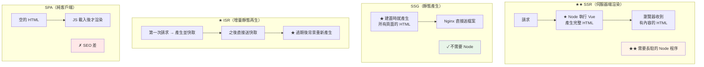
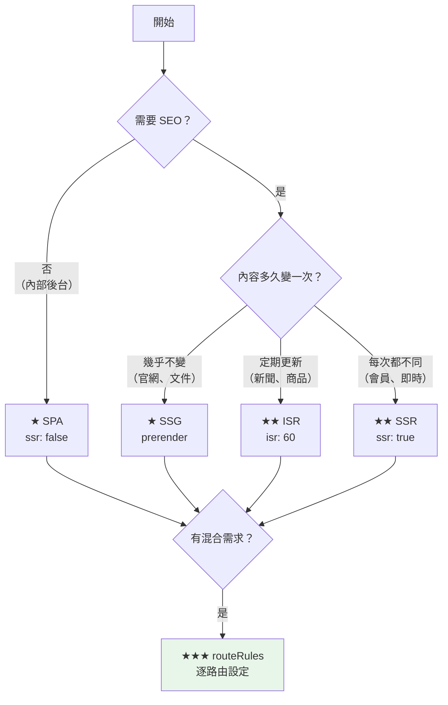

# Nuxt 渲染模式與部署選型

> [!abstract] 這篇你會學到
> - **四種渲染模式**（SSR / SSG / ISR / SPA）的差異
> - **★★ 混合渲染**（`routeRules`）—— 同一個站不同路由用不同模式
> - **Nitro preset** 與部署目標
> - **選型決策樹**（該用哪一種）
> - **`useFetch` 的雙重執行**與 SSR 的常見陷阱
> - **環境變數**（`runtimeConfig` vs `VITE_`）
> - **建置產物**的結構與差異

## 前置知識

- [[01-部署共通觀念]] — 部署佈局
- [[01-Vue-建置與Nginx靜態部署]] — Vue SPA 的部署方式

---

## 四種渲染模式 ★★★



| | **SSR** ★★ | **SSG** | **ISR** ★ | **SPA** |
| --- | --- | --- | --- | --- |
| HTML 產生時機 | **每次請求** | **建置時** | 首次請求後快取 | 瀏覽器端 |
| **需要 Node 執行**★★ | **✓ 必須** | **✗ 不用** | ✓ 必須 | ✗ 不用 |
| SEO | ✓ 最好 | ✓ 最好 | ✓ 好 | ✗ 差 |
| 首屏速度 | 中（要等伺服器） | **✓ 最快** | ✓ 快 | ✗ 慢 |
| 即時性 | **✓ 完全即時** | ✗ 建置時的資料 | 中（依 TTL） | ✓ 即時 |
| 伺服器負載 | **✗ 高** | ✓ 極低 | ✓ 低 | ✓ 極低 |
| 部署複雜度 | **★★ 高**（PM2/systemd） | ✓ 低 | 中 | ✓ 低 |
| 適用 | 會員系統、即時資料 | 官網、文件、部落格 | 新聞、商品列表 | 內部後台 |

```javascript
// nuxt.config.ts
export default defineNuxtConfig({
  // ═══ ★★ SSR（預設）═══
  ssr: true,

  // ═══ SPA（關掉 SSR）═══
  // ssr: false,

  // ═══ SSG（產生靜態檔案）═══
  // nuxt generate  或  nitro.prerender

  nitro: {
    // ★ SSG：預先產生指定的路由
    prerender: {
      crawlLinks: true,                    // ★ 自動爬所有連結
      routes: ['/', '/about', '/sitemap.xml'],
      failOnError: false,                  // ★ 有頁面失敗時不中止整個建置
    },
  },
});
```

---

## ★★★ 混合渲染（`routeRules`）

> [!tip] Nuxt 3 最強大的功能之一 ★★
> ```
> 不需要「整個站都選同一種模式」
>   → ★★ 每個路由可以用不同的渲染策略
>     → 首頁用 ISR、後台用 SPA、API 加 CORS、舊網址轉址…
> ```

```javascript
// nuxt.config.ts
export default defineNuxtConfig({
  routeRules: {
    // ═══ ★ 首頁：ISR，60 秒重新產生 ═══
    '/': { isr: 60 },

    // ═══ ★ 靜態頁：建置時產生（SSG）═══
    '/about':   { prerender: true },
    '/privacy': { prerender: true },
    '/terms':   { prerender: true },

    // ═══ ★★ 部落格列表：ISR 5 分鐘 ═══
    '/blog':      { isr: 300 },
    '/blog/**':   { isr: 3600 },           // ★ 文章一小時

    // ═══ ★★ 管理後台：純 SPA（★ 不需要 SEO，也不要 SSR 的負載）═══
    '/admin/**': { ssr: false },

    // ═══ ★ 會員頁：SSR 但不快取 ═══
    '/account/**': {
      ssr: true,
      headers: { 'Cache-Control': 'no-store, private' },   // ★★ 個人資料絕不快取
    },

    // ═══ ★ API 代理 ═══
    '/api/**': {
      proxy: 'https://api.example.gov.tw/**',
      headers: { 'Cache-Control': 'no-store' },
    },

    // ═══ 靜態資源 ═══
    '/_nuxt/**': {
      headers: { 'Cache-Control': 'public, max-age=31536000, immutable' },
    },

    // ═══ 舊網址轉址 ═══
    '/old-page': { redirect: { to: '/new-page', statusCode: 301 } },

    // ═══ ★ 加上安全標頭 ═══
    '/**': {
      headers: {
        'X-Content-Type-Options': 'nosniff',
        'X-Frame-Options': 'SAMEORIGIN',
        'Referrer-Policy': 'strict-origin-when-cross-origin',
      },
    },
  },
});
```

> [!danger] `routeRules` 的三個陷阱 ★★
> ```
> ① ★★★ 【個人化的頁面絕對不能用 ISR / 快取】
>      '/account/**': { isr: 60 }        ← ✗✗✗ 災難
>      → ★ A 使用者的頁面被快取
>        → B 使用者請求時拿到【A 的個人資料】
>      → 一定要 { ssr: true, headers: { 'Cache-Control': 'no-store, private' } }
>
> ② ★★ 順序：後面的規則會【合併】而不是覆蓋
>      '/**':       { headers: { 'X-Frame-Options': 'SAMEORIGIN' } }
>      '/embed/**': { headers: { 'X-Frame-Options': 'ALLOWALL' } }
>      → ★ /embed/ 會【合併】兩者，同名的以更精確的規則為準
>      → ★ 用 curl -I 實際驗證
>
> ③ ★ prerender 的頁面若依賴執行時的資料 → 資料會是【建置當下】的
>      → 需要即時資料就用 isr 或 ssr
> ```

```bash
# ★★ 驗證每個路由實際的行為
$ for p in / /about /blog /admin/users /account/profile; do
    printf '%-22s ' "$p"
    curl -sI "https://app.example.gov.tw$p" | \
      grep -iE '^(cache-control|x-nitro-prerender|age)' | tr '\n' ' '
    echo
  done
/                      cache-control: public, max-age=60, s-maxage=60
/about                 cache-control: public, max-age=31536000
/blog                  cache-control: public, max-age=300
/admin/users           cache-control: no-cache
/account/profile       cache-control: no-store, private          # ★★ 正確
```

---

## 選型決策樹 ★★



```
★★ 實務建議：

  ① 【內部管理系統】（本手冊的主要場景）
     → ★ 多數情況根本不需要 Nuxt SSR
       → 用 Vue SPA 就好（部署簡單很多，不用 Node 長駐）
     → 若已經用 Nuxt → routeRules 設 { ssr: false } 當 SPA 用

  ② 【對外的機關網站】
     → ★★ SSG 或 ISR
       → 靜態頁 prerender、公告列表 isr

  ③ 【會員系統／需要登入的服務】
     → ★★ SSR
       → 但要注意【個人化頁面不能快取】

  ④ 【混合】← 最常見
     → ★★★ routeRules
```

> [!warning] 不要為了 SSR 而 SSR ★★
> ```
> ★★ SSR 的成本：
>   · 需要【長駐的 Node 程序】（PM2 或 systemd）
>   · 需要監控記憶體洩漏
>   · 部署複雜度大幅提高
>   · ★ 伺服器 CPU 負載明顯增加
>   · ★★ 每次部署都要重啟程序（有短暫中斷）
>   · SSR 的錯誤處理與除錯比 SPA 難很多
>
> ★★★ 問自己：
>   □ 這個頁面需要被 Google 索引嗎？
>   □ 首屏速度是關鍵指標嗎？
>   □ 使用者會分享連結並期待預覽圖嗎？（OG tags）
>
>   → 三個都是「否」的話，SPA 就夠了
>
> ★ 內部管理系統幾乎永遠是三個「否」
> ```

---

## Nitro preset ★★

```
Nitro 是 Nuxt 3 的伺服器引擎
  → ★★ 同一份程式碼可以打包成不同的部署目標
```

```javascript
// nuxt.config.ts
export default defineNuxtConfig({
  nitro: {
    preset: 'node-server',              // ★★ 預設（自架伺服器）
  },
});
```

| preset | 產出 | 適用 |
| --- | --- | --- |
| **`node-server`** ★★ | `.output/server/index.mjs` | **自架（PM2 / systemd / Docker）** |
| `node-cluster` | 同上但內建 cluster | 多核心（★ 也可以用 PM2 cluster 取代） |
| **`static`** | 純靜態 HTML | **SSG，Nginx 直接送** |
| `github-pages` | 靜態 + 設定 | GitHub Pages |
| `vercel` / `netlify` | 平台專用 | 雲端平台 |
| `cloudflare-pages` | Workers | Cloudflare |
| `aws-lambda` | Lambda handler | Serverless |
| `bun` / `deno-server` | 其他 runtime | — |

```bash
# ═══ ★★ node-server（自架，本手冊主線）═══
$ npm run build
$ ls -la .output/
.output/
├── nitro.json
├── public/                             # ★★ 靜態資源（可交給 Nginx 直接送）
│   ├── _nuxt/
│   │   ├── entry.D4f8a2b1.js
│   │   └── entry.B7c3e9f2.css
│   └── favicon.ico
└── server/                             # ★★ Node 伺服器
    ├── index.mjs                       # ★ 進入點
    ├── chunks/
    └── node_modules/                   # ★ 已打包好的相依（不用 npm i）

$ node .output/server/index.mjs
Listening on http://[::]:3000

# ═══ SSG（static）═══
$ npx nuxt generate
$ ls -la .output/public/                # ★★ 只有這個目錄，沒有 server/
.output/public/
├── index.html
├── about/index.html
├── blog/index.html
├── _nuxt/
└── 200.html                            # ★ SPA fallback 用
```

> [!tip] `.output/server/node_modules` 已經打包好
> ```
> ★★ node-server 的產出【自帶所需的相依】
>   → 部署時【不需要】在伺服器上跑 npm install
>   → 只要 tar 打包整個 .output/ 傳過去就能跑
>
> ★ 這讓 CI 建置 + 傳產物的模式非常好用：
>   CI: npm ci && npm run build && tar czf out.tar.gz .output
>   伺服器: tar xzf out.tar.gz && node .output/server/index.mjs
>   → ★★ 伺服器上連 npm 都不用裝（只要有 node）
> ```

```bash
# ★ 產物大小
$ du -sh .output/
28M	.output/
$ du -sh .output/public .output/server
3.2M	.output/public
25M	.output/server
```

---

## 環境變數 ★★★

> [!danger] Nuxt 有兩套環境變數機制 ★★★
> ```
> ① ★★ runtimeConfig（★ Nuxt 的方式，執行時讀取）
>      → 【伺服器端專用】的秘密可以放這裡
>      → 改了【不用重新建置】，重啟就好
>
> ② VITE_ 前綴（Vite 的方式，建置時寫死）
>      → ★★ 與 Vue SPA 一樣，會寫死進 JS
>      → ★★★ 在 Nuxt 中【應該避免使用】
>
> ★★★ Nuxt 專案一律用 runtimeConfig
> ```

```javascript
// nuxt.config.ts
export default defineNuxtConfig({
  runtimeConfig: {
    // ═══ ★★★ 伺服器端專用（★ 不會送到瀏覽器）═══
    apiSecret: '',                      // ← NUXT_API_SECRET
    dbPassword: '',                     // ← NUXT_DB_PASSWORD
    internalApiBase: 'http://127.0.0.1:9000',   // ← NUXT_INTERNAL_API_BASE

    // ═══ ★★ public：會送到瀏覽器（★ 只放公開資訊）═══
    public: {
      apiBase: '/api',                  // ← NUXT_PUBLIC_API_BASE
      appEnv: 'production',             // ← NUXT_PUBLIC_APP_ENV
      appVersion: 'dev',                // ← NUXT_PUBLIC_APP_VERSION
    },
  },
});
```

```bash
# ★★ 環境變數命名規則：NUXT_ + 大寫 + 巢狀用底線
NUXT_API_SECRET=super-secret-value                    # → runtimeConfig.apiSecret
NUXT_DB_PASSWORD=xxx                                  # → runtimeConfig.dbPassword
NUXT_INTERNAL_API_BASE=http://127.0.0.1:9000          # → runtimeConfig.internalApiBase
NUXT_PUBLIC_API_BASE=https://api.example.gov.tw       # → runtimeConfig.public.apiBase
NUXT_PUBLIC_APP_ENV=production                        # → runtimeConfig.public.appEnv

# ★★★ 這些是【執行時】讀取的 —— 改了只要重啟，不用重新建置
$ NUXT_PUBLIC_API_BASE=https://api-dev.gov.tw node .output/server/index.mjs
```

```vue
<script setup lang="ts">
const config = useRuntimeConfig();

// ★★ public 在客戶端與伺服器端都可用
console.log(config.public.apiBase);

// ★★★ 非 public 的【只在伺服器端】可用
if (import.meta.server) {
  console.log(config.apiSecret);        // ✓ 有值
}
// ★ 在客戶端讀 config.apiSecret → undefined（★ Nuxt 不會送過去）
</script>
```

```typescript
// server/api/data.get.ts —— ★ 伺服器端 API 路由
export default defineEventHandler(async (event) => {
  const config = useRuntimeConfig(event);

  // ★★ 這裡可以安全地使用秘密
  const res = await $fetch('https://internal-api.gov.tw/data', {
    headers: { Authorization: `Bearer ${config.apiSecret}` },
  });

  return res;
});
```

> [!warning] 檢查秘密有沒有洩漏到客戶端 ★★
> ```bash
> # ★★ 建置後掃描
> grep -rE 'apiSecret|dbPassword|NUXT_API_SECRET' .output/public/ && \
>   echo "✗✗✗ 秘密洩漏到客戶端！"
>
> # ★ 檢查 runtimeConfig 的 public 部分
> curl -s https://app.example.gov.tw/ | grep -oE '__NUXT__.*' | head -c 500
> # → 只應該看到 public 裡的東西
> ```

---

## `useFetch` 的雙重執行 ★★★

> [!danger] SSR 最常見的陷阱 ★★★
> ```
> SSR 時，元件的 setup() 會執行【兩次】：
>   ① 在【伺服器端】（Node）—— 產生 HTML
>   ② 在【客戶端】（瀏覽器）—— hydration
>
> ★★ 如果直接用 $fetch 或 axios：
>   → 【同一個 API 被呼叫兩次】
>     → 伺服器負載加倍
>     → 可能造成資料不一致（兩次結果不同 → hydration mismatch）
>
> ★★★ 解法：用 useFetch / useAsyncData
>   → 它們會把伺服器端的結果【序列化到 HTML 裡】
>     → 客戶端 hydration 時【直接用那份資料，不再發請求】
> ```

```vue
<script setup lang="ts">
// ❌ 錯誤：會執行兩次
const data = await $fetch('/api/users');

// ✅ ★★ 正確：只在伺服器端執行，結果傳給客戶端
const { data, error, refresh, status } = await useFetch('/api/users');

// ★★ key 很重要（★ 決定快取與去重）
const { data: user } = await useFetch(`/api/users/${route.params.id}`, {
  key: `user-${route.params.id}`,       // ★ 沒指定時 Nuxt 會自動產生，但明確指定更可靠
});

// ★ 更彈性的 useAsyncData
const { data: posts } = await useAsyncData('posts', () =>
  $fetch('/api/posts', { query: { page: page.value } }),
  {
    watch: [page],                       // ★ page 變了自動重抓
    default: () => [],                   // ★★ SSR 時的預設值（避免 undefined 造成的錯誤）
  }
);

// ★ 只在客戶端執行（例如需要瀏覽器 API 的）
const { data: geo } = await useAsyncData('geo', () => $fetch('/api/geo'), {
  server: false,                         // ★ 不在伺服器端執行
});

// ★ 延遲執行（不阻擋 SSR）
const { data: comments } = await useAsyncData('comments', () => $fetch('/api/comments'), {
  lazy: true,                            // ★ 不等它就先渲染
});
</script>
```

> [!danger] SSR 中不能直接用瀏覽器 API ★★★
> ```javascript
> // ❌ 這些在伺服器端會爆炸
> <script setup>
> const w = window.innerWidth;           // ✗✗ ReferenceError: window is not defined
> const t = localStorage.getItem('x');   // ✗✗
> document.querySelector('#x');          // ✗✗
> </script>
>
> // ✅ ★★ 三種正確做法
> // ① 判斷環境
> if (import.meta.client) {
>   const w = window.innerWidth;
> }
>
> // ② 放在 onMounted（★ 只在客戶端執行）
> onMounted(() => {
>   const w = window.innerWidth;
> });
>
> // ③ ★ 元件層級：用 <ClientOnly>
> <ClientOnly>
>   <ChartComponent />                   <!-- ★ 只在客戶端渲染 -->
>   <template #fallback>載入中…</template>
> </ClientOnly>
> ```

```
★★ Hydration mismatch 警告
   Hydration text content mismatch

   原因：伺服器端與客戶端渲染出來的 HTML【不一樣】
   常見來源：
     · ★★ new Date() / Date.now()（伺服器與客戶端時間不同）
     · ★★ Math.random()
     · 依賴 window / navigator 的條件渲染
     · ★ 資料在兩端不一致（用了 $fetch 而不是 useFetch）
     · 第三方套件在客戶端注入 DOM

   解法：
     · 時間相關的用 <ClientOnly> 包起來
     · ★ 或在 SSR 時用固定值，onMounted 後才更新
```

---

## 完整實戰範例：建置與模式驗證

```bash
#!/usr/bin/env bash
# /usr/local/bin/nuxt-build-check —— Nuxt 建置與模式驗證
set -euo pipefail
PROJ="${1:-.}"
cd "$PROJ"

echo "═══ Nuxt 建置檢查 ═══"

# ══ 【1】設定檢查 ══
echo -e "\n【1】nuxt.config"
grep -E '^\s*(ssr|preset):' nuxt.config.ts 2>/dev/null | sed 's/^/  /' || echo "  （使用預設）"
echo "  ── routeRules ──"
sed -n '/routeRules/,/^\s*},\?$/p' nuxt.config.ts 2>/dev/null | \
  grep -oE "'[^']+':\s*\{[^}]*\}" | sed 's/^/    /' || echo "    （無）"

# ══ 【2】建置 ══
echo -e "\n【2】建置"
export NODE_OPTIONS="--max-old-space-size=4096"
npm run build 2>&1 | tail -15 | sed 's/^/  /'

# ══ 【3】產物 ══
echo -e "\n【3】產物"
if [ -d .output/server ]; then
    echo "  ★★ 模式：SSR / 混合（node-server）"
    echo "  → 需要長駐的 Node 程序"
    du -sh .output .output/public .output/server | sed 's/^/    /'
    echo "  進入點：.output/server/index.mjs"
elif [ -d .output/public ] && [ ! -d .output/server ]; then
    echo "  ★ 模式：SSG（static）"
    echo "  → 不需要 Node，Nginx 直接送"
    du -sh .output/public | sed 's/^/    /'
    echo "  預先產生的頁面："
    find .output/public -name 'index.html' | head -10 | sed 's/^/    /'
    echo "    共 $(find .output/public -name '*.html' | wc -l) 個 HTML"
else
    echo "  ✗ 找不到預期的產物"
    exit 1
fi

# ══ 【4】★★ 秘密掃描 ══
echo -e "\n【4】★★ 秘密掃描"
PAT='apiSecret|dbPassword|NUXT_API_SECRET|sk_live|-----BEGIN|AKIA[0-9A-Z]{16}'
if grep -rlE "$PAT" .output/public/ 2>/dev/null; then
    echo "  ✗✗✗ 秘密洩漏到客戶端！"
    grep -rhoE "$PAT" .output/public/ 2>/dev/null | sort -u | head | sed 's/^/    /'
    exit 1
fi
echo "  ✓ 沒有發現秘密"

# ★ sourcemap
if find .output/public -name '*.map' 2>/dev/null | grep -q .; then
    echo "  ⚠ 發現 sourcemap，移除"
    find .output/public -name '*.map' -delete
fi

# ══ 【5】本機測試 ══
if [ -f .output/server/index.mjs ]; then
    echo -e "\n【5】本機啟動測試"
    PORT=3999 HOST=127.0.0.1 node .output/server/index.mjs &
    PID=$!
    trap "kill $PID 2>/dev/null" EXIT
    for i in $(seq 1 20); do
        curl -sf -o /dev/null http://127.0.0.1:3999/ && break
        sleep 0.5
    done

    echo "  ── 各路由的渲染模式 ──"
    for p in / /about /blog /admin; do
        printf '    %-16s ' "$p"
        H=$(curl -s "http://127.0.0.1:3999$p" 2>/dev/null || echo "")
        C=$(curl -sI "http://127.0.0.1:3999$p" 2>/dev/null | grep -i '^cache-control' | tr -d '\r')
        # ★ 有沒有預先渲染的內容（不只是空的 div）
        BODY=$(echo "$H" | sed -n 's/.*<div id="__nuxt">\(.*\)/\1/p' | head -c 40)
        if [ -n "$BODY" ] && [ "$BODY" != "</div>" ]; then
            printf 'SSR/預渲染  '
        else
            printf 'SPA/空殼    '
        fi
        echo "$C"
    done

    echo -e "\n  ── ★★ 記憶體使用 ──"
    ps -o rss=,vsz= -p $PID | awk '{printf "    RSS %.1f MB\n", $1/1024}'
    kill $PID 2>/dev/null
    trap - EXIT
fi

echo -e "\n═══ ✓ 完成 ═══"
```

```bash
$ nuxt-build-check /var/www/nuxt-app/releases/20260828-153045
═══ Nuxt 建置檢查 ═══

【1】nuxt.config
  ssr: true,
  ── routeRules ──
    '/': { isr: 60 }
    '/about': { prerender: true }
    '/admin/**': { ssr: false }

【3】產物
  ★★ 模式：SSR / 混合（node-server）
  → 需要長駐的 Node 程序
    28M	.output
    3.2M	.output/public
    25M	.output/server
  進入點：.output/server/index.mjs

【4】★★ 秘密掃描
  ✓ 沒有發現秘密

【5】本機啟動測試
  ── 各路由的渲染模式 ──
    /                SSR/預渲染  cache-control: public, max-age=60
    /about           SSR/預渲染  cache-control: public, max-age=31536000
    /blog            SSR/預渲染  cache-control: public, max-age=300
    /admin           SPA/空殼    cache-control: no-cache

  ── ★★ 記憶體使用 ──
    RSS 82.3 MB
```

---

## 常見錯誤與排錯

| 現象 | 原因 | 解法 |
| --- | --- | --- |
| **`window is not defined`** ★★★ | SSR 時用了瀏覽器 API | `import.meta.client` / `onMounted` / `<ClientOnly>` |
| **Hydration mismatch** ★★ | 兩端渲染結果不同 | 時間/隨機值用 `<ClientOnly>` |
| **API 被呼叫兩次** ★★★ | 用了 `$fetch` 不是 `useFetch` | 改用 `useFetch` / `useAsyncData` |
| **秘密洩漏到客戶端** ★★★ | 放在 `runtimeConfig.public` | 移到非 public；**撤銷該金鑰** |
| **改了 `.env` 沒生效** ★★ | 用了 `VITE_` 前綴 | 改用 `NUXT_` + `runtimeConfig` |
| **個人資料被別人看到** ★★★ | 個人化頁面用了 ISR | `{ ssr: true, headers: { 'Cache-Control': 'no-store, private' } }` |
| SSG 後動態路由 404 | 沒 prerender 那些路由 | `nitro.prerender.routes` 或 `crawlLinks` |
| **記憶體持續增長** ★★ | SSR 的記憶體洩漏 | PM2 `max_memory_restart` |
| `prerender` 失敗中止建置 | 某個頁面出錯 | `failOnError: false` + 檢查那個頁面 |
| 部署後 `_nuxt/` 404 | Nginx `root` 或 `app.baseURL` | 確認 `.output/public` 的路徑 |
| **SSR 很慢** | 每次都打後端 API | 用 `isr` 或在 Nitro 層快取 |
| `useFetch` 在 `onMounted` 裡不 work | 生命週期問題 | `useFetch` 要在 setup 頂層呼叫 |

### 排查

```bash
S=https://app.example.gov.tw

# 【1】★★ 這個路由是 SSR 還是 SPA
$ curl -s "$S/" | grep -oE '<div id="__nuxt">.{0,80}'
<div id="__nuxt"><div class="page"><h1>歡迎        # ★ 有內容 = SSR/預渲染
<div id="__nuxt"></div>                            # ★ 空的 = SPA

# 【2】快取策略
$ for p in / /about /admin /account/profile; do
    printf '%-20s ' "$p"
    curl -sI "$S$p" | grep -i '^cache-control' | tr -d '\r'
  done

# 【3】★★★ 秘密有沒有洩漏
$ curl -s "$S/" | grep -oE 'window.__NUXT__=.{0,800}' | head -c 800
# ★ 只應該看到 runtimeConfig.public 的內容

# 【4】檢查 API 被呼叫幾次（★ 看後端的 access log）
$ sudo tail -f /var/log/nginx/api.access.log &
$ curl -s "$S/users" > /dev/null
# ★★ 若同一個 API 出現兩次 → 用了 $fetch 而不是 useFetch

# 【5】記憶體
$ pm2 list
$ pm2 describe nuxt-app | grep -E 'memory|restarts'

# 【6】SSR 錯誤
$ pm2 logs nuxt-app --lines 50
$ journalctl -u nuxt-app -n 50 --no-pager
```

---

## 安全性注意事項

> [!danger] 個人化內容與快取 ★★★
> ```
> ★★★ 這是 SSR 最危險的安全問題
>
> 情境：
>   /account/profile 顯示登入使用者的個人資料
>   若設了 { isr: 60 } 或任何公開快取
>     → ★ A 使用者請求 → 產生 HTML 並快取
>       → B 使用者請求 → 【拿到 A 的個人資料】
>         → ★★★ 嚴重的個資外洩
>
> ★★ 正確設定：
>   '/account/**': {
>     ssr: true,
>     headers: { 'Cache-Control': 'no-store, private, max-age=0' },
>   },
>   '/api/**': { headers: { 'Cache-Control': 'no-store' } },
>
> ★★ 而且 Nginx 那一層也要確認沒有快取：
>   proxy_cache_bypass $cookie_session;
>   proxy_no_cache $cookie_session;
>
> ★★★ 上線前一定要用【兩個不同的帳號】實際測試
> ```

```bash
# ★★★ 個人化頁面的快取測試
$ A_COOKIE="session=aaa..."
$ B_COOKIE="session=bbb..."

$ curl -s -H "Cookie: $A_COOKIE" https://app.example.gov.tw/account/profile | \
    grep -oE '<h1>[^<]*' > /tmp/a.txt
$ curl -s -H "Cookie: $B_COOKIE" https://app.example.gov.tw/account/profile | \
    grep -oE '<h1>[^<]*' > /tmp/b.txt
$ diff /tmp/a.txt /tmp/b.txt && echo "✗✗✗ 兩個帳號看到相同內容 —— 快取污染！" \
                             || echo "✓ 各自看到自己的資料"
```

> [!warning] `runtimeConfig.public` 是公開的 ★★
> ```
> ★★ public 底下的所有值都會被序列化到 HTML 的 window.__NUXT__ 裡
>   → 任何人 view-source 就看得到
>
> ❌ 不要放：
>   public: {
>     apiKey: '...',           ← ✗✗✗
>     dbUrl: '...',            ← ✗✗✗
>   }
>
> ✅ 秘密放在 public 外面：
>   runtimeConfig: {
>     apiSecret: '',           ← ★★ 只有伺服器端讀得到
>     public: {
>       apiBase: '/api',       ← ✓ 公開資訊
>     },
>   }
>
> ★ 驗證：curl -s https://app/ | grep -oE 'window.__NUXT__.{0,500}'
> ```

---

## 速查表

### ★★★ 四種模式

```
SSR   每次請求都渲染   ★★ 需要 Node 長駐   SEO 好   即時
SSG   建置時產生       ✗ 不需要 Node       SEO 好   資料是建置當下的
ISR   首次產生後快取   ★ 需要 Node         SEO 好   依 TTL
SPA   瀏覽器端渲染     ✗ 不需要 Node       SEO 差   即時
```

```javascript
ssr: true          // SSR（預設）
ssr: false         // SPA
nitro.prerender    // SSG
routeRules         // ★★★ 混合
```

### ★★★ `routeRules`

```javascript
routeRules: {
  '/':            { isr: 60 },
  '/about':       { prerender: true },
  '/blog/**':     { isr: 3600 },
  '/admin/**':    { ssr: false },
  '/account/**':  { ssr: true, headers: { 'Cache-Control': 'no-store, private' } },  // ★★★
  '/api/**':      { proxy: 'https://api.gov.tw/**' },
  '/_nuxt/**':    { headers: { 'Cache-Control': 'public, max-age=31536000, immutable' } },
  '/old':         { redirect: { to: '/new', statusCode: 301 } },
}
```

```
★★★ 個人化頁面【絕對不能】用 isr 或公開快取
```

### 選型

```
需要 SEO？
  否 → ★ SPA（ssr: false）        ← 內部管理系統
  是 → 內容多久變？
        幾乎不變 → SSG（prerender）  ← 官網、文件
        定期更新 → ★★ ISR（isr: N）  ← 新聞、商品
        每次不同 → ★★ SSR            ← 會員系統

★★ 不要為了 SSR 而 SSR（成本很高）
```

### ★★★ 環境變數

```javascript
runtimeConfig: {
  apiSecret: '',                  // ★★ 伺服器端專用  ← NUXT_API_SECRET
  public: {
    apiBase: '/api',              // ★ 會送到瀏覽器   ← NUXT_PUBLIC_API_BASE
  },
}
```

```
★★★ 用 NUXT_ + runtimeConfig，不要用 VITE_
★★★ 秘密只能放在 public 【外面】
★★ 執行時讀取 → 改了只要重啟，不用重新建置
```

### ★★★ SSR 三大陷阱

```javascript
// ① 瀏覽器 API
if (import.meta.client) { window.x }     // ★
onMounted(() => { window.x });           // ★
<ClientOnly><Chart /></ClientOnly>       // ★

// ② ★★★ 雙重請求
const d = await $fetch('/api/x');        // ✗ 執行兩次
const { data } = await useFetch('/api/x'); // ✓

// ③ Hydration mismatch
// new Date() / Math.random() → ★ 用 <ClientOnly> 包
```

### Nitro preset

```javascript
nitro: { preset: 'node-server' }    // ★★ 自架（.output/server/index.mjs）
nitro: { preset: 'static' }         // SSG（只有 .output/public）
```

```
★★ .output/server/node_modules 已打包好
   → 部署時不用 npm install，tar 傳過去就能跑
```

### 驗證

```bash
curl -s https://app/ | grep -oE '<div id="__nuxt">.{0,60}'   # ★ 有內容=SSR，空=SPA
curl -sI https://app/account/profile | grep -i cache-control # ★★ 要 no-store
curl -s https://app/ | grep -oE 'window.__NUXT__.{0,500}'    # ★★★ 檢查秘密
grep -rE 'apiSecret|sk_live' .output/public/                 # ★★ 建置後掃描
```

---

## 練習題

> [!question]- 練習 1：四種模式的差異
> 建立一個 Nuxt 專案，分別用四種設定建置：
> 1. `ssr: true` → `.output/` 有什麼？
> 2. `ssr: false` → **產物有什麼不同？**
> 3. `nuxt generate` → 產出幾個 HTML？
> 4. 每一種都 `curl -s http://localhost:3000/ | grep '__nuxt'` → **HTML 裡有內容嗎？**
> 5. **哪些需要 Node 長駐？**

> [!question]- 練習 2：`routeRules` 混合渲染
> 1. 設定四個不同的路由規則（prerender / isr / ssr / spa）
> 2. 建置後用 `curl -I` 看每個路由的 `Cache-Control`
> 3. `curl -s` 看 HTML 裡有沒有預渲染的內容
> 4. **改一下 API 的資料**，重新請求 ISR 的路由 → **多久才更新？**
> 5. 用 `isr: 10` 縮短時間再測

> [!question]- 練習 3：`$fetch` vs `useFetch` ★★★
> 1. 寫一個頁面用 `$fetch('/api/data')`
> 2. **在後端的 access log 觀察** → 開一次頁面，API 被呼叫**幾次**？
> 3. 改成 `useFetch` → 再測一次
> 4. `view-source` 看 HTML 裡有沒有 `window.__NUXT__` 的資料
> 5. **關掉 JS 看頁面** → 兩種寫法有差別嗎？

> [!question]- 練習 4：個人化頁面的快取災難 ★★★
> **★ 在測試環境**
> 1. 做一個 `/account/profile` 顯示登入者的名字
> 2. **故意設 `{ isr: 60 }`**
> 3. 用帳號 A 登入並存取
> 4. **用帳號 B（不同瀏覽器或無痕）存取** → **看到誰的名字？**
> 5. 改成 `{ ssr: true, headers: { 'Cache-Control': 'no-store, private' } }`
> 6. 再測一次
> 7. **寫一個自動化的快取污染測試腳本**

> [!question]- 練習 5：環境變數
> 1. 在 `runtimeConfig` 放一個 `apiSecret` 與 `public.apiBase`
> 2. 在頁面中 `console.log` 兩者
> 3. **在瀏覽器 Console 看到什麼？**
> 4. `curl -s https://app/ | grep __NUXT__` → **哪一個出現了？**
> 5. **故意把 secret 放進 `public`** → 再看一次
> 6. 用不同的 `NUXT_PUBLIC_API_BASE` 重啟（**不重新建置**）→ 生效了嗎？

---

## 小測驗

Q1. **SSR / SSG / ISR / SPA 哪些需要在伺服器上長駐 Node 程序**？

Q2. **`routeRules` 能做什麼？舉三個實際的用途**？

Q3. **為什麼「個人化頁面絕對不能用 ISR」**？

Q4. **Nuxt 的 `runtimeConfig` 與 `VITE_` 變數有什麼根本差別**？

Q5. **`runtimeConfig` 的 `public` 與非 `public` 差在哪**？

Q6. **為什麼要用 `useFetch` 而不是 `$fetch`**？

Q7. **SSR 時使用 `window` 會發生什麼？三種正確做法**？

Q8. **什麼是 Hydration mismatch？常見來源有哪些**？

Q9. **`node-server` preset 的產物為什麼不需要在伺服器上跑 `npm install`**？

Q10. **內部管理系統該用 SSR 還是 SPA？為什麼**？

> [!question]- 測驗答案
> **Q1.** **需要長駐 Node 的**：**SSR** 與 **ISR**。
> SSR 每次請求都要在伺服器上執行 Vue 產生 HTML；
> ISR 雖然會快取，但**第一次請求與快取過期後的重新產生仍然需要 Node 執行**。
> **不需要 Node 的**：**SSG** 與 **SPA**。
> SSG 在**建置時**就把所有 HTML 產生好了（`.output/public/`），
> SPA 則是把渲染工作交給瀏覽器 —— 兩者**都只要 Nginx 送靜態檔案就好**。
> **這是部署複雜度的分水嶺**：
> 需要 Node 的要用 PM2 或 systemd 管理長駐程序、監控記憶體、處理重啟；
> 不需要的就跟 Vue SPA 一樣簡單。
>
> **Q2.** **`routeRules` 讓「同一個站的不同路由使用不同的渲染策略與 HTTP 行為」**。
> **三個實際用途**：
> ①**混合渲染** —— 首頁用 `{ isr: 60 }`、
> 靜態頁用 `{ prerender: true }`、
> **管理後台用 `{ ssr: false }`**（不需要 SEO，也省下 SSR 的伺服器負載）；
> ②**設定 HTTP 標頭** ——
> `/account/**` 設 `{ headers: { 'Cache-Control': 'no-store, private' } }`，
> `/_nuxt/**` 設 `immutable` 長快取，`/**` 統一加安全標頭；
> ③**代理與轉址** ——
> `{ proxy: 'https://api.gov.tw/**' }` 把 `/api/` 代理到後端，
> `{ redirect: { to: '/new', statusCode: 301 } }` 處理舊網址。
>
> **Q3.** 因為 **ISR 會把「產生出來的 HTML」快取起來給後續的請求使用** ——
> 而個人化頁面的 HTML **包含特定使用者的資料**。
> **災難情境**：
> A 使用者存取 `/account/profile` → Nitro 產生含 **A 的姓名、電話、地址**的 HTML → **快取 60 秒**；
> 這 60 秒內 **B 使用者存取同一個網址 → 直接拿到快取 → 看到 A 的個人資料**。
> **這是嚴重的個資外洩事故**。
> **正確設定**：
> ```javascript
> '/account/**': { ssr: true, headers: { 'Cache-Control': 'no-store, private, max-age=0' } },
> ```
> 而且 **Nginx 那一層也要確認沒有快取**（`proxy_no_cache $cookie_session;`）。
> **上線前一定要用兩個不同的帳號實際測試**。
>
> **Q4.** **`VITE_` 變數是「建置時」被字面替換進 JS 的**（與 Vue SPA 一樣）——
> 改了設定**必須重新建置**，而且值會**寫死在公開的 JS 檔案裡**。
> **`runtimeConfig` 是「執行時」讀取的** ——
> Nuxt 在啟動時從環境變數（`NUXT_*`）讀入，
> **改了只要重啟程序，不用重新建置**，
> 而且**非 `public` 的部分只存在於伺服器端記憶體，不會送到瀏覽器**。
> **所以 Nuxt 專案一律用 `runtimeConfig`**：
> ```javascript
> runtimeConfig: { apiSecret: '', public: { apiBase: '/api' } }
> ```
> 對應環境變數 `NUXT_API_SECRET` 與 `NUXT_PUBLIC_API_BASE`。
> 這也讓「build once, deploy anywhere」變得自然（同一個產物跑在不同環境）。
>
> **Q5.**
> **`public` 底下的值會被序列化到 HTML 的 `window.__NUXT__` 裡送到瀏覽器** ——
> 客戶端與伺服器端都讀得到，**但任何人 view-source 也看得到**。
> **只能放公開資訊**（API 網址、環境名稱、版本號、feature flag）。
> **非 `public` 的值只存在於伺服器端** ——
> Nuxt **不會**把它們送到客戶端，
> 在瀏覽器端讀 `config.apiSecret` 會得到 `undefined`。
> **這是放秘密的地方**（第三方 API 金鑰、內部服務的認證 token）。
> **驗證方式**：
> ```bash
> curl -s https://app/ | grep -oE 'window.__NUXT__.{0,500}'
> grep -rE 'apiSecret|sk_live' .output/public/     # ★ 建置後掃描
> ```
>
> **Q6.** 因為 **SSR 時元件的 `setup()` 會執行兩次**：
> 一次在伺服器端（產生 HTML），一次在客戶端（hydration）。
> **直接用 `$fetch` 的話，同一個 API 會被呼叫兩次** ——
> 伺服器負載加倍，而且**兩次的結果可能不同**，造成 hydration mismatch。
> **`useFetch` / `useAsyncData` 的做法**：
> 在伺服器端執行請求後，**把結果序列化到 HTML 的 `window.__NUXT__` 裡**，
> 客戶端 hydration 時**直接使用那份資料，完全不再發請求**。
> 它們還提供 `key`（去重與快取）、`watch`（依賴變化時重抓）、
> `lazy`（不阻擋 SSR）、`server: false`（只在客戶端執行）等控制。
> **注意 `useFetch` 必須在 setup 頂層呼叫**，不能放在 `onMounted` 裡。
>
> **Q7.** **會拋出 `ReferenceError: window is not defined`** ——
> 因為伺服器端是 Node 環境，**沒有 `window`、`document`、`localStorage`、`navigator`**。
> **三種正確做法**：
> ①**環境判斷**：`if (import.meta.client) { window.innerWidth }`；
> ②**放在 `onMounted`**（生命週期鉤子**只在客戶端執行**）；
> ③**元件層級用 `<ClientOnly>`** 包起來
> （適合整個元件都依賴瀏覽器 API 的情況，例如圖表、地圖套件）：
> ```vue
> <ClientOnly>
>   <ChartComponent />
>   <template #fallback>載入中…</template>
> </ClientOnly>
> ```
> 第三方套件如果在 import 時就存取 `window`，
> 則要用動態 import（`await import('...')` 放在 `onMounted` 裡）。
>
> **Q8.** **Hydration mismatch 是「伺服器端渲染出來的 HTML」與「客戶端渲染出來的結果」不一致**，
> Vue 在 hydration 時發現對不起來，就會發出警告並**丟棄伺服器端的 HTML 重新渲染**
> （失去 SSR 的效益，還可能造成畫面閃爍）。
> **常見來源**：
> ①**`new Date()` / `Date.now()`** —— 伺服器渲染的時間與客戶端 hydration 的時間不同；
> ②**`Math.random()`** —— 兩次結果必然不同；
> ③**依賴 `window` / `navigator` 的條件渲染**（例如 `if (window.innerWidth > 768)`）；
> ④**用了 `$fetch` 而非 `useFetch`**，兩端拿到不同的資料；
> ⑤第三方套件在客戶端注入 DOM（例如廣告、瀏覽器擴充功能）。
> **解法**：時間與隨機值用 `<ClientOnly>` 包，
> 或在 SSR 時用固定值、`onMounted` 之後才更新。
>
> **Q9.** 因為 **Nitro 在建置時就把所有需要的相依「打包」進 `.output/server/node_modules`** 了 ——
> 它做的是 bundle 而不是單純的編譯，
> 把 `node_modules` 裡實際用到的程式碼分析、tree-shake、然後輸出到產物目錄。
> **所以 `.output/` 是自給自足的** ——
> 只要目標機器上有相容版本的 Node，
> `tar czf out.tar.gz .output` 傳過去解開就能直接 `node .output/server/index.mjs`。
> **這讓「CI 建置 + 傳產物」的部署模式非常好用**：
> CI 上跑 `npm ci && npm run build`，
> **伺服器上連 npm 都不用裝**（也不用 Node 的編譯工具鏈），
> 大幅簡化正式環境並縮小攻擊面。
>
> **Q10.** **幾乎一定是 SPA**（`ssr: false`，或用 Vue SPA 根本不用 Nuxt）。
> **判斷的三個問題**：
> ①**這些頁面需要被 Google 索引嗎？** —— 內部系統：**否**（而且不該被索引）；
> ②**首屏速度是關鍵指標嗎？** —— 內部使用者每天開同一個系統，
> 瀏覽器快取住之後差異很小：**否**；
> ③**使用者會分享連結並期待預覽圖（OG tags）嗎？** —— **否**。
> **三個都是「否」，SSR 帶來的只有成本**：
> 需要長駐 Node 程序、要監控記憶體洩漏、每次部署要重啟（有短暫中斷）、
> 伺服器 CPU 負載增加、除錯困難、還多了 hydration 與雙重執行的一整類 bug。
> **如果專案已經用了 Nuxt**（例如為了它的檔案路由與模組生態），
> 就用 `routeRules: { '/**': { ssr: false } }` 或 `ssr: false` 當 SPA 用，
> 部署時就跟 Vue SPA 一樣簡單（Nginx 送靜態檔）。

---

## 延伸閱讀

- [[02-Nuxt-SSR與PM2部署]] — SSR 模式的完整部署
- [[03-Nuxt-Nginx反向代理與快取]] — Nginx 層的設定與快取
- [[04-Nuxt-Docker部署]] — 容器化部署
- [[07-Nuxt-Laravel-SSR完整部署實戰]] — 與 Laravel 後端整合
- [[01-Vue-建置與Nginx靜態部署]] — SPA 的部署方式
- [[01-部署共通觀念]] — 部署佈局與原子切換
