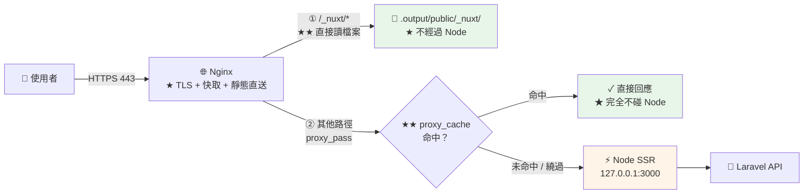

# Nuxt Nginx 反向代理與快取

> [!abstract] 這篇你會學到
> - **★★ 靜態資源由 Nginx 直送**（不要讓 Node 送）
> - `upstream` 與 **keepalive** 的正確設定
> - **★★★ `proxy_cache` 微快取**（大幅降低 SSR 負載）
> - **★★★ 快取繞過規則**（登入使用者絕不能拿到別人的快取）
> - **`proxy_cache_lock`** 與雷霆群集（thundering herd）
> - **stale-while-revalidate** 與後端故障時的降級
> - 完整的正式環境設定與壓測驗證

## 前置知識

- [[130-01-03-02-guide-Nuxt-SSR與PM2部署]] — Node 服務已在 127.0.0.1:3000 執行
- [[060-02-02-04-guide-Nginx-反向代理與負載平衡]] — proxy_pass 基礎
- [[060-02-02-08-guide-Nginx-效能調校]] — 快取與壓縮

---

## 架構全貌 ★★



> [!danger] 不做這兩件事，SSR 的效能會慘不忍睹 ★★★
> ```
> ① ★★★ 靜態資源【由 Nginx 直送】
>    → 每個頁面有 10~30 個 .js/.css/圖片
>    → 若全部走 Node → ★★ Node 花 90% 的時間在送靜態檔案
>      → SSR 的能力被浪費，回應時間暴增
>
> ② ★★★ HTML 用 proxy_cache 微快取
>    → SSR 每次請求都要重新渲染整棵元件樹（★ 幾十到幾百毫秒）
>    → 即使只快取【1 秒】，高流量下也能擋掉 90%+ 的請求
>      → ★ 「微快取」（microcaching）
>
> ★★ 兩者一起做，SSR 的可承載流量可以提升【10 倍以上】
> ```

---

## 靜態資源直送 ★★★

```nginx
server {
    listen 443 ssl;
    http2 on;
    server_name app.example.gov.tw;

    ssl_certificate     /etc/ssl/certs/app-fullchain.crt;
    ssl_certificate_key /etc/ssl/private/app.key;
    ssl_protocols       TLSv1.2 TLSv1.3;

    # ★★ root 指到 Nuxt 的 public 產物
    root /var/www/nuxt-app/current/.output/public;

    # ═══════ ★★★ ① Nuxt 的建置產物（帶 hash，永久快取）═══════
    location ^~ /_nuxt/ {
        # ★★ 直接讀檔案，完全不碰 Node
        try_files $uri =404;

        expires 1y;
        add_header Cache-Control "public, max-age=31536000, immutable";
        add_header X-Content-Type-Options "nosniff" always;
        access_log off;

        gzip_static on;                # ★ 送預壓縮的 .gz
        # brotli_static on;
    }

    # ═══════ ★ ② 其他靜態檔（favicon、robots、圖片…）═══════
    location ~* ^/[^/]*\.(ico|png|jpe?g|gif|svg|webp|avif|txt|xml|webmanifest|woff2?)$ {
        try_files $uri @nuxt;          # ★★ 檔案不存在就交給 Node（可能是動態產生的）
        expires 7d;
        add_header Cache-Control "public, max-age=604800";
        add_header X-Content-Type-Options "nosniff" always;
        access_log off;
    }

    # ═══════ ★ ③ 預先渲染的靜態 HTML（prerender 的頁面）═══════
    # ★★ Nuxt 的 prerender 產物也在 .output/public/
    #    但要小心：不能讓它蓋過需要 SSR 的路徑

    # ═══════ ④ 其他所有請求 → Node SSR ═══════
    location / {
        try_files $uri @nuxt;          # ★ 先找靜態檔，沒有才給 Node
    }

    location @nuxt {
        proxy_pass http://nuxt_backend;
        # ...（見下方完整設定）
    }
}
```

> [!warning] `try_files $uri @nuxt` 的順序考量 ★★
> ```
> ★ 這個寫法讓 Nginx 先檢查檔案系統，找不到才轉給 Node
>
> 好處：
>   · prerender 產生的靜態 HTML 直接送（★ 極快）
>   · 靜態資源不經過 Node
>
> ★★ 但要注意：
>   若 prerender 產生了 /about/index.html，
>   而你後來把 /about 改成 SSR（routeRules 改了但沒重新建置）
>     → ★ 舊的靜態檔還在 → 一直送舊內容
>   → ★★ 部署時要確保 .output/public 是【全新的】（releases 佈局天然解決）
> ```

```bash
# ★★ 驗證靜態資源沒有經過 Node
$ sudo tail -f /var/log/nginx/app.access.log &
$ curl -s https://app.example.gov.tw/ > /dev/null
# ★ 觀察 Node 的日誌（pm2 logs）—— 應該只有 1 筆 HTML 請求，沒有 /_nuxt/ 的

$ pm2 logs nuxt-app --lines 20 --nostream | grep '_nuxt'
# ★ 應該沒有輸出
```

---

## upstream 與 keepalive ★★

```nginx
# ★★ 放在 http 區塊（不是 server 裡）
upstream nuxt_backend {
    # ★ PM2 cluster 時，多個實例共用同一個埠（★ Node cluster 內部負載平衡）
    server 127.0.0.1:3000 max_fails=3 fail_timeout=15s;

    # ★★ 若用 systemd 多實例（不同埠）
    # server 127.0.0.1:3001 max_fails=3 fail_timeout=15s;
    # server 127.0.0.1:3002 max_fails=3 fail_timeout=15s;

    # ★★★ keepalive 連線池（★ 大幅降低 TCP 握手成本）
    keepalive 64;
    keepalive_requests 1000;
    keepalive_timeout 60s;
}

map $http_upgrade $connection_upgrade {
    default upgrade;
    ''      close;
}
```

> [!danger] `keepalive` 必須搭配三個設定 ★★★
> ```
> upstream nuxt_backend { keepalive 64; }
>
> ★★★ 只寫 keepalive 是【沒用的】，還必須在 location 裡加：
>   proxy_http_version 1.1;              ← ★★ HTTP/1.0 不支援 keepalive
>   proxy_set_header Connection "";      ← ★★★ 清掉 Connection: close
>
> ★ 沒有這兩行的話：
>   → 每個請求都建立新的 TCP 連線
>     → ★★ 高流量時大量 TIME_WAIT，埠可能耗盡
>
> ★ 驗證：
>   ss -tan | grep ':3000' | awk '{print $1}' | sort | uniq -c
>   → ★ ESTAB 應該遠多於 TIME_WAIT
> ```

```nginx
location @nuxt {
    proxy_pass http://nuxt_backend;

    # ═══ ★★★ keepalive 必須的兩行 ═══
    proxy_http_version 1.1;
    proxy_set_header Connection "";        # ★★★ 不是 $connection_upgrade！

    # ═══ 必備標頭 ═══
    proxy_set_header Host              $host;
    proxy_set_header X-Real-IP         $remote_addr;
    proxy_set_header X-Forwarded-For   $proxy_add_x_forwarded_for;
    proxy_set_header X-Forwarded-Proto $scheme;      # ★★★
    proxy_set_header X-Forwarded-Host  $host;
    proxy_set_header X-Forwarded-Port  $server_port;

    # ═══ 逾時 ═══
    proxy_connect_timeout 5s;
    proxy_send_timeout    60s;
    proxy_read_timeout    60s;

    # ═══ 緩衝 ═══
    proxy_buffering on;
    proxy_buffer_size       16k;           # ★ 標頭用（Nuxt 的 Set-Cookie 可能較大）
    proxy_buffers        8  16k;
    proxy_busy_buffers_size 32k;

    # ═══ ★ 後端故障時的處理 ═══
    proxy_next_upstream error timeout http_502 http_503 http_504;
    proxy_next_upstream_tries 2;
    proxy_next_upstream_timeout 10s;
}
```

> [!warning] WebSocket 的 `Connection` 標頭衝突 ★★
> ```nginx
> # ★★ keepalive 要 Connection: ""
> # ★★ WebSocket 要 Connection: upgrade
> # → 【互相衝突】
>
> ★ 解法：分開兩個 location
> location @nuxt {                         # 一般請求
>     proxy_set_header Connection "";      # ★ keepalive
> }
> location /ws {                           # WebSocket
>     proxy_pass http://nuxt_backend;
>     proxy_http_version 1.1;
>     proxy_set_header Upgrade    $http_upgrade;
>     proxy_set_header Connection $connection_upgrade;   # ★
>     proxy_read_timeout 3600s;            # ★ 長連線
> }
> ```

---

## ★★★ proxy_cache 微快取

```nginx
# ═══ 放在 http 區塊 ═══
proxy_cache_path /var/cache/nginx/nuxt
    levels=1:2
    keys_zone=nuxt_cache:100m        # ★ 100MB 的 key 空間 ≈ 80 萬個 key
    max_size=2g                      # ★ 磁碟上限
    inactive=10m                     # ★ 10 分鐘沒被存取就清掉
    use_temp_path=off;               # ★★ 直接寫到快取目錄（少一次複製）
```

```bash
$ sudo mkdir -p /var/cache/nginx/nuxt
$ sudo chown www-data:www-data /var/cache/nginx/nuxt
$ sudo chmod 700 /var/cache/nginx/nuxt
```

```nginx
# ═══════ ★★★ 快取繞過的判斷（最關鍵的部分）═══════
map $http_cookie $skip_cache_cookie {
    default 0;
    # ★★★ 有這些 cookie 就【絕不快取】
    "~*(^|;\s*)(nuxt-session|auth_token|laravel_session|XSRF-TOKEN)="  1;
}

map $request_method $skip_cache_method {
    default 1;                       # ★★ 預設不快取
    GET  0;                          # ★ 只有 GET 與 HEAD 才快取
    HEAD 0;
}

map $request_uri $skip_cache_uri {
    default 0;
    "~^/api/"        1;              # ★★ API 不快取
    "~^/admin"       1;              # ★★ 後台不快取
    "~^/account"     1;              # ★★★ 個人頁面不快取
    "~^/_nuxt/image" 0;              # ★ 圖片最佳化可以快取
    "~^/auth"        1;
    "~logout"        1;
}

map "$skip_cache_cookie$skip_cache_method$skip_cache_uri" $skip_cache {
    default 1;                       # ★★ 任何一個是 1 就跳過
    "000"   0;                       # ★ 三個都是 0 才快取
}
```

```nginx
location @nuxt {
    proxy_pass http://nuxt_backend;
    proxy_http_version 1.1;
    proxy_set_header Connection "";
    proxy_set_header Host              $host;
    proxy_set_header X-Real-IP         $remote_addr;
    proxy_set_header X-Forwarded-For   $proxy_add_x_forwarded_for;
    proxy_set_header X-Forwarded-Proto $scheme;

    # ═══════ ★★★ 快取 ═══════
    proxy_cache nuxt_cache;

    # ★★ 快取 key（★ 包含 scheme 與 host，避免不同網域共用）
    proxy_cache_key "$scheme$request_method$host$request_uri";

    # ★★ 微快取：只快取 1~10 秒
    proxy_cache_valid 200 301 302   5s;
    proxy_cache_valid 404          10s;    # ★ 404 也快取（防掃描打爆後端）
    proxy_cache_valid any           1s;

    # ★★★ 繞過規則
    proxy_cache_bypass $skip_cache;        # ★ 不讀快取（但仍會寫）
    proxy_no_cache     $skip_cache;        # ★★ 不寫快取

    # ★★★ 雷霆群集防護：同一個 key 同時只讓【一個】請求打後端
    proxy_cache_lock          on;
    proxy_cache_lock_timeout  5s;
    proxy_cache_lock_age      5s;

    # ★★★ 後端故障時送過期的快取（降級而不是掛掉）
    proxy_cache_use_stale error timeout updating
                          http_500 http_502 http_503 http_504;
    proxy_cache_background_update on;      # ★★ 背景更新（使用者拿到舊的但不用等）
    proxy_cache_revalidate on;             # ★ 用 If-Modified-Since 驗證

    # ★★ 忽略後端的快取指示（★ 小心使用）
    # proxy_ignore_headers Cache-Control Expires Set-Cookie;

    # ★★ 除錯用的標頭
    add_header X-Cache-Status $upstream_cache_status always;
    add_header X-Cache-Skip   $skip_cache always;
}
```

> [!danger] 快取污染是最嚴重的風險 ★★★
> ```
> ★★★ 若登入使用者的頁面被快取：
>   A 使用者請求 /dashboard → 產生含 A 資料的 HTML → 快取
>     → B 使用者請求 /dashboard → ★★★ 拿到 A 的資料
>       → 個資外洩事故
>
> ★★ 三道防線（★ 必須全部都有）：
>   ① Nginx 層：$skip_cache（cookie / URI / method）
>   ② ★★ 應用層：Nuxt routeRules 對個人化頁面設
>        headers: { 'Cache-Control': 'no-store, private' }
>   ③ ★★ Nginx 尊重後端的 Cache-Control
>        → 【不要】設 proxy_ignore_headers Cache-Control
>
> ★★★ 上線前一定要做【兩個帳號的快取污染測試】
> ```

```bash
#!/usr/bin/env bash
# ★★★ 快取污染測試（★ 上線前必做）
S=https://app.example.gov.tw

echo "═══ 快取污染測試 ═══"

# ★ 準備兩個帳號的 cookie
# curl -c a.txt -d 'email=a@x.tw&password=...' $S/login
# curl -c b.txt -d 'email=b@x.tw&password=...' $S/login

for p in / /dashboard /account/profile /admin; do
    echo -e "\n── $p ──"

    # ★ 未登入
    ANON=$(curl -s "$S$p" | md5sum | cut -c1-16)
    ST1=$(curl -sI "$S$p" | grep -i x-cache-status | tr -d '\r')

    # ★ 帳號 A
    A=$(curl -s -b a.txt "$S$p" | md5sum | cut -c1-16)
    ST2=$(curl -sI -b a.txt "$S$p" | grep -i x-cache-status | tr -d '\r')

    # ★ 帳號 B
    B=$(curl -s -b b.txt "$S$p" | md5sum | cut -c1-16)
    ST3=$(curl -sI -b b.txt "$S$p" | grep -i x-cache-status | tr -d '\r')

    printf '  匿名  %s  %s\n' "$ANON" "$ST1"
    printf '  帳號A %s  %s\n' "$A" "$ST2"
    printf '  帳號B %s  %s\n' "$B" "$ST3"

    if [ "$A" = "$B" ] && [ "$p" != "/" ]; then
        echo "  ✗✗✗ 兩個帳號拿到【相同】內容 —— 快取污染！"
    elif [ "$A" = "$ANON" ] && [ "$p" != "/" ]; then
        echo "  ✗✗ 登入者拿到匿名的快取"
    else
        echo "  ✓ 各自不同"
    fi
done
```

### 快取狀態的判讀

```bash
$ curl -sI https://app.example.gov.tw/ | grep -i x-cache
x-cache-status: HIT

# ★★ $upstream_cache_status 的值：
#   MISS       快取沒有 → 打了後端並寫入
#   ★ HIT      命中 → 完全沒碰後端
#   ★ BYPASS   proxy_cache_bypass 生效 → 打了後端
#   EXPIRED    過期 → 重新打後端
#   ★ STALE    後端故障，送了過期的快取（★ 降級成功）
#   ★ UPDATING 正在背景更新，送舊的
#   REVALIDATED 用 If-Modified-Since 驗證後仍有效

# ★★ 觀察命中率
$ for i in $(seq 1 20); do
    curl -sI https://app.example.gov.tw/ | grep -i x-cache-status
    sleep 0.3
  done | sort | uniq -c
     18 x-cache-status: HIT
      2 x-cache-status: MISS
```

```nginx
# ★★ 記錄快取狀態到日誌
log_format cache '$remote_addr - [$time_local] "$request" '
                 '$status $body_bytes_sent '
                 'cache=$upstream_cache_status skip=$skip_cache '
                 'rt=$request_time urt=$upstream_response_time';

access_log /var/log/nginx/app.access.log cache;
```

```bash
# ★ 分析命中率
$ awk '{for(i=1;i<=NF;i++) if($i ~ /^cache=/) print $i}' /var/log/nginx/app.access.log | \
    sort | uniq -c | sort -rn
   8421 cache=HIT
   1203 cache=BYPASS
    412 cache=MISS
     18 cache=STALE

# ★ 命中率
$ awk '{for(i=1;i<=NF;i++) if($i=="cache=HIT") h++; } END {print "命中 " h " 次"}' \
    /var/log/nginx/app.access.log
```

> [!tip] 微快取的效益 ★★
> ```
> ★★ 即使只快取 1 秒，效益也極大
>
> 假設首頁每秒 100 個請求：
>   無快取   → ★ Node 每秒渲染 100 次
>   快取 1s  → ★★ Node 每秒渲染【1 次】（99% 被擋掉）
>   快取 5s  → Node 每 5 秒渲染 1 次
>
> ★ 而使用者最多只會看到 5 秒前的內容 —— 對多數頁面完全可接受
>
> ★★★ 但一定要正確設定繞過規則，否則就是個資外洩
> ```

---

## 快取清除

```nginx
# ★★ Nginx Plus 才有 proxy_cache_purge
# ★ 開源版的替代方案：ngx_cache_purge 模組
location ~ /purge(/.*) {
    allow 127.0.0.1;
    allow 10.0.0.0/8;
    deny all;
    proxy_cache_purge nuxt_cache "$scheme$request_method$host$1";
}
```

```bash
# ★★ 開源版最簡單的做法：直接刪檔案
$ sudo find /var/cache/nginx/nuxt -type f -delete
$ sudo systemctl reload nginx

# ★★ 更精確：用 key 算出檔案路徑
$ purge_url() {
    local url="$1"
    local key="https GET app.example.gov.tw$url"
    # ★ levels=1:2 的路徑規則
    local md5=$(printf '%s' "$key" | md5sum | cut -d' ' -f1)
    local path="/var/cache/nginx/nuxt/${md5: -1}/${md5: -3:2}/$md5"
    if [ -f "$path" ]; then
        sudo rm -f "$path" && echo "✓ 已清除 $url"
    else
        echo "－ 沒有快取：$url"
    fi
  }
$ purge_url /
$ purge_url /blog

# ★ 部署後清除全部（★ 內容變了）
$ sudo find /var/cache/nginx/nuxt -mindepth 1 -delete
```

```bash
# ★★ 加進部署腳本
$ cat >> /usr/local/bin/deploy-nuxt <<'EOF'

# ★★ 部署後清除 HTML 快取（★ 靜態資源有 hash，不用清）
c "【清除快取】"
sudo find /var/cache/nginx/nuxt -mindepth 1 -type f -delete
c "    ✓ 已清除 proxy_cache"
EOF
```

---

## 完整的正式環境設定

```nginx
# ═══════════════════════════════════════════════════════
# /etc/nginx/conf.d/nuxt-app.conf
# ═══════════════════════════════════════════════════════

# ─────────── 快取區 ───────────
proxy_cache_path /var/cache/nginx/nuxt
    levels=1:2 keys_zone=nuxt_cache:100m max_size=2g
    inactive=10m use_temp_path=off;

# ─────────── upstream ───────────
upstream nuxt_backend {
    server 127.0.0.1:3000 max_fails=3 fail_timeout=15s;
    keepalive 64;
    keepalive_requests 1000;
    keepalive_timeout 60s;
}

map $http_upgrade $connection_upgrade { default upgrade; '' close; }

# ─────────── ★★★ 快取繞過 ───────────
map $http_cookie $skip_cookie {
    default 0;
    "~*(^|;\s*)(nuxt-session|auth_token|laravel_session|XSRF-TOKEN)=" 1;
}
map $request_method $skip_method { default 1; GET 0; HEAD 0; }
map $request_uri $skip_uri {
    default 0;
    "~^/api/"    1;
    "~^/admin"   1;
    "~^/account" 1;
    "~^/auth"    1;
    "~logout"    1;
}
map "$skip_cookie$skip_method$skip_uri" $skip_cache { default 1; "000" 0; }

# ─────────── 限流 ───────────
limit_req_zone $binary_remote_addr zone=nuxt_general:10m rate=30r/s;
limit_req_zone $binary_remote_addr zone=nuxt_api:10m     rate=10r/s;

# ─────────── 日誌格式 ───────────
log_format nuxt '$remote_addr - $remote_user [$time_local] "$request" '
                '$status $body_bytes_sent "$http_referer" "$http_user_agent" '
                'cache=$upstream_cache_status skip=$skip_cache '
                'rt=$request_time urt=$upstream_response_time';

# ═══════════════════════════════════════════════════════
server {
    listen 80;
    listen [::]:80;
    server_name app.example.gov.tw;
    location ^~ /.well-known/acme-challenge/ { root /var/www/certbot; }
    location / { return 301 https://$host$request_uri; }
}

server {
    listen 443 ssl;
    listen [::]:443 ssl;
    listen 443 quic reuseport;
    http2 on;
    http3 on;
    server_name app.example.gov.tw;

    # ── TLS ──
    ssl_certificate         /etc/ssl/certs/app-fullchain.crt;
    ssl_certificate_key     /etc/ssl/private/app.key;
    ssl_trusted_certificate /etc/ssl/certs/ca-chain.crt;
    ssl_protocols           TLSv1.2 TLSv1.3;
    ssl_ciphers             ECDHE-ECDSA-AES128-GCM-SHA256:ECDHE-RSA-AES128-GCM-SHA256:ECDHE-ECDSA-AES256-GCM-SHA384:ECDHE-RSA-AES256-GCM-SHA384;
    ssl_prefer_server_ciphers off;
    ssl_session_cache       shared:SSL:20m;
    ssl_session_timeout     1d;
    ssl_session_tickets     off;

    add_header Alt-Svc 'h3=":443"; ma=86400' always;

    # ── 安全標頭 ──
    add_header Strict-Transport-Security "max-age=31536000; includeSubDomains" always;
    add_header X-Content-Type-Options "nosniff" always;
    add_header X-Frame-Options "SAMEORIGIN" always;
    add_header Referrer-Policy "strict-origin-when-cross-origin" always;
    add_header Permissions-Policy "geolocation=(), microphone=(), camera=()" always;

    root /var/www/nuxt-app/current/.output/public;

    access_log /var/log/nginx/nuxt-app.access.log nuxt;
    error_log  /var/log/nginx/nuxt-app.error.log warn;

    client_max_body_size 20m;
    client_body_timeout  30s;

    gzip on;
    gzip_static on;
    gzip_vary on;
    gzip_comp_level 6;
    gzip_min_length 1024;
    gzip_types text/plain text/css application/json application/javascript
               application/xml image/svg+xml font/woff2;

    # ═══════ ★★★ ① Nuxt 建置產物（Nginx 直送）═══════
    location ^~ /_nuxt/ {
        try_files $uri =404;
        expires 1y;
        add_header Cache-Control "public, max-age=31536000, immutable";
        add_header X-Content-Type-Options "nosniff" always;
        access_log off;
        gzip_static on;
    }

    # ═══════ ② 其他靜態檔 ═══════
    location ~* ^/[^/]*\.(ico|png|jpe?g|gif|svg|webp|avif|txt|xml|webmanifest|woff2?)$ {
        try_files $uri @nuxt;
        expires 7d;
        add_header Cache-Control "public, max-age=604800";
        add_header X-Content-Type-Options "nosniff" always;
        access_log off;
    }

    # ═══════ ③ 健康檢查 ═══════
    location = /healthz {
        access_log off;
        proxy_pass http://nuxt_backend;
        proxy_http_version 1.1;
        proxy_set_header Connection "";
        proxy_set_header Host $host;
        proxy_cache off;
    }

    # ═══════ ④ API（不快取，另外限流）═══════
    location ^~ /api/ {
        limit_req zone=nuxt_api burst=20 nodelay;
        proxy_pass http://nuxt_backend;
        proxy_http_version 1.1;
        proxy_set_header Connection "";
        proxy_set_header Host              $host;
        proxy_set_header X-Real-IP         $remote_addr;
        proxy_set_header X-Forwarded-For   $proxy_add_x_forwarded_for;
        proxy_set_header X-Forwarded-Proto $scheme;
        proxy_cache off;                        # ★★★
        add_header Cache-Control "no-store" always;
        proxy_read_timeout 60s;
    }

    # ═══════ ⑤ WebSocket ═══════
    location ^~ /ws {
        proxy_pass http://nuxt_backend;
        proxy_http_version 1.1;
        proxy_set_header Upgrade    $http_upgrade;
        proxy_set_header Connection $connection_upgrade;   # ★ 不是 ""
        proxy_set_header Host       $host;
        proxy_read_timeout 3600s;
        proxy_send_timeout 3600s;
        proxy_cache off;
    }

    # ═══════ ⑥ 一般請求 ═══════
    location / {
        limit_req zone=nuxt_general burst=50 nodelay;
        try_files $uri @nuxt;
    }

    # ═══════ ★★★ ⑦ Node SSR ═══════
    location @nuxt {
        proxy_pass http://nuxt_backend;

        # ★★★ keepalive
        proxy_http_version 1.1;
        proxy_set_header Connection "";

        proxy_set_header Host              $host;
        proxy_set_header X-Real-IP         $remote_addr;
        proxy_set_header X-Forwarded-For   $proxy_add_x_forwarded_for;
        proxy_set_header X-Forwarded-Proto $scheme;
        proxy_set_header X-Forwarded-Host  $host;
        proxy_set_header X-Forwarded-Port  $server_port;

        proxy_connect_timeout 5s;
        proxy_send_timeout    60s;
        proxy_read_timeout    60s;

        proxy_buffering on;
        proxy_buffer_size       16k;
        proxy_buffers        8  16k;
        proxy_busy_buffers_size 32k;

        # ★★★ 微快取
        proxy_cache nuxt_cache;
        proxy_cache_key "$scheme$request_method$host$request_uri";
        proxy_cache_valid 200 301 302  5s;
        proxy_cache_valid 404         10s;
        proxy_cache_bypass $skip_cache;
        proxy_no_cache     $skip_cache;
        proxy_cache_lock on;
        proxy_cache_lock_timeout 5s;
        proxy_cache_use_stale error timeout updating
                              http_500 http_502 http_503 http_504;
        proxy_cache_background_update on;
        proxy_cache_revalidate on;

        proxy_next_upstream error timeout http_502 http_503 http_504;
        proxy_next_upstream_tries 2;

        add_header X-Cache-Status $upstream_cache_status always;
        # ★ 重複宣告安全標頭（add_header 陣列覆蓋）
        add_header Strict-Transport-Security "max-age=31536000; includeSubDomains" always;
        add_header X-Content-Type-Options "nosniff" always;
        add_header X-Frame-Options "SAMEORIGIN" always;
        add_header Referrer-Policy "strict-origin-when-cross-origin" always;
    }

    # ═══════ 安全 ═══════
    location ~ /\.       { deny all; access_log off; }
    location ~ \.map$    { deny all; access_log off; }
}
```

---

## 壓測驗證 ★★

```bash
#!/usr/bin/env bash
# /usr/local/bin/nuxt-benchmark —— 驗證快取效益
S="${1:-https://app.example.gov.tw}"

command -v wrk >/dev/null || { echo "請先安裝 wrk：sudo apt install -y wrk"; exit 1; }

echo "═══ Nuxt SSR 壓測 ═══"

# ══ 【1】暖機 ══
echo -e "\n【1】暖機"
for i in $(seq 1 5); do curl -so /dev/null "$S/"; done

# ══ 【2】★★ 有快取 ══
echo -e "\n【2】★★ 有快取（首頁）"
wrk -t4 -c50 -d20s --latency "$S/" 2>&1 | grep -E 'Requests/sec|Latency|50%|99%' | sed 's/^/  /'
echo "  快取狀態分布："
for i in $(seq 1 20); do curl -sI "$S/" | grep -i x-cache-status; done | \
  sort | uniq -c | sed 's/^/    /'

# ══ 【3】★ 繞過快取（模擬登入使用者）══
echo -e "\n【3】★ 繞過快取（帶 session cookie）"
wrk -t4 -c20 -d20s --latency -H "Cookie: nuxt-session=fake" "$S/" 2>&1 | \
  grep -E 'Requests/sec|Latency|50%|99%' | sed 's/^/  /'

# ══ 【4】靜態資源 ══
echo -e "\n【4】靜態資源（★ Nginx 直送）"
ASSET=$(curl -s "$S/" | grep -oE '/_nuxt/[^"]+\.js' | head -1)
if [ -n "$ASSET" ]; then
    wrk -t4 -c100 -d10s "$S$ASSET" 2>&1 | grep -E 'Requests/sec|Latency' | sed 's/^/  /'
fi

# ══ 【5】★★ Node 負載 ══
echo -e "\n【5】★★ 壓測期間的 Node 負載"
echo "  （另開一個 terminal 執行 pm2 monit 觀察）"
pm2 jlist 2>/dev/null | jq -r '.[] | select(.name=="nuxt-app") |
  "  CPU \(.monit.cpu)%  RSS \((.monit.memory/1048576)|floor)MB  重啟 \(.pm2_env.restart_time)"'

# ══ 【6】結論 ══
cat <<'EOF'

  ★★ 判讀：
    · 【2】的 Requests/sec 應該遠高於【3】（★ 快取生效）
      → 若差不多 → 檢查 proxy_cache 設定
    · 【4】應該是最高的（★ Nginx 直送）
    · ★ 壓測期間 Node 的 CPU 若接近 100% → 快取沒生效
    · ★★ 若【2】的 x-cache-status 大多是 MISS → 繞過規則太寬
EOF
```

```bash
$ nuxt-benchmark
═══ Nuxt SSR 壓測 ═══

【2】★★ 有快取（首頁）
  Latency   3.21ms   2.14ms  48.32ms   89.12%
  Requests/sec:  14238.42
     50%    2.81ms
     99%   12.44ms
  快取狀態分布：
       20 x-cache-status: HIT

【3】★ 繞過快取（帶 session cookie）
  Latency  128.44ms  42.11ms 512.33ms   72.18%
  Requests/sec:    152.33            # ★★ 差了近 100 倍
     99%  388.21ms

【4】靜態資源（★ Nginx 直送）
  Requests/sec:  42133.18
```

---

## 常見錯誤與排錯

| 現象 | 原因 | 解法 |
| --- | --- | --- |
| **快取污染（看到別人的資料）** ★★★ | 繞過規則不完整 | 三道防線；**兩帳號測試** |
| **快取都是 MISS** ★★ | 後端送了 `Set-Cookie` | Nuxt 對可快取頁面別設 cookie |
| **快取完全沒生效** ★★ | `$skip_cache` 永遠是 1 | `add_header X-Cache-Skip $skip_cache` 除錯 |
| **`keepalive` 沒作用** ★★★ | 缺 `proxy_http_version 1.1` 或 `Connection ""` | 兩行都要加 |
| **大量 TIME_WAIT** ★★ | 同上 | 同上；`ss -tan \| grep 3000` |
| **靜態資源走 Node** ★★★ | 沒有 `location ^~ /_nuxt/` | 加上並用 `try_files $uri =404` |
| **WebSocket 連不上** ★★ | `Connection ""` 蓋掉了 upgrade | WebSocket 用**獨立的 location** |
| **後端掛了整站 502** ★★ | 沒設 `proxy_cache_use_stale` | 加上 stale 降級 |
| 部署後還是舊內容 ★★ | proxy_cache 沒清 | 部署腳本加清快取 |
| **安全標頭在 `@nuxt` 消失** ★★★ | `add_header` 陣列覆蓋 | 在 `@nuxt` 裡**重複宣告** |
| 首次請求很慢（雷霆群集） | 沒有 `proxy_cache_lock` | 加上 `proxy_cache_lock on;` |
| 快取目錄權限錯 | 沒 chown | `chown www-data /var/cache/nginx/nuxt` |
| Nuxt 收到的 IP 都是 127.0.0.1 | 沒設 `X-Real-IP` | 加上；Nitro 要信任 proxy |

### 排查

```bash
S=https://app.example.gov.tw

# 【1】★★★ 快取狀態
$ curl -sI "$S/" | grep -iE 'x-cache-status|x-cache-skip|cache-control'
x-cache-status: HIT
x-cache-skip: 0

# 【2】★★ 為什麼被跳過（逐一檢查三個 map）
$ curl -sI "$S/" -H 'Cookie: nuxt-session=x' | grep -i x-cache-skip   # → 1（cookie）
$ curl -sI -X POST "$S/" | grep -i x-cache-skip                        # → 1（method）
$ curl -sI "$S/api/x" | grep -i x-cache-skip                           # → 1（uri）

# 【3】★★ 靜態資源有沒有走 Node
$ pm2 logs nuxt-app --lines 50 --nostream | grep -c '_nuxt'
0                                    # ★ 應該是 0

# 【4】★★★ keepalive 是否生效
$ ss -tan | grep ':3000' | awk '{print $1}' | sort | uniq -c
    62 ESTAB                          # ★ 大量 ESTAB = keepalive 有效
     3 TIME-WAIT                      # ★ 少量 TIME_WAIT

# ★ 若相反（大量 TIME_WAIT）→ keepalive 沒生效

# 【5】快取檔案
$ sudo du -sh /var/cache/nginx/nuxt
$ sudo find /var/cache/nginx/nuxt -type f | wc -l

# 【6】命中率統計
$ awk '{for(i=1;i<=NF;i++) if($i ~ /^cache=/) c[$i]++} END {for(k in c) print c[k], k}' \
    /var/log/nginx/nuxt-app.access.log | sort -rn

# 【7】★★ 後端故障時的降級
$ pm2 stop nuxt-app
$ curl -sI "$S/" | grep -iE 'HTTP|x-cache-status'
HTTP/2 200
x-cache-status: STALE                # ★★ 送了過期的快取（降級成功）
$ pm2 start nuxt-app

# 【8】upstream 健康
$ curl -sI http://127.0.0.1:3000/    # ★ 直接測 Node
```

---

## 安全性注意事項

> [!danger] 快取的三個安全問題 ★★★
> ```
> ① ★★★ 快取污染（個資外洩）
>      → 三道防線：Nginx $skip_cache + Nuxt routeRules + 尊重 Cache-Control
>      → ★★ 上線前做兩帳號測試
>
> ② ★★ Set-Cookie 被快取
>      → 若快取了帶 Set-Cookie 的回應
>        → ★★★ 所有拿到快取的人【共用同一個 session cookie】
>      → Nginx 預設【不會】快取有 Set-Cookie 的回應（★ 這是保護）
>      → ★★★ 【絕對不要】設 proxy_ignore_headers Set-Cookie
>
> ③ ★ 快取 key 不完整導致混淆
>      → proxy_cache_key 沒有 $host → 多網域共用快取
>      → 沒有 $scheme → HTTP 與 HTTPS 混用
>      → ★ 若有依 Accept-Language 變化的內容 → key 要加 $http_accept_language
> ```

```bash
# ★★★ 檢查有沒有誤設危險的 ignore
$ sudo nginx -T 2>/dev/null | grep -i 'proxy_ignore_headers'
# ★ 若有 Set-Cookie → 立刻移除
```

> [!warning] 限流的設定 ★★
> ```nginx
> limit_req_zone $binary_remote_addr zone=nuxt_general:10m rate=30r/s;
>
> location / {
>     limit_req zone=nuxt_general burst=50 nodelay;
> }
> ```
>
> ```
> ★★ burst 與 nodelay 的意義：
>   rate=30r/s          平均每秒 30 個
>   burst=50            ★ 允許瞬間 50 個排隊
>   nodelay             ★★ burst 內的請求【立刻處理】而不是排隊延遲
>
> ★ 沒有 nodelay → 第 31 個請求會被【延遲】到下一秒才處理
>   → 使用者體驗差（頁面一格一格載入）
>
> ★★ 注意：$binary_remote_addr 在 Nginx 後面還有 CDN/LB 時
>    會是 LB 的 IP → 所有人共用配額
>    → ★ 要用 real_ip 模組取得真實 IP：
>      set_real_ip_from 10.0.0.0/8;
>      real_ip_header X-Forwarded-For;
>      real_ip_recursive on;
> ```

---

## 速查表

### ★★★ 兩件必做的事

```
① 靜態資源由 Nginx 直送
   location ^~ /_nuxt/ { try_files $uri =404; expires 1y; }

② HTML 用 proxy_cache 微快取（1~5 秒）
   → 高流量下可擋掉 90%+ 的 SSR 渲染
```

### ★★★ keepalive 三件套

```nginx
upstream nuxt_backend {
    server 127.0.0.1:3000;
    keepalive 64;                    # ①
}
location @nuxt {
    proxy_http_version 1.1;          # ★★ ②（HTTP/1.0 不支援）
    proxy_set_header Connection "";  # ★★★ ③（清掉 close）
}
```
```bash
ss -tan | grep ':3000' | awk '{print $1}' | sort | uniq -c   # ★ ESTAB 應遠多於 TIME-WAIT
```

### ★★★ 快取繞過（三個 map）

```nginx
map $http_cookie   $skip_cookie { default 0; "~*(nuxt-session|auth_token)=" 1; }
map $request_method $skip_method { default 1; GET 0; HEAD 0; }
map $request_uri   $skip_uri    { default 0; "~^/(api|admin|account|auth)" 1; }
map "$skip_cookie$skip_method$skip_uri" $skip_cache { default 1; "000" 0; }

proxy_cache_bypass $skip_cache;      # 不讀快取
proxy_no_cache     $skip_cache;      # ★★ 不寫快取
```

### 微快取設定

```nginx
proxy_cache nuxt_cache;
proxy_cache_key "$scheme$request_method$host$request_uri";
proxy_cache_valid 200 301 302 5s;
proxy_cache_valid 404        10s;
proxy_cache_lock on;                              # ★★ 防雷霆群集
proxy_cache_lock_timeout 5s;
proxy_cache_use_stale error timeout updating http_500 http_502 http_503 http_504;
proxy_cache_background_update on;                 # ★★ 背景更新
add_header X-Cache-Status $upstream_cache_status always;
```

### `$upstream_cache_status`

```
HIT         ★ 命中，完全沒碰後端
MISS        沒有 → 打後端並寫入
BYPASS      ★ 繞過規則生效
EXPIRED     過期 → 重新打後端
★ STALE     後端故障，送過期的（降級成功）
UPDATING    背景更新中，送舊的
```

### ★★★ 三個安全紅線

```
① 快取污染      → 三道防線 + 兩帳號測試
② ★★★ 絕不設 proxy_ignore_headers Set-Cookie
③ cache_key 要含 $scheme 與 $host
```

### 清快取

```bash
sudo find /var/cache/nginx/nuxt -mindepth 1 -type f -delete   # ★ 部署後
```

### 驗證

```bash
curl -sI https://app/ | grep -iE 'x-cache-status|x-cache-skip'
pm2 logs nuxt-app --nostream | grep -c '_nuxt'        # ★ 應該 0
ss -tan | grep ':3000' | awk '{print $1}' | sort | uniq -c
wrk -t4 -c50 -d20s https://app/                       # ★ 有快取
wrk -t4 -c20 -d20s -H 'Cookie: nuxt-session=x' https://app/   # ★ 繞過
```

---

## 練習題

> [!question]- 練習 1：靜態資源直送的效益 ★★
> 1. **不設 `location ^~ /_nuxt/`**（讓所有請求都走 Node）
> 2. 開一個頁面，`pm2 logs` 看 Node 收到幾個請求
> 3. `wrk -t4 -c50 -d10s` 壓測 → **Requests/sec？**
> 4. 加上 `location ^~ /_nuxt/`
> 5. 再測一次 → **差多少？**
> 6. `pm2 monit` 比較兩者的 CPU

> [!question]- 練習 2：`keepalive` 的效果 ★★★
> 1. 設 `keepalive 64` **但不加** `proxy_http_version 1.1`
> 2. 壓測期間執行 `ss -tan | grep ':3000' | awk '{print $1}' | sort | uniq -c`
> 3. **TIME_WAIT 有多少？**
> 4. 加上 `proxy_http_version 1.1;` 與 `proxy_set_header Connection "";`
> 5. 再測 → **ESTAB 與 TIME_WAIT 的比例變了嗎？**
> 6. 比較兩者的 Requests/sec

> [!question]- 練習 3：快取污染測試 ★★★
> **★ 在測試環境**
> 1. **故意把 `$skip_cache` 永遠設 0**（全部都快取）
> 2. 用帳號 A 登入並存取 `/dashboard`
> 3. **用帳號 B（無痕視窗）存取同一個網址** → **看到誰的資料？**
> 4. 加上完整的三個 map
> 5. 再測 → 各自看到自己的了嗎？
> 6. **寫一個自動化的污染測試腳本並加進部署流程**

> [!question]- 練習 4：後端故障的降級
> 1. 設好 `proxy_cache_use_stale`
> 2. 讓首頁被快取（`curl` 幾次確認 HIT）
> 3. **`pm2 stop nuxt-app`**
> 4. `curl -sI https://app/` → **HTTP 幾？`x-cache-status` 是什麼？**
> 5. 拿掉 `proxy_cache_use_stale` → 再測一次
> 6. **比較使用者體驗的差異**

> [!question]- 練習 5：微快取的效益量化
> 1. 完全不設快取，`wrk -t4 -c50 -d30s` → 記錄 Requests/sec 與 Node CPU
> 2. 設 `proxy_cache_valid 200 1s` → 再測
> 3. 設 `5s` → 再測
> 4. 設 `60s` → 再測
> 5. **畫出「快取時間 vs 吞吐量」的曲線**
> 6. **考慮內容新鮮度，你會選哪一個？**

---

## 小測驗

Q1. **SSR 前面的 Nginx 必做的兩件事是什麼**？

Q2. **`keepalive` 要生效必須配合哪兩個設定**？

Q3. **什麼是「微快取」？為什麼快取 1 秒就很有效**？

Q4. **快取污染是什麼？三道防線是什麼**？

Q5. **`proxy_cache_bypass` 與 `proxy_no_cache` 的差別**？

Q6. **`proxy_cache_lock` 解決什麼問題**？

Q7. **`proxy_cache_use_stale` 有什麼用**？

Q8. **為什麼絕對不能設 `proxy_ignore_headers Set-Cookie`**？

Q9. **WebSocket 與 keepalive 的 `Connection` 標頭為什麼衝突？怎麼解**？

Q10. **`$upstream_cache_status` 顯示 `STALE` 代表什麼**？

> [!question]- 測驗答案
> **Q1.** ①**靜態資源由 Nginx 直送** ——
> `location ^~ /_nuxt/ { try_files $uri =404; expires 1y; }`。
> 每個頁面有 10～30 個 JS/CSS/圖片，
> 若全部走 Node，**Node 會花 90% 的時間在送靜態檔案**，
> SSR 的能力完全被浪費。
> ②**HTML 用 `proxy_cache` 微快取** ——
> SSR 每次請求都要重新渲染整棵元件樹（幾十到幾百毫秒），
> **即使只快取 1～5 秒，高流量下也能擋掉 90% 以上的請求**。
> **兩者一起做，SSR 的可承載流量可以提升 10 倍以上**。
>
> **Q2.** **只在 `upstream` 裡寫 `keepalive 64;` 是完全沒用的**，
> 還必須在 `location` 裡加：
> ①**`proxy_http_version 1.1;`** —— HTTP/1.0 **不支援持久連線**；
> ②**`proxy_set_header Connection "";`** ——
> Nginx 預設會送 `Connection: close` 給後端，
> 必須把它清空才能重用連線。
> **沒有這兩行的後果**：每個請求都建立新的 TCP 連線，
> 高流量時產生**大量 TIME_WAIT**，可能耗盡本機埠。
> **驗證**：`ss -tan | grep ':3000' | awk '{print $1}' | sort | uniq -c`
> —— **ESTAB 應該遠多於 TIME-WAIT**。
>
> **Q3.** **微快取（microcaching）= 把動態產生的內容快取「極短的時間」**（1～10 秒）。
> **為什麼 1 秒就很有效**：
> 假設首頁每秒有 100 個請求 ——
> **無快取時 Node 每秒要渲染 100 次**；
> **快取 1 秒時，Node 每秒只渲染 1 次，其餘 99 個請求直接由 Nginx 回應**。
> 也就是說**擋掉了 99% 的後端負載**，
> 而**使用者最多只會看到 1 秒前的內容** —— 對絕大多數頁面完全可接受。
> **關鍵在於效益不是線性的**：從「不快取」到「快取 1 秒」的提升最大，
> 從 1 秒延長到 60 秒的額外收益反而很小（但新鮮度損失變大）。
>
> **Q4.** **快取污染 = 某個使用者的個人化內容被快取，後續其他使用者拿到了它**。
> 情境：A 登入後存取 `/dashboard` → 產生含 A 資料的 HTML → 被快取；
> B 存取同一個網址 → **拿到 A 的個人資料** → **個資外洩事故**。
> **三道防線（必須全部都有）**：
> ①**Nginx 層的 `$skip_cache`** ——
> 依 cookie（有 session cookie 就跳過）、URI（`/account`、`/admin`）、
> method（只快取 GET/HEAD）判斷；
> ②**應用層的 Nuxt `routeRules`** ——
> 個人化路由設 `headers: { 'Cache-Control': 'no-store, private' }`；
> ③**Nginx 尊重後端的 `Cache-Control`** ——
> **不要設 `proxy_ignore_headers Cache-Control`**。
> **上線前一定要做兩帳號的快取污染測試**。
>
> **Q5.**
> **`proxy_cache_bypass`** —— 條件成立時**不去「讀」快取**（直接打後端），
> **但回應仍然會被「寫入」快取**。
> **`proxy_no_cache`** —— 條件成立時**不把回應「寫入」快取**。
> **兩個都要設**才能真正排除某個請求：
> ```nginx
> proxy_cache_bypass $skip_cache;    # 不讀
> proxy_no_cache     $skip_cache;    # ★★ 不寫
> ```
> **只設 `bypass` 的後果**：登入使用者的請求會打後端（正確），
> **但產生的個人化 HTML 仍然會被寫進快取** →
> 下一個匿名使用者就拿到它 → **快取污染**。
>
> **Q6.** **解決「雷霆群集」（thundering herd）問題**。
> 當一個熱門頁面的快取剛好過期時，
> **同時到達的所有請求都會發現快取沒有 → 全部一起打後端** ——
> 100 個併發請求變成 100 次 SSR 渲染，
> 瞬間把 Node 打爆（而且它們渲染出來的結果是一樣的）。
> **`proxy_cache_lock on;` 讓同一個 cache key 同時只有「一個」請求能打後端**，
> 其他請求**等待那一個完成後直接用它的結果**。
> 配套設定：`proxy_cache_lock_timeout 5s`（等太久就放行）、
> `proxy_cache_lock_age 5s`（前一個請求太慢就再放一個）。
>
> **Q7.** **讓後端故障時仍能用「過期的快取」回應，而不是回傳 502**。
> ```nginx
> proxy_cache_use_stale error timeout updating http_500 http_502 http_503 http_504;
> proxy_cache_background_update on;
> ```
> **兩個效果**：
> ①**降級服務** —— Node 掛掉、重啟中、或回應 5xx 時，
> 使用者**仍然看得到（稍舊的）頁面**，而不是錯誤頁；
> ②**`updating` + `background_update`** ——
> 快取過期時，**先把舊的送給使用者（不用等）**，
> 同時在背景重新取得新的 —— 使用者感受不到延遲。
> `X-Cache-Status` 會顯示 **`STALE`** 或 **`UPDATING`**。
> **這是把「單點故障」變成「輕微降級」的關鍵設定**。
>
> **Q8.** 因為 **`Set-Cookie` 通常帶著 session ID 等使用者專屬的資訊**。
> **Nginx 預設「不會快取帶有 `Set-Cookie` 的回應」—— 這是一道保護機制**。
> 如果設了 `proxy_ignore_headers Set-Cookie`，
> Nginx 就會把那個回應（**連同 `Set-Cookie` 標頭**）快取起來，
> **接下來所有拿到這份快取的人，都會收到同一個 `Set-Cookie`** →
> **所有人共用同一個 session** →
> 他們會全部登入成同一個帳號（通常是第一個觸發快取的那個使用者）。
> **這是災難級的安全漏洞**。
> **檢查**：`sudo nginx -T | grep -i proxy_ignore_headers`
> —— 出現 `Set-Cookie` 就立刻移除。
>
> **Q9.** **衝突點**：
> **keepalive 需要 `proxy_set_header Connection "";`**（清空，讓連線可重用）；
> **WebSocket 需要 `proxy_set_header Connection $connection_upgrade;`**
> （值是 `upgrade`，才能完成協定升級）。
> 兩者**在同一個 location 裡互斥**。
> **解法是分開兩個 location**：
> ```nginx
> location @nuxt {                  # 一般請求
>     proxy_set_header Connection "";
> }
> location ^~ /ws {                 # WebSocket
>     proxy_set_header Upgrade    $http_upgrade;
>     proxy_set_header Connection $connection_upgrade;
>     proxy_read_timeout 3600s;     # ★ 長連線
>     proxy_cache off;
> }
> ```
> WebSocket 的 location 還要記得**關掉快取**並**調大 `proxy_read_timeout`**。
>
> **Q10.** **`STALE` 表示「後端故障，Nginx 送出了已經過期的快取內容」** ——
> 也就是 `proxy_cache_use_stale` 生效了。
> **這是好事**：代表**降級機制正常運作**，
> 使用者看到的是稍舊的頁面，而不是 502 錯誤頁。
> **但同時它也是一個警訊** ——
> 表示後端（Node SSR）目前有問題（掛掉、重啟中、或回應 5xx），
> **應該要有告警**：
> ```bash
> awk '/cache=STALE/' /var/log/nginx/nuxt-app.access.log | wc -l
> ```
> 相關的 `UPDATING` 則是正常運作的一部分（快取過期時先送舊的、背景更新），
> 不需要告警。

---

## 延伸閱讀

- [[130-01-03-04-guide-Nuxt-Docker部署]] — 容器化部署
- [[130-01-05-07-guide-Nuxt-Laravel-SSR完整部署實戰]] — 與 Laravel 整合的完整實戰
- [[130-01-03-02-guide-Nuxt-SSR與PM2部署]] — Node 服務的管理
- [[060-02-02-08-guide-Nginx-效能調校]] — 快取與壓縮的進階設定
- [[060-02-02-04-guide-Nginx-反向代理與負載平衡]] — upstream 的完整用法
- [[060-02-02-05-guide-Nginx-靜態資源與快取]] — 靜態資源的快取策略
