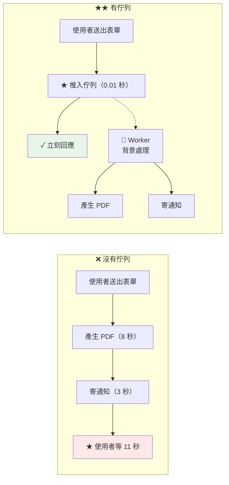

# Laravel 佇列排程與 Supervisor

> [!abstract] 這篇你會學到
> - **★★★ `queue:work` vs `queue:listen`**（為什麼不能用後者）
> - **Supervisor** 的完整設定與多佇列優先權
> - **★★★ 部署時必須重啟 worker**（最常被忘記的一步）
> - **失敗任務**的處理與重試策略
> - **排程**（`schedule:run` 的 cron 設定）
> - **`withoutOverlapping`** 與重複執行的防護
> - **Horizon**（Redis 專用的進階方案）
> - **監控**與告警

## 前置知識

- [[02-Laravel-Nginx與PHP-FPM設定]] — Web 層已就緒
- [[01-Laravel-環境需求與安裝]] — Redis 已設定

---

## 為什麼需要佇列 ★★



```
★★ 適合放進佇列的工作：
  · 寄送通知（★ 外部服務可能很慢或失敗）
  · 產生報表 / PDF / Excel
  · 影像處理、縮圖
  · 呼叫外部 API
  · 大量資料的匯入匯出
  · 資料同步

★★ 不適合的：
  · 使用者需要【立刻看到結果】的操作
  · 極短的工作（★ 佇列的開銷可能比工作本身還大）
```

---

## ★★★ `queue:work` vs `queue:listen`

| | **`queue:work`** ★★ | `queue:listen` |
| --- | --- | --- |
| 啟動框架 | **只有一次**（常駐） | **每個 job 都重啟** |
| 效能 | ★★ 好很多 | ✗ 慢 |
| **程式碼變更** | **✗ 需要重啟** | ✓ 自動生效 |
| 記憶體 | 會累積（★ 要設上限） | 每次都乾淨 |
| **適用** | **★★★ 正式環境** | 只有本機開發 |

> [!danger] 正式環境一律用 `queue:work` ★★★
> ```
> queue:listen 每處理一個 job 就【完整重啟一次 Laravel 框架】
>   → ★★ 開銷極大（每個 job 多花 50~200ms）
>   → 高流量下 CPU 會被啟動框架吃光
>
> ★★★ queue:work 的代價：
>   worker 是【長駐程序】，啟動時載入程式碼後就一直用同一份
>     → ★★★ 【部署後不重啟 = 永遠執行舊程式碼】
>     → 這是最常被忘記的部署步驟
> ```

```bash
# ═══ ★★★ 正式環境的完整參數 ═══
$ php artisan queue:work redis \
    --queue=high,default,low \      # ★★ 優先權（左到右）
    --tries=3 \                     # ★ 最多重試 3 次
    --backoff=10,30,60 \            # ★★ 重試間隔（秒）遞增
    --max-jobs=1000 \               # ★★ 處理 1000 個後自我重啟
    --max-time=3600 \               # ★★ 執行 1 小時後自我重啟
    --memory=256 \                  # ★★ 超過 256MB 就重啟
    --timeout=120 \                 # ★ 單一 job 的逾時
    --sleep=3 \                     # ★ 沒工作時休息幾秒
    --rest=0                        # ★ 每個 job 之間的間隔
```

> [!warning] `--max-jobs` / `--max-time` / `--memory` 的意義 ★★
> ```
> ★★ worker 是長駐程序 → 【必然】會累積記憶體
>   · PHP 本身的記憶體碎片
>   · 靜態變數與單例
>   · 第三方套件的洩漏
>
> ★★ 三個「自我重啟」機制：
>   --max-jobs=1000   處理 1000 個 job 後自己退出（★ Supervisor 會重啟它）
>   --max-time=3600   執行 1 小時後自己退出
>   --memory=256      記憶體超過 256MB 就退出
>
> ★ 「自己退出」是【安全的】—— 會等當前 job 做完才退出
>
> ★★★ 必須搭配 Supervisor 的 autorestart=true，
>    否則 worker 退出後就沒了
> ```

---

## Supervisor ★★★

```bash
$ sudo apt install -y supervisor
$ sudo systemctl enable --now supervisor
```

```ini
# /etc/supervisor/conf.d/laravel-worker.conf
# ═══════════════════════════════════════════════════════

; ═══ ★★ 高優先權佇列（★ 多一點 worker）═══
[program:laravel-worker-high]
process_name=%(program_name)s_%(process_num)02d
command=php /var/www/api/current/artisan queue:work redis
    --queue=high
    --tries=3 --backoff=5,15,30
    --max-jobs=1000 --max-time=3600 --memory=256
    --timeout=60 --sleep=1
directory=/var/www/api/current
autostart=true
autorestart=true                      ; ★★★ 必須
startsecs=5                           ; ★ 活過 5 秒才算啟動成功
startretries=5
user=www-data
numprocs=3                            ; ★★ 3 個 worker
redirect_stderr=true
stdout_logfile=/var/log/supervisor/laravel-worker-high.log
stdout_logfile_maxbytes=50MB
stdout_logfile_backups=5
stopwaitsecs=90                       ; ★★★ 見下方說明
stopsignal=TERM                       ; ★★ Laravel 處理 SIGTERM 做優雅關閉
stopasgroup=true
killasgroup=true
environment=APP_ENV="production"

; ═══ 一般佇列 ═══
[program:laravel-worker-default]
process_name=%(program_name)s_%(process_num)02d
command=php /var/www/api/current/artisan queue:work redis
    --queue=default,low
    --tries=3 --backoff=10,30,60
    --max-jobs=1000 --max-time=3600 --memory=256
    --timeout=300 --sleep=3
directory=/var/www/api/current
autostart=true
autorestart=true
startsecs=5
user=www-data
numprocs=2
redirect_stderr=true
stdout_logfile=/var/log/supervisor/laravel-worker-default.log
stdout_logfile_maxbytes=50MB
stdout_logfile_backups=5
stopwaitsecs=330                      ; ★★ 要 > timeout(300) + 餘裕
stopsignal=TERM
stopasgroup=true
killasgroup=true

; ═══ ★ 長時間工作的專屬佇列（報表、匯出）═══
[program:laravel-worker-long]
process_name=%(program_name)s_%(process_num)02d
command=php /var/www/api/current/artisan queue:work redis
    --queue=long
    --tries=1                         ; ★★ 長工作不重試（避免重複產生）
    --max-jobs=50 --max-time=7200 --memory=512
    --timeout=1800 --sleep=5
directory=/var/www/api/current
autostart=true
autorestart=true
user=www-data
numprocs=1
redirect_stderr=true
stdout_logfile=/var/log/supervisor/laravel-worker-long.log
stopwaitsecs=1830                     ; ★★ > timeout(1800)
stopsignal=TERM

; ═══ 群組（★ 方便一次操作）═══
[group:laravel-workers]
programs=laravel-worker-high,laravel-worker-default,laravel-worker-long
priority=999
```

> [!danger] `stopwaitsecs` 必須大於 `--timeout` ★★★
> ```
> Supervisor 停止流程：
>   ① 送 stopsignal（SIGTERM）
>   ② ★★ 等 stopwaitsecs 秒
>   ③ 還沒退出 → SIGKILL 強制殺掉
>
> ★★★ 若 stopwaitsecs < --timeout：
>   一個正在執行的長 job（例如 200 秒的報表）
>     → Supervisor 等 stopwaitsecs（預設 10 秒）就 SIGKILL
>       → ★★ job 被【中途砍斷】
>         → 資料寫到一半、外部 API 呼叫到一半
>         → ★★★ 而且 job 不會回到佇列（★ 已經被標記為處理中）
>
> ★★ 正確：stopwaitsecs = --timeout + 30
>   --timeout=300  → stopwaitsecs=330
>   --timeout=1800 → stopwaitsecs=1830
> ```

```bash
# ═══ 套用設定 ═══
$ sudo supervisorctl reread
laravel-worker-high: available
laravel-worker-default: available
$ sudo supervisorctl update
$ sudo supervisorctl status
laravel-worker-high:laravel-worker-high_00     RUNNING   pid 12345, uptime 0:05:12
laravel-worker-high:laravel-worker-high_01     RUNNING   pid 12346, uptime 0:05:12
laravel-worker-high:laravel-worker-high_02     RUNNING   pid 12347, uptime 0:05:12
laravel-worker-default:laravel-worker-default_00 RUNNING pid 12348, uptime 0:05:12

# ═══ 常用操作 ═══
$ sudo supervisorctl restart laravel-workers:      # ★★ 整個群組
$ sudo supervisorctl restart laravel-worker-high:  # 單一 program
$ sudo supervisorctl stop laravel-workers:
$ sudo supervisorctl tail -f laravel-worker-high:laravel-worker-high_00
```

### ★★★ 部署時必須重啟 worker

> [!danger] 這是最常被忘記的部署步驟 ★★★
> ```
> ★★ worker 是長駐程序，啟動時載入程式碼後就一直用同一份
>   → ★★★ 部署新版後【不重啟 = 永遠執行舊的 Job 類別】
>
> 症狀（★ 極難察覺）：
>   · 網頁功能已經是新版
>   · ★★ 但背景處理的邏輯還是舊的
>   · 「有些功能好了、有些沒好」
>   · ★ 修好的 bug 在背景工作中還是會發生
>   · 新增的欄位在 job 裡讀不到
>
> ★★ 兩種重啟方式：
>   ① php artisan queue:restart
>      → ★ 在 cache 裡放一個時間戳
>      → worker 處理完【當前的 job】後檢查到就【優雅退出】
>      → Supervisor 自動重啟它
>      → ★★★ 這是【優雅】的方式（不會中斷進行中的 job）
>
>   ② sudo supervisorctl restart laravel-workers:
>      → ★ 直接送 SIGTERM
>      → 也是優雅的（Laravel 會處理），但比較直接
>
> ★★ 建議兩個都做（先 ① 再 ②）
> ```

```bash
# ★★★ 加進部署腳本（★ 一定要有）
$ cd /var/www/api/current
$ php artisan queue:restart            # ★ 優雅：通知 worker 處理完就退出
$ sleep 3
$ sudo supervisorctl restart laravel-workers:    # ★ 確保重啟

# ★ 驗證 worker 用的是新程式碼
$ sudo supervisorctl status laravel-workers:
# ★★ uptime 應該歸零
laravel-worker-high:laravel-worker-high_00  RUNNING  pid 23456, uptime 0:00:05
```

```bash
#!/usr/bin/env bash
# ★★ 部署腳本中的 worker 重啟片段
restart_workers() {
    echo "  ★★★ 重啟 queue worker"

    # ★ ① 優雅通知
    sudo -u deploy php /var/www/api/current/artisan queue:restart
    echo "    ✓ queue:restart 已送出"

    # ★ ② 給 worker 一點時間處理完當前的 job
    sleep 5

    # ★ ③ 確保重啟
    sudo supervisorctl restart laravel-workers: 2>&1 | sed 's/^/    /'

    # ★★ ④ 驗證
    sleep 3
    local n
    n=$(sudo supervisorctl status laravel-workers: | grep -c RUNNING)
    echo "    ✓ $n 個 worker 執行中"

    # ★ 檢查有沒有起不來的
    if sudo supervisorctl status laravel-workers: | grep -qE 'FATAL|BACKOFF|EXITED'; then
        echo "    ✗✗ 有 worker 異常："
        sudo supervisorctl status laravel-workers: | grep -E 'FATAL|BACKOFF|EXITED' | sed 's/^/      /'
        sudo supervisorctl tail laravel-workers: stderr | tail -20 | sed 's/^/      /'
        return 1
    fi
}
```

---

## Job 的撰寫要點 ★★

```php
<?php
namespace App\Jobs;

use Illuminate\Bus\Queueable;
use Illuminate\Contracts\Queue\ShouldQueue;
use Illuminate\Foundation\Bus\Dispatchable;
use Illuminate\Queue\InteractsWithQueue;
use Illuminate\Queue\SerializesModels;
use Illuminate\Support\Facades\Log;
use Throwable;

class GenerateReport implements ShouldQueue
{
    use Dispatchable, InteractsWithQueue, Queueable, SerializesModels;

    // ═══ ★★ 重試設定 ═══
    public int $tries = 3;                    // ★ 最多嘗試 3 次
    public int $timeout = 300;                // ★★ 單次執行的上限（秒）
    public int $maxExceptions = 2;            // ★ 拋出 2 次例外就放棄
    public bool $failOnTimeout = true;        // ★★ 逾時直接標記失敗（不重試）

    // ★★ 遞增的重試間隔
    public function backoff(): array
    {
        return [10, 30, 120];                 // ★ 第1次等10秒、第2次30秒、第3次120秒
    }

    // ★★ 這個 job 最久可以在佇列裡待多久（超過就不執行了）
    public function retryUntil(): \DateTime
    {
        return now()->addHours(6);
    }

    public function __construct(
        // ★★ SerializesModels：只序列化 model 的 ID，執行時重新查詢
        public readonly \App\Models\Report $report,
        public readonly array $options = [],
    ) {
        // ★ 指定佇列
        $this->onQueue('long');
    }

    public function handle(\App\Services\ReportService $service): void
    {
        // ★★ 冪等性檢查（★ 重試時避免重複處理）
        if ($this->report->fresh()?->status === 'completed') {
            Log::info('報表已完成，跳過', ['id' => $this->report->id]);
            return;
        }

        Log::info('開始產生報表', ['id' => $this->report->id, 'attempt' => $this->attempts()]);

        $service->generate($this->report, $this->options);

        Log::info('報表完成', ['id' => $this->report->id]);
    }

    // ★★ 所有重試都失敗後執行
    public function failed(?Throwable $e): void
    {
        Log::error('報表產生失敗', [
            'id'    => $this->report->id,
            'error' => $e?->getMessage(),
            'trace' => $e?->getTraceAsString(),
        ]);

        $this->report->update(['status' => 'failed', 'error' => $e?->getMessage()]);

        // ★ 通知負責人
        // $this->report->user->notify(new ReportFailedNotification($this->report));
    }

    // ★ 用於防重複的 tag
    public function tags(): array
    {
        return ['report', 'report:' . $this->report->id];
    }
}
```

> [!danger] `SerializesModels` 的陷阱 ★★★
> ```
> use SerializesModels;
>   → ★★ 只序列化 model 的【主鍵】，執行時才重新從資料庫查詢
>
> ★★ 好處：
>   · payload 小很多
>   · 執行時拿到的是【最新的資料】
>
> ★★★ 陷阱：
>   ① 若 model 在 job 執行前【被刪除】
>      → ModelNotFoundException
>      → ★ Laravel 預設會【直接刪掉這個 job】（不當成失敗）
>      → ★★ 若這是問題，用 public bool $deleteWhenMissingModels = false;
>
>   ② ★★ 若你在建構子裡「修改了 model 的屬性」但沒存檔
>      → 執行時那些修改【不見了】（重新查詢了）
>
>   ③ ★★ 傳大陣列或閉包 → 會完整序列化
>      → payload 可能很大 → Redis 記憶體壓力
>      → ★ 只傳 ID，在 handle() 裡查詢
> ```

```php
<?php
// ★★ 防止同一個 job 重複執行（★ 例如使用者連點兩次）
use Illuminate\Queue\Middleware\WithoutOverlapping;
use Illuminate\Queue\Middleware\RateLimited;
use Illuminate\Queue\Middleware\ThrottlesExceptions;

public function middleware(): array
{
    return [
        // ★★ 同一個 report 同時只有一個 job 在執行
        (new WithoutOverlapping($this->report->id))
            ->releaseAfter(60)          // ★ 遇到鎖時 60 秒後重新排隊
            ->expireAfter(600),         // ★★ 鎖最多存在 600 秒（防死鎖）

        // ★ 限制呼叫外部 API 的頻率
        // new RateLimited('external-api'),

        // ★★ 外部服務一直失敗時，暫停一段時間再試
        // (new ThrottlesExceptions(5, 10 * 60))->backoff(5),
    ];
}
```

> [!warning] `WithoutOverlapping` 需要 cache lock ★★
> ```
> ★★ 它用 Cache 的 atomic lock 實作
>   → ★ CACHE_STORE 必須支援 lock：redis / memcached / database / dynamodb
>   → ★★ file 與 array driver 【不支援】→ 完全沒效果（靜默失效）
>
> ★ 驗證：
>   php artisan tinker
>   >>> Cache::lock('test', 10)->get()
>   → true = 支援
>   → 拋出 BadMethodCallException = 不支援
>
> ★★ 一定要設 expireAfter()
>   → 否則 worker 被 SIGKILL 時鎖不會釋放 → ★★★ 死鎖（永遠無法執行）
> ```

---

## 失敗任務的處理 ★★

```bash
# ═══ ★★ 建立 failed_jobs 表 ═══
$ php artisan make:queue-failed-table
$ php artisan migrate

# ═══ 查看失敗的任務 ═══
$ php artisan queue:failed
+------+------------+---------+---------------------------+---------------------+
| ID   | Connection | Queue   | Class                     | Failed At           |
+------+------------+---------+---------------------------+---------------------+
| 1    | redis      | default | App\Jobs\SendNotification | 2026-08-28 10:15:22 |
| 2    | redis      | long    | App\Jobs\GenerateReport   | 2026-08-28 11:02:31 |

# ★★ 看詳細的錯誤
$ php artisan tinker --execute='
  $f = DB::table("failed_jobs")->latest("failed_at")->first();
  echo $f->exception;'

# ═══ 重試 ═══
$ php artisan queue:retry 1              # 單一
$ php artisan queue:retry all            # ★ 全部
$ php artisan queue:retry --queue=long   # ★ 特定佇列

# ═══ 刪除 ═══
$ php artisan queue:forget 1
$ php artisan queue:flush                # ★★ 清空全部（★ 不可逆）
$ php artisan queue:prune-failed --hours=168     # ★ 清掉 7 天前的
```

```bash
#!/usr/bin/env bash
# /usr/local/bin/laravel-queue-monitor —— 佇列監控
set -uo pipefail
APP="${1:-/var/www/api}"
cd "$APP/current" || exit 1

echo "═══ Laravel 佇列監控 ═══"

# ══ 【1】Worker 狀態 ══
echo -e "\n【1】★★ Worker"
sudo supervisorctl status laravel-workers: 2>/dev/null | sed 's/^/  /' || \
  echo "  （Supervisor 未設定）"

BAD=$(sudo supervisorctl status laravel-workers: 2>/dev/null | \
      grep -cE 'FATAL|BACKOFF|EXITED|STOPPED' || echo 0)
[ "$BAD" -gt 0 ] && echo "  ✗✗ 有 $BAD 個 worker 異常"

# ══ 【2】★★ 佇列長度 ══
echo -e "\n【2】★★ 佇列長度（Redis）"
php artisan tinker --execute='
  $r = Illuminate\Support\Facades\Redis::connection();
  $prefix = config("database.redis.options.prefix", "");
  foreach (["high","default","low","long"] as $q) {
      $len = $r->llen($prefix."queues:".$q);
      $delayed = $r->zcard($prefix."queues:".$q.":delayed");
      $reserved = $r->zcard($prefix."queues:".$q.":reserved");
      printf("  %-10s 等待 %5d  延遲 %4d  處理中 %3d%s\n",
        $q, $len, $delayed, $reserved, $len > 1000 ? "  ⚠ 積壓" : "");
  }' 2>/dev/null

# ══ 【3】★★ 失敗任務 ══
echo -e "\n【3】★★ 失敗任務"
FAILED=$(php artisan tinker --execute='echo DB::table("failed_jobs")->count();' 2>/dev/null | tr -d '\r\n ')
RECENT=$(php artisan tinker --execute='
  echo DB::table("failed_jobs")->where("failed_at", ">", now()->subDay())->count();' 2>/dev/null | tr -d '\r\n ')
printf '  總計 %s 筆  最近 24 小時 %s 筆%s\n' "$FAILED" "$RECENT" \
  "$([ "${RECENT:-0}" -gt 10 ] 2>/dev/null && echo '  ⚠ 偏多')"

if [ "${FAILED:-0}" -gt 0 ] 2>/dev/null; then
    echo "  ── 最近的失敗（依類別）──"
    php artisan tinker --execute='
      DB::table("failed_jobs")
        ->selectRaw("JSON_UNQUOTE(JSON_EXTRACT(payload, \"$.displayName\")) as job, COUNT(*) as n")
        ->groupBy("job")->orderByDesc("n")->limit(5)->get()
        ->each(fn($r) => printf("    %-45s %d\n", $r->job, $r->n));' 2>/dev/null
fi

# ══ 【4】★ 排程 ══
echo -e "\n【4】★ 排程"
crontab -u www-data -l 2>/dev/null | grep -E 'schedule:run' | sed 's/^/  /' || \
  sudo crontab -l 2>/dev/null | grep -E 'schedule:run' | sed 's/^/  /' || \
  echo "  ✗✗ 找不到 schedule:run 的 cron"

echo "  ── 下次執行 ──"
php artisan schedule:list 2>/dev/null | head -12 | sed 's/^/  /'

# ══ 【5】★ 記憶體 ══
echo -e "\n【5】★ Worker 記憶體"
ps -o pid,rss,etime,cmd -C php 2>/dev/null | grep 'queue:work' | \
  awk '{printf "  PID %-7s RSS %5.0f MB  執行 %s\n", $1, $2/1024, $3}' || echo "  （無）"

# ══ 【6】★★ 最近的錯誤 ══
echo -e "\n【6】★★ 最近的 worker 錯誤"
sudo tail -30 /var/log/supervisor/laravel-worker-*.log 2>/dev/null | \
  grep -iE 'error|exception|fatal|failed' | tail -10 | sed 's/^/  /' || echo "  （無）"
```

```bash
# ★ 排程監控
$ sudo tee /etc/cron.d/laravel-queue-monitor >/dev/null <<'EOF'
*/10 * * * * root /usr/local/bin/laravel-queue-monitor /var/www/api > /tmp/qmon.txt 2>&1; \
  grep -qE '✗✗|⚠ 積壓' /tmp/qmon.txt && \
  mail -s "【警告】Laravel 佇列異常" ops@example.gov.tw < /tmp/qmon.txt
EOF
```

---

## 排程（Scheduler）★★

```php
<?php
// ★★ Laravel 11+ 是在 routes/console.php
use Illuminate\Support\Facades\Schedule;

// ═══ 基本 ═══
Schedule::command('backup:run')->dailyAt('02:00');
Schedule::command('reports:daily')->dailyAt('06:00');

// ═══ ★★ 防止重複執行 ═══
Schedule::command('sync:external-data')
    ->everyFiveMinutes()
    ->withoutOverlapping(10)          // ★★★ 前一次還沒跑完就跳過（鎖 10 分鐘）
    ->runInBackground()               // ★ 不阻擋其他排程
    ->onOneServer();                  // ★★ 多台伺服器時只有一台執行

// ═══ ★ 環境限制 ═══
Schedule::command('cleanup:temp')
    ->hourly()
    ->environments(['production'])    // ★ 只在正式環境
    ->timezone('Asia/Taipei');

// ═══ ★★ 錯誤處理與通知 ═══
Schedule::command('reports:monthly')
    ->monthlyOn(1, '03:00')
    ->withoutOverlapping()
    ->onFailure(function () {
        Log::error('月報表排程失敗');
        // Notification::route('mail', 'ops@example.gov.tw')->notify(new ScheduleFailed());
    })
    ->onSuccess(fn () => Log::info('月報表完成'))
    ->appendOutputTo(storage_path('logs/schedule-monthly.log'));   // ★ 記錄輸出

// ═══ ★★ 內建的維護排程 ═══
Schedule::command('queue:prune-failed --hours=168')->daily();      // ★ 清舊的失敗任務
Schedule::command('queue:prune-batches --hours=48')->daily();
Schedule::command('model:prune')->daily();                         // ★ 軟刪除的清理
Schedule::command('telescope:prune --hours=48')->daily();
Schedule::command('sanctum:prune-expired --hours=24')->daily();    // ★ 過期的 token
Schedule::command('cache:prune-stale-tags')->hourly();             // ★ Redis 的標籤

// ═══ ★ 直接排程一個 Job ═══
Schedule::job(new \App\Jobs\SyncInventory)->everyThirtyMinutes();

// ═══ ★ Closure（★ 簡單的工作）═══
Schedule::call(function () {
    \App\Models\Session::where('last_activity', '<', now()->subDays(30))->delete();
})->weekly()->name('清理過期 session')->withoutOverlapping();
```

### ★★★ cron 設定

```bash
# ═══ ★★★ 只需要【一行】cron ═══
$ sudo crontab -u www-data -e
```

```cron
# ★★★ Laravel 排程的唯一入口（★ 每分鐘執行）
* * * * * cd /var/www/api/current && php artisan schedule:run >> /dev/null 2>&1
```

> [!danger] cron 設定的五個陷阱 ★★★
> ```
> ① ★★★ 【使用者要對】
>      sudo crontab -e            → root 執行 → ★★ 產生的檔案是 root 擁有
>        → 之後 www-data 寫不了 → ★ Permission denied
>      ✅ sudo crontab -u www-data -e
>
> ② ★★★ 【路徑要用 current 不是 releases】
>      ❌ cd /var/www/api/releases/20260828-153045 && ...
>         → ★★ 部署後那個目錄被刪掉 → 排程全部停止
>      ✅ cd /var/www/api/current && ...
>
> ③ ★★ 【cron 的 PATH 很小】
>      → php 可能找不到
>      ✅ 用絕對路徑：/usr/bin/php
>      ✅ 或在 crontab 開頭設 PATH=/usr/local/bin:/usr/bin:/bin
>
> ④ ★★ 【必須每分鐘執行】
>      → schedule:run 每次執行時檢查「現在有哪些該跑」
>      → ★ 不是每分鐘 = 某些排程會被跳過
>
> ⑤ ★ 【輸出要處理】
>      >> /dev/null 2>&1      → 完全丟棄（★ 出錯了也不知道）
>      >> /var/log/laravel-schedule.log 2>&1   → ★★ 建議這個
>      → ★ 記得加 logrotate
> ```

```cron
# ★★ 建議的完整寫法
PATH=/usr/local/sbin:/usr/local/bin:/usr/sbin:/usr/bin:/sbin:/bin
MAILTO=""

* * * * * cd /var/www/api/current && /usr/bin/php artisan schedule:run >> /var/log/laravel/schedule.log 2>&1
```

```bash
$ sudo mkdir -p /var/log/laravel && sudo chown www-data:www-data /var/log/laravel

# ★ logrotate
$ sudo tee /etc/logrotate.d/laravel-schedule >/dev/null <<'EOF'
/var/log/laravel/schedule.log {
    daily
    rotate 14
    compress
    delaycompress
    missingok
    notifempty
    create 0640 www-data www-data
}
EOF
```

```bash
# ★★ 驗證排程有在跑
$ php artisan schedule:list
+---------------------+----------------------------------+---------------------+
| Command             | Interval                         | Next Due            |
+---------------------+----------------------------------+---------------------+
| backup:run          | 0 2 * * *                        | 2026-08-29 02:00:00 |
| sync:external-data  | */5 * * * *                      | 2026-08-28 15:35:00 |

# ★ 手動測試某個排程
$ php artisan schedule:test
$ php artisan schedule:run --verbose

# ★★ 確認 cron 真的有執行
$ sudo grep CRON /var/log/syslog | grep schedule:run | tail -5
$ sudo tail -20 /var/log/laravel/schedule.log
```

> [!warning] `schedule:work` 只用於開發 ★
> ```
> php artisan schedule:work
>   → ★ 前景執行，每分鐘檢查一次
>   → 適合【本機開發】（不用設 cron）
>
> ★★ 正式環境用 cron（★ 或 systemd timer）
>   → 不需要多一個常駐程序
>   → 系統重開機後自動繼續
> ```

```ini
# ★ 用 systemd timer 取代 cron（更好觀察）
# /etc/systemd/system/laravel-schedule.service
[Unit]
Description=Laravel Scheduler

[Service]
Type=oneshot
User=www-data
WorkingDirectory=/var/www/api/current
ExecStart=/usr/bin/php artisan schedule:run
StandardOutput=journal
StandardError=journal
```

```ini
# /etc/systemd/system/laravel-schedule.timer
[Unit]
Description=每分鐘執行 Laravel Scheduler

[Timer]
OnCalendar=*:0/1                  # ★ 每分鐘
AccuracySec=1s
Persistent=false

[Install]
WantedBy=timers.target
```

```bash
$ sudo systemctl enable --now laravel-schedule.timer
$ systemctl list-timers laravel-schedule.timer
$ journalctl -u laravel-schedule.service -n 30 --no-pager
```

---

## Horizon（Redis 專用）★★

```bash
$ composer require laravel/horizon
$ php artisan horizon:install
$ php artisan migrate
```

```php
<?php
// config/horizon.php
return [
    'domain' => null,
    'path'   => 'horizon',

    // ★★ 只允許特定人員存取（★ 見下方 Gate）
    'middleware' => ['web', 'auth'],

    'waits' => [
        'redis:high'    => 30,        // ★ 等待超過 30 秒就告警
        'redis:default' => 60,
        'redis:long'    => 300,
    ],

    'trim' => [
        'recent'        => 60,        // ★ 保留最近 60 分鐘
        'pending'       => 60,
        'completed'     => 60,
        'recent_failed' => 10080,     // ★ 失敗的保留 7 天
        'failed'        => 10080,
    ],

    'metrics' => [
        'trim_snapshots' => ['job' => 24, 'queue' => 24],
    ],

    'environments' => [
        'production' => [
            'supervisor-high' => [
                'connection'   => 'redis',
                'queue'        => ['high'],
                'balance'      => 'auto',        // ★★ 自動調整 worker 數量
                'autoScalingStrategy' => 'time', // ★ 依「等待時間」調整
                'minProcesses' => 2,
                'maxProcesses' => 10,
                'balanceMaxShift'  => 2,
                'balanceCooldown'  => 3,
                'tries'        => 3,
                'timeout'      => 60,
                'memory'       => 256,
                'nice'         => 0,
            ],
            'supervisor-default' => [
                'connection'   => 'redis',
                'queue'        => ['default', 'low'],
                'balance'      => 'auto',
                'minProcesses' => 1,
                'maxProcesses' => 8,
                'tries'        => 3,
                'timeout'      => 300,
                'memory'       => 256,
            ],
            'supervisor-long' => [
                'connection'   => 'redis',
                'queue'        => ['long'],
                'balance'      => 'simple',
                'processes'    => 1,
                'tries'        => 1,
                'timeout'      => 1800,
                'memory'       => 512,
            ],
        ],
    ],
];
```

```php
<?php
// ★★★ app/Providers/HorizonServiceProvider.php
use Laravel\Horizon\Horizon;
use Illuminate\Support\Facades\Gate;

public function boot(): void
{
    parent::boot();

    // ★★ 只有管理員能看
    Gate::define('viewHorizon', function ($user) {
        return $user->hasRole('admin');
        // ★ 或用 email 白名單
        // return in_array($user->email, ['admin@example.gov.tw']);
    });

    // ★ 失敗時通知
    Horizon::routeMailNotificationsTo('ops@example.gov.tw');
}
```

```ini
# ★★ Supervisor 只需要管【一個】Horizon 程序（★ 它自己管理 worker）
# /etc/supervisor/conf.d/horizon.conf
[program:horizon]
process_name=%(program_name)s
command=php /var/www/api/current/artisan horizon
directory=/var/www/api/current
autostart=true
autorestart=true
user=www-data
redirect_stderr=true
stdout_logfile=/var/log/supervisor/horizon.log
stdout_logfile_maxbytes=50MB
stopwaitsecs=3600                     # ★★★ 要大於最長的 job timeout
stopsignal=TERM
```

```bash
# ★★★ 部署後
$ php artisan horizon:terminate       # ★ 優雅重啟（處理完當前 job 才退出）
# ★ Supervisor 會自動重啟

# ★ 常用指令
$ php artisan horizon:status
$ php artisan horizon:pause
$ php artisan horizon:continue
$ php artisan horizon:pause-supervisor supervisor-long
$ php artisan horizon:clear            # ★ 清空佇列（★ 不可逆）
```

> [!danger] Horizon 的 `/horizon` 路徑必須保護 ★★★
> ```
> ★★★ Horizon 的 Dashboard 可以：
>   · 看到【所有 job 的完整 payload】（★ 可能含個資）
>   · 重試與刪除任務
>   · ★★ 暫停整個佇列系統
>
> ★★ 三道防護：
>   ① Gate::define('viewHorizon', ...) —— ★ 一定要實作
>   ② 'middleware' => ['web', 'auth']
>   ③ ★ Nginx 層限制來源 IP
>
> ★★★ 預設的 Gate 只允許 local 環境
>    → ★ 部署到正式環境時若沒實作 Gate，會【拒絕所有人】（安全的預設）
>    → 但有些教學會教你改成 return true; → ★★★ 千萬不要
> ```

```nginx
# ★★ Nginx 層的額外保護
location ^~ /horizon {
    allow 10.0.9.0/24;          # ★ 只允許管理網段
    deny all;
    try_files $uri $uri/ /index.php?$query_string;
}
```

---

## 完整實戰範例：部署腳本的佇列部分

```bash
#!/usr/bin/env bash
# ★★★ 部署腳本中與佇列相關的完整片段
set -euo pipefail
APP=/var/www/api

c(){ echo -e "\033[36m[$(date +%T)]\033[0m $*"; }

# ══ ① 部署【之前】：暫停接收新工作（★ 可選，適合大變更）══
pause_queue() {
    c "  ★ 暫停佇列（不再取新的 job）"
    if command -v php >/dev/null && php "$APP/current/artisan" horizon:status >/dev/null 2>&1; then
        sudo -u www-data php "$APP/current/artisan" horizon:pause
    else
        sudo supervisorctl stop laravel-workers: || true
    fi
}

# ══ ② 部署【之後】：重啟 worker ══
restart_queue() {
    c "  ★★★ 重啟 queue worker"

    if sudo -u www-data php "$APP/current/artisan" horizon:status >/dev/null 2>&1; then
        # ── Horizon ──
        sudo -u www-data php "$APP/current/artisan" horizon:terminate
        c "    ✓ horizon:terminate（★ 處理完當前 job 後優雅退出）"
        sleep 5
        sudo supervisorctl status horizon | sed 's/^/    /'
    else
        # ── Supervisor + queue:work ──
        sudo -u www-data php "$APP/current/artisan" queue:restart
        c "    ✓ queue:restart 已送出"
        sleep 5
        sudo supervisorctl restart laravel-workers: 2>&1 | sed 's/^/    /'
        sleep 3
    fi

    # ★★ 驗證
    local n bad
    n=$(sudo supervisorctl status 2>/dev/null | grep -cE 'laravel-worker|horizon' || echo 0)
    bad=$(sudo supervisorctl status 2>/dev/null | grep -cE 'FATAL|BACKOFF|EXITED' || echo 0)
    c "    worker 總數 $n，異常 $bad"

    if [ "$bad" -gt 0 ]; then
        c "    ✗✗ 有 worker 異常："
        sudo supervisorctl status | grep -E 'FATAL|BACKOFF|EXITED' | sed 's/^/      /'
        sudo tail -30 /var/log/supervisor/laravel-worker-*.log 2>/dev/null | \
          grep -iE 'error|exception|fatal' | tail -10 | sed 's/^/      /'
        return 1
    fi
}

# ══ ③ 驗證佇列真的在運作 ══
verify_queue() {
    c "  ★★ 驗證佇列運作"

    # ★ 推一個測試 job
    sudo -u www-data php "$APP/current/artisan" tinker --execute='
      dispatch(function () { \Illuminate\Support\Facades\Log::info("__deploy_queue_test__"); })
        ->onQueue("high");' >/dev/null 2>&1

    # ★ 等它被處理
    for i in $(seq 1 20); do
        if sudo grep -q '__deploy_queue_test__' \
             "$APP/shared/storage/logs/laravel-$(date +%Y-%m-%d).log" 2>/dev/null; then
            c "    ✓ 測試 job 已被處理（$i 秒）"
            return 0
        fi
        sleep 1
    done
    c "    ✗✗ 測試 job 20 秒內沒被處理 —— worker 可能沒在運作"
    return 1
}

# ══ ④ 檢查排程 ══
verify_schedule() {
    c "  ★ 檢查排程"
    if sudo crontab -u www-data -l 2>/dev/null | grep -q 'schedule:run'; then
        c "    ✓ cron 已設定"
        sudo crontab -u www-data -l | grep 'schedule:run' | sed 's/^/      /'
        # ★★ 確認路徑用的是 current
        if sudo crontab -u www-data -l | grep 'schedule:run' | grep -q 'releases/'; then
            c "    ✗✗ cron 指向 releases/ 而不是 current —— 部署後會失效！"
            return 1
        fi
    elif systemctl is-enabled --quiet laravel-schedule.timer 2>/dev/null; then
        c "    ✓ systemd timer 已啟用"
    else
        c "    ✗✗ 找不到排程設定"
        return 1
    fi
}

# ══ 主流程 ══
# pause_queue           # ★ 可選
# ... 部署流程 ...
restart_queue
verify_queue
verify_schedule
```

---

## 常見錯誤與排錯

| 現象 | 原因 | 解法 |
| --- | --- | --- |
| **部署後 worker 跑舊程式碼** ★★★ | 沒重啟 worker | `queue:restart` + `supervisorctl restart` |
| **job 被中途砍斷** ★★★ | `stopwaitsecs` < `--timeout` | `stopwaitsecs = timeout + 30` |
| **worker 記憶體一直長** ★★ | 長駐程序累積 | `--max-jobs` / `--max-time` / `--memory` |
| **排程全部停止** ★★★ | cron 指向 `releases/` | 改成 `current` |
| **cron 沒執行** ★★ | 使用者錯或 PATH | `crontab -u www-data`；用絕對路徑 |
| **`WithoutOverlapping` 沒效果** ★★ | cache driver 不支援 lock | 用 redis/memcached |
| **`WithoutOverlapping` 死鎖** ★★ | 沒設 `expireAfter` | 加上 `->expireAfter(600)` |
| **job 重複執行** ★★ | 沒有冪等性檢查 | handle() 開頭檢查狀態 |
| `ModelNotFoundException` ★ | model 被刪了 | `$deleteWhenMissingModels` |
| **佇列積壓** ★★ | worker 不夠或 job 太慢 | 增加 `numprocs`；優化 job |
| **failed_jobs 一直長** ★ | 沒有定期清理 | `queue:prune-failed` 排程 |
| **`/horizon` 誰都能看** ★★★ | 沒實作 Gate | `Gate::define('viewHorizon', ...)` |
| worker 一直 BACKOFF | 啟動就 crash | `supervisorctl tail` 看錯誤 |
| **Redis 記憶體爆掉** ★★ | payload 太大 | 只傳 ID；設 `maxmemory-policy` |

### 排查

```bash
APP=/var/www/api

# 【1】★★ Worker 狀態
$ sudo supervisorctl status
$ sudo supervisorctl tail -f laravel-worker-high:laravel-worker-high_00

# 【2】★★★ 檢查 worker 是不是跑舊程式碼
$ ps -o pid,lstart,cmd -C php | grep queue:work
# ★★ 若啟動時間早於最後一次部署 → 就是跑舊的
$ ls -ld /var/www/api/current
$ readlink /var/www/api/current

# 【3】★★ 佇列長度
$ redis-cli -a "$REDIS_PASSWORD" -n 0 llen 'laravel_database_queues:default'
$ redis-cli -a "$REDIS_PASSWORD" -n 0 keys 'laravel_database_queues:*'

# 【4】失敗任務
$ php artisan queue:failed
$ php artisan tinker --execute='
  echo DB::table("failed_jobs")->latest("failed_at")->first()->exception;'

# 【5】★ 手動執行一個 job（★ 前景，看得到錯誤）
$ php artisan queue:work redis --queue=default --once --verbose

# 【6】★★ 排程
$ php artisan schedule:list
$ php artisan schedule:run --verbose
$ sudo crontab -u www-data -l
$ sudo grep CRON /var/log/syslog | grep -i schedule | tail -10

# 【7】記憶體
$ ps -o pid,rss,etime,cmd -C php | grep queue:work

# 【8】★★ Laravel 日誌
$ sudo tail -f "$APP/shared/storage/logs/laravel-$(date +%Y-%m-%d).log"
$ sudo tail -f /var/log/supervisor/laravel-worker-*.log

# 【9】Horizon
$ php artisan horizon:status
$ php artisan horizon:list
```

---

## 安全性注意事項

> [!danger] 佇列相關的四個安全問題 ★★★
> ```
> ① ★★★ Horizon / Telescope 的 Dashboard
>      → 可以看到【所有 job 的完整 payload】（★ 含個資、token）
>      → 必須實作 Gate + auth middleware + Nginx IP 限制
>
> ② ★★ job payload 中的敏感資料
>      → payload 存在 Redis 與 failed_jobs 表中【明文】
>      → ★ 不要在 job 建構子傳密碼、token、完整的個資
>      → ✅ 只傳 ID，在 handle() 裡查詢
>
> ③ ★★ failed_jobs 表的內容
>      → 包含完整的 payload 與 exception trace
>      → ★ exception 中可能有資料庫連線字串、檔案路徑
>      → 定期清理：queue:prune-failed --hours=168
>
> ④ ★ worker 以什麼身分執行
>      → user=www-data（★ 與 web 相同）
>      → ★★ 若 job 需要更高權限 → 用獨立的使用者與 pool
> ```

```php
<?php
// ❌ 不要這樣
dispatch(new ProcessPayment(
    cardNumber: '4111111111111111',       // ★★★ 明文存在 Redis
    cvv: '123',
    apiToken: 'sk_live_xxx',
));

// ✅ ★★ 只傳 ID
dispatch(new ProcessPayment(paymentId: $payment->id));
// → handle() 裡：$payment = Payment::findOrFail($this->paymentId);
//   敏感資料從資料庫（加密欄位）讀取
```

```bash
# ★★ 檢查 payload 裡有沒有敏感資料
$ redis-cli -a "$REDIS_PASSWORD" lrange 'laravel_database_queues:default' 0 0 | \
    python3 -c 'import sys,json; d=json.load(sys.stdin); print(json.dumps(d, indent=2, ensure_ascii=False))' | \
    head -40

$ php artisan tinker --execute='
  $f = DB::table("failed_jobs")->first();
  if ($f && preg_match("/(password|token|secret|card|cvv)/i", $f->payload)) {
      echo "⚠⚠ payload 中可能有敏感資料\n";
  }'
```

---

## 速查表

### ★★★ 部署時必做

```bash
php artisan queue:restart                     # ★ 優雅（處理完當前 job 才退出）
sleep 5
sudo supervisorctl restart laravel-workers:   # ★ 確保重啟
# ★★ Horizon：php artisan horizon:terminate

# ★★ 驗證
sudo supervisorctl status | grep -E 'FATAL|BACKOFF|EXITED'
ps -o pid,lstart,cmd -C php | grep queue:work   # ★ 啟動時間應該是剛剛
```

### ★★★ `queue:work` 參數

```bash
php artisan queue:work redis \
  --queue=high,default,low \    # ★★ 優先權（左到右）
  --tries=3 --backoff=10,30,60 \
  --max-jobs=1000 \             # ★★ 防記憶體累積
  --max-time=3600 \
  --memory=256 \
  --timeout=120
```

```
★★★ 正式環境用 queue:work 不用 queue:listen
★★★ worker 是長駐程序 → 部署後【必須重啟】
```

### Supervisor 關鍵設定

```ini
autorestart=true              # ★★★ 必須
numprocs=3
user=www-data
stopsignal=TERM               # ★★ Laravel 處理它做優雅關閉
stopwaitsecs=330              # ★★★ 必須 > --timeout + 餘裕
stopasgroup=true
killasgroup=true
```

```bash
sudo supervisorctl reread && sudo supervisorctl update
sudo supervisorctl restart laravel-workers:
sudo supervisorctl tail -f laravel-worker-high:laravel-worker-high_00
```

### ★★★ cron（只要一行）

```cron
PATH=/usr/local/bin:/usr/bin:/bin
* * * * * cd /var/www/api/current && /usr/bin/php artisan schedule:run >> /var/log/laravel/schedule.log 2>&1
```

```
★★★ 五個陷阱：
  ① crontab -u www-data（不是 root）
  ② ★★ 路徑用 current 不是 releases（★ 部署後會失效）
  ③ cron 的 PATH 很小 → 用絕對路徑
  ④ 必須每分鐘執行
  ⑤ 輸出要記錄（不要全丟 /dev/null）
```

### Job 撰寫要點

```php
public int $tries = 3;
public int $timeout = 300;
public function backoff(): array { return [10, 30, 120]; }

public function middleware(): array {
    return [(new WithoutOverlapping($this->id))->releaseAfter(60)->expireAfter(600)];
}

public function handle(): void {
    if ($this->model->fresh()?->status === 'completed') return;   // ★★ 冪等性
    // ...
}

public function failed(?Throwable $e): void { /* 記錄與通知 */ }
```

```
★★ WithoutOverlapping 需要支援 lock 的 cache driver（redis/memcached）
★★ 一定要 expireAfter()，否則 SIGKILL 時死鎖
```

### 失敗任務

```bash
php artisan queue:failed
php artisan queue:retry all
php artisan queue:forget <id>
php artisan queue:prune-failed --hours=168     # ★ 排程每天跑
```

### ★★★ 安全

```
① Horizon/Telescope 的 Gate + auth + Nginx IP 限制
② ★★ job payload 只傳 ID，不傳密碼/token/個資
③ 定期清理 failed_jobs（含完整 payload 與 trace）
```

### 監控

```bash
laravel-queue-monitor /var/www/api
sudo supervisorctl status
redis-cli llen 'laravel_database_queues:default'
php artisan schedule:list
```

---

## 練習題

> [!question]- 練習 1：部署後不重啟 worker ★★★
> 1. 建一個 Job，`handle()` 裡 `Log::info('版本 A')`
> 2. 啟動 worker，推一個 job → log 是「版本 A」
> 3. **改成 `Log::info('版本 B')` 並部署（切換符號連結）**
> 4. **不重啟 worker**，再推一個 job → **log 是什麼？**
> 5. `php artisan queue:restart` → 再推 → 現在呢？
> 6. **這就是最常見的部署事故**

> [!question]- 練習 2：`stopwaitsecs` 太小 ★★★
> 1. 寫一個 `sleep(60)` 的 Job，`--timeout=120`
> 2. **設 `stopwaitsecs=10`**
> 3. 推一個 job，**執行到一半時 `supervisorctl restart`**
> 4. **job 完成了嗎？log 停在哪？**
> 5. `failed_jobs` 裡有嗎？
> 6. 改成 `stopwaitsecs=150` → 再測
> 7. **記錄兩者的差異**

> [!question]- 練習 3：`WithoutOverlapping` ★★
> 1. 寫一個 `sleep(30)` 的 Job，加上 `WithoutOverlapping($id)`
> 2. **快速推兩個相同 ID 的 job** → **兩個都執行了嗎？**
> 3. 把 `CACHE_STORE` 改成 `file` → 再測 → **有差別嗎？**
> 4. **在 job 執行中 `kill -9` worker**
> 5. 再推一個相同 ID 的 → **能執行嗎？**（★ 死鎖）
> 6. 加上 `->expireAfter(60)` → 重複步驟 4-5

> [!question]- 練習 4：cron 的陷阱 ★★★
> 1. **用 `sudo crontab -e`**（root）設定 `schedule:run`
> 2. 看 `storage/logs/` 的檔案擁有者 → **是誰？**
> 3. 之後 www-data 還寫得進去嗎？
> 4. **把 cron 的路徑改成 `releases/xxx`**
> 5. 執行一次部署（清掉舊 releases）→ **排程還在跑嗎？**
> 6. 改回 `current` 與 `crontab -u www-data`

> [!question]- 練習 5：完整的佇列監控
> 1. 部署 `laravel-queue-monitor`
> 2. **故意讓一個 worker crash**（在 job 裡 `exit(1)`）
> 3. 監控腳本抓到了嗎？
> 4. 推 2000 個 job 製造積壓 → 監控顯示什麼？
> 5. 增加 `numprocs` 觀察消化速度
> 6. **設定告警並實際測試**

---

## 小測驗

Q1. **`queue:work` 與 `queue:listen` 的差別？正式環境該用哪個**？

Q2. **部署後為什麼「必須」重啟 worker？不重啟的症狀是什麼**？

Q3. **`queue:restart` 與 `supervisorctl restart` 的差別**？

Q4. **`stopwaitsecs` 該設多少？太小會怎樣**？

Q5. **`--max-jobs` / `--max-time` / `--memory` 三個參數的用意**？

Q6. **cron 設定 `schedule:run` 有哪五個陷阱**？

Q7. **`WithoutOverlapping` 需要什麼前提？為什麼要設 `expireAfter`**？

Q8. **`SerializesModels` 有什麼好處與陷阱**？

Q9. **為什麼 job 的建構子不該傳密碼或 token**？

Q10. **Horizon 的 `/horizon` 路徑該怎麼保護**？

> [!question]- 測驗答案
> **Q1.** **`queue:listen`** —— **每處理一個 job 就完整重啟一次 Laravel 框架**。
> 好處是程式碼變更自動生效，壞處是**每個 job 多花 50～200ms 的框架啟動時間**，
> 高流量下 CPU 會被啟動框架吃光。
> **`queue:work`** —— **常駐程序**，框架只載入一次。
> 效能好很多，但**程式碼變更需要重啟才生效**。
> **正式環境一律用 `queue:work`**，
> `queue:listen` 只適合本機開發（省去每次改程式碼都要重啟的麻煩）。
>
> **Q2.** 因為 **`queue:work` 是長駐程序，啟動時把程式碼載入記憶體後就一直用同一份**。
> **不重啟的症狀（極難察覺）**：
> **網頁功能已經是新版，但背景處理的邏輯還是舊的** ——
> 「有些功能好了、有些沒好」、
> **已經修好的 bug 在背景工作中還是會發生**、
> 新增的資料庫欄位在 job 裡讀不到（因為舊的 Model 沒有那個欄位定義）。
> 而且**不會有任何錯誤訊息**，只會表現為「行為不一致」。
> **這是最常被忘記的部署步驟**，一定要寫進部署腳本。
>
> **Q3.**
> **`php artisan queue:restart`** —— **在 cache 裡放一個時間戳**。
> worker 在**處理完當前的 job 之後**會檢查這個時間戳，
> 發現比自己的啟動時間新就**優雅退出**，Supervisor 再自動重啟它。
> **完全不會中斷進行中的 job**。
> **`supervisorctl restart`** —— **直接送 `SIGTERM` 給 worker 程序**。
> Laravel 會處理這個訊號（也是優雅的），但比較直接，
> 而且會受 `stopwaitsecs` 的限制。
> **建議兩個都做**：先 `queue:restart`（優雅通知）→ `sleep 5` →
> 再 `supervisorctl restart`（確保真的重啟了，避免 worker 卡住沒讀到時間戳）。
>
> **Q4.** **`stopwaitsecs` 必須大於 `--timeout` 加上餘裕**
> （例如 `--timeout=300` → `stopwaitsecs=330`）。
> **Supervisor 的停止流程**：送 `SIGTERM` → **等 `stopwaitsecs` 秒** → 還沒退出就 `SIGKILL`。
> **太小的後果**：
> 一個正在執行的長 job（例如跑 200 秒的報表），
> Supervisor 等 `stopwaitsecs`（**預設只有 10 秒**）就 `SIGKILL` →
> **job 被中途砍斷** —— 資料寫到一半、外部 API 呼叫到一半、檔案產生到一半，
> **而且那個 job 不會回到佇列**（已經被標記為「處理中」），
> 要等 `retry_after` 超時才會被其他 worker 撿回來（可能造成重複處理）。
>
> **Q5.** **三個都是「自我重啟」的機制，用來對抗長駐程序的記憶體累積**：
> **`--max-jobs=1000`** —— 處理 1000 個 job 後自己退出；
> **`--max-time=3600`** —— 執行 1 小時後自己退出；
> **`--memory=256`** —— 記憶體超過 256MB 就退出。
> **為什麼需要**：worker 是長駐程序，**必然**會累積記憶體
> （PHP 的記憶體碎片、靜態變數、單例、第三方套件的洩漏）。
> **「自己退出」是安全的** —— 會**等當前 job 做完才退出**。
> **必須搭配 Supervisor 的 `autorestart=true`**，否則 worker 退出後就沒了。
>
> **Q6.** ①**★★ 使用者要對** —— 用 `sudo crontab -u www-data -e`，
> 不是 `sudo crontab -e`（root 執行會讓產生的 log 檔擁有者變 root，
> 之後 www-data 寫不進去）；
> ②**★★★ 路徑要用 `current` 不是 `releases/xxx`** ——
> 指向具體的 release 目錄的話，**部署後那個目錄被刪除，排程全部停止**；
> ③**cron 的 PATH 很小** —— `php` 可能找不到，用絕對路徑 `/usr/bin/php`
> 或在 crontab 開頭設 `PATH=`；
> ④**必須每分鐘執行**（`* * * * *`）——
> `schedule:run` 每次執行時檢查「現在有哪些該跑」，不是每分鐘會漏掉排程；
> ⑤**輸出要處理** —— 全丟 `/dev/null` 的話出錯了也不知道，
> 建議導到 log 檔並設 logrotate。
>
> **Q7.** **前提**：`WithoutOverlapping` 用 **Cache 的 atomic lock** 實作，
> 所以 **`CACHE_STORE` 必須支援 lock**：**redis / memcached / database / dynamodb**。
> **`file` 與 `array` driver 不支援 —— 會靜默失效**（完全沒有作用，也不報錯）。
> **為什麼要設 `expireAfter()`**：
> 如果 worker 在持有鎖的時候**被 `SIGKILL` 強制殺掉**（或機器當機），
> **鎖不會被釋放** → **那個 key 的 job 永遠無法執行（死鎖）**。
> `expireAfter(600)` 讓鎖最多存在 600 秒後自動過期。
> 搭配 `releaseAfter(60)`（遇到鎖時把 job 放回佇列，60 秒後再試）。
>
> **Q8.** **好處**：`SerializesModels` **只序列化 model 的主鍵**，
> 執行時才重新從資料庫查詢 ——
> ①**payload 小很多**（Redis 記憶體壓力小）；
> ②**執行時拿到的是最新的資料**（不是 dispatch 當下的快照）。
> **三個陷阱**：
> ①**model 在 job 執行前被刪除** → `ModelNotFoundException`，
> Laravel 預設會**直接刪掉這個 job**（不當成失敗）——
> 若這是問題，設 `public bool $deleteWhenMissingModels = false;`；
> ②**在建構子裡修改了 model 屬性但沒存檔** → 執行時那些修改**不見了**；
> ③**傳大陣列或閉包會完整序列化** → payload 可能很大，
> 應該**只傳 ID，在 `handle()` 裡查詢**。
>
> **Q9.** 因為 **job 的 payload 會以「明文」存在兩個地方**：
> ①**Redis**（或資料庫的 `jobs` 表）—— 佇列中等待處理時；
> ②**`failed_jobs` 表** —— 失敗後永久保留（除非清理）。
> **任何能存取 Redis 或資料庫的人都看得到**，
> **Horizon / Telescope 的 Dashboard 也會完整顯示 payload**。
> **正確做法是只傳 ID**：
> ```php
> dispatch(new ProcessPayment(paymentId: $payment->id));
> // handle() 裡：$payment = Payment::findOrFail($this->paymentId);
> ```
> 敏感資料從資料庫的**加密欄位**（`encrypted` cast）讀取。
> 另外要定期 `queue:prune-failed --hours=168` 清理舊的失敗記錄。
>
> **Q10.** **三道防護，缺一不可**：
> ①**★★★ 實作 `Gate::define('viewHorizon', ...)`** ——
> 在 `HorizonServiceProvider::boot()` 中檢查使用者權限
> （`$user->hasRole('admin')` 或 email 白名單）；
> ②**`'middleware' => ['web', 'auth']`**（`config/horizon.php`）；
> ③**Nginx 層限制來源 IP**：
> ```nginx
> location ^~ /horizon { allow 10.0.9.0/24; deny all; ... }
> ```
> **為什麼這麼嚴格**：Horizon Dashboard 可以
> **看到所有 job 的完整 payload（可能含個資與 token）**、
> **重試與刪除任務**、**暫停整個佇列系統**。
> **注意**：Horizon 的預設 Gate 只允許 `local` 環境，
> 部署到正式環境時若沒實作 Gate 會**拒絕所有人**（這是安全的預設）——
> **千萬不要為了方便改成 `return true;`**。

---

## 延伸閱讀

- [[04-Laravel-快取最佳化與部署流程]] — 完整的部署流程
- [[07-Laravel-正式環境安全檢查表]] — 上線前檢查
- [[02-Laravel-Nginx與PHP-FPM設定]] — Web 層設定
- [[04-Redis快取入門]] — Redis 的設定與調校
- [[18-排程工作]] — cron 與 systemd timer 的完整說明
- [[03-系統監控與告警]] — 監控與告警的整合
