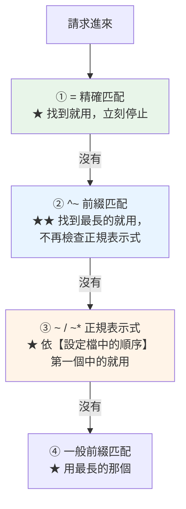

# Nginx 前後端流量分流設定

> [!abstract] 這篇你會學到
> - **★★★ location 的完整優先順序**（分流的基礎）
> - **單一 server block 的完整分流設定**（可直接照抄）
> - **多前端 + 多後端**的複雜情境
> - **★★ WAF 分區**（前台開、後台關）
> - **限流的分層設計**
> - **★★ 藍綠部署**與 upstream 切換
> - **分流的驗證與除錯**

## 前置知識

- [[01-前後端分離架構選型]] — 拓撲的選擇
- [[03-Nginx-location與rewrite]] — location 的基本語法
- [[02-Laravel-Nginx與PHP-FPM設定]] — PHP-FPM 的設定

---

## ★★★ location 的優先順序



```
★★★ 完整規則（★ 這是分流正確與否的關鍵）：

  ① location = /path        【精確匹配】★ 優先度最高，找到立刻停
  ② location ^~ /prefix/    【前綴且停止】★★ 匹配後不再檢查正規表示式
  ③ location ~ /regex/      【區分大小寫的正規表示式】★ 依檔案中的順序
     location ~* /regex/    【不區分大小寫】
  ④ location /prefix/       【一般前綴】★ 取最長匹配

★★ 重要細節：
  · ②④ 都是前綴匹配，但 ^~ 會【阻止】③ 的檢查
  · ③ 的多個 location 之間是【依設定檔的先後順序】，第一個中的就用
  · ★★ 一般前綴（④）會先記住「最長的匹配」，
       然後去檢查 ③，③ 沒中才回頭用 ④
```

```nginx
# ★★ 用這組設定理解優先順序
location = /api/health   { return 200 "① 精確\n"; }
location ^~ /api/        { return 200 "② 前綴停止\n"; }
location ~ \.php$        { return 200 "③ 正規\n"; }
location /               { return 200 "④ 一般前綴\n"; }
```

```bash
# ★★ 驗證
$ for p in /api/health /api/users /api/x.php /other.php /anything; do
    printf '%-16s → %s' "$p" "$(curl -s "https://app.example.gov.tw$p")"
  done
/api/health      → ① 精確
/api/users       → ② 前綴停止
/api/x.php       → ② 前綴停止      # ★★★ 注意！不是 ③
/other.php       → ③ 正規
/anything        → ④ 一般前綴
```

> [!danger] `^~` 的重要性 ★★★
> ```
> ★★★ 沒有 ^~ 時：
>   location /api/    { proxy_pass ...; }        # ★ 一般前綴
>   location ~ \.php$ { fastcgi_pass ...; }      # ★ 正規
>
>   請求 /api/users.php
>     → 先記住 location /api/ 是最長的前綴匹配
>     → ★★ 但接著會檢查正規表示式
>       → location ~ \.php$ 匹配到 → 【用它】
>         → ★★★ API 請求被 PHP handler 接走 → 行為錯亂
>
> ★★ 加上 ^~ 之後：
>   location ^~ /api/ { proxy_pass ...; }
>   → 匹配到就【停止】，不會再檢查正規表示式 ✓
>
> ★★★ 分流的鐵則：
>   所有「依路徑分流」的 location 都應該用 ^~
> ```

---

## ★★★ 單一 server block 的完整分流

```nginx
# ═══════════════════════════════════════════════════════
# /etc/nginx/sites-available/app.conf
# ★★ 同源部署：前端 SPA + Laravel API + 後台 + 上傳檔案
# ═══════════════════════════════════════════════════════

# ─────────── 限流分層 ───────────
limit_req_zone $binary_remote_addr zone=zone_static:10m  rate=100r/s;
limit_req_zone $binary_remote_addr zone=zone_page:10m    rate=30r/s;
limit_req_zone $binary_remote_addr zone=zone_api:10m     rate=20r/s;
limit_req_zone $binary_remote_addr zone=zone_login:10m   rate=5r/m;    # ★★ 極嚴
limit_req_zone $binary_remote_addr zone=zone_upload:10m  rate=2r/s;
limit_conn_zone $binary_remote_addr zone=conn_perip:10m;

# ─────────── ★ 真實 IP（若前面有 LB/CDN）───────────
# set_real_ip_from 10.0.0.0/8;
# real_ip_header X-Forwarded-For;
# real_ip_recursive on;

# ─────────── 共用的安全標頭 snippet ───────────
# /etc/nginx/snippets/security-headers.conf
#   add_header Strict-Transport-Security "max-age=31536000; includeSubDomains" always;
#   add_header X-Content-Type-Options "nosniff" always;
#   add_header X-Frame-Options "SAMEORIGIN" always;
#   add_header Referrer-Policy "strict-origin-when-cross-origin" always;

server {
    listen 80;
    listen [::]:80;
    server_name app.example.gov.tw;
    location ^~ /.well-known/acme-challenge/ { root /var/www/certbot; }
    location / { return 301 https://$host$request_uri; }
}

server {
    listen 443 ssl;
    listen [::]:443 ssl;
    http2 on;
    server_name app.example.gov.tw;

    # ═══ TLS ═══
    ssl_certificate         /etc/ssl/certs/app-fullchain.crt;
    ssl_certificate_key     /etc/ssl/private/app.key;
    ssl_trusted_certificate /etc/ssl/certs/ca-chain.crt;
    ssl_protocols           TLSv1.2 TLSv1.3;
    ssl_ciphers             ECDHE-ECDSA-AES128-GCM-SHA256:ECDHE-RSA-AES128-GCM-SHA256:ECDHE-ECDSA-AES256-GCM-SHA384:ECDHE-RSA-AES256-GCM-SHA384;
    ssl_prefer_server_ciphers off;
    ssl_session_cache       shared:SSL:20m;
    ssl_session_timeout     1d;
    ssl_session_tickets     off;

    # ═══ ★ 前端的 root（★ 後端的 root 在各自的 location 裡設）═══
    root  /var/www/app/current/dist;
    index index.html;

    charset utf-8;
    client_max_body_size 20m;
    limit_conn conn_perip 20;

    include snippets/security-headers.conf;

    # ═══ 日誌 ═══
    log_format app_fmt '$remote_addr - [$time_local] "$request" $status $body_bytes_sent '
                       'rt=$request_time urt=$upstream_response_time '
                       'zone=$limit_req_status ref="$http_referer"';
    access_log /var/log/nginx/app.access.log app_fmt;
    error_log  /var/log/nginx/app.error.log warn;

    gzip on; gzip_static on; gzip_vary on; gzip_comp_level 6; gzip_min_length 1024;
    gzip_types text/plain text/css application/json application/javascript
               application/xml image/svg+xml font/woff2;

    # ═══════════════════════════════════════════
    # ★★★ ① 精確匹配（優先度最高）
    # ═══════════════════════════════════════════

    # ★ 健康檢查（不記 log、不限流）
    location = /healthz {
        access_log off;
        add_header Content-Type text/plain;
        return 200 "ok\n";
    }

    location = /favicon.ico { access_log off; log_not_found off; expires 30d; }
    location = /robots.txt  { access_log off; log_not_found off; }

    # ★★ index.html 絕不快取
    location = /index.html {
        expires -1;
        add_header Cache-Control "no-cache, no-store, must-revalidate" always;
        include snippets/security-headers.conf;
    }

    # ★★ Sanctum 的 CSRF 端點
    location = /sanctum/csrf-cookie {
        limit_req zone=zone_api burst=20 nodelay;
        root /var/www/api/current/public;
        try_files $uri /index.php?$query_string;
    }

    # ═══════════════════════════════════════════
    # ★★★ ② ^~ 前綴匹配（分流的主力）
    # ═══════════════════════════════════════════

    # ─── ★★ 登入端點（極嚴格的限流）───
    location ^~ /api/login {
        limit_req zone=zone_login burst=3 nodelay;
        limit_req_status 429;
        root /var/www/api/current/public;
        try_files $uri /index.php?$query_string;
    }

    location ^~ /api/register { return 404; }        # ★ 內部系統不開放註冊

    # ─── ★★ 上傳端點 ───
    location ^~ /api/upload {
        limit_req zone=zone_upload burst=5 nodelay;
        client_max_body_size 50m;                     # ★ 這個端點放寬
        client_body_timeout 300s;
        root /var/www/api/current/public;
        try_files $uri /index.php?$query_string;
    }

    # ─── ★★★ API 主體 ───
    location ^~ /api/ {
        limit_req zone=zone_api burst=40 nodelay;
        limit_req_status 429;

        root /var/www/api/current/public;
        try_files $uri /index.php?$query_string;

        # ★★ 巢狀的 PHP handler（★ 只在這個 location 內生效）
        location ~ \.php$ {
            root /var/www/api/current/public;
            try_files $uri =404;                      # ★★★ 防 PathInfo
            fastcgi_pass unix:/run/php/php8.3-fpm-api.sock;
            fastcgi_index index.php;
            include fastcgi_params;
            fastcgi_param SCRIPT_FILENAME $realpath_root$fastcgi_script_name;
            fastcgi_param DOCUMENT_ROOT   $realpath_root;
            fastcgi_param HTTPS on;                   # ★★★
            fastcgi_read_timeout 60s;
            fastcgi_buffer_size 32k;
            fastcgi_buffers 16 16k;
            fastcgi_hide_header X-Powered-By;
        }
    }

    # ─── ★★ 管理後台（★ IP 限制 + 關閉 WAF）───
    location ^~ /admin {
        allow 10.0.0.0/8;
        allow 172.16.0.0/12;
        deny all;

        # modsecurity off;                            # ★★ 見下方 WAF 分區

        limit_req zone=zone_page burst=30 nodelay;

        root /var/www/api/current/public;
        try_files $uri $uri/ /index.php?$query_string;

        location ~ \.php$ {
            root /var/www/api/current/public;
            try_files $uri =404;
            fastcgi_pass unix:/run/php/php8.3-fpm-api.sock;
            include fastcgi_params;
            fastcgi_param SCRIPT_FILENAME $realpath_root$fastcgi_script_name;
            fastcgi_param HTTPS on;
            fastcgi_read_timeout 120s;                # ★ 後台可能有較慢的操作
        }
    }

    # ─── ★★ Livewire（Filament 用；★ 關閉 WAF）───
    location ^~ /livewire/ {
        # modsecurity off;                            # ★★ 極容易誤判
        client_max_body_size 50m;
        root /var/www/api/current/public;
        try_files $uri /index.php?$query_string;

        location ~ \.php$ {
            root /var/www/api/current/public;
            try_files $uri =404;
            fastcgi_pass unix:/run/php/php8.3-fpm-api.sock;
            include fastcgi_params;
            fastcgi_param SCRIPT_FILENAME $realpath_root$fastcgi_script_name;
            fastcgi_param HTTPS on;
        }
    }

    # ─── ★★ Laravel 的上傳檔案（storage:link）───
    location ^~ /storage/ {
        alias /var/www/api/shared/storage/app/public/;
        try_files $uri =404;
        expires 7d;
        add_header Cache-Control "public, max-age=604800";
        add_header X-Content-Type-Options "nosniff" always;
        add_header Content-Disposition "attachment" always;   # ★★ 強制下載（防 XSS）
        access_log off;

        # ★★★ 上傳的檔案絕不執行 PHP
        location ~ \.(php|phtml|phar|php\d|pht|phps)$ { deny all; }
    }

    # ─── ★★ 前端的建置產物（Vite）───
    location ^~ /assets/ {
        limit_req zone=zone_static burst=200 nodelay;
        try_files $uri =404;                          # ★★ 不 fallback
        expires 1y;
        add_header Cache-Control "public, max-age=31536000, immutable";
        add_header X-Content-Type-Options "nosniff" always;
        access_log off;
        gzip_static on;
    }

    # ─── ★ Filament / Nova 的資產 ───
    location ^~ /vendor/ {
        root /var/www/api/current/public;
        try_files $uri =404;
        expires 30d;                                   # ★ 沒有 hash，不能 1y
        add_header Cache-Control "public, max-age=2592000";
        add_header X-Content-Type-Options "nosniff" always;
        access_log off;
    }

    # ─── ★★ Nginx 狀態（★ 只允許本機）───
    location ^~ /nginx-status {
        stub_status;
        allow 127.0.0.1;
        deny all;
        access_log off;
    }

    # ═══════════════════════════════════════════
    # ★★ ③ 正規表示式
    # ═══════════════════════════════════════════

    # ─── 其他靜態檔（★ 在 assets 之外的）───
    location ~* \.(ico|png|jpe?g|gif|svg|webp|avif|woff2?|ttf|eot)$ {
        try_files $uri =404;
        expires 30d;
        add_header Cache-Control "public";
        add_header X-Content-Type-Options "nosniff" always;
        access_log off;
    }

    # ─── ★★★ 安全：擋掉敏感路徑 ───
    location ~ /\.(?!well-known) { deny all; access_log off; }
    location ~ \.(map|env|log|sql|sqlite|md|lock|yml|yaml|bak|old|orig|swp|dist)$ {
        deny all; access_log off;
    }
    location ~ ^/(vendor/(?!filament|nova|livewire)|bootstrap|config|database|resources|routes|tests|node_modules)/ {
        deny all; access_log off;
    }

    # ═══════════════════════════════════════════
    # ★★ ④ 一般前綴（★ SPA fallback，放最後）
    # ═══════════════════════════════════════════
    location / {
        limit_req zone=zone_page burst=50 nodelay;
        try_files $uri $uri/ /index.html;
    }

    # ═══ 錯誤頁 ═══
    error_page 429 = @rate_limited;
    location @rate_limited {
        default_type application/json;
        return 429 '{"message":"請求過於頻繁，請稍後再試","code":"RATE_LIMITED"}';
    }

    error_page 413 = @too_large;
    location @too_large {
        default_type application/json;
        return 413 '{"message":"檔案太大","code":"PAYLOAD_TOO_LARGE"}';
    }

    error_page 502 503 504 = @backend_down;
    location @backend_down {
        default_type application/json;
        return 503 '{"message":"服務暫時無法使用，請稍後再試","code":"SERVICE_UNAVAILABLE"}';
    }
}
```

> [!danger] `add_header` 在巢狀 location 中的陷阱 ★★★
> ```
> ★★★ add_header 是陣列型指令：
>   子層有任何一個 add_header → 【完全忽略】父層的所有 add_header
>
> location ^~ /api/ {
>     # ★ 這裡沒有 add_header → 繼承 server 層的 ✓
>     location ~ \.php$ {
>         add_header X-Cache "MISS";       # ★★★ 只加了這一個
>         # → ★★ server 層的 HSTS、nosniff、X-Frame-Options 【全部消失】
>     }
> }
>
> ★★ 解法：
>   ① 用 include snippets/security-headers.conf;（★ 每個有 add_header 的地方都引入）
>   ② ★ 盡量不要在深層的 location 加 add_header
>   ③ 用 headers-more 模組的 more_set_headers（不受此限）
>
> ★★★ 驗證：
>   curl -sI https://app/api/health | grep -ci 'strict-transport\|x-content-type'
> ```

---

## 分流的驗證 ★★

```bash
#!/usr/bin/env bash
# /usr/local/bin/verify-routing —— Nginx 分流驗證
set -uo pipefail
S="${1:-https://app.example.gov.tw}"
PASS=0; FAIL=0

t(){  # t <描述> <路徑> <預期狀態碼> [額外的 curl 參數]
    local desc="$1" path="$2" want="$3"; shift 3
    printf '  %-46s ' "$desc"
    local got
    got=$(curl -sko /dev/null -w '%{http_code}' --max-time 10 "$@" "$S$path")
    if [ "$got" = "$want" ]; then
        printf '\033[32m✓\033[0m (%s)\n' "$got"; PASS=$((PASS+1))
    else
        printf '\033[31m✗✗\033[0m (got %s, want %s)\n' "$got" "$want"; FAIL=$((FAIL+1))
    fi
}
ct(){  # ct <描述> <路徑> <預期 content-type 片段>
    printf '  %-46s ' "$1"
    local got
    got=$(curl -skI --max-time 10 "$S$2" | grep -i '^content-type:' | tr -d '\r')
    if echo "$got" | grep -qi "$3"; then
        printf '\033[32m✓\033[0m %s\n' "$got"; PASS=$((PASS+1))
    else
        printf '\033[31m✗✗\033[0m %s\n' "${got:-（無）}"; FAIL=$((FAIL+1))
    fi
}

echo "═══ Nginx 分流驗證：$S ═══"

echo -e "\n【① 精確匹配】"
t "健康檢查"              /healthz            200
t "favicon"              /favicon.ico        200
t "★ Sanctum CSRF"       /sanctum/csrf-cookie 204

echo -e "\n【② 前綴匹配 ^~】"
t "★★ API 端點"           /api/health/live    200
ct "★★★ API 回傳 JSON"     /api/health/live    'application/json'
t "★★ API 不存在 → 404"   /api/definitely-not-exist 404
ct "★★★ API 404 也是 JSON" /api/definitely-not-exist 'application/json'
t "★★ 前端資源"           /assets/            403
t "★★ 上傳檔案目錄"       /storage/           404
t "★ nginx-status（拒絕）" /nginx-status       403

echo -e "\n【③ 正規表示式】"
t "★★★ .env 擋住"         /.env               404
t "★★★ .git 擋住"         /.git/config        404
t "★★ sourcemap 擋住"     /assets/app.js.map  403
t "★★ config 目錄擋住"    /config/app.php     403
t "★★ vendor 擋住"        /vendor/autoload.php 403

echo -e "\n【④ SPA fallback】"
t "★★ 首頁"               /                   200
t "★★★ SPA 路由"          /users/123          200
ct "★★★ SPA 路由回 HTML"   /users/123          'text/html'
t "★★★ 資源不存在 → 404"  /assets/nope.js     404

echo -e "\n【★★★ 關鍵：分流沒有互相干擾】"
printf '  %-46s ' "★★★ /api/x.php 不被 PHP handler 接走"
BODY=$(curl -sk --max-time 10 "$S/api/x.php" | head -c 60)
if echo "$BODY" | grep -q '{'; then
    printf '\033[32m✓\033[0m（回傳 JSON）\n'; PASS=$((PASS+1))
elif echo "$BODY" | grep -qi '<!DOCTYPE\|<html'; then
    printf '\033[31m✗✗\033[0m（回傳 HTML —— 被 SPA fallback 接走了）\n'; FAIL=$((FAIL+1))
else
    printf '\033[32m✓\033[0m（%s）\n' "$(curl -sko /dev/null -w '%{http_code}' "$S/api/x.php")"
    PASS=$((PASS+1))
fi

printf '  %-46s ' "★★★ 資源不會 fallback 成 HTML"
curl -sk "$S/assets/nope.js" | grep -qi '<!DOCTYPE' && \
  { printf '\033[31m✗✗\033[0m\n'; FAIL=$((FAIL+1)); } || \
  { printf '\033[32m✓\033[0m\n'; PASS=$((PASS+1)); }

echo -e "\n【★★★ 安全標頭（每個路徑都要有）】"
for p in / /index.html /assets/ /api/health/live; do
    printf '  %-46s ' "$p 的安全標頭"
    N=$(curl -skI --max-time 10 "$S$p" | \
        grep -ciE 'strict-transport-security|x-content-type-options|x-frame-options')
    if [ "$N" -ge 2 ]; then
        printf '\033[32m✓\033[0m (%s 個)\n' "$N"; PASS=$((PASS+1))
    else
        printf '\033[31m✗✗\033[0m (只有 %s 個 —— add_header 被覆蓋了)\n' "$N"; FAIL=$((FAIL+1))
    fi
done

echo -e "\n【★★ 快取策略】"
printf '  %-46s ' "★★ index.html 不快取"
curl -skI "$S/" | grep -qiE 'cache-control:.*(no-store|no-cache)' && \
  { printf '\033[32m✓\033[0m\n'; PASS=$((PASS+1)); } || \
  { printf '\033[31m✗✗\033[0m\n'; FAIL=$((FAIL+1)); }

ASSET=$(curl -sk "$S/" | grep -oE '/assets/[^"]+\.js' | head -1)
if [ -n "$ASSET" ]; then
    printf '  %-46s ' "★★ 資源 immutable"
    curl -skI "$S$ASSET" | grep -qi 'immutable' && \
      { printf '\033[32m✓\033[0m\n'; PASS=$((PASS+1)); } || \
      { printf '\033[31m✗✗\033[0m\n'; FAIL=$((FAIL+1)); }
fi

printf '  %-46s ' "★★ API 不快取"
curl -skI "$S/api/health/live" | grep -qiE 'cache-control:.*no-store' && \
  { printf '\033[32m✓\033[0m\n'; PASS=$((PASS+1)); } || \
  printf '\033[33m⚠\033[0m\n'

echo -e "\n【★★ 限流】"
printf '  %-46s ' "★★★ 登入端點限流"
CODES=""
for i in $(seq 1 10); do
    CODES="$CODES$(curl -sko /dev/null -w '%{http_code}' -X POST "$S/api/login" \
      -H 'Accept: application/json' -d '{}' --max-time 5) "
done
echo "$CODES" | grep -q 429 && \
  { printf '\033[32m✓\033[0m（%s）\n' "$CODES"; PASS=$((PASS+1)); } || \
  { printf '\033[31m✗✗\033[0m（%s）\n' "$CODES"; FAIL=$((FAIL+1)); }

echo -e "\n═══ ✓ $PASS  ✗ $FAIL ═══"
[ "$FAIL" -eq 0 ] || exit 1
```

---

## 多前端 + 多後端 ★★

```nginx
# ═══════════════════════════════════════════════════════
# 情境：一個網域下有
#   /              → 公開入口（Vue SPA）
#   /portal/       → 員工入口（另一個 Vue SPA）
#   /admin/        → Filament 後台
#   /api/v1/       → Laravel API v1
#   /api/v2/       → Laravel API v2（★ 不同的 FPM pool）
#   /docs/         → VitePress 文件
# ═══════════════════════════════════════════════════════

upstream api_v1 { server unix:/run/php/php8.3-fpm-api-v1.sock; }
upstream api_v2 { server unix:/run/php/php8.3-fpm-api-v2.sock; }

server {
    listen 443 ssl;
    http2 on;
    server_name portal.example.gov.tw;

    ssl_certificate     /etc/ssl/certs/portal-fullchain.crt;
    ssl_certificate_key /etc/ssl/private/portal.key;
    ssl_protocols       TLSv1.2 TLSv1.3;

    include snippets/security-headers.conf;
    client_max_body_size 20m;

    # ═══ ★★ API v2（★ 最先，路徑最長）═══
    location ^~ /api/v2/ {
        limit_req zone=zone_api burst=40 nodelay;
        root /var/www/api-v2/current/public;
        try_files $uri /index.php?$query_string;
        location ~ \.php$ {
            root /var/www/api-v2/current/public;
            try_files $uri =404;
            fastcgi_pass unix:/run/php/php8.3-fpm-api-v2.sock;
            include fastcgi_params;
            fastcgi_param SCRIPT_FILENAME $realpath_root$fastcgi_script_name;
            fastcgi_param HTTPS on;
            include snippets/security-headers.conf;
        }
    }

    # ═══ ★ API v1（★ 加上淘汰標頭）═══
    location ^~ /api/v1/ {
        limit_req zone=zone_api burst=40 nodelay;
        add_header Deprecation "true" always;
        add_header Sunset "Sun, 31 Dec 2026 23:59:59 GMT" always;
        add_header Link '</api/v2>; rel="successor-version"' always;
        include snippets/security-headers.conf;

        root /var/www/api-v1/current/public;
        try_files $uri /index.php?$query_string;
        location ~ \.php$ {
            root /var/www/api-v1/current/public;
            try_files $uri =404;
            fastcgi_pass unix:/run/php/php8.3-fpm-api-v1.sock;
            include fastcgi_params;
            fastcgi_param SCRIPT_FILENAME $realpath_root$fastcgi_script_name;
            fastcgi_param HTTPS on;
        }
    }

    # ═══ ★★ 管理後台 ═══
    location = /admin { return 301 /admin/; }
    location ^~ /admin/ {
        allow 10.0.9.0/24;
        deny all;
        root /var/www/api-v2/current/public;
        try_files $uri $uri/ /index.php?$query_string;
        location ~ \.php$ {
            root /var/www/api-v2/current/public;
            try_files $uri =404;
            fastcgi_pass unix:/run/php/php8.3-fpm-api-v2.sock;
            include fastcgi_params;
            fastcgi_param SCRIPT_FILENAME $realpath_root$fastcgi_script_name;
            fastcgi_param HTTPS on;
            fastcgi_read_timeout 120s;
        }
    }

    # ═══ ★★ 員工入口（★ 第二個 SPA，子目錄部署）═══
    location = /portal { return 301 /portal/; }

    location ^~ /portal/assets/ {
        alias /var/www/portal-spa/current/dist/assets/;
        try_files $uri =404;
        expires 1y;
        add_header Cache-Control "public, max-age=31536000, immutable";
        include snippets/security-headers.conf;
        access_log off;
    }

    location ^~ /portal/ {
        alias /var/www/portal-spa/current/dist/;
        try_files $uri $uri/ /portal/index.html;      # ★★ 完整 URI
        allow 10.0.0.0/8;
        deny all;
    }

    # ═══ ★ 文件 ═══
    location = /docs { return 301 /docs/; }
    location ^~ /docs/ {
        alias /var/www/docs/current/dist/;
        try_files $uri $uri/ /docs/index.html;
        expires 1h;
        add_header Cache-Control "public, max-age=3600";
        include snippets/security-headers.conf;
    }

    # ═══ ★ 公開入口的資源 ═══
    location ^~ /assets/ {
        try_files $uri =404;
        expires 1y;
        add_header Cache-Control "public, max-age=31536000, immutable";
        include snippets/security-headers.conf;
        access_log off;
    }

    # ═══ 安全 ═══
    location ~ /\.(?!well-known) { deny all; access_log off; }
    location ~ \.(map|env|log|sql|lock)$ { deny all; access_log off; }

    # ═══ ★ 公開入口（★ 最後）═══
    root /var/www/public-spa/current/dist;
    index index.html;

    location = /index.html {
        expires -1;
        add_header Cache-Control "no-cache, no-store, must-revalidate" always;
        include snippets/security-headers.conf;
    }

    location / {
        limit_req zone=zone_page burst=50 nodelay;
        try_files $uri $uri/ /index.html;
    }
}
```

> [!warning] 多個 SPA 的 location 順序 ★★
> ```
> ★★★ 路徑長的要放前面（★ 雖然 ^~ 是取最長匹配，但可讀性很重要）
>
>   location ^~ /portal/assets/    ← ★ 最長，放最前
>   location ^~ /portal/
>   location ^~ /assets/
>   location /                     ← ★ 最短，放最後
>
> ★★ 每個子 SPA 都要：
>   ① location = /xxx { return 301 /xxx/; }   ★ 不帶斜線的轉址
>   ② 資源的 location（try_files $uri =404）
>   ③ SPA fallback（try_files ... /xxx/index.html）★★ 完整 URI
>   ④ vite.config 的 base 與 router 的 base 都要設對
> ```

---

## ★★ WAF 分區

```nginx
# ═══════ ★★ 前台開 WAF、後台關 WAF ═══════
server {
    # ...
    modsecurity on;
    modsecurity_rules_file /etc/nginx/modsec/main.conf;

    # ─── ★★ 後台：關閉 WAF（★ 已有 IP 限制 + 認證）───
    location ^~ /admin {
        modsecurity off;                          # ★★
        allow 10.0.9.0/24;
        deny all;
        # ...
    }

    # ─── ★★★ Livewire：關閉 WAF（★ 極容易誤判）───
    location ^~ /livewire/ {
        modsecurity off;
        # ...
    }

    # ─── ★ 檔案上傳：只偵測不阻擋 ───
    location ^~ /api/upload {
        modsecurity_rules '
            SecRuleEngine DetectionOnly
        ';
        # ...
    }

    # ─── ★★ 公開的 API：完整的 WAF ───
    location ^~ /api/ {
        # ★ 繼承 server 層的 modsecurity on
        # ...
    }
}
```

> [!tip] WAF 分區的取捨 ★★
> ```
> ★★ 這是「安全」與「可用性」的權衡：
>
>   ★ 前台（公開端點）
>     · 任何人都能存取 → ★★ WAF 的價值最高
>     · 通常是簡單的 JSON 請求 → 誤判少
>     → ★★ 開啟完整的 WAF
>
>   ★★ 後台（已有 IP 限制 + 登入驗證）
>     · 攻擊者要先突破網路層與認證層
>     · Livewire/Filament 的 payload 極容易誤判
>     → ★★ 可以關閉（★ 前提是 IP 限制確實有效）
>
>   ★ 檔案上傳
>     · binary 內容會觸發大量規則
>     → ★ DetectionOnly（記錄但不阻擋）
>
> ★★★ 但要注意：
>   關閉 WAF 的 location 【必須有其他的防護】
>   → IP 限制 + 認證 + 應用層的輸入驗證
>   → ★ 不能只是「為了方便」就關掉
> ```

```bash
# ★★ 驗證 WAF 分區
$ curl -sko /dev/null -w '%{http_code}\n' \
    "https://app.example.gov.tw/api/test?id=1' OR '1'='1"
403                                    # ★★ 前台的 WAF 生效

$ curl -sko /dev/null -w '%{http_code}\n' \
    "https://app.example.gov.tw/admin/test?id=1' OR '1'='1"
403                                    # ★ 這是 IP 限制擋的（不是 WAF）

# ★ 從允許的 IP 測試
$ ssh internal-host "curl -sko /dev/null -w '%{http_code}\n' \
    \"https://app.example.gov.tw/admin/test?id=1' OR '1'='1\""
404                                    # ★★ WAF 沒擋（正常，因為關掉了）
```

---

## ★★ 藍綠部署與 upstream 切換

```nginx
# ═══════ ★★ 用 upstream 做藍綠切換 ═══════
# /etc/nginx/conf.d/upstream-api.conf（★ 部署時只改這個檔案）
upstream api_backend {
    server unix:/run/php/php8.3-fpm-api-blue.sock;
    # server unix:/run/php/php8.3-fpm-api-green.sock;    # ★ 切換時換這一行
}
```

```nginx
location ^~ /api/ {
    root /var/www/api/current/public;
    try_files $uri /index.php?$query_string;
    location ~ \.php$ {
        root /var/www/api/current/public;
        try_files $uri =404;
        fastcgi_pass api_backend;                 # ★★ 用 upstream 名稱
        include fastcgi_params;
        fastcgi_param SCRIPT_FILENAME $realpath_root$fastcgi_script_name;
        fastcgi_param HTTPS on;
    }
}
```

```bash
#!/usr/bin/env bash
# /usr/local/bin/switch-upstream —— 藍綠切換
set -euo pipefail
COLOR="${1:?用法: switch-upstream <blue|green>}"
CONF=/etc/nginx/conf.d/upstream-api.conf
SITE=https://app.example.gov.tw

[ "$COLOR" = blue ] || [ "$COLOR" = green ] || { echo "只能是 blue 或 green"; exit 1; }

CUR=$(grep -oP 'php8\.3-fpm-api-\K\w+(?=\.sock)' "$CONF" | head -1)
echo "═══ 藍綠切換：$CUR → $COLOR ═══"
[ "$CUR" = "$COLOR" ] && { echo "已經是 $COLOR"; exit 0; }

# ★★ ① 先確認目標的 socket 存在且健康
SOCK="/run/php/php8.3-fpm-api-$COLOR.sock"
[ -S "$SOCK" ] || { echo "✗✗ $SOCK 不存在"; exit 1; }

# ★★ 用 cgi-fcgi 直接測試 FPM（不經過 Nginx）
if command -v cgi-fcgi >/dev/null; then
    SCRIPT_FILENAME=/var/www/api-$COLOR/current/public/index.php \
    REQUEST_METHOD=GET SCRIPT_NAME=/index.php REQUEST_URI=/api/health/live \
    QUERY_STRING= \
    cgi-fcgi -bind -connect "$SOCK" 2>/dev/null | head -5 | sed 's/^/    /'
fi

# ★★ ② 備份並切換
cp "$CONF" "$CONF.bak"
sed -i "s|php8\.3-fpm-api-[a-z]*\.sock|php8.3-fpm-api-$COLOR.sock|" "$CONF"

# ★★★ ③ 語法檢查（★ 失敗就回退）
if ! nginx -t 2>&1 | tail -2; then
    mv "$CONF.bak" "$CONF"
    echo "✗✗ 設定檔語法錯誤，已回退"
    exit 1
fi

# ★★ ④ reload（零停機）
systemctl reload nginx
echo "  ✓ 已切換到 $COLOR"

# ★★★ ⑤ 驗證
sleep 2
FAIL=0
for i in $(seq 1 5); do
    C=$(curl -sko /dev/null -w '%{http_code}' --max-time 10 "$SITE/api/health/live")
    [ "$C" = 200 ] || FAIL=$((FAIL+1))
    sleep 1
done

if [ "$FAIL" -gt 0 ]; then
    echo "  ✗✗ 驗證失敗（$FAIL/5）—— 回退到 $CUR"
    mv "$CONF.bak" "$CONF"
    nginx -t && systemctl reload nginx
    exit 1
fi

VER=$(curl -s "$SITE/api/health/version" | jq -r '.commit // "unknown"')
echo "  ✓ 驗證通過（版本 $VER）"
rm -f "$CONF.bak"
```

```bash
# ★★ 使用
$ sudo switch-upstream green
$ sudo switch-upstream blue        # ★ 回退
```

---

## 常見錯誤與排錯

| 現象 | 原因 | 解法 |
| --- | --- | --- |
| **API 回傳 HTML** ★★★ | SPA fallback 接走了 | `location ^~ /api/`（有 `^~`） |
| **`/api/x.php` 被 PHP handler 接走** ★★★ | 沒有 `^~` | 加上 `^~` |
| **深層 location 沒有安全標頭** ★★★ | `add_header` 陣列覆蓋 | `include snippets/security-headers.conf` |
| **資源 404 卻回 HTML** ★★★ | 資源沒用 `try_files $uri =404` | 加上 |
| **子目錄 SPA 白畫面** ★★★ | `alias` 或 `base` 設定 | 見 [[02-Vue-SPA路由與API代理]] |
| `alias` + `try_files` 失效 ★★ | 相對路徑 | 最後參數寫**完整 URI** |
| **上傳的檔案可執行 PHP** ★★★★ | 沒擋 | `location ~ \.php$ { deny all; }` |
| **後台的 Livewire 一直 403** ★★★ | ModSecurity 誤判 | `modsecurity off` 或寫排除規則 |
| 限流一個 zone 打死全部 ★★ | 只有一個 zone | 分層設多個 zone |
| **藍綠切換有停機** ★ | 用了 restart | 用 `reload` |
| 巢狀 location 的 root 沒繼承 ★★ | 巢狀 location 需要自己設 | 在巢狀 location 重複 `root` |
| `stub_status` 被外部存取 ★★ | 沒限制 | `allow 127.0.0.1; deny all;` |

### 排查

```bash
S=https://app.example.gov.tw

# 【1】★★★ 開 debug log 看 location 匹配（★ 只在測試環境）
$ sudo tee -a /etc/nginx/nginx.conf >/dev/null <<'EOF'
error_log /var/log/nginx/debug.log debug;
EOF
$ sudo nginx -t && sudo systemctl reload nginx
$ curl -sk "$S/api/users" -o /dev/null
$ sudo grep -A2 'using configuration' /var/log/nginx/debug.log | tail -20
# ★★ 會顯示實際匹配到哪個 location
# ★★★ 測完立刻關掉（debug log 極大）

# 【2】★★ 用回應內容判斷分流
$ for p in /api/health/live /api/nope /assets/nope.js /users/123 /.env; do
    printf '%-24s %s  %s\n' "$p" \
      "$(curl -sko /dev/null -w '%{http_code}' "$S$p")" \
      "$(curl -skI "$S$p" | grep -i '^content-type' | tr -d '\r')"
  done

# 【3】★★★ 檢查安全標頭有沒有在每一層都存在
$ for p in / /index.html /assets/ /api/health/live /storage/; do
    printf '%-24s %s 個標頭\n' "$p" \
      "$(curl -skI "$S$p" | grep -ciE 'strict-transport|x-content-type|x-frame')"
  done

# 【4】★★ Nginx 實際載入的設定
$ sudo nginx -T 2>/dev/null | sed -n '/server_name app.example.gov.tw/,/^}/p' | \
    grep -nE 'location|root|alias|fastcgi_pass|proxy_pass'

# 【5】★ location 的順序
$ sudo nginx -T 2>/dev/null | grep -oP '^\s*location\s+\K.*(?=\s*\{)' | nl

# 【6】限流狀態
$ sudo grep 'limiting requests' /var/log/nginx/error.log | tail -10
$ awk '{for(i=1;i<=NF;i++) if($i ~ /^zone=/) print $i}' /var/log/nginx/app.access.log | \
    sort | uniq -c

# 【7】★ upstream 健康
$ curl -s http://127.0.0.1/nginx-status
$ ls -l /run/php/*.sock

# 【8】★★ 驗證腳本
$ verify-routing "$S"
```

---

## 安全性注意事項

> [!danger] 分流相關的四條紅線 ★★★
> ```
> ① ★★★★ 上傳目錄絕不執行 PHP
>      location ^~ /storage/ {
>          location ~ \.(php|phtml|phar|php\d|pht|phps)$ { deny all; }
>      }
>      → ★ 副檔名要列全（★ php5、phtml、phps 都要）
>
> ② ★★★ 每個 PHP 的 location 都要 try_files $uri =404
>      → 巢狀 location 也要（★ 很容易漏掉）
>
> ③ ★★★ 深層 location 要重新宣告安全標頭
>      → include snippets/security-headers.conf
>      → ★ 否則 add_header 陣列覆蓋會讓標頭消失
>
> ④ ★★ 關閉 WAF 的 location 必須有其他防護
>      → IP 限制 + 認證 + 應用層驗證
>      → ★ 不能只是「為了方便」
> ```

```bash
# ★★★ 上線前必測
$ S=https://app.example.gov.tw
$ echo "── PHP 執行防護 ──"
$ for p in /storage/x.php /storage/x.jpg/y.php /storage/uploads/shell.phtml \
           /assets/x.php /index.php/x.php; do
    printf '%-40s %s\n' "$p" "$(curl -sko /dev/null -w '%{http_code}' "$S$p")"
  done
# ★★★ 全部必須是 403 或 404

$ echo "── 安全標頭覆蓋檢查 ──"
$ for p in / /assets/ /api/health/live /storage/; do
    N=$(curl -skI "$S$p" | grep -ciE 'strict-transport|x-content-type')
    printf '%-24s %s\n' "$p" "$([ "$N" -ge 2 ] && echo "✓ $N" || echo "✗✗ 只有 $N")"
  done
```

> [!warning] `Content-Disposition: attachment` 的用途 ★★
> ```nginx
> location ^~ /storage/ {
>     add_header Content-Disposition "attachment" always;    # ★★
> }
> ```
>
> ```
> ★★ 強制瀏覽器【下載】而不是【顯示】上傳的檔案
>
> ★★★ 防的是「儲存型 XSS」：
>   攻擊者上傳一個 .html 或 .svg 檔案（★ 內含 <script>）
>   → 若瀏覽器直接【顯示】它
>     → ★★★ 在你的網域上執行 JS
>       → 可以讀取 cookie（★ 若不是 HttpOnly）、發起請求
>
> ★★ 三層防護：
>   ① Content-Disposition: attachment（強制下載）
>   ② X-Content-Type-Options: nosniff（不猜測型別）
>   ③ ★ 最好把上傳的檔案放在【另一個網域】
>      （例如 files.example.gov.tw，★ 與主站不同源）
> ```

---

## 速查表

### ★★★ location 優先順序

```
① location = /path       精確匹配   ★ 找到立刻停
② location ^~ /prefix/   前綴且停止 ★★ 不再檢查正規表示式
③ location ~ /regex/     正規表示式 ★ 依設定檔順序，第一個中的
④ location /prefix/      一般前綴   ★ 取最長匹配

★★★ 分流的鐵則：依路徑分流的 location 都要用 ^~
   → 否則 /api/x.php 會被 location ~ \.php$ 接走
```

### 分流骨架

```nginx
location = /healthz          { }     # ① 精確
location ^~ /api/login       { }     # ② 前綴（★ 長的在前）
location ^~ /api/            { }
location ^~ /admin           { }
location ^~ /storage/        { }
location ^~ /assets/         { }
location ~* \.(png|jpg)$     { }     # ③ 正規
location ~ /\.               { deny all; }
location /                   { try_files $uri $uri/ /index.html; }   # ④ 最後
```

### ★★★ 每個 location 的必要項目

```nginx
# API / PHP
location ^~ /api/ {
    root /var/www/api/current/public;
    try_files $uri /index.php?$query_string;
    location ~ \.php$ {
        root /var/www/api/current/public;      # ★★ 巢狀要重複
        try_files $uri =404;                   # ★★★★ 防 RCE
        fastcgi_param SCRIPT_FILENAME $realpath_root$fastcgi_script_name;
        fastcgi_param HTTPS on;                # ★★★
        include snippets/security-headers.conf; # ★★★ 防 add_header 覆蓋
    }
}

# 靜態資源
location ^~ /assets/ {
    try_files $uri =404;                       # ★★ 不 fallback
    expires 1y;
    add_header Cache-Control "public, max-age=31536000, immutable";
    include snippets/security-headers.conf;
}

# 上傳檔案
location ^~ /storage/ {
    alias /var/www/api/shared/storage/app/public/;
    try_files $uri =404;
    add_header Content-Disposition "attachment" always;    # ★★ 防儲存型 XSS
    location ~ \.(php|phtml|phar|php\d|pht|phps)$ { deny all; }   # ★★★★
}
```

### ★★★ `add_header` 陣列覆蓋

```
★★★ 子層有任何一個 add_header → 完全忽略父層的所有 add_header

解法：include snippets/security-headers.conf;（★ 每個有 add_header 的地方）

驗證：
  for p in / /assets/ /api/health; do
      curl -skI "https://app$p" | grep -ciE 'strict-transport|x-content-type'
  done
  # ★ 每個都要 ≥2
```

### 限流分層

```nginx
limit_req_zone $binary_remote_addr zone=zone_static:10m rate=100r/s;
limit_req_zone $binary_remote_addr zone=zone_page:10m   rate=30r/s;
limit_req_zone $binary_remote_addr zone=zone_api:10m    rate=20r/s;
limit_req_zone $binary_remote_addr zone=zone_login:10m  rate=5r/m;    # ★★
limit_conn_zone $binary_remote_addr zone=conn_perip:10m;
```

### WAF 分區

```nginx
server { modsecurity on; }                    # ★ 預設開
location ^~ /admin     { modsecurity off; }   # ★★ 有 IP 限制 + 認證
location ^~ /livewire/ { modsecurity off; }   # ★★★ 極容易誤判
location ^~ /api/upload { modsecurity_rules 'SecRuleEngine DetectionOnly'; }
```

### 藍綠切換

```nginx
upstream api_backend { server unix:/run/php/php8.3-fpm-api-blue.sock; }
location ~ \.php$ { fastcgi_pass api_backend; }
```
```bash
sudo switch-upstream green      # ★ 改 upstream + nginx -t + reload + 驗證
```

### 排查

```bash
verify-routing https://app.example.gov.tw

# ★★ 各路徑的狀態與型別
for p in /api/health /api/nope /assets/nope.js /users/123 /.env; do
    printf '%-24s %s %s\n' "$p" \
      "$(curl -sko /dev/null -w '%{http_code}' "https://app$p")" \
      "$(curl -skI "https://app$p" | grep -i content-type | tr -d '\r')"
done

# ★★★ 上傳目錄的 PHP 防護（全部要 403/404）
for p in /storage/x.php /storage/x.jpg/y.php /storage/x.phtml; do
    curl -sko /dev/null -w "$p %{http_code}\n" "https://app$p"
done

sudo nginx -T | grep -oP '^\s*location\s+\K.*(?=\s*\{)' | nl
```

---

## 練習題

> [!question]- 練習 1：location 優先順序 ★★★
> 1. 部署那組「① ② ③ ④」的測試設定
> 2. 用 `curl` 測 5 個路徑，**記錄每一個匹配到哪個**
> 3. **拿掉 `^~`** → `/api/x.php` 匹配到哪個？
> 4. 把 `location ~ \.php$` 移到 `location ^~ /api/` 前面 → 有變嗎？
> 5. 加上兩個正規表示式的 location，**調換順序** → 結果變了嗎？
> 6. **畫出你的優先順序流程圖**

> [!question]- 練習 2：`add_header` 覆蓋 ★★★
> 1. 在 server 層設 4 個安全標頭
> 2. 在 `/assets/` 的 location 只設 `Cache-Control`
> 3. `curl -sI /assets/x.js | grep -c` → **有幾個標頭？**
> 4. 在巢狀的 `location ~ \.php$` 也加一個 `add_header`
> 5. 測 `/api/health` → **有幾個？**
> 6. 用 `include snippets/` 解決並驗證每個路徑都有 ≥4 個

> [!question]- 練習 3：上傳目錄的 PHP 防護 ★★★★
> **★ 在隔離的測試環境**
> 1. 在 `storage/app/public/` 放一個 `test.php`（內容 `<?php echo "RCE";`）
> 2. **不加 `location ~ \.php$ { deny all; }`** → 存取 → **執行了嗎？**
> 3. 加上防護 → 再測
> 4. 測 `test.phtml`、`test.php5`、`test.jpg/x.php` → **都擋住了嗎？**
> 5. **列出所有需要擋的副檔名**

> [!question]- 練習 4：多前端分流
> 1. 部署三個 SPA：`/`、`/portal/`、`/docs/`
> 2. 每一個都測：首頁、深層路由、資源、不存在的資源
> 3. **故意把 `location /` 放在 `/portal/` 前面** → 會怎樣？
> 4. 測 `/portal`（不帶斜線）→ 資源載得到嗎？
> 5. **執行 `verify-routing`**

> [!question]- 練習 5：藍綠切換
> 1. 建立兩個 FPM pool（blue、green），部署不同版本
> 2. 開持續請求的迴圈
> 3. 執行 `switch-upstream green` → **有中斷嗎？**
> 4. `curl /api/health/version` → 版本變了嗎？
> 5. **故意讓 green 的健康檢查失敗** → 自動回退了嗎？
> 6. **測量切換的耗時**

---

## 小測驗

Q1. **Nginx 的 location 優先順序是什麼**？

Q2. **`^~` 的作用是什麼？為什麼分流一定要用**？

Q3. **一般前綴匹配（④）與 `^~`（②）的差別**？

Q4. **多個正規表示式的 location 之間怎麼決定用哪個**？

Q5. **`add_header` 在巢狀 location 中有什麼陷阱**？

Q6. **巢狀的 `location ~ \.php$` 為什麼要重複設 `root`**？

Q7. **上傳目錄需要擋掉哪些副檔名？為什麼**？

Q8. **`Content-Disposition: attachment` 防的是什麼**？

Q9. **WAF 分區的原則是什麼**？

Q10. **用 upstream 做藍綠切換的流程與注意事項**？

> [!question]- 測驗答案
> **Q1.** **四層，由高到低**：
> ①**`location = /path`（精確匹配）** —— **找到就用，立刻停止**；
> ②**`location ^~ /prefix/`（前綴且停止）** ——
> 匹配後**不再檢查正規表示式**，多個時取最長；
> ③**`location ~ /regex/` 與 `~*`（正規表示式）** ——
> **依設定檔中的先後順序，第一個匹配到的就用**；
> ④**`location /prefix/`（一般前綴）** —— **取最長匹配**。
> **重要細節**：④ 會先記住「最長的前綴匹配」，
> **但接著仍會去檢查 ③**，只有 ③ 都沒中才回頭用 ④。
> 這就是為什麼分流要用 `^~`。
>
> **Q2.** **`^~` 表示「前綴匹配成功後就停止，不要再去檢查正規表示式的 location」**。
> **為什麼分流一定要用**：
> ```nginx
> location /api/    { proxy_pass ...; }        # 一般前綴
> location ~ \.php$ { fastcgi_pass ...; }      # 正規
> ```
> 請求 `/api/users.php` 時，
> Nginx 先記住 `location /api/` 是最長的前綴匹配，
> **但接著會檢查正規表示式** → `location ~ \.php$` 匹配到 → **用它** →
> **API 請求被 PHP handler 接走，行為完全錯亂**。
> 加上 `^~` 之後就會在前綴匹配時停止。
> **鐵則：所有「依路徑分流」的 location 都應該用 `^~`**。
>
> **Q3.** **兩者都是前綴匹配，差別在「是否阻止正規表示式的檢查」**：
> **`^~`（②）** —— 匹配成功後**立刻停止**，不再檢查任何正規表示式的 location；
> **一般前綴（④）** —— 匹配成功後**只是「記住」它**，
> **接著仍會去檢查所有正規表示式的 location**，
> 有正規表示式匹配到就用那個，**都沒中才回頭用記住的前綴匹配**。
> **實務影響**：靜態資源、API、後台等依路徑分流的地方
> 如果用一般前綴，就可能被 `location ~ \.php$`、
> `location ~* \.(js|css)$` 這類正規表示式搶走。
>
> **Q4.** **依「設定檔中出現的先後順序」由上而下比對，第一個匹配到的就用** ——
> **不是取最長、不是取最精確**。
> ```nginx
> location ~ /api/     { return 200 "A\n"; }
> location ~ /api/v2/  { return 200 "B\n"; }
> ```
> 請求 `/api/v2/users` → **會匹配到第一個（A）**，
> 因為它先出現且也能匹配。
> **所以正規表示式的 location「要把更精確的放在前面」**。
> 這與前綴匹配（取最長）的行為**完全不同**，是很常見的混淆點。
> **實務建議**：盡量用 `^~` 做路徑分流，
> 正規表示式只用在「依副檔名」的規則上，並注意順序。
>
> **Q5.** **`add_header` 是陣列型指令 ——
> 子層只要有「任何一個」`add_header`，就會完全忽略父層的「所有」`add_header`**。
> ```nginx
> server {
>     add_header Strict-Transport-Security "..." always;
>     add_header X-Content-Type-Options "nosniff" always;
>     location ^~ /api/ {
>         location ~ \.php$ {
>             add_header X-Cache "MISS";    # ★★★ 只加了這一個
>             # → server 層的兩個標頭【全部消失】
>         }
>     }
> }
> ```
> **而且是「跨層級」的** —— 巢狀三層時，最內層的 `add_header` 會蓋掉外面兩層的。
> **解法**：把安全標頭抽成 snippet，
> **在每個有 `add_header` 的 location 都 `include`**；
> 或改用 `headers-more` 模組的 `more_set_headers`（不受此限）。
>
> **Q6.** 因為 **`root` 與 `alias` 不會從「外層 location」繼承到「巢狀 location」**
> ——它們只從 `server` 層繼承。
> ```nginx
> location ^~ /api/ {
>     root /var/www/api/current/public;      # ★ 這裡設了
>     location ~ \.php$ {
>         # ★★ 這裡看不到外層的 root
>         # → 會用 server 層的 root（★ 前端的 dist 目錄）
>         # → ★★★ SCRIPT_FILENAME 指向錯誤的路徑 → File not found
>         root /var/www/api/current/public;   # ★★ 必須重複
>     }
> }
> ```
> **這是同源部署（前後端在同一個 server block）時最容易踩的坑** ——
> 症狀是 API 一直回 `File not found` 或 `Primary script unknown`。
>
> **Q7.** **必須擋掉所有「可能被當成 PHP 執行」的副檔名**：
> ```nginx
> location ~ \.(php|phtml|phar|php\d|pht|phps|inc)$ { deny all; }
> ```
> **為什麼要列這麼多**：
> **`.phtml`、`.php5`、`.php7`、`.pht`、`.phps`** 在某些 PHP/Nginx 設定下
> **也會被當成 PHP 處理**；
> **`.phar`** 是 PHP 封存檔，也可執行；
> 而且攻擊者會嘗試各種變形來繞過只擋 `.php` 的規則。
> **除了副檔名，還要防 PathInfo**（`x.jpg/y.php`）——
> 靠 `try_files $uri =404` 與 `cgi.fix_pathinfo=0`。
> **更根本的做法**：把上傳的檔案放在**另一個網域**或**物件儲存**上。
>
> **Q8.** **防「儲存型 XSS」**。
> **攻擊情境**：攻擊者上傳一個 `.html`、`.svg` 或 `.xml` 檔案，
> 內容含 `<script>` —— 如果瀏覽器**直接顯示**它而不是下載，
> **那段 JS 就會在你的網域上執行**（同源！），
> 可以讀取 cookie（若不是 HttpOnly）、以使用者身分發起 API 請求、竊取資料。
> **`Content-Disposition: attachment` 強制瀏覽器下載而不是顯示**。
> **三層防護**：
> ①`Content-Disposition: attachment`；
> ②`X-Content-Type-Options: nosniff`（不讓瀏覽器猜測型別）；
> ③**最好把上傳的檔案放在另一個網域**（`files.example.gov.tw`）——
> 即使 XSS 執行了也是在不同源，拿不到主站的 cookie。
>
> **Q9.** **依「該路徑的其他防護有多強」與「誤判成本有多高」決定**：
> **前台（公開端點）** —— 任何人都能存取，**WAF 的價值最高**；
> 通常是簡單的 JSON 請求，**誤判少** → **開啟完整的 WAF**。
> **後台（已有 IP 限制 + 登入驗證）** ——
> 攻擊者要先突破網路層與認證層；
> **Livewire/Filament 的 payload 極容易誤判**（序列化的元件狀態）→
> **可以關閉**（`modsecurity off`）。
> **檔案上傳** —— binary 內容觸發大量規則 → **`DetectionOnly`**（記錄不阻擋）。
> **前提**：**關閉 WAF 的 location 必須有其他的防護**
> （IP 限制 + 認證 + 應用層輸入驗證），
> **不能只是「為了方便」就關掉**。
>
> **Q10.** **流程**：
> ①把 `upstream` 定義獨立成一個檔案（`/etc/nginx/conf.d/upstream-api.conf`），
> `fastcgi_pass` 用 upstream 名稱而不是 socket 路徑；
> ②**先確認目標的 socket 存在且健康**（可用 `cgi-fcgi` 直接測 FPM）；
> ③**備份設定檔**後用 `sed` 改 socket 路徑；
> ④**`nginx -t` 語法檢查**（失敗就立刻回退）；
> ⑤**`systemctl reload nginx`**（零停機，不要用 restart）；
> ⑥**驗證多次**（連續 5 次健康檢查 + 版本確認），失敗就自動回退。
> **注意事項**：
> **必須用 `reload` 不能用 `restart`**（restart 會斷線）；
> **驗證要在切換後立刻做**並準備好回退；
> **兩個 pool 要分別有自己的 `releases` 目錄與 socket**；
> 資料庫遷移仍然是**不可逆的**（藍綠不能解決這個問題）。

---

## 延伸閱讀

- [[06-Vue-Laravel完整部署實戰]] — 完整的整合實戰
- [[09-前後端分離常見問題排查]] — 問題排查
- [[03-Nginx-location與rewrite]] — location 的完整語法
- [[02-Laravel-Nginx與PHP-FPM設定]] — PHP-FPM 的設定
- [[08-Nginx-效能調校]] — 限流與快取的進階設定
- [[03-ModSecurity-規則調校與誤判處理]] — WAF 的調校
