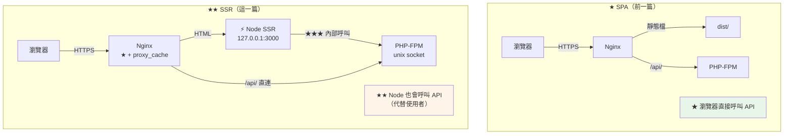

# Nuxt + Laravel SSR 完整部署實戰

> [!abstract] 這篇你會學到
> - **SSR 架構與 SPA 架構的關鍵差異**
> - **★★★ 伺服器端呼叫 API**（內部走 socket，不繞外網）
> - **★★★ Cookie 轉發**（SSR 時代替使用者呼叫 API）
> - **★★ 個人化頁面的快取污染防護**
> - **完整的部署腳本**（Nuxt + Laravel）
> - **SEO 設定**（sitemap、robots、OG tags）
> - 監控與問題排查

## 前置知識

- [[06-Vue-Laravel完整部署實戰]] — LXMP 的完整流程
- [[02-Nuxt-SSR與PM2部署]] — PM2 與 SSR 的管理
- [[03-Nuxt-Nginx反向代理與快取]] — Nginx 層的快取

---

## 架構差異 ★★



| | **SPA** | **★★ SSR** |
| --- | --- | --- |
| 前端執行 | 瀏覽器 | **Node 程序（長駐）** |
| API 呼叫者 | 只有瀏覽器 | **★★ 瀏覽器 + Node** |
| **Cookie 處理** | 瀏覽器自動 | **★★★ Node 要手動轉發** |
| 部署複雜度 | ★ 低 | **★★★ 高**（PM2/systemd） |
| 記憶體 | ~0 | **80～300MB** |
| **快取** | 靜態檔可長快取 | **★★★ HTML 微快取 + 污染風險** |
| SEO | ✗ | **✓** |
| 適用 | 內部系統 | **對外網站** |

```
★★ 本篇的情境：
  網域    https://www.example.gov.tw（★ 對外，需要 SEO）
  前端    Nuxt 3 SSR + Nitro（node-server preset）
          github.com/Information-Study/portal-nuxt
  後端    Laravel 11 API
          github.com/Information-Study/portal-api
  架構    ★★ 同源：/ → Nuxt SSR，/api/ → Laravel
  認證    ★★ Sanctum SPA cookie（★ SSR 要轉發）
  憑證    公信 CA（Let's Encrypt）
```

---

## ★★★ 伺服器端呼叫 API

> [!danger] SSR 呼叫 API 不要繞外網 ★★★
> ```
> ❌ 錯誤：SSR 時也用公開網址
>   useFetch('https://www.example.gov.tw/api/posts')
>   → ★★ Node → Nginx → PHP-FPM
>     → ① 多一次 TLS 握手（★ 每次 SSR 都要）
>     → ② 多一次網路往返
>     → ③ ★★ 若 DNS 指向外部 LB → 流量繞出機房再繞回來
>     → ④ ★ 會被自己的限流擋到
>     → ⑤ ★★★ 可能造成【死結】（Nginx worker 都在等 Node，Node 在等 Nginx）
>
> ✅ ★★★ 正確：走內部通道
>   · Nitro 的 devProxy / routeRules proxy → 內部位址
>   · 或直接呼叫 127.0.0.1 的 Nginx（★ 跳過 TLS）
>   · ★★ 最好：Laravel 另開一個只聽 127.0.0.1 的 HTTP server block
> ```

```nginx
# ═══════ ★★★ 內部專用的 server block（只聽 127.0.0.1）═══════
server {
    listen 127.0.0.1:8080;             # ★★ 只有本機能連
    server_name _;

    # ★ 不需要 TLS（本機通訊）
    root /var/www/portal-api/current/public;
    index index.php;

    access_log /var/log/nginx/api-internal.access.log;

    # ★★ 不限流（★ 內部呼叫）
    location / { try_files $uri $uri/ /index.php?$query_string; }

    location ~ \.php$ {
        try_files $uri =404;
        fastcgi_pass unix:/run/php/php8.3-fpm-api.sock;
        include fastcgi_params;
        fastcgi_param SCRIPT_FILENAME $realpath_root$fastcgi_script_name;
        fastcgi_param DOCUMENT_ROOT   $realpath_root;
        # ★★★ 讓 Laravel 知道原始請求是 HTTPS（★ 由 Node 轉發）
        fastcgi_param HTTPS on;
        fastcgi_read_timeout 30s;      # ★ SSR 不能等太久
    }

    location ~ /\. { deny all; }
}
```

```typescript
// ★★★ nuxt.config.ts
export default defineNuxtConfig({
  runtimeConfig: {
    // ═══ ★★★ 伺服器端專用（★ 不會送到瀏覽器）═══
    internalApiBase: 'http://127.0.0.1:8080',    // ← NUXT_INTERNAL_API_BASE
    apiSecret: '',                                // ← NUXT_API_SECRET

    public: {
      // ═══ ★ 瀏覽器端用（相對路徑，同源）═══
      apiBase: '/api',                            // ← NUXT_PUBLIC_API_BASE
      siteUrl: 'https://www.example.gov.tw',
      appVersion: 'dev',
    },
  },

  routeRules: {
    // ★★ 靜態頁：建置時產生
    '/about':   { prerender: true },
    '/privacy': { prerender: true },

    // ★★ 首頁與列表：ISR
    '/':            { isr: 60 },
    '/news':        { isr: 300 },
    '/news/**':     { isr: 3600 },

    // ★★★ 個人化頁面：絕不快取
    '/account/**':  { ssr: true, headers: { 'Cache-Control': 'no-store, private' } },
    '/member/**':   { ssr: true, headers: { 'Cache-Control': 'no-store, private' } },

    // ★ 後台：純 SPA
    '/dashboard/**': { ssr: false },

    // ★ 靜態資源
    '/_nuxt/**': { headers: { 'Cache-Control': 'public, max-age=31536000, immutable' } },

    // ★ 全站的安全標頭
    '/**': {
      headers: {
        'X-Content-Type-Options': 'nosniff',
        'Referrer-Policy': 'strict-origin-when-cross-origin',
      },
    },
  },

  nitro: {
    preset: 'node-server',
    compressPublicAssets: { gzip: true, brotli: true },
  },

  app: {
    head: {
      htmlAttrs: { lang: 'zh-Hant-TW' },
      meta: [
        { charset: 'utf-8' },
        { name: 'viewport', content: 'width=device-width, initial-scale=1' },
      ],
    },
  },
});
```

```typescript
// ★★★ composables/useApi.ts —— 統一的 API 呼叫
export function useApiFetch<T>(path: string, opts: any = {}) {
  const config = useRuntimeConfig();

  // ★★★ 關鍵：伺服器端走內部位址，客戶端走相對路徑
  const baseURL = import.meta.server
    ? config.internalApiBase            // http://127.0.0.1:8080
    : config.public.apiBase;            // /api

  // ★★★ 伺服器端要手動轉發 cookie（見下方）
  const headers: Record<string, string> = {
    Accept: 'application/json',
    ...(opts.headers ?? {}),
  };

  if (import.meta.server) {
    const event = useRequestEvent();
    const reqHeaders = getRequestHeaders(event!);

    // ★★★ 轉發 cookie（★ 讓 Laravel 認得使用者）
    if (reqHeaders.cookie) headers.cookie = reqHeaders.cookie;

    // ★★ 轉發真實的客戶端資訊
    headers['X-Forwarded-For']   = getRequestIP(event!, { xForwardedFor: true }) ?? '';
    headers['X-Forwarded-Proto'] = 'https';
    headers['X-Forwarded-Host']  = reqHeaders.host ?? '';
    headers['User-Agent']        = reqHeaders['user-agent'] ?? 'Nuxt-SSR';
    // ★ 標記這是 SSR 的請求（★ 後端可用於日誌與限流豁免）
    headers['X-SSR-Request']     = '1';
  }

  return useFetch<T>(path, {
    baseURL,
    headers,
    credentials: import.meta.client ? 'include' : undefined,
    ...opts,
    // ★★ 把 Laravel 回傳的 Set-Cookie 轉發給瀏覽器
    onResponse({ response }) {
      if (import.meta.server) {
        const setCookie = response.headers.getSetCookie?.() ?? [];
        const event = useRequestEvent();
        for (const c of setCookie) appendResponseHeader(event!, 'set-cookie', c);
      }
    },
  });
}
```

> [!danger] Cookie 轉發的三個要點 ★★★
> ```
> ① ★★★ 【請求時】把瀏覽器的 cookie 轉給 Laravel
>      → 否則 Laravel 看到的是「未登入」
>        → ★★ SSR 渲染出「未登入」的頁面
>          → 瀏覽器 hydration 後才變成登入狀態 → ★ 畫面閃爍
>
> ② ★★★ 【回應時】把 Laravel 的 Set-Cookie 轉給瀏覽器
>      → 否則 session 續期、CSRF token 更新都會遺失
>
> ③ ★★★★ 【絕對不要】把 cookie 洩漏到「不該去的地方」
>      → 只轉發給【自己的 API】
>      → ★ 呼叫外部服務時【不要】帶上 cookie
>      → ★★ 這是 SSR 特有的風險（★ SPA 沒有這個問題）
> ```

```typescript
// ★★★ 危險的寫法（★ 會把使用者的 cookie 送到外部服務）
const headers = getRequestHeaders(event);   // ★ 含 cookie
await $fetch('https://external-api.com/data', { headers });   // ✗✗✗ 洩漏！

// ✅ ★★ 呼叫外部服務時明確指定標頭
await $fetch('https://external-api.com/data', {
  headers: { Authorization: `Bearer ${config.externalApiKey}` },   // ★ 只帶必要的
});
```

---

## ★★★ 快取污染防護

> [!danger] SSR 最嚴重的安全問題 ★★★★
> ```
> ★★★★ 情境：
>   ① 使用者 A 登入後存取 /account/profile
>   ② SSR 渲染出【含 A 的姓名、電話、地址】的 HTML
>   ③ ★★ 若 Nginx 或 Nitro 把它快取了
>   ④ 使用者 B（或未登入的訪客）存取同一個網址
>   ⑤ ★★★★ 【拿到 A 的個人資料】
>
> ★★ 三道防線（★ 必須全部都有）：
>   ① Nuxt routeRules：個人化路由設 no-store
>   ② Nginx：$skip_cache 依 cookie/URI/method 判斷
>   ③ Nginx：★★★ 不要設 proxy_ignore_headers Cache-Control
>
> ★★★ 上線前【一定要】用兩個帳號實測
> ```

```nginx
# ═══════ ★★★ 快取繞過的判斷 ═══════
map $http_cookie $skip_cookie {
    default 0;
    # ★★★ 有任何 session cookie 就跳過快取
    "~*(^|;\s*)(portal_session|laravel_session|XSRF-TOKEN|remember_web_)" 1;
}

map $request_method $skip_method {
    default 1;
    GET  0;
    HEAD 0;
}

map $request_uri $skip_uri {
    default 0;
    "~^/(api|account|member|dashboard|auth|login|logout)" 1;   # ★★★
    "~^/_nuxt/image"  0;
}

map "$skip_cookie$skip_method$skip_uri" $skip_cache {
    default 1;
    "000"   0;                          # ★ 三個都是 0 才快取
}
```

```bash
#!/usr/bin/env bash
# ★★★★ 快取污染測試（★ 上線前必做）
S=https://www.example.gov.tw
A=/tmp/user-a.txt
B=/tmp/user-b.txt

# ★ 先用兩個帳號登入並存下 cookie
# curl -c $A -d 'email=a@x.tw&password=...' $S/api/login
# curl -c $B -d 'email=b@x.tw&password=...' $S/api/login

echo "═══ 快取污染測試 ═══"
for p in / /news /account/profile /member/orders /dashboard; do
    echo -e "\n── $p ──"

    ANON=$(curl -sk "$S$p" | md5sum | cut -c1-12)
    S1=$(curl -skI "$S$p" | grep -i x-cache-status | tr -d '\r')

    HA=$(curl -sk -b "$A" "$S$p" | md5sum | cut -c1-12)
    S2=$(curl -skI -b "$A" "$S$p" | grep -i x-cache-status | tr -d '\r')

    HB=$(curl -sk -b "$B" "$S$p" | md5sum | cut -c1-12)
    S3=$(curl -skI -b "$B" "$S$p" | grep -i x-cache-status | tr -d '\r')

    printf '  匿名   %s  %s\n' "$ANON" "$S1"
    printf '  帳號A  %s  %s\n' "$HA" "$S2"
    printf '  帳號B  %s  %s\n' "$HB" "$S3"

    case "$p" in
      /|/news)
        [ "$ANON" = "$HA" ] && echo "  ✓ 公開頁面可共用快取" ;;
      *)
        if [ "$HA" = "$HB" ]; then
            echo "  ✗✗✗✗ 兩個帳號拿到【相同】內容 —— 快取污染！"
        elif [ "$HA" = "$ANON" ]; then
            echo "  ✗✗✗ 登入者拿到匿名的快取"
        else
            echo "  ✓ 各自看到自己的內容"
        fi
        # ★★ 檢查標頭
        curl -skI -b "$A" "$S$p" | grep -qiE 'cache-control:.*(no-store|private)' && \
          echo "  ✓ 有 no-store/private 標頭" || \
          echo "  ✗✗ 缺少 no-store（★ 個人化頁面必須有）"
        ;;
    esac
done
```

---

## 完整的 Nginx 設定

```nginx
# /etc/nginx/sites-available/portal.conf
proxy_cache_path /var/cache/nginx/portal levels=1:2
    keys_zone=portal_cache:100m max_size=2g inactive=10m use_temp_path=off;

upstream nuxt_up {
    server 127.0.0.1:3000 max_fails=3 fail_timeout=15s;
    keepalive 64;
    keepalive_requests 1000;
}

map $http_upgrade $connection_upgrade { default upgrade; '' close; }

# ★★★ 快取繞過（見上方的 map 定義）

limit_req_zone $binary_remote_addr zone=p_page:10m  rate=30r/s;
limit_req_zone $binary_remote_addr zone=p_api:10m   rate=20r/s;
limit_req_zone $binary_remote_addr zone=p_login:10m rate=5r/m;

server {
    listen 80;
    listen [::]:80;
    server_name www.example.gov.tw example.gov.tw;
    location ^~ /.well-known/acme-challenge/ { root /var/www/certbot; }
    location / { return 301 https://www.example.gov.tw$request_uri; }
}

# ★ 裸網域轉址到 www
server {
    listen 443 ssl;
    http2 on;
    server_name example.gov.tw;
    ssl_certificate     /etc/letsencrypt/live/www.example.gov.tw/fullchain.pem;
    ssl_certificate_key /etc/letsencrypt/live/www.example.gov.tw/privkey.pem;
    return 301 https://www.example.gov.tw$request_uri;
}

server {
    listen 443 ssl;
    listen [::]:443 ssl;
    listen 443 quic reuseport;
    http2 on;
    http3 on;
    server_name www.example.gov.tw;

    # ═══ TLS（★ 公信 CA）═══
    ssl_certificate         /etc/letsencrypt/live/www.example.gov.tw/fullchain.pem;
    ssl_certificate_key     /etc/letsencrypt/live/www.example.gov.tw/privkey.pem;
    ssl_trusted_certificate /etc/letsencrypt/live/www.example.gov.tw/chain.pem;
    ssl_protocols           TLSv1.2 TLSv1.3;
    ssl_ciphers             ECDHE-ECDSA-AES128-GCM-SHA256:ECDHE-RSA-AES128-GCM-SHA256:ECDHE-ECDSA-AES256-GCM-SHA384:ECDHE-RSA-AES256-GCM-SHA384:ECDHE-ECDSA-CHACHA20-POLY1305;
    ssl_prefer_server_ciphers off;
    ssl_session_cache       shared:SSL:20m;
    ssl_session_tickets     off;

    # ★★ 公信 CA 可以開 OCSP stapling
    ssl_stapling on;
    ssl_stapling_verify on;
    resolver 8.8.8.8 1.1.1.1 valid=300s;
    resolver_timeout 5s;

    add_header Alt-Svc 'h3=":443"; ma=86400' always;
    include snippets/security-headers.conf;

    root /var/www/portal-nuxt/current/.output/public;

    access_log /var/log/nginx/portal.access.log;
    error_log  /var/log/nginx/portal.error.log warn;

    client_max_body_size 20m;
    gzip on; gzip_static on; gzip_vary on;
    gzip_types text/css application/json application/javascript image/svg+xml font/woff2;

    modsecurity on;
    modsecurity_rules_file /etc/nginx/modsec/main.conf;

    # ═══════ ① 精確 ═══════
    location = /healthz {
        access_log off; modsecurity off;
        proxy_pass http://nuxt_up;
        proxy_http_version 1.1;
        proxy_set_header Connection "";
        proxy_set_header Host $host;
        proxy_cache off;
    }
    location = /robots.txt {
        root /var/www/portal-nuxt/current/.output/public;
        try_files $uri @nuxt;
        access_log off;
    }
    location = /sitemap.xml {
        proxy_pass http://nuxt_up;
        proxy_http_version 1.1;
        proxy_set_header Connection "";
        proxy_set_header Host $host;
        proxy_cache portal_cache;
        proxy_cache_valid 200 1h;
    }
    location = /favicon.ico { access_log off; log_not_found off; expires 30d; }

    # ═══════ ② ★★★ Nuxt 的靜態產物（Nginx 直送）═══════
    location ^~ /_nuxt/ {
        try_files $uri =404;
        expires 1y;
        add_header Cache-Control "public, max-age=31536000, immutable";
        include snippets/security-headers.conf;
        access_log off;
        gzip_static on;
    }

    # ═══════ ② ★★ Laravel API ═══════
    location ^~ /api/login {
        limit_req zone=p_login burst=3 nodelay;
        root /var/www/portal-api/current/public;
        try_files $uri /index.php?$query_string;
    }

    location ^~ /api/ {
        limit_req zone=p_api burst=40 nodelay;
        root /var/www/portal-api/current/public;
        try_files $uri /index.php?$query_string;
        proxy_cache off;
        add_header Cache-Control "no-store" always;

        location ~ \.php$ {
            root /var/www/portal-api/current/public;
            try_files $uri =404;
            fastcgi_pass unix:/run/php/php8.3-fpm-api.sock;
            include fastcgi_params;
            fastcgi_param SCRIPT_FILENAME $realpath_root$fastcgi_script_name;
            fastcgi_param DOCUMENT_ROOT   $realpath_root;
            fastcgi_param HTTPS on;
            fastcgi_read_timeout 60s;
            include snippets/security-headers.conf;
        }
    }

    location = /sanctum/csrf-cookie {
        root /var/www/portal-api/current/public;
        try_files $uri /index.php?$query_string;
    }

    location ^~ /storage/ {
        alias /var/www/portal-api/shared/storage/app/public/;
        try_files $uri =404;
        expires 7d;
        add_header Cache-Control "public, max-age=604800";
        add_header Content-Disposition "attachment" always;
        include snippets/security-headers.conf;
        location ~ \.(php|phtml|phar|php\d)$ { deny all; }
    }

    # ═══════ ③ 安全 ═══════
    location ~ /\.(?!well-known) { deny all; access_log off; }
    location ~ \.(map|env|log|sql|lock)$ { deny all; access_log off; }

    # ═══════ ④ ★★ 其他都給 Nuxt ═══════
    location / {
        limit_req zone=p_page burst=50 nodelay;
        try_files $uri @nuxt;
    }

    # ═══════ ★★★ Nuxt SSR ═══════
    location @nuxt {
        proxy_pass http://nuxt_up;

        # ★★★ keepalive
        proxy_http_version 1.1;
        proxy_set_header Connection "";

        proxy_set_header Host              $host;
        proxy_set_header X-Real-IP         $remote_addr;
        proxy_set_header X-Forwarded-For   $proxy_add_x_forwarded_for;
        proxy_set_header X-Forwarded-Proto $scheme;
        proxy_set_header X-Forwarded-Host  $host;

        proxy_connect_timeout 5s;
        proxy_send_timeout    30s;
        proxy_read_timeout    30s;

        proxy_buffering on;
        proxy_buffer_size       16k;
        proxy_buffers        8  16k;

        # ═══ ★★★ 微快取 ═══
        proxy_cache portal_cache;
        proxy_cache_key "$scheme$request_method$host$request_uri";
        proxy_cache_valid 200 301 302 5s;
        proxy_cache_valid 404 10s;
        proxy_cache_bypass $skip_cache;         # ★★★
        proxy_no_cache     $skip_cache;         # ★★★
        proxy_cache_lock on;
        proxy_cache_lock_timeout 5s;
        proxy_cache_use_stale error timeout updating http_500 http_502 http_503 http_504;
        proxy_cache_background_update on;
        proxy_cache_revalidate on;

        add_header X-Cache-Status $upstream_cache_status always;
        add_header X-Cache-Skip   $skip_cache always;
        include snippets/security-headers.conf;
    }
}
```

---

## PM2 設定

```javascript
// /var/www/portal-nuxt/shared/ecosystem.config.cjs
module.exports = {
  apps: [{
    name: 'portal-nuxt',
    script: '/var/www/portal-nuxt/current/.output/server/index.mjs',
    cwd: '/var/www/portal-nuxt/current',

    exec_mode: 'cluster',
    instances: 2,                              // ★ 4 核心留 2 給 PHP-FPM

    wait_ready: true,                          // ★★★
    listen_timeout: 15000,
    kill_timeout: 10000,                       // ★★

    env: {
      NODE_ENV: 'production',
      HOST: '127.0.0.1',                       // ★★★ 絕不用 0.0.0.0
      PORT: 3000,
      TZ: 'Asia/Taipei',
      NUXT_TELEMETRY_DISABLED: '1',

      // ★★★ 內部 API（★ 不繞外網）
      NUXT_INTERNAL_API_BASE: 'http://127.0.0.1:8080',
      NUXT_PUBLIC_API_BASE: '/api',
      NUXT_PUBLIC_SITE_URL: 'https://www.example.gov.tw',
      NUXT_PUBLIC_APP_ENV: 'production',

      // ★ 內部 CA（若要呼叫其他內部 HTTPS 服務）
      NODE_EXTRA_CA_CERTS: '/usr/local/share/ca-certificates/internal-ca.crt',
    },

    max_memory_restart: '700M',                // ★★
    min_uptime: 10000,
    max_restarts: 10,
    restart_delay: 3000,
    exp_backoff_restart_delay: 200,

    out_file: '/var/log/portal-nuxt/out.log',
    error_file: '/var/log/portal-nuxt/error.log',
    merge_logs: true,
    log_date_format: 'YYYY-MM-DD HH:mm:ss Z',
    time: true,
    watch: false,

    node_args: ['--max-old-space-size=600'],
  }],
};
```

```typescript
// ★★★ server/plugins/graceful.ts
export default defineNitroPlugin((nitroApp) => {
  let down = false, active = 0;

  nitroApp.hooks.hook('request',       () => { active++; });
  nitroApp.hooks.hook('afterResponse', () => { active--; });

  nitroApp.hooks.hook('listen', () => {
    console.log('[graceful] 已就緒');
    if (process.send) process.send('ready');   // ★★★ wait_ready 必須
  });

  async function shutdown(sig: string) {
    if (down) return; down = true;
    console.log(`[graceful] ${sig} → 關閉中（${active} 個進行中）`);
    const dl = Date.now() + 8000;
    while (active > 0 && Date.now() < dl) await new Promise(r => setTimeout(r, 200));
    try { await nitroApp.hooks.callHook('close'); } catch {}
    process.exit(0);
  }

  process.on('SIGINT',  () => shutdown('SIGINT'));    // ★★ PM2
  process.on('SIGTERM', () => shutdown('SIGTERM'));   // ★ systemd/Docker
});
```

---

## 部署腳本 ★★★

```bash
#!/usr/bin/env bash
# /usr/local/bin/deploy-portal —— Nuxt SSR + Laravel 完整部署
set -euo pipefail

API=/var/www/portal-api
NUXT=/var/www/portal-nuxt
API_REPO="github-portal-api:Information-Study/portal-api.git"
NUXT_REPO="github-portal-nuxt:Information-Study/portal-nuxt.git"
BRANCH="${1:-main}"
SITE=https://www.example.gov.tw
PHP_V=8.3
KEEP=5
TS=$(date +%Y%m%d-%H%M%S)
API_REL="$API/releases/$TS"
NUXT_REL="$NUXT/releases/$TS"

c(){ echo -e "\033[36m[$(date +%T)]\033[0m $*"; }
ok(){ echo -e "\033[32m    ✓ $*\033[0m"; }
er(){ echo -e "\033[31m    ✗ $*\033[0m"; }
die(){ echo -e "\033[31m✗✗ $*\033[0m" >&2; exit 1; }

exec 200>/var/lock/deploy-portal.lock
flock -n 200 || die "已有部署在進行中"
START=$(date +%s)

c "═══════ Portal 部署（$BRANCH）═══════"

# ══ 【0】前置 ══
[ "$(whoami)" = deploy ] || die "必須用 deploy 使用者"
grep -q '^APP_DEBUG=false' "$API/shared/.env" || die "★★★ APP_DEBUG 不是 false"

# ══ 【1】備份 ══
c "【1】資料庫備份"
mkdir -p /backup/db
DB_N=$(grep '^DB_DATABASE=' "$API/shared/.env" | cut -d= -f2-)
DB_U=$(grep '^DB_USERNAME=' "$API/shared/.env" | cut -d= -f2-)
DB_P=$(grep '^DB_PASSWORD=' "$API/shared/.env" | cut -d= -f2-)
BAK=/backup/db/$DB_N-$TS.sql.gz
MYSQL_PWD="$DB_P" mysqldump -h 127.0.0.1 -u "$DB_U" --single-transaction \
    --routines --triggers --no-tablespaces "$DB_N" | gzip > "$BAK"
ok "$BAK"

# ══ 【2】後端 ══
c "【2】後端"
mkdir -p "$API_REL"
git clone --depth 1 -b "$BRANCH" --single-branch "$API_REPO" "$API_REL" 2>&1|sed 's/^/    /'
API_C=$(cd "$API_REL" && git rev-parse --short HEAD); rm -rf "$API_REL/.git"
ln -sfn "$API/shared/.env" "$API_REL/.env"
rm -rf "$API_REL/storage" && ln -sfn "$API/shared/storage" "$API_REL/storage"
cd "$API_REL"
COMPOSER_MEMORY_LIMIT=-1 composer install --no-dev --optimize-autoloader \
    --no-interaction --prefer-dist --no-progress 2>&1|tail -4|sed 's/^/    /'
ok "$API_C"

# ══ 【3】Nuxt ══
c "【3】Nuxt"
mkdir -p "$NUXT_REL"
git clone --depth 1 -b "$BRANCH" --single-branch "$NUXT_REPO" "$NUXT_REL" 2>&1|sed 's/^/    /'
NUXT_C=$(cd "$NUXT_REL" && git rev-parse --short HEAD); rm -rf "$NUXT_REL/.git"
cd "$NUXT_REL"
npm ci --no-audit --no-fund 2>&1|tail -3|sed 's/^/    /'
NUXT_PUBLIC_APP_VERSION="$NUXT_C" NODE_OPTIONS="--max-old-space-size=4096" \
  npm run build 2>&1|tail -12|sed 's/^/    /'
[ -f "$NUXT_REL/.output/server/index.mjs" ] || die "找不到 .output/server/index.mjs"

# ★★★ 秘密掃描
grep -rlE 'apiSecret|NUXT_API_SECRET|sk_live|-----BEGIN' "$NUXT_REL/.output/public/" 2>/dev/null && \
  die "★★★ 秘密洩漏到客戶端產物"
find "$NUXT_REL/.output/public" -name '*.map' -delete 2>/dev/null || true
rm -rf "$NUXT_REL/node_modules" "$NUXT_REL/.nuxt"
ok "$NUXT_C（$(du -sh "$NUXT_REL/.output"|cut -f1)）"

# ══ 【4】遷移與最佳化 ══
c "【4】遷移與最佳化"
cd "$API_REL"
P=$(php artisan migrate:status 2>/dev/null | grep -c Pending || echo 0)
[ "$P" -gt 0 ] && php artisan migrate --force --no-interaction 2>&1|sed 's/^/    /'
php artisan optimize 2>&1|sed 's/^/    /'
php artisan storage:link 2>/dev/null || true
ok "完成"

# ══ 【5】權限 ══
c "【5】權限"
for R in "$API_REL" "$NUXT_REL"; do
    find "$R" -type d -exec chmod 750 {} \;
    find "$R" -type f -exec chmod 640 {} \;
done
chmod 755 "$API_REL/artisan" "$NUXT_REL/.output/server/index.mjs"
chmod -R 770 "$API_REL/bootstrap/cache" "$API/shared/storage"
chmod -R o+rX "$NUXT_REL/.output/public"           # ★ Nginx 要能讀
ok "完成"

# ══ 【6】★★★ 煙霧測試 ══
c "【6】★★★ 煙霧測試"
FAIL=0
s(){ printf '    %-40s ' "$1"; eval "$2" >/dev/null 2>&1 && echo "✓" || { echo "✗"; FAIL=1; }; }
s "artisan 可執行"     "php '$API_REL/artisan' --version"
s "★ DB 可連線"         "php '$API_REL/artisan' db:show"
s "config 快取"        "[ -f '$API_REL/bootstrap/cache/config.php' ]"

# ★★★ Nuxt 在暫時的埠上啟動測試
c "    ★★ Nuxt 啟動測試（127.0.0.1:3999）"
HOST=127.0.0.1 PORT=3999 NODE_ENV=production \
  NUXT_INTERNAL_API_BASE=http://127.0.0.1:8080 \
  node "$NUXT_REL/.output/server/index.mjs" > /tmp/nuxt-smoke.log 2>&1 &
SM=$!
trap "kill $SM 2>/dev/null||true" EXIT
OK=0
for i in $(seq 1 30); do
    curl -sf -o /dev/null --max-time 3 http://127.0.0.1:3999/ && { OK=1; break; }
    kill -0 $SM 2>/dev/null || break
    sleep 1
done
if [ "$OK" != 1 ]; then
    tail -25 /tmp/nuxt-smoke.log | sed 's/^/      /'
    kill $SM 2>/dev/null || true
    die "★★ Nuxt 無法啟動"
fi
curl -s http://127.0.0.1:3999/ | grep -q '<div id="__nuxt">' && \
  ok "SSR 渲染正常（RSS $(( $(ps -o rss= -p $SM|tr -d ' ')/1024 )) MB）" || \
  er "⚠ HTML 結構異常"
kill $SM 2>/dev/null || true; trap - EXIT; sleep 1

[ "$FAIL" -eq 0 ] || die "煙霧測試失敗，不切換"

# ══ 【7】★★★ 原子切換 ══
API_PREV=$(readlink "$API/current" 2>/dev/null||echo "")
NUXT_PREV=$(readlink "$NUXT/current" 2>/dev/null||echo "")
c "【7】★★★ 原子切換"
ln -sfn "$API_REL" "$API/current.tmp" && mv -Tf "$API/current.tmp" "$API/current"
ln -sfn "$NUXT_REL" "$NUXT/current.tmp" && mv -Tf "$NUXT/current.tmp" "$NUXT/current"
ok "完成"

# ══ 【8】★★★ 重載 ══
c "【8】★★★ 重載"
sudo systemctl reload "php$PHP_V-fpm" && ok "php-fpm"
pm2 reload "$NUXT/shared/ecosystem.config.cjs" --update-env 2>&1|tail -4|sed 's/^/    /'
pm2 save >/dev/null 2>&1                            # ★★★
ok "pm2（零停機重載）"
sudo nginx -t && sudo systemctl reload nginx && ok "nginx"
# ★★ 清 proxy_cache（★ 內容變了）
sudo find /var/cache/nginx/portal -mindepth 1 -type f -delete 2>/dev/null || true
ok "proxy_cache 已清除"
php "$API/current/artisan" queue:restart 2>/dev/null || true
sleep 3
sudo supervisorctl restart laravel-workers: 2>/dev/null || true
ok "queue workers"

# ══ 【9】★★★ 驗證 ══
c "【9】★★★ 驗證"
sleep 4
FAIL=0
v(){ printf '    %-44s ' "$1"; eval "$2" >/dev/null 2>&1 && echo "✓" || { echo "✗"; FAIL=1; }; }

v "首頁 200"           "[ \"\$(curl -sko /dev/null -w '%{http_code}' --max-time 25 $SITE/)\" = 200 ]"
v "★★★ SSR 有渲染內容"  "curl -sk --max-time 25 $SITE/ | grep -q '<div id=\"__nuxt\"><'"
v "★ 版本正確"         "curl -sk $SITE/ | grep -q '$NUXT_C'"
v "★★ API 健康檢查"     "[ \"\$(curl -sko /dev/null -w '%{http_code}' $SITE/api/health/live)\" = 200 ]"
v "★★ API 回 JSON"      "curl -sk $SITE/api/health/live | jq -e .status"
v "★★★ 只聽 127.0.0.1"  "! ss -tln | grep -qE '0\.0\.0\.0:3000|\*:3000'"
v "★★ _nuxt 資源"       "[ \"\$(curl -sko /dev/null -w '%{http_code}' $SITE/_nuxt/)\" != 502 ]"
v "★★★ .env 擋住"       "[ \"\$(curl -sko /dev/null -w '%{http_code}' $SITE/.env)\" != 200 ]"
v "★ 個人化頁面不快取"  "curl -skI $SITE/account/profile | grep -qiE 'cache-control:.*(no-store|private)'"
v "★ sitemap"          "[ \"\$(curl -sko /dev/null -w '%{http_code}' $SITE/sitemap.xml)\" = 200 ]"

ST=$(pm2 jlist | jq -r '.[]|select(.name=="portal-nuxt")|.pm2_env.status' | head -1)
printf '    %-44s %s\n' "PM2 狀態" "$ST"
[ "$ST" = online ] || FAIL=1

# ══ 【10】回退 ══
if [ "$FAIL" != 0 ]; then
    er "✗✗ 驗證失敗 —— 回退"
    pm2 logs portal-nuxt --lines 25 --nostream 2>/dev/null|tail -25|sed 's/^/      /'
    tail -20 "$API/shared/storage/logs/laravel-$(date +%Y-%m-%d).log" 2>/dev/null|sed 's/^/      /'
    [ -n "$API_PREV" ] && { ln -sfn "$API_PREV" "$API/current.tmp"; mv -Tf "$API/current.tmp" "$API/current"; }
    [ -n "$NUXT_PREV" ] && { ln -sfn "$NUXT_PREV" "$NUXT/current.tmp"; mv -Tf "$NUXT/current.tmp" "$NUXT/current"; }
    sudo systemctl reload "php$PHP_V-fpm"
    pm2 reload "$NUXT/shared/ecosystem.config.cjs" --update-env; pm2 save >/dev/null
    sudo find /var/cache/nginx/portal -mindepth 1 -type f -delete 2>/dev/null || true
    er "已回退"
    exit 1
fi

# ══ 【11】清理 ══
for D in "$API/releases" "$NUXT/releases"; do
    (cd "$D" && ls -1dt */ 2>/dev/null|tail -n +$((KEEP+1))|while read -r d; do rm -rf "$d"; done)
done

c "═══════ ✓ 完成（$(( $(date +%s) - START ))s）═══════"
echo "  後端 $API_C / 前端 $NUXT_C"
pm2 list | sed 's/^/  /'
```

---

## SEO 設定 ★

```typescript
// ★ nuxt.config.ts
export default defineNuxtConfig({
  modules: ['@nuxtjs/seo'],           // ★ 或個別安裝 sitemap / robots

  site: {
    url: 'https://www.example.gov.tw',
    name: '機關入口網',
    description: '...',
    defaultLocale: 'zh-TW',
  },

  robots: {
    // ★★ 明確擋掉不該被索引的
    disallow: ['/account', '/member', '/dashboard', '/api'],
  },

  sitemap: {
    exclude: ['/account/**', '/member/**', '/dashboard/**'],
    // ★ 動態路由
    urls: async () => {
      const posts = await $fetch('/api/sitemap-urls', {
        baseURL: process.env.NUXT_INTERNAL_API_BASE,   // ★★ 內部呼叫
      });
      return posts;
    },
  },
});
```

```vue
<script setup lang="ts">
// ★ 每個頁面的 SEO
const { data: post } = await useApiFetch(`/posts/${route.params.slug}`);

useSeoMeta({
  title: () => post.value?.title,
  description: () => post.value?.excerpt,
  ogTitle: () => post.value?.title,
  ogDescription: () => post.value?.excerpt,
  ogImage: () => post.value?.cover_url,
  ogType: 'article',
  twitterCard: 'summary_large_image',
});

// ★ 結構化資料
useHead({
  script: [{
    type: 'application/ld+json',
    innerHTML: computed(() => JSON.stringify({
      '@context': 'https://schema.org',
      '@type': 'NewsArticle',
      headline: post.value?.title,
      datePublished: post.value?.published_at,
    })),
  }],
});
</script>
```

```bash
# ★ 驗證 SEO
$ curl -s https://www.example.gov.tw/ | grep -oE '<title>[^<]*|<meta name="description"[^>]*'
$ curl -s https://www.example.gov.tw/robots.txt
$ curl -s https://www.example.gov.tw/sitemap.xml | head -20
$ curl -s https://www.example.gov.tw/news/xxx | grep -c 'application/ld+json'
```

---

## 常見錯誤與排錯

| 現象 | 原因 | 解法 |
| --- | --- | --- |
| **SSR 頁面顯示「未登入」** ★★★ | 沒轉發 cookie | `headers.cookie = reqHeaders.cookie` |
| **SSR 呼叫 API 很慢** ★★ | 繞外網 | 用 `127.0.0.1:8080` 內部位址 |
| **★★★★ 使用者看到別人的資料** | 快取污染 | 三道防線 + 兩帳號測試 |
| **Node 可繞過 Nginx** ★★★ | `HOST=0.0.0.0` | 改 `127.0.0.1` |
| **`pm2 reload` 有 502** ★★★ | 沒送 `ready` | Nitro plugin + `wait_ready` |
| **秘密洩漏到客戶端** ★★★ | 放在 `runtimeConfig.public` | 移到 public 外面 |
| Hydration mismatch ★★ | 兩端渲染不同 | `<ClientOnly>`；用 `useFetch` |
| **記憶體持續增長** ★★ | SSR 洩漏 | `max_memory_restart` |
| 靜態資源走 Node ★★ | 沒設 `location ^~ /_nuxt/` | 加上 |
| **開機後跑舊設定** ★★ | 沒 `pm2 save` | reload 後 save |
| **cookie 洩漏到外部服務** ★★★★ | 轉發了整個 headers | 只帶必要的標頭 |

### 排查

```bash
S=https://www.example.gov.tw

# 【1】★★★ SSR 有沒有渲染
$ curl -s "$S/" | grep -oE '<div id="__nuxt">.{0,80}'
# ★ 有內容 = SSR 成功；空的 = SPA 或渲染失敗

# 【2】★★★ 快取狀態與污染
$ for p in / /news /account/profile; do
    printf '%-20s %s %s\n' "$p" \
      "$(curl -skI "$S$p" | grep -i x-cache-status | tr -d '\r')" \
      "$(curl -skI "$S$p" | grep -i x-cache-skip | tr -d '\r')"
  done

# 【3】★★ SSR 是否走內部 API
$ sudo tail -f /var/log/nginx/api-internal.access.log &
$ curl -sk "$S/news" -o /dev/null
# ★★ 應該看到 127.0.0.1 的請求（★ 不是 SSR 繞外網）

# 【4】★★★ 網路綁定
$ sudo ss -tlnp | grep -E '3000|8080'
127.0.0.1:3000    # ★★ Nuxt
127.0.0.1:8080    # ★★ 內部 API

# 【5】PM2
$ pm2 list && pm2 describe portal-nuxt | grep -E 'status|restarts|memory'
$ pm2 logs portal-nuxt --lines 40

# 【6】★ 記憶體趨勢
$ for i in $(seq 1 5); do
    pm2 jlist | jq -r '[.[]|select(.name=="portal-nuxt")|.monit.memory]|add/1048576|floor'
    sleep 10
  done
```

---

## 速查表

### ★★★ SSR 特有的四件事

```
① ★★★ 內部 API 呼叫走 127.0.0.1:8080（不繞外網）
② ★★★ Cookie 轉發（請求時帶進去、回應時帶出來）
③ ★★★★ 快取污染防護（三道防線 + 兩帳號測試）
④ ★★★ HOST=127.0.0.1（不能被繞過 Nginx）
```

### 內部 API

```nginx
server {
    listen 127.0.0.1:8080;         # ★★ 只聽本機，不用 TLS
    root /var/www/portal-api/current/public;
    location ~ \.php$ {
        try_files $uri =404;
        fastcgi_pass unix:/run/php/php8.3-fpm-api.sock;
        fastcgi_param HTTPS on;    # ★★★ 由 Node 轉發
    }
}
```
```typescript
const baseURL = import.meta.server
  ? config.internalApiBase        // http://127.0.0.1:8080
  : config.public.apiBase;        // /api
```

### ★★★ Cookie 轉發

```typescript
if (import.meta.server) {
  const h = getRequestHeaders(useRequestEvent()!);
  headers.cookie = h.cookie;                      // ★★★ 帶進去
  headers['X-Forwarded-For'] = getRequestIP(...);
}
onResponse({ response }) {
  for (const c of response.headers.getSetCookie?.() ?? [])
    appendResponseHeader(event!, 'set-cookie', c);   // ★★★ 帶出來
}
```

```
★★★★ 只轉發給【自己的 API】，呼叫外部服務時不要帶 cookie
```

### 快取污染防護

```typescript
// ★ Nuxt
'/account/**': { ssr: true, headers: { 'Cache-Control': 'no-store, private' } },
```
```nginx
# ★★ Nginx
map $http_cookie $skip_cookie { default 0; "~*(portal_session|XSRF-TOKEN)" 1; }
map $request_uri $skip_uri { default 0; "~^/(api|account|member|dashboard)" 1; }
proxy_cache_bypass $skip_cache;
proxy_no_cache     $skip_cache;
```
```
★★★ 絕不設 proxy_ignore_headers Cache-Control / Set-Cookie
★★★★ 上線前用兩個帳號實測
```

### PM2

```javascript
HOST: '127.0.0.1',              // ★★★
wait_ready: true,               // ★★★ 零停機必須
kill_timeout: 10000,
max_memory_restart: '700M',
NUXT_INTERNAL_API_BASE: 'http://127.0.0.1:8080',   // ★★★
```
```bash
pm2 reload ecosystem.config.cjs --update-env && pm2 save   # ★★★
```

### 部署後重載

```bash
sudo systemctl reload php8.3-fpm
pm2 reload ... && pm2 save                          # ★★★
sudo nginx -t && sudo systemctl reload nginx
sudo find /var/cache/nginx/portal -type f -delete   # ★★ 清 HTML 快取
php artisan queue:restart && sudo supervisorctl restart laravel-workers:
```

---

## 練習題

> [!question]- 練習 1：內部 API 呼叫 ★★★
> 1. **讓 SSR 用公開網址呼叫 API**
> 2. `tail -f /var/log/nginx/portal.access.log` → **看到 SSR 的請求嗎？**
> 3. 測量首頁的 TTFB
> 4. 改成 `127.0.0.1:8080` → 再測
> 5. **快了多少？**
> 6. **故意讓限流很嚴格** → SSR 會被自己的限流擋到嗎？

> [!question]- 練習 2：Cookie 轉發 ★★★
> 1. **不轉發 cookie**，登入後存取 `/account/profile`
> 2. `curl -s | grep` → **HTML 裡顯示登入還是未登入？**
> 3. 用瀏覽器看 → **有閃爍嗎？**（SSR 顯示未登入 → hydration 後變登入）
> 4. 加上 cookie 轉發 → 再測
> 5. **測試 `Set-Cookie` 的轉發**（讓 API 更新 session）

> [!question]- 練習 3：快取污染 ★★★★
> **★ 在測試環境**
> 1. **拿掉所有的 `$skip_cache` 判斷**
> 2. 用帳號 A 存取 `/account/profile`
> 3. **用帳號 B（無痕）存取同一個網址** → **看到誰的資料？**
> 4. 加回三道防線 → 再測
> 5. **執行完整的兩帳號測試腳本**
> 6. **把這個測試加進部署流程**

> [!question]- 練習 4：`pm2 reload` 的零停機
> 1. **不實作 `process.send('ready')`**
> 2. 開持續請求的迴圈，`pm2 reload` → **有 502 嗎？**
> 3. 實作 ready 訊號 + `wait_ready: true` → 再測
> 4. 加上優雅關閉（處理 SIGINT）
> 5. **在一個慢的 API 上測試** → 請求被砍了嗎？

> [!question]- 練習 5：完整部署
> 1. 執行 `deploy-portal main`
> 2. **故意讓 Nuxt 煙霧測試失敗** → 有切換嗎？
> 3. 故意讓部署後驗證失敗 → 自動回退了嗎？
> 4. **測量切換瞬間的中斷**
> 5. 驗證 SEO（sitemap、robots、OG tags）

---

## 小測驗

Q1. **SSR 與 SPA 在「API 呼叫者」上有什麼根本差異**？

Q2. **SSR 為什麼不能用公開網址呼叫自己的 API**？

Q3. **Cookie 轉發要做哪兩個方向**？

Q4. **Cookie 轉發最危險的錯誤是什麼**？

Q5. **快取污染是什麼？三道防線是什麼**？

Q6. **為什麼 Nuxt 的 `HOST` 要設 `127.0.0.1`**？

Q7. **`pm2 reload` 要零停機需要什麼**？

Q8. **部署後除了 FPM 與 Nginx，還要重載什麼**？

Q9. **為什麼部署後要清 `proxy_cache`**？

Q10. **這個架構為什麼要用 SSR 而不是 SPA**？

> [!question]- 測驗答案
> **Q1.** **SPA：只有瀏覽器會呼叫 API**；
> **SSR：瀏覽器「與」Node 程序都會呼叫 API** ——
> Node 在渲染頁面時**代替使用者**去取得資料。
> **這造成三個 SSR 特有的問題**：
> ①**API 呼叫的路徑選擇**（走外網還是內部通道）；
> ②**★★★ Cookie 轉發**（Node 要把瀏覽器的 cookie 帶給 API，
> 再把 API 的 `Set-Cookie` 帶回瀏覽器）；
> ③**★★★★ 快取污染風險**（Node 渲染出的 HTML 含個人化內容，一旦被快取就會外洩）。
> SPA 完全沒有這三個問題（瀏覽器自己管 cookie，HTML 是靜態的）。
>
> **Q2.** 因為**流量會繞一大圈，而且可能造成死結**：
> `Node → Nginx（TLS 握手）→ PHP-FPM`，
> ①**每次 SSR 都要做一次 TLS 握手**（成本高）；
> ②**多一次網路往返**；
> ③**如果 DNS 指向外部的負載平衡器，流量會繞出機房再繞回來**；
> ④**會被自己的限流擋到**（SSR 的請求都來自同一個 IP）；
> ⑤**★★★ 可能造成死結** —— Nginx 的 worker 都在等 Node 回應，
> 而 Node 在等 Nginx 處理它發出的 API 請求。
> **正確做法**：另開一個**只聽 `127.0.0.1:8080` 的 HTTP server block**
> （不用 TLS、不限流），Node 直接呼叫它。
>
> **Q3.** ①**★★★ 請求時：把瀏覽器的 cookie 轉給 Laravel** ——
> `headers.cookie = getRequestHeaders(event).cookie`。
> 不做的話 Laravel 看到的是「未登入」，
> **SSR 會渲染出未登入的頁面**，瀏覽器 hydration 後才變成登入狀態 →
> **畫面閃爍**，而且個人化內容的首屏是錯的。
> ②**★★★ 回應時：把 Laravel 的 `Set-Cookie` 轉回瀏覽器** ——
> ```typescript
> for (const c of response.headers.getSetCookie?.() ?? [])
>     appendResponseHeader(event!, 'set-cookie', c);
> ```
> 不做的話**session 續期、CSRF token 更新都會遺失**。
>
> **Q4.** **把「整個 request headers」（含 cookie）轉發給「外部服務」**：
> ```typescript
> const headers = getRequestHeaders(event);          // ★ 含 cookie
> await $fetch('https://external-api.com/data', { headers });   // ✗✗✗✗
> ```
> **這會把使用者的 session cookie 送到第三方伺服器** ——
> 對方可以直接拿它冒用該使用者的身分。
> **這是 SSR 特有的風險**（SPA 完全沒有這個問題，
> 因為瀏覽器的同源政策會阻止 cookie 跨站送出）。
> **正確做法**：
> **只轉發給自己的 API**；呼叫外部服務時**明確指定要帶的標頭**：
> ```typescript
> await $fetch(externalUrl, { headers: { Authorization: `Bearer ${config.externalApiKey}` } });
> ```
>
> **Q5.** **快取污染 = 某個使用者的個人化 HTML 被快取，後續其他使用者拿到它**。
> **情境**：A 登入後存取 `/account/profile` →
> SSR 渲染出含 **A 的姓名、電話、地址**的 HTML →
> **被 Nginx 或 Nitro 快取** →
> B（或未登入的訪客）存取同一個網址 → **拿到 A 的個人資料**。
> **三道防線（必須全部都有）**：
> ①**Nuxt `routeRules`** —— 個人化路由設
> `{ ssr: true, headers: { 'Cache-Control': 'no-store, private' } }`；
> ②**Nginx 的 `$skip_cache`** ——
> 依 cookie（有 session 就跳過）、URI（`/account`、`/member`）、method 判斷，
> 同時設 `proxy_cache_bypass` 與 **`proxy_no_cache`**；
> ③**Nginx 尊重後端的 `Cache-Control`** ——
> **絕不設 `proxy_ignore_headers Cache-Control`**。
> **上線前一定要用兩個帳號實測**。
>
> **Q6.** 因為 **`HOST=0.0.0.0` 會讓 Node 綁定在所有網路介面上** ——
> 任何人可以直接 `http://伺服器IP:3000/` **繞過 Nginx**，
> 因而繞過：**TLS 加密、ModSecurity WAF、proxy_cache、限流、
> 所有安全標頭、存取日誌**。
> **設 `127.0.0.1` 後只有本機能連**，流量必須經過 Nginx。
> **注意這與「容器部署要用 `0.0.0.0`」不衝突** ——
> 容器有自己的網路命名空間，隔離靠的是「不 publish 埠」。
> **驗證**：`ss -tlnp | grep 3000` 應該顯示 `127.0.0.1:3000`。
>
> **Q7.** **兩個條件缺一不可**：
> ①**程式在「真的能接受請求後」送出 `process.send('ready')`**
> （並在 ecosystem 設 `wait_ready: true`）——
> 否則 PM2 會**太早**把流量切到新實例，請求打到還沒 listen 完成的程序 → **502**；
> ②**處理 `SIGINT` 做優雅關閉** ——
> 等待進行中的請求完成再退出，並把 **`kill_timeout` 調大**
> （預設 1600ms 太短，建議 8000～10000）。
> 在 Nuxt 中用 **Nitro plugin** 實作：
> ```typescript
> nitroApp.hooks.hook('listen', () => { if (process.send) process.send('ready'); });
> process.on('SIGINT', () => shutdown());
> ```
>
> **Q8.** ①**`pm2 reload` + `pm2 save`** ——
> reload 讓 Nuxt 載入新程式碼（零停機），
> **`pm2 save` 不能忘記**（否則重開機後跑舊設定）；
> ②**★★ 清除 `proxy_cache`** —— 見下一題；
> ③**`queue:restart` + `supervisorctl restart`** —— queue worker 是長駐程序。
> 完整的順序是：
> `reload php-fpm` → `pm2 reload` + `pm2 save` →
> `nginx -t && reload nginx` → **清 proxy_cache** →
> `queue:restart` + `supervisorctl restart`。
>
> **Q9.** 因為 **`proxy_cache` 快取的是「渲染好的 HTML」** ——
> 部署新版後，快取裡還是**舊版的 HTML**，
> 而那些 HTML **引用的是舊版的 `_nuxt/*.js` 檔名**（帶 hash）。
> **新版部署後舊的資源檔已經被刪除** →
> 瀏覽器載入舊 HTML → 請求舊的 JS → **404** → **白畫面**。
> 即使微快取只有 5 秒，在部署的瞬間仍可能有使用者踩到。
> ```bash
> sudo find /var/cache/nginx/portal -mindepth 1 -type f -delete
> ```
> **注意**：`/_nuxt/` 的靜態資源**不用清**（檔名帶 hash，新舊不衝突）。
>
> **Q10.** 因為這是**對外的公開網站，需要 SEO**：
> ①**搜尋引擎要能索引內容** —— SPA 的空 HTML 對爬蟲不友善；
> ②**社群分享的預覽圖（OG tags）** —— 需要伺服器端產生的 meta 標籤；
> ③**首屏速度** —— 對外網站的使用者可能是第一次來，
> 沒有快取，SSR 的首屏比 SPA 快很多。
> **對照前一篇的內部管理系統**：
> 三個需求都是「否」（不需要被索引、不會被分享、使用者天天用有快取），
> **所以用 SPA 就好，部署簡單很多**。
> 但即使在 SSR 站台，也可以用 `routeRules: { '/dashboard/**': { ssr: false } }`
> 讓後台部分維持 SPA 模式，省下 SSR 的伺服器負載。

---

## 延伸閱讀

- [[06-Vue-Laravel完整部署實戰]] — SPA 版本的完整實戰
- [[08-前後端分離的環境變數與建置流程]] — 環境變數的管理
- [[09-前後端分離常見問題排查]] — 問題排查總表
- [[03-Nuxt-Nginx反向代理與快取]] — 快取的完整設定
- [[02-Nuxt-SSR與PM2部署]] — PM2 的深入設定
- [[01-Nuxt-渲染模式與部署選型]] — 渲染模式的選擇
