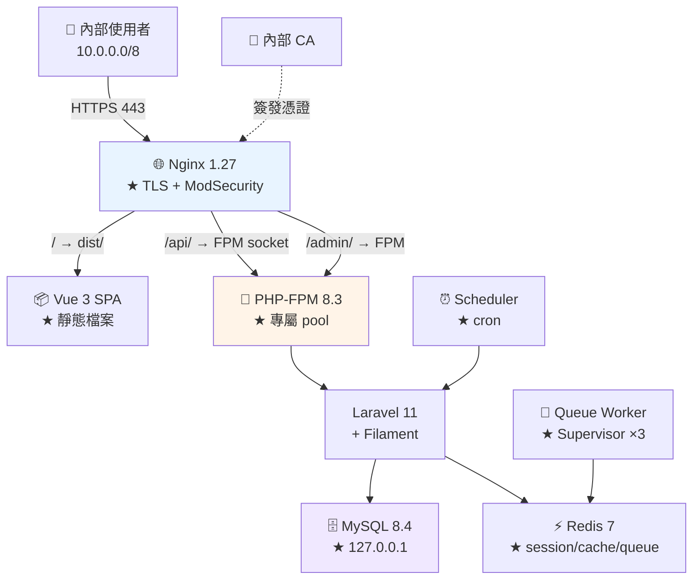

# Vue + Laravel 完整部署實戰

> [!abstract] 這篇你會學到
> - **★★★ 從一台乾淨的 Ubuntu 到服務上線的完整流程**
> - 環境安裝（Nginx + MySQL + PHP-FPM + Redis + Node）
> - **從 GitHub 部署**兩個專案（前端 + 後端）
> - **憑證簽發**（內部 CA）與 HTTPS
> - **ModSecurity WAF**、佇列、排程
> - **完整的部署腳本**（可直接使用）
> - **上線前檢查**與監控

## 前置知識

- [[130-01-05-01-guide-前後端-前後端分離架構選型]] — 選定同源子路徑架構
- [[130-01-04-04-guide-Laravel-快取最佳化與部署流程]] — 部署流程
- [[090-01-08-guide-PKI-用自建CA簽發伺服器憑證]] — 憑證簽發

---

## 目標架構 ★★



```
★★ 規格：
  網域    https://crm.internal.example.gov.tw
  前端    Vue 3 + Vite + Pinia + Vue Router
          github.com/Information-Study/crm-frontend
  後端    Laravel 11 + Sanctum + Filament
          github.com/Information-Study/crm-api
  架構    ★★ 同源子路徑（/ 與 /api/）
  認證    ★★ Sanctum SPA（HttpOnly Cookie）
  伺服器  Ubuntu 24.04 LTS，4 vCPU / 8GB RAM / 100GB SSD
  網路    ★ 只開放內網（10.0.0.0/8）
```

---

## 【階段一】環境準備 ★★

```bash
#!/usr/bin/env bash
# /usr/local/bin/setup-lxmp —— LXMP 環境一鍵安裝
set -euo pipefail

DOMAIN="${DOMAIN:-crm.internal.example.gov.tw}"
PHP_V=8.3

c(){ echo -e "\n\033[36m═══ $* ═══\033[0m"; }

c "【1】系統更新與基礎套件"
sudo apt update && sudo apt upgrade -y
sudo apt install -y \
    curl wget git unzip zip vim htop jq tree \
    ca-certificates gnupg lsb-release software-properties-common \
    ufw fail2ban unattended-upgrades

c "【2】★ 時區與語系"
sudo timedatectl set-timezone Asia/Taipei
sudo timedatectl set-ntp true
sudo locale-gen zh_TW.UTF-8 en_US.UTF-8
timedatectl | sed 's/^/    /'

c "【3】Nginx"
sudo apt install -y nginx
# ★ 隱藏版本
sudo sed -i 's/^\s*#\?\s*server_tokens.*/\tserver_tokens off;/' /etc/nginx/nginx.conf
grep -q 'server_tokens' /etc/nginx/nginx.conf || \
  sudo sed -i '/http {/a \\tserver_tokens off;' /etc/nginx/nginx.conf
sudo nginx -t && sudo systemctl enable --now nginx
nginx -v

c "【4】PHP $PHP_V + 擴充"
sudo add-apt-repository -y ppa:ondrej/php
sudo apt update
sudo apt install -y \
    php$PHP_V-fpm php$PHP_V-cli \
    php$PHP_V-mysql php$PHP_V-redis \
    php$PHP_V-mbstring php$PHP_V-xml php$PHP_V-curl \
    php$PHP_V-zip php$PHP_V-bcmath php$PHP_V-gd php$PHP_V-intl \
    php$PHP_V-opcache
php -v
php -m | tr '\n' ' ' | fold -w 100 -s | sed 's/^/    /'

c "【5】Composer"
EXPECTED=$(curl -sS https://composer.github.io/installer.sig)
php -r "copy('https://getcomposer.org/installer', '/tmp/composer-setup.php');"
ACTUAL=$(php -r "echo hash_file('sha384', '/tmp/composer-setup.php');")
[ "$EXPECTED" = "$ACTUAL" ] || { echo "✗✗ composer 安裝檔雜湊不符"; exit 1; }
sudo php /tmp/composer-setup.php --install-dir=/usr/local/bin --filename=composer
rm -f /tmp/composer-setup.php
composer -V

c "【6】MySQL 8"
sudo apt install -y mysql-server
sudo systemctl enable --now mysql
mysql --version
echo "  ★★ 接下來請手動執行：sudo mysql_secure_installation"

c "【7】Redis"
sudo apt install -y redis-server
REDIS_PASS=$(openssl rand -base64 32)
sudo sed -i "s/^# *requirepass .*/requirepass $REDIS_PASS/" /etc/redis/redis.conf
sudo sed -i 's/^bind .*/bind 127.0.0.1 ::1/' /etc/redis/redis.conf          # ★★★
sudo sed -i 's/^# *maxmemory .*/maxmemory 1gb/' /etc/redis/redis.conf
sudo sed -i 's/^# *maxmemory-policy .*/maxmemory-policy allkeys-lru/' /etc/redis/redis.conf
# ★★ 停用危險指令
grep -q 'rename-command CONFIG' /etc/redis/redis.conf || \
  echo -e '\nrename-command CONFIG ""\nrename-command FLUSHALL ""' | \
  sudo tee -a /etc/redis/redis.conf >/dev/null
sudo systemctl restart redis-server
redis-cli -a "$REDIS_PASS" ping 2>/dev/null
echo "  ★★★ Redis 密碼（請記下並存到密碼管理系統）："
echo "      $REDIS_PASS"

c "【8】Node.js 22（★ 只用於建置）"
curl -fsSL https://deb.nodesource.com/setup_22.x | sudo -E bash -
sudo apt install -y nodejs
node -v && npm -v

c "【9】Supervisor"
sudo apt install -y supervisor
sudo systemctl enable --now supervisor

c "【10】★★ 防火牆"
sudo ufw default deny incoming
sudo ufw default allow outgoing
sudo ufw allow from 10.0.9.0/24 to any port 22 comment 'SSH 管理網段'
sudo ufw allow from 10.0.0.0/8 to any port 443 comment 'HTTPS 內網'
sudo ufw allow from 10.0.0.0/8 to any port 80 comment 'HTTP 轉址'
sudo ufw --force enable
sudo ufw status numbered

c "【11】★ 建立 deploy 使用者"
if ! id deploy >/dev/null 2>&1; then
    sudo useradd -m -s /bin/bash deploy
    sudo usermod -aG www-data deploy
fi
sudo mkdir -p /home/deploy/.ssh && sudo chmod 700 /home/deploy/.ssh
sudo chown -R deploy:deploy /home/deploy/.ssh

# ★★ 最小的 sudo 權限
sudo tee /etc/sudoers.d/deploy >/dev/null <<EOF
deploy ALL=(root) NOPASSWD: /bin/systemctl reload php$PHP_V-fpm
deploy ALL=(root) NOPASSWD: /bin/systemctl reload nginx
deploy ALL=(root) NOPASSWD: /usr/sbin/nginx -t
deploy ALL=(root) NOPASSWD: /usr/bin/supervisorctl restart laravel-workers\:*
deploy ALL=(root) NOPASSWD: /usr/bin/supervisorctl status
EOF
sudo chmod 440 /etc/sudoers.d/deploy
sudo visudo -c

c "【12】★ 目錄結構"
for app in /var/www/crm-api /var/www/crm-app; do
    sudo mkdir -p "$app"/{releases,shared}
done
sudo mkdir -p /var/www/crm-api/shared/storage/{app/public,framework/{cache/data,sessions,views},logs}
sudo mkdir -p /var/log/{php-fpm,laravel,nginx}
sudo chown -R deploy:www-data /var/www/crm-api /var/www/crm-app /var/log/laravel
sudo chown -R www-data:www-data /var/log/php-fpm
sudo chmod -R 770 /var/www/crm-api/shared/storage
sudo find /var/www/crm-api/shared/storage -type d -exec chmod g+s {} \;

c "✓ 環境準備完成"
cat <<EOF

★★ 接下來：
  ① sudo mysql_secure_installation
  ② 建立資料庫與使用者（見階段二）
  ③ 設定 GitHub deploy key（見階段三）
  ④ 簽發憑證（見階段四）
EOF
```

---

## 【階段二】資料庫

```bash
# ★★ 資料庫與使用者
$ DB_PASS=$(openssl rand -base64 24)
$ sudo mysql <<SQL
CREATE DATABASE crmdb
  CHARACTER SET utf8mb4
  COLLATE utf8mb4_unicode_ci;

CREATE USER 'crmuser'@'127.0.0.1' IDENTIFIED BY '$DB_PASS';

-- ★★ 最小權限（含 migration 需要的）
GRANT SELECT, INSERT, UPDATE, DELETE, CREATE, ALTER, INDEX, DROP, REFERENCES
  ON crmdb.* TO 'crmuser'@'127.0.0.1';

FLUSH PRIVILEGES;
SHOW GRANTS FOR 'crmuser'@'127.0.0.1';
SQL

$ echo "★★★ 資料庫密碼（請存到密碼管理系統）：$DB_PASS"

# ★★ 驗證
$ mysql -h 127.0.0.1 -u crmuser -p"$DB_PASS" -e "
    SELECT @@character_set_database AS charset, @@collation_database AS collation;"
+---------+--------------------+
| charset | collation          |
+---------+--------------------+
| utf8mb4 | utf8mb4_unicode_ci |     # ★★ 正確
```

```ini
# ★ /etc/mysql/mysql.conf.d/tuning.cnf
[mysqld]
bind-address = 127.0.0.1                 # ★★★ 只聽本機

character-set-server = utf8mb4
collation-server = utf8mb4_unicode_ci

# ★★ 依 8GB RAM 調整
innodb_buffer_pool_size = 2G
innodb_log_file_size = 512M
innodb_flush_log_at_trx_commit = 1
innodb_flush_method = O_DIRECT
max_connections = 150

slow_query_log = 1
slow_query_log_file = /var/log/mysql/slow.log
long_query_time = 1
log_queries_not_using_indexes = 0        # ★ 正式環境關掉（會產生大量日誌）

# ★★ 安全
local_infile = 0
skip_symbolic_links = 1
```

```bash
$ sudo systemctl restart mysql
$ sudo ss -tlnp | grep 3306
LISTEN 0 151 127.0.0.1:3306 0.0.0.0:*    # ★★★ 只聽本機
```

---

## 【階段三】GitHub Deploy Key

```bash
# ★★ 為兩個 repo 各建一把 deploy key
$ for repo in crm-api crm-frontend; do
    sudo -u deploy ssh-keygen -t ed25519 \
      -f "/home/deploy/.ssh/id_ed25519_$repo" -N '' \
      -C "deploy@$(hostname)-$repo"
    echo "── $repo 的公鑰（貼到 GitHub Deploy Keys，★ 不要勾 write）──"
    sudo cat "/home/deploy/.ssh/id_ed25519_$repo.pub"
    echo
  done

# ★★ SSH 設定
$ sudo -u deploy tee /home/deploy/.ssh/config >/dev/null <<'EOF'
Host github-crm-api
    HostName github.com
    User git
    IdentityFile ~/.ssh/id_ed25519_crm-api
    IdentitiesOnly yes

Host github-crm-frontend
    HostName github.com
    User git
    IdentityFile ~/.ssh/id_ed25519_crm-frontend
    IdentitiesOnly yes
EOF
$ sudo chmod 600 /home/deploy/.ssh/config
$ sudo chown deploy:deploy /home/deploy/.ssh/config

# ★★ 加入 GitHub 的 host key（★ 不要用 StrictHostKeyChecking=no）
$ sudo -u deploy ssh-keyscan -t ed25519 github.com | \
    sudo -u deploy tee -a /home/deploy/.ssh/known_hosts
$ sudo chmod 600 /home/deploy/.ssh/known_hosts

# ★★ 測試
$ sudo -u deploy ssh -T github-crm-api
Hi Information-Study/crm-api! You've successfully authenticated...
$ sudo -u deploy ssh -T github-crm-frontend
```

---

## 【階段四】憑證

```bash
# ★★ 用內部 CA 簽發（見 [[090-01-08-guide-PKI-用自建CA簽發伺服器憑證]]）
$ sudo issue-cert crm.internal.example.gov.tw 10.0.20.15

# ★ 部署
$ SAFE=crm.internal.example.gov.tw
$ sudo install -m 644 "/etc/ssl/issued/${SAFE//./_}-fullchain.crt" \
    /etc/ssl/certs/crm-fullchain.crt
$ sudo install -m 600 "/etc/ssl/issued/${SAFE//./_}.key" \
    /etc/ssl/private/crm.key
$ sudo install -m 644 /root/ca/issuing-ca/certs/ca-chain.cert.pem \
    /etc/ssl/certs/ca-chain.crt

# ★★ 驗證
$ openssl x509 -in /etc/ssl/certs/crm-fullchain.crt -noout -subject -dates -ext subjectAltName
$ openssl verify -CAfile /etc/ssl/certs/ca-chain.crt /etc/ssl/certs/crm-fullchain.crt
```

---

## 【階段五】PHP-FPM Pool

```ini
# /etc/php/8.3/fpm/pool.d/crm.conf
[crm]
user  = www-data
group = www-data

listen = /run/php/php8.3-fpm-crm.sock
listen.owner = www-data
listen.group = www-data
listen.mode  = 0660
listen.backlog = 511

pm = dynamic
pm.max_children      = 30        ; ★★ 8GB RAM，用 fpm-sizing 算出來的
pm.start_servers     = 6
pm.min_spare_servers = 4
pm.max_spare_servers = 10
pm.max_requests      = 500
pm.status_path = /fpm-status
ping.path      = /fpm-ping

slowlog = /var/log/php-fpm/crm-slow.log
request_slowlog_timeout = 5s
request_terminate_timeout = 120s

access.log = /var/log/php-fpm/crm-access.log
catch_workers_output = yes

; ═══ ★★ PHP 設定 ═══
php_admin_value[memory_limit] = 256M
php_admin_value[max_execution_time] = 60
php_admin_value[upload_max_filesize] = 20M
php_admin_value[post_max_size] = 22M
php_admin_value[max_input_vars] = 3000
php_admin_value[date.timezone] = Asia/Taipei

php_admin_value[error_log] = /var/log/php-fpm/crm-error.log
php_admin_flag[log_errors] = on
php_admin_flag[display_errors] = off              ; ★★★
php_admin_flag[display_startup_errors] = off
php_admin_flag[expose_php] = off

; ═══ ★★★ 安全 ═══
php_admin_value[open_basedir] = /var/www/crm-api/current:/var/www/crm-api/shared:/tmp:/usr/share/php
php_admin_value[disable_functions] = exec,passthru,shell_exec,system,proc_open,popen,proc_nice,dl,pcntl_exec,symlink
php_admin_value[cgi.fix_pathinfo] = 0             ; ★★★

php_admin_value[session.cookie_httponly] = 1
php_admin_value[session.cookie_secure] = 1
php_admin_value[session.use_strict_mode] = 1

; ═══ ★★ OPcache ═══
php_admin_value[opcache.enable] = 1
php_admin_value[opcache.memory_consumption] = 256
php_admin_value[opcache.interned_strings_buffer] = 32
php_admin_value[opcache.max_accelerated_files] = 20000
php_admin_value[opcache.validate_timestamps] = 0  ; ★★★ 部署後 reload FPM
php_admin_value[opcache.save_comments] = 1        ; ★★★ Laravel 必須
php_admin_value[opcache.jit] = tracing
php_admin_value[opcache.jit_buffer_size] = 64M
php_admin_value[realpath_cache_size] = 4096K
php_admin_value[realpath_cache_ttl] = 600

env[APP_ENV] = production
clear_env = no
```

```bash
$ sudo php-fpm8.3 -t
$ sudo systemctl restart php8.3-fpm
$ ls -l /run/php/php8.3-fpm-crm.sock
srw-rw---- 1 www-data www-data 0 Aug 28 15:00 /run/php/php8.3-fpm-crm.sock
```

---

## 【階段六】Nginx

```nginx
# /etc/nginx/snippets/security-headers.conf
add_header Strict-Transport-Security "max-age=31536000; includeSubDomains" always;
add_header X-Content-Type-Options "nosniff" always;
add_header X-Frame-Options "SAMEORIGIN" always;
add_header Referrer-Policy "strict-origin-when-cross-origin" always;
add_header Permissions-Policy "geolocation=(), microphone=(), camera=()" always;
```

```nginx
# /etc/nginx/sites-available/crm.conf
limit_req_zone $binary_remote_addr zone=crm_static:10m rate=100r/s;
limit_req_zone $binary_remote_addr zone=crm_page:10m   rate=30r/s;
limit_req_zone $binary_remote_addr zone=crm_api:10m    rate=20r/s;
limit_req_zone $binary_remote_addr zone=crm_login:10m  rate=5r/m;
limit_conn_zone $binary_remote_addr zone=crm_conn:10m;

server {
    listen 80;
    listen [::]:80;
    server_name crm.internal.example.gov.tw;
    return 301 https://$host$request_uri;
}

server {
    listen 443 ssl;
    listen [::]:443 ssl;
    http2 on;
    server_name crm.internal.example.gov.tw;

    # ═══ ★★ 只允許內網 ═══
    allow 10.0.0.0/8;
    allow 172.16.0.0/12;
    deny all;

    # ═══ TLS ═══
    ssl_certificate         /etc/ssl/certs/crm-fullchain.crt;
    ssl_certificate_key     /etc/ssl/private/crm.key;
    ssl_trusted_certificate /etc/ssl/certs/ca-chain.crt;
    ssl_protocols           TLSv1.2 TLSv1.3;
    ssl_ciphers             ECDHE-ECDSA-AES128-GCM-SHA256:ECDHE-RSA-AES128-GCM-SHA256:ECDHE-ECDSA-AES256-GCM-SHA384:ECDHE-RSA-AES256-GCM-SHA384;
    ssl_prefer_server_ciphers off;
    ssl_session_cache       shared:SSL:20m;
    ssl_session_timeout     1d;
    ssl_session_tickets     off;
    # ★ 內部 CA 沒有 OCSP responder，不要開 stapling

    include snippets/security-headers.conf;

    root  /var/www/crm-app/current/dist;
    index index.html;
    charset utf-8;

    client_max_body_size 20m;
    limit_conn crm_conn 20;

    log_format crm '$remote_addr - [$time_local] "$request" $status $body_bytes_sent '
                   'rt=$request_time urt=$upstream_response_time ua="$http_user_agent"';
    access_log /var/log/nginx/crm.access.log crm;
    error_log  /var/log/nginx/crm.error.log warn;

    gzip on; gzip_static on; gzip_vary on; gzip_comp_level 6; gzip_min_length 1024;
    gzip_types text/plain text/css application/json application/javascript
               application/xml image/svg+xml font/woff2;

    # ═══ ModSecurity（★ 前台開，後台關）═══
    modsecurity on;
    modsecurity_rules_file /etc/nginx/modsec/main.conf;

    # ─────────── ① 精確匹配 ───────────
    location = /healthz {
        access_log off;
        modsecurity off;
        add_header Content-Type text/plain;
        return 200 "ok\n";
    }
    location = /favicon.ico { access_log off; log_not_found off; expires 30d; }
    location = /robots.txt  { access_log off; log_not_found off; return 200 "User-agent: *\nDisallow: /\n"; }

    location = /index.html {
        expires -1;
        add_header Cache-Control "no-cache, no-store, must-revalidate" always;
        include snippets/security-headers.conf;
    }

    location = /sanctum/csrf-cookie {
        limit_req zone=crm_api burst=20 nodelay;
        root /var/www/crm-api/current/public;
        try_files $uri /index.php?$query_string;
    }

    # ─────────── ② ^~ 前綴 ───────────
    location ^~ /api/login {
        limit_req zone=crm_login burst=3 nodelay;
        limit_req_status 429;
        root /var/www/crm-api/current/public;
        try_files $uri /index.php?$query_string;
    }

    location ^~ /api/ {
        limit_req zone=crm_api burst=40 nodelay;
        root /var/www/crm-api/current/public;
        try_files $uri /index.php?$query_string;

        location ~ \.php$ {
            root /var/www/crm-api/current/public;
            try_files $uri =404;                     # ★★★★
            fastcgi_pass unix:/run/php/php8.3-fpm-crm.sock;
            fastcgi_index index.php;
            include fastcgi_params;
            fastcgi_param SCRIPT_FILENAME $realpath_root$fastcgi_script_name;
            fastcgi_param DOCUMENT_ROOT   $realpath_root;
            fastcgi_param HTTPS on;                  # ★★★
            fastcgi_read_timeout 60s;
            fastcgi_buffer_size 32k;
            fastcgi_buffers 16 16k;
            fastcgi_hide_header X-Powered-By;
            include snippets/security-headers.conf;  # ★★★
        }
    }

    # ─── ★★ Filament 後台（★ 關閉 WAF）───
    location ^~ /admin {
        allow 10.0.9.0/24;                           # ★★ 只有資訊室網段
        deny all;
        modsecurity off;                             # ★★ Livewire 易誤判
        limit_req zone=crm_page burst=30 nodelay;
        root /var/www/crm-api/current/public;
        try_files $uri $uri/ /index.php?$query_string;

        location ~ \.php$ {
            root /var/www/crm-api/current/public;
            try_files $uri =404;
            fastcgi_pass unix:/run/php/php8.3-fpm-crm.sock;
            include fastcgi_params;
            fastcgi_param SCRIPT_FILENAME $realpath_root$fastcgi_script_name;
            fastcgi_param HTTPS on;
            fastcgi_read_timeout 120s;
            include snippets/security-headers.conf;
        }
    }

    location ^~ /livewire/ {
        modsecurity off;                             # ★★★
        client_max_body_size 50m;
        root /var/www/crm-api/current/public;
        try_files $uri /index.php?$query_string;
        location ~ \.php$ {
            root /var/www/crm-api/current/public;
            try_files $uri =404;
            fastcgi_pass unix:/run/php/php8.3-fpm-crm.sock;
            include fastcgi_params;
            fastcgi_param SCRIPT_FILENAME $realpath_root$fastcgi_script_name;
            fastcgi_param HTTPS on;
        }
    }

    # ─── ★★ 上傳的檔案 ───
    location ^~ /storage/ {
        alias /var/www/crm-api/shared/storage/app/public/;
        try_files $uri =404;
        expires 7d;
        add_header Cache-Control "public, max-age=604800";
        add_header Content-Disposition "attachment" always;    # ★★
        include snippets/security-headers.conf;
        access_log off;
        location ~ \.(php|phtml|phar|php\d|pht|phps)$ { deny all; }   # ★★★★
    }

    # ─── ★★ 前端建置產物 ───
    location ^~ /assets/ {
        limit_req zone=crm_static burst=200 nodelay;
        try_files $uri =404;
        expires 1y;
        add_header Cache-Control "public, max-age=31536000, immutable";
        include snippets/security-headers.conf;
        access_log off;
        gzip_static on;
    }

    # ─── Filament 的資產 ───
    location ^~ /vendor/ {
        root /var/www/crm-api/current/public;
        try_files $uri =404;
        expires 30d;
        add_header Cache-Control "public, max-age=2592000";
        include snippets/security-headers.conf;
        access_log off;
    }

    location ^~ /nginx-status {
        stub_status;
        allow 127.0.0.1;
        deny all;
        access_log off;
    }

    # ─────────── ③ 正規表示式 ───────────
    location ~* \.(ico|png|jpe?g|gif|svg|webp|woff2?|ttf)$ {
        try_files $uri =404;
        expires 30d;
        add_header Cache-Control "public";
        include snippets/security-headers.conf;
        access_log off;
    }

    location ~ /\.(?!well-known) { deny all; access_log off; }
    location ~ \.(map|env|log|sql|sqlite|md|lock|yml|yaml|bak|old)$ { deny all; access_log off; }
    location ~ ^/(bootstrap|config|database|resources|routes|tests|node_modules)/ {
        deny all; access_log off;
    }

    # ─────────── ④ SPA fallback ───────────
    location / {
        limit_req zone=crm_page burst=50 nodelay;
        try_files $uri $uri/ /index.html;
    }

    # ─── 錯誤頁 ───
    error_page 429 = @rate;
    location @rate { default_type application/json;
        return 429 '{"message":"請求過於頻繁，請稍後再試","code":"RATE_LIMITED"}'; }
    error_page 413 = @big;
    location @big { default_type application/json;
        return 413 '{"message":"檔案太大（上限 20MB）","code":"PAYLOAD_TOO_LARGE"}'; }
    error_page 502 503 504 = @down;
    location @down { default_type application/json;
        return 503 '{"message":"服務暫時無法使用","code":"SERVICE_UNAVAILABLE"}'; }
}
```

```bash
$ sudo ln -sfn /etc/nginx/sites-available/crm.conf /etc/nginx/sites-enabled/crm.conf
$ sudo rm -f /etc/nginx/sites-enabled/default
$ sudo nginx -t && sudo systemctl reload nginx
```

---

## 【階段七】首次部署 ★★★

```bash
# ═══ ★★ 後端的 .env ═══
$ sudo -u deploy tee /var/www/crm-api/shared/.env >/dev/null <<'EOF'
APP_NAME="客戶關係管理系統"
APP_ENV=production
APP_KEY=
APP_DEBUG=false
APP_URL=https://crm.internal.example.gov.tw
APP_TIMEZONE=Asia/Taipei
APP_LOCALE=zh_TW
APP_FALLBACK_LOCALE=en

LOG_CHANNEL=stack
LOG_STACK=daily
LOG_LEVEL=warning
LOG_DAILY_DAYS=14

DB_CONNECTION=mysql
DB_HOST=127.0.0.1
DB_PORT=3306
DB_DATABASE=crmdb
DB_USERNAME=crmuser
DB_PASSWORD=★填入階段二的密碼

SESSION_DRIVER=redis
SESSION_LIFETIME=120
SESSION_ENCRYPT=false
SESSION_SECURE_COOKIE=true
SESSION_SAME_SITE=lax
SESSION_DOMAIN=null
SESSION_COOKIE=crm_session

CACHE_STORE=redis
CACHE_PREFIX=crm_cache
QUEUE_CONNECTION=redis

REDIS_CLIENT=phpredis
REDIS_HOST=127.0.0.1
REDIS_PORT=6379
REDIS_PASSWORD=★填入階段一的 Redis 密碼
REDIS_DB=0
REDIS_CACHE_DB=1

FILESYSTEM_DISK=local
SANCTUM_STATEFUL_DOMAINS=crm.internal.example.gov.tw
FRONTEND_URL=https://crm.internal.example.gov.tw

BROADCAST_CONNECTION=log
MAIL_MAILER=log
EOF
$ sudo chmod 640 /var/www/crm-api/shared/.env
$ sudo chown deploy:www-data /var/www/crm-api/shared/.env

# ═══ ★ 前端的 .env ═══
$ sudo -u deploy tee /var/www/crm-app/shared/.env.production >/dev/null <<'EOF'
VITE_API_BASE=/api
VITE_APP_TITLE=客戶關係管理系統
VITE_APP_ENV=production
EOF
$ sudo chmod 640 /var/www/crm-app/shared/.env.production
```

```bash
#!/usr/bin/env bash
# /usr/local/bin/deploy-crm —— ★★★ CRM 完整部署（前端 + 後端）
set -euo pipefail

API=/var/www/crm-api
APP=/var/www/crm-app
API_REPO="github-crm-api:Information-Study/crm-api.git"
APP_REPO="github-crm-frontend:Information-Study/crm-frontend.git"
BRANCH="${1:-main}"
SITE=https://crm.internal.example.gov.tw
PHP_V=8.3
KEEP=5
BACKUP=/backup/db
TS=$(date +%Y%m%d-%H%M%S)
API_REL="$API/releases/$TS"
APP_REL="$APP/releases/$TS"

c(){ echo -e "\033[36m[$(date +%T)]\033[0m $*"; }
ok(){ echo -e "\033[32m    ✓ $*\033[0m"; }
er(){ echo -e "\033[31m    ✗ $*\033[0m"; }
die(){ echo -e "\033[31m✗✗ $*\033[0m" >&2; exit 1; }

exec 200>/var/lock/deploy-crm.lock
flock -n 200 || die "已有部署在進行中"
START=$(date +%s)

c "═══════ CRM 部署（$BRANCH）═══════"

# ══════ 【0】前置檢查 ══════
c "【0】前置檢查"
[ "$(whoami)" = deploy ] || die "必須用 deploy 使用者執行"
grep -q '^APP_ENV=production' "$API/shared/.env"  || die "★★ APP_ENV 不是 production"
grep -q '^APP_DEBUG=false'    "$API/shared/.env"  || die "★★★ APP_DEBUG 不是 false"
df -h /var/www | tail -1 | awk '{gsub("%","",$5); if($5>85) exit 1}' || die "磁碟 >85%"
ok "通過"

# ══════ 【1】★★ 資料庫備份 ══════
c "【1】★★ 資料庫備份"
mkdir -p "$BACKUP"
DB_N=$(grep '^DB_DATABASE=' "$API/shared/.env" | cut -d= -f2-)
DB_U=$(grep '^DB_USERNAME=' "$API/shared/.env" | cut -d= -f2-)
DB_P=$(grep '^DB_PASSWORD=' "$API/shared/.env" | cut -d= -f2-)
BAK="$BACKUP/$DB_N-$TS.sql.gz"
MYSQL_PWD="$DB_P" mysqldump -h 127.0.0.1 -u "$DB_U" \
    --single-transaction --routines --triggers --no-tablespaces "$DB_N" | gzip > "$BAK"
ok "$BAK（$(du -h "$BAK"|cut -f1)）"
find "$BACKUP" -name '*.sql.gz' -mtime +14 -delete

# ══════ 【2】後端 clone + 建置 ══════
c "【2】後端"
mkdir -p "$API_REL"
git clone --depth 1 -b "$BRANCH" --single-branch "$API_REPO" "$API_REL" 2>&1 | sed 's/^/    /'
API_COMMIT=$(cd "$API_REL" && git rev-parse --short HEAD)
ok "$API_COMMIT — $(cd "$API_REL" && git log -1 --pretty=%s)"
rm -rf "$API_REL/.git"

ln -sfn "$API/shared/.env" "$API_REL/.env"
rm -rf "$API_REL/storage" && ln -sfn "$API/shared/storage" "$API_REL/storage"

cd "$API_REL"
COMPOSER_MEMORY_LIMIT=-1 composer install \
    --no-dev --optimize-autoloader --no-interaction --prefer-dist --no-progress \
    2>&1 | tail -4 | sed 's/^/    /'

composer audit --no-interaction >/dev/null 2>&1 || \
  er "⚠ composer audit 發現弱點（部署繼續）"

# ══════ 【3】前端 clone + 建置 ══════
c "【3】前端"
mkdir -p "$APP_REL"
git clone --depth 1 -b "$BRANCH" --single-branch "$APP_REPO" "$APP_REL" 2>&1 | sed 's/^/    /'
APP_COMMIT=$(cd "$APP_REL" && git rev-parse --short HEAD)
ok "$APP_COMMIT — $(cd "$APP_REL" && git log -1 --pretty=%s)"
rm -rf "$APP_REL/.git"

cp "$APP/shared/.env.production" "$APP_REL/.env.production"
cd "$APP_REL"
npm ci --no-audit --no-fund 2>&1 | tail -3 | sed 's/^/    /'
APP_VERSION="$APP_COMMIT" NODE_OPTIONS="--max-old-space-size=4096" \
  npm run build 2>&1 | tail -10 | sed 's/^/    /'

[ -f "$APP_REL/dist/index.html" ] || die "前端建置失敗"

# ★★★ 秘密掃描
if grep -rlE 'sk_live|-----BEGIN|AKIA[0-9A-Z]{16}|password["\x27]?\s*[:=]' \
     "$APP_REL/dist/" 2>/dev/null; then
    die "★★★ 前端建置產物中發現秘密"
fi
find "$APP_REL/dist" -name '*.map' -delete 2>/dev/null || true
ok "秘密掃描通過"

# ★ 預壓縮
cd "$APP_REL/dist"
find . -type f \( -name '*.js' -o -name '*.css' -o -name '*.html' -o -name '*.svg' \) \
    -size +1k -exec gzip -9 -k {} \;
cd "$APP_REL"
rm -rf "$APP_REL/node_modules" "$APP_REL/src" "$APP_REL/public"
ok "dist 大小：$(du -sh "$APP_REL/dist"|cut -f1)"

# ══════ 【4】★★ 資料庫遷移 ══════
c "【4】★★ 資料庫遷移"
cd "$API_REL"
PENDING=$(php artisan migrate:status 2>/dev/null | grep -c 'Pending' || echo 0)
if [ "$PENDING" -gt 0 ]; then
    c "    有 $PENDING 個待執行的遷移"
    php artisan migrate:status 2>/dev/null | grep Pending | sed 's/^/      /'
    php artisan migrate --force --no-interaction 2>&1 | sed 's/^/    /'
    ok "完成"
else
    ok "沒有待執行的遷移"
fi

# ══════ 【5】★★★ Laravel + Filament 最佳化 ══════
c "【5】★★★ 最佳化"
php artisan config:cache 2>&1 | sed 's/^/    /'
php artisan event:cache  2>&1 | sed 's/^/    /'
php artisan route:cache  2>&1 | sed 's/^/    /' || er "⚠ route:cache 失敗（★ 路由中有 Closure？）"
php artisan view:cache   2>&1 | sed 's/^/    /'
php artisan filament:assets   2>&1 | sed 's/^/    /' || true
php artisan filament:optimize 2>&1 | sed 's/^/    /' || true
php artisan storage:link      2>&1 | sed 's/^/    /' || true
ok "完成"

# ══════ 【6】★★ 權限 ══════
c "【6】★★ 權限"
for R in "$API_REL" "$APP_REL"; do
    find "$R" -type d -exec chmod 750 {} \;
    find "$R" -type f -exec chmod 640 {} \;
done
chmod 755 "$API_REL/artisan"
chmod -R 770 "$API_REL/bootstrap/cache" "$API/shared/storage"
# ★ dist 要讓 Nginx（www-data）讀
chmod -R o+rX "$APP_REL/dist"
ok "完成"

# ══════ 【7】★★★ 切換前的煙霧測試 ══════
c "【7】★★★ 煙霧測試"
FAIL=0
s(){ printf '    %-40s ' "$1"; if eval "$2" >/dev/null 2>&1; then echo "✓"; else echo "✗"; FAIL=1; fi; }
s "artisan 可執行"        "php '$API_REL/artisan' --version"
s "config 快取存在"       "[ -f '$API_REL/bootstrap/cache/config.php' ]"
s "vendor 存在"           "[ -f '$API_REL/vendor/autoload.php' ]"
s "index.php 語法正確"    "php -l '$API_REL/public/index.php'"
s "★★ 資料庫可連線"        "php '$API_REL/artisan' db:show"
s "★ Redis 可用"          "php '$API_REL/artisan' tinker --execute='Cache::put(\"__d\",1,5);exit(Cache::get(\"__d\")===1?0:1);'"
s "★★ 沒有開發相依"        "[ ! -d '$API_REL/vendor/phpunit' ]"
s "前端 index.html"       "[ -f '$APP_REL/dist/index.html' ]"
s "★ 前端資源存在"        "ls '$APP_REL/dist/assets/'*.js >/dev/null"
[ "$FAIL" -eq 0 ] || die "煙霧測試失敗，不切換（★ 舊版本仍在服務）"
ok "全部通過"

# ══════ 【8】★★★ 原子切換（★ 兩個一起）══════
API_PREV=$(readlink "$API/current" 2>/dev/null || echo "")
APP_PREV=$(readlink "$APP/current" 2>/dev/null || echo "")
c "【8】★★★ 原子切換"
ln -sfn "$API_REL" "$API/current.tmp" && mv -Tf "$API/current.tmp" "$API/current"
ln -sfn "$APP_REL" "$APP/current.tmp" && mv -Tf "$APP/current.tmp" "$APP/current"
ok "API → $TS / APP → $TS"

# ══════ 【9】★★★ 重載服務 ══════
c "【9】★★★ 重載"
sudo systemctl reload "php$PHP_V-fpm" && ok "php-fpm（OPcache 已失效）"
sudo nginx -t && sudo systemctl reload nginx && ok "nginx"
php "$API/current/artisan" queue:restart 2>/dev/null || true
sleep 3
sudo supervisorctl restart laravel-workers: 2>&1 | sed 's/^/    /' || true
ok "queue workers"

# ══════ 【10】★★★ 部署後驗證 ══════
c "【10】★★★ 驗證"
sleep 3
FAIL=0
v(){ printf '    %-44s ' "$1"; if eval "$2" >/dev/null 2>&1; then echo "✓"; else echo "✗"; FAIL=1; fi; }

v "首頁 200"          "[ \"\$(curl -sko /dev/null -w '%{http_code}' --max-time 20 $SITE/)\" = 200 ]"
v "★★ SPA 路由"        "[ \"\$(curl -sko /dev/null -w '%{http_code}' $SITE/customers/1)\" = 200 ]"
v "★★ API 健康檢查"    "[ \"\$(curl -sko /dev/null -w '%{http_code}' $SITE/api/health/live)\" = 200 ]"
v "★★★ API 回 JSON"    "curl -sk $SITE/api/health/live | jq -e .status"
v "★★ 未認證 401"      "[ \"\$(curl -sko /dev/null -w '%{http_code}' $SITE/api/user -H 'Accept: application/json')\" = 401 ]"
v "★★ Sanctum CSRF"    "curl -skI $SITE/sanctum/csrf-cookie | grep -qi 'set-cookie.*XSRF'"
v "★★ 後台登入頁"      "[ \"\$(curl -sko /dev/null -w '%{http_code}' $SITE/admin/login)\" = 200 ]"
v "★★★ .env 擋住"      "[ \"\$(curl -sko /dev/null -w '%{http_code}' $SITE/.env)\" != 200 ]"
v "★★★★ PathInfo 防護" "[ \"\$(curl -sko /dev/null -w '%{http_code}' $SITE/storage/x.jpg/y.php)\" = 404 ]"
v "★★ 版本正確"        "curl -sk $SITE/version.json | grep -q '$APP_COMMIT'"
v "★ HSTS"            "curl -skI $SITE/ | grep -qi strict-transport"

# ★★ 佇列驗證
php "$API/current/artisan" tinker --execute='dispatch(function () {
  \Illuminate\Support\Facades\Log::info("__deploy_ok__"); })->onQueue("default");' >/dev/null 2>&1
QOK=0
for i in $(seq 1 20); do
    grep -q '__deploy_ok__' "$API/shared/storage/logs/laravel-$(date +%Y-%m-%d).log" 2>/dev/null && { QOK=1; break; }
    sleep 1
done
printf '    %-44s ' "★★★ 佇列 worker 運作"
[ "$QOK" = 1 ] && echo "✓" || { echo "✗"; FAIL=1; }

# ══════ 【11】失敗回退 ══════
if [ "$FAIL" != 0 ]; then
    er "✗✗ 驗證失敗 —— 自動回退"
    tail -25 "$API/shared/storage/logs/laravel-$(date +%Y-%m-%d).log" 2>/dev/null | sed 's/^/      /'
    tail -15 /var/log/nginx/crm.error.log | sed 's/^/      /'
    [ -n "$API_PREV" ] && { ln -sfn "$API_PREV" "$API/current.tmp"; mv -Tf "$API/current.tmp" "$API/current"; }
    [ -n "$APP_PREV" ] && { ln -sfn "$APP_PREV" "$APP/current.tmp"; mv -Tf "$APP/current.tmp" "$APP/current"; }
    sudo systemctl reload "php$PHP_V-fpm"
    php "$API/current/artisan" queue:restart 2>/dev/null || true
    sudo supervisorctl restart laravel-workers: 2>/dev/null || true
    er "已回退"
    cat <<EOF

  ★★ 注意：資料庫遷移【沒有回退】
     若有破壞性的 migration：
       cd $API_PREV && php artisan migrate:rollback --step=1
     或從備份還原：
       zcat $BAK | mysql -h 127.0.0.1 -u $DB_U -p $DB_N
EOF
    exit 1
fi

# ══════ 【12】清理 ══════
c "【12】清理（保留 $KEEP 個）"
for D in "$API/releases" "$APP/releases"; do
    (cd "$D" && ls -1dt */ 2>/dev/null | tail -n +$((KEEP+1)) | \
      while read -r d; do echo "    刪除 $(basename "$D")/$d"; rm -rf "$d"; done)
done

ELAPSED=$(( $(date +%s) - START ))
c "═══════ ✓ 部署完成（${ELAPSED}s）═══════"
cat <<EOF
  後端：$API_COMMIT
  前端：$APP_COMMIT
  網址：$SITE
  回退：sudo -u deploy rollback-crm
EOF
echo "$(date -Is)|$API_COMMIT|$APP_COMMIT|$BRANCH|${ELAPSED}s" >> "$API/shared/deploy.log"
```

```bash
$ sudo chmod +x /usr/local/bin/deploy-crm

# ★★★ 首次部署
$ sudo -u deploy deploy-crm main

# ★★ 首次部署後：產生 APP_KEY 與建立管理員
$ cd /var/www/crm-api/current
$ sudo -u deploy php artisan key:generate --force
$ echo "★★★ 立刻備份 APP_KEY："
$ grep '^APP_KEY=' /var/www/crm-api/shared/.env
$ sudo -u deploy php artisan make:filament-user
$ sudo systemctl reload php8.3-fpm
```

---

## 【階段八】佇列與排程

```ini
# /etc/supervisor/conf.d/crm-worker.conf
[program:crm-worker]
process_name=%(program_name)s_%(process_num)02d
command=php /var/www/crm-api/current/artisan queue:work redis
    --queue=high,default,low
    --tries=3 --backoff=10,30,60
    --max-jobs=1000 --max-time=3600 --memory=256
    --timeout=120 --sleep=3
directory=/var/www/crm-api/current
autostart=true
autorestart=true
startsecs=5
user=www-data
numprocs=3
redirect_stderr=true
stdout_logfile=/var/log/supervisor/crm-worker.log
stdout_logfile_maxbytes=50MB
stdout_logfile_backups=5
stopwaitsecs=150                      ; ★★ > timeout(120) + 餘裕
stopsignal=TERM
stopasgroup=true
killasgroup=true

[group:laravel-workers]
programs=crm-worker
priority=999
```

```bash
$ sudo supervisorctl reread && sudo supervisorctl update
$ sudo supervisorctl status

# ★★★ 排程（★ 路徑用 current）
$ sudo crontab -u www-data -e
```

```cron
PATH=/usr/local/bin:/usr/bin:/bin
MAILTO=""
* * * * * cd /var/www/crm-api/current && /usr/bin/php artisan schedule:run >> /var/log/laravel/schedule.log 2>&1
```

```bash
$ sudo tee /etc/logrotate.d/crm >/dev/null <<'EOF'
/var/log/laravel/*.log /var/log/supervisor/crm-*.log {
    daily
    rotate 14
    compress
    delaycompress
    missingok
    notifempty
    copytruncate
    create 0640 www-data www-data
}
EOF
```

---

## 【階段九】上線前檢查 ★★★

```bash
$ laravel-security-audit /var/www/crm-api https://crm.internal.example.gov.tw
$ verify-routing https://crm.internal.example.gov.tw
$ verify-api https://crm.internal.example.gov.tw
$ verify-auth https://crm.internal.example.gov.tw https://crm.internal.example.gov.tw
$ laravel-queue-monitor /var/www/crm-api
$ cert-doctor crm.internal.example.gov.tw
```

```bash
#!/usr/bin/env bash
# /usr/local/bin/crm-golive-check —— ★★★ 上線前的總檢查
set -uo pipefail
SITE=https://crm.internal.example.gov.tw
API=/var/www/crm-api
APP=/var/www/crm-app
P=0; F=0

ok(){ printf '  \033[32m✓\033[0m %s\n' "$1"; P=$((P+1)); }
ng(){ printf '  \033[31m✗✗\033[0m %s\n' "$1"; F=$((F+1)); }
ck(){ if eval "$2" >/dev/null 2>&1; then ok "$1"; else ng "$1"; fi; }

echo "═══════ CRM 上線前總檢查 ═══════"

echo -e "\n【1】★★★ 致命項"
ck "APP_DEBUG=false"        "grep -q '^APP_DEBUG=false' $API/shared/.env"
ck "APP_ENV=production"     "grep -q '^APP_ENV=production' $API/shared/.env"
ck "APP_KEY 已設定"         "grep -q '^APP_KEY=base64:' $API/shared/.env"
ck ".env 無法從網路存取"     "[ \"\$(curl -sko /dev/null -w '%{http_code}' $SITE/.env)\" != 200 ]"
ck "★★★★ PathInfo 防護"     "[ \"\$(curl -sko /dev/null -w '%{http_code}' $SITE/storage/x.jpg/y.php)\" = 404 ]"
ck "★★★ 程式碼對 www-data 唯讀" "! sudo -u www-data test -w $API/current/public/index.php"

echo -e "\n【2】服務狀態"
for s in nginx php8.3-fpm mysql redis-server supervisor; do
    ck "$s 執行中" "systemctl is-active --quiet $s"
done
ck "★ 3 個 worker" "[ \$(sudo supervisorctl status laravel-workers: 2>/dev/null | grep -c RUNNING) -ge 3 ]"
ck "★ 排程 cron 已設" "sudo crontab -u www-data -l 2>/dev/null | grep -q 'schedule:run'"
ck "★★ cron 路徑用 current" "! sudo crontab -u www-data -l 2>/dev/null | grep 'schedule:run' | grep -q releases/"

echo -e "\n【3】★★ 網路綁定"
ck "★★★ MySQL 只聽本機"  "! ss -tln | grep -qE '0\.0\.0\.0:3306|\*:3306'"
ck "★★★ Redis 只聽本機"  "! ss -tln | grep -qE '0\.0\.0\.0:6379|\*:6379'"
ck "Redis 有密碼"        "grep -qE '^requirepass .+' /etc/redis/redis.conf"
ck "★ 防火牆啟用"        "sudo ufw status | grep -q 'Status: active'"

echo -e "\n【4】HTTPS 與憑證"
ck "HTTPS 200"          "[ \"\$(curl -sko /dev/null -w '%{http_code}' $SITE/)\" = 200 ]"
ck "HTTP 轉址"          "curl -sI http://crm.internal.example.gov.tw/ | grep -qE '30[128]'"
ck "★ 憑證鏈完整"        "[ \$(echo | openssl s_client -connect crm.internal.example.gov.tw:443 -servername crm.internal.example.gov.tw -showcerts 2>/dev/null | grep -c 'BEGIN CERT') -ge 2 ]"
E=$(echo | openssl s_client -connect crm.internal.example.gov.tw:443 \
    -servername crm.internal.example.gov.tw 2>/dev/null | \
    openssl x509 -noout -enddate 2>/dev/null | cut -d= -f2)
if [ -n "$E" ]; then
    D=$(( ($(date -d "$E" +%s) - $(date +%s)) / 86400 ))
    [ "$D" -gt 30 ] && ok "憑證剩餘 $D 天" || ng "★★ 憑證僅剩 $D 天"
fi
ck "★ TLS 1.1 已停用"    "! echo | timeout 8 openssl s_client -connect crm.internal.example.gov.tw:443 -tls1_1 2>/dev/null | grep -q 'Cipher.*: [A-Z]'"

echo -e "\n【5】★★ 功能"
ck "SPA 路由"           "[ \"\$(curl -sko /dev/null -w '%{http_code}' $SITE/customers/1)\" = 200 ]"
ck "★★ API JSON"        "curl -sk $SITE/api/health/live | jq -e .status"
ck "★★ 未認證 401"       "[ \"\$(curl -sko /dev/null -w '%{http_code}' $SITE/api/user -H 'Accept: application/json')\" = 401 ]"
ck "★★ 401 是 JSON"      "curl -sk $SITE/api/user -H 'Accept: application/json' | jq -e .message"
ck "★★ Sanctum CSRF"     "curl -skI $SITE/sanctum/csrf-cookie | grep -qi 'set-cookie.*XSRF'"
ck "★★ cookie 有 Secure"  "curl -skI $SITE/sanctum/csrf-cookie | grep -qi 'set-cookie.*secure'"
ck "後台登入頁"          "[ \"\$(curl -sko /dev/null -w '%{http_code}' $SITE/admin/login)\" = 200 ]"
ck "★★★ 後台無註冊頁"     "[ \"\$(curl -sko /dev/null -w '%{http_code}' $SITE/admin/register)\" != 200 ]"
ck "★★ Filament 資產"    "[ \"\$(curl -sko /dev/null -w '%{http_code}' $SITE/vendor/livewire/livewire.js)\" = 200 ]"

echo -e "\n【6】★★ 快取與標頭"
ck "★★ index.html 不快取" "curl -skI $SITE/ | grep -qiE 'cache-control:.*(no-store|no-cache)'"
ASSET=$(curl -sk "$SITE/" | grep -oE '/assets/[^"]+\.js' | head -1)
[ -n "$ASSET" ] && ck "★★ 資源 immutable" "curl -skI $SITE$ASSET | grep -qi immutable"
for p in / /assets/ /api/health/live; do
    N=$(curl -skI "$SITE$p" | grep -ciE 'strict-transport|x-content-type|x-frame')
    [ "$N" -ge 2 ] && ok "$p 安全標頭（$N）" || ng "★★★ $p 只有 $N 個安全標頭"
done

echo -e "\n【7】★★ 限流"
C=""; for i in $(seq 1 10); do
    C="$C$(curl -sko /dev/null -w '%{http_code}' -X POST "$SITE/api/login" \
      -H 'Accept: application/json' -d '{}' --max-time 5) "
done
echo "$C" | grep -q 429 && ok "★★★ 登入限流（$C）" || ng "★★★★ 登入無限流（$C）"

echo -e "\n【8】備份與回退"
LB=$(ls -t /backup/db/*.sql.gz 2>/dev/null | head -1)
if [ -n "$LB" ]; then
    A=$(( ($(date +%s) - $(stat -c %Y "$LB")) / 3600 ))
    [ "$A" -lt 48 ] && ok "最新備份 ${A}h 前" || ng "★★ 最新備份 ${A}h 前"
else ng "★★★ 找不到資料庫備份"; fi
ck "★ 有多個 release 可回退" "[ \$(ls -1d $API/releases/*/ 2>/dev/null | wc -l) -ge 2 ]"

echo -e "\n【9】資源"
free -h | awk '/^Mem:/{printf "  記憶體  %s / %s（可用 %s）\n", $3, $2, $7}'
df -h /var/www | tail -1 | awk '{printf "  磁碟    %s / %s（已用 %s）\n", $3, $2, $5}'
echo "  FPM     $(ps -C php-fpm8.3 --no-headers 2>/dev/null | wc -l) 個程序"
ps -o rss= -C php-fpm8.3 2>/dev/null | awk '{s+=$1;n++} END {if(n) printf "  平均 RSS %.0f MB\n", s/n/1024}'

echo -e "\n═══════ ✓ $P  ✗ $F ═══════"
[ "$F" -eq 0 ] && echo "  ✓✓ 可以上線" || echo "  ★★★ 有 $F 項未通過，【不建議上線】"
exit "$F"
```

---

## 常見錯誤與排錯

| 現象 | 原因 | 解法 |
| --- | --- | --- |
| **API 回傳 HTML** ★★★ | SPA fallback 接走 | `location ^~ /api/`（有 `^~`） |
| **`File not found`** ★★★ | 巢狀 location 沒設 `root` | 在巢狀 location 重複 `root` |
| **登入後仍 401** ★★★ | `SANCTUM_STATEFUL_DOMAINS` | 加上網域 |
| **419 CSRF** ★★ | 沒先呼叫 `/sanctum/csrf-cookie` | 前端補上 |
| **部署後執行舊程式碼** ★★★ | OPcache / worker | reload FPM + `queue:restart` |
| **後台版面爛掉** ★★★ | 沒 `filament:assets` | 部署腳本加上 |
| **後台按鈕沒反應** ★★★ | ModSecurity 誤判 Livewire | `modsecurity off` |
| **上傳的圖片 404** ★★ | `storage:link` | 確認指向 shared |
| 深層路徑沒安全標頭 ★★★ | `add_header` 覆蓋 | `include snippets/` |
| **排程停止** ★★★ | cron 指向 releases | 改成 `current` |
| 500 但看不到原因 ★★ | `APP_DEBUG=false` | 看 `storage/logs/` + trace_id |

### 排查

```bash
SITE=https://crm.internal.example.gov.tw
API=/var/www/crm-api

# 【1】★★★ 三個日誌一起看
$ sudo tail -f /var/log/nginx/crm.error.log \
    /var/log/php-fpm/crm-error.log \
    "$API/shared/storage/logs/laravel-$(date +%Y-%m-%d).log"

# 【2】★★ 分流驗證
$ for p in / /customers/1 /api/health/live /api/nope /assets/nope.js /.env; do
    printf '%-24s %s %s\n' "$p" \
      "$(curl -sko /dev/null -w '%{http_code}' "$SITE$p")" \
      "$(curl -skI "$SITE$p" | grep -i content-type | tr -d '\r')"
  done

# 【3】★★ 服務狀態
$ systemctl status nginx php8.3-fpm mysql redis-server --no-pager | grep -E 'Active|●'
$ sudo supervisorctl status
$ curl -s 'http://127.0.0.1/fpm-status?full' 2>/dev/null | head -15

# 【4】★★ 部署歷史
$ tail -10 "$API/shared/deploy.log"
$ ls -lt "$API/releases/" | head -6
$ readlink "$API/current" && readlink /var/www/crm-app/current

# 【5】★ 資源
$ htop
$ free -h && df -h /var/www
$ ps -o rss= -C php-fpm8.3 | awk '{s+=$1;n++} END {printf "%d 個 worker，平均 %.0f MB\n", n, s/n/1024}'

# 【6】總檢查
$ crm-golive-check
```

---

## 安全性注意事項

> [!danger] 這個架構的六道防線 ★★★
> ```
> ① ★★ 網路層：ufw 只開放 10.0.0.0/8 的 443
> ② ★★ Nginx 層：allow/deny + 限流 + ModSecurity
> ③ ★★★ 應用層：Sanctum 認證 + Policy 授權
> ④ ★★★ PHP 層：open_basedir + disable_functions + display_errors=off
> ⑤ ★★ 檔案層：750/640 + www-data 唯讀程式碼
> ⑥ ★★ 資料層：MySQL/Redis 只聽 127.0.0.1 + 最小權限帳號
>
> ★★★ 任何一層被突破，其他層仍然有效
> ```

```bash
# ★★★ 定期稽核（每週）
$ sudo tee /etc/cron.d/crm-audit >/dev/null <<'EOF'
0 6 * * 1 root /usr/local/bin/crm-golive-check > /tmp/crm-audit.txt 2>&1; \
  grep -q '不建議上線' /tmp/crm-audit.txt && \
  mail -s "【警告】CRM 安全稽核未通過" ops@example.gov.tw < /tmp/crm-audit.txt
EOF
```

---

## 速查表

### ★★★ 部署九步

```
① 前置檢查（APP_DEBUG / 磁碟）
② ★★ 資料庫備份
③ 後端 clone + composer install --no-dev --optimize-autoloader
④ 前端 clone + npm ci + build + ★★ 秘密掃描
⑤ ★★ migrate --force
⑥ ★★★ optimize + filament:assets + filament:optimize
⑦ 權限 750/640，storage 與 bootstrap/cache 770
⑧ ★★★ 煙霧測試 → 原子切換 → reload FPM/Nginx/worker
⑨ ★★★ 部署後驗證 → 失敗自動回退 → 清理舊 release
```

### ★★★ 部署後三個必做的重載

```bash
sudo systemctl reload php8.3-fpm             # ★★ OPcache
sudo systemctl reload nginx
php artisan queue:restart && sudo supervisorctl restart laravel-workers:   # ★★★
```

### 關鍵設定速記

```nginx
root /var/www/crm-app/current/dist;          # ★ 前端
location ^~ /api/ {                          # ★★★ 要有 ^~
    root /var/www/crm-api/current/public;    # ★ API 的 root
    location ~ \.php$ {
        root /var/www/crm-api/current/public; # ★★ 巢狀要重複
        try_files $uri =404;                  # ★★★★
        fastcgi_param SCRIPT_FILENAME $realpath_root$fastcgi_script_name;  # ★★★
        fastcgi_param HTTPS on;               # ★★★
        include snippets/security-headers.conf;  # ★★★
    }
}
location / { try_files $uri $uri/ /index.html; }   # ★★ 最後
```

```dotenv
APP_DEBUG=false                    # ★★★★
SESSION_DRIVER=redis
SESSION_SECURE_COOKIE=true         # ★★★
SANCTUM_STATEFUL_DOMAINS=crm.internal.example.gov.tw   # ★★★
```

### ★★ 六道防線

```
① ufw 只開內網 443
② Nginx allow/deny + 限流 + WAF
③ Sanctum + Policy
④ open_basedir + disable_functions
⑤ 750/640，www-data 唯讀程式碼
⑥ MySQL/Redis 只聽 127.0.0.1
```

### 驗證

```bash
crm-golive-check                            # ★★★ 總檢查
laravel-security-audit /var/www/crm-api https://crm.internal.example.gov.tw
verify-routing https://crm.internal.example.gov.tw
verify-api / verify-auth / cert-doctor
```

---

## 練習題

> [!question]- 練習 1：完整走一遍 ★★★
> 準備一台乾淨的 Ubuntu 24.04 VM：
> 1. 執行 `setup-lxmp`
> 2. 建立資料庫與 deploy key
> 3. 簽發憑證並部署
> 4. 執行 `deploy-crm main`
> 5. **記錄每一步花了多久、遇到什麼問題**
> 6. 執行 `crm-golive-check` → 有幾項 ✗？

> [!question]- 練習 2：分流驗證 ★★★
> 1. **拿掉 `location ^~ /api/` 的 `^~`**
> 2. `curl /api/health/live` → **回傳什麼？**
> 3. `curl /api/x.php` → 呢？
> 4. 加回 `^~`
> 5. **拿掉巢狀 location 的 `root`** → API 回什麼錯誤？
> 6. **執行 `verify-routing`**

> [!question]- 練習 3：部署失敗的自動回退 ★★★
> 1. 開持續請求的迴圈
> 2. **故意讓煙霧測試失敗**（改壞 `public/index.php`）→ **有切換嗎？**
> 3. 故意讓部署後驗證失敗 → **自動回退了嗎？迴圈有出現 5xx 嗎？**
> 4. **測量切換瞬間的中斷時間**
> 5. 執行 `rollback-crm` 手動回退

> [!question]- 練習 4：六道防線
> 逐一停用一道防線並測試：
> 1. **關掉 ufw** → 從外網段能連嗎？
> 2. 拿掉 Nginx 的 `allow/deny` → 呢？
> 3. **MySQL 綁 0.0.0.0** → 從別台機器連得到嗎？
> 4. `chmod -R 777` → `sudo -u www-data touch index.php` 成功嗎？
> 5. **恢復所有防線並驗證**

> [!question]- 練習 5：完整的災難演練
> 1. 部署完成後**刪除 `/var/www/crm-api/current`**
> 2. 網站掛了嗎？怎麼救？
> 3. **刪除資料庫的一張表**
> 4. 從備份還原 → **花了多久？資料完整嗎？**
> 5. **模擬「APP_KEY 遺失」** → 加密欄位還能讀嗎？
> 6. **寫出你們的災難復原 SOP**

---

## 小測驗

Q1. **這個架構為什麼選「同源子路徑」**？

Q2. **部署腳本中，「煙霧測試」為什麼要放在原子切換之前**？

Q3. **前端與後端的 `current` 要不要一起切換？為什麼**？

Q4. **巢狀的 `location ~ \.php$` 為什麼要重複設 `root`**？

Q5. **部署後必須重載哪三個東西**？

Q6. **為什麼後台與 `/livewire/` 要關掉 ModSecurity**？

Q7. **這個架構有哪六道防線**？

Q8. **`APP_KEY` 為什麼要在首次部署後「立刻備份」**？

Q9. **cron 的 `schedule:run` 為什麼路徑要用 `current`**？

Q10. **自動回退為什麼「不能解決所有問題」**？

> [!question]- 測驗答案
> **Q1.** 因為這是**單一前端 + 單一後端的內部管理系統**，
> 同源子路徑的四個好處都能直接享受：
> ①**完全不需要 CORS**（少一整類問題與 preflight 開銷）；
> ②**Cookie 天然同源** —— Sanctum SPA 認證直接可用，
> 不用煩惱 `SESSION_DOMAIN`、`SameSite`、`withCredentials` 的組合；
> ③**只需要一張憑證、一個網域**（內部 CA 的管理成本減半）；
> ④**Nginx 設定集中在一個 server block**（好維護、好稽核）。
> **代價**（前後端無法獨立擴充、不方便給多個前端共用）
> 對這個場景**完全不是問題**。
>
> **Q2.** 因為**煙霧測試是在「新的 release 目錄」上執行的，
> 此時符號連結還指著舊版本，網站仍然由舊版正常服務**。
> 如果新版本有問題（vendor 沒裝好、語法錯誤、資料庫連不上、
> 前端建置失敗），就**直接中止部署，使用者完全不受影響**。
> **如果放在切換之後才測**，就已經有一段時間是壞的版本在服務，
> 即使自動回退也會有幾秒到幾十秒的錯誤。
> **切換之後再做一次「部署後驗證」**（實際的 HTTP 請求 + 佇列驗證），
> 這一層是為了抓「單機測試過但整合起來有問題」的情況，失敗則自動回退。
>
> **Q3.** **要一起切換**，因為**前後端的版本通常有相依性** ——
> 前端呼叫的 API 端點、回應的欄位格式、認證流程都可能一起變更。
> **如果只切換一邊**：
> 新前端呼叫舊 API 的新端點 → **404**；
> 舊前端拿到新 API 的欄位格式 → **顯示錯誤**。
> **腳本中的做法**：兩個 `mv -Tf` 連續執行（間隔幾毫秒），
> 這在實務上足夠。
> **如果要求更嚴格的原子性**，可以：
> ①用一個共同的父目錄符號連結（兩個一起切）；
> ②或設計**向後相容的 API**（新舊前端都能用），
> 這樣就不需要嚴格同步。
>
> **Q4.** 因為 **`root` 與 `alias` 不會從「外層 location」繼承到「巢狀 location」**
> —— 它們只從 `server` 層繼承。
> ```nginx
> location ^~ /api/ {
>     root /var/www/crm-api/current/public;   # ★ 這裡設了
>     location ~ \.php$ {
>         # ★★ 這裡看不到外層的 root，會用 server 層的（前端的 dist）
>         root /var/www/crm-api/current/public;   # ★★ 必須重複
>     }
> }
> ```
> **不重複的症狀**：`SCRIPT_FILENAME` 指向前端的 dist 目錄 →
> **`File not found` 或 `Primary script unknown`**。
> **這是同源部署（前後端在同一個 server block）時最容易踩的坑**。
>
> **Q5.** ①**`systemctl reload php8.3-fpm`** ——
> 讓 **OPcache 失效**（`validate_timestamps=0` 時必須）；
> ②**`systemctl reload nginx`** —— 若設定或憑證有變更；
> ③**★★★ `php artisan queue:restart` + `supervisorctl restart laravel-workers:`** ——
> **queue worker 是長駐程序，不重啟會永遠執行舊的 Job 類別**。
> **第三項最常被忘記**，症狀是「網頁已經是新版，但背景處理的邏輯還是舊的」，
> 表現為「有些功能好了、有些沒好」，而且**完全沒有錯誤訊息**。
> 若有用 Filament，還要記得 `filament:assets` 與 `filament:optimize`（在建置階段）。
>
> **Q6.** 因為 **Livewire 的請求 payload 是「序列化的元件狀態」** ——
> 包含 HTML 片段（富文字欄位）、SQL 查詢條件、base64 資料、類別名稱，
> **OWASP CRS 極容易誤判為 SQLi（942xxx）、XSS（941xxx）、PHP injection（933xxx）**。
> **症狀**：後台的按鈕點了沒反應（403），
> **而且只有某些操作會發生**（取決於 payload 內容）—— 極難重現與追查。
> **為什麼可以安全地關掉**：
> 後台已經有**兩道更強的防線** ——
> **Nginx 的 IP 限制**（只允許 10.0.9.0/24）與**登入認證**；
> WAF 在這裡的**邊際效益低，誤判成本高**。
> **前提是 IP 限制確實有效** —— 不能只是「為了方便」就關掉。
>
> **Q7.** ①**網路層** —— ufw 只開放 `10.0.0.0/8` 的 443；
> ②**Nginx 層** —— `allow`/`deny` + 分層限流 + ModSecurity；
> ③**應用層** —— Sanctum 認證 + Policy 授權 + 輸入驗證；
> ④**PHP 層** —— `open_basedir` + `disable_functions` + `display_errors=off`
> + `cgi.fix_pathinfo=0`；
> ⑤**檔案層** —— 750/640 權限，**www-data 對程式碼唯讀**，
> 上傳目錄擋 `.php`；
> ⑥**資料層** —— MySQL 與 Redis **只聽 `127.0.0.1`**，最小權限帳號，Redis 有密碼。
> **縱深防禦的價值**：**任何一層被突破，其他層仍然有效** ——
> 例如應用層出現檔案上傳漏洞，第⑤層（www-data 不能寫程式碼、
> 上傳目錄擋 PHP）就能阻止它變成 RCE。
>
> **Q8.** 因為 **`APP_KEY` 用於加密資料庫中 `encrypted` cast 的欄位** ——
> **遺失或更換後，那些資料「永久無法解密」**（等同於資料遺失）。
> 同時它也用於加密 session cookie 與 signed URL，
> 更換會讓**所有使用者立刻被登出**、所有已發出的簽名連結失效。
> **`key:generate` 只在第一次部署時執行**，
> 之後的部署絕不能再跑（腳本裡要有防護）。
> **備份原則**：
> ①**存到密碼管理系統**（不是存在同一台伺服器上）；
> ②**與資料庫備份分開保管** ——
> 這樣即使備份檔外洩，沒有 key 也解不開加密欄位。
>
> **Q9.** 因為 **`releases/20260828-153045` 這種目錄會在部署時被清理**
> （腳本只保留最近 5 個）。
> **如果 cron 指向具體的 release 目錄**：
> 部署幾次之後那個目錄被刪除 → **`cd` 失敗 → `schedule:run` 不執行 →
> 所有排程（備份、清理、報表、通知）全部停止**，
> **而且完全沒有錯誤訊息**（cron 的輸出通常被丟到 `/dev/null`）。
> **正確寫法**：
> ```cron
> * * * * * cd /var/www/crm-api/current && /usr/bin/php artisan schedule:run >> /var/log/laravel/schedule.log 2>&1
> ```
> **部署腳本應該檢查這一點**（`crontab -l | grep schedule:run | grep -q releases/`）。
>
> **Q10.** 因為**符號連結回退只還原了「程式碼」，其他東西都回不去**：
> ①**★★ 資料庫遷移已經執行了** ——
> 加欄位/加表是安全的（舊版忽略），
> 但**`DROP COLUMN`、改型別、重新命名**會讓舊版程式碼直接壞掉；
> ②**已經寄出的通知**（信件、簡訊）收不回來；
> ③**已經呼叫的外部 API**（付款、第三方系統）已經生效；
> ④**已經寫入的新格式檔案**；
> ⑤**已經發布給瀏覽器的新版前端資源**（快取中）。
> **所以回退是「降低風險的手段，不是萬靈丹」** ——
> 真正的防線是 **staging 驗證**、**向後相容的遷移**（expand-contract）、
> 以及**遷移前的資料庫備份**（並定期演練還原）。

---

## 延伸閱讀

- [[130-01-05-07-guide-Nuxt-Laravel-SSR完整部署實戰]] — SSR 版本的完整實戰
- [[130-01-05-08-guide-前後端-前後端分離的環境變數與建置流程]] — 環境變數的管理
- [[130-01-05-09-guide-前後端-前後端分離常見問題排查]] — 問題排查總表
- [[130-01-06-guide-部署-部署自動化]] — CI/CD 的自動化
- [[130-01-04-07-guide-Laravel-正式環境安全檢查表]] — 完整的安全檢查
- [[130-01-05-05-guide-Nginx-前後端流量分流設定]] — 分流的完整說明
