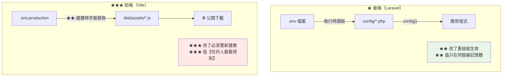

# 前後端分離的環境變數與建置流程

> [!abstract] 這篇你會學到
> - **★★★ 前端與後端環境變數的根本差異**
> - **秘密管理**（哪些能放前端、哪些絕對不行）
> - **多環境策略**（dev / staging / production）
> - **★★ build once, deploy anywhere**
> - **可重現的建置**（lock 檔與版本鎖定）
> - **秘密輪替**與外洩處理
> - **建置流程的檢查清單**

## 前置知識

- [[130-01-05-01-guide-前後端-前後端分離架構選型]] — 架構的選擇
- [[130-01-04-04-guide-Laravel-快取最佳化與部署流程]] — `config:cache` 與 `env()`

---

## ★★★ 前端與後端的根本差異



| | **後端（Laravel）** | **前端（Vite / Vue）** | **Nuxt SSR** |
| --- | --- | --- | --- |
| 讀取時機 | **執行時** | **★★★ 建置時** | **執行時**（runtimeConfig） |
| 改了要做什麼 | **重啟 / `config:cache`** | **★★★ 重新建置** | **重啟** |
| 值的可見性 | **只在伺服器** | **★★★ 公開可讀** | public 公開、其餘只在伺服器 |
| 能放秘密嗎 | **✓ 可以** | **★★★ 絕對不行** | **public 不行、其餘可以** |
| 前綴 | 無 | `VITE_` | `NUXT_` / `NUXT_PUBLIC_` |
| 存放位置 | `shared/.env` | `shared/.env.production` | 環境變數（PM2/systemd） |

> [!danger] 前端的環境變數是「公開的常數」★★★★
> ```
> ★★★ Vite 的處理方式是【字面替換】：
>
>   原始碼：  const key = import.meta.env.VITE_API_KEY;
>   建置後：  const key = "sk_live_abc123xyz";     ← ★★★ 寫死在 JS 裡
>
> ★★★★ 這表示：
>   · 任何人 F12 → Sources 就看得到
>   · curl https://app/assets/index-abc.js | grep sk_live
>   · ★ 存在瀏覽器快取、CDN、使用者的硬碟裡
>   · ★★ 就算之後改了，舊版的 JS 可能還在別人的快取中
>
> ★★★★ 所以「VITE_ 變數」等同於「寫在原始碼裡的常數」
>   → 只能放【你願意公開在網頁原始碼裡】的東西
> ```

---

## 哪些能放前端 ★★

```dotenv
# ═══════ ✅ 可以放前端（.env.production）═══════
VITE_API_BASE=/api                              # ★ API 網址
VITE_APP_TITLE=客戶關係管理系統                   # ★ 應用標題
VITE_APP_ENV=production
VITE_APP_VERSION=a1b2c3d
VITE_SENTRY_DSN=https://xxx@sentry.io/123       # ★ 設計上就是公開的
VITE_GOOGLE_MAPS_KEY=AIza...                    # ★★ 但【必須】在後台設網域白名單
VITE_RECAPTCHA_SITE_KEY=6Lc...                  # ★ site key 本來就公開
VITE_FEATURE_NEW_UI=true                        # ★ feature flag
VITE_MAX_UPLOAD_MB=20                           # ★ UI 的提示用

# ═══════ ❌❌❌ 絕對不能放前端 ═══════
# VITE_DB_PASSWORD=...              ★★★★ 資料庫密碼
# VITE_API_SECRET=...               ★★★★ API 私鑰
# VITE_JWT_SECRET=...               ★★★★ 簽章金鑰
# VITE_AWS_SECRET_ACCESS_KEY=...    ★★★★
# VITE_SMTP_PASSWORD=...            ★★★★
# VITE_RECAPTCHA_SECRET_KEY=...     ★★★ secret key（★ 與 site key 不同！）
# VITE_ADMIN_TOKEN=...              ★★★★
```

> [!warning] 「公開的 key」也要設限制 ★★
> ```
> ★★ Google Maps API Key、Firebase config 這類「設計上公開」的金鑰
>   → ★ 它們公開沒關係，但【必須在服務商後台設限制】：
>     · Google Maps：★★ HTTP referrer 白名單（只允許你的網域）
>     · Firebase：★ 安全規則（Security Rules）
>     · reCAPTCHA：site key 公開、★★★ secret key 只在後端
>
> ★★★ 沒設限制的後果：
>   別人拿你的 key 用在他們的網站上
>   → ★★ 你的配額被用光、被收費
>   → 或超過免費額度後服務中斷
>
> ★ 驗證：
>   把 key 貼到別的網域測試 → 應該被拒絕
> ```

```bash
#!/usr/bin/env bash
# /usr/local/bin/check-frontend-secrets —— ★★★ 前端秘密掃描
set -uo pipefail
D="${1:-dist}"
FAIL=0

echo "═══ 前端建置產物的秘密掃描：$D ═══"

# ★★★ 高風險的 pattern
declare -A PATTERNS=(
  ["Stripe 私鑰"]='sk_live_[0-9a-zA-Z]{24,}'
  ["Stripe 測試私鑰"]='sk_test_[0-9a-zA-Z]{24,}'
  ["AWS Access Key"]='AKIA[0-9A-Z]{16}'
  ["GitHub Token"]='gh[pousr]_[A-Za-z0-9]{36,}'
  ["Slack Token"]='xox[baprs]-[0-9A-Za-z-]{10,}'
  ["私鑰檔"]='-----BEGIN (RSA |EC |OPENSSH |PGP )?PRIVATE KEY'
  ["JWT 密鑰樣式"]='(jwt|token)[_-]?secret["\x27]?\s*[:=]\s*["\x27][^"\x27]{16,}'
  ["密碼賦值"]='(password|passwd|pwd)["\x27]?\s*[:=]\s*["\x27][^"\x27]{8,}'
  ["通用 secret"]='(api[_-]?secret|client[_-]?secret)["\x27]?\s*[:=]\s*["\x27][^"\x27]{16,}'
  ["資料庫連線字串"]='(mysql|postgres(ql)?|mongodb)://[^:]+:[^@]+@'
  ["Google API 私鑰"]='"private_key"\s*:\s*"-----BEGIN'
)

for name in "${!PATTERNS[@]}"; do
    printf '  %-22s ' "$name"
    if grep -rlEI "${PATTERNS[$name]}" "$D" 2>/dev/null | head -1 | grep -q .; then
        printf '\033[31m✗✗✗ 發現！\033[0m\n'
        grep -rEIo "${PATTERNS[$name]}" "$D" 2>/dev/null | head -3 | \
          sed 's/\(.\{40\}\).*/\1…/' | sed 's/^/      /'
        FAIL=1
    else
        printf '\033[32m✓\033[0m\n'
    fi
done

echo -e "\n  ── 所有注入的 VITE_ 變數 ──"
grep -rhoEI 'VITE_[A-Z0-9_]+' "$D" 2>/dev/null | sort -u | sed 's/^/    /' || echo "    （無）"

echo -e "\n  ── ★ 可疑的長字串（可能是 token）──"
grep -rhoEI '["\x27][A-Za-z0-9_+/=-]{40,}["\x27]' "$D" 2>/dev/null | \
  grep -vE '^["\x27](data:|https?://|/assets/)' | \
  sort -u | head -5 | sed 's/\(.\{60\}\).*/\1…/' | sed 's/^/    /' || echo "    （無）"

echo -e "\n  ── sourcemap ──"
MAPS=$(find "$D" -name '*.map' 2>/dev/null | wc -l)
if [ "$MAPS" -gt 0 ]; then
    printf '  \033[31m✗✗ 發現 %s 個 sourcemap（★ 可還原原始碼）\033[0m\n' "$MAPS"
    FAIL=1
else
    printf '  \033[32m✓\033[0m 沒有 sourcemap\n'
fi

echo
[ "$FAIL" -eq 0 ] && echo "  ✓✓ 通過" || echo "  ★★★ 發現問題 —— 【不要部署】"
exit "$FAIL"
```

```bash
# ★★ 加進建置流程（★ 失敗就中止部署）
$ npm run build && check-frontend-secrets dist || exit 1

# ★★ 也對【已上線】的網站掃描
$ S=https://app.example.gov.tw
$ curl -s "$S/" | grep -oE '/assets/[^"]+\.js' | while read -r j; do
    curl -s "$S$j"
  done | grep -oEi 'sk_live_[A-Za-z0-9]+|AKIA[0-9A-Z]{16}|-----BEGIN' | sort -u
```

---

## 多環境策略 ★★

```
★★ 三個環境的檔案佈局：

/var/www/crm-api/shared/
  .env                    ← ★ 只有一個（★ 由環境決定內容）

/var/www/crm-app/shared/
  .env.production         ← ★ 建置時複製到專案根目錄

★★★ 不要在伺服器上放多個環境的 .env
  → 一台伺服器 = 一個環境
  → ★ 避免「部署時選錯 .env」的災難
```

| 設定 | development | staging | production |
| --- | --- | --- | --- |
| `APP_ENV` | `local` | `staging` | **`production`** |
| **`APP_DEBUG`** | `true` | **`false`** | **`false`** ★★★ |
| `LOG_LEVEL` | `debug` | `info` | **`warning`** |
| 資料庫 | 本機 | **正式資料的副本（★ 去識別化）** | 正式 |
| `SESSION_SECURE_COOKIE` | `false` | `true` | `true` |
| OPcache `validate_timestamps` | `1` | `0` | **`0`** |
| 憑證 | 自簽 | 內部 CA | **公信 CA / 內部 CA** |
| 搜尋引擎 | — | **`noindex`** ★ | 允許 |
| 郵件 | `log` | **`log` 或攔截** ★★ | 正式 SMTP |
| 佇列 worker | 手動 | 1 個 | 3 個 |

> [!danger] staging 的三個必要防護 ★★★
> ```
> ① ★★★ 絕對不要寄真的信給真的使用者
>      → MAIL_MAILER=log
>      → ★★ 或用 Mailpit / Mailtrap 攔截
>      → ★★★ 曾發生過：staging 用了正式資料庫的副本，
>        測試時寄了幾萬封信給真實使用者
>
> ② ★★★ 資料要去識別化
>      → email 改成 xxx@example.test
>      → 姓名、電話、身分證號都要遮蔽
>      → ★★ 否則 staging 外洩 = 個資外洩
>
> ③ ★★ 擋掉搜尋引擎與外部存取
>      → X-Robots-Tag: noindex, nofollow
>      → ★ Nginx 的 IP 限制或 HTTP Basic Auth
> ```

```php
<?php
// ★★★ staging 的郵件攔截
// AppServiceProvider::boot()
if (app()->environment('staging')) {
    // ★★ 所有的信都轉寄到測試信箱
    Mail::alwaysTo(config('mail.staging_catch_all', 'staging@example.gov.tw'));
    // ★ 或直接寫檔案
    // config(['mail.default' => 'log']);
}
```

```bash
# ★★★ 資料去識別化腳本
$ sudo tee /usr/local/bin/anonymize-db >/dev/null <<'EOF'
#!/usr/bin/env bash
# ★★★ 把正式資料庫的副本去識別化（★ 只在 staging 執行）
set -euo pipefail
DB="${1:?用法: anonymize-db <資料庫名>}"

# ★★ 安全檢查
HOST=$(hostname)
case "$HOST" in
  *prod*|*production*) echo "✗✗✗ 這是正式環境，中止"; exit 1 ;;
esac
read -rp "確認要在 $HOST 的 $DB 執行去識別化？(yes/no) " a
[ "$a" = yes ] || exit 0

mysql "$DB" <<'SQL'
-- ★★ 使用者
UPDATE users SET
  email = CONCAT('user', id, '@example.test'),
  name  = CONCAT('測試使用者', id),
  phone = CONCAT('0900', LPAD(id, 6, '0')),
  password = '$2y$12$abcdefghijklmnopqrstuv',   -- ★ 統一的測試密碼
  remember_token = NULL,
  two_factor_secret = NULL,
  two_factor_recovery_codes = NULL
WHERE email NOT LIKE '%@example.gov.tw';        -- ★ 保留內部測試帳號

-- ★★ 客戶
UPDATE customers SET
  name    = CONCAT('客戶', id),
  email   = CONCAT('customer', id, '@example.test'),
  phone   = CONCAT('0911', LPAD(id, 6, '0')),
  address = CONCAT('測試地址 ', id, ' 號'),
  id_number = NULL,                              -- ★★★ 身分證號直接清空
  tax_id  = NULL;

-- ★★ 清掉敏感的記錄
TRUNCATE TABLE personal_access_tokens;
TRUNCATE TABLE sessions;
TRUNCATE TABLE failed_jobs;
TRUNCATE TABLE password_reset_tokens;
DELETE FROM activity_log WHERE created_at < DATE_SUB(NOW(), INTERVAL 30 DAY);

-- ★ 清掉檔案路徑（避免指向正式環境的檔案）
UPDATE attachments SET path = CONCAT('staging/', id, '.dat');
SQL

echo "✓ 去識別化完成"
echo "★★ 請再人工抽查幾筆確認"
mysql "$DB" -e "SELECT id, name, email, phone FROM users LIMIT 5;"
EOF
$ sudo chmod +x /usr/local/bin/anonymize-db
```

```nginx
# ★★ staging 的 Nginx 防護
server {
    server_name staging.example.gov.tw;

    # ★★★ 擋搜尋引擎
    add_header X-Robots-Tag "noindex, nofollow, noarchive, nosnippet" always;

    # ★★ 只允許內網
    allow 10.0.0.0/8;
    deny all;

    # ★ 或用 Basic Auth
    # auth_basic "Staging Environment";
    # auth_basic_user_file /etc/nginx/.htpasswd-staging;

    location = /robots.txt {
        add_header Content-Type text/plain;
        return 200 "User-agent: *\nDisallow: /\n";
    }
}
```

---

## ★★ build once, deploy anywhere

```
★★★ 理想：同一份建置產物部署到所有環境
   → staging 測過的【就是】production 跑的
   → ★ 避免「staging 好好的、production 壞掉」

★★ 三種前端的可行性：
  · Laravel（後端）    ✓ 天生支援（執行時讀 .env）
  · Nuxt SSR           ✓ 天生支援（runtimeConfig）
  · ★★ Vite SPA        ✗ 預設不行 → 需要 env.js 技巧
```

```html
<!-- ★★★ index.html —— 在 app 之前載入 -->
<!DOCTYPE html>
<html lang="zh-Hant">
<head>
  <meta charset="UTF-8">
  <title>%VITE_APP_TITLE%</title>
  <!-- ★★★ 執行時產生，絕不快取 -->
  <script src="/env.js"></script>
</head>
<body>
  <div id="app"></div>
  <script type="module" src="/src/main.ts"></script>
</body>
</html>
```

```javascript
// public/env.js —— ★ 開發時的預設值（會被部署時產生的覆蓋）
window.__ENV__ = {
  API_BASE: '/api',
  APP_ENV: 'development',
  APP_VERSION: 'dev',
};
```

```typescript
// ★★ src/config.ts —— 統一的設定入口
declare global {
  interface Window { __ENV__?: Record<string, string>; }
}

function env(key: string, fallback = ''): string {
  return window.__ENV__?.[key]                        // ★★ 優先用執行時的
      ?? (import.meta.env[`VITE_${key}`] as string)   // ★ 退回建置時的
      ?? fallback;
}

export const config = Object.freeze({
  apiBase:    env('API_BASE', '/api'),
  appEnv:     env('APP_ENV', 'production'),
  appVersion: env('APP_VERSION', 'unknown'),
  sentryDsn:  env('SENTRY_DSN', ''),
  featureNewUi: env('FEATURE_NEW_UI', 'false') === 'true',
});
```

```bash
#!/usr/bin/env bash
# /usr/local/bin/gen-env-js —— ★★ 部署時產生 env.js
set -euo pipefail
TARGET="${1:?用法: gen-env-js <輸出路徑> [環境檔]}"
ENVFILE="${2:-}"

[ -n "$ENVFILE" ] && [ -f "$ENVFILE" ] && { set -a; . "$ENVFILE"; set +a; }

# ★★ 用 jq 做正確的 JSON 跳脫（★ 防 XSS）
j(){ printf '%s' "${1:-}" | jq -Rs .; }

cat > "$TARGET" <<EOF
window.__ENV__ = {
  API_BASE: $(j "${API_BASE:-/api}"),
  APP_ENV: $(j "${APP_ENV:-production}"),
  APP_VERSION: $(j "${APP_VERSION:-unknown}"),
  SENTRY_DSN: $(j "${SENTRY_DSN:-}"),
  FEATURE_NEW_UI: $(j "${FEATURE_NEW_UI:-false}")
};
EOF

echo "★ 已產生 $TARGET："
cat "$TARGET" | sed 's/^/    /'
```

```nginx
# ★★★ env.js 絕對不能快取
location = /env.js {
    expires -1;
    add_header Cache-Control "no-cache, no-store, must-revalidate" always;
    add_header Content-Type "application/javascript; charset=utf-8" always;
    add_header X-Content-Type-Options "nosniff" always;
}
```

```bash
# ★★ 部署腳本中的用法
$ gen-env-js "$APP_REL/dist/env.js" "$APP/shared/env.production"

# ★★★ 好處：同一份 dist 可以部署到不同環境
$ rsync -a "$SHARED_DIST/" "$STAGING/releases/$TS/dist/"
$ gen-env-js "$STAGING/releases/$TS/dist/env.js" "$STAGING/shared/env.staging"
$ rsync -a "$SHARED_DIST/" "$PROD/releases/$TS/dist/"
$ gen-env-js "$PROD/releases/$TS/dist/env.js" "$PROD/shared/env.production"
```

> [!warning] `env.js` 仍然是公開的 ★★
> ```
> ★★ 執行時注入解決了「build once」的問題，
>    但【沒有】解決「秘密」的問題
>
> → env.js 是一個公開的 JS 檔案
>   → curl https://app/env.js 就看得到全部內容
>
> ★★★ 所以仍然只能放公開設定
> ★★ 而且要用【白名單】：
>   ❌ env | jq -R > env.js        ← 會洩漏容器裡的所有環境變數
>   ✅ 明確列出要注入的變數
> ```

---

## 可重現的建置 ★★

```bash
# ═══════ ★★★ lock 檔是可重現建置的關鍵 ═══════

# ★★ 後端
$ composer install --no-dev --optimize-autoloader     # ★ 依 composer.lock
# ★★★ 絕不在正式環境跑
$ composer update                                      # ✗✗✗

# ★★ 前端
$ npm ci --no-audit --no-fund                          # ★★ 依 package-lock.json
# ★★★ 不要用
$ npm install                                          # ✗ 會改 lock 檔

# ★★ 驗證 lock 檔與 manifest 一致
$ composer validate --no-check-all --strict
$ npm ci --dry-run
```

```bash
#!/usr/bin/env bash
# /usr/local/bin/check-build-reproducible —— ★★ 建置可重現性檢查
set -uo pipefail
PROJ="${1:-.}"
cd "$PROJ"
FAIL=0

p(){ printf '  \033[32m✓\033[0m %s\n' "$1"; }
f(){ printf '  \033[31m✗✗\033[0m %s\n' "$1"; FAIL=1; }
w(){ printf '  \033[33m⚠\033[0m %s\n' "$1"; }

echo "═══ 建置可重現性檢查 ═══"

# ═══ lock 檔 ═══
echo -e "\n【1】★★ lock 檔"
[ -f composer.lock ] && p "composer.lock 存在" || w "沒有 composer.lock"
[ -f package-lock.json ] && p "package-lock.json 存在" || \
  { [ -f pnpm-lock.yaml ] && p "pnpm-lock.yaml 存在" || \
    { [ -f yarn.lock ] && p "yarn.lock 存在" || w "沒有前端的 lock 檔"; }; }

# ★★ lock 檔有沒有進 git
if [ -d .git ]; then
    git ls-files --error-unmatch composer.lock >/dev/null 2>&1 && \
      p "composer.lock 已納入版控" || f "★★ composer.lock 沒有納入版控"
    git ls-files --error-unmatch package-lock.json >/dev/null 2>&1 && \
      p "package-lock.json 已納入版控" || w "package-lock.json 沒有納入版控"
fi

# ═══ 一致性 ═══
echo -e "\n【2】★★ lock 與 manifest 的一致性"
if [ -f composer.json ]; then
    composer validate --no-check-all --no-check-publish --strict >/dev/null 2>&1 && \
      p "composer.json / lock 一致" || f "★★ composer.lock 過期（★ 需要 composer update）"
fi
if [ -f package-lock.json ]; then
    npm ci --dry-run >/dev/null 2>&1 && \
      p "package.json / lock 一致" || f "★★ package-lock.json 不一致"
fi

# ═══ 版本鎖定 ═══
echo -e "\n【3】★ 版本鎖定"
if [ -f composer.json ]; then
    LOOSE=$(jq -r '.require | to_entries[] | select(.value | test("^\\*$|^>=")) | .key' \
            composer.json 2>/dev/null | wc -l)
    [ "$LOOSE" -eq 0 ] && p "沒有過於寬鬆的版本限制" || \
      { w "有 $LOOSE 個過於寬鬆的版本（* 或 >=）"; \
        jq -r '.require | to_entries[] | select(.value | test("^\\*$|^>=")) | "      \(.key): \(.value)"' \
          composer.json 2>/dev/null | head -5; }

    PHPV=$(jq -r '.require.php // "未指定"' composer.json)
    [ "$PHPV" != "未指定" ] && p "PHP 版本限制：$PHPV" || w "沒有指定 PHP 版本"
fi
if [ -f package.json ]; then
    NODEV=$(jq -r '.engines.node // "未指定"' package.json)
    [ "$NODEV" != "未指定" ] && p "Node 版本限制：$NODEV" || \
      w "★ 沒有 engines.node（★ 建議指定）"
    [ -f .nvmrc ] && p ".nvmrc 存在（$(cat .nvmrc)）" || w "沒有 .nvmrc"
fi

# ═══ 建置環境 ═══
echo -e "\n【4】建置環境"
printf '  PHP       %s\n' "$(php -r 'echo PHP_VERSION;' 2>/dev/null || echo '－')"
printf '  Composer  %s\n' "$(composer -V 2>/dev/null | awk '{print $3}' || echo '－')"
printf '  Node      %s\n' "$(node -v 2>/dev/null || echo '－')"
printf '  npm       %s\n' "$(npm -v 2>/dev/null || echo '－')"

# ═══ .gitignore ═══
echo -e "\n【5】★★★ .gitignore"
for pat in '.env' 'node_modules' 'vendor' '/public/build' 'auth.json'; do
    printf '  %-20s ' "$pat"
    grep -qE "^/?${pat//\//\\/}" .gitignore 2>/dev/null && \
      printf '\033[32m✓\033[0m\n' || printf '\033[33m⚠ 沒有排除\033[0m\n'
done

# ★★★ 有沒有誤 commit
if [ -d .git ]; then
    echo -e "\n【6】★★★ 敏感檔案的版控狀態"
    for fx in .env .env.production auth.json storage/oauth-private.key; do
        printf '  %-28s ' "$fx"
        if git ls-files --error-unmatch "$fx" >/dev/null 2>&1; then
            printf '\033[31m✗✗✗ 已被 commit！\033[0m\n'; FAIL=1
        else
            printf '\033[32m✓\033[0m\n'
        fi
    done

    # ★★ 檢查歷史
    printf '  %-28s ' "★ git 歷史中的 .env"
    if git log --all --full-history --oneline -- .env 2>/dev/null | head -1 | grep -q .; then
        printf '\033[31m✗✗✗ 歷史中出現過\033[0m\n'; FAIL=1
    else
        printf '\033[32m✓\033[0m\n'
    fi
fi

echo -e "\n$([ "$FAIL" -eq 0 ] && echo '  ✓✓ 通過' || echo '  ★★ 有問題需要處理')"
exit "$FAIL"
```

```json
// ★★ package.json 的版本鎖定
{
  "engines": {
    "node": ">=22.0.0 <23",
    "npm": ">=10"
  },
  "packageManager": "npm@10.9.0"
}
```

```
# .nvmrc
22.12.0
```

```json
// ★ composer.json
{
  "require": {
    "php": "^8.3",
    "laravel/framework": "^11.36"
  },
  "config": {
    "platform": {
      "php": "8.3.14"          // ★★ 鎖定解析用的 PHP 版本
    }
  }
}
```

---

## 秘密的存放與輪替 ★★

```
★★★ 秘密的三層存放（由好到差）：

  ① ★★★ 專用的秘密管理系統
     · HashiCorp Vault、AWS Secrets Manager
     · ★ 有版本、稽核、自動輪替
     · ★★ 機關可用：內部的密碼管理系統 + 存取記錄

  ② ★★ 檔案（權限 640，deploy:www-data）
     · /var/www/xxx/shared/.env
     · ★ 不進 git
     · ★★ 備份時要加密

  ③ ★ 環境變數
     · systemd 的 Environment= 或 EnvironmentFile=
     · ★★ 注意 docker inspect / ps 看得到

  ❌❌❌ 絕對不行：
     · commit 進 git
     · 寫在程式碼裡
     · 放在前端
     · 明文的備份檔
```

```bash
#!/usr/bin/env bash
# /usr/local/bin/rotate-secret —— ★★ 秘密輪替
set -euo pipefail
KEY="${1:?用法: rotate-secret <KEY名稱> [新值]}"
NEW="${2:-}"
ENV=/var/www/crm-api/shared/.env
TS=$(date +%Y%m%d%H%M%S)

# ★★ 備份
sudo cp "$ENV" "$ENV.bak-$TS"
sudo chmod 600 "$ENV.bak-$TS"

OLD=$(sudo grep "^$KEY=" "$ENV" | cut -d= -f2-)
[ -n "$NEW" ] || NEW=$(openssl rand -base64 32)

echo "═══ 輪替 $KEY ═══"
echo "  舊值：${OLD:0:8}…（長度 ${#OLD}）"
echo "  新值：${NEW:0:8}…（長度 ${#NEW}）"
read -rp "  確認？(yes/no) " a; [ "$a" = yes ] || exit 0

# ★★ 更新
sudo sed -i "s|^$KEY=.*|$KEY=$NEW|" "$ENV"

# ★★★ 依 key 的類型做對應的處理
case "$KEY" in
  APP_KEY)
    echo "  ★★★★ APP_KEY 輪替會讓："
    echo "     · 所有使用者立刻登出"
    echo "     · 【加密欄位永久無法解密】"
    echo "  ★★ 若有 encrypted cast 的欄位，必須先用舊 key 解密再用新 key 加密"
    echo "     php artisan app:re-encrypt --old-key=\"$OLD\""
    ;;
  DB_PASSWORD)
    echo "  ★★ 記得同步更新 MySQL 的密碼："
    echo "     ALTER USER 'crmuser'@'127.0.0.1' IDENTIFIED BY '$NEW';"
    ;;
  REDIS_PASSWORD)
    echo "  ★★ 記得同步更新 /etc/redis/redis.conf 的 requirepass"
    ;;
esac

# ★★ 套用
cd /var/www/crm-api/current
sudo -u deploy php artisan config:clear
sudo -u deploy php artisan config:cache
sudo systemctl reload php8.3-fpm
sudo -u deploy php artisan queue:restart
sudo supervisorctl restart laravel-workers:

# ★★ 驗證
sleep 3
if curl -sf -o /dev/null https://crm.internal.example.gov.tw/api/health/ready; then
    echo "  ✓ 服務正常"
    echo "  ★★ 請把新值存到密碼管理系統，然後刪除備份："
    echo "     sudo shred -u $ENV.bak-$TS"
else
    echo "  ✗✗ 服務異常，回退"
    sudo cp "$ENV.bak-$TS" "$ENV"
    sudo -u deploy php artisan config:cache
    sudo systemctl reload php8.3-fpm
    exit 1
fi
```

> [!danger] 秘密外洩的處理流程 ★★★
> ```
> ★★★ 一旦秘密可能外洩（commit 到 git、貼到聊天室、日誌洩漏）：
>
> ① ★★★★ 【立刻輪替】—— 不要等調查完
>      · 假設它已經被取得
>      · ★ 公開的 GitHub repo 會在幾分鐘內被機器人掃到
>
> ② 撤銷舊的
>      · API key → 到服務商後台撤銷
>      · 資料庫密碼 → ALTER USER
>      · ★★ token → 刪除 DB 記錄
>
> ③ ★★ 清除痕跡（★ 但不要以為這樣就安全了）
>      · git filter-repo 或 BFG 清歷史
>      · ★ force push
>      · 清除日誌中的記錄
>
> ④ ★★ 調查影響範圍
>      · 那個秘密能做什麼？
>      · 有沒有異常的存取記錄？
>      · ★ 需要通報嗎？
>
> ⑤ 檢討與改善
>      · 為什麼會外洩？
>      · ★★ 加上 pre-commit hook 掃描
> ```

```bash
# ★★ pre-commit hook 防止秘密進 git
$ cat > .git/hooks/pre-commit <<'EOF'
#!/usr/bin/env bash
set -euo pipefail

PATTERNS='sk_live_[0-9a-zA-Z]{24,}|AKIA[0-9A-Z]{16}|gh[pousr]_[A-Za-z0-9]{36}|-----BEGIN (RSA |EC )?PRIVATE KEY|(password|secret|api_key)["\x27]?\s*[:=]\s*["\x27][^"\x27]{12,}'

FOUND=0
while IFS= read -r f; do
    # ★ 跳過 .example 檔案
    case "$f" in *.example|*.sample) continue;; esac
    if git show ":$f" 2>/dev/null | grep -qEI "$PATTERNS"; then
        echo "✗✗✗ $f 中可能含有秘密"
        git show ":$f" | grep -nEI "$PATTERNS" | head -3 | sed 's/^/    /'
        FOUND=1
    fi
done < <(git diff --cached --name-only --diff-filter=ACM)

# ★★ 檢查敏感檔名
for f in $(git diff --cached --name-only); do
    case "$f" in
      .env|.env.production|.env.local|auth.json|*.pem|*.key|*.p12|*.pfx)
        echo "✗✗✗ 不應該 commit $f"
        FOUND=1 ;;
    esac
done

[ "$FOUND" -eq 0 ] || {
    echo
    echo "★★ 若確定是誤判，用 git commit --no-verify 跳過"
    exit 1
}
EOF
$ chmod +x .git/hooks/pre-commit

# ★★ 或用工具（★ 團隊統一）
$ pip install pre-commit detect-secrets
$ cat > .pre-commit-config.yaml <<'EOF'
repos:
  - repo: https://github.com/Yelp/detect-secrets
    rev: v1.5.0
    hooks:
      - id: detect-secrets
        args: ['--baseline', '.secrets.baseline']
EOF
$ detect-secrets scan > .secrets.baseline
$ pre-commit install
```

---

## 建置流程檢查清單 ★★

```bash
#!/usr/bin/env bash
# /usr/local/bin/build-checklist —— ★★ 建置流程檢查
set -uo pipefail
API="${1:-/var/www/crm-api}"
APP="${2:-/var/www/crm-app}"
P=0; F=0

ok(){ printf '  \033[32m✓\033[0m %s\n' "$1"; P=$((P+1)); }
ng(){ printf '  \033[31m✗✗\033[0m %s\n' "$1"; F=$((F+1)); }
ck(){ eval "$2" >/dev/null 2>&1 && ok "$1" || ng "$1"; }

echo "═══ 建置流程檢查 ═══"

echo -e "\n【1】★★★ 環境變數"
ck "後端 .env 存在"           "[ -f '$API/shared/.env' ]"
ck "★★ .env 權限 ≤640"        "[ \$(stat -Lc %a '$API/shared/.env') -le 640 ]"
ck "★★★ APP_DEBUG=false"      "grep -q '^APP_DEBUG=false' '$API/shared/.env'"
ck "APP_ENV=production"       "grep -q '^APP_ENV=production' '$API/shared/.env'"
ck "APP_KEY 已設定"           "grep -q '^APP_KEY=base64:' '$API/shared/.env'"
ck "前端 .env.production"     "[ -f '$APP/shared/.env.production' ]"

echo -e "\n【2】★★★ 前端沒有秘密"
if [ -d "$APP/current/dist" ]; then
    /usr/local/bin/check-frontend-secrets "$APP/current/dist" >/dev/null 2>&1 && \
      ok "★★★ 建置產物無秘密" || ng "★★★★ 建置產物中發現秘密"
fi
VITEVARS=$(grep -oE '^VITE_[A-Z0-9_]+' "$APP/shared/.env.production" 2>/dev/null | sort -u)
echo "  ── 注入前端的變數 ──"
echo "$VITEVARS" | sed 's/^/    /'
echo "$VITEVARS" | grep -qiE 'SECRET|PASSWORD|PRIVATE|_KEY$' && \
  ng "★★★★ VITE_ 變數名稱中有 SECRET/PASSWORD/KEY" || \
  ok "VITE_ 變數名稱看起來安全"

echo -e "\n【3】★★ lock 檔"
ck "composer.lock 存在"       "[ -f '$API/current/composer.lock' ]"
ck "★★ 沒有開發相依"           "[ ! -d '$API/current/vendor/phpunit' ]"
ck "★ node_modules 已移除"     "[ ! -d '$APP/current/node_modules' ]"

echo -e "\n【4】★★ 建置產物"
ck "前端 index.html"          "[ -f '$APP/current/dist/index.html' ]"
ck "★ 有 hash 的資源"          "ls '$APP/current/dist/assets/'*-*.js >/dev/null"
ck "★★ 沒有 sourcemap"         "! find '$APP/current/dist' -name '*.map' | grep -q ."
ck "★ 有預壓縮"               "ls '$APP/current/dist/assets/'*.gz >/dev/null 2>&1"

echo -e "\n【5】★★ 版控"
if [ -d "$API/current/.git" ] || [ -d "$APP/current/.git" ]; then
    ng "★★ release 中還有 .git 目錄"
else
    ok "★★ .git 已移除"
fi

echo -e "\n【6】★★ 快取"
for f in config routes services; do
    [ -f "$API/current/bootstrap/cache/$f.php" ] && ok "$f 快取" || \
      printf '  \033[33m⚠\033[0m %s 沒有快取\n' "$f"
done

echo -e "\n【7】版本一致性"
API_V=$(cat "$API/current/VERSION" 2>/dev/null || echo "未知")
APP_V=$(jq -r '.version // "未知"' "$APP/current/dist/version.json" 2>/dev/null || echo "未知")
printf '  後端版本  %s\n' "$API_V"
printf '  前端版本  %s\n' "$APP_V"

echo -e "\n═══ ✓ $P  ✗ $F ═══"
[ "$F" -eq 0 ] || exit 1
```

---

## 常見錯誤與排錯

| 現象 | 原因 | 解法 |
| --- | --- | --- |
| **秘密洩漏在 JS 裡** ★★★★ | 用 `VITE_` 放 secret | 移到後端；**立刻輪替金鑰** |
| **改了 `.env` 前端沒變** ★★★ | Vite 是建置時讀取 | **重新建置** |
| **改了 `.env` 後端沒變** ★★★ | `config:cache` | `config:clear && config:cache` |
| **正式環境功能壞掉但本機正常** ★★★ | `config/` 外用 `env()` | 改用 `config()` |
| **`npm ci` 報 sync 錯誤** ★★ | lock 與 package.json 不一致 | 在**開發機**跑 `npm install` |
| **staging 寄信給真實使用者** ★★★★ | 沒攔截郵件 | `MAIL_MAILER=log` / `Mail::alwaysTo` |
| **staging 有真實個資** ★★★ | 沒去識別化 | `anonymize-db` |
| **同一份 dist 無法多環境** ★★ | Vite 建置時寫死 | `env.js` + entrypoint |
| **`env.js` 改了沒生效** ★★★ | 被快取 | `no-store` |
| **建置結果不一致** ★★ | 用了 `npm install` | 用 `npm ci` |
| `.env` 被 commit ★★★★ | `.gitignore` 沒設 | **輪替所有秘密**；清歷史 |

### 排查

```bash
API=/var/www/crm-api
APP=/var/www/crm-app
S=https://crm.internal.example.gov.tw

# 【1】★★★ 前端是否有秘密
$ check-frontend-secrets "$APP/current/dist"
$ curl -s "$S/" | grep -oE '/assets/[^"]+\.js' | while read -r j; do
    curl -s "$S$j"
  done | grep -oEi 'sk_live|AKIA[0-9A-Z]{16}|-----BEGIN' | sort -u

# 【2】★★ 注入的變數
$ grep -rhoE 'VITE_[A-Z0-9_]+' "$APP/current/dist" | sort -u
$ grep -oE '^VITE_[A-Z0-9_]+' "$APP/shared/.env.production" | sort -u

# 【3】★★★ 後端的 env() 使用
$ grep -rn "env(" "$API/current/app" "$API/current/routes" --include='*.php' | grep -v config/

# 【4】★★ 設定的實際值
$ php "$API/current/artisan" config:show app | head -20
$ php "$API/current/artisan" about | head -25

# 【5】★★ lock 檔一致性
$ (cd "$API/current" && composer validate --no-check-all --strict)
$ (cd "$APP/current" && npm ci --dry-run 2>&1 | tail -3)   # ★ 需要 node_modules

# 【6】★★★ git 中的敏感檔案
$ (cd "$API/current" 2>/dev/null && git log --all --oneline -- .env 2>/dev/null)
$ git log --all -p -S 'DB_PASSWORD' 2>/dev/null | head -20

# 【7】版本一致性
$ curl -s "$S/version.json"
$ curl -s "$S/api/health/version" | jq
$ tail -3 "$API/shared/deploy.log"

# 【8】檢查清單
$ build-checklist "$API" "$APP"
```

---

## 安全性注意事項

> [!danger] 環境變數的四條紅線 ★★★
> ```
> ① ★★★★ 前端不放秘密
>      → VITE_ 變數 = 寫在原始碼裡的公開常數
>      → 已經放過的 → 【視為已外洩，立刻輪替】
>
> ② ★★★★ .env 不進 git
>      → .gitignore 排除
>      → ★ pre-commit hook 防護
>      → 已經 commit 過 → 【輪替所有秘密】+ 清歷史
>
> ③ ★★★ staging 不用真實資料與真實郵件
>      → 資料去識別化
>      → MAIL_MAILER=log 或攔截
>
> ④ ★★ config/ 以外不用 env()
>      → config:cache 後回傳 null
>      → CI 要有掃描
> ```

```bash
# ★★★ 每季的秘密盤點
$ sudo tee /usr/local/bin/secret-inventory >/dev/null <<'EOF'
#!/usr/bin/env bash
ENV=/var/www/crm-api/shared/.env
echo "═══ 秘密盤點（$(date +%F)）═══"
echo
printf '%-30s %-10s %s\n' "變數" "長度" "最後修改"
printf '%.0s─' {1..60}; echo
sudo grep -E '^[A-Z_]+=(.+)$' "$ENV" | while IFS='=' read -r k v; do
    case "$k" in
      *PASSWORD*|*SECRET*|*KEY*|*TOKEN*|*DSN*)
        printf '%-30s %-10s %s\n' "$k" "${#v}" \
          "$(stat -c %y "$ENV" | cut -d' ' -f1)" ;;
    esac
done
echo
echo "★★ 檢查項目："
echo "  □ 每個秘密都存在密碼管理系統？"
echo "  □ 有沒有超過一年沒輪替的？"
echo "  □ 離職的同仁還知道哪些？"
echo "  □ 備份檔有加密嗎？"
EOF
$ sudo chmod +x /usr/local/bin/secret-inventory
```

---

## 速查表

### ★★★ 三種環境變數

```
後端 Laravel    執行時讀 .env → config() ★ 改了重啟就生效，值只在伺服器
前端 Vite       ★★★ 建置時字面替換 → 改了必須重新建置，★★★ 值公開可讀
Nuxt SSR        runtimeConfig ★ 執行時讀，public 公開、其餘只在伺服器
```

### 前端能放什麼

```dotenv
✅ VITE_API_BASE / VITE_APP_TITLE / VITE_APP_VERSION
✅ VITE_SENTRY_DSN / VITE_RECAPTCHA_SITE_KEY
✅ VITE_GOOGLE_MAPS_KEY   ★★ 但必須在後台設網域白名單

❌❌❌ 任何 SECRET / PASSWORD / PRIVATE_KEY / TOKEN
```

### ★★★ 秘密掃描

```bash
check-frontend-secrets dist          # ★ 建置後立刻掃
# ★ 加進建置流程
npm run build && check-frontend-secrets dist || exit 1

# ★ 已上線的網站
curl -s https://app/ | grep -oE '/assets/[^"]+\.js' | \
  while read -r j; do curl -s "https://app$j"; done | \
  grep -oEi 'sk_live|AKIA[0-9A-Z]{16}|-----BEGIN'
```

### staging 的三個防護 ★★★

```
① ★★★ 不寄真信 → MAIL_MAILER=log 或 Mail::alwaysTo()
② ★★★ 資料去識別化 → anonymize-db
③ ★★ 擋搜尋引擎與外部 → X-Robots-Tag + IP 限制
```

### build once, deploy anywhere

```
Laravel   ✓ 天生支援
Nuxt SSR  ✓ runtimeConfig
★★ Vite   ✗ → env.js + entrypoint 產生
```
```html
<script src="/env.js"></script>     <!-- ★★ 在 app 之前 -->
```
```nginx
location = /env.js { expires -1; add_header Cache-Control "no-store" always; }  # ★★★
```

### 可重現的建置

```bash
composer install --no-dev --optimize-autoloader   # ★★ 依 lock
npm ci --no-audit --no-fund                        # ★★ 依 lock

# ★★★ 絕不在正式環境
composer update / npm install
```
```json
{ "engines": { "node": ">=22 <23" }, "packageManager": "npm@10.9.0" }
```

### ★★★ 秘密外洩的處理

```
① ★★★★ 立刻輪替（不要等調查完）
② 撤銷舊的（API 後台 / ALTER USER / 刪 token）
③ 清歷史（git filter-repo）★ 但不要以為就安全了
④ 調查影響範圍與是否需要通報
⑤ 加上 pre-commit hook
```

### ★★ 四條紅線

```
① 前端不放秘密
② .env 不進 git
③ staging 不用真實資料與真實郵件
④ config/ 以外不用 env()
```

---

## 練習題

> [!question]- 練習 1：前端秘密外洩 ★★★★
> 1. 在 `.env.production` 加 `VITE_SECRET_KEY=super-secret-abc123`
> 2. 在程式碼中使用它，執行 `npm run build`
> 3. `grep -r 'super-secret-abc123' dist/` → **找得到嗎？在哪個檔案？**
> 4. 部署後 `curl https://app/assets/xxx.js | grep super-secret`
> 5. 執行 `check-frontend-secrets dist` → **抓到了嗎？**
> 6. **把掃描加進建置流程並驗證會中止部署**

> [!question]- 練習 2：`config:cache` 與 `env()` ★★★
> 1. 在 Controller 用 `env('APP_NAME')` 並 `dd()`
> 2. **不跑 `config:cache`** → 有值嗎？
> 3. 跑 `config:cache` → **是什麼？**
> 4. 改成 `config('app.name')` → 再測
> 5. 用 grep 掃描專案中所有不當的 `env()`
> 6. **寫一個 CI 檢查**

> [!question]- 練習 3：build once ★★
> 1. 實作 `env.js` + `gen-env-js` 機制
> 2. **同一份 `dist`** 部署到兩個目錄，用不同的 `env.js`
> 3. `curl /env.js` → **兩個不同嗎？**
> 4. **故意把 `env.js` 設成長快取**，改環境變數 → 前端讀到新的嗎？
> 5. 改回 `no-store` → 再測
> 6. **在環境變數裡放 `</script><script>alert(1)</script>`** → 會 XSS 嗎？
>    用 `jq -Rs` 跳脫後再測

> [!question]- 練習 4：staging 的防護 ★★★
> 1. 把正式資料庫的備份還原到 staging
> 2. **不做去識別化**，看 `users` 表 → **有真實 email 嗎？**
> 3. **不設 `MAIL_MAILER=log`**，觸發一個寄信的功能 → **寄出去了嗎？**
> 4. 執行 `anonymize-db` + 設定郵件攔截
> 5. 再測一次
> 6. **寫出你們機關的 staging 管理規範**

> [!question]- 練習 5：秘密外洩演練 ★★★
> **★ 在測試 repo**
> 1. **故意把 `.env` commit 進 git 並 push**
> 2. **計時**：從 push 到你完成處理花了多久？
> 3. 執行完整的處理流程（輪替 → 撤銷 → 清歷史 → 調查）
> 4. `git log --all -- .env` → 清乾淨了嗎？
> 5. 安裝 pre-commit hook
> 6. **再試一次 commit** → 被擋下來了嗎？

---

## 小測驗

Q1. **前端與後端的環境變數有什麼根本差異**？

Q2. **`VITE_` 變數為什麼等同於「寫在原始碼裡的常數」**？

Q3. **哪些 key 可以放前端？「公開的 key」要注意什麼**？

Q4. **改了前端的 `.env` 為什麼要重新建置**？

Q5. **staging 環境必須做哪三個防護**？

Q6. **什麼是「build once, deploy anywhere」？Vite 怎麼做到**？

Q7. **`npm ci` 與 `npm install` 的差別**？

Q8. **`env.js` 能放秘密嗎**？

Q9. **秘密外洩時第一步該做什麼**？

Q10. **`config/` 以外使用 `env()` 會發生什麼**？

> [!question]- 測驗答案
> **Q1.** **讀取時機與值的可見性完全不同**：
> **後端（Laravel）** —— **執行時**從 `.env` 讀取，
> 改了**重啟或 `config:cache` 就生效**，
> **值只存在於伺服器的記憶體中**（可以放秘密）。
> **前端（Vite）** —— **建置時「字面替換」**進 JS 檔案，
> 改了**必須重新建置**，
> **★★★ 值會被公開下載**（任何人都看得到，絕對不能放秘密）。
> **Nuxt SSR** 介於兩者之間：`runtimeConfig` 是執行時讀取的，
> `public` 底下的會送到瀏覽器（公開），
> 其餘的只存在於伺服器端（可以放秘密）。
>
> **Q2.** 因為 **Vite 在建置時做的是「字面替換」而不是「執行時查詢」**：
> ```
> 原始碼：  const key = import.meta.env.VITE_API_KEY;
> 建置後：  const key = "sk_live_abc123xyz";
> ```
> **那個值就這樣寫死在 `dist/assets/index-abc.js` 裡**，
> 而那個檔案是**公開下載**的。
> **後果**：
> 任何人 F12 → Sources 就看得到；
> `curl https://app/assets/index-abc.js | grep sk_live` 就抓得到；
> 而且它會**存在瀏覽器快取、CDN、使用者的硬碟裡** ——
> **就算之後改了，舊版的 JS 可能還在別人的快取中**。
> **所以「能不能放 VITE_ 變數」的判準是：
> 「你願不願意把它印在網頁的原始碼裡給所有人看」**。
>
> **Q3.** **可以放的**：API 網址、應用標題、版本號、
> 環境名稱、feature flag、UI 用的常數（例如上傳大小上限）、
> **Sentry DSN**（設計上就是公開的）、
> **reCAPTCHA 的 site key**（與 secret key 不同）。
> **「公開的 key」要注意的**：
> Google Maps API Key、Firebase config 這類**設計上公開的金鑰**，
> **必須在服務商的後台設定使用限制**：
> Google Maps 要設 **HTTP referrer 白名單**（只允許你的網域）、
> Firebase 要設**安全規則**。
> **沒設限制的後果**：別人拿你的 key 用在他們的網站上，
> **你的配額被用光、被收費**，或超過免費額度後服務中斷。
>
> **Q4.** 因為 **`VITE_` 變數是在「建置時」被字面替換進 JS 的，不是執行時讀取的**。
> 建置完成後，**`.env.production` 這個檔案根本不會被部署到伺服器上** ——
> 伺服器上只有 `dist/` 裡的靜態檔案，
> 而 API 網址已經是 JS 裡的一個**字串常數**了。
> **所以改了 `.env` 必須重新執行 `npm run build` 產生新的 `dist/` 再部署**。
> **這與後端形成強烈對比**：Laravel 改 `.env` 後
> `php artisan config:cache` 就生效，完全不用重新「建置」。
> **如果需要「不重新建置就能改設定」**，就要用 `env.js` 的執行時注入技巧。
>
> **Q5.** ①**★★★ 絕對不要寄真的信給真的使用者** ——
> `MAIL_MAILER=log` 或用 `Mail::alwaysTo()` 攔截，
> 或用 Mailpit/Mailtrap；
> **曾發生過的事故**：staging 用了正式資料庫的副本，
> 測試時**寄了幾萬封信給真實使用者**。
> ②**★★★ 資料去識別化** —— email 改成 `xxx@example.test`，
> 姓名、電話、**身分證號**都要遮蔽或清空；
> **否則 staging 外洩 = 個資外洩**（而 staging 的防護通常比正式環境弱）。
> ③**★★ 擋掉搜尋引擎與外部存取** ——
> `X-Robots-Tag: noindex, nofollow` + `robots.txt` +
> Nginx 的 IP 限制或 HTTP Basic Auth。
>
> **Q6.** **「同一份建置產物部署到所有環境」** ——
> staging 測過的**就是** production 跑的那一份，
> 避免「staging 好好的、production 壞掉」。
> **Laravel 與 Nuxt SSR 天生支援**（執行時讀環境變數）。
> **Vite SPA 預設不行**（建置時寫死），
> **解法是 `env.js` 技巧**：
> ①`index.html` 在 app 之前載入 `<script src="/env.js">`；
> ②**部署時依環境產生 `env.js`**（設定 `window.__ENV__`）；
> ③前端的 `config.ts` **優先讀 `window.__ENV__`**，退回 `import.meta.env`；
> ④**Nginx 對 `env.js` 設 `no-store`**（否則改了不生效）。
>
> **Q7.** **`npm install`** —— 依 `package.json` 的版本範圍安裝，
> **會修改 `package-lock.json`**，可能裝到與開發機不同的版本，
> **建置結果不可重現**。
> **`npm ci`** —— **嚴格依照 `package-lock.json`**，
> **不修改 lock 檔**，會**先刪除 `node_modules`** 做乾淨安裝，
> **速度也比較快**，而且**如果 `package.json` 與 lock 不一致會直接報錯**
> （這是好事，代表有人改了相依但沒更新 lock）。
> **部署與 CI 一律用 `npm ci`**；
> 遇到 sync 錯誤時應該**在開發機上跑 `npm install` 更新 lock 並 commit**。
> composer 的對應是：正式環境用 `composer install`（依 lock），
> **絕不用 `composer update`**。
>
> **Q8.** **不可以**。`env.js` 是**一個公開的 JavaScript 檔案** ——
> `curl https://app/env.js` 就看得到全部內容，
> 和把秘密寫在 `VITE_` 變數裡**完全一樣糟糕**。
> **執行時注入解決的是「build once, deploy anywhere」的問題，
> 不是「秘密」的問題**。
> **兩個額外的注意事項**：
> ①**用白名單而不是把整個環境倒出去** ——
> `env | jq -R > env.js` 會洩漏容器裡的**所有**環境變數（包含資料庫密碼）；
> ②**值要做 JSON 跳脫**（用 `jq -Rs`）——
> 否則環境變數裡的 `</script>` 或引號會造成 **XSS**。
>
> **Q9.** **★★★★ 立刻輪替 —— 不要等調查完**。
> **理由**：要**假設它已經被取得**；
> **公開的 GitHub repo 會在幾分鐘內被機器人掃到**
> （有專門掃描外洩金鑰的自動化工具）。
> **完整流程**：
> ①**立刻輪替**（產生新的秘密並套用）；
> ②**撤銷舊的**（API key 到服務商後台撤銷、資料庫密碼 `ALTER USER`、
> token 刪 DB 記錄）；
> ③**清除痕跡**（`git filter-repo` 或 BFG 清歷史 + force push）——
> **但不要以為這樣就安全了**（已經被抓走的還是被抓走了）；
> ④**調查影響範圍**（那個秘密能做什麼、有沒有異常的存取記錄、是否需要通報）；
> ⑤**檢討與改善**（加上 pre-commit hook 掃描）。
>
> **Q10.** **`config:cache` 之後，所有 `env()` 呼叫都回傳 `null`**
> （除非給了第二個參數的預設值）。
> 因為 `config:cache` 把所有 `config/*.php` 解析後合併成一個陣列快取起來，
> **Laravel 從此不再讀取 `.env` 檔案**。
> **症狀特別難 debug**：
> **本機開發完全正常**（本機通常沒跑 `config:cache`），
> **部署到正式環境才壞掉**，
> 而且 `php artisan config:clear` 之後又好了（讓人以為是快取的 bug）。
> **正確做法**：**只在 `config/*.php` 裡用 `env()`**，
> 其他地方（Controller、Service、Model、routes、Middleware）一律用 **`config()`**。
> **CI 應該加上掃描**：
> `grep -rn "env(" app/ routes/ database/ --include='*.php' | grep -v config/`

---

## 延伸閱讀

- [[130-01-05-09-guide-前後端-前後端分離常見問題排查]] — 問題排查總表
- [[130-01-06-guide-部署-部署自動化]] — CI/CD 中的秘密管理
- [[130-01-04-04-guide-Laravel-快取最佳化與部署流程]] — `config:cache` 的細節
- [[130-01-02-03-guide-Vue-Docker部署]] — 容器化的執行時注入
- [[130-01-04-07-guide-Laravel-正式環境安全檢查表]] — 完整的安全檢查
- [[090-03-03-guide-應用安全-機密管理與金鑰保護]] — 秘密管理的通用原則
