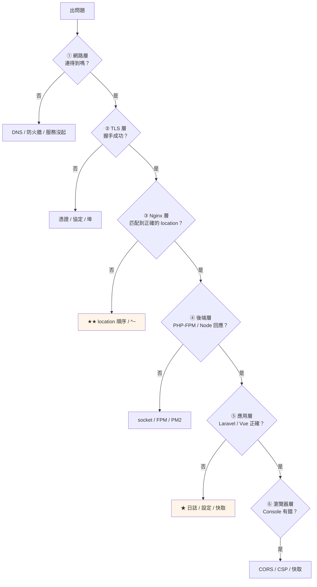

# 前後端分離常見問題排查

> [!abstract] 這篇你會學到
> - **★★★ 分層排查流程**（從外到內定位問題）
> - **症狀對照表**（依錯誤訊息快速查）
> - **十大經典問題**的完整診斷與解法
> - **一鍵診斷腳本**
> - **日誌的閱讀順序**
> - 事故的記錄與檢討

## 前置知識

- [[130-01-05-06-guide-Vue-Laravel完整部署實戰]] — 完整的架構
- [[130-01-05-05-guide-Nginx-前後端流量分流設定]] — 分流設定

---

## ★★★ 分層排查流程



```bash
# ═══════ ★★★ 五分鐘定位（★ 依序執行）═══════
S=https://crm.internal.example.gov.tw
H=crm.internal.example.gov.tw

# ── ① 網路層 ──
$ dig +short "$H"
$ nc -zv "$H" 443
$ ping -c2 "$H"

# ── ② TLS 層 ──
$ echo | openssl s_client -connect "$H:443" -servername "$H" 2>&1 | \
    grep -E 'Verify return code|Protocol|Cipher'

# ── ③ Nginx 層（★★ 最常出問題）──
$ curl -skI "$S/" | head -1
$ curl -sko /dev/null -w 'HTTP %{http_code}  TTFB %{time_starttransfer}s\n' "$S/"
$ sudo tail -20 /var/log/nginx/crm.error.log

# ── ④ 後端層 ──
$ sudo systemctl status php8.3-fpm --no-pager | head -5
$ ls -l /run/php/*.sock
$ curl -s 'http://127.0.0.1/fpm-status' 2>/dev/null | head -8
$ pm2 list 2>/dev/null

# ── ⑤ 應用層（★★★ 最重要的日誌）──
$ sudo tail -50 /var/www/crm-api/shared/storage/logs/laravel-$(date +%Y-%m-%d).log

# ── ⑥ 瀏覽器層 ──
# ★ F12 → Console + Network
```

---

## ★★★ 症狀對照表

### 前端相關

| 症狀 | 最可能的原因 | 快速驗證 | 解法 |
| --- | --- | --- | --- |
| **重新整理子頁面 404** | 沒有 SPA fallback | `curl -o/dev/null -w '%{http_code}' $S/users/1` | `try_files $uri $uri/ /index.html;` |
| **白畫面，Console 一片紅** | 資源 404 | F12 → Network 看紅色 | 檢查 `base` 與 `root` |
| **`Unexpected token '<'`** ★★★ | JS 請求拿到 HTML | `curl $S/assets/x.js \| head -1` | 資源用 `try_files $uri =404;` |
| **`ChunkLoadError`** ★★★ | `index.html` 被快取 | `curl -I $S/ \| grep cache` | `index.html` 設 `no-store` |
| **部署後看到舊版** ★★ | 快取（瀏覽器/CDN/proxy） | 無痕視窗測試 | 清快取；`no-store` |
| 圖片/CSS 路徑錯 | `vite base` | 看 HTML 的 `src` | 設 `base` 與 router base |
| **秘密出現在 JS** ★★★★ | `VITE_` 放了 secret | `check-frontend-secrets dist` | 移到後端 + **輪替金鑰** |

### API 相關

| 症狀 | 最可能的原因 | 快速驗證 | 解法 |
| --- | --- | --- | --- |
| **API 回傳 HTML** ★★★ | SPA fallback 接走 | `curl $S/api/x \| head -1` | `location ^~ /api/` |
| **API 404 但路由存在** ★★ | `root` 或 `try_files` | `php artisan route:list` | 檢查 Nginx 的 `root` |
| **500 但看不到原因** ★★ | `APP_DEBUG=false`（正確） | 看 laravel.log | 用 `trace_id` 查 |
| **502 Bad Gateway** ★★ | FPM 沒跑 / socket 權限 | `ls -l /run/php/*.sock` | 重啟 FPM；檢查權限 |
| **504 Gateway Timeout** | 執行太久 | 看 slowlog | 調 timeout；優化查詢 |
| `File not found` ★★★ | 巢狀 location 沒設 `root` | `nginx -T \| grep -A5 'location ~ \.php'` | 重複設 `root` |
| **上傳 413** ★★ | 四層大小 | 見 [[130-01-04-02-guide-Laravel-Nginx與PHP-FPM設定]] | 四層都調 |
| **上傳後 419** ★★★ | `post_max_size` 太小 | `php-fpm -i \| grep post_max` | 調大 |

### 認證相關

| 症狀 | 最可能的原因 | 快速驗證 | 解法 |
| --- | --- | --- | --- |
| **登入成功但仍 401** ★★★ | `SANCTUM_STATEFUL_DOMAINS` | `php artisan config:show sanctum` | 加上前端網域 |
| **同上（子網域）** ★★★ | `SESSION_DOMAIN` | `curl -I /sanctum/csrf-cookie` 看 domain | 設 `.example.gov.tw` |
| **419 CSRF mismatch** ★★ | 沒先取 CSRF cookie | 看請求順序 | 先呼叫 `/sanctum/csrf-cookie` |
| **cookie 沒被設定** ★★ | `SECURE_COOKIE` + HTTP | `curl -I \| grep set-cookie` | HTTPS 三件套 |
| **登出後仍能存取** ★★★ | 沒 `session()->invalidate()` | 測試 | 補上 |
| 多台 session 不共享 ★★ | 檔案式 session | `config:show session` | `SESSION_DRIVER=redis` |

### CORS 相關

| Console 錯誤 | 原因 | 解法 |
| --- | --- | --- |
| `No 'Access-Control-Allow-Origin'` | Origin 不在白名單 | 加進 `allowed_origins` |
| **`must not be the wildcard '*'`** ★★★ | `'*'` + credentials | 明確列出來源 |
| **`contains multiple values`** ★★★ | Nginx 與 Laravel 都設 | **只設一處** |
| `header field X is not allowed` | 自訂標頭沒列 | 加進 `allowed_headers` |
| **preflight `401`** ★★★ | OPTIONS 被認證擋 | CORS middleware 在 auth 前 |
| **看到 CORS 錯誤而非真正的錯誤** ★★★ | 錯誤回應沒 CORS 標頭 | `add_header ... always` |

### 部署相關

| 症狀 | 最可能的原因 | 解法 |
| --- | --- | --- |
| **部署後執行舊程式碼** ★★★ | OPcache | `systemctl reload php8.3-fpm` |
| **背景工作跑舊邏輯** ★★★★ | worker 沒重啟 | `queue:restart` + `supervisorctl restart` |
| **改 `.env` 沒生效** ★★★ | `config:cache` | `config:clear && config:cache` |
| **正式壞了本機正常** ★★★ | `config/` 外用 `env()` | 改用 `config()` |
| **排程停止** ★★★ | cron 指向 `releases/` | 改成 `current` |
| **上傳的檔案消失** ★★ | `storage` 沒共用 | 放 `shared` 用符號連結 |
| **後台版面爛** ★★★ | 沒 `filament:assets` | 部署腳本加上 |

---

## 十大經典問題 ★★★

### ① `Unexpected token '<'` ★★★

```bash
# ═══ 症狀 ═══
# Console: Uncaught SyntaxError: Unexpected token '<'
# ★★ 意思是：請求了 .js，但拿到 HTML

# ═══ 診斷 ═══
$ curl -s "$S/assets/index-D4f8a2b1.js" | head -3
<!DOCTYPE html>                        # ★★★ 確認了

# ═══ 兩個原因 ═══
# ① 資源的 location 沒用 try_files $uri =404
$ sudo nginx -T | grep -A3 'location.*assets'
location ^~ /assets/ {
    try_files $uri $uri/ /index.html;  # ★★★ 錯誤！會 fallback 成 HTML
}
# ✅ 改成
    try_files $uri =404;

# ② 資源路徑錯（子目錄部署時 base 沒設）
$ curl -s "$S/" | grep -oE 'src="[^"]*"'
src="/assets/index-abc.js"             # ★ 但實際在 /admin/assets/
# ✅ vite.config.ts: base: '/admin/'
```

### ② 部署後白畫面（ChunkLoadError）★★★

```bash
# ═══ 症狀 ═══
# 部署後部分使用者白畫面
# Console: Failed to fetch dynamically imported module / ChunkLoadError

# ═══ 原因 ═══
# ★★★ index.html 被快取 → 指向已刪除的舊 hash 檔案

# ═══ 診斷 ═══
$ curl -skI "$S/" | grep -i cache-control
cache-control: public, max-age=3600    # ★★★ 錯誤！

# ═══ 解法 ═══
# ① Nginx
location = /index.html {
    expires -1;
    add_header Cache-Control "no-cache, no-store, must-revalidate" always;
}
# ② ★★ 前端也要處理
router.onError((e) => {
  if (/Failed to fetch dynamically imported module|ChunkLoadError/i.test(e.message)) {
    window.location.reload();
  }
});
# ③ ★ 部署後清 proxy_cache / CDN
```

### ③ API 回傳 HTML ★★★

```bash
# ═══ 診斷 ═══
$ curl -s "$S/api/health/live" | head -1
<!DOCTYPE html>                        # ★★★ SPA fallback 接走了

# ═══ 原因 ═══
$ sudo nginx -T | grep -n 'location' | head
  50:    location /api/ {              # ★★ 沒有 ^~
  80:    location ~ \.php$ {
  95:    location / {

# ★★ /api/users.php 會被 location ~ \.php$ 接走
# ★★ /api/users（無副檔名）→ 若 /api/ 的 try_files 設錯 → 落到 location /

# ═══ 解法 ═══
location ^~ /api/ {                    # ★★★ 加上 ^~
    root /var/www/crm-api/current/public;
    try_files $uri /index.php?$query_string;
    location ~ \.php$ {
        root /var/www/crm-api/current/public;   # ★★ 巢狀要重複
        try_files $uri =404;
        fastcgi_pass unix:/run/php/php8.3-fpm-crm.sock;
        ...
    }
}
```

### ④ 登入成功但一直 401 ★★★

```bash
# ═══ 診斷流程 ═══
$ C=/tmp/c.txt && rm -f "$C"

# ★ ① CSRF cookie
$ curl -sc "$C" "$S/sanctum/csrf-cookie" -o /dev/null
$ cat "$C"
#crm.internal.example.gov.tw  FALSE  /  TRUE  0  XSRF-TOKEN  eyJ...
# ★★ 檢查 domain 那一欄

# ★ ② 登入
$ XSRF=$(grep XSRF-TOKEN "$C" | awk '{print $7}' | \
    python3 -c 'import sys,urllib.parse;print(urllib.parse.unquote(sys.stdin.read().strip()))')
$ curl -sb "$C" -c "$C" -X POST "$S/api/login" \
    -H "X-XSRF-TOKEN: $XSRF" -H 'Accept: application/json' \
    -H 'Content-Type: application/json' \
    -d '{"email":"...","password":"..."}' -w '\n%{http_code}\n'
200                                    # ★ 登入成功

# ★★★ ③ 但取使用者失敗
$ curl -sb "$C" "$S/api/user" -H 'Accept: application/json' -w '\n%{http_code}\n'
{"message":"Unauthenticated."}
401                                    # ★★★ 問題在這

# ═══ 三個檢查 ═══
$ php artisan config:show sanctum | grep -A5 stateful
# ★★★ 必須包含前端的網域

$ php artisan config:show session | grep -E 'domain|secure|same_site|driver'
# ★★ 子網域時 domain 要有前導點

$ php artisan tinker --execute='
  $r = Illuminate\Http\Request::create("/api/user","GET",[],[],[],[
      "HTTP_REFERER" => "https://crm.internal.example.gov.tw/dashboard"]);
  var_dump(Laravel\Sanctum\Http\Middleware\EnsureFrontendRequestsAreStateful::fromFrontend($r));'
bool(true)                             # ★★ 必須是 true
```

### ⑤ 部署後執行舊程式碼 ★★★

```bash
# ═══ 三個地方都可能 ═══

# ★★ ① OPcache
$ php-fpm8.3 -i 2>/dev/null | grep opcache.validate_timestamps
opcache.validate_timestamps => Off => Off      # ★ 需要 reload
$ sudo systemctl reload php8.3-fpm

# ★★★ ② Queue worker（最常忘記）
$ ps -o pid,lstart,cmd -C php | grep queue:work
12345  Wed Aug 28 09:00:00 2026  php artisan queue:work ...
# ★★ 啟動時間早於部署時間 → 跑舊程式碼
$ readlink /var/www/crm-api/current      # ★ 對照部署時間
$ php artisan queue:restart && sudo supervisorctl restart laravel-workers:

# ★★ ③ 設定快取
$ ls -la /var/www/crm-api/current/bootstrap/cache/
$ php artisan config:clear && php artisan config:cache

# ★★★ ④ 用 $realpath_root 從根本解決 OPcache 的問題
$ sudo nginx -T | grep SCRIPT_FILENAME
fastcgi_param SCRIPT_FILENAME $realpath_root$fastcgi_script_name;   # ★★★
```

### ⑥ 502 Bad Gateway ★★

```bash
# ═══ 診斷順序 ═══
$ sudo tail -20 /var/log/nginx/crm.error.log
connect() to unix:/run/php/php8.3-fpm-crm.sock failed (2: No such file or directory)

# ★ ① socket 存在嗎
$ ls -l /run/php/
# ★ 不存在 → FPM 沒跑或 pool 設定錯

# ★ ② FPM 狀態
$ sudo systemctl status php8.3-fpm --no-pager
$ sudo php-fpm8.3 -t
$ sudo journalctl -u php8.3-fpm -n 30 --no-pager

# ★★ ③ socket 權限
$ ls -l /run/php/php8.3-fpm-crm.sock
srw-rw---- 1 www-data www-data          # ★ Nginx 的 worker 使用者要能寫
$ ps aux | grep 'nginx: worker' | head -1

# ★★ ④ worker 不夠
$ curl -s 'http://127.0.0.1/fpm-status' | grep -E 'listen queue|max children'
listen queue:         12               # ★★ >0 表示排隊
max children reached: 3                # ★★★ 不夠用
$ fpm-sizing crm                       # ★ 重算

# ★ ⑤ PHP 崩潰
$ sudo tail -30 /var/log/php-fpm/crm-error.log
$ sudo dmesg | grep -i 'segfault\|killed process' | tail
```

### ⑦ CORS 錯誤但其實是別的問題 ★★★

```bash
# ═══ 症狀 ═══
# Console: No 'Access-Control-Allow-Origin' header is present
# ★★ 但你明明設了 CORS

# ═══ 真正的原因 ═══
# ★★★ 錯誤回應（4xx/5xx）沒有 CORS 標頭
#     → 前端看到的是 CORS 錯誤，實際上是 500

# ═══ 診斷 ═══
$ curl -sI "$S/api/broken" -H "Origin: $S" | head -1
HTTP/2 500                             # ★★★ 真正的問題

$ curl -sI "$S/api/broken" -H "Origin: $S" | grep -i access-control
# ★ 沒有輸出 → 確認了

# ═══ 解法 ═══
# ① Nginx 的 add_header 加 always
add_header Access-Control-Allow-Origin $cors_origin always;   # ★★★

# ② ★★ 或改用 Laravel 的 CORS middleware（★ 自動處理所有狀態碼）

# ③ ★★ 然後才去修真正的 500
$ sudo tail -50 /var/www/crm-api/shared/storage/logs/laravel-*.log
```

### ⑧ 上傳失敗（三種不同的失敗）★★★

```bash
# ═══ 準備測試檔 ═══
$ for s in 5 15 25; do dd if=/dev/urandom of=/tmp/t${s}m.bin bs=1M count=$s 2>/dev/null; done

# ═══ 測試 ═══
$ for s in 5 15 25; do
    printf '%2sMB → ' "$s"
    curl -sw '%{http_code}' -o /tmp/resp.txt -X POST "$S/api/upload" \
      -H 'Accept: application/json' -F "file=@/tmp/t${s}m.bin"
    echo "  $(head -c 80 /tmp/resp.txt)"
  done

# ═══ 三種失敗的判別 ═══
# ★ 413 Request Entity Too Large
#   → Nginx 的 client_max_body_size
#   → ★★ 請求根本沒到 PHP

# ★ 422 + "檔案上傳失敗"
#   → PHP 的 upload_max_filesize
#   → $_FILES['x']['error'] = 1

# ★★★ 419 Page Expired
#   → post_max_size 太小
#   → ★★ $_POST 與 $_FILES 【完全是空的】→ CSRF token 也不見了
#   → 這個最難懂

# ═══ 檢查四層 ═══
$ sudo nginx -T | grep -m1 client_max_body_size
$ php-fpm8.3 -i 2>/dev/null | grep -E '^(upload_max_filesize|post_max_size)'
$ grep -rn "max:" app/Http/Requests/*.php | grep -i file
```

### ⑨ 快取污染（SSR）★★★★

```bash
# ═══ ★★★★ 最嚴重的問題 ═══
# 使用者 B 看到使用者 A 的個人資料

# ═══ 診斷 ═══
$ A=/tmp/a.txt B=/tmp/b.txt   # ★ 兩個帳號的 cookie
$ for p in / /account/profile; do
    echo "── $p ──"
    HA=$(curl -sk -b "$A" "$S$p" | md5sum | cut -c1-12)
    HB=$(curl -sk -b "$B" "$S$p" | md5sum | cut -c1-12)
    SA=$(curl -skI -b "$A" "$S$p" | grep -i x-cache-status | tr -d '\r')
    printf '  A=%s  B=%s  %s\n' "$HA" "$HB" "$SA"
    [ "$HA" = "$HB" ] && [ "$p" != "/" ] && echo "  ✗✗✗✗ 快取污染！"
  done

# ═══ 三道防線的檢查 ═══
# ★ ① Nuxt routeRules
$ grep -A3 "'/account" nuxt.config.ts

# ★★ ② Nginx 的 skip_cache
$ curl -skI -b "$A" "$S/account/profile" | grep -i x-cache-skip
x-cache-skip: 1                        # ★★ 必須是 1

# ★★★ ③ 有沒有誤設 ignore_headers
$ sudo nginx -T | grep -i proxy_ignore_headers
# ★★★ 出現 Cache-Control 或 Set-Cookie 就立刻移除
```

### ⑩ 排程與佇列停止 ★★★

```bash
# ═══ 排程 ═══
$ sudo crontab -u www-data -l | grep schedule:run
* * * * * cd /var/www/crm-api/releases/20260801-100000 && php artisan schedule:run
#                                    ^^^^^^^^^^^^^^^^^^ ★★★ 錯誤！那個目錄已被刪除

# ★ 驗證
$ ls -d /var/www/crm-api/releases/20260801-100000 2>/dev/null || echo "★★ 目錄不存在"
$ sudo tail -20 /var/log/laravel/schedule.log
$ sudo grep CRON /var/log/syslog | grep schedule | tail -5

# ✅ 改成 current
* * * * * cd /var/www/crm-api/current && /usr/bin/php artisan schedule:run >> /var/log/laravel/schedule.log 2>&1

# ═══ 佇列 ═══
$ sudo supervisorctl status
crm-worker:crm-worker_00   FATAL   Exited too quickly

$ sudo supervisorctl tail crm-worker:crm-worker_00 stderr
# ★ 或
$ sudo tail -40 /var/log/supervisor/crm-worker.log

# ★★ 常見原因
# ① command 的路徑指向已刪除的 release
# ② .env 讀不到（權限）
# ③ Redis 連不上
# ④ ★ 程式碼有語法錯誤

# ★★ 佇列積壓
$ redis-cli -a "$REDIS_PASSWORD" llen 'laravel_database_queues:default'
8421                                   # ★★ 積壓
$ php artisan queue:failed | head
```

---

## 一鍵診斷腳本 ★★★

```bash
#!/usr/bin/env bash
# /usr/local/bin/diagnose-app —— 前後端分離應用的完整診斷
set -uo pipefail

S="${1:-https://crm.internal.example.gov.tw}"
API="${2:-/var/www/crm-api}"
APP="${3:-/var/www/crm-app}"
H=$(echo "$S" | sed 's|https\?://||;s|/.*||')
ISSUES=()

sec(){ echo -e "\n\033[1;36m【$*】\033[0m"; }
ok(){ printf '  \033[32m✓\033[0m %s\n' "$1"; }
ng(){ printf '  \033[31m✗✗\033[0m %s\n' "$1"; ISSUES+=("$1"); }
wr(){ printf '  \033[33m⚠\033[0m %s\n' "$1"; }
code(){ curl -sko /dev/null -w '%{http_code}' --max-time 12 "$@"; }

echo "═══════ 應用診斷：$S ═══════"

# ═══ ① 網路層 ═══
sec "① 網路層"
IP=$(dig +short "$H" 2>/dev/null | tail -1)
[ -n "$IP" ] && ok "DNS → $IP" || ng "DNS 解析失敗"
timeout 5 bash -c "</dev/tcp/$H/443" 2>/dev/null && ok "443 可連線" || \
  { ng "443 無法連線"; echo "  ★ 檢查防火牆、服務狀態"; }

# ═══ ② TLS 層 ═══
sec "② TLS 層"
TLS=$(echo | timeout 12 openssl s_client -connect "$H:443" -servername "$H" 2>&1)
VC=$(echo "$TLS" | grep -oP 'Verify return code: \K.*')
case "$VC" in
  0*) ok "憑證驗證通過" ;;
  21*) ng "★★ 憑證鏈不完整（缺中繼）—— ssl_certificate 要用 fullchain" ;;
  19*|18*) ng "★ 根憑證未信任（內部 CA 需派送）" ;;
  10*) ng "★★ 憑證已過期" ;;
  62*) ng "★★ 主機名不符（SAN 不含 $H）" ;;
  *) [ -n "$VC" ] && wr "verify: $VC" ;;
esac
N=$(echo "$TLS" | grep -c 'BEGIN CERTIFICATE')
[ "$N" -ge 2 ] && ok "送出 $N 張憑證" || ng "★★ 只送 $N 張（沒送中繼）"
E=$(echo "$TLS" | openssl x509 -noout -enddate 2>/dev/null | cut -d= -f2)
[ -n "$E" ] && { D=$(( ($(date -d "$E" +%s) - $(date +%s)) / 86400 ))
  [ "$D" -gt 30 ] && ok "憑證剩 $D 天" || ng "★★ 憑證僅剩 $D 天"; }

# ═══ ③ Nginx 分流 ═══
sec "③ Nginx 分流"
t(){ printf '  %-40s ' "$1"
     G=$(code "$S$2")
     if [ "$G" = "$3" ]; then printf '\033[32m✓\033[0m (%s)\n' "$G"
     else printf '\033[31m✗✗\033[0m (%s≠%s)\n' "$G" "$3"; ISSUES+=("$1: $G"); fi; }

t "首頁"                  /                        200
t "★★ SPA 路由"            /users/999               200
t "★★ API 端點"            /api/health/live         200
t "★★ 資源不存在 → 404"    /assets/__nope__.js      404
t "★★★ .env 擋住"          /.env                    404
t "★★★★ PathInfo 防護"     /storage/x.jpg/y.php     404

printf '  %-40s ' "★★★ API 回傳 JSON"
if curl -sk "$S/api/health/live" | head -c1 | grep -q '{'; then
    printf '\033[32m✓\033[0m\n'
else
    printf '\033[31m✗✗ 回傳 HTML（SPA fallback 接走）\033[0m\n'
    ISSUES+=("API 回傳 HTML")
fi

printf '  %-40s ' "★★★ 資源不會 fallback 成 HTML"
if curl -sk "$S/assets/__nope__.js" | head -c1 | grep -q '<'; then
    printf '\033[31m✗✗\033[0m\n'; ISSUES+=("資源 fallback 成 HTML")
else printf '\033[32m✓\033[0m\n'; fi

# ═══ ④ 快取策略 ═══
sec "④ 快取"
curl -skI "$S/" | grep -qiE 'cache-control:.*(no-store|no-cache)' && \
  ok "★★ index.html 不快取" || ng "★★★ index.html 被快取（會造成 ChunkLoadError）"
ASSET=$(curl -sk "$S/" | grep -oE '/assets/[^"]+\.js' | head -1)
[ -n "$ASSET" ] && { curl -skI "$S$ASSET" | grep -qi immutable && \
  ok "★★ 資源 immutable" || wr "資源沒有 immutable"; }
curl -skI "$S/api/health/live" | grep -qiE 'cache-control:.*no-store' && \
  ok "API 不快取" || wr "API 沒有 no-store"

# ═══ ⑤ 安全標頭 ═══
sec "⑤ 安全標頭"
for p in / /assets/ /api/health/live; do
    N=$(curl -skI "$S$p" | grep -ciE 'strict-transport|x-content-type|x-frame')
    printf '  %-40s ' "$p"
    [ "$N" -ge 2 ] && printf '\033[32m✓\033[0m (%s)\n' "$N" || \
      { printf '\033[31m✗✗\033[0m (只有 %s — add_header 被覆蓋)\n' "$N"
        ISSUES+=("$p 安全標頭不足"); }
done
curl -skI "$S/" | grep -qi x-powered-by && ng "洩漏 X-Powered-By" || ok "不洩漏 PHP 版本"

# ═══ ⑥ 認證 ═══
sec "⑥ 認證"
CS=$(curl -skI "$S/sanctum/csrf-cookie" --max-time 12)
echo "$CS" | grep -qi 'set-cookie.*XSRF-TOKEN' && ok "CSRF cookie 可取得" || \
  ng "★★ /sanctum/csrf-cookie 沒有設 cookie"
echo "$CS" | grep -qi 'set-cookie.*[Ss]ecure' && ok "★★ cookie 有 Secure" || \
  ng "★★ cookie 沒有 Secure"
DOM=$(echo "$CS" | grep -oiP 'domain=\K[^;]*' | head -1)
[ -n "$DOM" ] && echo "      cookie domain: $DOM"
[ "$(code "$S/api/user" -H 'Accept: application/json')" = 401 ] && \
  ok "未認證回 401" || wr "未認證的回應碼異常"

# ═══ ⑦ 限流 ═══
sec "⑦ 限流"
C=""
for i in $(seq 1 10); do
    C="$C$(code -X POST "$S/api/login" -H 'Accept: application/json' -d '{}') "
done
echo "$C" | grep -q 429 && ok "★★★ 登入端點有限流" || \
  ng "★★★★ 登入端點沒有限流（可暴力破解）"

# ═══ ⑧ 服務狀態 ═══
sec "⑧ 服務"
for s in nginx php8.3-fpm mysql redis-server; do
    systemctl is-active --quiet "$s" 2>/dev/null && ok "$s" || ng "$s 未執行"
done
if command -v supervisorctl >/dev/null; then
    W=$(sudo supervisorctl status 2>/dev/null | grep -c RUNNING || echo 0)
    B=$(sudo supervisorctl status 2>/dev/null | grep -cE 'FATAL|BACKOFF|EXITED' || echo 0)
    [ "$B" -eq 0 ] && ok "worker $W 個執行中" || ng "★★ 有 $B 個 worker 異常"
fi
ss -tln | grep -qE '0\.0\.0\.0:3306|0\.0\.0\.0:6379' && \
  ng "★★★ MySQL/Redis 綁在 0.0.0.0" || ok "★★ 資料庫只聽本機"

# ═══ ⑨ 應用設定 ═══
sec "⑨ 應用設定"
if [ -f "$API/shared/.env" ]; then
    grep -q '^APP_DEBUG=false' "$API/shared/.env" && ok "★★★ APP_DEBUG=false" || \
      ng "★★★★ APP_DEBUG 不是 false"
    grep -q '^APP_ENV=production' "$API/shared/.env" && ok "APP_ENV=production" || \
      ng "APP_ENV 不是 production"
    grep -qE '^SESSION_DRIVER=(redis|database)' "$API/shared/.env" && \
      ok "session 可共享" || wr "SESSION_DRIVER 不是 redis/database"
fi
N=$(grep -rn "env(" "$API/current/app" "$API/current/routes" --include='*.php' 2>/dev/null | \
    grep -vc 'config/' || echo 0)
[ "$N" -eq 0 ] && ok "★★★ config/ 外沒有 env()" || \
  ng "★★★ config/ 外有 $N 處 env()（config:cache 後為 null）"

# ═══ ⑩ 部署狀態 ═══
sec "⑩ 部署"
printf '  API  %s\n' "$(basename "$(readlink "$API/current" 2>/dev/null)")"
printf '  APP  %s\n' "$(basename "$(readlink "$APP/current" 2>/dev/null)")"
[ -d "$API/current/.git" ] && ng "★★ release 中有 .git" || ok "★ .git 已移除"
[ -d "$API/current/vendor/phpunit" ] && ng "★★ 有開發相依" || ok "沒有開發相依"

# ★★★ worker 是否跑舊程式碼
CUR_T=$(stat -c %Y "$API/current" 2>/dev/null || echo 0)
W_OLD=0
while read -r pid start; do
    [ -z "$pid" ] && continue
    S_T=$(date -d "$start" +%s 2>/dev/null || echo 0)
    [ "$S_T" -lt "$CUR_T" ] && W_OLD=$((W_OLD+1))
done < <(ps -o pid=,lstart= -C php 2>/dev/null | grep -f <(echo queue:work) 2>/dev/null || true)
[ "$W_OLD" -eq 0 ] && ok "★★ worker 使用新程式碼" || \
  ng "★★★ 有 $W_OLD 個 worker 早於部署時間（跑舊程式碼）"

# ★★ 排程
if sudo crontab -u www-data -l 2>/dev/null | grep -q schedule:run; then
    sudo crontab -u www-data -l | grep schedule:run | grep -q 'releases/' && \
      ng "★★★ cron 指向 releases/（部署後會失效）" || ok "★★ cron 用 current"
else
    wr "找不到 schedule:run 的 cron"
fi

# ═══ 錯誤日誌 ═══
sec "⑪ 最近的錯誤"
LOG="$API/shared/storage/logs/laravel-$(date +%Y-%m-%d).log"
if [ -f "$LOG" ]; then
    E=$(sudo grep -c 'production.ERROR' "$LOG" 2>/dev/null || echo 0)
    printf '  今日 ERROR：%s\n' "$E"
    [ "$E" -gt 0 ] && sudo grep 'production.ERROR' "$LOG" | tail -3 | \
      cut -c1-140 | sed 's/^/    /'
fi
NE=$(sudo tail -200 /var/log/nginx/*.error.log 2>/dev/null | grep -c 'error' || echo 0)
printf '  Nginx 錯誤（最近 200 行）：%s\n' "$NE"
[ "$NE" -gt 0 ] && sudo tail -200 /var/log/nginx/*.error.log 2>/dev/null | \
  grep error | tail -3 | cut -c1-140 | sed 's/^/    /'

# ═══ 總結 ═══
echo
echo "═══════ 診斷結果 ═══════"
if [ ${#ISSUES[@]} -eq 0 ]; then
    echo -e "  \033[32m✓✓ 沒有發現問題\033[0m"
    exit 0
fi
printf '  發現 %d 個問題：\n\n' "${#ISSUES[@]}"
i=1; for x in "${ISSUES[@]}"; do printf '  %d. %s\n' "$i" "$x"; i=$((i+1)); done

cat <<'EOF'

  ── 常用修正 ──
  · API 回傳 HTML       → location ^~ /api/（加 ^~）
  · 資源 fallback 成 HTML → try_files $uri =404
  · index.html 被快取    → expires -1 + no-store
  · 安全標頭不足         → include snippets/security-headers.conf
  · worker 跑舊程式碼    → queue:restart + supervisorctl restart
  · cron 指向 releases   → 改成 current
  · config/ 外用 env()   → 改用 config()

  ── 深入排查 ──
  sudo tail -f /var/www/crm-api/shared/storage/logs/laravel-*.log
  sudo tail -f /var/log/nginx/crm.error.log
  sudo tail -f /var/log/php-fpm/crm-error.log
  sudo nginx -T | grep -n location
EOF
exit 1
```

---

## 日誌的閱讀順序 ★★

```
★★★ 依「離應用最近」的順序看：

  ① ★★★ Laravel 的日誌（★ 最有用）
     /var/www/crm-api/shared/storage/logs/laravel-YYYY-MM-DD.log
     → 應用層的例外、堆疊、trace_id

  ② ★★ PHP-FPM 的錯誤
     /var/log/php-fpm/crm-error.log
     → PHP 的 fatal error、記憶體不足、逾時

  ③ ★★ Nginx 的錯誤
     /var/log/nginx/crm.error.log
     → 502/504、socket 問題、設定錯誤、限流

  ④ ★ Nginx 的存取
     /var/log/nginx/crm.access.log
     → 狀態碼分布、慢請求、攻擊跡象

  ⑤ ★ 慢請求
     /var/log/php-fpm/crm-slow.log
     → ★★ 有完整的 PHP 堆疊（找出卡住的地方）

  ⑥ Supervisor / PM2
     /var/log/supervisor/crm-worker.log
     pm2 logs

  ⑦ 系統
     journalctl -u nginx -u php8.3-fpm
     dmesg（OOM、segfault）
```

```bash
# ★★ 同時追蹤多個日誌
$ sudo tail -f \
    /var/www/crm-api/shared/storage/logs/laravel-$(date +%Y-%m-%d).log \
    /var/log/php-fpm/crm-error.log \
    /var/log/nginx/crm.error.log

# ★★ 用 multitail（更清楚）
$ sudo apt install -y multitail
$ sudo multitail -ci green /var/www/crm-api/shared/storage/logs/laravel-*.log \
                 -ci yellow /var/log/php-fpm/crm-error.log \
                 -ci red /var/log/nginx/crm.error.log

# ★★ 分析狀態碼分布
$ awk '{print $9}' /var/log/nginx/crm.access.log | sort | uniq -c | sort -rn | head
   8421 200
    412 304
    128 404
     23 500                            # ★★ 要調查
     12 429

# ★★ 找出最慢的請求
$ awk '{for(i=1;i<=NF;i++) if($i ~ /^rt=/) {gsub("rt=","",$i);
    if($i+0>1) printf "%.2fs  %s %s\n", $i, $6, $7}}' \
    /var/log/nginx/crm.access.log | sort -rn | head -10

# ★★ 找出最常出錯的端點
$ awk '$9 >= 500 {print $7}' /var/log/nginx/crm.access.log | \
    sort | uniq -c | sort -rn | head

# ★★ 用 trace_id 追一個錯誤
$ TID=018f2c1b-...
$ sudo grep "$TID" /var/www/crm-api/shared/storage/logs/*.log | jq -r '.message, .file'
```

---

## 事故記錄 ★

```markdown
# 事故記錄範本

## 基本資訊
- 事故編號：INC-2026-0828-01
- 發生時間：2026-08-28 14:23
- 發現時間：2026-08-28 14:31（★ 誰、怎麼發現的）
- 恢復時間：2026-08-28 14:48
- **影響時間：25 分鐘**
- 嚴重程度：中（部分功能無法使用）

## 影響範圍
- 受影響的服務：CRM 的訂單查詢
- 受影響的使用者：約 40 人（★ 內部員工）
- 資料是否受損：否

## 時間軸
| 時間 | 事件 |
| --- | --- |
| 14:20 | 部署 v1.2.4 |
| 14:23 | 訂單查詢開始回傳 500 |
| 14:31 | 使用者回報 |
| 14:35 | 確認是 migration 造成的 |
| 14:42 | 決定回退 |
| 14:48 | 回退完成，服務恢復 |

## 根本原因
新的 migration 刪除了 `orders.legacy_ref` 欄位，
但有一個報表功能仍在使用它（★ 沒有在測試中涵蓋到）。

## ★★ 為什麼沒有被提早發現
- staging 的資料沒有觸發那個報表功能
- ★★ 測試覆蓋率不足
- ★ 部署後驗證只測了首頁與健康檢查

## 處理措施
1. 回退程式碼（★ 但欄位已經被刪除）
2. 從備份還原該欄位的資料
3. 修正報表功能改用新欄位

## ★★ 改善措施
- [ ] **遷移改用 expand-contract 模式**（分兩次部署）
- [ ] 部署後驗證加入「主要功能的煙霧測試」
- [ ] staging 的測試資料要涵蓋所有報表
- [ ] ★ migration review 要檢查「有沒有程式碼還在用這個欄位」
      `grep -rn 'legacy_ref' app/ resources/`
```

---

## 常見錯誤與排錯（總表）

| 分類 | 最常見的三個問題 | 一行診斷 |
| --- | --- | --- |
| **前端** | SPA 404、`Unexpected token '<'`、ChunkLoadError | `curl -so/dev/null -w '%{http_code}' $S/x/1` |
| **API** | 回傳 HTML、502、`File not found` | `curl -s $S/api/health \| head -c1` |
| **認證** | 401、419、cookie 沒設定 | `curl -sI $S/sanctum/csrf-cookie \| grep -i set-cookie` |
| **CORS** | `*` + credentials、標頭重複、錯誤回應無 CORS | `curl -sI -X OPTIONS ... \| grep -ci allow-origin` |
| **部署** | 舊程式碼、worker 沒重啟、cron 失效 | `ps -o lstart -C php \| grep queue` |
| **快取** | index.html 被快取、快取污染 | `curl -sI $S/ \| grep -i cache-control` |
| **安全** | `.env` 可存取、PathInfo、標頭缺失 | `curl -so/dev/null -w '%{http_code}' $S/.env` |

---

## 速查表

### ★★★ 五分鐘定位

```bash
S=https://crm.internal.example.gov.tw; H=${S#https://}

dig +short "$H" && nc -zv "$H" 443                       # ① 網路
echo | openssl s_client -connect "$H:443" -servername "$H" 2>&1 | grep Verify   # ② TLS
curl -sko /dev/null -w 'HTTP %{http_code} TTFB %{time_starttransfer}s\n' "$S/"  # ③ Nginx
sudo tail -20 /var/log/nginx/crm.error.log
ls -l /run/php/*.sock && sudo systemctl status php8.3-fpm --no-pager | head -3  # ④ 後端
sudo tail -50 /var/www/crm-api/shared/storage/logs/laravel-$(date +%F).log      # ⑤ 應用
# ⑥ F12 → Console + Network
```

### ★★★ 三個「一行診斷」

```bash
# ★★★ API 是不是回傳 HTML
curl -s "$S/api/health/live" | head -c1     # ★ 應該是 {

# ★★★ 資源會不會 fallback 成 HTML
curl -s "$S/assets/__nope__.js" | head -c1  # ★ 不能是 <

# ★★★★ PathInfo 防護
curl -so/dev/null -w '%{http_code}\n' "$S/storage/x.jpg/y.php"   # ★ 必須 404
```

### 日誌順序 ★★

```
① ★★★ Laravel   storage/logs/laravel-*.log       應用層例外
② ★★ PHP-FPM    /var/log/php-fpm/*-error.log     fatal / OOM
③ ★★ Nginx      /var/log/nginx/*.error.log       502/504/設定
④ ★ Nginx 存取   /var/log/nginx/*.access.log      狀態碼分布
⑤ ★★ 慢請求      /var/log/php-fpm/*-slow.log      ★ 有 PHP 堆疊
⑥ worker        /var/log/supervisor/ / pm2 logs
⑦ 系統          journalctl / dmesg
```

### 十大問題的關鍵字

```
Unexpected token '<'   → 資源用 try_files $uri =404
ChunkLoadError         → index.html 設 no-store
API 回傳 HTML          → location ^~ /api/
登入後 401             → SANCTUM_STATEFUL_DOMAINS / SESSION_DOMAIN
執行舊程式碼           → reload FPM + queue:restart
502                    → socket / FPM / max_children
CORS 錯誤但是 500      → add_header ... always
上傳 419               → post_max_size 太小
快取污染               → skip_cache 三道防線
排程停止               → cron 指向 releases/
```

### 一鍵診斷

```bash
diagnose-app https://crm.internal.example.gov.tw
crm-golive-check
laravel-security-audit /var/www/crm-api https://crm.internal.example.gov.tw
verify-routing / verify-api / verify-auth / cors-doctor / cert-doctor
```

---

## 練習題

> [!question]- 練習 1：分層排查 ★★★
> 請同事在測試環境**隨機製造一個問題**，你不看設定檔：
> 1. 按①～⑥的順序排查
> 2. **在第幾層找到問題？**
> 3. 記錄每一層的診斷指令與結果
> 4. 重複 5 次不同的問題
> 5. **整理出你自己的排查 SOP（一頁 A4）**

> [!question]- 練習 2：十大問題重現 ★★★
> 逐一製造並記錄：
> 1. 資源 fallback 成 HTML → **Console 的錯誤訊息？**
> 2. `index.html` 長快取 + 部署 → **白畫面嗎？**
> 3. `location /api/` 沒有 `^~` → API 回什麼？
> 4. `SANCTUM_STATEFUL_DOMAINS` 清空 → 登入後？
> 5. 不重啟 worker 部署 → 背景邏輯是新是舊？
> 6. **每一個都用 `diagnose-app` 驗證能不能抓到**

> [!question]- 練習 3：日誌分析
> 1. 製造 20 個 500 錯誤
> 2. 用 awk 統計狀態碼分布
> 3. **找出最常出錯的端點**
> 4. 用 `trace_id` 追一個具體的錯誤到 Laravel log
> 5. 從 `slow.log` 找出最慢的 PHP 堆疊
> 6. **寫一個每日的日誌摘要腳本**

> [!question]- 練習 4：快取污染 ★★★★
> **★ 在測試環境**
> 1. 拿掉 `$skip_cache` 的所有判斷
> 2. 用兩個帳號測試 `/account/profile`
> 3. **B 看到 A 的資料了嗎？**
> 4. 加回三道防線 → 再測
> 5. **把兩帳號測試寫成腳本並加進部署流程**

> [!question]- 練習 5：完整的事故演練
> 1. 部署一個會造成 500 的版本
> 2. **計時**：從部署到你發現、定位、修復各花多久？
> 3. 用 `diagnose-app` 診斷
> 4. 回退並驗證
> 5. **寫一份完整的事故記錄**（用本篇的範本）
> 6. **列出三個改善措施**

---

## 小測驗

Q1. **分層排查的六層是什麼？為什麼要按順序**？

Q2. **`Unexpected token '<'` 的兩個可能原因**？

Q3. **部署後白畫面（ChunkLoadError）的原因與兩層解法**？

Q4. **「API 回傳 HTML」怎麼一行診斷？根本原因是什麼**？

Q5. **「登入成功但一直 401」要檢查哪三個設定**？

Q6. **「部署後執行舊程式碼」有哪三個可能的位置**？

Q7. **為什麼會「看到 CORS 錯誤但其實是 500」**？

Q8. **上傳失敗的三種不同失敗？哪一種最難懂**？

Q9. **日誌應該按什麼順序看**？

Q10. **快取污染怎麼診斷？三道防線是什麼**？

> [!question]- 測驗答案
> **Q1.** **六層**：①**網路層**（DNS / 防火牆 / 埠）→
> ②**TLS 層**（憑證 / 協定）→
> ③**Nginx 層**（location 匹配 / 分流）→
> ④**後端層**（PHP-FPM socket / PM2）→
> ⑤**應用層**（Laravel 日誌 / 設定 / 快取）→
> ⑥**瀏覽器層**（Console / Network）。
> **為什麼要按順序**：**每一層都依賴前一層** ——
> 如果 TLS 握手失敗，去看 Laravel 的日誌是浪費時間；
> 如果 Nginx 匹配到錯的 location，PHP 根本沒被執行。
> **按順序排查可以快速排除大範圍**，
> 而且**每一層都有明確的「一行診斷指令」**。
> 實務上第③層（Nginx 分流）與第⑤層（應用設定）是最常出問題的。
>
> **Q2.** **意思是「請求了 `.js` 但拿到 HTML」**（JS 解析器讀到 `<`）。
> **兩個原因**：
> ①**★★★ 資源的 location 用了 SPA fallback** ——
> `try_files $uri $uri/ /index.html;` 讓找不到的 `.js` 也回傳 `index.html`；
> **解法是資源用 `try_files $uri =404;`**。
> ②**★★ 資源路徑錯誤** —— 子目錄部署時 `vite base` 沒設，
> `index.html` 引用 `/assets/x.js` 但檔案實際在 `/admin/assets/x.js`，
> 前者被 `location /` 的 fallback 接住。
> **一行診斷**：`curl -s "$S/assets/x.js" | head -c1` —— 是 `<` 就確認了。
>
> **Q3.** **原因**：**`index.html` 被快取** ——
> 瀏覽器（或 CDN、proxy_cache）記著舊版的 `index.html`，
> 它指向的**舊 hash 檔案在部署新版時已經被刪除** → 404 → JS 載不進來 → 白畫面。
> **兩層解法**：
> ①**伺服器端**：`location = /index.html { expires -1;
> add_header Cache-Control "no-cache, no-store, must-revalidate" always; }`，
> 並確認 CDN 與 proxy_cache 也沒有快取它；
> ②**★★ 前端**：`router.onError` 偵測到 chunk 載入失敗時自動
> `window.location.reload()`，
> 或用 `version.json` 輪詢主動偵測新版本並提示使用者。
> **部署後也要清 `proxy_cache`**。
>
> **Q4.** **一行診斷**：
> ```bash
> curl -s "$S/api/health/live" | head -c1     # ★ 應該是 {，不能是 <
> ```
> **根本原因**：**`location /api/` 沒有加 `^~`** ——
> Nginx 的一般前綴匹配**不會阻止正規表示式的檢查**，
> 所以 `/api/users.php` 會被 `location ~ \.php$` 搶走；
> 而無副檔名的 `/api/users` 如果 `/api/` 的 `try_files` 設錯，
> 就會落到 `location /` 的 SPA fallback → 回傳 `index.html`。
> **解法**：`location ^~ /api/`，並且**巢狀的 `location ~ \.php$` 要重複設 `root`**。
>
> **Q5.** ①**★★★ `SANCTUM_STATEFUL_DOMAINS`** ——
> 必須包含**前端的網域**，否則 Sanctum 把請求當成無狀態的 API 呼叫，
> **完全忽略 session cookie**；
> ②**★★★ `SESSION_DOMAIN`**（子網域架構時）——
> 必須設成 `.example.gov.tw`（**有前導點**），
> 否則 `api.gov.tw` 設的 cookie，`app.gov.tw` 看不到；
> ③**★★ HTTPS 三件套 + `SESSION_SECURE_COOKIE`** ——
> 少了 `fastcgi_param HTTPS on` 或 TrustProxies，
> Laravel 以為是 HTTP，不會正確處理 Secure cookie。
> **診斷方式**：手動用 curl 走完整個流程，
> `cat` cookie 檔看 **domain、Secure、HttpOnly**，
> 並用 `php artisan config:show sanctum session` 確認設定。
>
> **Q6.** ①**★★ OPcache** —— `validate_timestamps=0` 時檔案變了也不重新編譯，
> 需要 `systemctl reload php8.3-fpm`
> （**用 `$realpath_root` 可以從根本解決**：新的 release 路徑不同 → 快取 key 不同）；
> ②**★★★ Queue worker** —— **長駐程序，啟動時載入程式碼後一直用同一份**，
> 需要 `queue:restart` + `supervisorctl restart`
> （**這個最常被忘記**，症狀是「網頁新版但背景邏輯舊版」）；
> ③**★★ 設定快取** —— `bootstrap/cache/config.php` 沒重新產生。
> **診斷 worker 的一行**：
> `ps -o pid,lstart,cmd -C php | grep queue:work` ——
> 啟動時間早於部署時間就是跑舊的。
>
> **Q7.** 因為 **Nginx 的 `add_header` 預設只在 2xx/3xx 生效** ——
> **4xx 與 5xx 的回應完全沒有 CORS 標頭**。
> 所以當 API 真的發生 500 錯誤時，
> **瀏覽器因為缺少 `Access-Control-Allow-Origin` 而報 CORS 錯誤**，
> **開發者看到的是「CORS 問題」而不是「伺服器錯誤」** ——
> 於是一直在調 CORS 設定，但真正的問題是應用層的例外。
> **診斷**：`curl -sI "$S/api/broken" -H "Origin: $S" | head -1`
> —— 直接看真正的狀態碼。
> **解法**：Nginx 的 `add_header` 加 **`always`**，
> 或**改用 Laravel 的 CORS middleware**（自動處理所有狀態碼）。
>
> **Q8.** ①**Nginx 的 `client_max_body_size`** → **413**，
> **請求根本沒到 PHP**（Laravel 的錯誤處理不會執行）；
> ②**PHP 的 `upload_max_filesize`** → `$_FILES['x']['error'] = 1`，
> Laravel 的驗證會報「上傳失敗」；
> ③**★★★ PHP 的 `post_max_size`** → **419 Page Expired** —— **最難懂**。
> **原因**：超過 `post_max_size` 時 PHP **直接丟棄整個請求體**，
> **`$_POST` 與 `$_FILES` 完全是空的**，
> **連 CSRF token 都不見了** → Laravel 回傳「頁面過期」。
> 使用者看到的是「頁面過期」，完全聯想不到是檔案太大。
> **記得 `post_max_size` 要略大於 `upload_max_filesize`**（容納其他表單欄位）。
>
> **Q9.** **依「離應用最近」的順序**：
> ①**★★★ Laravel 的日誌**（`storage/logs/laravel-*.log`）——
> 應用層的例外、堆疊、`trace_id`，**最有用**；
> ②**★★ PHP-FPM 的錯誤**（fatal error、記憶體不足、逾時）；
> ③**★★ Nginx 的錯誤**（502/504、socket、設定錯誤、限流）；
> ④**Nginx 的存取日誌**（狀態碼分布、慢請求、攻擊跡象）；
> ⑤**★★ 慢請求日誌**（`slow.log` —— **有完整的 PHP 堆疊**，
> 能看出卡在哪一行）；
> ⑥Supervisor / PM2；
> ⑦系統（`journalctl`、`dmesg` 看 OOM 與 segfault）。
> **實務上用 `tail -f` 同時追蹤前三個**（或用 `multitail` 上色）。
>
> **Q10.** **診斷**：**用兩個不同帳號的 cookie 存取同一個個人化頁面，比對內容的 md5**：
> ```bash
> HA=$(curl -sk -b a.txt "$S/account/profile" | md5sum)
> HB=$(curl -sk -b b.txt "$S/account/profile" | md5sum)
> [ "$HA" = "$HB" ] && echo "✗✗✗✗ 快取污染！"
> ```
> 同時檢查 `X-Cache-Status` 與 `X-Cache-Skip` 標頭。
> **三道防線（必須全部都有）**：
> ①**應用層** —— Nuxt 的 `routeRules` 對個人化路由設
> `headers: { 'Cache-Control': 'no-store, private' }`；
> ②**Nginx 的 `$skip_cache`** —— 依 cookie（有 session 就跳過）、
> URI（`/account`、`/member`）、method 判斷，
> 同時設 `proxy_cache_bypass` **與 `proxy_no_cache`**；
> ③**Nginx 尊重後端的 `Cache-Control`** ——
> **絕不設 `proxy_ignore_headers Cache-Control` 或 `Set-Cookie`**。
> **上線前必測，而且要加進部署流程的驗證。**

---

## 延伸閱讀

- [[130-01-06-guide-部署-部署自動化]] — 把診斷加進 CI/CD
- [[130-01-05-06-guide-Vue-Laravel完整部署實戰]] — 完整的架構
- [[130-01-05-05-guide-Nginx-前後端流量分流設定]] — 分流的細節
- [[130-01-04-07-guide-Laravel-正式環境安全檢查表]] — 安全檢查
- [[090-01-13-guide-PKI-憑證常見問題排查]] — 憑證問題的排查
- [[100-02-10-guide-維運-故障排除方法論]] — 全手冊的故障排除總表
