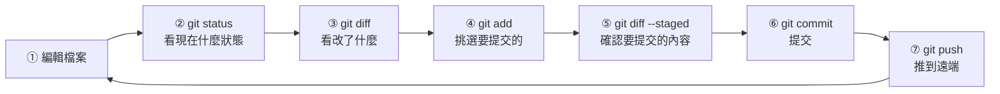

# Git 基本工作流程

> [!abstract] 這篇你會學到
> - 完成一次**完整的修改 → 暫存 → 提交**循環
> - **讀懂 `git status` 與 `git diff` 的每一個符號**
> - 寫出乾淨且有用的 **`.gitignore`**
> - 學會**分段提交（`git add -p`）**做出乾淨的歷史
> - 寫出**符合慣例的 commit 訊息**
> - 處理「**已經追蹤但想忽略**」等常見狀況

## 前置知識

- [[01-Git-觀念與初次設定]] — 三個區域與初次設定

---

## 觀念說明

### 基本循環



> [!tip] 養成「提交前先看 diff」的習慣
> **步驟 ③ 與 ⑤ 是新手最常跳過、卻最重要的兩步。**
>
> 跳過它們的後果：
> - 把**除錯用的 `console.log`／`echo` 提交上去**
> - 把**測試用的密碼提交上去**
> - 把**不小心刪掉的整段程式碼提交上去**
> - 提交了**不相關的變更**，讓歷史變髒
>
> **`git diff --staged` 顯示的內容，就是你即將永久記錄的東西。**

---

## 讀懂 `git status`

```bash
$ git status
On branch main
Your branch is ahead of 'origin/main' by 2 commits.
  (use "git push" to publish your local commits)

Changes to be committed:                    ← 【已暫存】綠色
  (use "git restore --staged <file>..." to unstage)
        modified:   nginx.conf
        new file:   sites/api.conf

Changes not staged for commit:              ← 【已修改未暫存】紅色
  (use "git add <file>..." to update what will be committed)
  (use "git restore <file>..." to discard changes in working directory)
        modified:   php.ini
        deleted:    old.conf

Untracked files:                            ← 【未追蹤】紅色
  (use "git add <file>..." to include in what will be committed)
        test.conf
        debug.log
```

### 簡短格式（推薦日常使用）

```bash
$ git status -sb
## main...origin/main [ahead 2]
M  nginx.conf          ← 左欄 M = 暫存區有修改
A  sites/api.conf      ← 左欄 A = 新增且已暫存
 M php.ini             ← 右欄 M = 工作區有修改（未暫存）
 D old.conf            ← 右欄 D = 工作區已刪除（未暫存）
MM config.yml          ← ★ 兩欄都有 = 暫存後又改了
?? test.conf           ← 未追蹤
?? debug.log
```

> [!tip] 兩欄的意義（這是最容易搞混的地方）
> ```
> XY 檔名
> │└─ 【右欄】＝ 工作區 vs 暫存區的差異（還沒 add 的部分）
> └── 【左欄】＝ 暫存區 vs 版本庫的差異（已 add 的部分）
> ```
>
> | 符號 | 意義 |
> | --- | --- |
> | `M` | Modified 已修改 |
> | `A` | Added 新增 |
> | `D` | Deleted 已刪除 |
> | `R` | Renamed 已改名 |
> | `C` | Copied 已複製 |
> | `U` | Unmerged **有衝突** |
> | `??` | Untracked 未追蹤 |
> | `!!` | Ignored 被忽略（需 `--ignored`） |
>
> **`MM` 的情況**：
> ```
> 1. 改了 config.yml
> 2. git add config.yml          → 左欄變 M
> 3. 【又改了 config.yml】        → 右欄也變 M
> → commit 時【只會提交步驟 2 當下的版本】，步驟 3 的修改不會進去
> ```
> **這是常見的困惑來源** —— 記得改完要重新 `git add`。

---

## 讀懂 `git diff`

```bash
# 【最常用】工作區 vs 暫存區 —— 「我改了什麼還沒 add」
$ git diff

# 暫存區 vs 版本庫 —— 「我即將提交什麼」★ 提交前必看
$ git diff --staged        # 或 --cached

# 工作區 vs 版本庫 —— 「總共改了什麼」
$ git diff HEAD

# 比較兩個提交
$ git diff a1b2c3d d4e5f6g

# 比較兩個分支
$ git diff main..feature

# 只看某個檔案
$ git diff -- nginx.conf

# 只看檔名，不看內容（快速掃過）
$ git diff --stat
$ git diff --name-only
$ git diff --name-status
```

### diff 輸出的解讀

```diff
diff --git a/nginx.conf b/nginx.conf
index 3f8a2b1..7c9d4e2 100644
--- a/nginx.conf          ← a = 舊版（原本的）
+++ b/nginx.conf          ← b = 新版（現在的）
@@ -12,7 +12,9 @@ http {
     sendfile on;
     keepalive_timeout 65;
 
-    gzip off;             ← 【-】刪除這一行
+    gzip on;              ← 【+】新增這一行
+    gzip_comp_level 6;
+    gzip_types text/plain text/css application/json;
 
     include /etc/nginx/conf.d/*.conf;
 }
```

> [!tip] `@@ -12,7 +12,9 @@` 是什麼意思
> ```
> @@ -12,7 +12,9 @@
>     │  │  │  └─ 新版：從第 12 行開始，共 9 行
>     │  │  └──── 新版起始行
>     │  └─────── 舊版：從第 12 行開始，共 7 行
>     └────────── 舊版起始行
> ```
> **7 → 9 表示這一段淨增加了 2 行。**

### 更好讀的 diff 設定

```bash
# 逐字比對（改一個字時特別有用）
$ git diff --word-diff
$ git diff --word-diff=color

# 忽略空白差異（★ 很常用）
$ git diff -w                    # 忽略所有空白
$ git diff --ignore-blank-lines  # 忽略空行

# 顯示函式或區段的上下文
$ git diff -U10                  # 上下各顯示 10 行（預設 3 行）

# 標示「只是搬移位置」的區塊（★ 重構時超好用）
$ git config --global diff.colorMoved zebra
```

> [!tip] 用 delta 讓 diff 好讀十倍
> ```bash
> $ wget -q https://github.com/dandavison/delta/releases/latest/download/git-delta_0.17.0_amd64.deb
> $ sudo dpkg -i git-delta_0.17.0_amd64.deb
> ```
> ```ini
> # ~/.gitconfig
> [core]
>     pager = delta
> [interactive]
>     diffFilter = delta --color-only
> [delta]
>     navigate = true        # n / N 在檔案間跳
>     line-numbers = true
>     side-by-side = true    # 左右並排
>     syntax-theme = Nord
> [merge]
>     conflictstyle = zdiff3
> ```
> **語法高亮 + 行號 + 並排比對**，看 diff 的體驗完全不同。

---

## `git add`：挑選要提交的內容

```bash
# ===== 基本用法 =====
$ git add nginx.conf                 # 單一檔案
$ git add sites/                     # 整個目錄
$ git add .                          # 目前目錄以下全部
$ git add -A                         # ★ 整個 repo 全部（含刪除）
$ git add *.conf                     # 萬用字元

# ===== 只加入「已追蹤檔案」的修改（不含新檔案）=====
$ git add -u

# ===== ★ 分段提交（互動式）——做出乾淨歷史的關鍵 =====
$ git add -p nginx.conf
```

> [!tip] `git add -p` 是進階使用者的必備技能
> **情境**：你在一個檔案裡同時做了兩件不相關的事，
> 想拆成兩個提交。
>
> ```bash
> $ git add -p nginx.conf
> ```
> ```diff
> @@ -12,7 +12,8 @@ http {
>      sendfile on;
> -    gzip off;
> +    gzip on;
> 
> (1/3) Stage this hunk [y,n,q,a,d,s,e,?]?
> ```
>
> | 按鍵 | 意義 |
> | --- | --- |
> | **`y`** | **是**，暫存這一段 |
> | **`n`** | **否**，跳過這一段 |
> | `q` | 離開，不再處理 |
> | `a` | 暫存這一段與此檔案後面全部 |
> | `d` | 不暫存此檔案後面全部 |
> | **`s`** | **切成更小的段**（很好用） |
> | **`e`** | **手動編輯**這一段（最精細） |
> | `?` | 說明 |
>
> **`e`（手動編輯）的規則**：
> - 要**保留**的 `+` 行 → 不動
> - **不要暫存**的 `+` 行 → **刪掉那一行**
> - **不要暫存**的 `-` 行 → **把 `-` 改成空格**

```bash
# ===== 取消暫存 =====
$ git restore --staged nginx.conf    # 新語法（Git 2.23+）
$ git reset HEAD nginx.conf          # 舊語法（一樣有效）

# ===== 丟棄工作區的修改（★ 不可復原！）=====
$ git restore nginx.conf             # 新語法
$ git checkout -- nginx.conf         # 舊語法

# ===== 丟棄全部未追蹤的檔案（★★ 危險）=====
$ git clean -n                       # ★ 先用 -n 預覽會刪什麼
$ git clean -f                       # 刪除未追蹤的檔案
$ git clean -fd                      # 連未追蹤的目錄也刪
$ git clean -fdx                     # 連被 .gitignore 忽略的也刪
```

> [!danger] `git restore <檔案>` 與 `git clean` 會永久丟失修改
> **這兩個指令刪掉的東西，Git 沒有記錄，救不回來。**
>
> **保險做法**：
> ```bash
> # 不確定的話，先用 stash 暫存起來（可以救回）
> $ git stash push -m "不確定要不要留的修改"
> $ git stash list
> $ git stash pop        # 需要時取回
>
> # git clean 一定要先 -n 預覽
> $ git clean -nd
> Would remove test.conf
> Would remove tmp/
> ```

---

## `git commit`：提交

```bash
# ===== 基本用法 =====
$ git commit -m "fix(nginx): 修正反向代理的 Host 標頭"

# 多行訊息（★ 推薦：標題 + 空行 + 內文）
$ git commit -m "fix(nginx): 修正反向代理的 Host 標頭" \
             -m "後端應用取到的 Host 一直是 127.0.0.1，導致產生的
絕對網址錯誤。加入 proxy_set_header Host \$host 解決。

需求單號：#1234
測試：已於測試機驗證重導向正常"

# 不寫 -m 會開啟編輯器（適合寫長訊息）
$ git commit

# ===== 快捷：add 已追蹤檔案 + commit（★ 不含新檔案）=====
$ git commit -am "訊息"

# ===== 修改上一個提交 =====
$ git commit --amend                 # 修改訊息與內容
$ git commit --amend --no-edit       # 只補內容，不改訊息
$ git commit --amend --reset-author  # 順便修正作者資訊

# ===== 空提交（觸發 CI 用）=====
$ git commit --allow-empty -m "chore: 觸發重新部署"
```

> [!danger] `--amend` 會改寫歷史
> **已經 push 到共用分支的提交，不要 amend。**
> ```
> 你 amend 後 → 本地的 commit ID 變了 → 與遠端不一致
>   → push 會被拒絕 → 只能強制推送 → 【破壞別人的歷史】
> ```
>
> **安全的情況**：
> - ✅ 還沒 push
> - ✅ push 到只有你在用的個人分支
> - ❌ push 到 main 或多人共用的分支

### commit 訊息的慣例

> [!tip] Conventional Commits 格式
> ```
> <類型>(<範圍>): <簡短描述>
> 
> <詳細說明：為什麼要改，不是改了什麼>
> 
> <相關單號 / Breaking Change>
> ```
>
> | 類型 | 用於 |
> | --- | --- |
> | **`feat`** | 新增功能 |
> | **`fix`** | 修正錯誤 |
> | `docs` | 文件 |
> | `style` | 格式（不影響邏輯） |
> | `refactor` | 重構（不改行為） |
> | `perf` | 效能改善 |
> | `test` | 測試 |
> | **`chore`** | 雜項（建置、依賴、設定） |
> | `ci` | CI/CD 設定 |
> | `revert` | 撤銷先前的提交 |

```
✅ 好的 commit 訊息：

fix(nginx): 修正反向代理遺失 Host 標頭

後端 Laravel 產生的絕對網址一直是 http://127.0.0.1/...，
原因是 proxy_pass 預設會把 Host 改成 upstream 的位址。
加入 proxy_set_header Host $host 後恢復正常。

需求單號：#1234
影響範圍：example.gov.tw 的所有 API 路由
回退方式：git revert 此提交後 nginx -s reload
```

```
❌ 不好的 commit 訊息：

update
修正
fix bug
改一下
asdf
最終版
真的可以了
WIP
```

> [!tip] 判斷 commit 訊息好壞的方法
> **「三個月後，我看到這行訊息，知道當時發生什麼事嗎？」**
>
> 更具體的檢驗：
> - **標題能不能填進「這個提交會 ___」？**
>   （`fix(nginx): 修正遺失 Host 標頭` → 「這個提交會修正遺失 Host 標頭」✅）
> - **內文有沒有回答「為什麼」？**（不是「改了什麼」—— diff 已經說了）
> - **有沒有可追溯的單號？**

---

## `.gitignore`

> [!danger] 一定要在第一次 commit 之前就寫好
> 因為**一旦檔案被追蹤，加進 `.gitignore` 也沒有用**（見下方排錯）。

### 語法

```gitignore
# 這是註解

# ===== 忽略特定檔案 =====
debug.log
.env

# ===== 忽略特定副檔名 =====
*.log
*.tmp
*.swp

# ===== 忽略目錄（結尾加 /）=====
node_modules/
vendor/
storage/logs/

# ===== 只忽略根目錄的（開頭加 /）=====
/config.local.php        # 只忽略根目錄的，不影響 sub/config.local.php

# ===== 例外：不要忽略（開頭加 !）=====
*.log
!important.log           # 但保留這個

# ===== 萬用字元 =====
temp?                    # ? = 任一字元
*.[oa]                   # o 或 a 結尾

# ===== ** = 任意層級目錄 =====
**/logs/                 # 任何層級的 logs 目錄
doc/**/*.pdf             # doc 底下任何層級的 pdf
```

> [!warning] `!` 例外規則的陷阱
> ```gitignore
> # ❌ 這樣不會生效
> logs/
> !logs/important.log      # 【父目錄被忽略了，裡面的都救不回來】
>
> # ✅ 正確寫法：先讓目錄本身不被忽略
> logs/*
> !logs/important.log
> ```

### 實用的 `.gitignore` 範本

```gitignore
# ═══════════════ 機密（★★ 最重要）═══════════════
.env
.env.*
!.env.example
*.key
*.pem
*.p12
*.pfx
id_rsa
id_ed25519
credentials
secrets/
auth.json                  # Laravel Nova 授權
config/local.php

# ═══════════════ 相依套件 ═══════════════
node_modules/
vendor/
bower_components/
.pnpm-store/

# ═══════════════ 建置產物 ═══════════════
dist/
build/
out/
*.o
*.so
*.pyc
__pycache__/

# ═══════════════ 日誌與快取 ═══════════════
*.log
logs/
storage/logs/*
!storage/logs/.gitkeep
storage/framework/cache/*
storage/framework/sessions/*
storage/framework/views/*
.cache/
*.cache

# ═══════════════ 編輯器與作業系統 ═══════════════
.vscode/
!.vscode/extensions.json
.idea/
*.swp
*.swo
*~
.DS_Store
Thumbs.db
desktop.ini

# ═══════════════ 資料庫與備份 ═══════════════
*.sqlite
*.sqlite3
*.sql
*.dump
*.bak
backup/

# ═══════════════ 上傳的檔案（通常不該進版控）═══════════════
public/uploads/
storage/app/public/
```

> [!tip] `.gitkeep`：讓 Git 追蹤空目錄
> **Git 不會追蹤空目錄。**
> 但有些目錄（`storage/logs/`）必須存在，程式才跑得起來。
>
> **解法**：在目錄裡放一個空的 `.gitkeep`，
> 並在 `.gitignore` 中用 `!` 保留它：
> ```gitignore
> storage/logs/*
> !storage/logs/.gitkeep
> ```

```bash
# ===== 找出某個檔案是被哪一條規則忽略的（★ 除錯神器）=====
$ git check-ignore -v node_modules/package/index.js
.gitignore:15:node_modules/    node_modules/package/index.js

# ===== 列出所有被忽略的檔案 =====
$ git status --ignored -s

# ===== 產生語言／框架專用的 .gitignore =====
$ curl -sL https://www.toptal.com/developers/gitignore/api/node,laravel,vue,linux,visualstudiocode \
    -o .gitignore
```

---

## 完整實戰範例

### 一次完整的工作流程

```bash
# ========== 【1】確認起始狀態 ==========
$ cd /srv/config-repo
$ git status -sb
## main...origin/main
（乾淨）

$ git pull                            # 先同步遠端的變更

# ========== 【2】做修改 ==========
$ vim nginx/sites-available/api.conf
$ vim nginx/nginx.conf
$ echo "測試中" > tmp-test.txt         # 這個不要提交

# ========== 【3】看看改了什麼 ==========
$ git status -sb
## main...origin/main
 M nginx/nginx.conf
 M nginx/sites-available/api.conf
?? tmp-test.txt

$ git diff --stat
 nginx/nginx.conf                   |  4 +++-
 nginx/sites-available/api.conf     | 12 ++++++++++--
 2 files changed, 13 insertions(+), 3 deletions(-)

$ git diff                            # ★ 逐行確認

# ========== 【4】先驗證設定正確 ==========
$ sudo nginx -t
nginx: configuration file /etc/nginx/nginx.conf test is successful

# ========== 【5】挑選要提交的 ==========
$ git add nginx/sites-available/api.conf
$ git add -p nginx/nginx.conf         # 只挑其中一部分

# ========== 【6】★ 確認即將提交的內容 ==========
$ git diff --staged
（逐行檢查：有沒有測試用的密碼？有沒有除錯輸出？）

$ git status -sb
## main...origin/main
M  nginx/nginx.conf
M  nginx/sites-available/api.conf
?? tmp-test.txt                       ← 沒有被加進去 ✓

# ========== 【7】提交 ==========
$ git commit -m "feat(nginx): 為 api.example.gov.tw 新增反向代理

將 /api/ 路徑反向代理至後端的 127.0.0.1:8000，
並補上 proxy_set_header 以正確傳遞客戶端資訊。

需求單號：#1234
測試：已於測試機驗證 API 回應正常
回退：git revert <此提交> && sudo nginx -s reload"

[main a1b2c3d] feat(nginx): 為 api.example.gov.tw 新增反向代理
 2 files changed, 13 insertions(+), 3 deletions(-)

# ========== 【8】推送 ==========
$ git push
Enumerating objects: 11, done.
To github.com:org/config-repo.git
   d4e5f6g..a1b2c3d  main -> main

# ========== 【9】清理 ==========
$ rm tmp-test.txt
```

### 把一次混亂的修改拆成多個乾淨的提交

> [!example] 情境
> 你一口氣改了很多東西，現在想拆成有意義的提交。

```bash
$ git status -sb
 M nginx/nginx.conf              ← 改了 gzip 設定 + 改了 worker 數
 M php/php.ini                   ← 調整 memory_limit
 M docker-compose.yml            ← 新增 redis 服務
?? README.md                     ← 新增說明文件

# ===== 提交 1：只提交 nginx 的 gzip 部分 =====
$ git add -p nginx/nginx.conf
# 只對 gzip 相關的區段按 y，worker 的部分按 n
$ git commit -m "perf(nginx): 啟用 gzip 壓縮以降低頻寬用量"

# ===== 提交 2：nginx 的 worker 設定 =====
$ git add nginx/nginx.conf
$ git commit -m "perf(nginx): 調整 worker_processes 為 auto"

# ===== 提交 3：PHP 設定 =====
$ git add php/php.ini
$ git commit -m "fix(php): 調高 memory_limit 至 512M 以支援報表匯出"

# ===== 提交 4：新增 Redis =====
$ git add docker-compose.yml
$ git commit -m "feat(compose): 新增 Redis 服務作為快取層"

# ===== 提交 5：文件 =====
$ git add README.md
$ git commit -m "docs: 新增設定檔 repo 的使用說明"

# ===== 檢視成果 =====
$ git lg -5
* e5f6g7h - docs: 新增設定檔 repo 的使用說明
* d4e5f6g - feat(compose): 新增 Redis 服務作為快取層
* c3d4e5f - fix(php): 調高 memory_limit 至 512M 以支援報表匯出
* b2c3d4e - perf(nginx): 調整 worker_processes 為 auto
* a1b2c3d - perf(nginx): 啟用 gzip 壓縮以降低頻寬用量
```

> [!tip] 為什麼要這麼麻煩
> **因為未來的你會感謝現在的你。**
>
> ```
> 三個月後：「網站變慢了，是不是哪個設定改壞了？」
>
> 【混亂的歷史】
>   a1b2c3d "更新設定"   ← 一次改了 4 個檔案
>   → 只能整包 revert，連好的改動也一起退掉
>
> 【乾淨的歷史】
>   → git log --oneline 一眼看出有 5 個獨立的變更
>   → git revert b2c3d4e  只退掉 worker 那一項
>   → 【精準回退，不影響其他】
> ```

### 查詢歷史

```bash
# ===== 基本 =====
$ git log
$ git log --oneline                  # 一行一個
$ git log -5                         # 最近 5 個
$ git log --stat                     # 附帶變更統計
$ git log -p                         # 附帶完整 diff

# ===== 圖形化（★ 最常用）=====
$ git log --graph --oneline --decorate --all

# ===== 依條件過濾 =====
$ git log --author="王小明"
$ git log --since="2026-08-01" --until="2026-08-31"
$ git log --grep="nginx"             # 搜尋 commit 訊息
$ git log -S "gzip on"               # ★ 搜尋「哪個提交引入/刪除了這段程式碼」
$ git log -G "worker_.*"             # 用正規表示式搜尋內容變更

# ===== 特定檔案的歷史 =====
$ git log -- nginx/nginx.conf
$ git log -p -- nginx/nginx.conf     # 附帶每次的 diff
$ git log --follow -- nginx.conf     # ★ 追蹤改名前的歷史

# ===== 誰改了這一行 =====
$ git blame nginx/nginx.conf
$ git blame -L 10,20 nginx/nginx.conf        # 只看 10-20 行
$ git blame -w -C -C nginx/nginx.conf        # 忽略空白、追蹤搬移

# ===== 自訂輸出格式 =====
$ git log --format="%h %ad %an %s" --date=short
a1b2c3d 2026-08-28 王小明 feat(nginx): 新增反向代理
```

> [!tip] `git log -S` 是找出「這段設定何時被加進來」的神器
> ```bash
> # 「gzip on 是誰、什麼時候加的？」
> $ git log -S "gzip on" --oneline -- nginx/
> a1b2c3d perf(nginx): 啟用 gzip 壓縮以降低頻寬用量
>
> $ git show a1b2c3d
> ```
> **這比 `git blame` 更強**，因為 blame 只能看到「最後一次修改」，
> 而 `-S` 能找到「引入或刪除某段內容」的所有提交。

---

## 常見錯誤與排錯

| 現象／錯誤 | 原因 | 解法 |
| --- | --- | --- |
| **加進 `.gitignore` 但檔案還是被追蹤** | **檔案已經被追蹤了，`.gitignore` 只對「未追蹤」的生效** | `git rm --cached <檔案>` 後再提交（見下方） |
| `git status` 顯示 `MM` | 暫存後又改了 | 重新 `git add` |
| **提交了才發現漏了一個檔案** | 忘記 add | `git add <檔案> && git commit --amend --no-edit` |
| commit 訊息打錯字 | — | `git commit --amend`（**未 push 才安全**） |
| **`git commit -am` 沒有包含新檔案** | `-a` 只涵蓋「已追蹤」的檔案 | 新檔案要先 `git add` |
| 提交了機密資料 | 沒檢查 diff | **立刻更換該密碼**；用 `git filter-repo` 清歷史（見 05 篇） |
| **`git restore` 之後修改沒了** | 該指令會**永久丟棄** | 沒有辦法救；下次先 `git stash` |
| `git clean` 刪掉重要檔案 | 沒有預覽 | **一定要先 `git clean -n`** |
| 整個檔案顯示為變更 | **換行符號（CRLF/LF）不同** | 設定 `core.autocrlf`（見 01 篇） |
| diff 看到一堆空白差異 | 編輯器自動調整縮排 | `git diff -w` 忽略空白 |
| **空目錄沒有被 commit** | Git 不追蹤空目錄 | 放一個 `.gitkeep` |
| 不知道檔案被哪條規則忽略 | `.gitignore` 太複雜 | **`git check-ignore -v <檔案>`** |
| `.gitignore` 的 `!` 例外沒生效 | **父目錄整個被忽略了** | 改成 `logs/*` + `!logs/important.log` |
| 想找「這段設定何時加的」 | blame 只看得到最後修改 | **`git log -S "內容"`** |

### 詳解：已追蹤的檔案要怎麼忽略

```bash
# ===== 情境：不小心 commit 了 .env =====

# 【1】從版控中移除，但【保留本機檔案】
$ git rm --cached .env
rm '.env'

# 【2】加進 .gitignore
$ echo ".env" >> .gitignore

# 【3】提交
$ git add .gitignore
$ git commit -m "chore: 將 .env 移出版控"

# 【4】★★ 極重要：它仍然在歷史裡！
$ git log --all --full-history -- .env      # 還找得到
$ git show <舊提交>:.env                     # 還拿得到內容

# → 【必須立刻更換 .env 裡的所有密碼與金鑰】
# → 若要真正從歷史清除，見 [[05-Git-回復與重寫歷史]]
```

```bash
# ===== 整個目錄（例如不小心 commit 了 node_modules）=====
$ git rm -r --cached node_modules
$ echo "node_modules/" >> .gitignore
$ git commit -m "chore: 將 node_modules 移出版控"

# ===== 清除所有已被 .gitignore 忽略但仍被追蹤的檔案 =====
$ git rm -r --cached . && git add . && git commit -m "chore: 套用 .gitignore"
# ⚠ 這會重新加入所有檔案，先確認 .gitignore 正確
```

---

## 安全性注意事項

> [!danger] 提交前的三個檢查
> ```
> ① git diff --staged  —— 【逐行看過即將提交的內容】
> ② 有沒有密碼、金鑰、Token？
> ③ 有沒有除錯用的程式碼、測試資料、個人資訊？
> ```
>
> **最容易出事的情況**：
> - 用 `git add -A` 或 `git add .` **一次加入全部**
> - **沒看 diff 就 commit**
> - 趕時間
>
> **養成習慣**：`git add` 之後**一定**執行 `git diff --staged`。

> [!warning] 設定檔版控要特別小心
> 維運人員版控設定檔時，**極容易誤提交機密**：
> ```
> nginx.conf              → 通常沒問題
> nginx/ssl/server.key    → ❌ 私鑰！
> .env                    → ❌ 資料庫密碼！
> docker-compose.yml      → ⚠️ 可能有 environment 密碼
> /etc/shadow             → ❌ 密碼雜湊！
> auth.json               → ❌ Laravel Nova 授權金鑰
> ```
>
> **正確做法**：
> - **設定檔中的密碼用環境變數或外部檔案**，本體只放參照
> - `.gitignore` **先寫好**再開始 commit
> - 用 **gitleaks pre-commit hook** 自動攔截
> - **定期掃描整個歷史**：`gitleaks detect --source . -v`

> [!tip] 提交訊息也可能洩漏資訊
> ```
> ❌ "fix: 修正 admin 密碼錯誤，已改為 P@ssw0rd2026"
> ❌ "feat: 串接 API，金鑰 sk-abc123..."
> ❌ "fix: 修正民眾 A123456789 的資料錯誤"
> ```
>
> **提交訊息會被永久保留，而且比檔案內容更難清除**
> （因為它不在檔案裡，而在 commit 物件中）。
>
> **正確寫法**：
> ```
> ✅ "fix: 修正管理員帳號的密碼驗證邏輯"
> ✅ "feat: 串接外部 API（金鑰以環境變數提供）"
> ✅ "fix: 修正特定使用者的資料轉換錯誤（單號 #1234）"
> ```

---

## 速查表

### 基本循環

```
編輯 → git status → 【git diff】→ git add → 【git diff --staged】
→ git commit → git push
★ 兩個 diff 是新手最常跳過、卻最重要的兩步
```

### `git status -sb` 的兩欄

```
XY 檔名
│└─ 右欄 = 工作區 vs 暫存區（還沒 add 的）
└── 左欄 = 暫存區 vs 版本庫（已 add 的）

M 修改  A 新增  D 刪除  R 改名  U 衝突  ?? 未追蹤
MM = 暫存後又改了（commit 只會提交 add 當下的版本）
```

### diff 的四種比較

| 指令 | 比較 | 何時用 |
| --- | --- | --- |
| `git diff` | 工作區 vs 暫存區 | 我改了什麼還沒 add |
| **`git diff --staged`** | 暫存區 vs 版本庫 | **★ 提交前必看** |
| `git diff HEAD` | 工作區 vs 版本庫 | 總共改了什麼 |
| `git diff a..b` | 兩個提交/分支 | 比較版本 |

### add 與取消

```bash
git add <file>           git add -A          # 全部（含刪除）
git add -u               # 只加已追蹤的修改
git add -p               # ★ 分段挑選（y/n/s/e）

git restore --staged <f> # 取消暫存
git restore <f>          # ★ 丟棄修改（不可復原！）
git clean -nd            # ★ 先預覽
git clean -fd            # 刪除未追蹤
```

### commit

```bash
git commit -m "訊息"
git commit -am "訊息"          # ★ 不含新檔案
git commit --amend            # 修改上一個（★ push 過就別用）
git commit --amend --no-edit  # 只補內容
git commit --allow-empty      # 空提交（觸發 CI）
```

### commit 訊息格式

```
<類型>(<範圍>): <簡短描述>

<為什麼要改>

<單號 / Breaking Change>

類型：feat fix docs style refactor perf test chore ci revert
檢驗：「三個月後看到這行，我知道發生什麼事嗎？」
```

### `.gitignore` 語法

```gitignore
*.log            副檔名
logs/            目錄
/config.php      只有根目錄
!important.log   例外（★ 父目錄不能被忽略）
**/tmp/          任意層級
temp?            單一字元

git check-ignore -v <檔案>     # ★ 查是哪條規則
```

### 已追蹤的檔案要忽略

```bash
git rm --cached <檔案>          # 移出版控但保留本機檔
echo "<檔案>" >> .gitignore
git commit -m "chore: 移出版控"
★★ 它仍在歷史裡 → 【立刻更換該密碼/金鑰】
```

### 查詢歷史

| 目的 | 指令 |
| --- | --- |
| 圖形化 | `git log --graph --oneline --all` |
| 某檔案 | `git log -p -- <file>` |
| 追蹤改名 | `git log --follow -- <file>` |
| **找出誰引入某段內容** | **`git log -S "內容"`** |
| 誰改了這行 | `git blame -w -C <file>` |
| 搜尋訊息 | `git log --grep="關鍵字"` |

### 提交前三檢查

```
① git diff --staged 逐行看過
② 有沒有密碼/金鑰/Token？
③ 有沒有除錯程式碼/測試資料/個資？
★ commit 訊息也不能寫密碼（比檔案更難清除）
```

---

## 練習題

> [!question]- 練習 1：讀懂 status 與 diff
> 建立測試 repo 並製造出這個狀態：
> ```
> M  a.txt        （已暫存的修改）
>  M b.txt        （未暫存的修改）
> MM c.txt        （暫存後又改了）
> A  d.txt        （新增已暫存）
> ?? e.txt        （未追蹤）
>  D f.txt        （已刪除未暫存）
> ```
> 然後回答：
> 1. **現在 `git commit` 會提交哪些檔案？c.txt 會提交哪個版本？**
> 2. `git diff` 會顯示哪些檔案？
> 3. `git diff --staged` 會顯示哪些檔案？

> [!question]- 練習 2：用 `git add -p` 拆分提交
> 1. 在一個檔案裡做**三處不相關的修改**
> 2. 用 `git add -p` 只暫存第一處，提交
> 3. 再暫存第二處，提交
> 4. 最後提交第三處
> 5. 用 `git log -p` 檢視三個提交
> 6. **試試 `s`（切更小段）與 `e`（手動編輯）**

> [!question]- 練習 3：處理誤提交的機密
> ⚠️ 在測試 repo 上做。
> 1. 建立 `.env` 寫入 `DB_PASSWORD=secret123`，commit
> 2. 意識到錯了，把它加進 `.gitignore` 並 `git rm --cached .env`，commit
> 3. **現在用 `git log --all --full-history -- .env` 看看它還在不在**
> 4. **用 `git show <第一個提交>:.env` 把密碼取出來**
> 5. 思考：如果這已經 push 到 GitHub，你的第一步應該做什麼？
>    （提示：不是清歷史）
> 6. 裝上 gitleaks 的 pre-commit hook，再試一次會發生什麼

---

## 小測驗

Q1. 基本循環的七個步驟是什麼？**哪兩步是新手最常跳過但最重要的**？

Q2. **`git status -sb` 的兩欄各代表什麼？`MM` 是什麼意思，commit 時會提交哪個版本**？

Q3. `git diff`、`git diff --staged`、`git diff HEAD` 各比較什麼？**提交前該看哪一個**？

Q4. **`git add -p` 的用途是什麼？`y`/`n`/`s`/`e` 各是什麼意思**？

Q5. `git commit -am` 有什麼陷阱？

Q6. **`git commit --amend` 在什麼情況下是安全的、什麼情況下不能用**？

Q7. **好的 commit 訊息該包含什麼？判斷好壞的檢驗方法是什麼**？

Q8. **為什麼「加進 `.gitignore` 但檔案還是被追蹤」？該怎麼處理**？

Q9. `.gitignore` 的 `!` 例外規則有什麼陷阱？正確寫法是什麼？

Q10. **提交前的三個檢查是什麼？為什麼 commit 訊息也不能寫密碼**？

> [!question]- 測驗答案
> **Q1.** ①編輯檔案 → ②`git status` → ③**`git diff`** →
> ④`git add` → ⑤**`git diff --staged`** → ⑥`git commit` → ⑦`git push`。
> **最常被跳過但最重要的是第 ③ 與 ⑤ 步（兩個 diff）** ——
> 跳過的後果是把除錯用的輸出、測試用的密碼、
> 不小心刪掉的整段程式碼、不相關的變更一起提交上去。
> **`git diff --staged` 顯示的內容，就是你即將永久記錄的東西。**
>
> **Q2.** 格式是 `XY 檔名`：
> **左欄（X）= 暫存區 vs 版本庫的差異**（已 add 的部分）；
> **右欄（Y）= 工作區 vs 暫存區的差異**（還沒 add 的部分）。
> **`MM` 表示「暫存後又改了」** ——
> 你 `git add` 之後又編輯了同一個檔案。
> **commit 時只會提交「`git add` 當下的版本」**，
> 之後的修改不會進去 —— 這是常見的困惑來源，
> 記得改完要重新 `git add`。
>
> **Q3.** **`git diff`** 比較「工作區 vs 暫存區」——
> 我改了什麼還沒 add；
> **`git diff --staged`**（或 `--cached`）比較「暫存區 vs 版本庫」——
> 我即將提交什麼；
> **`git diff HEAD`** 比較「工作區 vs 版本庫」——總共改了什麼。
> **提交前該看的是 `git diff --staged`**，
> 因為那才是即將被永久記錄的內容。
>
> **Q4.** `git add -p` 是**互動式分段暫存**，
> 讓你在同一個檔案中**只挑選部分變更來提交**，
> 用來把一次混亂的修改拆成多個乾淨的提交。
> **`y`** = 是，暫存這一段；**`n`** = 否，跳過這一段；
> **`s`** = 把這一段**切成更小的段**（很好用）；
> **`e`** = **手動編輯**這一段（最精細；要保留的 `+` 行不動、
> 不要暫存的 `+` 行刪掉、不要暫存的 `-` 行把 `-` 改成空格）。
>
> **Q5.** 陷阱是 **`-a` 只涵蓋「已追蹤」的檔案，不包含新檔案**。
> 所以如果你新增了一個檔案就用 `git commit -am`，
> **那個新檔案不會被提交**，而你可能以為已經提交了。
> 新檔案必須先 `git add`。
>
> **Q6.** **安全的情況**：①還沒 push；
> ②push 到只有你在用的個人分支。
> **不能用的情況**：**已經 push 到 main 或多人共用的分支**。
> 因為 `--amend` 會**改寫歷史**（產生新的 commit ID），
> 導致本地與遠端不一致，push 會被拒絕，
> 只能強制推送，而**強制推送會破壞其他人的歷史**。
>
> **Q7.** 應包含：**類型(範圍): 簡短描述**（Conventional Commits 格式）、
> 空行、**內文說明「為什麼」要改**（不是「改了什麼」——diff 已經說了）、
> 以及**可追溯的單號**（必要時加上影響範圍與回退方式）。
> **檢驗方法**：「**三個月後，我看到這行訊息，知道當時發生什麼事嗎？**」
> 更具體的檢驗：標題能不能填進「這個提交會 ___」？
> 內文有沒有回答「為什麼」？有沒有單號？
>
> **Q8.** 因為 **`.gitignore` 只對「未追蹤（Untracked）」的檔案生效** ——
> 一旦檔案已經被 Git 追蹤，`.gitignore` 就管不到它了。
> 處理方式：
> ①`git rm --cached <檔案>`（從版控移除但**保留本機檔案**）；
> ②把它加進 `.gitignore`；③提交。
> ⚠ **但它仍然留在歷史裡**（`git show <舊提交>:<檔案>` 還拿得到），
> 所以如果是機密，**必須立刻更換該密碼／金鑰**。
>
> **Q9.** 陷阱是：**如果父目錄整個被忽略，裡面的檔案就救不回來**。
> ```gitignore
> ❌ logs/
>    !logs/important.log      # 不會生效
> ```
> **正確寫法是先讓目錄本身不被忽略，只忽略裡面的內容**：
> ```gitignore
> ✅ logs/*
>    !logs/important.log
> ```
>
> **Q10.** 三個檢查：①**`git diff --staged` 逐行看過即將提交的內容**；
> ②**有沒有密碼、金鑰、Token**；
> ③**有沒有除錯用的程式碼、測試資料、個人資訊**。
> **commit 訊息也不能寫密碼**，因為
> **提交訊息會被永久保留，而且比檔案內容更難清除** ——
> 它不在檔案裡，而在 commit 物件本身，
> 一般的 `git rm --cached` 或改檔案完全清不掉它，
> 必須改寫整段歷史才行。

---

## 延伸閱讀

- [[01-Git-觀念與初次設定]] — 三個區域與環境設定
- [[03-Git-分支與合併]] — 下一步：平行開發
- [[05-Git-回復與重寫歷史]] — 清除誤提交的機密
- [[07-Git-進階技巧]] — stash、bisect、hooks
- [[09-Git-團隊規範與實戰情境]] — commit 訊息規範與意外處理
- [[10-機密管理與金鑰保護]] — 密碼與金鑰的正確存放
