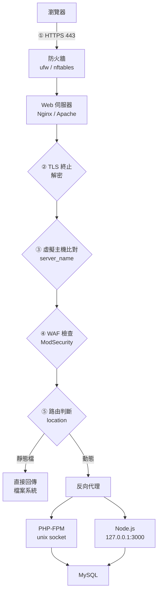
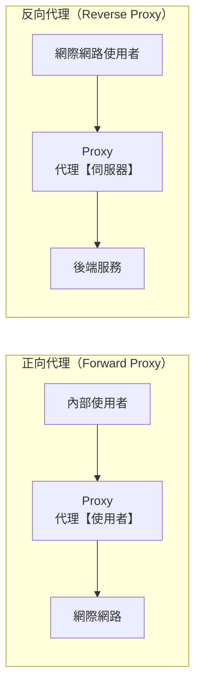
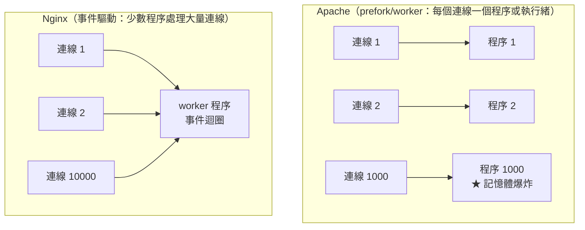
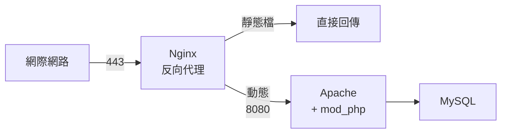
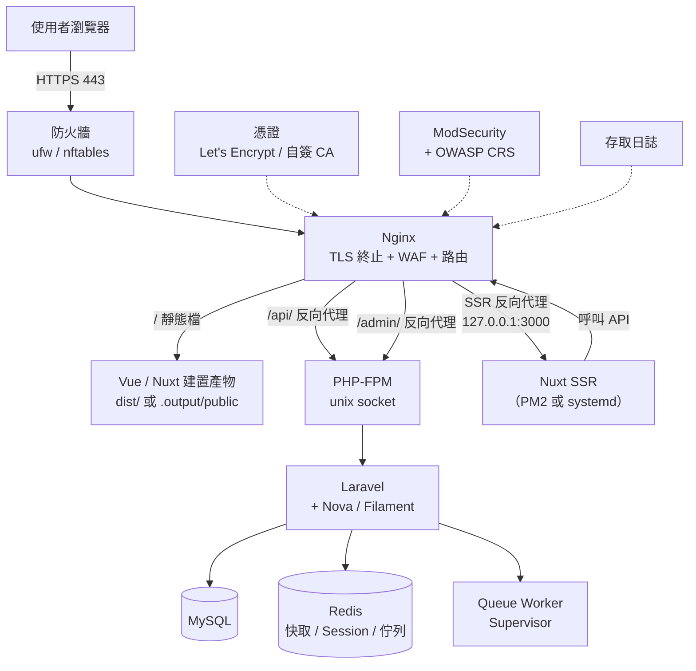

# Web 伺服器概論

> [!abstract] 這篇你會學到
> - 理解**一個 HTTP 請求在伺服器上到底經過哪些關卡**
> - 分辨**正向代理與反向代理**（這是最常被搞混的一組概念）
> - 分辨**靜態內容與動態內容**的處理方式差異
> - 掌握 **LXMP 的完整架構圖**（本手冊實戰的主軸）
> - 知道 **Nginx 與 Apache 的根本差異**與選型依據
> - 認識 **MyGuard／Angie** 這條強化路線

> [!tip] LXMP 是什麼
> 本手冊的實戰主軸：
> ```
> L  Linux
> X  Nginx 或 Apache2（X = 兩者擇一或並存）
> M  MySQL
> P  PHP
>
> ＋ 前端：Vue / Nuxt（含【使用 PM2】與【不使用 PM2】兩種做法）
> ＋ 後端：Laravel + Nova / Filament
> ＋ SSL：自簽憑證鏈 與 向 CA 申請憑證
> ＋ WAF：ModSecurity + OWASP CRS
> ```
> 完整實戰見 [[00-部署實戰-索引]]。

## 前置知識

- [[13-網概-HTTP與HTTPS]] — HTTP 協定的基礎
- [[14-網概-一個網頁請求的完整旅程]] — 從瀏覽器到伺服器的全貌

---

## 觀念說明

### 一個請求在伺服器上經過的關卡



| 關卡 | 做什麼 | 相關章節 |
| --- | --- | --- |
| **① 防火牆** | 只放行 80/443 | [[00-防火牆-索引]] |
| **② TLS 終止** | 解密 HTTPS，驗證憑證 | [[00-憑證與PKI-索引]] |
| **③ 虛擬主機** | 依 `Host` 標頭決定用哪組設定 | [[02-Nginx-設定語法與虛擬主機]] |
| **④ WAF** | 檢查是否為攻擊請求 | [[00-ModSecurity-索引]] |
| **⑤ 路由** | 靜態直接回傳、動態轉給後端 | [[03-Nginx-location與rewrite]] |
| **⑥ 後端** | PHP-FPM / Node.js 產生內容 | [[00-應用執行環境-索引]] |

> [!tip] 這張圖就是整個 LXMP 的骨架
> **後面每一章都在填這張圖的某一格。**
> 遇到問題時，先問「是卡在哪一關」，排錯會快很多。

### 靜態 vs 動態

| | **靜態內容** | **動態內容** |
| --- | --- | --- |
| 例子 | `.html` `.css` `.js` `.jpg` `.pdf` | PHP、Node.js 產生的頁面、API |
| 處理方式 | **Web 伺服器直接讀檔回傳** | **交給後端程式執行後回傳** |
| 速度 | **極快**（每秒數萬） | 慢（每秒數十～數千） |
| 資源 | 幾乎不耗 CPU | **耗 CPU 與記憶體** |
| 可否快取 | **很容易** | 需要小心（可能因人而異） |

> [!danger] 效能最重要的一件事：讓靜態內容不要碰到後端
> ```
> ❌ 所有請求都轉給 PHP：
>    圖片、CSS、JS 都經過 PHP-FPM
>      → PHP-FPM 的處理程序被佔滿
>        → 【真正需要 PHP 的請求排隊等待】
>
> ✅ Web 伺服器直接回傳靜態檔：
>    只有真正的動態請求才進 PHP
>      → 同樣的硬體可以承受【十倍以上】的流量
> ```
>
> **Vue / Nuxt 建置後的產物大部分是靜態檔** ——
> 這也是為什麼前後端分離的架構效能好。

### 正向代理 vs 反向代理

> [!warning] 這是最常被搞混的一組概念
> **關鍵差異：代理「誰」。**



| | **正向代理** | **反向代理** |
| --- | --- | --- |
| 代理誰 | **使用者（客戶端）** | **伺服器** |
| 誰知道它存在 | **使用者知道**（要設定） | **使用者不知道**（以為是真的伺服器） |
| 位置 | 使用者這一側 | **伺服器這一側** |
| 典型用途 | 上網管控、快取、翻牆 | **負載平衡、TLS 終止、隱藏後端** |
| 例子 | 公司的上網 Proxy、Squid | **Nginx、HAProxy、CDN** |

> [!tip] 一句話記住
> ```
> 正向代理：「我幫【你】去拿東西」   → 保護/管控【使用者】
> 反向代理：「我幫【它】接待客人」   → 保護/加速【伺服器】
> ```
>
> **本手冊講的幾乎都是反向代理。**

### 反向代理帶來的好處

| 好處 | 說明 |
| --- | --- |
| **TLS 終止** | 憑證只裝在一個地方，後端不用管 HTTPS |
| **隱藏後端** | 攻擊者只看得到反向代理 |
| **負載平衡** | 把請求分散到多台後端 |
| **靜態檔加速** | 靜態檔直接回，不打擾後端 |
| **快取** | 相同的回應直接從快取給 |
| **統一的存取控制** | 速率限制、IP 白名單、WAF |
| **壓縮** | gzip / brotli 在這一層做 |
| **單一入口** | 多個服務（Laravel API + Nuxt SSR + OpenWebUI）用同一個網域 |

---

## Nginx vs Apache

### 根本差異：處理模型



| | **Nginx** | **Apache** |
| --- | --- | --- |
| 架構 | **事件驅動、非同步** | **程序／執行緒**（prefork/worker/event） |
| 高並發 | **極佳**（C10K 問題的解答） | 較差（prefork 模式下） |
| 記憶體 | **低且穩定** | 隨連線數增加 |
| 靜態檔 | **非常快** | 快 |
| 動態內容 | 需要 **FastCGI 轉給 PHP-FPM** | **可用 mod_php 內嵌**（或也用 PHP-FPM） |
| 設定檔 | 集中式（`nginx.conf`） | 集中式 + **`.htaccess`**（可分散） |
| **`.htaccess`** | **不支援**（刻意的設計） | **支援**（虛擬主機常用） |
| 模組 | 多數需**重新編譯**（或用動態模組） | **可動態載入** |
| 反向代理 | **原生強項** | 需 `mod_proxy` |
| 學習曲線 | 中 | 中 |

> [!tip] `.htaccess` 是 Apache 最大的優勢也是最大的效能包袱
> **優勢**：
> - 虛擬主機的使用者**不用碰主設定檔**就能改規則
> - 很多 CMS（WordPress、Laravel）預設就附 `.htaccess`
>
> **包袱**：
> - **每一個請求**，Apache 都要**逐層檢查目錄中有沒有 `.htaccess`**
>   ```
>   請求 /var/www/html/a/b/c/index.php
>     → 檢查 /var/www/.htaccess
>     → 檢查 /var/www/html/.htaccess
>     → 檢查 /var/www/html/a/.htaccess
>     → 檢查 /var/www/html/a/b/.htaccess
>     → 檢查 /var/www/html/a/b/c/.htaccess
>   → 【每個請求都做 5 次檔案系統存取】
>   ```
> - **效能損失明顯**
>
> **如果你能控制主設定檔，就關掉它**：
> ```apache
> <Directory /var/www/html>
>     AllowOverride None      # ★ 關閉 .htaccess，效能提升
> </Directory>
> ```

### 選型建議

```
【新專案、單純的 Web 服務】
  → 【Nginx】（效能好、設定清楚、反向代理原生支援）

【需要 .htaccess】（共享主機、無法改主設定檔、既有 CMS）
  → Apache

【既有系統是 Apache，運作正常】
  → 不要為了換而換

【需要大量並發連線、WebSocket、串流】
  → 【Nginx】

【需要複雜的動態模組（如某些認證模組）】
  → Apache（動態載入較方便）

【想要「兩者的優點」】
  → 【Nginx 在前 + Apache 在後】（見下方）
```

### 兩者並存的架構



> [!tip] 什麼時候用這種架構
> ```
> ✓ 既有系統重度依賴 .htaccess，短期無法改
> ✓ 想要 Nginx 的高並發與靜態檔效能
> ✓ 想在 Nginx 這一層統一做 TLS、WAF、速率限制
>
> 代價：多一層，設定與排錯複雜度增加
> ```
>
> **設定重點**：
> - Nginx 監聽 443，Apache 監聽 **`127.0.0.1:8080`**（不對外）
> - Nginx 要傳遞 `X-Forwarded-For`、`X-Forwarded-Proto`
> - Apache 要設定 `RemoteIPHeader` 才能取到真實 IP
>
> 詳見 [[04-Nginx與Apache選型與共存]]。

---

## MyGuard 與 Angie

> [!note] 這是什麼
> **MyGuard**（`deb.myguard.nl`）是 [myguard-labs](https://github.com/myguard-labs)
> 維護的第三方 Debian／Ubuntu APT 套件庫，
> 提供**強化版的 NGINX 與 Angie**（Nginx 的一個活躍分支）。
>
> **它不是端點防護軟體**，是**Web 伺服器的加強版套件庫**。

| 特色 | 說明 |
| --- | --- |
| **mainline 版本** | 追隨上游最新版，每日重建 |
| **HTTP/3（QUIC）** | 原生支援 |
| **kTLS** | 核心層 TLS 卸載，效能更好 |
| **Brotli / Zstandard** | 更好的壓縮率 |
| **ModSecurity v3** | **內建 WAF 模組**，不用自己編譯 |
| **Lua / NJS** | 腳本擴充 |
| 100+ 動態模組 | 不需重新編譯 |

### 自行開發的模組（直接影響本手冊的主題）

| 模組 | 作用 | 對應章節 |
| --- | --- | --- |
| **`autocert`** | **Nginx 內建 ACME 客戶端**，`autocert on;` 就自動申請與續期，**不需 certbot 與 cron** | [[06-Nginx-HTTPS與Certbot]] |
| **`http-shield`** | 攔截 SQLi、Log4Shell、Shellshock、RCE 鏈等已知攻擊 | [[00-ModSecurity-索引]] |
| **`error-abuse`** | 對 404 濫用來源限流 | [[09-Nginx-安全設定]] |
| **`sentinel`** | 用戶端信譽評分與 AI 爬蟲 tarpit（實驗中） | [[09-Nginx-安全設定]] |
| **`cache-turbo`** | 共享記憶體邊緣快取、stale-while-revalidate | [[05-Nginx-靜態資源與快取]] |
| **`strip-filter`** | HTML／CSS／JS／JSON 回應體精簡 | [[08-Nginx-效能調校]] |
| **`zstd`** | Zstandard 壓縮 | [[08-Nginx-效能調校]] |

> [!tip] `autocert` 是最有價值的功能
> **傳統做法**（見 [[06-Nginx-HTTPS與Certbot]]）：
> ```
> 裝 certbot → 設定 webroot 或 nginx 外掛
>   → 申請憑證 → 設定 cron 或 systemd timer 續期
>     → 續期後要 reload nginx
>       → 【續期失敗時網站會憑證過期】
> ```
>
> **autocert**：
> ```nginx
> server {
>     listen 443 ssl;
>     server_name example.gov.tw;
>     autocert on;          # ← 就這樣
> }
> ```
> **Nginx 自己申請、自己續期、自己重載。**

> [!warning] 使用第三方套件庫的注意事項
> ```
> □ 【評估供應鏈風險】（見 [[11-委外與供應鏈資安]]）
> □ 確認套件庫的簽章金鑰與來源
> □ 【固定版本】，避免自動更新造成非預期的行為變更
> □ 有替代方案（官方套件）作為退路
> □ 【機關採購或資安規範可能限制第三方來源】—— 先確認
> ```
>
> **動筆前到 <https://deb.myguard.nl/how-to-use/> 確認
> 當前的套件庫路徑、金鑰與支援的 codename。**
>
> 詳見 [[03-第三方APT套件庫實務]]。

> [!note] 範圍界線
> myguard-labs 的**郵件相關套件**（Mailstrix、rspamd 外掛、ViMbAdmin）
> **不寫入本手冊** —— 郵件伺服器已確定不納入範圍。

---

## LXMP 完整架構



### 各層對應的章節

| 層 | 元件 | 章節 |
| --- | --- | --- |
| **邊界** | 防火牆 | [[00-防火牆-索引]] |
| **Web** | Nginx / Apache | **本章** |
| **WAF** | ModSecurity + CRS | [[00-ModSecurity-索引]] |
| **憑證** | 申請 / 自簽 CA | [[00-憑證與PKI-索引]] |
| **前端** | Vue / Nuxt | [[00-Vue與Nuxt-索引]]、[[00-Vue部署-索引]]、[[00-Nuxt部署-索引]] |
| **執行環境** | PHP-FPM / Node.js + PM2 | [[00-應用執行環境-索引]] |
| **後端** | Laravel + Nova/Filament | [[00-PHP與Laravel-索引]]、[[00-Laravel部署-索引]] |
| **資料** | MySQL / Redis | [[00-資料庫-索引]] |
| **部署** | Git → 正式環境 | [[08-Git-伺服器端與自動部署]]、[[00-部署實戰-索引]] |

### 三種常見的前端部署方式

> [!tip] 這是本手冊會完整涵蓋的三種做法
> ```
> 【方式 A】Vue SPA（純靜態）—— 不需要 PM2
>   npm run build → dist/ → Nginx 直接當靜態檔回傳
>   API 請求由 Nginx 反向代理到 Laravel
>   ✓ 最簡單、最省資源  ✗ SEO 較差
>
> 【方式 B】Nuxt SSG（靜態產生）—— 不需要 PM2
>   npm run generate → .output/public/ → Nginx 靜態回傳
>   ✓ 有 SEO、無需 Node 執行  ✗ 內容更新要重新建置
>
> 【方式 C】Nuxt SSR（伺服器端渲染）—— 【需要 Node 常駐】
>   npm run build → node .output/server/index.mjs
>   常駐方式二選一：
>     · 【PM2】—— 叢集模式、零停機重載、內建日誌輪替
>     · 【systemd】—— 系統原生、與其他服務一致、沙箱化
>   Nginx 反向代理到 127.0.0.1:3000
>   ✓ SEO 好、動態內容  ✗ 需要維護 Node 程序
> ```
>
> **PM2 vs systemd 的完整比較見 [[03-PM2-程序管理入門]]。**

---

## 完整實戰範例

### 檢視你的 Web 伺服器現況

```bash
#!/usr/bin/env bash
# Web 伺服器現況盤點
echo "═══════════════════════════════════════"
echo " Web 伺服器盤點 — $(hostname) $(date '+%F')"
echo "═══════════════════════════════════════"

echo -e "\n【1】安裝了哪些 Web 伺服器"
for s in nginx apache2 httpd angie caddy lighttpd; do
  if command -v "$s" >/dev/null 2>&1; then
    ver=$("$s" -v 2>&1 | head -1)
    active=$(systemctl is-active "$s" 2>/dev/null || echo "unknown")
    printf "  ✓ %-10s %-45s [%s]\n" "$s" "$ver" "$active"
  fi
done

echo -e "\n【2】監聽中的 HTTP/HTTPS 埠"
sudo ss -tlnp 2>/dev/null | grep -E ':(80|443|8080|8443|3000|8000)\b' |
  awk '{print "  " $4, $6}'

echo -e "\n【3】Nginx 虛擬主機"
if command -v nginx >/dev/null; then
  nginx -T 2>/dev/null | grep -E '^\s*server_name' | sort -u | sed 's/^/  /'
  echo "  [已啟用的設定檔]"
  ls -1 /etc/nginx/sites-enabled/ 2>/dev/null | sed 's/^/    /'
fi

echo -e "\n【4】Apache 虛擬主機"
if command -v apache2ctl >/dev/null; then
  sudo apache2ctl -S 2>&1 | grep -E 'port|namevhost' | sed 's/^/  /'
fi

echo -e "\n【5】後端服務"
for p in 9000 3000 8000 5000; do
  if sudo ss -tlnH "sport = :$p" 2>/dev/null | grep -q .; then
    echo "  ✓ 127.0.0.1:$p 有服務監聽"
  fi
done
ls -l /run/php/*.sock 2>/dev/null | sed 's/^/  /'

echo -e "\n【6】憑證狀態"
for c in /etc/letsencrypt/live/*/cert.pem /etc/ssl/certs/*.crt; do
  [ -f "$c" ] || continue
  exp=$(openssl x509 -enddate -noout -in "$c" 2>/dev/null | cut -d= -f2)
  [ -n "$exp" ] && printf "  %-50s 到期：%s\n" "$(basename "$(dirname "$c")")" "$exp"
done

echo -e "\n【7】WAF"
nginx -V 2>&1 | grep -o 'modsecurity' && echo "  ✓ Nginx 有 ModSecurity" || echo "  · Nginx 無 ModSecurity"
apache2ctl -M 2>/dev/null | grep -q security2 && echo "  ✓ Apache 有 mod_security2"

echo -e "\n【8】設定語法檢查"
command -v nginx >/dev/null && (sudo nginx -t 2>&1 | sed 's/^/  /')
command -v apache2ctl >/dev/null && (sudo apache2ctl configtest 2>&1 | sed 's/^/  /')

echo -e "\n═══════════════════════════════════════"
```

### 判斷「效能問題出在哪一層」

```bash
# ===== 【1】從外部測整體回應時間 =====
$ curl -o /dev/null -s -w '
DNS 查詢:      %{time_namelookup}s
TCP 連線:      %{time_connect}s
TLS 交握:      %{time_appconnect}s
開始傳輸:      %{time_starttransfer}s   ← ★ 後端處理時間
總計:          %{time_total}s
HTTP 狀態:     %{http_code}
下載大小:      %{size_download} bytes
' https://example.gov.tw/

# 判讀：
#   time_connect 高      → 網路或防火牆問題
#   time_appconnect 高   → TLS 設定問題（憑證鏈太長？演算法太慢？）
#   【time_starttransfer 高】→ 後端處理慢（PHP / DB）
#   time_total - time_starttransfer 高 → 傳輸慢（檔案太大？沒壓縮？）

# ===== 【2】比較靜態檔與動態頁 =====
$ curl -o /dev/null -s -w '靜態: %{time_starttransfer}s\n' https://example.gov.tw/favicon.ico
$ curl -o /dev/null -s -w '動態: %{time_starttransfer}s\n' https://example.gov.tw/api/users

# 靜態快、動態慢 → 【問題在後端】（PHP / DB）
# 兩者都慢       → 【問題在 Web 伺服器或網路】

# ===== 【3】直接測後端（繞過 Nginx）=====
$ curl -o /dev/null -s -w '後端直連: %{time_total}s\n' http://127.0.0.1:3000/
$ SCRIPT_NAME=/index.php SCRIPT_FILENAME=/var/www/html/index.php \
  REQUEST_METHOD=GET cgi-fcgi -bind -connect /run/php/php8.3-fpm.sock

# 後端直連快、經過 Nginx 慢 → 【問題在 Nginx 設定】
```

---

## 常見錯誤與排錯

| 現象／錯誤 | 原因 | 解法 |
| --- | --- | --- |
| **靜態檔也走 PHP，效能很差** | location 規則不對 | 靜態副檔名用獨立的 location 直接回傳 |
| **正向代理與反向代理搞混** | 概念混淆 | 正向代理【使用者】，反向代理【伺服器】 |
| Apache 效能不如預期 | **`.htaccess` 逐層檢查** | 能控制主設定檔就 `AllowOverride None` |
| **Nginx 找不到 `.htaccess` 規則** | **Nginx 不支援 `.htaccess`** | 把規則翻譯成 Nginx 的 `location` / `rewrite` |
| 後端取到的 IP 都是 127.0.0.1 | 沒有傳遞 `X-Forwarded-For` | Nginx 設 `proxy_set_header`；後端設 TrustProxies |
| 後端產生的網址是 http 不是 https | 沒有傳遞 `X-Forwarded-Proto` | `proxy_set_header X-Forwarded-Proto $scheme` |
| **兩個 Web 伺服器搶 80 埠** | 同時裝了 Nginx 與 Apache | 停用其中一個，或讓 Apache 只聽 `127.0.0.1:8080` |
| 改了設定沒生效 | 沒有 reload | `nginx -t && nginx -s reload` |
| **設定語法錯誤導致服務起不來** | 沒有先驗證 | **一律先 `nginx -t` / `apache2ctl configtest`** |
| 憑證過期網站掛掉 | 續期失敗沒人發現 | 監控憑證到期日；考慮 `autocert` |
| 不知道效能瓶頸在哪 | 沒有分層量測 | 用 `curl -w` 的分段時間判斷 |

---

## 安全性注意事項

> [!danger] Web 伺服器是「對外開放」的第一線
> **它是攻擊者最先接觸到的元件，也是最常被利用的入口。**
>
> **最基本的四件事**（每一台都要做）：
> ```
> ① 【隱藏版本資訊】
>    Nginx:  server_tokens off;
>    Apache: ServerTokens Prod / ServerSignature Off
>
> ② 【關閉目錄瀏覽】
>    Nginx:  autoindex off;（預設就是）
>    Apache: Options -Indexes
>
> ③ 【拒絕存取隱藏檔與敏感目錄】
>    location ~ /\.(git|env|svn|hg|ht) { deny all; return 404; }
>
> ④ 【web root 指向子目錄】
>    Laravel → /var/www/app/public
>    → .env、vendor/、storage/ 都在 web root 之外
> ```

> [!warning] 最常見的三個致命錯誤
> **一、`.git` 或 `.env` 可以被下載**
> ```bash
> $ curl -sI https://你的網站/.git/config | head -1
> $ curl -sI https://你的網站/.env | head -1
> # 應該是 403 或 404，若是 200 → ⚠⚠⚠
> ```
> **後果**：整個原始碼與資料庫密碼外洩。
>
> **二、web root 設在專案根目錄**
> ```
> ❌ root /var/www/myproject;
>    → https://網站/.env 拿得到
>    → https://網站/composer.json 拿得到
>    → https://網站/storage/logs/laravel.log 拿得到
>
> ✅ root /var/www/myproject/public;
> ```
>
> **三、PHP 執行了不該執行的檔案**
> ```
> 上傳目錄若能執行 PHP → 【上傳一個 .php 就取得 web shell】
> → 上傳目錄要明確禁止執行 PHP（見 [[09-Nginx-安全設定]]）
> ```

> [!tip] 分層防禦的思維
> ```
> 防火牆      只開 80/443
>   ↓
> 反向代理    速率限制、IP 管控、隱藏後端
>   ↓
> WAF         攔截已知攻擊樣式
>   ↓
> Web 伺服器  拒絕敏感路徑、正確的 web root
>   ↓
> 應用程式    輸入驗證、權限檢查、參數化查詢
>   ↓
> 資料庫      最小權限帳號、綁定 127.0.0.1
> ```
>
> **每一層都會有漏網之魚，但疊起來就能擋住絕大多數攻擊。**
> 見 [[01-資安全景圖與縱深防禦]]。

---

## 速查表

### 請求的六道關卡

```
① 防火牆 → ② TLS 終止 → ③ 虛擬主機比對 → ④ WAF
→ ⑤ location 路由 → ⑥ 後端（PHP-FPM / Node.js）
★ 排錯時先問「卡在哪一關」
```

### 靜態 vs 動態

| | 靜態 | 動態 |
| --- | --- | --- |
| 處理 | **Web 伺服器直接回傳** | 交給後端執行 |
| 速度 | 每秒數萬 | 每秒數十～數千 |
| **關鍵** | **讓靜態檔不要碰到後端 → 效能差十倍** | |

### 正向 vs 反向代理

```
正向代理：「我幫【你】去拿東西」→ 保護/管控【使用者】
          （公司上網 Proxy、Squid；使用者要設定）
反向代理：「我幫【它】接待客人」→ 保護/加速【伺服器】
          （Nginx、HAProxy、CDN；使用者不知道它存在）
```

### Nginx vs Apache

| | Nginx | Apache |
| --- | --- | --- |
| 架構 | **事件驅動** | 程序/執行緒 |
| 高並發 | **極佳** | 較差 |
| 記憶體 | **低且穩定** | 隨連線增加 |
| `.htaccess` | **不支援** | **支援**（但有效能代價） |
| 反向代理 | **原生強項** | 需 mod_proxy |

**選型**：新專案 → Nginx；需要 `.htaccess` → Apache；
兩者優點都要 → **Nginx 在前 + Apache 在後（8080）**

### LXMP 架構

```
瀏覽器 → 防火牆 → Nginx（TLS + WAF + 路由）
  ├─ 靜態 → Vue/Nuxt 建置產物
  ├─ /api/ → PHP-FPM → Laravel + Nova/Filament → MySQL / Redis
  └─ SSR  → Nuxt（PM2 或 systemd）:3000
```

### 三種前端部署方式

| 方式 | 建置 | 需要 Node 常駐 | SEO |
| --- | --- | --- | --- |
| **A. Vue SPA** | `npm run build` → `dist/` | **不需要** | 較差 |
| **B. Nuxt SSG** | `npm run generate` | **不需要** | 好 |
| **C. Nuxt SSR** | `npm run build` | **需要（PM2 或 systemd）** | 好 |

### MyGuard 關鍵模組

| 模組 | 作用 |
| --- | --- |
| **`autocert`** | **Nginx 內建 ACME，不需 certbot** |
| `http-shield` | 攔截已知攻擊 |
| `error-abuse` | 404 濫用限流 |
| `cache-turbo` | 邊緣快取 |
| `zstd` / brotli | 壓縮 |

### 安全基本四件事

```
① server_tokens off;（隱藏版本）
② autoindex off;（關閉目錄瀏覽）
③ location ~ /\.(git|env|svn|ht) { deny all; return 404; }
④ 【web root 指向 public/ 子目錄】
```

### 三個致命錯誤（一定要檢查）

```bash
curl -sI https://網站/.git/config | head -1     # 應為 403/404
curl -sI https://網站/.env | head -1            # 應為 403/404
# web root 是否指向 public/
# 上傳目錄能否執行 PHP
```

### 效能分層診斷

```bash
curl -o /dev/null -s -w '
連線:%{time_connect} TLS:%{time_appconnect}
開始傳輸:%{time_starttransfer} 總計:%{time_total}\n' https://網站/

time_appconnect 高      → TLS 設定
【time_starttransfer 高】→ 後端（PHP/DB）
總計-開始傳輸 高        → 傳輸（檔案大/沒壓縮）
```

---

## 練習題

> [!question]- 練習 1：盤點你的 Web 伺服器
> 用本篇的盤點腳本檢查一台伺服器：
> 1. 裝了哪些 Web 伺服器？都在跑嗎？
> 2. **有幾個虛擬主機？你都認得嗎？**
> 3. **憑證還有幾天到期？**
> 4. 有沒有 WAF？
> 5. **`nginx -t` / `apache2ctl configtest` 通過嗎？**
> 6. 後端服務監聽在哪些埠？**有沒有不該對外的？**

> [!question]- 練習 2：驗證三個致命錯誤
> 從**外部**（不是在伺服器上）測試你的網站：
> 1. `curl -sI https://你的網站/.git/config` —— 回傳什麼？
> 2. `curl -sI https://你的網站/.env` —— 回傳什麼？
> 3. `curl -sI https://你的網站/composer.json`
> 4. `curl -sI https://你的網站/storage/logs/laravel.log`
> 5. **檢查 Nginx/Apache 的 root 指向哪裡**
> 6. 如果有任何一個回傳 200，**立刻處理，並思考「洩漏了多久」**

> [!question]- 練習 3：分層診斷效能
> 對一個你管理的網站：
> 1. 用 `curl -w` 測**首頁**的分段時間
> 2. 測一個**純靜態檔**（如 favicon.ico）
> 3. 測一個**動態 API**
> 4. **比較三者，判斷瓶頸在哪一層**
> 5. 如果 `time_starttransfer` 高，直接測後端（繞過 Nginx）確認
> 6. **記錄下來作為基準線**，之後調校時比對

---

## 小測驗

Q1. **一個 HTTP 請求在伺服器上經過哪六道關卡**？排錯時該怎麼運用這個框架？

Q2. **靜態內容與動態內容的處理差異是什麼？「讓靜態檔不要碰到後端」為什麼這麼重要**？

Q3. **正向代理與反向代理的根本差異是什麼**？各舉兩個例子。

Q4. 反向代理帶來哪八個好處？

Q5. **Nginx 與 Apache 在「處理模型」上的根本差異是什麼？造成什麼結果**？

Q6. **`.htaccess` 為什麼既是 Apache 的優勢也是效能包袱**？怎麼取捨？

Q7. **什麼情況適合「Nginx 在前 + Apache 在後」的架構？設定上有哪三個重點**？

Q8. **MyGuard 的 `autocert` 模組解決了什麼問題**？

Q9. **三種前端部署方式各是什麼？哪些需要 Node 常駐**？

Q10. **Web 伺服器的三個致命錯誤是什麼？怎麼檢查**？

> [!question]- 測驗答案
> **Q1.** ①**防火牆**（只放行 80/443）→ ②**TLS 終止**（解密、驗證憑證）→
> ③**虛擬主機比對**（依 `Host` 標頭決定用哪組設定）→
> ④**WAF 檢查**（ModSecurity）→ ⑤**location 路由**（靜態直接回、動態轉後端）→
> ⑥**後端**（PHP-FPM / Node.js 產生內容）。
> 排錯時**先問「是卡在哪一關」** ——
> 例如連不上是防火牆或 TLS，回錯網站是虛擬主機比對，
> 403 可能是 WAF，404 可能是 location，500 通常在後端。
>
> **Q2.** **靜態內容**（HTML/CSS/JS/圖片）由 **Web 伺服器直接讀檔回傳**，
> 速度極快（每秒數萬）、幾乎不耗 CPU、很容易快取；
> **動態內容**（PHP、Node 產生的頁面）要**交給後端程式執行**，
> 慢（每秒數十～數千）、耗 CPU 與記憶體。
> **重要性**：如果所有請求都轉給 PHP，
> 圖片、CSS、JS 都會佔用 PHP-FPM 的處理程序，
> **真正需要 PHP 的請求就得排隊**；
> 讓 Web 伺服器直接回靜態檔，**同樣的硬體可以承受十倍以上的流量**。
>
> **Q3.** 根本差異是**「代理誰」**：
> **正向代理代理「使用者（客戶端）」**，使用者知道它存在且要設定，
> 位在使用者這一側，用於上網管控、快取（例：公司的上網 Proxy、Squid）；
> **反向代理代理「伺服器」**，使用者不知道它存在（以為是真的伺服器），
> 位在伺服器這一側，用於負載平衡、TLS 終止、隱藏後端
> （例：Nginx、HAProxy、CDN）。
> 記法：正向「我幫**你**去拿東西」，反向「我幫**它**接待客人」。
>
> **Q4.** ①**TLS 終止**（憑證只裝一處）；②**隱藏後端**；
> ③**負載平衡**；④**靜態檔加速**；⑤**快取**；
> ⑥**統一的存取控制**（速率限制、IP 白名單、WAF）；
> ⑦**壓縮**（gzip/brotli）；
> ⑧**單一入口**（多個服務用同一個網域）。
>
> **Q5.** **Nginx 是事件驅動、非同步**：
> **少數 worker 程序用事件迴圈處理大量連線**；
> **Apache 是程序／執行緒模型**（prefork/worker/event）：
> **每個連線對應一個程序或執行緒**。
> 結果：Apache 在高並發下**記憶體隨連線數線性增加**，
> 1000 個連線就要 1000 個程序（prefork 模式）；
> 而 **Nginx 的記憶體使用低且穩定**，能處理上萬並發連線 ——
> 這就是 Nginx 被稱為「C10K 問題的解答」的原因。
>
> **Q6.** **優勢**：虛擬主機的使用者**不用碰主設定檔**就能改規則，
> 很多 CMS（WordPress、Laravel）預設就附 `.htaccess`。
> **效能包袱**：**每一個請求，Apache 都要逐層檢查目錄中有沒有 `.htaccess`** ——
> 請求 `/var/www/html/a/b/c/index.php` 要檢查 5 個目錄，
> **每個請求都做多次檔案系統存取**。
> **取捨**：如果你**能控制主設定檔**（不是共享主機），
> 就用 `AllowOverride None` 關掉它，把規則寫進主設定檔，效能明顯提升。
>
> **Q7.** **適合的情況**：既有系統重度依賴 `.htaccess` 短期無法改、
> 想要 Nginx 的高並發與靜態檔效能、
> 想在 Nginx 這一層統一做 TLS / WAF / 速率限制。
> **三個設定重點**：
> ①**Nginx 監聽 443，Apache 只監聽 `127.0.0.1:8080`**（不對外）；
> ②**Nginx 要傳遞 `X-Forwarded-For` 與 `X-Forwarded-Proto`**；
> ③**Apache 要設定 `RemoteIPHeader`** 才能取到真實的客戶端 IP。
>
> **Q8.** 它解決了「**憑證申請與續期的維運負擔**」。
> 傳統做法要裝 certbot、設定 webroot 或 nginx 外掛、
> 設 cron/systemd timer 續期、續期後還要 reload nginx，
> **而且續期失敗時網站會憑證過期**（常見的事故）。
> `autocert` 是 **Nginx 內建的 ACME 客戶端**，
> 設定只要 `autocert on;`，**Nginx 自己申請、自己續期、自己重載**。
>
> **Q9.** **A. Vue SPA（純靜態）**：`npm run build` → `dist/`，
> Nginx 直接當靜態檔回傳，**不需要 Node 常駐**，最省資源但 SEO 較差；
> **B. Nuxt SSG（靜態產生）**：`npm run generate` → `.output/public/`，
> **不需要 Node 常駐**，有 SEO，但內容更新要重新建置；
> **C. Nuxt SSR（伺服器端渲染）**：`npm run build` 後
> **需要 Node 常駐**（用 **PM2** 或 **systemd**），
> Nginx 反向代理到 `127.0.0.1:3000`，SEO 好、支援動態內容，
> 但需要維護 Node 程序。
>
> **Q10.** ①**`.git` 或 `.env` 可以被下載**
> → 整個原始碼與資料庫密碼外洩；
> ②**web root 設在專案根目錄**（而非 `public/`）
> → `.env`、`composer.json`、`storage/logs/laravel.log` 都拿得到；
> ③**上傳目錄能執行 PHP**
> → 上傳一個 `.php` 就取得 web shell。
> **檢查方式**（從外部）：
> ```bash
> curl -sI https://網站/.git/config | head -1     # 應為 403/404
> curl -sI https://網站/.env | head -1            # 應為 403/404
> ```
> 並檢查設定中的 `root` 是否指向 `public/` 子目錄，
> 以及上傳目錄有沒有明確禁止執行 PHP。

---

## 延伸閱讀

- [[01-Nginx-安裝與目錄結構]] — Nginx 的實作起點
- [[01-Apache-安裝與目錄結構]] — Apache 的實作起點
- [[04-Nginx與Apache選型與共存]] — 兩者並存的完整設定
- [[00-應用執行環境-索引]] — PHP-FPM 與 Node.js
- [[00-憑證與PKI-索引]] — HTTPS 憑證
- [[00-ModSecurity-索引]] — WAF
- [[00-部署實戰-索引]] — **LXMP 全套整合實戰**
