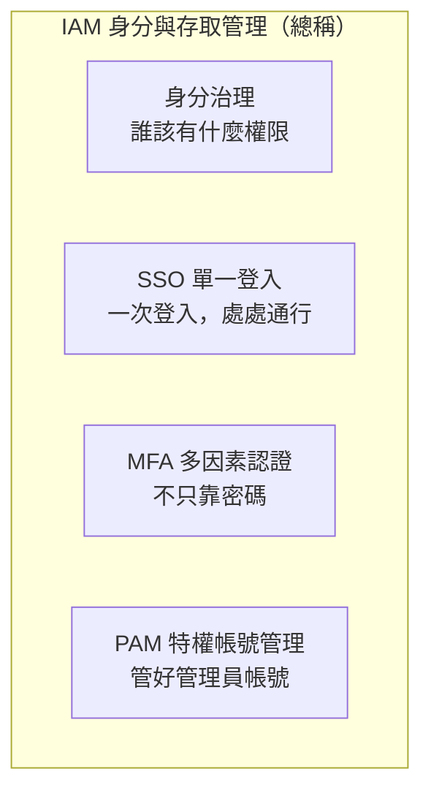
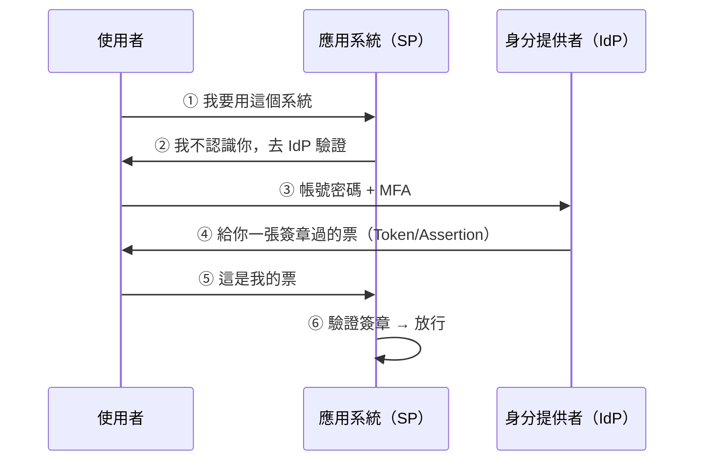
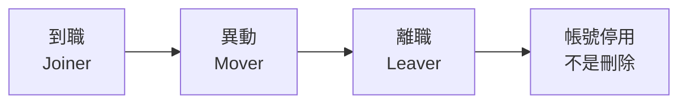

# 身分存取管理 IAM 與 MFA

> [!abstract] 這篇你會學到
> - 理解**為什麼「身分」取代了「網路位置」成為新的邊界**
> - 分辨 **IAM、SSO、MFA、PAM** 各自的角色與差異
> - 認識常見的 **MFA 方式與它們的強度排序**
> - 知道**為什麼簡訊 OTP 是最弱的 MFA**，以及什麼能擋住釣魚
> - 理解 **MFA 疲勞轟炸**攻擊與對策
> - 規劃**特權帳號（PAM）**的管控
> - 落實**最小權限**與**帳號生命週期管理**

## 前置知識

- [[01-資安全景圖與縱深防禦]] — 身分是縱深防禦的關鍵層
- [[09-使用者與群組管理]] — Linux 的帳號與權限基礎
- [[18-計概-資訊安全初步]] — 密碼與驗證的基本觀念

---

## 觀念說明

### 為什麼身分成為新的邊界

> [!danger] 傳統的「城牆」思維已經失效
> **舊模型**：
> ```
> 內部網路 = 可信任
> 外部網路 = 不可信任
> 防火牆 = 城牆
> ```
>
> **這個假設已經崩解**，因為：
>
> | 變化 | 後果 |
> | --- | --- |
> | **雲端服務** | 資料根本不在你的網路裡（M365、Google Workspace） |
> | **遠距工作** | 使用者根本不在你的網路裡 |
> | **BYOD 與行動裝置** | 裝置不在你的管控裡 |
> | **供應鏈與委外** | 外部人員需要存取內部系統 |
>
> **結果**：攻擊者**不需要突破防火牆** ——
> 他只要**拿到一組帳號密碼**，就能從網際網路上直接登入你的雲端服務，
> 而且**看起來完全像合法使用者**。

> [!tip] 一句話：「Identity is the new perimeter」
> **身分才是新的邊界。**
>
> 這是 [[12-零信任架構與微分段]] 的核心前提 ——
> 既然網路位置不再代表信任，那就**每次存取都驗證身分**。

### 四個名詞的分工



| 名詞 | 全稱 | 解決什麼問題 |
| --- | --- | --- |
| **IAM** | Identity and Access Management | **總稱**：管理「誰是誰」與「誰能做什麼」 |
| **SSO** | Single Sign-On | 使用者要記十幾組密碼 → **登入一次，全部通行** |
| **MFA** | Multi-Factor Authentication | 密碼會外洩 → **加上第二道驗證** |
| **PAM** | Privileged Access Management | 管理員帳號權力太大 → **特別看管** |
| **IGA** | Identity Governance & Administration | 權限累積、離職帳號沒刪 → **生命週期治理** |

> [!warning] 別把 PAM 搞混
> 資安界的 **PAM = Privileged Access Management**（特權帳號管理）。
>
> Linux 界的 **PAM = Pluggable Authentication Modules**（可插拔認證模組，`/etc/pam.d/`）。
>
> **兩個完全不同的東西**，看上下文判斷。
> 本篇兩者都會提到，會明確標示。

### 三種認證因素

| 因素 | 英文 | 例子 |
| --- | --- | --- |
| **你知道的** | Something you **know** | 密碼、PIN、安全問題 |
| **你擁有的** | Something you **have** | 手機、硬體金鑰、智慧卡、憑證 |
| **你本身的** | Something you **are** | 指紋、臉部、虹膜 |

> [!danger] 「兩道密碼」不是 MFA
> **MFA 的定義是「來自不同類別」的因素。**
>
> ❌ 密碼 + 安全問題 = **兩個都是「你知道的」→ 不是 MFA**
> ✅ 密碼 + 手機驗證碼 = 知道的 + 擁有的 = **是 MFA**
> ✅ 智慧卡 + PIN = 擁有的 + 知道的 = **是 MFA**（自然人憑證就是這種）

---

## MFA：強度排序

> [!danger] 不是所有 MFA 都一樣安全
> 這是本篇最重要的一張表。

| 強度 | 方式 | 能擋住 | **擋不住** |
| --- | --- | --- | --- |
| ⭐ **最弱** | **簡訊 OTP（SMS）** | 純密碼外洩 | **SIM 卡調包、SS7 攔截、即時釣魚** |
| ⭐⭐ | 電子郵件驗證碼 | 純密碼外洩 | 信箱被盜就全破、即時釣魚 |
| ⭐⭐⭐ | **TOTP**（Google Authenticator / Authy） | 密碼外洩、離線可用 | **即時釣魚（中間人代打）** |
| ⭐⭐⭐ | 推播通知（Push） | 密碼外洩、方便 | **MFA 疲勞轟炸**、即時釣魚 |
| ⭐⭐⭐⭐ | 推播 + **號碼配對**（Number Matching） | **MFA 疲勞轟炸** | 進階的即時釣魚 |
| ⭐⭐⭐⭐⭐ | **FIDO2 / WebAuthn 硬體金鑰**（YubiKey） | **包含即時釣魚** ← 唯一 | 實體遺失（但有 PIN 保護） |
| ⭐⭐⭐⭐⭐ | **Passkey**（通行金鑰） | 同上，且不用帶硬體 | 同步機制的信任問題 |
| ⭐⭐⭐⭐⭐ | **憑證式認證**（智慧卡、自然人憑證） | **包含即時釣魚** | 憑證管理成本高 |

### 為什麼簡訊 OTP 最弱

> [!danger] 三種攻擊
> **一、SIM Swap（SIM 卡調包）**
> 攻擊者冒充你向電信業者申請補發 SIM 卡
> （用社交工程，或內神通外鬼），
> **你的號碼就轉到他手上**，所有簡訊他都收得到。
>
> **二、SS7 協定攔截**
> 電信網路的 SS7 協定有已知的安全缺陷，
> 有能力的攻擊者可以攔截簡訊。
>
> **三、即時釣魚（最常見）**
> 見下方說明 —— 這個攻擊對 TOTP 也有效。
>
> **但是**：
> **有簡訊 OTP 仍然遠遠好過完全沒有 MFA。**
> 它擋掉了「密碼外洩後被直接登入」這個最大宗的攻擊。
> **不要因為它不完美就不做。**

### 即時釣魚：TOTP 也擋不住

> [!danger] Adversary-in-the-Middle 釣魚
> **攻擊流程**：
> ```
> ① 使用者收到釣魚信，點進假網站（例如 microsofr-login.com）
> ② 假網站是一個「即時代理」，把使用者輸入的內容轉發給真網站
> ③ 使用者輸入帳號密碼 → 代理轉發給真網站
> ④ 真網站要求 MFA → 代理把畫面轉給使用者
> ⑤ 使用者輸入 TOTP 驗證碼 → 代理立刻拿去真網站登入
> ⑥ 攻擊者取得「已通過 MFA 的 Session Cookie」
> ```
>
> **結果**：攻擊者拿到有效的登入 Session，
> **不需要再通過 MFA**（Session 已經是驗證過的狀態）。
>
> ❌ 簡訊 OTP —— 擋不住
> ❌ TOTP —— 擋不住
> ❌ 推播通知 —— 擋不住（使用者以為是自己在登入，就按了同意）
> ✅ **FIDO2 / WebAuthn —— 擋得住**

> [!tip] 為什麼 FIDO2 能擋住即時釣魚
> **關鍵在「origin binding（來源綁定）」**：
>
> FIDO2 的金鑰**與網域綁定**。
> 當使用者在 `microsofr-login.com`（假網站）上按下金鑰時，
> **瀏覽器會把「當前網域」一起送去簽章** ——
> 金鑰裡沒有針對這個網域註冊過的憑證，
> **所以根本產生不出有效的簽章**。
>
> ```
> 註冊時：金鑰記住「login.microsoftonline.com」
> 釣魚時：瀏覽器說「現在的網域是 microsofr-login.com」
> 金鑰：  「我沒有這個網域的金鑰」→ 拒絕
> ```
>
> **使用者就算完全被騙，技術上也無法完成驗證。**
> **這是目前唯一能防釣魚的 MFA。**

### MFA 疲勞轟炸

> [!danger] Push Bombing / MFA Fatigue
> 攻擊者**已經有你的密碼**（從外洩資料庫或釣魚取得），
> 然後**不斷嘗試登入**，你的手機就**不斷跳出「是否允許登入？」的推播**。
>
> ```
> 凌晨 2:00  → 推播  → 使用者按拒絕
> 凌晨 2:01  → 推播  → 使用者按拒絕
> 凌晨 2:02  → 推播  → 使用者按拒絕
> ...（連續 50 次）
> 凌晨 2:30  → 推播  → 使用者受不了，按了同意 ← 攻擊成功
> ```
>
> 有時攻擊者還會**假冒 IT 部門打電話**：
> 「我們在做系統更新，等一下會有推播，請您按同意。」
>
> **真實案例**：Uber 在 2022 年就是被這樣入侵的。

> [!tip] 四個對策
> **一、啟用「號碼配對」（Number Matching）** ← 最有效
> 登入畫面顯示一組兩位數字，使用者**必須在手機上輸入相同的數字**。
> **攻擊者的畫面在他自己那裡，使用者看不到那個數字，就無法配對。**
>
> **二、顯示登入情境**
> 推播上顯示「來自 台北市 / IP 1.2.3.4 / Chrome on Windows」，
> 使用者一看就知道不是自己。
>
> **三、限制推播頻率並自動封鎖**
> 短時間內大量失敗 → 鎖定帳號並通知資安。
>
> **四、改用 FIDO2** ← 根本解決
>
> **五、教育**：
> **「非你本人發起的驗證請求，一律拒絕並立刻回報」** ——
> 因為那代表**你的密碼已經外洩了**。

---

## SSO：單一登入

### 做什麼

> [!example] 比喻：園區的通行證
> **沒有 SSO**：每棟大樓一張門禁卡，你身上要帶十幾張。
>
> **有 SSO**：入園時換一張**通行證**，
> 每棟大樓只要驗這張證即可。



| 協定 | 用在哪 | 特色 |
| --- | --- | --- |
| **SAML 2.0** | 傳統企業應用、政府系統 | XML 格式，成熟穩定 |
| **OIDC**（OpenID Connect） | 現代 Web / 行動應用 | 建構在 OAuth 2.0 上，JSON/JWT |
| **OAuth 2.0** | **授權**（不是認證） | 「允許 A 存取我在 B 的資料」 |
| **Kerberos** | Windows AD 網域內 | 票證機制，見 [[00-Windows管理-索引]] |
| **LDAP** | 目錄查詢與簡單綁定認證 | AD、OpenLDAP |

> [!warning] OAuth 2.0 是「授權」不是「認證」
> **常見的誤解。**
>
> - **認證（Authentication）**：你是誰？
> - **授權（Authorization）**：你能做什麼？
>
> OAuth 2.0 原本設計來解決「**授權**」：
> 「我允許這個 App 讀取我的 Google 日曆」。
>
> 拿它來做「登入」是後來的用法，
> 而且**直接用 OAuth 做認證有安全陷阱**。
> **要做認證，用 OIDC**（它在 OAuth 上加了 `id_token` 這個認證層）。

### SSO 的好處與風險

| 好處 | 風險 |
| --- | --- |
| 使用者只記一組密碼 → **密碼強度可以要求更高** | **單點失效**：IdP 掛了，全部系統都登不進去 |
| **MFA 只要在 IdP 做一次**，所有系統都受保護 | **一把鑰匙開所有門**：IdP 帳號被盜 = 全破 |
| 離職時**停用一個帳號**就切斷所有存取 | Session 劫持的影響範圍變大 |
| 存取日誌集中，稽核容易 | 對 IdP 的依賴度極高 |

> [!danger] SSO 讓 IdP 帳號成為皇冠上的寶石
> 既然一個帳號能開所有門，
> **IdP 的管理員帳號就是攻擊者的最高目標**。
>
> **必做**：
> - IdP 管理員**強制 FIDO2**（不接受 TOTP）
> - **獨立的緊急存取帳號（Break-glass Account）**：
>   不受條件式存取政策限制、密碼分段保管在保險櫃、
>   **只在 IdP 完全故障時使用**，且**每次使用都告警**
> - IdP 的所有登入與設定變更**送到 SIEM**（見 [[09-日誌集中與SIEM]]）

---

## PAM：特權帳號管理

> [!danger] 為什麼管理員帳號要特別看管
> 一般帳號被盜 → 影響一個人的資料。
> **管理員帳號被盜 → 整個組織淪陷。**
>
> 而現實中的管理員帳號常常是：
> - **共用的**（`administrator`、`root`，密碼三個人都知道）
> - **密碼多年沒換**
> - **沒有 MFA**（因為是服務帳號／怕麻煩）
> - **沒有稽核記錄**（不知道是誰在什麼時候做了什麼）
> - **權限永久有效**（不用的時候也一直是管理員）

### PAM 系統做的五件事

| 功能 | 說明 |
| --- | --- |
| **密碼保險庫（Vault）** | 管理員密碼**沒有人知道**，存在保險庫裡 |
| **自動輪替** | 每次使用後或定期自動改密碼 |
| **Session 錄影** | **記錄管理員做了什麼**（畫面錄影或指令記錄） |
| **即時核准（Just-in-Time）** | **平常不是管理員**，需要時申請、核准後給予有時限的權限 |
| **跳板機（Jump Server）** | 所有管理連線都經過同一個入口，集中管控 |

> [!tip] 即時特權（JIT）是最重要的觀念
> **傳統**：帳號**永久**是 Domain Admin。
> → 24 小時都是攻擊目標。
>
> **JIT**：帳號**平常是一般使用者**，
> 需要時申請「給我 2 小時的管理權限」，
> 核准後**自動在 2 小時後移除**。
>
> **效果**：**攻擊者拿到這個帳號的時候，它通常不是管理員。**
>
> Azure AD / Entra ID 的 **PIM（Privileged Identity Management）**
> 就是做這件事。

> [!warning] 沒有預算買 PAM 系統？先做這五件事
> 這些不用花錢：
>
> 1. **停用共用的管理員帳號**，每個人用自己的具名帳號
>    （`admin-王小明`，而不是共用的 `administrator`）
> 2. **管理員帳號與日常帳號分離**
>    —— 日常收信上網用一般帳號，**絕對不要用管理員帳號收信上網**
> 3. **管理員帳號強制 MFA**（優先 FIDO2）
> 4. **限制管理介面的來源 IP**（只允許管理網段）
> 5. **記錄所有 sudo / 提權操作並送到集中日誌**
>
> 這五件事就能擋掉大部分的特權濫用。

### 服務帳號的問題

> [!danger] 服務帳號是最常被忽略的破口
> 服務帳號（給程式用的帳號）通常：
> - **密碼寫在設定檔裡**（明文）
> - **密碼永不過期**（因為改了程式會壞）
> - **沒有 MFA**（程式沒辦法做 MFA）
> - **權限過大**（當初懶得細調，直接給管理員）
> - **沒有人知道它在哪些地方被使用**
>
> **對策**：
> - **盤點所有服務帳號**，記錄用途與負責人
> - **改用受管理的身分**
>   （Windows 的 **gMSA**、雲端的 **Managed Identity**、Kubernetes 的 ServiceAccount）
> - 無法改的，**用機密管理系統**（Vault、Azure Key Vault）而非寫在設定檔
> - **嚴格限制權限**（只給真正需要的）
> - **限制可登入的來源**（Windows 可設「登入到」限制）
> - 見 [[10-機密管理與金鑰保護]]

---

## 最小權限與帳號生命週期

### 權限蔓延（Privilege Creep）

> [!warning] 這是每個組織都有的問題
> ```
> 小明進公司  → 給他 A 系統的權限
> 調到採購    → 給他 B 系統的權限（A 忘了收回）
> 兼任資安    → 給他 C 系統的權限（A、B 都還在）
> 五年後      → 小明有全公司最多的權限，但實際上只用得到 C
> ```
>
> **後果**：小明的帳號一旦被盜，攻擊者拿到的權限遠超過他的職務需要。

> [!tip] 定期權限盤點（Access Review）
> **至少每半年**（特權帳號每季）做一次：
>
> 1. 產出「每個人有哪些系統的哪些權限」清單
> 2. **由「主管」而不是「資訊人員」確認** ← 關鍵
>    （資訊人員不知道業務上誰該有什麼權限）
> 3. **預設是「移除」**：主管沒有明確說要保留的，就收回
> 4. 記錄盤點結果（稽核要看）
>
> 見 [[09-資安稽核與符合性檢核]]。

### 帳號生命週期



| 階段 | 該做的事 | 常見疏漏 |
| --- | --- | --- |
| **到職** | 依角色範本給予權限 | 直接複製別人的帳號（**權限跟著複製**） |
| **異動** | **先收回舊權限**再給新權限 | 只加不減 → 權限蔓延 |
| **離職** | **當天**停用所有帳號 | **拖了好幾週，甚至永遠沒停用** |

> [!danger] 離職帳號是最危險的後門
> **必須在離職生效當天（甚至當下）完成**：
>
> - [ ] AD／IdP 帳號**停用**
> - [ ] **強制登出所有 Session**（撤銷 Token，不然還能用到過期）
> - [ ] VPN 帳號停用
> - [ ] **雲端服務**帳號停用（M365、Google Workspace、GitHub、雲平台）
> - [ ] **他知道的共用密碼全部更換** ← 最常被忽略
> - [ ] **他的 SSH 公鑰從所有伺服器移除** ← 最常被忽略
> - [ ] API 金鑰、Personal Access Token 撤銷
> - [ ] 門禁卡繳回並停用
> - [ ] 郵件轉寄給主管（不是直接刪信箱）
>
> **停用而不是刪除** ——
> 因為：①資料可能還需要；②稽核要追溯；③**SID 重用可能造成權限混亂**。
> 通常保留 30～90 天後才真正刪除。

> [!tip] 用「離職 checklist」而不是靠記憶
> 把上面這張表做成表單，
> **人資通知 → 資訊執行 → 雙方簽核**。
> 見 [[10-資安政策文件與制度]]。

---

## 條件式存取

> [!note] 不只是「密碼對不對」，而是「這個情境合不合理」
> 條件式存取（Conditional Access）依據**情境**決定要不要放行、要不要額外驗證。

| 條件 | 例子 |
| --- | --- |
| **使用者／群組** | 管理員群組需要更嚴格的規則 |
| **位置** | 從台灣登入 → 正常；從境外登入 → 要求 MFA 或封鎖 |
| **裝置狀態** | 只允許**已納管且合規**的裝置存取敏感系統 |
| **應用程式** | 存取財務系統一律要求 MFA |
| **風險等級** | 系統判定「異常登入」→ 要求重新驗證或封鎖 |

> [!example] 不可能的移動（Impossible Travel）
> ```
> 09:00 從台北登入
> 09:20 從莫斯科登入
> ```
> **20 分鐘不可能從台北到莫斯科** → 判定其中一個是盜用 → 封鎖並告警。
>
> 這是雲端 IdP（Entra ID、Okta、Google）內建的風險偵測，
> **啟用它幾乎沒有成本，但抓到過非常多真實的帳號盜用。**

> [!warning] 條件式存取的常見陷阱
> **一、把自己鎖在外面**
> 設定「只允許已納管裝置」→ 結果管理員自己的裝置沒納管 → **全機關都進不去**。
> **對策**：一定要有**緊急存取帳號**排除在所有政策之外，
> 並先用「僅回報（Report-only）」模式測試。
>
> **二、忘了舊版驗證協定**
> 有些老協定（POP3、IMAP、SMTP AUTH）**不支援 MFA**，
> 攻擊者專門用它們繞過。
> **對策**：**封鎖舊版驗證（Legacy Authentication）** ← 這是必做項目。

---

## 完整實戰範例

### 為 Linux SSH 加上 TOTP 二階段驗證

> [!warning] 開始前務必保留一個已登入的 Session
> **設定錯誤會讓你完全無法登入這台機器。**
> 全程保留一個現有的 SSH 連線不要關閉，直到確認新設定可用。

```bash
# ===== 1. 安裝 Google Authenticator PAM 模組 =====
# 注意：這裡的 PAM 是 Linux 的 Pluggable Authentication Modules
$ sudo apt update && sudo apt install -y libpam-google-authenticator
```

> [!info]- Rocky / AlmaLinux（RHEL 系）對照
> ```bash
> $ sudo dnf install -y epel-release
> $ sudo dnf install -y google-authenticator
> ```

```bash
# ===== 2. 每個使用者自己產生金鑰（用自己的帳號執行，不要用 sudo）=====
$ google-authenticator

Do you want authentication tokens to be time-based (y/n) y
# → 會顯示一個 QR Code，用手機的驗證器 App 掃描

Your new secret key is: KRSXG5CTMVRXEZLU
Your emergency scratch codes are:
  12345678
  87654321
  ...
```

> [!danger] 立刻把「緊急備援碼」抄下來收好
> 手機遺失或重置時，**這是你唯一能登入的方式**。
> 印出來放保險櫃，或存在密碼管理器裡。
> **不要只留在手機上。**

```bash
# 後續問題的建議回答
Do you want me to update your "~/.google_authenticator" file? y
Do you want to disallow multiple uses of the same authentication token? y   # 防重放
Do you want to increase the original generation time limit? n
Do you want to enable rate-limiting? y                                      # 防暴力破解
```

```bash
# ===== 3. 設定 PAM =====
$ sudo nano /etc/pam.d/sshd
```

```ini
# 加在檔案最上方
auth required pam_google_authenticator.so nullok
# nullok = 還沒設定 TOTP 的使用者仍可登入（過渡期用）
# 全員都設定好之後，請務必移除 nullok

# 如果希望「金鑰登入後就不再要求 TOTP」，加上這行（放在 nullok 那行之前）
# auth [success=1 default=ignore] pam_access.so accessfile=/etc/security/access-local.conf
```

```bash
# ===== 4. 設定 sshd =====
$ sudo nano /etc/ssh/sshd_config
```

```ini
# 啟用鍵盤互動驗證（TOTP 需要）
KbdInteractiveAuthentication yes
UsePAM yes

# 【推薦組合】金鑰 + TOTP（最安全）
PasswordAuthentication no
AuthenticationMethods publickey,keyboard-interactive

# 【替代組合】密碼 + TOTP（安全性較低，但不需要金鑰）
# PasswordAuthentication yes
# AuthenticationMethods keyboard-interactive
```

```bash
# ===== 5. 測試（務必保留舊 Session！）=====
$ sudo sshd -t && echo "設定語法正確"
$ sudo systemctl restart sshd

# 【開新視窗】測試登入
$ ssh user@server
Verification code: 123456      # 輸入手機上的 6 位數
```

**預期輸出（金鑰 + TOTP 的情況）**：
```
Authenticated with partial success.
Verification code:
Welcome to Ubuntu 24.04 LTS
```

> [!tip] 排除自動化帳號
> 備份腳本、CI/CD 用的帳號沒辦法輸入 TOTP。
> 在 `/etc/pam.d/sshd` 用 `pam_succeed_if` 排除特定使用者或群組：
> ```ini
> auth [success=1 default=ignore] pam_succeed_if.so user ingroup no-2fa
> auth required pam_google_authenticator.so
> ```
> 然後把自動化帳號加入 `no-2fa` 群組
> —— 但**這些帳號必須改用金鑰認證且嚴格限制來源 IP 與可執行的指令**
> （`authorized_keys` 的 `from=` 與 `command=` 選項）。
>
> 見 [[07-SSH-安全強化]]。

### 部署 FIDO2 硬體金鑰做 SSH 登入

> [!tip] OpenSSH 8.2+ 原生支援 FIDO2
> 不需要額外套件，而且**私鑰存在硬體裡拿不出來**。

```bash
# ===== 產生 FIDO2 金鑰（需插上 YubiKey 等硬體金鑰）=====
# ed25519-sk（推薦，新硬體支援）
$ ssh-keygen -t ed25519-sk -C "工作站-YubiKey"

Generating public/private ed25519-sk key pair.
You may need to touch your authenticator to authorize key generation.
# ← 這時要「觸碰」金鑰上的金屬接點

Enter file in which to save the key (/home/user/.ssh/id_ed25519_sk):
Enter PIN for authenticator:              # 設定 PIN（這就是第二因素）
Enter passphrase (empty for no passphrase):

# 舊硬體不支援 ed25519-sk 時改用：
$ ssh-keygen -t ecdsa-sk -C "工作站-YubiKey"
```

```bash
# ===== 部署到伺服器 =====
$ ssh-copy-id -i ~/.ssh/id_ed25519_sk.pub user@server

# ===== 登入（每次都要觸碰金鑰）=====
$ ssh -i ~/.ssh/id_ed25519_sk user@server
Confirm user presence for key ED25519-SK SHA256:xxxx
# ← 觸碰金鑰
Welcome to Ubuntu 24.04 LTS
```

> [!tip] 產生「常駐金鑰」讓金鑰本身可攜
> ```bash
> $ ssh-keygen -t ed25519-sk -O resident -O verify-required -C "可攜金鑰"
> ```
> - `-O resident` — **私鑰存在硬體金鑰裡**，可以在任何電腦上取出使用：
>   ```bash
>   $ ssh-keygen -K        # 從硬體金鑰匯出到目前的電腦
>   ```
> - `-O verify-required` — **每次使用都要輸入 PIN**（不只是觸碰）
>
> **代價**：硬體金鑰的常駐金鑰空間有限（通常 25 組左右）。

> [!danger] 一定要準備第二把金鑰
> 硬體金鑰**遺失或損壞**，你就登不進去了。
>
> **標準做法**：
> - **註冊兩把金鑰**（一把隨身、一把放保險櫃）
> - 或保留一組**密碼 + TOTP** 的備援途徑
> - 伺服器上保留一個**主控台（Console）存取**方式

### AD 帳號的最小權限檢查

```powershell
# ===== 找出所有 Domain Admins 成員 =====
Get-ADGroupMember -Identity "Domain Admins" -Recursive |
    Select-Object Name, SamAccountName, objectClass |
    Format-Table -AutoSize

# ===== 找出「密碼永不過期」的帳號（高風險）=====
Get-ADUser -Filter 'PasswordNeverExpires -eq $true -and Enabled -eq $true' `
    -Properties PasswordNeverExpires, PasswordLastSet, LastLogonDate |
    Select-Object Name, SamAccountName, PasswordLastSet, LastLogonDate |
    Sort-Object PasswordLastSet |
    Format-Table -AutoSize

# ===== 找出 90 天沒登入但仍啟用的帳號（可能是離職未停用）=====
$cutoff = (Get-Date).AddDays(-90)
Get-ADUser -Filter {Enabled -eq $true -and LastLogonDate -lt $cutoff} `
    -Properties LastLogonDate |
    Select-Object Name, SamAccountName, LastLogonDate |
    Sort-Object LastLogonDate |
    Export-Csv -Path "C:\稽核\閒置帳號_$(Get-Date -f yyyyMMdd).csv" `
               -NoTypeInformation -Encoding UTF8

# ===== 找出「不需要預先驗證」的帳號（AS-REP Roasting 風險）=====
Get-ADUser -Filter 'DoesNotRequirePreAuth -eq $true' |
    Select-Object Name, SamAccountName

# ===== 找出有 SPN 的使用者帳號（Kerberoasting 風險）=====
Get-ADUser -Filter 'ServicePrincipalName -like "*"' -Properties ServicePrincipalName |
    Select-Object Name, SamAccountName, ServicePrincipalName
```

> [!danger] 上面最後兩項是攻擊者一定會查的
> **AS-REP Roasting**：帳號若設定「不需要 Kerberos 預先驗證」，
> 攻擊者**不需要任何憑證**就能索取可離線破解的雜湊。
>
> **Kerberoasting**：任何網域使用者都能索取「服務帳號」的票證，
> 拿回去**離線暴力破解**。服務帳號密碼若不夠長就會被破。
>
> **對策**：
> - 關閉所有「不需要預先驗證」的設定
> - 服務帳號密碼**至少 25 字元隨機**（離線破解就不可行）
> - 或改用 **gMSA**（密碼 120 字元、自動輪替，人不需要知道）

### 定期權限盤點腳本（Linux）

```bash
#!/usr/bin/env bash
# 產出主機的權限現況報告，供半年度盤點使用
set -uo pipefail
OUT="/var/log/access-review-$(date +%Y%m%d).txt"

{
echo "============================================"
echo " 權限盤點報告 — $(hostname) — $(date '+%F %T')"
echo "============================================"

echo -e "\n【1】可登入的使用者（有 shell）"
awk -F: '$7 !~ /(nologin|false|sync)$/ && $3>=1000 {printf "  %-20s uid=%-6s shell=%s\n",$1,$3,$7}' /etc/passwd

echo -e "\n【2】sudo 群組成員 ★重點檢查"
getent group sudo wheel 2>/dev/null | sed 's/^/  /'

echo -e "\n【3】sudoers 中的 NOPASSWD 設定 ★高風險"
grep -rn 'NOPASSWD' /etc/sudoers /etc/sudoers.d/ 2>/dev/null | sed 's/^/  /' \
  || echo "  （無，很好）"

echo -e "\n【4】UID 0 的帳號（應該只有 root）★★"
awk -F: '$3==0 {print "  ⚠ " $1}' /etc/passwd

echo -e "\n【5】空密碼帳號 ★★★"
sudo awk -F: '$2=="" {print "  ⚠⚠ " $1}' /etc/shadow 2>/dev/null || echo "  （需要 root 才能檢查）"

echo -e "\n【6】各帳號的 SSH 授權公鑰 ★離職檢查重點"
for h in /home/*/ /root/; do
  u=$(basename "$h")
  k="$h/.ssh/authorized_keys"
  if [ -f "$k" ]; then
    echo "  [$u]"
    while read -r line; do
      [ -z "$line" ] && continue
      case "$line" in '#'*) continue;; esac
      echo "    $(echo "$line" | awk '{print $1, $NF}')"
    done < "$k"
  fi
done

echo -e "\n【7】90 天內未登入的帳號"
lastlog -b 90 2>/dev/null | grep -v 'Never logged in' | tail -n +2 | sed 's/^/  /' \
  || echo "  （無）"

echo -e "\n【8】從未登入的帳號 ★可能是遺留帳號"
lastlog 2>/dev/null | grep 'Never logged in' | awk '{print "  " $1}'

echo -e "\n============================================"
echo " 請由「業務主管」逐項確認是否仍需保留"
echo " 預設處置：主管未明確表示保留者 → 移除"
echo "============================================"
} | sudo tee "$OUT"

echo "報告已存至 $OUT"
```

---

## 常見錯誤與排錯

| 現象／錯誤 | 原因 | 解法 |
| --- | --- | --- |
| **帳號密碼外洩後被直接登入** | **沒有 MFA** | **啟用 MFA**（這是投資報酬率最高的資安措施） |
| 有 MFA 還是被入侵 | **即時釣魚**代打了 TOTP | 高權限帳號改用 **FIDO2/WebAuthn**（唯一防釣魚） |
| 使用者被推播轟炸後按了同意 | **MFA 疲勞**攻擊 | 啟用**號碼配對**、顯示登入情境、限制頻率、教育 |
| MFA 開了但攻擊者仍能登入 | 攻擊者走**舊版驗證協定**（POP3/IMAP/SMTP AUTH） | **封鎖舊版驗證** ← 必做 |
| 離職員工還能存取系統 | 只停用了 AD，**雲端與 SSH 公鑰沒清** | 用**離職 checklist**；**撤銷 Session/Token**；清 `authorized_keys` |
| 停用帳號後對方仍能用一段時間 | **Token 還沒過期** | 停用時同步「**撤銷所有 Session/更新登入認證**」 |
| 設了條件式存取後全機關進不去 | **把自己也鎖在外面** | 先用 **Report-only** 測試；保留**緊急存取帳號**排除所有政策 |
| 服務帳號密碼被破解 | 密碼太短 + **Kerberoasting** | 密碼 **25 字元以上隨機**，或改用 **gMSA** |
| 沒人知道某個服務帳號在哪裡用 | 缺乏盤點 | 建立服務帳號清冊，記錄用途與負責人 |
| 使用者權限越來越多 | **權限蔓延**（只加不減） | 半年一次**權限盤點**，由**主管**確認，**預設移除** |
| 設定 SSH TOTP 後鎖住自己 | PAM 或 sshd 設定錯誤 | **設定前保留一個已登入 Session**；用 `sshd -t` 驗證語法 |
| 手機遺失後無法登入 | 沒保留備援碼 | 產生時**立刻抄下 scratch codes**；註冊**兩把**硬體金鑰 |
| Linux PAM 與資安 PAM 搞混 | 同名不同物 | 看上下文：`/etc/pam.d/` = Linux 模組；密碼保險庫 = 特權管理 |

---

## 安全性注意事項

> [!danger] MFA 是投資報酬率最高的單一資安措施
> 微軟的統計指出，**啟用 MFA 能擋掉超過 99% 的帳號盜用攻擊**。
>
> **優先順序**：
> 1. **所有管理員帳號** ← 最優先，且用 FIDO2
> 2. **所有可從網際網路存取的服務**（VPN、雲端郵件、遠端桌面）
> 3. 所有存取敏感資料的帳號
> 4. 全員
>
> **同時必做**：**封鎖舊版驗證協定**，
> 否則攻擊者會直接繞過 MFA。

> [!warning] MFA 不是萬靈丹
> | 攻擊 | MFA 有效嗎 |
> | --- | --- |
> | 密碼填充（Credential Stuffing） | ✅ **非常有效** |
> | 暴力破解 | ✅ 有效 |
> | 一般釣魚 | ✅ 有效 |
> | **即時釣魚（AiTM）** | ❌ 只有 **FIDO2** 有效 |
> | **Session Cookie 竊取** | ❌ **無效**（已經通過驗證了） |
> | **MFA 疲勞轟炸** | ⚠️ 需要**號碼配對** |
> | 惡意程式在端點上直接操作 | ❌ 無效（需要 EDR） |
>
> **Session 竊取的補強**：
> 縮短 Session 有效期、**綁定裝置與 IP**、
> 使用 **Token 綁定（Token Binding）**、
> 對高風險操作要求**重新驗證**。

> [!danger] 密碼政策的正確做法（已經改變了）
> **NIST SP 800-63B 的現代建議推翻了很多舊習慣**：
>
> | 舊做法 | ❌ 為什麼錯 | ✅ 新做法 |
> | --- | --- | --- |
> | **每 90 天強制換密碼** | 使用者只會改成 `Pass1!` → `Pass2!` | **不要定期強制換**，除非有外洩跡象 |
> | 要求大小寫+數字+符號 | 產生 `P@ssw0rd!` 這種可預測的密碼 | **重視長度**（至少 12～15 字元） |
> | 密碼提示問題 | 答案常常查得到（母親姓氏、畢業學校） | **不要用** |
> | 禁止貼上密碼 | **阻礙密碼管理器** | **允許貼上**，鼓勵用密碼管理器 |
>
> **應該做的**：
> - **長度優先**（15 字元的 passphrase 比 8 字元的複雜密碼強得多）
> - **比對已外洩密碼清單**（Have I Been Pwned 的 API、AD 的密碼保護）
> - **配合 MFA**（有 MFA 就不需要那麼折磨使用者）
> - 見 [[02-密碼與帳號管理實務]]

> [!warning] 緊急存取帳號的管理
> 每個組織都應該有 **2 個 Break-glass 帳號**：
>
> - **不受任何條件式存取政策限制**（避免政策錯誤鎖死全部人）
> - 使用**超長隨機密碼**，分成兩段由不同人保管在保險櫃
> - **不綁定任何個人的手機或裝置**
> - **每次登入都立即告警**給資安與主管
> - **每季測試一次**確認可用
> - **絕不用於日常工作**

---

## 速查表

### 四個名詞

| 名詞 | 解決什麼 |
| --- | --- |
| **IAM** | 總稱：誰是誰、誰能做什麼 |
| **SSO** | 一次登入，處處通行 |
| **MFA** | 不只靠密碼 |
| **PAM** | 管好管理員帳號 |

### 三種認證因素

| 因素 | 例子 |
| --- | --- |
| 你**知道**的 | 密碼、PIN |
| 你**擁有**的 | 手機、硬體金鑰、憑證 |
| 你**本身**的 | 指紋、臉部 |

**MFA = 來自不同類別**（密碼+安全問題 ❌）

### MFA 強度排序

```
簡訊 OTP  <  Email  <  TOTP ≈ 推播  <  推播+號碼配對  <  FIDO2/Passkey/憑證
  ⭐          ⭐⭐       ⭐⭐⭐           ⭐⭐⭐⭐            ⭐⭐⭐⭐⭐
                                                        ↑ 唯一能防即時釣魚
```

### 三個關鍵攻擊

| 攻擊 | 破解什麼 | 對策 |
| --- | --- | --- |
| **即時釣魚 AiTM** | 簡訊/TOTP/推播全破 | **FIDO2** |
| **MFA 疲勞轟炸** | 推播 | **號碼配對** |
| **繞過舊版驗證** | 所有 MFA | **封鎖 Legacy Auth** |

### 沒預算做 PAM 的五件事

1. 停用共用管理員帳號 → 具名帳號
2. **管理員帳號與日常帳號分離**
3. 管理員強制 MFA（FIDO2）
4. 限制管理介面來源 IP
5. sudo/提權記錄送集中日誌

### 離職 checklist

```
□ AD/IdP 停用（不是刪除）
□ 強制登出、撤銷 Token   ← 最常漏
□ VPN 停用
□ 雲端服務停用
□ 他知道的共用密碼全換   ← 最常漏
□ SSH 公鑰全移除         ← 最常漏
□ API 金鑰 / PAT 撤銷
□ 門禁卡繳回停用
□ 信箱轉寄主管
```

### SSH TOTP 設定

```bash
sudo apt install libpam-google-authenticator
google-authenticator                      # 每個使用者自己跑
# /etc/pam.d/sshd  → auth required pam_google_authenticator.so
# /etc/ssh/sshd_config:
#   KbdInteractiveAuthentication yes
#   AuthenticationMethods publickey,keyboard-interactive
sudo sshd -t && sudo systemctl restart sshd    # ★保留舊 Session
```

### FIDO2 SSH 金鑰

```bash
ssh-keygen -t ed25519-sk                              # 基本
ssh-keygen -t ed25519-sk -O resident -O verify-required  # 可攜+強制 PIN
ssh-keygen -K                                          # 從硬體匯出常駐金鑰
```

### AD 風險查詢

| 目的 | 指令 |
| --- | --- |
| Domain Admins | `Get-ADGroupMember "Domain Admins" -Recursive` |
| 密碼永不過期 | `Get-ADUser -Filter 'PasswordNeverExpires -eq $true'` |
| **AS-REP Roasting 風險** | `Get-ADUser -Filter 'DoesNotRequirePreAuth -eq $true'` |
| **Kerberoasting 風險** | `Get-ADUser -Filter 'ServicePrincipalName -like "*"'` |

### 現代密碼政策

```
✅ 長度優先（15+ 字元 passphrase）
✅ 比對已外洩清單
✅ 允許貼上（鼓勵密碼管理器）
✅ 配合 MFA
❌ 定期強制更換
❌ 密碼提示問題
```

---

## 練習題

> [!question]- 練習 1：盤點你的 MFA 現況
> 列出你機關**可以從網際網路存取**的所有服務，
> 對每一個回答：
> 1. 有沒有 MFA？
> 2. 是哪一種 MFA？（對照強度表）
> 3. **管理員帳號**是不是用最強的那一種？
> 4. **舊版驗證協定封鎖了嗎？**
>
> 如果有任何一個「可從網際網路存取 + 沒有 MFA」，
> **那就是你機關最該優先處理的資安缺口。**

> [!question]- 練習 2：模擬離職流程
> 挑一位（假想的）員工，走一遍離職 checklist：
> 1. 他有哪些系統的帳號？（你列得完嗎？）
> 2. **他的 SSH 公鑰在哪幾台伺服器上？**
>    （用本篇的盤點腳本查查看）
> 3. 他知道哪些共用密碼？
> 4. 他有沒有申請過 API 金鑰或 PAT？
> 5. **從你發現他要離職到全部處理完，需要多久？**
>
> 如果答案是「要好幾天」或「有些查不到」，
> 那就是需要改善的地方。

> [!question]- 練習 3：為一台測試機加上 SSH TOTP
> ⚠️ **請在測試機上做，並保留一個已登入的 Session。**
> 1. 安裝並設定 `libpam-google-authenticator`
> 2. **抄下緊急備援碼**
> 3. 設定為「金鑰 + TOTP」雙重要求
> 4. 開新視窗測試登入
> 5. **故意輸入錯誤的驗證碼**，觀察 `/var/log/auth.log` 的記錄
> 6. 試著用備援碼登入一次，確認它可用
>
> 思考：如果這是正式環境，
> **備份腳本用的帳號要怎麼處理？**

---

## 小測驗

Q1. 為什麼說「身分成為新的邊界」？造成這個轉變的四個因素是什麼？

Q2. IAM、SSO、MFA、PAM 各自解決什麼問題？

Q3. 三種認證因素是什麼？為什麼「密碼 + 安全問題」不算 MFA？

Q4. **為什麼簡訊 OTP 是最弱的 MFA**？三種攻擊方式是什麼？既然這麼弱，該不該用？

Q5. 什麼是「即時釣魚（AiTM）」？**為什麼 TOTP 擋不住，而 FIDO2 擋得住**？

Q6. 什麼是 MFA 疲勞轟炸？**最有效的對策是什麼**，它為什麼有效？

Q7. OAuth 2.0 與 OIDC 的差別是什麼？做「登入」該用哪一個？

Q8. 什麼是「即時特權（JIT）」？它為什麼比「永久管理員權限」安全？

Q9. 離職 checklist 中**最常被忽略的三項**是什麼？為什麼「停用而不是刪除」？

Q10. 現代密碼政策為什麼**不建議定期強制更換密碼**？該重視什麼？

> [!question]- 測驗答案
> **Q1.** 因為傳統「內部網路可信、外部不可信」的城牆假設已經崩解。
> 四個因素：①**雲端服務**（資料不在你的網路裡）；
> ②**遠距工作**（使用者不在你的網路裡）；
> ③**BYOD 與行動裝置**（裝置不在你的管控裡）；
> ④**供應鏈與委外**（外部人員需要存取內部系統）。
> 結果是攻擊者**不需要突破防火牆**，
> 只要**拿到一組帳號密碼**就能從網際網路直接登入，
> 而且**看起來完全像合法使用者**。
>
> **Q2.** **IAM** 是總稱，管理「誰是誰」與「誰能做什麼」；
> **SSO** 解決「使用者要記十幾組密碼」→ 登入一次全部通行；
> **MFA** 解決「密碼會外洩」→ 加上第二道驗證；
> **PAM**（特權帳號管理）解決「管理員帳號權力太大」→ 特別看管。
>
> **Q3.** 三種因素：**你知道的**（密碼、PIN）、
> **你擁有的**（手機、硬體金鑰、憑證）、
> **你本身的**（指紋、臉部）。
> 「密碼 + 安全問題」**兩個都是「你知道的」**，
> 而 **MFA 的定義是「來自不同類別」的因素**，所以不算 MFA。
>
> **Q4.** 三種攻擊：
> ①**SIM Swap**（冒充你向電信業者申請補發 SIM 卡，號碼轉到攻擊者手上）；
> ②**SS7 協定攔截**（電信網路協定的已知缺陷）；
> ③**即時釣魚**。
> **但仍然該用** —— **有簡訊 OTP 遠遠好過完全沒有 MFA**，
> 它擋掉了「密碼外洩後被直接登入」這個最大宗的攻擊。
> **不要因為它不完美就不做。**
>
> **Q5.** **AiTM** 是攻擊者架一個「即時代理」的假網站，
> 把使用者輸入的內容**即時轉發給真網站**：
> 使用者輸入密碼 → 代理轉發；真網站要 MFA → 代理轉給使用者；
> 使用者輸入 TOTP → **代理立刻拿去真網站登入**，
> 取得**已通過 MFA 的 Session Cookie**。
> **TOTP 擋不住**是因為驗證碼只是一串數字，誰拿到都能用。
> **FIDO2 擋得住**是因為 **origin binding（來源綁定）**：
> 金鑰**與網域綁定**，瀏覽器會把「當前網域」一起送去簽章，
> 金鑰裡沒有針對假網域註冊的憑證，**根本產生不出有效簽章** ——
> 使用者就算完全被騙，技術上也無法完成驗證。
>
> **Q6.** 攻擊者**已經有你的密碼**，然後不斷嘗試登入，
> 你的手機就**不斷跳出推播**，直到使用者受不了按了同意
> （有時還會假冒 IT 打電話說「等一下會有推播請按同意」）。
> **最有效的對策是「號碼配對（Number Matching）」**：
> 登入畫面顯示一組兩位數字，使用者**必須在手機上輸入相同的數字**。
> 有效是因為**攻擊者的登入畫面在他自己那裡，使用者看不到那個數字，
> 就無法完成配對**。
> （其他對策：顯示登入情境、限制推播頻率、改用 FIDO2、教育
> 「非本人發起的驗證請求一律拒絕並回報」。）
>
> **Q7.** **OAuth 2.0 是「授權」**（Authorization）——
> 「我允許這個 App 讀取我在 B 的資料」；
> **OIDC 是「認證」**（Authentication）——
> 它建構在 OAuth 2.0 之上，多了 `id_token` 這個認證層來回答「你是誰」。
> **做登入要用 OIDC** —— 直接拿 OAuth 做認證有安全陷阱。
>
> **Q8.** **JIT（Just-in-Time）**是「帳號平常是一般使用者，
> 需要時申請有時限的管理權限（例如 2 小時），核准後自動到期移除」。
> 比永久權限安全，是因為**攻擊者拿到這個帳號的時候，
> 它通常不是管理員** —— 大幅縮短了「高價值目標」的暴露時間窗。
> Azure AD / Entra ID 的 **PIM** 就是做這件事。
>
> **Q9.** 最常被忽略的三項：
> ①**強制登出所有 Session／撤銷 Token**（不然帳號停用後還能用到過期）；
> ②**他知道的共用密碼全部更換**；
> ③**他的 SSH 公鑰從所有伺服器移除**。
> **停用而不是刪除**的原因：①資料可能還需要；
> ②**稽核要追溯**；③**SID 重用可能造成權限混亂**。
> 通常保留 30～90 天後才真正刪除。
>
> **Q10.** 因為**定期強制更換會讓使用者只做最小改動**
> （`Pass1!` → `Pass2!` → `Pass3!`），**反而變得更可預測**，
> 而且會促使使用者把密碼寫下來。
> NIST SP 800-63B 建議：**不要定期強制更換，除非有外洩跡象**。
> 該重視的是：**長度優先**（15 字元的 passphrase 遠強過 8 字元的複雜密碼）、
> **比對已外洩密碼清單**、**允許貼上以鼓勵使用密碼管理器**、
> **配合 MFA**。

---

## 延伸閱讀

- [[12-零信任架構與微分段]] — 身分是零信任的核心
- [[02-密碼與帳號管理實務]] — 密碼政策的細節
- [[09-日誌集中與SIEM]] — 身分事件的監控
- [[07-SSH-安全強化]] — Linux 端的實作
- [[10-機密管理與金鑰保護]] — 服務帳號的密碼管理
- [[09-資安稽核與符合性檢核]] — 權限盤點的稽核要求
- [[12-資安意識與社交工程防範]] — MFA 疲勞與釣魚的人員面防護
