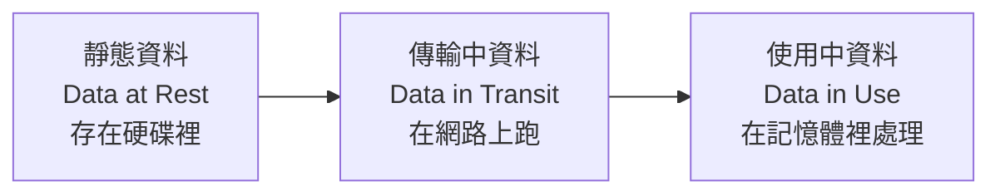
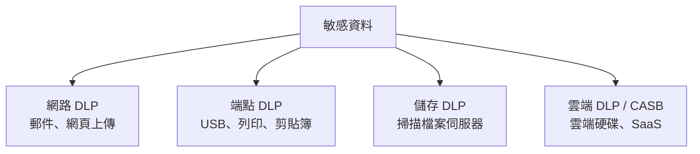

# 資料防護 DLP 與加密

> [!abstract] 這篇你會學到
> - 理解**資料的三種狀態**與各自的保護方式
> - 知道**資料分級**為什麼是所有資料保護的前提
> - 認識 **DLP** 能做什麼、**做不到什麼**
> - 實作 **LUKS**（Linux）與 **BitLocker**（Windows）全磁碟加密
> - 理解**加密保護什麼、不保護什麼**（最常見的誤解）
> - 知道**設備報廢時的資料銷毀**該怎麼做
> - 落實**個資法**要求的資料保護措施

## 前置知識

- [[01-資安全景圖與縱深防禦]] — 資料是所有防護的最終目標
- [[15-磁碟分割與掛載]] — 磁碟與分割的基礎
- [[05-TLS憑證與HTTPS實務]] — 傳輸中的加密

---

## 觀念說明

### 資料的三種狀態



| 狀態 | 在哪裡 | 保護方式 | 主要威脅 |
| --- | --- | --- | --- |
| **靜態（At Rest）** | 硬碟、備份帶、雲端儲存 | **全磁碟加密、檔案加密、資料庫加密** | **設備遺失／被偷、報廢外流** |
| **傳輸中（In Transit）** | 網路 | **TLS/HTTPS、VPN、SSH** | 竊聽、中間人攻擊 |
| **使用中（In Use）** | 記憶體、CPU | 機密運算、記憶體加密（新技術） | 記憶體傾印、惡意程式 |

> [!warning] 大多數組織只做了「傳輸中」
> HTTPS 大家都會做，但：
> - 筆電硬碟**沒有加密** → 遺失就是資料外洩
> - 備份檔案**沒有加密** → 備份帶掉了就是資料外洩
> - 資料庫檔案**沒有加密** → 伺服器硬碟被拔走就是資料外洩
>
> **「設備遺失」是台灣機關最常見的個資外洩通報原因之一。**

### 資料分級：所有資料保護的前提

> [!danger] 沒有分級就沒有保護
> **你不可能保護所有資料到相同的等級** ——
> 成本會爆炸，而且會讓業務窒礙難行。
>
> 但**如果你不知道哪些資料重要，就會發生**：
> - 把所有資料都當機密 → 大家想辦法繞過管制
> - 把所有資料都當公開 → 該保護的沒保護

| 等級 | 定義 | 例子 | 保護措施 |
| --- | --- | --- | --- |
| **機密／密** | 外洩會造成重大損害 | 個資、財務、機關機敏公文、金鑰 | 加密 + 存取控制 + 稽核 + DLP |
| **內部使用** | 僅限內部 | 內部程序、通訊錄、會議紀錄 | 存取控制 |
| **公開** | 可對外公布 | 新聞稿、公開資料 | 完整性保護（防竄改） |

> [!tip] 資料分級的實務起步法
> **不要一開始就想做全面盤點** —— 那會做不完。
>
> **從這裡開始**：
> 1. **列出前 10 個最重要的資料集**
>    （人事資料、財務系統、民眾個資、系統帳密…）
> 2. 對每一個回答：
>    - **它存在哪裡？**（哪台機器、哪個資料庫、有沒有備份與副本）
>    - **誰可以存取？**
>    - **外洩的後果是什麼？**
>    - **現在有什麼保護？**
> 3. **從缺口最大的開始補**
>
> 這張表就是你的「**資料資產清冊**」，
> 也是 ISO 27001 與個資法都會要求的東西。
> 見 [[05-ISO27001與ISMS]]。

---

## DLP：資料外洩防護

### 做什麼

**DLP**（Data Loss Prevention）**辨識敏感資料，並在它要離開時攔截**。



| 類型 | 監控什麼 | 例子 |
| --- | --- | --- |
| **網路 DLP** | 郵件附件、網頁上傳、FTP | 阻擋含身分證號的附件外寄 |
| **端點 DLP** | USB、列印、剪貼簿、螢幕截圖 | 禁止複製到 USB |
| **儲存 DLP** | 掃描檔案伺服器與資料庫 | **找出「不該放在這裡」的個資** |
| **雲端 DLP（CASB）** | 雲端硬碟、SaaS | 阻擋上傳到個人 Google Drive |

### 怎麼辨識敏感資料

| 方法 | 說明 | 準確度 |
| --- | --- | --- |
| **關鍵字** | 「機密」、「限閱」 | 低（誤判多） |
| **正規表示式** | 身分證號、信用卡號格式 | 中 |
| **檢核碼驗證** | 身分證號**檢查邏輯是否合法** | **高** |
| **文件指紋** | 對特定檔案取指紋，比對衍生檔案 | **高**（但要事先登錄） |
| **分類標籤** | 檔案帶有「機密」標籤 | **最高**（但要人工標記） |
| **機器學習** | 訓練模型辨識敏感文件 | 中～高 |

> [!example] 台灣身分證號的正規表示式與檢核
> ```regex
> [A-Z][12]\d{8}
> ```
> **但這樣誤判率很高** —— 隨便一串 `A123456789` 都會中。
>
> **加上檢核碼驗證**才實用：
> ```python
> def valid_twid(s: str) -> bool:
>     """台灣身分證字號檢核"""
>     import re
>     if not re.fullmatch(r'[A-Z][12]\d{8}', s):
>         return False
>     # 英文字母對應的數值
>     letters = 'ABCDEFGHJKLMNPQRSTUVXYWZIO'
>     n = letters.index(s[0]) + 10
>     total = (n // 10) + (n % 10) * 9        # 首碼十位*1 + 個位*9
>     weights = [8, 7, 6, 5, 4, 3, 2, 1]
>     for i, w in enumerate(weights):
>         total += int(s[1 + i]) * w
>     total += int(s[9])                       # 檢查碼
>     return total % 10 == 0
>
> # 測試
> print(valid_twid('A123456789'))   # True （這是常見的測試號）
> print(valid_twid('A123456780'))   # False
> ```
>
> **DLP 系統應該用這種「格式 + 檢核碼」的方式**，
> 才不會被大量誤判淹沒。

### DLP 的三種處置

| 模式 | 行為 | 適用 |
| --- | --- | --- |
| **監控（Monitor）** | 只記錄，不阻擋 | **導入初期必用** |
| **警告（Warn）** | 提示使用者「這可能含敏感資料，確定要送出嗎？」 | 教育效果好 |
| **阻擋（Block）** | 直接擋下 | 高風險場景 |

> [!danger] DLP 導入失敗的最大原因：一開始就設「阻擋」
> **後果**：
> - 大量誤判 → 正常業務被擋 → 使用者抱怨爆炸
> - 管理階層下令關掉 → 專案失敗
>
> **正確的導入節奏**：
> ```
> ① 監控模式 1～3 個月  → 收集資料，調整規則，看誤判率
> ② 警告模式 1～3 個月  → 使用者開始有意識（教育效果最好的階段）
> ③ 對「最明確的高風險場景」才開啟阻擋
>    （例如：含 100 筆以上身分證號的檔案外寄）
> ```

> [!warning] DLP 擋得住「不小心」，擋不住「故意」
> **DLP 主要防的是「無心之過」**：
> - 附件夾錯檔案
> - 把工作檔案存到個人雲端
> - 不知道那份檔案含個資
>
> **決心要偷的內部人員可以繞過**：
> - **手機拍螢幕** ← 幾乎無解
> - 用個人手機的行動網路（不經過公司網路）
> - 加密後再傳（DLP 看不到內容）
> - 把資料分批、改格式、藏在圖片裡
> - 手抄
>
> **對「故意」的防護要靠**：
> - **最小權限**（他根本拿不到那麼多資料）
> - **存取行為監控**（他一次下載一萬筆 → 告警）
> - **法律與人事管理**（保密協定、離職面談）
> - **UEBA**（使用者行為分析，見 [[09-日誌集中與SIEM]]）

---

## 加密：保護什麼、不保護什麼

> [!danger] 這是最重要、也最常被誤解的一段
> **全磁碟加密（LUKS / BitLocker）只保護「關機狀態下的實體存取」。**
>
> | 情境 | 全磁碟加密有效嗎 |
> | --- | --- |
> | 筆電**關機**時被偷 | ✅ **完全有效**（拆下硬碟也讀不到） |
> | 硬碟報廢後被撿走 | ✅ **有效** |
> | 送修時被複製資料 | ✅ 有效（如果關機） |
> | **開機後**被駭客入侵 | ❌ **完全無效**（系統已經解密了） |
> | 已登入時被人在旁邊操作 | ❌ 無效 |
> | 使用者被騙下載惡意程式 | ❌ 無效 |
> | **勒索病毒加密你的檔案** | ❌ **完全無效** |
> | 管理員誤刪資料 | ❌ 無效 |
>
> **一句話**：
> **全磁碟加密防的是「硬碟離開你的控制」，不防「系統被入侵」。**

> [!tip] 那各種威脅該用什麼防護？
> | 威脅 | 對應防護 |
> | --- | --- |
> | 設備遺失／被偷 | **全磁碟加密** |
> | 系統被入侵 | EDR、修補、最小權限（[[05-端點防護AV-EDR-XDR]]） |
> | 勒索病毒 | **異地離線備份**（[[14-備份與抗勒索防護]]） |
> | 內部人員偷資料 | DLP + 最小權限 + 行為監控 |
> | 傳輸被竊聽 | TLS / VPN |
> | 資料庫檔案被拿走 | 資料庫加密（TDE）+ 全磁碟加密 |

### 加密的層次

| 層次 | 保護範圍 | 例子 |
| --- | --- | --- |
| **全磁碟（FDE）** | 整顆硬碟 | LUKS、BitLocker、FileVault |
| **檔案系統／目錄** | 特定目錄 | eCryptfs、EFS、fscrypt |
| **檔案** | 單一檔案 | GnuPG、age、7-Zip AES |
| **資料庫（TDE）** | 資料庫檔案 | MySQL/PostgreSQL/SQL Server TDE |
| **欄位／應用層** | 特定欄位 | 在程式裡加密身分證號欄位 |

> [!tip] 欄位加密是唯一能防「資料庫管理員」的方式
> TDE 保護的是「**資料庫檔案被拿走**」，
> 但 **DBA 用 SQL 查詢時看到的還是明文**。
>
> 如果連 DBA 都不該看到（例如身分證號、健康資料），
> **必須在應用層加密**，金鑰由應用程式管理、不給 DBA。
>
> **代價**：加密的欄位**無法做範圍查詢與排序**，
> 只能做完全比對（或用確定性加密，但那會洩漏頻率資訊）。

---

## 完整實戰範例

### Linux 全磁碟加密：LUKS

> [!danger] LUKS 加密會清除該分割區的所有資料
> **請在測試環境或新磁碟上操作。**
> 正式環境請務必先完整備份並驗證還原。

```bash
# ===== 情境：加密一顆資料碟 /dev/sdb =====

# 1. 確認目標裝置（★★ 選錯就毀了）
$ lsblk -f
NAME   FSTYPE FSVER LABEL  SIZE MOUNTPOINTS
sda                       238G
├─sda1 vfat   FAT32       512M /boot/efi
└─sda2 ext4   1.0         237G /
sdb                       931G           ← 目標，確認是空的

# 2. 安裝工具
$ sudo apt install -y cryptsetup

# 3. 建立 LUKS2 加密容器
$ sudo cryptsetup luksFormat --type luks2 \
    --cipher aes-xts-plain64 --key-size 512 \
    --hash sha512 --pbkdf argon2id \
    /dev/sdb

WARNING!
========
This will overwrite data on /dev/sdb irrevocably.

Are you sure? (Type 'yes' in capital letters): YES
Enter passphrase for /dev/sdb:                 # ★ 至少 20 字元
Verify passphrase:
```

> [!tip] 參數說明
> | 參數 | 意義 |
> | --- | --- |
> | `--type luks2` | **LUKS2**（比 LUKS1 好，支援 Argon2） |
> | `aes-xts-plain64` | 磁碟加密的標準模式 |
> | `--key-size 512` | XTS 模式會切一半，**實際是 AES-256** |
> | `--pbkdf argon2id` | **抗 GPU 暴力破解**的金鑰衍生函數 |

```bash
# 4. 開啟（解密）容器
$ sudo cryptsetup open /dev/sdb data_crypt
Enter passphrase for /dev/sdb:
# → 產生 /dev/mapper/data_crypt

# 5. 建立檔案系統並掛載
$ sudo mkfs.ext4 -L DATA /dev/mapper/data_crypt
$ sudo mkdir -p /srv/data
$ sudo mount /dev/mapper/data_crypt /srv/data
$ df -h /srv/data
Filesystem                 Size  Used Avail Use% Mounted on
/dev/mapper/data_crypt     916G   28K  870G   1% /srv/data
```

```bash
# ===== 備援金鑰（★★★ 絕對不要跳過）=====
# LUKS 有 8 個金鑰槽，加第二組密碼
$ sudo cryptsetup luksAddKey /dev/sdb
Enter any existing passphrase:
Enter new passphrase for key slot:

# 更好的做法：加一個金鑰檔（給自動掛載用）
$ sudo dd if=/dev/urandom of=/root/data.key bs=512 count=8
$ sudo chmod 400 /root/data.key
$ sudo cryptsetup luksAddKey /dev/sdb /root/data.key

# ===== 備份 LUKS 標頭（★★★ 標頭壞了資料就永遠拿不回來）=====
$ sudo cryptsetup luksHeaderBackup /dev/sdb \
    --header-backup-file /root/sdb-luks-header.img
$ sudo chmod 400 /root/sdb-luks-header.img
# → 把這個檔案存到「另一台機器」或離線媒體
```

> [!danger] LUKS 標頭是單點失效
> LUKS 的標頭（前 16MB）存放**所有金鑰槽**。
> **標頭損毀 = 即使你記得密碼，資料也永遠拿不回來。**
>
> **必做**：
> 1. `luksHeaderBackup` 備份標頭
> 2. 把備份檔存到**另一台機器**或離線媒體
> 3. **標頭備份檔本身也要保護**（有了它 + 密碼就能解密）

```bash
# ===== 設定開機自動掛載 =====
# 取得 UUID
$ sudo blkid /dev/sdb
/dev/sdb: UUID="a1b2c3d4-...-..." TYPE="crypto_LUKS"

# /etc/crypttab
$ sudo tee -a /etc/crypttab <<'EOF'
data_crypt UUID=a1b2c3d4-...-... /root/data.key luks,discard
EOF

# /etc/fstab
$ sudo tee -a /etc/fstab <<'EOF'
/dev/mapper/data_crypt  /srv/data  ext4  defaults,noatime  0  2
EOF

# 測試（不要直接重開機就走人）
$ sudo systemctl daemon-reload
$ sudo mount -a && echo "fstab 語法正確"
```

> [!warning] 金鑰檔放在同一台機器上，等於降低了保護等級
> 用金鑰檔自動掛載很方便，但如果**整台機器被偷**，
> 金鑰檔也一起被偷了 —— **加密就失去意義**。
>
> **適用情境**：
> - ✅ **資料碟**加密（系統碟用密碼開機，資料碟自動掛載）
> - ✅ 機房內的伺服器（實體安全有保障，防的是「硬碟報廢外流」）
> - ❌ **筆電** —— 一定要用密碼或 TPM，不要用金鑰檔
>
> **更好的做法**：用 **TPM 綁定**（見下方）或網路解鎖（Clevis + Tang）。

```bash
# ===== 常用管理指令 =====
$ sudo cryptsetup luksDump /dev/sdb          # 檢視金鑰槽與設定
$ sudo cryptsetup luksKillSlot /dev/sdb 1    # 刪除第 1 個金鑰槽
$ sudo cryptsetup close data_crypt           # 卸載後關閉容器
$ sudo cryptsetup status data_crypt          # 檢視狀態
```

> [!tip] 用 TPM 自動解鎖（免密碼且不怕整機被偷）
> ```bash
> $ sudo apt install -y clevis clevis-luks clevis-tpm2 clevis-initramfs
> # 把金鑰綁到 TPM，並綁定開機環境（PCR）
> $ sudo clevis luks bind -d /dev/sdb tpm2 '{"pcr_bank":"sha256","pcr_ids":"7"}'
> $ sudo update-initramfs -u -k all
> ```
> **效果**：只有**這台機器、這個開機環境**才能自動解鎖。
> 硬碟拔到別台機器上 → **TPM 不同 → 解不開**。
>
> ⚠️ **仍然要保留密碼金鑰槽當備援** ——
> 主機板故障換板後 TPM 會不同，那時只能用密碼。

> [!info]- Rocky / AlmaLinux（RHEL 系）對照
> ```bash
> $ sudo dnf install -y cryptsetup clevis clevis-luks clevis-dracut
> # crypttab 與 fstab 用法相同
> # 重建 initramfs 用 dracut：
> $ sudo dracut -f --regenerate-all
> ```
> RHEL 系在安裝時就可以在分割畫面勾選「加密我的資料」，
> 那會建立 LUKS 加密的根分割區。

### Windows：BitLocker

```powershell
# ===== 檢查 TPM 狀態 =====
Get-Tpm
# TpmPresent : True
# TpmReady   : True

# ===== 檢查目前的加密狀態 =====
Get-BitLockerVolume | Format-Table MountPoint, VolumeStatus, EncryptionPercentage, ProtectionStatus

# ===== 啟用 BitLocker（系統碟，用 TPM + PIN）=====
# TPM + PIN 比純 TPM 安全（防止開機後直接被存取）
$pin = Read-Host -AsSecureString "設定開機 PIN（至少 6 位）"
Enable-BitLocker -MountPoint "C:" `
    -EncryptionMethod XtsAes256 `
    -TpmAndPinProtector -Pin $pin `
    -UsedSpaceOnly            # 只加密已用空間（快很多，新機適用）

# ===== 加入還原金鑰保護（★★★ 必做）=====
Add-BitLockerKeyProtector -MountPoint "C:" -RecoveryPasswordProtector

# ===== 檢視還原金鑰（立刻抄下來！）=====
(Get-BitLockerVolume -MountPoint "C:").KeyProtector |
    Where-Object KeyProtectorType -eq 'RecoveryPassword' |
    Select-Object KeyProtectorId, RecoveryPassword

# ===== 備份還原金鑰到 AD（網域環境必做）=====
$id = ((Get-BitLockerVolume -MountPoint "C:").KeyProtector |
        Where-Object KeyProtectorType -eq 'RecoveryPassword').KeyProtectorId
Backup-BitLockerKeyProtector -MountPoint "C:" -KeyProtectorId $id

# ===== 資料碟：自動解鎖 =====
Enable-BitLocker -MountPoint "D:" -EncryptionMethod XtsAes256 -UsedSpaceOnly
Enable-BitLockerAutoUnlock -MountPoint "D:"
```

> [!danger] BitLocker 還原金鑰沒有備份 = 資料可能永遠拿不回來
> **觸發還原金鑰的常見情況**：
> - **BIOS/UEFI 更新**（PCR 值改變）
> - 更換主機板或 TPM
> - 開機順序變更、插了新的開機裝置
> - Secure Boot 設定變更
> - **Windows 大版本更新**（偶爾）
>
> **這些都是日常維運會做的事** ——
> 如果沒有還原金鑰，**整台機器的資料就沒了**。
>
> **機關必做**：
> 1. **用 GPO 強制備份還原金鑰到 AD**：
>    ```
>    電腦設定 → 系統管理範本 → Windows 元件 → BitLocker 磁碟機加密
>      → 作業系統磁碟機
>        → 「選擇如何復原受 BitLocker 保護的作業系統磁碟機」
>          ☑ 將 BitLocker 復原資訊儲存至 AD DS
>          ☑ 在為作業系統磁碟機啟用 BitLocker 之前，不要啟用 BitLocker
>            （這一項會強制備份成功才能啟用加密）
>    ```
> 2. **更新 BIOS 前先暫停 BitLocker**：
>    ```powershell
>    Suspend-BitLocker -MountPoint "C:" -RebootCount 2
>    # 做完更新後
>    Resume-BitLocker -MountPoint "C:"
>    ```
> 3. 定期驗證 AD 中確實有每台機器的還原金鑰

```powershell
# ===== 從 AD 查詢還原金鑰（需要相應權限）=====
Get-ADObject -Filter 'objectClass -eq "msFVE-RecoveryInformation"' `
    -SearchBase (Get-ADComputer "PC-001").DistinguishedName `
    -Properties msFVE-RecoveryPassword |
    Select-Object Name, msFVE-RecoveryPassword
```

### 檔案層級加密：age

> [!tip] age 是現代版的 GnuPG，簡單很多
> 適合加密備份檔、設定檔、要傳給別人的敏感檔案。

```bash
$ sudo apt install -y age        # 或從 GitHub 下載

# ===== 方式一：密碼加密（適合自己保存）=====
$ age -p -o 個資檔.csv.age 個資檔.csv
Enter passphrase (leave empty to autogenerate a secure one):
$ ls -l 個資檔.csv.age

# 解密
$ age -d -o 個資檔.csv 個資檔.csv.age

# ===== 方式二：金鑰對加密（適合傳給別人）=====
# 收件人產生金鑰
$ age-keygen -o ~/.age/key.txt
Public key: age1ql3z7hjy54pw3hyww5ayyfg7zqgvc7w3j2elw8zmrj2kg5sfn9aqmcac8p
$ chmod 400 ~/.age/key.txt

# 寄件人用公鑰加密（不需要密碼溝通）
$ age -r age1ql3z7hjy54pw3hyww5ayyfg7zqgvc7w3j2elw8zmrj2kg5sfn9aqmcac8p \
      -o 報表.xlsx.age 報表.xlsx

# 收件人解密
$ age -d -i ~/.age/key.txt -o 報表.xlsx 報表.xlsx.age
```

```bash
# ===== 加密備份（串接 tar）=====
$ tar czf - /srv/data | age -r age1ql3z7... -o backup-$(date +%F).tar.gz.age

# 還原
$ age -d -i ~/.age/key.txt backup-2026-08-27.tar.gz.age | tar xzf - -C /restore
```

> [!info]- 用 GnuPG 的等效做法
> ```bash
> # 密碼加密
> $ gpg --symmetric --cipher-algo AES256 個資檔.csv
> $ gpg --decrypt 個資檔.csv.gpg > 個資檔.csv
>
> # 金鑰對
> $ gpg --full-generate-key
> $ gpg --encrypt --recipient user@example.com 報表.xlsx
> $ gpg --decrypt 報表.xlsx.gpg > 報表.xlsx
> ```
> GnuPG 功能更完整（簽章、信任網），但設定複雜得多。

### 找出散落在各處的個資

```bash
#!/usr/bin/env bash
# 掃描檔案伺服器中可能含有台灣身分證號的檔案
# ⚠️ 只回報「檔案路徑與筆數」，不輸出實際內容
set -uo pipefail
TARGET="${1:-/srv/share}"
REPORT="/var/log/pii-scan-$(date +%Y%m%d).csv"

echo "檔案路徑,可能筆數,最後修改,大小" > "$REPORT"

# 純文字類檔案
find "$TARGET" -type f \
     \( -iname '*.csv' -o -iname '*.txt' -o -iname '*.sql' \
        -o -iname '*.json' -o -iname '*.xml' -o -iname '*.log' \) \
     -size -100M -print0 |
while IFS= read -r -d '' f; do
  # 台灣身分證號格式（未驗檢核碼，會有誤判）
  n=$(grep -oE '\b[A-Z][12][0-9]{8}\b' "$f" 2>/dev/null | sort -u | wc -l)
  if [ "$n" -gt 0 ]; then
    printf '"%s",%s,"%s",%s\n' \
      "$f" "$n" "$(stat -c %y "$f" | cut -d. -f1)" "$(stat -c %s "$f")" >> "$REPORT"
  fi
done

echo "掃描完成：$REPORT"
echo "命中檔案數：$(( $(wc -l < "$REPORT") - 1 ))"
echo ""
echo "後續處理建議："
echo "  1. 逐一確認是否為真實個資（本腳本未驗檢核碼，有誤判）"
echo "  2. 確認該檔案「是否應該放在這裡」"
echo "  3. 不該存在的 → 安全刪除（shred）"
echo "  4. 必須保留的 → 移到受控目錄 + 加密 + 限制權限"
```

> [!warning] Office 檔案要另外處理
> `.docx` / `.xlsx` / `.pptx` 是壓縮檔，
> `grep` 直接掃**掃不到內容**。
>
> ```bash
> # 需要先解壓縮或用工具轉純文字
> $ sudo apt install -y libreoffice-common poppler-utils
> $ libreoffice --headless --convert-to txt 檔案.docx
> $ pdftotext 檔案.pdf -              # PDF
> ```
>
> 商用 DLP 工具內建數百種檔案格式的解析器，
> 這是它們相對於自製腳本的主要價值。

### 資料銷毀

> [!danger] 「刪除」與「格式化」都不算銷毀
> **一般刪除只是移除索引**，資料還在磁碟上，
> 用免費的救援工具就能還原。
>
> **快速格式化**也一樣。

| 媒體 | 銷毀方式 |
| --- | --- |
| **HDD（傳統硬碟）** | `shred`／`dd` 覆寫，或**消磁**，或**實體破壞** |
| **SSD / NVMe** | ⚠️ **覆寫不可靠**（見下方）→ **Secure Erase** 或**加密抹除** |
| **光碟** | 實體粉碎 |
| **紙本** | 碎紙機（**條狀切不夠，要用交叉切**） |
| **手機／平板** | 恢復原廠設定 **+ 事先啟用加密** |

```bash
# ===== HDD：覆寫單一檔案 =====
$ shred -vzn 3 /path/to/secret.csv
# -v 顯示進度  -z 最後補一次寫 0  -n 3 覆寫 3 次

# ===== HDD：覆寫整顆磁碟（★★ 確認裝置代號）=====
$ sudo shred -vzn 1 /dev/sdX          # 現代 HDD 覆寫 1 次就夠
# 或
$ sudo dd if=/dev/urandom of=/dev/sdX bs=4M status=progress

# ===== SSD/NVMe：用 Secure Erase =====
# NVMe
$ sudo nvme format /dev/nvme0n1 --ses=1        # 1=User Data Erase
$ sudo nvme format /dev/nvme0n1 --ses=2        # 2=Cryptographic Erase（更快更徹底）

# SATA SSD
$ sudo hdparm -I /dev/sdX | grep -i "erase"     # 先確認支援
$ sudo hdparm --user-master u --security-set-pass p /dev/sdX
$ sudo hdparm --user-master u --security-erase p /dev/sdX
```

> [!danger] SSD 為什麼不能靠覆寫
> SSD 有 **wear leveling（磨損平衡）**與**過度配置（over-provisioning）**：
> 你寫入的資料**不一定會覆蓋到原本的實體區塊**，
> 控制器可能把它寫到別的地方，**舊資料仍然留在某個實體區塊裡**。
>
> **正確做法**：
> 1. **一開始就啟用全磁碟加密**（LUKS/BitLocker）
> 2. 報廢時**銷毀金鑰**（`cryptsetup luksErase` 或 BitLocker 移除保護器）
>    → **剩下的資料就是一堆亂數，永遠解不開**
> 3. 或用 **Secure Erase / Cryptographic Erase**
>
> **這就是「一開始就加密」最大的維運價值** ——
> 報廢時只要銷毀金鑰，不用花好幾小時覆寫。

> [!warning] 委外銷毀要有紀錄
> 機關的設備報廢常常委外處理。**必須**：
> - 簽訂**保密協定**
> - 要求提供**銷毀證明**（含序號清單、銷毀方式、日期、照片）
> - **重要設備派員全程監督**
> - **最保險的做法：交出去之前自己先做一次加密抹除或實體破壞**
>
> 見 [[11-委外與供應鏈資安]]。

---

## 常見錯誤與排錯

| 現象／錯誤 | 原因 | 解法 |
| --- | --- | --- |
| **筆電遺失造成個資外洩** | 硬碟**沒有加密** | 全機關筆電強制 **BitLocker / LUKS** |
| 加密了還是被勒索病毒加密 | **全磁碟加密不防勒索**（系統開機後已解密） | 需要**異地離線備份**（[[14-備份與抗勒索防護]]） |
| BitLocker **突然要求還原金鑰** | BIOS 更新、換主機板、Secure Boot 變更改變了 PCR | **更新前先 `Suspend-BitLocker`**；**GPO 強制備份金鑰到 AD** |
| 還原金鑰找不到，資料拿不回來 | 沒有備份還原金鑰 | GPO 設「未成功備份前不允許啟用 BitLocker」 |
| **LUKS 標頭損毀，密碼對也開不了** | 標頭是單點失效 | **`luksHeaderBackup` 備份標頭**並存到另一台機器 |
| LUKS 金鑰檔和機器一起被偷 | 金鑰檔放在同一台機器上 | 筆電用密碼或 **TPM 綁定**；金鑰檔只用於機房內的資料碟 |
| **DLP 誤判太多被關掉** | 一開始就設「阻擋」模式 | **監控 → 警告 → 阻擋** 三階段導入 |
| 身分證號規則誤判一堆 | 只比對格式沒驗檢核碼 | 加上**檢核碼驗證**邏輯 |
| DLP 沒抓到 Office 檔裡的個資 | Office 檔是壓縮格式，grep 掃不到 | 用能解析檔案格式的工具或商用 DLP |
| 內部人員還是把資料帶走了 | **DLP 擋不住「故意」**（拍照、手機網路） | 最小權限 + 行為監控 + 法律與人事管理 |
| SSD 覆寫後資料還能救回 | **wear leveling 讓覆寫不可靠** | **Secure Erase / 加密抹除**，或事先全碟加密再銷毀金鑰 |
| 委外報廢後資料外流 | 沒有監督與證明 | 保密協定 + 銷毀證明 + **交出前自行抹除** |
| 加密欄位無法查詢排序 | 加密破壞了資料的順序性 | 接受只能完全比對，或改用資料庫層 TDE |
| DBA 看得到所有個資 | TDE 只防「檔案被拿走」 | 敏感欄位改在**應用層加密**，金鑰不給 DBA |

---

## 安全性注意事項

> [!danger] 金鑰管理比加密演算法重要得多
> **沒有人破解 AES-256，但天天有人因為金鑰管理不當而外洩資料。**
>
> | ❌ 常見錯誤 | ✅ 正確做法 |
> | --- | --- |
> | 金鑰寫在程式碼裡 | 用**機密管理系統**（Vault、Key Vault） |
> | 金鑰**commit 進 git** | `.gitignore` + **git-secrets 掃描** |
> | 金鑰與加密資料**存在同一個地方** | **分開存放** |
> | 只有一份金鑰、沒有備份 | **安全備份**（分段保管、離線） |
> | 金鑰從來不輪替 | 定期輪替，並保留舊金鑰以解密舊資料 |
> | 所有人都能存取金鑰 | **最小權限 + 存取記錄** |
>
> 見 [[10-機密管理與金鑰保護]]。

> [!warning] 個資法對機關的要求
> 《個人資料保護法》第 27 條要求
> 「採行**適當之安全措施**，防止個人資料被竊取、竄改、毀損、滅失或洩漏」。
>
> 施行細則第 12 條列出的具體措施包含：
> - 配置管理人員與相當資源
> - **界定個人資料之範圍**（= **資料盤點與分級**）
> - **資料安全管理及人員管理**
> - **設備安全管理**（← **全磁碟加密**屬於這一項）
> - 資料安全稽核機制
> - **使用紀錄、軌跡資料及證據保存**（← 見 [[09-日誌集中與SIEM]]）
> - 個人資料安全維護之整體持續改善
>
> **外洩時的義務**：
> 第 12 條要求「查明後應以適當方式**通知當事人**」。
> 公務機關另有依《資通安全管理法》的**通報時限**要求。
>
> 見 [[07-台灣資安法規與個資法]]。

> [!tip] 最小化原則：不存的資料不會外洩
> **這是成本最低、效果最好的資料保護。**
>
> 每個系統都該問：
> - **這個欄位真的需要嗎？**（真的需要身分證號，還是只要能識別即可？）
> - **需要保存多久？**（過期資料應該自動刪除）
> - **需要完整的嗎？**（顯示 `A12****789` 是否足夠？）
> - **測試環境需要真實資料嗎？** ← **常見的重大缺口**
>
> **測試環境用真實個資是很常見、也很危險的做法**：
> 測試環境通常防護較弱、權限較鬆、外包人員也看得到。
> **應該用去識別化或合成資料。**

> [!danger] 不要自己實作加密演算法
> 密碼學實作有無數陷阱（隨機數品質、IV 重用、時序攻擊、padding oracle）。
>
> **請使用經過驗證的函式庫與工具**：
> LUKS、BitLocker、OpenSSL/libsodium、age、GnuPG。
>
> **也不要用**：
> - ECB 模式（會洩漏資料樣式）
> - 自製的「XOR 加密」
> - MD5 / SHA1 存密碼（要用 **Argon2id** 或 bcrypt）
> - 固定的 IV / Nonce

---

## 速查表

### 資料三態

| 狀態 | 保護 |
| --- | --- |
| 靜態 At Rest | **全磁碟加密、TDE** |
| 傳輸 In Transit | TLS、VPN、SSH |
| 使用中 In Use | 機密運算（新技術） |

### 全磁碟加密防什麼

```
✅ 關機時設備被偷      ✅ 硬碟報廢外流
❌ 系統被入侵          ❌ 勒索病毒
❌ 已登入時被操作      ❌ 誤刪資料
```
**一句話：防「硬碟離開你的控制」，不防「系統被入侵」。**

### DLP 四種類型

| 類型 | 監控 |
| --- | --- |
| 網路 DLP | 郵件、網頁上傳 |
| 端點 DLP | USB、列印、剪貼簿 |
| 儲存 DLP | 掃描檔案伺服器 |
| 雲端 DLP/CASB | 雲端硬碟、SaaS |

### DLP 導入三階段

```
① 監控（1～3 月）→ ② 警告（1～3 月）→ ③ 高風險場景才阻擋
```

### LUKS 常用指令

| 目的 | 指令 |
| --- | --- |
| 建立 | `cryptsetup luksFormat --type luks2 /dev/sdX` |
| 開啟 | `cryptsetup open /dev/sdX name` |
| 關閉 | `cryptsetup close name` |
| 檢視 | `cryptsetup luksDump /dev/sdX` |
| 加金鑰 | `cryptsetup luksAddKey /dev/sdX` |
| 刪金鑰槽 | `cryptsetup luksKillSlot /dev/sdX N` |
| **備份標頭** ★ | `cryptsetup luksHeaderBackup /dev/sdX --header-backup-file f` |
| **銷毀（報廢）** | `cryptsetup luksErase /dev/sdX` |

### BitLocker 常用指令

| 目的 | PowerShell |
| --- | --- |
| 狀態 | `Get-BitLockerVolume` |
| 啟用 | `Enable-BitLocker -MountPoint C: -TpmAndPinProtector -Pin $p` |
| 加還原金鑰 | `Add-BitLockerKeyProtector -MountPoint C: -RecoveryPasswordProtector` |
| **備份到 AD** ★ | `Backup-BitLockerKeyProtector -MountPoint C: -KeyProtectorId $id` |
| **更新 BIOS 前** ★ | `Suspend-BitLocker -MountPoint C: -RebootCount 2` |
| 恢復 | `Resume-BitLocker -MountPoint C:` |

### age 檔案加密

```bash
age -p -o f.age f              # 密碼加密
age -d -o f f.age              # 解密
age-keygen -o key.txt          # 產生金鑰對
age -r age1xxx -o f.age f      # 用公鑰加密
age -d -i key.txt -o f f.age   # 用私鑰解密
```

### 資料銷毀

| 媒體 | 方式 |
| --- | --- |
| HDD | `shred -vzn 1 /dev/sdX`、消磁、實體破壞 |
| **SSD/NVMe** | **Secure Erase**（`nvme format --ses=2`）或**銷毀加密金鑰** |
| 紙本 | **交叉切**碎紙機 |

**最佳做法：一開始就加密 → 報廢時銷毀金鑰。**

### 金鑰管理六戒

```
❌ 寫在程式碼裡     ❌ commit 進 git
❌ 與資料同處存放   ❌ 只有一份沒備份
❌ 從不輪替         ❌ 所有人都能存取
```

---

## 練習題

> [!question]- 練習 1：資料盤點起步
> 列出你機關**最重要的 5 個資料集**，對每一個回答：
> 1. 它存在哪裡？（含**所有副本與備份**）
> 2. 分級應該是什麼？
> 3. 誰可以存取？
> 4. **靜態時有加密嗎？**
> 5. 外洩的後果是什麼？
> 6. **測試環境有沒有它的真實副本？** ← 常見的重大缺口
>
> 找出「重要性最高但保護最弱」的那一個，先處理它。

> [!question]- 練習 2：加密一顆測試磁碟
> ⚠️ 請用**測試機或空白磁碟**。
> 1. 用 LUKS2 加密一顆磁碟
> 2. **加第二組密碼**當備援
> 3. **備份 LUKS 標頭**到另一個位置
> 4. 設定開機自動掛載
> 5. **重開機驗證**能正常掛載
> 6. 用 `luksDump` 看看有幾個金鑰槽
> 7. 思考：如果這是筆電，你會用金鑰檔還是密碼？為什麼？

> [!question]- 練習 3：設備報廢流程
> 假設你要報廢 10 台舊電腦（5 台 HDD、5 台 SSD），寫出你的流程：
> 1. **HDD 與 SSD 的處理方式有什麼不同？為什麼？**
> 2. 如果它們一開始就有全磁碟加密，流程會簡化多少？
> 3. 委外處理的話，你要求對方提供什麼？
> 4. **你要怎麼證明資料確實被銷毀了？**（稽核會問這個）
> 5. 需要保留什麼紀錄？保留多久？

---

## 小測驗

Q1. 資料的三種狀態是什麼？各自的主要保護方式？

Q2. **為什麼「資料分級」是所有資料保護的前提**？不分級會有什麼後果？

Q3. **全磁碟加密防什麼、不防什麼**？特別是：它能防勒索病毒嗎？為什麼？

Q4. DLP 的四種類型分別監控什麼？

Q5. DLP 導入為什麼一定要「監控 → 警告 → 阻擋」三階段？直接開阻擋會怎樣？

Q6. **DLP 擋得住「不小心」擋不住「故意」** —— 請各舉三個例子，並說明對「故意」該用什麼防護。

Q7. 為什麼**只用正規表示式比對身分證號會誤判很多**？該怎麼改善？

Q8. **LUKS 標頭為什麼是單點失效**？該怎麼處理？

Q9. BitLocker 在哪些情況會突然要求還原金鑰？機關必須做的兩件事是什麼？

Q10. **為什麼 SSD 不能靠覆寫來銷毀資料**？最佳做法是什麼？

> [!question]- 測驗答案
> **Q1.** **靜態（At Rest）**——存在硬碟、備份、雲端儲存，
> 用**全磁碟加密／檔案加密／資料庫加密**，主要威脅是**設備遺失被偷、報廢外流**；
> **傳輸中（In Transit）**——在網路上，用 **TLS/HTTPS、VPN、SSH**，威脅是竊聽與中間人；
> **使用中（In Use）**——在記憶體與 CPU 裡，用機密運算與記憶體加密（新技術），
> 威脅是記憶體傾印與惡意程式。
> 大多數組織**只做了傳輸中**，靜態資料常常沒加密。
>
> **Q2.** 因為**你不可能保護所有資料到相同的等級**（成本會爆炸、業務會窒礙難行），
> 必須把資源放在最重要的資料上。
> 不分級的後果：**把所有資料都當機密** → 管制太嚴，大家想辦法繞過；
> **把所有資料都當公開** → 該保護的沒保護。
> 實務起步法是先列出**前 10 個最重要的資料集**，
> 對每個回答「存在哪裡／誰能存取／外洩後果／現有保護」，從缺口最大的開始補。
>
> **Q3.** **防**：關機時設備被偷（拆下硬碟也讀不到）、硬碟報廢後被撿走、送修時被複製。
> **不防**：系統被入侵、已登入時被人操作、使用者下載惡意程式、管理員誤刪。
> **不能防勒索病毒** —— 因為**系統開機後磁碟已經解密了**，
> 勒索病毒是以「合法使用者的身分」在讀寫已解密的檔案系統。
> 防勒索要靠**異地離線備份**。
> 一句話：**全磁碟加密防的是「硬碟離開你的控制」，不防「系統被入侵」。**
>
> **Q4.** **網路 DLP**——郵件附件、網頁上傳、FTP；
> **端點 DLP**——USB、列印、剪貼簿、螢幕截圖；
> **儲存 DLP**——掃描檔案伺服器與資料庫，找出「不該放在這裡」的敏感資料；
> **雲端 DLP（CASB）**——雲端硬碟與 SaaS，例如阻擋上傳到個人 Google Drive。
>
> **Q5.** 因為 DLP 的規則一開始一定會有**大量誤判**。
> 直接開阻擋 → 正常業務被擋 → 使用者抱怨爆炸 →
> **管理階層下令關掉 → 專案失敗**（這是 DLP 導入失敗的最大原因）。
> 正確節奏：①**監控** 1～3 個月收集資料調規則看誤判率；
> ②**警告** 1～3 個月（教育效果最好的階段，使用者開始有意識）；
> ③只對**最明確的高風險場景**才開啟阻擋。
>
> **Q6.** **擋得住「不小心」**：附件夾錯檔案、把工作檔案存到個人雲端、
> 不知道那份檔案含個資。
> **擋不住「故意」**：**手機拍螢幕**（幾乎無解）、用個人手機行動網路傳、
> 加密後再傳（DLP 看不到內容）、分批改格式藏在圖片裡、手抄。
> 對「故意」的防護要靠：**最小權限**（他根本拿不到那麼多資料）、
> **存取行為監控／UEBA**（一次下載一萬筆就告警）、
> **法律與人事管理**（保密協定、離職面談）。
>
> **Q7.** 因為 `[A-Z][12]\d{8}` 這個格式**任何符合形狀的字串都會中**
> （產品編號、序號、隨機字串），誤判率極高，
> 會讓資安人員被大量假警報淹沒而放棄使用。
> **改善方式：加上檢核碼驗證** ——
> 台灣身分證號有固定的加權檢核演算法，
> 驗算後不合法的就排除，準確度會大幅提升。
>
> **Q8.** 因為 LUKS 的**標頭（前 16MB）存放所有金鑰槽**，
> **標頭損毀 = 即使你記得密碼，資料也永遠拿不回來**。
> 處理方式：①用 `cryptsetup luksHeaderBackup` **備份標頭**；
> ②把備份檔存到**另一台機器或離線媒體**；
> ③**標頭備份檔本身也要保護**（有了它加上密碼就能解密資料）。
>
> **Q9.** 常見情況：**BIOS/UEFI 更新**、更換主機板或 TPM、
> 開機順序變更、Secure Boot 設定變更、Windows 大版本更新 ——
> **這些都是日常維運會做的事**（因為它們會改變 TPM 的 PCR 值）。
> **機關必做的兩件事**：
> ①**用 GPO 強制把還原金鑰備份到 AD DS**，
> 並勾選「未成功備份前不允許啟用 BitLocker」；
> ②**更新 BIOS 前先 `Suspend-BitLocker -RebootCount 2`**，完成後再 `Resume-BitLocker`。
>
> **Q10.** 因為 SSD 有 **wear leveling（磨損平衡）**與**過度配置**：
> 你寫入的資料**不一定會覆蓋到原本的實體區塊**，
> 控制器可能寫到別的地方，**舊資料仍然留在某個實體區塊裡**，
> 而那些區塊是作業系統看不到、也覆寫不到的。
> **最佳做法**：**一開始就啟用全磁碟加密**，報廢時**銷毀金鑰**
> （`cryptsetup luksErase` 或移除 BitLocker 保護器）——
> 剩下的資料就是一堆解不開的亂數；
> 或使用 **Secure Erase / Cryptographic Erase**（`nvme format --ses=2`）。
> 這也是「一開始就加密」最大的維運價值：報廢時不用花好幾小時覆寫。

---

## 延伸閱讀

- [[14-備份與抗勒索防護]] — 加密不防勒索，備份才防
- [[10-機密管理與金鑰保護]] — 金鑰管理的細節
- [[05-TLS憑證與HTTPS實務]] — 傳輸中的加密
- [[09-日誌集中與SIEM]] — 存取行為監控與 UEBA
- [[07-台灣資安法規與個資法]] — 個資法的法遵要求
- [[05-ISO27001與ISMS]] — 資產清冊與分級的管理制度
- [[11-委外與供應鏈資安]] — 委外銷毀的要求
