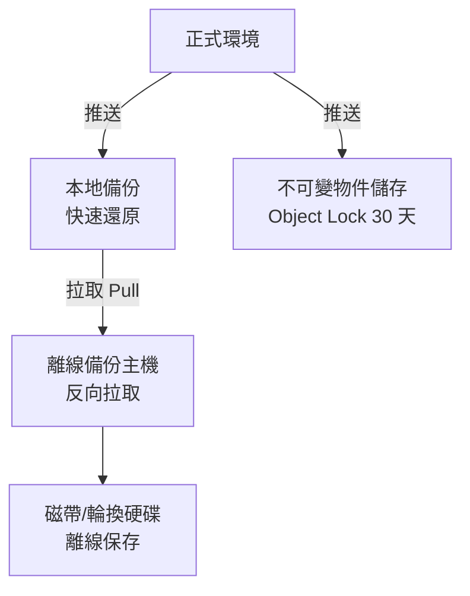

# 備份與抗勒索防護

> [!abstract] 這篇你會學到
> - 理解**為什麼備份是「最後一道防線」，也是最常失效的一道**
> - 掌握 **3-2-1-1-0 原則**（不只是 3-2-1）
> - 知道**勒索病毒會「先攻擊你的備份」**，以及如何防範
> - 分辨**不可變備份、離線備份、快照**的差別與能力邊界
> - 用 **RPO / RTO** 決定備份策略
> - 實作 **restic + 不可變物件儲存**的抗勒索備份
> - 建立**還原演練**制度 —— **沒演練過的備份不算備份**

## 前置知識

- [[11-備份災難復原與入侵應變]] — 備份與 DR 的整體概念
- [[08-資料防護DLP與加密]] — **全磁碟加密不防勒索**
- [[01-資安全景圖與縱深防禦]] — 復原是縱深防禦的最後一層

---

## 觀念說明

### 備份是唯一能對抗勒索病毒的方法

> [!danger] 其他防護都可能失敗，備份是最後的保障
> | 防護 | 對勒索病毒有效嗎 |
> | --- | --- |
> | 防火牆 | ⚠️ 部分（擋不住釣魚與已入侵） |
> | 防毒／EDR | ⚠️ 部分（新變種可能漏掉） |
> | 郵件閘道 | ⚠️ 部分 |
> | **全磁碟加密** | ❌ **完全無效**（系統已解密） |
> | 微分段 | ⚠️ 限制擴散範圍，但不防第一台 |
> | **可用的備份** | ✅ **唯一能保證復原的方法** |
>
> **「我們有備份」是唯一能讓你在勒索談判桌上說「不」的底氣。**

> [!danger] 但備份也是最常失效的一道防線
> **常見的失敗**：
> ```
> 「我們有備份」 → 需要還原時才發現：
>   ✗ 備份已經三個月沒跑了（沒人在看告警）
>   ✗ 備份檔案本身也被加密了（備份在同一台機器上/同一個網芳）
>   ✗ 備份可以還原，但花了五天（沒測過速度）
>   ✗ 備份是空的（設定改過但沒人發現）
>   ✗ 加密的備份，但金鑰存在被加密的那台機器上
>   ✗ 從來沒有人試過還原
> ```
>
> **「沒有演練過的備份，不算備份。」**

### 勒索病毒的完整流程


> [!danger] 第 ⑥ 步：他們會先摧毀你的備份
> **這不是意外，是標準流程。**
>
> 現代勒索病毒集團**明確地把「摧毀備份」列為加密前的必要步驟**，
> 因為**有備份的受害者不會付錢**。
>
> **他們會做的**：
> | 動作 | 說明 |
> | --- | --- |
> | 刪除 **Windows 磁碟區陰影複製（VSS）** | `vssadmin delete shadows /all /quiet` |
> | 停用 Windows 修復 | `bcdedit /set recoveryenabled No` |
> | **加密網路磁碟機上的備份** | 備份放網芳 = 一起被加密 |
> | **登入備份系統刪除備份** | 用偷到的管理員帳號 |
> | **加密 NAS**（含 iSCSI/SMB 掛載的） | |
> | **刪除雲端備份** | 用偷到的雲端憑證 |
> | 停用備份服務與排程 | |
> | **加密虛擬機的快照與備份檔** | |
>
> **所以「備份放在線上、用同一組帳號能存取」等於沒有備份。**

> [!warning] 雙重／三重勒索
> 現代勒索不只是加密：
> - **雙重勒索**：**先竊取資料再加密**
>   → 就算你有備份能還原，他們仍威脅**公開你的資料**
> - **三重勒索**：再加上 **DDoS 攻擊**或**直接聯絡你的客戶／民眾**
>
> **所以備份能解決「可用性」問題，但解決不了「資料外洩」問題。**
>
> **還是需要**：DLP、加密、最小權限、偵測能力
> （見 [[08-資料防護DLP與加密]]）。

---

## 3-2-1-1-0 原則

> [!tip] 傳統的 3-2-1 已經不夠了
> **3-2-1**（經典）：
> ```
> 3 份資料副本（1 份正式 + 2 份備份）
> 2 種不同的儲存媒體
> 1 份異地
> ```
>
> **3-2-1-1-0**（抗勒索版）：
> ```
> 3 份副本
> 2 種媒體
> 1 份異地
> 1 份【離線 或 不可變（Immutable）】  ← ★ 新增，最重要
> 0 個錯誤（【驗證過】的還原）          ← ★ 新增
> ```

| 數字 | 意義 | 為什麼 |
| --- | --- | --- |
| **3** | 三份副本 | 一份壞了還有兩份 |
| **2** | 兩種媒體 | 避免單一媒體的系統性故障 |
| **1** | 一份異地 | 火災、水災、竊盜 |
| **1** ★ | **離線或不可變** | **勒索病毒碰不到** |
| **0** ★ | **零錯誤（驗證過）** | **確認真的能還原** |

### 「離線」與「不可變」的差別

| | 離線（Air-gapped） | 不可變（Immutable） |
| --- | --- | --- |
| 原理 | **實體上不連線** | 連線但**技術上禁止刪改** |
| 例子 | 磁帶、拔掉的外接硬碟、輪換的抽取式硬碟 | 物件儲存的 **Object Lock**、WORM 磁帶、ZFS 唯讀快照 |
| 抗勒索 | ✅ **最徹底** | ✅ 很好（正確設定的話） |
| 還原速度 | 慢（要人去接） | 快 |
| 自動化 | 難（要人工輪換） | **容易** |
| 風險 | 忘記輪換、媒體損壞 | **設定錯誤、保留期太短、憑證被盜且能改設定** |

> [!tip] 建議：兩者都要有
> ```
> 日常還原      → 本地備份（快）
> 一般災難      → 異地備份 + 不可變（自動化）
> 最壞情況      → 離線備份（磁帶/輪換硬碟）
> ```
>
> **不可變備份負責「絕大多數的勒索情境」，
> 離線備份負責「連不可變設定都被改掉」的最壞情況。**

### 不可變備份（Object Lock）

> [!note] 原理：技術上讓「刪除」這件事不可能發生
> **S3 Object Lock**（以及相容的 MinIO、Wasabi、Backblaze B2）
> 提供兩種模式：
>
> | 模式 | 說明 |
> | --- | --- |
> | **Governance 模式** | 一般使用者不能刪，但**特殊權限可以繞過** |
> | **Compliance 模式** ★ | **任何人都不能刪，包括 root 帳號**，直到保留期滿 |
>
> **抗勒索要用 Compliance 模式** ——
> 因為攻擊者可能已經取得你的最高權限帳號。

> [!danger] Compliance 模式是不可逆的
> 一旦設定 Compliance 模式與保留期，
> **在保留期內連 AWS 自己都刪不掉**。
>
> **這代表**：
> - 設錯了保留期（例如誤設 10 年）→ **你要付 10 年的儲存費**
> - 誤存了不該存的東西 → **刪不掉**（個資法遵可能出問題）
>
> **務必**：
> - **先在測試桶（bucket）上試**
> - 保留期設定為「合理的復原窗口」，例如 **30～90 天**
> - 搭配生命週期規則自動轉冷儲存降低成本

---

## RPO 與 RTO

> [!tip] 這兩個指標決定你的備份策略
> ```
>        ← RPO →          事故           ← RTO →
>   ─────┬──────────────────┬──────────────────┬────
>     最後備份            發生時刻          恢復服務
> ```

| 指標 | 全稱 | 回答 | 決定 |
| --- | --- | --- | --- |
| **RPO** | Recovery Point Objective | **能接受損失多少資料？** | **備份頻率** |
| **RTO** | Recovery Time Objective | **能接受多久沒有服務？** | **還原方式與架構** |

> [!example] 對照表
> | 系統 | RPO | RTO | 需要的架構 |
> | --- | --- | --- | --- |
> | 公務入口網站（靜態） | 24 小時 | 4 小時 | 每日備份 + 文件化的重建程序 |
> | 公文系統 | **1 小時** | **4 小時** | 每小時備份 + 熱備援機器 |
> | 財務／收費系統 | **15 分鐘** | **1 小時** | 資料庫即時複寫 + 自動切換 |
> | 內部檔案伺服器 | 24 小時 | 24 小時 | 每日備份 |
> | 測試環境 | 一週 | 一週 | 每週備份（或不備份） |

> [!warning] RPO/RTO 必須由「業務單位」決定，不是資訊單位
> **常見的錯誤對話**：
> ```
> 資訊：「你們能接受多久沒有服務？」
> 業務：「當然是零！一秒都不能停！」
> ```
>
> **正確的問法是把成本攤開**：
> ```
> 「RTO 24 小時 → 現有架構，不用加錢」
> 「RTO 4 小時  → 需要熱備援，加 XX 萬」
> 「RTO 1 小時  → 需要雙活架構，加 XXX 萬」
> 「請問這個系統值得花多少錢來縮短停機時間？」
> ```
>
> **這樣業務單位才會給出真實的答案**，
> 而且**這個決定要書面記錄並由主管核准**（稽核會看）。

> [!danger] 勒索病毒的 RPO 陷阱
> 勒索病毒常常**潛伏數週後才發動**。
>
> ```
> 攻擊者在 6/1 進來 → 潛伏偵察 → 8/1 發動加密
> ```
>
> **如果你只保留 30 天的備份**，
> 那 7/1 之前的備份都沒了，
> **而 7/1 之後的備份可能都已經被植入後門了**。
>
> **對策**：
> - **保留較長的歷史版本**（GFS 輪替：日/週/月/年）
> - 建議：**每日保留 30 天、每週保留 12 週、每月保留 12 個月**
> - **還原前一定要掃描**，確認沒有帶回後門

---

## 完整實戰範例

### restic + 不可變物件儲存

> [!tip] restic 是現代備份工具的好選擇
> - **預設加密**（客戶端加密，儲存端看不到內容）
> - **去重複**（節省空間）
> - **增量備份**
> - 支援 S3、B2、Azure、SFTP 等多種後端
> - 單一執行檔，好部署

```bash
# ========== 【1】安裝 ==========
$ sudo apt install -y restic
$ restic version
restic 0.16.4 compiled with go1.21.6 on linux/amd64
```

```bash
# ========== 【2】建立設定與金鑰 ==========
$ sudo mkdir -p /etc/restic && sudo chmod 700 /etc/restic

# 產生強密碼（★★★ 這是你的加密金鑰）
$ openssl rand -base64 48 | sudo tee /etc/restic/password
$ sudo chmod 400 /etc/restic/password

$ sudo tee /etc/restic/env > /dev/null <<'EOF'
export RESTIC_REPOSITORY="s3:s3.amazonaws.com/my-backup-bucket/server01"
export RESTIC_PASSWORD_FILE="/etc/restic/password"
export AWS_ACCESS_KEY_ID="AKIAXXXXXXXX"
export AWS_SECRET_ACCESS_KEY="xxxxxxxxxxxx"
EOF
$ sudo chmod 400 /etc/restic/env
```

> [!danger] restic 的密碼遺失 = 所有備份永遠無法還原
> restic 用這個密碼加密整個 repository。
> **沒有這個密碼，資料就是一堆亂數。**
>
> **必做**：
> - **把密碼印出來放保險櫃**
> - **存在密碼管理器裡**
> - **告訴至少兩個人在哪裡**
> - **絕對不要只存在被備份的那台機器上** ← 這是常見的致命錯誤
>
> 同樣地，**S3 憑證也要另外保管一份** ——
> 不然機器全毀時，你連備份都拿不到。

```bash
# ========== 【3】設定物件儲存的不可變性 ==========
# ★ 建立 bucket 時就要啟用 Object Lock（事後無法啟用！）
$ aws s3api create-bucket \
    --bucket my-backup-bucket \
    --region ap-northeast-1 \
    --create-bucket-configuration LocationConstraint=ap-northeast-1 \
    --object-lock-enabled-for-bucket

# 啟用版本控制（Object Lock 需要）
$ aws s3api put-bucket-versioning \
    --bucket my-backup-bucket \
    --versioning-configuration Status=Enabled

# 設定預設保留規則：COMPLIANCE 模式 30 天
$ aws s3api put-object-lock-configuration \
    --bucket my-backup-bucket \
    --object-lock-configuration '{
      "ObjectLockEnabled": "Enabled",
      "Rule": {
        "DefaultRetention": {
          "Mode": "COMPLIANCE",
          "Days": 30
        }
      }
    }'

# 驗證
$ aws s3api get-object-lock-configuration --bucket my-backup-bucket
```

> [!danger] Object Lock 只能在「建立 bucket 時」啟用
> **既有的 bucket 無法事後啟用 Object Lock**（AWS 需要開 support case）。
>
> **如果你已經有 bucket，要建一個新的**，然後遷移。

```bash
# ========== 【4】備份帳號權限最小化 ★★ ==========
# 只給「寫入」與「讀取」，【不給刪除】
$ cat > backup-policy.json <<'EOF'
{
  "Version": "2012-10-17",
  "Statement": [
    {
      "Sid": "AllowBackupWrite",
      "Effect": "Allow",
      "Action": [
        "s3:PutObject",
        "s3:GetObject",
        "s3:ListBucket",
        "s3:GetBucketLocation"
      ],
      "Resource": [
        "arn:aws:s3:::my-backup-bucket",
        "arn:aws:s3:::my-backup-bucket/*"
      ]
    },
    {
      "Sid": "DenyDeleteAndLockChanges",
      "Effect": "Deny",
      "Action": [
        "s3:DeleteObject",
        "s3:DeleteObjectVersion",
        "s3:PutBucketVersioning",
        "s3:PutObjectLockConfiguration",
        "s3:PutObjectRetention",
        "s3:PutBucketPolicy",
        "s3:DeleteBucket"
      ],
      "Resource": [
        "arn:aws:s3:::my-backup-bucket",
        "arn:aws:s3:::my-backup-bucket/*"
      ]
    }
  ]
}
EOF
$ aws iam put-user-policy --user-name backup-agent \
    --policy-name BackupWriteOnly --policy-document file://backup-policy.json
```

> [!tip] 這一步是抗勒索的關鍵
> **即使攻擊者拿到伺服器上的 S3 憑證**：
> - ❌ 不能刪除備份（IAM 政策明確 Deny）
> - ❌ 不能修改 Object Lock 設定
> - ❌ 不能關閉版本控制
> - ✅ 只能繼續寫入新的備份（無害）
>
> **加上 COMPLIANCE 模式的雙重保險，備份就真的刪不掉了。**
>
> **維護作業（`restic forget --prune` 清理舊快照）**
> 要用**另一組有刪除權限的憑證，且不存在伺服器上** ——
> 由管理員手動執行，或在獨立的管理主機上執行。

```bash
# ========== 【5】初始化與第一次備份 ==========
$ source /etc/restic/env
$ restic init
created restic repository 3a1f2c4b5d at s3:s3.amazonaws.com/my-backup-bucket/server01

Please note that knowledge of your password is required to access
the repository. Losing your password means that your data is
irrecoverably lost.

$ restic backup /srv/data /etc /home --verbose
open repository
lock repository
load index files
start scan on [/srv/data /etc /home]
...
Files:       12453 new,     0 changed,     0 unmodified
Added to the repository: 4.512 GiB (1.823 GiB stored)
processed 12453 files, 4.512 GiB in 2:14
snapshot a1b2c3d4 saved
```

```bash
# ========== 【6】備份腳本 ==========
$ sudo tee /usr/local/sbin/backup.sh > /dev/null <<'SCRIPT'
#!/usr/bin/env bash
set -euo pipefail
source /etc/restic/env

HOST=$(hostname)
LOG="/var/log/restic-backup.log"
exec >> "$LOG" 2>&1

echo "═══ 備份開始 $(date '+%F %T') ═══"

# --- 資料庫備份（先 dump 再備份檔案）---
if systemctl is-active --quiet mysql; then
  echo "[DB] 匯出 MySQL…"
  mkdir -p /var/backups/db && chmod 700 /var/backups/db
  mysqldump --single-transaction --routines --triggers --events \
            --all-databases | gzip > /var/backups/db/mysql-all.sql.gz
fi

if systemctl is-active --quiet postgresql; then
  echo "[DB] 匯出 PostgreSQL…"
  sudo -u postgres pg_dumpall | gzip > /var/backups/db/pg-all.sql.gz
fi

# --- 執行備份 ---
echo "[BACKUP] 開始…"
restic backup \
  /srv/data /etc /home /var/backups/db \
  --exclude-caches \
  --exclude '/home/*/.cache' \
  --exclude '*.tmp' \
  --exclude '/srv/data/temp' \
  --tag "auto" --tag "$HOST" \
  --verbose

# --- 保留政策（GFS）---
# ★ 注意：此帳號沒有刪除權限，forget 只會標記，實際 prune 由管理主機執行
echo "[FORGET] 套用保留政策…"
restic forget \
  --keep-daily 30 \
  --keep-weekly 12 \
  --keep-monthly 12 \
  --keep-yearly 3 \
  --tag "$HOST" || echo "  （無刪除權限，屬預期行為）"

# --- 完整性檢查（每週日做深度檢查）---
if [ "$(date +%u)" = "7" ]; then
  echo "[CHECK] 每週深度檢查（讀取 5% 的資料）…"
  restic check --read-data-subset=5%
else
  echo "[CHECK] 快速結構檢查…"
  restic check
fi

echo "═══ 備份完成 $(date '+%F %T') ═══"
SCRIPT
$ sudo chmod 700 /usr/local/sbin/backup.sh
```

```ini
# ========== 【7】systemd timer ==========
# /etc/systemd/system/restic-backup.service
[Unit]
Description=Restic 備份
After=network-online.target
Wants=network-online.target

[Service]
Type=oneshot
ExecStart=/usr/local/sbin/backup.sh
Nice=10
IOSchedulingClass=idle
# ★ 失敗時通知
OnFailure=backup-failed@%n.service
```

```ini
# /etc/systemd/system/restic-backup.timer
[Unit]
Description=每日 restic 備份

[Timer]
OnCalendar=*-*-* 02:30:00
RandomizedDelaySec=900
Persistent=true                # ★ 開機時補跑錯過的排程

[Install]
WantedBy=timers.target
```

```ini
# /etc/systemd/system/backup-failed@.service —— 失敗時告警
[Unit]
Description=備份失敗通知

[Service]
Type=oneshot
ExecStart=/bin/bash -c 'journalctl -u %i --since "1 hour ago" --no-pager | \
  mail -s "🔴 備份失敗 %H" it@example.gov.tw'
```

```bash
$ sudo systemctl daemon-reload
$ sudo systemctl enable --now restic-backup.timer
$ systemctl list-timers restic-backup.timer
NEXT                        LEFT     LAST  UNIT                 ACTIVATES
Thu 2026-08-28 02:30:00 CST 11h left n/a   restic-backup.timer  restic-backup.service
```

> [!danger] 「備份沒跑」比「備份跑失敗」更危險
> 備份**失敗**至少會有錯誤訊息，
> 但備份**根本沒跑**（timer 被停用、機器關機、磁碟滿了）**是靜默的**。
>
> **必做：監控「最後一次成功備份的時間」**：
> ```bash
> # 檢查最近的快照，超過 26 小時就告警
> $ restic snapshots --json --latest 1 |
>   jq -r '.[0].time' |
>   xargs -I{} date -d {} +%s |
>   awk -v now="$(date +%s)" '{
>     age = (now - $1) / 3600
>     if (age > 26) { printf "🔴 最後備份是 %.1f 小時前！\n", age; exit 1 }
>     else { printf "✓ 最後備份是 %.1f 小時前\n", age }
>   }'
> ```
> 把這個檢查加進監控系統（見 [[03-系統監控與告警]]）。

### 還原演練

> [!danger] 沒有演練過的備份，不算備份
> **這是本篇最重要的一句話。**

```bash
# ========== 列出快照 ==========
$ restic snapshots
ID        Time                 Host      Tags        Paths
--------------------------------------------------------------
a1b2c3d4  2026-08-27 02:30:15  server01  auto        /srv/data /etc
b2c3d4e5  2026-08-26 02:30:12  server01  auto        /srv/data /etc
--------------------------------------------------------------
30 snapshots

# ========== 檢視某個快照的內容 ==========
$ restic ls a1b2c3d4 /srv/data | head

# ========== 還原單一檔案 ==========
$ restic restore a1b2c3d4 --target /tmp/restore \
    --include /srv/data/important.csv

# ========== 還原整個目錄 ==========
$ restic restore latest --target /tmp/restore --include /srv/data

# ========== 掛載瀏覽（最方便的驗證方式）==========
$ mkdir /mnt/restic
$ restic mount /mnt/restic
# 另一個視窗：
$ ls /mnt/restic/snapshots/latest/srv/data
$ diff -r /mnt/restic/snapshots/latest/etc/nginx /etc/nginx

# ========== 還原資料庫 ==========
$ restic restore latest --target /tmp/restore --include /var/backups/db
$ zcat /tmp/restore/var/backups/db/mysql-all.sql.gz | mysql
```

```bash
# ========== 自動化的每月還原驗證 ==========
#!/usr/bin/env bash
# /usr/local/sbin/restore-drill.sh
set -euo pipefail
source /etc/restic/env

DRILL_DIR="/var/tmp/restore-drill-$(date +%Y%m)"
REPORT="/var/log/restore-drill-$(date +%Y%m).log"

{
echo "════════════════════════════════════"
echo " 還原演練 $(date '+%F %T')"
echo "════════════════════════════════════"

# 1. 檢查 repository 完整性
echo -e "\n【1】完整性檢查"
restic check --read-data-subset=10% && echo "  ✓ 通過" || { echo "  ✗ 失敗"; exit 1; }

# 2. 確認最新快照的時間
echo -e "\n【2】最新快照"
restic snapshots --latest 1

# 3. 實際還原（計時）
echo -e "\n【3】還原測試"
mkdir -p "$DRILL_DIR"
START=$(date +%s)
restic restore latest --target "$DRILL_DIR" --include /etc
END=$(date +%s)
echo "  還原耗時：$((END - START)) 秒"

# 4. 驗證內容
echo -e "\n【4】內容驗證"
FILES=$(find "$DRILL_DIR" -type f | wc -l)
SIZE=$(du -sh "$DRILL_DIR" | cut -f1)
echo "  檔案數：$FILES"
echo "  大小：  $SIZE"
[ "$FILES" -gt 100 ] && echo "  ✓ 檔案數合理" || echo "  ✗ 檔案數異常過少！"

# 5. 抽樣比對
echo -e "\n【5】抽樣比對"
for f in /etc/hostname /etc/fstab /etc/passwd; do
  if diff -q "$f" "$DRILL_DIR$f" > /dev/null 2>&1; then
    echo "  ✓ $f 一致"
  else
    echo "  ⚠ $f 不一致（可能是備份後有修改，需人工確認）"
  fi
done

# 6. 清理
rm -rf "$DRILL_DIR"
echo -e "\n演練完成"
} | tee "$REPORT"

mail -s "月度還原演練報告 $(hostname)" it@example.gov.tw < "$REPORT"
```

> [!tip] 完整的還原演練應該包含這些層次
> | 層次 | 頻率 | 內容 |
> | --- | --- | --- |
> | **檔案層** | **每月** | 還原幾個檔案，比對內容（可自動化） |
> | **系統層** | **每季** | 還原整台伺服器到測試環境，**確認能開機、服務能起來** |
> | **資料庫層** | **每季** | 還原資料庫並**驗證資料完整性**（筆數、關鍵資料） |
> | **全面災難演練** | **每年** | 假設整個機房沒了，**在異地重建關鍵服務並計時** |
>
> **每次演練都要記錄「實際的 RTO」** ——
> 這個數字往往比你以為的長很多。

### 抗勒索的架構設計



> [!tip] 「拉取（Pull）」模式比「推送（Push）」安全
> **推送模式**：來源主機主動把備份送到備份伺服器
> → **來源主機被入侵 = 有備份伺服器的憑證**
>
> **拉取模式**：備份伺服器主動去各主機抓
> → **來源主機被入侵，也沒有備份伺服器的任何憑證**
> → 備份伺服器單向連出，**不接受任何連入**
>
> **實作**：
> ```bash
> # 備份主機用受限的 SSH 金鑰去拉
> # 被備份主機的 ~/.ssh/authorized_keys：
> command="/usr/local/bin/rrsync -ro /",restrict,from="10.0.9.70" ssh-ed25519 AAAA...
> ```
> `rrsync` 限制只能執行唯讀的 rsync，`restrict` 禁止轉發與 PTY。
>
> **備份主機本身要**：
> - **獨立的帳號**（不加入網域！）
> - **不接受任何連入連線**（除了 OOB 管理）
> - **獨立的網段**

---

## 常見錯誤與排錯

| 現象／錯誤 | 原因 | 解法 |
| --- | --- | --- |
| **勒索後發現備份也被加密** | 備份放在**網路磁碟機或同一台機器** | **不可變備份 + 離線備份**；備份帳號**不給刪除權限** |
| 攻擊者用管理員帳號刪光備份 | 備份系統用**同一組網域帳號** | 備份系統**獨立帳號、不加入網域**；Object Lock **COMPLIANCE 模式** |
| **備份三個月沒跑，沒人發現** | 沒有監控「最後成功備份時間」 | **監控備份時效 + 失敗告警**；`Persistent=true` 補跑 |
| 需要還原時才發現備份是空的 | 從來沒驗證過 | **每月自動還原演練**；檢查檔案數與大小 |
| 備份能還原但花了五天 | **沒測過 RTO** | 定期演練**並計時**；依實際 RTO 調整架構 |
| **加密備份的金鑰只存在被加密的機器上** | 金鑰管理疏失 | 金鑰**印出來放保險櫃 + 密碼管理器 + 告知兩人** |
| 還原後又被加密一次 | **備份中已含後門**（潛伏期的備份） | 保留**更長的歷史版本**；**還原前先掃描** |
| Object Lock 設不上去 | **Bucket 建立時沒啟用** | 只能建新 bucket 再遷移 |
| Compliance 模式設錯保留期，刪不掉 | **Compliance 不可逆** | 先在測試 bucket 試；設合理的 30～90 天 |
| `restic forget --prune` 失敗 | 備份帳號**故意沒有刪除權限**（正確設計） | 用**另一組管理憑證**在獨立主機執行維護 |
| 備份把正式環境的效能拖垮 | 沒有限制資源 | `Nice=10`、`IOSchedulingClass=idle`、離峰執行 |
| 資料庫備份還原後資料不一致 | **直接備份資料檔而非 dump** | 用 `mysqldump --single-transaction` 或 `pg_dump` |
| VSS 陰影複製被刪光 | 勒索病毒的標準動作 | **VSS 不是備份**，只能當快速還原的便利功能 |
| 異地備份也一起沒了 | **異地距離太近**（同一棟樓、同一個機房） | 真正的異地（不同縣市、不同供電與網路） |

---

## 安全性注意事項

> [!danger] 備份系統本身就是最高價值的攻擊目標
> 因為：
> 1. **它有全機關所有資料的副本**
> 2. **摧毀它就能逼受害者付錢**
>
> **必做的防護**：
> - **獨立的帳號體系**（**不要加入網域** ← 最重要）
> - **獨立的網段**，嚴格的防火牆規則
> - **MFA**（優先 FIDO2）
> - **拉取模式**（備份主機主動去抓，不接受連入）
> - **備份主機的存取日誌送到 SIEM**
> - **備份資料加密**（restic 預設就有）
> - 定期**檢視備份系統的帳號與權限**

> [!warning] 備份含有個資 —— 法遵責任一樣要負
> **備份不是法外之地**：
> - 備份中的個資**一樣受個資法保護**
> - **備份也要加密**
> - 備份的**存取要記錄**
> - **保存期限到期要銷毀**（不能無限期保留）
> - 委外的備份服務要簽保密協定
> - **當事人要求刪除個資時，備份中的副本怎麼處理？** ← 要有政策
>
> 見 [[08-資料防護DLP與加密]] 與 [[07-台灣資安法規與個資法]]。

> [!danger] 遭遇勒索時的處置原則
> **【立即】**
> 1. **隔離受影響的機器**（拔網路線，**但不要關機**）
>    —— 記憶體中可能有金鑰與鑑識證據
> 2. **保護備份**：立刻確認備份系統是否受影響，**必要時實體斷開**
> 3. **不要立刻重灌** —— 那會摧毀證據，也可能還原到有後門的狀態
>
> **【評估】**
> 4. 判斷**影響範圍**（哪些機器、哪些資料）
> 5. 確認**備份的可用性與時間點**
> 6. 檢查**資料有沒有被竊取**（雙重勒索）
>
> **【通報】**
> 7. 公務機關依《資通安全管理法》**在規定時限內通報**
> 8. 通報 **TWCERT/CC**；報警
> 9. 涉及個資外洩要**通知當事人**
>
> **【復原】**
> 10. **先找出並修補入侵途徑**，否則還原後會再被打一次
> 11. **從乾淨的備份還原**（還原前掃描）
> 12. **全面更換憑證與密碼**（攻擊者可能已經取得）
>
> **【是否付款】**
> - **原則上不建議付款**：
>   - 不保證能拿回資料（付款後拿不到解密工具的案例很多）
>   - **會被標記為「會付錢的目標」**，可能再次被攻擊
>   - 資助犯罪組織
>   - **可能涉及金流法遵問題**（部分勒索組織被列入制裁名單）
> - **公務機關付款需要極高層級的決策**，並應諮詢法律意見
> - 見 [[04-資安事件應變流程]]

> [!tip] 備份不只防勒索
> 備份同時解決：
> - **誤刪／誤改**（最常見的還原需求，比勒索多得多）
> - 硬體故障
> - 軟體升級失敗
> - 天災、火災
> - **內部人員蓄意破壞**
> - 法遵的資料保存要求
>
> **投資備份是投資報酬率最高的維運工作之一。**

---

## 速查表

### 3-2-1-1-0

```
3  份副本
2  種媒體
1  份異地
1  份【離線 或 不可變】     ← ★ 抗勒索關鍵
0  個錯誤（【驗證過】的還原） ← ★ 沒演練過不算備份
```

### 離線 vs 不可變

| | 離線 | 不可變 |
| --- | --- | --- |
| 原理 | 實體不連線 | 技術上禁止刪改 |
| 例子 | 磁帶、輪換硬碟 | S3 **Object Lock（COMPLIANCE）** |
| 自動化 | 難 | **容易** |
| 抗勒索 | **最徹底** | 很好 |

**兩者都要有。**

### RPO / RTO

| 指標 | 回答 | 決定 |
| --- | --- | --- |
| **RPO** | 能損失多少**資料** | **備份頻率** |
| **RTO** | 能停多久**服務** | **架構與還原方式** |

**必須由業務單位決定，且要把成本攤開來問。**

### 勒索病毒摧毀備份的手法

```
vssadmin delete shadows /all /quiet    刪除 VSS
bcdedit /set recoveryenabled No        停用修復
加密網路磁碟機上的備份
登入備份系統刪除備份（用偷來的帳號）
加密 NAS / 刪除雲端備份
停用備份服務與排程
```

### 抗勒索三道保險

```
① 備份帳號【沒有刪除權限】（IAM Deny）
② Object Lock【COMPLIANCE 模式】（連 root 都刪不掉）
③ 離線備份（磁帶/輪換硬碟）
```

### 拉取 vs 推送

```
推送：來源 → 備份伺服器   （來源被入侵 = 有備份伺服器憑證）★風險
拉取：備份伺服器 → 來源   （來源被入侵，也沒有備份伺服器憑證）★安全
```

### restic 常用指令

| 目的 | 指令 |
| --- | --- |
| 初始化 | `restic init` |
| 備份 | `restic backup /path --tag auto` |
| 列出快照 | `restic snapshots` |
| 列出內容 | `restic ls <id> /path` |
| **還原** | `restic restore <id> --target /tmp/r --include /path` |
| **掛載瀏覽** | `restic mount /mnt/restic` |
| 完整性檢查 | `restic check --read-data-subset=5%` |
| 保留政策 | `restic forget --keep-daily 30 --keep-weekly 12 --keep-monthly 12` |
| 清理 | `restic prune`（需刪除權限，在管理主機執行） |

### GFS 保留建議

```
--keep-daily   30    每日保留 30 天
--keep-weekly  12    每週保留 12 週
--keep-monthly 12    每月保留 12 個月
--keep-yearly   3    每年保留 3 年
```
**保留期要長於勒索病毒的潛伏期。**

### 演練層次

| 層次 | 頻率 |
| --- | --- |
| 檔案層 | **每月**（可自動化） |
| 系統層 | 每季（還原整台，確認能開機） |
| 資料庫層 | 每季（驗證資料完整性） |
| 全面災難演練 | 每年（異地重建並計時） |

### 遭遇勒索的處置

```
① 隔離（拔網路線，【不要關機】）
② 保護備份（必要時實體斷開）
③ 不要立刻重灌（會摧毀證據）
④ 評估影響範圍與備份可用性
⑤ 依法通報（資安法時限 / TWCERT-CC / 報警）
⑥ 【先修補入侵途徑】再還原
⑦ 全面更換憑證與密碼
⑧ 原則上不付款
```

---

## 練習題

> [!question]- 練習 1：檢查你的備份是不是「真的」備份
> 對你機關最重要的系統回答：
> 1. **最後一次成功備份是什麼時候？**（現在就去查）
> 2. **備份存在哪裡？勒索病毒碰得到嗎？**
>    （如果是網路磁碟機或同一台機器 → **碰得到**）
> 3. **備份的憑證存在被備份的機器上嗎？**
> 4. 有沒有**不可變或離線**的副本？
> 5. **最後一次成功還原是什麼時候？**（如果答案是「沒有」，那就是最大的問題）
> 6. **加密備份的金鑰在哪裡？如果那台機器全毀，你拿得到嗎？**

> [!question]- 練習 2：做一次還原演練
> 選一個系統，**實際做一次還原**（到測試環境）：
> 1. **計時**：從決定還原到服務可用，花了多久？
> 2. 有沒有遇到預期外的問題？（缺設定檔？缺相依？權限錯？）
> 3. **還原的資料是最新的嗎？損失了多少？**（實際的 RPO）
> 4. 你需要幾個人、多少文件才能完成？
> 5. **如果做這件事的人請假了，別人做得到嗎？**
> 6. 把過程寫成 SOP
>
> **實際的 RTO 通常是你原本估計的 2～5 倍。**

> [!question]- 練習 3：設計抗勒索備份架構
> 為你機關設計一套抗勒索備份，回答：
> 1. 哪些系統要備份？各自的 **RPO/RTO** 是多少？（要問業務單位）
> 2. **不可變副本要放哪裡？保留多久？**
> 3. **離線副本怎麼做？誰負責輪換？多久一次？**
> 4. **備份帳號的權限是什麼？能刪除備份嗎？**
> 5. **備份系統有加入網域嗎？**（如果有 → 這是重大風險）
> 6. 加密金鑰放哪裡？誰知道？
> 7. **怎麼監控「備份有沒有跑」？**
> 8. 多久演練一次？誰負責？

---

## 小測驗

Q1. 為什麼說「備份是唯一能保證對抗勒索病毒的方法」？全磁碟加密為什麼無效？

Q2. **勒索病毒的第 ⑥ 步是什麼？他們會用哪五種方式摧毀你的備份**？

Q3. 3-2-1-1-0 原則中，**新增的「1」與「0」分別是什麼？為什麼要新增**？

Q4. 「離線備份」與「不可變備份」的差別是什麼？各自的優缺點？為什麼建議兩者都要？

Q5. S3 Object Lock 的 Governance 與 Compliance 模式差在哪？**抗勒索該用哪個，為什麼**？

Q6. RPO 與 RTO 各自回答什麼問題？**為什麼必須由業務單位決定**，該怎麼問？

Q7. **什麼是「勒索病毒的 RPO 陷阱」**？該怎麼因應？

Q8. **為什麼備份帳號「不應該有刪除權限」**？那要怎麼清理舊備份？

Q9. 「拉取（Pull）」模式為什麼比「推送（Push）」安全？

Q10. 遭遇勒索攻擊時，**為什麼「不要關機」、「不要立刻重灌」、「先修補入侵途徑再還原」**？

> [!question]- 測驗答案
> **Q1.** 因為其他防護（防火牆、防毒／EDR、郵件閘道、微分段）
> 都只是「部分有效」，新變種或新手法可能突破；
> **只有可用的備份能保證資料一定拿得回來**，
> 也是唯一能讓你在勒索談判桌上說「不」的底氣。
> **全磁碟加密完全無效**，因為**系統開機後磁碟已經解密了** ——
> 勒索病毒是以「合法使用者的身分」在讀寫已解密的檔案系統。
>
> **Q2.** 第 ⑥ 步是**摧毀備份**（在第 ⑦ 步加密之前），
> 這是勒索集團的**標準流程**，因為有備份的受害者不會付錢。
> 五種方式：①**刪除 Windows 磁碟區陰影複製（VSS）**
> （`vssadmin delete shadows /all /quiet`）；
> ②**加密網路磁碟機上的備份**；
> ③**用偷到的管理員帳號登入備份系統刪除備份**；
> ④**加密 NAS 或刪除雲端備份**（用偷到的憑證）；
> ⑤**停用備份服務與排程、加密虛擬機快照**。
>
> **Q3.** 新增的 **「1」= 一份離線或不可變（Immutable）的副本**；
> 新增的 **「0」= 零錯誤，也就是「經過驗證的還原」**。
> 要新增是因為傳統 3-2-1 的三份副本**如果都在線上、
> 都用同一組帳號能存取，勒索病毒可以一次全部摧毀**；
> 而且**沒有演練過的備份，不算備份** ——
> 太多組織是在需要還原時才發現備份是空的、跑不動、或要花五天。
>
> **Q4.** **離線（Air-gapped）**是**實體上不連線**（磁帶、拔掉的外接硬碟、
> 輪換的抽取式硬碟），抗勒索**最徹底**，
> 但還原慢、難以自動化、風險是忘記輪換與媒體損壞。
> **不可變（Immutable）**是**連線但技術上禁止刪改**
> （S3 Object Lock、WORM 磁帶、ZFS 唯讀快照），
> 還原快、**容易自動化**，但風險是設定錯誤或保留期太短。
> **兩者都要**是因為：**不可變備份負責絕大多數的勒索情境**，
> **離線備份負責「連不可變設定都被改掉」的最壞情況**。
>
> **Q5.** **Governance 模式**：一般使用者不能刪，
> 但**具備特殊權限的帳號可以繞過**；
> **Compliance 模式**：**任何人都不能刪，包括 root 或最高權限帳號**，
> 直到保留期滿。
> **抗勒索必須用 Compliance 模式**，
> 因為**攻擊者可能已經取得你的最高權限帳號** ——
> Governance 模式在那種情況下等於沒有保護。
> ⚠ 但 Compliance 模式**不可逆**，保留期設錯就是設錯了，
> 務必先在測試 bucket 試，並設定合理的 30～90 天。
>
> **Q6.** **RPO** 回答「**能接受損失多少資料**」，決定**備份頻率**；
> **RTO** 回答「**能接受多久沒有服務**」，決定**還原方式與架構**。
> 必須由業務單位決定，因為**只有他們知道業務中斷的實際衝擊**，
> 資訊單位無權替業務決定可接受的損失。
> 但直接問「能停多久」會得到「一秒都不能停」這種無用的答案，
> **正確問法是把成本攤開**：
> 「RTO 24 小時 → 現有架構不用加錢；RTO 4 小時 → 需要熱備援加 XX 萬；
> RTO 1 小時 → 需要雙活架構加 XXX 萬。請問這系統值得花多少錢？」
> 而且**這個決定要書面記錄並由主管核准**。
>
> **Q7.** 勒索病毒常常**潛伏數週甚至數月後才發動加密**
> （例如 6/1 入侵、8/1 才加密）。
> **如果你只保留 30 天的備份**，
> 那麼乾淨時期的備份早就被輪替掉了，
> **而現存的備份可能都已經含有攻擊者植入的後門**。
> 因應：①**保留較長的歷史版本**（GFS 輪替：
> 每日 30 天、每週 12 週、每月 12 個月、每年 3 年）；
> ②**還原前一定要掃描**，確認沒有帶回後門。
>
> **Q8.** 因為**攻擊者入侵伺服器後會取得該機器上的備份憑證** ——
> 如果那組憑證能刪除備份，他就能把你的備份刪光。
> 用 IAM 政策**明確 Deny** `DeleteObject`、`DeleteObjectVersion`、
> `PutObjectLockConfiguration`、`PutBucketVersioning` 等動作，
> 讓那組憑證**只能寫入，不能刪除或修改保護設定**。
> **清理舊備份**（`restic forget --prune`）要用
> **另一組有刪除權限的憑證，且該憑證不存放在被備份的伺服器上** ——
> 由管理員手動執行，或在獨立的管理主機上執行。
>
> **Q9.** **推送模式**是來源主機主動把備份送到備份伺服器，
> 所以**來源主機上必然存有備份伺服器的憑證** ——
> 來源被入侵，攻擊者就取得了通往備份系統的鑰匙。
> **拉取模式**是備份伺服器主動去各主機抓資料，
> **來源主機上完全沒有備份伺服器的任何憑證**；
> 備份伺服器只單向連出、**不接受任何連入連線**，
> 攻擊面大幅縮小。
> 搭配 SSH 的 `command="rrsync -ro /",restrict,from=...` 限制，
> 連備份主機的金鑰外洩也只能唯讀取得資料。
>
> **Q10.** **不要關機**：記憶體中可能保有**加密金鑰與重要的鑑識證據**，
> 關機就全部消失了；應該**拔網路線隔離但保持開機**。
> **不要立刻重灌**：那會**摧毀所有鑑識證據**
> （無法查明入侵途徑、影響範圍、資料是否外洩，
> 也無法依法完成通報所需的說明），
> 而且可能還原到一個仍含後門的狀態。
> **先修補入侵途徑再還原**：如果不先找出並封閉攻擊者進來的那條路，
> **還原之後會被同一個手法再打一次** ——
> 這種事在真實案例中非常常見。

---

## 延伸閱讀

- [[11-備份災難復原與入侵應變]] — 備份與 DR 的完整制度
- [[04-資安事件應變流程]] — 遭遇勒索時的完整應變
- [[08-資料防護DLP與加密]] — 備份中的個資與加密
- [[05-端點防護AV-EDR-XDR]] — 偵測勒索病毒的行為
- [[12-零信任架構與微分段]] — 限制勒索病毒的擴散
- [[03-系統監控與告警]] — 監控備份是否正常執行
- [[07-台灣資安法規與個資法]] — 通報義務與備份的法遵要求
