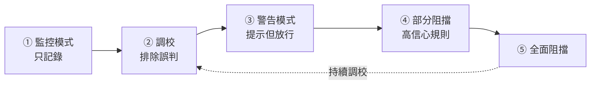
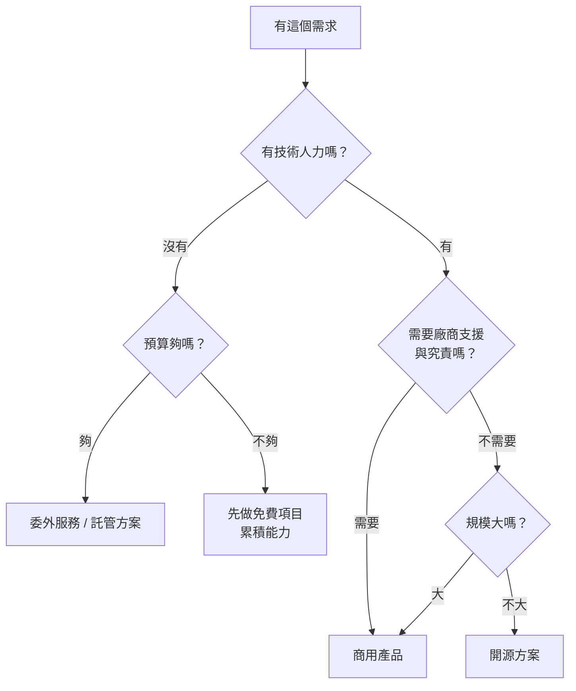

# 資安設備選型與導入實務

> [!abstract] 這篇你會學到
> - 知道**有限的預算應該先花在哪裡**（附完整的優先順序表）
> - 理解**「先做免費的」** —— 哪些防護不用花錢就能做
> - 學會計算 **TCO（總持有成本）** 而不只看採購價
> - 掌握 **POC（概念驗證）** 的正確做法與必問的問題
> - 寫出有效的**採購規範**（避開「量身訂做」與「規格陷阱」）
> - 掌握**導入節奏**：監控 → 警告 → 阻擋
> - 知道**什麼時候該選開源、什麼時候該買商用、什麼時候該委外**

## 前置知識

- [[01-資安全景圖與縱深防禦]] — 各類防護設備的全景
- 本章前 15 篇 — 各種設備的能力與限制

---

## 觀念說明

### 先問「我在防什麼」，不要先問「我要買什麼」

> [!danger] 最常見的採購錯誤
> ```
> 「今年有 300 萬資安預算」
>   → 「那買什麼好？」
>     → 「聽說 XDR 很紅」
>       → 買了 XDR
>         → 沒有人力操作
>           → 三年後續約時發現「其實沒在用」
> ```
>
> **應該反過來**：
> ```
> ① 我們最可能遭遇什麼攻擊？（風險評鑑）
> ② 現在的防護有哪些缺口？
> ③ 哪個缺口的風險最高？
> ④ 補這個缺口有哪些方案？（含【不花錢】的方案）
> ⑤ 我們有能力操作嗎？
> ⑥ 三年的總成本是多少？
> ```

### 先做不用花錢的

> [!tip] 這些防護不用採購預算，但擋掉的攻擊比例最高
> **在花任何一毛錢之前，先確認這些都做了**：
>
> | 措施 | 擋住什麼 | 成本 |
> | --- | --- | --- |
> | **全員 MFA** | **絕大多數的帳號盜用** | 多數雲端服務內建 |
> | **封鎖舊版驗證協定** | 繞過 MFA 的攻擊 | 免費（設定） |
> | **SPF / DKIM / DMARC** | **網域被冒用寄詐騙信** | 免費（DNS 記錄） |
> | **終端之間禁止互連** | **勒索病毒橫向擴散** | 免費（GPO / 交換器設定） |
> | **關閉未使用的網路孔** | 隨意插線進內網 | 免費 |
> | **改掉所有預設密碼** | 最基本的入侵手法 | 免費 |
> | **移除本機管理員權限** | 惡意程式的執行與提權 | 免費（GPO） |
> | **管理員帳號與日常帳號分離** | 特權濫用 | 免費 |
> | **關閉 Office 巨集** | 大量的惡意附件 | 免費（GPO） |
> | **啟用 Windows Defender + ASR 規則** | 常見的攻擊技術 | 免費（已內建） |
> | **開啟 BitLocker** | 設備遺失的資料外洩 | 免費（已內建） |
> | **系統與應用程式自動更新** | **已知弱點的利用** | 免費 |
> | **離職 checklist** | 離職帳號後門 | 免費（流程） |
> | **外部郵件標記橫幅** | 冒充內部的釣魚 | 免費（郵件規則） |
> | **DNS 過濾** | C&C 回連、惡意網站 | 有免費方案 |
> | **備份 + 還原演練** | **勒索病毒** | 演練是免費的 |
>
> **如果上面有任何一項沒做，先做它，再談採購。**

> [!warning] 「我們買了很多資安設備，但還是被入侵了」
> 通常的原因不是設備不夠好，而是：
> - **基本功沒做**（沒有 MFA、預設密碼、沒修補）
> - **設備沒有正確設定**（買來就放著）
> - **沒有人在看告警**
> - **設備之間沒有整合**
>
> **一台正確設定並有人在看的防火牆，
> 勝過三台放著沒人管的次世代防火牆。**

---

## 優先順序：預算怎麼花

### 依「投資報酬率」排序

> [!tip] 以下順序假設你「還沒有」該項防護
> 每往下一層，成本增加而邊際效益遞減。

| 順位 | 項目 | 理由 | 大致成本 |
| --- | --- | --- | --- |
| **0** | **上表的「免費項目」** | **投資報酬率無限大** | 0（只要人力） |
| **1** | **備份（含不可變/離線）+ 演練** | **唯一能保證從勒索復原** | 低～中 |
| **2** | **端點防護 EDR** | 大多數入侵在端點被發現 | 中（按台計價） |
| **3** | **郵件安全閘道** | **最大宗的入侵管道** | 中 |
| **4** | **修補管理與弱點掃描** | 已知弱點是最常見的入口 | 低～中（有開源） |
| **5** | **日誌集中（先不用 SIEM）** | **沒有日誌就沒有調查能力** | 低（rsyslog 免費） |
| **6** | **防火牆（含出向管控）** | 邊界與 C&C 阻斷 | 中～高 |
| **7** | **MFA 的加強**（FIDO2 硬體金鑰） | 防釣魚 | 中（管理員優先） |
| **8** | **網頁閘道 / DNS 過濾** | 瀏覽管道的防護 | 低～中 |
| **9** | **WAF**（若有對外 Web 服務） | Web 攻擊 | 中（CDN 附帶較便宜） |
| **10** | **DDoS 防護 / CDN** | 可用性 | 低～中（CDN 有免費方案） |
| **11** | **SIEM** | 關聯分析 | **高（且需要人力）** |
| **12** | **NAC** | 實體網路管控 | 高（導入複雜） |
| **13** | **DLP** | 資料外洩 | 高（誤判多，需長期調校） |
| **14** | **ZTNA / SASE** | 取代 VPN | 中～高 |
| **15** | **委外 MDR / SOC** | 24 小時監控 | **高（但可能比自建便宜）** |

> [!danger] SIEM、NAC、DLP 是「高門檻」項目
> 這三項的共同特徵：
> - **採購成本高**
> - **導入專案複雜**（NAC 可能要一年）
> - **需要持續的人力操作與調校**
> - **沒有人力操作就完全沒有價值**
>
> **買之前先問**：
> **「誰會每天花時間在這上面？」**
>
> 如果答案是「我們再看看」，**那就先不要買**。

### 依機關規模的建議組合

| 規模 | 建議重點 |
| --- | --- |
| **小型**（< 50 人，無專職資安） | **免費項目全做** + 雲端郵件安全 + EDR + **備份** + DNS 過濾。**優先選「託管型」或雲端服務**，不要自建。 |
| **中型**（50～300 人，1～2 名資安） | 加上：**日誌集中**、弱點掃描、次世代防火牆、WAF/CDN、**考慮 MDR** |
| **大型**（> 300 人，有資安團隊） | 加上：SIEM、NAC、DLP、ZTNA、**自建或混合 SOC** |

> [!tip] 小型機關的最佳策略：買服務，不要買設備
> **理由**：
> - 沒有人力維運設備
> - 沒有人力看告警
> - 設備會過保、會過時
>
> **建議**：
> - 郵件安全 → **用雲端服務**（M365 內建的進階方案往往就夠）
> - 端點 → **雲端管理的 EDR**
> - Web 防護 → **CDN + WAF 的雲端方案**
> - 監控 → **委外 MDR**
>
> **把「維運責任」也一起外包出去。**

---

## TCO：不要只看採購價

> [!danger] 採購價常常只佔三年總成本的一半
> ```
> 三年總持有成本（TCO）=
>     採購價（硬體/軟體授權）
>   + 【年度維護費】（通常是採購價的 15～25%／年）
>   + 【訂閱費】（威脅情資、雲端服務、特徵碼）
>   + 導入服務費
>   + 【教育訓練】
>   + 【人力成本】← 最常被低估
>   + 機房空間、電力、冷卻
>   + 與現有系統的整合成本
>   + 【續約時的漲價】
>   + 汰換／移轉成本
> ```

> [!warning] 三個常見的成本陷阱
> **一、按「使用量」計價的服務會失控**
> - 按 **EPS（每秒事件數）** 計價的 SIEM
> - 按 **GB／日** 計價的日誌服務
> - 按**流量**計價的 CDN／WAF
>
> **問題**：一旦遭受攻擊，**事件量暴增 → 帳單暴增**。
> **必問**：「超量會怎麼收費？有沒有上限？攻擊期間怎麼算？」
>
> **二、第一年便宜，續約大漲**
> 廠商常用低價搶標，**第二、三年維護費大幅提高**，
> 而那時你已經被綁住了（資料在裡面、流程建好了）。
> **必做**：**在採購時就把三年（或五年）的價格全部談定並寫進契約**。
>
> **三、人力成本被完全忽略**
> ```
> SIEM 授權費 200 萬／年
> + 需要 1 名專職人員操作（年薪 + 勞健保 ≈ 100 萬）
> = 實際成本 300 萬／年
> ```
> **如果沒有那個人，200 萬就是浪費。**

> [!tip] 開源不等於免費
> 開源軟體的 TCO 包含：
> - **人力**（安裝、設定、維護、升級、排錯）← 主要成本
> - 訓練
> - 沒有廠商支援（出事要自己扛）
> - 硬體
>
> **開源適合**：
> - 有技術能力與人力的組織
> - 需求明確、規模不大
> - 想先驗證需求再決定要不要買商用
>
> **商用適合**：
> - 人力不足
> - 需要廠商支援與究責對象
> - 需要**符合性報表**（稽核用）
> - 規模大、複雜度高

---

## POC：概念驗證

> [!danger] 沒有 POC 就採購，等於賭博
> **簡報上的功能與實際環境中的表現，常常差很多。**

### POC 應該驗證什麼

| 面向 | 要驗證的問題 |
| --- | --- |
| **功能** | **在「我們的環境」中真的能做到嗎？** |
| **效能** | 我們的流量／規模下，效能夠嗎？ |
| **誤判率** | ★ **在我們的環境會產生多少誤判？** |
| **整合** | 能與現有的 AD、SIEM、防火牆整合嗎？ |
| **易用性** | ★ **我們的人操作得來嗎？** |
| **可視性** | 出問題時，**看得出原因嗎？** |
| **支援** | 中文支援？回應時間？**在地技術能力？** |
| **匯出** | **資料能匯出嗎？**（避免被鎖定） |

> [!tip] POC 的正確做法
> **一、用「你自己的」資料與環境**
> 不要用廠商準備好的展示環境 —— 那當然完美。
>
> **二、設定明確的成功標準（事前寫下來）**
> ```
> ✓ 能偵測出我們準備的 10 個測試案例中的 8 個以上
> ✓ 一週內的誤判少於 20 筆
> ✓ 我們的人員經過 2 小時訓練後能獨立操作基本功能
> ✓ 能與現有的 AD 整合並同步群組
> ✓ 日誌能匯出成標準格式
> ✓ 尖峰時段延遲增加不超過 20ms
> ```
>
> **三、時間要夠長**
> - **至少 2～4 週**
> - 要涵蓋**正常的業務週期**（含月底結帳等尖峰）
> - 一週太短，看不出誤判率
>
> **四、讓「實際會操作的人」參與**
> 不是只有主管看簡報。
>
> **五、同時 POC 兩到三家**
> 才有比較基準，也才有議價空間。
>
> **六、記錄過程**
> POC 報告是採購決策的依據，也是稽核的佐證。

### POC 時必問的十個問題

> [!warning] 這些問題廠商簡報不會主動說
> 1. **「這個功能在我們的環境下會產生多少誤判？」**
> 2. **「誤判要怎麼調校？需要多久？誰來做？」**
> 3. **「設備故障時會怎樣？」**（Fail-open 還是 Fail-close？有 HA 嗎？）
> 4. **「效能數據是在什麼條件下測的？」**
>    （開啟所有功能後的實際效能通常掉很多，尤其是 SSL 檢查）
> 5. **「三年總成本是多少？續約會漲價嗎？」**（要書面）
> 6. **「我們的資料能匯出嗎？什麼格式？」**（避免被鎖定）
> 7. **「原廠支援的層級是什麼？多久回應？在地有技術人員嗎？」**
> 8. **「產品的生命週期？什麼時候會 EOL？」**
> 9. **「有哪些客戶案例？可以參訪嗎？」**（同規模、同產業最有參考價值）
> 10. **「這個產品解決不了哪些問題？」** ← **最重要的問題**
>
> **第 10 題能看出廠商是不是誠實。**
> 說「什麼都能解決」的，通常最不可信。

---

## 採購規範怎麼寫

> [!danger] 兩個極端都要避免
> **一、規格太寬鬆** → 買到不合用的爛東西
> **二、規格太специфic（照抄某家型錄）** → **綁標，可能違反採購法**

> [!tip] 用「功能與效能要求」而非「特定型號」
> ❌ **不好的寫法**：
> ```
> 需具備 XX 廠牌 YY 型號之功能
> 需支援 ZZ 專有協定
> 吞吐量需達 10.5 Gbps（剛好只有某一家是這個數字）
> ```
>
> ✅ **好的寫法**：
> ```
> 【效能】
>   - 於「同時啟用防火牆、IPS、應用程式辨識、SSL 檢查」的條件下，
>     實際吞吐量不低於 5 Gbps
>     ★ 註明測試條件，避免用「理論最大值」灌水
>   - 併發連線數不低於 200 萬
>   - 每秒新建連線數不低於 10 萬
>
> 【功能】
>   - 應支援使用者身分辨識並與 Active Directory 整合
>   - 應支援應用程式層級的辨識與管控
>   - 應具備入侵防禦功能，特徵碼更新頻率不低於每日一次
>   - 應支援 Syslog 輸出至第三方 SIEM（CEF 或 LEEF 格式）
>
> 【可用性】
>   - 應支援 Active-Passive 高可用性架構
>   - 切換時間不超過 3 秒
>   - 電源供應器應為雙電源熱抽換
>
> 【維運】
>   - 應提供繁體中文管理介面或中文操作手冊
>   - 應提供原廠三年保固與軟體更新授權
>   - 故障時應於 4 小時內回應，次一工作日到場
>   - 應提供不少於 16 小時之教育訓練
>
> 【資料可攜】
>   - 設定檔與日誌應可匯出為標準格式
>   - 契約終止時應協助資料移轉
>
> 【資安要求】
>   - 產品不得含有未揭露之遠端存取功能
>   - 應提供產品的軟體物料清單（SBOM）
>   - 應說明產品的資料處理位置與是否回傳原廠
> ```

> [!warning] 政府採購的額外注意事項
> - **符合《政府採購法》**的招標程序
> - 注意**大陸地區廠商與產品的限制**（資安產品尤其嚴格）
> - **資通安全產品**可能需符合特定的檢測或認證要求
> - 涉及個資的服務要簽**個資保護條款**
> - **委外服務要納入資安條款**（見 [[11-委外與供應鏈資安]]）
> - 建議參考**共同供應契約**的既有品項（程序較簡便）
> - 保留**驗收測試**的權利與標準

> [!tip] 一定要寫進契約的五件事
> 1. **三年（或五年）的完整價格**（含維護費，避免續約被漲）
> 2. **驗收標準**（POC 的成功標準可以直接用）
> 3. **資料可攜條款**（契約終止時廠商應協助資料移轉）
> 4. **教育訓練時數與對象**
> 5. **重大資安事件時的支援義務**

---

## 導入節奏

> [!danger] 所有的偵測／阻擋型設備，都要「先觀察再阻擋」
> **這是本篇最重要的實務原則。**
>
> **適用於**：WAF、IPS、DLP、NAC、條件式存取、郵件閘道、EDR 的封鎖模式…



| 階段 | 時間 | 做什麼 |
| --- | --- | --- |
| **① 監控** | **1～3 個月** | **只記錄不阻擋**，收集基線 |
| **② 調校** | 持續 | 分析誤判，排除正常行為 |
| **③ 警告** | 1～2 個月 | 提示使用者但放行（**教育效果最好**） |
| **④ 部分阻擋** | 1 個月 | 只對「誤判率極低」的規則開啟阻擋 |
| **⑤ 全面阻擋** | — | 逐步擴大 |

> [!warning] 每個階段都要有「回退方案」
> - **一鍵切回監控模式**的方法（寫成 SOP）
> - **誰有權決定回退**
> - **回退後怎麼通知相關人員**
>
> **在上線前就要演練過回退。**

> [!tip] 導入專案的五個必備條件
> 1. **明確的負責人**（不是「大家一起負責」）
> 2. **管理階層的支持**（遇到抗拒時需要）
> 3. **與業務單位的溝通計畫**（事前告知，不要突襲）
> 4. **明確的成功指標**（怎麼知道做成了？）
> 5. **後續的維運人力**（誰負責日常操作與調校？）
>
> **第 5 點缺了，專案結案就等於設備死亡。**

---

## 完整實戰範例

### 資安缺口盤點表

> [!tip] 用這張表決定預算優先順序

| 防護項目 | 現況 | 缺口風險 | 免費方案 | 採購方案 | 優先序 |
| --- | --- | --- | --- | --- | --- |
| MFA | ☐無 ☐部分 ☐全員 | | 雲端服務內建 | FIDO2 金鑰 | |
| 封鎖舊版驗證 | ☐無 ☐有 | | 設定即可 | — | |
| SPF/DKIM/DMARC | ☐無 ☐部分 ☐`p=reject` | | DNS 記錄 | — | |
| **備份 + 不可變** | ☐無 ☐有 ☐**演練過** | | — | 物件儲存 | |
| 端點防護 | ☐內建 ☐AV ☐**EDR** | | Defender + ASR | EDR | |
| 郵件安全 | ☐無 ☐基本 ☐進階 | | 外部郵件標記 | SEG | |
| 修補管理 | ☐手動 ☐部分自動 ☐全自動 | | 自動更新 | 修補管理系統 | |
| 弱點掃描 | ☐無 ☐不定期 ☐**定期** | | OpenVAS/Nuclei | 商用掃描器 | |
| 日誌集中 | ☐無 ☐部分 ☐全部 | | rsyslog | SIEM | |
| 防火牆 | ☐傳統 ☐NGFW ☐**含出向管控** | | 主機防火牆 | NGFW | |
| 網段隔離 | ☐無 ☐VLAN ☐**微分段** | | GPO/交換器設定 | 微分段方案 | |
| WAF | ☐無 ☐有 | | ModSecurity | 商用 WAF/CDN | |
| DDoS | ☐無 ☐有 | | 速率限制 | CDN/清洗 | |
| DNS 過濾 | ☐無 ☐有 | | Pi-hole | 商用服務 | |
| 資料加密 | ☐無 ☐部分 ☐全部 | | BitLocker/LUKS | — | |
| 24 小時監控 | ☐無 ☐上班時間 ☐24h | | — | MDR | |

**填法**：
1. 勾選現況
2. 「缺口風險」欄寫**高／中／低**（依你的實際威脅情境）
3. **先看「有免費方案且現況是無」的列** → 那是最優先
4. 剩下的依風險排優先序

### 三年預算規劃範例（中型機關）

> [!example] 假設：150 人、有 1 名兼職資安人員、年預算 200 萬

**【第一年】把基本功做完 —— 預算 120 萬**
```
免費項目（人力成本）
  ☑ 全員 MFA、封鎖舊版驗證
  ☑ SPF/DKIM/DMARC 走到 p=reject
  ☑ 終端之間禁止互連（GPO）
  ☑ 移除本機管理員權限
  ☑ 關閉 Office 巨集、啟用 ASR 規則
  ☑ 全面 BitLocker
  ☑ 離職 checklist 制度化

採購
  · 備份方案（不可變物件儲存 + 軟體）      40 萬
  · EDR（150 台 × 3 年）                    50 萬
  · DNS 過濾服務                            10 萬
  · 弱點掃描（先用開源，編列訓練）           5 萬
  · 教育訓練與演練                          15 萬
```

**【第二年】強化偵測與郵件 —— 預算 180 萬**
```
  · 郵件安全閘道（雲端）                    50 萬
  · 日誌集中（Wazuh 開源 + 硬體）            30 萬
  · 次世代防火牆（含出向管控）              80 萬
  · FIDO2 金鑰（管理員 20 把）               5 萬
  · 滲透測試（委外）                        15 萬
```

**【第三年】監控與進階 —— 預算 200 萬**
```
  · MDR 委外監控（24 小時）                120 萬
  · WAF / CDN                               30 萬
  · ZTNA（取代 VPN）                        30 萬
  · 紅隊演練                                20 萬
```

> [!tip] 這個規劃的思路
> - **第一年完全不碰 SIEM、NAC、DLP** —— 因為沒有人力
> - **備份排第一** —— 唯一能保證從勒索復原
> - **免費項目全部做完才開始採購**
> - **第三年才做 24 小時監控** —— 且選擇委外而非自建
> - **每年都編列教育訓練與演練預算** ← 最常被砍但最不該砍

### 開源 vs 商用 vs 委外的決策



| 情境 | 建議 |
| --- | --- |
| 沒人力、有預算 | **委外／託管服務**（把維運責任也外包） |
| 沒人力、沒預算 | **先做免費項目**，累積能力再談 |
| 有人力、規模小、需求明確 | **開源**（Wazuh、OpenVAS、pfSense、Pi-hole） |
| 需要**符合性報表**給稽核看 | **商用**（報表功能是主要價值） |
| 出事需要**究責對象** | **商用**（有廠商可以找） |
| 想先驗證需求 | **開源先做**，確認需求後再評估商用 |

> [!tip] 開源先做，是很聰明的策略
> **例如**：
> 1. 先用 **Wazuh** 建立日誌集中與基本偵測（免費）
> 2. 跑一年，**你會清楚知道**：
>    - 每天的事件量有多少（→ SIEM 該買多大）
>    - 需要哪些偵測規則
>    - 需要多少人力
>    - **到底需不需要商用 SIEM**
> 3. 有了這些數據，**採購商用 SIEM 時談判力大幅提升**
>    （你知道自己要什麼，不會被廠商牽著走）

---

## 常見錯誤與排錯

| 現象／錯誤 | 原因 | 解法 |
| --- | --- | --- |
| **買了設備但沒在用** | 沒有維運人力 | **採購前先確認「誰會操作」**；沒有人就不要買 |
| 買了很多設備還是被入侵 | **基本功沒做**（無 MFA、預設密碼、沒修補） | **先把免費項目做完**再採購 |
| **預算花在錯的地方** | 沒有做風險評鑑，跟著流行走 | 用**缺口盤點表**排優先序 |
| 續約時價格暴漲 | 只談第一年價格 | **採購時就把三～五年價格談定並寫進契約** |
| 遭受攻擊後帳單暴增 | 按使用量計價的服務 | POC 時就問清楚**超量計費與上限** |
| **設備效能不如預期** | 廠商給的是「理論最大值」 | 規範中明訂**「開啟所有功能下」的實測值** |
| 誤判太多被關掉 | **一開始就設阻擋模式** | **監控 → 調校 → 警告 → 部分阻擋 → 全面阻擋** |
| 導入專案拖了兩年沒完成 | 範圍太大、沒有明確負責人 | 縮小範圍分階段；**指定單一負責人** |
| 業務單位強烈抗拒 | 事前沒溝通，突然上線 | **事前溝通計畫**；先在測試群組試行；取得管理階層支持 |
| 專案結案後設備就沒人管 | **沒有規劃維運人力** | 導入專案必須包含**維運交接與人力安排** |
| **資料被鎖在廠商系統裡** | 沒有資料可攜條款 | 契約明訂**匯出格式與移轉協助義務** |
| 規格寫得太細被質疑綁標 | 照抄某家型錄 | 用**功能與效能要求**，不指定型號與專有協定 |
| POC 很完美，上線後問題一堆 | POC 用廠商的展示環境 | **用自己的資料與環境**，時間至少 2～4 週 |
| 買了 SIEM 但沒人看告警 | 忽略人力成本 | TCO 要含人力；**沒人力就選 MDR** |
| 教育訓練預算被砍 | 被視為「不必要」 | **訓練是讓設備發揮價值的前提**，應納入採購契約 |

---

## 安全性注意事項

> [!danger] 資安設備本身也是攻擊目標
> **防火牆、VPN 閘道、WAF 這類設備的弱點，
> 一旦公開就會被大規模掃描與利用** ——
> 因為它們**本來就對外開放**，而且**權限極高**。
>
> **必做**：
> - **訂閱廠商的資安公告** ← 很多機關沒做
> - **資安設備的修補優先序最高**（對照 CISA KEV）
> - **管理介面絕對不要對網際網路開放**
> - 管理介面**強制 MFA**
> - **設備的設定檔要備份**（且加密保存）
> - 追蹤設備的 **EOL 日期**，過保的設備要有汰換計畫
>
> **歷史上多起大規模入侵事件，
> 都是從「未修補的邊界資安設備」開始的。**

> [!warning] 供應鏈風險
> 採購資安設備時要考慮：
> - **產品的原產地與供應鏈**（政府採購有相關限制）
> - **設備會不會把資料回傳原廠？**（雲端管理的設備一定會）
> - **資料存放在哪個國家？**（法遵與司法管轄）
> - **廠商如果倒閉或被併購怎麼辦？**
> - **原廠是否有未揭露的遠端存取通道？**
> - **軟體物料清單（SBOM）** —— 產品用了哪些第三方元件？
>
> **契約中應要求**：
> - 揭露資料處理位置與回傳內容
> - 提供 SBOM
> - 不得含有未揭露的遠端存取功能
> - 資安事件通報義務
>
> 見 [[11-委外與供應鏈資安]]。

> [!tip] 別忘了「人」的預算
> **資安預算的分配常常是**：
> ```
> 設備 90%  ： 人力與訓練 10%
> ```
>
> **但實際的效果是**：
> ```
> 設備      ： 需要人來設定、操作、調校、判讀
> 訓練      ： 決定設備能發揮多少價值
> 演練      ： 決定事件發生時能不能處理
> 意識教育  ： 擋掉技術防護擋不住的社交工程
> ```
>
> **建議至少保留 15～20% 的預算給人力、訓練與演練。**
>
> **教育訓練與演練是最常被砍、但最不該砍的預算。**

> [!danger] 不要因為「有設備」就放鬆基本功
> **常見的心理陷阱**：
> ```
> 「我們有 XDR 了，所以不用那麼緊張」
> 「有 WAF 了，程式的弱點可以慢慢修」
> 「有備份了，所以不用做修補」
> ```
>
> **所有的資安設備都只是「降低風險」，沒有一個能「消除風險」。**
>
> **基本功（修補、MFA、最小權限、備份、教育）永遠是第一位的。**

---

## 速查表

### 決策順序

```
① 我們最可能遭遇什麼攻擊？（風險評鑑）
② 現在的防護有哪些缺口？
③ 哪個缺口的風險最高？
④ 有哪些方案？【含不花錢的】
⑤ 我們有能力操作嗎？   ← 最常被跳過
⑥ 三年總成本是多少？
```

### 先做免費的（擋掉最多攻擊）

```
□ 全員 MFA              □ 封鎖舊版驗證
□ SPF/DKIM/DMARC        □ 終端之間禁止互連
□ 關閉未用網路孔        □ 改掉預設密碼
□ 移除本機管理員        □ 管理員/日常帳號分離
□ 關閉 Office 巨集      □ Defender + ASR 規則
□ 全面 BitLocker        □ 系統自動更新
□ 離職 checklist        □ 外部郵件標記
□ DNS 過濾              □ 備份 + 還原演練
```

### 採購優先序

```
0. 免費項目           ← 投資報酬率無限
1. 備份（不可變）+ 演練
2. EDR
3. 郵件安全閘道
4. 修補管理與弱點掃描
5. 日誌集中（先不用 SIEM）
6. 防火牆（含出向管控）
...
11. SIEM  12. NAC  13. DLP   ← 【高門檻：需要人力】
15. MDR 委外
```

### TCO 組成

```
採購價 + 年度維護（15～25%/年）+ 訂閱費 + 導入服務
+ 教育訓練 + 【人力成本】+ 機房電力 + 整合成本
+ 【續約漲價】+ 汰換移轉
```

### 三個成本陷阱

```
① 按使用量計價 → 攻擊時帳單暴增（問清楚上限）
② 第一年便宜續約大漲 → 【採購時就談定三～五年價格】
③ 人力成本被忽略 → 沒有人操作，授權費就是浪費
```

### POC 必問十題

```
1. 在我們環境會有多少誤判？
2. 誤判怎麼調校？誰來做？
3. 設備故障時會怎樣？（Fail-open/close？HA？）
4. 效能數據的測試條件？（開啟所有功能後呢？）
5. 三年總成本？續約會漲嗎？（要書面）
6. 資料能匯出嗎？什麼格式？
7. 支援層級？在地技術人員？
8. 產品 EOL 時間？
9. 同規模客戶案例可以參訪嗎？
10.【這個產品解決不了哪些問題？】← 看誠實度
```

### 導入節奏（所有偵測/阻擋型設備）

```
① 監控（1～3 月）→ ② 調校 → ③ 警告（1～2 月）
→ ④ 部分阻擋 → ⑤ 全面阻擋
每階段都要有【一鍵回退】的 SOP
```

### 導入專案五個必備

```
1. 明確的負責人（單一）
2. 管理階層支持
3. 與業務單位的溝通計畫
4. 明確的成功指標
5. 【後續維運人力】← 缺了就等於設備死亡
```

### 開源 / 商用 / 委外

| 情境 | 建議 |
| --- | --- |
| 沒人力、有預算 | **委外／託管** |
| 沒人力、沒預算 | **先做免費項目** |
| 有人力、規模小 | **開源** |
| 需要符合性報表 | 商用 |
| 需要究責對象 | 商用 |
| 想先驗證需求 | **開源先做一年** |

### 契約必寫五件事

```
1. 三～五年完整價格（含維護費）
2. 驗收標準（用 POC 的成功標準）
3. 資料可攜條款
4. 教育訓練時數與對象
5. 重大資安事件的支援義務
```

### 預算分配建議

```
設備／軟體  80～85%
人力/訓練/演練  15～20%   ← 最常被砍，最不該砍
```

---

## 練習題

> [!question]- 練習 1：填完缺口盤點表
> 用本篇的盤點表，誠實地填完你機關的現況：
> 1. **有幾項是「有免費方案，但現況是無」？**
>    → 這些就是你**下週就該開始做**的事
> 2. 剩下的項目中，**哪三項的缺口風險最高？**
> 3. 對這三項，各列出：免費方案／開源方案／商用方案
> 4. **每一項都問：「誰會操作它？」**
>
> 第 1 題的答案通常會讓人驚訝 ——
> **多數機關的最大缺口不需要花錢就能補。**

> [!question]- 練習 2：算一次真實的 TCO
> 挑一個你正在考慮或已經買了的資安產品，算出三年 TCO：
> ```
> 採購價：                    ___ 萬
> 年度維護費 × 3：            ___ 萬
> 訂閱／授權費 × 3：          ___ 萬
> 導入服務費：                ___ 萬
> 教育訓練：                  ___ 萬
> 【人力】：需要幾成人力 × 年薪 × 3 = ___ 萬
> 機房電力空間：              ___ 萬
> 整合成本：                  ___ 萬
> ────────────────────
> 三年 TCO：                  ___ 萬
> ```
> **比採購價高多少倍？**
>
> 然後問：**用這筆錢，能不能買到「更划算的風險降低」？**

> [!question]- 練習 3：寫一份 POC 計畫
> 為一個你想採購的產品，寫出 POC 計畫：
> 1. **要驗證哪些具體問題？**（至少 5 個）
> 2. **成功標準是什麼？**（要可量測，不能是「感覺不錯」）
> 3. 用什麼資料與環境？（**必須是你自己的**）
> 4. 時間多長？涵蓋哪些業務週期？
> 5. **誰會參與？**（實際會操作的人有沒有在裡面？）
> 6. 要問廠商哪十個問題？
> 7. **怎麼比較兩到三家的結果？**（做一張評分表）
>
> 特別注意：**你的「成功標準」寫得夠具體嗎？**
> 「效能要好」不是標準，「尖峰時段延遲增加不超過 20ms」才是。

---

## 小測驗

Q1. 採購資安設備前應該先問的六個問題是什麼？最常被跳過的是哪一個？

Q2. **列出至少八項「不用花錢就能做」的資安措施。** 為什麼要先做這些？

Q3. 「我們買了很多資安設備但還是被入侵」通常的四個原因是什麼？

Q4. 採購優先序中，**為什麼「備份」排在第一**？為什麼 SIEM、NAC、DLP 排得那麼後面？

Q5. **TCO 包含哪些項目？哪一項最常被低估**？

Q6. 三個常見的成本陷阱是什麼？各該怎麼防範？

Q7. **POC 的正確做法有哪六點**？為什麼「用廠商的展示環境」是錯的？

Q8. **POC 必問的第 10 個問題是什麼？為什麼它最重要**？

Q9. 採購規範怎麼寫才能避開「太寬鬆」與「綁標」兩個極端？舉例說明。

Q10. **為什麼所有偵測／阻擋型設備都要「先觀察再阻擋」**？導入專案的第 5 個必備條件是什麼，缺了會怎樣？

> [!question]- 測驗答案
> **Q1.** ①我們最可能遭遇什麼攻擊（風險評鑑）；②現在的防護有哪些缺口；
> ③哪個缺口的風險最高；④有哪些方案（**含不花錢的方案**）；
> ⑤**我們有能力操作嗎**；⑥三年總成本是多少。
> **最常被跳過的是第 ⑤ 個** —— 沒有人力操作的設備，
> 買了也只是三年後續約時才發現「其實沒在用」。
>
> **Q2.** 全員 MFA、封鎖舊版驗證協定、SPF/DKIM/DMARC、
> 終端之間禁止互連、關閉未使用的網路孔、改掉所有預設密碼、
> 移除本機管理員權限、管理員帳號與日常帳號分離、
> 關閉 Office 巨集、啟用 Defender + ASR 規則、全面 BitLocker、
> 系統與應用自動更新、離職 checklist、外部郵件標記橫幅、
> DNS 過濾、備份 + 還原演練。
> **要先做這些，是因為它們的投資報酬率無限大** ——
> 成本只有人力，但擋掉的攻擊比例最高
> （例如 MFA 能擋掉超過 99% 的帳號盜用）。
> **如果這些有任何一項沒做，就不該談採購。**
>
> **Q3.** ①**基本功沒做**（沒有 MFA、預設密碼、沒修補）；
> ②**設備沒有正確設定**（買來就放著）；
> ③**沒有人在看告警**；④**設備之間沒有整合**。
> 一句話：**一台正確設定並有人在看的防火牆，
> 勝過三台放著沒人管的次世代防火牆。**
>
> **Q4.** **備份排第一**是因為它是**唯一能保證從勒索病毒復原的方法** ——
> 其他所有防護都可能失敗，只有可用的備份能讓你在勒索談判桌上說「不」。
> **SIEM、NAC、DLP 排得後面**，是因為它們的共同特徵是：
> 採購成本高、**導入專案複雜**（NAC 可能要一年）、
> **需要持續的人力操作與調校**，
> 而且**沒有人力操作就完全沒有價值**。
> 買之前要先問「誰會每天花時間在這上面？」，
> 答案若是「再看看」，就先不要買。
>
> **Q5.** 採購價 + **年度維護費**（通常是採購價的 15～25%／年）
> + 訂閱費 + 導入服務費 + **教育訓練** + **人力成本**
> + 機房空間電力冷卻 + 與現有系統的整合成本
> + **續約時的漲價** + 汰換／移轉成本。
> **最常被低估的是「人力成本」** ——
> 例如 SIEM 授權 200 萬／年，但還需要一名專職人員（年薪含勞健保約 100 萬），
> 實際成本是 300 萬／年；而**如果沒有那個人，那 200 萬就是純浪費**。
>
> **Q6.** ①**按使用量計價的服務會失控**
> （按 EPS 或 GB／日計價的 SIEM、按流量計價的 CDN／WAF）——
> 遭受攻擊時事件量暴增、帳單暴增；
> **防範**：POC 時就問清楚「超量怎麼收費、有沒有上限、攻擊期間怎麼算」。
> ②**第一年便宜、續約大漲** —— 廠商低價搶標，
> 第二三年維護費大幅提高，而你已經被綁住；
> **防範**：**採購時就把三～五年的價格全部談定並寫進契約**。
> ③**人力成本被完全忽略**；**防範**：TCO 計算一定要含人力，
> 沒有人力就選委外 MDR 而非自建。
>
> **Q7.** ①**用「你自己的」資料與環境**；
> ②**事前寫下明確、可量測的成功標準**；
> ③**時間至少 2～4 週**且涵蓋正常業務週期（含月底等尖峰）；
> ④**讓實際會操作的人參與**（不只主管看簡報）；
> ⑤**同時 POC 兩到三家**（才有比較基準與議價空間）；
> ⑥**記錄過程**（作為採購決策依據與稽核佐證）。
> **用廠商的展示環境是錯的**，因為那是精心準備過的 ——
> 當然完美，完全看不出在你的真實環境中的**誤判率與效能**，
> 而誤判率正是決定設備能不能長期使用的關鍵。
>
> **Q8.** 第 10 題是 **「這個產品解決不了哪些問題？」**
> 它最重要，因為**能看出廠商是不是誠實** ——
> 說「什麼都能解決」的廠商通常最不可信。
> 一個誠實的廠商會明確說出產品的能力邊界，
> 這讓你能提早規劃其他層面的補強，
> 避免上線後才發現「原來這個它擋不住」。
>
> **Q9.** 要避開兩個極端：**規格太寬鬆**會買到不合用的東西；
> **照抄某家型錄**（指定廠牌型號、專有協定、剛好只有一家符合的數字）
> 則可能構成綁標、違反採購法。
> **正確做法是寫「功能與效能要求」**，並且**註明測試條件**。
> 例如不要寫「吞吐量 10.5 Gbps」（某家的型錄數字），
> 而要寫「**於同時啟用防火牆、IPS、應用程式辨識、SSL 檢查的條件下，
> 實際吞吐量不低於 5 Gbps**」——
> 註明條件才能避免廠商用「理論最大值」灌水。
> 另外要納入可用性（HA 切換時間）、維運（中文介面、到場時效、訓練時數）、
> **資料可攜**（可匯出標準格式、契約終止協助移轉）
> 與資安要求（不得含未揭露遠端存取、提供 SBOM）。
>
> **Q10.** 因為所有偵測／阻擋型設備（WAF、IPS、DLP、NAC、
> 條件式存取、郵件閘道）**在真實環境中一開始一定會有大量誤判**。
> 直接開阻擋 → **正常業務被擋 → 使用者抱怨爆炸 →
> 管理階層下令關掉 → 專案失敗**。
> 正確節奏：**①監控（1～3 月，只記錄）→ ②調校（排除誤判）→
> ③警告（1～2 月，提示但放行，教育效果最好）→
> ④部分阻擋（只對誤判率極低的規則）→ ⑤全面阻擋**，
> 且**每個階段都要有一鍵回退的 SOP 並在上線前演練過**。
> 導入專案的**第 5 個必備條件是「後續的維運人力」**
> （誰負責日常操作與調校）——
> **缺了它，專案結案就等於設備死亡**：
> 沒有人調校規則、沒有人看告警，設備會逐漸退化成一個昂貴的擺設。

---

## 延伸閱讀

- [[01-資安全景圖與縱深防禦]] — 各類防護的定位與能力邊界
- [[14-備份與抗勒索防護]] — 為什麼備份是第一順位
- [[11-委外與供應鏈資安]] — 採購契約的資安條款
- [[09-資安稽核與符合性檢核]] — 稽核會怎麼看你的資安投資
- [[10-資安政策文件與制度]] — 把採購決策制度化
- [[03-弱點與修補管理流程]] — 資安設備本身的修補
- [[15-資安證照與學習路徑]] — 人力的養成
