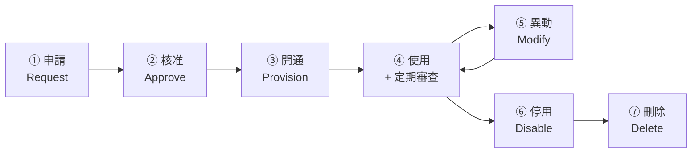

# 密碼與帳號管理實務

> [!abstract] 這篇你會學到
> - 知道**為什麼「每 90 天換密碼」已經被官方建議推翻**
> - 訂出符合 **NIST SP 800-63B** 的現代密碼政策
> - 管理帳號從**開通 → 異動 → 停用**的完整生命週期
> - 處理**共用帳號**與**服務帳號**這兩個最難的問題
> - 導入**密碼管理器**並讓大家真的會用
> - 用實際指令**檢查與設定** Linux 與 AD 的密碼政策

## 前置知識

- [[01-資安基本原則與實踐]] — 最小權限與可歸責性
- [[09-使用者與群組管理]] — Linux 帳號的基礎
- [[07-身分存取管理IAM與MFA]] — IAM 的整體架構

---

## 觀念說明

### 舊的密碼政策是錯的

> [!danger] NIST SP 800-63B 推翻了大部分的傳統做法
> 美國 NIST 在 2017 年發布的數位身分指引
> **明確建議不要再做這些事**，
> 而這些正是台灣多數機關現在還在做的：

| 傳統做法 | ❌ 為什麼錯 | ✅ 現代建議 |
| --- | --- | --- |
| **每 90 天強制換密碼** | 使用者只會改成 `Pass1!` → `Pass2!` → `Pass3!`，**變得更可預測**；也促使人把密碼寫下來 | **不要定期強制更換**，除非有外洩跡象 |
| **要求大小寫+數字+符號** | 產生 `P@ssw0rd!` 這種**高度可預測**的密碼（破解字典早就收錄了） | **重視長度**（至少 12～15 字元） |
| **密碼提示問題** | 答案常常查得到（母親姓氏、畢業國小、寵物名） | **不要使用** |
| **禁止貼上密碼** | **直接阻礙密碼管理器的使用** | **允許貼上**，鼓勵用密碼管理器 |
| **只能用特定字元** | 限制了熵值 | 允許所有可列印字元，**包含空格與 Unicode** |
| **密碼長度上限 16** | 阻礙長 passphrase | **上限至少 64 字元** |

> [!tip] 為什麼「長度」比「複雜度」重要
> 密碼強度取決於**可能組合的數量**：
>
> | 密碼 | 長度 | 大致的可能組合 |
> | --- | --- | --- |
> | `P@ssw0rd` | 8 | 看似很多，**但在字典裡** → 秒破 |
> | `Tr0ub4dor&3` | 11 | 常見替換規則，破解字典涵蓋 |
> | `correct horse battery staple` | 28 | **天文數字** |
> | `我家的貓叫小花它很胖` | 10 字 | 中文字集極大 → 非常強 |
>
> **`Password123!` 符合「複雜度要求」但一秒就被破，
> 而 `我今天吃了三個包子` 不符合任何傳統要求但幾乎破不了。**

### 該做的密碼政策

> [!tip] 現代密碼政策五要點
> **① 長度優先**
> - 一般使用者：**至少 12 字元**（建議 15）
> - 管理員帳號：**至少 15 字元**
> - 服務帳號：**至少 25 字元隨機**（防 Kerberoasting）
>
> **② 比對已外洩密碼清單** ← **最有效的一項**
> 使用者設定的密碼如果**出現在已知的外洩資料庫**中，就拒絕。
> - Have I Been Pwned 的 Pwned Passwords API（免費）
> - AD 可用 Azure AD Password Protection 或第三方工具
>
> **③ 禁止機關相關的常見詞**
> 機關簡稱、`taiwan`、`gov`、單位名稱、系統名稱、年份。
>
> **④ 不要定期強制更換**
> **例外：確認有外洩跡象時，立刻強制更換。**
>
> **⑤ 配合 MFA**
> 有 MFA 的情況下，不需要那麼折磨使用者。
> 見 [[07-身分存取管理IAM與MFA]]。

> [!warning] 但要注意組織的法遵要求
> **TWGCB、ISO 27001 稽核或上級要求**
> 可能仍規定「密碼須定期更換」。
>
> **這時的做法**：
> - **依規定執行**（法遵優先）
> - 但**把更換週期拉長**（例如 180 天而非 90 天）
> - **同時導入 MFA 與外洩密碼比對**，降低換密碼的必要性
> - 在**風險評鑑文件中說明**你的考量
>
> 見 [[00-TWGCB-索引]] 與 [[09-資安稽核與符合性檢核]]。

---

## 帳號生命週期



### 開通（Joiner）

| 項目 | 要求 |
| --- | --- |
| **申請** | 書面或線上表單，載明**姓名、單位、職務、需要的權限、事由** |
| **核准** | **由業務主管核准**（不是資訊人員自己決定給什麼權限） |
| **依角色給權限** | 用**角色範本**，不要「複製某某人的帳號」 |
| **初始密碼** | 隨機產生、**單獨傳遞**（不要跟帳號同一封信）、**首次登入強制更換** |
| **記錄** | 開通日期、核准人、給了哪些權限 |

> [!danger] 「複製某某人的帳號」是權限蔓延的頭號原因
> ```
> 新人小華來了 → 「他跟小明做一樣的事，複製小明的帳號權限吧」
>   → 小明累積了五年的權限也一起複製過來
>     → 小華現在有一堆他用不到的權限
> ```
>
> **正確做法：定義「角色範本」**
> ```
> 角色：一般行政人員
>   - 公文系統：一般使用者
>   - 檔案伺服器：所屬單位目錄（讀寫）、公用目錄（唯讀）
>   - 印表機：所屬樓層
>   - 郵件：標準信箱
>
> 角色：資訊人員
>   - 上述全部 +
>   - 管理網段存取（用另一個管理員帳號）
>   - 監控系統：唯讀
>   ...
> ```
> 這也讓**定期權限盤點**變得容易（比對「實際權限 vs 角色範本」）。

### 異動（Mover）

> [!danger] 最常見的錯誤：只加不減
> ```
> 小明從人事調到採購
>   → 給他採購系統的權限 ✓
>   → 【忘了收回人事系統的權限】 ✗
> ```
>
> **正確流程**：
> 1. **先收回舊單位的所有權限**
> 2. **再依新角色給予權限**
> 3. 兩邊主管都要知情
> 4. **記錄異動**
>
> **實務建議**：把「調職」當成「離職 + 到職」來處理。

### 停用（Leaver）

> [!danger] 離職帳號是最危險的後門
> **必須在離職生效當天完成**（理想是在通知離職的當下）：

```
【帳號】
□ AD / IdP 帳號【停用】（不是刪除）
□ 【強制登出所有 Session、撤銷所有 Token】   ← 最常漏
□ 重設密碼（防止還記得密碼的存取）
□ VPN 帳號停用
□ 【所有雲端服務】帳號停用（M365、Google、GitHub、雲平台…）
□ 本機帳號停用（如果有）

【憑證與金鑰】
□ 【SSH 公鑰從所有伺服器移除】             ← 最常漏
□ API 金鑰、Personal Access Token 撤銷
□ 用戶端憑證撤銷（加入 CRL）
□ 【他知道的共用密碼全部更換】             ← 最常漏

【實體】
□ 門禁卡繳回並【在系統中停用】
□ 鑰匙繳回
□ 公務設備繳回（筆電、手機、隨身碟、金鑰）

【資料】
□ 信箱轉寄給主管（不是直接刪除）
□ 個人磁碟區的公務資料移交
□ 確認沒有把公務資料帶走（DLP 日誌檢視）

【文件】
□ 交接文件完成並簽核
□ 帳號停用記錄留存
```

> [!warning] 為什麼是「停用」而不是「刪除」
> 1. **資料可能還需要**（信箱、檔案的擁有權）
> 2. **稽核要追溯**（誰在什麼時候做了什麼，需要帳號存在才對得起來）
> 3. **SID／UID 重用可能造成權限混亂**
>    （新帳號拿到舊 SID，就繼承了舊帳號的權限）
>
> **建議保留 30～90 天後才真正刪除**，
> 並在**政策中明訂保留期限**。

> [!tip] 「撤銷 Session」為什麼重要
> 停用帳號後，**已經簽發的 Token 或 Session 仍然有效到過期為止**。
>
> ```
> 09:00 離職生效，停用 AD 帳號
> 09:00 但他的 Microsoft 365 Session 還有 12 小時才過期
>       → 他還能繼續存取郵件與檔案 12 小時
> ```
>
> **必做**：
> ```powershell
> # Microsoft 365 / Entra ID
> Revoke-MgUserSignInSession -UserId "user@example.gov.tw"
>
> # 或在 Entra ID 系統管理中心：
> #   使用者 → 選取使用者 → 「撤銷工作階段」
> ```
> ```bash
> # Google Workspace
> # 管理控制台 → 使用者 → 安全性 → 「登出所有工作階段」
>
> # Linux：終止該使用者的所有連線
> $ sudo pkill -KILL -u username
> $ sudo usermod -L username          # 鎖定
> $ sudo usermod -s /usr/sbin/nologin username
> ```

---

## 兩個最難的問題

### 共用帳號

> [!danger] 共用帳號破壞「可歸責性」
> **問題不只是安全性**：
> - 出事時**查不出是誰做的**
> - **離職時要通知所有人改密碼**（實際上常常沒做）
> - **稽核一定會開缺失**
> - 員工也無法自證清白

> [!tip] 消除共用帳號的四個步驟
> **① 盤點**：列出所有共用帳號、誰在用、用途是什麼
>
> **② 分類**：
> | 類型 | 處理方式 |
> | --- | --- |
> | **可以改成個人帳號的** | **直接改**（大多數屬於這類） |
> | 系統不支援多帳號 | 用**跳板機**或 **PAM 保險庫**記錄誰在用 |
> | 廠商維護用 | 改為**臨時帳號**，用完停用 |
> | 緊急使用 | 保留但**密碼封存、使用即告警** |
>
> **③ 對「真的無法消除」的，加上補償控制**：
> - **透過跳板機使用**（跳板機用個人帳號登入，再轉用共用帳號）
> - **Session 錄影或指令記錄**
> - **每次使用都要申請與記錄**
> - **使用後更換密碼**
> - **使用時自動告警**
>
> **④ 記錄剩餘風險並由主管核准**

```bash
# ===== 找出可能的共用帳號 =====
# 從多個不同 IP 登入的帳號，很可能是共用的
$ last -F | awk '{print $1, $3}' | sort -u |
  awk '{count[$1]++} END {for (u in count) if (count[u] > 3)
        print "⚠ " u " 從 " count[u] " 個不同來源登入"}'

# 檢視 authorized_keys 中有多少把不同的金鑰
$ for f in /home/*/.ssh/authorized_keys /root/.ssh/authorized_keys; do
    [ -f "$f" ] && echo "$f: $(grep -c '^ssh' "$f" 2>/dev/null) 把金鑰"
  done
```

> [!tip] 用 SSH 金鑰讓「共用帳號」也有可歸責性
> 如果真的必須共用一個帳號（例如 `deploy`），
> **至少讓每個人用自己的金鑰**：
>
> ```bash
> # /home/deploy/.ssh/authorized_keys
> # 每個人一把金鑰，並加上註解
> ssh-ed25519 AAAA...  wang@example.gov.tw
> ssh-ed25519 AAAA...  li@example.gov.tw
> ssh-ed25519 AAAA...  chen@example.gov.tw
> ```
>
> **這樣日誌就能分辨是誰登入的**：
> ```bash
> $ sudo grep "Accepted publickey" /var/log/auth.log
> Accepted publickey for deploy from 10.0.1.5 port 55123 ssh2:
>   ED25519 SHA256:xxxxx           ← 用指紋對應到人
>
> # 建立指紋對照表
> $ ssh-keygen -lf /home/deploy/.ssh/authorized_keys
> 256 SHA256:abc... wang@example.gov.tw (ED25519)
> 256 SHA256:def... li@example.gov.tw (ED25519)
> ```
>
> **離職時只要移除他那一行**，不用通知所有人改密碼。

### 服務帳號

> [!danger] 服務帳號是最常被忽略的破口
> 給程式用的帳號通常：
> - **密碼寫在設定檔裡**（明文）
> - **密碼永不過期**（改了程式會壞）
> - **沒有 MFA**（程式無法做 MFA）
> - **權限過大**（當初懶得細調，直接給管理員）
> - **沒有人知道它在哪些地方被使用**
> - **建立它的人已經離職了**

> [!tip] 服務帳號的正確做法（依優先順序）
> **① 首選：使用「受管理的身分」**
> | 環境 | 方案 |
> | --- | --- |
> | Windows AD | **gMSA**（群組受管理服務帳戶） |
> | Azure | **Managed Identity** |
> | AWS | **IAM Role**（給 EC2/Lambda） |
> | Kubernetes | **ServiceAccount + Workload Identity** |
> | Linux 本機服務 | **系統帳號 + systemd 沙箱**（不需要密碼） |
>
> **gMSA 的好處**：
> - 密碼由 AD **自動產生（120 字元）與自動輪替（預設 30 天）**
> - **人根本不知道密碼**
> - **不能互動式登入**
> - 可指定哪些主機能使用它
>
> **② 次選：用機密管理系統**
> HashiCorp Vault、Azure Key Vault、AWS Secrets Manager
> → 程式在執行時動態取得，**密碼不落地**
>
> **③ 最低限度**（無法改用上述方案時）：
> - **密碼至少 25 字元隨機**
> - 設定檔權限 `600`，擁有者是服務帳號
> - **限制可登入的來源**
> - **限制帳號不能互動式登入**
> - **記錄該帳號的所有使用**
> - **建立清冊，記錄用途與負責人**

```powershell
# ===== 建立 gMSA（Windows AD）=====
# 1. 建立 KDS 根金鑰（整個網域只需做一次）
Add-KdsRootKey -EffectiveTime ((Get-Date).AddHours(-10))

# 2. 建立 gMSA
New-ADServiceAccount -Name "gmsa-webapp" `
  -DNSHostName "gmsa-webapp.example.gov.tw" `
  -PrincipalsAllowedToRetrieveManagedPassword "WebServers" `
  -ManagedPasswordIntervalInDays 30

# 3. 在要使用的伺服器上安裝
Install-ADServiceAccount -Identity "gmsa-webapp"
Test-ADServiceAccount -Identity "gmsa-webapp"     # 應回傳 True

# 4. 設定服務使用它（密碼欄位留空）
#    服務內容 → 登入 → 此帳戶：EXAMPLE\gmsa-webapp$
#    （注意帳號後面有 $，密碼欄位留空）
```

```powershell
# ===== 盤點現有的服務帳號 =====
# 找出「密碼永不過期 + 從未互動登入」的帳號（典型的服務帳號）
Get-ADUser -Filter 'PasswordNeverExpires -eq $true -and Enabled -eq $true' `
  -Properties PasswordLastSet, LastLogonDate, Description, ServicePrincipalName |
  Select-Object Name, SamAccountName, PasswordLastSet, LastLogonDate,
                Description, @{N='SPN';E={$_.ServicePrincipalName -join ';'}} |
  Sort-Object PasswordLastSet |
  Export-Csv "服務帳號盤點_$(Get-Date -f yyyyMMdd).csv" -NoTypeInformation -Encoding UTF8

# 找出有 SPN 的使用者帳號（Kerberoasting 高風險）
Get-ADUser -Filter 'ServicePrincipalName -like "*"' -Properties ServicePrincipalName, PasswordLastSet |
  Select-Object Name, SamAccountName, PasswordLastSet, ServicePrincipalName
```

> [!danger] Kerberoasting：服務帳號密碼太短就會被破
> **任何網域使用者**都能向 AD 索取「有 SPN 的帳號」的服務票證，
> 拿回去**離線暴力破解**（不會有失敗登入記錄，完全靜默）。
>
> **對策**：
> - 服務帳號密碼**至少 25 字元隨機**（離線破解就不可行）
> - **改用 gMSA**（120 字元自動輪替）← 根本解法
> - **移除不必要的 SPN**
> - 監控**大量 TGS 請求**（Windows 事件 4769）

---

## 密碼管理器

> [!tip] 這是投資報酬率極高、成本極低的措施
> **沒有密碼管理器，「每個系統用不同的強密碼」根本做不到。**

| 方案 | 類型 | 說明 |
| --- | --- | --- |
| **Bitwarden / Vaultwarden** | 雲端或**自架** | **開源，可自架**，有團隊版 |
| **KeePassXC** | 本機檔案 | 完全離線，檔案自己保管 |
| 1Password / LastPass | 商用雲端 | 功能完整，有企業管理 |
| **HashiCorp Vault** | 機密管理 | **給程式用**，不是給人用的 |

> [!warning] 機關導入密碼管理器的注意事項
> **一、決定「雲端 vs 自架」**
> - 雲端：方便、有支援，但資料在第三方
> - **自架（Vaultwarden）**：資料自己掌握，但要自己維運與備份
>
> **二、主密碼遺失的處理**
> - 個人保管庫：**遺失就是遺失**（這是設計如此）
> - 團隊保管庫：**要有緊急存取或組織復原機制**
>
> **三、備份**
> **密碼管理器的資料庫一定要備份**，而且要能還原。
>
> **四、教育**
> - 主密碼要**很長但好記**（passphrase）
> - **開啟 MFA**
> - 不要在不信任的電腦上登入
>
> **五、共用保管庫的權限管理**
> 團隊共用的密碼要分「集合（Collection）」，
> **依單位或系統分開授權**，不要所有人看得到所有密碼。

```bash
# ===== 自架 Vaultwarden（Bitwarden 相容伺服器）=====
$ docker run -d --name vaultwarden \
  -v /srv/vaultwarden:/data \
  -e DOMAIN="https://vault.example.gov.tw" \
  -e SIGNUPS_ALLOWED=false \
  -e INVITATIONS_ALLOWED=true \
  -e ADMIN_TOKEN='用 openssl rand -base64 48 產生' \
  -p 127.0.0.1:8080:80 \
  --restart unless-stopped \
  vaultwarden/server:latest

# 前面放 Nginx 反向代理 + HTTPS（見 50-Web伺服器 章節）
# ★ 一定要用 HTTPS，且務必備份 /srv/vaultwarden
```

> [!danger] Vaultwarden 的資料備份是關鍵
> ```bash
> # 備份腳本
> $ docker exec vaultwarden sqlite3 /data/db.sqlite3 ".backup '/data/backup.sqlite3'"
> $ tar czf vaultwarden-$(date +%F).tar.gz -C /srv/vaultwarden \
>     backup.sqlite3 attachments rsa_key.pem rsa_key.der rsa_key.pub.der
> ```
> **`rsa_key.*` 一定要備份** —— 沒有它，即使有資料庫也無法還原。

---

## 完整實戰範例

### Linux 密碼政策設定

```bash
# ===== 1. 安裝密碼品質檢查模組 =====
$ sudo apt install -y libpam-pwquality
```

```ini
# ===== 2. /etc/security/pwquality.conf =====
# 長度優先的現代政策
minlen = 15                  # ★ 最小長度（比複雜度重要）
minclass = 2                 # 至少 2 類字元（不要求 4 類）
maxrepeat = 3                # 同一字元最多連續 3 次
maxsequence = 4              # 連續序列（abcd、1234）最多 4
dictcheck = 1                # ★ 檢查字典詞
usercheck = 1                # ★ 不能包含使用者名稱
gecoscheck = 1               # 不能包含 GECOS 欄位的資訊
enforcing = 1
retry = 3

# 禁止包含機關相關詞彙
badwords = example gov taiwan 機關名稱 系統名稱

# 不強制要求各類字元的數量（讓長 passphrase 可用）
# dcredit = 0
# ucredit = 0
# lcredit = 0
# ocredit = 0
```

```ini
# ===== 3. /etc/pam.d/common-password =====
password requisite  pam_pwquality.so retry=3
password [success=1 default=ignore] pam_unix.so obscure use_authtok \
         try_first_pass yescrypt
# yescrypt 是現代的雜湊演算法（Ubuntu 22.04+ 預設）
# 較舊的系統用 sha512 rounds=100000
```

```ini
# ===== 4. 帳號鎖定（防暴力破解）=====
# /etc/security/faillock.conf
deny = 10                    # 失敗 10 次鎖定（不要設太低，會被 DoS）
unlock_time = 900            # 15 分鐘後自動解鎖
fail_interval = 900
even_deny_root = no
```

```ini
# /etc/pam.d/common-auth
auth required pam_faillock.so preauth silent
auth [success=1 default=bad] pam_unix.so
auth [default=die] pam_faillock.so authfail
auth sufficient pam_faillock.so authsucc
```

```bash
# 查看與解除鎖定
$ faillock --user username
$ sudo faillock --user username --reset
```

```ini
# ===== 5. 密碼有效期預設值 =====
# /etc/login.defs
PASS_MAX_DAYS   365          # 一年（不建議 90 天，見前述）
PASS_MIN_DAYS   1            # 至少一天才能再改（防止連續改回原密碼）
PASS_WARN_AGE   14
ENCRYPT_METHOD  YESCRYPT

# 對既有使用者套用
$ sudo chage -M 365 -m 1 -W 14 username
$ sudo chage -l username
```

```bash
# ===== 6. 檢查現有帳號的狀態 =====
$ sudo awk -F: '{
    split($0,a,":");
    printf "%-20s 上次改密碼:%s 天前(epoch)  最長:%s  警告:%s\n",
           a[1], a[3], a[5], a[6]
  }' /etc/shadow | head -20

# 更好讀的方式
$ for u in $(awk -F: '$3>=1000 && $3<65534 {print $1}' /etc/passwd); do
    echo "=== $u"; sudo chage -l "$u" | grep -E "Last password|Password expires|Account expires"
  done
```

### AD 密碼政策（細緻密碼原則）

```powershell
# ===== 檢視目前的網域密碼政策 =====
Get-ADDefaultDomainPasswordPolicy

# ===== 建立「細緻密碼原則」給不同群組 =====
# 一般使用者：15 字元、不強制過期
New-ADFineGrainedPasswordPolicy -Name "PSO-一般使用者" `
  -Precedence 100 `
  -MinPasswordLength 15 `
  -PasswordHistoryCount 10 `
  -ComplexityEnabled $false `
  -MaxPasswordAge "365.00:00:00" `
  -MinPasswordAge "1.00:00:00" `
  -LockoutThreshold 10 `
  -LockoutDuration "00:15:00" `
  -LockoutObservationWindow "00:15:00"

Add-ADFineGrainedPasswordPolicySubject -Identity "PSO-一般使用者" `
  -Subjects "Domain Users"

# 管理員：更嚴格
New-ADFineGrainedPasswordPolicy -Name "PSO-管理員" `
  -Precedence 10 `
  -MinPasswordLength 20 `
  -PasswordHistoryCount 24 `
  -ComplexityEnabled $true `
  -MaxPasswordAge "180.00:00:00" `
  -MinPasswordAge "1.00:00:00" `
  -LockoutThreshold 5 `
  -LockoutDuration "00:30:00"

Add-ADFineGrainedPasswordPolicySubject -Identity "PSO-管理員" `
  -Subjects "Domain Admins","Enterprise Admins"

# 服務帳號：極長密碼、不過期（因為是隨機產生的）
New-ADFineGrainedPasswordPolicy -Name "PSO-服務帳號" `
  -Precedence 50 `
  -MinPasswordLength 30 `
  -ComplexityEnabled $true `
  -MaxPasswordAge "00:00:00" `
  -LockoutThreshold 0

# 檢視某個使用者實際套用的政策
Get-ADUserResultantPasswordPolicy -Identity "wang"
```

> [!tip] 啟用 Entra ID Password Protection
> 它會**比對全球的常見與外洩密碼清單**，
> 並可以加入**自訂的禁用詞**（機關名稱、系統名稱）。
>
> ```
> Entra ID → 保護 → 驗證方法 → 密碼保護
>   自訂禁用密碼清單：☑ 啟用
>   自訂禁用密碼：機關簡稱、taiwan、gov、系統名稱…
>   在 Windows Server AD 上強制執行：☑ 啟用
>   模式：強制執行（先用「稽核」跑一個月）
> ```
>
> **這一項的效果，遠好於任何複雜度規則。**

### 比對已外洩的密碼

```bash
#!/usr/bin/env bash
# 用 HIBP 的 k-Anonymity API 檢查密碼是否外洩
# ★ 只送出雜湊的前 5 碼，密碼本身不會離開你的機器
check_pwned() {
  local pw="$1"
  local hash prefix suffix count
  hash=$(printf '%s' "$pw" | sha1sum | awk '{print toupper($1)}')
  prefix="${hash:0:5}"
  suffix="${hash:5}"

  count=$(curl -s "https://api.pwnedpasswords.com/range/$prefix" |
          grep -i "^$suffix:" | cut -d: -f2 | tr -d '\r')

  if [ -n "$count" ]; then
    echo "❌ 這個密碼已外洩 $count 次，請勿使用"
    return 1
  else
    echo "✓ 這個密碼未出現在已知的外洩資料中"
    return 0
  fi
}

read -rsp "輸入要檢查的密碼: " pw; echo
check_pwned "$pw"
```

```
$ ./check-pwned.sh
輸入要檢查的密碼:
❌ 這個密碼已外洩 3861493 次，請勿使用
```

> [!tip] k-Anonymity 讓這個檢查是安全的
> 你**只送出 SHA-1 雜湊的前 5 個字元**，
> API 回傳所有以那 5 個字元開頭的雜湊（約 500～1000 筆），
> **比對在你的本機進行**。
>
> **密碼本身、甚至完整的雜湊都不會離開你的機器。**

### 帳號盤點腳本

```bash
#!/usr/bin/env bash
# 帳號現況盤點（供定期權限審查使用）
set -uo pipefail
OUT="/var/log/account-audit-$(date +%Y%m%d).txt"

{
echo "════════════════════════════════════════"
echo " 帳號盤點 — $(hostname) — $(date '+%F %T')"
echo "════════════════════════════════════════"

echo -e "\n【1】可互動登入的帳號"
awk -F: '$3>=1000 && $3<65534 && $7 !~ /(nologin|false)$/ {
    printf "  %-20s uid=%-6s gecos=%s\n", $1, $3, $5}' /etc/passwd

echo -e "\n【2】系統／服務帳號（有 shell 的 ★可疑）"
awk -F: '$3<1000 && $7 !~ /(nologin|false|sync)$/ {
    printf "  ⚠ %-20s uid=%-6s shell=%s\n", $1, $3, $7}' /etc/passwd

echo -e "\n【3】UID 0 帳號（應該只有 root）"
awk -F: '$3==0 {print "  " ($1=="root" ? "✓ " : "⚠⚠ ") $1}' /etc/passwd

echo -e "\n【4】sudo 權限"
getent group sudo wheel 2>/dev/null | sed 's/^/  /'
echo "  [sudoers.d 中的規則]"
sudo grep -rhv '^#\|^$' /etc/sudoers.d/ 2>/dev/null | sed 's/^/    /'

echo -e "\n【5】密碼狀態"
for u in $(awk -F: '$3>=1000 && $3<65534 {print $1}' /etc/passwd); do
  st=$(sudo passwd -S "$u" 2>/dev/null | awk '{print $2}')
  case "$st" in
    L)  echo "  🔒 $u（已鎖定）" ;;
    NP) echo "  ⚠⚠ $u（【沒有密碼】）" ;;
    P)  echo "  ✓ $u" ;;
  esac
done

echo -e "\n【6】從未登入過的帳號（可能是遺留帳號）"
lastlog 2>/dev/null | awk 'NR>1 && /Never logged in/ {print "  " $1}'

echo -e "\n【7】90 天以上未登入的帳號 ★重點檢查"
lastlog -b 90 2>/dev/null | tail -n +2 | grep -v 'Never' | sed 's/^/  /'

echo -e "\n【8】SSH 授權金鑰（離職檢查重點）"
for h in /home/*/ /root/; do
  k="${h}.ssh/authorized_keys"
  if [ -f "$k" ]; then
    echo "  [$(basename "$h")]"
    ssh-keygen -lf "$k" 2>/dev/null | sed 's/^/    /'
  fi
done

echo -e "\n════════════════════════════════════════"
echo " 請由業務主管確認每個帳號是否仍需保留"
echo " 預設處置：未明確表示保留者 → 停用"
echo "════════════════════════════════════════"
} | sudo tee "$OUT"
```

---

## 常見錯誤與排錯

| 現象／錯誤 | 原因 | 解法 |
| --- | --- | --- |
| **使用者把密碼寫在便條紙上** | **政策太嚴苛**（太長 + 太頻繁更換 + 太多規則） | 長度優先、**不定期強制更換**、**提供密碼管理器** |
| 每次換密碼只改最後一個數字 | **定期強制更換的必然結果** | 停止定期強制更換；改用**外洩密碼比對** |
| 密碼符合複雜度但一秒被破 | `P@ssw0rd!` 在破解字典裡 | **比對已外洩清單**（HIBP / Entra Password Protection） |
| **離職員工還能存取系統** | 只停用 AD，**雲端與 SSH 公鑰沒清** | 用**離職 checklist**；**撤銷 Session/Token** |
| 停用帳號後對方還能用幾小時 | **Token 未撤銷** | `Revoke-MgUserSignInSession`；Linux `pkill -u` |
| **調職後舊權限沒收回** | 只加不減 | **把調職當「離職 + 到職」處理** |
| 新人權限過多 | **複製了某某人的帳號** | 用**角色範本**開通 |
| **出事查不出是誰做的** | 共用帳號 | 具名帳號；無法消除時用**個人 SSH 金鑰 + 跳板機 + 錄影** |
| 服務帳號密碼被 Kerberoasting 破解 | 密碼太短 | **至少 25 字元隨機**，或改用 **gMSA** |
| 服務帳號密碼改了程式就壞 | 密碼硬編碼在設定檔 | **gMSA / Managed Identity / 機密管理系統** |
| 沒人知道某個服務帳號用在哪 | 缺乏清冊 | 建立**服務帳號清冊**（用途、負責人、使用位置） |
| 帳號鎖定門檻設太低被 DoS | `deny=3` 之類 | 設 **10 次以上**，並搭配 `unlock_time` 自動解鎖 |
| 密碼管理器主密碼遺失 | 沒有復原機制 | 團隊版要設**緊急存取／組織復原**；主密碼備份在保險櫃 |
| 自架 Vaultwarden 還原失敗 | **沒備份 `rsa_key.*`** | 備份要含 `rsa_key.pem`/`.der`/`.pub.der` |
| 稽核要求「密碼須定期更換」 | 法遵與最佳實務衝突 | **依規定執行但拉長週期**；導入 MFA 並在風險文件中說明 |

---

## 安全性注意事項

> [!danger] 初始密碼的傳遞
> **常見的錯誤做法**：
> - 把帳號與密碼寫在**同一封郵件**裡
> - 用**通訊軟體**傳密碼（會留在對話紀錄裡）
> - 所有新人都用**同一組初始密碼**（`Aa123456`）
> - 密碼寫在**紙本表單**上流傳
>
> **正確做法**：
> - **帳號與密碼分開不同管道傳遞**
>   （帳號用郵件、密碼用電話或當面）
> - **每個人的初始密碼都是隨機的**
> - **首次登入強制更換**
> - 設定**初始密碼的有效期限**（例如 3 天未使用就失效）
> - 或用**自助啟用連結**（一次性、有時效）

> [!warning] 不要用「密碼提示問題」做帳號復原
> **問題**：
> - 「母親的姓氏」「畢業的國小」「寵物的名字」
>   → **社群媒體上查得到，或社交工程問得出來**
> - 使用者常常**忘記自己填了什麼**
>
> **應該用**：
> - **MFA 裝置驗證**
> - **主管確認 + 人工重設**（機關環境最實際）
> - 備援電子郵件（但那個信箱也要有 MFA）
> - **自助重設要有多重驗證**

> [!danger] 密碼儲存：如果你在開發系統
> **絕對不要**：
> - ❌ 明文儲存
> - ❌ 可逆加密（能解密就等於明文）
> - ❌ **MD5 / SHA1 / SHA256 直接雜湊**（太快，容易被暴力破解）
> - ❌ 自己實作雜湊邏輯
>
> **應該用「慢雜湊」演算法**：
> | 演算法 | 說明 |
> | --- | --- |
> | **Argon2id** | **目前的首選**（記憶體困難，抗 GPU/ASIC） |
> | **bcrypt** | 成熟穩定，廣泛支援 |
> | scrypt | 記憶體困難 |
> | PBKDF2 | 可接受，但需要足夠的迭代次數 |
>
> **重點**：
> - **每個密碼用獨立的隨機 salt**
> - **參數要定期調高**（硬體越來越快）
> - **用框架內建的實作**，不要自己寫

> [!tip] 帳號的定期審查是稽核必查項目
> **至少每半年**（特權帳號每季）做一次：
> 1. 產出「每個人有哪些系統的哪些權限」
> 2. **由業務主管確認**（不是資訊人員）
> 3. **預設是「移除」**：沒有明確說要保留的就收回
> 4. **記錄審查結果與處置**
>
> **要能回答稽核的問題**：
> - 「上次審查是什麼時候？」
> - 「審查發現了什麼？處理了嗎？」
> - 「這個 90 天沒登入的帳號，為什麼還啟用著？」
>
> 見 [[09-資安稽核與符合性檢核]]。

---

## 速查表

### 現代密碼政策（NIST SP 800-63B）

```
✅ 長度優先（一般 12～15、管理員 15+、服務帳號 25+）
✅ 【比對已外洩密碼清單】← 最有效
✅ 禁止機關相關常見詞
✅ 允許貼上（鼓勵密碼管理器）
✅ 上限至少 64 字元
✅ 配合 MFA

❌ 定期強制更換（除非有外洩跡象）
❌ 強制四類字元
❌ 密碼提示問題
❌ 限制可用字元
```

### 帳號生命週期

```
申請 → 【主管核准】→ 依【角色範本】開通 → 使用（定期審查）
→ 異動（先收回舊的再給新的）→ 停用（當天）→ 30～90 天後刪除
```

### 離職 checklist（最常漏的三項）

```
□ 【撤銷所有 Session / Token】      ← 最常漏
□ 【他知道的共用密碼全部更換】      ← 最常漏
□ 【SSH 公鑰從所有伺服器移除】      ← 最常漏
□ AD/IdP 停用（不是刪除）  □ 雲端服務停用
□ VPN 停用                 □ API 金鑰撤銷
□ 門禁卡繳回停用           □ 信箱轉寄主管
```

### 共用帳號的處理

```
① 盤點 → ② 分類 → ③ 補償控制 → ④ 記錄剩餘風險
補償控制：跳板機 + Session 錄影 + 申請記錄 + 用後改密碼 + 使用即告警
過渡做法：共用帳號但【每人一把 SSH 金鑰】（日誌可分辨）
```

### 服務帳號（依優先順序）

```
① gMSA / Managed Identity / IAM Role     ← 最佳
② 機密管理系統（Vault / Key Vault）
③ 至少 25 字元隨機 + 權限最小 + 限制來源 + 清冊
```

### Linux 密碼政策檔案

| 檔案 | 用途 |
| --- | --- |
| `/etc/security/pwquality.conf` | 密碼品質（`minlen`、`dictcheck`、`badwords`） |
| `/etc/pam.d/common-password` | 掛載 `pam_pwquality` |
| `/etc/security/faillock.conf` | 帳號鎖定（`deny`、`unlock_time`） |
| `/etc/login.defs` | 預設有效期、雜湊演算法 |
| `chage -l <user>` | 檢視某帳號的密碼有效期 |
| `passwd -S <user>` | 檢視密碼狀態（P/L/NP） |
| `faillock --user <u> --reset` | 解除鎖定 |

### AD 細緻密碼原則

```powershell
New-ADFineGrainedPasswordPolicy -Name "PSO-管理員" -Precedence 10 `
  -MinPasswordLength 20 -PasswordHistoryCount 24 -LockoutThreshold 5
Add-ADFineGrainedPasswordPolicySubject -Identity "PSO-管理員" -Subjects "Domain Admins"
Get-ADUserResultantPasswordPolicy -Identity "wang"      # 查實際套用的
```

### 密碼儲存（開發用）

```
✅ Argon2id（首選）/ bcrypt / scrypt / PBKDF2
✅ 每個密碼獨立隨機 salt
✅ 參數定期調高
❌ 明文 / 可逆加密 / MD5 / SHA1 / SHA256 直接雜湊 / 自己實作
```

### 檢查密碼是否外洩

```bash
# k-Anonymity：只送出 SHA-1 前 5 碼，密碼不會離開本機
hash=$(printf '%s' "$pw" | sha1sum | awk '{print toupper($1)}')
curl -s "https://api.pwnedpasswords.com/range/${hash:0:5}" | grep -i "^${hash:5}:"
```

---

## 練習題

> [!question]- 練習 1：檢視你的密碼政策
> 找出你機關現行的密碼政策，對照本篇：
> 1. **有沒有「定期強制更換」？多久一次？**
> 2. 有沒有要求四類字元？
> 3. **最小長度是多少？**
> 4. **有沒有比對已外洩密碼清單？**（多數機關沒有）
> 5. 有沒有提供密碼管理器？
> 6. **有沒有 MFA？**
>
> 然後思考：
> - 如果要改成現代政策，**會遇到什麼阻力？**（稽核？上級要求？習慣？）
> - **哪一項是「不用改政策就能加上」的？**（提示：外洩密碼比對與 MFA）

> [!question]- 練習 2：盤點共用與服務帳號
> 列出你機關的所有共用帳號與服務帳號：
> 1. 共用帳號有幾個？**誰在用？**
> 2. 其中**有幾個其實可以改成個人帳號？**
> 3. 服務帳號有幾個？**每一個的用途你都知道嗎？**
> 4. **有幾個的密碼寫在設定檔裡？**
> 5. **有幾個的建立者已經離職了？**
> 6. 挑一個服務帳號，**查它的密碼長度與最後更改時間**
>
> 第 3、5 題的答案通常最令人不安。

> [!question]- 練習 3：走一次離職流程
> 挑一位（假想的）即將離職的同仁，實際走一次 checklist：
> 1. 他有哪些系統的帳號？**你列得完嗎？**
> 2. **他的 SSH 公鑰在哪幾台伺服器上？**（用本篇的盤點腳本查）
> 3. 他知道哪些共用密碼？
> 4. 他有沒有申請過 API 金鑰或 PAT？
> 5. **從發現他要離職到全部處理完，需要多久？**
> 6. **如果他是資訊人員，還有什麼要特別注意？**
>
> 把過程做成一張表單，下次就能照著走。

---

## 小測驗

Q1. **NIST SP 800-63B 推翻了哪四項傳統的密碼做法**？各自為什麼錯？

Q2. **為什麼「長度」比「複雜度」重要**？舉例說明。

Q3. 現代密碼政策的五要點是什麼？**哪一項最有效**？

Q4. **為什麼「複製某某人的帳號」是錯的**？正確的做法是什麼？

Q5. 離職 checklist 中**最常被忽略的三項**是什麼？為什麼「停用」而不是「刪除」？

Q6. **為什麼「撤銷 Session」很重要**？不做會發生什麼？

Q7. 共用帳號的問題是什麼？**無法消除時有哪五種補償控制措施**？

Q8. **服務帳號的處理有哪三個層次的方案**？gMSA 的四個好處是什麼？

Q9. **什麼是 Kerberoasting？為什麼它特別危險，該怎麼防**？

Q10. 開發系統時，密碼該怎麼儲存？**為什麼 SHA256 直接雜湊不夠**？

> [!question]- 測驗答案
> **Q1.** ①**每 90 天強制換密碼** —— 使用者只會改成 `Pass1!`→`Pass2!`，
> **變得更可預測**，也促使人把密碼寫下來；
> ②**要求大小寫+數字+符號** —— 產生 `P@ssw0rd!` 這種**高度可預測**的密碼，
> 破解字典早就收錄了；
> ③**密碼提示問題** —— 答案常常在社群媒體上查得到或社交工程問得出來；
> ④**禁止貼上密碼** —— **直接阻礙密碼管理器的使用**。
> （另有：限制可用字元、長度上限太低。）
>
> **Q2.** 因為密碼強度取決於**可能組合的數量**，而長度是指數性的影響。
> `P@ssw0rd`（8 字元、符合所有複雜度要求）**在破解字典裡，秒破**；
> 而 `correct horse battery staple`（28 字元、全小寫加空格、
> 不符合任何複雜度要求）的組合數是天文數字。
> 中文更明顯：`我今天吃了三個包子` 只有 9 個字，
> 但中文字集極大，實際強度遠超過 `Password123!`。
>
> **Q3.** ①**長度優先**（一般 12～15、管理員 15+、服務帳號 25+ 隨機）；
> ②**比對已外洩密碼清單**；③**禁止機關相關的常見詞**；
> ④**不要定期強制更換**（除非有外洩跡象）；⑤**配合 MFA**。
> **第 ② 項「比對已外洩密碼清單」最有效** ——
> 因為攻擊者實際使用的就是這些外洩的密碼做密碼填充攻擊，
> 擋掉它們的效果遠好於任何複雜度規則。
> 可用 HIBP 的 Pwned Passwords API（免費、k-Anonymity 安全）
> 或 Entra ID Password Protection。
>
> **Q4.** 因為**被複製的那個人可能累積了多年的權限** ——
> 複製帳號等於把那些用不到的權限也一起複製給新人，
> 這是**權限蔓延的頭號原因**。
> 正確做法是**定義「角色範本」**
> （例如「一般行政人員」包含哪些系統的哪些權限），
> 依角色開通。這也讓**定期權限盤點**變得容易
> （比對「實際權限 vs 角色範本」就能找出多出來的權限）。
>
> **Q5.** 最常漏的三項：①**強制登出所有 Session／撤銷 Token**；
> ②**他知道的共用密碼全部更換**；
> ③**他的 SSH 公鑰從所有伺服器移除**。
> **「停用」而不是「刪除」**的三個原因：
> ①**資料可能還需要**（信箱、檔案的擁有權）；
> ②**稽核要追溯**（需要帳號存在，日誌才對得起來）；
> ③**SID／UID 重用可能造成權限混亂**
> （新帳號拿到舊 SID 就繼承了舊帳號的權限）。
> 建議保留 30～90 天後才真正刪除，並在政策中明訂期限。
>
> **Q6.** 因為**停用帳號後，已經簽發的 Token 或 Session 仍然有效到過期為止**。
> 例如 09:00 離職生效停用了 AD 帳號，
> 但他的 Microsoft 365 Session 還有 12 小時才過期 ——
> **他還能繼續存取郵件與檔案 12 小時**。
> 必做：`Revoke-MgUserSignInSession`（Entra ID）、
> Google Workspace 的「登出所有工作階段」、
> Linux 的 `pkill -KILL -u username` + `usermod -L`。
>
> **Q7.** 共用帳號**破壞「可歸責性」**：出事時查不出是誰做的、
> 離職時要通知所有人改密碼（實際上常常沒做）、
> 稽核一定會開缺失、員工也無法自證清白。
> **五種補償控制**：①**透過跳板機使用**
> （跳板機用個人帳號登入，再轉用共用帳號）；
> ②**Session 錄影或指令記錄**；③**每次使用都要申請與記錄**；
> ④**使用後更換密碼**；⑤**使用時自動告警**。
> 另一個好用的過渡做法是：共用帳號但**每人一把 SSH 金鑰**，
> 日誌就能靠金鑰指紋分辨是誰登入的，離職時只要移除那一行。
>
> **Q8.** ①**首選：使用「受管理的身分」** ——
> Windows AD 的 **gMSA**、Azure 的 Managed Identity、
> AWS 的 IAM Role、Kubernetes 的 ServiceAccount；
> ②**次選：機密管理系統**（Vault、Key Vault、Secrets Manager），
> 程式執行時動態取得，密碼不落地；
> ③**最低限度**：至少 25 字元隨機、設定檔權限 600、
> 限制登入來源、禁止互動式登入、建立清冊記錄用途與負責人。
> **gMSA 的四個好處**：①密碼由 AD **自動產生 120 字元**；
> ②**自動輪替**（預設 30 天）；③**人根本不知道密碼**；
> ④**不能互動式登入**，且可指定哪些主機能使用它。
>
> **Q9.** **Kerberoasting** 是：**任何網域使用者**都能向 AD
> 索取「有 SPN 的帳號」的服務票證，
> 拿回去**離線暴力破解**。
> 它特別危險是因為**完全靜默** ——
> 索取票證是正常的 Kerberos 行為，**不會產生任何失敗登入記錄**，
> 而破解在攻擊者自己的機器上進行，你完全看不到。
> **防範**：①服務帳號密碼**至少 25 字元隨機**（離線破解就不可行）；
> ②**改用 gMSA**（120 字元自動輪替）← 根本解法；
> ③**移除不必要的 SPN**；④監控**大量 TGS 請求**（Windows 事件 4769）。
>
> **Q10.** 應該用**「慢雜湊」演算法**：**Argon2id（首選）**、
> bcrypt、scrypt 或參數足夠的 PBKDF2，
> 並且**每個密碼用獨立的隨機 salt**、**參數要定期調高**、
> **使用框架內建的實作**而非自己寫。
> **SHA256 直接雜湊不夠，是因為它「太快」** ——
> 它設計的目的是快速計算，現代 GPU 每秒能算數十億次，
> 攻擊者拿到雜湊值後可以極快地暴力破解或用彩虹表比對。
> 慢雜湊演算法刻意設計成計算緩慢且消耗記憶體
> （Argon2id 是「記憶體困難」的，抗 GPU 與 ASIC），
> 讓每次嘗試都要付出可觀的成本。
> **絕對不要**：明文、可逆加密、MD5/SHA1/SHA256 直接雜湊、自己實作。

---

## 延伸閱讀

- [[07-身分存取管理IAM與MFA]] — MFA、SSO 與特權帳號管理
- [[01-資安基本原則與實踐]] — 最小權限與可歸責性
- [[10-機密管理與金鑰保護]] — 服務帳號密碼的儲存
- [[09-資安稽核與符合性檢核]] — 帳號審查的稽核要求
- [[10-資安政策文件與制度]] — 把密碼政策寫成文件
- [[12-資安意識與社交工程防範]] — 密碼相關的社交工程
- [[09-使用者與群組管理]] — Linux 帳號操作
