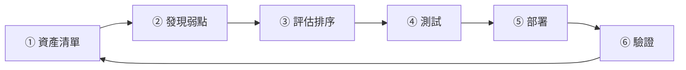

# 弱點與修補管理流程

> [!abstract] 這篇你會學到
> - 建立**資產清單與弱點的對應**（沒有資產清單就沒有弱點管理）
> - 用 **KEV + EPSS + 暴露程度**排序，而不是只看 CVSS
> - 訂出**各等級的修補時限**並寫進政策
> - 規劃修補的**測試、分批推送與回退**
> - 處理**無法修補的例外**（風險接受的正式程序）
> - 建立**每月跑得動的循環**與**追蹤指標**
> - 實作 Ubuntu／RHEL／Windows 的**自動修補**

> [!note] 與 13 章第 10 篇的分工
> [[10-弱點管理與滲透測試工具]] 講的是**工具怎麼用**（nmap、OpenVAS、Trivy）。
> **這一篇講的是「流程與制度」** —— 掃描出來之後要怎麼辦。

## 前置知識

- [[10-弱點管理與滲透測試工具]] — 掃描工具與 CVE/CVSS/EPSS/KEV
- [[01-資安基本原則與實踐]] — 風險與權衡
- [[14-套件管理]] — apt / dnf 的操作

---

## 觀念說明

### 為什麼修補這麼重要

> [!danger] 大多數的入侵，用的是「早就有修補程式」的弱點
> **不是零時差。**
>
> 真正的攻擊模式通常是：
> ```
> ① 廠商發布修補程式與公告
> ② 攻擊者【分析修補程式】，反推出弱點細節
> ③ 幾天內出現公開的 PoC / Exploit
> ④ 幾天～幾週內出現大規模自動化掃描與利用
> ⑤ 你還沒修 → 被打
> ```
>
> **「發布修補程式」對攻擊者來說是「弱點公告」。**
> 從公告到大規模利用的時間窗，**常常只有幾天**。
>
> 這就是為什麼 **KEV 目錄內的弱點要在 24～72 小時內修補**。

### 修補管理的六個步驟



| 步驟 | 做什麼 | 常見的失敗 |
| --- | --- | --- |
| **① 資產清單** | 我們有什麼？誰負責？ | **清單不完整** → 有機器永遠沒被修 |
| **② 發現弱點** | 掃描 + 訂閱公告 | 只掃不看公告 → 漏掉關鍵通報 |
| **③ 評估排序** | 哪個先修？ | **只看 CVSS** → 修錯對象 |
| **④ 測試** | 會不會壞掉？ | 直接上正式 → 服務中斷 |
| **⑤ 部署** | 分批推送 | 一次全推 → 出事全機關受影響 |
| **⑥ 驗證** | 真的修好了嗎？ | **不驗證** → 以為修好其實沒有 |

---

## ① 資產清單：一切的前提

> [!danger] 沒有資產清單，弱點管理就是假的
> **你不可能修補你不知道存在的機器。**
>
> **每台機器至少要記錄**：

| 欄位 | 為什麼需要 |
| --- | --- |
| **主機名稱 / IP / MAC** | 識別 |
| **實體位置** | 需要現場處理時 |
| **作業系統與版本** | 判斷弱點是否適用 |
| **安裝的主要軟體與版本** | 判斷弱點是否適用 |
| **用途／承載的服務** | 判斷業務衝擊 |
| **業務負責單位與聯絡人** | ★ **修補要停機時找誰協調** |
| **技術負責人** | ★ **誰來執行修補** |
| **重要性等級** | 決定修補時限與測試嚴謹度 |
| **暴露程度** | ★ **對外／內部／隔離**（決定優先序） |
| **維護時段** | 什麼時候可以停機 |
| **相依關係** | 停這台會影響什麼 |
| **保固／支援到期日** | ★ **EOL 的機器要有汰換計畫** |

> [!tip] 從自動探測 + 人工補齊開始
> **不要想著一次做完完美的清單。**
>
> ```
> ① 用網路掃描找出「網路上有什麼」（見 [[10-弱點管理與滲透測試工具]]）
> ② 與現有的財產清冊比對 → 找出「有機器但沒登記」與「有登記但找不到」
> ③ 人工補齊業務負責單位與聯絡人（這一欄自動化不了）
> ④ 之後用「新機建置流程」確保新機器一定會登記
> ```
>
> **關鍵是第 ④ 步** —— 讓清單能夠**自動維持正確**，
> 而不是每年重做一次。

```bash
# ===== 自動收集主機資訊（放進資產清單）=====
#!/usr/bin/env bash
# /usr/local/sbin/asset-report.sh —— 每台機器每週回報一次
API="https://cmdb.example.gov.tw/api/assets"

cat <<EOF > /tmp/asset.json
{
  "hostname": "$(hostname -f)",
  "ip": "$(hostname -I | awk '{print $1}')",
  "os": "$(. /etc/os-release && echo "$PRETTY_NAME")",
  "kernel": "$(uname -r)",
  "arch": "$(uname -m)",
  "cpu": $(nproc),
  "mem_gb": $(free -g | awk 'NR==2{print $2}'),
  "uptime_days": $(awk '{printf "%d", $1/86400}' /proc/uptime),
  "pending_updates": $(apt list --upgradable 2>/dev/null | grep -c upgradable),
  "security_updates": $(apt list --upgradable 2>/dev/null | grep -c -- '-security'),
  "reboot_required": $([ -f /var/run/reboot-required ] && echo true || echo false),
  "services": [$(systemctl list-units --type=service --state=running --no-legend |
                 awk '{print "\""$1"\""}' | paste -sd, )],
  "listening_ports": [$(ss -tlnH | awk '{print $4}' | grep -oE '[0-9]+$' |
                        sort -un | paste -sd, )],
  "reported_at": "$(date -Iseconds)"
}
EOF

curl -sf -X POST "$API" -H 'Content-Type: application/json' \
     -d @/tmp/asset.json || echo "回報失敗，資料保留在 /tmp/asset.json"
```

> [!tip] `reboot_required` 是很重要的欄位
> 很多人裝了修補程式卻**沒有重開機**，
> **核心與函式庫的修補在重開機前不會生效**。
>
> ```bash
> # Ubuntu/Debian：檢查是否需要重開機
> $ [ -f /var/run/reboot-required ] && cat /var/run/reboot-required.pkgs
>
> # 檢查有哪些程序還在用舊的（已刪除的）函式庫
> $ sudo lsof -n 2>/dev/null | grep -i 'DEL.*lib' | awk '{print $1}' | sort -u
>
> # 更好的工具
> $ sudo apt install -y needrestart
> $ sudo needrestart -b
> NEEDRESTART-VER: 3.6
> NEEDRESTART-SVC: nginx.service
> NEEDRESTART-SVC: mysql.service
> NEEDRESTART-KSTA: 3        # 3 = 需要重開機
> ```

---

## ② 發現弱點：不只靠掃描

> [!warning] 弱點掃描器不會告訴你所有的事
> **需要多個來源**：

| 來源 | 內容 | 為什麼需要 |
| --- | --- | --- |
| **弱點掃描器** | 系統與套件的已知弱點 | 主力 |
| **廠商公告訂閱** | 你用的產品的新弱點 | **掃描器的資料庫可能還沒更新** |
| **CISA KEV 目錄** | **正在被實際利用的弱點** | **最高優先序的依據** |
| **NCCST／TWCERT 通報** | **台灣的通報與情資** | 公務機關必看 |
| **套件管理器** | `apt list --upgradable` | 最直接 |
| **容器映像掃描** | Trivy | 容器環境必須 |
| **相依套件掃描** | 應用程式的第三方套件 | **常被忽略** |

> [!tip] 一定要訂閱的公告來源
> ```
> 【台灣】
> · NCCST 漏洞警訊     https://www.nccst.nat.gov.tw
> · TWCERT/CC          https://www.twcert.org.tw
>
> 【國際】
> · CISA KEV 目錄      https://www.cisa.gov/known-exploited-vulnerabilities-catalog
> · CISA 公告
>
> 【作業系統】
> · Ubuntu Security Notices (USN)
> · Red Hat Security Advisories (RHSA)
> · Microsoft Security Update Guide（每月第二個週二 = Patch Tuesday）
>
> 【你實際使用的產品】
> · 防火牆、VPN、WAF 廠商的資安公告   ← ★ 最常被漏掉，但最危險
> · 你用的 Web 框架、資料庫、CMS
> ```

> [!danger] 邊界資安設備的公告最重要
> **防火牆、VPN 閘道、WAF、負載平衡器** ——
> 這些設備**對外開放且權限極高**，
> 一旦弱點公開就會被**全網掃描與大規模利用**。
>
> **歷史上多起重大入侵事件，都是從「未修補的 VPN 閘道」開始的。**
>
> **必做**：
> - **訂閱每一台邊界設備廠商的資安公告**
> - 這類設備的修補**優先序等同 KEV**
> - 建立「**廠商 → 設備 → 負責人**」的對照表

```bash
# ===== 每日檢查有沒有安全性更新 =====
#!/usr/bin/env bash
# /usr/local/sbin/check-security-updates.sh
set -uo pipefail

echo "=== $(hostname) 安全性更新檢查 $(date '+%F') ==="

sudo apt update -qq 2>/dev/null

SEC=$(apt list --upgradable 2>/dev/null | grep -- '-security' | grep -v '^Listing')
ALL=$(apt list --upgradable 2>/dev/null | grep -v '^Listing' | wc -l)

echo "可升級套件總數：$ALL"
echo "其中安全性更新：$(echo "$SEC" | grep -c . || echo 0)"

if [ -n "$SEC" ]; then
  echo -e "\n【安全性更新清單】"
  echo "$SEC" | sed 's/^/  /'
fi

if [ -f /var/run/reboot-required ]; then
  echo -e "\n⚠ 需要重新開機才能完成更新"
  cat /var/run/reboot-required.pkgs 2>/dev/null | sed 's/^/  /'
fi

# 需要重啟的服務
if command -v needrestart >/dev/null; then
  echo -e "\n【需要重啟的服務】"
  sudo needrestart -b 2>/dev/null | grep '^NEEDRESTART-SVC' | sed 's/^/  /'
fi
```

> [!info]- Rocky / AlmaLinux（RHEL 系）對照
> ```bash
> # 檢查安全性更新
> $ sudo dnf updateinfo list security
> $ sudo dnf updateinfo summary
>
> # 只安裝安全性更新
> $ sudo dnf update --security -y
>
> # 檢查是否需要重開機
> $ sudo dnf install -y dnf-utils
> $ sudo needs-restarting -r
> # 回傳 0 = 不需要，1 = 需要
>
> # 哪些服務需要重啟
> $ sudo needs-restarting -s
> ```

---

## ③ 評估與排序

> [!danger] 只看 CVSS 是最常見的錯誤
> **CVSS 只回答「如果被利用，後果多嚴重」，
> 不回答「多有可能被利用」。**
>
> 完整說明見 [[10-弱點管理與滲透測試工具]]。

### 排序公式

```
優先序 = 【是否在 KEV】(最高權重)
       × 【EPSS 分數】(被利用的機率)
       × 【暴露程度】(對外 ×10 / 內部 ×3 / 隔離 ×1)
       × 【資產重要性】(核心系統 ×5 / 一般 ×2 / 測試 ×1)
       × CVSS
```

> [!tip] 實務上的簡化判斷樹
> ```
> 在 CISA KEV 目錄裡？
>   └ 是 → 對外服務？
>           ├ 是 → 【P0：24～72 小時】緊急變更
>           └ 否 → 【P1：7 天】
>   └ 否 → EPSS > 0.1？
>           ├ 是 → 對外服務？
>           │       ├ 是 → 【P1：7 天】
>           │       └ 否 → 【P2：30 天】
>           └ 否 → CVSS ≥ 9 且對外？
>                   ├ 是 → 【P2：30 天】
>                   └ 否 → 【P3：90 天】或例行維護
> ```

### 修補時限（寫進政策）

| 等級 | 判斷條件 | **修補時限** | 變更程序 |
| --- | --- | --- | --- |
| **P0 緊急** | **KEV + 對外服務** | **24～72 小時** | **緊急變更**（事後補文件） |
| **P1 高** | KEV 內部 / EPSS 高 + 對外 | **7 天** | 加速變更 |
| **P2 中** | 對外 + CVSS 高 | **30 天** | 標準變更 |
| **P3 低** | 內部 + 中等 | **90 天** | 例行維護 |
| **P4** | 其他 | 下次例行維護 | 例行維護 |

> [!warning] 時限要「實際做得到」才有意義
> 訂了「所有 Critical 都 7 天內修完」但**從來做不到**，
> **比訂一個做得到的時限更糟** ——
> 因為稽核時每一筆都是缺失，而且大家會習慣「反正做不到」。
>
> **建議**：
> - 先**統計你目前的實際修補速度**
> - 訂一個**比現況稍微進步**的目標
> - **逐年收緊**
> - **P0 一定要做到**（其他可以逐步改善）

---

## ④ 測試與 ⑤ 部署

> [!danger] 修補程式本身可能造成故障
> **真實會發生的**：
> - 核心更新後**驅動程式不相容**，機器開不起來
> - 函式庫更新後**應用程式壞掉**
> - 資料庫更新後**效能大幅下降**
> - Windows 更新後**列印功能異常**
> - 更新後 **BitLocker 要求還原金鑰**（見 [[08-資料防護DLP與加密]]）

### 分環境、分批推送


| 階段 | 對象 | 觀察期 |
| --- | --- | --- |
| **① 測試環境** | 與正式環境相同配置的測試機 | 當天～1 天 |
| **② 先導群組（Pilot）** | **資訊人員自己的機器** + 少數志願者 | **3～7 天** |
| **③ 一般環境** | 分 2～4 批推送 | 每批間隔 1～2 天 |
| **④ 核心系統** | 在維護時段，**有回退計畫** | — |

> [!tip] 「資訊人員自己先用」是最好的測試
> 讓資訊單位的機器**永遠在先導群組**：
> - 出問題時**你自己最先知道**（而不是被使用者投訴）
> - 你有能力自己排除
> - 你會更謹慎地推送

> [!danger] P0 緊急修補的取捨
> **KEV 內的對外服務弱點，24～72 小時內必須修。**
>
> 這代表**可能來不及完整測試**。
>
> **這時的取捨**：
> ```
> 選項 A：立刻修補（風險：可能造成服務異常）
> 選項 B：暫不修補（風險：【可能已經被入侵】）
> ```
>
> **通常應該選 A**，但要：
> - **先做完整備份與快照**（能快速回退）
> - **準備好回退步驟**
> - **在人力充足的時段執行**（不要週五下午）
> - **修補後密切監控**
> - 如果真的不能停機 → **啟動虛擬修補**（見下方）

### 虛擬修補：無法立即修補時的救急

> [!tip] 用 WAF／IPS 擋住弱點的利用途徑
> **原理**：不改應用程式，而是在流量層面阻擋攻擊樣式。
>
> ```nginx
> # 例：某個 CMS 的路徑穿越弱點，暫時擋掉利用途徑
> location ~ /vulnerable-endpoint {
>     deny all;
>     return 404;
> }
> ```
>
> ```
> # ModSecurity 規則（見 [[06-ModSecurity]]）
> SecRule REQUEST_URI "@contains /vulnerable/path" \
>   "id:1001,phase:1,deny,status:403,log,\
>    msg:'虛擬修補 CVE-2026-XXXX'"
> ```
>
> **虛擬修補是「暫時措施」，不是「解決方案」**：
> - **一定要記錄**：這是哪個 CVE 的虛擬修補
> - **設定複審期限**（例如 30 天）
> - **正式修補完成後要移除**（不然規則會越積越多）

### 自動修補設定

```bash
# ========== Ubuntu / Debian ==========
$ sudo apt install -y unattended-upgrades apt-listchanges
$ sudo dpkg-reconfigure -plow unattended-upgrades
```

```ini
# /etc/apt/apt.conf.d/50unattended-upgrades
Unattended-Upgrade::Allowed-Origins {
    "${distro_id}:${distro_codename}-security";
    "${distro_id}ESMApps:${distro_codename}-apps-security";
    "${distro_id}ESM:${distro_codename}-infra-security";
    // 一般更新建議【不要】自動裝，只自動裝安全性更新
    // "${distro_id}:${distro_codename}-updates";
};

// ★ 排除會造成服務中斷的套件（依你的環境調整）
Unattended-Upgrade::Package-Blacklist {
    "mysql-server";
    "postgresql";
    "nginx";
    "docker-ce";
    "linux-image-*";        // 核心更新自己來，避免自動重開機
};

Unattended-Upgrade::Mail "it@example.gov.tw";
Unattended-Upgrade::MailReport "on-change";
Unattended-Upgrade::Remove-Unused-Kernel-Packages "true";
Unattended-Upgrade::Remove-Unused-Dependencies "true";

// ★ 自動重開機：伺服器建議 false，終端可以 true
Unattended-Upgrade::Automatic-Reboot "false";
Unattended-Upgrade::Automatic-Reboot-WithUsers "false";
Unattended-Upgrade::Automatic-Reboot-Time "03:00";

// 避免同時大量下載
Unattended-Upgrade::MinimalSteps "true";
```

```ini
# /etc/apt/apt.conf.d/20auto-upgrades
APT::Periodic::Update-Package-Lists "1";
APT::Periodic::Unattended-Upgrade "1";
APT::Periodic::AutocleanInterval "7";
APT::Periodic::Download-Upgradeable-Packages "1";
```

```bash
# 測試（不實際安裝）
$ sudo unattended-upgrade --dry-run --debug

# 檢視記錄
$ sudo tail -50 /var/log/unattended-upgrades/unattended-upgrades.log
```

> [!info]- Rocky / AlmaLinux（RHEL 系）對照
> ```bash
> $ sudo dnf install -y dnf-automatic
> $ sudo nano /etc/dnf/automatic.conf
> ```
> ```ini
> [commands]
> upgrade_type = security          # ★ 只裝安全性更新
> apply_updates = yes
> reboot = never                   # 伺服器不自動重開
>
> [emitters]
> emit_via = email
> [email]
> email_to = it@example.gov.tw
> ```
> ```bash
> $ sudo systemctl enable --now dnf-automatic.timer
> $ systemctl list-timers dnf-automatic.timer
> ```

> [!warning] 伺服器的自動更新要謹慎
> | 對象 | 建議 |
> | --- | --- |
> | **終端（PC/筆電）** | **全自動 + 自動重開機**（設在非上班時間） |
> | **一般伺服器** | 自動裝安全性更新，**不自動重開機** |
> | **核心系統** | **手動 + 維護時段 + 完整測試** |
> | **資料庫** | **絕對手動**（把 DB 套件加入黑名單） |
> | **邊界設備** | 手動，但**時限最短** |

---

## ⑥ 驗證與追蹤

> [!danger] 不驗證的修補等於沒修
> **常見的失敗**：
> - 修補程式**安裝失敗**但沒人看到錯誤訊息
> - 裝了但**沒有重開機**，所以沒生效
> - **部分機器沒有收到**推送
> - 服務**還在用舊的函式庫**（沒重啟）

```bash
# ===== 驗證修補是否生效 =====

# 1. 確認套件版本
$ dpkg -l openssl | tail -1
ii  openssl  3.0.13-0ubuntu3.4  amd64  Secure Sockets Layer toolkit

# 2. 確認沒有殘留的舊版本在執行中
$ sudo needrestart -b | grep NEEDRESTART-SVC

# 3. 確認實際執行的版本（而非安裝的版本）
$ openssl version
OpenSSL 3.0.13 30 Jan 2024

# 4. 核心
$ uname -r                              # 目前執行中的
6.8.0-45-generic
$ dpkg -l 'linux-image-*' | grep ^ii | tail -1    # 已安裝的最新
# 兩者不同 → 需要重開機

# 5. 重新掃描確認弱點消失
$ nuclei -u https://your-service -tags cve -severity critical,high
```

### 追蹤指標（給管理階層看的）

> [!tip] 每月報告這五個數字
> | 指標 | 意義 | 目標 |
> | --- | --- | --- |
> | **未修補的 P0/P1 弱點數** | 立即風險 | **0** |
> | **平均修補時間（MTTP）** | 反應速度 | 逐月下降 |
> | **逾期未修補的件數** | 流程健康度 | 趨近 0 |
> | **修補涵蓋率** | 有多少機器有收到 | **> 95%** |
> | **EOL 系統數量** | 長期風險 | 逐年下降 |
>
> **加上一句話的說明**：
> 「本月有 3 件 P0，均在 48 小時內完成修補；
> 逾期 2 件為 XX 系統，因廠商不支援，已採取虛擬修補並排入汰換計畫。」

```bash
# ===== 全機關的修補狀態總覽 =====
#!/usr/bin/env bash
# 從各主機收集，或在集中管理系統上執行
for host in $(cat /etc/hosts-list); do
  ssh -o ConnectTimeout=5 "$host" '
    total=$(apt list --upgradable 2>/dev/null | grep -v Listing | wc -l)
    sec=$(apt list --upgradable 2>/dev/null | grep -c -- "-security")
    reboot=$([ -f /var/run/reboot-required ] && echo "需要" || echo "-")
    printf "%-20s 待更新:%-4s 安全性:%-4s 重開機:%s\n" \
           "$(hostname)" "$total" "$sec" "$reboot"
  ' 2>/dev/null || echo "$host  ⚠ 連線失敗"
done | sort -k3 -rn
```

---

## 處理無法修補的例外

> [!danger] 「不修，然後假裝沒看到」不是選項
> 有些弱點**真的無法修補**：
> - 舊系統，升級套件會壞掉
> - **廠商已經不再維護**（EOL）
> - 修補需要停機，但業務不允許
> - 修補會破壞與其他系統的相容性
> - **設備是委外廠商管的，我們不能動**

### 風險接受的正式程序

| 步驟 | 內容 |
| --- | --- |
| **① 書面記錄理由** | **為什麼不能修？**（要具體，不能寫「有困難」） |
| **② 評估實際風險** | 這個弱點在**我們的環境**中能被利用嗎？ |
| **③ 提出補償控制措施** | 見下表 |
| **④ 適當層級核准** | **風險越高，核准層級越高** |
| **⑤ 設定複審期限** | 例如**每季重新評估** |
| **⑥ 排入汰換計畫** | 如果是 EOL 系統 |

| 補償控制措施 | 說明 |
| --- | --- |
| **網路隔離** | 放進獨立網段，**只允許必要的連線** |
| **虛擬修補** | WAF／IPS 規則阻擋利用途徑 |
| **限制存取來源** | 只允許特定 IP／需要 VPN |
| **加強監控** | 針對該系統設定特別的偵測規則 |
| **移除不必要的功能** | 關閉有弱點的模組 |
| **加強備份** | 提高備份頻率，縮短 RPO |
| **加速汰換** | 提前編列預算 |

> [!tip] 風險接受單的範本
> ```
> ═══════════════════════════════════════
>  弱點風險接受申請單
> ═══════════════════════════════════════
> 弱點編號：CVE-2026-XXXXX
> CVSS：9.1    EPSS：0.03    在 KEV：否
> 影響系統：XX 系統（10.0.5.20）
> 系統重要性：核心系統
> 暴露程度：內部網路（不對外）
>
> 【無法修補的原因】
>   本系統為 XX 廠商於 2018 年建置，
>   升級所需之 PHP 7.4 → 8.2 將導致核心模組失效，
>   廠商已於 2024 年終止支援，無法提供修補。
>
> 【實際風險評估】
>   ・利用此弱點需先取得內網存取權
>   ・系統僅開放 3 個單位共 12 人使用
>   ・已無對外服務介面
>   → 實際可被利用的機率：低
>
> 【補償控制措施】
>   1. 移入獨立 VLAN 505，僅允許 3 個單位的網段存取
>   2. 前置 WAF 並套用針對此 CVE 的虛擬修補規則
>   3. 每日備份改為每 4 小時一次
>   4. SIEM 中新增針對此系統的異常存取告警規則
>   5. 已編列 116 年度預算進行系統重置
>
> 【複審】
>   複審週期：每季
>   下次複審：2026-11-30
>   預計解除日期：2027-06（新系統上線）
>
> 【核准】
>   申請人：___________  日期：______
>   資訊主管：_________  日期：______
>   業務主管：_________  日期：______
>   （CVSS ≥ 9 或核心系統需另會辦：__________）
> ═══════════════════════════════════════
> ```
>
> **這張單子就是稽核時的證據** ——
> 它證明你**知道這個風險、評估過、做了補償、有人核准、會定期複審**。

---

## 完整實戰範例

### 一個跑得動的月度循環

```
【每日】
  · 自動安裝安全性更新（終端與一般伺服器）
  · 檢查 CISA KEV 目錄有無新增
  · 檢視廠商公告訂閱（郵件）
  · 檢查昨夜的自動更新是否成功

【每週（週一）】
  · 執行弱點掃描（對外服務）
  · 檢視上週的修補結果與失敗清單
  · 更新資產清單（自動回報的資料）
  · 檢視「需要重開機」的機器清單

【每月（第一週）】
  · 執行全面弱點掃描
  · 用 KEV + EPSS 排序，產出修補清單
  · 排定本月的修補計畫與維護時段
  · 產出管理階層報告（五個指標）

【每月（第二週）】—— Windows Patch Tuesday 之後
  · 測試環境驗證
  · 先導群組推送

【每月（第三～四週）】
  · 分批推送到一般環境
  · 核心系統在維護時段修補
  · 驗證與重新掃描

【每季】
  · 複審所有「風險接受」的項目
  · 檢視 EOL 清單與汰換計畫
  · 檢討修補流程本身
```

> [!tip] 對照 Windows 的 Patch Tuesday
> 微軟固定在**每月第二個週二**（台灣時間週三）發布更新。
>
> **建議節奏**：
> ```
> 週三：更新發布，檢視公告，判斷有無 P0
> 週四：測試環境驗證
> 週五～下週一：先導群組（資訊人員自己）
> 下週二～四：一般終端分批推送
> 下下週：伺服器在維護時段推送
> ```
>
> **例外：Out-of-band（緊急）更新**要立刻處理，不等這個節奏。

### WSUS / Intune 的分批推送

```powershell
# ===== WSUS：建立分批的電腦群組 =====
# 在 WSUS 主控台：
#   電腦 → 所有電腦 → 右鍵 → 新增電腦群組
#     · 00-測試環境
#     · 01-先導群組（資訊人員）
#     · 02-第一批（30%）
#     · 03-第二批（40%）
#     · 04-第三批（30%）
#     · 09-核心伺服器

# 用 GPO 指定電腦所屬群組（用戶端目標）
# 電腦設定 → 系統管理範本 → Windows 元件 → Windows Update
#   「啟用用戶端目標」→ 目標群組名稱：01-先導群組
```

```powershell
# ===== 檢查全網域的修補狀態 =====
$results = foreach ($c in (Get-ADComputer -Filter 'Enabled -eq $true').Name) {
  try {
    $s = New-CimSession -ComputerName $c -ErrorAction Stop
    $lastHF = Get-CimInstance Win32_QuickFixEngineering -CimSession $s |
              Sort-Object InstalledOn -Descending | Select-Object -First 1
    $os = Get-CimInstance Win32_OperatingSystem -CimSession $s
    [PSCustomObject]@{
      電腦    = $c
      作業系統 = $os.Caption
      版本    = $os.Version
      最後更新 = $lastHF.InstalledOn
      距今天數 = if ($lastHF.InstalledOn) {
                   [int]((Get-Date) - $lastHF.InstalledOn).TotalDays } else { 'N/A' }
      最後開機 = $os.LastBootUpTime
    }
    Remove-CimSession $s
  } catch {
    [PSCustomObject]@{ 電腦 = $c; 作業系統 = '連線失敗' }
  }
}

$results | Sort-Object 距今天數 -Descending |
  Export-Csv "修補狀態_$(Get-Date -f yyyyMMdd).csv" -NoTypeInformation -Encoding UTF8

# 找出超過 60 天沒更新的（重點處理對象）
$results | Where-Object { $_.距今天數 -is [int] -and $_.距今天數 -gt 60 } |
  Format-Table -AutoSize
```

### 安全的修補與回退（Linux）

```bash
#!/usr/bin/env bash
# /usr/local/sbin/safe-patch.sh —— 有快照與回退的修補流程
set -euo pipefail

HOST=$(hostname)
LOG="/var/log/patch-$(date +%Y%m%d-%H%M).log"
exec > >(tee -a "$LOG") 2>&1

echo "═══ 修補開始 $HOST $(date '+%F %T') ═══"

# ---------- 1. 前置檢查 ----------
echo "[1/7] 前置檢查"
df -h / | awk 'NR==2 && int($5)>90 {print "❌ 磁碟空間不足"; exit 1}'
systemctl --failed --no-legend | grep -q . && \
  echo "⚠ 有 failed 的服務，請先處理" && systemctl --failed

# ---------- 2. 記錄修補前的狀態 ----------
echo "[2/7] 記錄現況"
dpkg -l > "/var/backups/dpkg-before-$(date +%Y%m%d).txt"
systemctl list-units --state=running --no-legend > "/var/backups/services-before.txt"
uname -r > "/var/backups/kernel-before.txt"

# ---------- 3. 建立快照（依環境選一種）----------
echo "[3/7] 建立快照"
if command -v lvcreate >/dev/null && lvs 2>/dev/null | grep -q root; then
  sudo lvcreate -L 5G -s -n root-presnap /dev/mapper/vg-root && \
    echo "  ✓ LVM 快照已建立"
elif command -v zfs >/dev/null; then
  sudo zfs snapshot rpool/ROOT@pre-patch-$(date +%Y%m%d) && \
    echo "  ✓ ZFS 快照已建立"
elif command -v timeshift >/dev/null; then
  sudo timeshift --create --comments "修補前" && echo "  ✓ Timeshift 快照"
else
  echo "  ⚠ 無快照機制 —— 請確認有可用的備份！"
  read -rp "  沒有快照仍要繼續嗎？(yes/no) " ans
  [ "$ans" = "yes" ] || exit 1
fi

# ---------- 4. 執行修補 ----------
echo "[4/7] 安裝安全性更新"
sudo apt update -qq
sudo unattended-upgrade -v || {
  echo "❌ 更新失敗"; exit 1
}

# ---------- 5. 檢查需要重啟的服務 ----------
echo "[5/7] 檢查需要重啟的服務"
if command -v needrestart >/dev/null; then
  sudo needrestart -b | grep '^NEEDRESTART-SVC' | sed 's/NEEDRESTART-SVC: /  /'
  sudo needrestart -r a          # a=自動重啟服務（不含核心）
fi

# ---------- 6. 驗證服務 ----------
echo "[6/7] 驗證服務"
FAILED=0
while read -r svc; do
  if systemctl is-active --quiet "$svc"; then
    echo "  ✓ $svc"
  else
    echo "  ❌ $svc 未執行！"
    FAILED=1
  fi
done < <(awk '{print $1}' /var/backups/services-before.txt)

if [ "$FAILED" -eq 1 ]; then
  echo ""
  echo "❌❌ 有服務未正常啟動 —— 請考慮回退"
  echo "回退指令："
  echo "  LVM:  sudo lvconvert --merge /dev/vg/root-presnap && sudo reboot"
  echo "  ZFS:  sudo zfs rollback rpool/ROOT@pre-patch-$(date +%Y%m%d) && sudo reboot"
  echo "  套件: sudo apt install <套件>=<舊版本>"
  exit 1
fi

# ---------- 7. 完成 ----------
echo "[7/7] 完成"
if [ -f /var/run/reboot-required ]; then
  echo "  ⚠ 需要重新開機才能完成（核心或關鍵函式庫已更新）"
  cat /var/run/reboot-required.pkgs 2>/dev/null | sed 's/^/    /'
fi

echo "═══ 修補完成 $(date '+%F %T') ═══"
echo "日誌：$LOG"
```

```bash
# ===== 回退單一套件 =====
# 查看可用的舊版本
$ apt-cache policy nginx
nginx:
  已安裝：1.24.0-2ubuntu7.1
  候選：  1.24.0-2ubuntu7.1
  版本列表：
     1.24.0-2ubuntu7.1 500
     1.24.0-2ubuntu7   500          ← 可以退回這個

# 降級
$ sudo apt install nginx=1.24.0-2ubuntu7
$ sudo apt-mark hold nginx          # 鎖定版本，避免又被更新

# 解除鎖定
$ sudo apt-mark unhold nginx
```

---

## 常見錯誤與排錯

| 現象／錯誤 | 原因 | 解法 |
| --- | --- | --- |
| **有機器永遠沒被修補** | **資產清單不完整** | 定期網路探測比對；新機建置流程納入登記 |
| 修了一堆但還是被打 | **只看 CVSS，修錯對象** | 用 **KEV → EPSS → 暴露程度**排序 |
| **邊界設備的弱點漏掉了** | 沒訂閱廠商公告 | **訂閱每一台邊界設備的資安公告**；優先序等同 KEV |
| 裝了修補但沒生效 | **沒有重開機或重啟服務** | 用 `needrestart`；監控 `reboot_required` |
| 修補後服務壞掉 | **沒有測試就上正式** | 測試環境 → 先導群組 → 分批推送 |
| 修補後無法回退 | 沒有快照 | **修補前建立快照**（LVM/ZFS/VM snapshot） |
| **自動更新把資料庫重啟了** | 沒有排除清單 | `Package-Blacklist` 加入 DB、Web 伺服器 |
| 自動更新半夜自動重開機 | `Automatic-Reboot "true"` | **伺服器設 false**，重開機自己安排 |
| **修補時限訂了但從來做不到** | 目標不切實際 | 先統計現況，訂**稍微進步**的目標，逐年收緊 |
| 無法修補的系統一直放著 | **沒有風險接受程序** | 填**風險接受單**：理由 + 補償控制 + 核准 + 複審期限 |
| 虛擬修補規則越積越多 | 正式修補後沒移除 | 每條規則記錄對應的 CVE 與複審期限 |
| 稽核問「修補率是多少」答不出來 | 沒有追蹤指標 | 每月統計五個指標並留存報告 |
| **EOL 系統一直沒汰換** | 沒有納入預算規劃 | 資產清單記錄支援到期日；提前兩年編列預算 |
| 磁碟滿了導致更新失敗 | `/var` 或 `/boot` 空間不足 | 修補前檢查空間；定期 `apt autoremove` 清舊核心 |
| P0 來不及測試就要修 | 時限太短 | **先快照** + 準備回退 + 人力充足時段 + 修後密切監控 |

---

## 安全性注意事項

> [!danger] 修補的最大風險是「不修補」
> 很多機關因為「怕修壞」而長期不修補，
> **但「已知弱點未修補」是入侵的頭號原因**。
>
> **正確的心態**：
> - 不是「要不要修」，而是「**怎麼安全地修**」
> - 建立**快照與回退能力**，讓修補變成低風險的操作
> - **能快速回退，就敢快速修補**

> [!warning] 修補程式本身也可能是攻擊途徑
> **供應鏈攻擊**：攻擊者入侵軟體廠商，把惡意程式碼植入正式的更新包
> （SolarWinds、XZ Utils 都是真實案例）。
>
> **防範**：
> - **只從官方來源下載**
> - **驗證 GPG 簽章與雜湊值**
> - 套件庫的簽章金鑰要正確設定
> - **不要用來路不明的第三方套件庫**
> - 關注廠商的資安通報

```bash
# ===== 驗證下載的檔案 =====
# 雜湊比對
$ sha256sum downloaded-file.deb
$ # 與官方公布的比對

# GPG 簽章驗證
$ gpg --verify file.tar.gz.asc file.tar.gz
gpg: Good signature from "Release Signing Key <security@example.org>"

# 檢查 APT 套件庫的簽章設定
$ ls -l /etc/apt/keyrings/ /etc/apt/trusted.gpg.d/
$ grep -r 'signed-by' /etc/apt/sources.list.d/
```

> [!tip] EOL 系統是最大的長期風險
> **「沒有修補程式」的系統，弱點會永遠存在並累積。**
>
> **常見的 EOL 問題**：
> - Windows Server 2012 / 2016（部分已終止支援）
> - CentOS 7（已 EOL）
> - PHP 7.x、Python 2
> - 老舊的網路設備與防火牆
> - 廠商倒閉或停止支援的系統
>
> **必做**：
> 1. **資產清單記錄每個系統的支援到期日**
> 2. **提前 1～2 年**編列汰換預算
> 3. 無法汰換的 → **走風險接受程序 + 強力隔離**
> 4. **每季檢視 EOL 清單**
>
> **EOL 系統應該視為「已經被入侵」來設計隔離。**

> [!danger] 修補與變更管理的關係
> 修補是一種**變更**，應該納入變更管理：
>
> | 修補等級 | 變更程序 |
> | --- | --- |
> | **P0 緊急** | **緊急變更**：先做，**24 小時內補文件**，事後審查 |
> | P1～P2 | 加速／標準變更：事前申請、風險評估、回退計畫 |
> | P3～P4 | 例行變更：納入定期維護，預先核准 |
>
> **每次修補都要記錄**：
> - 修了什麼（CVE / 套件 / KB 編號）
> - 修了哪些機器
> - **誰執行、什麼時候**
> - **驗證結果**
> - 有沒有異常
>
> 這是稽核的必查項目。見 [[09-資安稽核與符合性檢核]]。

---

## 速查表

### 六步驟

```
① 資產清單 → ② 發現弱點 → ③ 評估排序 → ④ 測試 → ⑤ 部署 → ⑥ 驗證
（最常見的失敗：清單不完整、只看 CVSS、不驗證）
```

### 排序判斷樹

```
在 CISA KEV？
 ├ 是 + 對外 → 【P0：24～72 小時】
 ├ 是 + 內部 → 【P1：7 天】
 └ 否 → EPSS > 0.1？
         ├ 是 + 對外 → P1：7 天
         └ 否 → CVSS≥9 + 對外 → P2：30 天
                 其他 → P3：90 天
```

### 修補時限

| 等級 | 條件 | 時限 |
| --- | --- | --- |
| **P0** | **KEV + 對外** | **24～72 小時** |
| P1 | KEV 內部 / EPSS 高+對外 | 7 天 |
| P2 | 對外 + CVSS 高 | 30 天 |
| P3 | 內部 + 中等 | 90 天 |

### 分批推送

```
測試環境（當天）→ 先導群組【資訊人員自己】（3～7 天）
→ 一般環境（分 2～4 批）→ 核心系統（維護時段 + 回退計畫）
```

### 自動更新建議

| 對象 | 建議 |
| --- | --- |
| 終端 | 全自動 + 自動重開機（非上班時間） |
| 一般伺服器 | 自動裝安全更新，**不自動重開** |
| **核心系統／資料庫** | **手動 + 維護時段**（加入黑名單） |
| 邊界設備 | 手動，但**時限最短** |

### 關鍵指令

| 目的 | Ubuntu | RHEL |
| --- | --- | --- |
| 列出可更新 | `apt list --upgradable` | `dnf check-update` |
| 只看安全更新 | `apt list --upgradable \| grep security` | `dnf updateinfo list security` |
| 只裝安全更新 | `unattended-upgrade` | `dnf update --security` |
| **需要重開機？** | `[ -f /var/run/reboot-required ]` | `needs-restarting -r` |
| **需重啟的服務** | `needrestart -b` | `needs-restarting -s` |
| 降級 | `apt install pkg=版本` | `dnf downgrade pkg` |
| 鎖定版本 | `apt-mark hold pkg` | `dnf versionlock add pkg` |

### 必訂閱的公告

```
【台灣】NCCST 漏洞警訊 / TWCERT-CC
【國際】CISA KEV 目錄
【OS】  Ubuntu USN / Red Hat RHSA / Microsoft（每月第 2 個週二）
【★】   你的防火牆/VPN/WAF 廠商公告   ← 最常漏、最危險
```

### 風險接受單六要素

```
① 書面記錄【具體】原因      ② 評估實際可利用性
③ 補償控制措施              ④ 適當層級核准
⑤ 複審期限（每季）          ⑥ 汰換計畫
```

### 補償控制措施

```
網路隔離 · 虛擬修補（WAF/IPS）· 限制存取來源
加強監控 · 移除有弱點的模組 · 加強備份 · 加速汰換
```

### 追蹤指標（每月報告）

```
1. 未修補的 P0/P1 數 → 目標 0
2. 平均修補時間 MTTP → 逐月下降
3. 逾期未修補件數    → 趨近 0
4. 修補涵蓋率        → > 95%
5. EOL 系統數量      → 逐年下降
```

---

## 練習題

> [!question]- 練習 1：檢查你的資產清單品質
> 1. 你有資產清單嗎？**最後更新是什麼時候？**
> 2. 用網路掃描比對：**有幾台機器在網路上但不在清單裡？**
> 3. 清單中有幾台**找不到實體**？
> 4. **每台機器都有「業務負責單位」與「技術負責人」嗎？**
> 5. **有幾台的作業系統已經 EOL？**
> 6. 有記錄「支援到期日」嗎？
>
> 第 2、5 題的答案通常會決定你接下來三個月的工作重點。

> [!question]- 練習 2：實際排序一次
> 對你目前掃描出的弱點：
> 1. 下載 CISA KEV 目錄，**比對有幾個在裡面**
> 2. 對前 10 個高 CVSS 的弱點，**查它們的 EPSS 分數**
> 3. **標註每一個的「暴露程度」**（對外／內部／隔離）
> 4. 用本篇的判斷樹重新排序
> 5. **與「只看 CVSS」的排序比較，前五名有變嗎？**
>
> 通常會發現：**原本排第一的其實不急，而原本排第 20 的才是最危險的。**

> [!question]- 練習 3：寫一份風險接受單
> 挑一個你環境中「知道有問題但改不了」的系統：
> 1. 具體寫出**為什麼不能修**（不能寫「有困難」）
> 2. **評估實際的可利用性**（攻擊者要先做到什麼才碰得到？）
> 3. **列出至少三項補償控制措施**（要具體到可以執行）
> 4. **誰該核准？**（依風險等級決定層級）
> 5. **複審期限訂多久？**
> 6. **汰換計畫是什麼？預算在哪一年？**
>
> 這張單子交出去之後，你就從「有個沒修的洞」
> 變成「**有個已知、已評估、已控制、有計畫的風險**」——
> 這才是稽核想看到的。

---

## 小測驗

Q1. **為什麼說「發布修補程式對攻擊者來說是弱點公告」**？這對修補時限有什麼意義？

Q2. 修補管理的六個步驟是什麼？各自最常見的失敗是什麼？

Q3. **為什麼「沒有資產清單就沒有弱點管理」**？資產清單中哪三個欄位最常被忽略但很重要？

Q4. 除了弱點掃描器，還需要哪些弱點來源？**哪一類公告最常被漏掉卻最危險**？

Q5. **修補時限「訂了但做不到」為什麼比訂一個做得到的更糟**？該怎麼訂？

Q6. 分批推送的四個階段是什麼？**為什麼「資訊人員自己先用」是最好的測試**？

Q7. **P0 緊急修補來不及測試時，該怎麼取捨**？要做哪四件事？

Q8. **什麼是虛擬修補？使用時必須注意哪三件事**？

Q9. **無法修補時的「風險接受」有哪六個步驟**？為什麼「不修然後假裝沒看到」不是選項？

Q10. **為什麼「裝了修補程式」不等於「修好了」**？有哪四種驗證方式？

> [!question]- 測驗答案
> **Q1.** 因為攻擊者會**分析修補程式的內容，反推出弱點的細節**，
> 幾天內就會出現公開的 PoC／Exploit，接著是大規模的自動化掃描與利用。
> 所以廠商發布修補程式的那一刻，等於是**向攻擊者公告了弱點的存在與位置**。
> 意義：**從公告到大規模利用的時間窗常常只有幾天**，
> 這就是為什麼 **KEV 目錄內的弱點要在 24～72 小時內修補** ——
> 而且大多數的真實入侵用的是「早就有修補程式」的弱點，不是零時差。
>
> **Q2.** ①**資產清單**（失敗：清單不完整 → 有機器永遠沒被修）；
> ②**發現弱點**（失敗：只掃不看公告 → 漏掉關鍵通報）；
> ③**評估排序**（失敗：**只看 CVSS** → 修錯對象）；
> ④**測試**（失敗：直接上正式 → 服務中斷）；
> ⑤**部署**（失敗：一次全推 → 出事全機關受影響）；
> ⑥**驗證**（失敗：**不驗證** → 以為修好其實沒有）。
>
> **Q3.** 因為**你不可能修補你不知道存在的機器** ——
> 資產清單是整個流程的前提。
> 最常被忽略但很重要的三個欄位：
> ①**業務負責單位與聯絡人**（修補要停機時找誰協調）；
> ②**暴露程度**（對外／內部／隔離，這是排序的關鍵權重）；
> ③**保固／支援到期日**（EOL 的機器要有汰換計畫）。
> 建立方式：自動網路探測 + 與財產清冊比對 + 人工補齊負責人，
> 並用「新機建置流程」確保清單能自動維持正確。
>
> **Q4.** 還需要：**廠商公告訂閱**、**CISA KEV 目錄**、
> **NCCST／TWCERT 通報**、套件管理器（`apt list --upgradable`）、
> 容器映像掃描、應用程式的相依套件掃描。
> **最常被漏掉卻最危險的是「邊界資安設備廠商的公告」** ——
> 防火牆、VPN 閘道、WAF、負載平衡器**對外開放且權限極高**，
> 弱點一公開就會被全網掃描與大規模利用，
> 歷史上多起重大入侵事件都是從「未修補的 VPN 閘道」開始的。
> 這類設備的修補優先序應等同 KEV。
>
> **Q5.** 因為訂了「所有 Critical 都 7 天內修完」但**從來做不到**，
> 會造成：①**稽核時每一筆都是缺失**；
> ②**大家習慣「反正做不到」**，整個制度失去約束力。
> 該怎麼訂：**先統計你目前的實際修補速度**，
> 訂一個**比現況稍微進步**的目標，**逐年收緊**；
> 但 **P0 一定要做到**（其他可以逐步改善）。
>
> **Q6.** ①**測試環境**（與正式相同配置，當天～1 天）；
> ②**先導群組**（資訊人員自己 + 少數志願者，3～7 天）；
> ③**一般環境**（分 2～4 批，每批間隔 1～2 天）；
> ④**核心系統**（維護時段 + 回退計畫）。
> **「資訊人員自己先用」最好，是因為**：
> 出問題時**你自己最先知道**（而不是被使用者投訴）、
> 你**有能力自己排除**、而且你**會更謹慎地推送**。
>
> **Q7.** 取捨是：**選項 A 立刻修**（風險：可能造成服務異常）
> vs **選項 B 暫不修**（風險：**可能已經被入侵**）。
> **通常應該選 A**，但要做四件事：
> ①**先做完整備份與快照**（能快速回退）；
> ②**準備好回退步驟**；
> ③**在人力充足的時段執行**（不要週五下午）；
> ④**修補後密切監控**。
> 如果真的不能停機 → **啟動虛擬修補**作為過渡。
>
> **Q8.** **虛擬修補**是用 WAF／IPS 規則在流量層面阻擋弱點的利用途徑，
> **不修改應用程式本身**。
> 必須注意三件事：
> ①**一定要記錄這是哪個 CVE 的虛擬修補**；
> ②**設定複審期限**（例如 30 天）；
> ③**正式修補完成後要移除規則**（不然規則會越積越多，
> 最終沒有人知道每條規則為什麼存在）。
> 它是「暫時措施」，不是「解決方案」。
>
> **Q9.** ①**書面記錄具體原因**（不能寫「有困難」）；
> ②**評估實際風險**（這個弱點在**我們的環境**中真的能被利用嗎）；
> ③**提出補償控制措施**（網路隔離、虛擬修補、限制存取來源、
> 加強監控、移除有弱點的模組、加強備份、加速汰換）；
> ④**適當層級核准**（風險越高，核准層級越高）；
> ⑤**設定複審期限**（例如每季）；⑥**排入汰換計畫**。
> **「不修然後假裝沒看到」不是選項**，因為那樣的話：
> 稽核時你**拿不出任何證明**說明你知道並控制了這個風險，
> 出事時也**無法說明已盡合理注意義務**。
> 走完程序後，你就從「有個沒修的洞」變成
> 「**有個已知、已評估、已控制、有計畫的風險**」。
>
> **Q10.** 因為可能：修補程式**安裝失敗但沒人看到錯誤**、
> 裝了但**沒有重開機所以沒生效**（核心與函式庫的修補必須重開機）、
> **部分機器沒有收到推送**、服務**還在用舊的函式庫**（沒重啟）。
> 四種驗證方式：
> ①**確認套件版本**（`dpkg -l <pkg>`）；
> ②**確認實際執行中的版本**（`openssl version`、`uname -r`，
> 與已安裝的最新版本比對）；
> ③**檢查需要重啟的服務**（`needrestart -b`、`needs-restarting -s`）
> 與是否需要重開機（`/var/run/reboot-required`）；
> ④**重新掃描確認弱點消失**。

---

## 延伸閱讀

- [[10-弱點管理與滲透測試工具]] — 掃描工具與 CVE/CVSS/EPSS/KEV 的細節
- [[04-Web應用防火牆WAF]] — 虛擬修補的實作
- [[09-資安稽核與符合性檢核]] — 修補紀錄的稽核要求
- [[10-資安政策文件與制度]] — 把修補時限寫進政策
- [[14-套件管理]] — apt / dnf 的操作
- [[08-系統強化與稽核]] — 修補之外的系統加固
- [[16-資安設備選型與導入實務]] — 資安設備本身的修補
