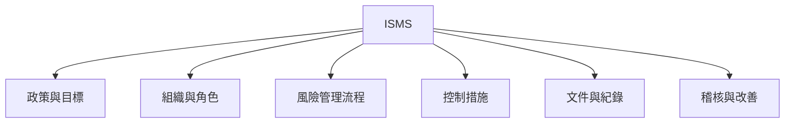
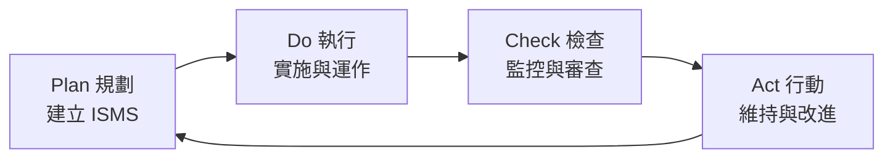
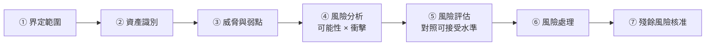
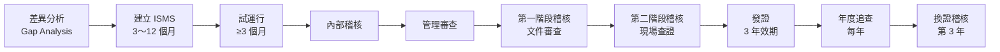

# ISO 27001 與 ISMS

> [!abstract] 這篇你會學到
> - 理解 **ISMS 是什麼**，以及它與「買資安設備」的差別
> - 掌握 **PDCA 循環**與 ISO 27001 的條文結構
> - 認識 **ISO 27001:2022 附錄 A 的 93 項控制措施**（四大主題）
> - 學會做**風險評鑑**與撰寫**適用性聲明（SoA）**
> - 知道**驗證流程、文件需求與稽核會看什麼**
> - 判斷**你的組織到底需不需要驗證**

> [!warning] 先說結論
> **ISO 27001 驗證證書本身不代表安全。**
>
> 它代表的是「**你有一套管理制度，而且真的在運作**」。
> 一個把制度做成「應付稽核的文件遊戲」的組織，
> 拿到證書後仍然會被入侵。
>
> **但一套真正落實的 ISMS，會讓資安工作從「救火」變成「有計畫的改善」。**

## 前置知識

- [[01-資安基本原則與實踐]] — 資安原則
- [[06-NIST-CSF與CIS-Controls]] — 另外兩個常用框架
- [[10-資安政策文件與制度]] — 文件架構

---

## 觀念說明

### ISMS 是什麼

**ISMS**（Information Security Management System，資訊安全管理系統）
**不是一套軟體**，而是**一套「管理制度」**。



> [!tip] 一個比喻：ISMS 是「健康管理」，不是「吃藥」
> ```
> 買資安設備   = 生病了吃藥
> 建立 ISMS    = 定期健檢 + 飲食運動計畫 + 追蹤改善
> ```
>
> **吃藥治標，健康管理治本。**
>
> ISMS 回答的是：
> - **我們有哪些資產？**
> - **面臨哪些風險？**
> - **哪些風險不能接受？**
> - **要做什麼來降低它？**
> - **做了之後有效嗎？**
> - **怎麼持續改善？**

### 標準家族

| 標準 | 內容 |
| --- | --- |
| **ISO/IEC 27001** | **要求事項**（可驗證的那一本） |
| **ISO/IEC 27002** | **控制措施的實作指引**（怎麼做，不可驗證） |
| ISO/IEC 27005 | 資安風險管理 |
| ISO/IEC 27017 | 雲端服務的資安控制 |
| ISO/IEC 27018 | 雲端的個人資料保護 |
| **ISO/IEC 27701** | **隱私資訊管理（PIMS）**，27001 的延伸 |
| CNS 27001 | **中華民國國家標準**（等同採用 ISO 27001） |

> [!note] 2022 年改版的重點
> **ISO/IEC 27001:2022** 相較於 2013 版：
> - 附錄 A 的控制措施從 **114 項精簡為 93 項**
> - 從 14 個章節重組為 **4 大主題**
> - 新增 **11 項控制措施**（見下方）
> - 每項控制措施加上**屬性標籤**（便於分類與檢索）
>
> **已驗證 2013 版的組織有過渡期限**，
> 應確認自己的驗證版本與過渡時程。

---

## PDCA 循環



| 階段 | 做什麼 | 對應條文 |
| --- | --- | --- |
| **Plan** | 界定範圍、風險評鑑、選擇控制措施、訂目標 | 4～6 章 |
| **Do** | 實施控制措施、教育訓練、日常運作 | 7～8 章 |
| **Check** | 監控、量測、**內部稽核**、**管理審查** | 9 章 |
| **Act** | 矯正措施、持續改進 | 10 章 |

### ISO 27001 的條文結構

| 章 | 標題 | 重點 |
| --- | --- | --- |
| **4** | 組織全景 | **界定 ISMS 範圍**、利害關係人需求 |
| **5** | 領導 | **最高管理階層的承諾**、資安政策、角色與職責 |
| **6** | 規劃 | **風險評鑑與處理**、**適用性聲明（SoA）**、資安目標 |
| **7** | 支援 | 資源、**能力與認知**、溝通、**文件化資訊** |
| **8** | 運作 | 執行風險處理計畫 |
| **9** | 績效評估 | 監控量測、**內部稽核**、**管理審查** |
| **10** | 改進 | **不符合事項與矯正措施**、持續改進 |

> [!danger] 第 5 章「領導」是最容易失敗的一章
> **ISO 27001 明確要求「最高管理階層」的參與**：
> - 核准資安政策
> - 提供資源
> - **參與管理審查**
> - 確保 ISMS 達成預期成果
>
> **常見的失敗**：
> ```
> 「資安是資訊室的事」
>   → 資訊室自己做 ISMS
>     → 沒有預算、沒有跨單位配合權限
>       → 只能做文件，做不了實質改善
>         → 驗證通過但制度沒有真正運作
> ```
>
> **沒有高層支持的 ISMS，一定失敗。**

---

## 附錄 A：93 項控制措施

### 四大主題

| 主題 | 項數 | 範圍 |
| --- | --- | --- |
| **A.5 組織控制** | **37 項** | 政策、角色、資產管理、供應商、事件管理、法遵 |
| **A.6 人員控制** | **8 項** | 任用前中後、教育訓練、紀律程序、遠距工作 |
| **A.7 實體控制** | **14 項** | 周界、門禁、設備、清桌淨螢、公用設施 |
| **A.8 技術控制** | **34 項** | 端點、存取控制、加密、日誌、網路、開發安全 |

> [!tip] 對照本手冊的章節
> | ISO 主題 | 本手冊對應 |
> | --- | --- |
> | **A.5 組織** | 本章（14-資安實踐與規範）全部 |
> | **A.6 人員** | [[12-資安意識與社交工程防範]]、[[02-密碼與帳號管理實務]] |
> | **A.7 實體** | [[15-實體與OT-IoT安全設備]]、[[00-機房與硬體-索引]] |
> | **A.8 技術** | [[00-資安防護設備-索引]] 整章、[[08-系統強化與稽核]] |

### 2022 版新增的 11 項控制措施

> [!note] 這些反映了近年的資安趨勢
> | 編號 | 控制措施 | 對應本手冊 |
> | --- | --- | --- |
> | **A.5.7** | **威脅情資（Threat Intelligence）** | [[09-日誌集中與SIEM]] |
> | **A.5.23** | **雲端服務使用的資安** | [[08-產業規範與國際法遵]] |
> | **A.5.30** | **營運持續的 ICT 準備** | [[14-備份與抗勒索防護]] |
> | **A.7.4** | **實體安全監控** | [[15-實體與OT-IoT安全設備]] |
> | **A.8.9** | **組態管理** | [[02-基準設定與範本化]] |
> | **A.8.10** | **資訊刪除** | [[08-資料防護DLP與加密]] |
> | **A.8.11** | **資料遮罩（Data Masking）** | [[08-資料防護DLP與加密]] |
> | **A.8.12** | **資料外洩防護（DLP）** | [[08-資料防護DLP與加密]] |
> | **A.8.16** | **監控活動** | [[09-日誌集中與SIEM]] |
> | **A.8.23** | **網頁過濾** | [[06-郵件與網頁閘道防護]] |
> | **A.8.28** | **安全程式設計** | [[09-應用層安全]] |

### 控制措施的屬性

2022 版每項控制措施都有五個屬性標籤：

| 屬性 | 值 |
| --- | --- |
| **控制類型** | 預防性 / 偵測性 / 矯正性 |
| **資安特性** | 機密性 / 完整性 / 可用性 |
| **網路安全概念** | 識別 / 保護 / 偵測 / 回應 / 復原（**對應 NIST CSF**） |
| **作業能力** | 治理 / 資產管理 / 資訊保護 / … |
| **安全領域** | 治理與生態系 / 保護 / 防禦 / 韌性 |

> [!tip] 屬性讓你能「橫向檢視」
> 例如：**「我們的『偵測性』控制措施是不是太少？」**
>
> 很多組織的控制措施**幾乎全是預防性的**，
> 一旦預防失效就完全不知道 —— 這正是 [[09-日誌集中與SIEM]] 存在的理由。

---

## 風險評鑑：ISMS 的核心

> [!danger] 風險評鑑做不好，整個 ISMS 就是空的
> 因為**所有的控制措施都應該來自風險評鑑的結果**，
> 而不是「別人有的我們也要有」。

### 流程



### ① 界定範圍

> [!warning] 範圍界定會決定你的工作量與驗證成本
> **範圍太大** → 做不完、成本高
> **範圍太小** → 證書沒有說服力，客戶不認
>
> **常見的界定方式**：
> - 依**組織單位**（例如「資訊室及其所提供的服務」）
> - 依**服務**（例如「XX 系統的營運與維護」）
> - 依**地點**（例如「總部與 A 機房」）
>
> **必須在範圍聲明中寫清楚**：
> - 包含哪些**組織、地點、資產、技術**
> - **明確排除的部分及其理由**
> - **與範圍外的介面**（例如委外部分）

### ② 資產識別

| 資產類型 | 例子 |
| --- | --- |
| **資訊** | 資料庫、文件、個資、營業秘密、日誌 |
| **軟體** | 應用系統、作業系統、開發工具 |
| **實體** | 伺服器、網路設備、終端、機房 |
| **服務** | 網路服務、電力、空調 |
| **人員** | 具備特定技能與知識的人 |
| **無形** | 商譽、形象 |

> [!tip] 每項資產至少要記錄
> ```
> □ 資產名稱與識別碼
> □ 【資產擁有者】← 必要（誰負責決定它的保護等級）
> □ 分類等級（機密/內部/公開）
> □ 存放位置（含所有副本與備份）
> □ 【CIA 三個面向的重要性評分】
> □ 相關的法規要求
> ```

### ③④ 風險分析

> [!example] 最常用的方法：可能性 × 衝擊
> ```
> 風險值 = 可能性（1～5） × 衝擊（1～5）  →  1～25
> ```
>
> **可能性的判斷依據**：
> | 分數 | 說明 |
> | --- | --- |
> | 5 | 幾乎必然發生（每週／已經在發生） |
> | 4 | 很可能（每月） |
> | 3 | 可能（每年） |
> | 2 | 不太可能（數年一次） |
> | 1 | 幾乎不可能 |
>
> **衝擊的判斷依據**（要涵蓋多個面向）：
> | 分數 | 財務 | 服務中斷 | 法遵 | 商譽 |
> | --- | --- | --- | --- | --- |
> | 5 | > 1000 萬 | > 1 週 | 重大違法、負責人責任 | 全國性新聞 |
> | 4 | 100～1000 萬 | 1～7 天 | 遭裁罰 | 地方新聞 |
> | 3 | 10～100 萬 | 4～24 小時 | 被要求改善 | 客戶抱怨 |
> | 2 | 1～10 萬 | 1～4 小時 | 輕微 | 內部知悉 |
> | 1 | < 1 萬 | < 1 小時 | 無 | 無 |

> [!warning] 風險評鑑最常見的問題：分數是「喬」出來的
> **真實會發生的**：
> ```
> 「這個算高風險的話就要花錢處理，先給 3 分好了」
> 「這個給 5 分的話報告不好看」
> ```
>
> **對策**：
> - **判斷準則要事先定義清楚**（像上表那樣有具體標準）
> - **由多人共同評估**（不是一個人決定）
> - **資產擁有者要參與**（業務單位知道實際衝擊）
> - **有歷史數據就用數據**（過去發生過幾次？）
> - **記錄評分的理由**

### ⑤⑥ 風險處理

| 策略 | 說明 | 例子 |
| --- | --- | --- |
| **降低（Modify）** | **實施控制措施** | 加上 MFA、做備份、加密 |
| **規避（Avoid）** | **不做這件事** | 停用有風險的服務、不蒐集非必要的個資 |
| **轉移（Share）** | 保險、委外 | 買資安險、委外託管 |
| **接受（Retain）** | **在可接受範圍內，不處理** | 低風險項目 |

> [!danger] 「接受」必須是「有意識的決定」並經核准
> **不是**「我們沒錢所以就這樣」，
> **而是**「經評估後，這個殘餘風險在組織可接受的水準內，
> 由 XX 主管核准」。
>
> **要記錄**：
> - 為什麼接受
> - **殘餘風險有多高**
> - **誰核准的**（風險越高，層級越高）
> - **複審期限**
>
> 見 [[03-弱點與修補管理流程]] 的風險接受單範本。

### 風險登錄表範本

| # | 資產 | 威脅 | 弱點 | 可能性 | 衝擊 | 風險值 | 處理 | 控制措施(SoA) | 負責人 | 期限 | 殘餘風險 |
| --- | --- | --- | --- | --- | --- | --- | --- | --- | --- | --- | --- |
| 1 | 民眾資料庫 | 勒索病毒 | 備份在同一網段 | 4 | 5 | **20** | 降低 | A.8.13 資訊備份 | 李 | 09/30 | 6 |
| 2 | 對外網站 | SQL Injection | 未修補的框架 | 4 | 4 | **16** | 降低 | A.8.8, A.8.28 | 王 | 09/15 | 4 |
| 3 | AD | 帳號盜用 | 無 MFA | 5 | 5 | **25** | 降低 | A.5.17, A.8.5 | 王 | 08/31 | 5 |
| 4 | 機房 | 停電 | UPS 老舊 | 2 | 4 | 8 | 降低 | A.7.11 | 陳 | 12/31 | 4 |
| 5 | 測試系統 | 資料外洩 | 用真實個資 | 3 | 3 | 9 | 降低 | A.8.11 資料遮罩 | 李 | 10/31 | 3 |
| 6 | 舊版報表系統 | 弱點利用 | 廠商已不支援 | 3 | 3 | 9 | **接受** | 隔離 + 監控 | 主管核准 | 每季複審 | 6 |

---

## 適用性聲明（SoA）

> [!danger] SoA 是 ISO 27001 最重要的文件
> **稽核員一定會看它。**
>
> **SoA（Statement of Applicability，適用性聲明）**
> 要對**附錄 A 的每一項控制措施**說明：
>
> | 欄位 | 內容 |
> | --- | --- |
> | 控制措施編號與名稱 | A.5.1 資訊安全政策… |
> | **是否適用** | 適用 / **不適用** |
> | **選擇或排除的理由** | ← **關鍵欄位** |
> | **實施狀況** | 已實施 / 部分實施 / 規劃中 |
> | **如何實施** | 對應的程序書、系統、設定 |
> | 對應的風險 | 風險登錄表的編號 |

> [!warning] 「不適用」必須有正當理由
> ✅ **可接受的理由**：
> - 「本組織不進行軟體開發，故 A.8.25～A.8.31（開發安全）不適用」
> - 「本組織無自建機房，機房由 XX 委外廠商管理，
>   相關控制透過契約要求（見供應商管理程序）」
>
> ❌ **不可接受的理由**：
> - 「太貴了」
> - 「做不到」
> - 「我們用不到」（沒有說明為什麼）
>
> **「因為成本考量而不做」不是「不適用」，
> 而是「適用但選擇接受風險」** ——
> 這兩者在 SoA 上的寫法完全不同，稽核員分得出來。

```
═══════════════════════════════════════════════════
 適用性聲明（節錄）
═══════════════════════════════════════════════════
編號    │ 控制措施        │適用│ 理由/實施方式        │狀況
────────┼─────────────────┼────┼──────────────────────┼──────
A.5.1   │ 資安政策        │ 是 │ 已訂定「資通安全政策」│已實施
        │                 │    │ 文件編號 POL-001      │
        │                 │    │ 每年審查，最近 2026/03│
────────┼─────────────────┼────┼──────────────────────┼──────
A.5.7   │ 威脅情資        │ 是 │ 訂閱 NCCST 警訊、     │部分
        │                 │    │ CISA KEV；每日檢視    │實施
        │                 │    │ （SIEM 整合規劃中）   │
────────┼─────────────────┼────┼──────────────────────┼──────
A.5.23  │ 雲端服務資安    │ 是 │ 使用 M365；已簽署     │已實施
        │                 │    │ 資料處理協議          │
────────┼─────────────────┼────┼──────────────────────┼──────
A.8.5   │ 安全鑑別        │ 是 │ 全員 MFA（2026/06 完成）│已實施
        │                 │    │ 管理員使用 FIDO2      │
────────┼─────────────────┼────┼──────────────────────┼──────
A.8.13  │ 資訊備份        │ 是 │ 每日備份 + 不可變     │已實施
        │                 │    │ 物件儲存；每月還原演練│
────────┼─────────────────┼────┼──────────────────────┼──────
A.8.25  │ 安全開發生命週期│ 否 │ 【本機關不自行開發軟體】│ —
～A.8.31│                 │    │ 【所有系統均委外開發，│
        │                 │    │ 相關要求納入契約規範，│
        │                 │    │ 見 PRO-012 委外管理】 │
═══════════════════════════════════════════════════
```

---

## 必要的文件化資訊

> [!tip] ISO 27001 明確要求的文件
> ```
> 【必要文件】
> □ ISMS 範圍（4.3）
> □ 【資訊安全政策】（5.2）
> □ 【風險評鑑流程】（6.1.2）
> □ 【風險處理流程】（6.1.3）
> □ 【適用性聲明 SoA】（6.1.3d）★ 最重要
> □ 資訊安全目標（6.2）
> □ 人員能力的證據（7.2）
> □ ISMS 有效運作所需的文件（7.5.1b）
> □ 運作規劃與管制的證據（8.1）
>
> 【必要紀錄】
> □ 【風險評鑑結果】（8.2）
> □ 【風險處理結果】（8.3）
> □ 監控與量測結果（9.1）
> □ 【內部稽核計畫與結果】（9.2）
> □ 【管理審查結果】（9.3）
> □ 【不符合事項與矯正措施】（10.2）
> ```

> [!warning] 「文件」與「紀錄」的差別
> - **文件**：規定「該怎麼做」（政策、程序書、辦法）→ **有版本，會改版**
> - **紀錄**：證明「確實做了」（簽到表、稽核報告、日誌）→ **不改，只能新增**
>
> **稽核員看文件是為了知道你「說要怎麼做」，
> 看紀錄是為了驗證你「真的有做」。**
>
> 見 [[10-資安政策文件與制度]]。

---

## 驗證流程



| 階段 | 內容 | 時間 |
| --- | --- | --- |
| **差異分析** | 現況 vs 標準要求 | 1～2 週 |
| **建置** | 訂政策、做風險評鑑、寫程序、實施控制 | **3～12 個月** |
| **試運行** | 讓制度實際跑，累積紀錄 | **至少 3 個月** ← 沒有紀錄就無法稽核 |
| **內部稽核** | 自己先查一遍 | 1～2 週 |
| **管理審查** | 最高管理階層審查 | 1 次會議 |
| **第一階段** | 驗證機構**審查文件**，確認準備度 | 1～2 天 |
| **第二階段** | **現場查證**，實地驗證有沒有落實 | 2～5 天 |
| **發證** | 證書效期 **3 年** | — |
| **年度追查** | 每年查一部分 | 1～2 天/年 |
| **換證** | 第 3 年重新完整稽核 | 2～5 天 |

> [!danger] 「試運行至少 3 個月」是硬性需求
> 因為稽核員要看**紀錄**：
> - 內部稽核做過了嗎？**報告呢？**
> - 管理審查開過了嗎？**會議紀錄呢？**
> - 教育訓練辦過了嗎？**簽到表呢？**
> - 事件應變演練過了嗎？**紀錄呢？**
> - 權限審查做過了嗎？**結果呢？**
>
> **沒有紀錄 = 沒有做。**
>
> 這就是為什麼「今天決定要驗證，下個月就要拿到證書」是不可能的。

### 稽核會問什麼

> [!tip] 稽核員最常問的十個問題
> 1. **「請給我看你們的 SoA。」**
> 2. 「這項控制措施你們是怎麼實施的？**給我看證據。**」
> 3. 「你們的**資產清單**在哪裡？**最後更新是什麼時候？**」
> 4. 「這個風險為什麼評 3 分不是 4 分？**判斷依據是什麼？**」
> 5. 「**上次內部稽核發現的缺失，改善了嗎？**給我看證據。」
> 6. 「**上次管理審查的會議紀錄**呢？最高管理階層有出席嗎？」
> 7. 「這位同仁**受過什麼資安訓練？**簽到表呢？」
> 8. 「**這台伺服器的權限清單**呢？誰核准的？」
> 9. 「你們去年**有沒有發生資安事件？**怎麼處理的？紀錄呢？」
> 10. 「**這份文件上次審查是什麼時候？**（拿起一份三年沒改的程序書）」
>
> **注意這十題有八題在問「證據／紀錄」。**

> [!warning] 稽核員也會「隨機抽查現場」
> - 「請帶我去機房。」→ **門有鎖嗎？進出有登記嗎？**
> - 「隨便找一台電腦。」→ **有鎖螢幕嗎？有裝防毒嗎？修補到什麼時候？**
> - 「請這位同仁說明一下，如果收到可疑郵件要怎麼做？」← **考核認知**
> - 「請示範一下還原一個檔案。」← **考核備份真的能用**
> - 看桌面 → **有沒有寫著密碼的便條紙**（清桌淨螢政策 A.7.7）
>
> **這些是文件造不了假的部分。**

---

## 完整實戰範例

### 差異分析檢查表（節錄）

```
═══════════════════════════════════════════════════════
 ISO 27001:2022 差異分析
 ○ = 已完成  △ = 部分  ✗ = 未做
═══════════════════════════════════════════════════════
【第 4 章 組織全景】
  4.1 了解組織及其全景                          [ ]
  4.2 了解利害關係人的需求與期望                [ ]
  4.3 【決定 ISMS 的範圍】                       [ ]
  4.4 資訊安全管理系統                          [ ]

【第 5 章 領導】
  5.1 【領導與承諾】（最高管理階層）             [ ]
  5.2 【政策】                                   [ ]
  5.3 組織的角色、責任與職權                     [ ]

【第 6 章 規劃】
  6.1.1 處理風險與機會的行動                     [ ]
  6.1.2 【資訊安全風險評鑑】                     [ ]
  6.1.3 【資訊安全風險處理 + SoA】               [ ]
  6.2 資訊安全目標及達成規劃                     [ ]
  6.3 變更之規劃                                 [ ]

【第 7 章 支援】
  7.1 資源  7.2 【能力】  7.3 【認知】           [ ]
  7.4 溝通  7.5 【文件化資訊】                   [ ]

【第 8 章 運作】
  8.1 運作之規劃及管制                           [ ]
  8.2 【資訊安全風險評鑑（執行）】               [ ]
  8.3 【資訊安全風險處理（執行）】               [ ]

【第 9 章 績效評估】
  9.1 監督、量測、分析及評估                     [ ]
  9.2 【內部稽核】                               [ ]
  9.3 【管理階層審查】                           [ ]

【第 10 章 改進】
  10.1 持續改進                                  [ ]
  10.2 【不符合事項及矯正措施】                  [ ]

【附錄 A】93 項控制措施 —— 逐項評估
  A.5 組織控制（37）  已實施 ___ / 部分 ___ / 未做 ___
  A.6 人員控制（8）   已實施 ___ / 部分 ___ / 未做 ___
  A.7 實體控制（14）  已實施 ___ / 部分 ___ / 未做 ___
  A.8 技術控制（34）  已實施 ___ / 部分 ___ / 未做 ___
═══════════════════════════════════════════════════════
```

### 內部稽核的做法

> [!tip] 內部稽核不是「自己稽核自己」
> **原則**：**稽核員不能稽核自己負責的工作**（獨立性）。
>
> **小型機關的做法**：
> - **交叉稽核**：A 稽核 B 負責的部分，B 稽核 A 的
> - **請其他單位的人**（政風、會計）擔任稽核員
> - **委外**（請顧問或其他機關的人）
> - 與**同性質機關互相稽核**

```
═══════════════════════════════════════════════════
 內部稽核檢查表（範例：A.8.13 資訊備份）
═══════════════════════════════════════════════════
稽核項目：A.8.13 資訊備份
稽核員：陳小美（會計室）    受稽核單位：資訊室
稽核日期：2026-08-15

【查證方式】
□ 查閱文件：備份管理程序書（PRO-008）
□ 查閱紀錄：備份執行紀錄、還原演練紀錄
□ 現場查證：實際操作還原一個檔案
□ 訪談：詢問承辦人備份的範圍與頻率

【查證結果】
1. 是否有備份管理程序？      ☑有 ☐無  文件編號：PRO-008
2. 備份範圍是否明確定義？    ☑是 ☐否
3. 是否依規定頻率執行？      ☑是 ☐否  抽查 8 月 1-15 日紀錄
4. 【是否有還原演練紀錄？】  ☑有 ☐無  最近：2026-07-20
5. 【備份是否異地存放？】    ☑是 ☐否
6. 備份是否加密？            ☑是 ☐否
7. 【是否有不可變/離線副本？】☑是 ☐否
8. 現場還原測試             ☑成功 ☐失敗  耗時：4 分鐘

【發現事項】
  ▲ 觀察事項 OBS-001：
    備份執行紀錄有保存，但【7 月 3 日備份失敗的紀錄
    未見後續處理說明】。
    建議：備份失敗應記錄原因與處置，並納入異常追蹤。

  ▲ 不符合 NC-002（輕微）：
    程序書 PRO-008 規定「每季辦理還原演練」，
    但【第一季（1-3 月）無演練紀錄】。
    對應條文：ISO 27001 A.8.13 / 第 9.1 條

【受稽核單位回應】
  NC-002：確認第一季因人力異動未辦理，
          已於 7 月補辦，後續納入年度行事曆管制。
  矯正措施完成期限：2026-09-30
  負責人：李大同

稽核員簽名：__________  受稽核主管簽名：__________
═══════════════════════════════════════════════════
```

### 管理審查的議程

> [!danger] 管理審查必須由「最高管理階層」主持
> ISO 27001 第 9.3 條明確要求的**輸入項目**：

```
═══════════════════════════════════════════════════
 資訊安全管理審查會議
 日期：2026-08-20   主持人：機關首長
 出席：副首長、資訊室主任、各單位代表、稽核員
═══════════════════════════════════════════════════
【議程 —— 依 ISO 27001 第 9.3 條】

1. 前次管理審查決議事項【追蹤】
   · 上次決議 5 項，已完成 3 項，進行中 2 項

2. 與 ISMS 相關的內外部議題變更
   · 資通安全責任等級調整
   · 新增雲端服務的使用
   · 人力異動

3. 利害關係人的需求與期望變更
   · 上級機關新增的要求
   · 民眾對服務可用性的期待提高

4. 資訊安全績效回饋
   4.1 【不符合事項與矯正措施】：本期 3 件，已結案 2 件
   4.2 【監控與量測結果】：
       · 修補涵蓋率 96%（目標 95%）✓
       · P0 弱點平均修補時間 36 小時（目標 72 小時）✓
       · MFA 覆蓋率 100% ✓
       · 資安教育訓練完成率 87%（目標 100%）✗
   4.3 【稽核結果】：內部稽核發現 2 件不符合、5 件觀察
   4.4 【資安目標達成情況】：4 項達成、1 項未達成

5. 利害關係人的回饋
   · 業務單位反映權限申請流程過長

6. 【風險評鑑結果與風險處理計畫狀態】
   · 高風險項目 3 項，已降低 2 項
   · 新增風險 2 項（雲端服務、遠距辦公）

7. 持續改進的機會
   · 導入自動化的權限申請流程
   · 擴大 SIEM 的涵蓋範圍

【決議事項】
┌───┬────────────────────────┬────────┬──────────┐
│ # │ 決議                    │ 負責人 │ 期限      │
├───┼────────────────────────┼────────┼──────────┤
│ 1 │ 資安訓練納入年度考核    │ 人事室 │ 2026/12  │
│ 2 │ 增聘資安人力 1 名        │ 人事室 │ 2027 預算│
│ 3 │ 權限申請流程改為線上    │ 資訊室 │ 2026/11  │
│ 4 │ 雲端服務風險重新評鑑    │ 資訊室 │ 2026/10  │
│ 5 │ 核定 116 年度資安預算   │ 首長   │ 2026/09  │
└───┴────────────────────────┴────────┴──────────┘

主持人裁示：___________________________________
主持人簽名：__________  紀錄：__________
═══════════════════════════════════════════════════
```

---

## 常見錯誤與排錯

| 現象／錯誤 | 原因 | 解法 |
| --- | --- | --- |
| **拿到證書但還是被入侵** | 制度只是「應付稽核的文件」 | 讓風險評鑑真的驅動改善行動 |
| ISMS 做不下去 | **沒有最高管理階層支持** | 第 5 章「領導」是硬性要求；先取得高層承諾 |
| **範圍界定太大，做不完** | 想一次涵蓋全機關 | 從**關鍵服務或單位**開始，逐步擴大 |
| 範圍太小，證書沒說服力 | 為了省事 | 至少涵蓋核心業務系統 |
| **風險評鑑的分數是「喬」出來的** | 沒有明確的判斷準則 | **事先定義具體標準**；多人評估；記錄理由 |
| 控制措施跟風險對不起來 | **抄別人的 SoA** | 每項控制措施要能對應到風險登錄表的編號 |
| **SoA 的「不適用」理由站不住腳** | 寫「太貴」「做不到」 | 那是「接受風險」不是「不適用」，寫法完全不同 |
| 稽核時拿不出紀錄 | **只做了文件沒有執行** | **試運行至少 3 個月**累積紀錄 |
| 內部稽核流於形式 | 自己稽核自己 | **交叉稽核**或請外部／其他單位的人 |
| 管理審查沒有高層出席 | 當成資訊室的例行會議 | **9.3 條要求最高管理階層**；沒出席就是不符合 |
| **矯正措施只治標** | 沒有做根本原因分析 | 用五個為什麼（見 [[04-資安事件應變流程]]） |
| 文件三年沒改過 | 沒有定期審查機制 | 每份文件訂**審查週期**並排入行事曆 |
| 教育訓練完成率不足 | 沒有強制力 | **納入考核**；線上課程 + 測驗 |
| 資產清單不完整或過時 | 沒有維護機制 | 新機建置流程納入登記；定期比對 |
| 驗證後就鬆懈了 | 把驗證當終點 | **年度追查會查**；PDCA 是循環不是終點 |

---

## 安全性注意事項

> [!danger] 最大的陷阱：把 ISMS 做成文件遊戲
> **症狀**：
> - 程序書寫得很漂亮，但**沒有人照著做**
> - 稽核前一週**臨時補紀錄**
> - 風險評鑑**每年抄去年的**
> - 控制措施「已實施」但**實際上沒有**
>
> **後果**：
> - 花了錢與時間，**資安沒有實質改善**
> - **給了組織虛假的安全感** ← 最危險
> - 出事時，**文件反而成為「明知有風險卻未處理」的證據**
>
> **判斷是否落實的自我檢驗**：
> **「如果明天稽核員來，我需要準備什麼？」**
> 如果答案是「補很多紀錄」，那你的制度沒有在運作。
> 如果答案是「不用準備，紀錄本來就在」，那才是真的落實。

> [!warning] ISO 27001 不能取代技術防護
> **標準只告訴你「應該有備份」，
> 不會告訴你「備份要用不可變儲存」。**
>
> 標準是**框架**，具體怎麼做要看：
> - **ISO 27002** 的實作指引
> - **CIS Controls** 的具體技術措施
> - **本手冊 13 章**的各項防護設備
>
> **通過驗證 ≠ 安全。**

> [!tip] 對公務機關：資安法與 ISO 的關係
> 台灣的《**資通安全管理法**》要求公務機關依**資安責任等級**
> （A、B、C、D、E）採取不同程度的措施，
> 其中**較高等級可能要求導入或參照 ISMS**。
>
> **兩者的關係**：
> - 資安法是**法律義務**（不做會有責任）
> - ISO 27001 是**自願性驗證**（但可作為符合資安法的佐證）
> - **兩者的要求高度重疊**，做好 ISMS 通常也就符合資安法的管理面要求
>
> **實務建議**：
> - 先滿足**資安法的法定要求**
> - 用 ISO 27001 的架構來**組織你的制度**
> - 是否要花錢驗證，看有沒有實際需求
>
> 見 [[07-台灣資安法規與個資法]]。

> [!warning] 到底要不要驗證？
> | 情況 | 建議 |
> | --- | --- |
> | **客戶／招標要求** | **要**（這是最常見的理由） |
> | **法規要求** | 看具體規定 |
> | 想提升管理成熟度 | **可以用架構但不一定要驗證** |
> | 沒有外部要求，只是「聽說很好」 | **先把 CIS Controls 做好**再說 |
>
> **驗證的成本**（三年）：
> - 顧問輔導：數十萬～百萬
> - 驗證費用：每年數十萬
> - **內部人力**：最大的成本（常被低估）
>
> **如果沒有外部要求**，
> 把同樣的錢花在 **MFA、備份、EDR、教育訓練**上，
> **對實際安全的幫助可能更大**。

---

## 速查表

### ISMS ≠ 資安設備

```
買資安設備 = 生病吃藥
建立 ISMS  = 定期健檢 + 改善計畫 + 追蹤
```

### PDCA 與條文

| 階段 | 條文 | 重點 |
| --- | --- | --- |
| **Plan** | 4～6 | 範圍、**風險評鑑**、**SoA** |
| **Do** | 7～8 | 實施、訓練、運作 |
| **Check** | 9 | **內部稽核**、**管理審查** |
| **Act** | 10 | 矯正措施、持續改進 |

### 附錄 A（2022 版，93 項）

| 主題 | 項數 |
| --- | --- |
| A.5 組織控制 | **37** |
| A.6 人員控制 | 8 |
| A.7 實體控制 | 14 |
| A.8 技術控制 | **34** |

### 2022 新增 11 項

```
A.5.7 威脅情資    A.5.23 雲端服務資安   A.5.30 ICT 營運持續
A.7.4 實體監控    A.8.9  組態管理       A.8.10 資訊刪除
A.8.11 資料遮罩   A.8.12 DLP            A.8.16 監控活動
A.8.23 網頁過濾   A.8.28 安全程式設計
```

### 風險評鑑

```
風險值 = 可能性(1-5) × 衝擊(1-5)
處理策略：降低 / 規避 / 轉移 / 【接受（須核准 + 複審）】
判斷準則要【事先定義】、多人評估、記錄理由
```

### SoA 必填欄位

```
控制措施編號 │ 是否適用 │【選擇或排除的理由】│ 實施狀況 │ 如何實施
★「太貴」「做不到」不是「不適用」，是「接受風險」
```

### 必要文件與紀錄

```
【文件】範圍 / 政策 / 風險評鑑流程 / 風險處理流程 /【SoA】/ 目標
【紀錄】風險評鑑結果 / 風險處理結果 / 監控量測 /
        【內部稽核】/【管理審查】/【矯正措施】

文件 = 說要怎麼做（有版本）
紀錄 = 證明真的做了（只新增不改）
```

### 驗證流程與時程

```
差異分析(1-2週) → 建置(3-12月) →【試運行 ≥3 月】
→ 內部稽核 → 管理審查 → 第一階段(文件) → 第二階段(現場)
→ 發證(3年) → 年度追查(每年) → 換證(第3年)
```

### 稽核最常問（八成在問「證據」）

```
1. 給我看 SoA
2. 這項控制怎麼實施的？【給我看證據】
3. 資產清單？最後更新？
4. 這個風險為什麼是 3 分？
5. 上次稽核的缺失改善了嗎？
6. 管理審查會議紀錄？高層有出席嗎？
7. 這位同仁受過什麼訓練？簽到表？
8. 權限清單？誰核准的？
9. 去年的資安事件怎麼處理的？
10. 這份文件上次審查是什麼時候？
```

### 自我檢驗

```
「如果明天稽核員來，我需要準備什麼？」
需要補很多紀錄 → 制度沒在運作
不用準備，紀錄本來就在 → 真的落實
```

### 要不要驗證

```
✅ 客戶/招標要求 → 要
✅ 法規要求      → 看規定
⚠️ 只是想提升    → 用架構但不一定要驗證
❌ 沒有外部要求  → 先把 CIS Controls 做好
   （同樣的錢花在 MFA/備份/EDR/教育上可能更有效）
```

---

## 練習題

> [!question]- 練習 1：做一次迷你差異分析
> 挑 **A.8 技術控制**中的 10 項，對照你的現況評估：
> 1. 每項是**已實施／部分／未做**？
> 2. **有證據可以證明嗎？**（文件？紀錄？系統設定？）
> 3. **如果稽核員問「給我看證據」，你拿得出來嗎？**
> 4. 未做的項目，**對應到什麼風險？**
>
> 建議挑這幾項（都是高價值的）：
> A.8.5 安全鑑別、A.8.7 惡意軟體防護、A.8.8 技術脆弱性管理、
> A.8.13 資訊備份、A.8.15 記錄、A.8.16 監控活動、
> A.8.2 特殊存取權、A.8.9 組態管理、A.8.12 DLP、A.8.24 密碼學

> [!question]- 練習 2：做一次風險評鑑
> 挑三項重要資產，完成風險登錄表：
> 1. 資產是什麼？**擁有者是誰？**
> 2. 面臨什麼威脅？利用什麼弱點？
> 3. **可能性與衝擊各幾分？為什麼？**（要寫理由）
> 4. 風險值多少？超過可接受水準嗎？
> 5. **要用什麼控制措施降低？對應附錄 A 的哪一項？**
> 6. **殘餘風險是多少？誰核准？**
>
> 然後反思：**你的評分是「客觀評估」還是「先想好結論再填分數」？**

> [!question]- 練習 3：模擬稽核
> 找一位同事扮演稽核員，用本篇的「十個問題」問你：
> 1. **哪幾題你答不出來？**
> 2. **哪幾題你答得出來但拿不出證據？**
> 3. 帶他去機房，看看有沒有問題
> 4. 隨機找一台電腦檢查（鎖螢幕？防毒？修補？桌上有沒有寫密碼的紙？）
> 5. 請一位同仁說明「收到可疑郵件要怎麼做」
>
> **每一個「答不出來」都是一個改善項目**，
> 而且這比讀完整本標準更能讓你知道差距在哪。

---

## 小測驗

Q1. **ISMS 是什麼？它與「買資安設備」的根本差別是什麼**？

Q2. PDCA 四個階段各對應 ISO 27001 的哪些條文？各做什麼？

Q3. **為什麼說「第 5 章領導」是最容易失敗的一章**？

Q4. ISO 27001:2022 的附錄 A 有幾項控制措施？分為哪四大主題？各多少項？

Q5. **風險評鑑最常見的問題是什麼？有哪五種對策**？

Q6. 風險處理的四種策略是什麼？**「接受」必須滿足什麼條件**？

Q7. **SoA 是什麼？為什麼說它是最重要的文件？「不適用」的理由怎麼寫才正確**？

Q8. **「文件」與「紀錄」的差別是什麼？稽核員各看它們做什麼**？

Q9. **為什麼「試運行至少 3 個月」是硬性需求**？

Q10. **判斷 ISMS 是否真正落實的自我檢驗問題是什麼**？兩種答案各代表什麼？

> [!question]- 測驗答案
> **Q1.** **ISMS（資訊安全管理系統）不是一套軟體，而是一套「管理制度」**，
> 涵蓋政策與目標、組織與角色、風險管理流程、控制措施、
> 文件與紀錄、稽核與改善。
> **根本差別**：買資安設備像「生病了吃藥」（治標），
> 建立 ISMS 像「定期健檢 + 飲食運動計畫 + 追蹤改善」（治本）。
> ISMS 回答的是：我們有哪些資產？面臨哪些風險？哪些不能接受？
> 要做什麼降低它？做了有效嗎？怎麼持續改善？
>
> **Q2.** **Plan（4～6 章）**：界定範圍、風險評鑑、選擇控制措施、訂目標；
> **Do（7～8 章）**：實施控制措施、教育訓練、日常運作；
> **Check（9 章）**：監控量測、**內部稽核**、**管理審查**；
> **Act（10 章）**：不符合事項的矯正措施、持續改進。
>
> **Q3.** 因為 ISO 27001 第 5 章**明確要求「最高管理階層」的參與**
> （核准政策、提供資源、參與管理審查、確保 ISMS 達成成果），
> 但實務上常見「資安是資訊室的事」的心態 ——
> 資訊室自己做 ISMS，卻**沒有預算、沒有跨單位配合的權限**，
> 結果只能做文件、做不了實質改善，驗證通過但制度沒有真正運作。
> **沒有高層支持的 ISMS 一定失敗。**
>
> **Q4.** **93 項**（2013 版是 114 項）。四大主題：
> **A.5 組織控制 37 項**、**A.6 人員控制 8 項**、
> **A.7 實體控制 14 項**、**A.8 技術控制 34 項**。
> 2022 版另新增 11 項控制措施（威脅情資、雲端服務資安、
> ICT 營運持續、實體監控、組態管理、資訊刪除、資料遮罩、
> DLP、監控活動、網頁過濾、安全程式設計），
> 並為每項加上五個屬性標籤。
>
> **Q5.** 最常見的問題是**「分數是喬出來的」** ——
> 「這個算高風險就要花錢處理，先給 3 分好了」、
> 「給 5 分報告不好看」。
> **五種對策**：①**判斷準則要事先定義清楚**（有具體標準，
> 例如衝擊 5 分 = 財損超過 1000 萬或服務中斷超過一週）；
> ②**由多人共同評估**；③**資產擁有者要參與**
> （業務單位才知道實際衝擊）；
> ④**有歷史數據就用數據**（過去發生過幾次）；
> ⑤**記錄評分的理由**。
>
> **Q6.** 四種策略：**降低**（實施控制措施）、
> **規避**（不做這件事）、**轉移**（保險、委外）、
> **接受**（在可接受範圍內不處理）。
> **「接受」必須是「有意識的決定」並經核准** ——
> 不是「我們沒錢所以就這樣」，而是
> 「經評估後，此殘餘風險在組織可接受水準內，由 XX 主管核准」。
> 要記錄：為什麼接受、**殘餘風險有多高**、
> **誰核准的**（風險越高層級越高）、**複審期限**。
>
> **Q7.** **SoA（適用性聲明）**要對**附錄 A 的每一項控制措施**說明：
> 是否適用、**選擇或排除的理由**、實施狀況、如何實施、對應的風險。
> 它是最重要的文件，因為**稽核員一定會看它** ——
> 它是「你聲稱做了什麼」的完整清單，稽核就是驗證這份清單的真偽。
> **「不適用」的正確寫法**：要說明**客觀上不存在該情境**，
> 例如「本組織不進行軟體開發，故 A.8.25～A.8.31 不適用」。
> **不可接受的理由**：「太貴」「做不到」「我們用不到」——
> **「因為成本考量而不做」不是「不適用」，
> 而是「適用但選擇接受風險」**，兩者寫法完全不同，稽核員分得出來。
>
> **Q8.** **文件**規定「**該怎麼做**」（政策、程序書、辦法），
> **有版本、會改版**；
> **紀錄**證明「**確實做了**」（簽到表、稽核報告、日誌），
> **不修改，只能新增**。
> **稽核員看文件是為了知道你「說要怎麼做」，
> 看紀錄是為了驗證你「真的有做」。**
>
> **Q9.** 因為稽核員要看的是**紀錄**：
> 內部稽核做過了嗎（**報告呢**）？管理審查開過了嗎（**會議紀錄呢**）？
> 教育訓練辦過了嗎（**簽到表呢**）？事件應變演練過了嗎？
> 權限審查做過了嗎（**結果呢**）？
> **沒有紀錄 = 沒有做。**
> 制度必須實際運作一段時間才會累積出這些紀錄，
> 所以「今天決定要驗證，下個月就拿到證書」是不可能的。
>
> **Q10.** 自我檢驗問題是：
> **「如果明天稽核員來，我需要準備什麼？」**
> **答案 A：「補很多紀錄」** →
> 代表制度**沒有在運作**，只是應付稽核的文件遊戲，
> 這種情況下資安沒有實質改善，
> 而且**給了組織虛假的安全感**（最危險），
> 出事時文件反而成為「明知有風險卻未處理」的證據。
> **答案 B：「不用準備，紀錄本來就在」** →
> 代表制度**真的落實**，日常運作自然產生紀錄。

---

## 延伸閱讀

- [[06-NIST-CSF與CIS-Controls]] — 另外兩個常用框架，與 ISO 互補
- [[09-資安稽核與符合性檢核]] — 稽核的執行細節
- [[10-資安政策文件與制度]] — 四層文件架構
- [[07-台灣資安法規與個資法]] — 資安法與 ISO 的關係
- [[11-委外與供應鏈資安]] — A.5.19～A.5.23 供應商管理
- [[04-資安事件應變流程]] — A.5.24～A.5.28 事件管理
- [[01-資安基本原則與實踐]] — 控制措施背後的原則
