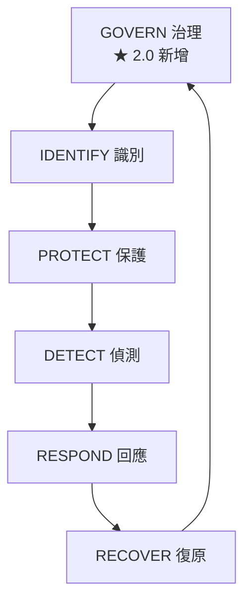

# NIST CSF 與 CIS Controls

> [!abstract] 這篇你會學到
> - 掌握 **NIST CSF 2.0 的六大功能**（含新增的 Govern）
> - 認識 **CIS Controls v8.1 的 18 項控制**與**實作分組 IG1/IG2/IG3**
> - 知道**為什麼「先做 IG1」是最務實的起點**
> - 分辨 **CIS Controls（做什麼）與 CIS Benchmark（怎麼設定）**
> - 用框架**盤點自家的成熟度**（附評估表）
> - **把框架的每一項對應到本手冊的具體章節**

> [!tip] 三個框架的分工
> | 框架 | 回答什麼 | 適合 |
> | --- | --- | --- |
> | **ISO 27001** | **「我要怎麼管理」** | 建立制度、要驗證 |
> | **NIST CSF** | **「我的能力有哪些缺口」** | 溝通、評估成熟度 |
> | **CIS Controls** | **「我明天該做什麼」** | **實際執行** ← 最具體 |
>
> **它們不衝突，而是互補。**
> 實務上常見的組合：
> **用 ISO 27001 建制度、用 NIST CSF 對高層溝通、用 CIS Controls 排工作。**

## 前置知識

- [[01-資安基本原則與實踐]] — 資安原則
- [[05-ISO27001與ISMS]] — 管理制度的框架

---

## NIST CSF 2.0

### 六大功能



| 功能 | 縮寫 | 核心問題 | 對應本手冊 |
| --- | --- | --- | --- |
| **GOVERN 治理** ★ | GV | **誰負責？政策是什麼？風險胃納多大？** | [[10-資安政策文件與制度]]、[[05-ISO27001與ISMS]] |
| **IDENTIFY 識別** | ID | **我們有什麼？面臨什麼風險？** | [[03-弱點與修補管理流程]]（資產清單） |
| **PROTECT 保護** | PR | **怎麼防止事件發生？** | [[00-資安防護設備-索引]] 大部分 |
| **DETECT 偵測** | DE | **怎麼知道發生了？** | [[09-日誌集中與SIEM]]、[[03-入侵偵測與防禦IDS-IPS]] |
| **RESPOND 回應** | RS | **發生了要怎麼處理？** | [[04-資安事件應變流程]] |
| **RECOVER 復原** | RC | **怎麼恢復正常？** | [[14-備份與抗勒索防護]] |

> [!danger] 2.0 版新增 GOVERN 是重大改變
> **為什麼要新增？**
>
> 因為實務上發現：**技術做得再好，沒有治理就無法持續**。
>
> GOVERN 涵蓋：
> - **組織的資安策略與風險胃納**
> - **角色、責任與職權**（誰負責？誰核准？）
> - **政策**
> - **監督**（管理階層怎麼知道做得好不好）
> - **供應鏈風險管理**
>
> **它反映了一個事實：資安失敗多半不是技術問題，是治理問題。**

> [!tip] 多數組織的能力分布是「頭重腳輕」
> ```
> IDENTIFY  ██░░░░░░░░  資產清單不完整
> PROTECT   ████████░░  買了很多設備 ← 大家都在這裡
> DETECT    ██░░░░░░░░  沒有日誌、沒人看告警
> RESPOND   █░░░░░░░░░  沒有應變手冊、沒演練過
> RECOVER   ███░░░░░░░  有備份但沒演練過還原
> GOVERN    ██░░░░░░░░  「資安是資訊室的事」
> ```
>
> **這正是 NIST CSF 最大的價值** ——
> 它讓你**看到自己偏食了**。
>
> **投資報酬率最高的通常不是再多買一個 PROTECT 的設備，
> 而是補上 DETECT 與 RESPOND 的空白。**

### CSF 的三個層次

| 層次 | 是什麼 |
| --- | --- |
| **Core（核心）** | 六大功能 → 類別 → 子類別（具體成果） |
| **Tiers（層級）** | **成熟度**：1 部分的 / 2 風險知情 / 3 可重複 / 4 調適的 |
| **Profiles（剖繪）** | **現況剖繪** vs **目標剖繪** → 差距就是工作清單 |

> [!tip] Profile 的用法：現況 → 目標 → 差距
> ```
> ① 畫出【現況剖繪】：我們現在每個子類別做到什麼程度？
> ② 畫出【目標剖繪】：考量業務需求與法規，我們該做到什麼程度？
> ③ 【差距 = 改善計畫】
> ④ 依風險與成本排優先序
> ```
>
> **這比「照著清單全部做一遍」務實得多** ——
> 因為不是每個組織都需要做到最高層級。

---

## CIS Controls v8.1

> [!tip] CIS Controls 最大的價值：告訴你「先做什麼」
> **NIST CSF 告訴你「有哪些面向」，
> CIS Controls 告訴你「照這個順序做」。**
>
> 它的 18 項控制**是按優先順序排列的** ——
> **前 6 項就是所謂的「基本網路防護（Basic Cyber Hygiene）」**。

### 18 項控制

| # | 控制 | 一句話 | 對應本手冊 |
| --- | --- | --- | --- |
| **1** | **企業資產盤點與控制** | **你有什麼設備？** | [[03-弱點與修補管理流程]] |
| **2** | **軟體資產盤點與控制** | **裝了什麼軟體？** | [[02-基準設定與範本化]] |
| **3** | **資料保護** | 資料分級、加密、DLP | [[08-資料防護DLP與加密]] |
| **4** | **企業資產與軟體的安全組態** | 加固設定 | [[08-系統強化與稽核]]、[[00-TWGCB-索引]] |
| **5** | **帳號管理** | 帳號生命週期 | [[02-密碼與帳號管理實務]] |
| **6** | **存取控制管理** | 最小權限、**MFA** | [[07-身分存取管理IAM與MFA]] |
| **7** | **持續弱點管理** | 掃描與修補 | [[03-弱點與修補管理流程]] |
| **8** | **稽核日誌管理** | 收集與保存日誌 | [[09-日誌集中與SIEM]] |
| **9** | **電子郵件與瀏覽器防護** | SEG、SWG、DNS 過濾 | [[06-郵件與網頁閘道防護]] |
| **10** | **惡意程式防護** | AV / EDR | [[05-端點防護AV-EDR-XDR]] |
| **11** | **資料復原** | **備份與還原演練** | [[14-備份與抗勒索防護]] |
| **12** | **網路基礎設施管理** | 網路設備的安全管理 | [[00-網路設備-索引]] |
| **13** | **網路監控與防禦** | IDS/IPS、網路分段 | [[03-入侵偵測與防禦IDS-IPS]]、[[12-零信任架構與微分段]] |
| **14** | **資安意識與技能訓練** | 教育訓練 | [[12-資安意識與社交工程防範]] |
| **15** | **服務供應商管理** | 委外與供應鏈 | [[11-委外與供應鏈資安]] |
| **16** | **應用軟體安全** | 安全開發 | [[09-應用層安全]] |
| **17** | **事件回應管理** | 應變流程 | [[04-資安事件應變流程]] |
| **18** | **滲透測試** | 驗證防護是否有效 | [[10-弱點管理與滲透測試工具]] |

> [!danger] 注意第 1、2 項排在最前面
> **不是因為它們最「酷」，而是因為**
> **後面所有的控制都需要它們當基礎**：
> - 不知道有哪些設備 → 修補管理是假的
> - 不知道裝了什麼軟體 → 弱點管理是假的
> - 不知道資產在哪 → 事件應變時找不到
>
> **CIS 把它們排在第 1、2 位，是有道理的。**

### 實作分組（IG）

> [!tip] IG 是 CIS Controls 最實用的設計
> 它把 **153 個「防護措施（Safeguards）」**分成三組，
> **讓資源有限的組織知道「先做哪些」**。

| 分組 | 適用對象 | 措施數 | 說明 |
| --- | --- | --- | --- |
| **IG1** | **小型組織、無專職資安人員** | **約 56 項** | **基本網路防護** —— 每個組織都該做 |
| **IG2** | 中型組織、有資安人員 | 約 130 項（含 IG1） | 處理較敏感的資料 |
| **IG3** | 大型組織、有資安團隊 | 153 項（全部） | 高度受規範或高價值目標 |

> [!danger] IG1 是「最低標準」，不是「入門選項」
> **CIS 明確定義 IG1 為「基本網路防護（Essential Cyber Hygiene）」** ——
> 意思是：**任何組織，無論多小，都應該做到 IG1**。
>
> **CIS 的研究指出，落實 IG1 就能防禦相當高比例的常見攻擊手法。**
>
> **對台灣的中小型機關，這是最務實的目標**：
> - 不用先花錢買 SIEM
> - 不用先做 ISO 27001 驗證
> - **先把 56 項基本措施做完**

### IG1 的核心項目（節選）

> [!tip] 這些就是「基本功」
> ```
> 【資產】
> · 建立並維護企業資產清單（1.1）
> · 建立並維護軟體清單（2.1）
> · 【確保軟體仍在支援期內】（2.2）← EOL 檢查
> · 【移除未授權的軟體】（2.3）
>
> 【資料】
> · 建立資料管理流程（3.1）
> · 建立資料清單（3.2）
> · 【設定資料存取控制清單】（3.3）
> · 【安全處置資料】（3.5）← 報廢時的資料銷毀
> · 【加密終端裝置的資料】（3.6）← BitLocker/LUKS
>
> 【組態】
> · 建立安全組態流程（4.1、4.2）
> · 【設定自動螢幕鎖定】（4.3）
> · 【在終端上啟用防火牆】（4.4、4.5）
> · 【管理預設帳號】（4.7）← 改預設密碼
> · 【解除安裝不必要的服務】（4.8）
>
> 【帳號與存取】
> · 建立並維護帳號清單（5.1）
> · 【使用唯一密碼】（5.2）
> · 【停用停用中的帳號】（5.3）← 離職帳號
> · 【限制管理員權限給專用帳號】（5.4）
> · 建立授權流程（6.1、6.2）
> · 【對所有可從外部存取的應用啟用 MFA】（6.3）★
> · 【對所有管理員存取啟用 MFA】（6.5）★
>
> 【弱點】
> · 建立弱點管理流程（7.1）
> · 【自動化作業系統修補】（7.3）
> · 【自動化應用程式修補】（7.4）
>
> 【日誌】
> · 建立稽核日誌管理流程（8.1）
> · 【收集稽核日誌】（8.2）
> · 【確保有足夠的日誌儲存空間】（8.3）
>
> 【郵件與瀏覽器】
> · 【只使用完全受支援的瀏覽器與郵件用戶端】（9.1）
> · 【使用 DNS 過濾服務】（9.2）★ 成本極低效果好
>
> 【惡意程式】
> · 【部署並維護防惡意程式軟體】（10.1）
> · 【設定自動更新特徵碼】（10.2）
> · 【停用抽取式媒體的自動執行】（10.3）
>
> 【備份】
> · 建立資料復原流程（11.1）
> · 【執行自動化備份】（11.2）★
> · 【保護復原資料】（11.3）← 加密、限制存取
> · 【建立隔離的復原資料副本】（11.4）★★ 抗勒索
> · 【測試資料復原】（11.5）★★ 還原演練
>
> 【網路】
> · 【確保網路基礎設施保持在最新狀態】（12.1）
>
> 【教育】
> · 建立資安意識訓練計畫（14.1）
> · 【訓練辨識社交工程攻擊】（14.2）
> · 訓練認識密碼最佳實務（14.3）
> · 【訓練辨識與通報資安事件】（14.6）★
>
> 【供應商】
> · 【建立服務供應商清單】（15.1）
>
> 【事件應變】
> · 【指定事件處理人員】（17.1）★
> · 【建立並維護事件通報聯絡資訊】（17.2）★
> · 【建立事件通報流程】（17.3）★
> ```

> [!warning] 注意 IG1 中有大量「建立清單」與「建立流程」
> **它們不需要花錢，只需要花時間。**
>
> 而且**它們是所有後續工作的前提**。

### CIS Controls vs CIS Benchmark

> [!danger] 這兩個常被搞混
> | | **CIS Controls** | **CIS Benchmark** |
> | --- | --- | --- |
> | 回答 | **「該做什麼」** | **「怎麼設定」** |
> | 層次 | 組織層級的管理措施 | **特定產品的組態設定** |
> | 數量 | 18 項控制 / 153 措施 | **上百份，每個產品一份** |
> | 例子 | 「4. 安全組態」 | 「Ubuntu 24.04 LTS Benchmark v1.0」 |
> | 內容 | 「應建立安全組態流程」 | 「`net.ipv4.ip_forward` 應設為 0」 |
>
> **關係**：
> ```
> CIS Control 4「安全組態」
>   → 實作時參考 → CIS Benchmark for Ubuntu / Windows / nginx / MySQL...
> ```
>
> **台灣的 TWGCB 政府組態基準，性質上就相當於 CIS Benchmark**
> （見 [[00-TWGCB-索引]]）。

```bash
# ===== 用 OpenSCAP 檢查 CIS Benchmark 符合性 =====
$ sudo apt install -y openscap-scanner ssg-debderived

# 列出可用的設定檔
$ oscap info /usr/share/xml/scap/ssg/content/ssg-ubuntu2404-ds.xml

# 執行 CIS Level 1 Server 檢查
$ sudo oscap xccdf eval \
    --profile xccdf_org.ssgproject.content_profile_cis_level1_server \
    --results /tmp/cis-results.xml \
    --report /tmp/cis-report.html \
    /usr/share/xml/scap/ssg/content/ssg-ubuntu2404-ds.xml

# 產生的 HTML 報告會列出每一項的通過/失敗與修正方式
$ firefox /tmp/cis-report.html
```

> [!info]- Rocky / AlmaLinux（RHEL 系）對照
> ```bash
> $ sudo dnf install -y openscap-scanner scap-security-guide
> $ sudo oscap xccdf eval \
>     --profile cis \
>     --results /tmp/cis-results.xml \
>     --report /tmp/cis-report.html \
>     /usr/share/xml/scap/ssg/content/ssg-rl9-ds.xml
>
> # 產生修正腳本（★ 務必先在測試機驗證）
> $ sudo oscap xccdf generate fix \
>     --profile cis \
>     --fix-type bash \
>     /tmp/cis-results.xml > /tmp/cis-remediate.sh
> ```

> [!danger] 不要直接把 Benchmark 全套用到正式環境
> **CIS Benchmark 的某些項目會讓服務壞掉**，例如：
> - 停用某些必要的核心模組
> - 過於嚴格的檔案權限
> - 停用某些網路功能
>
> **正確做法**：
> 1. **先在測試機上全套用，找出會壞掉的項目**
> 2. 對每個「不採用」的項目**記錄理由與補償措施**
> 3. 做成**你自己的組態基準**
> 4. 用組態管理工具**統一部署與稽核**
>
> 見 [[02-基準設定與範本化]]。

---

## 完整實戰範例

### 成熟度自我評估表

> [!tip] 用這張表跟主管溝通「我們的缺口在哪」

```
═══════════════════════════════════════════════════════════
 NIST CSF 2.0 成熟度自評
 評分：0=未做  1=零星  2=有流程  3=有紀錄且定期執行  4=有量測與改善
═══════════════════════════════════════════════════════════

【GOVERN 治理】                                      現況 → 目標
  GV.OC 組織全景（了解使命與利害關係人）              [ ] → [ ]
  GV.RM 風險管理策略（風險胃納已定義）                [ ] → [ ]
  GV.RR 角色、責任與職權（★誰負責、誰核准）           [ ] → [ ]
  GV.PO 政策（已訂定並定期審查）                      [ ] → [ ]
  GV.OV 監督（管理階層知道成效）                      [ ] → [ ]
  GV.SC 供應鏈風險管理                                [ ] → [ ]

【IDENTIFY 識別】
  ID.AM 資產管理（★資產清單完整且維護）               [ ] → [ ]
  ID.RA 風險評鑑（定期執行且有紀錄）                  [ ] → [ ]
  ID.IM 改進（從演練與事件中學習）                    [ ] → [ ]

【PROTECT 保護】
  PR.AA 身分、鑑別與存取控制（★MFA、最小權限）        [ ] → [ ]
  PR.AT 認知與訓練（★定期教育訓練）                   [ ] → [ ]
  PR.DS 資料安全（分級、加密）                        [ ] → [ ]
  PR.PS 平台安全（★修補、加固、組態）                 [ ] → [ ]
  PR.IR 技術基礎設施韌性（備援、分段）                [ ] → [ ]

【DETECT 偵測】
  DE.CM 持續監控（★日誌、EDR、網路監控）              [ ] → [ ]
  DE.AE 不良事件分析（★有人在看告警並判讀）           [ ] → [ ]

【RESPOND 回應】
  RS.MA 事件管理（★有應變流程且演練過）               [ ] → [ ]
  RS.AN 事件分析（有能力調查）                        [ ] → [ ]
  RS.CO 事件回應報告與溝通（★通報流程與時限）         [ ] → [ ]
  RS.MI 事件緩解（有能力圍堵）                        [ ] → [ ]

【RECOVER 復原】
  RC.RP 事件復原計畫執行（★備份 + 還原演練）          [ ] → [ ]
  RC.CO 事件復原溝通                                  [ ] → [ ]

═══════════════════════════════════════════════════════════
 總分：現況 ___ / 88    目標 ___ / 88
 【最大的三個差距】：
   1. ________________________________
   2. ________________________________
   3. ________________________________
═══════════════════════════════════════════════════════════
```

### CIS IG1 檢核腳本（Linux）

```bash
#!/usr/bin/env bash
# CIS Controls IG1 部分項目的自動檢查（Linux 主機層面）
set -uo pipefail
PASS=0; FAIL=0; NA=0

chk() {
  local id="$1" desc="$2" cmd="$3"
  if eval "$cmd" >/dev/null 2>&1; then
    printf "  ✓ [%-5s] %s\n" "$id" "$desc"; PASS=$((PASS+1))
  else
    printf "  ✗ [%-5s] %s\n" "$id" "$desc"; FAIL=$((FAIL+1))
  fi
}

echo "═══════════════════════════════════════════════"
echo " CIS Controls IG1 檢核 — $(hostname) $(date '+%F')"
echo "═══════════════════════════════════════════════"

echo -e "\n【控制 2：軟體資產】"
chk "2.2" "作業系統仍在支援期內" \
    "! (. /etc/os-release && [ \"\$VERSION_ID\" \\< \"22.04\" ])"
chk "2.3" "未安裝已淘汰的服務（telnet/rsh/ftp）" \
    "! dpkg -l 2>/dev/null | grep -qE '^ii\s+(telnetd|rsh-server|vsftpd|tftpd-hpa)'"

echo -e "\n【控制 3：資料保護】"
chk "3.6" "根分割區已加密（LUKS）" \
    "lsblk -f 2>/dev/null | grep -q crypto_LUKS"
chk "3.11" "有安裝加密工具" "command -v cryptsetup"

echo -e "\n【控制 4：安全組態】"
chk "4.4" "主機防火牆已啟用" \
    "(ufw status 2>/dev/null | grep -q 'Status: active') || \
     (nft list ruleset 2>/dev/null | grep -q 'hook input')"
chk "4.7" "沒有空密碼帳號" \
    "! awk -F: '\$2==\"\"' /etc/shadow 2>/dev/null | grep -q ."
chk "4.8" "沒有不必要的服務監聽在 0.0.0.0" \
    "[ \$(ss -tlnH 2>/dev/null | grep -c '0\.0\.0\.0:') -le 3 ]"
chk "4.x" "SSH 禁止 root 登入" \
    "sshd -T 2>/dev/null | grep -q '^permitrootlogin no'"
chk "4.x" "SSH 禁止密碼認證" \
    "sshd -T 2>/dev/null | grep -q '^passwordauthentication no'"

echo -e "\n【控制 5：帳號管理】"
chk "5.1" "只有一個 UID 0 帳號" \
    "[ \$(awk -F: '\$3==0' /etc/passwd | wc -l) -eq 1 ]"
chk "5.3" "沒有 90 天以上未登入且仍啟用的帳號" \
    "[ \$(lastlog -b 90 2>/dev/null | grep -v 'Never\|Username' | wc -l) -eq 0 ]"
chk "5.4" "sudo 群組成員數合理（< 5）" \
    "[ \$(getent group sudo 2>/dev/null | cut -d: -f4 | tr ',' '\n' | grep -c .) -lt 5 ]"

echo -e "\n【控制 6：存取控制】"
chk "6.5" "SSH 已設定金鑰或多因素認證" \
    "sshd -T 2>/dev/null | grep -qE '^(pubkeyauthentication yes|authenticationmethods.*keyboard-interactive)'"

echo -e "\n【控制 7：弱點管理】"
chk "7.3" "已啟用自動安全性更新" \
    "systemctl is-enabled --quiet unattended-upgrades 2>/dev/null || \
     systemctl is-enabled --quiet dnf-automatic.timer 2>/dev/null"
chk "7.x" "無待安裝的安全性更新" \
    "[ \$(apt list --upgradable 2>/dev/null | grep -c -- '-security') -eq 0 ]"
chk "7.x" "不需要重新開機" "[ ! -f /var/run/reboot-required ]"

echo -e "\n【控制 8：日誌】"
chk "8.2" "系統日誌服務執行中" \
    "systemctl is-active --quiet rsyslog || systemctl is-active --quiet systemd-journald"
chk "8.x" "日誌有轉送到遠端主機" \
    "grep -rq '^\*\.\*\s*@' /etc/rsyslog.conf /etc/rsyslog.d/ 2>/dev/null"
chk "8.3" "/var/log 使用率低於 80%" \
    "[ \$(df /var/log | awk 'NR==2{print int(\$5)}') -lt 80 ]"
chk "8.x" "時間已與 NTP 同步" \
    "timedatectl show -p NTPSynchronized --value 2>/dev/null | grep -q yes"

echo -e "\n【控制 10：惡意程式防護】"
chk "10.1" "有安裝防護或偵測工具" \
    "command -v clamscan || command -v aide || systemctl is-active --quiet wazuh-agent"

echo -e "\n【控制 11：資料復原】"
chk "11.2" "有備份排程（cron 或 timer）" \
    "(crontab -l 2>/dev/null | grep -qi backup) || \
     (systemctl list-timers --all 2>/dev/null | grep -qi backup)"

echo -e "\n【控制 12：網路基礎設施】"
chk "12.x" "IP 轉送已停用（非路由器時）" \
    "[ \$(sysctl -n net.ipv4.ip_forward) -eq 0 ]"

echo -e "\n═══════════════════════════════════════════════"
printf " 通過：%d   未通過：%d   通過率：%d%%\n" \
       "$PASS" "$FAIL" "$((PASS * 100 / (PASS + FAIL)))"
echo "═══════════════════════════════════════════════"
echo ""
echo "註：本腳本僅檢查「主機層面」的部分 IG1 項目。"
echo "    完整的 IG1 還包含資產清單、教育訓練、事件應變等"
echo "    組織層面的措施，需另外評估。"
```

### 框架對照表（給稽核用）

> [!tip] 一次做，多處用
> 很多組織同時要應付多個框架的要求。
> **建立一張對照表，一項措施同時滿足多個框架。**

| 措施 | CIS | NIST CSF | ISO 27001 | 資安法 | 本手冊 |
| --- | --- | --- | --- | --- | --- |
| **資產清單** | 1.1, 2.1 | ID.AM | A.5.9 | 資產盤點 | [[03-弱點與修補管理流程]] |
| **MFA** | 6.3, 6.5 | PR.AA | A.8.5 | 存取控制 | [[07-身分存取管理IAM與MFA]] |
| **自動修補** | 7.3, 7.4 | PR.PS | A.8.8 | 漏洞管理 | [[03-弱點與修補管理流程]] |
| **日誌收集** | 8.2 | DE.CM | A.8.15 | **日誌保存 6 個月** | [[09-日誌集中與SIEM]] |
| **備份 + 演練** | 11.2, 11.5 | RC.RP | A.8.13 | 營運持續 | [[14-備份與抗勒索防護]] |
| **隔離的備份副本** | 11.4 | RC.RP | A.8.13 | — | [[14-備份與抗勒索防護]] |
| **教育訓練** | 14.1-14.6 | PR.AT | A.6.3 | **年度時數要求** | [[12-資安意識與社交工程防範]] |
| **事件應變** | 17.1-17.4 | RS.MA | A.5.24-5.28 | **通報時限** | [[04-資安事件應變流程]] |
| **供應商管理** | 15.1 | GV.SC | A.5.19-5.23 | 委外管理 | [[11-委外與供應鏈資安]] |
| **弱點掃描** | 7.5, 7.6 | ID.RA | A.8.8 | 定期檢測 | [[10-弱點管理與滲透測試工具]] |
| **滲透測試** | 18.1-18.5 | ID.RA | A.8.8 | **依責任等級** | [[10-弱點管理與滲透測試工具]] |
| **安全組態** | 4.1-4.12 | PR.PS | A.8.9 | **TWGCB** | [[00-TWGCB-索引]] |
| **DNS 過濾** | 9.2 | PR.IR | A.8.23 | — | [[06-郵件與網頁閘道防護]] |
| **網路分段** | 12.2 | PR.IR | A.8.22 | 網路區隔 | [[12-零信任架構與微分段]] |

---

## 常見錯誤與排錯

| 現象／錯誤 | 原因 | 解法 |
| --- | --- | --- |
| **框架讀完了但不知道從哪開始** | NIST CSF 太抽象 | **用 CIS Controls IG1** 當作行動清單 |
| 想一次做完 153 項措施 | 沒有分階段 | **先做 IG1（56 項）**，再考慮 IG2 |
| **買了一堆 PROTECT 的設備，還是被入侵** | **DETECT 與 RESPOND 是空的** | 用 CSF 六大功能自評，補最弱的那一塊 |
| CIS Controls 與 CIS Benchmark 搞混 | 名稱相似 | **Controls = 做什麼；Benchmark = 怎麼設定** |
| **套用 CIS Benchmark 後服務壞掉** | 直接全套用到正式環境 | **先在測試機驗證**；做成自己的基準；記錄不採用的理由 |
| 同時應付多個框架，重複做工 | 沒有對照 | **建立框架對照表**，一項措施滿足多個要求 |
| 成熟度評分太主觀 | 沒有評分標準 | 用具體標準（0 未做 / 2 有流程 / **3 有紀錄且定期執行**） |
| 評了成熟度但沒有後續 | 沒有轉成行動 | **現況 vs 目標的差距就是改善計畫** |
| **資產清單永遠不完整** | 沒有維護機制 | **新機建置流程納入登記**；定期自動探測比對 |
| 「建立流程」的項目一直沒做 | 覺得不緊急 | **它們不用花錢，而且是後續工作的前提** |
| 只做技術面，GOVERN 是空的 | 認為資安是技術問題 | **2.0 新增 GOVERN 正是因為治理才是關鍵** |

---

## 安全性注意事項

> [!danger] 框架是地圖，不是目的地
> **常見的誤區**：
> - 「我們符合 CIS IG1 了，所以我們安全了」
> - 「我們通過 ISO 27001 了，所以不用擔心」
>
> **框架的作用是**：
> - **確保你沒有遺漏重要的面向**
> - **提供共同語言**（跟主管、稽核、廠商溝通）
> - **提供優先順序的參考**
>
> **但攻擊者不會照著框架攻擊你。**
> 你仍然需要：
> - 了解**你自己的**威脅情境
> - **實際驗證**防護是否有效（滲透測試、紅隊）
> - **持續改善**

> [!warning] 不要為了「湊分數」而做
> **反面案例**：
> ```
> CIS 4.3「設定自動螢幕鎖定」
>   → 設成 15 分鐘，✓ 打勾
>     → 但使用者覺得麻煩，全部去設定裡改掉了
>       → 【分數有了，實際沒有保護】
> ```
>
> **檢核的重點應該是「實際狀態」而非「有沒有設定」**：
> - 用 GPO 強制（使用者改不掉）
> - **實際抽查**幾台機器
> - 監控合規狀態

> [!tip] 給資源有限的機關的具體建議
> **如果你只有一個人、沒有預算**，照這個順序做：
>
> **【第 1 個月】不用花錢的**
> 1. **建立資產清單**（CIS 1.1、2.1）
> 2. **確認軟體都在支援期內**（2.2）
> 3. **移除不必要的軟體與服務**（2.3、4.8）
> 4. **改掉所有預設密碼**（4.7）
> 5. **停用離職帳號**（5.3）
> 6. **啟用自動修補**（7.3、7.4）
> 7. **啟用終端防火牆與螢幕鎖定**（4.3、4.4）
>
> **【第 2～3 個月】仍然不用花錢**
> 8. **對所有可從外部存取的服務啟用 MFA**（6.3）★ 最重要
> 9. **管理員帳號啟用 MFA**（6.5）
> 10. **啟用全磁碟加密**（3.6）
> 11. **設定 DNS 過濾**（9.2，有免費方案）
> 12. **確認防惡意程式軟體有在更新**（10.1、10.2）
> 13. **指定事件處理人員與聯絡清單**（17.1、17.2）
>
> **【第 4～6 個月】開始需要一點資源**
> 14. **建立自動化備份**（11.2）
> 15. **建立隔離／不可變的備份副本**（11.4）★
> 16. **測試資料復原**（11.5）★★
> 17. **收集日誌到集中主機**（8.2，rsyslog 免費）
> 18. **辦理資安意識訓練**（14.1～14.6）
>
> **做完這 18 項，你已經超越了大多數同規模的組織。**

---

## 速查表

### 三個框架的分工

```
ISO 27001    → 我要【怎麼管理】（制度、驗證）
NIST CSF     → 我的【能力缺口】在哪（溝通、評估）
CIS Controls → 我【明天該做什麼】（執行）★ 最具體
```

### NIST CSF 2.0 六大功能

```
GOVERN   治理  ★2.0 新增  誰負責？政策？風險胃納？
IDENTIFY 識別  我們有什麼？面臨什麼風險？
PROTECT  保護  怎麼防止發生？          ← 大家都在這裡
DETECT   偵測  怎麼知道發生了？        ← 通常最弱
RESPOND  回應  發生了怎麼處理？        ← 通常最弱
RECOVER  復原  怎麼恢復正常？
```

### CIS Controls 18 項（依優先順序）

```
1 企業資產盤點   2 軟體資產盤點   3 資料保護
4 安全組態       5 帳號管理       6 存取控制（MFA）
                 ↑ 前 6 項 = 基本網路防護
7 弱點管理       8 稽核日誌       9 郵件與瀏覽器防護
10 惡意程式防護  11 資料復原      12 網路基礎設施
13 網路監控防禦  14 資安意識訓練  15 服務供應商管理
16 應用軟體安全  17 事件回應      18 滲透測試
```

### 實作分組

| 分組 | 對象 | 措施數 |
| --- | --- | --- |
| **IG1** | **小型、無專職資安** | **約 56 項 = 基本網路防護** |
| IG2 | 中型、有資安人員 | 約 130 項 |
| IG3 | 大型、有資安團隊 | 153 項 |

**IG1 是「最低標準」，不是「入門選項」。**

### Controls vs Benchmark

```
CIS Controls  = 【該做什麼】（18 項組織層級控制）
CIS Benchmark = 【怎麼設定】（每個產品一份組態基準）
台灣的 TWGCB 相當於 CIS Benchmark
```

### OpenSCAP 檢查

```bash
sudo oscap xccdf eval \
  --profile xccdf_org.ssgproject.content_profile_cis_level1_server \
  --report /tmp/cis-report.html \
  /usr/share/xml/scap/ssg/content/ssg-ubuntu2404-ds.xml
# ★ 不要直接全套用到正式環境
```

### 成熟度評分標準

```
0 未做  1 零星  2 有流程  【3 有紀錄且定期執行】  4 有量測與改善
現況剖繪 vs 目標剖繪 → 【差距 = 改善計畫】
```

### 一個人、沒預算的 18 步

```
【1 個月】資產清單 · 確認支援期 · 移除不必要軟體 ·
          改預設密碼 · 停用離職帳號 · 自動修補 · 防火牆+螢幕鎖
【2-3 月】★外部服務 MFA · 管理員 MFA · 全磁碟加密 ·
          DNS 過濾 · 防毒更新 · 事件聯絡清單
【4-6 月】自動備份 · ★隔離備份副本 · ★★還原演練 ·
          日誌集中 · 資安意識訓練
```

---

## 練習題

> [!question]- 練習 1：畫出你的 CSF 剖繪
> 用本篇的自評表，對六大功能的每個類別打分（0～4）：
> 1. **哪一個功能分數最低？**
> 2. **PROTECT 與 DETECT 的分數差多少？**
>    （多數組織 PROTECT 遠高於 DETECT）
> 3. **GOVERN 的分數如何？**（「誰負責」有明確答案嗎？）
> 4. 訂出目標剖繪（不用每項都 4 分）
> 5. **最大的三個差距是什麼？**
>
> 把這張圖拿給主管看 ——
> **「我們在保護上投資了很多，但完全沒有偵測能力」
> 比「我要買 SIEM」有說服力得多。**

> [!question]- 練習 2：跑一次 IG1 檢核
> 1. 在一台伺服器上執行本篇的檢核腳本
> 2. **通過率是多少？**
> 3. 未通過的項目中，**哪些是「不用花錢就能修」的？**
> 4. 挑三項最容易的立刻修掉
> 5. **再跑一次，看通過率有沒有提升**
>
> 然後思考：
> - 腳本只檢查了「主機層面」，
>   **組織層面的 IG1 項目（資產清單、教育訓練、事件應變）呢？**

> [!question]- 練習 3：建立你的框架對照表
> 列出你組織需要應付的所有要求：
> 1. 資安法的責任等級要求？
> 2. TWGCB？
> 3. 上級機關的規定？
> 4. ISO 27001（如果有驗證）？
> 5. 客戶的資安問卷？
>
> 然後：
> - **找出重複的要求**（例如「日誌保存」可能出現在四個地方）
> - **一項措施同時滿足多個框架**
> - **哪些是「只有一個框架要求」但成本很高的？**
>   （這些要重新評估必要性）
>
> **這張表能大幅減少重複做工。**

---

## 小測驗

Q1. ISO 27001、NIST CSF、CIS Controls **各自回答什麼問題**？實務上怎麼組合使用？

Q2. NIST CSF 2.0 的六大功能是什麼？**新增的是哪一個，為什麼要新增**？

Q3. **為什麼說多數組織的能力分布是「頭重腳輕」**？這對投資決策有什麼意義？

Q4. NIST CSF 的 Profile 怎麼用？**為什麼它比「照清單全做一遍」務實**？

Q5. **CIS Controls 的 18 項為什麼把「資產盤點」與「軟體盤點」排在第 1、2 位**？

Q6. **什麼是實作分組（IG）？為什麼說「IG1 是最低標準而不是入門選項」**？

Q7. **CIS Controls 與 CIS Benchmark 的差別是什麼**？台灣有對應的東西嗎？

Q8. **為什麼不能直接把 CIS Benchmark 全套用到正式環境**？正確做法是什麼？

Q9. IG1 中有大量「建立清單」與「建立流程」的項目，**它們有什麼共同特點**？

Q10. **框架的三個作用是什麼？為什麼「符合框架 ≠ 安全」**？

> [!question]- 測驗答案
> **Q1.** **ISO 27001** 回答「**我要怎麼管理**」（建立制度、可驗證）；
> **NIST CSF** 回答「**我的能力有哪些缺口**」（溝通、評估成熟度）；
> **CIS Controls** 回答「**我明天該做什麼**」（最具體的執行清單）。
> 實務組合：**用 ISO 27001 建制度、用 NIST CSF 對高層溝通、
> 用 CIS Controls 排工作。** 三者互補不衝突。
>
> **Q2.** **GOVERN（治理）**、IDENTIFY（識別）、PROTECT（保護）、
> DETECT（偵測）、RESPOND（回應）、RECOVER（復原）。
> **新增的是 GOVERN**。
> 要新增是因為實務上發現**技術做得再好，沒有治理就無法持續** ——
> GOVERN 涵蓋資安策略與風險胃納、**角色責任與職權**（誰負責、誰核准）、
> 政策、監督、供應鏈風險管理。
> **它反映了一個事實：資安失敗多半不是技術問題，是治理問題。**
>
> **Q3.** 因為多數組織**在 PROTECT 上投資很多**（買了一堆防護設備），
> 但 **DETECT（沒有日誌、沒人看告警）與 RESPOND
> （沒有應變手冊、沒演練過）幾乎是空的**，
> IDENTIFY（資產清單不完整）與 GOVERN（「資安是資訊室的事」）也很弱。
> 對投資決策的意義：**投資報酬率最高的通常不是再多買一個 PROTECT 的設備，
> 而是補上 DETECT 與 RESPOND 的空白** ——
> 因為防護一定會有失效的時候，那時你需要能發現與能處理。
>
> **Q4.** 用法：①畫出**現況剖繪**（現在每個子類別做到什麼程度）；
> ②畫出**目標剖繪**（考量業務需求與法規，該做到什麼程度）；
> ③**差距 = 改善計畫**；④依風險與成本排優先序。
> 比「照清單全做一遍」務實，是因為**不是每個組織都需要做到最高層級** ——
> 一個小型機關的測試系統不需要跟金融核心系統一樣的防護等級。
> Profile 讓你依**自己的**業務需求與風險決定目標，
> 而不是盲目追求滿分。
>
> **Q5.** 因為**後面所有的控制都需要它們當基礎**：
> 不知道有哪些設備 → **修補管理是假的**（總有機器沒被修到）；
> 不知道裝了什麼軟體 → **弱點管理是假的**；
> 不知道資產在哪 → **事件應變時找不到**。
> CIS 的 18 項控制**是按優先順序排列的**，
> 把資產與軟體盤點排在最前面是有道理的 ——
> 它們不花錢，但是一切的前提。
>
> **Q6.** **實作分組（IG）**把 153 個防護措施分成三組
> （IG1 約 56 項、IG2 約 130 項、IG3 全部 153 項），
> **讓資源有限的組織知道「先做哪些」**。
> **IG1 是最低標準而非入門選項**，是因為 **CIS 明確定義它為
> 「基本網路防護（Essential Cyber Hygiene）」** ——
> 意思是**任何組織，無論多小，都應該做到 IG1**；
> 而且 CIS 的研究指出**落實 IG1 就能防禦相當高比例的常見攻擊手法**。
> 對台灣的中小型機關，這是最務實的目標：
> 不用先買 SIEM、不用先做 ISO 驗證，先把 56 項基本措施做完。
>
> **Q7.** **CIS Controls 回答「該做什麼」** ——
> 18 項組織層級的管理措施（例如「4. 安全組態」，
> 內容是「應建立安全組態流程」）；
> **CIS Benchmark 回答「怎麼設定」** ——
> 上百份針對特定產品的組態基準
> （例如「Ubuntu 24.04 LTS Benchmark」，
> 內容具體到「`net.ipv4.ip_forward` 應設為 0」）。
> 關係是：實作 CIS Control 4 時，參考對應產品的 CIS Benchmark。
> **台灣的 TWGCB（政府組態基準）性質上就相當於 CIS Benchmark。**
>
> **Q8.** 因為 **CIS Benchmark 的某些項目會讓服務壞掉** ——
> 例如停用某些必要的核心模組、過於嚴格的檔案權限、
> 停用某些網路功能。
> **正確做法**：①**先在測試機上全套用，找出會壞掉的項目**；
> ②對每個「不採用」的項目**記錄理由與補償措施**；
> ③做成**你自己的組態基準**；
> ④用組態管理工具**統一部署與稽核**。
>
> **Q9.** 共同特點：**它們不需要花錢，只需要花時間**，
> **而且它們是所有後續工作的前提**。
> 例如「建立企業資產清單」「建立軟體清單」「建立帳號清單」
> 「建立弱點管理流程」「建立事件通報流程」
> 「指定事件處理人員」「建立聯絡資訊」——
> 沒有這些，後面買再多設備都無法有效運作。
> 這也是為什麼資源有限的組織應該**優先做這些**。
>
> **Q10.** 三個作用：①**確保你沒有遺漏重要的面向**；
> ②**提供共同語言**（跟主管、稽核、廠商溝通）；
> ③**提供優先順序的參考**。
> **「符合框架 ≠ 安全」**，因為**攻擊者不會照著框架攻擊你** ——
> 框架是地圖不是目的地。
> 你仍然需要：了解**你自己的**威脅情境、
> **實際驗證防護是否有效**（滲透測試、紅隊）、**持續改善**。
> 另一個陷阱是「為了湊分數而做」——
> 例如設了自動螢幕鎖定打了勾，但使用者全部自己改掉了，
> **分數有了，實際沒有保護**；
> 檢核的重點應該是「**實際狀態**」而非「有沒有設定」。

---

## 延伸閱讀

- [[05-ISO27001與ISMS]] — 管理制度的框架
- [[09-資安稽核與符合性檢核]] — 用框架做自我檢核
- [[00-TWGCB-索引]] — 台灣的組態基準（相當於 CIS Benchmark）
- [[08-系統強化與稽核]] — CIS Control 4 的技術實作
- [[02-基準設定與範本化]] — 建立自己的組態基準
- [[16-資安設備選型與導入實務]] — 用框架決定採購優先序
- [[01-資安基本原則與實踐]] — 框架背後的原則
