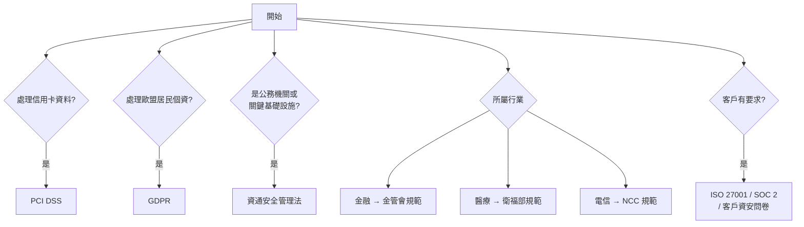

# 產業規範與國際法遵

> [!abstract] 這篇你會學到
> - **判斷你的組織適用哪些規範**（附決策樹）
> - 理解 **PCI DSS 的「範圍界定」為什麼是成敗關鍵**
> - 認識 **GDPR 的域外效力**與**跨境傳輸**的處理
> - 知道台灣各**目的事業主管機關**的行業規範
> - 學會**有效率地應對客戶的資安問卷與稽核**
> - 用**一次做、多處用**的方式減少重複工

> [!danger] 同樣的免責聲明
> **本篇是實務理解，不是法律意見。**
> 具體適用請諮詢法務或專業顧問；
> 規範版本會更新，請以官方最新版為準。

## 前置知識

- [[07-台灣資安法規與個資法]] — 台灣的基本法規
- [[05-ISO27001與ISMS]] — 管理制度框架
- [[06-NIST-CSF與CIS-Controls]] — 控制措施對照

---

## 觀念說明

### 你到底適用哪些規範？



> [!tip] 先做這個盤點
> ```
> □ 我們處理【信用卡】資料嗎？          → PCI DSS
> □ 我們有【歐盟】的使用者或客戶嗎？    → GDPR
> □ 我們是【公務機關或關鍵基礎設施】？  → 資安法
> □ 我們處理【醫療、金融】等特殊資料？  → 行業規範
> □ 我們的【客戶】有沒有要求？          → 契約 + 問卷
> □ 我們有【美國】客戶或上市計畫？      → SOC 2 / SOX
> □ 我們是【上市櫃公司】？              → 金管會的公司治理與資安要求
> □ 我們的【供應商】要求我們符合什麼？
> ```
>
> **每一項都要有明確的答案與依據，
> 而不是「應該不用吧」。**

---

## PCI DSS

> [!note] Payment Card Industry Data Security Standard
> **由五大國際卡組織**（Visa、Mastercard、Amex、Discover、JCB）
> 共同制定，**適用於任何儲存、處理或傳輸持卡人資料的組織**。
>
> **它不是法律，但是「契約義務」** ——
> 不符合可能導致罰款、提高手續費，甚至**被停止收單**。

### 十二項要求（v4.0 的六大目標）

| 目標 | 要求 |
| --- | --- |
| **建置與維護安全的網路與系統** | 1. 安裝並維護網路安全控制<br/>2. 對所有系統元件套用安全組態 |
| **保護帳戶資料** | 3. **保護儲存的帳戶資料**<br/>4. **傳輸時加密** |
| **維護弱點管理計畫** | 5. 防護惡意軟體<br/>6. 開發與維護安全的系統與軟體 |
| **實施強力的存取控制** | 7. **依業務需要限制存取**<br/>8. **識別使用者並驗證存取**<br/>9. **限制實體存取** |
| **定期監控與測試網路** | 10. **記錄並監控所有存取**<br/>11. **定期測試安全性** |
| **維護資訊安全政策** | 12. 支援資訊安全的組織政策與計畫 |

### 範圍界定：PCI DSS 的成敗關鍵

> [!danger] 這是 PCI DSS 最重要、也最花錢的一件事
> **CDE（Cardholder Data Environment，持卡人資料環境）**
> 涵蓋所有**儲存、處理、傳輸持卡人資料的系統**，
> **以及所有「連得到 CDE」的系統**。
>
> ```
> ❌ 範圍沒界定好：
>    整個公司網路都算 CDE
>      → 【每一台電腦都要符合 PCI DSS】
>        → 成本爆炸、根本做不完
>
> ✅ 範圍界定好：
>    只有 3 台伺服器 + 1 個網段是 CDE
>      → 【其他系統完全不受 PCI DSS 規範】
>        → 成本大幅降低
> ```

> [!tip] 縮小範圍的三個方法（依效果排序）
> **① 不要儲存持卡人資料** ← 最有效
> ```
> 使用【第三方支付閘道】（綠界、藍新、Stripe…）
>   → 卡號【從來沒進到你的系統】
>     → 你的範圍可能小到只剩「導向頁面」
> ```
> **這是中小型電商最務實的做法。**
>
> **② 網路分段（Segmentation）**
> ```
> 把 CDE 放在【完全隔離的網段】
>   → 只允許必要的連線進出
>     → 其他網段【不在範圍內】
>
> ★ 但要能【證明】分段是有效的（需要滲透測試驗證）
> ```
>
> **③ 代碼化（Tokenization）**
> ```
> 把真實卡號換成無意義的 Token
>   → 你的系統只存 Token
>     → 【Token 外洩沒有價值】
> ```

> [!danger] 絕對不能儲存的資料
> **PCI DSS 明確禁止在授權後儲存**：
> ```
> ❌【完整磁軌資料】（Track 1/Track 2）
> ❌【CVV / CVC / CID】（卡片背面的三或四位數）★ 最常違規
> ❌【PIN / PIN Block】
> ```
>
> **即使加密也不行 —— 是「完全不能存」。**
>
> **可以存但必須保護的**：
> - **PAN（主帳號，卡號）** → 必須**無法讀取**
>   （單向雜湊、截斷、Token、強加密）
> - 持卡人姓名、到期日、服務代碼 → 儲存時須保護
>
> **顯示 PAN 時的規定**：
> **最多只能顯示前 6 碼與後 4 碼**
> （`411111******1111`）——
> 除非有明確的業務需要且經授權。

```bash
# ===== 檢查你的系統有沒有意外儲存卡號 =====
#!/usr/bin/env bash
# ⚠ 只在你有權限的系統上執行
# ⚠ 本腳本只回報「位置與筆數」，不輸出實際內容

TARGET="${1:-/var/log /var/www}"

echo "掃描可能的信用卡號（Luhn 驗證前的初篩）…"

# 主要卡別的格式
# Visa: 4xxx (13/16位)  MC: 5[1-5]xx (16位)  Amex: 3[47]xx (15位)
# JCB: 35xx (16位)      Discover: 6011/65xx (16位)
grep -rlEn '\b(4[0-9]{12}(?:[0-9]{3})?|5[1-5][0-9]{14}|3[47][0-9]{13}|3(?:0[0-5]|[68][0-9])[0-9]{11}|6(?:011|5[0-9]{2})[0-9]{12}|(?:2131|1800|35[0-9]{3})[0-9]{11})\b' \
  $TARGET 2>/dev/null | while read -r f; do
    n=$(grep -oE '\b[0-9]{13,16}\b' "$f" 2>/dev/null | wc -l)
    echo "  ⚠ $f （$n 個候選）"
  done

echo ""
echo "★ 命中不代表一定是卡號，需以 Luhn 演算法驗證"
echo "★ 特別注意：日誌檔中出現卡號 = 嚴重違規"
```

```python
#!/usr/bin/env python3
"""Luhn 演算法驗證 —— 降低誤判"""
def luhn_valid(num: str) -> bool:
    digits = [int(d) for d in num if d.isdigit()]
    if len(digits) < 13 or len(digits) > 19:
        return False
    checksum, parity = 0, len(digits) % 2
    for i, d in enumerate(digits):
        if i % 2 == parity:
            d *= 2
            if d > 9:
                d -= 9
        checksum += d
    return checksum % 10 == 0

# 測試（這些是公開的測試卡號，不是真實卡片）
for n in ["4111111111111111", "5500000000000004", "1234567890123456"]:
    print(f"{n}: {'✓ 通過 Luhn' if luhn_valid(n) else '✗ 不是有效卡號'}")
```

> [!danger] 日誌中出現卡號是最常見的嚴重違規
> **常見的意外洩漏路徑**：
> - 應用程式**除錯日誌印出完整的請求內容**
> - **例外處理**把整個表單資料寫進錯誤日誌
> - Web 伺服器記錄了 **GET 參數**（`?card=4111...`）
> - 第三方監控工具（APM）**擷取了請求內容**
> - **資料庫的慢查詢日誌**
>
> **必做**：
> - **正式環境關閉 debug 日誌**
> - 應用程式**主動遮罩敏感欄位再寫入日誌**
> - **絕不用 GET 傳遞敏感資料**
> - 定期掃描日誌
>
> 見 [[09-日誌集中與SIEM]] 的日誌洩漏段落。

### 符合性驗證的層級

| 商戶等級 | 交易量（年，依卡組織規定） | 驗證方式 |
| --- | --- | --- |
| **Level 1** | 最大（如年交易 > 600 萬筆） | **QSA 現場稽核 + ROC 報告** |
| Level 2～4 | 較小 | **SAQ 自我評估問卷** + 弱點掃描 |

> [!tip] SAQ 有多種類型，選對很重要
> | SAQ 類型 | 適用 | 題數（約） |
> | --- | --- | --- |
> | **SAQ A** | **完全外包給第三方支付**，不接觸卡資 | **最少** |
> | SAQ A-EP | 電商網站導向第三方但頁面由你控制 | 中 |
> | SAQ B | 只用刷卡機（無電子儲存） | 少 |
> | SAQ C | 有連網的支付應用系統 | 多 |
> | **SAQ D** | **其他所有情況** | **最多** |
>
> **選 SAQ A 與選 SAQ D 的工作量差距是數十倍。**
>
> **這再次說明「不要接觸卡資」的價值。**

---

## GDPR

> [!note] General Data Protection Regulation（歐盟一般資料保護規則）
> **重點：它有「域外效力」** ——
> **即使你的組織不在歐盟，只要處理歐盟居民的個資，就可能適用。**

### 什麼情況下適用

```
① 你在歐盟【設有據點】
② 你【向歐盟居民提供商品或服務】
   （不論是否收費 —— 有歐盟語言版本、接受歐元、
     針對歐盟做行銷 → 就算）
③ 你【監控歐盟居民在歐盟境內的行為】
   （網站分析、Cookie 追蹤、行為廣告）
```

> [!warning] 台灣組織常見的適用情境
> - **網站有英文版且接受國際訂單**
> - 學術機構有**歐盟的合作對象或學生**
> - 有**歐盟的客戶或使用者**
> - 用了 Google Analytics 追蹤**來自歐盟的訪客**
> - **App 在歐盟的市集上架**
>
> **「我們只是台灣的小公司」不是免責理由。**

### 六大處理原則

| 原則 | 意義 |
| --- | --- |
| **合法、公平、透明** | 要有合法基礎，且告知清楚 |
| **目的限制** | 只能用於蒐集時聲明的目的 |
| **資料最小化** | **只蒐集必要的** |
| **正確性** | 保持正確與最新 |
| **儲存限制** | **不需要就要刪除** |
| **完整性與機密性** | 適當的安全措施 |
| **問責** | **要能證明你符合**（不只是符合） |

> [!danger] 「問責原則」是 GDPR 最不同的地方
> **不只要「做到」，還要「能證明你做到」。**
>
> 這代表：
> - **處理活動紀錄（RoPA）** —— 記錄你處理了哪些個資、目的、對象
> - **資料保護影響評估（DPIA）** —— 高風險處理前要評估
> - **同意的紀錄** —— 要能證明使用者確實同意過
> - **政策、程序、訓練紀錄**

### 六種合法處理基礎

```
① 同意（Consent）—— 必須是【明確、自願、可撤回】的
② 履行契約所必要
③ 遵守法律義務
④ 保護當事人或他人的【重大利益】
⑤ 執行【公共利益】任務
⑥ 【正當利益】（須做平衡測試）
```

> [!warning] 「同意」的門檻比台灣高很多
> **GDPR 的同意必須是**：
> ```
> ✅ 【自由給予】（不能是「不同意就不能用」的綁定）
> ✅ 【特定】（分別針對不同目的）
> ✅ 【知情】（清楚說明）
> ✅ 【明確的肯定行為】
> ✅ 【可以隨時撤回，且撤回要跟同意一樣容易】
>
> ❌ 【預設勾選的核取方塊】
> ❌ 【沉默或不作為】
> ❌ 【包裹式同意】（一次同意所有事）
> ```
>
> **這就是為什麼歐洲網站的 Cookie 同意視窗
> 一定有「全部拒絕」按鈕，而且跟「全部接受」一樣顯眼。**

### 資料主體的權利

| 權利 | 說明 |
| --- | --- |
| 知情權 | 被告知資料如何被處理 |
| 存取權 | 取得自己資料的副本 |
| 更正權 | 更正錯誤資料 |
| **刪除權（被遺忘權）** | 要求刪除 |
| 限制處理權 | 暫停處理 |
| **資料可攜權** | **以機器可讀的格式取得資料並轉移** |
| 反對權 | 反對特定處理（如行銷） |
| **不受自動化決策拘束** | **含剖析（Profiling）** |

> [!tip] 回應時限
> 原則上**一個月內**回應（複雜情況可延長，但要說明）。
>
> **維運上的意義**：
> **你的系統要有能力在一個月內找出、匯出、更正、刪除某個人的所有資料。**
>
> 如果資料散落在十個系統、還有一堆 Excel 副本 —— **你做不到**。

### 資料外洩通報（72 小時）

> [!danger] GDPR 的通報時限是「知悉後 72 小時內」
> **通報對象**：
> ```
> ① 【監管機關】：知悉後 72 小時內（除非不太可能造成風險）
> ② 【資料主體】：若可能造成【高風險】，應【不遲延】通知
> ```
>
> **通報內容**：
> - 外洩的性質、涉及的資料類別與大約人數
> - **資料保護官（DPO）**或聯絡窗口
> - 可能的後果
> - **已採取或擬採取的措施**
>
> **無法在 72 小時內提供完整資訊時，
> 可以分階段提供，但要說明延遲的理由。**

### 跨境傳輸

> [!warning] 把歐盟居民的個資傳到台灣，需要合法基礎
> **原則：個資不得傳輸到「保護程度不足」的第三國，除非有適當保障。**
>
> **可用的機制**：
> | 機制 | 說明 |
> | --- | --- |
> | **充分性認定** | 歐盟認定該國保護程度充分（**台灣目前未獲認定**） |
> | **標準契約條款（SCC）** | **最常用**：簽署歐盟制定的標準條款 |
> | 拘束性企業規則（BCR） | 跨國集團內部（申請程序複雜） |
> | 特定例外 | 明確同意、履行契約必要等（限縮解釋） |
>
> **實務上台灣組織通常用 SCC**，
> 並需搭配**傳輸影響評估（TIA）**，
> 說明目的地國家的法制是否會影響資料保護。

> [!danger] 罰則很重
> GDPR 的行政罰鍰分兩級（**取較高者**）：
> - **較低級**：最高 **1,000 萬歐元** 或**全球年營業額 2%**
> - **較高級**：最高 **2,000 萬歐元** 或**全球年營業額 4%**
>
> **「全球年營業額」不是「歐盟業務的營業額」** ——
> 這是 GDPR 威懾力的來源。

---

## 台灣的行業規範

> [!tip] 由各目的事業主管機關訂定
> | 行業 | 主管機關 | 常見的規範方向 |
> | --- | --- | --- |
> | **金融** | **金管會** | 金融機構的資安管控基準、內控制度、委外辦法、雲端使用規範、**資安長設置** |
> | **醫療** | **衛福部** | 醫療機構資安管理、電子病歷、**醫事人員的保密義務** |
> | **電信** | **NCC** | 電信事業資安、通聯紀錄保存 |
> | **上市櫃公司** | 金管會、證交所、櫃買中心 | **公司治理評鑑含資安項目**、重大資安事件的**重訊揭露** |
> | **教育** | 教育部 | 校園資安、學生個資保護 |
> | **政府採購** | 工程會 | 採購的資安條款 |

> [!warning] 上市櫃公司的資安揭露義務
> 發生**重大資安事件**時，可能需要依重大訊息規定**對外揭露**。
>
> **這代表**：
> - 資安事件**不只是資訊部門的事**，是**公司治理的事**
> - **財務、法務、投資人關係**都要參與應變
> - 揭露的內容與時機要**謹慎評估**（過早、過晚、內容不當都有風險）
>
> **事前準備**：
> 應變計畫中要包含「**何種事件需要揭露、由誰決定、誰對外說明**」。

---

## 應付客戶的資安問卷

> [!danger] 這是很多資訊人員的痛苦來源
> **典型情況**：
> ```
> 業務：「客戶要我們填一份資安問卷，300 題，下週要。」
> 資訊：「……」
> ```

### 常見的問卷類型

| 類型 | 說明 |
| --- | --- |
| **客戶自製問卷** | 每家格式不同，題數 50～500 題 |
| **SIG（Standardized Information Gathering）** | 業界標準問卷 |
| **CAIQ** | 雲端服務專用（CSA 制定） |
| **VSA** | 供應商安全評估 |
| **ISO 27001 證書** | **有證書常常可以省掉大部分問卷** |
| **SOC 2 Type II 報告** | 美國客戶常要求 |

> [!tip] 有效率的應對方式
> **① 建立「答案庫」**
> 把每次回答過的問題與答案**整理成可重複使用的知識庫**：
> ```
> 問題類別 │ 常見問法 │ 我們的標準答案 │ 佐證文件 │ 最後更新
> ─────────┼──────────┼───────────────┼─────────┼─────────
> 存取控制 │ 是否實施 │ 是。全員啟用   │ POL-003 │ 2026/06
>          │ MFA？    │ MFA，管理員使用│ 截圖    │
>          │          │ FIDO2 硬體金鑰 │         │
> ```
> **第二次之後就能快很多。**
>
> **② 準備一份「資安白皮書」**
> 主動提供一份 10～20 頁的文件，涵蓋常見的問題：
> ```
> · 組織與治理（誰負責資安）
> · 資料保護（加密、分級、留存）
> · 存取控制（MFA、最小權限、離職流程）
> · 網路安全（防火牆、分段、監控）
> · 弱點與修補管理
> · 備份與營運持續
> · 事件應變與通報
> · 委外與第三方管理
> · 法遵狀態（ISO 27001？資安法？）
> · 稽核與驗證
> ```
> **很多客戶收到這份就不用填問卷了。**
>
> **③ 取得驗證以取代問卷**
> **ISO 27001 或 SOC 2 的成本，
> 可能低於「每年應付 20 份問卷」的人力成本。**
>
> **④ 誠實回答**
> ```
> ❌ 不要為了「好看」而說謊
>    → 客戶稽核時會被抓到，信任全失，可能違約
>
> ✅ 正確做法：
>    「目前尚未實施，已納入 2027 年改善計畫，
>      現階段的補償措施為 XXX」
> ```
> **「有計畫的不足」遠好於「被發現的謊言」。**

### 問卷中最常見的 20 個問題

> [!tip] 先把這些準備好，就能應付大部分問卷
> ```
> 【治理】
>  1. 是否有書面的資安政策？多久審查一次？
>  2. 誰負責資安？有專責人員嗎？
>  3. 是否通過 ISO 27001 或其他驗證？
>
> 【存取控制】
>  4. 【是否實施 MFA？】適用範圍？
>  5. 密碼政策為何？
>  6. 【離職時如何撤銷存取權？多久完成？】
>  7. 特權帳號如何管理？
>  8. 【多久審查一次使用者權限？】
>
> 【資料保護】
>  9. 【傳輸中的資料如何加密？】（TLS 版本？）
> 10. 【靜態資料如何加密？】
> 11. 資料保存多久？如何銷毀？
> 12. 【資料存放在哪個國家？】
>
> 【安全維運】
> 13. 【多久做一次弱點掃描？】
> 14. 【修補的時限為何？】
> 15. 【是否做滲透測試？多久一次？】
> 16. 端點是否部署 EDR？
>
> 【營運持續】
> 17. 【備份頻率？RPO/RTO 是多少？】
> 18. 【多久測試一次還原？】
>
> 【事件應變】
> 19. 【是否有事件應變計畫？多久演練一次？】
> 20. 【發生影響客戶的資安事件時，多久內通知？】
> ```
>
> **注意第 20 題** ——
> 客戶通常會要求把「通知時限」寫進契約（例如 24 或 48 小時）。
> **答應之前要確認你做得到。**

---

## 完整實戰範例

### 法遵盤點表

```
═══════════════════════════════════════════════════════════
 法規遵循盤點表                              更新：2026/08
═══════════════════════════════════════════════════════════
規範          │適用?│ 適用理由           │現況    │負責人│下次檢視
──────────────┼─────┼────────────────────┼────────┼──────┼────────
個人資料保護法│ ✅  │蒐集民眾個資        │符合    │ 王   │2027/02
資通安全管理法│ ✅  │公務機關(責任等級C) │部分符合│ 王   │2026/12
TWGCB         │ ✅  │資安法要求          │導入中  │ 李   │2026/11
PCI DSS       │ ❌  │【使用第三方支付，  │  —     │  —   │  —
              │     │ 不接觸卡資】       │        │      │
GDPR          │ ⚠️  │【網站有英文版，    │評估中  │ 陳   │2026/10
              │     │ 可能有歐盟訪客】   │        │      │
ISO 27001     │ ❌  │無外部要求          │未驗證  │  —   │2027/06
金管會規範    │ ❌  │非金融機構          │  —     │  —   │  —
政府採購法    │ ✅  │辦理採購            │符合    │ 陳   │2027/01
著作權法      │ ✅  │使用軟體            │符合    │ 李   │2027/01
              │     │(軟體授權盤點)      │        │      │
═══════════════════════════════════════════════════════════
【待決事項】
 · GDPR：需確認網站訪客來源，評估是否需要 Cookie 同意機制
   與隱私權政策的歐盟版本 → 已請法制單位協助（2026/10 前完成）
═══════════════════════════════════════════════════════════
```

### 一次做、多處用的對照表

> [!tip] 這張表能大幅減少重複工作
> 同一項措施常常同時滿足多個規範的要求。

| 措施 | 個資法 | 資安法 | PCI DSS | GDPR | ISO 27001 | CIS |
| --- | --- | --- | --- | --- | --- | --- |
| **資料盤點** | 細則12-2 | 資產盤點 | 範圍界定 | RoPA | A.5.9 | 1, 2, 3.2 |
| **加密（傳輸）** | 第27條 | 防護基準 | **要求4** | 第32條 | A.8.24 | 3.10 |
| **加密（靜態）** | 第27條 | 防護基準 | **要求3** | 第32條 | A.8.24 | 3.11 |
| **MFA** | 第27條 | 存取控制 | **要求8** | 第32條 | A.8.5 | **6.3, 6.5** |
| **存取日誌** | **細則12-7** | 日誌保存 | **要求10** | 問責 | A.8.15 | 8.2 |
| **弱點掃描** | 第27條 | 依等級 | **要求11** | 第32條 | A.8.8 | 7.5 |
| **滲透測試** | — | 依等級 | **要求11** | — | A.8.8 | 18 |
| **備份 + 演練** | 第27條 | 營運持續 | — | 第32條 | A.8.13 | **11.2, 11.5** |
| **事件應變** | **第12條** | **通報時限** | 要求12 | **72小時** | A.5.24-28 | 17 |
| **教育訓練** | 細則12-4 | 依等級 | 要求12 | 問責 | A.6.3 | 14 |
| **委外管理** | 第4條 | 委外辦法 | 要求12 | 第28條 | A.5.19-23 | 15 |
| **資料銷毀** | 細則12 | — | 要求3 | 儲存限制 | A.8.10 | 3.5 |

> [!tip] 使用方式
> ```
> ① 做一件事（例如導入 MFA）
> ② 【同時滿足六個規範的要求】
> ③ 準備【一套證據】，應付所有稽核
> ④ 稽核時直接指出對應條款
> ```

### GDPR 處理活動紀錄（RoPA）範本

```
═══════════════════════════════════════════════════════════
 處理活動紀錄（Record of Processing Activities）
 GDPR Article 30
═══════════════════════════════════════════════════════════
【控制者資訊】
  名稱：○○股份有限公司
  聯絡窗口：privacy@example.com
  歐盟代表（如適用）：___________
  資料保護官 DPO（如適用）：___________

【處理活動】
  活動名稱：電子報訂閱
  處理目的：寄送產品資訊與活動通知
  【合法基礎】：☑同意（Art.6(1)(a)）
  【資料主體類別】：網站訪客、既有客戶
  【個資類別】：電子郵件地址、姓名（選填）、
                訂閱偏好、開信與點擊紀錄
  特種類別個資：☐有 ☑無

  【接收者】：
    · 內部：行銷部門
    · 【處理者】：Mailchimp（美國）
      → 依據：【標準契約條款 SCC】+ 傳輸影響評估

  【第三國傳輸】：☑是（美國）
    保障措施：SCC（2021/914 版）+ 補充措施（傳輸加密）
    傳輸影響評估：已完成（2026/03）

  【保存期限】：
    · 訂閱期間 + 取消訂閱後 30 天（用於防止重複寄送）
    · 【自動刪除】：是（排程每月執行）

  【安全措施】：
    · 傳輸加密（TLS 1.3）
    · 靜態加密
    · 存取控制（僅行銷部門 3 人 + MFA）
    · 存取日誌保存 1 年

  【資料主體權利的處理方式】：
    · 取消訂閱：每封信底部的一鍵取消連結
    · 存取/刪除請求：privacy@example.com，一個月內回應

  最後更新：2026/08/28    負責人：陳○○
═══════════════════════════════════════════════════════════
```

---

## 常見錯誤與排錯

| 現象／錯誤 | 原因 | 解法 |
| --- | --- | --- |
| **不知道自己適用哪些規範** | 從來沒盤點過 | 做**法遵盤點表**，每項都要有明確答案與依據 |
| **PCI DSS 範圍失控，整個公司都要做** | 沒有做範圍界定與網路分段 | **不儲存卡資**（用第三方支付）→ 網路分段 → 代碼化 |
| **日誌中出現完整卡號** | 除錯日誌印出請求內容 | 正式環境關閉 debug；**應用層主動遮罩**；定期掃描 |
| 儲存了 CVV | 以為加密就可以 | **CVV 授權後絕對不能儲存，加密也不行** |
| 選錯 SAQ 類型，多做很多事 | 沒有評估 | 依實際的卡資接觸方式選；**SAQ A 與 D 差數十倍工作量** |
| **「我們是台灣公司，GDPR 不適用」** | 忽略**域外效力** | 有歐盟使用者、英文網站、接受歐元 → **可能適用** |
| GDPR 的 Cookie 同意做得像台灣 | 同意門檻不同 | **必須有「全部拒絕」且同樣顯眼**；不能預設勾選 |
| 資料傳到台灣沒有合法基礎 | 台灣未獲充分性認定 | 簽署 **SCC** + 做**傳輸影響評估** |
| **無法在一個月內找出某人的所有資料** | 資料散落 + 副本失控 | 資料盤點；減少副本；建立跨系統的查詢能力 |
| 資安問卷每次都重寫一遍 | 沒有答案庫 | **建立答案庫 + 資安白皮書** |
| **問卷為了好看而說謊** | 業務壓力 | **誠實 + 說明改善計畫與補償措施** |
| 答應了做不到的通知時限 | 沒有確認能力 | 承諾前確認**你真的能在該時限內偵測與通知** |
| 同樣的事做了五遍（五個規範各做一次） | 沒有對照 | **建立對照表，一次做多處用** |
| 上市櫃公司資安事件不知道要揭露 | 不知道有這個義務 | 應變計畫納入「何種事件需揭露、誰決定、誰說明」 |

---

## 安全性注意事項

> [!danger] 法遵最大的成本不是「做」，是「證明」
> **很多組織實際上做得不錯，但拿不出證據。**
>
> ```
> 稽核員：「你們有做弱點掃描嗎？」
> 你：  「有啊，每個月都掃。」
> 稽核員：「給我看今年 3 月的掃描報告與後續處理紀錄。」
> 你：  「……那個報告我看完就刪掉了。」
> → 【視同沒做】
> ```
>
> **對策**：
> - **每一項法遵活動都要產生「可存證的產出」**
> - 建立**集中的證據庫**（依規範分類）
> - **保存期限要長於稽核週期**
> - 產出時就**標註日期、執行人、對應的規範條款**

> [!warning] 不要為了法遵而犧牲實質安全
> **反面案例**：
> ```
> 為了通過稽核，把所有精力放在「補文件」
>   → 三個月都在寫程序書
>     → 【真正的弱點沒有時間修】
>       → 稽核通過了，但被入侵了
> ```
>
> **正確的順序**：
> 1. **先做真正能降低風險的事**（MFA、備份、修補、EDR）
> 2. **順便留下紀錄**（做完就記錄，不要事後補）
> 3. 用紀錄應付稽核
>
> **好的制度是「做事的同時自然產生證據」，
> 而不是「做完事再另外寫一份報告」。**

> [!tip] 減少法遵負擔的三個策略
> **① 縮小適用範圍**
> - PCI DSS：**不接觸卡資**
> - GDPR：明確區隔歐盟與非歐盟的資料處理
> - 資安法：系統分級，非核心系統套用較低要求
>
> **② 用驗證取代個別稽核**
> - ISO 27001 或 SOC 2 可以**取代大量的客戶問卷**
> - 算一下：驗證成本 vs 每年應付 N 份問卷的人力成本
>
> **③ 一次做、多處用**
> - 建立**對照表**
> - **一套證據應付多個稽核**
> - 用 **CIS Controls** 當作共同的實作基礎

> [!danger] 委外不代表責任外包
> **無論是 GDPR、個資法還是資安法**：
> **你委外給廠商處理，責任仍然在你身上。**
>
> - GDPR：你是**控制者（Controller）**，
>   廠商是**處理者（Processor）** —— **控制者要負主要責任**
> - 個資法：委外時**你仍應對受託者為適當之監督**
> - PCI DSS：你要**確認服務供應商也符合 PCI DSS**
>
> **必做**：
> - 契約中明訂資安要求與責任
> - **要求提供符合性證明**（PCI AOC、ISO 證書、SOC 2 報告）
> - **保留稽核權**
> - 定期監督
>
> 見 [[11-委外與供應鏈資安]]。

---

## 速查表

### 適用性判斷

```
處理信用卡資料？          → PCI DSS
處理歐盟居民個資？        → GDPR（【有域外效力】）
公務機關/關鍵基礎設施？   → 資安法
金融/醫療/電信？          → 目的事業主管機關規範
上市櫃公司？              → 公司治理評鑑 + 重訊揭露
客戶有要求？              → ISO 27001 / SOC 2 / 問卷
```

### PCI DSS 縮小範圍（依效果）

```
①【不儲存卡資】← 最有效（用第三方支付，卡號不進你的系統）
② 網路分段（需能證明分段有效）
③ 代碼化 Tokenization
```

### PCI DSS 絕對不能存

```
❌ 完整磁軌資料（Track 1/2）
❌ 【CVV/CVC/CID】← 最常違規（加密也不行）
❌ PIN / PIN Block

可存但須保護：PAN（須無法讀取）、姓名、到期日
顯示 PAN：【最多前 6 + 後 4】
```

### SAQ 類型

```
SAQ A  → 完全外包第三方支付   → 題數【最少】
SAQ D  → 其他所有情況         → 題數【最多】
兩者工作量差【數十倍】
```

### GDPR 適用情境

```
① 在歐盟設有據點
② 向歐盟居民提供商品或服務（【不論是否收費】）
③ 監控歐盟居民在歐盟境內的行為（Cookie 追蹤、分析）
→「我們只是台灣的小公司」不是免責理由
```

### GDPR 同意的門檻

```
✅ 自由給予 · 特定 · 知情 · 明確肯定行為 ·【可隨時撤回且同樣容易】
❌ 預設勾選 · 沉默 · 包裹式同意
→ 這就是為什麼歐洲網站有「全部拒絕」且同樣顯眼
```

### GDPR 通報

```
監管機關：知悉後【72 小時】內
資料主體：可能造成【高風險】時，應【不遲延】通知
無法完整時可分階段，但須說明延遲理由
```

### 跨境傳輸到台灣

```
台灣【未獲充分性認定】
→ 實務上用【標準契約條款 SCC】+【傳輸影響評估 TIA】
```

### GDPR 罰則

```
較低級：1,000 萬歐元 或【全球年營業額 2%】
較高級：2,000 萬歐元 或【全球年營業額 4%】
（取較高者；是「全球」不是「歐盟業務」）
```

### 應付資安問卷

```
① 建立【答案庫】（問題 + 標準答案 + 佐證 + 更新日期）
② 準備【資安白皮書】（10-20 頁，很多客戶收到就不用填問卷）
③ 用【ISO 27001 / SOC 2】取代問卷
④ 【誠實】：「尚未實施，已納入改善計畫，現有補償措施為 XXX」
   > 被抓到的謊言
```

### 問卷必備答案（最常見的）

```
MFA 範圍？ 密碼政策？ 離職撤權時限？ 權限審查頻率？
傳輸/靜態加密？ 資料存放國家？ 掃描頻率？ 修補時限？
滲透測試頻率？ RPO/RTO？ 還原測試頻率？
應變演練頻率？【影響客戶的事件多久內通知？】← 會寫進契約
```

### 法遵三策略

```
① 縮小適用範圍     ② 用驗證取代個別稽核     ③ 一次做多處用
```

### 核心提醒

```
法遵最大的成本不是「做」，是【證明】
→ 每項活動都要產生【可存證的產出】
→ 好制度是「做事時自然產生證據」，不是「事後補報告」

【委外不代表責任外包】
```

---

## 練習題

> [!question]- 練習 1：做一份法遵盤點
> 用本篇的範本，列出你的組織：
> 1. **適用哪些規範？每一項的「適用理由」是什麼？**
> 2. **不適用的，理由站得住腳嗎？**
>    （特別檢查 GDPR —— 你的網站有英文版嗎？有歐盟訪客嗎？）
> 3. 每一項的**現況**是符合／部分符合／不符合？
> 4. **誰負責？下次檢視是什麼時候？**
>
> 最容易被忽略的通常是 **GDPR** 與**著作權（軟體授權）**。

> [!question]- 練習 2：檢查是否意外儲存了敏感資料
> ⚠️ 只在你有權限的系統上執行。
> 1. 用本篇的腳本掃描你的**日誌目錄**，有沒有信用卡號格式的字串？
> 2. 用 Luhn 演算法驗證命中的結果
> 3. **檢查應用程式的 debug 日誌設定**（正式環境關閉了嗎？）
> 4. **檢查是否用 GET 傳遞過敏感參數**（看 Web 存取日誌）
> 5. 檢查資料庫的慢查詢日誌
> 6. 如果有發現，**是誰、什麼時候、為什麼寫進去的？**

> [!question]- 練習 3：建立你的資安問卷答案庫
> 用本篇的「20 個最常見問題」：
> 1. **每一題你答得出來嗎？**
> 2. **每一題你拿得出佐證嗎？**（政策文件？截圖？報告？）
> 3. 答不出來的，是**真的沒做**還是**做了沒紀錄**？
> 4. 把答案整理成一份文件（這就是你的答案庫雛形）
> 5. **特別想清楚第 20 題**：
>    「發生影響客戶的資安事件時，多久內通知？」
>    - 你**真的能在那個時限內偵測到嗎？**
>    - 如果契約寫 24 小時，你做得到嗎？

---

## 小測驗

Q1. 判斷適用哪些規範時，該問哪八個問題？

Q2. **PCI DSS 的「範圍界定」為什麼是成敗關鍵？縮小範圍的三個方法是什麼**？

Q3. **PCI DSS 中哪三類資料「絕對不能儲存」？其中最常違規的是哪一個**？

Q4. **為什麼「日誌中出現卡號」是最常見的嚴重違規？有哪五種常見的洩漏路徑**？

Q5. SAQ A 與 SAQ D 的差別是什麼？這對範圍界定有什麼啟示？

Q6. **GDPR 的「域外效力」是什麼意思？台灣組織常見的三種適用情境是什麼**？

Q7. **GDPR 的「同意」有哪五個要件、三個禁止？** 為什麼歐洲網站的 Cookie 視窗長那樣？

Q8. **GDPR 的「問責原則」與其他原則有什麼不同？它要求你產出什麼**？

Q9. 把歐盟居民個資傳到台灣需要什麼？**台灣獲得充分性認定了嗎**？

Q10. **應付客戶資安問卷的四個有效策略是什麼？為什麼「誠實」比「好看」重要**？

> [!question]- 測驗答案
> **Q1.** ①處理**信用卡**資料嗎（→ PCI DSS）；
> ②有**歐盟**使用者或客戶嗎（→ GDPR）；
> ③是**公務機關或關鍵基礎設施**嗎（→ 資安法）；
> ④處理**醫療、金融**等特殊資料嗎（→ 行業規範）；
> ⑤**客戶**有沒有要求（→ 契約 + 問卷）；
> ⑥有**美國**客戶或上市計畫嗎（→ SOC 2 / SOX）；
> ⑦是**上市櫃公司**嗎（→ 公司治理評鑑與重訊揭露）；
> ⑧**供應商**要求我們符合什麼。
> **每一項都要有明確的答案與依據，而不是「應該不用吧」。**
>
> **Q2.** 因為 **CDE（持卡人資料環境）涵蓋所有儲存、處理、
> 傳輸持卡人資料的系統，以及所有「連得到 CDE」的系統** ——
> 範圍沒界定好的話，整個公司網路都算 CDE，
> **每一台電腦都要符合 PCI DSS，成本爆炸、根本做不完**；
> 界定好的話可能只剩 3 台伺服器 + 1 個網段。
> **縮小範圍的三個方法**（依效果）：
> ①**不要儲存持卡人資料**（用第三方支付閘道，卡號從來不進你的系統）
> ← 最有效；
> ②**網路分段**（CDE 放在完全隔離的網段，但要能**證明分段有效**）；
> ③**代碼化（Tokenization）**（只存無意義的 Token）。
>
> **Q3.** **完整磁軌資料（Track 1/Track 2）**、
> **CVV／CVC／CID**（卡背三或四位數）、**PIN／PIN Block** ——
> 授權後**絕對不能儲存，即使加密也不行**。
> **最常違規的是 CVV**。
> （可以存但必須保護的：PAN 卡號須無法讀取
> ——單向雜湊、截斷、Token 或強加密；顯示時**最多前 6 碼 + 後 4 碼**。）
>
> **Q4.** 因為卡號會在**無意中**被完整寫進日誌，
> 而日誌通常保護等級較低、保存較久、也常被複製到其他地方。
> 五種常見路徑：①應用程式**除錯日誌印出完整的請求內容**；
> ②**例外處理把整個表單資料寫進錯誤日誌**；
> ③Web 伺服器記錄了 **GET 參數**（`?card=4111...`）；
> ④第三方監控工具（APM）**擷取了請求內容**；
> ⑤**資料庫的慢查詢日誌**。
> 必做：正式環境關閉 debug 日誌、應用程式**主動遮罩敏感欄位再寫入**、
> **絕不用 GET 傳遞敏感資料**、定期掃描日誌。
>
> **Q5.** **SAQ A** 適用於**完全外包給第三方支付、不接觸卡資**的情況，
> 題數**最少**；**SAQ D** 是「其他所有情況」，題數**最多**。
> **兩者的工作量差距是數十倍。**
> 啟示：**範圍界定（特別是「不要接觸卡資」）
> 直接決定了你的合規成本**，
> 在系統設計階段就該把這件事考慮進去 ——
> 事後才想縮小範圍，往往要重構系統。
>
> **Q6.** **域外效力**是指**即使你的組織不在歐盟，
> 只要處理歐盟居民的個資，就可能適用 GDPR**。
> 適用情境：①在歐盟**設有據點**；
> ②**向歐盟居民提供商品或服務**（**不論是否收費** ——
> 有歐盟語言版本、接受歐元、針對歐盟做行銷就算）；
> ③**監控歐盟居民在歐盟境內的行為**（網站分析、Cookie 追蹤、行為廣告）。
> 台灣組織常見的三種：**網站有英文版且接受國際訂單**、
> **學術機構有歐盟合作對象或學生**、
> **用了 Google Analytics 追蹤來自歐盟的訪客**（或 App 在歐盟市集上架）。
> **「我們只是台灣的小公司」不是免責理由。**
>
> **Q7.** **五個要件**：**自由給予**（不能是「不同意就不能用」的綁定）、
> **特定**（分別針對不同目的）、**知情**（清楚說明）、
> **明確的肯定行為**、**可隨時撤回且撤回要跟同意一樣容易**。
> **三個禁止**：**預設勾選的核取方塊**、**沉默或不作為**、
> **包裹式同意**（一次同意所有事）。
> 這就是為什麼歐洲網站的 Cookie 同意視窗
> **一定有「全部拒絕」按鈕，而且跟「全部接受」一樣顯眼** ——
> 如果拒絕比接受困難，就不算「自由給予」。
>
> **Q8.** **問責原則要求「不只要做到，還要能證明你做到」** ——
> 其他原則規範「該怎麼做」，問責原則規範「要留下證據」。
> 它要求你產出：
> **處理活動紀錄（RoPA）**（記錄處理了哪些個資、目的、接收者、
> 保存期限、安全措施）、
> **資料保護影響評估（DPIA）**（高風險處理前要評估）、
> **同意的紀錄**（要能證明使用者確實同意過，以及同意的時間與範圍）、
> 以及政策、程序與訓練紀錄。
>
> **Q9.** 需要**適當保障措施** ——
> 因為 GDPR 原則上禁止把個資傳到「保護程度不足」的第三國。
> **台灣目前未獲歐盟的充分性認定**，
> 所以實務上台灣組織通常使用**標準契約條款（SCC）**，
> 並需搭配**傳輸影響評估（TIA）**，
> 說明目的地國家的法制是否會影響資料保護，
> 必要時採取補充措施（如加密）。
> （其他機制：拘束性企業規則 BCR、特定例外，但後者採限縮解釋。）
>
> **Q10.** 四個策略：①**建立答案庫**
> （把回答過的問題與答案、佐證文件整理成可重複使用的知識庫）；
> ②**準備資安白皮書**（10～20 頁，涵蓋常見問題，
> 很多客戶收到這份就不用填問卷了）；
> ③**取得驗證以取代問卷**（ISO 27001 或 SOC 2 的成本，
> 可能低於每年應付 20 份問卷的人力成本）；
> ④**誠實回答**。
> **「誠實」比「好看」重要**，因為**客戶稽核時會被抓到，
> 屆時信任全失，甚至可能違約**。
> 正確的寫法是：「目前尚未實施，已納入 2027 年改善計畫，
> 現階段的補償措施為 XXX」——
> **「有計畫的不足」遠好於「被發現的謊言」。**

---

## 延伸閱讀

- [[07-台灣資安法規與個資法]] — 台灣的基本法規
- [[09-資安稽核與符合性檢核]] — 稽核與證據管理
- [[11-委外與供應鏈資安]] — 委外不代表責任外包
- [[05-ISO27001與ISMS]] — 用驗證取代問卷
- [[06-NIST-CSF與CIS-Controls]] — 共同的實作基礎
- [[08-資料防護DLP與加密]] — 資料保護的技術措施
- [[09-日誌集中與SIEM]] — 日誌中的敏感資料洩漏
