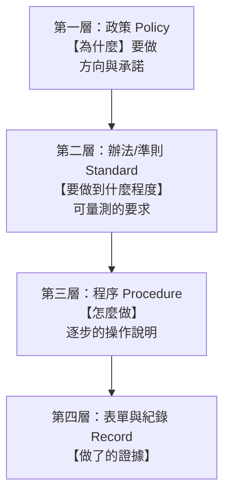

# 資安政策文件與制度

> [!abstract] 這篇你會學到
> - 分辨**四層文件架構**（政策／辦法／程序／表單紀錄）各自的定位
> - 寫出**「照著做就能完成」的程序書**（而不是抽象的原則宣示）
> - 設計**真的會有人填**的表單
> - 規劃文件的**審查、改版與廢止**
> - 避開「**寫了一堆沒人看的文件**」這個最大的陷阱

> [!danger] 先講最重要的一件事
> **文件的目的是「讓事情能被正確地重複執行」，不是「應付稽核」。**
>
> 判斷你的文件有沒有價值的方法：
> **「新來的同仁能不能照著這份文件把事情做對？」**
>
> 如果不能，那份文件就只是稽核用的裝飾品。

## 前置知識

- [[05-ISO27001與ISMS]] — 文件化資訊的要求
- [[09-資安稽核與符合性檢核]] — 文件與紀錄的差別

---

## 觀念說明

### 四層文件架構



| 層 | 名稱 | 回答 | 特性 | 例子 |
| --- | --- | --- | --- | --- |
| **1** | **政策** | **為什麼、方向** | 短、穩定、**首長核定** | 資通安全政策（1～2 頁） |
| **2** | **辦法／準則** | **要做到什麼程度** | 可量測、**主管核定** | 密碼管理辦法、修補時限標準 |
| **3** | **程序／作業手冊** | **怎麼做** | 具體、常改、**承辦人維護** | 新機建置程序、事件應變手冊 |
| **4** | **表單與紀錄** | **證明做了** | **只新增不修改** | 權限申請單、稽核報告 |

> [!tip] 一個貫穿四層的例子
> ```
> 【政策】「本機關對資通系統之存取，應採行適當之身分驗證機制。」
>          ↓
> 【辦法】「所有可從網際網路存取之系統，應啟用多因素驗證。
>          管理員帳號應使用 FIDO2 硬體金鑰。
>          密碼長度至少 15 字元，不強制定期更換。」
>          ↓
> 【程序】「MFA 註冊作業程序：
>          1. 至 https://mfa.example.gov.tw 登入
>          2. 點選『新增驗證方式』
>          3. 插入 YubiKey，依畫面指示觸碰金屬接點
>          4. 輸入 PIN 碼並確認
>          5. ★ 立即列印備援碼，交由單位主管封存
>          6. 填寫『MFA 註冊確認單』（表單 F-005）」
>          ↓
> 【紀錄】MFA 註冊確認單（已簽核）、系統的註冊記錄
> ```
>
> **注意每一層的抽象程度**：
> 政策是**承諾**，辦法是**標準**，程序是**步驟**，紀錄是**證據**。

> [!warning] 最常見的錯誤：把四層混在一起
> ```
> ❌ 一份 80 頁的「資安管理辦法」，
>    裡面既有原則宣示、又有技術參數、還夾雜操作步驟
>
> 問題：
>   · 【技術參數改了 → 整份文件要重新核定】
>   · 【承辦人想查操作步驟 → 要翻 80 頁】
>   · 稽核員想看政策 → 找不到重點
> ```
>
> **分層的好處**：
> - **政策很少改**（改要首長核定）
> - **程序常常改**（承辦人自己維護就好）
> - **各層的讀者不同**（首長看政策、稽核看辦法、同仁看程序）

---

## 第一層：資安政策

> [!tip] 政策應該短
> **1～2 頁就夠了。**
> 它的目的是**宣示方向與最高管理階層的承諾**，不是講細節。

```
═══════════════════════════════════════════════════════════
 ○○機關資通安全政策                          文件編號：POL-001
 版本：3.0    生效日期：2026-01-01    核定：機關首長
═══════════════════════════════════════════════════════════

一、目的
    為確保本機關資通系統與資訊之機密性、完整性與可用性，
    保障業務持續運作與民眾權益，特訂定本政策。

二、適用範圍
    本政策適用於本機關所有人員（含約聘僱、實習生、
    委外廠商人員）、所有資通系統、資訊資產與作業場所。

三、政策聲明
  （一）本機關依《資通安全管理法》及相關法令，
        建立並持續改善資通安全管理制度。
  （二）資通安全為全體同仁之責任，非資訊單位單獨之責任。
  （三）本機關採行【風險導向】之管理方式，
        依風險評鑑結果配置資源。
  （四）資訊資產之存取應遵循【最小權限原則】。
  （五）個人資料之蒐集、處理及利用，
        應符合《個人資料保護法》之規定。
  （六）本機關應確保業務持續運作能力，
        並定期驗證備援與復原機制。
  （七）資通安全事件應依規定通報，
        並於事後檢討改善。
  （八）本機關應定期辦理資安教育訓練與演練。

四、組織與責任
  （一）機關首長為資通安全之最高負責人。
  （二）設置資通安全長，綜理資通安全事務。
  （三）設置資通安全推動小組，成員包含各業務單位代表。
  （四）各單位主管負責所屬業務範圍之資通安全。
  （五）全體同仁應遵守本政策及相關規定。

五、違反之處理
    違反本政策者，依相關規定議處；
    涉及法律責任者，移送相關機關處理。

六、政策之審查
    本政策應【至少每年審查一次】，
    或於組織、法規、技術環境有重大變更時檢討修訂。

七、附則
    本政策經機關首長核定後實施，修正時亦同。

═══════════════════════════════════════════════════════════
 【修訂紀錄】
 版本 │ 日期       │ 修訂重點                    │ 核定
 1.0  │ 2019-05-01 │ 初版制定                    │ 首長
 2.0  │ 2022-03-15 │ 配合資通安全管理法修正      │ 首長
 3.0  │ 2026-01-01 │ 增列風險導向管理與個資保護  │ 首長
═══════════════════════════════════════════════════════════
```

> [!warning] 政策裡不要寫這些
> ```
> ❌ 具體的技術參數（密碼要 15 字元）→ 放【辦法】
> ❌ 操作步驟（如何設定 MFA）      → 放【程序】
> ❌ 特定產品名稱（使用 XX 防毒）  → 會過時
> ❌ 具體的人名                    → 人會異動，寫職稱
> ❌ 具體的 IP 或系統名稱          → 會變動
> ```
>
> **判斷標準**：
> **「這句話三年後還會成立嗎？」**
> 不會的話，它不屬於政策層。

---

## 第二層：辦法與準則

> [!tip] 這一層是「可量測的要求」
> **關鍵特徵：每一條都要能回答「符合」或「不符合」。**

```
═══════════════════════════════════════════════════════════
 帳號與密碼管理辦法                          文件編號：STD-003
 版本：2.1    生效：2026-07-01    核定：資訊室主任
═══════════════════════════════════════════════════════════

第一條 目的與依據
  依「○○機關資通安全政策」（POL-001）第三條第四款訂定。

第二條 適用範圍
  本機關所有資通系統之使用者帳號、管理員帳號及服務帳號。

第三條 帳號類型與命名規則
  一、一般使用者帳號：員工編號（如 A12345）
  二、管理員帳號：admin-員工編號（如 admin-A12345）
      ★ 管理員帳號【不得用於日常作業】（收信、上網、文書處理）
  三、服務帳號：svc-系統代號-用途（如 svc-hr-db）
  四、【禁止使用共用帳號】。因系統限制無法避免者，
      應依「例外申請程序」（PRO-015）辦理。

第四條 密碼強度要求
  ┌──────────────┬────────┬──────────┬────────────┐
  │ 帳號類型      │最小長度│ 定期更換  │ 其他要求    │
  ├──────────────┼────────┼──────────┼────────────┤
  │ 一般使用者    │ 15 字元│ 不強制    │ 比對外洩清單│
  │ 管理員        │ 20 字元│ 每 180 天 │ + 強制 MFA  │
  │ 服務帳號      │ 30 字元│ 不強制    │ 隨機產生    │
  │ 特權/緊急帳號 │ 32 字元│ 每次使用後│ 分段保管    │
  └──────────────┴────────┴──────────┴────────────┘
  一、密碼不得包含機關名稱、系統名稱、使用者姓名或帳號。
  二、密碼不得為已知外洩之密碼（系統應自動比對）。
  三、不得重複使用前 10 次之密碼。
  四、【不得以任何形式明文記載或傳遞密碼】。

第五條 多因素驗證
  一、所有【可從網際網路存取】之系統，應啟用 MFA。
  二、所有【管理員帳號】應啟用 MFA，
      並優先採用 FIDO2 硬體金鑰。
  三、【應封鎖不支援 MFA 之舊版驗證協定】。

第六條 帳號生命週期
  一、開通：應經【業務單位主管】書面核准，
      依「角色權限對照表」（附件一）給予權限。
  二、異動：職務異動時，應【先收回原權限再給予新權限】。
  三、停用：離職生效【當日】完成停用，
      並依「離職資安檢查表」（F-012）逐項確認。
  四、刪除：停用滿 90 日後刪除，
      但涉訟或稽核需要者得延長保留。

第七條 權限審查
  一、一般帳號：【每半年】審查一次。
  二、特權帳號：【每季】審查一次。
  三、審查應由【業務單位主管】確認，
      未明確表示保留者，一律移除。
  四、審查結果應留存紀錄至少 3 年。

第八條 例外
  無法遵循本辦法者，應依「例外申請程序」（PRO-015）
  提出申請，經核准並採行補償控制措施後始得為之。

第九條 審查
  本辦法【每年】審查一次，或於相關法規、
  技術環境有重大變更時檢討修訂。
═══════════════════════════════════════════════════════════
```

> [!tip] 好的辦法條文長什麼樣
> | ❌ 不好 | ✅ 好 |
> | --- | --- |
> | 「密碼應具備足夠強度」 | 「密碼長度至少 15 字元」 |
> | 「應定期審查權限」 | 「一般帳號每半年、特權帳號每季審查」 |
> | 「離職應儘速停用帳號」 | 「離職生效**當日**完成停用」 |
> | 「重要系統應加強防護」 | 「對外服務應啟用 MFA 並封鎖舊版驗證」 |
>
> **判斷標準：能不能寫成「是／否」的檢核題目？**

---

## 第三層：程序書

> [!danger] 這一層決定了制度能不能真的運作
> **判斷標準：新來的同仁能不能照著做？**

### 好的程序書的六個特徵

```
① 【有明確的觸發時機】（什麼時候要執行這個程序）
② 【有角色與責任】（誰做哪一步）
③ 【步驟是可執行的動作】（含實際的指令、畫面、路徑）
④ 【有預期結果】（做對了應該看到什麼）
⑤ 【有異常處理】（如果失敗怎麼辦、找誰）
⑥ 【有輸出】（產生什麼紀錄或表單）
```

```
═══════════════════════════════════════════════════════════
 離職人員資安處理程序                        文件編號：PRO-011
 版本：1.3    生效：2026-08-01    維護：資訊室 王○○
═══════════════════════════════════════════════════════════

【觸發時機】
  收到人事單位之離職通知起，至離職生效日當日完成。
  ★ 若為【非自願離職或涉及爭議】，應於【收到通知當下】
    立即執行第 3 節之緊急處置。

【角色與責任】
  · 人事單位：離職通知（至少提前 3 個工作日）
  · 單位主管：業務交接確認、共用密碼變更之確認
  · 資訊人員：執行技術面處置
  · 政風單位：涉及機敏業務者之會辦

【所需權限與工具】
  · AD 帳號管理權限
  · Microsoft 365 系統管理員
  · 各業務系統管理權限
  · 伺服器 SSH 存取（用於清除公鑰）

───────────────────────────────────────────────────────────
 1. 前置作業（收到通知後 1 個工作日內）
───────────────────────────────────────────────────────────
 1.1 於工單系統建立「離職資安處理」工單，
     連結人事通知文號。
 1.2 查詢該員之所有帳號與權限：

     【AD】
     PS> Get-ADUser -Identity <帳號> -Properties MemberOf |
         Select-Object -ExpandProperty MemberOf

     【M365】
     PS> Get-MgUserLicenseDetail -UserId <帳號@example.gov.tw>

     【各業務系統】依「系統清單」（附件二）逐一查詢

 1.3 查詢該員之 SSH 公鑰分布：★ 最常被遺漏
     $ for h in $(cat /etc/server-list); do
         ssh "$h" "grep -l '<員工email或姓名>' \
           /home/*/.ssh/authorized_keys /root/.ssh/authorized_keys \
           2>/dev/null" 2>/dev/null | sed "s|^|$h: |"
       done

     【預期結果】列出所有含該員公鑰的主機與檔案路徑。
     若無輸出，表示未部署公鑰（仍須於 2.5 記錄「無」）。

 1.4 列印「離職資安檢查表」（F-012），交單位主管。

───────────────────────────────────────────────────────────
 2. 離職生效日當日處置
───────────────────────────────────────────────────────────
 2.1 停用 AD 帳號（★不是刪除）
     PS> Disable-ADAccount -Identity <帳號>
     PS> Set-ADUser -Identity <帳號> `
           -Description "已離職 $(Get-Date -f yyyy-MM-dd) 工單#____"

     【預期結果】Get-ADUser <帳號> 顯示 Enabled : False

 2.2 ★ 撤銷所有 Session 與 Token
     PS> Revoke-MgUserSignInSession -UserId <帳號@example.gov.tw>

     【為什麼】僅停用帳號，既有的 Session 仍有效至過期，
               對方可能繼續存取郵件與檔案達數小時。

 2.3 重設密碼（防止記得密碼者之存取）
     PS> Set-ADAccountPassword -Identity <帳號> -Reset `
           -NewPassword (ConvertTo-SecureString `
             -AsPlainText (New-Guid).Guid -Force)

 2.4 停用 VPN 與其他遠端存取
     · VPN 管理介面 → 使用者 → 停用
     · 【確認 VPN 目前無該員之連線中 Session】

 2.5 ★ 移除 SSH 公鑰（依 1.3 之清單）
     $ ssh <主機> "sudo sed -i '/<識別字串>/d' <authorized_keys 路徑>"
     $ ssh <主機> "grep -c . <authorized_keys 路徑>"

     【預期結果】行數比處理前少 1（或該員的行數）。
     【異常】若 sed 未生效，改用編輯器手動移除並記錄。

 2.6 撤銷 API 金鑰與 Personal Access Token
     · GitLab/GitHub → 使用者 → Tokens → 全部撤銷
     · 各系統之 API 金鑰依「系統清單」逐一確認

 2.7 ★ 共用密碼變更
     · 由單位主管確認該員知悉哪些共用密碼
     · 逐一變更並通知其他使用者
     · 【記錄變更的項目】

 2.8 信箱處理
     · 設定轉寄至單位主管（不刪除）
     · 保留期間：____（依機關規定）
     · 設定自動回覆（如需要）

 2.9 門禁與實體
     · 門禁卡繳回並【於系統中停用】
     · 公務設備繳回（筆電、手機、金鑰、隨身碟）
     · 【確認設備中無未交接之公務資料】

───────────────────────────────────────────────────────────
 3. 緊急處置（非自願離職或涉爭議）
───────────────────────────────────────────────────────────
 ★ 於收到通知當下立即執行，不待離職生效日：
 3.1 立即停用所有帳號並撤銷 Session（2.1～2.4）
 3.2 立即停用門禁
 3.3 ★ 保全該員近期之存取日誌（至少前 90 日）
     · 檔案存取紀錄  · 郵件寄送紀錄
     · 大量下載或列印紀錄  · VPN 連線紀錄
 3.4 會辦政風單位
 3.5 【不要事先通知該員】

───────────────────────────────────────────────────────────
 4. 確認與存檔
───────────────────────────────────────────────────────────
 4.1 完成「離職資安檢查表」（F-012）所有項目並簽章。
 4.2 由單位主管複核簽章。
 4.3 掃描存入證據庫：/srv/evidence/離職處理/YYYYMM/
 4.4 關閉工單，附上檢查表。
 4.5 【於下次權限審查時抽查驗證】。

───────────────────────────────────────────────────────────
 5. 異常處理
───────────────────────────────────────────────────────────
 · 無法於離職日完成 → 記錄原因，於 3 日內補正，
   並向資訊室主任報告。
 · 發現該員有異常存取行為 → 依「資安事件應變程序」
   （PRO-020）處理。
 · 系統無法停用帳號 → 記錄於例外清單，
   採行替代措施（如變更密碼、限制來源 IP）。

───────────────────────────────────────────────────────────
 【輸出】離職資安檢查表 F-012（已簽核）、工單紀錄
 【相關文件】STD-003 帳號與密碼管理辦法、PRO-020 事件應變程序
═══════════════════════════════════════════════════════════
```

> [!tip] 程序書要寫到「不用問人就能做」
> **測試方法**：
> **把程序書給一位沒做過這件事的同仁，請他照著做。**
>
> **每一個他需要開口問的地方，就是程序書的缺口。**
>
> 常見的缺口：
> - **「登入系統」** → 哪個系統？網址？用什麼帳號？
> - **「設定為停用」** → 在哪個選單？畫面長什麼樣？
> - **「通知相關人員」** → 通知誰？用什麼方式？講什麼？
> - **「確認無誤」** → 怎麼確認？看到什麼算無誤？

---

## 第四層：表單與紀錄

### 設計「會有人填」的表單

> [!danger] 大多數表單沒有人填的原因
> ```
> ❌ 太長（3 頁，20 個欄位）
> ❌ 【問了系統可以自動查到的資訊】（IP、主機名、版本）
> ❌ 【填了之後沒有下文】（不知道送去哪、有沒有人看）
> ❌ 【不填也沒關係】（沒有強制力）
> ❌ 紙本，要跑三個單位蓋章
> ❌ 【欄位意義不明】（「風險等級」是什麼？誰決定？）
> ```

> [!tip] 好表單的六個原則
> ```
> ① 【短】—— 一頁以內，10 個欄位以內
> ② 【只問「人才知道」的事】—— 技術資訊由系統自動帶入
> ③ 【有明確的選項】—— 盡量用勾選而非填空
> ④ 【線上化】—— 不要紙本跑流程
> ⑤ 【填了有用】—— 觸發後續動作，填的人看得到進度
> ⑥ 【不填就不能做】—— 用流程強制（如：沒有工單就不給權限）
> ```

```
═══════════════════════════════════════════════════════════
 系統權限申請單                                    F-003 v2.0
═══════════════════════════════════════════════════════════
【申請人】（★ 以下由系統自動帶入，不用填）
  姓名：王小明    員編：A12345    單位：資訊室
  職稱：技士      主管：李大同    分機：1234

【申請類型】
  ☐ 新增權限   ☐ 變更權限   ☐ 移除權限   ☐ 臨時權限

【申請項目】
  系統：［下拉選單：從系統清單自動載入］
  角色：［下拉選單：依所選系統動態載入可用角色］
        ★ 每個角色的說明顯示在旁邊

【使用期間】
  ☐ 常設（隨職務）
  ☐ 臨時：自 ______ 至 ______  ★ 【到期自動移除】

【申請理由】（★ 必填，至少 20 字）
  ┌───────────────────────────────────────────────┐
  │                                                │
  └───────────────────────────────────────────────┘
  ※ 請說明業務需要，例如「承辦 XX 業務，
    需查詢 YY 資料以辦理 ZZ」

【是否涉及個人資料】
  ☐ 否   ☐ 是 → 已完成個資保護教育訓練：☐是（日期：____）

───────────────────────────────────────────────────────────
【單位主管審核】（★ 系統自動轉送）
  ☐ 同意   ☐ 不同意   ☐ 修改為：__________
  意見：_________________________  簽核：______ 日期：______

【系統管理員處理】（★ 系統自動記錄）
  處理人：______  處理日期：______  實際授予角色：______
  ☐ 已設定到期提醒（臨時權限）

【下次審查】：______（★ 系統自動排入權限審查清單）
═══════════════════════════════════════════════════════════
```

> [!tip] 把表單變成「流程的一部分」
> **最有效的做法**：
> ```
> 【沒有核准的申請單 → 系統管理員不執行】
> ```
>
> 這不是刁難，而是：
> - 保護執行的人（**有人核准，出事不是你的責任**）
> - 產生稽核證據
> - 讓權限審查時能追溯「當初為什麼給這個權限」
>
> **要讓這件事可行，申請流程必須夠快**
> （線上申請、一天內核准）——
> 否則大家就會繞過它。
> 見 [[01-資安基本原則與實踐]] 的「心理可接受性」。

---

## 文件的管理

### 文件必備的中繼資訊

```
□ 【文件編號】（POL-001 / STD-003 / PRO-011 / F-012）
□ 【版本號】
□ 【生效日期】
□ 【核定層級與核定人】
□ 【維護單位／維護人】
□ 【審查週期】
□ 【下次審查日期】
□ 【修訂紀錄】（版本、日期、修訂重點、核定）
□ 【相關文件】（上位依據與下位文件）
```

> [!warning] 編號要有規則
> ```
> POL-xxx  政策（Policy）
> STD-xxx  辦法/準則（Standard）
> PRO-xxx  程序（Procedure）
> GDL-xxx  指引（Guideline，非強制）
> F-xxx    表單（Form）
> REC-xxx  紀錄（Record）
> ```
>
> **好處**：
> - 一看就知道是哪一層
> - 交叉引用時清楚
> - **稽核員問「這是依據什麼」時答得出來**

### 審查週期

| 文件層級 | 建議審查週期 | 誰負責 |
| --- | --- | --- |
| **政策** | 每年 | 資安長 → 首長核定 |
| **辦法／準則** | 每年 | 資訊主管 |
| **程序** | **每年，或有變更時立即** | 承辦人 |
| 表單 | 隨程序 | 承辦人 |

> [!danger] 「文件三年沒改過」是稽核常見缺失
> **兩種情況都是問題**：
> ```
> ① 三年沒改，但環境明明變了
>    → 【文件與實際不符】→ 不符合
>
> ② 三年沒改，環境也真的沒變
>    → 但【沒有「審查過確認不需修改」的紀錄】
>      → 稽核員無法確認你有在維護
> ```
>
> **正確做法**：
> **即使不需要修改，也要留下「已審查、無需修訂」的紀錄。**
> ```
> 【修訂紀錄】
> 2.1 │ 2026-07-01 │ 年度審查，無需修訂      │ 資訊室主任
> ```

### 用 git 管理文件（推薦）

> [!tip] 文件管理最務實的做法
> ```bash
> # 文件庫的結構
> /srv/docs/
> ├─ 01-政策/POL-001-資通安全政策.md
> ├─ 02-辦法/STD-003-帳號與密碼管理辦法.md
> ├─ 03-程序/PRO-011-離職人員資安處理程序.md
> ├─ 04-表單/F-003-系統權限申請單.md
> └─ 99-已廢止/PRO-008-舊版備份程序.md
> ```
>
> **用 git 的好處**：
> - **完整的修訂歷史**（誰、什麼時候、改了什麼）
> - **差異比對**（`git diff` 一眼看出改了哪裡）
> - **審查流程**（Pull Request / Merge Request = 核定流程）
> - **標籤標示版本**（`git tag POL-001-v3.0`）
> - **稽核證據**：commit 紀錄本身就是修訂紀錄

```bash
# ===== 文件變更的流程 =====
$ git checkout -b update/STD-003-v2.2
$ vim 02-辦法/STD-003-帳號與密碼管理辦法.md
$ git add -A
$ git commit -m "STD-003 v2.2: 新增服務帳號長度要求至 30 字元

依 2026 年 Q2 風險評鑑結果（RA-2026-Q2），
Kerberoasting 風險需將服務帳號密碼提升至 30 字元。
對應控制措施：ISO A.8.5 / CIS 5.2"

# 建立 MR/PR → 主管審查 → 合併 = 核定
$ git tag -a "STD-003-v2.2" -m "2026-08-28 資訊室主任核定"
$ git push origin main --tags

# 查詢某份文件的完整修訂史（稽核用）
$ git log --follow --pretty=format:"%ad %an %s" --date=short \
    -- 02-辦法/STD-003-帳號與密碼管理辦法.md
```

```bash
# ===== 自動檢查逾期文件 =====
#!/usr/bin/env bash
# 掃描所有文件的 frontmatter，找出逾期未審查的
TODAY=$(date +%s)
echo "═══ 文件審查狀態 $(date +%F) ═══"
find /srv/docs -name '*.md' -not -path '*/99-已廢止/*' | while read -r f; do
  next=$(grep -m1 '^next_review:' "$f" | awk '{print $2}')
  [ -z "$next" ] && { echo "  ⚠ 無審查日期：$(basename "$f")"; continue; }
  ts=$(date -d "$next" +%s 2>/dev/null) || continue
  days=$(( (ts - TODAY) / 86400 ))
  if   [ "$days" -lt 0 ];  then echo "  ❌ 逾期 $(( -days )) 天：$(basename "$f")"
  elif [ "$days" -lt 30 ]; then echo "  ⚠ $days 天後到期：$(basename "$f")"
  fi
done
```

### 文件的廢止

> [!warning] 廢止不是刪除
> ```
> ❌ 直接刪掉舊文件
>    → 【稽核時無法說明「當時的規定是什麼」】
>    → 事後爭議時無法舉證
>
> ✅ 正確做法：
>    · 移到「已廢止」區
>    · 【文件上標註「本文件自 YYYY-MM-DD 起廢止，
>       由 XXX 取代」】
>    · 保留至少 3 年（或依檔案保存規定）
>    · 【確認沒有其他文件還在引用它】
> ```

---

## 完整實戰範例

### 文件清單範本

```
═══════════════════════════════════════════════════════════
 資安文件清單                                  更新：2026/08
═══════════════════════════════════════════════════════════
編號    │文件名稱              │版本│生效    │審查週期│下次審查│維護│狀態
────────┼──────────────────────┼────┼────────┼────────┼────────┼────┼────
POL-001 │資通安全政策          │3.0 │2026/01 │每年    │2027/01 │資安長│有效
────────┼──────────────────────┼────┼────────┼────────┼────────┼────┼────
STD-001 │資通系統分級標準      │1.2 │2025/09 │每年    │2026/09 │王  │有效
STD-002 │資訊資產分類分級辦法  │1.0 │2024/03 │每年    │【逾期】│王  │⚠
STD-003 │帳號與密碼管理辦法    │2.1 │2026/07 │每年    │2027/07 │王  │有效
STD-004 │弱點與修補管理辦法    │1.1 │2026/03 │每年    │2027/03 │李  │有效
STD-005 │備份與復原管理辦法    │2.0 │2026/05 │每年    │2027/05 │李  │有效
STD-006 │委外資安管理辦法      │1.0 │2025/11 │每年    │2026/11 │陳  │有效
────────┼──────────────────────┼────┼────────┼────────┼────────┼────┼────
PRO-001 │新機建置標準程序      │2.3 │2026/06 │每年    │2027/06 │李  │有效
PRO-007 │弱點修補作業程序      │1.4 │2026/04 │每年    │2027/04 │李  │有效
PRO-011 │離職人員資安處理程序  │1.3 │2026/08 │每年    │2027/08 │王  │有效
PRO-015 │例外申請程序          │1.0 │2025/06 │每年    │【逾期】│王  │⚠
PRO-020 │資安事件應變程序      │2.1 │2026/02 │每年    │2027/02 │王  │有效
PRO-025 │備份還原演練程序      │1.0 │2026/05 │每年    │2027/05 │李  │有效
────────┼──────────────────────┼────┼────────┼────────┼────────┼────┼────
F-003   │系統權限申請單        │2.0 │2026/07 │隨程序  │  —     │王  │有效
F-005   │MFA 註冊確認單        │1.0 │2026/06 │隨程序  │  —     │王  │有效
F-012   │離職資安檢查表        │1.3 │2026/08 │隨程序  │  —     │王  │有效
F-020   │資安事件通報單        │2.0 │2026/02 │隨程序  │  —     │王  │有效
F-025   │例外申請單            │1.0 │2025/06 │隨程序  │  —     │王  │有效
────────┼──────────────────────┼────┼────────┼────────┼────────┼────┼────
PRO-008 │舊版備份程序          │1.2 │2022/01 │  —     │  —     │ — │廢止
        │（2026/05 由 STD-005 + PRO-025 取代）              │    │
═══════════════════════════════════════════════════════════
【待處理】
 ⚠ STD-002、PRO-015 已逾審查期限，應於 2026/09 前完成審查
═══════════════════════════════════════════════════════════
```

### 從零開始建立文件的順序

> [!tip] 不要一次寫二十份文件
> **建議的順序**（依「不做會出事」的程度）：
>
> **【第一批】沒有它就無法運作的**
> ```
> 1. POL-001 資通安全政策           ← 上位依據，先有它
> 2. PRO-020 資安事件應變程序       ← 出事時要用
> 3. F-020  資安事件通報單
> 4. PRO-011 離職人員資安處理程序   ← 最常發生、最常出包
> 5. F-012  離職資安檢查表
> ```
>
> **【第二批】日常最常用的**
> ```
> 6. STD-003 帳號與密碼管理辦法
> 7. F-003  系統權限申請單
> 8. PRO-001 新機建置標準程序
> 9. STD-005 備份與復原管理辦法
> 10. PRO-025 備份還原演練程序
> ```
>
> **【第三批】法遵與管理需要的**
> ```
> 11. STD-001 資通系統分級標準
> 12. STD-002 資訊資產分類分級辦法
> 13. STD-004 弱點與修補管理辦法
> 14. PRO-015 例外申請程序 + F-025
> 15. STD-006 委外資安管理辦法
> ```
>
> **每一份寫完就開始用**，不要等全部寫完。
> **用了才會知道哪裡寫得不對。**

### 文件的 Markdown 範本

```markdown
---
doc_id: PRO-011
title: 離職人員資安處理程序
version: "1.3"
type: procedure          # policy | standard | procedure | guideline | form
effective_date: 2026-08-01
review_cycle: 年
next_review: 2027-08-01
owner: 資訊室 王○○
approver: 資訊室主任
status: 有效             # 有效 | 修訂中 | 廢止
supersedes: PRO-011 v1.2
related: [STD-003, PRO-020, F-012]
---

# 離職人員資安處理程序

## 1. 目的與依據
## 2. 適用範圍
## 3. 名詞定義
## 4. 角色與責任
## 5. 作業流程
## 6. 異常處理
## 7. 輸出與紀錄
## 8. 相關文件
## 9. 修訂紀錄

| 版本 | 日期 | 修訂重點 | 核定 |
| --- | --- | --- | --- |
| 1.3 | 2026-08-01 | 新增 SSH 公鑰移除與 Session 撤銷步驟 | 主任 |
| 1.2 | 2025-03-15 | 增列非自願離職之緊急處置 | 主任 |
| 1.1 | 2024-06-01 | 年度審查，無需修訂 | 主任 |
| 1.0 | 2023-05-01 | 初版 | 主任 |
```

> [!tip] 用 frontmatter 讓文件可被程式處理
> 有了結構化的中繼資料，就能自動：
> - 產生文件清單
> - **檢查逾期未審查的文件**
> - 檢查引用關係（有沒有引用到已廢止的文件）
> - 產生稽核所需的報表

---

## 常見錯誤與排錯

| 現象／錯誤 | 原因 | 解法 |
| --- | --- | --- |
| **寫了一堆文件但沒人看** | 文件是為稽核寫的，不是為做事寫的 | 判斷標準：**新人能照著做嗎** |
| 一份 80 頁的大雜燴 | **四層混在一起** | 分層：政策短、辦法可量測、程序可執行 |
| 政策改一個技術參數要首長核定 | 技術細節寫進了政策 | 技術參數放**辦法**層 |
| **文件三年沒改過** | 沒有審查機制 | 每份文件訂**審查週期 + 下次審查日**；**即使不改也要留審查紀錄** |
| 文件與實際做法不一致 | 做法變了但文件沒改 | 變更時同步改文件；把「更新文件」納入變更流程 |
| **辦法寫得太抽象，無法檢核** | 「應具備足夠強度」 | 每一條都要能寫成**是／否的檢核題** |
| 程序書照著做會卡住 | 少了關鍵細節 | 讓**沒做過的人實測**，每個要問的地方就是缺口 |
| **表單沒有人填** | 太長、問系統查得到的、填了沒下文 | 一頁內、自動帶入、線上化、**不填就不能做** |
| 申請流程太慢，大家繞過 | 紙本跑三個單位 | 線上化 + **一天內核准**（心理可接受性） |
| 找不到某份文件的最新版 | 檔案散落、版本混亂 | **集中文件庫 + git 版控 + 明確編號** |
| 廢止的文件還被引用 | 直接刪除或沒清查 | 廢止時**檢查引用關係**；移到已廢止區保留 |
| 稽核問「依據是什麼」答不出來 | 文件沒有編號與上位依據 | 每份文件標明**編號 + 上位依據 + 相關文件** |
| **文件寫完了但沒開始用** | 等全部寫完才推行 | **每份寫完就開始用**，用了才知道哪裡不對 |

---

## 安全性注意事項

> [!danger] 文件本身可能是敏感資訊
> **資安文件中常含有**：
> - 網路架構與 IP 配置
> - **系統清單與版本**
> - **管理介面的網址**
> - 帳號命名規則（有助於猜測帳號）
> - **例外清單**（＝已知弱點的清單）
> - 應變聯絡人與電話
>
> **必做**：
> - **文件分級**（政策可公開、程序限內部、例外清單機密）
> - **存取控制**（不是全機關都要看得到所有文件）
> - **對外提供時要遮蔽敏感細節**
> - **委外廠商只給必要的部分**
>
> **特別注意「例外清單」** ——
> 它精確地列出了你有哪些已知但未修補的弱點，
> **等於一份攻擊指南**。

> [!warning] 不要在文件中寫入密碼或金鑰
> ```
> ❌ 程序書中寫「使用密碼 Admin@2026」
> ❌ 設定範例中留著真實的 API 金鑰
> ❌ 截圖中露出密碼欄位或 Token
> ```
>
> **正確做法**：
> ```
> ✅「密碼存放於密碼管理器的『伺服器管理』集合」
> ✅ 範例用 <YOUR_API_KEY> 或明顯的假值
> ✅ 截圖前先遮蔽敏感欄位
> ```
>
> **如果文件進 git**，密碼一旦 commit 就**留在歷史裡**，
> 即使後來刪掉也還在。
> 見 [[10-機密管理與金鑰保護]]。

> [!tip] 文件是「知識傳承」的載體
> **除了法遵，文件最大的價值是**：
> ```
> · 【承辦人請假或離職時，別人接得下去】
> · 新人可以自己學習，不用一直問
> · 【避免「只有某某人會做」的單點風險】
> · 減少重複犯同樣的錯
> · 累積組織的經驗
> ```
>
> **判斷你的文件夠不夠好的終極測試**：
> **「如果負責這項工作的人明天請長假，
> 別人能不能照著文件把事情做完？」**
>
> 如果不能，那不只是文件問題，
> **那是組織的營運風險**。

> [!warning] 文件不能取代訓練與演練
> ```
> 有應變程序書 ≠ 事件發生時處理得好
> 有還原程序書 ≠ 真的還原得回來
> ```
>
> **文件必須配合**：
> - **教育訓練**（讓人知道文件存在、知道在哪找）
> - **實際演練**（驗證文件是可行的）
> - **定期回饋**（執行者提出改善建議）
>
> **每次演練後都應該檢討「文件哪裡需要修正」** ——
> 這是文件品質提升最有效的來源。

---

## 速查表

### 四層文件

| 層 | 名稱 | 回答 | 特性 | 核定 |
| --- | --- | --- | --- | --- |
| 1 | **政策** | 為什麼、方向 | 短（1-2頁）、穩定 | **首長** |
| 2 | **辦法/準則** | **要做到什麼程度** | **可量測** | 主管 |
| 3 | **程序** | **怎麼做** | 具體、常改 | 承辦人維護 |
| 4 | **表單/紀錄** | 證明做了 | **只新增不改** | — |

### 編號規則

```
POL-xxx 政策   STD-xxx 辦法/準則   PRO-xxx 程序
GDL-xxx 指引   F-xxx   表單        REC-xxx 紀錄
```

### 政策裡不要寫

```
❌ 技術參數（→ 辦法）  ❌ 操作步驟（→ 程序）
❌ 產品名稱（會過時）  ❌ 人名（寫職稱）
❌ IP/系統名稱（會變）
判斷：「這句話三年後還成立嗎？」
```

### 好的辦法條文

```
❌「應具備足夠強度」  → ✅「長度至少 15 字元」
❌「應定期審查」      → ✅「一般每半年、特權每季」
❌「應儘速停用」      → ✅「離職生效【當日】完成」
判斷：能不能寫成「是／否」的檢核題？
```

### 好程序書的六特徵

```
① 明確的觸發時機      ② 角色與責任
③ 可執行的動作（含指令/畫面/路徑）
④ 【預期結果】（做對了會看到什麼）
⑤ 【異常處理】（失敗怎麼辦、找誰）
⑥ 輸出（產生什麼紀錄）

測試：【給沒做過的人照著做，每個要問的地方就是缺口】
```

### 好表單六原則

```
① 短（1 頁 / 10 欄內）
② 【只問「人才知道」的】（技術資訊自動帶入）
③ 明確的選項（勾選 > 填空）
④ 線上化
⑤ 填了有用（觸發後續、看得到進度）
⑥ 【不填就不能做】（但流程要夠快，否則會被繞過）
```

### 文件必備中繼資訊

```
編號 · 版本 · 生效日 · 核定人 · 維護人
審查週期 ·【下次審查日】· 修訂紀錄 · 相關文件
```

### 審查週期

```
政策     每年（資安長 → 首長）
辦法     每年（資訊主管）
程序     每年【或有變更時立即】
表單     隨程序

★【即使不需修改，也要留下「已審查、無需修訂」的紀錄】
```

### 用 git 管理文件

```bash
git commit -m "STD-003 v2.2: 修訂重點 + 依據 + 對應控制措施"
git tag -a "STD-003-v2.2" -m "核定日期與核定人"
git log --follow -- 檔案路徑        # 完整修訂史 = 稽核證據
MR/PR 審查 = 核定流程
```

### 建立文件的順序

```
【第一批】政策 · 事件應變程序+通報單 · 離職處理程序+檢查表
【第二批】帳號密碼辦法+權限申請單 · 新機建置程序 · 備份辦法+演練程序
【第三批】系統分級 · 資產分級 · 修補辦法 · 例外程序 · 委外辦法
★ 每份寫完就開始用，不要等全部寫完
```

### 廢止不是刪除

```
✅ 移到「已廢止」區 + 標註廢止日期與取代文件
   + 保留 3 年 + 【檢查沒有其他文件還在引用】
❌ 直接刪除（稽核時無法說明當時的規定）
```

### 終極測試

```
「如果負責這項工作的人明天請長假，
  別人能不能照著文件把事情做完？」
不能 → 那不只是文件問題，是【組織的營運風險】
```

---

## 練習題

> [!question]- 練習 1：檢視你的文件現況
> 1. 你的機關有幾份資安相關文件？**列得出來嗎？**
> 2. **每一份的最後審查日期是什麼時候？**（有幾份逾期？）
> 3. **有幾份是「四層混在一起」的大雜燴？**
> 4. 隨機挑一份程序書，問：
>    **「新來的同仁能照著做嗎？」**
> 5. **有沒有「已廢止但還在被引用」的文件？**

> [!question]- 練習 2：測試一份程序書
> 挑一份你認為「寫得還不錯」的程序書：
> 1. 找一位**沒做過這件事**的同仁
> 2. 請他**只看文件，不問人**，實際執行一次
> 3. **記錄他每一個「卡住」或「想問」的地方**
> 4. 那些就是文件的缺口
> 5. 修正後再測一次
>
> 通常第一次測試會發現 5～15 個缺口 ——
> **這就是「我以為寫清楚了」與「真的寫清楚了」的差距。**

> [!question]- 練習 3：寫一份最需要的程序書
> 想一想：**「如果我明天出車禍，哪一件事最沒有人接得下去？」**
> 1. 那件事是什麼？
> 2. 用本篇「好程序書的六特徵」寫出來
> 3. 特別注意寫出**預期結果**與**異常處理**
> 4. 請同事實測
> 5. 修正並存入文件庫
>
> **這份文件的價值，遠超過十份為稽核而寫的文件。**

---

## 小測驗

Q1. **四層文件架構是什麼？各自回答什麼問題、由誰核定**？

Q2. **為什麼「把四層混在一起」是問題**？分層有哪三個好處？

Q3. **政策裡不該寫哪五類內容？判斷標準是什麼**？

Q4. **好的辦法條文有什麼特徵**？舉兩組「不好 vs 好」的例子。

Q5. **好程序書的六個特徵是什麼？測試程序書品質的方法是什麼**？

Q6. **表單沒有人填的六個原因是什麼？好表單的六個原則**？

Q7. **「文件三年沒改過」為什麼是稽核缺失？即使真的不需要改，該怎麼做**？

Q8. **用 git 管理文件有哪五個好處**？

Q9. **廢止文件為什麼不能直接刪除**？正確做法是什麼？

Q10. **判斷文件品質的「終極測試」是什麼？答案是「不能」時代表什麼**？

> [!question]- 測驗答案
> **Q1.** **第一層政策（Policy）**：回答「**為什麼、方向**」，
> 短（1～2 頁）、穩定，**由首長核定**；
> **第二層辦法／準則（Standard）**：回答「**要做到什麼程度**」，
> **可量測**，由主管核定；
> **第三層程序（Procedure）**：回答「**怎麼做**」，
> 具體、常改，由承辦人維護；
> **第四層表單與紀錄（Record）**：「**證明做了**」，
> 只新增不修改。
>
> **Q2.** 問題在於：**技術參數改了就要整份文件重新核定**
> （因為它跟政策綁在一起）；
> **承辦人想查操作步驟要翻 80 頁**；
> **稽核員想看政策找不到重點**。
> 分層的三個好處：①**政策很少改**（改要首長核定，所以要穩定）；
> ②**程序常常改**（承辦人自己維護就好，不用驚動高層）；
> ③**各層的讀者不同**（首長看政策、稽核看辦法、同仁看程序）。
>
> **Q3.** ①**具體的技術參數**（如「密碼要 15 字元」→ 放辦法）；
> ②**操作步驟**（如何設定 MFA → 放程序）；
> ③**特定產品名稱**（會過時）；
> ④**具體的人名**（人會異動，應寫職稱）；
> ⑤**具體的 IP 或系統名稱**（會變動）。
> **判斷標準：「這句話三年後還會成立嗎？」** ——
> 不會的話，它不屬於政策層。
>
> **Q4.** 特徵是**每一條都要能回答「符合」或「不符合」**，
> 也就是**可量測、可檢核**。
> 例子：
> ❌「密碼應具備足夠強度」→ ✅「**密碼長度至少 15 字元**」；
> ❌「離職應儘速停用帳號」→ ✅「**離職生效當日完成停用**」。
> （其他：❌「應定期審查權限」→ ✅「一般帳號每半年、特權帳號每季」。）
> **判斷標準：能不能寫成「是／否」的檢核題目？**
>
> **Q5.** 六個特徵：①**明確的觸發時機**；②**角色與責任**；
> ③**步驟是可執行的動作**（含實際的指令、畫面、路徑）；
> ④**有預期結果**（做對了應該看到什麼）；
> ⑤**有異常處理**（失敗怎麼辦、找誰）；
> ⑥**有輸出**（產生什麼紀錄或表單）。
> **測試方法：把程序書給一位沒做過這件事的同仁，
> 請他只看文件、不問人，實際執行一次** ——
> **每一個他需要開口問的地方，就是程序書的缺口**。
>
> **Q6.** **沒人填的六個原因**：太長；**問了系統可以自動查到的資訊**；
> **填了之後沒有下文**；**不填也沒關係**（沒有強制力）；
> 紙本要跑三個單位蓋章；**欄位意義不明**。
> **好表單六原則**：①**短**（一頁、10 欄以內）；
> ②**只問「人才知道」的事**（技術資訊由系統自動帶入）；
> ③**有明確的選項**（勾選優於填空）；④**線上化**；
> ⑤**填了有用**（觸發後續動作、看得到進度）；
> ⑥**不填就不能做**（但流程必須夠快，否則會被繞過）。
>
> **Q7.** 兩種情況都是問題：
> ①**三年沒改但環境變了** → **文件與實際不符** → 不符合；
> ②**三年沒改、環境也真的沒變** → 但**沒有「審查過確認不需修改」的紀錄**
> → 稽核員無法確認你有在維護。
> **即使真的不需要改，也要留下審查紀錄**，例如在修訂紀錄中寫：
> 「2.1 │ 2026-07-01 │ **年度審查，無需修訂** │ 資訊室主任」。
>
> **Q8.** ①**完整的修訂歷史**（誰、什麼時候、改了什麼）；
> ②**差異比對**（`git diff` 一眼看出改了哪裡）；
> ③**審查流程**（Pull Request / Merge Request 就是核定流程）；
> ④**標籤標示版本**（`git tag POL-001-v3.0`）；
> ⑤**commit 紀錄本身就是稽核證據**（不可否認、有時戳）。
>
> **Q9.** 因為直接刪除會導致**稽核時無法說明「當時的規定是什麼」**，
> 事後有爭議時也無法舉證
> （例如：「三年前那件事，當時的程序是怎麼規定的？」）。
> **正確做法**：①移到「**已廢止**」區；
> ②**在文件上標註「本文件自 YYYY-MM-DD 起廢止，由 XXX 取代」**；
> ③**保留至少 3 年**（或依檔案保存規定）；
> ④**確認沒有其他文件還在引用它**。
>
> **Q10.** 終極測試是：
> **「如果負責這項工作的人明天請長假，
> 別人能不能照著文件把事情做完？」**
> 答案是「不能」時，**那不只是文件問題，那是組織的營運風險** ——
> 代表這項工作存在**單點依賴**（只有某某人會做），
> 一旦那個人離職、生病或請假，業務就會中斷。
> 文件最大的價值不只是法遵，而是**知識傳承**：
> 讓承辦人請假或離職時別人接得下去、
> 新人能自己學習、避免重複犯錯、累積組織經驗。

---

## 延伸閱讀

- [[05-ISO27001與ISMS]] — 文件化資訊的標準要求
- [[09-資安稽核與符合性檢核]] — 文件與紀錄的稽核
- [[04-資安事件應變流程]] — 應變程序書的內容
- [[02-密碼與帳號管理實務]] — 帳號辦法的內容
- [[10-機密管理與金鑰保護]] — 不要把密碼寫進文件
- [[12-資安意識與社交工程防範]] — 文件要配合訓練才有效
- [[11-委外與供應鏈資安]] — 委外管理辦法
