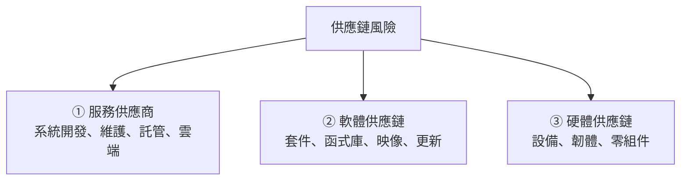
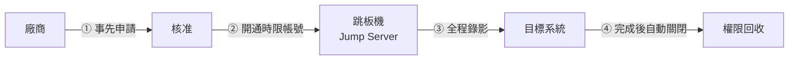

# 委外與供應鏈資安

> [!abstract] 這篇你會學到
> - 理解**「委外可以外包工作，不能外包責任」**
> - 在**契約中訂出可執行的資安要求**（附完整條款範本）
> - 管控**廠商的遠端維護**（機關最大的破口之一）
> - 建立**廠商分級與查核**機制
> - 認識**供應鏈攻擊**的類型與防範
> - 處理**軟體物料清單（SBOM）**與開源元件風險

> [!danger] 這一章對機關特別重要
> **台灣機關的資訊系統絕大多數是委外建置與維護的。**
>
> 這代表：
> - **廠商擁有你系統的最高權限**
> - **廠商的資安水準就是你的資安水準**
> - **廠商被入侵，你也會被入侵**
>
> 而現實是：**多數機關對廠商幾乎沒有任何資安管控。**

## 前置知識

- [[07-台灣資安法規與個資法]] — 委外的法定責任
- [[09-資安稽核與符合性檢核]] — 對廠商的查核
- [[07-身分存取管理IAM與MFA]] — 廠商帳號的管理

---

## 觀念說明

### 委外不能外包責任

> [!danger] 這是最重要的一句話
> **無論是《個人資料保護法》、《資通安全管理法》還是 GDPR：**
> **你委外給廠商，責任仍然在你身上。**
>
> | 法規 | 規定 |
> | --- | --- |
> | **個資法** | 委託他人蒐集處理利用個資者，**應對受託者為適當之監督** |
> | **資安法** | 公務機關委外辦理業務，**應要求受託者採取必要之資通安全措施**，並**監督之** |
> | **GDPR** | 你是**控制者（Controller）**，廠商是**處理者（Processor）** —— **控制者負主要責任** |
>
> **實務意義**：
> ```
> 廠商造成資料外洩
>   → 民眾告的是【你】
>     → 主管機關罰的是【你】
>       → 你再依契約向廠商求償（但通常求償不到全部損失）
> ```
>
> **「這是廠商的問題」不是免責理由。**

### 供應鏈風險的三個層次



| 層次 | 例子 | 主要風險 |
| --- | --- | --- |
| **① 服務供應商** | 系統開發商、維護廠商、雲端服務、機房託管 | **廠商帳號被盜、廠商人員濫用、廠商被入侵** |
| **② 軟體供應鏈** | npm/pip 套件、Docker 映像、套件更新 | **惡意套件、被投毒的更新、開源元件弱點** |
| **③ 硬體供應鏈** | 伺服器、網路設備、IoT | 韌體後門、來源不明的零件 |

> [!warning] 對台灣機關來說，① 的風險遠大於 ②③
> 因為：
> - **委外比例極高**
> - 廠商常有**常駐的遠端存取權限**
> - **廠商人員流動率高**
> - 廠商可能**同時服務多個機關**（一家被入侵，多個機關受害）
> - **契約中常常沒有資安條款**

---

## 契約中的資安條款

> [!danger] 沒有寫進契約的要求，都不算數
> 事後才說「你們應該要有 MFA」——
> 廠商會說「契約沒有寫」，而且他們是對的。
>
> **所有資安要求都必須在招標文件與契約中明訂。**

### 完整的資安條款範本

```
═══════════════════════════════════════════════════════════
 資通安全暨個人資料保護附加條款
═══════════════════════════════════════════════════════════

第一條 定義
  一、「機敏資料」指本機關之個人資料、業務機密、
      系統帳號密碼、網路架構資訊及其他非公開資訊。
  二、「廠商人員」指乙方之員工、約聘人員、
      實習生及其再委託之第三人。

第二條 一般資安義務
  一、乙方應建立並維持適當之資通安全管理措施。
  二、乙方應遵守甲方之資通安全政策及相關規定
      （附件：甲方資安政策摘要）。
  三、乙方應指定【資安聯絡窗口】，並提供 24 小時聯絡方式；
      異動時應於【3 個工作日內】通知甲方。

第三條 人員管理  ★ 最常被忽略但最重要
  一、乙方應提供【參與本案人員之名冊】，
      載明姓名、職務、負責範圍、聯絡方式，
      並於【人員異動時 3 個工作日內】更新。
  二、參與本案之人員應簽署【保密協定】，
      其效力於契約終止後【5 年】內持續有效。
  三、乙方人員【離職或調離本案時，應於當日通知甲方】，
      甲方將立即停用其所有存取權限。
  四、乙方應對其人員實施【資通安全教育訓練】，
      每年至少 __ 小時，並提供訓練紀錄。
  五、涉及機敏資料之人員，甲方得要求提供
      【良民證或進行適當之背景查核】。

第四條 存取控制  ★
  一、乙方人員之帳號應【個人化】，
      【嚴禁多人共用同一帳號】。
  二、所有存取應【啟用多因素驗證】。
  三、存取權限應【依實際需要之最小範圍】給予，
      並【設定使用期限】。
  四、【遠端存取應經事先申請並核准】，
      使用甲方指定之管道（跳板機／VPN），
      【不得使用未經核准之遠端工具】
      （如 TeamViewer、AnyDesk、向日葵等）。
  五、所有存取行為【均將被記錄，乙方同意接受監控】。
  六、乙方【不得於甲方系統中留置任何未經核准之
      遠端存取通道、後門或維護帳號】。

第五條 資料保護
  一、乙方【僅得於履行本契約必要範圍內】處理機敏資料。
  二、【嚴禁將機敏資料攜出甲方指定之處所】，
      或儲存於非甲方核准之設備或雲端服務。
  三、【嚴禁使用甲方之真實資料進行開發或測試】，
      應使用去識別化或合成資料。
  四、機敏資料之傳輸應加密（TLS 1.2 以上）。
  五、契約終止或資料使用完畢時，
      乙方應【於 __ 日內銷毀所有機敏資料及其副本】，
      並提供【銷毀證明】。

第六條 系統開發安全（適用於系統開發案）
  一、應遵循【安全開發生命週期】，
      參考 OWASP Top 10 等業界標準。
  二、【交付前應完成弱點掃描與原始碼檢測】，
      並提供報告。
  三、【不得使用已知具有重大弱點之第三方元件】。
  四、應提供【軟體物料清單（SBOM）】，
      列明所使用之第三方元件及版本。
  五、【原始碼之著作權與使用權歸屬】依主契約規定；
      乙方應提供完整之原始碼與建置說明。
  六、系統應通過甲方指定之【資安檢測】始得驗收。

第七條 弱點與修補
  一、乙方應【主動追蹤】所交付系統及其元件之安全性弱點。
  二、發現重大弱點時，應於【__ 小時內通知甲方】，
      並提供修補方案。
  三、修補時限：
      · 【緊急（正在被利用）：__ 小時】
      · 高風險：__ 日
      · 中風險：__ 日
  四、保固期內之安全性修補【不另計費】。

第八條 資安事件通報  ★
  一、乙方發生下列情事之一，應於【知悉後 __ 小時內】
      通知甲方之資安聯絡窗口：
      （一）乙方遭受資安攻擊或入侵，
            【且可能影響甲方之系統或資料】。
      （二）甲方之機敏資料有外洩之虞或已外洩。
      （三）乙方人員有異常存取或違規行為。
      （四）所交付之系統或元件發現重大安全性弱點。
  二、乙方應配合甲方進行事件調查，
      【提供必要之日誌、紀錄及技術協助】。
  三、乙方不得【在未經甲方同意下對外揭露】
      與本案相關之資安事件。

第九條 稽核權  ★
  一、甲方【得於事前通知後，對乙方進行資安查核】，
      每年至少一次。
  二、查核方式包含【文件審查、實地查核、人員訪談】。
  三、乙方應【配合提供相關證明文件】，
      包含但不限於：資安政策、人員訓練紀錄、
      弱點掃描報告、存取紀錄。
  四、乙方如持有 ISO 27001 等驗證，
      得提供【有效之證書及適用性聲明】替代部分查核。
  五、查核發現之缺失，乙方應於【__ 日內提出改善計畫】
      並完成改善。

第十條 再委託  ★ 常被忽略
  一、乙方【非經甲方事前書面同意，不得將本案之
      全部或一部再委託第三人】。
  二、經同意再委託者，乙方應【確保次承包商遵守
      本條款之所有義務】，並【就次承包商之行為
      對甲方負完全責任】。
  三、乙方應提供次承包商之名稱、負責範圍及聯絡方式。

第十一條 違約責任
  一、乙方違反本條款，經甲方通知限期改善而未改善者，
      甲方得【終止契約】並【沒收履約保證金】。
  二、因乙方之故意或過失導致甲方之機敏資料外洩或
      系統受損者，乙方應【負損害賠償責任】，
      包含甲方所受之行政裁罰、民事賠償及
      【事件處理費用（含鑑識、通知當事人、公關）】。
  三、情節重大者，甲方得依政府採購法相關規定
      【刊登政府採購公報】。

第十二條 契約終止時之處理  ★
  一、乙方應【立即停止所有存取】，並繳回：
      門禁卡、設備、文件、金鑰、憑證。
  二、乙方應【協助甲方完成資料與系統之移轉】，
      提供必要之技術文件與說明。
  三、乙方應【銷毀所有機敏資料副本】並提供銷毀證明。
  四、保密義務於契約終止後【持續有效 5 年】。
═══════════════════════════════════════════════════════════
```

> [!warning] 條款要「可執行」，不是「寫爽的」
> ```
> ❌「乙方應採取適當之資安措施」
>    → 什麼叫適當？怎麼查核？無法執行
>
> ✅「乙方人員之帳號應個人化，禁止共用；
>    所有存取應啟用多因素驗證；
>    遠端存取應使用甲方指定之跳板機。」
>    → 【可以查核、可以判定違約】
> ```
>
> **每一條都要問**：
> - **我要怎麼確認廠商有做到？**
> - **沒做到我要怎麼處理？**
>
> 答不出來的條款，寫了也沒有用。

---

## 廠商的遠端維護：最大的破口

> [!danger] 這是台灣機關最常見的重大風險
> **典型的情況**：
> ```
> 廠商說：「我們需要遠端連線才能維護。」
>   → 開了一個 VPN 帳號，永久有效
>     → 密碼是廠商內部共用的
>       → 【三年沒換過】
>         → 【廠商離職的員工還知道密碼】
>           → 【沒有任何存取紀錄】
>             → 攻擊者從這裡進來，你完全不知道
> ```
>
> **更糟的情況**：
> - 廠商在你的機器上**裝了 TeamViewer / AnyDesk 並設定無人值守**
> - 廠商在機房**插了一台 4G 路由器**
> - 廠商留了一個**維護用的後門帳號**
> - 廠商的**跳板機同時連著十幾個客戶**（一家被入侵，全部遭殃）

### 正確的遠端維護管控



> [!tip] 五個必做的管控
> **① 事先申請與核准**
> ```
> 每次維護都要申請，載明：
>   · 維護事由與工單編號
>   · 【預計時間（起訖）】
>   · 【要存取哪些系統】
>   · 執行人員姓名
>   · 【會做什麼變更】
> ```
>
> **② 時限帳號（Just-in-Time）**
> ```
> · 【平常帳號是停用的】
> · 核准後才啟用，並設定【自動到期】
> · 維護完成立即停用
> ```
>
> **③ 一律走跳板機**
> ```
> · 廠商【不能直接連到目標系統】
> · 跳板機記錄所有操作
> · 【禁止任何其他遠端工具】
> ```
>
> **④ Session 錄影或指令記錄**
> ```
> · 知道廠商實際做了什麼
> · 出問題時能追溯
> · 【廠商也受保護】（證明不是他做的）
> ```
>
> **⑤ 事後確認**
> ```
> · 檢視操作紀錄
> · 【確認沒有留下後門或額外帳號】
> · 確認變更符合申請的範圍
> ```

### 用開源工具實作跳板機

```bash
# ===== 方案一：SSH 跳板機 + 完整記錄 =====

# 【1】建立廠商專用帳號（平常停用）
$ sudo useradd -m -s /bin/bash -c "廠商-XX資訊-維護用" vendor-xx
$ sudo usermod -L vendor-xx          # 預設鎖定

# 【2】限制該帳號只能連到特定主機
$ sudo mkdir -p /home/vendor-xx/.ssh
$ sudo tee /home/vendor-xx/.ssh/authorized_keys > /dev/null <<'EOF'
# 廠商工程師 A（金鑰指紋記錄於工單 #1234）
from="203.0.113.50",no-agent-forwarding,no-X11-forwarding,no-user-rc ssh-ed25519 AAAA... engineerA@vendor.com
EOF
$ sudo chown -R vendor-xx:vendor-xx /home/vendor-xx/.ssh
$ sudo chmod 700 /home/vendor-xx/.ssh
$ sudo chmod 600 /home/vendor-xx/.ssh/authorized_keys
```

```bash
# 【3】記錄所有指令（用 auditd）
$ sudo tee -a /etc/audit/rules.d/vendor.rules > /dev/null <<'EOF'
# 記錄廠商帳號的所有 execve
-a always,exit -F arch=b64 -F euid=$(id -u vendor-xx) -S execve -k vendor-cmd
-a always,exit -F arch=b32 -F euid=$(id -u vendor-xx) -S execve -k vendor-cmd
EOF
$ sudo augenrules --load
$ sudo systemctl restart auditd

# 查詢廠商執行過的指令
$ sudo ausearch -k vendor-cmd --start today -i | grep -E 'proctitle|exe='
```

```bash
# 【4】更完整的方案：用 tlog 錄製 Session
$ sudo apt install -y tlog          # 或 RHEL 系的 tlog
$ sudo tee /etc/tlog/tlog-rec-session.conf > /dev/null <<'EOF'
{
    "shell": "/bin/bash",
    "notice": "\n★ 本次連線全程錄影，操作將被記錄 ★\n",
    "writer": "journal",
    "log": {
        "input": true,
        "output": true,
        "window": true
    }
}
EOF
# 把廠商帳號的 shell 改成 tlog-rec-session
$ sudo usermod -s /usr/bin/tlog-rec-session vendor-xx

# 播放錄影
$ sudo journalctl -o verbose -u tlog | tlog-play
$ tlog-play -r journal -M TLOG_SESSION=<session-id>
```

```bash
# 【5】開通與關閉的腳本
#!/usr/bin/env bash
# /usr/local/sbin/vendor-access.sh
set -euo pipefail
ACTION="${1:?用法: $0 {open|close|status} <帳號> [時數] [工單號]}"
USER="${2:?}"
HOURS="${3:-4}"
TICKET="${4:-未填}"

case "$ACTION" in
  open)
    sudo usermod -U "$USER"
    sudo usermod -e "$(date -d "+$HOURS hours" +%Y-%m-%d)" "$USER"
    # 排程自動關閉
    echo "/usr/local/sbin/vendor-access.sh close $USER" | \
      sudo at now + "$HOURS" hours
    logger -t vendor-access "OPEN $USER 由 ${SUDO_USER} 開通 ${HOURS}h 工單:${TICKET}"
    echo "✓ 已開通 $USER，${HOURS} 小時後自動關閉（工單 $TICKET）"
    ;;
  close)
    sudo usermod -L "$USER"
    sudo pkill -KILL -u "$USER" 2>/dev/null || true
    logger -t vendor-access "CLOSE $USER 由 ${SUDO_USER:-系統自動} 關閉"
    echo "✓ 已停用 $USER 並終止其連線"
    ;;
  status)
    sudo passwd -S "$USER"
    sudo chage -l "$USER" | grep -i "account expires"
    who | grep "^$USER" || echo "  目前無連線"
    ;;
esac
```

> [!tip] 有預算的話，用專門的 PAM 產品
> 商用的特權存取管理（PAM）產品提供：
> - **密碼保險庫**（廠商不知道密碼）
> - **自動輪替**
> - **完整的 Session 錄影與回放**
> - **即時監看與強制中斷**
> - **申請與核准的工作流程**
>
> 見 [[07-身分存取管理IAM與MFA]]。

---

## 廠商分級與查核

### 依風險分級

> [!tip] 不是所有廠商都需要同等強度的管控
> | 級別 | 判斷條件 | 管控強度 |
> | --- | --- | --- |
> | **高風險** | **可存取機敏資料** 或 **有系統管理權限** 或 **核心系統** | 完整條款 + **每年實地查核** + 遠端存取全程錄影 |
> | **中風險** | 可存取內部系統但無管理權限 | 完整條款 + **每年書面查核** |
> | **低風險** | 不接觸資訊系統（如清潔、水電） | 基本保密協定 + 陪同進出 |

> [!warning] 「不接觸資訊系統」要小心判斷
> ```
> 清潔人員 → 【可以實體接觸機器與文件】
> 水電工   → 【可以進入機房】
> 影印機廠商 → 【影印機裡有硬碟，存著列印過的文件】
> 碎紙機廠商 → 【接觸待銷毀的機敏文件】
> 監視器廠商 → 【可以看到所有監視畫面】
> ```
>
> **實體接觸也是風險**（見 [[15-實體與OT-IoT安全設備]]）。

### 廠商查核表

```
═══════════════════════════════════════════════════════════
 委外廠商資安查核表                        查核日期：________
═══════════════════════════════════════════════════════════
廠商名稱：__________  契約編號：__________  風險級別：高/中/低
查核人：__________    廠商窗口：__________

【一、契約與文件】
 1. 契約是否包含資安附加條款？          ☐是 ☐否
 2. 【參與人員名冊是否為最新？】         ☐是 ☐否
    · 名冊日期：______  人數：____
    · 【與實際存取紀錄比對是否一致？】☐是 ☐否 ★
 3. 所有人員是否已簽署保密協定？        ☐是 ☐否
 4. 是否有再委託？                      ☐無 ☐有（是否經核准？☐是 ☐否）

【二、人員管理】
 5. 【近一年是否有人員異動？是否有通知？】☐無異動 ☐有通知 ☐【未通知】★
 6. 【離職人員的帳號是否已停用？】       ☐是 ☐否 ★
    · 抽查 ____ 人，異常 ____ 人
 7. 是否提供資安教育訓練紀錄？          ☐是 ☐否
    · 訓練時數：____ 小時/年

【三、存取控制】★ 重點
 8. 【帳號是否個人化（無共用）？】       ☐是 ☐否
 9. 【是否啟用 MFA？】                   ☐是 ☐否
10. 【是否使用指定的跳板機？】           ☐是 ☐否
11. 【是否有未經核准的遠端工具？】       ☐無 ☐有：__________ ★★
    （檢查方式：掃描系統上是否有 TeamViewer、AnyDesk、
      向日葵、ngrok 等，以及異常的對外連線）
12. 【近三個月的遠端存取是否都有申請？】
    · 存取次數：____  有申請：____  【無申請：____】★
13. 【是否有非上班時間的存取？】         ☐無 ☐有（已說明？☐是 ☐否）

【四、資料保護】
14. 【是否使用真實資料進行測試？】       ☐否 ☐是 ★★
15. 是否有將資料攜出？                  ☐否 ☐是（經核准？）
16. 資料傳輸是否加密？                  ☐是 ☐否

【五、廠商自身的資安】
17. 是否有資安政策？                    ☐是 ☐否
18. 是否通過 ISO 27001 等驗證？          ☐是（證書字號：______）☐否
19. 【近一年是否發生資安事件？】         ☐無 ☐有（是否通知甲方？☐是 ☐否）
20. 是否有備份與復原機制？              ☐是 ☐否

【六、系統交付（開發案適用）】
21. 是否提供弱點掃描報告？              ☐是 ☐否
22. 【是否提供 SBOM？】                  ☐是 ☐否
23. 【所使用的第三方元件是否有已知重大弱點？】☐無 ☐有 ____ 項
24. 【系統中是否有未經核准的維護帳號或後門？】☐無 ☐有 ★★

【查核發現】
 ┌────┬──────────────────────────┬────┬────────┬────────┐
 │編號│ 缺失描述                  │等級│改善期限│ 狀態    │
 ├────┼──────────────────────────┼────┼────────┼────────┤
 │ 1  │                           │    │        │        │
 └────┴──────────────────────────┴────┴────────┴────────┘

查核人簽章：________  廠商代表簽章：________
═══════════════════════════════════════════════════════════
```

```bash
# ===== 技術面：檢查系統上有沒有未經核准的遠端工具 =====
#!/usr/bin/env bash
echo "═══ 未授權遠端存取工具檢查 $(hostname) ═══"

echo -e "\n【1】已安裝的可疑套件"
dpkg -l 2>/dev/null | grep -iE 'teamviewer|anydesk|vnc|ngrok|rustdesk|sunlogin|todesk' |
  awk '{print "  ⚠ " $2 " " $3}'

echo -e "\n【2】執行中的可疑程序"
ps aux | grep -iE 'teamviewer|anydesk|ngrok|frpc|rustdesk|sunlogin' |
  grep -v grep | awk '{print "  ⚠ " $11}'

echo -e "\n【3】監聽中的非預期埠"
ss -tlnp 2>/dev/null | awk 'NR>1 {print "  " $4, $6}'

echo -e "\n【4】異常的對外連線（非內網）"
ss -tnp state established 2>/dev/null |
  awk '{print $4, $5, $6}' |
  grep -vE '127\.0\.0\.1|::1|10\.|192\.168\.|172\.(1[6-9]|2[0-9]|3[01])\.' |
  sed 's/^/  /'

echo -e "\n【5】非預期的 systemd 服務"
systemctl list-units --type=service --state=running --no-legend |
  grep -ivE 'ssh|cron|rsyslog|systemd|dbus|network|nginx|mysql|php|docker' |
  awk '{print "  " $1}'

echo -e "\n【6】所有可登入的帳號（找出未經核准的維護帳號）"
awk -F: '$7 !~ /(nologin|false)$/ {print "  " $1 " (uid=" $3 ")"}' /etc/passwd

echo -e "\n【7】所有 SSH 授權金鑰"
for f in /home/*/.ssh/authorized_keys /root/.ssh/authorized_keys; do
  [ -f "$f" ] && { echo "  [$f]"; ssh-keygen -lf "$f" 2>/dev/null | sed 's/^/    /'; }
done

echo -e "\n【8】cron 中的可疑項目"
for u in $(cut -f1 -d: /etc/passwd); do
  c=$(sudo crontab -l -u "$u" 2>/dev/null | grep -v '^#' | grep -v '^$')
  [ -n "$c" ] && echo "  [$u] $c"
done

echo -e "\n★ 請與「核准的軟體清單」及「核准的帳號清單」逐項比對"
```

---

## 軟體供應鏈

### 常見的攻擊手法

| 手法 | 說明 | 真實案例類型 |
| --- | --- | --- |
| **投毒更新** | 入侵廠商的建置系統，在正式更新中植入後門 | 網管軟體、防毒軟體的更新 |
| **搶註名稱（Typosquatting）** | 註冊與熱門套件相似的名稱（`reqeusts` vs `requests`） | npm、PyPI 上大量出現 |
| **相依混淆（Dependency Confusion）** | 在公開套件庫註冊與你內部套件同名的套件，且版本更高 | 建置系統會抓到公開的那個 |
| **接管維護權** | 取得開源專案的維護權後植入後門 | 長期潛伏後才發動 |
| **惡意的 CI/CD 動作** | GitHub Actions 等第三方動作被投毒 | 竊取建置環境的密鑰 |
| **映像投毒** | 公開的 Docker 映像含挖礦或後門 | Docker Hub 上大量存在 |

> [!danger] 軟體供應鏈攻擊為什麼難防
> - 它來自**你信任的來源**
> - 有**合法的簽章**（因為是廠商自己簽的）
> - **防毒不會擋**（它是正常軟體）
> - **可能潛伏很久才發動**
> - 影響範圍**極大**（一次攻擊，數千個組織受害）

### 防範措施

> [!tip] 務實的做法（依成本效益排序）
> **【低成本，高效益】**
> ```
> ① 【固定版本（Pin versions）】
>    不要用 latest，明確指定版本與雜湊
>
> ② 【檢查套件名稱拼字】
>    安裝前確認是官方套件
>
> ③ 【使用官方或可信的映像來源】
>    優先用官方映像、經驗證的發行者
>
> ④ 【限制建置環境的網路存取】
>    建置環境不應該能連到任意外部網址
>
> ⑤ 【出向管控】
>    即使被植入後門，也連不出去
>    見 [[12-零信任架構與微分段]]
> ```
>
> **【中成本】**
> ```
> ⑥ 【相依套件掃描】（Trivy、Dependabot、Snyk）
> ⑦ 【產生與保存 SBOM】
> ⑧ 【私有套件庫/映像庫】（只放審核過的）
> ⑨ 【驗證簽章與雜湊】
> ```
>
> **【高成本】**
> ```
> ⑩ 建置可重現（Reproducible Builds）
> ⑪ 完整的軟體供應鏈簽章（Sigstore、in-toto）
> ```

```bash
# ===== 固定版本與雜湊 =====

# Dockerfile：用 digest 而非 tag
FROM nginx:1.24.0@sha256:a1b2c3d4e5f6...   # ✅ 不可變
# FROM nginx:latest                          # ❌ 每次建置可能不同

# package.json：用 lock file 並提交進版控
$ npm ci                 # ✅ 依 package-lock.json 精確安裝
# $ npm install          # ⚠ 可能安裝到新版本

# Python：pip-tools 產生含雜湊的 requirements
$ pip-compile --generate-hashes requirements.in
$ pip install --require-hashes -r requirements.txt

# Composer（PHP）
$ composer install --no-dev    # 依 composer.lock
```

```bash
# ===== 產生 SBOM =====
# Syft（支援多種格式）
$ syft nginx:1.24 -o cyclonedx-json=sbom-nginx.json
$ syft dir:/path/to/project -o spdx-json=sbom-project.json

# Trivy 也能產生
$ trivy image --format cyclonedx -o sbom.json nginx:1.24

# ===== 用 SBOM 檢查已知弱點 =====
$ grype sbom:sbom-nginx.json
$ trivy sbom sbom.json

# ===== CI/CD 中自動化 =====
# .github/workflows/supply-chain.yml
```

```yaml
name: 供應鏈檢查
on: [push, pull_request]
jobs:
  scan:
    runs-on: ubuntu-latest
    steps:
      - uses: actions/checkout@v4

      - name: 掃描相依套件弱點
        uses: aquasecurity/trivy-action@master
        with:
          scan-type: 'fs'
          scanners: 'vuln,secret,misconfig'
          severity: 'CRITICAL,HIGH'
          ignore-unfixed: true
          exit-code: '1'          # 有高風險就讓建置失敗

      - name: 產生 SBOM
        uses: anchore/sbom-action@v0
        with:
          format: cyclonedx-json
          output-file: sbom.json

      - name: 保存 SBOM 作為交付物
        uses: actions/upload-artifact@v4
        with:
          name: sbom
          path: sbom.json
```

> [!warning] 向廠商索取 SBOM
> **契約中應要求廠商提供 SBOM**，並且：
> - 每次版本更新都要更新 SBOM
> - **收到後要實際拿去掃描**（不是收了就存檔）
> - **發現高風險元件時要求廠商處理**
>
> **SBOM 的價值在於**：
> 當某個開源元件爆出重大弱點時（例如 Log4Shell 那種等級），
> **你能在幾分鐘內知道「哪些系統受影響」**，
> 而不是花好幾天逐一詢問廠商。

---

## 完整實戰範例

### 廠商清單

```
═══════════════════════════════════════════════════════════
 委外廠商清單                                  更新：2026/08
═══════════════════════════════════════════════════════════
廠商      │負責系統  │風險│契約│資安│遠端│上次  │下次  │ISO
          │          │級別│到期│條款│存取│查核  │查核  │27001
──────────┼──────────┼────┼────┼────┼────┼──────┼──────┼─────
XX資訊    │公文系統  │ 高 │2027│ ✓  │跳板│2026  │2027  │ ✓
          │(核心)    │    │/06 │    │機  │/03   │/03   │
──────────┼──────────┼────┼────┼────┼────┼──────┼──────┼─────
YY科技    │人事系統  │ 高 │2026│ ✓  │跳板│2026  │2026  │ ✗
          │(含個資)  │    │/12 │    │機  │/05   │/11   │
──────────┼──────────┼────┼────┼────┼────┼──────┼──────┼─────
ZZ網通    │網路設備  │ 高 │2027│【✗】│【直連】│【無】│2026 │ ✗
          │維護      │    │/03 │ ★  │ ★★ │ ★★  │/09  │
──────────┼──────────┼────┼────┼────┼────┼──────┼──────┼─────
AA雲端    │郵件服務  │ 中 │2027│ ✓  │ N/A│2026  │2027  │ ✓
          │(SaaS)    │    │/01 │    │    │/02   │/02   │
──────────┼──────────┼────┼────┼────┼────┼──────┼──────┼─────
BB事務機  │影印機    │ 中 │2026│【✗】│ 無 │ 無   │2026  │ ✗
          │(內含硬碟)│ ★  │/10 │    │    │      │/10   │
──────────┼──────────┼────┼────┼────┼────┼──────┼──────┼─────
CC清潔    │環境清潔  │ 低 │2027│保密│ 無 │ N/A  │ N/A  │ N/A
          │(可進機房)│    │/01 │協定│    │      │      │
═══════════════════════════════════════════════════════════
【待處理】★
 1. ZZ網通：契約無資安條款、【直連無跳板機、從未查核】
    → 高風險，2026/09 前完成查核並協商補簽資安條款
 2. BB事務機：影印機內含硬碟，【契約無資料銷毀條款】
    → 2026/10 換約時補上
 3. YY科技：處理個資但【未通過 ISO 27001】
    → 加強查核頻率至每半年
═══════════════════════════════════════════════════════════
```

### 廠商遠端維護申請單

```
═══════════════════════════════════════════════════════════
 廠商遠端維護申請單                          F-018  單號：______
═══════════════════════════════════════════════════════════
【申請資訊】
  廠商名稱：__________     契約編號：__________
  申請人：__________       聯絡電話：__________
  執行人員：__________     【該員是否在名冊中？☐是 ☐否】★

【維護內容】
  相關工單／需求單號：__________
  維護事由：
  ┌─────────────────────────────────────────────────┐
  │                                                  │
  └─────────────────────────────────────────────────┘
  ☐ 例行維護  ☐ 故障排除  ☐ 版本更新  ☐ 設定變更  ☐ 緊急處理

【存取範圍】★ 必須具體
  目標系統／主機：__________________
  需要的權限：☐唯讀查詢 ☐重啟服務 ☐修改設定 ☐資料庫操作
              ☐系統管理員權限（【需說明理由】：__________）
  【是否會接觸個人資料？】☐否 ☐是 → 已簽保密協定：☐是

【時間】
  預計開始：____年__月__日 __:__
  預計結束：____年__月__日 __:__
  【核准的存取時窗】：__________（由本機關填寫）

【變更內容】（如涉及變更）
  ☐ 無變更（僅查詢）
  ☐ 有變更 → 【變更說明】：__________________
             【回退方案】：__________________
             【是否需要停機】：☐否 ☐是（__分鐘）

───────────────────────────────────────────────────────────
【本機關審核】
  承辦人：______  ☐同意 ☐不同意  日期：______
  資訊主管：____  ☐同意 ☐不同意  日期：______
  （涉及個資或系統管理員權限者，需資安長會辦：______）

【開通紀錄】
  開通帳號：__________  開通人：______  開通時間：______
  ☐ 已設定自動到期      ☐ 已啟用 Session 錄影

【完成確認】★
  實際起訖時間：__________
  ☐ 已停用帳號          ☐ 已終止所有連線
  ☐ 【已檢視操作紀錄】   ☐ 【確認無新增帳號或後門】
  ☐ 【確認變更符合申請範圍】
  異常事項：__________________
  確認人：______  日期：______
═══════════════════════════════════════════════════════════
```

---

## 常見錯誤與排錯

| 現象／錯誤 | 原因 | 解法 |
| --- | --- | --- |
| **「這是廠商的問題」** | 誤以為委外可以外包責任 | **法律責任仍在你身上**；契約 + 監督 |
| 事後要求廠商做資安，被說「契約沒寫」 | **資安要求沒進契約** | 招標文件與契約就要**明訂可執行的條款** |
| **廠商有永久的 VPN 帳號** | 圖方便 | **時限帳號 + 事先申請 + 跳板機 + 錄影** |
| 廠商帳號是共用的 | 廠商內部方便 | 契約明訂**帳號個人化，禁止共用** |
| **廠商離職員工還知道密碼** | 廠商人員異動未通知 | 契約要求**異動 3 日內通知**；查核時比對名冊 |
| **廠商裝了 TeamViewer** | 沒有明文禁止 | 契約**明文禁止未經核准的遠端工具**；定期掃描檢查 |
| 機房出現不明的 4G 路由器 | 廠商私接 | 實體管控 + 定期盤點；契約明訂禁止 |
| **系統中有廠商留的後門帳號** | 交付時沒檢查 | 驗收時**檢查所有帳號**；契約明訂禁止 |
| **廠商用真實資料測試** | 圖方便 | 契約**明文禁止**；提供去識別化資料；查核時檢查 |
| 廠商被入侵，你才從新聞知道 | 沒有通報義務條款 | 契約訂**通知時限**（如 24 小時） |
| 廠商再委託給第三方，你不知道 | 沒有再委託條款 | **明訂須事前書面同意**，且原廠商負完全責任 |
| **契約結束後廠商還留著資料** | 沒有銷毀條款 | 明訂**銷毀期限與提供銷毀證明** |
| 想查核廠商但對方拒絕 | **沒有稽核權條款** | 契約明訂**稽核權**與配合義務 |
| **從來沒查核過廠商** | 沒有機制 | 建立**廠商清單 + 分級 + 查核排程** |
| 開源元件爆弱點，不知道哪些系統受影響 | **沒有 SBOM** | 契約要求提供 SBOM 並**實際拿去掃描** |
| 套件更新後被植入後門 | **用了 latest** | **固定版本 + 雜湊**；私有套件庫；出向管控 |
| 影印機報廢，裡面的硬碟沒處理 | 沒想到影印機有硬碟 | 契約納入**資料銷毀**；報廢流程檢查 |

---

## 安全性注意事項

> [!danger] 廠商的資安水準就是你的資安水準
> **攻擊者的邏輯很簡單**：
> ```
> 直接攻擊機關 → 有防火牆、有 MFA、有監控
> 攻擊維護廠商 → 【小公司，防護薄弱】
>   → 取得廠商的維護帳號
>     → 【用合法的管道登入機關系統】
>       → 【看起來完全正常】
> ```
>
> **而且一家廠商可能同時服務十幾個機關** ——
> 攻擊一家，收穫十幾倍。
>
> **這是近年台灣機關遭入侵的重要途徑之一。**

> [!warning] 中小型廠商的現實
> 很多維護廠商是**十幾人的小公司**：
> - 沒有專職資安人員
> - **工程師的筆電就是所有客戶的跳板**
> - 密碼可能存在共用的 Excel
> - **沒有 MFA**
> - 沒有資安訓練
>
> **你不能期待他們主動做好資安。**
>
> **務實的做法**：
> - **把管控做在「你這一端」** ——
>   跳板機、時限帳號、錄影、出向管控
>   （這些不需要廠商配合）
> - 契約要求是**必要的**，但不要只依賴它
> - **假設廠商的帳號隨時可能被盜**，據此設計管控

> [!tip] 對廠商的要求要「合理且可執行」
> ```
> ❌ 要求十人的小公司通過 ISO 27001
>    → 成本轉嫁到標案價格，或直接沒人投標
>
> ✅ 要求「可執行的具體措施」：
>    · 帳號個人化、啟用 MFA
>    · 走指定的跳板機
>    · 人員異動通知
>    · 不使用真實資料測試
>    · 資安事件通知
>    → 【成本低但效果好】
> ```
>
> **要求太高的後果**：
> - 流標
> - 廠商報價大幅提高
> - 廠商簽了但做不到（大家心照不宣）
>
> **要求太低的後果**：直接承擔風險。
>
> **關鍵是找到「成本低但擋掉最多風險」的那幾項。**

> [!danger] 交付驗收時務必檢查的四件事
> ```
> ① 【所有帳號清單】—— 有沒有廠商留的維護帳號？
> ② 【所有對外連線】—— 有沒有連回廠商的通道？
> ③ 【排程工作】    —— 有沒有不明的 cron 或排程任務？
> ④ 【原始碼與設定中的憑證】—— 有沒有硬編碼的密碼或金鑰？
> ```
>
> **這些在驗收時不檢查，之後就很難發現。**
>
> ```bash
> # 驗收檢查
> $ awk -F: '$7 !~ /(nologin|false)$/ {print $1}' /etc/passwd
> $ ss -tnp state established | grep -v '10\.\|192\.168\.'
> $ for u in $(cut -f1 -d: /etc/passwd); do crontab -l -u $u 2>/dev/null; done
> $ grep -rniE 'password|api[_-]?key|secret|token' /var/www --include='*.php' \
>     --include='*.env' --include='*.yml' | head -20
> ```

> [!warning] 雲端服務（SaaS）也是委外
> 使用 Microsoft 365、Google Workspace、雲端主機時：
> - **你仍然是資料的控制者**
> - 要確認**資料存放的國家**（法遵）
> - 要簽署**資料處理協議**
> - 要了解**責任共擔模型**（哪些是你的責任）
> - **設定錯誤造成的外洩，是你的責任不是雲端商的**
>
> **雲端的常見外洩原因是「客戶自己設定錯誤」**
> （公開的儲存桶、過寬的權限、沒開 MFA），
> **而不是雲端商被入侵**。

---

## 速查表

### 核心原則

```
【委外可以外包工作，不能外包責任】
個資法：應對受託者為適當之監督
資安法：應要求受託者採取必要措施【並監督之】
GDPR： 你是控制者，負主要責任
```

### 供應鏈三層次

```
① 服務供應商（開發、維護、託管、雲端）← 台灣機關最大風險
② 軟體供應鏈（套件、映像、更新）
③ 硬體供應鏈（設備、韌體）
```

### 契約必備條款

```
□ 人員名冊 + 異動通知（3 日內）
□ 保密協定（終止後 5 年）
□ 【帳號個人化 + MFA + 禁止共用】
□ 【遠端存取走指定跳板機 + 禁止其他遠端工具】
□ 【禁止留置後門或維護帳號】
□ 【禁止使用真實資料測試】
□ 資安事件通知時限
□ 【稽核權】
□ 【再委託須事前書面同意】
□ 終止時銷毀資料 + 提供銷毀證明
□ 違約責任（含事件處理費用）
```

### 遠端維護五管控

```
① 事先申請與核准（事由、時間、範圍、人員、變更）
② 【時限帳號】（平常停用，核准後啟用並自動到期）
③ 【一律走跳板機】（禁止直連與其他遠端工具）
④ 【Session 錄影或指令記錄】
⑤ 【事後確認】（無後門、無新增帳號、變更符合申請）
```

### 廠商分級

| 級別 | 條件 | 管控 |
| --- | --- | --- |
| **高** | 可存取機敏資料/有管理權限/核心系統 | 完整條款 + **每年實地查核** + 錄影 |
| 中 | 可存取內部系統無管理權限 | 完整條款 + 每年書面查核 |
| 低 | 不接觸資訊系統 | 保密協定 + 陪同 |

**注意**：清潔、水電、影印機、監視器廠商**都有實體接觸風險**。

### 軟體供應鏈攻擊

```
投毒更新 · 搶註名稱 · 相依混淆 · 接管維護權
惡意 CI/CD 動作 · 映像投毒
→ 來自信任來源、有合法簽章、防毒不擋、可能潛伏很久
```

### 防範（依成本效益）

```
【低成本高效益】
① 固定版本 + 雜湊（不用 latest）
② 檢查套件名稱拼字
③ 官方/可信的映像來源
④ 限制建置環境的網路存取
⑤ 【出向管控】（被植入也連不出去）

【中成本】相依掃描 · SBOM · 私有套件庫 · 驗證簽章
```

### SBOM

```bash
syft <target> -o cyclonedx-json=sbom.json     # 產生
grype sbom:sbom.json                          # 檢查弱點
trivy sbom sbom.json

★ 契約要求廠商提供，並【實際拿去掃描】
★ 價值：重大弱點爆發時，幾分鐘內知道哪些系統受影響
```

### 檢查未授權遠端工具

```bash
dpkg -l | grep -iE 'teamviewer|anydesk|vnc|ngrok|rustdesk|sunlogin'
ps aux | grep -iE 'teamviewer|anydesk|ngrok|frpc'
ss -tnp state established | grep -vE '127\.|10\.|192\.168\.|172\.(1[6-9]|2[0-9]|3[01])\.'
```

### 驗收必查四件事

```
① 所有帳號清單（有沒有廠商留的維護帳號）
② 所有對外連線（有沒有連回廠商的通道）
③ 排程工作（不明的 cron / Scheduled Task）
④ 原始碼與設定中的硬編碼憑證
```

### 務實原則

```
【廠商的資安水準就是你的資安水準】
但不能期待中小型廠商主動做好資安
→ 【把管控做在「你這一端」】（跳板機、時限帳號、錄影、出向管控）
→ 契約要求要【合理且可執行】（太高會流標，太低承擔風險）
→ 【假設廠商帳號隨時可能被盜】，據此設計管控
```

---

## 練習題

> [!question]- 練習 1：盤點你的廠商
> 用本篇的清單範本，列出所有委外廠商：
> 1. **總共有幾家？**（含清潔、水電、事務機）
> 2. **有幾家的契約有資安條款？**
> 3. **有幾家有遠端存取權限？走跳板機嗎？**
> 4. **有幾家從來沒有查核過？**
> 5. **廠商的人員名冊是最新的嗎？**
> 6. 挑一家高風險的，**列出它能存取哪些資料**
>
> 第 2、4 題的答案通常會讓人不安。

> [!question]- 練習 2：檢查系統上的廠商痕跡
> 在一台廠商維護過的伺服器上執行本篇的檢查腳本：
> 1. **有沒有未經核准的遠端工具？**
> 2. **有沒有你不認識的帳號？**
> 3. **有沒有連回廠商的對外連線？**
> 4. **authorized_keys 裡有幾把金鑰？每一把都認得嗎？**
> 5. **有沒有不明的 cron 工作？**
> 6. 設定檔中有沒有硬編碼的密碼？
>
> 每一個「不認識的」都要追查清楚。

> [!question]- 練習 3：設計遠端維護流程
> 為你的機關設計廠商遠端維護的管控流程：
> 1. **廠商現在是怎麼連進來的？**
> 2. **有申請流程嗎？誰核准？**
> 3. **帳號是永久的還是時限的？**
> 4. **有紀錄嗎？誰會看？**
> 5. 如果要導入跳板機，**技術上要做什麼？**
> 6. **廠商會反彈嗎？怎麼溝通？**
>    （提示：強調「錄影也保護廠商，能證明不是他做的」）
> 7. **改成時限帳號後，緊急狀況怎麼辦？**

---

## 小測驗

Q1. **「委外可以外包工作，不能外包責任」在三個法規中各是怎麼規定的**？

Q2. 供應鏈風險的三個層次是什麼？**對台灣機關來說哪一層風險最大，為什麼**？

Q3. **契約資安條款要「可執行」是什麼意思？舉一組不好與好的例子**。

Q4. **廠商遠端維護的五個必做管控是什麼**？

Q5. **為什麼「Session 錄影」對廠商也是保護**？

Q6. 廠商分級的三個級別與判斷條件是什麼？**「不接觸資訊系統」為什麼要小心判斷**？

Q7. **軟體供應鏈攻擊為什麼難防？列出至少四個原因**。

Q8. **防範軟體供應鏈攻擊中，「低成本高效益」的五個做法是什麼**？

Q9. **SBOM 的真正價值是什麼**？契約中要求提供之後還要做什麼？

Q10. **系統交付驗收時必須檢查哪四件事？為什麼「當下不查之後就很難發現」**？

> [!question]- 測驗答案
> **Q1.** **個資法**：委託他人蒐集處理利用個資者，
> **應對受託者為適當之監督**；
> **資安法**：公務機關委外辦理業務，
> **應要求受託者採取必要之資通安全措施，並監督之**；
> **GDPR**：你是**控制者（Controller）**，廠商是**處理者（Processor）**，
> **控制者負主要責任**。
> 實務意義：廠商造成外洩時，**民眾告的是你、主管機關罰的是你**，
> 你再依契約向廠商求償（但通常求償不到全部損失）。
> **「這是廠商的問題」不是免責理由。**
>
> **Q2.** ①**服務供應商**（開發、維護、託管、雲端）；
> ②**軟體供應鏈**（套件、函式庫、映像、更新）；
> ③**硬體供應鏈**（設備、韌體、零組件）。
> **對台灣機關來說第①層風險最大**，因為：
> **委外比例極高**、廠商常有**常駐的遠端存取權限**、
> **廠商人員流動率高**、
> 廠商可能**同時服務多個機關**（一家被入侵，多個機關受害）、
> 而且**契約中常常沒有資安條款**。
>
> **Q3.** 「可執行」是指**你要能查核，而且沒做到時能判定違約**。
> ❌ 不好：「乙方應採取**適當之**資安措施」——
> 什麼叫適當？怎麼查核？無法執行。
> ✅ 好：「乙方人員之帳號應**個人化，禁止共用**；
> 所有存取應**啟用多因素驗證**；
> 遠端存取應使用甲方指定之**跳板機**。」——
> 可以查核、可以判定違約。
> 每一條都要問：**「我要怎麼確認廠商有做到？沒做到我要怎麼處理？」**
>
> **Q4.** ①**事先申請與核准**（載明事由、預計時間、存取範圍、
> 執行人員、會做什麼變更）；
> ②**時限帳號（JIT）**（平常停用，核准後才啟用並設自動到期）；
> ③**一律走跳板機**（不能直連目標系統，禁止其他遠端工具）；
> ④**Session 錄影或指令記錄**；
> ⑤**事後確認**（檢視操作紀錄、**確認沒有留下後門或額外帳號**、
> 確認變更符合申請範圍）。
>
> **Q5.** 因為錄影**能證明「不是他做的」** ——
> 當系統出現問題或資料異常時，
> 如果沒有紀錄，廠商很容易被懷疑；
> 有了完整的操作錄影，就能客觀證明廠商當時做了什麼、沒做什麼。
> 這在溝通導入管控時是很有效的說法 ——
> 把它從「我們不信任你」轉成「**這也保護你**」。
>
> **Q6.** **高風險**：可存取機敏資料 或 有系統管理權限 或 核心系統
> → 完整條款 + 每年實地查核 + 遠端存取全程錄影；
> **中風險**：可存取內部系統但無管理權限 → 完整條款 + 每年書面查核；
> **低風險**：不接觸資訊系統 → 基本保密協定 + 陪同進出。
> **「不接觸資訊系統」要小心判斷**，因為**實體接觸也是風險**：
> 清潔人員**可以實體接觸機器與文件**；水電工**可以進入機房**；
> **影印機裡有硬碟，存著列印過的文件**；
> 碎紙機廠商**接觸待銷毀的機敏文件**；
> 監視器廠商**可以看到所有監視畫面**。
>
> **Q7.** ①它**來自你信任的來源**；
> ②有**合法的簽章**（因為是廠商自己簽的）；
> ③**防毒不會擋**（它是正常軟體）；
> ④**可能潛伏很久才發動**；
> ⑤影響範圍**極大**（一次攻擊，數千個組織受害）。
>
> **Q8.** ①**固定版本（Pin versions）** ——
> 不用 `latest`，明確指定版本與雜湊（Docker 用 digest、
> npm 用 `npm ci` 依 lock file、pip 用 `--require-hashes`）；
> ②**檢查套件名稱拼字**（防搶註名稱）；
> ③**使用官方或可信的映像來源**；
> ④**限制建置環境的網路存取**（建置環境不應能連到任意外部網址）；
> ⑤**出向管控**（即使被植入後門，也連不出去）。
>
> **Q9.** SBOM 的真正價值是：
> **當某個開源元件爆出重大弱點時（例如 Log4Shell 那種等級），
> 你能在幾分鐘內知道「哪些系統受影響」**，
> 而不是花好幾天逐一詢問廠商。
> 契約要求提供之後**還要**：
> ①**每次版本更新都要更新 SBOM**；
> ②**收到後要實際拿去掃描**（`grype sbom:...`、`trivy sbom`），
> **不是收了就存檔**；
> ③**發現高風險元件時要求廠商處理**。
>
> **Q10.** 四件事：①**所有帳號清單**（有沒有廠商留的維護帳號）；
> ②**所有對外連線**（有沒有連回廠商的通道）；
> ③**排程工作**（有沒有不明的 cron 或排程任務）；
> ④**原始碼與設定中的憑證**（有沒有硬編碼的密碼或金鑰）。
> **當下不查之後很難發現**，是因為：
> 這些東西平常**看起來完全正常**（一個多出來的帳號、
> 一條偶爾才回連一次的連線、一個每週執行的 cron），
> 系統上線後只會越來越複雜，
> **屆時你分不清哪些是原本就該有的、哪些是後來被加上去的**；
> 而驗收當下是系統最「乾淨」、最容易比對的時間點。

---

## 延伸閱讀

- [[07-台灣資安法規與個資法]] — 委外的法定責任
- [[07-身分存取管理IAM與MFA]] — 特權存取管理與跳板機
- [[09-資安稽核與符合性檢核]] — 對廠商的查核方法
- [[10-弱點管理與滲透測試工具]] — 委外滲透測試的契約要求
- [[16-資安設備選型與導入實務]] — 採購的資安要求
- [[15-實體與OT-IoT安全設備]] — 廠商的實體接觸風險
- [[10-資安政策文件與制度]] — 委外資安管理辦法
