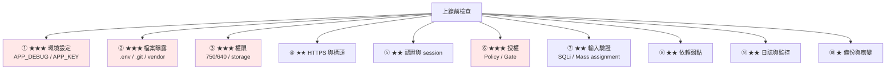

# Laravel 正式環境安全檢查表

> [!abstract] 這篇你會學到
> - **★★★ 上線前的完整檢查清單**（10 大類、60+ 項）
> - 每一項的**檢查指令**與**修正方式**
> - **★★★ 一鍵稽核腳本**（可加進部署流程與排程）
> - **應用層安全**（授權、SQL injection、Mass assignment、XSS）
> - **依賴弱點**掃描與持續監控
> - 事件應變的準備

## 前置知識

- [[04-Laravel-快取最佳化與部署流程]] — 部署流程
- [[02-Laravel-Nginx與PHP-FPM設定]] — Nginx 與 FPM 設定

---

## ★★★ 檢查清單總覽



---

## ① ★★★ 環境設定

| # | 檢查項目 | 指令 | 嚴重性 |
| --- | --- | --- | --- |
| 1.1 | `APP_ENV=production` | `grep '^APP_ENV=' .env` | ★★ |
| **1.2** | **`APP_DEBUG=false`** | `grep '^APP_DEBUG=' .env` | **★★★★** |
| 1.3 | `APP_KEY` 已設定且已備份 | `grep '^APP_KEY=base64:' .env` | ★★★ |
| 1.4 | `APP_URL` 是 https | `grep '^APP_URL=https' .env` | ★★ |
| 1.5 | `LOG_LEVEL` 不是 debug | `grep '^LOG_LEVEL=' .env` | ★★ |
| 1.6 | 時區正確 | `php artisan tinker --execute='echo config("app.timezone");'` | ★ |
| **1.7** | **`config/` 外沒有 `env()`** | `grep -rn "env(" app/ routes/` | **★★★** |
| 1.8 | Debugbar/Telescope 未啟用 | `composer show \| grep -E 'debugbar\|telescope'` | ★★ |

```bash
# ★★★★ 1.2 的重要性再強調一次
# APP_DEBUG=true 時，任何錯誤頁都會顯示【完整的 .env】
# → 資料庫密碼、APP_KEY、所有 API 金鑰

$ curl -s https://api.example.gov.tw/api/trigger-error | grep -oiE 'DB_PASSWORD|APP_KEY'
# ★ 應該完全沒有輸出
```

```php
<?php
// ★★ 1.8：Telescope 若有安裝，必須限制存取
// app/Providers/TelescopeServiceProvider.php
public function register(): void
{
    // ★★★ 正式環境只記錄異常與慢查詢
    Telescope::filter(function (IncomingEntry $entry) {
        if ($this->app->environment('local')) return true;
        return $entry->isReportableException()
            || $entry->isFailedRequest()
            || $entry->isFailedJob()
            || $entry->isScheduledTask()
            || $entry->hasMonitoredTag();
    });

    // ★★ 隱藏敏感參數
    Telescope::hideRequestParameters(['_token', 'password', 'password_confirmation']);
    Telescope::hideRequestHeaders(['cookie', 'x-csrf-token', 'x-xsrf-token', 'authorization']);
}

protected function gate(): void
{
    // ★★★ 一定要實作
    Gate::define('viewTelescope', fn ($user) => $user->hasRole('admin'));
}
```

---

## ② ★★★ 檔案曝露

| # | 路徑 | 預期 | 嚴重性 |
| --- | --- | --- | --- |
| **2.1** | `/.env` | **404/403** | **★★★★** |
| 2.2 | `/.env.example` | 404/403 | ★★ |
| **2.3** | `/.git/config` | **404/403** | **★★★** |
| 2.4 | `/composer.json` `/composer.lock` | 404/403 | ★★ |
| 2.5 | `/package.json` | 404/403 | ★ |
| **2.6** | `/storage/logs/laravel.log` | **404/403** | **★★★** |
| 2.7 | `/vendor/autoload.php` | 404/403 | ★★ |
| 2.8 | `/config/app.php` | 404/403 | ★★★ |
| 2.9 | `/database/database.sqlite` | 404/403 | ★★★ |
| 2.10 | `/artisan` | 404/403 | ★★ |
| **2.11** | `/vendor/phpunit/.../eval-stdin.php` | **404/403** | **★★★** |
| 2.12 | `.map` sourcemap | 404/403 | ★★ |
| **2.13** | PathInfo：`/storage/x.jpg/y.php` | **404** | **★★★★** |
| 2.14 | `/auth.json`（Nova） | 404/403 | ★★★ |
| 2.15 | 目錄列表（`/storage/`） | 403 | ★★ |

```bash
#!/usr/bin/env bash
# ★★★ 檔案曝露檢查
S="${1:-https://api.example.gov.tw}"
PATHS=(
  /.env /.env.example /.env.backup /.env.bak
  /.git/config /.git/HEAD
  /composer.json /composer.lock /package.json /package-lock.json
  /storage/logs/laravel.log /storage/
  /vendor/autoload.php /vendor/composer/installed.json
  /vendor/phpunit/phpunit/src/Util/PHP/eval-stdin.php
  /config/app.php /config/database.php
  /database/database.sqlite
  /artisan /auth.json /server.php /phpinfo.php /info.php
  /storage/x.jpg/y.php /index.php/x.php
  /build/app.js.map /js/app.js.map
  /.htaccess /web.config /Dockerfile /docker-compose.yml
)
FAIL=0
echo "═══ 檔案曝露檢查：$S ═══"
for p in "${PATHS[@]}"; do
    C=$(curl -sko /dev/null -w '%{http_code}' --max-time 10 "$S$p")
    if [ "$C" = 404 ] || [ "$C" = 403 ]; then
        printf '  %-56s ✓ (%s)\n' "$p" "$C"
    else
        printf '  \033[31m%-56s ✗✗ (%s)\033[0m\n' "$p" "$C"
        FAIL=$((FAIL+1))
    fi
done
echo
[ "$FAIL" -eq 0 ] && echo "  ✓ 全部擋住" || echo "  ✗✗ $FAIL 個路徑可存取"
exit "$FAIL"
```

---

## ③ ★★★ 檔案權限

| # | 檢查項目 | 預期 | 嚴重性 |
| --- | --- | --- | --- |
| **3.1** | `.env` 權限 | **≤ 640** | **★★★** |
| **3.2** | 程式碼不可被 www-data 寫 | **不可寫** | **★★★★** |
| 3.3 | `storage/` 可被 www-data 寫 | 可寫 | ★★ |
| 3.4 | `bootstrap/cache/` 可寫 | 可寫 | ★★ |
| **3.5** | 沒有 777 的目錄 | **無** | **★★★** |
| 3.6 | 私鑰權限 600 | 600 | ★★★ |
| 3.7 | `.git` 已移除 | 不存在 | ★★ |
| 3.8 | 沒有開發相依 | 無 phpunit | ★★★ |

```bash
# ★★★★ 3.2 是最關鍵的一項
$ sudo -u www-data test -w /var/www/api/current/public/index.php && \
    echo "✗✗✗ www-data 可以寫程式碼 —— 上傳漏洞會直接變 webshell" || \
    echo "✓ 程式碼唯讀"

# ★★★ 3.5
$ find /var/www/api/current -type d -perm -o+w 2>/dev/null | head
$ find /var/www/api/current -type f -perm -o+w 2>/dev/null | head
```

---

## ④ ★★ HTTPS 與安全標頭

| # | 檢查項目 | 指令 | 嚴重性 |
| --- | --- | --- | --- |
| 4.1 | HTTP 轉址到 HTTPS | `curl -sI http://...` | ★★ |
| 4.2 | TLS 1.2/1.3 only | `openssl s_client -tls1_1` 應失敗 | ★★ |
| 4.3 | `Strict-Transport-Security` | `curl -sI \| grep -i strict` | ★★ |
| 4.4 | `X-Content-Type-Options: nosniff` | 同上 | ★★ |
| 4.5 | `X-Frame-Options` / CSP `frame-ancestors` | 同上 | ★★ |
| 4.6 | `Referrer-Policy` | 同上 | ★ |
| 4.7 | 不洩漏 `X-Powered-By` | 應不存在 | ★ |
| 4.8 | 不洩漏 nginx 版本 | `Server: nginx` 無版本 | ★ |
| **4.9** | **HTTPS 三件套** | `request()->secure()` | **★★★** |
| 4.10 | 憑證有效期 > 30 天 | `openssl x509 -checkend` | ★★ |

```bash
# ★★ 完整的標頭檢查
$ curl -sI https://api.example.gov.tw/ | grep -iE \
    'strict-transport|x-content-type|x-frame|referrer-policy|content-security|permissions-policy|x-powered-by|^server'
strict-transport-security: max-age=31536000; includeSubDomains
x-content-type-options: nosniff
x-frame-options: DENY
referrer-policy: strict-origin-when-cross-origin
server: nginx                     # ★ 沒有版本號

# ★ 用 testssl.sh 完整評估
$ testssl.sh --quiet --severity HIGH https://api.example.gov.tw
```

```nginx
# ★ 4.8：隱藏版本
http {
    server_tokens off;
}
```

---

## ⑤ ★★ 認證與 Session

| # | 檢查項目 | 設定 | 嚴重性 |
| --- | --- | --- | --- |
| 5.1 | `SESSION_SECURE_COOKIE=true` | `.env` | ★★★ |
| 5.2 | `SESSION_HTTP_ONLY=true`（預設） | `config/session.php` | ★★ |
| 5.3 | `SESSION_SAME_SITE=lax` 或 `strict` | `.env` | ★★ |
| 5.4 | Session driver 是 redis/database | `.env` | ★★ |
| 5.5 | `SESSION_LIFETIME` 合理（≤120） | `.env` | ★ |
| **5.6** | **登入端點有限流** | Nginx / `RateLimiter` | **★★★** |
| 5.7 | 密碼規則（≥12 碼 + 複雜度） | `Password::defaults()` | ★★ |
| 5.8 | 密碼雜湊用 bcrypt/argon2 | `config/hashing.php` | ★★ |
| 5.9 | `AuthenticateSession` middleware | 改密碼時使其他 session 失效 | ★★ |
| 5.10 | 後台有 2FA（若可行） | — | ★★ |

```php
<?php
// ★★ 5.7：密碼規則
// AppServiceProvider::boot()
use Illuminate\Validation\Rules\Password;

Password::defaults(function () {
    return Password::min(12)
        ->letters()
        ->mixedCase()
        ->numbers()
        ->symbols()
        ->uncompromised();        // ★★ 檢查是否出現在已知的外洩資料庫（HIBP）
});
```

```php
<?php
// ★★★ 5.6：登入限流
// routes/web.php 或 bootstrap/app.php
use Illuminate\Cache\RateLimiting\Limit;
use Illuminate\Support\Facades\RateLimiter;

RateLimiter::for('login', function (Request $request) {
    return [
        // ★★ 依 IP + email 雙重限制
        Limit::perMinute(5)->by($request->ip()),
        Limit::perMinute(3)->by($request->input('email') . '|' . $request->ip()),
    ];
});

// ★ 套用
Route::post('/login', [AuthController::class, 'login'])->middleware('throttle:login');
```

```php
<?php
// ★★ 5.9：改密碼時登出其他裝置
// bootstrap/app.php
$middleware->web(append: [
    \Illuminate\Session\Middleware\AuthenticateSession::class,
]);
```

---

## ⑥ ★★★ 授權（最容易出漏洞的地方）

| # | 檢查項目 | 嚴重性 |
| --- | --- | --- |
| **6.1** | **每個 Controller 方法都有授權檢查** | **★★★★** |
| **6.2** | **沒有 IDOR**（用 ID 就能存取別人的資料） | **★★★★** |
| 6.3 | Policy 已註冊且被使用 | ★★★ |
| 6.4 | 後台有 `canAccessPanel` / `viewNova` | ★★★★ |
| 6.5 | Horizon/Telescope 的 Gate 已實作 | ★★★ |
| 6.6 | API 端點有 `auth:sanctum` | ★★★ |
| 6.7 | 敏感操作有二次確認 | ★★ |

```php
<?php
// ★★★★ 6.1/6.2：正確的授權模式
class OrderController extends Controller
{
    // ── ❌ 錯誤：IDOR ──
    public function show(int $id)
    {
        return Order::findOrFail($id);      // ★★★★ 任何登入者都能看任何訂單
    }

    // ── ✅ 方式 ①：Policy ──
    public function show(Order $order)
    {
        $this->authorize('view', $order);   // ★★ OrderPolicy::view()
        return $order;
    }

    // ── ✅ 方式 ②：查詢範圍限制 ──
    public function show(int $id)
    {
        return auth()->user()->orders()->findOrFail($id);   // ★★ 只查自己的
    }

    // ── ✅ 方式 ③：★★ 在 Model 上加全域 scope ──
    // Order::addGlobalScope(new OwnedByUserScope);
}
```

```php
<?php
// ★★ Policy
namespace App\Policies;

class OrderPolicy
{
    public function viewAny(User $user): bool
    {
        return $user->can('orders.view');
    }

    public function view(User $user, Order $order): bool
    {
        // ★★ 自己的訂單，或有管理權限
        return $order->user_id === $user->id || $user->hasRole('admin');
    }

    public function update(User $user, Order $order): bool
    {
        return ($order->user_id === $user->id && $order->status === 'draft')
            || $user->hasRole('admin');
    }

    public function delete(User $user, Order $order): bool
    {
        return $user->hasRole('admin');     // ★ 只有管理員能刪
    }
}
```

```bash
# ★★★ 6.1 掃描：找出沒有授權檢查的 Controller 方法
$ for f in app/Http/Controllers/**/*.php; do
    if ! grep -qE 'authorize|can\(|Gate::|policy|middleware' "$f"; then
        echo "⚠ $f 可能沒有授權檢查"
    fi
  done

# ★★ 更精確：列出所有 public 方法與是否有 authorize
$ grep -rn 'public function' app/Http/Controllers/ | while IFS=: read -r f l rest; do
    METHOD=$(echo "$rest" | grep -oP 'function \K\w+')
    # ★ 看方法內 20 行有沒有授權
    if ! sed -n "${l},$((l+20))p" "$f" | grep -qE 'authorize|Gate::|->can\('; then
        echo "$f:$l  $METHOD"
    fi
  done | head -20
```

```php
<?php
// ★★ 強制所有 Controller 都要授權（★ 最保險的做法）
// AppServiceProvider::boot()
use Illuminate\Support\Facades\Gate;

Gate::after(function ($user, $ability, $result) {
    // ★ 記錄所有授權失敗（★ 便於發現攻擊嘗試）
    if ($result === false) {
        Log::channel('security')->info('授權被拒', [
            'user_id' => $user?->id,
            'ability' => $ability,
            'url'     => request()->fullUrl(),
            'ip'      => request()->ip(),
        ]);
    }
});
```

---

## ⑦ ★★ 輸入驗證與注入

| # | 檢查項目 | 嚴重性 |
| --- | --- | --- |
| **7.1** | **沒有字串拼接的 SQL** | **★★★★** |
| 7.2 | `whereRaw` / `DB::raw` 有參數綁定 | ★★★ |
| **7.3** | **Model 有 `$fillable`（不是 `$guarded = []`）** | **★★★** |
| 7.4 | 所有請求都經過 validate | ★★★ |
| 7.5 | 檔案上傳有型別與大小限制 | ★★★ |
| 7.6 | Blade 沒有濫用 `{!! !!}` | ★★★ |
| 7.7 | 沒有 `unserialize()` 使用者輸入 | ★★★ |
| 7.8 | 沒有 `eval()` / `exec()` 使用者輸入 | ★★★★ |
| 7.9 | 重導向有白名單 | ★★ |
| 7.10 | 外部請求有 SSRF 防護 | ★★★ |

```bash
# ★★★★ 7.1/7.2：掃描 SQL injection 風險
$ grep -rn --include='*.php' -E \
    "(whereRaw|selectRaw|orderByRaw|havingRaw|DB::raw|DB::(select|statement|update|delete))\s*\(" \
    app/ | grep -vE '\?|:\w+' | head -20
# ★ 有輸出的地方要逐一檢查有沒有用參數綁定

# ★★ 找出字串拼接
$ grep -rn --include='*.php' -E 'whereRaw\(.*\$' app/ | head
```

```php
<?php
// ❌ SQL injection
$users = DB::select("SELECT * FROM users WHERE name = '$name'");
User::whereRaw("name = '$name'")->get();
User::orderByRaw("$column $direction")->get();     // ★★ 欄位名注入

// ✅ 參數綁定
$users = DB::select('SELECT * FROM users WHERE name = ?', [$name]);
User::whereRaw('name = ?', [$name])->get();
User::where('name', $name)->get();                  // ★ 最好

// ✅ ★★ 欄位名要用白名單
$allowed = ['id', 'name', 'created_at'];
$column = in_array($request->sort, $allowed, true) ? $request->sort : 'id';
$dir = $request->dir === 'desc' ? 'desc' : 'asc';
User::orderBy($column, $dir)->get();
```

```php
<?php
// ★★★ 7.3：Mass assignment
class User extends Model
{
    // ❌ 危險
    protected $guarded = [];            // ★★★ 所有欄位都可以被批次賦值
    // → User::create($request->all()) → 攻擊者送 is_admin=1 → ★★★ 提權

    // ✅ 明確列出
    protected $fillable = ['name', 'email', 'phone'];

    // ✅ 或明確保護
    protected $guarded = ['id', 'is_admin', 'role_id', 'email_verified_at'];
}
```

```bash
# ★★★ 掃描
$ grep -rn 'protected \$guarded = \[\]' app/Models/
$ grep -rn '::create(\$request->all())' app/ | head
$ grep -rn '->update(\$request->all())' app/ | head
```

```php
<?php
// ★★ 7.6：Blade 的 XSS
// ✅ 自動跳脫
{{ $user->name }}

// ★★★ 不跳脫（只用於【你完全信任】的 HTML）
{!! $trustedHtml !!}

// ★★ 使用者輸入的富文字 → 一定要淨化
// composer require mews/purifier
{!! clean($post->content) !!}
```

```bash
# ★★★ 掃描 {!! !!}
$ grep -rn '{!!' resources/views/ | grep -v '{!! *\$__env' | head -20
# ★ 每一處都要確認資料來源可信
```

```php
<?php
// ★★ 7.9：重導向白名單
public function redirect(Request $request)
{
    $to = $request->input('redirect');

    // ❌ Open redirect
    // return redirect($to);

    // ✅ ★★ 只允許站內
    if (!$to || !str_starts_with($to, '/') || str_starts_with($to, '//')) {
        return redirect('/');
    }
    return redirect($to);

    // ✅ ★ 或用命名路由的白名單
    // $allowed = ['dashboard', 'profile', 'orders.index'];
    // return redirect()->route(in_array($to, $allowed) ? $to : 'dashboard');
}
```

---

## ⑧ ★★ 依賴弱點

```bash
# ═══ ★★ PHP 依賴 ═══
$ composer audit
$ composer audit --format=json | jq '.advisories | to_entries | length'

# ★ 只看高風險
$ composer audit --format=json | \
    jq -r '.advisories | to_entries[] | .value[] |
      select(.severity == "high" or .severity == "critical") |
      "\(.packageName) \(.severity) \(.title)"'

# ═══ ★★ NPM 依賴 ═══
$ npm audit --production
$ npm audit --production --json | jq '.metadata.vulnerabilities'

# ═══ ★ 已淘汰的套件 ═══
$ composer outdated --direct
$ npm outdated

# ═══ ★★ Laravel 本身的版本 ═══
$ php artisan --version
$ composer show laravel/framework | grep versions
# ★ 對照 https://laravel.com/docs/releases 的支援期限
```

```yaml
# ★★ CI 中的持續掃描
# .github/workflows/security.yml
name: 安全掃描

on:
  schedule:
    - cron: '0 3 * * 1'        # ★ 每週一
  push:
    branches: [main]

jobs:
  audit:
    runs-on: ubuntu-latest
    steps:
      - uses: actions/checkout@v4
      - uses: shivammathur/setup-php@v2
        with: { php-version: '8.3' }

      - run: composer install --no-dev --no-interaction

      - name: composer audit
        run: composer audit --format=plain

      - uses: actions/setup-node@v4
        with: { node-version: '22' }
      - run: npm ci
      - run: npm audit --production --audit-level=high

      # ★★ 靜態分析
      - name: PHPStan
        run: |
          composer require --dev phpstan/phpstan larastan/larastan
          ./vendor/bin/phpstan analyse --level=5 app/

      # ★ 安全專用的靜態分析
      - name: 掃描危險函式
        run: |
          ! grep -rn --include='*.php' -E '\b(eval|exec|shell_exec|system|passthru|popen|proc_open|assert)\s*\(' app/ || \
            { echo "✗✗ 發現危險函式"; exit 1; }
          ! grep -rn 'protected \$guarded = \[\]' app/Models/ || \
            { echo "✗✗ 發現 \$guarded = []"; exit 1; }
          ! grep -rn "env(" app/ routes/ database/ --include='*.php' || \
            { echo "✗✗ config/ 外使用 env()"; exit 1; }
```

---

## ⑨ ★★ 日誌與監控

| # | 檢查項目 | 嚴重性 |
| --- | --- | --- |
| 9.1 | `LOG_CHANNEL=daily` 且有輪替 | ★★ |
| 9.2 | 日誌不含密碼與 token | ★★★ |
| 9.3 | 有記錄認證失敗 | ★★ |
| 9.4 | 有記錄授權失敗 | ★★ |
| 9.5 | 有記錄敏感操作（稽核） | ★★★ |
| 9.6 | 錯誤有告警（不是只寫檔案） | ★★ |
| 9.7 | 磁碟空間監控 | ★★ |
| 9.8 | 憑證到期監控 | ★★ |

```php
<?php
// ★★★ 9.2：不要記錄敏感資料
// config/logging.php
'channels' => [
    'daily' => [
        'driver' => 'daily',
        'path'   => storage_path('logs/laravel.log'),
        'level'  => env('LOG_LEVEL', 'warning'),
        'days'   => 14,
        'permission' => 0640,          // ★★
    ],
    'security' => [
        'driver' => 'daily',
        'path'   => storage_path('logs/security.log'),
        'level'  => 'info',
        'days'   => 365,               // ★★ 稽核記錄保留一年
        'permission' => 0640,
    ],
],
```

```php
<?php
// ★★ 9.3/9.4：記錄安全事件
// app/Providers/EventServiceProvider.php 或 bootstrap/app.php
use Illuminate\Auth\Events\Failed;
use Illuminate\Auth\Events\Lockout;
use Illuminate\Auth\Events\Login;
use Illuminate\Auth\Events\Logout;

Event::listen(Failed::class, function (Failed $e) {
    Log::channel('security')->warning('登入失敗', [
        'email' => $e->credentials['email'] ?? null,     // ★ 不要記密碼
        'ip'    => request()->ip(),
        'ua'    => request()->userAgent(),
    ]);
});

Event::listen(Lockout::class, function (Lockout $e) {
    Log::channel('security')->error('★★ 帳號被鎖定（多次登入失敗）', [
        'ip' => $e->request->ip(),
        'email' => $e->request->input('email'),
    ]);
});

Event::listen(Login::class, function (Login $e) {
    Log::channel('security')->info('登入成功', [
        'user_id' => $e->user->id,
        'ip'      => request()->ip(),
    ]);
});
```

```bash
# ★★★ 9.2 驗證：日誌裡有沒有敏感資料
$ sudo grep -iE '(password|passwd|secret|token|api_key|authorization)["\x27]?\s*[:=]\s*["\x27]?[A-Za-z0-9+/=]{8,}' \
    /var/www/api/shared/storage/logs/*.log | head
# ★ 應該沒有輸出

# ★ 檢查權限
$ ls -la /var/www/api/shared/storage/logs/
-rw-r----- 1 www-data www-data 128421 laravel-2026-08-28.log    # ★ 640
```

---

## ⑩ ★ 備份與應變

| # | 檢查項目 | 嚴重性 |
| --- | --- | --- |
| 10.1 | 資料庫每日備份 | ★★★ |
| 10.2 | **備份有驗證能還原** | ★★★ |
| 10.3 | 備份異地保存 | ★★ |
| 10.4 | `APP_KEY` 與備份分開保管 | ★★★ |
| 10.5 | 上傳的檔案有備份 | ★★ |
| 10.6 | 有回退機制（releases） | ★★★ |
| 10.7 | 有事件應變流程文件 | ★★ |
| 10.8 | 緊急聯絡人清單 | ★★ |

```bash
# ★★★ 10.2：備份還原演練（★ 每季一次）
$ BAK=$(ls -t /backup/db/*.sql.gz | head -1)
$ mysql -u root -p -e "CREATE DATABASE restore_test;"
$ zcat "$BAK" | mysql -u root -p restore_test
$ mysql -u root -p -e "
  SELECT COUNT(*) AS 資料表數 FROM information_schema.TABLES WHERE TABLE_SCHEMA='restore_test';
  SELECT COUNT(*) AS 使用者數 FROM restore_test.users;
  SELECT MAX(created_at) AS 最新資料 FROM restore_test.orders;"
$ mysql -u root -p -e "DROP DATABASE restore_test;"
```

---

## ★★★ 一鍵稽核腳本

```bash
#!/usr/bin/env bash
# /usr/local/bin/laravel-security-audit —— Laravel 正式環境安全稽核
# 用法：laravel-security-audit [APP路徑] [網址]
set -uo pipefail

APP="${1:-/var/www/api}"
SITE="${2:-https://api.example.gov.tw}"
CUR="$APP/current"
ENV="$APP/shared/.env"

PASS=0; WARN=0; FAIL=0
REPORT="/var/log/laravel-security-audit-$(date +%Y%m%d).txt"

exec > >(tee "$REPORT") 2>&1

pass(){ printf '  \033[32m✓\033[0m %s\n' "$1"; PASS=$((PASS+1)); }
warn(){ printf '  \033[33m⚠\033[0m %s\n' "$1"; WARN=$((WARN+1)); }
fail(){ printf '  \033[31m✗✗\033[0m %s\n' "$1"; FAIL=$((FAIL+1)); }
chk(){ if eval "$2" >/dev/null 2>&1; then pass "$1"; else fail "$1"; fi; }
chkw(){ if eval "$2" >/dev/null 2>&1; then pass "$1"; else warn "$1"; fi; }
code(){ curl -sko /dev/null -w '%{http_code}' --max-time 10 "$1"; }

cat <<EOF
═══════════════════════════════════════════════
  Laravel 正式環境安全稽核
  路徑：$APP
  網址：$SITE
  時間：$(date -Is)
═══════════════════════════════════════════════
EOF

# ═══════ ① 環境設定 ═══════
echo -e "\n【① ★★★ 環境設定】"
chk "APP_ENV=production"            "grep -q '^APP_ENV=production' '$ENV'"
chk "★★★★ APP_DEBUG=false"           "grep -q '^APP_DEBUG=false' '$ENV'"
chk "APP_KEY 已設定"                "grep -q '^APP_KEY=base64:' '$ENV'"
chk "APP_URL 是 https"              "grep -q '^APP_URL=https' '$ENV'"
chkw "LOG_LEVEL 不是 debug"          "! grep -q '^LOG_LEVEL=debug' '$ENV'"
chkw "SESSION_DRIVER 是 redis/database" \
     "grep -qE '^SESSION_DRIVER=(redis|database)' '$ENV'"

N=$(grep -rn "env(" "$CUR/app" "$CUR/routes" "$CUR/database" \
    --include='*.php' 2>/dev/null | grep -vc 'config/' || echo 0)
if [ "$N" -eq 0 ]; then pass "★★★ config/ 外沒有 env() 呼叫"
else fail "★★★ config/ 外有 $N 處 env() 呼叫（config:cache 後會是 null）"
     grep -rn "env(" "$CUR/app" "$CUR/routes" --include='*.php' 2>/dev/null | head -3 | sed 's/^/      /'
fi

chkw "沒有 debugbar" "! grep -q 'barryvdh/laravel-debugbar' '$CUR/composer.json'"

# ═══════ ② 檔案曝露 ═══════
echo -e "\n【② ★★★ 檔案曝露】"
for p in /.env /.env.example /.git/config /composer.json /composer.lock \
         /storage/logs/laravel.log /vendor/autoload.php /config/app.php \
         /artisan /auth.json /package.json \
         /vendor/phpunit/phpunit/src/Util/PHP/eval-stdin.php \
         /database/database.sqlite; do
    C=$(code "$SITE$p")
    if [ "$C" = 404 ] || [ "$C" = 403 ]; then pass "$p ($C)"
    else fail "$p 可存取 ($C)"; fi
done

C=$(code "$SITE/storage/x.jpg/y.php")
[ "$C" = 404 ] && pass "★★★★ PathInfo 攻擊防護 ($C)" || fail "★★★★ PathInfo 防護失效 ($C)"

# ═══════ ③ 權限 ═══════
echo -e "\n【③ ★★★ 檔案權限】"
P=$(stat -Lc %a "$ENV" 2>/dev/null || echo 999)
[ "$P" -le 640 ] && pass ".env 權限 $P" || fail ".env 權限 $P（應 ≤640）"

if sudo -u www-data test -w "$CUR/public/index.php" 2>/dev/null; then
    fail "★★★★ www-data 可以寫程式碼（上傳漏洞 = webshell）"
else
    pass "★★★★ 程式碼對 www-data 唯讀"
fi

chk "storage 可被 www-data 寫"      "sudo -u www-data test -w '$APP/shared/storage'"
chk "bootstrap/cache 可寫"          "sudo -u www-data test -w '$CUR/bootstrap/cache'"

W777=$(find "$CUR" -type d -perm -o+w 2>/dev/null | wc -l)
[ "$W777" -eq 0 ] && pass "★★★ 沒有 world-writable 目錄" || \
  { fail "★★★ 有 $W777 個 world-writable 目錄"; \
    find "$CUR" -type d -perm -o+w 2>/dev/null | head -3 | sed 's/^/      /'; }

chk "★ .git 已移除"                 "[ ! -d '$CUR/.git' ]"
chk "★ node_modules 已移除"         "[ ! -d '$CUR/node_modules' ]"
chk "★★ 沒有開發相依（phpunit）"     "! [ -d '$CUR/vendor/phpunit' ]"

# ═══════ ④ HTTPS 與標頭 ═══════
echo -e "\n【④ ★★ HTTPS 與安全標頭】"
chk "HTTP 轉址到 HTTPS"    "curl -sI ${SITE/https/http}/ --max-time 10 | grep -qE '30[128]'"
chk "★★ HSTS"              "curl -skI $SITE/ | grep -qi strict-transport-security"
chk "★★ X-Content-Type-Options" "curl -skI $SITE/ | grep -qi 'x-content-type-options'"
chkw "X-Frame-Options / CSP" \
     "curl -skI $SITE/ | grep -qiE 'x-frame-options|content-security-policy'"
chkw "Referrer-Policy"     "curl -skI $SITE/ | grep -qi referrer-policy"
chk "★ 不洩漏 X-Powered-By" "! curl -skI $SITE/ | grep -qi x-powered-by"
chk "★ 不洩漏 nginx 版本"   "! curl -skI $SITE/ | grep -qiE 'server:.*nginx/[0-9]'"
chk "★ TLS 1.1 已停用"      "! echo | timeout 8 openssl s_client -connect \$(echo $SITE|sed 's|https://||'):443 -tls1_1 2>/dev/null | grep -q 'Cipher.*:.*[A-Z]'"

# ★ 憑證到期
H=$(echo "$SITE" | sed 's|https://||;s|/.*||')
E=$(echo | timeout 10 openssl s_client -connect "$H:443" -servername "$H" 2>/dev/null | \
    openssl x509 -noout -enddate 2>/dev/null | cut -d= -f2)
if [ -n "$E" ]; then
    D=$(( ($(date -d "$E" +%s) - $(date +%s)) / 86400 ))
    [ "$D" -gt 30 ] && pass "憑證剩餘 $D 天" || fail "★★ 憑證僅剩 $D 天"
fi

# ═══════ ⑤ 認證與 Session ═══════
echo -e "\n【⑤ ★★ 認證與 Session】"
chk "★★★ SESSION_SECURE_COOKIE=true" "grep -q '^SESSION_SECURE_COOKIE=true' '$ENV'"
chkw "SESSION_SAME_SITE"             "grep -qE '^SESSION_SAME_SITE=(lax|strict)' '$ENV'"
chkw "SESSION_LIFETIME ≤ 240"        "[ \$(grep '^SESSION_LIFETIME=' '$ENV' | cut -d= -f2 || echo 120) -le 240 ]"
chkw "★★ 有登入限流"                  "grep -rq 'throttle' '$CUR/routes/' 2>/dev/null || sudo nginx -T 2>/dev/null | grep -q 'limit_req.*login'"
chkw "★★ 密碼規則有設定"              "grep -rq 'Password::defaults' '$CUR/app/Providers/' 2>/dev/null"

# ═══════ ⑥ 授權 ═══════
echo -e "\n【⑥ ★★★ 授權】"
if [ -f "$CUR/app/Models/User.php" ]; then
    if grep -q 'FilamentUser' "$CUR/app/Models/User.php"; then
        chk "★★★★ Filament canAccessPanel" "grep -q 'function canAccessPanel' '$CUR/app/Models/User.php'"
    fi
fi
if [ -f "$CUR/app/Providers/NovaServiceProvider.php" ]; then
    if sed -n "/define('viewNova'/,/});/p" "$CUR/app/Providers/NovaServiceProvider.php" | \
       grep -qE '^\s*return true;'; then
        fail "★★★★ Nova viewNova 回傳 true"
    else
        pass "★★★ Nova viewNova 有條件"
    fi
fi
if [ -f "$CUR/app/Providers/HorizonServiceProvider.php" ]; then
    chkw "★★ Horizon Gate" "grep -q 'viewHorizon' '$CUR/app/Providers/HorizonServiceProvider.php'"
fi
if [ -f "$CUR/app/Providers/TelescopeServiceProvider.php" ]; then
    chkw "★★ Telescope Gate" "grep -q 'viewTelescope' '$CUR/app/Providers/TelescopeServiceProvider.php'"
fi

NP=$(ls "$CUR/app/Policies/"*.php 2>/dev/null | wc -l)
[ "$NP" -gt 0 ] && pass "有 $NP 個 Policy" || warn "★★ 沒有任何 Policy（★ 檢查授權是否用其他方式）"

# ═══════ ⑦ 輸入驗證 ═══════
echo -e "\n【⑦ ★★ 輸入驗證與注入】"
G=$(grep -rln 'protected \$guarded = \[\]' "$CUR/app/Models/" 2>/dev/null | wc -l)
[ "$G" -eq 0 ] && pass "★★★ 沒有 \$guarded = []" || \
  { fail "★★★ $G 個 Model 用了 \$guarded = []（mass assignment 風險）"; \
    grep -rln 'protected \$guarded = \[\]' "$CUR/app/Models/" | head -3 | sed 's/^/      /'; }

R=$(grep -rn --include='*.php' -E '(whereRaw|selectRaw|orderByRaw|DB::raw)\s*\(' \
    "$CUR/app" 2>/dev/null | grep -vE '\?|:\w+|\[\]' | wc -l)
[ "$R" -eq 0 ] && pass "★★★ 沒有可疑的 raw SQL" || \
  { warn "★★★ 有 $R 處 raw SQL（★ 請人工確認有參數綁定）"; \
    grep -rn --include='*.php' -E '(whereRaw|selectRaw|orderByRaw|DB::raw)\s*\(' \
      "$CUR/app" 2>/dev/null | grep -vE '\?|:\w+' | head -3 | sed 's/^/      /'; }

D=$(grep -rn --include='*.php' -E '\b(eval|exec|shell_exec|system|passthru|popen|proc_open|assert)\s*\(' \
    "$CUR/app" 2>/dev/null | wc -l)
[ "$D" -eq 0 ] && pass "★★★★ 沒有危險函式" || \
  { fail "★★★★ 有 $D 處危險函式"; \
    grep -rn --include='*.php' -E '\b(eval|exec|shell_exec|system)\s*\(' "$CUR/app" | head -3 | sed 's/^/      /'; }

U=$(grep -rn --include='*.php' 'unserialize(' "$CUR/app" 2>/dev/null | wc -l)
[ "$U" -eq 0 ] && pass "★★ 沒有 unserialize()" || warn "★★ 有 $U 處 unserialize()"

B=$(grep -rn '{!!' "$CUR/resources/views/" 2>/dev/null | grep -vc '__env' || echo 0)
[ "$B" -eq 0 ] && pass "Blade 沒有 {!! !!}" || warn "★★ Blade 有 $B 處 {!! !!}（★ 確認資料來源可信）"

chkw "★★ open_basedir 有設定"  "php-fpm8.3 -i 2>/dev/null | grep -qE 'open_basedir => /var/www'"
chkw "★★ disable_functions 有設" "php-fpm8.3 -i 2>/dev/null | grep -q 'disable_functions => .*exec'"

# ═══════ ⑧ 依賴 ═══════
echo -e "\n【⑧ ★★ 依賴弱點】"
cd "$CUR" 2>/dev/null || true
if composer audit --no-interaction >/dev/null 2>&1; then
    pass "composer audit 通過"
else
    NV=$(composer audit --format=json 2>/dev/null | jq '[.advisories[]] | length' 2>/dev/null || echo "?")
    fail "★★ composer audit 發現 $NV 個弱點"
    composer audit --format=plain 2>/dev/null | head -8 | sed 's/^/      /'
fi

LV=$(php artisan --version 2>/dev/null | grep -oP '\d+\.\d+' | head -1)
[ -n "$LV" ] && pass "Laravel $LV（★ 請對照官方支援期限）"

# ═══════ ⑨ 日誌 ═══════
echo -e "\n【⑨ ★★ 日誌與監控】"
chkw "LOG_CHANNEL=daily"  "grep -qE '^LOG_CHANNEL=(daily|stack)' '$ENV'"

LP=$(stat -c %a "$APP/shared/storage/logs" 2>/dev/null || echo 999)
[ "$LP" -le 770 ] && pass "logs 目錄權限 $LP" || warn "logs 目錄權限 $LP"

if sudo grep -qiE '(password|secret|api_key)["\x27]?\s*[:=]\s*["\x27]?[A-Za-z0-9+/=]{12,}' \
     "$APP/shared/storage/logs/"*.log 2>/dev/null; then
    fail "★★★ 日誌中可能有敏感資料"
else
    pass "★★★ 日誌中沒有明顯的敏感資料"
fi

ERR=$(sudo grep -c 'production.ERROR' "$APP/shared/storage/logs/laravel-$(date +%Y-%m-%d).log" 2>/dev/null || echo 0)
[ "${ERR:-0}" -lt 50 ] && pass "今日錯誤 $ERR 筆" || warn "★ 今日錯誤 $ERR 筆（偏多）"

DISK=$(df -h "$APP" | tail -1 | awk '{gsub("%","",$5); print $5}')
[ "$DISK" -lt 85 ] && pass "磁碟使用率 ${DISK}%" || fail "★★ 磁碟使用率 ${DISK}%"

# ═══════ ⑩ 備份 ═══════
echo -e "\n【⑩ ★ 備份與應變】"
LB=$(ls -t /backup/db/*.sql.gz 2>/dev/null | head -1)
if [ -n "$LB" ]; then
    AGE=$(( ($(date +%s) - $(stat -c %Y "$LB")) / 3600 ))
    [ "$AGE" -lt 48 ] && pass "最新備份 ${AGE} 小時前（$(du -h "$LB"|cut -f1)）" || \
      fail "★★ 最新備份是 ${AGE} 小時前"
else
    fail "★★★ 找不到資料庫備份"
fi

NR=$(ls -1d "$APP/releases/"*/ 2>/dev/null | wc -l)
[ "$NR" -ge 2 ] && pass "有 $NR 個 release（可回退）" || warn "只有 $NR 個 release"

# ═══════ 總結 ═══════
cat <<EOF

═══════════════════════════════════════════════
  ✓ 通過 $PASS    ⚠ 警告 $WARN    ✗ 失敗 $FAIL
  報告：$REPORT
═══════════════════════════════════════════════
EOF

if [ "$FAIL" -gt 0 ]; then
    echo "  ★★★ 有 $FAIL 項未通過，【不建議上線】"
    exit 2
elif [ "$WARN" -gt 0 ]; then
    echo "  ★ 有 $WARN 項警告，建議處理後上線"
    exit 1
else
    echo "  ✓✓ 全部通過"
    exit 0
fi
```

```bash
$ sudo chmod +x /usr/local/bin/laravel-security-audit
$ laravel-security-audit /var/www/api https://api.example.gov.tw

# ★★ 加進部署流程（★ 上線前必跑）
# ★ 排程定期稽核
$ sudo tee /etc/cron.d/laravel-security-audit >/dev/null <<'EOF'
0 6 * * 1 root /usr/local/bin/laravel-security-audit /var/www/api https://api.example.gov.tw > /tmp/audit.txt 2>&1; \
  grep -q '不建議上線' /tmp/audit.txt && \
  mail -s "【警告】Laravel 安全稽核未通過" ops@example.gov.tw ciso@example.gov.tw < /tmp/audit.txt
EOF
```

---

## 常見錯誤與排錯

| 現象 | 原因 | 解法 |
| --- | --- | --- |
| **`.env` 可下載** ★★★★ | Nginx 沒擋 / root 指錯 | `root .../public;` + `location ~ /\.` |
| **錯誤頁顯示 .env 內容** ★★★★ | `APP_DEBUG=true` | 設 `false` |
| **任意檔案被當 PHP 執行** ★★★★ | 缺 `try_files $uri =404` | 加上 |
| **使用者能看別人的資料（IDOR）** ★★★★ | 沒有授權檢查 | Policy 或查詢範圍限制 |
| **提權（改 `is_admin`）** ★★★ | `$guarded = []` | 用 `$fillable` |
| **SQL injection** ★★★★ | 字串拼接 | 參數綁定；欄位名白名單 |
| **XSS** ★★★ | 濫用 `{!! !!}` | 用 `{{ }}` 或淨化 |
| **www-data 可寫程式碼** ★★★★ | 權限 777 或擁有者錯 | 750/640 deploy:www-data |
| 日誌洩漏密碼 ★★★ | 記錄了完整請求 | 過濾敏感欄位 |
| **後台任何人都能進** ★★★★ | Gate 沒實作 | `canAccessPanel` / `viewNova` |
| 依賴有已知弱點 ★★ | 沒定期掃描 | CI 加 `composer audit` |
| **備份無法還原** ★★★ | 沒演練 | 每季演練一次 |

---

## 安全性注意事項

> [!danger] 最嚴重的五項（★★★★）
> ```
> ① APP_DEBUG=true
>    → 錯誤頁顯示【完整的 .env】（DB 密碼、APP_KEY、所有 API 金鑰）
>
> ② .env 可從網路存取
>    → 同上，而且不需要觸發錯誤
>
> ③ 缺少 try_files $uri =404
>    → 上傳漏洞【直接變 RCE】
>
> ④ www-data 可以寫程式碼（chmod 777）
>    → 同上
>
> ⑤ 沒有授權檢查（IDOR）
>    → 任何登入者可以存取【所有人的資料】
>    → ★ 這是機關系統最常見的個資外洩原因
>
> ★★★ 這五項任何一項成立，都不應該上線
> ```

> [!warning] 事件應變的準備 ★★
> ```
> ★★ 事前準備（★ 出事時沒時間準備）：
>   ① 【聯絡人清單】
>      · 系統負責人與備援
>      · 資安窗口
>      · 上級主管
>      · 廠商（若有委外）
>
>   ② 【緊急處置的權限與方法】
>      · 誰能把服務下線
>      · ★ 如何快速回退（rollback-laravel）
>      · 如何切斷特定 IP（ufw / Nginx deny）
>      · ★★ 如何強制所有使用者登出
>        php artisan cache:clear（session 在 Redis 時）
>        或更換 APP_KEY（★ 但會影響加密欄位）
>
>   ③ 【證據保全】
>      · ★★ 不要急著重裝（會毀掉證據）
>      · 先備份日誌、記憶體、磁碟映像
>      · ★ 記錄時間軸
>
>   ④ 【通報義務】
>      · ★★ 個資外洩有法定通報時限
>      · 資安事件的通報層級與窗口
>
> ★ 每年演練一次
> ```

```bash
# ★★ 緊急下線
$ sudo tee /usr/local/bin/emergency-maintenance >/dev/null <<'EOF'
#!/usr/bin/env bash
# ★ 緊急進入維護模式
APP=/var/www/api
case "${1:-on}" in
  on)
    cd "$APP/current"
    php artisan down --render="errors::503" --retry=60 \
      --secret="$(openssl rand -hex 16)"     # ★ 記下這個 secret 可以繞過
    echo "★ 已進入維護模式"
    echo "★ 管理員可用 /<secret> 存取（見上方輸出）"
    ;;
  off)
    cd "$APP/current" && php artisan up
    echo "✓ 已恢復服務"
    ;;
  block)
    # ★ 封鎖特定 IP
    sudo ufw deny from "$2" to any
    echo "✓ 已封鎖 $2"
    ;;
esac
EOF
$ sudo chmod +x /usr/local/bin/emergency-maintenance
```

---

## 速查表

### ★★★★ 上線前的五個致命項

```bash
# ① APP_DEBUG
grep '^APP_DEBUG=' /var/www/api/shared/.env        # 必須是 false

# ② .env 曝露
curl -so /dev/null -w '%{http_code}\n' https://api/.env       # 必須 404

# ③ PathInfo 攻擊
curl -so /dev/null -w '%{http_code}\n' https://api/storage/x.jpg/y.php   # 必須 404

# ④ 程式碼可寫
sudo -u www-data test -w /var/www/api/current/public/index.php && echo "✗✗✗"

# ⑤ 授權檢查（IDOR）
# → 用兩個帳號測試能否存取對方的資料
```

### 十大類檢查

```
① ★★★ 環境設定    APP_DEBUG / APP_KEY / config 外的 env()
② ★★★ 檔案曝露    .env / .git / vendor / PathInfo
③ ★★★ 權限        750/640 / storage 770 / 無 777
④ ★★  HTTPS 標頭  HSTS / nosniff / 三件套
⑤ ★★  認證 Session Secure cookie / 限流 / 密碼規則
⑥ ★★★ 授權        Policy / IDOR / 後台 Gate
⑦ ★★  輸入驗證    SQLi / mass assignment / XSS
⑧ ★★  依賴弱點    composer audit / npm audit
⑨ ★★  日誌監控    不記敏感資料 / 告警
⑩ ★   備份應變    每日備份 / 還原演練 / 回退機制
```

### 掃描指令

```bash
# ★★★ config/ 外的 env()
grep -rn "env(" app/ routes/ database/ --include='*.php' | grep -v config/

# ★★★ mass assignment
grep -rn 'protected \$guarded = \[\]' app/Models/

# ★★★★ 危險函式
grep -rn --include='*.php' -E '\b(eval|exec|shell_exec|system|passthru)\s*\(' app/

# ★★★ raw SQL
grep -rn --include='*.php' -E '(whereRaw|selectRaw|orderByRaw|DB::raw)\s*\(' app/ | grep -v '?'

# ★★ Blade XSS
grep -rn '{!!' resources/views/ | grep -v __env

# ★★ 依賴
composer audit && npm audit --production
```

### 一鍵稽核

```bash
laravel-security-audit /var/www/api https://api.example.gov.tw
# exit 0 = 全過   1 = 有警告   2 = 有失敗（★ 不應上線）
```

### 授權的三種正確做法

```php
$this->authorize('view', $order);                       // ① Policy
auth()->user()->orders()->findOrFail($id);              // ② 查詢範圍限制
Order::addGlobalScope(new OwnedByUserScope);            // ③ 全域 scope
```

### 緊急應變

```bash
php artisan down --secret="$(openssl rand -hex 16)"     # ★ 維護模式
sudo -u deploy rollback-laravel                          # ★ 回退
sudo ufw deny from <IP>                                  # ★ 封鎖 IP
php artisan cache:clear                                  # ★ 強制登出（Redis session）
```

---

## 練習題

> [!question]- 練習 1：五個致命項的實測 ★★★★
> **★ 在測試環境**逐一製造再修復：
> 1. `APP_DEBUG=true` → 觸發錯誤 → **看到什麼？**
> 2. `root` 指到專案根目錄 → `curl /.env` → **拿到什麼？**
> 3. 拿掉 `try_files $uri =404` → 測 PathInfo → **能執行嗎？**
> 4. `chmod -R 777` → `sudo -u www-data touch .../index.php` → 成功嗎？
> 5. Controller 用 `Order::findOrFail($id)` → 用 A 帳號存取 B 的訂單
> 6. **每一項都修復並驗證**

> [!question]- 練習 2：IDOR 的完整測試 ★★★★
> 1. 建立兩個使用者 A、B，各自有訂單
> 2. 用 A 登入，取得自己訂單的 ID（例如 5）
> 3. **改網址存取 B 的訂單 ID（例如 6）** → **看得到嗎？**
> 4. 用 API 測試（`/api/orders/6`）→ 呢？
> 5. 加上 Policy → 再測
> 6. **把所有 Resource 的 ID 都測一遍**（訂單、檔案、使用者…）

> [!question]- 練習 3：Mass assignment 提權 ★★★
> 1. `User` 設 `protected $guarded = [];`
> 2. 註冊時 `User::create($request->all())`
> 3. **送出 `is_admin=1` 或 `role_id=1`** → **成功提權了嗎？**
> 4. 改成 `$fillable = ['name', 'email', 'password']`
> 5. 再測 → 被擋掉了嗎？
> 6. **掃描專案中所有 `$request->all()` 的使用**

> [!question]- 練習 4：一鍵稽核腳本
> 1. 部署 `laravel-security-audit`
> 2. 執行 → **有幾項 ✗？幾項 ⚠？**
> 3. **逐一修復**（從 ★★★★ 開始）
> 4. 再執行直到全部通過
> 5. **加進部署腳本**（上線前必跑，失敗就中止）
> 6. 設定每週排程與告警

> [!question]- 練習 5：事件應變演練
> 假設收到通報「系統有異常的資料存取」：
> 1. **第一步該做什麼？**（提示：不是重裝）
> 2. 用 `emergency-maintenance on` 進入維護模式
> 3. 保全證據：備份日誌、記錄時間軸
> 4. 查 `storage/logs/security.log` 找異常
> 5. 分析 Nginx access log 找攻擊來源
> 6. 回退到已知安全的版本
> 7. **寫出完整的事件報告與改善措施**

---

## 小測驗

Q1. **上線前最致命的五項檢查是什麼**？

Q2. **`APP_DEBUG=true` 為什麼是最嚴重的設定錯誤**？

Q3. **什麼是 IDOR？三種正確的防護做法**？

Q4. **`$guarded = []` 有什麼風險**？

Q5. **`orderByRaw($column)` 的注入風險與正確做法**？

Q6. **為什麼「www-data 不可寫程式碼」這麼重要**？

Q7. **`config/` 以外使用 `env()` 會怎樣**？

Q8. **Blade 的 `{{ }}` 與 `{!! !!}` 差在哪**？

Q9. **日誌中不該出現什麼？怎麼檢查**？

Q10. **收到資安事件通報時，第一步該做什麼**？

> [!question]- 測驗答案
> **Q1.** ①**`APP_DEBUG=true`** —— 錯誤頁顯示完整的 `.env`；
> ②**`.env` 可從網路存取** —— 不需要觸發錯誤就能拿到所有機密；
> ③**缺少 `try_files $uri =404`** —— 上傳漏洞直接變 RCE；
> ④**`www-data` 可以寫程式碼**（`chmod 777`）—— 同樣導致 webshell；
> ⑤**沒有授權檢查（IDOR）** —— 任何登入者可以存取所有人的資料，
> **這是機關系統最常見的個資外洩原因**。
> **這五項任何一項成立，都不應該上線**。
> 前四項可以用 `curl` 與 `sudo -u www-data test` 在幾秒內驗證，
> 第五項需要用**兩個不同帳號實際測試**。
>
> **Q2.** 因為 **Laravel 在 `APP_DEBUG=true` 時，
> 任何未捕捉的例外都會顯示 Ignition 錯誤頁**，
> 上面有**完整的 `.env` 內容**：
> **資料庫帳號密碼、`APP_KEY`、所有第三方 API 金鑰、
> 郵件與 Redis 密碼**，
> 加上**完整的原始碼片段、檔案路徑、執行過的 SQL 與參數**（可能含個資）。
> **攻擊者只要送一個型別不對的參數觸發錯誤就能拿到全部**。
> `APP_KEY` 外洩還意味著**可以偽造 session 與加密 cookie**，
> 以及**解開資料庫中用 `encrypted` cast 的欄位**。
> 部署腳本必須在最前面就檢查這一項並直接中止。
>
> **Q3.** **IDOR（Insecure Direct Object Reference）= 直接用物件 ID 就能存取不屬於自己的資料**：
> ```php
> public function show(int $id) { return Order::findOrFail($id); }  // ✗
> ```
> 使用者只要把網址的 ID 改成別人的（`/orders/5` → `/orders/6`）就看得到。
> **三種正確做法**：
> ①**Policy**：`$this->authorize('view', $order);`（配合 `OrderPolicy::view()`）；
> ②**查詢範圍限制**：`auth()->user()->orders()->findOrFail($id);`
> —— **從關聯查詢，天然只查得到自己的**；
> ③**全域 scope**：`Order::addGlobalScope(new OwnedByUserScope);`
> —— 所有查詢自動加上條件（最保險，但要注意管理員的查詢要能繞過）。
> **測試方式**：用兩個帳號，互相嘗試存取對方的每一種資源。
>
> **Q4.** **`$guarded = []` 表示「所有欄位都可以被批次賦值」**。
> **提權攻擊**：
> ```php
> User::create($request->all());
> ```
> 攻擊者在註冊表單中**多送一個 `is_admin=1` 或 `role_id=1`** →
> **直接建立管理員帳號**。
> 同樣的風險在 `$model->update($request->all())` ——
> 使用者更新個人資料時偷偷改自己的角色。
> **正確做法**：
> **明確列出 `$fillable`**（白名單，最安全）：
> ```php
> protected $fillable = ['name', 'email', 'phone'];
> ```
> 或**明確保護敏感欄位**：`protected $guarded = ['id', 'is_admin', 'role_id'];`。
> 更好的做法是**用 FormRequest 的 `validated()` 而不是 `all()`**。
>
> **Q5.** **`orderByRaw($column)` 的欄位名直接來自使用者輸入時可以注入 SQL**：
> ```php
> User::orderByRaw($request->sort . ' ' . $request->dir)->get();
> // ★ sort = "id, (SELECT password FROM users LIMIT 1)" → 資料外洩
> ```
> **參數綁定救不了這個** —— **欄位名與排序方向不能用 `?` 綁定**
> （SQL 的 placeholder 只能用在「值」的位置）。
> **正確做法是白名單**：
> ```php
> $allowed = ['id', 'name', 'created_at'];
> $column = in_array($request->sort, $allowed, true) ? $request->sort : 'id';
> $dir = $request->dir === 'desc' ? 'desc' : 'asc';
> User::orderBy($column, $dir)->get();
> ```
> **同樣的原則適用於**：資料表名、`LIMIT` 的數字（要強制轉 int）、`IN` 子句的欄位名。
>
> **Q6.** 因為**「應用程式能寫入的地方」與「應用程式能執行的地方」重疊時，
> 任何檔案上傳漏洞都會直接升級成 RCE（遠端執行程式碼）**。
> **攻擊流程**：找到一個上傳功能的漏洞（型別檢查不嚴、路徑遍歷）→
> **把 `.php` 檔案寫進 web root** → 直接用瀏覽器存取執行 → **拿到 shell**。
> **正確的權限模型**：
> ```
> 程式碼   750 / 640   deploy:www-data    ★ www-data 唯讀
> storage  770         deploy:www-data    ★ www-data 可寫（但 Nginx 擋 .php）
> ```
> **上傳目錄要雙重防護**：權限上與程式碼分離，
> **Nginx 也要 `location ^~ /storage/ { location ~ \.php$ { deny all; } }`**。
> `chmod -R 777` 是網路上最常見也最危險的「解法」。
>
> **Q7.** **`config:cache` 之後，所有 `env()` 呼叫都回傳 `null`**。
> 因為 `config:cache` 會把所有 `config/*.php` 解析後合併成一個陣列快取起來，
> **Laravel 從此不再讀取 `.env` 檔案**。
> **症狀特別難 debug**：
> **本機開發完全正常**（本機通常沒跑 `config:cache`），
> **部署到正式環境才壞掉**，
> 而且 **`php artisan config:clear` 之後又好了**（讓人以為是快取的 bug）。
> **正確做法**：**只在 `config/*.php` 裡用 `env()`**，
> 其他地方（Controller、Service、Model、routes、Middleware）一律用 **`config()`**。
> **CI 應該加上檢查**：
> `grep -rn "env(" app/ routes/ database/ --include='*.php' | grep -v config/`
>
> **Q8.** **`{{ $value }}`** —— **自動 HTML 跳脫**（呼叫 `e()` 函式），
> `<script>` 會變成 `&lt;script&gt;` 顯示為文字 —— **這是安全的預設**。
> **`{!! $value !!}`** —— **不跳脫，直接輸出原始 HTML** ——
> **如果內容來自使用者輸入，就是 XSS 漏洞**。
> **只能用於「你完全信任的 HTML」**（例如你自己寫死的、或從可信來源產生的）。
> **使用者輸入的富文字必須先淨化**：
> ```php
> // composer require mews/purifier
> {!! clean($post->content) !!}
> ```
> **掃描方式**：`grep -rn '{!!' resources/views/ | grep -v __env`
> —— 每一處都要確認資料來源。
>
> **Q9.** **日誌中不該出現**：
> **密碼**（明文或雜湊）、**API token / 金鑰**、
> **完整的信用卡號**、**身分證號等個資**、
> **session ID**、**`Authorization` 標頭的內容**、
> **完整的請求 body**（可能含以上任何一項）。
> **檢查方式**：
> ```bash
> sudo grep -iE '(password|secret|token|api_key|authorization)["\x27]?\s*[:=]\s*["\x27]?[A-Za-z0-9+/=]{12,}' \
>   /var/www/api/shared/storage/logs/*.log
> ```
> **預防**：
> Telescope 要設 `hideRequestParameters(['password', '_token'])` 與
> `hideRequestHeaders(['cookie', 'authorization'])`；
> 記錄登入失敗時**只記 email 不記密碼**；
> `LOG_LEVEL=warning`（不要 `debug`）；
> 日誌檔權限設 **640**。
>
> **Q10.** **第一步是「保全證據」，不是重裝或急著修復**。
> **正確順序**：
> ①**保全證據** —— **不要急著重裝或刪除任何東西**
> （重裝會毀掉所有跡證，之後就無法判斷外洩範圍與時間）；
> 備份日誌（Nginx access/error、Laravel、security、系統日誌）、
> 必要時做磁碟映像，**記錄時間軸**；
> ②**止血** —— 進入維護模式（`php artisan down`）、
> 封鎖攻擊來源 IP、必要時把服務下線；
> ③**通報** —— 依機關規定通報資安窗口與主管，
> **個資外洩有法定通報時限**；
> ④**分析與修復** —— 找出入侵途徑，修補漏洞；
> ⑤**復原** —— 從**已知安全的備份**還原，更換所有可能外洩的憑證與金鑰；
> ⑥**檢討** —— 寫事件報告與改善措施。
> **這些都應該事前準備好文件與聯絡人清單，並每年演練。**

---

## 延伸閱讀

- [[06-部署自動化]] — 把檢查加進 CI/CD
- [[04-Laravel-快取最佳化與部署流程]] — 部署流程
- [[02-Laravel-Nginx與PHP-FPM設定]] — Nginx 與 FPM 的安全設定
- [[09-應用層安全]] — OWASP Top 10 的對應防護
- [[08-系統強化與稽核]] — 作業系統層的加固
- [[11-備份-災難復原與入侵應變]] — 事件應變的完整流程
