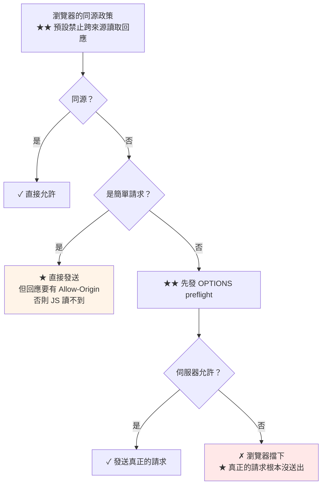

# 跨網域與 CORS 設定

> [!abstract] 這篇你會學到
> - **同源政策**與 CORS 的運作機制
> - **★★★ 簡單請求 vs 預檢請求**（preflight）
> - **Laravel 的 CORS 設定**（`config/cors.php`）
> - **Nginx 層的 CORS**（何時該用、何時不該）
> - **★★★ 六個經典的 CORS 錯誤**與解法
> - **preflight 最佳化**（減少往返）
> - **CORS 不是安全機制**（重要觀念）

## 前置知識

- [[01-前後端分離架構選型]] — 拓撲的選擇
- [[02-Laravel-API後端部署]] — API 設定

---

## 同源政策與 CORS ★★



```
★★ 「同源」的定義：★ 協定 + 主機 + 埠 三者【完全相同】

  https://app.gov.tw/a   與  https://app.gov.tw/b        ✓ 同源
  https://app.gov.tw     與  http://app.gov.tw           ✗ 協定不同
  https://app.gov.tw     與  https://api.gov.tw          ✗ 主機不同
  https://app.gov.tw     與  https://app.gov.tw:8443     ✗ 埠不同
  https://app.gov.tw     與  https://app.gov.tw:443      ✓ 同源（443 是預設埠）
```

> [!danger] CORS 是「放寬」而不是「保護」★★★
> ```
> ★★★ 極常見的誤解：
>   「加了 CORS 設定，我的 API 就安全了」 ← ✗✗ 完全相反
>
> ★★ 事實：
>   · 同源政策是【瀏覽器的保護機制】（預設禁止）
>   · CORS 是【放寬這個限制的方式】
>   · ★★★ CORS 【只對瀏覽器有效】
>     → curl、Postman、後端程式、爬蟲【完全不受 CORS 限制】
>
> ★★★ 所以：
>   ❌ 「我設了 CORS 只允許自己的網域，所以別人呼叫不到 API」
>      → ★ 錯！任何人都能用 curl 呼叫
>
>   ✅ 【真正的保護】是：
>      · 認證（Sanctum / OAuth）
>      · 授權（Policy / Gate）
>      · 限流
>      · 網路層限制（IP 白名單、防火牆）
>
> ★★ CORS 的實際作用：
>   防止【惡意網站】用【使用者的瀏覽器與 cookie】呼叫你的 API
>   → 這是防 CSRF 的一部分，不是 API 的存取控制
> ```

---

## ★★★ 簡單請求 vs 預檢請求

```
★★ 「簡單請求」的三個條件（★ 必須【全部】滿足）：

  ① 方法是 GET / HEAD / POST 其中之一

  ② ★★ 標頭只有以下這些（CORS-safelisted）：
       Accept
       Accept-Language
       Content-Language
       Content-Type（★ 但值有限制，見③）
       Range（有限制）
     ★★★ 任何【自訂標頭】都會觸發 preflight
       （X-Requested-With、X-XSRF-TOKEN、Authorization…）

  ③ ★★ Content-Type 只能是：
       application/x-www-form-urlencoded
       multipart/form-data
       text/plain
     ★★★ application/json 【不是】→ 會觸發 preflight

  ④ 沒有註冊 upload 的 progress 事件、沒有 ReadableStream body
```

```javascript
// ★ 簡單請求（★ 不會觸發 preflight）
fetch('https://api.gov.tw/data');                    // ✓ GET，無自訂標頭

fetch('https://api.gov.tw/data', {
  method: 'POST',
  headers: { 'Content-Type': 'application/x-www-form-urlencoded' },
  body: 'a=1&b=2',
});                                                   // ✓

// ★★ 觸發 preflight 的（★ 實務上幾乎都會）
fetch('https://api.gov.tw/data', {
  method: 'POST',
  headers: { 'Content-Type': 'application/json' },    // ★★★ 觸發
  body: JSON.stringify({ a: 1 }),
});

fetch('https://api.gov.tw/data', {
  headers: { 'Authorization': 'Bearer xxx' },         // ★★★ 自訂標頭 → 觸發
});

fetch('https://api.gov.tw/data', { method: 'DELETE' }); // ★★ 方法 → 觸發
```

```
★★★ 結論：
  現代的 SPA 幾乎【所有請求都會 preflight】
  → 因為都用 application/json + 自訂標頭
    → ★★ 每個請求多一次往返（★ 延遲加倍）
      → 這就是為什麼【同源部署】這麼有優勢
```

### preflight 的完整流程

```bash
# ═══ ① 瀏覽器先發 OPTIONS ═══
$ curl -i -X OPTIONS https://api.example.gov.tw/api/v1/orders \
    -H 'Origin: https://app.example.gov.tw' \
    -H 'Access-Control-Request-Method: POST' \
    -H 'Access-Control-Request-Headers: content-type,x-xsrf-token'

HTTP/2 204
access-control-allow-origin: https://app.example.gov.tw     # ★★ 必須
access-control-allow-methods: GET, POST, PUT, PATCH, DELETE, OPTIONS
access-control-allow-headers: Content-Type, X-XSRF-TOKEN, Authorization
access-control-allow-credentials: true                       # ★★ 用 cookie 時必須
access-control-max-age: 86400                                # ★★ 快取 preflight
vary: Origin                                                 # ★★★ 見下方

# ═══ ② 通過後才發真正的請求 ═══
$ curl -i -X POST https://api.example.gov.tw/api/v1/orders \
    -H 'Origin: https://app.example.gov.tw' \
    -H 'Content-Type: application/json' \
    -d '{"total": 100}'

HTTP/2 201
access-control-allow-origin: https://app.example.gov.tw      # ★★ 這裡也要
access-control-allow-credentials: true
```

> [!danger] `Vary: Origin` 是必須的 ★★★
> ```
> ★★ 若 API 回應會被快取（CDN、Nginx proxy_cache、瀏覽器）：
>
>   來源 A（https://app.gov.tw）請求 → 回應含
>     Access-Control-Allow-Origin: https://app.gov.tw
>   → ★★ 被快取
>
>   來源 B（https://other.gov.tw）請求同一個 URL
>   → ★★★ 拿到快取的回應（Allow-Origin 是 app.gov.tw）
>     → B 的請求被瀏覽器擋下（★ 或反過來造成資訊洩漏）
>
> ★★★ 解法：Vary: Origin
>   → 告訴快取「不同的 Origin 要分開快取」
>
> ★ Laravel 的 CORS middleware 會自動加
> ★★ 但如果你在 Nginx 手動設 CORS，一定要自己加：
>   add_header Vary Origin always;
> ```

---

## Laravel 的 CORS 設定 ★★

```php
<?php
// ★★★ config/cors.php
return [

    // ═══ ★★ 哪些路徑套用 CORS ═══
    'paths' => [
        'api/*',
        'sanctum/csrf-cookie',     // ★★ Sanctum SPA 認證必須
        'login',
        'logout',
        'register',
        'broadcasting/auth',       // ★ 若有用 WebSocket
    ],

    // ═══ 允許的方法 ═══
    'allowed_methods' => ['GET', 'POST', 'PUT', 'PATCH', 'DELETE', 'OPTIONS'],

    // ═══ ★★★ 允許的來源（★ 絕不要用 '*'）═══
    'allowed_origins' => array_filter([
        env('FRONTEND_URL'),                        // https://app.example.gov.tw
        env('FRONTEND_URL_STAGING'),                // ★ 可選
    ]),

    // ═══ ★ 正規表示式（★ 慎用）═══
    'allowed_origins_patterns' => array_filter([
        // ★★ 只在必要時用，且 pattern 要夠嚴格
        env('APP_ENV') !== 'production'
            ? '#^https://[a-z0-9-]+\.staging\.example\.gov\.tw$#'
            : null,
    ]),

    // ═══ ★★ 允許的請求標頭 ═══
    'allowed_headers' => [
        'Accept',
        'Content-Type',
        'X-Requested-With',
        'X-XSRF-TOKEN',            // ★★ Sanctum CSRF
        'X-CSRF-TOKEN',
        'Authorization',           // ★ Bearer token
        'X-Client-Version',        // ★ 自訂的
    ],
    // ★ 或用 ['*'] 允許所有（★ 但明確列出更好）

    // ═══ ★★ 讓前端 JS 能讀到的回應標頭 ═══
    'exposed_headers' => [
        'X-RateLimit-Limit',
        'X-RateLimit-Remaining',
        'Retry-After',
        'X-Total-Count',           // ★ 分頁總數
        'Content-Disposition',     // ★★ 檔案下載的檔名
    ],

    // ═══ ★★ preflight 的快取時間（秒）═══
    'max_age' => 86400,            // ★★ 一天（★ 大幅減少 OPTIONS 請求）

    // ═══ ★★★ 使用 cookie 認證時【必須】true ═══
    'supports_credentials' => true,
];
```

> [!danger] 六個經典的 CORS 錯誤 ★★★
> ```
> ═══ ① allowed_origins: ['*'] + supports_credentials: true ═══
>   ★★★ 瀏覽器【直接拒絕】（規範禁止的組合）
>   錯誤：The value of the 'Access-Control-Allow-Origin' header
>         must not be the wildcard '*' when credentials mode is 'include'
>   ✅ 明確列出來源
>
> ═══ ② 前端沒設 withCredentials ═══
>   ★★ 請求不帶 cookie → 一直 401
>   ✅ axios.create({ withCredentials: true })
>      或 fetch(url, { credentials: 'include' })
>
> ═══ ③ paths 沒包含 sanctum/csrf-cookie ═══
>   ★★ CSRF cookie 拿不到 → 419
>   ✅ 'paths' => ['api/*', 'sanctum/csrf-cookie', 'login']
>
> ═══ ④ 自訂標頭沒在 allowed_headers ═══
>   ★★ preflight 失敗
>   錯誤：Request header field X-XSRF-TOKEN is not allowed
>         by Access-Control-Allow-Headers
>   ✅ 加進 allowed_headers
>
> ═══ ⑤ ★★ Nginx 也設了 CORS（重複的標頭）═══
>   ★★★ Access-Control-Allow-Origin 出現【兩次】
>   錯誤：contains multiple values 'https://app.gov.tw, https://app.gov.tw'
>   ✅ ★★ 只在【一個地方】設（★ 建議在 Laravel）
>
> ═══ ⑥ ★★ OPTIONS 請求被認證 middleware 擋掉 ═══
>   ★★ preflight 回 401 → 真正的請求根本不會發出
>   ✅ CORS middleware 要在 auth 【之前】
>      Laravel 的 HandleCors 已經在最前面（★ 不要改順序）
> ```

```bash
# ★★★ 診斷：檢查回應標頭有沒有重複
$ curl -sI -X OPTIONS https://api.example.gov.tw/api/v1/orders \
    -H 'Origin: https://app.example.gov.tw' \
    -H 'Access-Control-Request-Method: POST' | \
  grep -ci 'access-control-allow-origin'
1                                      # ★★ 必須是 1（★ 2 就是重複設定了）
```

---

## Nginx 層的 CORS ★★

> [!warning] 什麼時候該在 Nginx 設 CORS ★★
> ```
> ★★ 大多數情況【不需要】—— 讓 Laravel 處理就好
>
> ★ 需要在 Nginx 設的情況：
>   ① 靜態檔案的 CORS（字型、圖片、下載）
>      → ★ 那些請求不會經過 PHP
>   ② API Gateway 或純代理的場景
>   ③ ★ 想在 PHP 之前就擋掉 preflight（節省 PHP 資源）
>
> ★★★ 絕對不要【兩邊都設】
>   → Access-Control-Allow-Origin 會出現兩次
>     → 瀏覽器報 "contains multiple values" 並拒絕
> ```

```nginx
# ═══════ ★★ 靜態檔案的 CORS（字型、下載）═══════
map $http_origin $cors_origin {
    default "";
    # ★★ 白名單
    "https://app.example.gov.tw"      $http_origin;
    "https://staging.example.gov.tw"  $http_origin;
}

server {
    # ...

    # ★★ 字型檔的 CORS（★ 跨網域載入字型必須）
    location ~* \.(woff2?|ttf|otf|eot)$ {
        try_files $uri =404;
        add_header Access-Control-Allow-Origin $cors_origin always;
        add_header Vary Origin always;                   # ★★★
        expires 1y;
        add_header Cache-Control "public, max-age=31536000, immutable";
        add_header X-Content-Type-Options "nosniff" always;
    }

    # ★ 下載的檔案（要讓前端讀到檔名）
    location ^~ /downloads/ {
        add_header Access-Control-Allow-Origin  $cors_origin always;
        add_header Access-Control-Expose-Headers "Content-Disposition" always;
        add_header Vary Origin always;
        try_files $uri =404;
    }
}
```

```nginx
# ═══════ ★ 純代理場景的完整 CORS（★ Laravel 不處理時才用）═══════
map $http_origin $cors_origin {
    default "";
    "~^https://(app|staging)\.example\.gov\.tw$" $http_origin;
}

location ^~ /api/ {
    # ═══ ★★ preflight 直接回應（★ 不進 PHP，省資源）═══
    if ($request_method = OPTIONS) {
        add_header Access-Control-Allow-Origin      $cors_origin always;
        add_header Access-Control-Allow-Methods     "GET, POST, PUT, PATCH, DELETE, OPTIONS" always;
        add_header Access-Control-Allow-Headers     "Accept, Content-Type, X-Requested-With, X-XSRF-TOKEN, Authorization" always;
        add_header Access-Control-Allow-Credentials "true" always;
        add_header Access-Control-Max-Age           86400 always;
        add_header Vary                             Origin always;      # ★★★
        add_header Content-Length 0;
        add_header Content-Type "text/plain";
        return 204;
    }

    # ═══ 一般請求 ═══
    add_header Access-Control-Allow-Origin      $cors_origin always;
    add_header Access-Control-Allow-Credentials "true" always;
    add_header Access-Control-Expose-Headers    "X-RateLimit-Limit, X-RateLimit-Remaining, Content-Disposition" always;
    add_header Vary Origin always;

    proxy_pass http://127.0.0.1:9000;
    proxy_set_header Host              $host;
    proxy_set_header X-Real-IP         $remote_addr;
    proxy_set_header X-Forwarded-For   $proxy_add_x_forwarded_for;
    proxy_set_header X-Forwarded-Proto $scheme;
}
```

> [!danger] Nginx 的 `if` 與 `add_header` 的坑 ★★★
> ```
> ① ★★★ if 區塊裡的 add_header 會【覆蓋】外面的
>      → 這正是為什麼上面的 OPTIONS 區塊要【重複所有標頭】
>
> ② ★★ add_header 只在 2xx/3xx 回應時生效（★ 除非加 always）
>      → ★★★ 一定要加 always
>        → 否則 4xx/5xx 的回應沒有 CORS 標頭
>          → ★ 前端看到的是「CORS 錯誤」而不是真正的 401/500
>            → 極難除錯
>
> ③ ★★ if 在 location 中是「邪惡的」（IfIsEvil）
>      → 盡量用 map 與 try_files 取代
>      → ★ 但 OPTIONS 的處理是少數合理的用法
>
> ④ ★★★ map 的預設值是空字串
>      → 不在白名單的 Origin → add_header 的值是空的
>        → ★ Nginx 會【不輸出這個標頭】（正確的行為）
> ```

```bash
# ★★★ 驗證錯誤回應也有 CORS 標頭
$ curl -sI https://api.example.gov.tw/api/v1/orders \
    -H 'Origin: https://app.example.gov.tw' | grep -i access-control
# ★ 200 時有

$ curl -sI https://api.example.gov.tw/api/v1/nonexistent \
    -H 'Origin: https://app.example.gov.tw' | grep -i access-control
# ★★ 404 時【也要有】—— 否則前端看到的是 CORS 錯誤而不是 404
```

---

## preflight 最佳化 ★★

```
★★ preflight 的成本：
  每個非簡單請求 = ★ 2 次網路往返（OPTIONS + 實際請求）
  → 內網 RTT 1ms → 影響小
  → ★★ 跨機房或行動網路 RTT 100ms → 【每個請求多 100ms】
```

```php
<?php
// ★★★ ① 提高 max_age（最有效）
'max_age' => 86400,        // ★★ 一天
// ★ 瀏覽器會快取 preflight 的結果
// ★★ 注意：Chrome 的上限是 7200 秒（2 小時），Firefox 是 86400
```

```javascript
// ★★ ② 減少自訂標頭
// ❌ 每個請求都帶不必要的自訂標頭
api.defaults.headers.common['X-Client-Version'] = '1.0.0';
api.defaults.headers.common['X-Request-Id'] = uuid();

// ✅ ★ 只在需要的請求上帶
// ★ 或改用 query string / body 傳遞
```

```javascript
// ★★★ ③ 最有效的做法：改用同源部署
// → ★★ 完全沒有 preflight
```

```bash
# ★★ 觀察 preflight 的數量
$ awk '$6 == "\"OPTIONS"' /var/log/nginx/api.access.log | wc -l
$ awk '{print $6}' /var/log/nginx/api.access.log | sort | uniq -c | sort -rn
   8421 "GET
   3211 "POST
   ★ 2104 "OPTIONS        # ★★ 若 OPTIONS 佔比很高 → max_age 沒生效

# ★ 計算比例
$ awk '{m[$6]++} END {t=0; for(k in m) t+=m[k];
    printf "OPTIONS 佔 %.1f%%\n", m["\"OPTIONS"]/t*100}' /var/log/nginx/api.access.log
```

```nginx
# ★ OPTIONS 不要記進 access log（★ 減少日誌量）
map $request_method $loggable {
    default 1;
    OPTIONS 0;
}
access_log /var/log/nginx/api.access.log combined if=$loggable;
```

---

## 完整實戰範例：CORS 診斷腳本

```bash
#!/usr/bin/env bash
# /usr/local/bin/cors-doctor —— CORS 設定診斷
# 用法：cors-doctor <API網址> <前端Origin> [路徑]
set -uo pipefail

API="${1:?用法: cors-doctor <API網址> <前端Origin> [路徑]}"
ORIGIN="${2:?}"
PATH_="${3:-/api/v1/user}"

PASS=0; FAIL=0
p(){ printf '  \033[32m✓\033[0m %s\n' "$1"; PASS=$((PASS+1)); }
f(){ printf '  \033[31m✗✗\033[0m %s\n' "$1"; FAIL=$((FAIL+1)); }
w(){ printf '  \033[33m⚠\033[0m %s\n' "$1"; }

echo "═══ CORS 診斷 ═══"
echo "  API    ：$API$PATH_"
echo "  Origin ：$ORIGIN"

# ★ 判斷是否同源
AH=$(echo "$API" | sed 's|https\?://||;s|[:/].*||')
OH=$(echo "$ORIGIN" | sed 's|https\?://||;s|[:/].*||')
if [ "$AH" = "$OH" ]; then
    echo -e "\n  \033[32m★★ 同源 —— 不需要 CORS\033[0m"
    echo "  （這是最佳的架構，本診斷的其餘項目可略過）"
fi

# ═══ 【1】★★★ Preflight ═══
echo -e "\n【1】★★★ Preflight（OPTIONS）"
PRE=$(curl -sikD - -X OPTIONS "$API$PATH_" \
      -H "Origin: $ORIGIN" \
      -H 'Access-Control-Request-Method: POST' \
      -H 'Access-Control-Request-Headers: content-type,x-xsrf-token,authorization' \
      --max-time 15 -o /dev/null 2>/dev/null)

STATUS=$(echo "$PRE" | head -1 | awk '{print $2}')
echo "      HTTP $STATUS"
echo "$PRE" | grep -i '^access-control' | sed 's/^/      /'

case "$STATUS" in
  200|204) p "preflight 回應 $STATUS" ;;
  401|403) f "★★★ preflight 被認證擋掉（$STATUS）—— CORS middleware 順序錯誤" ;;
  404)     f "★★ preflight 404 —— 路徑不在 cors.php 的 paths 中？" ;;
  405)     f "★★ 不接受 OPTIONS 方法" ;;
  *)       f "preflight 回應異常（$STATUS）" ;;
esac

# ★★ Allow-Origin
AO=$(echo "$PRE" | grep -i '^access-control-allow-origin:' | \
     sed 's/.*: *//' | tr -d '\r' | head -1)
NAO=$(echo "$PRE" | grep -ci '^access-control-allow-origin:')
if [ "$NAO" -gt 1 ]; then
    f "★★★ Allow-Origin 出現 $NAO 次（Nginx 與 Laravel 都設了？）"
elif [ "$AO" = "$ORIGIN" ]; then
    p "★★ Allow-Origin = $AO"
elif [ "$AO" = "*" ]; then
    w "★★ Allow-Origin = *（★ 無法與 credentials 併用）"
elif [ -z "$AO" ]; then
    f "★★★ 沒有 Allow-Origin —— Origin 不在白名單中"
else
    f "★★ Allow-Origin = $AO（與請求的 Origin 不符）"
fi

# ★★ Allow-Credentials
AC=$(echo "$PRE" | grep -i '^access-control-allow-credentials:' | sed 's/.*: *//' | tr -d '\r')
if [ "$AC" = "true" ]; then
    p "★★ Allow-Credentials = true"
    [ "$AO" = "*" ] && f "★★★★ '*' + credentials=true —— 瀏覽器會直接拒絕"
else
    w "Allow-Credentials 不是 true（★ 用 cookie 認證時必須）"
fi

# ★★ Allow-Headers
AHDR=$(echo "$PRE" | grep -i '^access-control-allow-headers:' | sed 's/.*: *//' | tr -d '\r')
for h in content-type x-xsrf-token authorization; do
    if echo "$AHDR" | tr 'A-Z' 'a-z' | grep -q "$h" || echo "$AHDR" | grep -q '\*'; then
        p "允許標頭 $h"
    else
        f "★★ 標頭 $h 不被允許（實際：$AHDR）"
    fi
done

# ★★ Max-Age
MA=$(echo "$PRE" | grep -i '^access-control-max-age:' | sed 's/.*: *//' | tr -d '\r')
if [ -n "$MA" ] && [ "$MA" -ge 600 ] 2>/dev/null; then
    p "★★ Max-Age = ${MA}s（preflight 會被快取）"
else
    w "★ Max-Age = ${MA:-未設定}（建議 ≥ 600，減少 preflight 往返）"
fi

# ★★★ Vary
echo "$PRE" | grep -qi '^vary:.*origin' && p "★★★ Vary: Origin（快取安全）" || \
  f "★★★ 沒有 Vary: Origin —— 有 CDN/快取時會造成問題"

# ═══ 【2】★★ 實際請求 ═══
echo -e "\n【2】★★ 實際請求（GET）"
REQ=$(curl -sikD - "$API$PATH_" -H "Origin: $ORIGIN" --max-time 15 -o /dev/null 2>/dev/null)
S2=$(echo "$REQ" | head -1 | awk '{print $2}')
echo "      HTTP $S2"
echo "$REQ" | grep -i '^access-control' | sed 's/^/      /'

echo "$REQ" | grep -qi '^access-control-allow-origin' && \
  p "★★ 實際回應有 Allow-Origin" || \
  f "★★★ 實際回應沒有 Allow-Origin（★ preflight 過了但實際請求沒有 → JS 讀不到）"

# ═══ 【3】★★★ 錯誤回應也要有 CORS ═══
echo -e "\n【3】★★★ 錯誤回應的 CORS"
ERR=$(curl -sikD - "$API/api/v1/__definitely_not_exist__" \
      -H "Origin: $ORIGIN" --max-time 10 -o /dev/null 2>/dev/null)
S3=$(echo "$ERR" | head -1 | awk '{print $2}')
if echo "$ERR" | grep -qi '^access-control-allow-origin'; then
    p "★★ $S3 錯誤回應也有 CORS 標頭"
else
    f "★★★ $S3 錯誤回應【沒有】CORS 標頭"
    echo "      → 前端會看到 CORS 錯誤而不是真正的 $S3"
    echo "      → Nginx 的 add_header 要加 always"
fi

# ═══ 【4】★★ 惡意 Origin 測試 ═══
echo -e "\n【4】★★ 惡意 Origin"
for evil in "https://evil.com" "null" "https://app.example.gov.tw.evil.com" \
            "http://$OH"; do
    R=$(curl -sI -X OPTIONS "$API$PATH_" -H "Origin: $evil" \
        -H 'Access-Control-Request-Method: GET' --max-time 10 2>/dev/null | \
        grep -i '^access-control-allow-origin:' | sed 's/.*: *//' | tr -d '\r')
    if [ -z "$R" ]; then
        p "拒絕 $evil"
    elif [ "$R" = "*" ]; then
        f "★★★ $evil 得到 '*'"
    else
        f "★★★ $evil 被允許（回應：$R）"
    fi
done

# ═══ 【5】Sanctum 端點 ═══
echo -e "\n【5】★★ Sanctum CSRF 端點"
CS=$(curl -sikD - "$API/sanctum/csrf-cookie" -H "Origin: $ORIGIN" --max-time 10 -o /dev/null 2>/dev/null)
echo "$CS" | grep -qi '^access-control-allow-origin' && \
  p "★★ /sanctum/csrf-cookie 有 CORS" || \
  f "★★★ /sanctum/csrf-cookie 沒有 CORS（★ paths 要包含它）"
echo "$CS" | grep -qi 'set-cookie:.*XSRF-TOKEN' && \
  p "★★ 有設定 XSRF-TOKEN cookie" || f "★★ 沒有設定 XSRF-TOKEN"

echo -e "\n═══ ✓ $PASS  ✗ $FAIL ═══"

[ "$FAIL" -gt 0 ] && cat <<'EOF'

  ── 常見修正 ──
  ① Allow-Origin 是 '*' 且用 credentials
     → config/cors.php: 'allowed_origins' => [env('FRONTEND_URL')]

  ② 標頭出現兩次
     → ★★ 只在【一個地方】設 CORS（建議 Laravel）
     → 移除 Nginx 的 add_header Access-Control-*

  ③ 錯誤回應沒有 CORS
     → Nginx 的 add_header 加 always
     → 或改用 Laravel 的 CORS middleware（自動處理）

  ④ preflight 401/403
     → CORS middleware 必須在 auth 之前
     → Laravel 的 HandleCors 已在最前面，不要改順序

  ⑤ 沒有 Vary: Origin
     → Laravel 會自動加；Nginx 手動設時要自己加
EOF

exit "$FAIL"
```

```bash
$ cors-doctor https://api.example.gov.tw https://app.example.gov.tw
$ cors-doctor https://api.example.gov.tw https://app.example.gov.tw /api/v1/orders
```

---

## 常見錯誤與排錯

| Console 的錯誤訊息 | 原因 | 解法 |
| --- | --- | --- |
| **`No 'Access-Control-Allow-Origin' header`** ★★★ | Origin 不在白名單 | 加進 `allowed_origins` |
| **`must not be the wildcard '*'`** ★★★★ | `'*'` + credentials | 明確列出來源 |
| **`contains multiple values`** ★★★ | Nginx 與 Laravel 都設了 | **只在一個地方設** |
| **`Request header field X is not allowed`** ★★ | 自訂標頭沒列 | 加進 `allowed_headers` |
| **`Method PUT is not allowed`** ★ | 方法沒列 | 加進 `allowed_methods` |
| **`Response to preflight has HTTP status 401`** ★★★ | OPTIONS 被認證擋 | CORS middleware 要在 auth 前 |
| `Response to preflight has HTTP status 404` ★★ | 路徑不在 `paths` | 加進 `config/cors.php` 的 `paths` |
| **`Credentials mode 'include'` 但沒有 credentials** ★★ | `supports_credentials: false` | 設 `true` |
| **看到 CORS 錯誤而不是 401/500** ★★★ | 錯誤回應沒有 CORS 標頭 | `add_header ... always` |
| CDN 快取造成 CORS 錯誤 ★★ | 沒有 `Vary: Origin` | 加上 |
| **每個請求都有 OPTIONS** ★ | `max_age` 太小 | 設 86400 |
| 讀不到自訂的回應標頭 ★ | 沒有 `exposed_headers` | 加進去 |

### 排查

```bash
API=https://api.example.gov.tw
ORIGIN=https://app.example.gov.tw

# 【1】★★★ 完整的 preflight
$ curl -i -X OPTIONS "$API/api/v1/orders" \
    -H "Origin: $ORIGIN" \
    -H 'Access-Control-Request-Method: POST' \
    -H 'Access-Control-Request-Headers: content-type,x-xsrf-token'

# 【2】★★★ 檢查標頭有沒有重複
$ curl -sI -X OPTIONS "$API/api/v1/orders" -H "Origin: $ORIGIN" \
    -H 'Access-Control-Request-Method: POST' | grep -ci access-control-allow-origin
1                                      # ★★ 必須是 1

# 【3】★★ 錯誤回應
$ curl -sI "$API/api/v1/nope" -H "Origin: $ORIGIN" | grep -i access-control
# ★★ 404 時也要有

# 【4】★ 惡意 Origin
$ curl -sI -X OPTIONS "$API/api/v1/orders" -H 'Origin: https://evil.com' \
    -H 'Access-Control-Request-Method: GET' | grep -i access-control-allow-origin
# ★ 應該沒有輸出

# 【5】Laravel 設定
$ php artisan config:show cors

# 【6】★★ Nginx 有沒有也設了
$ sudo nginx -T 2>/dev/null | grep -i 'access-control'

# 【7】★ 統計 OPTIONS 的比例
$ awk '{m[$6]++} END {t=0; for(k in m) t+=m[k];
    printf "OPTIONS 佔 %.1f%%\n", m["\"OPTIONS"]/t*100}' /var/log/nginx/api.access.log

# 【8】瀏覽器端
# ★ F12 → Network → 勾選 "Disable cache"
# ★★ 看有沒有 OPTIONS 請求，以及它的回應標頭
```

---

## 安全性注意事項

> [!danger] CORS 設定的三條紅線 ★★★
> ```
> ① ★★★★ 不要用 allowed_origins: ['*']
>      → 就算不用 credentials，'*' 也代表【任何網站都能讀取你的 API 回應】
>      → ★ 惡意網站可以用使用者的瀏覽器讀取（雖然不帶 cookie）
>      → 若 API 依 IP 授權（內網）→ ★★ 惡意網站能用員工的瀏覽器當跳板
>
> ② ★★★ allowed_origins_patterns 要夠嚴格
>      ❌ '#^https://.*\.example\.gov\.tw$#'
>         → ★★ 任何子網域都可以（★ 若有使用者可控的子網域就完蛋）
>      ❌ '#example\.gov\.tw#'
>         → ★★★ 沒有錨點！https://app.example.gov.tw.evil.com 會通過
>      ✅ '#^https://(app|staging)\.example\.gov\.tw$#'
>         → ★ 有 ^ 與 $ 錨點，且明確列出子網域
>
> ③ ★★ 不要把 Origin 直接反射回去
>      ❌ add_header Access-Control-Allow-Origin $http_origin;   （★ 無條件）
>      → ★★★ 等於允許所有來源，而且能與 credentials 併用
>        → 比 '*' 更危險
>      ✅ 用 map 做白名單
> ```

```bash
# ★★★ 測試 pattern 的嚴格性
$ for o in \
    "https://app.example.gov.tw" \
    "https://app.example.gov.tw.evil.com" \
    "https://evil.com/?x=example.gov.tw" \
    "https://example.gov.tw.evil.com" \
    "http://app.example.gov.tw" \
    "null"; do
    R=$(curl -sI -X OPTIONS "$API/api/v1/user" -H "Origin: $o" \
        -H 'Access-Control-Request-Method: GET' 2>/dev/null | \
        grep -i 'allow-origin' | sed 's/.*: *//' | tr -d '\r')
    printf '  %-48s → %s\n' "$o" "${R:-（拒絕）}"
  done
```

> [!warning] `Origin: null` 的處理 ★★
> ```
> ★★ 什麼時候會出現 Origin: null：
>   · 從 file:// 開啟的頁面
>   · sandbox 的 iframe
>   · ★ 某些轉址情況
>   · data: URL
>
> ★★★ 絕對不要允許 null
>   'allowed_origins' => ['null']     ← ✗✗✗
>   → ★ 攻擊者可以用 sandbox iframe 產生 null origin
>     → 繞過你的白名單
> ```

---

## 速查表

### ★★★ CORS 不是安全機制

```
★★★ CORS 【只對瀏覽器有效】
   → curl / Postman / 後端程式 / 爬蟲【完全不受限制】

★★ 真正的保護：認證 + 授權 + 限流 + 網路層限制
★  CORS 的作用：防止惡意網站用【使用者的瀏覽器與 cookie】呼叫你的 API
```

### 簡單請求 vs preflight

```
★★ 簡單請求（不 preflight）：
  · GET / HEAD / POST
  · 標頭只有 Accept / Accept-Language / Content-Language / Content-Type
  · Content-Type 只能是 form-urlencoded / multipart / text-plain

★★★ 會 preflight 的（現代 SPA 幾乎都是）：
  · application/json          ← ★★ 最常見
  · 任何自訂標頭（Authorization、X-XSRF-TOKEN…）
  · PUT / PATCH / DELETE
```

### ★★★ Laravel 設定

```php
// config/cors.php
'paths' => ['api/*', 'sanctum/csrf-cookie', 'login', 'logout'],
'allowed_origins' => [env('FRONTEND_URL')],       // ★★★ 不能是 '*'
'allowed_headers' => ['Accept','Content-Type','X-XSRF-TOKEN','Authorization'],
'exposed_headers' => ['X-RateLimit-Limit','Content-Disposition'],
'max_age' => 86400,                                // ★★ 減少 preflight
'supports_credentials' => true,                    // ★★★ cookie 認證必須
```

```typescript
axios.create({ withCredentials: true })            // ★★★ 前端必須
```

### ★★★ 六個經典錯誤

```
① '*' + credentials              → 瀏覽器直接拒絕
② 前端沒設 withCredentials       → 一直 401
③ paths 沒含 sanctum/csrf-cookie → 419
④ 自訂標頭沒在 allowed_headers   → preflight 失敗
⑤ ★★ Nginx 與 Laravel 都設      → contains multiple values
⑥ ★★ OPTIONS 被 auth 擋掉        → preflight 401
```

### Nginx 的 CORS（★ 只在必要時）

```nginx
map $http_origin $cors_origin {
    default "";
    "~^https://(app|staging)\.example\.gov\.tw$" $http_origin;   # ★ 有錨點
}

location ~* \.(woff2?|ttf)$ {
    add_header Access-Control-Allow-Origin $cors_origin always;  # ★★ always
    add_header Vary Origin always;                                # ★★★
}
```

```
★★★ 三個要點：
  ① always（否則 4xx/5xx 沒有 CORS 標頭 → 前端看到 CORS 錯誤）
  ② Vary: Origin（有快取時必須）
  ③ ★★ 不要與 Laravel 重複設定
```

### ★★★ 三條安全紅線

```
① 不用 '*'
② pattern 要有 ^ 與 $ 錨點，且明確列出子網域
③ 不要無條件反射 $http_origin（比 '*' 更危險）
★ 絕對不允許 Origin: null
```

### 診斷

```bash
curl -i -X OPTIONS https://api/api/v1/x \
  -H "Origin: https://app.example.gov.tw" \
  -H 'Access-Control-Request-Method: POST' \
  -H 'Access-Control-Request-Headers: content-type'

# ★★ 標頭重複檢查（必須是 1）
curl -sI -X OPTIONS ... | grep -ci access-control-allow-origin

# ★★ 錯誤回應也要有
curl -sI https://api/api/v1/nope -H "Origin: ..." | grep -i access-control

# ★ 惡意 Origin
curl -sI -X OPTIONS ... -H 'Origin: https://evil.com' | grep -i allow-origin

cors-doctor https://api.example.gov.tw https://app.example.gov.tw
```

---

## 練習題

> [!question]- 練習 1：preflight 的觸發條件 ★★
> 用 F12 的 Network 面板觀察：
> 1. `fetch(url)` → **有 OPTIONS 嗎？**
> 2. `fetch(url, { headers: { 'Content-Type': 'application/json' } })` → 呢？
> 3. 加上 `Authorization` 標頭 → 呢？
> 4. 用 `Content-Type: text/plain` → 呢？
> 5. `method: 'DELETE'` → 呢？
> 6. **整理出「什麼情況會 preflight」的表**

> [!question]- 練習 2：六個經典錯誤 ★★★
> 逐一製造並記錄 Console 的錯誤訊息：
> 1. `allowed_origins: ['*']` + `supports_credentials: true`
> 2. 前端 `withCredentials: false`
> 3. `paths` 拿掉 `sanctum/csrf-cookie`
> 4. `allowed_headers` 拿掉 `X-XSRF-TOKEN`
> 5. **Nginx 與 Laravel 都設 CORS**
> 6. 把 CORS middleware 移到 auth 之後
> 7. **每一個的錯誤訊息都不一樣 —— 記下來**

> [!question]- 練習 3：錯誤回應的 CORS ★★★
> 1. 在 Nginx 設 CORS 但**不加 `always`**
> 2. 讓 API 回傳 404 → 前端 Console 顯示什麼？
> 3. **是 CORS 錯誤還是 404？**
> 4. 加上 `always` → 再測
> 5. **改用 Laravel 的 CORS middleware** → 需要處理這個問題嗎？
> 6. **寫下為什麼「看到 CORS 錯誤而不是真正的錯誤」這麼難除錯**

> [!question]- 練習 4：pattern 的安全性 ★★★
> 1. 設 `'#example\.gov\.tw#'`（**沒有錨點**）
> 2. 用 `Origin: https://app.example.gov.tw.evil.com` 測試 → **被允許了嗎？**
> 3. 用 `Origin: https://evil.com/?x=example.gov.tw` → 呢？
> 4. 改成 `'#^https://(app|staging)\.example\.gov\.tw$#'`
> 5. 重複測試
> 6. **測試 `Origin: null`**

> [!question]- 練習 5：preflight 最佳化
> 1. 設 `max_age: 0`，用 F12 觀察 10 個請求 → **有幾個 OPTIONS？**
> 2. 設 `max_age: 86400` → 再測
> 3. 統計 access log 的 OPTIONS 比例
> 4. **改成同源部署** → 還有 OPTIONS 嗎？
> 5. 測量三種情況的**平均回應時間**

---

## 小測驗

Q1. **「同源」的定義是什麼**？

Q2. **CORS 是安全機制嗎？為什麼**？

Q3. **什麼情況會觸發 preflight？為什麼現代 SPA 幾乎都會**？

Q4. **`Vary: Origin` 的作用是什麼**？

Q5. **`allowed_origins: ['*']` + `supports_credentials: true` 為什麼無效**？

Q6. **Nginx 的 `add_header` 為什麼一定要加 `always`**？

Q7. **為什麼不能在 Nginx 與 Laravel 都設 CORS**？

Q8. **preflight 回傳 401 是什麼原因**？

Q9. **`allowed_origins_patterns` 沒有錨點會有什麼風險**？

Q10. **無條件反射 `$http_origin` 為什麼比 `'*'` 更危險**？

> [!question]- 測驗答案
> **Q1.** **「同源」= 協定（scheme）+ 主機（host）+ 埠（port）三者完全相同**。
> ```
> https://app.gov.tw/a  與  https://app.gov.tw/b       ✓ 同源（路徑不影響）
> https://app.gov.tw    與  http://app.gov.tw          ✗ 協定不同
> https://app.gov.tw    與  https://api.gov.tw         ✗ 主機不同
> https://app.gov.tw    與  https://app.gov.tw:8443    ✗ 埠不同
> https://app.gov.tw    與  https://app.gov.tw:443     ✓ 同源（443 是 https 的預設埠）
> ```
> **注意子網域也算不同源** —— `app.gov.tw` 與 `api.gov.tw` 需要 CORS。
> 這就是為什麼「同源子路徑」部署（`app.gov.tw/` + `app.gov.tw/api/`）
> 可以完全避開 CORS。
>
> **Q2.** **不是。CORS 是「放寬」同源政策的機制，不是保護機制**。
> **正確的理解**：
> **同源政策是瀏覽器的保護機制**（預設禁止跨來源讀取回應），
> **CORS 是伺服器告訴瀏覽器「這些來源可以讀」的方式**。
> **關鍵事實**：**CORS 只對瀏覽器有效** ——
> **`curl`、Postman、後端程式、爬蟲完全不受 CORS 限制**。
> **所以「我設了 CORS 只允許自己的網域，所以別人呼叫不到 API」是錯的** ——
> 任何人都能用 `curl` 呼叫。
> **真正的保護**是：認證（Sanctum/OAuth）、授權（Policy/Gate）、
> 限流、網路層限制（IP 白名單）。
> **CORS 的實際作用**：防止**惡意網站**用**使用者的瀏覽器與 cookie**
> 呼叫你的 API（這是防 CSRF 的一環）。
>
> **Q3.** **不滿足「簡單請求」三個條件的任何一項就會 preflight**：
> ①方法不是 GET/HEAD/POST；
> ②**有任何自訂標頭**（`Authorization`、`X-XSRF-TOKEN`、`X-Requested-With`…）；
> ③**`Content-Type` 不是 `form-urlencoded` / `multipart/form-data` / `text/plain`**。
> **現代 SPA 幾乎都會 preflight 的原因**：
> **`Content-Type: application/json` 就不在簡單請求的允許清單中**，
> 而且通常還會帶 `Authorization` 或 `X-XSRF-TOKEN` 標頭。
> **後果**：**每個請求都要 2 次網路往返**（OPTIONS + 實際請求）——
> 內網 RTT 1ms 影響小，但**跨機房或行動網路 RTT 100ms 時，每個請求多 100ms**。
> **這就是同源部署的最大優勢**。
>
> **Q4.** **`Vary: Origin` 告訴快取（CDN、Nginx proxy_cache、瀏覽器）
> 「不同的 Origin 要分開快取」**。
> **沒有它的問題**：
> 來源 A 請求 → 回應含 `Access-Control-Allow-Origin: https://a.gov.tw` → **被快取**；
> 來源 B 請求同一個 URL → **拿到快取的回應**（Allow-Origin 是 A）→
> **B 的請求被瀏覽器擋下**；
> 反過來如果快取的是允許 B 的版本，**A 也可能拿到不該有的回應**（資訊洩漏）。
> **Laravel 的 CORS middleware 會自動加 `Vary: Origin`**，
> **但在 Nginx 手動設 CORS 時一定要自己加**：
> `add_header Vary Origin always;`
>
> **Q5.** 因為**瀏覽器的 CORS 規範明確禁止這個組合**，
> 會直接拒絕回應並顯示：
> ```
> The value of the 'Access-Control-Allow-Origin' header in the response
> must not be the wildcard '*' when the request's credentials mode is 'include'.
> ```
> **規範這樣設計的原因**：
> `*` 表示「任何網站都可以讀取這個回應」，
> credentials 表示「請求會帶上使用者的 cookie」——
> 兩者合起來就是**「任何惡意網站都能用使用者的身分讀取你的 API」**，
> 這是災難級的漏洞。
> **正確做法**：`'allowed_origins' => [env('FRONTEND_URL')]` ——
> Laravel 的 CORS middleware 會**動態回傳實際的 Origin**（若在白名單中）。
>
> **Q6.** 因為 **Nginx 的 `add_header` 預設只在 2xx 與 3xx 回應時生效**。
> **沒有 `always` 的後果**：
> **4xx 與 5xx 的回應完全沒有 CORS 標頭** →
> 前端在 Console 看到的是**「CORS 錯誤」而不是真正的 401/404/500** →
> **極難除錯**（開發者會一直在調 CORS 設定，
> 但真正的問題是認證失敗或伺服器錯誤）。
> ```nginx
> add_header Access-Control-Allow-Origin $cors_origin always;   # ★★
> ```
> **這也是建議「讓 Laravel 處理 CORS」的原因之一** ——
> Laravel 的 CORS middleware 會**自動處理所有狀態碼的回應**。
>
> **Q7.** 因為 **`Access-Control-Allow-Origin` 標頭會出現兩次**，
> 瀏覽器會報錯並拒絕：
> ```
> The 'Access-Control-Allow-Origin' header contains multiple values
> 'https://app.gov.tw, https://app.gov.tw', but only one is allowed.
> ```
> **注意即使兩個值一模一樣也會失敗** —— 規範要求「只能有一個」。
> **解法**：**只在一個地方設定**。
> **建議在 Laravel**（`config/cors.php`）——
> 因為它會自動處理所有狀態碼、自動加 `Vary: Origin`、
> 而且設定集中在程式碼裡（跟著版控走）。
> **例外**：靜態檔案（字型、下載）不經過 PHP，那些才需要在 Nginx 設。
> **檢查方式**：`curl -sI ... | grep -ci access-control-allow-origin`（必須是 1）。
>
> **Q8.** **CORS middleware 的順序在認證 middleware 之後**。
> **preflight 的 OPTIONS 請求不會帶認證資訊**（瀏覽器不會附加 cookie 或 Authorization），
> 所以如果認證 middleware 先執行，就會回 **401** →
> **瀏覽器認為 preflight 失敗，真正的請求根本不會發出**。
> **Laravel 的 `HandleCors` middleware 已經在全域 middleware 堆疊的最前面**，
> 所以**不要去改它的順序**。
> 如果是在 Nginx 或其他反向代理層做認證（例如 Basic Auth、mTLS），
> 也要**讓 OPTIONS 請求繞過認證**：
> ```nginx
> if ($request_method = OPTIONS) { return 204; }   # ★ 在認證之前
> ```
>
> **Q9.** **沒有 `^` 與 `$` 錨點的正規表示式是「部分比對」**，
> 攻擊者可以構造出通過比對但完全不同的網域：
> ```php
> '#example\.gov\.tw#'          // ❌ 沒有錨點
> ```
> **會通過的惡意 Origin**：
> **`https://app.example.gov.tw.evil.com`**（把你的網域當成子網域前綴）、
> **`https://evil.com/?x=example.gov.tw`**（放在 query string 裡）、
> `https://example.gov.tw.attacker.net`。
> **正確寫法**：
> ```php
> '#^https://(app|staging)\.example\.gov\.tw$#'
> ```
> **要有 `^` 開頭錨點、`$` 結尾錨點、明確列出允許的子網域、指定 `https`**。
> **另一個常見錯誤**：`'#^https://.*\.example\.gov\.tw$#'` ——
> 允許**任何**子網域，如果有使用者可控的子網域就有風險。
>
> **Q10.** ```nginx
> add_header Access-Control-Allow-Origin $http_origin;   # ❌ 無條件反射
> ```
> **這等於「允許所有來源」，但比 `'*'` 更危險**，原因是：
> **`'*'` 無法與 `credentials` 併用**（瀏覽器會拒絕），
> 所以用 `'*'` 時至少 cookie 不會被送出；
> **但反射 `$http_origin` 回傳的是「具體的 Origin 值」**，
> **完全可以與 `Access-Control-Allow-Credentials: true` 併用** →
> **任何惡意網站都能用使用者的 cookie 呼叫你的 API 並讀取回應** →
> 這等同於完全繞過同源政策的保護。
> **正確做法是用 `map` 做白名單**：
> ```nginx
> map $http_origin $cors_origin {
>     default "";
>     "~^https://(app|staging)\.example\.gov\.tw$" $http_origin;
> }
> ```
> 不在白名單時值是空字串，**Nginx 就不會輸出這個標頭**（正確的行為）。

---

## 延伸閱讀

- [[04-認證串接-Sanctum與JWT]] — 認證與 CORS 的互動
- [[05-Nginx-前後端流量分流設定]] — Nginx 的分流
- [[09-前後端分離常見問題排查]] — 完整的問題排查
- [[01-前後端分離架構選型]] — 用同源避開 CORS
- [[02-Laravel-API後端部署]] — API 的完整設定
- [[09-應用層安全]] — CORS 與 CSRF 的關係
